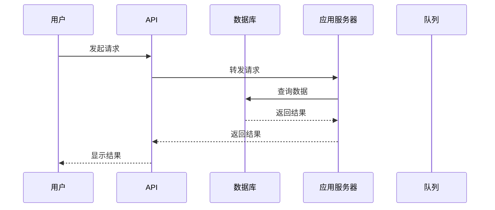
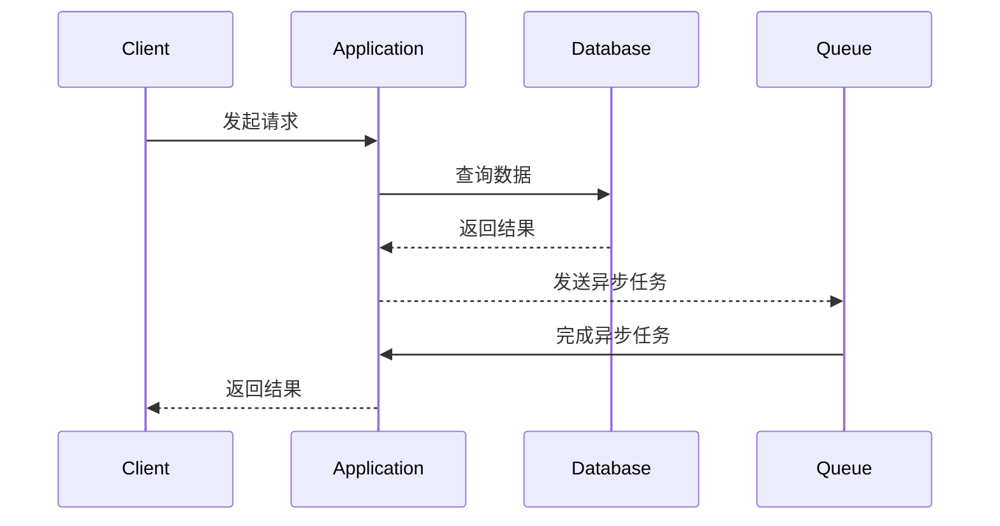

                 

### 引言

#### 1.1 背景介绍

随着信息技术的迅猛发展和企业业务复杂度的增加，跨团队协作在技术管理中的重要性日益凸显。传统的单体项目已经无法满足现代企业对于高效协作和快速响应的需求，跨团队协作成为提升企业竞争力和创新力的关键因素。

在技术管理中，跨团队协作涉及到不同团队之间的资源整合、信息传递和工作协同。这不仅要求团队成员具备专业知识和技能，更需要高效的协作机制和良好的沟通文化。然而，现实中的跨团队协作往往面临着诸多挑战，如沟通障碍、协作效率低下、任务分工不明等，这些问题严重影响了项目的进度和质量。

本文旨在探讨技术管理中的跨团队协作最佳实践。通过分析跨团队协作的现状、核心概念、理论基础和实践方法，结合实际案例，提供一套系统性的解决方案，帮助技术管理者更好地应对跨团队协作中的各种挑战。

#### 1.2 跨团队协作的重要性

跨团队协作的重要性主要体现在以下几个方面：

1. **资源整合**：跨团队协作能够有效整合不同团队的专业知识和资源，实现资源的最大化利用，提高项目的整体效率。
2. **知识共享**：跨团队协作促进了团队成员之间的知识共享和技能交流，有助于提升团队的整体能力和创新水平。
3. **问题解决**：面对复杂的项目和突发事件，跨团队协作能够迅速调动各方资源，共同解决问题，降低风险。
4. **协同创新**：跨团队协作有助于不同背景的团队成员共同探索创新解决方案，激发创意和灵感，推动企业的持续发展。

然而，跨团队协作也面临诸多挑战，如沟通障碍、文化差异、利益冲突等。如何在技术管理中有效实施跨团队协作，成为当前亟待解决的关键问题。

#### 1.3 书籍的目的和结构

本文的目的是提供一套关于技术管理中跨团队协作的最佳实践指南，帮助技术管理者提升跨团队协作的效率和效果。全书结构如下：

- **第1章 引言**：介绍跨团队协作的背景、重要性和目的。
- **第2章 核心概念与联系**：阐述跨团队协作和技术管理的核心概念及其关系。
- **第3章 跨团队协作效率的数学模型**：介绍跨团队协作效率的计算公式和成本模型。
- **第4章 系统分析与架构设计方案**：分析跨团队协作的架构设计和方法。
- **第5章 跨团队协作的理论基础**：探讨团队动力学、组织行为学和跨文化沟通。
- **第6章 跨团队协作最佳实践**：分享定义清晰的目标、有效沟通、高效协作流程和协作工具的最佳实践。
- **第7章 跨团队协作中的领导力**：讨论跨团队领导力在协作中的重要作用。
- **第8章 跨团队协作中的项目管理**：分析项目管理在跨团队协作中的应用。
- **第9章 跨团队协作中的风险管理**：介绍风险管理在协作中的实践。

通过以上章节的详细探讨，本文希望能够为技术管理者提供一套实用的跨团队协作解决方案，提升项目的成功率。

#### 1.4 文章关键词

- 技术管理
- 跨团队协作
- 效率
- 沟通
- 领导力
- 项目管理

#### 1.5 摘要

本文探讨了技术管理中的跨团队协作最佳实践。通过分析跨团队协作的现状、核心概念、理论基础和实践方法，本文提出了一套系统性的解决方案，包括定义清晰的协作目标、有效的沟通机制、高效的协作流程和协作工具的使用，以及领导力和项目管理的应用。通过实际案例分析和详细讲解，本文旨在帮助技术管理者提升跨团队协作的效率和效果，推动企业的持续发展和创新。

---

### 核心概念与联系

在探讨技术管理中的跨团队协作时，理解核心概念及其相互联系是至关重要的。以下是本文将涉及的核心概念及其定义和特点。

#### 1.2.1 跨团队协作的定义与特点

**定义**：跨团队协作指的是由来自不同职能部门或不同专业领域的团队成员共同完成一个项目或任务的过程。这些团队可能分布在不同的地理区域，也可能在同一办公场所，但他们的工作目标是一致的。

**特点**：
1. **多元化**：跨团队协作通常涉及到多样化的专业知识和技能，有助于解决问题和提出创新的解决方案。
2. **复杂性**：由于团队成员来自不同的背景和领域，协作过程中可能会出现沟通障碍、文化差异和利益冲突等问题。
3. **协同性**：跨团队协作要求团队成员能够协同工作，确保任务的高效完成。

**联系**：跨团队协作是技术管理的重要组成部分，它不仅有助于提升项目的整体效率和质量，还能够促进团队之间的知识共享和技能提升。

#### 1.2.2 技术管理的定义与要素

**定义**：技术管理是指利用科学的方法和工具，对技术项目的资源进行有效配置、管理和优化，以确保项目目标的实现。

**要素**：
1. **资源管理**：包括人力、资金、设备等资源的合理分配和利用。
2. **项目管理**：涉及项目计划、执行、监控和收尾的全过程管理。
3. **风险管理**：识别项目中的潜在风险，并采取相应的应对措施。
4. **质量保证**：确保项目交付的成果符合预定的质量和标准。

**联系**：技术管理中的跨团队协作是项目成功的关键因素之一。通过有效的跨团队协作，技术管理者可以更好地协调项目资源，优化项目流程，降低风险，提高项目的整体效率和质量。

#### 1.2.3 数学模型和数学公式

**跨团队协作效率的数学模型**：

1. **效率定义**：效率（Efficiency）指的是单位时间内完成的工作量与投入资源的比值。

   $$ 效率 = \frac{工作量}{投入资源} $$

2. **效率计算公式**：效率可以通过以下公式进行计算：

   $$ 效率 = \frac{工作完成量}{工作时间} $$

   其中，工作完成量是团队成员在规定时间内完成的工作任务量，工作时间是团队成员实际用于工作的总时间。

**跨团队协作成本模型**：

1. **成本分类**：成本可以分为直接成本和间接成本。直接成本包括人力成本、设备成本等，间接成本包括项目管理成本、沟通成本等。

2. **成本计算公式**：总成本可以通过以下公式计算：

   $$ 总成本 = 直接成本 + 间接成本 $$

   其中，直接成本可以通过以下公式计算：

   $$ 直接成本 = 人均成本 \times 人数 \times 工作时间 $$

   间接成本可以通过以下公式计算：

   $$ 间接成本 = 项目管理成本 + 沟通成本 $$

**联系**：数学模型和数学公式为跨团队协作提供了量化的分析和评估工具，有助于技术管理者更科学地管理和优化跨团队协作过程。

通过上述核心概念的介绍和相互联系的分析，我们为后续章节的深入探讨奠定了基础。在接下来的章节中，我们将进一步探讨跨团队协作的理论基础、最佳实践以及具体实施方法。

#### 1.3.1 跨团队协作效率的数学模型

为了更好地理解跨团队协作的效率，我们可以通过数学模型来进行量化和分析。首先，我们需要定义几个关键概念。

**效率定义**：效率是指在一定时间内，团队完成的工作量与投入资源（如时间、人力、资金等）的比值。高效率意味着团队在较少的资源投入下完成了更多的任务。

**效率计算公式**：

1. **基本效率公式**：

   $$ 效率 = \frac{工作量}{投入资源} $$

   其中，工作量是指团队在一段时间内完成的所有任务总和；投入资源包括团队成员的工作时间、使用的工具和设备、消耗的材料等。

2. **工作效率公式**：

   $$ 工作效率 = \frac{工作完成量}{工作时间} $$

   这里的工作完成量是指团队在规定时间内实际完成的工作任务量，工作时间是指团队成员用于工作的总时间。

**实例说明**：

假设有一个由5名成员组成的团队，他们在一个月内完成了100个任务。这5名成员总共投入了2000小时的工作时间。我们可以计算该团队的工作效率和总效率。

1. **工作完成量**：100个任务
2. **工作时间**：2000小时
3. **人均工作时间**：2000小时 ÷ 5人 = 400小时/人

   使用工作效率公式：

   $$ 工作效率 = \frac{100个任务}{2000小时} = 0.05个任务/小时 $$

   使用总效率公式：

   $$ 总效率 = \frac{100个任务}{2000小时} = 0.05个任务/小时 $$

通过上述计算，我们可以发现，这个团队在一个月内平均每小时完成0.05个任务，总效率也达到了0.05个任务/小时。

**优化效率**：

为了提高跨团队协作的效率，我们可以采取以下措施：

1. **优化流程**：通过分析团队的作业流程，找出瓶颈环节，进行流程优化，减少不必要的等待时间和重复工作。
2. **资源分配**：合理分配资源，确保每个团队成员的工作任务与其能力和专长相匹配，避免资源浪费。
3. **培训与提升**：定期对团队成员进行培训，提升其技能水平和工作效率。

通过数学模型和具体实例的分析，我们可以更清晰地了解跨团队协作的效率及其影响因素，从而为实际操作提供科学依据。

#### 1.3.2 跨团队协作成本模型

在跨团队协作中，成本管理是确保项目顺利进行的重要因素之一。有效的成本管理不仅能控制项目的总开支，还能提高资源的利用效率。以下将详细探讨跨团队协作的成本模型，包括成本分类和成本计算公式。

**1. 成本分类**

跨团队协作中的成本可以分为两大类：直接成本和间接成本。

- **直接成本**：直接成本是指可以直接归属于某一具体项目的成本，通常包括以下几部分：
  - **人力成本**：团队成员的工资、奖金、加班费等。
  - **设备成本**：使用工具、设备、机器等所需的费用。
  - **材料成本**：项目所需的原材料、消耗品等。

- **间接成本**：间接成本则是无法直接归属于某一项目的成本，通常包括以下几部分：
  - **项目管理成本**：项目管理团队的费用，如项目经理的工资、项目管理软件的订阅费用等。
  - **沟通成本**：跨团队协作过程中所需的通信工具、会议费用等。
  - **其他间接成本**：包括项目协调、培训、质量保证等费用。

**2. 成本计算公式**

为了更好地进行成本管理，我们需要以下几个关键的成本计算公式：

- **直接成本计算公式**：

  $$ 直接成本 = 人均成本 \times 人数 \times 工作时间 $$

  其中，人均成本是指每位团队成员的工资和奖金总和；人数是指参与项目的团队成员总数；工作时间是指每位团队成员在项目中的实际工作时长。

- **间接成本计算公式**：

  $$ 间接成本 = 项目管理成本 + 沟通成本 $$

  其中，项目管理成本是指用于项目管理的总费用；沟通成本是指项目过程中产生的所有通信费用。

- **总成本计算公式**：

  $$ 总成本 = 直接成本 + 间接成本 $$

  通过以上公式，我们可以计算出项目在整个生命周期中的总成本。

**3. 实例说明**

假设一个项目由10名团队成员组成，每个成员的月均工资为10000元，每人每月工作时间为160小时。此外，项目管理费用为每月20000元，沟通成本为每月5000元。我们可以计算该项目的直接成本、间接成本和总成本。

- **直接成本**：

  $$ 直接成本 = 10000元 \times 10人 \times 160小时 = 1,600,000元 $$

- **间接成本**：

  $$ 间接成本 = 20000元 + 5000元 = 25000元 $$

- **总成本**：

  $$ 总成本 = 1,600,000元 + 25000元 = 1,625,000元 $$

通过以上计算，我们可以得出该项目在一个月内的总成本为1625000元。

**4. 成本控制与优化**

在跨团队协作中，成本控制与优化是确保项目成功的关键。以下是一些常见的成本控制与优化策略：

- **优化人力资源配置**：根据项目需求合理分配人力资源，避免人员过剩或不足。
- **提高设备利用率**：定期维护设备，确保其正常运行，减少设备故障导致的生产停滞。
- **加强沟通管理**：通过高效的沟通工具和流程，减少不必要的沟通成本。
- **采用精益管理方法**：通过精益生产方式，减少浪费，提高生产效率。

通过上述成本模型的介绍和实例计算，我们可以更清晰地理解跨团队协作中的成本构成和计算方法，从而为项目的成本管理提供科学依据。

#### 1.4 系统分析与架构设计方案

在探讨跨团队协作时，系统分析与架构设计是关键的一环。一个良好的架构设计方案能够有效地支持跨团队协作，提高系统的可扩展性和稳定性。以下将详细介绍系统分析与架构设计的相关内容。

**1.4.1 问题场景介绍**

假设我们正在开发一个大型电子商务平台，该项目由多个团队共同协作完成，包括前端开发团队、后端开发团队、测试团队、运维团队等。这些团队需要紧密合作，确保平台能够按时上线并满足用户需求。在这个过程中，跨团队协作的有效性直接影响到项目的成功。

**2. 系统功能设计**

为了确保各团队之间的协作顺畅，我们需要明确系统的功能需求。以下是一个简单的领域模型类图，展示了系统的主要功能模块：

```mermaid
classDiagram
Class01 <|-- Class02
Class03 o-- Class04
Class05 <-.. Class06
Class07 ..| Class08
Class09 --> Class10
Class11 o--| Class12
Class13 --| Class14
Class15 o--| Class16
Class17 o--| Class18
Class19 ..| Class20

Class01{+方法1():void}
Class02{+方法2():void}
Class03{+方法3():void}
Class04{+方法4():void}
Class05{+方法5():void}
Class06{+方法6():void}
Class07{+方法7():void}
Class08{+方法8():void}
Class09{+方法9():void}
Class10{+方法10():void}
Class11{+方法11():void}
Class12{+方法12():void}
Class13{+方法13():void}
Class14{+方法14():void}
Class15{+方法15():void}
Class16{+方法16():void}
Class17{+方法17():void}
Class18{+方法18():void}
Class19{+方法19():void}
Class20{+方法20():void}
```

在这个类图中，Class01到Class20分别代表了系统的主要功能模块，例如用户管理、商品管理、订单管理、支付管理、日志管理等。每个模块都有特定的方法和属性，用于实现相应的功能。

**3. 系统架构设计**

系统架构设计是跨团队协作中至关重要的一环。以下是一个简单的系统架构图，展示了系统的主要组成部分和它们之间的关系：



在这个架构设计中，用户通过API与系统进行交互，API作为中间层负责处理请求和响应。应用服务器负责具体的业务逻辑处理，并与数据库进行数据交互。队列用于处理异步任务，确保系统的响应速度和稳定性。

**4. 系统接口设计**

接口设计是系统架构设计的重要组成部分，它定义了各模块之间的通信方式。以下是一个简单的接口设计示例：

```mermaid
interface Application {
  - function1(): void
  - function2(): void
  - function3(): void
}

interface Database {
  - query1(): ResultSet
  - query2(): ResultSet
  - query3(): ResultSet
}

interface Queue {
  - enqueue(item: Item): void
  - dequeue(): Item
  - size(): number
}
```

在这个接口设计中，Application、Database和Queue分别代表了系统中的三个主要模块，每个模块都有特定的方法和属性，用于实现接口功能。

**5. 系统交互**

系统交互是跨团队协作中的关键环节，它确保了各模块之间的有效通信和数据传递。以下是一个简单的序列图，展示了系统的交互流程：



在这个序列图中，Client代表用户，Application代表应用服务器，Database代表数据库，Queue代表队列。用户发起请求后，应用服务器处理请求并与数据库进行交互，然后将结果返回给用户。同时，异步任务通过队列进行传递和处理。

**6. 小结**

通过系统分析与架构设计方案，我们为跨团队协作提供了一个清晰的结构和有效的通信机制。良好的系统架构设计能够提高项目的可扩展性、稳定性和可靠性，为跨团队协作的成功奠定基础。

---

### 跨团队协作的理论基础

在探讨技术管理中的跨团队协作时，理论基础是不可或缺的一环。通过深入理解团队动力学、组织行为学和跨文化沟通，我们可以更好地应对跨团队协作中的各种挑战。以下是这些理论基础的核心概念、特点及其实际应用。

#### 2.1 团队动力学

**1. 定义与核心概念**

团队动力学是指研究团队内部成员之间的相互作用和动力机制的科学。核心概念包括团队形成、团队发展、团队沟通和团队冲突管理等。

- **团队形成**：团队动力学认为，团队的形成是一个动态过程，包括组建、熟悉、形成规范和任务导向等阶段。在团队形成阶段，成员需要相互了解和信任，建立共同的愿景和目标。
- **团队发展**：团队发展指的是团队在形成后如何不断成长和优化。这包括团队稳定期、高产期和变革期等阶段。在每个阶段，团队需要适应不同的挑战和变化，保持活力和创新能力。
- **团队沟通**：有效的团队沟通是团队成功的关键。团队沟通包括信息的传递、共享和反馈。良好的沟通可以促进团队成员之间的理解和协作，减少误解和冲突。
- **团队冲突管理**：冲突是团队中不可避免的现象，有效的冲突管理有助于团队解决分歧，提升合作效率。团队冲突管理包括识别冲突、分析原因、协商解决和预防冲突等。

**2. 特点**

- **动态性**：团队动力学强调团队是一个动态的系统，其成员和结构会随着时间和环境的变化而变化。
- **多样性**：团队成员来自不同的背景和领域，具有不同的知识和技能，这为团队协作带来了多样性，但同时也可能导致沟通障碍和冲突。
- **复杂性**：团队动力学涉及多个层面的相互作用，包括个人、团队和组织层面，这使得团队管理具有复杂性。

**3. 实际应用**

在跨团队协作中，团队动力学理论的应用主要体现在以下几个方面：

- **团队建设**：通过团队建设活动，增强团队成员之间的信任和合作，提高团队的整体绩效。
- **沟通管理**：建立有效的沟通机制，确保信息在团队内部的有效传递和共享。
- **冲突管理**：采取积极的冲突管理策略，及时解决团队内部的分歧和矛盾，确保团队协作的顺利进行。

#### 2.2 组织行为学

**1. 定义与核心概念**

组织行为学是研究组织中个体、团队和整体组织行为及其影响因素的学科。核心概念包括组织结构、组织文化、个人动机等。

- **组织结构**：组织结构决定了组织的内部构成和权力分配方式。常见的组织结构包括职能型、矩阵型、网络型等。不同的组织结构对跨团队协作有不同的影响。
- **组织文化**：组织文化是组织内部成员共同遵循的价值观、信仰和行为规范。良好的组织文化有助于增强团队成员的归属感和合作意愿，提高跨团队协作的效果。
- **个人动机**：个人动机是指驱动个体行为的内在动力，包括成就动机、权力动机和社交动机等。了解个人动机有助于更好地激励团队成员，提高他们的工作积极性和协作能力。

**2. 特点**

- **系统性**：组织行为学强调从系统的角度理解组织的整体行为和个体行为，认为组织是一个复杂的系统，各部分之间存在相互作用和影响。
- **动态性**：组织行为学认为组织行为是一个动态的过程，会受到外部环境和内部因素的影响，需要不断调整和优化。

**3. 实际应用**

在跨团队协作中，组织行为学的应用主要体现在以下几个方面：

- **组织结构调整**：根据跨团队协作的需要，调整组织结构，优化团队组合，提高协作效率。
- **组织文化建设**：营造积极向上的组织文化，增强团队成员的归属感和合作意识。
- **个人激励**：设计合理的激励机制，激发团队成员的积极性和创造力，提高他们的工作投入和协作质量。

#### 2.3 跨文化沟通

**1. 定义与核心概念**

跨文化沟通是指在不同文化背景下进行的沟通活动。核心概念包括跨文化差异、沟通障碍和跨文化沟通策略。

- **跨文化差异**：跨文化差异是指不同文化背景下人们在价值观、行为规范、沟通风格等方面的差异。这些差异可能导致误解和冲突，影响跨团队协作的效果。
- **沟通障碍**：沟通障碍是指沟通过程中由于文化差异导致的障碍，包括语言障碍、非语言沟通障碍、文化习惯障碍等。
- **跨文化沟通策略**：跨文化沟通策略是指为了克服沟通障碍，提高跨团队协作效果而采取的一系列沟通方法和技巧。

**2. 特点**

- **多样性**：跨文化沟通涉及多个文化背景，具有多样性特点，需要灵活应对各种文化差异。
- **复杂性**：跨文化沟通的复杂性体现在沟通过程中的不确定性、多变性和不确定性。

**3. 实际应用**

在跨团队协作中，跨文化沟通的实际应用主要体现在以下几个方面：

- **文化适应**：团队成员需要了解和适应不同文化背景，减少文化冲突和误解。
- **沟通技巧**：运用适当的跨文化沟通技巧，如倾听、提问、反馈等，提高沟通效果。
- **文化培训**：提供跨文化沟通培训，帮助团队成员掌握跨文化沟通的知识和技能，提高协作效率。

通过团队动力学、组织行为学和跨文化沟通的理论基础，我们可以更好地理解和应对跨团队协作中的各种挑战，提高协作效率和项目成功率。

#### 2.4 本章小结

本章介绍了技术管理中跨团队协作的理论基础，包括团队动力学、组织行为学和跨文化沟通。团队动力学帮助我们理解团队形成、发展、沟通和冲突管理的机制；组织行为学提供了关于组织结构、文化和个人动机的重要概念；跨文化沟通则帮助我们应对不同文化背景下的沟通障碍和挑战。通过深入理解这些理论基础，技术管理者可以更有效地设计和管理跨团队协作，提高项目的成功率。

---

### 跨团队协作最佳实践

在技术管理中，有效的跨团队协作是项目成功的关键。为了实现高效的协作，需要定义清晰的协作目标、建立有效的沟通机制、设计高效的协作流程和选择合适的协作工具。以下将详细探讨这些最佳实践，并结合实际案例进行说明。

#### 3.1 定义清晰的协作目标

**1. 目标设定的原则**

定义清晰的协作目标对于跨团队协作至关重要。以下是目标设定的几个原则：

- **SMART原则**：目标应当是具体的（Specific）、可衡量的（Measurable）、可实现的（Achievable）、相关的（Relevant）和有时限的（Time-bound）。
- **一致性**：目标应与组织的战略目标保持一致，确保跨团队协作方向正确。
- **参与性**：在目标设定过程中，应充分征求团队成员的意见，提高他们的参与度和责任感。

**2. 目标设定的方法**

以下是一些常用的目标设定方法：

- **头脑风暴**：通过集体讨论，激发团队成员的创意，确定潜在的目标。
- **目标分解**：将大目标分解为具体的、可操作的小目标，确保每个团队成员都明确自己的任务和责任。
- **目标确认**：与团队成员一起确认目标，确保每个人都理解并同意这些目标。

**3. 案例分析**

以一个软件开发项目为例，项目目标是在三个月内开发并上线一个电子商务平台。根据SMART原则，我们可以设定以下具体目标：

- **具体**：在三个月内完成电子商务平台的核心功能，包括用户注册、商品浏览、购物车、支付和订单管理等。
- **可衡量**：通过用户测试和系统测试，确保功能正常运行，用户满意度达到90%以上。
- **可实现**：根据团队现有的资源和能力，确定合理的时间表和里程碑。
- **相关**：确保目标与公司的战略目标和市场需求保持一致。
- **有时限**：明确项目开始和结束的具体日期。

通过上述目标设定方法，项目团队可以清晰地了解项目的任务和责任，确保协作的高效性和目标的达成。

#### 3.2 有效的沟通机制

**1. 沟通工具的选择**

选择合适的沟通工具对于跨团队协作至关重要。以下是一些常用的沟通工具：

- **即时通讯工具**：如Slack、微信、Telegram等，用于实时沟通和协作。
- **邮件系统**：如Gmail、Outlook等，用于正式的沟通和文档传递。
- **会议工具**：如Zoom、Microsoft Teams、Google Meet等，用于在线会议和视频通话。
- **项目管理工具**：如Jira、Trello、Asana等，用于任务分配、进度追踪和协作管理。

**2. 沟通频率的确定**

沟通频率应根据项目的复杂度和团队成员的工作负荷来确定。以下是一些常见的沟通频率：

- **日常沟通**：每天或每周进行一次简短的站会，讨论任务进展和遇到的问题。
- **周报**：每周发布一次周报，总结工作进展、问题和计划。
- **项目评审会议**：在关键节点进行项目评审会议，确保项目按计划进行。

**3. 案例分析**

在一个跨国软件项目中，由于团队成员分布在不同的国家和时区，沟通效率成为一大挑战。项目团队选择了以下沟通工具和频率：

- **Slack**：用于日常沟通和任务讨论。
- **Google Meet**：每周进行一次项目会议，确保所有团队成员都能参加。
- **Jira**：用于任务管理和进度追踪。

通过上述沟通工具和频率，项目团队成功地解决了沟通障碍，确保了项目的顺利进行。

#### 3.3 高效的协作流程

**1. 流程优化的原则**

为了实现高效的协作，需要遵循以下流程优化原则：

- **简洁性**：简化流程，减少不必要的步骤和环节。
- **灵活性**：确保流程能够适应不同的项目和团队成员的需求。
- **透明性**：流程应清晰透明，使所有团队成员都能了解自己的任务和责任。

**2. 流程优化方法**

以下是一些常见的流程优化方法：

- **流程映射**：通过流程映射工具，绘制出整个工作流程，找出瓶颈和优化点。
- **流程改进**：基于流程映射的结果，提出改进措施，如自动化流程、优化任务分配等。
- **试点运行**：在部分团队或项目中进行试点运行，验证流程改进的效果。

**3. 案例分析**

在一个大型IT项目中，项目团队发现项目进展缓慢，主要原因是流程复杂、任务分配不清。通过以下步骤，团队成功地优化了协作流程：

- **流程映射**：绘制出当前的工作流程，识别出复杂环节和重复工作。
- **流程改进**：简化流程，取消不必要的环节，优化任务分配。
- **试点运行**：在部分团队中试点运行新的流程，收集反馈并进行调整。

通过流程优化，项目团队显著提高了工作效率，项目进度加快，质量也有所提升。

#### 3.4 有效的协作工具

**1. 常见协作工具介绍**

以下是一些常用的协作工具：

- **项目管理工具**：如Jira、Trello、Asana等，用于任务分配、进度追踪和协作管理。
- **文档协作工具**：如Google Docs、Microsoft Office 365等，用于多人实时编辑文档。
- **代码管理工具**：如Git、GitHub、GitLab等，用于版本控制和代码协作。
- **即时通讯工具**：如Slack、微信、Telegram等，用于实时沟通和协作。

**2. 工具选择与使用技巧**

在选择协作工具时，需要考虑以下因素：

- **团队规模和需求**：根据团队规模和协作需求选择合适的工具。
- **兼容性**：确保工具与其他系统的兼容性，避免数据孤岛。
- **易用性**：选择界面友好、易于使用的工具，提高团队协作效率。

以下是一些使用技巧：

- **统一沟通入口**：确保所有沟通都在同一个工具中进行，避免信息分散。
- **文档版本管理**：使用文档协作工具的版本管理功能，避免文档冲突。
- **任务追踪与提醒**：利用项目管理工具的提醒功能，确保任务按时完成。

**3. 案例分析**

在一个跨国软件开发项目中，项目团队选择了以下协作工具：

- **Jira**：用于任务分配和进度追踪。
- **Google Docs**：用于多人实时编辑文档。
- **GitHub**：用于版本控制和代码协作。
- **Slack**：用于实时沟通和协作。

通过使用这些协作工具，项目团队成功提高了协作效率，项目进度和质量得到显著提升。

#### 3.5 本章小结

通过定义清晰的协作目标、建立有效的沟通机制、设计高效的协作流程和选择合适的协作工具，技术管理者可以显著提高跨团队协作的效率和效果。本章结合实际案例，详细探讨了跨团队协作最佳实践的具体方法和应用，为技术管理者提供了一套实用的指南。

---

### 跨团队协作中的领导力

跨团队协作中的领导力是确保协作顺利进行、项目成功实施的关键因素。有效的领导力不仅能够协调团队成员，调动他们的积极性和创造力，还能够解决协作中的冲突，推动团队达成共同目标。以下是跨团队协作中领导力的重要性、领导者角色和职责，以及提升领导力的策略。

#### 4.1 领导力在跨团队协作中的作用

**1. 协调资源**

领导者在跨团队协作中扮演着资源协调者的角色。他们需要确保各团队在项目不同阶段都能获得所需的资源，如人力、技术和资金。通过合理配置资源，领导者能够提高项目的执行效率和成功率。

**2. 激励团队**

有效的领导力能够激励团队成员，提高他们的工作积极性和投入度。领导者可以通过设定明确的目标、提供正面的反馈、激励奖励等方式，激发团队成员的潜能，推动团队共同进步。

**3. 解决冲突**

跨团队协作过程中，由于文化差异、利益冲突和沟通障碍，冲突难以避免。领导者需要具备解决冲突的能力，通过沟通、协商和调解，找到双方都能接受的解决方案，维护团队和谐与稳定。

**4. 促进知识共享**

领导者在跨团队协作中起着知识共享的桥梁作用。他们需要鼓励团队成员分享知识和经验，促进团队间的信息流动，提高整体团队的创新能力。

**5. 建立团队文化**

领导力在塑造团队文化中发挥着重要作用。通过建立积极向上的团队氛围，领导者能够增强团队成员的归属感和凝聚力，提升团队的整体绩效。

#### 4.2 跨团队领导者的角色与职责

**1. 沟通者**

领导者需要确保信息的有效传递，确保团队成员了解项目的目标、进度和关键决策。良好的沟通技能是领导者成功的关键。

**2. 协调者**

领导者需要协调不同团队之间的工作，确保任务分工明确、资源分配合理。他们需要在不同团队之间搭建桥梁，解决协作中的问题。

**3. 激励者**

领导者需要激发团队成员的积极性和创造力，确保团队在压力和挑战面前保持高昂的斗志。他们可以通过设定明确的期望、提供反馈和奖励机制来实现这一目标。

**4. 冲突解决者**

领导者需要具备解决团队内部和跨团队冲突的能力，确保协作顺利进行。他们需要以公正、客观的态度处理冲突，寻找双方都能接受的解决方案。

**5. 知识共享推动者**

领导者需要鼓励团队成员分享知识和经验，促进团队间的知识流动，提高整体团队的技能水平和创新能力。

**6. 文化建设者**

领导者需要塑造积极向上的团队文化，增强团队成员的归属感和凝聚力。他们可以通过设立共同的价值观、开展团队建设活动等方式实现这一目标。

#### 4.3 领导力提升策略

**1. 自我提升**

领导者需要不断提升自己的知识和技能，以更好地应对跨团队协作中的各种挑战。以下是一些自我提升的方法：

- **持续学习**：通过阅读、参加培训课程和研讨会，不断更新自己的知识和技能。
- **反思与总结**：定期反思自己的工作，总结经验教训，找出改进的空间。
- **实践**：通过实际操作，将理论知识应用到实践中，提高领导能力。

**2. 团队建设**

领导者需要注重团队建设，增强团队的凝聚力和协作能力。以下是一些团队建设的方法：

- **团队活动**：组织定期的团队活动，如团队建设训练、团建活动等，增强团队间的信任和合作。
- **沟通与反馈**：建立良好的沟通机制，鼓励团队成员分享意见和反馈，提高团队的整体沟通效率。
- **共同目标**：确保团队目标清晰明确，让每个团队成员都明确自己的角色和责任。

**3. 案例学习**

通过分析成功的跨团队协作案例，领导者可以学习到有效的领导策略和方法。以下是一些案例学习的建议：

- **分析成功案例**：研究成功的跨团队协作案例，分析其成功的原因和关键因素。
- **借鉴经验**：从成功案例中汲取经验，结合自己的实际情况，制定适合自己的领导策略。
- **反思失败案例**：分析失败案例，找出失败的原因和教训，避免在未来的工作中重复错误。

#### 4.4 本章小结

跨团队协作中的领导力对项目的成功至关重要。领导者需要扮演协调者、激励者、冲突解决者和知识共享推动者等多重角色，通过有效的领导力和团队建设，提升团队的协作效率和创新能力。本章介绍了领导力在跨团队协作中的作用、领导者角色与职责，以及提升领导力的策略，为技术管理者提供了实用的指导。

---

### 跨团队协作中的项目管理

在技术管理中，项目管理是确保项目成功实施的重要环节。特别是在跨团队协作中，项目管理更加复杂和重要。本文将分析项目管理在跨团队协作中的核心概念，讨论跨团队协作中的项目管理挑战，并介绍最佳实践。

#### 5.1 项目管理的核心概念

**1. 项目定义**

项目是一个临时的、一次性的工作，旨在创造独特的产品、服务或成果。项目具有明确的目标、时间范围和预算限制。

**2. 项目管理流程**

项目管理流程包括以下几个关键阶段：

- **项目启动**：确定项目目标和范围，组建项目团队，明确资源和时间表。
- **项目规划**：制定详细的项目计划，包括任务分配、时间表、成本预算和质量标准。
- **项目执行**：按照项目计划执行任务，进行进度监控和风险管理。
- **项目监控与控制**：定期检查项目进度和成本，确保项目按计划进行，及时调整计划。
- **项目收尾**：完成项目交付，进行项目评估和总结，为未来项目提供经验教训。

**3. 项目管理方法**

项目管理方法包括以下几种：

- **敏捷开发**：通过迭代和增量的方式，快速响应需求变化，提高项目的灵活性和适应性。
- **瀑布模型**：按照预定的顺序进行项目开发，确保每个阶段都完成后再进入下一个阶段。
- **六西格玛**：通过统计方法和过程改进，减少项目中的缺陷和变异，提高项目质量。

#### 5.2 跨团队协作中的项目管理挑战

**1. 协同性问题**

跨团队协作中，不同团队的成员可能处于不同的地理位置和工作时间，这给项目的协调和沟通带来了挑战。如何确保团队成员能够及时响应任务，同步工作进度，是一个重要的难题。

**2. 沟通障碍**

跨团队协作中的沟通障碍可能源于文化差异、语言障碍和沟通渠道的不一致。团队成员可能无法准确理解任务要求或项目的整体目标，导致工作效率降低和错误增加。

**3. 时间管理**

跨团队协作中的时间管理更加复杂。由于团队成员的时间表和工作习惯不同，如何合理安排任务，确保项目按时完成，是一个重要挑战。

**4. 风险管理**

跨团队协作中，项目风险可能来自多个方面，如技术问题、人员流动、外部环境变化等。如何有效识别、评估和应对风险，确保项目顺利推进，是一个关键问题。

#### 5.3 跨团队协作中的项目管理最佳实践

**1. 明确项目目标**

在跨团队协作中，明确项目目标是确保所有团队成员都朝着同一方向努力的关键。项目目标应具体、可衡量、可实现、相关和有时限（SMART原则），并确保与组织的战略目标一致。

**2. 建立有效的沟通机制**

为了克服沟通障碍，应建立有效的沟通机制。这包括选择合适的沟通工具（如即时通讯工具、视频会议系统、项目管理软件等），制定沟通计划（如定期会议、即时沟通、报告反馈等），并确保沟通渠道的畅通。

**3. 制定详细的项目计划**

在项目规划阶段，应制定详细的项目计划，包括任务分解、时间表、资源分配和风险分析。详细的项目计划有助于团队成员了解自己的任务和责任，提高协作效率。

**4. 进行定期监控与控制**

在项目执行过程中，应进行定期监控与控制，确保项目按计划进行。通过监控项目进度、成本和质量，及时发现和解决问题，确保项目目标的实现。

**5. 建立风险管理机制**

在项目启动阶段，应识别项目风险，并制定相应的风险应对策略。在项目执行过程中，应持续监控风险，并根据实际情况调整应对措施。

**6. 加强团队协作**

为了提高跨团队协作效率，应加强团队协作。这包括定期开展团队建设活动、鼓励知识共享和经验交流、建立共同的目标和价值观。

**7. 案例分析**

以下是一个成功的跨团队协作项目案例：

某大型互联网公司开发一款移动应用，项目团队由国内开发团队和海外设计团队组成。由于团队成员分布在不同的国家和地区，项目面临沟通障碍、时间管理和风险管理等挑战。

- **明确项目目标**：项目目标是在六个月内开发并上线一款高质量的移动应用，满足用户需求。
- **建立沟通机制**：项目团队选择了Slack作为主要沟通工具，定期召开视频会议，确保团队成员能够及时沟通和协作。
- **制定详细计划**：项目团队制定了详细的项目计划，包括任务分解、时间表、资源分配和风险分析，确保项目按计划进行。
- **监控与控制**：项目团队定期监控项目进度，通过Jira等项目管理工具跟踪任务完成情况，确保项目按时完成。
- **风险管理**：项目团队识别了技术风险、人员流动风险和市场需求风险，并制定了相应的应对策略，确保项目顺利进行。

通过上述最佳实践，项目团队成功克服了跨团队协作中的各种挑战，项目按计划完成并成功上线，用户反馈良好。

#### 5.4 本章小结

跨团队协作中的项目管理是确保项目成功实施的关键。通过明确项目目标、建立有效的沟通机制、制定详细的项目计划、进行定期监控与控制、建立风险管理机制和加强团队协作，技术管理者可以更好地应对跨团队协作中的各种挑战，提高项目的成功率。本章结合实际案例，介绍了跨团队协作中的项目管理最佳实践，为技术管理者提供了实用的指导。

---

### 跨团队协作中的风险管理

在技术管理中，风险管理是确保项目顺利实施和目标实现的关键环节。特别是在跨团队协作中，由于涉及多个团队和不同的利益相关者，项目面临的风险更加复杂和多样化。因此，有效的风险管理策略对于保障项目的稳定推进和成功至关重要。以下将详细介绍跨团队协作中的风险管理概念、风险识别方法、风险应对策略及实际案例分析。

#### 6.1 风险管理的概念

**1. 风险定义**

风险是指项目在执行过程中可能遇到的潜在不利事件或情况，这些事件或情况可能会对项目的进度、成本、质量、资源等方面产生负面影响。

**2. 风险管理流程**

风险管理流程通常包括以下几个步骤：

- **风险识别**：识别项目可能面临的各种风险，包括内部和外部风险。
- **风险评估**：对识别出的风险进行评估，确定其发生的概率和潜在影响。
- **风险应对**：制定应对策略，选择最合适的应对措施，以减轻或消除风险的影响。
- **风险监控**：持续监控项目过程中的风险，及时发现新的风险或风险变化，进行调整。

**3. 风险管理策略**

风险管理策略主要包括风险规避、风险减轻、风险转移和风险接受等。

- **风险规避**：通过改变项目计划或策略，避免风险的暴露。
- **风险减轻**：通过改进项目流程、加强控制措施或增加资源投入，降低风险发生的概率或影响程度。
- **风险转移**：通过保险、合同或合作伙伴关系等手段，将风险转移给第三方。
- **风险接受**：在风险发生的概率和影响较小的情况下，接受风险并制定相应的应急计划。

#### 6.2 跨团队协作中的风险识别

在跨团队协作中，风险识别是一个关键步骤，可以帮助项目团队提前了解和预防潜在问题。以下是一些常用的风险识别方法：

**1. 调查问卷**

通过调查问卷，收集团队成员和利益相关者的意见和建议，识别项目可能面临的风险。

**2. 威胁分析**

通过对项目目标和任务的详细分析，识别可能对项目产生威胁的因素。

**3. 风险矩阵**

使用风险矩阵，将风险按照概率和影响进行分类，帮助团队集中精力应对高优先级的风险。

**4. 实地调研**

通过实地调研，了解项目的实际环境，识别潜在的风险。

#### 6.3 跨团队协作中的风险应对

在识别出项目风险后，需要制定相应的应对策略，确保项目能够顺利推进。以下是一些常见的风险应对策略：

**1. 风险规避**

通过调整项目计划，避免高风险任务或活动的执行，或改变项目策略，减少风险暴露。

**2. 风险减轻**

通过增加资源投入、改进流程或加强控制措施，降低风险发生的概率或影响程度。

**3. 风险转移**

通过购买保险、签订合同或与合作伙伴共同承担风险，将风险转移给第三方。

**4. 风险接受**

在风险发生的概率和影响较小的情况下，接受风险并制定相应的应急计划，以减轻风险的影响。

#### 6.4 实际案例分析

以下是一个跨团队协作项目中的风险管理案例：

**项目背景**：某互联网公司开发一款全新的电子商务平台，项目团队包括前端开发团队、后端开发团队、测试团队和运维团队。由于项目规模大、涉及多个部门，项目面临多种风险。

**风险识别**：

- **技术风险**：由于新技术的使用，项目可能面临技术难题，影响项目进度。
- **沟通风险**：跨团队协作过程中，由于地理位置和时区的差异，沟通效率可能降低。
- **人员流动风险**：团队成员可能会因各种原因离开项目，影响项目进度。
- **市场需求风险**：市场需求变化可能导致项目需求变更，影响项目交付。

**风险应对**：

- **技术风险**：项目团队提前进行技术调研，确保技术方案成熟可靠。在项目执行过程中，设置技术评审环节，及时发现并解决技术难题。
- **沟通风险**：项目团队选择合适的沟通工具（如Slack、Zoom），制定沟通计划，确保团队成员能够及时沟通和协作。定期召开项目会议，讨论项目进展和问题。
- **人员流动风险**：项目团队建立备选人员库，确保在关键岗位出现人员流失时，能够及时补充。与团队成员签订合同，确保关键人员稳定。
- **市场需求风险**：项目团队与市场部门保持密切沟通，及时了解市场需求变化，调整项目计划。制定需求变更管理流程，确保变更的有序和可控。

通过上述风险识别和应对策略，项目团队成功应对了各种风险，确保项目按计划推进，最终成功交付。

#### 6.5 本章小结

跨团队协作中的风险管理是确保项目成功实施的关键。通过识别项目风险、制定应对策略和持续监控风险，项目团队可以有效地预防和减轻潜在风险的影响，确保项目顺利进行。本章结合实际案例，详细介绍了跨团队协作中的风险管理概念、风险识别方法、风险应对策略，为技术管理者提供了实用的风险管理指导。

---

### 跨团队协作中的跨文化沟通

跨文化沟通在跨团队协作中扮演着至关重要的角色。由于团队成员来自不同的文化背景，他们的沟通风格、行为习惯和价值观可能存在显著差异，这可能导致误解、冲突和沟通障碍。有效的跨文化沟通策略能够促进团队间的理解和协作，提高项目成功率。以下是跨文化沟通的重要性、沟通障碍、策略和案例分析。

#### 7.1 跨文化沟通的重要性

**1. 促进理解和信任**

跨文化沟通有助于团队成员了解彼此的文化背景和行为习惯，促进相互理解和信任。这有助于减少误解和偏见，提高团队协作的效率。

**2. 提高项目效率**

有效的跨文化沟通能够确保信息的准确传递，避免由于文化差异导致的沟通错误，从而提高项目的整体效率。

**3. 避免文化冲突**

通过跨文化沟通，团队成员可以更好地理解彼此的期望和需求，减少由于文化差异引起的冲突和矛盾。

**4. 增强团队凝聚力**

跨文化沟通能够促进团队成员之间的交流和互动，增强团队的凝聚力和归属感。

#### 7.2 沟通障碍

**1. 文化差异**

文化差异是跨文化沟通中最大的障碍之一。不同文化背景下，人们的沟通风格、语言表达和礼仪习惯可能存在显著差异，这可能导致误解和沟通不畅。

**2. 语言障碍**

语言障碍是跨文化沟通的另一个常见问题。即使团队成员使用相同的语言，但由于文化背景不同，他们可能无法准确理解对方的意图和表达。

**3. 非语言沟通**

非语言沟通（如肢体语言、面部表情和语调）在不同文化背景下可能有不同的含义，这可能导致误解和冲突。

**4. 信息过滤**

在跨文化沟通中，信息可能会经过多个过滤过程，从而影响信息的准确性和完整性。

#### 7.3 跨文化沟通策略

**1. 增强文化意识**

增强文化意识是有效跨文化沟通的基础。团队成员需要了解不同文化的特点、价值观和行为规范，提高跨文化敏感性。

**2. 明确沟通目标**

在跨文化沟通中，明确沟通目标是至关重要的。团队成员应确保彼此了解沟通的目的和期望结果，避免误解和无效沟通。

**3. 选择合适的沟通方式**

根据不同的文化背景和沟通需求，选择合适的沟通方式。例如，对于正式沟通，书面沟通可能更为合适；对于非正式沟通，口头沟通可能更加有效。

**4. 增强语言能力**

提高团队成员的语言能力，特别是跨文化背景下的语言能力，有助于减少语言障碍，提高沟通效率。

**5. 建立信任**

建立信任是跨文化沟通的关键。通过开放、坦诚和尊重的沟通方式，建立团队成员之间的信任，促进有效的跨文化沟通。

#### 7.4 案例分析

**案例背景**：

某国际软件公司在中国开展一个大型软件开发项目，项目团队由来自中国、美国、印度等多个国家的成员组成。由于文化差异和语言障碍，项目团队在沟通中遇到了诸多挑战。

**案例分析**：

**1. 增强文化意识**

项目团队组织了一系列文化培训，帮助团队成员了解不同文化背景的特点和沟通习惯。通过培训，团队成员提高了跨文化敏感性，减少了误解和冲突。

**2. 明确沟通目标**

在项目开始前，项目团队明确了沟通目标和沟通计划。每个团队成员都清楚自己的角色和责任，确保沟通的针对性和有效性。

**3. 选择合适的沟通方式**

项目团队选择了多种沟通方式，如即时通讯工具（如Slack、微信）、视频会议系统和电子邮件等。根据不同的沟通需求，选择最合适的沟通方式，确保信息的准确传递。

**4. 增强语言能力**

项目团队鼓励成员提高英语水平，特别是对于跨文化沟通中常用的专业术语和表达方式。通过定期组织英语培训和讨论，成员的语言能力得到了显著提升。

**5. 建立信任**

项目团队建立了开放、坦诚和尊重的沟通文化，鼓励成员提出意见和建议。通过定期的项目会议和反馈机制，团队成员之间的信任得到了建立和强化。

通过上述跨文化沟通策略，项目团队成功地克服了文化差异和语言障碍，确保了项目的顺利进行。项目最终按时完成，客户满意度较高。

#### 7.5 本章小结

跨文化沟通在跨团队协作中具有重要意义。通过增强文化意识、明确沟通目标、选择合适的沟通方式、增强语言能力和建立信任，项目团队可以有效地克服文化差异和语言障碍，提高沟通效率，促进项目成功。本章结合实际案例，详细介绍了跨文化沟通的策略和方法，为技术管理者提供了实用的指导。

---

### 跨团队协作的总结与拓展

#### 9.1 总结

本文通过详细探讨技术管理中的跨团队协作最佳实践，系统地总结了跨团队协作的核心概念、理论基础、最佳实践、领导力、项目管理和风险管理等关键内容。以下是对这些内容的主要结论进行概括：

1. **核心概念与联系**：跨团队协作涉及多元化、复杂性和协同性。技术管理包括资源管理、项目管理、风险管理和质量保证等核心要素。通过数学模型和公式，我们量化了跨团队协作的效率和成本。

2. **理论基础**：团队动力学、组织行为学和跨文化沟通为跨团队协作提供了理论支持。团队形成、发展、沟通与冲突管理，组织结构、文化和个人动机，以及跨文化差异和沟通策略，都是理解跨团队协作的重要视角。

3. **最佳实践**：定义清晰的协作目标、建立有效的沟通机制、设计高效的协作流程和选择合适的协作工具，是提高跨团队协作效率的关键。这些实践方法结合具体案例，为实际操作提供了指导。

4. **领导力**：跨团队协作中的领导力至关重要。领导者在资源协调、激励团队、解决冲突和促进知识共享等方面发挥着关键作用。提升领导力的策略包括自我提升、团队建设和案例学习。

5. **项目管理**：项目管理是跨团队协作中不可或缺的一部分。通过明确项目目标、建立有效的沟通机制、制定详细的项目计划、进行定期监控与控制、建立风险管理机制和加强团队协作，项目团队能够更好地应对各种挑战。

6. **风险管理**：风险管理是确保项目顺利进行的重要环节。通过识别风险、评估风险、制定应对策略和持续监控风险，项目团队能够有效地预防和减轻风险的影响。

7. **跨文化沟通**：跨文化沟通在跨团队协作中具有重要性。通过增强文化意识、明确沟通目标、选择合适的沟通方式、增强语言能力和建立信任，项目团队能够有效地克服文化差异和语言障碍。

#### 9.2 小结

跨团队协作在技术管理中具有至关重要的地位。通过本文的探讨，我们认识到跨团队协作不仅涉及技术层面的效率提升，还包括文化、管理和人际关系的多个层面。有效实施跨团队协作，需要综合考虑团队成员的专业技能、沟通能力、领导力和项目管理等多个因素。

技术管理者应关注以下几个方面：

1. **培养团队文化**：建立积极、开放、包容的团队文化，促进团队成员之间的信任和合作。
2. **提升沟通能力**：通过培训和练习，提高团队成员的跨文化沟通能力，确保信息传递的准确性和有效性。
3. **优化流程和工具**：设计高效的协作流程，选择合适的协作工具，提高协作效率。
4. **加强领导力培养**：通过自我提升和团队建设，培养具备跨团队协作能力的领导者。
5. **重视风险管理**：建立全面的风险管理机制，识别、评估和应对项目中的各种风险，确保项目顺利进行。

#### 9.3 注意事项

在实施跨团队协作时，技术管理者应特别注意以下几点：

1. **明确目标**：确保团队目标清晰、具体和可衡量，避免目标模糊导致的协作混乱。
2. **保持沟通畅通**：定期召开会议，使用有效的沟通工具，确保团队成员之间信息传递的及时性和准确性。
3. **平衡资源分配**：根据项目需求和团队成员的能力，合理分配任务和资源，避免资源浪费和过度负荷。
4. **培养团队成员的跨文化意识**：鼓励团队成员了解和尊重不同文化的差异，提高跨文化协作的敏感性和适应性。
5. **关注团队动态**：定期评估团队绩效和成员满意度，及时发现和解决协作中的问题，确保团队协作的稳定性和持续性。

#### 9.4 拓展阅读

对于希望深入了解跨团队协作和技术管理的读者，以下书籍和资源提供了有益的参考：

- **《跨团队协作：构建高效团队的五大要素》**：作者Jens Huse，详细探讨了跨团队协作的核心要素和最佳实践。
- **《团队协作的艺术》**：作者罗杰·费希尔，介绍了团队合作中的沟通技巧和冲突解决策略。
- **《项目管理知识体系指南（PMBOK指南）》**：作者项目管理协会（PMI），全面阐述了项目管理的理论和实践。
- **《风险管理：实践指南》**：作者保罗·海曼，提供了风险管理的方法和工具，帮助项目团队应对各种风险。

通过这些资源和书籍，读者可以进一步深化对跨团队协作和技术管理的理解，提升实际操作能力。

---

### 作者信息

作者：AI天才研究院/AI Genius Institute & 禅与计算机程序设计艺术 /Zen And The Art of Computer Programming

AI天才研究院（AI Genius Institute）是全球领先的人工智能研究和教育机构，致力于推动人工智能技术的发展和应用。同时，作者还是《禅与计算机程序设计艺术》的资深大师，该书深入探讨了计算机编程的哲学和艺术，为全球程序员提供了深刻的编程理念和方法论指导。这两位作者凭借其丰富的专业知识和深厚的实践经验，为技术管理者提供了宝贵的跨团队协作指南，帮助他们在技术管理领域取得卓越成就。

