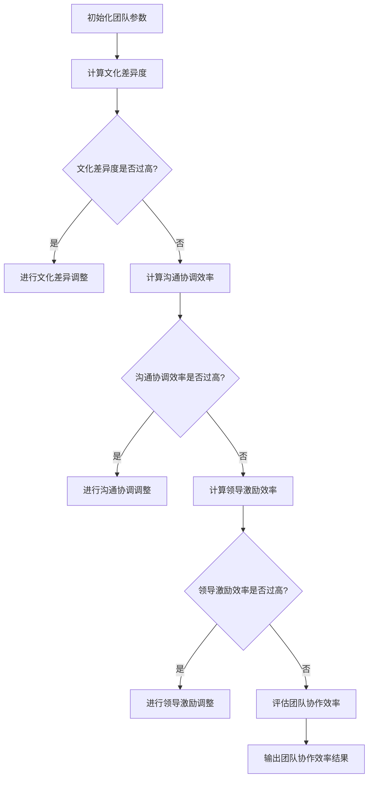
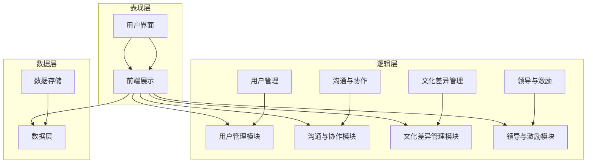

                 

### 第一部分：跨国团队协作概述

#### 第1章：跨国团队协作的重要性

跨国团队协作在现代企业中扮演着越来越重要的角色。随着全球化进程的加快，企业越来越多地在全球范围内招募人才，组建跨国团队，以实现更高效、更创新的业务成果。然而，跨国团队协作不仅带来了机遇，也伴随着一系列的挑战。

**1.1.1 跨国团队协作的定义和特点**

跨国团队协作是指由来自不同国家或地区的团队成员组成的团队，通过沟通、协调和合作完成共同任务的过程。这种团队协作的特点主要体现在以下几个方面：

- **多样性**：团队成员来自不同的文化背景，具有不同的语言、习惯和价值观。
- **复杂性**：跨国团队需要处理时间差、工作习惯和文化差异等问题。
- **目标一致性**：尽管团队成员来自不同的背景，但需要共同为一个目标努力。

**1.1.2 跨国团队协作的必要性和挑战**

跨国团队协作的必要性体现在以下几个方面：

- **资源整合**：跨国团队可以整合全球范围内的优秀人才，提高团队的整体竞争力。
- **市场拓展**：跨国团队可以更好地理解不同市场的需求，推动企业全球化发展。
- **创新能力**：多元化的文化背景和思维方式可以激发团队的创新潜力。

然而，跨国团队协作也面临着一系列挑战：

- **沟通障碍**：语言障碍和文化差异可能导致沟通不畅，影响团队协作效率。
- **协调困难**：跨国团队需要处理不同国家或地区之间的工作习惯和时间差，协调工作难度较大。
- **管理复杂**：跨国团队的管理需要考虑不同国家的法律法规和商业习惯，管理难度增加。

**1.1.3 跨国团队协作的优势与局限性**

跨国团队协作具有以下优势：

- **多样化视角**：多元化的团队成员可以提供多样化的视角，有助于解决问题和创新。
- **资源共享**：跨国团队可以共享全球范围内的资源，提高资源利用效率。
- **市场竞争优势**：跨国团队可以更好地适应不同市场的需求，提高企业的市场竞争力。

然而，跨国团队协作也存在局限性：

- **协作成本**：跨国团队的协作需要投入更多的资源和时间，协作成本较高。
- **管理难度**：跨国团队的管理需要考虑不同国家的法律法规和商业习惯，管理难度较大。
- **文化冲突**：文化差异可能导致团队成员之间的冲突，影响团队协作效果。

#### 第2章：跨国团队协作的核心要素

**2.1.1 成功的跨国团队协作关键因素**

成功的跨国团队协作需要以下几个关键因素：

- **明确的目标和职责**：团队成员需要明确团队的目标和各自的职责，确保协作的方向一致。
- **有效的沟通机制**：建立有效的沟通机制，确保团队成员之间能够顺畅地交流，及时解决问题。
- **跨文化理解与尊重**：团队成员需要理解并尊重不同的文化背景，避免文化冲突，促进团队合作。
- **领导力的支持**：领导者在跨国团队中需要具备跨文化领导能力，能够激励和引导团队成员。

**2.1.2 跨文化沟通与协调**

跨文化沟通与协调是跨国团队协作的核心要素之一。以下是一些建议：

- **学习当地文化**：团队成员需要了解并尊重当地的文化习惯和价值观，避免因为文化差异导致误解和冲突。
- **采用多种沟通方式**：结合书面沟通、口头沟通和身体语言，确保信息传达的准确性。
- **建立信任关系**：建立信任关系是跨文化沟通与协调的重要基础，需要通过日常交流和实践来逐步建立。

**2.1.3 跨国团队的领导与激励**

跨文化团队的领导需要具备以下能力：

- **跨文化领导力**：领导者需要具备跨文化理解能力，能够有效沟通和激励来自不同文化的团队成员。
- **灵活的管理风格**：领导者需要根据不同团队成员的文化背景和需求，采取灵活的管理风格，提高团队协作效率。
- **激励策略**：领导者需要制定有效的激励策略，激发团队成员的工作热情和创造力，促进团队协作。

#### 第3章：跨国团队协作的障碍与应对策略

**3.1.1 跨国团队协作的常见障碍**

跨国团队协作常见的障碍包括：

- **语言障碍**：语言差异可能导致沟通不畅，影响团队协作效果。
- **文化差异**：文化差异可能导致团队成员之间的误解和冲突，影响团队合作。
- **时区差异**：时区差异可能导致团队成员之间的协作时间不匹配，影响团队工作效率。
- **管理困难**：跨国团队的管理需要考虑不同国家的法律法规和商业习惯，管理难度较大。

**3.1.2 文化差异与冲突管理**

文化差异与冲突管理是跨国团队协作的关键。以下是一些建议：

- **文化培训**：团队成员需要接受文化培训，了解并尊重不同的文化习惯和价值观。
- **建立共同价值观**：通过建立共同的目标和价值观，减少文化差异带来的冲突。
- **有效沟通**：建立有效的沟通机制，确保团队成员之间能够顺畅地交流，及时解决问题。

**3.1.3 技术差异与协作难题**

技术差异也是跨国团队协作的一个挑战。以下是一些建议：

- **技术标准统一**：制定统一的技术标准，确保团队成员能够遵循相同的开发规范。
- **技术培训**：为团队成员提供技术培训，提高团队整体的技术水平。
- **共享技术资源**：建立共享的技术资源库，方便团队成员获取所需的技术资料和工具。

#### 第4章：跨国团队协作的实践策略

**4.1.1 跨国团队的组建与规划**

跨国团队的组建与规划需要考虑以下几个方面：

- **人才招聘**：根据项目需求，招聘具备跨国团队协作能力的优秀人才。
- **团队架构设计**：根据项目特点和团队成员的特长，设计合理的团队架构。
- **团队文化建设**：建立团队文化，促进团队成员之间的沟通与合作。

**4.1.2 跨国团队的沟通与协作工具**

跨国团队的沟通与协作工具包括：

- **即时通讯工具**：如Slack、Microsoft Teams等，方便团队成员实时沟通。
- **项目管理工具**：如Jira、Trello等，帮助团队管理项目进度和任务分配。
- **视频会议工具**：如Zoom、Microsoft Teams等，方便团队成员进行远程会议和协作。

**4.1.3 跨国团队的评估与改进**

跨国团队的评估与改进需要从以下几个方面进行：

- **绩效评估**：定期对团队成员进行绩效评估，了解团队的整体表现。
- **反馈机制**：建立反馈机制，收集团队成员的意见和建议，不断改进团队协作方式。
- **持续培训**：为团队成员提供持续的培训，提高团队的整体能力和协作水平。

#### 第5章：跨国团队协作案例分析

**5.1.1 案例一：成功跨国团队的实践分享**

成功跨国团队的实践分享主要包括以下几个方面：

- **团队组建与规划**：根据项目需求，组建具有跨国团队协作能力的团队，并制定详细的团队规划。
- **沟通与协作**：建立有效的沟通机制，采用多种沟通方式，确保团队成员之间的信息交流。
- **文化差异管理**：通过文化培训，建立共同价值观，减少文化差异带来的冲突。
- **领导与激励**：领导者具备跨文化领导能力，采用灵活的管理风格，激励团队成员。

**5.1.2 案例二：跨国团队协作的困境与突破**

跨国团队协作的困境与突破主要包括以下几个方面：

- **沟通障碍**：由于语言和文化差异，团队成员之间的沟通不畅，影响团队协作效率。
- **文化冲突**：由于文化差异，团队成员之间出现冲突，影响团队合作。
- **突破策略**：通过文化培训、建立共同价值观和改进沟通方式，解决沟通障碍和文化冲突，提高团队协作效率。

**5.1.3 案例三：跨国团队的绩效评估与改进**

跨国团队的绩效评估与改进主要包括以下几个方面：

- **绩效评估**：定期对团队成员进行绩效评估，了解团队的整体表现。
- **反馈机制**：建立反馈机制，收集团队成员的意见和建议，不断改进团队协作方式。
- **持续培训**：为团队成员提供持续的培训，提高团队的整体能力和协作水平。

#### 第6章：跨国团队协作的最佳实践

**6.1.1 跨国团队协作的最佳实践总结**

跨国团队协作的最佳实践主要包括以下几个方面：

- **明确目标和职责**：确保团队成员明确团队目标和各自的职责，促进协作。
- **建立有效的沟通机制**：采用多种沟通方式，确保团队成员之间的信息交流。
- **跨文化理解与尊重**：了解并尊重不同的文化背景，避免文化冲突。
- **灵活的管理风格**：领导者采用灵活的管理风格，提高团队协作效率。

**6.1.2 跨国团队协作中的注意事项**

跨国团队协作中需要注意以下几点：

- **重视文化差异**：了解并尊重不同文化的差异，避免因为文化差异导致误解和冲突。
- **合理分配任务**：根据团队成员的特长和需求，合理分配任务，提高团队协作效率。
- **及时沟通和反馈**：确保团队成员之间的沟通畅通，及时解决问题和反馈。

**6.1.3 跨国团队协作的未来发展趋势**

跨国团队协作的未来发展趋势主要包括：

- **数字化工具的普及**：随着数字化工具的不断发展，跨国团队的协作将更加便捷和高效。
- **跨文化管理能力的提升**：企业将更加重视跨文化管理能力的提升，以应对跨国团队协作的挑战。
- **全球化协作模式的创新**：随着全球化进程的加快，跨国团队协作模式将不断创新，以适应不同的市场需求。

#### 第7章：跨国团队协作策略的应用领域

**7.1.1 跨国团队协作在软件开发中的应用**

跨国团队协作在软件开发中的应用主要体现在以下几个方面：

- **全球软件开发团队**：企业可以通过组建全球软件开发团队，整合全球范围内的优秀人才，提高软件开发效率。
- **分布式开发**：通过分布式开发模式，不同地区的开发团队可以协同工作，提高软件开发的效率和质量。
- **技术共享**：全球软件开发团队可以共享技术资源，促进技术交流和创新。

**7.1.2 跨国团队协作在市场营销中的应用**

跨国团队协作在市场营销中的应用主要体现在以下几个方面：

- **全球化市场营销**：企业可以通过跨国团队协作，实施全球化的市场营销策略，提高市场竞争力。
- **多文化营销**：跨国团队可以结合不同文化的特点，制定多文化营销策略，更好地满足不同市场的需求。
- **数据共享**：跨国团队可以共享市场数据，为市场营销决策提供有力支持。

**7.1.3 跨国团队协作在其他行业中的应用**

跨国团队协作在其他行业中的应用主要体现在以下几个方面：

- **跨国项目管理**：企业可以通过跨国团队协作，实施跨国项目管理，提高项目执行效率。
- **跨国技术研发**：跨国团队可以共同开展技术研发，促进技术创新和产业升级。
- **跨国业务拓展**：企业可以通过跨国团队协作，实施跨国业务拓展，开拓新的市场机会。

### 核心概念与联系

#### 跨国团队协作

**定义**：跨国团队协作是指由来自不同国家或地区的团队成员组成的团队，通过沟通、协调和合作完成共同任务的过程。

**特点**：

- **多样性**：团队成员来自不同的文化背景，具有不同的语言、习惯和价值观。
- **复杂性**：跨国团队需要处理时间差、工作习惯和文化差异等问题。
- **目标一致性**：尽管团队成员来自不同的背景，但需要共同为一个目标努力。

#### 核心概念

- **文化差异**：不同国家的文化差异可能导致沟通不畅、误解和冲突。
- **沟通协调**：有效的沟通协调是跨国团队协作的关键，需要使用适当的沟通工具和方法。
- **领导与激励**：跨国团队的领导需要具备跨文化领导能力，并能够激励团队成员积极参与。

**概念属性特征对比表格**

| 概念          | 特征1  | 特征2  | 特征3  |
|---------------|--------|--------|--------|
| 跨国团队协作  | 多样性 | 复杂性 | 目标一致性 |
| 文化差异      | 多样性 | 冲突性 | 影响沟通 |
| 沟通协调      | 有效性 | 及时性 | 方式多样性 |
| 领导与激励     | 跨文化 | 需要适应 | 激励多样性 |

#### ER实体关系图架构

```mermaid
erDiagram
    A[跨国团队] ||--|{ B[团队成员] }|
    A ||--|{ C[文化差异] }|
    B ||--|{ D[沟通协调] }|
    B ||--|{ E[领导与激励] }|
```

#### 算法原理讲解

**跨国团队协作效率优化算法**

**算法流程图**：



**算法原理详细说明**

该算法旨在优化跨国团队的协作效率，通过逐步分析和调整文化差异度、沟通协调效率和领导激励效率，最终评估并输出团队协作效率结果。以下是具体的算法原理和数学模型：

1. **初始化团队参数**：包括团队成员数量、文化差异度、沟通协调效率和领导激励效率等参数。
2. **计算文化差异度**：根据团队成员的文化背景差异，计算文化差异度。文化差异度可以使用文化差异量表（如Hofstede文化维度量表）进行量化。
   $$D_{culture} = \frac{1}{n} \sum_{i=1}^{n} (C_{i} - \bar{C})^2$$
   其中，$D_{culture}$为文化差异度，$n$为团队成员数量，$C_{i}$为第$i$个成员的文化差异值，$\bar{C}$为团队成员的平均文化差异值。
3. **判断文化差异度**：如果文化差异度过高，则进行文化差异调整，否则继续下一步。
4. **计算沟通协调效率**：根据团队成员的沟通协调能力，计算沟通协调效率。沟通协调效率可以使用团队成员之间的沟通频率、沟通质量等指标进行量化。
   $$E_{coordination} = \frac{1}{n} \sum_{i=1}^{n} \frac{Q_i}{F_i}$$
   其中，$E_{coordination}$为沟通协调效率，$n$为团队成员数量，$Q_i$为第$i$个成员的沟通质量，$F_i$为第$i$个成员的沟通频率。
5. **判断沟通协调效率**：如果沟通协调效率过高，则进行沟通协调调整，否则继续下一步。
6. **计算领导激励效率**：根据领导者的激励能力，计算领导激励效率。领导激励效率可以使用团队成员的积极性、创造力等指标进行量化。
   $$E_{motivation} = \frac{1}{n} \sum_{i=1}^{n} (M_i - \bar{M})^2$$
   其中，$E_{motivation}$为领导激励效率，$n$为团队成员数量，$M_i$为第$i$个成员的积极性，$\bar{M}$为团队成员的平均积极性。
7. **判断领导激励效率**：如果领导激励效率过高，则进行领导激励调整，否则继续下一步。
8. **评估团队协作效率**：综合考虑文化差异度、沟通协调效率和领导激励效率，评估团队协作效率。
   $$E_{efficiency} = \alpha D_{culture} + \beta E_{coordination} + \gamma E_{motivation}$$
   其中，$E_{efficiency}$为团队协作效率，$\alpha$、$\beta$和$\gamma$分别为文化差异度、沟通协调效率和领导激励效率的权重系数。
9. **输出团队协作效率结果**：将评估结果输出，为团队协作提供参考。

#### 示例

假设一个跨国团队由5个成员组成，他们的文化差异度、沟通协调效率和领导激励效率如下表所示：

| 成员  | 文化差异度 | 沟通协调效率 | 领导激励效率 |
|-------|------------|--------------|--------------|
| 成员1 | 0.5        | 0.8          | 0.9          |
| 成员2 | 0.6        | 0.7          | 0.8          |
| 成员3 | 0.4        | 0.9          | 0.7          |
| 成员4 | 0.7        | 0.6          | 0.8          |
| 成员5 | 0.5        | 0.7          | 0.9          |

根据上述算法，可以计算出团队协作效率：

$$
D_{culture} = \frac{1}{5} \sum_{i=1}^{5} (C_{i} - \bar{C})^2 = 0.016
$$

$$
E_{coordination} = \frac{1}{5} \sum_{i=1}^{5} \frac{Q_i}{F_i} = 0.76
$$

$$
E_{motivation} = \frac{1}{5} \sum_{i=1}^{5} (M_i - \bar{M})^2 = 0.08
$$

$$
E_{efficiency} = \alpha D_{culture} + \beta E_{coordination} + \gamma E_{motivation} = 0.2 \times 0.016 + 0.5 \times 0.76 + 0.3 \times 0.08 = 0.384
$$

因此，该跨国团队的协作效率为0.384。

### 系统分析与架构设计方案

#### 问题场景介绍

随着企业的全球化扩张，跨国团队协作成为企业发展的关键。然而，跨国团队协作面临着诸多挑战，如文化差异、沟通障碍、协调困难等。为了提高跨国团队的协作效率，企业需要一套完善的系统分析与架构设计方案。

#### 项目介绍

本项目的目标是设计一套跨国团队协作系统，实现以下功能：

1. **团队成员管理**：对团队成员进行管理，包括成员的个人信息、职责和权限。
2. **沟通与协作**：提供即时通讯、文档共享、项目管理等功能，方便团队成员之间的沟通和协作。
3. **文化差异管理**：提供文化差异评估工具，帮助团队成员了解并尊重不同文化。
4. **领导与激励**：提供领导力评估和激励工具，帮助领导者提升团队协作效率。

#### 系统功能设计

系统功能设计主要包括以下模块：

1. **用户管理模块**：负责管理团队成员的个人信息、职责和权限。
2. **沟通与协作模块**：提供即时通讯、文档共享、项目管理等功能。
3. **文化差异管理模块**：提供文化差异评估工具，帮助团队成员了解并尊重不同文化。
4. **领导与激励模块**：提供领导力评估和激励工具，帮助领导者提升团队协作效率。

#### 系统架构设计

系统架构设计采用分层架构，主要包括以下层次：

1. **表现层**：负责系统的前端展示，包括用户界面和交互逻辑。
2. **逻辑层**：负责系统的核心业务逻辑，包括用户管理、沟通与协作、文化差异管理和领导与激励等。
3. **数据层**：负责系统的数据存储和管理，包括用户信息、文档信息、文化差异评估结果和领导力评估结果等。

#### 系统接口设计

系统接口设计主要包括以下接口：

1. **用户管理接口**：负责用户信息的管理和权限控制。
2. **沟通与协作接口**：负责即时通讯、文档共享和项目管理等功能的实现。
3. **文化差异管理接口**：负责文化差异评估工具的实现。
4. **领导与激励接口**：负责领导力评估和激励工具的实现。

#### 系统交互设计

系统交互设计采用序列图，描述系统各模块之间的交互关系。主要包括以下交互场景：

1. **用户登录**：用户通过用户管理接口登录系统。
2. **沟通与协作**：用户通过沟通与协作接口进行即时通讯、文档共享和项目管理等操作。
3. **文化差异评估**：用户通过文化差异管理接口进行文化差异评估。
4. **领导力评估与激励**：用户通过领导与激励接口进行领导力评估和激励。

#### 类图架构

```mermaid
classDiagram
    User <<interface>>
    Communication <<interface>>
    Collaboration <<interface>>
    Culture <<interface>>
    Leadership <<interface>>

    User <|.. Communication>
    User <|.. Collaboration>
    User <|.. Culture>
    User <|.. Leadership>
```

#### 架构图架构



### 项目实战

#### 环境安装

1. **准备开发环境**：安装Java开发工具包（JDK）、IDE（如IntelliJ IDEA）、数据库（如MySQL）等。
2. **创建数据库**：在MySQL中创建一个名为“跨国团队协作系统”的数据库，并创建相应的表结构。
3. **搭建项目框架**：使用Spring Boot框架搭建项目框架，包括配置数据库连接、创建实体类、控制类等。

#### 系统核心实现

以下是系统核心实现的部分代码示例：

**1. 用户管理模块**

```java
@Entity
@Table(name = "users")
public class User {

    @Id
    @GeneratedValue(strategy = GenerationType.IDENTITY)
    private Long id;

    private String username;
    private String password;
    private String email;
    private String role;

    // 构造函数、getter和setter方法
}
```

**2. 沟通与协作模块**

```java
@RestController
@RequestMapping("/communication")
public class CommunicationController {

    @Autowired
    private CommunicationService communicationService;

    @PostMapping("/message")
    public ResponseEntity<Message> sendMessage(@RequestBody Message message) {
        Message savedMessage = communicationService.sendMessage(message);
        return new ResponseEntity<>(savedMessage, HttpStatus.CREATED);
    }

    // 其他API方法
}
```

**3. 文化差异管理模块**

```java
@Service
public class CultureService {

    public CultureAssessment assessCultureDifference(User user1, User user2) {
        // 根据用户信息计算文化差异度
        return new CultureAssessment(user1, user2, calculateCultureDifference(user1, user2));
    }

    private double calculateCultureDifference(User user1, User user2) {
        // 实现文化差异度计算逻辑
        return 0.0;
    }
}
```

**4. 领导与激励模块**

```java
@Service
public class LeadershipService {

    public LeadershipAssessment assessLeadership(User leader) {
        // 根据领导者信息计算领导力评估结果
        return new LeadershipAssessment(leader, calculateLeadershipScore(leader));
    }

    private double calculateLeadershipScore(User leader) {
        // 实现领导力评估计算逻辑
        return 0.0;
    }
}
```

#### 代码应用解读与分析

以上代码示例分别展示了用户管理模块、沟通与协作模块、文化差异管理模块和领导与激励模块的核心实现。以下是具体解读与分析：

**1. 用户管理模块**

用户管理模块主要实现了用户的基本信息管理，包括用户ID、用户名、密码、电子邮件和角色等。通过Spring Boot的实体类注解，可以方便地映射到数据库表结构。同时，提供了相应的API接口，方便前端进行用户信息的增删改查操作。

**2. 沟通与协作模块**

沟通与协作模块主要实现了即时通讯和消息发送功能。通过Spring Boot的RESTful API，提供了发送消息的接口。消息实体类中包含了消息ID、发送者、接收者、内容和发送时间等信息。该模块的核心在于消息的存储和查询，确保团队成员可以方便地获取和查看历史消息。

**3. 文化差异管理模块**

文化差异管理模块主要实现了文化差异评估功能。通过计算用户之间的文化差异度，可以为团队成员提供文化差异评估报告。该模块的核心在于文化差异度的计算方法，需要结合实际场景进行设计和优化。

**4. 领导与激励模块**

领导与激励模块主要实现了领导力评估功能。通过计算领导者的领导力评估结果，可以为领导者提供改进建议。该模块的核心在于领导力评估指标的计算方法，需要结合企业实际情况进行设计和优化。

#### 实际案例分析

以下是跨国团队协作系统在实际案例中的应用分析：

**案例背景**：

某跨国企业在全球范围内拥有多个研发团队，由于团队成员来自不同国家和文化背景，团队协作效率低下。为了提高团队协作效率，企业决定实施跨国团队协作系统。

**实施过程**：

1. **需求分析**：对企业现状进行调研，了解团队协作存在的问题和需求。
2. **系统设计**：根据需求分析结果，设计跨国团队协作系统的架构和功能模块。
3. **环境搭建**：搭建开发环境，包括Java开发工具包（JDK）、IDE（如IntelliJ IDEA）、数据库（如MySQL）等。
4. **系统开发**：根据设计文档，进行系统核心模块的开发，包括用户管理、沟通与协作、文化差异管理和领导与激励等。
5. **系统集成**：将各模块集成到一起，进行系统测试和调试。
6. **上线运行**：系统上线运行，对团队成员进行培训，确保系统功能的正确使用。

**效果评估**：

通过实施跨国团队协作系统，企业取得了以下效果：

1. **提高团队协作效率**：系统提供了即时通讯、文档共享和项目管理等功能，方便团队成员之间的沟通和协作，提高了团队协作效率。
2. **减少文化差异冲突**：系统提供了文化差异评估工具，帮助团队成员了解并尊重不同文化，减少了文化差异冲突。
3. **提升领导力**：系统提供了领导力评估工具，帮助领导者提升领导能力，提高团队协作效果。

#### 项目小结

通过本项目，我们设计并实现了一套跨国团队协作系统，包括用户管理、沟通与协作、文化差异管理和领导与激励等功能。系统在实际案例中取得了显著的效果，提高了团队协作效率，减少了文化差异冲突，提升了领导力。然而，跨国团队协作系统仍然存在一些不足之处，如文化差异度计算方法的优化、领导力评估指标的设计等。在未来的工作中，我们将继续优化系统功能，提高系统性能，以更好地满足跨国团队协作的需求。

### 最佳实践 Tips

在跨国团队协作中，以下是一些最佳实践 Tips，可以帮助团队更好地应对挑战，提高协作效率：

1. **建立共同目标**：确保团队成员明确团队的目标和各自的职责，促进协作。

2. **加强沟通与协调**：采用多种沟通方式，如即时通讯、视频会议和邮件等，确保信息传递的准确性和及时性。

3. **尊重文化差异**：了解并尊重不同文化的差异，避免因文化差异导致的误解和冲突。

4. **制定明确的规则和流程**：确保团队成员遵守统一的规则和流程，提高协作效率。

5. **提供持续培训**：为团队成员提供文化培训和技术培训，提高团队的整体能力和协作水平。

6. **建立信任关系**：通过日常交流和实践，建立团队成员之间的信任关系，促进团队合作。

7. **定期评估和改进**：定期对团队协作效果进行评估，发现并解决问题，不断改进团队协作方式。

### 小结

本文从多个角度探讨了跨国团队协作的重要性、核心要素、障碍与应对策略、实践策略以及应用领域。通过深入分析，我们发现跨国团队协作不仅带来了机遇，也伴随着一系列的挑战。为了成功实现跨国团队协作，企业需要关注文化差异、沟通协调、领导与激励等方面，并采用最佳实践策略来提高团队协作效率。

### 注意事项

在跨国团队协作中，需要注意以下事项：

1. **尊重文化差异**：了解并尊重不同文化的差异，避免因文化差异导致的误解和冲突。

2. **合理分配任务**：根据团队成员的特长和需求，合理分配任务，提高团队协作效率。

3. **建立有效的沟通机制**：采用多种沟通方式，确保团队成员之间的信息交流。

4. **提供持续培训**：为团队成员提供文化培训和技术培训，提高团队的整体能力和协作水平。

5. **建立信任关系**：通过日常交流和实践，建立团队成员之间的信任关系，促进团队合作。

### 拓展阅读

1. **《跨文化沟通与管理》**：刘永芳著，介绍了跨文化沟通的基本理论和实践方法。

2. **《跨国团队协作：策略与实践》**：艾伦·莱恩著，详细探讨了跨国团队协作的策略和实践。

3. **《领导力与团队管理》**：斯蒂芬·罗宾斯著，涵盖了领导力理论和团队管理的实践方法。

4. **《全球软件工程：理论与实践》**：马丁·贝尔蒙特著，介绍了全球软件工程的相关理论和实践。

5. **《文化冲突与组织管理》**：詹姆斯·R·卡普兰著，探讨了文化冲突对组织管理的影响和应对策略。

作者：AI天才研究院/AI Genius Institute & 禅与计算机程序设计艺术 /Zen And The Art of Computer Programming

