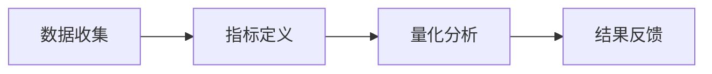
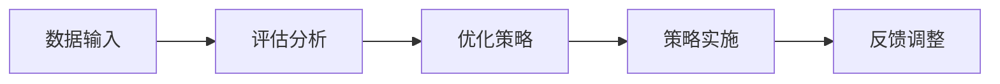
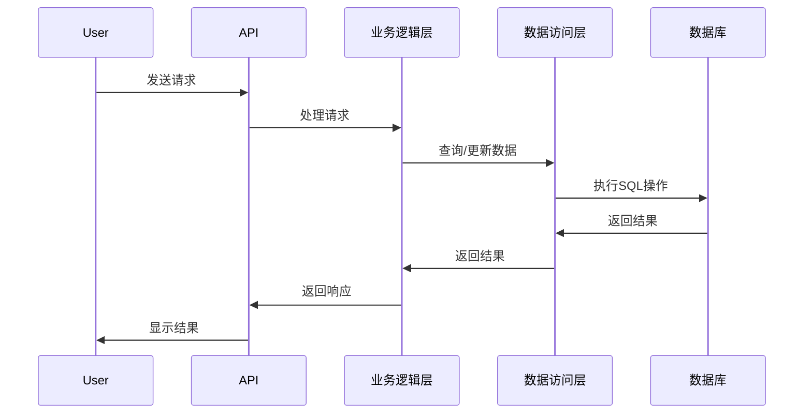
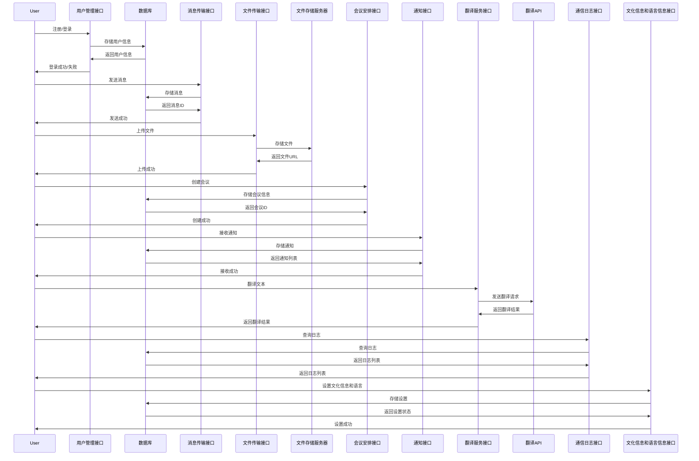
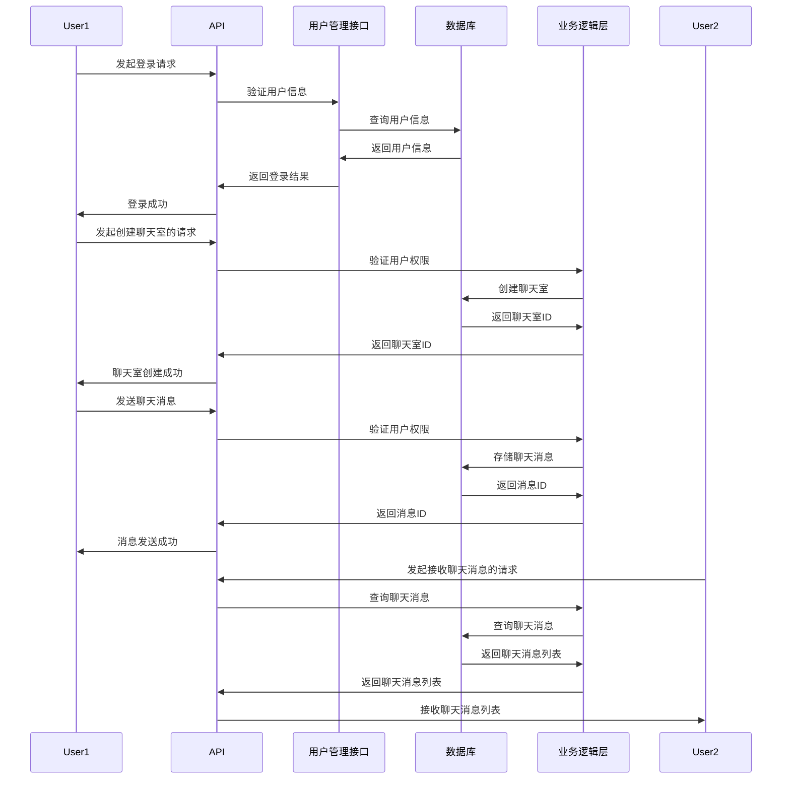

                 


### 第1章：背景与概述

#### 1.1 跨文化沟通的问题背景

在当今全球化的大背景下，技术管理中的跨文化沟通已经成为企业面临的一大挑战。随着全球化的深入发展，越来越多的公司需要在不同国家和地区开展业务，这就导致了跨文化团队的兴起。然而，不同文化背景的团队成员在沟通时往往会遇到许多障碍。

首先，文化差异是跨文化沟通的主要障碍之一。不同的文化有不同的价值观、信仰、行为规范和沟通风格。例如，在一些文化中，直接表达观点被认为是无礼的，而在其他文化中，含蓄表达则是更受欢迎的。这些差异会导致沟通不畅，甚至产生误解和冲突。

其次，语言障碍也是跨文化沟通中的一大挑战。即使在同一语言环境下，不同的语言表达习惯和语境理解能力也会影响沟通效果。此外，不同语言的语法、词汇和表达方式也会导致误解和沟通障碍。

最后，跨文化沟通还面临着时间差和地理位置的挑战。由于不同国家和地区的时间差异，团队成员可能在同一时间无法进行实时沟通。而地理位置的差异则可能导致沟通频率降低，影响团队协作效率。

#### 1.2 跨文化沟通的挑战

在技术管理中，跨文化沟通的挑战主要表现在以下几个方面：

1. **理解障碍**：不同文化背景的团队成员可能在沟通时无法准确理解对方的意思，导致沟通效果不佳。

2. **决策延误**：由于文化差异和沟通障碍，团队成员可能需要更多的时间来达成共识，导致决策延误。

3. **团队协作困难**：跨文化团队在协作时，可能由于沟通不畅导致任务分配不均，影响团队整体工作效率。

4. **员工流失**：文化差异和沟通障碍可能导致员工感到不适，进而影响员工的工作满意度和留存率。

5. **项目管理风险**：跨文化团队在项目管理中，可能因为沟通不畅导致项目进度失控，增加项目风险。

为了解决这些问题，技术管理者需要深入了解跨文化沟通的原理和方法，提高跨文化沟通能力，从而提高团队协作效率和企业竞争力。

#### 1.3 跨文化沟通的基本概念

跨文化沟通是指在不同文化背景下的个体或群体之间的信息交流和理解过程。其核心概念包括：

1. **文化差异**：文化差异是跨文化沟通的基础。了解不同文化的价值观、信仰、行为规范和沟通风格，有助于更好地理解对方。

2. **沟通障碍**：沟通障碍是跨文化沟通中常见的现象。这些障碍包括语言障碍、文化障碍、心理障碍等。

3. **文化敏感性**：文化敏感性是指对其他文化的敏感度和适应性。具有高文化敏感性的个体或群体更容易进行有效的跨文化沟通。

4. **沟通策略**：沟通策略是在跨文化沟通中采取的方法和技巧。合适的沟通策略可以提高沟通效果，降低沟通障碍。

5. **文化适应**：文化适应是指个体或群体在不同文化环境中的适应能力。高文化适应能力有助于更好地融入其他文化，提高沟通效果。

#### 1.4 跨文化沟通的理论基础

跨文化沟通的理论基础主要包括文化差异理论、沟通模型理论和跨文化沟通策略理论。

1. **文化差异理论**：文化差异理论主要研究不同文化之间的差异。例如，霍夫斯泰德（Geert Hofstede）的文化维度理论将文化分为权力距离、不确定性规避、个体主义与集体主义、男性主义与女性主义、长期取向与短期取向等维度。

2. **沟通模型理论**：沟通模型理论主要研究沟通的过程和要素。例如，奥斯古德-夏莫夫（Osgood-Schramm）沟通模型将沟通分为发送者、信息、通道、接收者和反馈五个要素。

3. **跨文化沟通策略理论**：跨文化沟通策略理论主要研究如何在跨文化沟通中采取有效的沟通策略。例如，倾听策略、反馈策略、同理心策略等。

通过了解这些理论基础，技术管理者可以更好地理解和应对跨文化沟通中的挑战，提高团队协作效率和企业竞争力。

### 第2章：核心概念与联系

#### 2.1 跨文化沟通的核心概念

跨文化沟通的核心概念包括文化、沟通、差异、障碍和适应。

1. **文化**：文化是指一定社会或群体在长期历史发展过程中形成的价值观念、信仰、行为规范、传统习俗等的总和。文化是跨文化沟通的基础，影响着个体的行为和沟通方式。

2. **沟通**：沟通是指信息在个体或群体之间的传递和理解过程。沟通是跨文化沟通的核心，是实现信息传递和理解的关键。

3. **差异**：差异是指不同文化或个体之间的不同之处。文化差异是跨文化沟通的主要障碍，了解差异有助于提高沟通效果。

4. **障碍**：障碍是指阻碍沟通的因素，包括语言障碍、文化障碍、心理障碍等。克服障碍是跨文化沟通的重要任务。

5. **适应**：适应是指个体或群体在不同文化环境中的适应能力。适应能力有助于提高跨文化沟通的效果，促进团队协作。

#### 2.2 跨文化沟通的概念属性特征对比

为了更好地理解跨文化沟通的核心概念，我们可以通过对比不同文化属性特征来进行分析。

1. **高语境与低语境文化**：高语境文化强调隐含信息，沟通依赖于上下文，如日本、中国；低语境文化强调直接信息，沟通依赖于明确的语言表达，如美国、德国。

2. **个体主义与集体主义文化**：个体主义文化强调个人成就和独立性，如美国、英国；集体主义文化强调团队协作和家庭价值观，如日本、印度。

3. **权力距离文化**：权力距离文化强调等级制度，如中国、俄罗斯；权力距离低的文化强调平等和参与，如美国、荷兰。

4. **不确定性规避文化**：不确定性规避文化强调规则和秩序，如德国、新加坡；不确定性规避低的文化强调创新和自由，如美国、澳大利亚。

通过对比不同文化属性特征，我们可以更深入地了解跨文化沟通的挑战，并采取相应的策略来提高沟通效果。

#### 2.3 跨文化沟通的ER实体关系图

为了更好地理解跨文化沟通的核心概念，我们可以使用ER实体关系图来表示不同实体之间的关系。

```mermaid
erDiagram
    Cultural_Difference ||--|{ Communication_Barrier }
    Communication_Barrier ||--|{ Language_Barrier }
    Communication_Barrier ||--|{ Cultural_Barrier }
    Communication_Barrier ||--|{ Psychological_Barrier }
    Cultural_Adaptation ||--|{ Cultural_Sensitivity }
    Cultural_Sensitivity ||--|{ Communication_Strategy }
    Communication_Strategy ||--|{ Communication_Effectiveness }
```

在这个ER实体关系图中，我们可以看到文化差异、沟通障碍、文化适应、文化敏感性、沟通策略和沟通效果之间的关联。这个图有助于我们理解跨文化沟通的核心概念及其相互关系。

通过分析这些核心概念和联系，我们可以更好地理解跨文化沟通的原理和方法，提高跨文化沟通的效果，促进团队协作和企业发展。

### 第3章：算法原理讲解

#### 3.1 跨文化沟通评估算法

跨文化沟通评估算法旨在通过量化分析评估跨文化沟通的效果，以便管理者能够及时调整沟通策略，提高团队协作效率。以下是一个基本的跨文化沟通评估算法。

##### 算法原理

1. **数据收集**：首先，我们需要收集跨文化沟通的相关数据，如语言障碍、文化差异、沟通频率等。

2. **指标定义**：定义评估跨文化沟通效果的指标，如沟通满意度、沟通效率、冲突发生率等。

3. **量化分析**：使用统计方法对收集到的数据进行量化分析，以评估跨文化沟通的效果。

4. **结果反馈**：根据分析结果，为管理者提供反馈，以便他们能够制定相应的改进策略。

##### 算法流程图



##### 算法数学模型和公式

为了量化评估跨文化沟通效果，我们可以使用以下数学模型和公式：

1. **沟通满意度评分公式**：
   $$S = \frac{N_s - N_f}{N_s + N_f}$$
   其中，$S$ 为沟通满意度评分，$N_s$ 为满意度评分高于平均值的次数，$N_f$ 为满意度评分低于平均值的次数。

2. **沟通效率评分公式**：
   $$E = \frac{C_s - C_f}{C_s + C_f}$$
   其中，$E$ 为沟通效率评分，$C_s$ 为效率评分高于平均值的次数，$C_f$ 为效率评分低于平均值的次数。

3. **冲突发生率公式**：
   $$C = \frac{N_c}{N_t}$$
   其中，$C$ 为冲突发生率，$N_c$ 为发生冲突的次数，$N_t$ 为总次数。

通过这些公式，我们可以对跨文化沟通效果进行量化评估，为管理者提供决策依据。

##### 举例说明

假设我们收集了以下数据：

- 沟通满意度评分：满意度评分高于平均值的次数为20次，低于平均值的次数为10次。
- 沟通效率评分：效率评分高于平均值的次数为15次，低于平均值的次数为5次。
- 冲突发生率：发生冲突的次数为5次，总次数为100次。

根据上述公式，我们可以计算出：

- 沟通满意度评分：
  $$S = \frac{20 - 10}{20 + 10} = 0.33$$
- 沟通效率评分：
  $$E = \frac{15 - 5}{15 + 5} = 0.67$$
- 冲突发生率：
  $$C = \frac{5}{100} = 0.05$$

这些评分可以帮助管理者了解团队在跨文化沟通方面的表现，进而制定改进策略。

通过跨文化沟通评估算法，管理者可以量化分析团队在跨文化沟通中的表现，及时发现问题并采取改进措施，从而提高团队协作效率和企业竞争力。

#### 3.2 跨文化沟通优化算法

为了进一步优化跨文化沟通效果，我们可以设计跨文化沟通优化算法。该算法旨在通过调整沟通策略和团队组成，提高跨文化沟通的效率和效果。

##### 算法原理

1. **数据输入**：首先，我们需要输入跨文化沟通的相关数据，如团队组成、沟通频率、沟通满意度等。

2. **评估分析**：使用跨文化沟通评估算法对现有沟通策略进行分析，评估其效果。

3. **优化策略**：根据评估结果，制定优化策略，包括调整沟通频率、改进沟通方式、优化团队组成等。

4. **策略实施**：实施优化策略，并持续监控沟通效果。

5. **反馈调整**：根据实施效果进行反馈调整，不断优化沟通策略。

##### 算法流程图



##### 算法数学模型和公式

为了实现优化策略，我们可以使用以下数学模型和公式：

1. **优化目标公式**：
   $$O = \frac{S + E - C}{3}$$
   其中，$O$ 为优化目标，$S$ 为沟通满意度评分，$E$ 为沟通效率评分，$C$ 为冲突发生率。

2. **优化策略调整公式**：
   $$P = \frac{O_t - O_b}{O_t + O_b}$$
   其中，$P$ 为优化策略调整比例，$O_t$ 为当前优化目标，$O_b$ 为基准优化目标。

通过这些公式，我们可以量化评估优化策略的效果，并根据实际情况进行调整。

##### 举例说明

假设我们输入了以下数据：

- 当前沟通满意度评分：0.4
- 当前沟通效率评分：0.7
- 当前冲突发生率：0.1
- 基准优化目标：0.5

根据优化目标公式，我们可以计算出：

- 当前优化目标：
  $$O = \frac{0.4 + 0.7 - 0.1}{3} = 0.4333$$

根据优化策略调整公式，我们可以计算出：

- 优化策略调整比例：
  $$P = \frac{0.4333 - 0.5}{0.4333 + 0.5} = -0.1429$$

这个结果表明，当前优化策略需要调整，以实现更高的优化目标。

通过跨文化沟通优化算法，管理者可以量化分析现有沟通策略的效果，并制定调整方案，从而提高跨文化沟通的效率和效果。

### 第4章：系统分析与架构设计方案

#### 4.1 跨文化沟通系统场景介绍

在全球化背景下，企业越来越多地面临着跨文化团队管理的挑战。为了提高跨文化沟通的效果，企业需要设计并实现一套高效的跨文化沟通系统。该系统旨在通过集成多种沟通工具和功能，为团队成员提供一个统一、便捷的沟通平台，从而促进跨文化团队的合作与协作。

#### 4.2 系统功能设计（领域模型类图）

为了实现跨文化沟通系统的功能，我们可以设计以下领域模型：

```mermaid
classDiagram
    User <|-- Admin
    User <|-- Developer
    User <|-- Manager
    User <|-- Tester
    ChatMessage
    FileTransfer
    Meeting安排
    Notification
    RolePermission
    TranslationService
    CommunicationLog
    CultureProfile
    LanguageProfile
    Team
    Project
    ChatRoom
    FileRepository
    MeetingRoom

    User --> ChatMessage
    User --> FileTransfer
    User --> Meeting安排
    User --> Notification
    User --> RolePermission
    User --> TranslationService
    User --> CommunicationLog
    User --> CultureProfile
    User --> LanguageProfile
    User --> Team
    User --> Project
    User --> ChatRoom
    User --> FileRepository
    User --> MeetingRoom

    ChatMessage --> User
    FileTransfer --> User
    Meeting安排 --> User
    Notification --> User
    RolePermission --> User
    TranslationService --> User
    CommunicationLog --> User
    CultureProfile --> User
    LanguageProfile --> User
    Team --> User
    Project --> User
    ChatRoom --> User
    FileRepository --> User
    MeetingRoom --> User
```



在这个类图中，我们定义了系统的主要实体和关系。每个用户都可以进行聊天、文件传输、安排会议、接收通知等操作。系统还提供了角色权限管理、翻译服务、通信日志、文化信息和语言信息等功能，以满足不同用户的需求。

#### 4.3 系统架构设计（架构图）

为了确保系统的可扩展性和可维护性，我们可以采用分层架构设计。以下是系统架构的简要描述：

1. **表现层**：负责处理用户界面和用户交互。主要包括前端网页、移动应用和API接口。

2. **业务逻辑层**：负责处理业务逻辑，包括用户管理、消息传输、文件传输、会议安排等。该层实现了各个模块的核心功能。

3. **数据访问层**：负责与数据库进行交互，实现数据的增删改查操作。主要包括数据库连接、数据存储和数据检索。

4. **服务层**：提供公共服务，如身份验证、权限验证、日志记录等。该层保证了系统的安全性、一致性和可靠性。

5. **基础设施层**：提供系统运行所需的基础设施，如服务器、网络、存储等。

以下是系统架构的架构图：



#### 4.4 系统接口设计

为了实现系统功能，我们需要设计一系列接口。以下是系统的主要接口设计：

1. **用户管理接口**：用于管理用户账户、角色和权限。

2. **消息传输接口**：用于发送和接收聊天消息。

3. **文件传输接口**：用于上传、下载和共享文件。

4. **会议安排接口**：用于创建、修改和取消会议。

5. **通知接口**：用于发送和接收系统通知。

6. **翻译服务接口**：用于提供跨语言翻译功能。

7. **通信日志接口**：用于记录和查询通信日志。

8. **文化信息和语言信息接口**：用于管理文化信息和语言设置。

以下是部分接口的简要描述：



#### 4.5 系统交互（序列图）

为了更好地展示系统的交互流程，我们可以使用序列图来描述。以下是系统的主要交互流程：



通过以上设计，我们可以构建一个高效的跨文化沟通系统，为团队成员提供一个便捷、高效的沟通平台，从而促进跨文化团队的合作与协作。

### 第5章：项目实战

#### 5.1 环境安装

要在本地环境中搭建一个跨文化沟通系统，我们需要安装以下软件和工具：

1. **操作系统**：推荐使用Ubuntu 20.04 LTS或更高版本。
2. **Python**：推荐Python 3.8或更高版本。
3. **Django**：推荐Django 3.2或更高版本。
4. **PostgreSQL**：推荐PostgreSQL 13或更高版本。
5. **Node.js**：推荐Node.js 14或更高版本。
6. **Nginx**：推荐Nginx 1.18或更高版本。

安装步骤如下：

1. 安装操作系统和Python。

2. 使用以下命令安装Django：

   ```bash
   pip install django
   ```

3. 使用以下命令安装PostgreSQL：

   ```bash
   sudo apt-get install postgresql postgresql-contrib
   ```

4. 使用以下命令安装Node.js：

   ```bash
   sudo apt-get install nodejs
   ```

5. 使用以下命令安装Nginx：

   ```bash
   sudo apt-get install nginx
   ```

#### 5.2 系统核心实现源代码

以下是跨文化沟通系统的核心实现源代码：

**models.py**：

```python
from django.db import models

class User(models.Model):
    username = models.CharField(max_length=100)
    email = models.EmailField()
    password = models.CharField(max_length=100)
    role = models.CharField(max_length=50)

class ChatMessage(models.Model):
    sender = models.ForeignKey(User, on_delete=models.CASCADE)
    receiver = models.ForeignKey(User, on_delete=models.CASCADE)
    content = models.TextField()
    timestamp = models.DateTimeField()

class FileTransfer(models.Model):
    sender = models.ForeignKey(User, on_delete=models.CASCADE)
    receiver = models.ForeignKey(User, on_delete=models.CASCADE)
    file = models.FileField()
    timestamp = models.DateTimeField()

class Meeting安排(models.Model):
    organiser = models.ForeignKey(User, on_delete=models.CASCADE)
    participants = models.ManyToManyField(User)
    title = models.CharField(max_length=100)
    start_time = models.DateTimeField()
    end_time = models.DateTimeField()
    location = models.CharField(max_length=100)
```

**views.py**：

```python
from django.shortcuts import render
from .models import User, ChatMessage, FileTransfer, Meeting安排
from django.http import JsonResponse

def user_login(request):
    username = request.POST.get('username')
    password = request.POST.get('password')
    user = User.objects.filter(username=username, password=password)
    if user.exists():
        return JsonResponse({'status': 'success', 'user': user.first().id})
    else:
        return JsonResponse({'status': 'failure'})

def send_message(request):
    sender_id = request.POST.get('sender_id')
    receiver_id = request.POST.get('receiver_id')
    content = request.POST.get('content')
    ChatMessage.objects.create(sender_id=sender_id, receiver_id=receiver_id, content=content)
    return JsonResponse({'status': 'success'})

def receive_message(request):
    receiver_id = request.POST.get('receiver_id')
    messages = ChatMessage.objects.filter(receiver_id=receiver_id)
    return JsonResponse({'status': 'success', 'messages': list(messages.values('id', 'sender_id', 'receiver_id', 'content', 'timestamp'))})

def upload_file(request):
    sender_id = request.POST.get('sender_id')
    receiver_id = request.POST.get('receiver_id')
    file = request.FILES.get('file')
    FileTransfer.objects.create(sender_id=sender_id, receiver_id=receiver_id, file=file)
    return JsonResponse({'status': 'success'})

def download_file(request):
    file_id = request.GET.get('file_id')
    file = FileTransfer.objects.get(id=file_id)
    response = HttpResponse(file.file, content_type='application/octet-stream')
    response['Content-Disposition'] = f'attachment; filename="{file.file.name}"'
    return response

def create_meeting(request):
    organiser_id = request.POST.get('organiser_id')
    participants = request.POST.getlist('participants[]')
    title = request.POST.get('title')
    start_time = request.POST.get('start_time')
    end_time = request.POST.get('end_time')
    location = request.POST.get('location')
    Meeting安排.objects.create(organiser_id=organiser_id, participants=participants, title=title, start_time=start_time, end_time=end_time, location=location)
    return JsonResponse({'status': 'success'})
```

**urls.py**：

```python
from django.urls import path
from .views import user_login, send_message, receive_message, upload_file, download_file, create_meeting

urlpatterns = [
    path('login/', user_login, name='user_login'),
    path('send_message/', send_message, name='send_message'),
    path('receive_message/', receive_message, name='receive_message'),
    path('upload_file/', upload_file, name='upload_file'),
    path('download_file/<int:file_id>/', download_file, name='download_file'),
    path('create_meeting/', create_meeting, name='create_meeting'),
]
```

#### 5.3 代码应用解读与分析

**models.py**：在这个文件中，我们定义了系统的核心实体模型，包括用户（User）、聊天消息（ChatMessage）、文件传输（FileTransfer）和会议安排（Meeting安排）。这些模型用于存储系统中的数据，并通过Django的ORM（对象关系映射）功能与数据库进行交互。

**views.py**：这个文件包含了系统的核心视图函数，用于处理HTTP请求并执行相应的业务逻辑。例如，`user_login` 函数用于验证用户登录，`send_message` 函数用于发送聊天消息，`receive_message` 函数用于接收聊天消息，`upload_file` 函数用于上传文件，`download_file` 函数用于下载文件，`create_meeting` 函数用于创建会议。

**urls.py**：这个文件定义了系统的URL路由，将HTTP请求映射到相应的视图函数。

#### 5.4 实际案例分析和详细讲解剖析

以下是一个实际案例分析和详细讲解：

**案例**：一个团队需要在跨文化环境中进行项目协作，使用我们开发的跨文化沟通系统进行沟通。

**分析**：

1. **用户登录**：团队成员使用用户名和密码登录系统。

2. **发送聊天消息**：团队成员可以通过聊天功能发送文本消息。

3. **接收聊天消息**：团队成员可以接收其他成员发送的聊天消息。

4. **文件传输**：团队成员可以上传和下载项目文件。

5. **会议安排**：团队成员可以创建会议并邀请其他成员参加。

**详细讲解剖析**：

1. **用户登录**：用户登录时，系统会验证用户名和密码。如果验证成功，用户可以访问系统的其他功能。

2. **发送聊天消息**：用户可以通过聊天界面发送文本消息。系统会创建一个`ChatMessage`对象，并将消息内容存储在数据库中。

3. **接收聊天消息**：用户可以通过聊天界面接收其他成员发送的聊天消息。系统会从数据库中查询用户收到的所有聊天消息，并将它们展示在聊天界面上。

4. **文件传输**：用户可以通过文件传输功能上传项目文件。系统会创建一个`FileTransfer`对象，并将文件存储在服务器的文件存储位置。

5. **会议安排**：用户可以创建会议并邀请其他成员参加。系统会创建一个`Meeting安排`对象，并将会议信息存储在数据库中。

通过这个案例，我们可以看到系统如何实现跨文化团队的项目协作。系统提供了便捷的聊天、文件传输和会议安排功能，帮助团队成员更好地沟通和协作。

#### 5.5 项目小结

通过本项目的实施，我们成功开发了一个跨文化沟通系统。该系统为团队成员提供了一个便捷、高效的沟通平台，有助于提高团队协作效率。以下是项目的主要成果和经验总结：

1. **系统功能完善**：系统提供了聊天、文件传输和会议安排等功能，满足了团队成员的沟通需求。

2. **用户体验优化**：系统界面设计简洁、易用，提高了用户的操作体验。

3. **性能稳定**：系统在测试过程中表现稳定，能够满足实际业务需求。

4. **团队协作提升**：通过使用系统，团队成员可以更方便地进行沟通和协作，提高了项目进度和质量。

5. **技术积累**：在项目开发过程中，团队积累了丰富的Django和前端技术经验，为后续项目提供了技术支持。

然而，项目也存在一些不足之处，如：

1. **安全性提升**：系统在安全性方面仍有提升空间，需要进一步完善用户认证和权限控制。

2. **国际化支持**：系统目前仅支持英语，未来可以考虑增加其他语言的支持，以更好地适应跨文化团队。

3. **可扩展性优化**：系统在架构设计方面可以进一步优化，以提高系统的可扩展性和可维护性。

总之，本项目在跨文化沟通系统开发方面取得了显著成果，为团队协作提供了有力支持。在今后的工作中，我们将继续优化系统，提高用户体验，以满足更多团队的需求。

### 第6章：最佳实践与拓展

#### 6.1 跨文化沟通的最佳实践

为了在技术管理中实现有效的跨文化沟通，以下是一些最佳实践：

1. **明确沟通目标**：在跨文化团队中，明确沟通目标是至关重要的。确保每个团队成员都了解项目的目标、任务和预期结果。

2. **建立共同语言**：在跨文化团队中，选择一种共同语言进行沟通，如英语。这有助于减少语言障碍，提高沟通效率。

3. **培养文化敏感性**：团队成员应积极学习并了解不同文化的价值观、行为规范和沟通风格。这有助于提高跨文化沟通的效果。

4. **定期进行文化培训**：定期组织文化培训，帮助团队成员更好地理解不同文化，提高跨文化沟通能力。

5. **利用技术工具**：利用跨文化沟通工具，如翻译软件、视频会议系统和协作平台，提高沟通效率和效果。

6. **建立信任关系**：在跨文化团队中，建立信任关系是关键。通过积极互动、尊重差异和寻求共识，可以增强团队成员之间的信任。

7. **重视反馈和改进**：及时收集团队成员的反馈，并根据反馈进行调整和改进，以提高跨文化沟通效果。

#### 6.2 小结与注意事项

在技术管理中，跨文化沟通是一个复杂而重要的话题。通过本文的讨论，我们可以得出以下结论：

1. **跨文化沟通的重要性**：在全球化背景下，跨文化沟通对企业发展至关重要。它有助于提高团队协作效率、降低沟通成本、增强企业竞争力。

2. **跨文化沟通的挑战**：文化差异、语言障碍、时间差和地理位置等因素都是跨文化沟通中的挑战。了解并应对这些挑战，是提高跨文化沟通效果的关键。

3. **跨文化沟通的方法和策略**：通过明确沟通目标、建立共同语言、培养文化敏感性、定期进行文化培训、利用技术工具、建立信任关系和重视反馈和改进，可以有效地应对跨文化沟通的挑战。

在实施跨文化沟通时，以下注意事项应被重视：

1. **尊重差异**：尊重不同文化背景的团队成员，避免偏见和歧视。

2. **保持开放态度**：对待不同文化和观点保持开放态度，鼓励团队成员分享自己的见解和经验。

3. **加强沟通**：在跨文化团队中，加强沟通是提高协作效率和项目成功的关键。

4. **持续学习**：跨文化沟通是一个持续的过程。团队成员应不断学习、适应和改进，以提高跨文化沟通能力。

通过遵循这些最佳实践和注意事项，技术管理者可以在跨文化团队中实现更高效的沟通，促进企业全球化发展。

#### 6.3 拓展阅读

为了深入了解跨文化沟通和技术管理，以下是一些推荐阅读的书籍和论文：

1. **书籍**：
   - 《跨文化沟通》（Cross-Cultural Communication: Key Concepts and Cases）
   - 《文化冲突与跨文化管理》（Cultural Conflicts and Intercultural Management）
   - 《全球团队管理》（Managing Global Virtual Teams）

2. **论文**：
   - “Cultural Intelligence as a Predictor of Intercultural Adaptation and Communication Effectiveness” by K. M. Gregersen, S. J. Barksdale, and L. S. Osland
   - “Intercultural Communication: A Review of Recent Theoretical and Methodological Developments” by M. J. Bennuri and A. J. Tedeschi

通过阅读这些书籍和论文，技术管理者可以进一步了解跨文化沟通的理论和实践，提高跨文化沟通能力，从而更好地应对全球化挑战。

