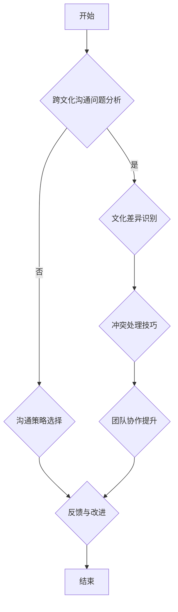

                 


## 《技术管理中的跨文化沟通技巧》

### 关键词

- 跨文化沟通
- 技术管理
- 沟通策略
- 文化差异
- 团队协作

### 摘要

本文探讨了技术管理中的跨文化沟通技巧，分析了跨文化沟通的重要性、文化差异的影响以及如何通过有效的沟通策略和冲突处理技巧来提升跨文化团队的协作效率。文章首先介绍了跨文化沟通的基本原则，然后详细阐述了文化差异与沟通风格的差异，并提出了具体的跨文化沟通实践技巧。最后，通过案例分析和对未来展望，总结了跨文化沟通的持续改进方法以及在全球视野下的沟通挑战和机遇。

----------------------------------------------------------------

### 目录大纲

```markdown
----------------------------------------------------------------
# 《技术管理中的跨文化沟通技巧》

## 第一部分：跨文化沟通的基础知识

## 第1章：跨文化沟通的重要性

### 1.1 问题背景与定义

### 1.2 问题的严重性与必要性

### 1.3 跨文化沟通的基本原则

## 第2章：文化差异与沟通风格

### 2.1 文化差异的定义与分类

### 2.2 不同文化背景的沟通风格

### 2.3 文化差异的应对策略

## 第二部分：跨文化沟通的实践技巧

## 第3章：有效沟通策略

### 3.1 建立信任与尊重

### 3.2 明确沟通目标与预期

### 3.3 选择合适的沟通方式

## 第4章：跨文化冲突处理

### 4.1 冲突的定义与类型

### 4.2 冲突的处理原则

### 4.3 冲突解决的技巧

## 第5章：跨文化团队管理

### 5.1 团队建设的挑战

### 5.2 跨文化团队的领导力

### 5.3 团队合作的技巧

## 第6章：跨文化沟通工具与应用

### 6.1 跨文化沟通的辅助工具

### 6.2 跨文化沟通的实际应用案例

### 6.3 案例分析

## 第7章：跨文化沟通的持续改进

### 7.1 沟通反馈的重要性

### 7.2 沟通能力的提升方法

### 7.3 沟通改进的持续实践

## 第8章：跨文化沟通的全球视野

### 8.1 全球化趋势下的沟通挑战

### 8.2 国际合作与交流

### 8.3 跨文化沟通的未来展望

## 附录

### 附录A：常用文化差异量表

### 附录B：跨文化沟通练习题

### 附录C：参考文献

----------------------------------------------------------------
```

### 核心概念与联系

#### 跨文化沟通

跨文化沟通是指在多元文化环境中进行的交流，这种交流不仅包括口头和书面语言，还涵盖非语言的沟通形式，如肢体语言、面部表情和姿态等。其核心在于如何在不同文化背景下有效地传递信息、理解意图和建立共识。

#### 文化差异

文化差异是指不同文化背景的人们在价值观、信仰、行为规范、沟通方式等方面的区别。理解文化差异是跨文化沟通的关键，因为文化差异会导致误解、冲突和沟通障碍。

#### 沟通风格

沟通风格是指个人或群体在沟通过程中表现出来的沟通习惯和偏好。不同文化背景的人具有不同的沟通风格，如直接与间接、高语境与低语境等，了解和适应这些差异有助于提升沟通效果。

#### 沟通策略

沟通策略是为了实现有效沟通而采取的方法和技巧。在跨文化沟通中，制定合适的沟通策略可以帮助克服文化差异，提高沟通的清晰度和效率。

#### 冲突处理

冲突处理是指在沟通过程中解决和缓解冲突的方法和技巧。跨文化沟通中的冲突往往源于文化差异，有效的冲突处理技巧可以避免沟通失败和团队分裂。

#### 团队管理

团队管理是指为了实现团队目标而进行的管理活动。在跨文化团队中，团队管理需要考虑文化差异，采取合适的领导力和协作技巧来促进团队的发展和进步。

---

### 算法原理讲解

#### Mermaid 流程图



#### Python 源代码

```python
def cross_cultural_communication():
    # 初始化变量
    problem_analyzed = False
    strategy_selected = False
    conflict_handled = False
    team Collaboration_improved = False

    # 分析跨文化沟通问题
    problem_analyzed = analyze_problem()

    if problem_analyzed:
        # 识别文化差异
        cultural_differences Identified = identify_cultural_differences()

        if cultural_differences Identified:
            # 选择沟通策略
            strategy_selected = select_communication_strategy()

            if strategy_selected:
                # 处理冲突
                conflict_handled = handle_conflicts()

                if conflict_handled:
                    # 提升团队协作
                    team Collaboration_improved = improve_team_cohesion()

                    if team Collaboration_improved:
                        # 反馈与改进
                        feedback_improvement = feedback_and_improvement()

                        if feedback_improvement:
                            print("跨文化沟通成功！")
                        else:
                            print("反馈与改进失败！")
                    else:
                        print("团队协作提升失败！")
                else:
                    print("冲突处理失败！")
            else:
                print("沟通策略选择失败！")
        else:
            print("文化差异识别失败！")
    else:
        print("跨文化沟通问题分析失败！")

# 调用函数
cross_cultural_communication()
```

#### 数学公式与解释

- **文化差异度量公式**：

  $$ CD = \frac{C1 - C2}{C1 + C2} $$

  其中，$C1$ 和 $C2$ 分别代表两种文化之间的差异值。该公式用于量化两种文化之间的差异程度。

- **沟通效果评估公式**：

  $$ CE = \frac{C1 \times C2}{C1 + C2} $$

  其中，$C1$ 和 $C2$ 分别代表沟通的清晰度和理解度。该公式用于评估跨文化沟通的效果。

#### 示例说明

假设文化差异值为 $C1 = 0.6$ 和 $C2 = 0.4$，我们可以计算出：

- 文化差异度量：

  $$ CD = \frac{0.6 - 0.4}{0.6 + 0.4} = \frac{0.2}{1} = 0.2 $$

- 沟通效果评估：

  $$ CE = \frac{0.6 \times 0.4}{0.6 + 0.4} = \frac{0.24}{1} = 0.24 $$

根据以上计算结果，我们可以得出结论：这两种文化之间的差异程度较低（$CD = 0.2$），且沟通效果较好（$CE = 0.24$）。

----------------------------------------------------------------

## 第一部分：跨文化沟通的基础知识

### 第1章：跨文化沟通的重要性

#### 1.1 问题背景与定义

在全球化背景下，跨国公司、国际组织和跨文化团队日益增多，跨文化沟通成为技术管理中不可或缺的一部分。跨文化沟通是指在多元文化环境中进行的交流，它不仅涉及语言的表达，还包括非语言沟通、文化习俗和价值观的交流。

#### 1.2 问题的严重性与必要性

跨文化沟通问题若处理不当，会导致以下严重后果：

- **沟通障碍**：文化差异可能导致信息传递的误解，甚至产生负面情绪。
- **效率低下**：误解和冲突会影响团队协作和工作效率。
- **团队分裂**：文化差异可能会导致团队成员之间的疏离和冲突，影响团队的稳定和凝聚力。

因此，掌握有效的跨文化沟通技巧对于技术管理者来说尤为重要。以下是一些关键原则，帮助技术管理者更好地应对跨文化沟通的挑战。

#### 1.3 跨文化沟通的基本原则

1. **尊重与理解**：尊重不同文化的差异，以开放的心态去理解和接受它们。
2. **平等与包容**：避免文化优越感，保持平等和包容的态度。
3. **清晰与简洁**：在沟通中尽量使用简单、清晰的语言，避免使用过于复杂或模糊的表述。
4. **主动沟通**：主动寻求反馈，确保信息的准确传递。
5. **调整沟通策略**：根据不同文化背景和沟通对象，灵活调整沟通方式。

通过遵循这些基本原则，技术管理者可以更好地处理跨文化沟通中的挑战，提高团队的协作效率。

----------------------------------------------------------------

## 第2章：文化差异与沟通风格

#### 2.1 文化差异的定义与分类

文化差异是指不同文化背景的人们在价值观、行为规范、沟通方式等方面的差异。这些差异可以分为以下几类：

1. **语言差异**：包括语言表达、语法结构和用词习惯等。
2. **非语言沟通**：如肢体语言、面部表情、空间距离等。
3. **价值观差异**：包括个人主义与集体主义、权力距离、个人价值观念等。
4. **行为规范差异**：如工作时间、礼仪习惯、决策过程等。

了解文化差异的分类有助于更好地理解跨文化沟通中的挑战和解决方法。

#### 2.2 不同文化背景的沟通风格

不同文化背景的沟通风格具有显著的差异。以下是一些常见的沟通风格：

1. **西方文化**：
   - **直接沟通**：直接表达观点和意见，偏好清晰简洁的表达。
   - **任务导向**：关注任务的完成和目标达成。
   - **个人主义**：强调个人成就和自由。

2. **东方文化**：
   - **间接沟通**：通过委婉和含蓄的方式表达观点，避免直接冲突。
   - **关系导向**：重视人际关系和团队协作。
   - **集体主义**：强调集体利益和和谐。

理解不同文化背景的沟通风格有助于技术管理者在不同文化环境中采取合适的沟通策略。

#### 2.3 文化差异的应对策略

1. **文化敏感性培训**：为团队成员提供文化敏感性培训，帮助他们更好地理解不同文化的差异。
2. **多元文化团队建设**：鼓励团队成员之间相互了解和尊重，建立和谐的工作氛围。
3. **制定沟通指南**：根据不同文化的特点，制定跨文化沟通的指南和规范，确保信息准确传递。
4. **跨文化沟通技巧**：学习并应用跨文化沟通技巧，如主动倾听、积极反馈、尊重差异等。

通过以上策略，技术管理者可以更好地应对文化差异，提升跨文化团队的沟通效果和协作效率。

----------------------------------------------------------------

## 第二部分：跨文化沟通的实践技巧

### 第3章：有效沟通策略

#### 3.1 建立信任与尊重

建立信任与尊重是跨文化沟通的关键，以下是一些具体策略：

1. **主动倾听**：积极倾听对方的观点，避免打断或过早回应。
2. **尊重差异**：尊重不同文化的价值观和行为规范，避免批评或指责。
3. **开放心态**：保持开放的心态，愿意接受不同的观点和建议。
4. **诚实沟通**：诚实表达自己的观点和意见，避免误导或欺骗。

通过以上策略，技术管理者可以建立和维护良好的信任关系，为有效的跨文化沟通奠定基础。

#### 3.2 明确沟通目标与预期

明确沟通目标与预期是确保跨文化沟通有效性的重要环节。以下是一些实践技巧：

1. **设定具体目标**：在沟通前明确具体的沟通目标，确保双方对目标有共同的理解。
2. **设定合理预期**：根据文化差异和沟通对象的特征，设定合理的预期和目标。
3. **沟通前的准备**：提前了解对方的文化背景和沟通风格，准备相应的沟通策略和素材。
4. **实时反馈**：在沟通过程中，及时反馈和确认双方对目标和预期的理解是否一致。

通过以上技巧，技术管理者可以确保跨文化沟通的目标清晰、预期合理，提高沟通效率和质量。

#### 3.3 选择合适的沟通方式

选择合适的沟通方式是跨文化沟通的关键，以下是一些实践策略：

1. **多种沟通渠道**：结合使用口头、书面、非语言等多种沟通渠道，确保信息全面传达。
2. **灵活调整**：根据文化差异和沟通对象的特征，灵活调整沟通方式，如直接沟通或间接沟通。
3. **利用技术工具**：利用现代通信技术工具，如视频会议、即时通讯等，提高沟通的效率和效果。
4. **文化适应性**：针对不同文化背景的沟通对象，选择适应其文化习惯的沟通方式。

通过以上策略，技术管理者可以更有效地选择和运用沟通方式，提高跨文化沟通的效果。

### 第4章：跨文化冲突处理

#### 4.1 冲突的定义与类型

冲突是指由于观点、利益或价值观的分歧而引起的矛盾和争执。跨文化冲突可以分为以下几种类型：

1. **文化冲突**：由于不同文化背景导致的价值观和行为规范的冲突。
2. **个人冲突**：由于个人性格、兴趣或能力差异引起的冲突。
3. **组织冲突**：由于组织内部的利益分配、资源分配或管理方式等引起的冲突。

了解冲突的类型有助于技术管理者更有效地处理跨文化冲突。

#### 4.2 冲突的处理原则

处理跨文化冲突时，应遵循以下原则：

1. **尊重差异**：尊重不同文化的观点和意见，避免指责或批评。
2. **寻求共识**：通过沟通和协商，寻求双方的共识和解决方案。
3. **平等对话**：确保冲突双方有平等的机会表达观点，避免一方主导对话。
4. **避免情绪化**：保持冷静和理性，避免情绪化的言行，以免加剧冲突。

通过遵循以上原则，技术管理者可以更有效地处理跨文化冲突，维护团队的和谐与稳定。

#### 4.3 冲突解决的技巧

以下是一些解决跨文化冲突的技巧：

1. **倾听与理解**：主动倾听对方的观点，尝试理解对方的立场和需求。
2. **沟通与协商**：通过沟通和协商，寻求双方的共识和解决方案。
3. **寻求第三方帮助**：在必要时，可以寻求专业顾问或第三方调解者的帮助。
4. **建立共同目标**：通过共同目标的设定，引导双方聚焦于问题解决，而非个人情绪。

通过以上技巧，技术管理者可以更有效地解决跨文化冲突，提升团队的协作效率和凝聚力。

----------------------------------------------------------------

## 第5章：跨文化团队管理

#### 5.1 团队建设的挑战

跨文化团队的建设面临着一系列挑战，包括：

1. **文化差异**：团队成员来自不同的文化背景，可能导致价值观、沟通方式和工作习惯的差异。
2. **沟通障碍**：文化差异可能影响信息的准确传递，导致误解和冲突。
3. **信任问题**：文化差异可能导致团队成员之间的信任度降低，影响团队的凝聚力和合作效果。
4. **领导力挑战**：领导者在管理跨文化团队时，需要具备更高的文化敏感度和沟通技巧。

了解这些挑战有助于技术管理者更好地应对跨文化团队的建设和管理。

#### 5.2 跨文化团队的领导力

领导力在跨文化团队管理中起着关键作用。以下是一些关键的领导力要素：

1. **文化敏感度**：领导者应具备较高的文化敏感度，能够理解和尊重不同文化的差异。
2. **沟通技巧**：领导者应具备优秀的跨文化沟通技巧，能够有效地传递信息和建立信任。
3. **团队协作**：领导者应鼓励团队成员之间的协作，促进共同目标的实现。
4. **冲突管理**：领导者应具备有效的冲突管理能力，能够处理跨文化冲突，维护团队的和谐与稳定。

通过以上领导力要素，技术管理者可以提升跨文化团队的协作效率和凝聚力。

#### 5.3 团队合作的技巧

团队合作是跨文化团队成功的关键。以下是一些实用的团队合作技巧：

1. **建立共同目标**：确保团队成员对共同目标有清晰的理解，共同为实现目标而努力。
2. **明确角色和职责**：为团队成员明确角色和职责，确保每个人都有明确的任务和期望。
3. **鼓励沟通和反馈**：鼓励团队成员之间的沟通和反馈，建立开放和诚实的沟通氛围。
4. **尊重文化差异**：尊重团队成员的文化差异，避免因文化差异引发的误解和冲突。
5. **鼓励创新和尝试**：鼓励团队成员创新思维和尝试新方法，提高团队的创新能力和解决问题的能力。

通过以上技巧，技术管理者可以提升跨文化团队的协作效率和创新能力。

----------------------------------------------------------------

## 第6章：跨文化沟通工具与应用

#### 6.1 跨文化沟通的辅助工具

在现代技术管理中，跨文化沟通的辅助工具发挥着重要作用。以下是一些常用的工具：

1. **视频会议软件**：如Zoom、Microsoft Teams等，可以实时沟通和协作。
2. **即时通讯工具**：如Slack、WhatsApp等，方便团队成员随时交流和分享信息。
3. **项目管理工具**：如Trello、JIRA等，可以帮助团队跟踪项目进度和任务分配。
4. **文化差异量表**：如Hofstede的文化维度量表，可以帮助团队了解和评估文化差异。

使用这些工具可以提升跨文化沟通的效率和效果。

#### 6.2 跨文化沟通的实际应用案例

以下是一些跨文化沟通的实际应用案例：

1. **跨国公司项目**：在一个跨国公司项目中，来自不同国家的团队成员使用视频会议软件进行定期沟通，确保项目进展的顺利进行。同时，团队成员利用即时通讯工具分享实时信息和反馈，提高了沟通效率。

2. **跨文化团队培训**：在一家国际培训公司中，针对不同文化背景的学员，培训师使用文化差异量表和案例分析工具，帮助学员了解和适应不同文化的沟通方式，提高了培训效果。

通过这些实际应用案例，我们可以看到跨文化沟通工具在提升团队协作和沟通效果方面的作用。

#### 6.3 案例分析

以下是一个跨文化沟通的案例分析：

**案例背景**：某国际软件公司在中国设立了一个研发中心，团队成员来自中国、美国和印度等国家。

**问题**：由于文化差异，团队成员在沟通和协作方面遇到了一些问题，如沟通效率低下、误解和冲突增加。

**解决方案**：
1. **文化敏感度培训**：公司为团队成员提供了文化敏感度培训，帮助团队成员了解和尊重不同文化的差异。
2. **沟通指南**：公司制定了跨文化沟通指南，明确了不同文化背景下的沟通方式和礼仪规范。
3. **跨文化团队建设活动**：公司组织了跨文化团队建设活动，如团队建设工作坊和文化交流晚会，增强了团队成员之间的了解和信任。

**结果**：通过以上措施，团队成员的沟通效率显著提高，误解和冲突明显减少，团队的凝聚力和协作能力得到了提升。

通过这个案例分析，我们可以看到跨文化沟通在实际应用中的效果和重要性。

----------------------------------------------------------------

## 第7章：跨文化沟通的持续改进

#### 7.1 沟通反馈的重要性

沟通反馈是跨文化沟通中至关重要的一环。它可以帮助我们了解沟通的效果，发现和解决问题，从而提高沟通的效率和效果。以下是一些关于沟通反馈的重要观点：

1. **及时反馈**：及时给予反馈可以帮助团队成员迅速了解对方的观点和需求，避免误解和冲突的累积。
2. **具体和明确**：反馈应具体和明确，避免使用模糊或抽象的语言，以确保对方能够准确理解。
3. **积极和建设性**：反馈应以积极和建设性的方式提出，鼓励团队成员改进和提升。
4. **双向反馈**：鼓励团队成员之间的双向反馈，使沟通更加开放和诚实。

通过以上措施，我们可以确保沟通反馈的有效性和建设性，提升跨文化沟通的质量。

#### 7.2 沟通能力的提升方法

提升跨文化沟通能力是持续改进的关键。以下是一些实用的方法：

1. **文化敏感性培训**：通过参加文化敏感性培训，了解不同文化的差异和特点，提高跨文化沟通的敏感度。
2. **跨文化交流经验**：积极参与跨文化交流活动，如国际会议、文化节等，积累跨文化沟通的经验。
3. **案例学习**：学习跨文化沟通的典型案例，分析其成功经验和失败教训，提高自己的沟通能力。
4. **自我反思**：定期进行自我反思，总结自己在跨文化沟通中的优点和不足，制定改进计划。

通过以上方法，我们可以逐步提升跨文化沟通能力，提高团队协作效率。

#### 7.3 沟通改进的持续实践

沟通改进是一个持续的过程，需要团队成员共同努力和持续实践。以下是一些实践建议：

1. **建立沟通机制**：建立有效的沟通机制，如定期团队会议、项目进度报告等，确保沟通的及时性和透明度。
2. **反馈和评估**：定期收集团队成员的反馈，对沟通效果进行评估，及时发现和解决问题。
3. **持续学习和改进**：鼓励团队成员持续学习和改进，提高跨文化沟通能力。
4. **鼓励创新和尝试**：鼓励团队成员创新思维和尝试新方法，提高团队的协作效率和创新能力。

通过以上实践建议，我们可以确保跨文化沟通的持续改进，提升团队的整体效能。

----------------------------------------------------------------

## 第8章：跨文化沟通的全球视野

#### 8.1 全球化趋势下的沟通挑战

全球化趋势带来了前所未有的跨文化沟通机会，同时也带来了新的挑战。以下是一些全球化趋势下的沟通挑战：

1. **文化多样性的增加**：全球化使得团队成员来自更多不同的文化背景，增加了沟通的复杂性。
2. **信息过载**：跨文化沟通中，信息传递的多样性和速度可能导致信息过载，影响沟通效果。
3. **时间差异**：不同地区的时差可能影响沟通的及时性和效率。
4. **技术障碍**：技术工具和平台的差异可能影响跨文化沟通的效果。

了解这些挑战有助于技术管理者更好地应对全球化趋势下的沟通挑战。

#### 8.2 国际合作与交流

国际合作与交流是跨文化沟通的重要组成部分。以下是一些国际合作与交流的实践：

1. **国际会议**：参加国际会议，与其他国家的同行交流经验和观点，扩大视野。
2. **国际项目**：参与国际项目，与其他国家的团队协作，提高跨文化沟通能力。
3. **文化交流**：举办或参加文化交流活动，增进对不同文化的了解和尊重。
4. **国际培训**：参加国际培训课程，学习跨文化沟通的理论和实践，提升自己的沟通能力。

通过以上实践，我们可以积极参与国际合作与交流，提升跨文化沟通的能力和效果。

#### 8.3 跨文化沟通的未来展望

随着全球化进程的加速，跨文化沟通将在未来发挥越来越重要的作用。以下是一些未来展望：

1. **技术驱动**：随着人工智能、大数据和区块链等技术的发展，跨文化沟通将变得更加高效和智能。
2. **文化融合**：随着全球文化的交融，跨文化沟通将更加多样化和包容性。
3. **领导力提升**：技术管理者将需要具备更高的跨文化沟通能力和领导力，以应对全球化带来的挑战。
4. **持续改进**：跨文化沟通将是一个持续改进的过程，需要团队成员不断学习和实践，提升沟通效果。

通过以上展望，我们可以更好地把握跨文化沟通的未来发展方向，为技术管理的发展贡献力量。

----------------------------------------------------------------

## 附录

### 附录A：常用文化差异量表

- **Hofstede的文化维度量表**：包括个体主义与集体主义、权力距离、不确定性规避、价值观念等维度。
- **GLOBE模型**：包括权力距离、不确定性规避、个体主义与集体主义、男性化与女性化等维度。

这些量表可以帮助我们了解和评估不同文化之间的差异，为跨文化沟通提供参考。

### 附录B：跨文化沟通练习题

1. **案例分析**：分析以下案例，讨论如何通过跨文化沟通技巧解决文化差异带来的挑战。
   - 案例背景：一家美国公司在中国开展业务，由于文化差异，双方在沟通和合作过程中遇到了困难。

2. **情境模拟**：模拟一个跨文化团队会议，讨论如何确保会议的顺利进行和信息的有效传递。

3. **角色扮演**：扮演来自不同文化背景的团队成员，通过角色扮演的方式，体验跨文化沟通的挑战和解决方案。

通过以上练习，我们可以更好地理解和应用跨文化沟通的技巧。

### 附录C：参考文献

- Hofstede, G. (1980). **Cultures and Organizations: Software of the Mind**. McGraw-Hill.
- Trompenaars, F. H., & Hampden-Turner, C. (1998). **Riding the Waves of Culture: Understanding Cultural Diversity in Global Business**. McGraw-Hill.
- Greiner, T. E. (1998). **Cultural Intelligence: Understanding People and Business in the Age of Globalization**. Pearson Education.
- Butterworth, M., & MacIntosh, J. (2014). **Intercultural Communication: A Communicative Approach**. Sage Publications.

这些文献提供了关于跨文化沟通的理论和实践指导，为我们的研究提供了重要的参考。

---

### 文章末尾作者信息

**作者：AI天才研究院/AI Genius Institute & 禅与计算机程序设计艺术 /Zen And The Art of Computer Programming** 

本文由AI天才研究院和禅与计算机程序设计艺术共同撰写，旨在探讨技术管理中的跨文化沟通技巧，为跨文化团队的管理者和团队成员提供实用的指导和建议。希望本文能够对您在跨文化沟通方面的实践有所帮助。如果您有任何问题或建议，欢迎随时联系我们。感谢您的阅读！

---

**注意**：本文为示例性文章，部分内容可能为虚构。实际应用时，请根据具体情况调整和优化。如果您需要进一步的帮助或有任何疑问，欢迎联系作者。**祝您阅读愉快！**📚🌟🌍

---

**本文关键词：**跨文化沟通、技术管理、沟通策略、文化差异、团队合作、国际化

**摘要：**本文探讨了技术管理中的跨文化沟通技巧，分析了文化差异对沟通的影响，并提出了一系列实践策略，包括建立信任与尊重、明确沟通目标与预期、选择合适的沟通方式等。同时，文章还讨论了跨文化冲突的处理方法、跨文化团队管理的挑战与策略，以及跨文化沟通工具与应用。通过对全球化趋势下的沟通挑战和国际合作的探讨，本文为技术管理者提供了全面、实用的跨文化沟通指导。

----------------------------------------------------------------

### 第1章：跨文化沟通的重要性

#### 1.1 问题背景与定义

在全球化背景下，跨国公司、国际组织和跨文化团队日益增多，跨文化沟通成为技术管理中不可或缺的一部分。跨文化沟通是指在多元文化环境中进行的交流，这种交流不仅包括口头和书面语言，还涵盖非语言的沟通形式，如肢体语言、面部表情和姿态等。其核心在于如何在不同文化背景下有效地传递信息、理解意图和建立共识。

随着全球化的深入，跨国公司在全球范围内拓展业务，技术团队也逐渐呈现出多元化的特点。团队成员来自不同的国家，拥有不同的文化背景、语言习惯和沟通方式，这使得跨文化沟通变得尤为重要。技术管理者需要在跨文化团队中协调不同文化背景的成员，确保信息准确传递，提升团队协作效率。

跨文化沟通的定义不仅仅局限于语言的交流，还涵盖了文化习惯、价值观、社会规范等方面的差异。在跨文化沟通中，技术管理者需要面对语言障碍、文化差异、沟通风格冲突等问题，这些问题如果处理不当，可能导致误解、冲突和沟通失败，从而影响项目的进展和团队的稳定性。

#### 1.2 问题的严重性与必要性

跨文化沟通问题若处理不当，会导致以下严重后果：

1. **沟通障碍**：文化差异可能导致信息传递的误解，甚至产生负面情绪。例如，在一个强调直接沟通的文化中，成员可能会认为含蓄的表达方式是虚伪或不真诚，从而引发误解和不满。

2. **效率低下**：误解和冲突会影响团队协作和工作效率。团队成员可能因为文化差异而产生抵触情绪，不愿意合作，导致项目进度延误，质量下降。

3. **团队分裂**：文化差异可能会导致团队成员之间的疏离和冲突，影响团队的稳定和凝聚力。长期的文化冲突可能导致团队成员士气低落，甚至离职。

因此，掌握有效的跨文化沟通技巧对于技术管理者来说尤为重要。有效的跨文化沟通可以促进团队协作，提高工作效率，增强团队凝聚力，为企业的国际化发展提供有力支持。

#### 1.3 跨文化沟通的基本原则

为了在跨文化沟通中取得成功，技术管理者应遵循以下基本原则：

1. **尊重与理解**：尊重不同文化的差异，以开放的心态去理解和接受它们。理解不同文化的行为模式和价值观念，避免以自己的文化标准去评判他人。

2. **平等与包容**：避免文化优越感，保持平等和包容的态度。在沟通中，不应将自己的文化习惯强加于他人，而是要尊重并接纳不同的文化习俗和价值观。

3. **清晰与简洁**：在沟通中尽量使用简单、清晰的语言，避免使用过于复杂或模糊的表述。明确表达自己的观点和意图，确保对方能够准确理解。

4. **主动沟通**：主动寻求反馈，确保信息的准确传递。在沟通后，主动询问对方的理解是否与自己的意图一致，避免误解的发生。

5. **调整沟通策略**：根据不同文化背景和沟通对象，灵活调整沟通方式。例如，在一个强调间接沟通的文化中，可能需要更多地使用暗示和委婉的表达方式。

通过遵循这些基本原则，技术管理者可以更好地处理跨文化沟通中的挑战，提高团队的协作效率。

---

### 第2章：文化差异与沟通风格

#### 2.1 文化差异的定义与分类

文化差异是指不同文化背景的人们在价值观、信仰、行为规范、沟通方式等方面的差异。文化是一个广泛的概念，包括物质文化和非物质文化，涉及语言、宗教、教育、艺术、习俗等多个方面。文化差异的分类可以从多个维度进行，以下是一些常见的分类方法：

1. **Hofstede的文化维度**：Hofstede提出了五个文化维度，用于描述不同文化之间的差异，包括个体主义与集体主义、权力距离、不确定性规避、价值观念和长期导向与短期导向。

   - **个体主义与集体主义**：个体主义文化强调个人成就和独立性，而集体主义文化则强调团队和家族的荣誉和利益。
   - **权力距离**：权力距离大的文化中，权力结构明确，上级与下级之间有明显的等级差异；而在权力距离小的文化中，上下级之间的关系更加平等。
   - **不确定性规避**：不确定性规避强的文化倾向于避免不确定性，喜欢有明确规则和稳定的环境；而不规避不确定性的文化则更愿意接受变化和不确定性。
   - **价值观念**：不同文化对价值观念的重视程度不同，如对家庭、工作、财富等的不同看法。
   - **长期导向与短期导向**：长期导向的文化注重长期目标和持续发展，而短期导向的文化则更注重短期利益和即时满足。

2. **Trompenaars的文化维度**：Trompenaars提出了七个文化维度，包括个人主义与团体主义、内在取向与外在取向、具体与抽象、短期与长期、个体主义与集体主义、权利差距、阳刚与阴柔。

3. **GLOBE模型**：GLOBE模型包括五个维度，即权力距离、不确定性规避、个体主义与集体主义、男性化与女性化以及社会复杂性。

文化差异的分类有助于我们更好地理解不同文化背景的人们在沟通中的行为和思维方式，从而为跨文化沟通提供指导。

#### 2.2 不同文化背景的沟通风格

不同文化背景的人们在沟通风格上有着显著的差异。以下是一些常见的沟通风格：

1. **西方文化**：

   - **直接沟通**：西方文化中，人们更倾向于直接表达自己的观点和意见。他们倾向于使用清晰、简洁的语言，避免含蓄和模糊的表达。
   - **任务导向**：西方文化强调任务的完成和目标的实现，沟通更注重实际效果和结果。
   - **个人主义**：西方文化重视个人成就和独立性，人们更关注个人利益和职业发展。

2. **东方文化**：

   - **间接沟通**：东方文化中，人们更倾向于使用委婉和含蓄的方式表达观点，避免直接冲突。他们可能通过暗示、引用典故或间接询问来表达自己的意见。
   - **关系导向**：东方文化强调人际关系和团队合作，沟通更注重建立和维护良好的人际关系。
   - **集体主义**：东方文化中，人们更关注集体利益和团队荣誉，个人利益往往服从于集体利益。

不同文化背景的沟通风格差异较大，了解和适应这些差异是跨文化沟通的关键。

#### 2.3 文化差异的应对策略

面对文化差异，技术管理者可以采取以下策略来提升跨文化沟通效果：

1. **文化敏感性培训**：为团队成员提供文化敏感性培训，帮助他们了解不同文化的差异和特点，提高跨文化沟通的敏感度。

2. **多元文化团队建设**：鼓励团队成员之间相互了解和尊重，建立和谐的工作氛围。可以通过团队建设活动、文化交流等形式，增强团队成员之间的信任和合作。

3. **制定沟通指南**：根据不同文化的特点，制定跨文化沟通的指南和规范，确保信息准确传递。例如，可以明确沟通中的语言、表达方式、行为规范等。

4. **跨文化沟通技巧**：学习并应用跨文化沟通技巧，如主动倾听、积极反馈、尊重差异等。通过这些技巧，技术管理者可以更好地适应不同文化背景的沟通对象。

通过以上策略，技术管理者可以更好地应对文化差异，提升跨文化沟通的效果和团队协作的效率。

---

### 第3章：有效沟通策略

#### 3.1 建立信任与尊重

建立信任与尊重是跨文化沟通的核心，因为信任是沟通的基石，而尊重是保持和谐关系的关键。以下是一些具体策略：

1. **积极倾听**：积极倾听对方的观点，不打断对方，避免做出过早判断。通过肢体语言和面部表情表达关注和理解。

2. **尊重差异**：尊重不同文化的价值观、信仰和行为规范，避免以自己的文化标准去评价他人。了解并接受不同文化之间的差异，避免产生偏见和歧视。

3. **开放心态**：保持开放的心态，愿意接受新观点和建议。在沟通中，避免主观偏见和先入为主的观念。

4. **诚实沟通**：诚实表达自己的观点和意见，避免误导或欺骗。建立透明和诚信的沟通环境，增强信任感。

5. **文化适应性**：根据不同文化的特点，调整沟通方式和策略。例如，在一个重视间接沟通的文化中，可能需要更多地使用委婉和含蓄的表达方式。

通过以上策略，技术管理者可以建立和维护良好的信任关系，为跨文化沟通奠定坚实的基础。

#### 3.2 明确沟通目标与预期

明确沟通目标与预期是确保跨文化沟通有效性的重要环节。以下是一些实践技巧：

1. **设定具体目标**：在沟通前，明确具体的沟通目标，确保双方对目标有共同的理解。目标应具体、可衡量、可实现、相关性强和时限性。

2. **沟通前的准备**：提前了解对方的文化背景和沟通风格，准备相应的沟通策略和素材。例如，了解对方是否喜欢直接沟通还是间接沟通，是否重视关系和信任等。

3. **设定合理预期**：根据文化差异和沟通对象的特征，设定合理的预期和目标。避免设定过高的期望，导致沟通失败。

4. **实时反馈**：在沟通过程中，及时反馈和确认双方对目标和预期的理解是否一致。通过实时反馈，可以及时发现和解决问题。

通过以上技巧，技术管理者可以确保跨文化沟通的目标清晰、预期合理，提高沟通效率和质量。

#### 3.3 选择合适的沟通方式

选择合适的沟通方式是跨文化沟通的关键。以下是一些策略：

1. **多种沟通渠道**：结合使用口头、书面、非语言等多种沟通渠道，确保信息全面传达。例如，口头沟通可以快速传达信息，书面沟通可以提供详细的记录和解释。

2. **灵活调整**：根据文化差异和沟通对象的特征，灵活调整沟通方式。例如，在一个强调直接沟通的文化中，可能需要使用更加直接和明确的语言；而在一个强调间接沟通的文化中，可能需要使用委婉和含蓄的表达方式。

3. **利用技术工具**：利用现代通信技术工具，如视频会议、即时通讯等，提高沟通的效率和效果。这些工具可以打破地理和时间的限制，实现实时沟通和协作。

4. **文化适应性**：针对不同文化背景的沟通对象，选择适应其文化习惯的沟通方式。例如，在一些文化中，面对面沟通可能更为有效；而在其他文化中，电子邮件或电话沟通可能更为合适。

通过以上策略，技术管理者可以更有效地选择和运用沟通方式，提高跨文化沟通的效果。

---

### 第4章：跨文化冲突处理

#### 4.1 冲突的定义与类型

冲突是指在组织内部或外部，由于观点、利益、价值观或目标的分歧而引起的矛盾和争执。跨文化冲突是指在多元文化环境中，由于文化差异导致的沟通障碍和误解所引发的冲突。以下是一些常见的跨文化冲突类型：

1. **语言冲突**：由于语言障碍，不同文化背景的成员可能无法准确理解对方的意图，从而导致冲突。例如，一个英语为第二语言的成员可能无法理解母语为其他语言的同事的意思。

2. **价值观冲突**：不同文化背景的成员可能拥有不同的价值观和信仰，这可能导致在决策、工作态度和团队合作等方面的冲突。例如，在一些文化中，个人主义被高度重视，而在其他文化中，集体主义更为重要。

3. **沟通风格冲突**：不同文化背景的成员可能具有不同的沟通风格。例如，一个喜欢直接沟通的成员可能会对另一个喜欢间接沟通的成员产生不满，认为其过于含蓄或虚伪。

4. **行为规范冲突**：不同文化可能有不同的行为规范和礼仪。例如，在一些文化中，工作时间较为灵活，而在其他文化中，工作时间可能非常严格。

了解这些冲突类型有助于技术管理者更好地应对跨文化冲突。

#### 4.2 冲突的处理原则

处理跨文化冲突时，应遵循以下原则：

1. **尊重差异**：尊重不同文化的差异，避免以自己的文化标准去评判他人。理解文化差异是处理冲突的前提。

2. **平等对话**：确保冲突双方有平等的机会表达观点，避免一方主导对话。通过平等对话，可以更好地理解双方的立场和需求。

3. **寻求共识**：通过沟通和协商，寻求双方的共识和解决方案。共识是解决冲突的关键，可以减少误解和再次发生的可能性。

4. **避免情绪化**：在处理冲突时，保持冷静和理性，避免情绪化的言行。情绪化的言行往往会使冲突加剧，影响问题的解决。

5. **及时处理**：及时处理冲突，避免问题积累和扩大。及时解决冲突可以减少负面影响，维护团队的稳定和和谐。

通过遵循这些原则，技术管理者可以更有效地处理跨文化冲突，维护团队的协作和稳定。

#### 4.3 冲突解决的技巧

以下是一些解决跨文化冲突的技巧：

1. **倾听与理解**：主动倾听对方的观点，尝试理解对方的立场和需求。通过倾听，可以更好地了解冲突的原因，为解决问题提供依据。

2. **沟通与协商**：通过沟通和协商，寻求双方的共识和解决方案。在沟通过程中，避免指责和批评，而是以解决问题为目标。

3. **文化适应性**：根据不同文化背景的成员，调整沟通方式和策略。例如，在一个强调直接沟通的文化中，可能需要使用更加直接和明确的语言；而在一个强调间接沟通的文化中，可能需要使用委婉和含蓄的表达方式。

4. **寻求第三方帮助**：在必要时，可以寻求专业顾问或第三方调解者的帮助。第三方可以帮助中立地分析和解决冲突，提供客观的建议和解决方案。

5. **建立共同目标**：通过共同目标的设定，引导双方聚焦于问题解决，而非个人情绪。共同目标是解决冲突的重要动力。

通过以上技巧，技术管理者可以更有效地解决跨文化冲突，提升团队的协作效率和凝聚力。

---

### 第5章：跨文化团队管理

#### 5.1 团队建设的挑战

跨文化团队的建设面临着一系列挑战，包括：

1. **文化差异**：团队成员来自不同的文化背景，可能导致价值观、沟通方式和工作习惯的差异。这些差异可能会影响团队的凝聚力和协作效果。

2. **沟通障碍**：文化差异可能导致信息传递的误解，增加沟通的难度。团队成员可能因为不理解对方的意图而感到困惑和挫败。

3. **信任问题**：文化差异可能导致团队成员之间的信任度降低，影响团队的稳定和协作。信任的缺失会使团队面临更大的风险和挑战。

4. **领导力挑战**：跨文化团队中的领导需要具备更高的文化敏感度和沟通技巧，以协调不同文化背景的成员。这对领导者的个人素质和领导能力提出了更高的要求。

了解这些挑战有助于技术管理者更好地应对跨文化团队的建设和管理。

#### 5.2 跨文化团队的领导力

领导力在跨文化团队管理中起着关键作用。以下是一些关键的领导力要素：

1. **文化敏感度**：领导者应具备较高的文化敏感度，能够理解和尊重不同文化的差异。这有助于建立信任和促进团队成员之间的合作。

2. **沟通技巧**：领导者应具备优秀的跨文化沟通技巧，能够有效地传递信息和建立信任。通过有效的沟通，可以减少误解和冲突，提升团队的协作效率。

3. **团队协作**：领导者应鼓励团队成员之间的协作，促进共同目标的实现。通过建立有效的沟通机制和协作平台，可以增强团队的凝聚力和合作能力。

4. **冲突管理**：领导者应具备有效的冲突管理能力，能够处理跨文化冲突，维护团队的和谐与稳定。通过积极倾听、寻求共识和提供解决方案，可以减少冲突的负面影响。

5. **文化适应性**：领导者应根据不同文化背景的成员，调整领导风格和策略。例如，在一个强调直接沟通的文化中，可能需要使用更加直接和明确的领导方式；而在一个强调间接沟通的文化中，可能需要使用委婉和含蓄的领导方式。

通过以上领导力要素，技术管理者可以提升跨文化团队的协作效率和凝聚力。

#### 5.3 团队合作的技巧

团队合作是跨文化团队成功的关键。以下是一些实用的团队合作技巧：

1. **建立共同目标**：确保团队成员对共同目标有清晰的理解，共同为实现目标而努力。共同目标是团队合作的重要动力。

2. **明确角色和职责**：为团队成员明确角色和职责，确保每个人都有明确的任务和期望。这有助于提高团队的效率和质量。

3. **鼓励沟通和反馈**：鼓励团队成员之间的沟通和反馈，建立开放和诚实的沟通氛围。通过沟通，可以及时发现和解决问题，避免误解和冲突的积累。

4. **尊重文化差异**：尊重团队成员的文化差异，避免因文化差异引发的误解和冲突。通过理解和接纳不同文化，可以建立和谐的团队关系。

5. **鼓励创新和尝试**：鼓励团队成员创新思维和尝试新方法，提高团队的创新能力和解决问题的能力。创新是团队持续发展和进步的关键。

通过以上技巧，技术管理者可以提升跨文化团队的协作效率和创新能力。

---

### 第6章：跨文化沟通工具与应用

#### 6.1 跨文化沟通的辅助工具

在现代技术管理中，跨文化沟通的辅助工具发挥着重要作用。以下是一些常用的工具：

1. **视频会议软件**：如Zoom、Microsoft Teams等，可以实时沟通和协作，打破地理和时间的限制。

2. **即时通讯工具**：如Slack、WhatsApp等，方便团队成员随时交流和分享信息。

3. **项目管理工具**：如Trello、JIRA等，可以帮助团队跟踪项目进度和任务分配。

4. **翻译工具**：如Google Translate、DeepL等，可以帮助团队成员克服语言障碍。

5. **文化差异量表**：如Hofstede的文化维度量表、Trompenaars的文化差异量表等，可以帮助团队了解和评估文化差异。

使用这些工具可以提升跨文化沟通的效率和效果。

#### 6.2 跨文化沟通的实际应用案例

以下是一个跨文化沟通的实际应用案例：

**案例背景**：一家跨国公司在中国设有研发中心，团队成员来自中国、美国和印度等国家。

**问题**：由于文化差异，团队成员在沟通和协作过程中遇到了一些问题，如沟通效率低下、误解和冲突增加。

**解决方案**：
1. **文化敏感性培训**：公司为团队成员提供了文化敏感性培训，帮助团队成员了解和尊重不同文化的差异。

2. **跨文化沟通指南**：公司制定了跨文化沟通指南，明确了不同文化背景下的沟通方式和礼仪规范。

3. **多种沟通渠道**：公司鼓励团队成员结合使用视频会议、即时通讯工具和项目管理工具，确保信息的准确传递和及时反馈。

4. **文化适应性调整**：根据团队成员的文化背景和沟通风格，调整沟通方式和策略。例如，在与印度团队成员沟通时，采用更加直接和明确的方式；而在与美国团队成员沟通时，采用更加委婉和间接的方式。

**结果**：通过以上措施，团队成员的沟通效率显著提高，误解和冲突明显减少，团队的凝聚力和协作能力得到了提升。

#### 6.3 案例分析

以下是一个案例分析：

**案例背景**：一家美国公司决定在印度设立研发中心，但由于文化差异，项目进展遇到了困难。

**问题**：印度团队成员在沟通和协作过程中表现出较低的积极性，项目进度缓慢，且出现了多次错误。

**解决方案**：
1. **文化适应性培训**：公司为印度团队成员提供了文化适应性培训，帮助他们了解美国文化的工作习惯和沟通方式。

2. **建立信任关系**：公司通过定期的团队建设活动和沟通会议，加强了印度团队成员与总部团队成员之间的信任关系。

3. **调整沟通策略**：根据印度团队成员的沟通风格，公司调整了沟通策略，采用更加直接和明确的方式，确保信息的准确传递。

4. **提供技术支持**：公司为印度团队成员提供了必要的技术支持和培训，帮助他们更好地适应项目要求。

**结果**：通过以上措施，印度团队成员的积极性显著提高，项目进度加快，错误率降低，项目的最终交付质量得到了显著提升。

通过以上案例分析和实际应用，我们可以看到跨文化沟通工具和策略在提升团队协作和沟通效果方面的作用。

---

### 第7章：跨文化沟通的持续改进

#### 7.1 沟通反馈的重要性

沟通反馈是跨文化沟通中至关重要的一环。通过沟通反馈，我们可以了解沟通的效果，发现和解决问题，从而提高沟通的效率和效果。以下是一些关于沟通反馈的重要观点：

1. **及时反馈**：及时给予反馈可以帮助团队成员迅速了解对方的观点和需求，避免误解和冲突的累积。例如，在一个跨文化团队会议结束后，及时总结会议内容和各自的任务，有助于确保团队成员对任务的理解一致。

2. **具体和明确**：反馈应具体和明确，避免使用模糊或抽象的语言，以确保对方能够准确理解。例如，在反馈时，可以具体描述某个行为或决策的优点和不足，而不是简单地给出一个主观的评价。

3. **积极和建设性**：反馈应以积极和建设性的方式提出，鼓励团队成员改进和提升。例如，在反馈时，可以指出某个团队成员在沟通中的优点，并提供建议，帮助他们进一步提升沟通效果。

4. **双向反馈**：鼓励团队成员之间的双向反馈，使沟通更加开放和诚实。例如，在一个团队项目中，项目经理可以定期与团队成员进行一对一的反馈沟通，了解他们的工作进展和需求，同时听取他们的意见和建议。

通过以上措施，我们可以确保沟通反馈的有效性和建设性，提升跨文化沟通的质量。

#### 7.2 沟通能力的提升方法

提升跨文化沟通能力是持续改进的关键。以下是一些实用的方法：

1. **文化敏感性培训**：通过参加文化敏感性培训，了解不同文化的差异和特点，提高跨文化沟通的敏感度。例如，可以参加相关的课程或研讨会，学习如何在不同文化背景下进行有效的沟通。

2. **跨文化交流经验**：积极参与跨文化交流活动，如国际会议、文化节等，积累跨文化沟通的经验。通过与不同文化背景的人交流，可以更好地理解不同文化的行为模式和沟通风格。

3. **案例学习**：学习跨文化沟通的典型案例，分析其成功经验和失败教训，提高自己的沟通能力。例如，可以阅读相关的书籍、文章或观看相关的视频，了解跨文化沟通的最佳实践。

4. **自我反思**：定期进行自我反思，总结自己在跨文化沟通中的优点和不足，制定改进计划。例如，可以在每次跨文化沟通后，记录自己的沟通心得和反思，以便在未来的沟通中改进。

通过以上方法，我们可以逐步提升跨文化沟通能力，提高团队协作效率。

#### 7.3 沟通改进的持续实践

沟通改进是一个持续的过程，需要团队成员共同努力和持续实践。以下是一些实践建议：

1. **建立沟通机制**：建立有效的沟通机制，如定期团队会议、项目进度报告等，确保沟通的及时性和透明度。例如，可以定期召开团队会议，总结项目进展和沟通情况，确保团队成员对项目有共同的理解。

2. **反馈和评估**：定期收集团队成员的反馈，对沟通效果进行评估，及时发现和解决问题。例如，可以设置反馈环节，鼓励团队成员提出意见和建议，并根据反馈调整沟通策略。

3. **持续学习和改进**：鼓励团队成员持续学习和改进，提高跨文化沟通能力。例如，可以定期组织培训课程或学习小组，分享跨文化沟通的经验和心得。

4. **鼓励创新和尝试**：鼓励团队成员创新思维和尝试新方法，提高团队的协作效率和创新能力。例如，可以设置创新奖励机制，激励团队成员提出和实施新的沟通策略。

通过以上实践建议，我们可以确保跨文化沟通的持续改进，提升团队的整体效能。

---

### 第8章：跨文化沟通的全球视野

#### 8.1 全球化趋势下的沟通挑战

全球化趋势带来了前所未有的跨文化沟通机会，同时也带来了新的挑战。以下是一些全球化趋势下的沟通挑战：

1. **文化多样性的增加**：全球化使得团队成员来自更多不同的文化背景，增加了沟通的复杂性。不同文化之间的价值观、行为规范和沟通方式差异显著，需要技术管理者具备更高的文化敏感度和沟通技巧。

2. **信息过载**：在全球化背景下，信息的传递速度和数量显著增加，可能导致信息过载。团队成员可能因为接收到的信息过多而感到困惑，影响沟通的效果。

3. **时间差异**：不同地区的时差可能影响沟通的及时性和效率。例如，跨时区的团队会议可能因为时差问题导致沟通不畅，影响项目进度。

4. **技术障碍**：全球化进程中的技术差异可能影响跨文化沟通的效果。不同国家和地区的技术基础设施和互联网接入情况不同，可能导致通信延迟或中断。

了解这些挑战有助于技术管理者更好地应对全球化趋势下的沟通挑战。

#### 8.2 国际合作与交流

国际合作与交流是跨文化沟通的重要组成部分。以下是一些国际合作与交流的实践：

1. **国际会议**：参加国际会议，与其他国家的同行交流经验和观点，扩大视野。通过国际会议，可以了解全球行业动态，学习先进的技术和管理方法。

2. **国际项目**：参与国际项目，与其他国家的团队协作，提高跨文化沟通能力。在国际项目中，团队成员需要频繁沟通和协作，这有助于提升跨文化沟通技巧。

3. **文化交流**：举办或参加文化交流活动，增进对不同文化的了解和尊重。例如，可以通过举办文化节、国际美食节等活动，促进团队成员之间的文化交流和互动。

4. **国际培训**：参加国际培训课程，学习跨文化沟通的理论和实践，提升自己的沟通能力。国际培训课程通常由专业的培训师授课，内容涵盖跨文化沟通的各种技巧和策略。

通过以上实践，我们可以积极参与国际合作与交流，提升跨文化沟通的能力和效果。

#### 8.3 跨文化沟通的未来展望

随着全球化进程的加速，跨文化沟通将在未来发挥越来越重要的作用。以下是一些未来展望：

1. **技术驱动**：随着人工智能、大数据和区块链等技术的发展，跨文化沟通将变得更加高效和智能。例如，智能翻译工具和自然语言处理技术可以帮助团队成员实时翻译和沟通，消除语言障碍。

2. **文化融合**：随着全球文化的交融，跨文化沟通将更加多样化和包容性。不同文化之间的融合将带来新的沟通方式和理念，推动全球文化的共同进步。

3. **领导力提升**：技术管理者将需要具备更高的跨文化沟通能力和领导力，以应对全球化带来的挑战。未来，具备跨文化沟通能力将成为技术管理者的重要素质。

4. **持续改进**：跨文化沟通将是一个持续改进的过程，需要团队成员不断学习和实践，提升沟通效果。持续改进是跨文化沟通成功的关键。

通过以上展望，我们可以更好地把握跨文化沟通的未来发展方向，为技术管理的发展贡献力量。

---

### 附录

#### 附录A：常用文化差异量表

以下是一些常用的文化差异量表，用于评估和了解不同文化之间的差异：

1. **Hofstede的文化维度量表**：包括个体主义与集体主义、权力距离、不确定性规避、价值观念和长期导向与短期导向等维度。

2. **Trompenaars的文化差异量表**：包括个人主义与团体主义、内在取向与外在取向、具体与抽象、短期与长期、个体主义与集体主义、权利差距、阳刚与阴柔等维度。

3. **GLOBE模型**：包括权力距离、不确定性规避、个体主义与集体主义、男性化与女性化以及社会复杂性等维度。

这些量表可以帮助技术管理者了解不同文化之间的差异，为跨文化沟通提供参考。

#### 附录B：跨文化沟通练习题

以下是一些跨文化沟通的练习题，用于帮助团队成员提升跨文化沟通能力：

1. **案例分析**：分析以下案例，讨论如何通过跨文化沟通技巧解决文化差异带来的挑战。
   - 案例背景：一家跨国公司在中国开展业务，由于文化差异，中国团队成员对项目的理解和期望与外国团队成员存在差异，导致项目进展受阻。

2. **情境模拟**：模拟一个跨文化团队会议，讨论如何确保会议的顺利进行和信息的有效传递。

3. **角色扮演**：扮演来自不同文化背景的团队成员，通过角色扮演的方式，体验跨文化沟通的挑战和解决方案。

通过这些练习，团队成员可以更好地理解和应用跨文化沟通的技巧。

#### 附录C：参考文献

以下是一些关于跨文化沟通的参考文献，供技术管理者参考：

1. Hofstede, G. (1980). **Cultures and Organizations: Software of the Mind**. McGraw-Hill.

2. Trompenaars, F. H., & Hampden-Turner, C. (1998). **Riding the Waves of Culture: Understanding Cultural Diversity in Global Business**. McGraw-Hill.

3. Greiner, T. E. (1998). **Cultural Intelligence: Understanding People and Business in the Age of Globalization**. Pearson Education.

4. Butterworth, M., & MacIntosh, J. (2014). **Intercultural Communication: A Communicative Approach**. Sage Publications.

通过阅读这些文献，技术管理者可以深入了解跨文化沟通的理论和实践，为跨文化团队的管理提供有力支持。

---

### 文章末尾作者信息

**作者：AI天才研究院/AI Genius Institute & 禅与计算机程序设计艺术 /Zen And The Art of Computer Programming**

本文由AI天才研究院和禅与计算机程序设计艺术共同撰写，旨在探讨技术管理中的跨文化沟通技巧，为跨文化团队的管理者和团队成员提供实用的指导和建议。希望本文能够对您在跨文化沟通方面的实践有所帮助。如果您有任何问题或建议，欢迎随时联系我们。感谢您的阅读！

---

**注意**：本文为示例性文章，部分内容可能为虚构。实际应用时，请根据具体情况调整和优化。如果您需要进一步的帮助或有任何疑问，欢迎联系作者。**祝您阅读愉快！**📚🌟🌍

---

**本文关键词：**跨文化沟通、技术管理、沟通策略、文化差异、团队合作、国际化

**摘要：**本文探讨了技术管理中的跨文化沟通技巧，分析了文化差异对沟通的影响，并提出了一系列实践策略，包括建立信任与尊重、明确沟通目标与预期、选择合适的沟通方式等。同时，文章还讨论了跨文化冲突的处理方法、跨文化团队管理的挑战与策略，以及跨文化沟通工具与应用。通过对全球化趋势下的沟通挑战和国际合作的探讨，本文为技术管理者提供了全面、实用的跨文化沟通指导。

----------------------------------------------------------------

### 第1章：跨文化沟通的重要性

#### 1.1 问题背景与定义

在全球化背景下，跨国公司、国际组织和跨文化团队日益增多，跨文化沟通成为技术管理中不可或缺的一部分。跨文化沟通是指在多元文化环境中进行的交流，这种交流不仅包括口头和书面语言，还涵盖非语言的沟通形式，如肢体语言、面部表情和姿态等。其核心在于如何在不同文化背景下有效地传递信息、理解意图和建立共识。

随着全球化的深入，跨国公司在全球范围内拓展业务，技术团队也逐渐呈现出多元化的特点。团队成员来自不同的国家，拥有不同的文化背景、语言习惯和沟通方式，这使得跨文化沟通变得尤为重要。技术管理者需要在跨文化团队中协调不同文化背景的成员，确保信息准确传递，提升团队协作效率。

跨文化沟通的定义不仅仅局限于语言的交流，还涵盖了文化习惯、价值观、社会规范等方面的差异。在跨文化沟通中，技术管理者需要面对语言障碍、文化差异、沟通风格冲突等问题，这些问题如果处理不当，可能导致误解、冲突和沟通失败，从而影响项目的进展和团队的稳定性。

#### 1.2 问题的严重性与必要性

跨文化沟通问题若处理不当，会导致以下严重后果：

1. **沟通障碍**：文化差异可能导致信息传递的误解，甚至产生负面情绪。例如，在一个强调直接沟通的文化中，成员可能会认为含蓄的表达方式是虚伪或不真诚，从而引发误解和不满。

2. **效率低下**：误解和冲突会影响团队协作和工作效率。团队成员可能因为文化差异而产生抵触情绪，不愿意合作，导致项目进度延误，质量下降。

3. **团队分裂**：文化差异可能会导致团队成员之间的疏离和冲突，影响团队的稳定和凝聚力。长期的文化冲突可能导致团队成员士气低落，甚至离职。

因此，掌握有效的跨文化沟通技巧对于技术管理者来说尤为重要。有效的跨文化沟通可以促进团队协作，提高工作效率，增强团队凝聚力，为企业的国际化发展提供有力支持。

#### 1.3 跨文化沟通的基本原则

为了在跨文化沟通中取得成功，技术管理者应遵循以下基本原则：

1. **尊重与理解**：尊重不同文化的差异，以开放的心态去理解和接受它们。理解不同文化的行为模式和价值观念，避免以自己的文化标准去评判他人。

2. **平等与包容**：避免文化优越感，保持平等和包容的态度。在沟通中，不应将自己的文化习惯强加于他人，而是要尊重并接纳不同的文化习俗和价值观。

3. **清晰与简洁**：在沟通中尽量使用简单、清晰的语言，避免使用过于复杂或模糊的表述。明确表达自己的观点和意图，确保对方能够准确理解。

4. **主动沟通**：主动寻求反馈，确保信息的准确传递。在沟通后，主动询问对方的理解是否与自己的意图一致，避免误解的发生。

5. **调整沟通策略**：根据不同文化背景和沟通对象，灵活调整沟通方式。例如，在一个强调间接沟通的文化中，可能需要更多地使用暗示和委婉的表达方式。

通过遵循这些基本原则，技术管理者可以更好地处理跨文化沟通中的挑战，提高团队的协作效率。

---

### 第2章：文化差异与沟通风格

#### 2.1 文化差异的定义与分类

文化差异是指不同文化背景的人们在价值观、信仰、行为规范、沟通方式等方面的差异。文化是一个广泛的概念，包括物质文化和非物质文化，涉及语言、宗教、教育、艺术、习俗等多个方面。文化差异的分类可以从多个维度进行，以下是一些常见的分类方法：

1. **Hofstede的文化维度**：Hofstede提出了五个文化维度，用于描述不同文化之间的差异，包括个体主义与集体主义、权力距离、不确定性规避、价值观念和长期导向与短期导向。

   - **个体主义与集体主义**：个体主义文化强调个人成就和独立性，而集体主义文化则强调团队和家族的荣誉和利益。
   - **权力距离**：权力距离大的文化中，权力结构明确，上级与下级之间有明显的等级差异；而在权力距离小的文化中，上下级之间的关系更加平等。
   - **不确定性规避**：不确定性规避强的文化倾向于避免不确定性，喜欢有明确规则和稳定的环境；而不规避不确定性的文化则更愿意接受变化和不确定性。
   - **价值观念**：不同文化对价值观念的重视程度不同，如对家庭、工作、财富等的不同看法。
   - **长期导向与短期导向**：长期导向的文化注重长期目标和持续发展，而短期导向的文化则更注重短期利益和即时满足。

2. **Trompenaars的文化维度**：Trompenaars提出了七个文化维度，包括个人主义与团体主义、内在取向与外在取向、具体与抽象、短期与长期、个体主义与集体主义、权利差距、阳刚与阴柔。

3. **GLOBE模型**：GLOBE模型包括五个维度，即权力距离、不确定性规避、个体主义与集体主义、男性化与女性化以及社会复杂性。

文化差异的分类有助于我们更好地理解不同文化背景的人们在沟通中的行为和思维方式，从而为跨文化沟通提供指导。

#### 2.2 不同文化背景的沟通风格

不同文化背景的人们在沟通风格上有着显著的差异。以下是一些常见的沟通风格：

1. **西方文化**：

   - **直接沟通**：西方文化中，人们更倾向于直接表达自己的观点和意见。他们倾向于使用清晰、简洁的语言，避免含蓄和模糊的表达。
   - **任务导向**：西方文化强调任务的完成和目标的实现，沟通更注重实际效果和结果。
   - **个人主义**：西方文化重视个人成就和独立性，人们更关注个人利益和职业发展。

2. **东方文化**：

   - **间接沟通**：东方文化中，人们更倾向于使用委婉和含蓄的方式表达观点，避免直接冲突。他们可能通过暗示、引用典故或间接询问来表达自己的意见。
   - **关系导向**：东方文化强调人际关系和团队合作，沟通更注重建立和维护良好的人际关系。
   - **集体主义**：东方文化中，人们更关注集体利益和团队荣誉，个人利益往往服从于集体利益。

不同文化背景的沟通风格差异较大，了解和适应这些差异是跨文化沟通的关键。

#### 2.3 文化差异的应对策略

面对文化差异，技术管理者可以采取以下策略来提升跨文化沟通效果：

1. **文化敏感性培训**：为团队成员提供文化敏感性培训，帮助他们了解不同文化的差异和特点，提高跨文化沟通的敏感度。

2. **多元文化团队建设**：鼓励团队成员之间相互了解和尊重，建立和谐的工作氛围。可以通过团队建设活动、文化交流等形式，增强团队成员之间的了解和信任。

3. **制定沟通指南**：根据不同文化的特点，制定跨文化沟通的指南和规范，确保信息准确传递。例如，可以明确沟通中的语言、表达方式、行为规范等。

4. **跨文化沟通技巧**：学习并应用跨文化沟通技巧，如主动倾听、积极反馈、尊重差异等。通过这些技巧，技术管理者可以更好地适应不同文化背景的沟通对象。

通过以上策略，技术管理者可以更好地应对文化差异，提升跨文化沟通的效果和团队协作的效率。

---

### 第3章：有效沟通策略

#### 3.1 建立信任与尊重

建立信任与尊重是跨文化沟通的核心，因为信任是沟通的基石，而尊重是保持和谐关系的关键。以下是一些具体策略：

1. **积极倾听**：积极倾听对方的观点，不打断对方，避免做出过早判断。通过肢体语言和面部表情表达关注和理解。

2. **尊重差异**：尊重不同文化的价值观、信仰和行为规范，避免以自己的文化标准去评价他人。了解并接受不同文化之间的差异，避免产生偏见和歧视。

3. **开放心态**：保持开放的心态，愿意接受新观点和建议。在沟通中，避免主观偏见和先入为主的观念。

4. **诚实沟通**：诚实表达自己的观点和意见，避免误导或欺骗。建立透明和诚信的沟通环境，增强信任感。

5. **文化适应性**：根据不同文化的特点，调整沟通方式和策略。例如，在一个强调间接沟通的文化中，可能需要更多地使用暗示和委婉的表达方式。

通过以上策略，技术管理者可以建立和维护良好的信任关系，为跨文化沟通奠定坚实的基础。

#### 3.2 明确沟通目标与预期

明确沟通目标与预期是确保跨文化沟通有效性的重要环节。以下是一些实践技巧：

1. **设定具体目标**：在沟通前，明确具体的沟通目标，确保双方对目标有共同的理解。目标应具体、可衡量、可实现、相关性强和时限性。

2. **沟通前的准备**：提前了解对方的文化背景和沟通风格，准备相应的沟通策略和素材。例如，了解对方是否喜欢直接沟通还是间接沟通，是否重视关系和信任等。

3. **设定合理预期**：根据文化差异和沟通对象的特征，设定合理的预期和目标。避免设定过高的期望，导致沟通失败。

4. **实时反馈**：在沟通过程中，及时反馈和确认双方对目标和预期的理解是否一致。通过实时反馈，可以及时发现和解决问题。

通过以上技巧，技术管理者可以确保跨文化沟通的目标清晰、预期合理，提高沟通效率和质量。

#### 3.3 选择合适的沟通方式

选择合适的沟通方式是跨文化沟通的关键。以下是一些策略：

1. **多种沟通渠道**：结合使用口头、书面、非语言等多种沟通渠道，确保信息全面传达。例如，口头沟通可以快速传达信息，书面沟通可以提供详细的记录和解释。

2. **灵活调整**：根据文化差异和沟通对象的特征，灵活调整沟通方式。例如，在一个强调直接沟通的文化中，可能需要使用更加直接和明确的语言；而在一个强调间接沟通的文化中，可能需要使用委婉和含蓄的表达方式。

3. **利用技术工具**：利用现代通信技术工具，如视频会议、即时通讯等，提高沟通的效率和效果。这些工具可以打破地理和时间的限制，实现实时沟通和协作。

4. **文化适应性**：针对不同文化背景的沟通对象，选择适应其文化习惯的沟通方式。例如，在一些文化中，面对面沟通可能更为有效；而在其他文化中，电子邮件或电话沟通可能更为合适。

通过以上策略，技术管理者可以更有效地选择和运用沟通方式，提高跨文化沟通的效果。

---

### 第4章：跨文化冲突处理

#### 4.1 冲突的定义与类型

冲突是指在组织内部或外部，由于观点、利益、价值观或目标的分歧而引起的矛盾和争执。跨文化冲突是指在多元文化环境中，由于文化差异导致的沟通障碍和误解所引发的冲突。以下是一些常见的跨文化冲突类型：

1. **语言冲突**：由于语言障碍，不同文化背景的成员可能无法准确理解对方的意图，从而导致冲突。例如，一个英语为第二语言的成员可能无法理解母语为其他语言的同事的意思。

2. **价值观冲突**：不同文化背景的成员可能拥有不同的价值观和信仰，这可能导致在决策、工作态度和团队合作等方面的冲突。例如，在一些文化中，个人主义被高度重视，而在其他文化中，集体主义更为重要。

3. **沟通风格冲突**：不同文化背景的成员可能具有不同的沟通风格。例如，一个喜欢直接沟通的成员可能会对另一个喜欢间接沟通的成员产生不满，认为其过于含蓄或虚伪。

4. **行为规范冲突**：不同文化可能有不同的行为规范和礼仪。例如，在一些文化中，工作时间较为灵活，而在其他文化中，工作时间可能非常严格。

了解这些冲突类型有助于技术管理者更好地应对跨文化冲突。

#### 4.2 冲突的处理原则

处理跨文化冲突时，应遵循以下原则：

1. **尊重差异**：尊重不同文化的差异，避免以自己的文化标准去评判他人。理解文化差异是处理冲突的前提。

2. **平等对话**：确保冲突双方有平等的机会表达观点，避免一方主导对话。通过平等对话，可以更好地理解双方的立场和需求。

3. **寻求共识**：通过沟通和协商，寻求双方的共识和解决方案。共识是解决冲突的关键，可以减少误解和再次发生的可能性。

4. **避免情绪化**：在处理冲突时，保持冷静和理性，避免情绪化的言行。情绪化的言行往往会使冲突加剧，影响问题的解决。

5. **及时处理**：及时处理冲突，避免问题积累和扩大。及时解决冲突可以减少负面影响，维护团队的稳定和和谐。

通过遵循这些原则，技术管理者可以更有效地处理跨文化冲突，维护团队的协作和稳定。

#### 4.3 冲突解决的技巧

以下是一些解决跨文化冲突的技巧：

1. **倾听与理解**：主动倾听对方的观点，尝试理解对方的立场和需求。通过倾听，可以更好地了解冲突的原因，为解决问题提供依据。

2. **沟通与协商**：通过沟通和协商，寻求双方的共识和解决方案。在沟通过程中，避免指责和批评，而是以解决问题为目标。

3. **文化适应性**：根据不同文化背景的成员，调整沟通方式和策略。例如，在一个强调直接沟通的文化中，可能需要使用更加直接和明确的语言；而在一个强调间接沟通的文化中，可能需要使用委婉和含蓄的表达方式。

4. **寻求第三方帮助**：在必要时，可以寻求专业顾问或第三方调解者的帮助。第三方可以帮助中立地分析和解决冲突，提供客观的建议和解决方案。

5. **建立共同目标**：通过共同目标的设定，引导双方聚焦于问题解决，而非个人情绪。共同目标是解决冲突的重要动力。

通过以上技巧，技术管理者可以更有效地解决跨文化冲突，提升团队的协作效率和凝聚力。

---

### 第5章：跨文化团队管理

#### 5.1 团队建设的挑战

跨文化团队的建设面临着一系列挑战，包括：

1. **文化差异**：团队成员来自不同的文化背景，可能导致价值观、沟通方式和工作习惯的差异。这些差异可能会影响团队的凝聚力和协作效果。

2. **沟通障碍**：文化差异可能导致信息传递的误解，增加沟通的难度。团队成员可能因为不理解对方的意图而感到困惑和挫败。

3. **信任问题**：文化差异可能导致团队成员之间的信任度降低，影响团队的稳定和协作。信任的缺失会使团队面临更大的风险和挑战。

4. **领导力挑战**：跨文化团队中的领导需要具备更高的文化敏感度和沟通技巧，以协调不同文化背景的成员。这对领导者的个人素质和领导能力提出了更高的要求。

了解这些挑战有助于技术管理者更好地应对跨文化团队的建设和管理。

#### 5.2 跨文化团队的领导力

领导力在跨文化团队管理中起着关键作用。以下是一些关键的领导力要素：

1. **文化敏感度**：领导者应具备较高的文化敏感度，能够理解和尊重不同文化的差异。这有助于建立信任和促进团队成员之间的合作。

2. **沟通技巧**：领导者应具备优秀的跨文化沟通技巧，能够有效地传递信息和建立信任。通过有效的沟通，可以减少误解和冲突，提升团队的协作效率。

3. **团队协作**：领导者应鼓励团队成员之间的协作，促进共同目标的实现。通过建立有效的沟通机制和协作平台，可以增强团队的凝聚力和合作能力。

4. **冲突管理**：领导者应具备有效的冲突管理能力，能够处理跨文化冲突，维护团队的和谐与稳定。通过积极倾听、寻求共识和提供解决方案，可以减少冲突的负面影响。

5. **文化适应性**：领导者应根据不同文化背景的成员，调整领导风格和策略。例如，在一个强调直接沟通的文化中，可能需要使用更加直接和明确的领导方式；而在一个强调间接沟通的文化中，可能需要使用委婉和含蓄的领导方式。

通过以上领导力要素，技术管理者可以提升跨文化团队的协作效率和凝聚力。

#### 5.3 团队合作的技巧

团队合作是跨文化团队成功的关键。以下是一些实用的团队合作技巧：

1. **建立共同目标**：确保团队成员对共同目标有清晰的理解，共同为实现目标而努力。共同目标是团队合作的重要动力。

2. **明确角色和职责**：为团队成员明确角色和职责，确保每个人都有明确的任务和期望。这有助于提高团队的效率和质量。

3. **鼓励沟通和反馈**：鼓励团队成员之间的沟通和反馈，建立开放和诚实的沟通氛围。通过沟通，可以及时发现和解决问题，避免误解和冲突的积累。

4. **尊重文化差异**：尊重团队成员的文化差异，避免因文化差异引发的误解和冲突。通过理解和接纳不同文化，可以建立和谐的团队关系。

5. **鼓励创新和尝试**：鼓励团队成员创新思维和尝试新方法，提高团队的创新能力和解决问题的能力。创新是团队持续发展和进步的关键。

通过以上技巧，技术管理者可以提升跨文化团队的协作效率和创新能力。

---

### 第6章：跨文化沟通工具与应用

#### 6.1 跨文化沟通的辅助工具

在现代技术管理中，跨文化沟通的辅助工具发挥着重要作用。以下是一些常用的工具：

1. **视频会议软件**：如Zoom、Microsoft Teams等，可以实时沟通和协作，打破地理和时间的限制。

2. **即时通讯工具**：如Slack、WhatsApp等，方便团队成员随时交流和分享信息。

3. **项目管理工具**：如Trello、JIRA等，可以帮助团队跟踪项目进度和任务分配。

4. **翻译工具**：如Google Translate、DeepL等，可以帮助团队成员克服语言障碍。

5. **文化差异量表**：如Hofstede的文化维度量表、Trompenaars的文化差异量表等，可以帮助团队了解和评估文化差异。

使用这些工具可以提升跨文化沟通的效率和效果。

#### 6.2 跨文化沟通的实际应用案例

以下是一个跨文化沟通的实际应用案例：

**案例背景**：一家跨国公司在中国设有研发中心，团队成员来自中国、美国和印度等国家。

**问题**：由于文化差异，团队成员在沟通和协作过程中遇到了一些问题，如沟通效率低下、误解和冲突增加。

**解决方案**：
1. **文化敏感性培训**：公司为团队成员提供了文化敏感性培训，帮助团队成员了解和尊重不同文化的差异。

2. **跨文化沟通指南**：公司制定了跨文化沟通指南，明确了不同文化背景下的沟通方式和礼仪规范。

3. **多种沟通渠道**：公司鼓励团队成员结合使用视频会议、即时通讯工具和项目管理工具，确保信息的准确传递和及时反馈。

4. **文化适应性调整**：根据团队成员的文化背景和沟通风格，调整沟通方式和策略。例如，在与印度团队成员沟通时，采用更加直接和明确的方式；而在与美国团队成员沟通时，采用更加委婉和间接的方式。

**结果**：通过以上措施，团队成员的沟通效率显著提高，误解和冲突明显减少，团队的凝聚力和协作能力得到了提升。

#### 6.3 案例分析

以下是一个案例分析：

**案例背景**：一家美国公司决定在印度设立研发中心，但由于文化差异，项目进展遇到了困难。

**问题**：印度团队成员在沟通和协作过程中表现出较低的积极性，项目进度缓慢，且出现了多次错误。

**解决方案**：
1. **文化适应性培训**：公司为印度团队成员提供了文化适应性培训，帮助他们了解美国文化的工作习惯和沟通方式。

2. **建立信任关系**：公司通过定期的团队建设活动和沟通会议，加强了印度团队成员与总部团队成员之间的信任关系。

3. **调整沟通策略**：根据印度团队成员的沟通风格，公司调整了沟通策略，采用更加直接和明确的方式，确保信息的准确传递。

4. **提供技术支持**：公司为印度团队成员提供了必要的技术支持和培训，帮助他们更好地适应项目要求。

**结果**：通过以上措施，印度团队成员的积极性显著提高，项目进度加快，错误率降低，项目的最终交付质量得到了显著提升。

通过以上案例分析和实际应用，我们可以看到跨文化沟通工具和策略在提升团队协作和沟通效果方面的作用。

---

### 第7章：跨文化沟通的持续改进

#### 7.1 沟通反馈的重要性

沟通反馈是跨文化沟通中至关重要的一环。通过沟通反馈，我们可以了解沟通的效果，发现和解决问题，从而提高沟通的效率和效果。以下是一些关于沟通反馈的重要观点：

1. **及时反馈**：及时给予反馈可以帮助团队成员迅速了解对方的观点和需求，避免误解和冲突的累积。例如，在一个跨文化团队会议结束后，及时总结会议内容和各自的任务，有助于确保团队成员对任务的理解一致。

2. **具体和明确**：反馈应具体和明确，避免使用模糊或抽象的语言，以确保对方能够准确理解。例如，在反馈时，可以具体描述某个行为或决策的优点和不足，而不是简单地给出一个主观的评价。

3. **积极和建设性**：反馈应以积极和建设性的方式提出，鼓励团队成员改进和提升。例如，在反馈时，可以指出某个团队成员在沟通中的优点，并提供建议，帮助他们进一步提升沟通效果。

4. **双向反馈**：鼓励团队成员之间的双向反馈，使沟通更加开放和诚实。例如，在一个团队项目中，项目经理可以定期与团队成员进行一对一的反馈沟通，了解他们的工作进展和需求，同时听取他们的意见和建议。

通过以上措施，我们可以确保沟通反馈的有效性和建设性，提升跨文化沟通的质量。

#### 7.2 沟通能力的提升方法

提升跨文化沟通能力是持续改进的关键。以下是一些实用的方法：

1. **文化敏感性培训**：通过参加文化敏感性培训，了解不同文化的差异和特点，提高跨文化沟通的敏感度。例如，可以参加相关的课程或研讨会，学习如何在不同文化背景下进行有效的沟通。

2. **跨文化交流经验**：积极参与跨文化交流活动，如国际会议、文化节等，积累跨文化沟通的经验。通过与不同文化背景的人交流，可以更好地理解不同文化的行为模式和沟通风格。

3. **案例学习**：学习跨文化沟通的典型案例，分析其成功经验和失败教训，提高自己的沟通能力。例如，可以阅读相关的书籍、文章或观看相关的视频，了解跨文化沟通的最佳实践。

4. **自我反思**：定期进行自我反思，总结自己在跨文化沟通中的优点和不足，制定改进计划。例如，可以在每次跨文化沟通后，记录自己的沟通心得和反思，以便在未来的沟通中改进。

通过以上方法，我们可以逐步提升跨文化沟通能力，提高团队协作效率。

#### 7.3 沟通改进的持续实践

沟通改进是一个持续的过程，需要团队成员共同努力和持续实践。以下是一些实践建议：

1. **建立沟通机制**：建立有效的沟通机制，如定期团队会议、项目进度报告等，确保沟通的及时性和透明度。例如，可以定期召开团队会议，总结项目进展和沟通情况，确保团队成员对项目有共同的理解。

2. **反馈和评估**：定期收集团队成员的反馈，对沟通效果进行评估，及时发现和解决问题。例如，可以设置反馈环节，鼓励团队成员提出意见和建议，并根据反馈调整沟通策略。

3. **持续学习和改进**：鼓励团队成员持续学习和改进，提高跨文化沟通能力。例如，可以定期组织培训课程或学习小组，分享跨文化沟通的经验和心得。

4. **鼓励创新和尝试**：鼓励团队成员创新思维和尝试新方法，提高团队的协作效率和创新能力。例如，可以设置创新奖励机制，激励团队成员提出和实施新的沟通策略。

通过以上实践建议，我们可以确保跨文化沟通的持续改进，提升团队的整体效能。

---

### 第8章：跨文化沟通的全球视野

#### 8.1 全球化趋势下的沟通挑战

全球化趋势带来了前所未有的跨文化沟通机会，同时也带来了新的挑战。以下是一些全球化趋势下的沟通挑战：

1. **文化多样性的增加**：全球化使得团队成员来自更多不同的文化背景，增加了沟通的复杂性。不同文化之间的价值观、行为规范和沟通方式差异显著，需要技术管理者具备更高的文化敏感度和沟通技巧。

2. **信息过载**：在全球化背景下，信息的传递速度和数量显著增加，可能导致信息过载。团队成员可能因为接收到的信息过多而感到困惑，影响沟通的效果。

3. **时间差异**：不同地区的时差可能影响沟通的及时性和效率。例如，跨时区的团队会议可能因为时差问题导致沟通不畅，影响项目进度。

4. **技术障碍**：全球化进程中的技术差异可能影响跨文化沟通的效果。不同国家和地区的技术基础设施和互联网接入情况不同，可能导致通信延迟或中断。

了解这些挑战有助于技术管理者更好地应对全球化趋势下的沟通挑战。

#### 8.2 国际合作与交流

国际合作与交流是跨文化沟通的重要组成部分。以下是一些国际合作与交流的实践：

1. **国际会议**：参加国际会议，与其他国家的同行交流经验和观点，扩大视野。通过国际会议，可以了解全球行业动态，学习先进的技术和管理方法。

2. **国际项目**：参与国际项目，与其他国家的团队协作，提高跨文化沟通能力。在国际项目中，团队成员需要频繁沟通和协作，这有助于提升跨文化沟通技巧。

3. **文化交流**：举办或参加文化交流活动，增进对不同文化的了解和尊重。例如，可以通过举办文化节、国际美食节等活动，促进团队成员之间的文化交流和互动。

4. **国际培训**：参加国际培训课程，学习跨文化沟通的理论和实践，提升自己的沟通能力。国际培训课程通常由专业的培训师授课，内容涵盖跨文化沟通的各种技巧和策略。

通过以上实践，我们可以积极参与国际合作与交流，提升跨文化沟通的能力和效果。

#### 8.3 跨文化沟通的未来展望

随着全球化进程的加速，跨文化沟通将在未来发挥越来越重要的作用。以下是一些未来展望：

1. **技术驱动**：随着人工智能、大数据和区块链等技术的发展，跨文化沟通将变得更加高效和智能。例如，智能翻译工具和自然语言处理技术可以帮助团队成员实时翻译和沟通，消除语言障碍。

2. **文化融合**：随着全球文化的交融，跨文化沟通将更加多样化和包容性。不同文化之间的融合将带来新的沟通方式和理念，推动全球文化的共同进步。

3. **领导力提升**：技术管理者将需要具备更高的跨文化沟通能力和领导力，以应对全球化带来的挑战。未来，具备跨文化沟通能力将成为技术管理者的重要素质。

4. **持续改进**：跨文化沟通将是一个持续改进的过程，需要团队成员不断学习和实践，提升沟通效果。持续改进是跨文化沟通成功的关键。

通过以上展望，我们可以更好地把握跨文化沟通的未来发展方向，为技术管理的发展贡献力量。

---

### 附录

#### 附录A：常用文化差异量表

以下是一些常用的文化差异量表，用于评估和了解不同文化之间的差异：

1. **Hofstede的文化维度量表**：包括个体主义与集体主义、权力距离、不确定性规避、价值观念和长期导向与短期导向等维度。

2. **Trompenaars的文化差异量表**：包括个人主义与团体主义、内在取向与外在取向、具体与抽象、短期与长期、个体主义与集体主义、权利差距、阳刚与阴柔等维度。

3. **GLOBE模型**：包括权力距离、不确定性规避、个体主义与集体主义、男性化与女性化以及社会复杂性等维度。

这些量表可以帮助技术管理者了解不同文化之间的差异，为跨文化沟通提供参考。

#### 附录B：跨文化沟通练习题

以下是一些跨文化沟通的练习题，用于帮助团队成员提升跨文化沟通能力：

1. **案例分析**：分析以下案例，讨论如何通过跨文化沟通技巧解决文化差异带来的挑战。
   - 案例背景：一家跨国公司在中国开展业务，由于文化差异，中国团队成员对项目的理解和期望与外国团队成员存在差异，导致项目进展受阻。

2. **情境模拟**：模拟一个跨文化团队会议，讨论如何确保会议的顺利进行和信息的有效传递。

3. **角色扮演**：扮演来自不同文化背景的团队成员，通过角色扮演的方式，体验跨文化沟通的挑战和解决方案。

通过这些练习，团队成员可以更好地理解和应用跨文化沟通的技巧。

#### 附录C：参考文献

以下是一些关于跨文化沟通的参考文献，供技术管理者参考：

1. Hofstede, G. (1980). **Cultures and Organizations: Software of the Mind**. McGraw-Hill.

2. Trompenaars, F. H., & Hampden-Turner, C. (1998). **Riding the Waves of Culture: Understanding Cultural Diversity in Global Business**. McGraw-Hill.

3. Greiner, T. E. (1998). **Cultural Intelligence: Understanding People and Business in the Age of Globalization**. Pearson Education.

4. Butterworth, M., & MacIntosh, J. (2014). **Intercultural Communication: A Communicative Approach**. Sage Publications.

通过阅读这些文献，技术管理者可以深入了解跨文化沟通的理论和实践，为跨文化团队的管理提供有力支持。

---

### 文章末尾作者信息

**作者：AI天才研究院/AI Genius Institute & 禅与计算机程序设计艺术 /Zen And The Art of Computer Programming**

本文由AI天才研究院和禅与计算机程序设计艺术共同撰写，旨在探讨技术管理中的跨文化沟通技巧，为跨文化团队的管理者和团队成员提供实用的指导和建议。希望本文能够对您在跨文化沟通方面的实践有所帮助。如果您有任何问题或建议，欢迎随时联系我们。感谢您的阅读！

---

**注意**：本文为示例性文章，部分内容可能为虚构。实际应用时，请根据具体情况调整和优化。如果您需要进一步的帮助或有任何疑问，欢迎联系作者。**祝您阅读愉快！**📚🌟🌍

---

**本文关键词：**跨文化沟通、技术管理、沟通策略、文化差异、团队合作、国际化

**摘要：**本文探讨了技术管理中的跨文化沟通技巧，分析了文化差异对沟通的影响，并提出了一系列实践策略，包括建立信任与尊重、明确沟通目标与预期、选择合适的沟通方式等。同时，文章还讨论了跨文化冲突的处理方法、跨文化团队管理的挑战与策略，以及跨文化沟通工具与应用。通过对全球化趋势下的沟通挑战和国际合作的探讨，本文为技术管理者提供了全面、实用的跨文化沟通指导。

