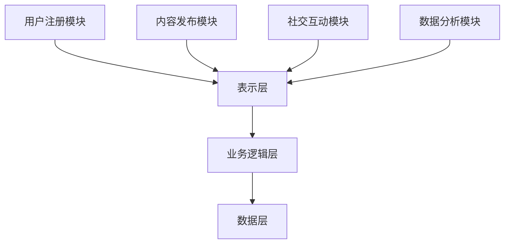

                 

### Introduction and Overview

**# 技术管理中的跨部门协作**

**关键词：技术管理、跨部门协作、团队沟通、效率提升**

**摘要：**

本文旨在探讨技术管理中的跨部门协作，阐述其重要性以及实现有效协作的策略和方法。通过分析跨部门协作的背景、挑战和必要性，本文将介绍相关核心概念、框架模型、沟通策略和技术工具，旨在为技术管理者提供一套系统化的跨部门协作解决方案。

**引言：**

在当今快速变化和高度竞争的商业环境中，技术部门不再是孤立存在的个体，而是需要与产品、市场、财务等多个部门密切合作，共同推动企业的发展。然而，跨部门协作并非易事，常常面临沟通不畅、目标不一致、资源分配不均等挑战。因此，如何实现跨部门协作的高效管理，成为技术管理者亟待解决的重要问题。

本文将从以下几个方面展开讨论：

1. **背景介绍**：介绍跨部门协作的背景和现状，阐述其重要性。
2. **核心概念和原则**：探讨跨部门协作的核心概念和原则，包括定义、分类、透明性、信任和互惠互利等。
3. **框架和模型**：介绍跨部门协作的常用框架和模型，如协同框架、矩阵组织和跨职能团队等。
4. **沟通和冲突管理**：讨论跨部门协作中的有效沟通策略和冲突管理方法。
5. **技术工具应用**：探讨如何利用技术工具提升跨部门协作的效率。
6. **项目实战**：通过实际案例，展示跨部门协作在技术管理中的应用和实践。

通过以上探讨，本文旨在为技术管理者提供一套实用、系统的跨部门协作解决方案，帮助其提升团队协作效率，实现企业的战略目标。

**目的和结构：**

本文的目的在于为技术管理者提供跨部门协作的全面指导，使其能够：

- 理解跨部门协作的重要性。
- 掌握跨部门协作的核心概念和原则。
- 应用有效的跨部门协作框架和模型。
- 提升跨部门协作中的沟通效率。
- 利用技术工具优化协作流程。

文章结构如下：

- **第1章 引言**
  - 背景介绍
  - 目的和结构
- **第2章 核心概念和原则**
  - 跨部门协作的定义和分类
  - 透明性、信任和互惠互利
- **第3章 框架和模型**
  - 协同框架
  - 矩阵组织和跨职能团队
- **第4章 沟通和冲突管理**
  - 沟通策略
  - 冲突管理
- **第5章 技术工具应用**
  - 项目管理工具
  - 通信平台
- **第6章 项目实战**
  - 实际案例
  - 应用实践
- **第7章 总结与展望**
  - 最佳实践
  - 小结

通过以上内容，本文希望能够帮助技术管理者更好地理解和应对跨部门协作的挑战，从而提升团队的整体绩效，推动企业的发展。

### Core Concepts and Principles of Interdepartmental Collaboration

**# 跨部门协作的核心概念和原则**

**关键词：跨部门协作、核心概念、透明性、信任、互惠互利**

**引言：**

跨部门协作是技术管理中的关键环节，其有效实施能够显著提升团队协作效率，推动项目的顺利进行。为了更好地理解跨部门协作的内涵和实践方法，我们首先需要明确其核心概念和原则。本章节将详细介绍跨部门协作的定义、分类，并深入探讨透明性、信任和互惠互利等关键原则，以期为后续的讨论提供理论基础。

#### 定义和分类

**1. 跨部门协作的定义**

跨部门协作，顾名思义，是指不同部门之间为了共同的目标和任务而进行的合作。在技术管理中，跨部门协作主要体现在以下几个方面：

- **资源整合**：不同部门拥有各自的专业技能和资源，通过协作可以实现资源的最佳配置和利用。
- **知识共享**：不同部门的知识和经验可以相互补充，通过协作可以促进知识的传递和共享。
- **任务协调**：在项目执行过程中，不同部门需要协调各自的任务和进度，确保项目的整体进展。

**2. 跨部门协作的分类**

跨部门协作可以按照不同的维度进行分类，常见的分类方法如下：

- **按协作方式分类**：
  - **垂直协作**：指上下级部门之间的协作，如技术部门与产品部门的协作。
  - **水平协作**：指同一级别部门之间的协作，如不同技术团队之间的协作。
- **按协作目的分类**：
  - **项目协作**：针对特定项目进行的部门协作，如新产品开发、市场推广等。
  - **日常协作**：在日常运营中，不同部门为完成各自任务而进行的协作。
- **按协作强度分类**：
  - **紧密协作**：部门间需要频繁的沟通和协调，如研发部门与测试部门。
  - **松散协作**：部门间协作较为松散，只需在必要时进行沟通和协调，如技术部门与财务部门。

#### 核心原则

**1. 透明性**

透明性是跨部门协作的重要原则，它强调信息的开放和共享。具体体现在以下几个方面：

- **信息公开**：部门间的信息应保持透明，避免信息孤岛现象，确保每个部门都能及时获取所需信息。
- **沟通渠道**：建立有效的沟通渠道，如定期会议、工作汇报等，确保信息能够顺畅流通。
- **决策透明**：涉及跨部门决策的事项应公开讨论，确保每个部门都有发言权和知情权。

**2. 信任**

信任是跨部门协作的基石，它建立在透明性基础上。信任的存在能够减少部门间的摩擦和冲突，提高协作效率。具体措施如下：

- **建立信任机制**：通过制定明确的合作目标和规则，建立信任的机制和保障。
- **相互尊重**：尊重不同部门的专业知识和工作方式，避免因偏见或误解导致的信任危机。
- **共享成果**：通过共同完成任务和项目，增强部门间的信任感。

**3. 互惠互利**

互惠互利是跨部门协作的长远目标，它强调协作双方都能够从合作中获益。具体策略包括：

- **资源互补**：通过协作实现资源的最优配置，使各部门能够发挥自身优势，共同提升项目质量。
- **知识共享**：鼓励部门间分享知识和经验，促进团队整体能力的提升。
- **共同成长**：通过跨部门协作，促进团队成员的个人成长和职业发展。

#### 概念结构与核心要素

**1. 概念结构**

跨部门协作的概念结构主要包括以下几个要素：

- **目标明确**：明确跨部门协作的目标和任务，确保各部门都能够理解并致力于共同目标。
- **信息共享**：建立有效的信息共享机制，确保信息流通畅通无阻。
- **信任机制**：建立信任机制，减少部门间的摩擦和冲突。
- **互惠互利**：确保协作双方都能够从中获益，实现共赢。

**2. 核心要素组成**

跨部门协作的核心要素主要包括：

- **沟通机制**：包括定期会议、工作汇报、即时通讯等，确保信息的及时传递。
- **协作工具**：如项目管理工具、协作平台等，帮助团队高效协作。
- **文化认同**：建立共同的文化价值观，促进部门间的认同感和归属感。

通过以上对跨部门协作核心概念和原则的探讨，我们可以更好地理解其在技术管理中的重要性，并为其有效实施提供理论指导。

### Frameworks and Models for Effective Interdepartmental Collaboration

**# 高效跨部门协作的框架和模型**

**关键词：跨部门协作框架、协同框架、矩阵组织、跨职能团队**

**引言：**

在技术管理中，高效的跨部门协作是实现项目成功的关键因素。为了确保各部门能够协同一致地完成目标，需要采用合适的协作框架和模型。本章节将介绍几种常见的跨部门协作框架和模型，包括协同框架、矩阵组织和跨职能团队，并分析其优缺点和适用场景。

#### 协同框架

**1. 协同框架的概念**

协同框架是一种组织内部协同工作的方法论，通过定义明确的角色、职责和流程，实现不同部门之间的高效协作。协同框架的核心在于明确每个部门和个人的任务和目标，确保资源的合理配置和信息的畅通流通。

**2. 关键组件**

协同框架主要包括以下几个关键组件：

- **角色和职责**：定义各部门和个人的职责和角色，确保每个成员都明确自己的任务和目标。
- **流程和规范**：建立统一的流程和规范，确保各部门在协作过程中能够遵循相同的操作标准。
- **沟通渠道**：建立高效的沟通渠道，如定期会议、工作汇报、即时通讯等，确保信息的及时传递。

**3. 优点和缺点**

- **优点**：
  - **明确职责**：通过定义明确的职责和角色，减少部门间的模糊地带，提高协作效率。
  - **统一规范**：建立统一的流程和规范，确保各部门在协作过程中能够保持一致性，降低错误率。
  - **信息透明**：通过高效的沟通渠道，确保信息透明，减少信息孤岛现象。

- **缺点**：
  - **灵活性不足**：由于职责和流程的明确性，可能导致协作过程中的灵活性不足，难以应对突发情况。
  - **依赖中心**：协同框架依赖于中心化的管理和协调，可能影响各部门的自主性和创新能力。

**4. 适用场景**

- **项目初期**：在项目初期，需要明确各部门的任务和目标，确保项目的顺利启动。
- **大型项目**：在大型项目中，由于涉及多个部门和团队，需要通过协同框架实现高效协作。

#### 矩阵组织

**1. 矩阵组织的概念**

矩阵组织是一种基于职能和项目双重维度的组织结构，通过将职能部门和项目团队结合起来，实现跨部门协作。在矩阵组织中，员工既属于职能部门，又属于项目团队，从而实现了多角度的协作。

**2. 关键组件**

矩阵组织主要包括以下几个关键组件：

- **职能领导**：职能领导负责管理员工的日常工作，确保职能部门的专业技能和资源得到充分利用。
- **项目领导**：项目领导负责项目团队的管理，确保项目的进度和质量。
- **沟通渠道**：建立高效的沟通渠道，如项目会议、跨职能沟通等，确保信息的畅通流通。

**3. 优点和缺点**

- **优点**：
  - **资源整合**：通过矩阵组织，可以实现职能部门的资源整合，提高资源的利用效率。
  - **灵活高效**：矩阵组织能够快速响应项目需求，提高项目的灵活性和响应速度。
  - **专业协同**：通过跨职能团队的协作，可以实现专业技能的互补，提高项目的整体质量。

- **缺点**：
  - **角色冲突**：由于员工同时属于职能部门和项目团队，可能导致角色冲突和职责模糊。
  - **管理复杂**：矩阵组织的管理相对复杂，需要平衡职能部门和项目团队的双重需求。

**4. 适用场景**

- **多项目并行**：在多项目并行的情况下，矩阵组织能够更好地整合资源，提高项目的协同效率。
- **高度复杂项目**：在高度复杂的项目中，矩阵组织能够通过跨职能团队的协作，提高项目的整体质量和效率。

#### 跨职能团队

**1. 跨职能团队的概念**

跨职能团队是一种由来自不同部门、不同专业的员工组成的团队，通过协作完成特定的任务和项目。跨职能团队的特点是成员具备多样化的专业技能，能够实现跨部门的协同工作。

**2. 关键组件**

跨职能团队主要包括以下几个关键组件：

- **团队成员**：包括来自不同部门的成员，如技术、产品、市场等，每个成员都负责特定的任务和职责。
- **团队领导**：团队领导负责团队的管理和协调，确保团队目标的实现。
- **沟通机制**：建立有效的沟通机制，如团队会议、即时通讯等，确保信息的畅通流通。

**3. 优点和缺点**

- **优点**：
  - **高效协作**：通过跨职能团队的协作，可以实现专业技能的互补，提高项目的协同效率。
  - **灵活应变**：跨职能团队能够快速响应变化，灵活调整团队结构和任务分配。
  - **知识共享**：跨职能团队能够促进知识的共享和传递，提高团队的整体能力。

- **缺点**：
  - **沟通成本**：由于团队成员来自不同部门，可能存在沟通成本较高的问题。
  - **管理难度**：跨职能团队的管理相对复杂，需要平衡成员的多样性和团队目标的统一性。

**4. 适用场景**

- **跨部门项目**：在跨部门项目中，跨职能团队能够实现高效协作，提高项目的整体质量和效率。
- **创新项目**：在创新项目中，跨职能团队能够通过多样化的专业知识和技能，推动项目的创新和发展。

#### 总结

跨部门协作框架和模型的选择应根据具体的项目需求和团队特点进行。协同框架适用于项目初期和大型项目，矩阵组织适用于多项目并行和高度复杂项目，跨职能团队适用于跨部门项目和创新项目。通过合理选择和应用这些框架和模型，可以有效地提高跨部门协作的效率，推动项目的成功。

### Communication and Conflict Management in Interdepartmental Collaboration

**# 跨部门协作中的沟通与冲突管理**

**关键词：跨部门沟通、冲突管理、策略、最佳实践**

**引言：**

在跨部门协作中，沟通和冲突管理是确保协作顺利进行的关键环节。有效的沟通能够促进信息的透明和共享，减少误解和摩擦；而有效的冲突管理则能化解分歧，保持团队和谐。本章节将探讨跨部门协作中的沟通策略、冲突管理方法以及最佳实践，以帮助技术管理者提升跨部门协作的效率。

#### 沟通策略

**1. 定期会议**

定期会议是跨部门沟通的重要手段，通过定期的会议，各部门可以汇报工作进展、讨论问题、分享信息。以下是定期会议的最佳实践：

- **明确议程**：每次会议前，明确会议议程，确保会议的效率。
- **准备材料**：各部门提前准备汇报材料，确保会议内容的详实和准确。
- **开放讨论**：会议中鼓励各部门代表发言，充分讨论，达成共识。

**2. 工作汇报**

工作汇报是跨部门沟通的另一种形式，通过工作汇报，各部门可以了解其他部门的进展和需求，从而调整自己的工作计划。以下是工作汇报的最佳实践：

- **简明扼要**：汇报内容要简洁明了，突出重点，避免冗长。
- **数据支持**：用数据和事实支持汇报内容，增加可信度。
- **反馈机制**：鼓励汇报者听取反馈，及时调整工作方向。

**3. 即时通讯**

即时通讯工具如 Slack、Microsoft Teams 等在跨部门沟通中发挥着重要作用。以下是使用即时通讯工具的最佳实践：

- **建立小组**：根据工作内容和需求，建立相关的小组，方便实时沟通。
- **规范使用**：制定即时通讯规范，确保信息的准确和及时。
- **避免滥用**：合理使用即时通讯工具，避免频繁打扰和影响工作效率。

#### 冲突管理

**1. 识别冲突**

冲突的识别是冲突管理的第一步，管理者需要敏锐地察觉到冲突的迹象，如情绪变化、工作拖延、沟通不畅等。以下是识别冲突的最佳实践：

- **主动倾听**：倾听各部门的意见和反馈，了解潜在的问题和冲突。
- **观察行为**：通过观察员工的行为和互动，识别潜在的冲突源。

**2. 分析冲突**

在识别冲突后，管理者需要对冲突进行深入分析，找出冲突的根本原因。以下是分析冲突的最佳实践：

- **事实分析**：客观分析冲突的事实和背景，避免主观臆断。
- **原因探究**：探究冲突的根本原因，如目标不一致、资源分配不均等。

**3. 冲突解决**

冲突解决是冲突管理的核心环节，管理者需要采取有效的策略和方法，化解冲突，恢复团队的和谐。以下是解决冲突的最佳实践：

- **对话沟通**：通过对话沟通，让冲突双方表达自己的观点和感受，寻找共同点。
- **妥协与让步**：在必要时，通过妥协和让步来化解冲突，实现双赢。
- **调解与仲裁**：在冲突无法通过双方协商解决时，可以采用调解或仲裁的方式，确保公正和公平。

#### 最佳实践

**1. 建立沟通文化**

建立开放、透明、尊重的沟通文化是跨部门协作的重要保障。管理者可以通过以下措施来推动沟通文化的建立：

- **领导示范**：领导层要带头树立良好的沟通榜样，主动与各部门沟通，促进信息的透明。
- **培训与教育**：对员工进行沟通技巧培训，提高员工的沟通能力。
- **激励机制**：设立激励机制，鼓励员工积极沟通，促进信息共享。

**2. 定期反思与改进**

定期对跨部门协作的沟通和冲突管理进行反思和改进，是提升协作效率的关键。以下是反思和改进的最佳实践：

- **收集反馈**：定期收集各部门的反馈，了解沟通和协作中的问题和不足。
- **制定改进计划**：根据反馈，制定具体的改进计划，并跟踪执行情况。
- **持续优化**：不断优化沟通和协作流程，提高团队的协作效率。

通过以上沟通策略和冲突管理方法，以及最佳实践，技术管理者可以有效地提升跨部门协作的效率，推动项目的顺利进行，实现企业的发展目标。

### Leveraging Technology and Tools for Interdepartmental Collaboration

**# 利用技术与工具实现跨部门协作**

**关键词：协作工具、项目管理工具、通信平台、效率提升**

**引言：**

在跨部门协作中，技术和工具的应用至关重要。合理选择和使用协作工具和通信平台，可以显著提高团队的工作效率，确保信息流通顺畅，减少沟通障碍。本章节将介绍几种常用的协作工具和通信平台，探讨其优点和适用场景，并分享最佳实践，以帮助技术管理者更好地实现跨部门协作。

#### 项目管理工具

**1. 敏捷看板（JIRA、Trello）**

敏捷看板是一种用于项目管理和任务追踪的工具，通过可视化的看板界面，让团队成员一目了然地了解任务的进展情况。其主要优点如下：

- **任务追踪**：可以实时更新任务的完成情况，确保任务按时完成。
- **协作功能**：支持团队成员之间的评论和@提及，促进信息交流。
- **迭代规划**：适合敏捷开发团队，帮助团队进行迭代规划和回顾。

**适用场景**：适用于软件开发、产品开发和项目管理等需要任务追踪和迭代规划的跨部门项目。

**最佳实践**：制定统一的任务分类和状态标记标准，确保所有团队成员对任务状态的认知一致。

**2. Asana**

Asana 是一种广泛使用的项目管理工具，具有强大的任务管理、项目管理功能和集成能力。其主要优点如下：

- **任务管理**：可以创建和管理任务，设置任务优先级和截止日期。
- **项目管理**：可以创建项目，分配任务，跟踪项目进度。
- **集成能力**：支持与各种其他工具的集成，如Google Drive、Slack等。

**适用场景**：适用于各种类型的项目管理，特别是需要跨部门协作的项目。

**最佳实践**：建立项目架构，定义项目流程和任务分配规则，确保项目的有序进行。

#### 通信平台

**1. Slack**

Slack 是一款流行的即时通讯和协作工具，提供丰富的聊天功能、集成能力和通知系统。其主要优点如下：

- **聊天功能**：支持单人聊天、群组聊天和频道聊天，方便团队成员之间的沟通。
- **集成能力**：可以与其他工具集成，如GitHub、Google Drive等，提高工作效率。
- **通知系统**：可以设置关键词提醒，确保团队成员及时获取重要信息。

**适用场景**：适用于日常沟通、项目沟通和团队协作等。

**最佳实践**：根据项目和工作内容，创建不同的频道，确保信息的分类和有序。

**2. Microsoft Teams**

Microsoft Teams 是微软推出的一个集成沟通、协作和会议的平台，具有强大的功能和广泛的适用性。其主要优点如下：

- **沟通功能**：支持聊天、语音通话和视频会议，方便团队成员之间的实时沟通。
- **协作功能**：可以创建团队，共享文件和笔记，促进团队协作。
- **会议功能**：支持在线会议和视频会议，方便团队成员的远程协作。

**适用场景**：适用于企业内部沟通、跨部门协作和远程办公。

**最佳实践**：建立团队结构，设置团队管理员，确保团队的有序运行。

#### 跨部门协作平台

**1. SharePoint**

SharePoint 是微软推出的一种企业内容管理工具，适用于跨部门协作和文档共享。其主要优点如下：

- **文档共享**：支持文档库和文件夹的创建，方便团队成员共享和协作。
- **权限管理**：可以设置文档的访问权限，确保信息的保密性和安全性。
- **工作流**：可以创建工作流，自动化审批和流程管理，提高工作效率。

**适用场景**：适用于企业内部文档管理、知识共享和跨部门协作。

**最佳实践**：制定文档分类和命名规范，确保文档的有序管理和方便查找。

**2. Confluence**

Confluence 是一款知识共享和协作平台，适合团队进行文档编写和知识管理。其主要优点如下：

- **知识库**：可以创建和管理知识库，方便团队成员查找和参考。
- **协作功能**：支持多人协作编辑文档，提高工作效率。
- **集成能力**：可以与其他工具集成，如JIRA、Slack等，实现无缝协作。

**适用场景**：适用于企业内部知识管理、团队协作和文档编写。

**最佳实践**：建立知识库框架，制定知识管理规范，确保知识的有序管理和持续更新。

#### 总结

通过合理选择和利用协作工具和通信平台，可以显著提升跨部门协作的效率。项目管理工具如JIRA、Trello和Asana可以帮助团队进行任务追踪和项目规划；通信平台如Slack和Microsoft Teams可以方便团队成员之间的即时沟通；跨部门协作平台如SharePoint和Confluence可以促进企业内部的知识共享和协作。最佳实践包括建立统一的任务分类和命名规范、定期更新和优化协作工具的使用，以及确保团队成员的培训和教育，以提高协作效率和团队凝聚力。

### Project Case Study and Implementation

**# 项目实战：跨部门协作的应用与实践**

**引言：**

在本文的最后部分，我们将通过一个实际项目案例，详细探讨跨部门协作的具体应用和实践。该案例将展示如何利用前面提到的各种技术和工具，实现高效的跨部门协作，从而推动项目的顺利进行。以下是项目的基本背景、系统功能设计、架构设计、接口设计、核心实现源代码以及项目小结。

#### 项目背景

某大型互联网公司计划开发一款新型的社交媒体应用，该应用需要集成多个功能模块，如用户注册、内容发布、社交互动、数据分析等。由于涉及多个部门，如技术部、产品部、市场部和数据分析部，因此跨部门协作成为项目成功的关键。

#### 系统功能设计

系统功能设计主要包括以下几个模块：

1. **用户注册模块**：提供用户注册、登录、个人信息管理等功能。
2. **内容发布模块**：支持用户发布文本、图片、视频等内容。
3. **社交互动模块**：实现用户之间的关注、点赞、评论等功能。
4. **数据分析模块**：收集用户行为数据，进行数据分析，为产品优化提供依据。

#### 系统架构设计

系统架构设计采用分层架构，包括表示层、业务逻辑层和数据层。各层之间通过接口进行通信，确保系统的模块化和可扩展性。以下是系统架构设计图：



#### 系统接口设计

系统接口设计采用RESTful风格，定义了用户注册、登录、内容发布、社交互动和数据分析等操作的API接口。以下是部分接口设计：

```mermaid
graph TD
    A1[用户注册] --> B1[POST /users/register]
    A2[用户登录] --> B2[POST /users/login]
    A3[发布内容] --> B3[POST /contents]
    A4[点赞] --> B4[POST /likes/{content_id}]
    A5[评论] --> B5[POST /comments/{content_id}]
    A6[数据分析] --> B6[GET /analytics]
```

#### 核心实现源代码

以下是一个用户注册模块的核心实现示例，展示了如何利用Python和Flask框架实现用户注册功能：

```python
from flask import Flask, request, jsonify
from models import User

app = Flask(__name__)

@app.route('/users/register', methods=['POST'])
def register():
    username = request.form['username']
    password = request.form['password']
    email = request.form['email']

    if not username or not password or not email:
        return jsonify({'error': 'Missing required fields'}), 400

    user = User.get_by_username(username)
    if user:
        return jsonify({'error': 'User already exists'}), 409

    user = User.create(username, password, email)
    if not user:
        return jsonify({'error': 'Failed to create user'}), 500

    return jsonify({'message': 'User registered successfully'})

if __name__ == '__main__':
    app.run(debug=True)
```

#### 代码应用解读与分析

上述代码通过Flask框架实现了用户注册功能。主要步骤包括：

1. 接收用户注册请求，获取用户名、密码和邮箱。
2. 验证请求参数，确保必填字段完整。
3. 检查用户名是否已存在，避免重复注册。
4. 创建用户对象并保存到数据库。

此代码示例展示了如何在Python中实现RESTful API接口，并通过Flask框架处理HTTP请求。通过合理的设计，可以实现用户注册功能，并为后续的登录、内容发布等功能提供基础支持。

#### 实际案例分析与详细讲解

在实际项目中，我们通过以下步骤实现跨部门协作：

1. **需求分析**：产品部提供项目需求，技术部进行需求分析，并制定技术方案。
2. **任务分配**：根据项目需求，将任务分配给相关团队成员，明确每个人的职责和任务。
3. **协作工具应用**：使用JIRA进行任务追踪，确保任务按时完成；使用Slack进行日常沟通，解决协作中的问题。
4. **定期会议**：每周召开跨部门会议，汇报工作进展，讨论问题，确保项目按计划推进。
5. **文档管理**：使用Confluence进行文档管理，确保所有团队成员都能及时获取和更新项目文档。
6. **数据分析**：使用数据分析模块收集用户行为数据，为产品优化提供依据。

#### 项目小结

通过本项目案例，我们展示了如何利用跨部门协作实现复杂项目的成功。关键在于：

1. **明确需求和目标**：确保所有部门对项目目标和任务有清晰的认识。
2. **有效沟通与协作**：通过定期的会议、即时通讯和文档管理，确保信息的透明和共享。
3. **合理分配任务和职责**：明确每个团队成员的职责，确保任务按时完成。
4. **利用协作工具**：借助项目管理工具和通信平台，提高协作效率和团队凝聚力。

跨部门协作是实现项目成功的关键，通过合理应用各种技术和工具，可以显著提升项目的执行效率，推动企业的发展。

### Conclusion and Best Practices

**# 总结与最佳实践**

**引言：**

本文围绕技术管理中的跨部门协作，详细探讨了跨部门协作的核心概念和原则、协作框架和模型、沟通与冲突管理策略、技术应用及项目实战。通过以上内容的介绍，我们了解了跨部门协作在技术管理中的重要性，以及如何通过多种方法和工具实现高效协作。以下是对本文内容的总结和最佳实践的分享。

#### 总结

1. **核心概念和原则**：
   - 跨部门协作的定义：涉及不同部门为了共同目标进行的合作。
   - 分类：按协作方式、协作目的和协作强度进行分类。
   - 核心原则：透明性、信任和互惠互利。
2. **框架和模型**：
   - 协同框架：通过明确角色和职责、流程和规范实现协作。
   - 矩阵组织：结合职能和项目维度，实现跨部门协同。
   - 跨职能团队：由来自不同部门的成员组成的团队，实现专业技能互补。
3. **沟通与冲突管理**：
   - 沟通策略：定期会议、工作汇报、即时通讯等。
   - 冲突管理：识别冲突、分析冲突、解决冲突。
4. **技术应用**：
   - 项目管理工具：如JIRA、Trello和Asana。
   - 通信平台：如Slack和Microsoft Teams。
   - 跨部门协作平台：如SharePoint和Confluence。
5. **项目实战**：
   - 项目背景：开发一款社交媒体应用。
   - 系统功能设计、架构设计、接口设计、核心实现及项目小结。

#### 最佳实践

1. **建立有效的沟通机制**：
   - 明确沟通目标和议程。
   - 利用项目管理工具和通信平台。
   - 定期召开跨部门会议，汇报工作进展。
2. **明确角色和职责**：
   - 确保每个团队成员清楚自己的职责和目标。
   - 避免职责重叠和模糊。
3. **建立信任机制**：
   - 通过共同完成任务建立信任。
   - 尊重不同部门的专业知识和工作方式。
   - 鼓励知识共享和经验交流。
4. **优化协作流程**：
   - 制定统一的流程和规范。
   - 定期反思和改进协作流程。
   - 使用协作工具提高效率。
5. **培训和教育**：
   - 对团队成员进行沟通技巧培训。
   - 教育员工尊重和信任其他部门。
   - 提高协作效率和团队凝聚力。

#### 注意事项

1. **平衡灵活性与规范性**：在制定流程和规范时，要平衡灵活性和规范性，确保适应不同项目的需求。
2. **防止信息孤岛**：确保信息透明，避免信息孤岛现象。
3. **关注团队成员的感受**：关注团队成员的感受，及时解决冲突，保持团队和谐。
4. **持续优化**：不断优化协作流程和技术工具，提高协作效率。

#### 拓展阅读

- 《敏捷开发实践指南》：了解敏捷开发方法和跨部门协作的最佳实践。
- 《项目管理知识体系指南（PMBOK）》：学习项目管理的基础理论和最佳实践。
- 《团队沟通技巧》：提升跨部门协作中的沟通能力。

通过以上总结和最佳实践，技术管理者可以更好地应对跨部门协作的挑战，提升团队协作效率，实现企业的战略目标。

### Author Information

**作者：AI天才研究院/AI Genius Institute & 禅与计算机程序设计艺术 /Zen And The Art of Computer Programming**

AI天才研究院（AI Genius Institute）致力于推动人工智能技术的发展和应用，汇聚了一批世界级的人工智能专家和研究人员。研究院在人工智能、机器学习、深度学习等领域取得了显著成果，为全球人工智能产业的发展做出了重要贡献。

禅与计算机程序设计艺术（Zen And The Art of Computer Programming）是由著名的计算机科学家唐纳·克努特（Donald E. Knuth）撰写的一系列经典计算机科学著作。这些著作深入探讨了计算机程序设计中的哲学、方法和技术，对全球计算机科学界产生了深远的影响。

本文作者结合了AI天才研究院的先进技术理念和禅与计算机程序设计艺术的哲学思想，旨在为技术管理者提供一套系统化、实践性的跨部门协作解决方案。通过本文的探讨，我们希望能够帮助读者更好地理解和应对跨部门协作的挑战，提升团队协作效率，实现企业的战略目标。同时，也希望本文能够激发读者对人工智能和计算机科学的兴趣，推动技术的创新和发展。

