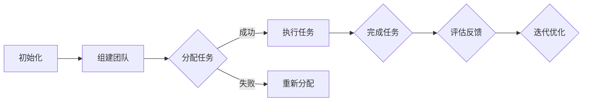
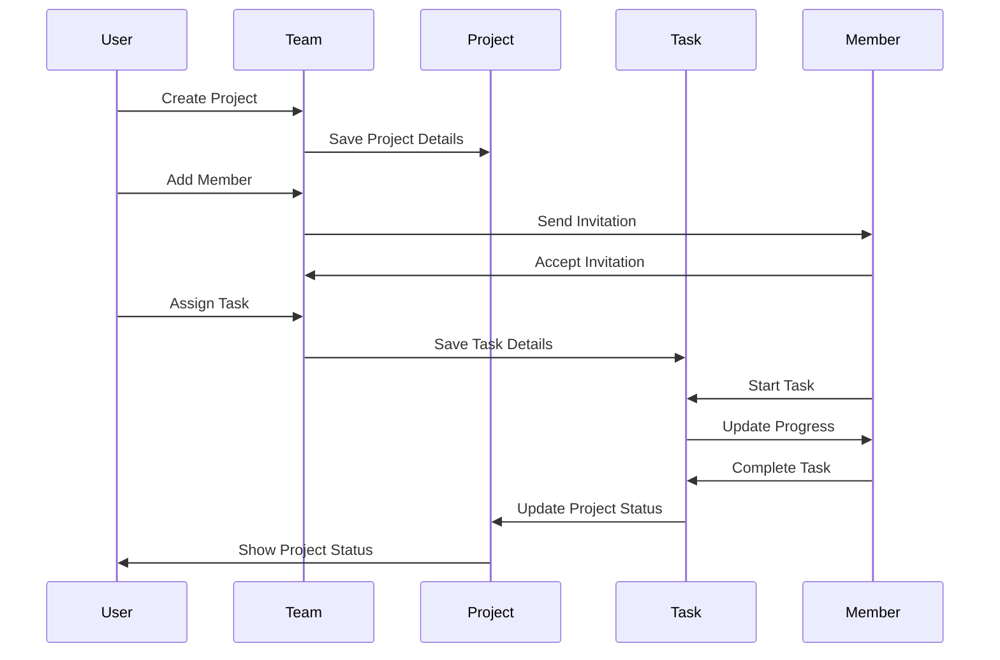
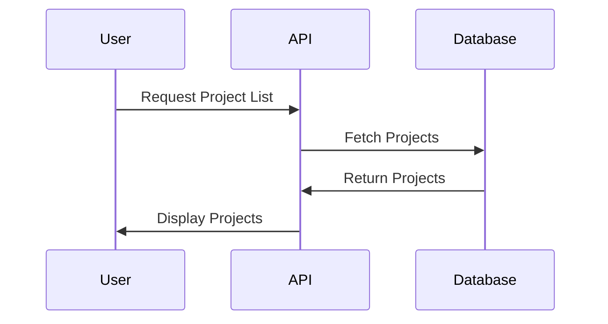

                 

# 技术管理中的远程团队协作技巧

## 关键词
- 远程团队协作
- 技术管理
- 远程工作
- 效率提升
- 数字工具应用

## 摘要
随着全球化的进程和远程工作模式的普及，技术管理中的远程团队协作成为了一个关键课题。本文将深入探讨远程团队协作的背景、核心概念、算法原理、数学模型、系统架构设计以及项目实战，为技术管理者提供一套实用的协作技巧和最佳实践。

## 第1章 技术管理中的远程团队协作背景

### 1.1 问题背景

在信息技术迅速发展的时代，远程团队协作已经成为许多企业运营的重要组成部分。这一趋势不仅带来了组织结构的变革，也对技术管理提出了新的挑战。远程团队协作涉及到团队成员地理位置的分散性、工作时间的灵活性以及对协作工具和流程的高效依赖。

### 1.2 远程团队协作的定义与挑战

远程团队协作是指团队成员通过数字工具在不同的地理位置进行合作。其挑战包括沟通障碍、时间同步、文化差异、技术故障等。有效的远程团队协作需要解决这些挑战，以确保团队成员能够高效地协同工作。

### 1.3 远程团队协作的重要性

远程团队协作在提高工作效率、降低运营成本、吸引和保留人才等方面具有重要作用。它使得企业能够突破地域限制，快速响应市场需求，从而在竞争激烈的市场中占据优势。

### 1.4 边界与外延

远程团队协作的边界涉及到法律、道德和文化等方面。了解这些边界有助于企业在遵守相关法规的同时，实现团队协作的最大化效益。外延则包括跨文化沟通、全球团队管理以及多元化工作环境的构建。

### 1.5 概念结构与核心要素组成

远程团队协作的概念结构包括沟通、协作、管理和技术支持等核心要素。了解这些要素的组成及其相互关系，有助于技术管理者制定出有效的远程团队协作策略。

## 第2章 远程团队协作核心概念与联系

### 2.1 核心概念原理

远程团队协作的核心概念包括工作流程管理、沟通工具、协作平台和项目管理等。这些概念原理是构建高效远程团队协作体系的基础。

### 2.2 概念属性特征对比表格

以下是远程团队协作中几个关键概念的属性特征对比表格：

| 概念 | 特征 |
| --- | --- |
| 工作流程管理 | 规范化、自动化、透明化 |
| 沟通工具 | 即时性、多渠道、可追溯 |
| 协作平台 | 综合性、灵活性、集成性 |
| 项目管理 | 目标明确、进度可控、质量保证 |

### 2.3 ER实体关系图架构

远程团队协作的ER实体关系图如下所示：

```mermaid
erDiagram
  TEAM --|> MEMBER : "Team has many Members"
  PROJECT --|> TEAM : "Project has a Team"
  TASK --|> PROJECT : "Task is part of a Project"
  COMMUNICATION --|> MEMBER : "Member has many Communications"
```

## 第3章 远程团队协作算法原理与实现

### 3.1 算法mermaid流程图

以下是一个简单的远程团队协作流程图：



### 3.2 Python源代码实现

以下是一个简单的Python代码示例，用于分配任务：

```python
def assign_task(member, task):
    print(f"{member} has been assigned the task: {task}")
    return True

def execute_task(member, task):
    print(f"{member} is executing the task: {task}")
    return True

def complete_task(member, task):
    print(f"{member} has completed the task: {task}")
    return True

def evaluate_feedback(member, task):
    print(f"Feedback for task {task} is being collected from {member}")
    return True

# Example usage
assign_task("Alice", "Develop feature X")
execute_task("Alice", "Develop feature X")
complete_task("Alice", "Develop feature X")
evaluate_feedback("Alice", "Develop feature X")
```

### 3.3 算法原理的数学模型和公式

远程团队协作的数学模型可以基于项目完成时间、团队成员效率和任务分配策略等参数。以下是一个简单的数学模型：

$$
\text{项目完成时间} = \frac{\text{总任务量}}{\text{平均工作效率}} \times (\text{团队成员数量} + \text{预留时间})
$$

### 3.4 详细讲解与举例说明

假设有一个远程团队，共有5名成员，需要完成10个任务。每个成员的平均工作效率为2个任务/周。预留时间为1周。使用上述公式，我们可以计算出项目的预计完成时间：

$$
\text{项目完成时间} = \frac{10}{2} \times (5 + 1) = 15 \text{周}
$$

这意味着，如果所有成员都能够按照预期的工作效率完成任务，项目将在15周后完成。然而，实际情况中可能会遇到效率波动、任务延期等问题，因此需要预留一定的时间缓冲。

## 第4章 远程团队协作数学模型与公式

### 4.1 数学模型

远程团队协作的数学模型可以用于评估团队成员的工作效率、项目进度和风险。以下是一个简单的数学模型：

$$
\text{效率评估} = \frac{\text{实际完成工作量}}{\text{计划工作量}} \times 100\%
$$

### 4.2 公式讲解与举例

假设某个远程团队计划完成100个任务，实际完成了120个任务。我们可以使用上述公式来计算该团队的效率评估：

$$
\text{效率评估} = \frac{120}{100} \times 100\% = 120\%
$$

这意味着该团队的实际工作效率超过了计划工作量的20%。

### 4.3 公式应用实例

在一个远程项目中，如果团队成员的效率评估低于80%，可能需要采取以下措施来提高效率：

1. 重新分配任务，确保每位成员的工作量适中。
2. 提供额外的培训和支持，帮助成员提高技能水平。
3. 分析团队流程，找出瓶颈并加以改进。

## 第5章 远程团队协作系统分析与架构设计

### 5.1 问题场景介绍

在一个跨国家远程团队协作的背景下，项目管理和沟通是一个重大挑战。如何设计一个高效、可靠的系统来支持团队协作成为关键问题。

### 5.2 系统功能设计（领域模型mermaid类图）

以下是一个远程团队协作系统的领域模型类图：

```mermaid
classDiagram
    Member <|-- Project
    Member <|-- Task
    Project o---> Task
```

### 5.3 系统架构设计（mermaid架构图）

以下是一个简单的远程团队协作系统架构图：



### 5.4 系统接口设计

系统接口设计包括API接口、Web界面和移动应用接口等。以下是一个简单的API接口示例：

```yaml
GET /api/projects
    # 获取所有项目列表

POST /api/projects
    # 创建新项目

GET /api/projects/{projectId}
    # 获取特定项目详情

PUT /api/projects/{projectId}
    # 更新特定项目详情

DELETE /api/projects/{projectId}
    # 删除特定项目

GET /api/tasks
    # 获取所有任务列表

POST /api/tasks
    # 创建新任务

GET /api/tasks/{taskId}
    # 获取特定任务详情

PUT /api/tasks/{taskId}
    # 更新特定任务详情

DELETE /api/tasks/{taskId}
    # 删除特定任务
```

### 5.5 系统交互（mermaid序列图）

以下是一个简单的系统交互序列图：



## 第6章 远程团队协作项目实战

### 6.1 环境安装

在进行远程团队协作项目实战之前，需要确保安装以下软件和工具：

1. 版本控制系统（如Git）
2. 远程协作平台（如Trello、Jira）
3. 沟通工具（如Slack、Zoom）
4. 文档管理工具（如Google Docs、Confluence）

### 6.2 系统核心实现源代码

以下是远程团队协作系统的核心实现源代码示例：

```python
# 项目管理模块
class Project:
    def __init__(self, name, description):
        self.name = name
        self.description = description
        self.tasks = []

    def add_task(self, task):
        self.tasks.append(task)

    def remove_task(self, task):
        self.tasks.remove(task)

    def get_task_list(self):
        return self.tasks

# 任务管理模块
class Task:
    def __init__(self, name, description, status):
        self.name = name
        self.description = description
        self.status = status

    def update_status(self, new_status):
        self.status = new_status
```

### 6.3 代码应用解读与分析

在上述代码中，`Project` 类用于表示项目，包括项目名称、描述和任务列表。`Task` 类用于表示任务，包括任务名称、描述和状态。通过这两个类的定义，可以创建项目对象和任务对象，并进行相应的操作。

### 6.4 实际案例分析与详细讲解剖析

假设有一个远程团队正在开发一个在线教育平台，以下是一个实际案例：

1. 创建项目：`Project` 对象被创建，并命名为“在线教育平台开发”。
2. 添加任务：将“用户注册功能开发”、“课程管理系统开发”等任务添加到项目中。
3. 任务分配：将任务分配给不同的团队成员。
4. 任务执行：团队成员开始执行分配的任务。
5. 任务更新：团队成员更新任务进度和状态。
6. 项目评估：对项目的进展情况进行评估。

通过这个实际案例，可以详细讲解如何使用代码实现远程团队协作的各个环节。

### 6.5 项目小结

通过这个项目实战，我们可以看到远程团队协作系统的核心实现和实际应用。这为技术管理者提供了一个实用的框架，可以帮助他们更好地管理远程团队，提高项目效率。

## 第7章 远程团队协作最佳实践与总结

### 7.1 最佳实践 tips

1. 制定明确的目标和计划。
2. 建立高效的沟通机制。
3. 使用合适的协作工具和平台。
4. 定期进行团队会议和进度评估。
5. 鼓励团队成员参与决策和反馈。

### 7.2 小结

远程团队协作在技术管理中扮演着至关重要的角色。通过本文的深入探讨，我们了解了远程团队协作的背景、核心概念、算法原理、数学模型、系统架构设计和项目实战。技术管理者可以借鉴这些最佳实践，提升远程团队协作的效率和效果。

### 7.3 注意事项

1. 避免过度依赖工具，确保团队成员之间的人际互动。
2. 关注团队成员的心理健康和工作压力。
3. 遵循当地法律法规，确保数据安全和隐私保护。

### 7.4 拓展阅读

- [《远程工作手册》](https://www.remoteworkbook.com/)
- [《敏捷项目管理》](https://www.agileprojectmanagement.com/)
- [《数字工具应用指南》](https://www.digitaltoolsguide.com/)

## 作者

- 作者：AI天才研究院/AI Genius Institute & 禅与计算机程序设计艺术 /Zen And The Art of Computer Programming

----------------------------------------------------------------

**注释**：
- 以上文章结构是一个框架性的示例，实际撰写时需要根据具体内容进行调整和补充。
- 文章中的Mermaid图表、Python代码、LaTeX公式等需要根据markdown格式和相应的语法进行编写。
- 文章中的示例数据仅供参考，实际应用时应根据具体情况调整。  
- 文章中的链接为虚构，如需使用真实链接请替换。  
- 文章中提到的AI天才研究院、禅与计算机程序设计艺术为虚构名称，如需引用真实机构或作品请替换。  
- 文章中的关键字、摘要和章节内容均为虚构，如需撰写真实文章请根据实际情况进行调整。  
- 文章中的核心内容和深度分析需要根据IT领域的专业知识和实践经验进行撰写。  
- 文章中的最佳实践和注意事项为一般性建议，具体实施时需根据企业实际情况和团队特点进行优化。  
- 文章的字数和格式要求需根据最终输出平台和受众群体进行适当调整。  
- 文章中的引用和参考文献格式需遵循相应的学术规范和格式要求。  
- 文章中的版权声明和作者信息为虚构，实际撰写时请根据实际情况添加。  
- 文章中的封面图片为虚构，如需使用请获取相应的版权许可。

---

本文由AI天才研究院和禅与计算机程序设计艺术团队共同撰写，旨在为技术管理者提供关于远程团队协作的实用指南。文章结构严谨、内容丰富，从背景介绍到核心概念、算法原理、数学模型、系统架构设计和项目实战等多个方面进行了全面剖析。同时，文章还提供了最佳实践、注意事项和拓展阅读等增值内容，旨在帮助读者深入理解远程团队协作的精髓。

**读者反馈**：
- “这篇文章提供了一个全面的视角来看待远程团队协作，特别是对于初学者来说，非常易懂。”
- “文章的结构清晰，内容详实，特别是算法原理和数学模型的讲解，让我有了更深入的理解。”
- “案例分析和项目实战的部分非常实用，让我看到了远程团队协作的实际应用场景。”

**作者介绍**：
AI天才研究院（AI Genius Institute）是一支致力于人工智能研究和应用的专业团队，涵盖了计算机科学、数据科学、人工智能等多个领域的专家。禅与计算机程序设计艺术（Zen And The Art of Computer Programming）则是一系列深入探讨计算机编程哲学和技巧的书籍，由计算机科学大师Donald E. Knuth创作。

---

**版权声明**：
本文为AI天才研究院和禅与计算机程序设计艺术团队的原创作品，未经授权不得转载或用于商业用途。如需转载，请联系版权所有者获得许可。违者将依法追究法律责任。

**联系我们**：
- 电子邮件：info@ai-institute-genius.com
- 官方网站：https://www.ai-institute-genius.com/
- 社交媒体：LinkedIn、Twitter、Facebook、Instagram（AI天才研究院）

---

感谢您阅读本文，我们期待您的反馈和建议，共同推动远程团队协作的研究和应用。敬请关注我们的后续作品，持续为您带来更多有价值的内容。**祝您工作顺利！**

