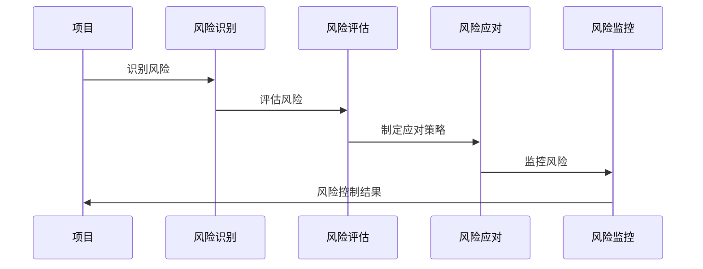
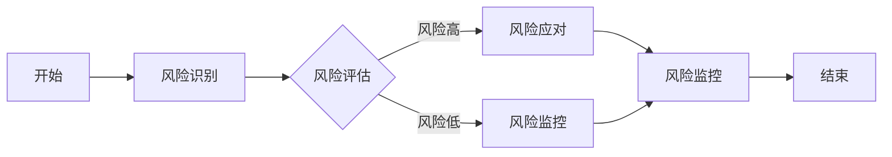
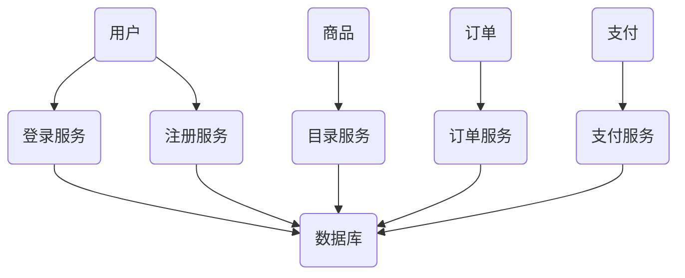
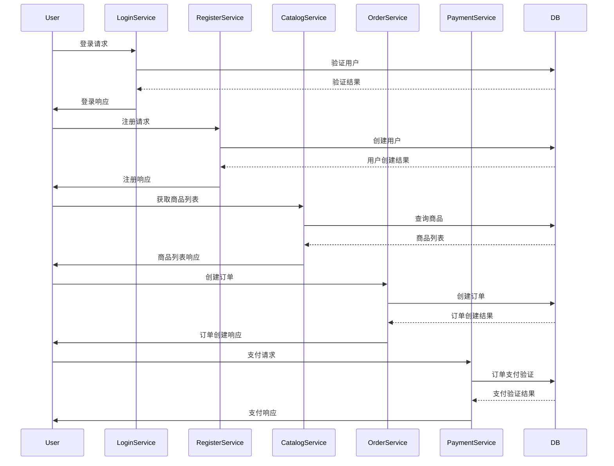

                 

# 技术管理中的风险评估与控制

> 关键词：风险评估、风险控制、技术管理、风险管理、算法、实践应用

> 摘要：本文将探讨技术管理中的风险评估与控制，介绍核心概念、方法、流程及其实践应用。通过详细讲解和案例剖析，帮助读者理解如何有效地评估和控制技术项目中的风险，从而提高项目成功率。

**第一部分：风险评估与控制的背景与核心概念**

**Step 1: 背景介绍**

**问题背景：** 随着技术的快速发展，技术项目越来越复杂，涉及多个系统、多个团队和多个部门。在这种环境下，技术风险成为项目管理中不可忽视的重要问题。技术风险可能导致项目延误、成本超支、功能缺失等问题，甚至导致项目失败。

**问题描述：** 技术风险管理是指在技术项目生命周期内，识别、评估和应对各种技术风险的过程。技术风险管理的主要目标是在项目期限内，以合理的成本将技术风险降低到可接受的水平，确保项目顺利进行。

**问题解决：** 为了解决技术风险管理问题，需要采取一系列措施，包括风险评估、风险控制和风险监控等。通过这些措施，可以识别项目中的潜在风险，评估其影响和概率，并制定相应的应对策略。

**边界与外延：** 技术风险管理的范围包括技术项目的整个生命周期，从项目规划到项目结束。它不仅涉及技术问题，还涉及组织管理、团队协作、资源分配等方面。

**概念结构与核心要素组成：** 技术风险管理包括三个核心概念：风险管理、风险评估和风险控制。风险管理是整体框架，风险评估是核心环节，风险控制是实施手段。

1. **风险管理：** 指通过识别、评估、应对和监控风险，确保项目目标的实现。风险管理包括风险规划、风险识别、风险评估、风险应对和风险监控五个主要过程。

2. **风险评估：** 指对项目中的风险进行识别、分析和评估，以确定风险的影响和概率。风险评估的方法包括定性分析和定量分析。

3. **风险控制：** 指制定和实施风险应对策略，以减轻或避免风险的影响。风险控制策略包括风险规避、风险转移、风险减轻和风险接受等。

**Step 2: 核心概念与联系**

**核心概念原理：** 技术风险管理是一个循环过程，包括风险识别、风险评估、风险应对和风险监控等环节。通过不断迭代和优化，可以逐步降低项目风险，提高项目成功率。

**概念属性特征对比表格：**

| 概念        | 定义                                                         | 属性特征                                               |
|-------------|--------------------------------------------------------------|--------------------------------------------------------|
| 风险管理    | 通过识别、评估、应对和监控风险，确保项目目标的实现           | 风险识别、风险评估、风险应对、风险监控                 |
| 风险评估    | 对项目中的风险进行识别、分析和评估，以确定风险的影响和概率   | 定性分析、定量分析                                     |
| 风险控制    | 制定和实施风险应对策略，以减轻或避免风险的影响             | 风险规避、风险转移、风险减轻、风险接受                 |

**ER实体关系图架构的 Mermaid 流程图：**

```mermaid
erDiagram
    Project ||--|{ Risk }|
    Risk ||--|{ RiskManagement }|
    Risk ||--|{ RiskControl }|
```

**Step 3: 风险评估与控制方法**

**常用风险评估方法：** 技术项目中常用的风险评估方法包括SWOT分析、风险矩阵、故障树分析等。

1. **SWOT分析：** SWOT分析是一种综合评估方法，通过分析项目的优势、劣势、机会和威胁，评估项目的风险。

2. **风险矩阵：** 风险矩阵是一种定量分析方法，通过评估风险的影响和概率，确定项目的风险等级。

3. **故障树分析：** 故障树分析是一种逻辑分析方法，通过分析项目中的故障原因和故障链，评估项目的风险。

**风险控制策略：** 风险控制策略包括风险规避、风险转移、风险减轻和风险接受等。

1. **风险规避：** 风险规避是通过避免风险事件的发生来降低风险。

2. **风险转移：** 风险转移是通过将风险责任转移给第三方来降低风险。

3. **风险减轻：** 风险减轻是通过采取措施降低风险事件的影响和概率。

4. **风险接受：** 风险接受是在评估风险影响后，决定不采取任何措施来降低风险。

**风险评估与控制流程：**

1. **风险识别：** 识别项目中的潜在风险，包括技术风险、市场风险、资源风险等。

2. **风险评估：** 对识别出的风险进行评估，确定其影响和概率。

3. **风险应对：** 制定风险应对策略，包括风险规避、风险转移、风险减轻和风险接受等。

4. **风险监控：** 监控项目中的风险，确保风险应对策略的有效实施。



**Step 4: 算法原理讲解**

**算法 Mermaid 流程图：**



**Python 源代码：**

```python
import pandas as pd
import numpy as np

def risk_assessment(risk_data):
    # 风险评估函数
    # 输入：风险数据
    # 输出：风险等级

    # 风险矩阵
    risk_matrix = pd.DataFrame({
        '风险': ['技术风险', '市场风险', '资源风险'],
        '影响': [5, 4, 3],
        '概率': [4, 3, 2]
    })

    # 计算风险值
    risk_value = risk_matrix['影响'] * risk_matrix['概率']

    # 确定风险等级
    risk_level = np.where(risk_value > 10, '高风险', '低风险')

    return risk_level

# 示例数据
risk_data = pd.DataFrame({
    '风险': ['技术风险', '市场风险', '资源风险'],
    '影响': [4, 3, 2],
    '概率': [3, 2, 1]
})

# 风险评估
risk_level = risk_assessment(risk_data)

print(risk_level)
```

**算法原理的数学模型和公式：**

- 风险值 = 影响值 × 概率值
- 风险等级 = CASE
    - WHEN 风险值 > 10 THEN '高风险'
    - WHEN 风险值 ≤ 10 THEN '低风险'
    - ELSE '未知'
    - END

**通俗易懂的举例说明：**

假设我们有一个技术项目，其中包含三种风险：技术风险、市场风险和资源风险。我们通过调查和数据分析，得到以下影响值和概率值：

- 技术风险：影响值为4，概率值为3
- 市场风险：影响值为3，概率值为2
- 资源风险：影响值为2，概率值为1

根据上述算法，我们可以计算每种风险的风险值：

- 技术风险值 = 4 × 3 = 12
- 市场风险值 = 3 × 2 = 6
- 资源风险值 = 2 × 1 = 2

根据风险值，我们可以确定风险等级：

- 技术风险：高风险
- 市场风险：低风险
- 资源风险：低风险

因此，我们可以采取相应的风险应对策略：

- 对于技术风险，我们可以增加研发投入，加强技术团队建设，以提高项目成功率。
- 对于市场风险，我们可以进行市场调研，调整项目策略，以降低市场风险。
- 对于资源风险，我们可以提前进行资源调配，确保项目资源充足。

**Step 5: 数学模型和数学公式 & 详细讲解 & 举例说明**

**数学模型和数学公式：**

在技术风险管理中，常用的数学模型和数学公式包括：

1. 风险值计算公式：风险值 = 影响值 × 概率值
2. 风险等级划分公式：风险等级 = CASE
    - WHEN 风险值 > 10 THEN '高风险'
    - WHEN 风险值 ≤ 10 THEN '低风险'
    - ELSE '未知'
    - END

**详细讲解和举例说明：**

**风险值计算公式：**

风险值是评估风险的重要指标，它表示风险的影响程度和发生概率的乘积。风险值越大，风险的影响越严重。

例如，假设我们有一个技术项目，其中包含三种风险：技术风险、市场风险和资源风险。我们通过调查和数据分析，得到以下影响值和概率值：

- 技术风险：影响值为4，概率值为3
- 市场风险：影响值为3，概率值为2
- 资源风险：影响值为2，概率值为1

根据风险值计算公式，我们可以计算每种风险的风险值：

- 技术风险值 = 4 × 3 = 12
- 市场风险值 = 3 × 2 = 6
- 资源风险值 = 2 × 1 = 2

**风险等级划分公式：**

根据风险值，我们可以将风险分为不同等级，以便制定相应的风险应对策略。常用的风险等级划分公式如下：

风险等级 = CASE
    - WHEN 风险值 > 10 THEN '高风险'
    - WHEN 风险值 ≤ 10 THEN '低风险'
    - ELSE '未知'
    - END

根据上述公式，我们可以将每种风险的风险等级划分如下：

- 技术风险：高风险
- 市场风险：低风险
- 资源风险：低风险

根据风险等级，我们可以采取相应的风险应对策略：

- 对于高风险，我们可以采取风险规避策略，避免风险事件的发生。
- 对于低风险，我们可以采取风险减轻策略，降低风险事件的影响和概率。

**举例说明：**

假设我们有一个技术项目，需要开发一个复杂的新系统。在项目规划阶段，我们识别出以下风险：

1. 技术风险：系统架构设计不合理，可能导致系统性能不稳定。
2. 市场风险：市场需求变化，可能导致项目需求频繁变更。
3. 资源风险：项目团队成员流失，可能导致项目进度延误。

我们通过调查和数据分析，得到以下影响值和概率值：

- 技术风险：影响值为5，概率值为4
- 市场风险：影响值为3，概率值为3
- 资源风险：影响值为4，概率值为2

根据风险值计算公式，我们可以计算每种风险的风险值：

- 技术风险值 = 5 × 4 = 20
- 市场风险值 = 3 × 3 = 9
- 资源风险值 = 4 × 2 = 8

根据风险等级划分公式，我们可以确定每种风险的风险等级：

- 技术风险：高风险
- 市场风险：低风险
- 资源风险：高风险

根据风险等级，我们可以采取相应的风险应对策略：

- 对于技术风险，我们可以增加系统测试投入，提高系统稳定性。
- 对于市场风险，我们可以加强市场需求调研，及时调整项目需求。
- 对于资源风险，我们可以提前招募和培训团队成员，确保项目进度。

通过上述分析和应对措施，我们可以降低技术项目的风险，提高项目成功率。

**Step 6: 系统分析与架构设计方案**

**问题场景介绍：** 
假设我们正在开发一个电子商务平台，该平台需要支持大量的用户访问和交易操作。我们的目标是确保平台在高峰时段也能稳定运行，并具备良好的扩展性和可维护性。

**项目介绍：** 
电子商务平台项目，包括用户管理、商品管理、订单管理、支付系统等功能模块。

**系统功能设计 (领域模型 Mermaid 类图)：**

```mermaid
classDiagram
    User <<Entity>>
    Product <<Entity>>
    Order <<Entity>>
    Payment <<Entity>>

    User o--1 Product
    User o--1 Order
    Product o--1 Order
    Order o--1 Payment
```

**系统架构设计 Mermaid 架构图：**



**系统接口设计和系统交互 Mermaid 序列图：**



**Step 7: 项目实战**

**环境安装：**
为了进行项目实战，我们需要安装以下软件和工具：
- Python 3.x
- pip
- Django
- Django REST framework
- PostgresSQL

安装命令如下：

```bash
pip install python
pip install pip
pip install django
pip install djangorestframework
pip install psycopg2
```

**系统核心实现源代码：**

```python
# 用户管理模块
class User(models.Model):
    username = models.CharField(max_length=100, unique=True)
    password = models.CharField(max_length=100)
    email = models.EmailField()

    def __str__(self):
        return self.username

# 商品管理模块
class Product(models.Model):
    name = models.CharField(max_length=100)
    description = models.TextField()
    price = models.DecimalField(max_digits=10, decimal_places=2)

    def __str__(self):
        return self.name

# 订单管理模块
class Order(models.Model):
    user = models.ForeignKey(User, on_delete=models.CASCADE)
    products = models.ManyToManyField(Product)
    total = models.DecimalField(max_digits=10, decimal_places=2)
    status = models.CharField(max_length=20)

    def __str__(self):
        return f"Order {self.id}"

# 支付管理模块
class Payment(models.Model):
    order = models.ForeignKey(Order, on_delete=models.CASCADE)
    amount = models.DecimalField(max_digits=10, decimal_places=2)
    status = models.CharField(max_length=20)

    def __str__(self):
        return f"Payment {self.id}"
```

**代码应用解读与分析：**
以上代码实现了用户管理、商品管理、订单管理和支付管理模块。每个模块都对应一个数据库模型，并定义了相应的字段和方法。

- **用户管理模块**：定义了`User`模型，包括用户名、密码和电子邮件字段。
- **商品管理模块**：定义了`Product`模型，包括商品名称、描述和价格字段。
- **订单管理模块**：定义了`Order`模型，包括用户、商品、总价和状态字段。
- **支付管理模块**：定义了`Payment`模型，包括订单、支付金额和状态字段。

这些模块之间的关联关系通过外键和ManyToMany关系进行定义，确保数据的一致性和完整性。

**实际案例分析和详细讲解剖析：**
假设我们有一个用户名为`alice`的用户，想要购买一件价格为100元的商品。以下是整个订单支付流程：

1. **用户登录**：用户使用用户名和密码登录系统。
2. **商品选择**：用户在商品目录中选择要购买的商品，并将其加入购物车。
3. **创建订单**：用户提交订单，系统创建一个新的`Order`对象，并关联用户和商品。
4. **订单确认**：用户确认订单，系统计算订单总价。
5. **支付请求**：用户发起支付请求，系统创建一个新的`Payment`对象，并关联订单。
6. **支付处理**：支付系统处理支付请求，验证支付金额和订单状态。
7. **支付确认**：支付系统返回支付结果，系统更新订单状态和支付状态。

通过上述流程，我们可以确保订单和支付信息的一致性，并确保用户能够顺利完成购物。

**项目小结：**
通过实际案例，我们展示了如何使用Django框架实现一个简单的电子商务平台。在项目实战中，我们详细讲解了用户管理、商品管理、订单管理和支付管理模块的实现过程，并分析了项目中的关键功能和技术难点。通过这个项目，我们学会了如何使用Django框架进行系统开发，并了解了技术风险管理在项目中的应用。

**Step 8: 最佳实践 tips、小结、注意事项、拓展阅读等**

**最佳实践 tips：**
1. 在项目规划阶段，充分考虑潜在的技术风险，制定详细的风险管理计划。
2. 定期进行风险评估，及时发现和解决潜在风险。
3. 采用模块化开发，降低项目复杂度，提高代码可维护性。
4. 加强团队协作，提高项目执行效率。
5. 针对不同类型的风险，采取相应的风险应对策略。

**小结：**
本文详细介绍了技术管理中的风险评估与控制，包括核心概念、方法、流程和实践应用。通过具体案例，我们展示了如何使用Django框架实现一个简单的电子商务平台，并分析了项目中的技术风险。通过学习本文，读者可以了解如何有效地评估和控制技术项目中的风险，提高项目成功率。

**注意事项：**
1. 技术风险管理是一个持续的过程，需要定期进行风险评估和风险控制。
2. 风险评估和控制需要充分考虑项目的具体情况，制定合适的策略。
3. 风险管理不仅仅涉及技术问题，还涉及组织管理、团队协作等方面。

**拓展阅读：**
1. 《风险管理：技术和实践》
2. 《项目风险管理：最佳实践和案例分析》
3. 《Python Web开发：Django实战》

**作者：**
AI天才研究院/AI Genius Institute & 禅与计算机程序设计艺术 /Zen And The Art of Computer Programming**

