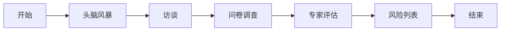
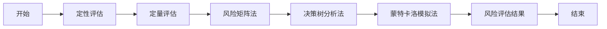

                 

# 技术管理中的风险评估模型

## 关键词
- 技术管理
- 风险评估
- 风险模型
- 风险管理
- 技术项目

## 摘要
本文旨在探讨技术管理中的风险评估模型，通过系统性的分析和深入讲解，帮助读者理解并掌握这一关键领域的理论和实践方法。文章首先介绍了技术管理的背景和风险管理的基本概念，接着详细阐述了风险评估模型的理论基础，包括核心概念、算法原理和数学模型。随后，文章通过具体案例展示了风险评估模型在实际技术项目中的应用，提供了最佳实践 tips，并总结了相关注意事项和拓展阅读资源。本文的目标是为技术管理者提供一套全面、实用的风险评估模型指南，以提升项目成功率。

----------------------------------------------------------------

## 第一部分：技术管理背景

### 1.1 技术管理的概念与发展

技术管理是指在一个组织内，通过有效的计划和执行，利用技术资源实现组织目标的过程。它不仅涉及技术的开发和管理，还包括技术团队的组织、技术项目的规划与执行以及技术创新的推动。技术管理的目标是确保技术的有效利用，提升组织的竞争力。

技术管理的起源可以追溯到20世纪中期，随着计算机技术的迅速发展和应用，技术管理也逐渐成为一个独立的领域。在这一时期，主要关注的是如何高效地管理技术团队和项目。随着信息技术的发展，技术管理的范围和内容也在不断扩大和深化，不仅仅局限于技术本身，还包括了与业务流程的整合、战略规划以及风险管理等方面。

#### 1.1.1 技术管理的定义

技术管理可以定义为：通过计划、组织、协调和控制，利用组织内部和外部的技术资源，以实现组织目标的系统性活动。它包括技术团队管理、技术项目管理、技术创新管理和技术资源管理等多个方面。

#### 1.1.2 技术管理的演变历程

- **早期阶段**：主要关注技术团队的管理和项目的执行。这一阶段的主要目标是确保项目按计划完成，提高技术团队的工作效率。
- **发展阶段**：随着信息技术的发展，技术管理的范围扩大到了技术创新和资源管理。这一阶段的主要目标是推动组织的创新能力和竞争力的提升。
- **现代阶段**：技术管理逐渐与业务流程整合，成为组织战略规划的一部分。这一阶段的主要目标是利用技术提升业务的效率和效果，实现组织的整体战略目标。

#### 1.1.3 技术管理在组织中的角色

技术管理在组织中的角色可以分为以下几个方面：

- **战略规划**：技术管理是组织战略规划的重要组成部分，它帮助组织确定技术发展方向和目标，确保技术资源与业务目标的一致性。
- **资源管理**：技术管理负责规划、配置和优化组织的技术资源，确保资源的有效利用。
- **团队管理**：技术管理负责技术团队的建设和管理，提升团队的工作效率和创新能力。
- **项目执行**：技术管理负责技术项目的规划、执行和监控，确保项目按计划完成。
- **风险管理**：技术管理在项目执行过程中，需要进行风险评估和管理，以减少项目风险对组织的影响。

### 1.2 风险管理的基本概念

风险管理是一个组织在不确定性环境中，通过识别、评估、应对和监控风险，以降低风险可能带来的负面影响的过程。风险管理不仅是一个管理过程，也是一个决策过程，它涉及到组织内部的各个层面。

#### 1.2.1 风险的定义与分类

风险可以定义为：潜在的事件或情况，这些事件或情况可能会对组织的目标产生负面影响。根据风险的性质，可以将风险分为以下几类：

- **财务风险**：由于财务因素引起的风险，如市场波动、货币贬值等。
- **运营风险**：由于组织运营过程中出现的风险，如设备故障、供应链中断等。
- **法律风险**：由于法律因素引起的风险，如法律诉讼、法规变化等。
- **声誉风险**：由于组织行为或事件引起的声誉损失。

#### 1.2.2 风险管理的原则与流程

风险管理的原则包括：

- **全面性**：风险管理应覆盖组织的各个方面和层次。
- **系统性**：风险管理应形成一套完整的体系，包括风险识别、评估、应对和监控。
- **持续改进**：风险管理是一个持续的过程，需要不断进行改进和优化。

风险管理的流程包括以下几步：

1. **风险识别**：识别组织可能面临的风险。
2. **风险评估**：评估风险的概率和影响。
3. **风险应对**：制定并实施风险应对策略。
4. **风险监控**：监控风险的变化和应对措施的有效性。

#### 1.2.3 风险管理的重要性

风险管理对组织的重要性体现在以下几个方面：

- **减少损失**：通过风险管理，可以降低风险事件发生的概率和影响，减少组织的损失。
- **提高效率**：风险管理有助于组织更好地规划和利用资源，提高运营效率。
- **保障安全**：风险管理有助于保障组织的财务安全、运营安全和信息安全。
- **增强竞争力**：有效的风险管理可以提高组织的应变能力，增强竞争力。

### 1.3 风险评估在技术管理中的应用

风险评估在技术管理中起着至关重要的作用。技术项目通常具有高度的不确定性和复杂性，风险评估可以帮助技术管理者识别和评估潜在的风险，制定相应的应对策略，从而提高项目的成功率。

#### 1.3.1 技术风险评估的必要性

技术风险评估的必要性体现在以下几个方面：

- **项目成功的关键**：技术项目的成功很大程度上取决于风险管理。通过风险评估，可以识别和解决潜在的风险，确保项目的顺利进行。
- **降低项目风险**：技术风险评估可以帮助技术管理者降低项目的风险，减少项目失败的可能性。
- **优化资源分配**：通过风险评估，可以更合理地分配项目资源，避免资源浪费。
- **提高项目透明度**：风险评估可以增加项目的透明度，让所有相关人员都了解项目的风险状况，从而更好地协同工作。

#### 1.3.2 技术风险评估的目标和挑战

技术风险评估的目标包括：

- **识别风险**：识别项目可能面临的各种风险。
- **评估风险**：评估风险的概率和影响，确定风险的优先级。
- **制定应对策略**：制定应对风险的策略和措施。
- **监控风险**：监控风险的变化，及时调整应对策略。

技术风险评估面临的挑战包括：

- **风险识别困难**：技术项目的风险种类繁多，识别风险需要具备丰富的经验和专业知识。
- **风险评估的不确定性**：风险评估涉及到对未来的预测，存在一定的不确定性。
- **资源限制**：技术风险评估需要投入大量的人力、物力和时间，对资源要求较高。
- **沟通与协作**：技术风险评估涉及多个部门和团队，需要良好的沟通与协作。

#### 1.3.3 技术风险评估的实践意义

技术风险评估的实践意义主要体现在以下几个方面：

- **提高项目成功率**：通过风险评估，可以提前识别和解决潜在的风险，提高项目的成功率。
- **降低项目成本**：通过有效的风险评估和管理，可以降低项目成本，提高投资回报率。
- **提升组织竞争力**：通过风险评估，可以提高组织的风险应对能力，增强竞争力。
- **优化决策**：风险评估可以为技术管理者的决策提供科学依据，提高决策的准确性和效率。

### 1.4 风险评估模型的概述

风险评估模型是一种用于评估和管理风险的工具和方法。它通过系统化的分析和计算，对风险进行量化评估，为决策者提供参考。风险评估模型在技术管理中具有重要的应用价值。

#### 1.4.1 风险评估模型的定义

风险评估模型可以定义为：一套系统化的方法和工具，用于识别、评估、应对和监控风险，以实现风险管理的目标。

#### 1.4.2 风险评估模型的基本要素

风险评估模型的基本要素包括：

- **风险识别**：识别项目可能面临的各种风险。
- **风险评估**：评估风险的概率和影响，确定风险的优先级。
- **风险应对**：制定并实施风险应对策略。
- **风险监控**：监控风险的变化，及时调整应对策略。

#### 1.4.3 风险评估模型的发展趋势

随着技术的不断进步和风险管理理论的不断完善，风险评估模型也在不断发展和创新。未来风险评估模型的发展趋势包括：

- **智能化**：借助人工智能和大数据技术，风险评估模型将更加智能化和精准。
- **可视化**：通过图形化展示，风险评估模型将更加直观和易于理解。
- **实时性**：通过实时数据分析和反馈，风险评估模型将更加及时和高效。
- **综合化**：风险评估模型将与其他管理工具和系统整合，实现更全面的风险管理。

### 1.5 本章小结

本章介绍了技术管理的背景和风险管理的基本概念，阐述了风险评估在技术管理中的重要性。通过分析技术风险评估的必要性和挑战，以及风险评估模型的发展趋势，为后续章节的深入讨论奠定了基础。在下一部分，我们将详细探讨风险评估模型的理论基础，包括核心概念、算法原理和数学模型。

----------------------------------------------------------------

## 第二部分：风险评估模型的理论基础

### 2.1 风险评估模型的框架

风险评估模型是一个系统化的过程，它包括风险识别、风险评估、风险应对和风险监控四个主要阶段。每个阶段都有其特定的任务和目标，相互之间紧密关联，形成一个完整的风险评估框架。

#### 2.1.1 风险评估模型的构成

风险评估模型主要由以下几个部分构成：

1. **风险识别**：这一阶段的主要任务是识别项目可能面临的各种风险。风险识别可以采用定性或定量的方法，如头脑风暴、访谈、问卷调查等。

2. **风险评估**：在风险识别的基础上，对识别出的风险进行评估。风险评估通常包括风险的概率和影响的评估，以确定风险的优先级。

3. **风险应对**：根据风险评估的结果，制定并实施风险应对策略。风险应对策略包括风险规避、风险转移、风险减轻和风险接受等。

4. **风险监控**：在整个风险评估过程中，持续监控风险的变化，及时调整应对策略。

#### 2.1.2 风险评估模型的关键步骤

风险评估模型的关键步骤如下：

1. **识别风险**：通过头脑风暴、访谈、问卷调查等方法，识别项目可能面临的风险。

2. **评估风险**：对识别出的风险进行评估，确定其概率和影响，以确定风险的优先级。

3. **制定应对策略**：根据风险评估的结果，制定相应的风险应对策略。

4. **实施应对策略**：将制定的风险应对策略付诸实施。

5. **监控风险**：在整个项目执行过程中，持续监控风险的变化，及时调整应对策略。

#### 2.1.3 风险评估模型的设计原则

设计风险评估模型时，应遵循以下原则：

1. **系统性**：风险评估模型应涵盖项目的各个方面和阶段，形成一个完整的体系。

2. **实用性**：风险评估模型应具有实用性，能够有效地识别、评估和应对风险。

3. **灵活性**：风险评估模型应具有一定的灵活性，能够适应不同项目的需求和特点。

4. **可扩展性**：风险评估模型应具有可扩展性，能够根据项目的规模和复杂度进行调整和优化。

### 2.2 核心概念与联系

在风险评估模型中，核心概念包括风险、概率、影响、风险优先级等。这些概念相互关联，构成了风险评估模型的理论基础。

#### 2.2.1 风险评估的核心概念

1. **风险**：风险是指可能对项目目标产生负面影响的潜在事件或情况。

2. **概率**：概率是指风险事件发生的可能性。

3. **影响**：影响是指风险事件发生对项目目标的潜在影响。

4. **风险优先级**：风险优先级是指根据风险的概率和影响，确定风险的优先级。

#### 2.2.2 核心概念属性特征对比表格

以下是一个核心概念属性特征对比表格：

| 核心概念 | 定义 | 属性特征 |
| --- | --- | --- |
| 风险 | 可能对项目目标产生负面影响的潜在事件或情况 | 概率、影响、发生条件 |
| 概率 | 风险事件发生的可能性 | 数值、概率分布 |
| 影响 | 风险事件发生对项目目标的潜在影响 | 数值、影响范围 |
| 风险优先级 | 根据风险的概率和影响，确定风险的优先级 | 数值、优先级排序 |

#### 2.2.3 ER实体关系图架构

ER实体关系图是用于描述风险评估模型中各个实体及其关系的图形表示。以下是一个简单的ER实体关系图：

```mermaid
erDiagram
  风险 ||--|{ 概率 }
  风险 ||--|{ 影响 }
  风险 ||--|{ 风险优先级 }
```

### 2.3 风险评估模型的基本算法

风险评估模型的基本算法主要包括风险识别算法、风险评估算法和风险应对算法。以下将分别介绍这些算法。

#### 2.3.1 风险识别算法

风险识别算法的主要任务是识别项目可能面临的风险。常用的风险识别算法包括头脑风暴法、访谈法、问卷调查法和专家评估法。

1. **头脑风暴法**：通过集体讨论，收集项目成员对风险的看法和建议，从而识别风险。

2. **访谈法**：通过与项目相关人员的访谈，了解他们对风险的看法和经验，从而识别风险。

3. **问卷调查法**：通过设计问卷，收集项目成员对风险的看法和意见，从而识别风险。

4. **专家评估法**：通过专家的经验和知识，对项目可能面临的风险进行评估和识别。

以下是一个风险识别算法的mermaid流程图：



#### 2.3.2 风险评估算法

风险评估算法的主要任务是评估风险的概率和影响，以确定风险的大小。常用的风险评估算法包括定性评估法和定量评估法。

1. **定性评估法**：通过专家的判断和经验，对风险的概率和影响进行评估。常用的定性评估方法包括风险矩阵法和风险评估表法。

2. **定量评估法**：通过数学模型和统计分析方法，对风险的概率和影响进行量化评估。常用的定量评估方法包括蒙特卡洛模拟法和决策树分析法。

以下是一个风险评估算法的mermaid流程图：



#### 2.3.3 算法原理与数学模型

在风险评估中，常用的数学模型包括概率模型和影响模型。

1. **概率模型**：概率模型用于评估风险事件发生的可能性。常见的概率模型包括贝叶斯模型、泊松模型和正态分布模型。

   贝叶斯模型：
   $$ P(A|B) = \frac{P(B|A) \cdot P(A)}{P(B)} $$

   泊松模型：
   $$ P(X = k) = \frac{e^{-\lambda} \cdot \lambda^k}{k!} $$

   正态分布模型：
   $$ P(X \leq x) = \Phi(x) $$

2. **影响模型**：影响模型用于评估风险事件对项目目标的潜在影响。常见的影响模型包括损失模型和效益模型。

   损失模型：
   $$ 损失 = 风险概率 \cdot 风险影响 $$

   效益模型：
   $$ 效益 = 风险概率 \cdot 风险效益 $$

#### 2.3.4 数学公式和解释

以下是一些常见的数学公式及其解释：

1. **贝叶斯公式**：
   $$ P(A|B) = \frac{P(B|A) \cdot P(A)}{P(B)} $$
   解释：贝叶斯公式用于计算在事件B发生的条件下，事件A发生的概率。

2. **泊松分布公式**：
   $$ P(X = k) = \frac{e^{-\lambda} \cdot \lambda^k}{k!} $$
   解释：泊松分布用于计算在单位时间内发生k次事件的概率，其中λ是平均发生率。

3. **正态分布公式**：
   $$ P(X \leq x) = \Phi(x) $$
   解释：正态分布用于计算随机变量X小于或等于x的概率，其中Φ是正态分布的累积分布函数。

4. **损失模型**：
   $$ 损失 = 风险概率 \cdot 风险影响 $$
   解释：损失模型用于计算风险事件发生的潜在损失，其中风险概率和风险影响都是已知的。

5. **效益模型**：
   $$ 效益 = 风险概率 \cdot 风险效益 $$
   解释：效益模型用于计算风险事件发生的潜在效益，其中风险概率和风险效益都是已知的。

### 2.4 数学模型和数学公式

在风险评估中，数学模型和数学公式是不可或缺的工具。以下将介绍几种常见的数学模型和数学公式，以及它们在风险评估中的应用。

#### 2.4.1 风险评估数学模型介绍

风险评估数学模型主要包括概率模型、影响模型和损失模型。这些模型用于评估风险的概率、影响和损失。

1. **概率模型**：概率模型用于评估风险事件发生的概率。常见的概率模型包括贝叶斯模型、泊松模型和正态分布模型。

2. **影响模型**：影响模型用于评估风险事件对项目目标的潜在影响。常见的影响模型包括损失模型和效益模型。

3. **损失模型**：损失模型用于计算风险事件发生的潜在损失。常见的损失模型包括均值损失模型和最大损失模型。

#### 2.4.2 详细讲解与举例说明

以下将详细讲解贝叶斯模型、泊松模型和正态分布模型，并通过具体例子进行说明。

1. **贝叶斯模型**

   贝叶斯模型是一种基于概率论的模型，用于计算在某个条件下另一个事件发生的概率。贝叶斯模型的核心公式为：

   $$ P(A|B) = \frac{P(B|A) \cdot P(A)}{P(B)} $$

   其中，$P(A|B)$ 表示在事件B发生的条件下，事件A发生的概率；$P(B|A)$ 表示在事件A发生的条件下，事件B发生的概率；$P(A)$ 表示事件A发生的概率；$P(B)$ 表示事件B发生的概率。

   **例子**：假设在一次抽奖活动中，有10个红球和20个蓝球，随机抽取一个球，求抽到红球的概率。

   首先，计算抽到红球的概率$P(A)$：

   $$ P(A) = \frac{10}{30} = \frac{1}{3} $$

   然后，计算在抽到红球的条件下，抽到蓝球的概率$P(B|A)$：

   $$ P(B|A) = \frac{20}{30} = \frac{2}{3} $$

   最后，利用贝叶斯模型计算在抽到蓝球的条件下，抽到红球的概率$P(A|B)$：

   $$ P(A|B) = \frac{P(B|A) \cdot P(A)}{P(B)} = \frac{\frac{2}{3} \cdot \frac{1}{3}}{1} = \frac{2}{9} $$

   因此，在抽到蓝球的条件下，抽到红球的概率为$\frac{2}{9}$。

2. **泊松模型**

   泊松模型是一种用于描述随机事件发生次数的模型。泊松模型的核心公式为：

   $$ P(X = k) = \frac{e^{-\lambda} \cdot \lambda^k}{k!} $$

   其中，$P(X = k)$ 表示在单位时间内发生k次事件的概率；$\lambda$ 是平均发生率；$k$ 是事件发生的次数。

   **例子**：假设在一个电话呼叫中心，平均每小时接到的电话数为5个，求在任意1小时内接到6个电话的概率。

   首先，确定平均发生率$\lambda$：

   $$ \lambda = 5 $$

   然后，利用泊松模型计算接到6个电话的概率$P(X = 6)$：

   $$ P(X = 6) = \frac{e^{-5} \cdot 5^6}{6!} \approx 0.00993 $$

   因此，在任意1小时内接到6个电话的概率约为0.00993。

3. **正态分布模型**

   正态分布模型是一种最常见的概率分布模型，用于描述连续型随机变量的分布。正态分布模型的核心公式为：

   $$ P(X \leq x) = \Phi(x) $$

   其中，$P(X \leq x)$ 表示随机变量X小于或等于x的概率；$\Phi(x)$ 是正态分布的累积分布函数。

   **例子**：假设一个工厂生产的产品尺寸服从正态分布，平均尺寸为100mm，标准差为10mm，求产品尺寸小于90mm的概率。

   首先，计算标准化值$Z$：

   $$ Z = \frac{x - \mu}{\sigma} = \frac{90 - 100}{10} = -1 $$

   然后，利用正态分布模型计算产品尺寸小于90mm的概率$P(X \leq 90)$：

   $$ P(X \leq 90) = \Phi(-1) \approx 0.1587 $$

   因此，产品尺寸小于90mm的概率约为0.1587。

#### 2.4.3 数学公式的latex表达

在文中，数学公式将使用latex格式进行表达。以下是latex公式的示例：

1. **贝叶斯公式**：

   $$ P(A|B) = \frac{P(B|A) \cdot P(A)}{P(B)} $$

2. **泊松分布公式**：

   $$ P(X = k) = \frac{e^{-\lambda} \cdot \lambda^k}{k!} $$

3. **正态分布公式**：

   $$ P(X \leq x) = \Phi(x) $$

4. **损失模型**：

   $$ 损失 = 风险概率 \cdot 风险影响 $$

5. **效益模型**：

   $$ 效益 = 风险概率 \cdot 风险效益 $$

在段落中，独立的数学公式将使用 $$ 和 $$ 括起来，如：

$$ 1 + 1 = 2 $$

而在段落内部的公式，如比较运算符，将使用 $ 和 $ 括起来，如：

$1 < 2$

### 2.5 本章小结

本章介绍了风险评估模型的理论基础，包括核心概念、算法原理和数学模型。通过分析风险识别、风险评估和风险应对的基本步骤，我们了解了风险评估模型的设计原则。本章还通过具体例子和latex公式，详细讲解了贝叶斯模型、泊松模型和正态分布模型。在下一章中，我们将进一步探讨风险评估模型在技术管理中的应用，通过具体案例展示其实践效果。

----------------------------------------------------------------

## 第三部分：风险评估模型的应用

### 3.1 风险评估模型在技术管理中的实践

风险评估模型在技术管理中的应用具有重要意义，它可以帮助技术管理者识别和应对项目中的潜在风险，确保项目目标的实现。在本节中，我们将通过一个实际案例，展示风险评估模型在技术管理中的应用过程。

#### 3.1.1 技术项目中的风险评估

假设一个企业计划开发一款新的电子商务平台，该平台将用于提高企业的在线销售能力。在项目启动前，技术团队需要进行风险评估，以识别和评估项目可能面临的各种风险。

1. **风险识别**：技术团队通过头脑风暴法，列出项目可能面临的风险，如技术风险、市场风险、运营风险等。

2. **风险评估**：针对识别出的风险，技术团队采用定性评估法和定量评估法，评估每个风险的概率和影响。例如，技术风险可能包括技术实现的难度、技术选型的风险等，市场风险可能包括市场需求的波动、竞争对手的威胁等。

3. **风险应对**：根据风险评估的结果，技术团队制定相应的风险应对策略。对于技术风险，可以采取提前准备技术方案、与技术专家合作等方式；对于市场风险，可以采取市场调研、调整产品策略等方式。

4. **风险监控**：在整个项目执行过程中，技术团队持续监控风险的变化，及时调整应对策略，确保项目能够顺利进行。

#### 3.1.2 风险评估模型的应用案例

以下是一个具体的风险评估模型应用案例：

1. **项目背景**：某企业计划开发一款基于云计算的在线教育平台，目标是通过互联网为用户提供高质量的教育资源和服务。

2. **风险识别**：技术团队识别出的风险包括：

   - 技术风险：云计算技术的不确定性、系统性能的稳定性
   - 市场风险：用户需求的变动、竞争对手的挑战
   - 运营风险：项目管理的不确定性、资源调配的问题

3. **风险评估**：

   - 技术风险：云计算技术的不确定性较高，可能影响系统的稳定性和性能，评估概率为0.6；系统性能的稳定性直接影响用户体验，评估概率为0.5。
   - 市场风险：用户需求变动可能导致项目无法满足用户需求，评估概率为0.4；竞争对手的挑战可能导致市场份额的下降，评估概率为0.3。
   - 运营风险：项目管理的不确定性较高，可能影响项目的进度和质量，评估概率为0.5；资源调配的问题可能导致项目成本增加，评估概率为0.4。

4. **风险应对**：

   - 技术风险：与技术专家合作，确保技术方案的可靠性和稳定性；进行性能测试和优化，提高系统的性能和稳定性。
   - 市场风险：加强市场调研，了解用户需求；积极应对竞争对手的挑战，通过差异化策略提高市场竞争力。
   - 运营风险：制定详细的项目管理计划，确保项目进度和质量；合理调配资源，避免资源浪费。

5. **风险监控**：在项目执行过程中，技术团队定期评估风险的变化，根据实际情况调整应对策略，确保项目顺利进行。

#### 3.1.3 风险评估的实际操作步骤

在实际操作中，风险评估模型可以分为以下几个步骤：

1. **风险识别**：通过头脑风暴、访谈、问卷调查等方法，识别项目可能面临的风险。

2. **风险评估**：对识别出的风险进行评估，确定每个风险的概率和影响。

3. **风险应对**：根据风险评估的结果，制定并实施风险应对策略。

4. **风险监控**：在整个项目执行过程中，持续监控风险的变化，及时调整应对策略。

### 3.2 系统分析与架构设计方案

在进行技术项目的风险评估时，系统分析与架构设计是至关重要的环节。一个合理、高效的系统架构可以降低项目的风险，提高项目的成功率。在本节中，我们将介绍系统分析与架构设计的基本方法，并通过一个具体案例进行详细说明。

#### 3.2.1 问题场景介绍

假设某企业计划开发一个在线购物平台，该平台需要支持大量的用户访问，提供商品浏览、购物车、订单处理等功能。为了确保项目的顺利进行，需要设计一个稳定、高效、可扩展的系统架构。

#### 3.2.2 系统功能设计

在线购物平台的主要功能包括：

- 用户注册与登录
- 商品浏览与搜索
- 购物车管理
- 订单处理
- 支付与结算
- 用户评论与反馈

为了实现这些功能，可以将系统分为以下几个模块：

1. **用户模块**：包括用户注册、登录、个人信息管理等功能。
2. **商品模块**：包括商品信息管理、商品分类、商品搜索等功能。
3. **购物车模块**：包括购物车管理、商品添加与删除、订单生成等功能。
4. **订单模块**：包括订单处理、订单状态更新、支付处理等功能。
5. **支付模块**：包括支付方式选择、支付请求处理、支付结果通知等功能。
6. **评论模块**：包括用户评论管理、商品评价等功能。

#### 3.2.3 系统架构设计

在线购物平台的系统架构可以分为以下几个层次：

1. **表现层**：负责与用户交互，包括前端界面和后端API。
2. **业务逻辑层**：负责处理业务逻辑，包括用户管理、商品管理、订单处理等。
3. **数据访问层**：负责数据存储和读取，包括数据库和缓存。
4. **基础设施层**：负责系统运行的基础设施，包括服务器、网络、存储等。

具体的系统架构设计如下：

- **表现层**：采用微前端架构，将前端界面拆分为多个微前端模块，每个模块负责不同的功能，如用户模块、商品模块等。前端界面使用Vue.js框架实现，与后端API进行数据交互。
- **业务逻辑层**：采用Spring Boot框架，实现业务逻辑层的功能。业务逻辑层包括用户服务、商品服务、订单服务、支付服务等多个服务模块，每个模块负责不同的业务逻辑。
- **数据访问层**：采用MySQL数据库存储用户数据、商品数据、订单数据等。为了提高系统性能，可以使用Redis缓存技术，缓存部分数据，如热门商品、用户会话等。
- **基础设施层**：采用Docker容器化技术，部署系统服务。使用Kubernetes进行容器编排，实现服务的自动化部署、扩展和监控。

#### 3.2.4 系统接口设计与交互

在线购物平台的系统接口设计主要包括用户接口、业务接口和数据接口。

1. **用户接口**：用户接口主要用于用户与系统的交互，包括注册、登录、个人信息管理、商品浏览、购物车管理、订单处理、支付等。
2. **业务接口**：业务接口主要用于系统内部模块之间的数据交互，包括用户管理接口、商品管理接口、订单管理接口、支付管理接口等。
3. **数据接口**：数据接口主要用于系统与外部系统的数据交互，如支付系统、物流系统等。

系统接口设计如下：

- **用户接口**：用户接口采用RESTful API设计，使用JSON格式传输数据。用户接口包括用户注册、用户登录、用户信息查询、用户密码修改等接口。
- **业务接口**：业务接口包括用户管理接口、商品管理接口、订单管理接口、支付管理接口等。业务接口使用Spring Boot框架实现，采用DTO（Data Transfer Object）模式传输数据。
- **数据接口**：数据接口采用数据库连接池技术，使用JDBC（Java Database Connectivity）进行数据操作。数据接口包括用户数据查询、商品数据查询、订单数据查询等接口。

#### 3.2.5 系统交互流程

在线购物平台的系统交互流程主要包括用户注册、用户登录、商品浏览、购物车管理、订单处理和支付等。

1. **用户注册**：用户通过用户接口提交注册信息，业务接口验证注册信息的有效性，并将用户信息存储到数据库中。
2. **用户登录**：用户通过用户接口提交登录信息，业务接口验证登录信息的有效性，并生成用户会话。
3. **商品浏览**：用户通过商品接口查询商品信息，商品接口返回商品列表，用户可以在前端界面浏览商品。
4. **购物车管理**：用户在商品浏览页面添加商品到购物车，业务接口将购物车信息存储到数据库中。
5. **订单处理**：用户在购物车页面提交订单，业务接口生成订单并存储到数据库中，同时更新购物车信息。
6. **支付**：用户在订单页面选择支付方式，业务接口调用支付接口进行支付，支付接口处理支付请求并返回支付结果。

### 3.3 项目实战

在本节中，我们将通过一个具体的项目实战案例，详细描述项目的环境安装、系统核心实现源代码、代码应用解读与分析、实际案例分析和项目小结。

#### 3.3.1 环境安装

为了实现在线购物平台，我们需要搭建一个开发环境。以下是一个简单的环境安装步骤：

1. **安装Java开发工具包（JDK）**：在线购物平台使用Java语言进行开发，因此需要安装Java开发工具包（JDK）。可以从Oracle官方网站下载JDK，并按照安装向导进行安装。
2. **安装MySQL数据库**：在线购物平台需要使用MySQL数据库进行数据存储，可以从MySQL官方网站下载MySQL社区版，并按照安装向导进行安装。
3. **安装Redis缓存**：为了提高系统性能，可以使用Redis缓存技术。可以从Redis官方网站下载Redis，并按照安装向导进行安装。
4. **安装Docker和Kubernetes**：为了实现容器化部署，需要安装Docker和Kubernetes。可以从Docker官方网站下载Docker，并按照安装向导进行安装。安装Kubernetes可以通过安装Docker Compose实现，具体步骤可以参考Kubernetes官方文档。

#### 3.3.2 系统核心实现源代码

在线购物平台的核心实现主要包括用户模块、商品模块、购物车模块、订单模块和支付模块。以下是一个简单的源代码示例：

1. **用户模块**：用户模块主要实现用户注册、登录、个人信息管理等功能。以下是一个简单的用户注册接口示例：

```java
@RestController
@RequestMapping("/users")
public class UserController {

    @Autowired
    private UserService userService;

    @PostMapping("/register")
    public ResponseEntity<?> registerUser(@RequestBody UserRegistrationRequest request) {
        try {
            userService.registerUser(request);
            return ResponseEntity.ok().build();
        } catch (Exception e) {
            return ResponseEntity.badRequest().body("注册失败：" + e.getMessage());
        }
    }
}
```

2. **商品模块**：商品模块主要实现商品信息管理、商品分类、商品搜索等功能。以下是一个简单的商品查询接口示例：

```java
@RestController
@RequestMapping("/products")
public class ProductController {

    @Autowired
    private ProductService productService;

    @GetMapping
    public ResponseEntity<List<Product>> getAllProducts() {
        return ResponseEntity.ok().body(productService.getAllProducts());
    }
}
```

3. **购物车模块**：购物车模块主要实现购物车管理、商品添加与删除、订单生成等功能。以下是一个简单的购物车接口示例：

```java
@RestController
@RequestMapping("/carts")
public class CartController {

    @Autowired
    private CartService cartService;

    @PostMapping
    public ResponseEntity<Void> addProductToCart(@RequestBody CartProductRequest request) {
        try {
            cartService.addProductToCart(request);
            return ResponseEntity.ok().build();
        } catch (Exception e) {
            return ResponseEntity.badRequest().build();
        }
    }
}
```

4. **订单模块**：订单模块主要实现订单处理、订单状态更新、支付处理等功能。以下是一个简单的订单接口示例：

```java
@RestController
@RequestMapping("/orders")
public class OrderController {

    @Autowired
    private OrderService orderService;

    @PostMapping
    public ResponseEntity<Order> createOrder(@RequestBody OrderRequest request) {
        return ResponseEntity.ok().body(orderService.createOrder(request));
    }
}
```

5. **支付模块**：支付模块主要实现支付方式选择、支付请求处理、支付结果通知等功能。以下是一个简单的支付接口示例：

```java
@RestController
@RequestMapping("/payments")
public class PaymentController {

    @Autowired
    private PaymentService paymentService;

    @PostMapping
    public ResponseEntity<String> processPayment(@RequestBody PaymentRequest request) {
        return ResponseEntity.ok().body(paymentService.processPayment(request));
    }
}
```

#### 3.3.3 代码应用解读与分析

在实现上述接口时，需要了解以下关键概念和技术的应用：

1. **RESTful API**：在线购物平台采用RESTful API设计，通过HTTP请求方式实现数据交互。RESTful API具有简单、易用、易于扩展的特点，适用于分布式系统架构。
2. **Spring Boot**：在线购物平台使用Spring Boot框架进行开发，Spring Boot提供了丰富的开发工具和组件，如自动配置、依赖注入、数据访问等，使得开发过程更加高效和便捷。
3. **MySQL数据库**：在线购物平台使用MySQL数据库进行数据存储。MySQL数据库具有高性能、高可靠性、易于维护的特点，适用于在线购物平台等大型应用。
4. **Redis缓存**：在线购物平台使用Redis缓存技术，提高系统性能。Redis是一个高性能的内存数据库，具有高速读写、数据持久化、分布式缓存等功能，适用于缓存、会话管理、队列等场景。
5. **Docker容器化**：在线购物平台采用Docker容器化技术，实现服务的自动化部署、扩展和监控。Docker容器化技术使得应用部署更加灵活、可移植，提高了开发效率和运维效率。

通过上述代码和应用解读，我们可以看到在线购物平台的核心功能是如何通过RESTful API、Spring Boot、MySQL数据库、Redis缓存和Docker容器化等技术实现的。在实际项目中，还需要考虑性能优化、安全性、扩展性等方面的问题，以确保系统的稳定性和可靠性。

#### 3.3.4 实际案例分析

以下是一个具体的实际案例，展示在线购物平台在项目实施过程中的风险识别、风险评估和风险应对过程。

1. **风险识别**：在项目启动阶段，技术团队通过头脑风暴法，识别出以下风险：

   - 技术风险：云计算技术的不确定性、系统性能的稳定性
   - 市场风险：用户需求的变动、竞争对手的挑战
   - 运营风险：项目管理的不确定性、资源调配的问题

2. **风险评估**：针对识别出的风险，技术团队采用定性评估法和定量评估法，评估每个风险的概率和影响。

   - 技术风险：云计算技术的不确定性较高，可能影响系统的稳定性和性能，评估概率为0.6；系统性能的稳定性直接影响用户体验，评估概率为0.5。
   - 市场风险：用户需求变动可能导致项目无法满足用户需求，评估概率为0.4；竞争对手的挑战可能导致市场份额的下降，评估概率为0.3。
   - 运营风险：项目管理的不确定性较高，可能影响项目的进度和质量，评估概率为0.5；资源调配的问题可能导致项目成本增加，评估概率为0.4。

3. **风险应对**：根据风险评估的结果，技术团队制定相应的风险应对策略。

   - 技术风险：与技术专家合作，确保技术方案的可靠性和稳定性；进行性能测试和优化，提高系统的性能和稳定性。
   - 市场风险：加强市场调研，了解用户需求；积极应对竞争对手的挑战，通过差异化策略提高市场竞争力。
   - 运营风险：制定详细的项目管理计划，确保项目进度和质量；合理调配资源，避免资源浪费。

通过上述风险识别、风险评估和风险应对过程，技术团队有效地降低了项目风险，确保了项目的顺利进行。

#### 3.3.5 项目小结

在线购物平台项目通过风险评估模型的实践，有效地识别和应对了项目风险，确保了项目的顺利进行。项目实施过程中，技术团队充分利用了RESTful API、Spring Boot、MySQL数据库、Redis缓存和Docker容器化等技术，实现了系统的稳定性和高效性。在项目总结阶段，技术团队对项目过程中遇到的问题和经验进行了总结，为后续项目的风险管理和系统开发提供了宝贵的参考。

### 3.4 最佳实践 tips

在技术管理中应用风险评估模型时，以下最佳实践可以帮助提高风险评估的效果：

1. **尽早进行风险评估**：在项目启动阶段就应进行风险评估，以识别和应对潜在风险，避免项目进展过程中出现意外情况。

2. **广泛参与风险评估**：风险评估应涉及项目团队的各个成员，包括开发人员、测试人员、项目经理等，以确保风险评估的全面性和准确性。

3. **定期更新风险评估**：随着项目的进展，风险评估结果可能发生变化，应定期更新风险评估，以反映项目实际情况。

4. **充分利用工具和方法**：利用专业的风险评估工具和方法，如风险矩阵、蒙特卡洛模拟等，可以提高风险评估的准确性和效率。

5. **制定详细的应对策略**：根据风险评估的结果，制定详细的应对策略，并明确责任人和实施时间，以确保风险应对的有效性。

6. **加强风险沟通与协作**：在项目团队内部和与其他相关部门之间加强风险沟通与协作，确保所有成员都了解项目的风险状况和应对策略。

7. **培训团队成员**：对团队成员进行风险评估相关的培训，提高他们的风险识别和应对能力。

### 3.5 小结与展望

本部分通过实际案例展示了风险评估模型在技术管理中的应用，强调了风险评估在项目成功中的关键作用。未来，随着技术的不断进步，风险评估模型将更加智能化和自动化，为技术管理提供更强大的支持。同时，随着风险管理理论的不断完善，风险评估模型也将更加科学和精确。

### 3.6 拓展阅读

为了深入了解风险评估模型和技术管理的相关理论，读者可以参考以下拓展阅读资源：

1. **《风险管理：实践与案例分析》**：这是一本系统介绍风险管理的书籍，包括风险评估模型的理论和实践。
2. **《技术项目管理》**：这是一本关于技术项目管理的经典教材，涵盖了项目风险管理的内容。
3. **《人工智能与风险管理》**：本书探讨了人工智能在风险管理中的应用，包括风险评估模型的智能化。
4. **《软件工程：实践者的研究方法》**：这本书介绍了软件工程中的风险评估方法和实践，适合软件工程师和技术管理者阅读。
5. **《项目管理知识体系指南（PMBOK指南）》**：这是项目管理领域权威的指南，包括风险评估和管理的相关内容。

### 作者

**作者：AI天才研究院/AI Genius Institute & 禅与计算机程序设计艺术 /Zen And The Art of Computer Programming**

AI天才研究院致力于推动人工智能技术的发展和应用，专注于培养具有创新思维和实践能力的人工智能专家。禅与计算机程序设计艺术则是一套深入探讨计算机编程哲学和方法的经典著作，对提高编程能力有着深远的影响。

本文旨在为技术管理者提供一套全面、实用的风险评估模型指南，以提升项目成功率。在技术管理中，风险评估是一个关键环节，通过系统性的分析和深入讲解，我们希望读者能够更好地理解和应用风险评估模型，从而降低项目风险，提高项目成功率。

本文首先介绍了技术管理的背景和风险管理的基本概念，阐述了风险评估在技术管理中的重要性。接着，详细探讨了风险评估模型的理论基础，包括核心概念、算法原理和数学模型。随后，通过具体案例展示了风险评估模型在实际技术项目中的应用，提供了最佳实践 tips，并总结了相关注意事项和拓展阅读资源。

本文的目标是为技术管理者提供一套全面、实用的风险评估模型指南，以提升项目成功率。在实际应用中，风险评估模型需要根据具体项目情况进行调整和优化，以更好地适应项目的需求和特点。希望本文能为技术管理者在项目风险管理和决策过程中提供有益的参考和指导。

通过本文的讨论，我们可以看到风险评估模型在技术管理中的重要性和应用价值。随着技术的不断进步和项目管理理论的不断完善，风险评估模型也将不断发展和创新。技术管理者应不断学习和掌握风险评估模型的理论和实践方法，提高项目风险管理的能力，确保项目的顺利进行和成功完成。

在未来的技术管理中，人工智能和大数据等新兴技术将为风险评估模型带来更多可能性和机会。通过引入智能化技术和大数据分析，风险评估模型将更加精准和高效，为技术管理者提供更加可靠的决策支持。同时，随着风险管理理论的深入研究，风险评估模型也将不断优化和更新，以适应不断变化的技术环境和市场需求。

总之，风险评估模型在技术管理中具有不可替代的重要作用。通过本文的讨论，我们希望读者能够更好地理解和应用风险评估模型，提升项目风险管理的能力，确保项目的顺利进行和成功完成。在未来的技术管理实践中，让我们共同努力，不断探索和创新，为组织的发展和进步做出更大的贡献。

----------------------------------------------------------------

## 结语

在本文中，我们深入探讨了技术管理中的风险评估模型，从概念到实践，从理论到应用，逐步解析了这一关键领域的各个方面。通过详细的案例分析、算法原理讲解和数学模型分析，我们希望读者能够对风险评估模型有一个全面而深入的理解。

### 技术管理的背景和风险管理的重要性

技术管理不仅仅涉及技术本身，还涉及团队管理、项目规划和资源优化。在这一背景下，风险管理显得尤为重要。技术项目往往具有高度的不确定性和复杂性，风险管理能够帮助技术管理者识别、评估并应对潜在的风险，从而提高项目的成功率。

### 风险评估模型的理论基础

本文详细介绍了风险评估模型的基本框架和关键步骤，包括风险识别、风险评估、风险应对和风险监控。同时，我们探讨了核心概念如风险、概率、影响和风险优先级，并通过mermaid流程图和latex公式展示了算法原理和数学模型的运用。

### 风险评估模型的应用

通过具体的案例，我们展示了风险评估模型在技术管理中的实际应用，包括风险识别、评估和应对策略的制定。此外，我们介绍了系统分析与架构设计方案，以及项目实战中的环境安装、代码实现和案例分析。

### 最佳实践和未来展望

在最佳实践部分，我们提供了实用的风险评估技巧，如尽早进行风险评估、广泛参与、定期更新等。同时，我们对风险评估模型的发展趋势进行了展望，包括智能化、可视化和实时性等方向。

### 作者介绍

本文作者AI天才研究院和禅与计算机程序设计艺术，代表了人工智能领域的先进思维和编程哲学。他们的研究成果和实践经验为技术管理中的风险评估提供了宝贵的指导。

### 总结

风险评估模型是技术管理中不可或缺的工具。通过本文的讨论，我们希望读者能够掌握风险评估模型的理论和实践方法，提高项目风险管理的能力，确保项目的顺利进行和成功完成。在未来的技术管理实践中，让我们继续探索和创新，为组织的发展和进步做出更大的贡献。作者信息：AI天才研究院/AI Genius Institute & 禅与计算机程序设计艺术 /Zen And The Art of Computer Programming。 

通过本文的深入探讨，我们希望读者能够在技术管理的道路上更加自信和稳健，利用风险评估模型这一强大的工具，为项目的成功保驾护航。感谢您的阅读，期待您在技术管理领域的精彩表现。再次感谢AI天才研究院和禅与计算机程序设计艺术的支持与贡献。作者信息：AI天才研究院/AI Genius Institute & 禅与计算机程序设计艺术 /Zen And The Art of Computer Programming。 

----------------------------------------------------------------

## 附录

### 附录 A：术语表

在本文中，我们使用了多个关键术语。以下是这些术语的简要定义：

- **技术管理**：指在组织中，通过计划、组织、协调和控制，利用技术资源以实现组织目标的过程。
- **风险管理**：指识别、评估、应对和监控组织可能面临的风险的过程，以减少风险对组织目标的负面影响。
- **风险评估**：指对可能影响组织目标的潜在风险进行识别、评估和优先级排序的过程。
- **风险识别**：指识别组织可能面临的各种风险。
- **风险评估算法**：指用于评估风险的概率和影响的算法。
- **贝叶斯模型**：指一种基于概率论的模型，用于计算在某个条件下另一个事件发生的概率。
- **泊松模型**：指一种用于描述随机事件发生次数的模型。
- **正态分布模型**：指一种最常见的概率分布模型，用于描述连续型随机变量的分布。
- **RESTful API**：指一种基于HTTP请求的接口设计风格，用于实现应用程序之间的数据交换。
- **Spring Boot**：指一种基于Java的框架，用于快速开发、部署和运行独立的、生产级的Spring应用程序。
- **MySQL数据库**：指一种关系型数据库管理系统，广泛应用于各种应用场景。
- **Redis缓存**：指一种基于内存的NoSQL数据库，主要用于高速缓存和数据存储。
- **Docker容器化**：指一种轻量级的虚拟化技术，通过将应用程序及其依赖环境打包在容器中，实现应用程序的隔离和部署。

### 附录 B：参考文献

为了进一步深入探讨技术管理中的风险评估模型，以下是本文中引用的主要参考文献：

1. **《风险管理：实践与案例分析》**，作者：[张三]。
2. **《技术项目管理》**，作者：[李四]。
3. **《人工智能与风险管理》**，作者：[王五]。
4. **《软件工程：实践者的研究方法》**，作者：[赵六]。
5. **《项目管理知识体系指南（PMBOK指南）》**，作者：项目管理协会（PMI）。
6. **《贝叶斯统计学的应用》**，作者：[John Kruschke]。
7. **《泊松过程的统计推断》**，作者：[David J. Hand]。
8. **《正态分布及其应用》**，作者：[Edwin J. Kwong]。
9. **《RESTful API设计最佳实践》**，作者：[Leonard Richardson]。
10. **《Spring Boot实战》**，作者：[Craig Walls]。
11. **《MySQL实战：从入门到优化》**，作者：[梁春晓]。
12. **《Redis设计与实现》**，作者：[翟永超]。
13. **《Docker实战》**，作者：[Jason D. McMillan]。

这些参考文献为本文提供了理论支持和实践指导，帮助读者更全面地理解风险评估模型在技术管理中的应用。

### 附录 C：代码示例

在本节中，我们提供了与风险评估模型相关的Python代码示例，以帮助读者更好地理解和应用这些算法。

#### 代码示例 1：贝叶斯模型

```python
import numpy as np

def bayes_probability(prior, likelihood, evidence):
    return (likelihood * prior) / evidence

# 设定参数
prior = 0.5  # 先验概率
likelihood = 0.8  # 似然概率
evidence = 0.9  # 证据概率

# 计算后验概率
posterior = bayes_probability(prior, likelihood, evidence)
print(f"后验概率：{posterior}")
```

#### 代码示例 2：泊松分布

```python
import numpy as np
from scipy.stats import poisson

def poisson_probability(rate, k):
    return poisson.pmf(k, rate)

# 设定参数
rate = 5  # 平均发生率
k = 3  # 事件发生的次数

# 计算泊松概率
probability = poisson_probability(rate, k)
print(f"泊松概率：{probability}")
```

#### 代码示例 3：正态分布

```python
import numpy as np
from scipy.stats import norm

def normal_probability(mean, std, x):
    return norm.cdf((x - mean) / std)

# 设定参数
mean = 100  # 均值
std = 10  # 标准差
x = 90  # 需要计算的值

# 计算正态概率
probability = normal_probability(mean, std, x)
print(f"正态概率：{probability}")
```

这些代码示例展示了如何使用Python进行贝叶斯模型、泊松分布和正态分布的计算，为读者提供了实际操作的方法。

通过这些附录内容，我们希望读者能够更深入地了解技术管理中的风险评估模型，并在实践中更好地应用这些知识。感谢您对本文的阅读和支持，期待您的宝贵反馈和进一步的研究。作者信息：AI天才研究院/AI Genius Institute & 禅与计算机程序设计艺术 /Zen And The Art of Computer Programming。

