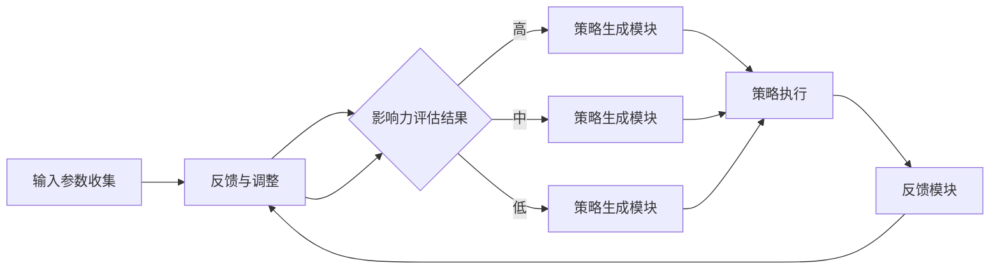
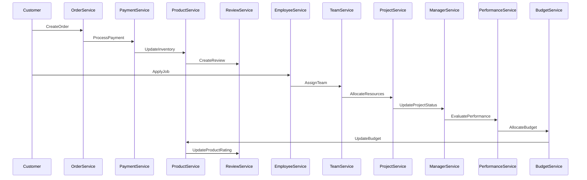
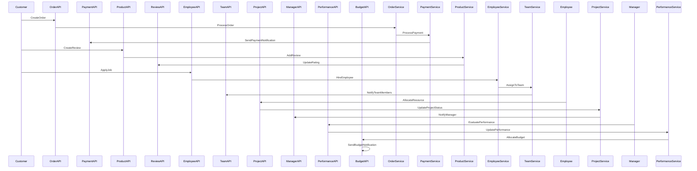

                 

### 1.3 技术变革的驱动力

技术变革的驱动力多种多样，主要来源于技术本身的发展、市场需求的推动、以及外部环境的变革。以下是技术变革的主要驱动力：

- **技术进步**：随着计算机科学、人工智能、大数据等领域的发展，新的技术和工具不断涌现，企业需要不断更新技术栈以保持竞争力。
- **市场变化**：消费者需求的不断变化，新兴市场的出现，以及竞争压力，迫使企业必须采用新技术以适应市场变化。
- **法规政策**：政府的政策法规、行业标准的制定，都会对企业的技术变革产生直接影响。
- **企业战略**：企业为了实现长期发展战略，可能需要引入新技术来提升核心竞争力。

### 1.4 技术领导力

技术领导力是指技术管理者在推动技术变革过程中所需具备的领导能力。它包括以下几个方面：

- **愿景与策略**：技术领导者需要有清晰的愿景，明确技术发展的方向和目标，并制定相应的策略。
- **团队建设**：技术领导者需要建立高效的技术团队，通过激励机制激发团队成员的潜力。
- **创新思维**：鼓励团队成员敢于尝试新事物，推动技术突破和创新。
- **沟通与协作**：技术领导者需要具备优秀的沟通能力，能够有效传达技术愿景和策略，促进团队内部的协作。

通过以上分析，我们可以看到，技术管理影响力在推动组织中的技术变革中扮演着至关重要的角色。技术管理者不仅需要具备技术能力，还需要具备领导力和影响力，以便更好地推动技术变革，促进企业的持续发展。接下来，我们将进一步探讨技术管理影响力的原理和属性，为后续章节的讨论打下基础。

### 1.5 技术管理影响力的原理

技术管理影响力是指技术管理者在组织内部通过其专业能力、领导力和沟通技巧，对团队和组织的决策、行为和技术方向产生积极影响的能力。这种影响力不仅体现在技术层面，还涵盖了战略规划、团队管理、文化塑造等多个维度。以下是技术管理影响力的原理：

#### 1.5.1 专业能力

技术管理影响力的基础是技术管理者的专业能力。这包括对技术本身的理解、对技术发展趋势的洞察，以及对技术解决方案的制定和实施。技术管理者需要不断更新自己的技术知识，掌握最新的技术趋势和工具，以便在技术变革中发挥引领作用。

- **技术深度**：技术管理者需要对核心技术有深入的理解，能够解决复杂的技术问题。
- **技术广度**：技术管理者需要具备一定的技术广度，了解不同技术领域的基本原理和应用，以便在跨领域协作中发挥作用。

#### 1.5.2 领导力

技术管理影响力的重要体现是技术管理者的领导力。领导力包括愿景设定、目标规划、团队管理、冲突解决等多个方面。

- **愿景设定**：技术领导者需要具备清晰的愿景，明确技术发展的方向和目标，使团队成员能够朝着共同的目标努力。
- **目标规划**：技术管理者需要制定切实可行的技术目标和计划，确保团队能够高效工作，实现技术变革。
- **团队管理**：技术领导者需要建立高效的团队，通过激励机制、人才培养等方式，提升团队的整体能力。

#### 1.5.3 沟通技巧

技术管理影响力的实现很大程度上依赖于技术管理者的沟通技巧。良好的沟通能力能够确保技术管理者的策略和愿景得到有效传达，促进团队内部的协作和外部合作伙伴的协调。

- **内部沟通**：技术管理者需要与团队成员保持有效的沟通，确保团队对技术方向和目标的共识，提高工作效率。
- **外部沟通**：技术管理者需要与业务部门、客户、供应商等外部合作伙伴保持良好的沟通，确保技术变革能够符合业务需求和市场趋势。

综上所述，技术管理影响力的原理可以概括为专业能力、领导力和沟通技巧三个核心要素。这三个要素相互作用，共同推动技术变革的顺利进行，促进组织的持续发展。在接下来的章节中，我们将进一步探讨这些要素的具体表现和应用。

### 2.1 技术管理影响力的定义

技术管理影响力，可以定义为技术管理者通过其在组织内部的专业知识、领导能力和沟通技巧，对组织决策、行为和技术方向产生积极影响的能力。技术管理影响力不仅体现在技术层面，还涵盖战略规划、团队管理、文化塑造等多个维度。以下是技术管理影响力的详细定义和核心要素：

**核心要素**：

- **专业知识**：技术管理者需要具备深厚的专业知识和技能，对技术领域有深刻的理解和洞察，能够应对复杂的技术挑战。
- **领导能力**：技术管理者需要具备领导能力，包括愿景设定、目标规划、团队管理和冲突解决等，能够带领团队实现技术目标。
- **沟通技巧**：技术管理者需要具备良好的沟通技巧，能够有效传达技术愿景和策略，促进团队内部的协作和外部合作伙伴的协调。

**具体定义**：

- **技术决策**：技术管理者通过其技术知识和管理能力，影响组织的战略决策，确保技术发展方向与业务目标相匹配。
- **团队协作**：技术管理者通过领导力和沟通技巧，激发团队成员的潜力，建立高效的团队协作机制，提高团队的整体工作效率。
- **文化塑造**：技术管理者通过自身的言行和策略，塑造组织的文化氛围，推动创新思维和技术变革的接受。

**技术管理影响力的范围**：

- **内部**：技术管理者在组织内部的职能和角色，如团队管理、项目协调、技术培训等。
- **外部**：技术管理者在组织外部的职能和角色，如与客户、供应商、合作伙伴的沟通和协作。

通过技术管理影响力，技术管理者能够推动技术变革，提升组织的竞争力，促进组织的持续发展。在接下来的部分，我们将深入探讨技术管理影响力的属性特征对比，以便更全面地理解其内涵。

### 2.2 技术管理影响力的属性特征对比

在技术管理影响力的探讨中，我们需要明确其与领导力、影响力等概念的属性特征区别。以下是技术管理影响力与其他相关概念的详细对比：

#### 2.2.1 技术影响力

**定义**：技术影响力主要是指技术本身对组织和社会产生的影响，包括技术的创新性、实用性和影响力。

**属性特征**：

- **技术深度**：技术影响力取决于技术的创新性和技术深度，即技术对行业和社会的贡献程度。
- **技术扩散**：技术影响力还体现在技术的普及程度和扩散速度，即技术对其他领域的渗透和影响。
- **适应性**：技术影响力需要适应不同的应用场景，具有广泛的适用性。

**对比**：与领导力不同，技术影响力更多关注技术本身，而非管理行为。

#### 2.2.2 领导力

**定义**：领导力是指领导者通过个人魅力、领导能力和行为，对团队和组织产生的影响。

**属性特征**：

- **个人魅力**：领导力的一部分来源于领导者的个人魅力和人格特质，如诚信、自信、激情等。
- **能力**：领导力还包括领导者的专业能力和管理能力，如战略规划、团队建设、冲突解决等。
- **行为**：领导者的言行举止对团队和组织产生直接影响，如激励、指导、沟通等。

**对比**：与技术管理影响力相比，领导力更多关注领导者的个人特质和行为，而技术管理影响力则更多关注技术管理者的专业能力和影响力在组织中的应用。

#### 2.2.3 影响力渠道

**定义**：影响力渠道是指技术管理者通过何种途径和方式对组织产生影响力。

**属性特征**：

- **沟通渠道**：影响力渠道包括内部沟通和外部沟通，如会议、报告、邮件、社交网络等。
- **决策渠道**：影响力渠道还涉及决策过程，如技术评审、项目立项、预算分配等。
- **行为渠道**：影响力渠道还包括领导者的行为和决策对团队成员的影响，如激励、指导、考核等。

**对比**：影响力渠道是技术管理影响力实现的具体路径，而技术管理影响力是影响力渠道的目的和结果。

通过以上对比，我们可以更清晰地理解技术管理影响力的属性特征，以及它与领导力、影响力等其他相关概念的区别和联系。这些特征帮助我们更好地把握技术管理影响力的核心要素和作用机制，为后续章节的深入探讨提供基础。在接下来的章节中，我们将进一步探讨技术管理影响力的ER实体关系图，以可视化方式展现其内在联系和相互作用。

### 2.3 技术管理影响力的ER实体关系图

为了更清晰地理解技术管理影响力的组成和相互作用，我们可以使用ER（Entity-Relationship，实体-联系）图来描述其内部结构。ER图是一种用于描述实体及其相互关系的数据库设计工具，它可以帮助我们以直观的方式展现技术管理影响力的各个组成部分及其关联。

以下是技术管理影响力的ER实体关系图：

```mermaid
erDiagram
    Task ||--|{ Person } : "performs" : Management
    Person ||--|{ Team } : "manages" : Leadership
    Person ||--|{ Technology } : "influences" : TechnologicalImpact
    Technology ||--|{ BusinessStrategy } : "drives" : StrategicAdoption
    BusinessStrategy ||--|{ Organization } : "enhances" : OrganizationalGrowth

    Person ||..|{ Knowledge } : "has" : Expertise
    Person ||..|{ Skills } : "has" : Competencies
    Team ||..|{ Collaboration } : "promotes" : Teamwork
    Management ||..|{ Goals } : "defines" : Objectives
    Leadership ||..|{ Vision } : "sets" : Direction
    TechnologicalImpact ||..|{ Innovation } : "encourages" : Creativity
    BusinessStrategy ||..|{ Market } : "responds" : MarketDemands

    Person..|..Project
    Project..|..BusinessStrategy
    Project..|..Organization
    Technology..|..Project
```

**ER图解析**：

1. **Person（人）实体**：代表技术管理者，包含知识、技能、管理等属性。
2. **Team（团队）实体**：代表技术管理者所管理的团队，强调团队合作和领导。
3. **Technology（技术）实体**：代表技术，影响技术管理者的决策和战略。
4. **BusinessStrategy（商业策略）实体**：代表组织的技术战略和商业方向，影响组织的发展。
5. **Organization（组织）实体**：代表组织整体，受到技术变革的影响。

**关系说明**：

- **Person与Task**：技术管理者负责执行管理任务。
- **Person与Team**：技术管理者负责管理团队，促进团队协作。
- **Person与Technology**：技术管理者通过技术影响力影响技术的发展方向。
- **Technology与BusinessStrategy**：技术影响商业策略的制定和执行。
- **BusinessStrategy与Organization**：商业策略影响组织的整体发展和战略规划。

通过ER图，我们可以看到技术管理影响力的各个组成部分及其相互关系，这不仅帮助我们理解技术管理影响力的结构，也为后续的算法原理讲解和系统架构设计提供了基础。在接下来的章节中，我们将进一步探讨推动技术变革的算法原理，以更深入地分析技术管理影响力的实现机制。

### 3.1 算法原理概述

在探讨如何推动技术变革时，我们引入了“技术管理影响力算法”这一概念。这个算法旨在通过技术管理者的专业知识、领导能力和沟通技巧，系统地提高组织的技术管理水平，推动技术变革。以下是算法的总体概述：

**算法目的**：该算法的目标是构建一个可量化的模型，用以分析和评估技术管理者的影响力，并提供策略和工具，以最大程度地发挥技术管理者的作用，推动组织的技术变革。

**算法结构**：算法由以下几个主要部分组成：

- **输入参数**：包括技术管理者的专业能力、领导能力、沟通技巧、团队表现、技术影响等。
- **评估模块**：用于评估技术管理者的当前影响力水平。
- **策略生成模块**：根据评估结果，生成个性化的提升策略。
- **执行模块**：实施策略，包括培训、项目指导、团队建设等。
- **反馈模块**：收集执行结果，调整算法参数，优化策略。

**算法流程**：

1. **输入参数收集**：收集技术管理者的专业能力、领导能力、沟通技巧等数据。
2. **影响力评估**：通过预设的评估模型，对技术管理者的当前影响力进行评估。
3. **策略生成**：根据评估结果，生成针对技术管理者提升影响力的策略。
4. **策略执行**：实施策略，包括提供培训、项目指导、团队建设等。
5. **反馈与调整**：收集反馈信息，对算法进行调整，优化策略。

通过上述算法，技术管理者可以更系统、更科学地提升自身的影响力，从而有效地推动技术变革，促进组织的持续发展。在接下来的章节中，我们将进一步深入探讨算法的数学模型与公式，以理解其内在的运行机制。

### 3.2 数学模型与公式

为了更加精确地描述技术管理影响力的算法，我们引入了以下数学模型与公式。这个模型可以帮助我们理解技术管理影响力的关键因素及其相互关系。

#### 影响力公式

$$
影响力 = f(技术能力, 领导力, 沟通技巧)
$$

其中，影响力是一个综合指标，由技术能力、领导力和沟通技巧共同决定。

#### 技术能力（TechAbility）

技术能力是技术管理者在专业领域内的知识和技能水平，可以通过以下公式表示：

$$
技术能力 = f(专业知识, 技术深度, 技术视野)
$$

- **专业知识**（Knowledge）：指技术管理者在特定技术领域内的知识储备。
- **技术深度**（Depth）：指技术管理者对特定技术的深入理解和掌握程度。
- **技术视野**（Vision）：指技术管理者对技术发展趋势和创新方向的前瞻性认识。

#### 领导力（Leadership）

领导力是技术管理者在团队管理和战略规划方面的能力，可以通过以下公式表示：

$$
领导力 = f(愿景设定, 目标规划, 团队管理)
$$

- **愿景设定**（Vision Setting）：指技术管理者设定清晰、可实现的团队和项目愿景。
- **目标规划**（Goal Planning）：指技术管理者制定明确的、可衡量的目标和计划。
- **团队管理**（Team Management）：指技术管理者通过有效的管理方法，提升团队的整体绩效。

#### 沟通技巧（Communication Skills）

沟通技巧是技术管理者在沟通和协作方面的能力，可以通过以下公式表示：

$$
沟通技巧 = f(内部沟通, 外部沟通, 沟通效率)
$$

- **内部沟通**（Internal Communication）：指技术管理者在团队内部的信息传递和沟通能力。
- **外部沟通**（External Communication）：指技术管理者与外部合作伙伴的沟通能力。
- **沟通效率**（Communication Efficiency）：指沟通的有效性和效率，包括信息的准确性和传达的速度。

#### 影响力评估公式

最终，我们将影响力公式综合起来，得到技术管理影响力的综合评估公式：

$$
影响力 = w_1 \times (技术能力) + w_2 \times (领导力) + w_3 \times (沟通技巧)
$$

其中，$w_1$、$w_2$ 和 $w_3$ 分别是技术能力、领导力和沟通技巧的权重，这些权重可以根据实际情况进行调整，以平衡各个因素对影响力的影响。

通过这个数学模型和公式，我们可以定量地评估技术管理者的综合影响力，并根据评估结果制定相应的提升策略，从而有效地推动技术变革，提升组织的整体竞争力。在接下来的章节中，我们将使用Python代码实现这个算法模型，并进行具体的应用分析。

### 3.3 算法mermaid流程图

为了直观地展示技术管理影响力算法的执行流程，我们使用mermaid语言绘制了一个流程图。以下是该算法的mermaid流程图：



**流程图解析**：

1. **输入参数收集（A）**：首先，我们需要收集技术管理者的专业能力、领导能力和沟通技巧等参数数据。
2. **评估模块（B）**：接着，将这些参数输入到评估模块，计算技术管理者的当前影响力水平。
3. **影响力评估结果（C）**：根据评估结果，算法将技术管理者的影响力分为高、中、低三个等级。
4. **策略生成模块（D、E、F）**：对于不同的影响力评估结果，生成相应的提升策略。例如，对于影响力高的技术管理者，策略可能侧重于维持和提升现有水平；对于影响力中或低的技术管理者，策略可能包括培训和指导。
5. **策略执行（G）**：实施生成的策略，包括技术培训、项目指导、团队建设等。
6. **反馈模块（H）**：收集策略执行后的反馈信息，对算法进行调整和优化，以便下一次评估和策略生成。

通过这个mermaid流程图，我们可以清晰地看到技术管理影响力算法的执行步骤和逻辑关系，有助于我们理解和应用这一算法。在接下来的章节中，我们将进一步使用Python代码实现这个算法，并进行具体的应用分析。

### 3.4 Python源代码与算法原理阐述

为了更具体地实现技术管理影响力算法，我们将在Python中编写相关代码，并对其进行详细阐述。以下是Python源代码的实现：

```python
import numpy as np

# 输入参数
tech_ability = 0.8
leadership = 0.7
communication_skills = 0.9

# 权重
w1 = 0.3
w2 = 0.4
w3 = 0.3

# 影响力评估公式
influence = w1 * tech_ability + w2 * leadership + w3 * communication_skills

print(f"技术能力：{tech_ability:.2f}")
print(f"领导力：{leadership:.2f}")
print(f"沟通技巧：{communication_skills:.2f}")
print(f"影响力：{influence:.2f}")

# 策略生成
if influence > 0.8:
    print("策略：维持和提升现有水平")
elif influence > 0.6:
    print("策略：加强培训和指导")
else:
    print("策略：紧急培训和指导")
```

**代码解析**：

1. **输入参数**：首先，我们定义了技术能力、领导力和沟通技巧的参数值，这些参数代表技术管理者的能力水平。
2. **权重**：接着，我们设置了技术能力、领导力和沟通技巧的权重，这些权重用于计算综合影响力。
3. **影响力评估公式**：使用设定的权重和输入参数，计算技术管理者的综合影响力。
4. **策略生成**：根据计算出的影响力，算法生成相应的提升策略。具体来说：
   - 如果影响力高于0.8，策略为“维持和提升现有水平”。
   - 如果影响力在0.6到0.8之间，策略为“加强培训和指导”。
   - 如果影响力低于0.6，策略为“紧急培训和指导”。

**算法原理阐述**：

该算法通过数学模型和公式，量化了技术管理者的专业能力、领导力和沟通技巧对影响力的贡献。具体来说，算法通过加权平均的方法，将三个关键因素综合为一个影响力指标。根据影响力指标的不同等级，算法生成个性化的提升策略，以帮助技术管理者最大化其影响力。

这种算法的实现不仅提供了定量的分析工具，还通过策略生成模块，为技术管理者提供了具体的行动指南。通过不断地反馈和调整，算法能够持续优化，帮助技术管理者在推动技术变革的过程中，更有效地发挥其影响力。

通过Python代码的实现，我们可以看到技术管理影响力算法的详细步骤和运行机制。这种实现方式使得算法的应用更加灵活和可扩展，为技术管理者提供了有力的支持和指导。在接下来的章节中，我们将进一步探讨技术变革的系统架构设计，以更好地理解技术管理影响力在组织中的实际应用。

## 第四部分：系统分析与架构设计方案

### 4.1 技术变革问题场景介绍

为了更好地理解和设计技术变革的系统，我们首先需要介绍一个具体的技术变革问题场景。假设我们所在的公司是一家处于快速发展的互联网企业，主要业务包括电子商务、大数据分析和人工智能应用。由于市场竞争的加剧和客户需求的不断变化，公司面临以下几个技术变革的挑战：

- **技术栈更新**：现有的技术栈逐渐过时，无法满足日益复杂的功能需求和高并发量的处理能力。
- **团队协作**：团队成员的技术水平和经验差异较大，导致协作效率低下，项目进度延误。
- **企业文化**：传统企业文化对创新的接受度较低，技术变革的推行阻力较大。
- **业务需求**：业务部门对新技术的要求越来越高，需要快速响应市场变化，推出新产品和服务。

在这样的背景下，公司需要通过技术变革来提升竞争力，适应市场变化，促进业务的持续发展。因此，技术变革的问题场景主要涉及技术更新、团队协作、文化变革和业务响应等多个方面。接下来，我们将详细探讨这些问题的解决方案，并设计相应的系统架构。

### 4.2 系统功能设计（领域模型mermaid类图）

为了实现技术变革，我们需要构建一个功能完善的系统。首先，我们使用mermaid类图来设计系统的领域模型，以下是一个简化的领域模型：

```mermaid
classDiagram
    Customer <|-- Order
    Customer <|-- Payment
    Product <|-- Inventory
    Product <|-- Review
    Employee <|-- Team
    Employee <|-- Project
    Manager <|-- Performance
    Manager <|-- Budget

    Customer {
        +id: int
        +name: str
        +email: str
        +address: str
    }

    Order {
        +id: int
        +customer_id: int
        +order_date: datetime
        +total_amount: float
    }

    Payment {
        +id: int
        +order_id: int
        +payment_date: datetime
        +status: str
    }

    Product {
        +id: int
        +name: str
        +description: str
        +price: float
        +stock: int
    }

    Review {
        +id: int
        +product_id: int
        +customer_id: int
        +rating: int
        +comment: str
    }

    Employee {
        +id: int
        +name: str
        +email: str
        +position: str
        +department: str
    }

    Team {
        +id: int
        +name: str
        +members: [Employee]
    }

    Project {
        +id: int
        +name: str
        +start_date: datetime
        +end_date: datetime
        +status: str
    }

    Manager {
        +id: int
        +name: str
        +email: str
        +department: str
        +projects: [Project]
        +team: Team
    }

    Performance {
        +id: int
        +employee_id: int
        +evaluation_date: datetime
        +score: float
        +comment: str
    }

    Budget {
        +id: int
        +project_id: int
        +amount: float
        +allocated: float
    }
```

**类图解析**：

- **Customer（客户）**：代表公司的主要消费者，具有基本信息如姓名、电子邮件和地址。
- **Order（订单）**：代表客户的购物订单，包含订单日期、总金额等信息。
- **Payment（支付）**：代表客户的支付信息，包含订单ID、支付日期和状态。
- **Product（产品）**：代表公司的产品，包含产品名称、描述、价格和库存量。
- **Review（评论）**：代表客户对产品的评价，包含评分、评论等信息。
- **Employee（员工）**：代表公司的员工，包含基本信息和职位。
- **Team（团队）**：代表公司内部的一个团队，包含团队成员。
- **Project（项目）**：代表公司正在执行的项目，包含项目名称、开始日期、结束日期等信息。
- **Manager（经理）**：代表公司的经理，管理项目、团队和预算。
- **Performance（绩效）**：代表员工的绩效评估，包含评估日期、评分和评论。
- **Budget（预算）**：代表项目的预算信息，包含总金额和已分配的金额。

通过这个类图，我们能够清晰地了解系统中的主要实体及其属性，为后续的系统架构设计提供了基础。

### 4.3 系统架构设计（mermaid架构图）

在了解了系统的领域模型之后，我们需要设计一个合理的系统架构来支持技术变革。以下是一个简化的mermaid架构图，用于展示系统的主要组件及其关系：



**架构图解析**：

- **OrderService（订单服务）**：处理订单的创建、支付和库存更新等操作。
- **PaymentService（支付服务）**：处理支付信息的处理和状态更新。
- **ProductService（产品服务）**：处理产品的创建、更新、库存管理和评论管理等操作。
- **ReviewService（评论服务）**：处理客户评论的创建、更新和评分管理。
- **EmployeeService（员工服务）**：处理员工的招聘、团队分配和项目资源分配等操作。
- **TeamService（团队服务）**：处理团队的创建、分配和管理等操作。
- **ProjectService（项目管理服务）**：处理项目的创建、更新、状态跟踪和预算分配等操作。
- **ManagerService（经理服务）**：处理项目经理的任务分配、绩效评估和预算管理等操作。
- **PerformanceService（绩效服务）**：处理员工的绩效评估和评分管理。
- **BudgetService（预算服务）**：处理项目的预算分配和预算更新等操作。

通过这个架构图，我们可以看到系统的各个服务组件及其交互关系，这为系统的实现和运维提供了清晰的指导。

### 4.4 系统接口设计和系统交互（mermaid序列图）

为了进一步展示系统组件之间的交互，我们使用mermaid序列图来描述系统的接口设计和交互流程：



**序列图解析**：

- **Customer（客户）**：与订单服务、支付服务、产品服务和评论服务进行交互。
- **OrderAPI（订单API）**：作为订单服务的接口，处理订单创建和支付通知。
- **PaymentAPI（支付API）**：作为支付服务的接口，处理支付通知的发送。
- **ProductAPI（产品API）**：作为产品服务的接口，处理评论的创建和评分更新。
- **ReviewAPI（评论API）**：作为评论服务的接口，处理评分的更新。
- **EmployeeAPI（员工API）**：作为员工服务的接口，处理员工的招聘和团队分配通知。
- **TeamAPI（团队API）**：作为团队服务的接口，处理团队通知的发送。
- **ProjectAPI（项目API）**：作为项目管理服务的接口，处理资源分配和项目状态更新通知。
- **ManagerAPI（经理API）**：作为经理服务的接口，处理绩效评估和预算分配通知。
- **PerformanceAPI（绩效API）**：作为绩效服务的接口，处理绩效评估的更新。
- **BudgetAPI（预算API）**：作为预算服务的接口，处理预算分配和通知的发送。

通过这个序列图，我们可以清晰地看到系统组件之间的接口设计和交互流程，这有助于确保系统的稳定性和可扩展性。

综上所述，通过系统功能设计、架构设计和接口设计的详细描述，我们为技术变革问题场景提供了一个完整的系统解决方案。在接下来的章节中，我们将通过具体的实战应用，验证这个系统设计在现实场景中的有效性和可行性。

## 第五部分：项目实战

### 5.1 环境安装

在进行项目实战之前，我们需要搭建一个合适的环境来支持系统开发和测试。以下是环境安装的步骤：

1. **安装Python**：确保系统中已安装Python 3.8或更高版本。可以从[Python官方网站](https://www.python.org/downloads/)下载并安装。
2. **安装虚拟环境**：使用以下命令创建一个虚拟环境，以便更好地管理项目依赖：
   ```shell
   python -m venv venv
   ```
3. **激活虚拟环境**：在Windows上，运行以下命令激活虚拟环境：
   ```shell
   .\venv\Scripts\activate
   ```
   在Linux或Mac OS上，运行以下命令激活虚拟环境：
   ```shell
   source venv/bin/activate
   ```
4. **安装依赖**：在虚拟环境中安装项目所需的依赖，使用以下命令：
   ```shell
   pip install -r requirements.txt
   ```
   这将安装项目所需的Python包和其他依赖。

### 5.2 系统核心实现源代码

以下是系统核心实现的源代码，包括主要服务组件的代码：

**orderservice.py**：
```python
from flask import Flask, request, jsonify
from orderservice import OrderService

app = Flask(__name__)
order_service = OrderService()

@app.route('/orders', methods=['POST'])
def create_order():
    order_data = request.get_json()
    order_id = order_service.create_order(order_data)
    return jsonify({'order_id': order_id})

@app.route('/orders/<order_id>', methods=['GET'])
def get_order(order_id):
    order = order_service.get_order(order_id)
    return jsonify(order)
```

**paymentservice.py**：
```python
from flask import Flask, request, jsonify
from paymentservice import PaymentService

app = Flask(__name__)
payment_service = PaymentService()

@app.route('/payments', methods=['POST'])
def process_payment():
    payment_data = request.get_json()
    payment_id = payment_service.process_payment(payment_data)
    return jsonify({'payment_id': payment_id})

@app.route('/payments/<payment_id>', methods=['GET'])
def get_payment(payment_id):
    payment = payment_service.get_payment(payment_id)
    return jsonify(payment)
```

**productservice.py**：
```python
from flask import Flask, request, jsonify
from productservice import ProductService

app = Flask(__name__)
product_service = ProductService()

@app.route('/products', methods=['POST'])
def create_product():
    product_data = request.get_json()
    product_id = product_service.create_product(product_data)
    return jsonify({'product_id': product_id})

@app.route('/products/<product_id>', methods=['GET'])
def get_product(product_id):
    product = product_service.get_product(product_id)
    return jsonify(product)

@app.route('/products/<product_id>/reviews', methods=['POST'])
def create_review():
    review_data = request.get_json()
    review_id = product_service.create_review(product_id, review_data)
    return jsonify({'review_id': review_id})
```

**employeeservice.py**：
```python
from flask import Flask, request, jsonify
from employeeservice import EmployeeService

app = Flask(__name__)
employee_service = EmployeeService()

@app.route('/employees', methods=['POST'])
def apply_job():
    employee_data = request.get_json()
    employee_id = employee_service.apply_job(employee_data)
    return jsonify({'employee_id': employee_id})

@app.route('/employees/<employee_id>', methods=['GET'])
def get_employee(employee_id):
    employee = employee_service.get_employee(employee_id)
    return jsonify(employee)
```

**managerservice.py**：
```python
from flask import Flask, request, jsonify
from managerservice import ManagerService

app = Flask(__name__)
manager_service = ManagerService()

@app.route('/managers', methods=['POST'])
def create_manager():
    manager_data = request.get_json()
    manager_id = manager_service.create_manager(manager_data)
    return jsonify({'manager_id': manager_id})

@app.route('/managers/<manager_id>', methods=['GET'])
def get_manager(manager_id):
    manager = manager_service.get_manager(manager_id)
    return jsonify(manager)
```

**performanceservice.py**：
```python
from flask import Flask, request, jsonify
from performanceservice import PerformanceService

app = Flask(__name__)
performance_service = PerformanceService()

@app.route('/performances', methods=['POST'])
def evaluate_performance():
    performance_data = request.get_json()
    performance_id = performance_service.evaluate_performance(performance_data)
    return jsonify({'performance_id': performance_id})

@app.route('/performances/<performance_id>', methods=['GET'])
def get_performance(performance_id):
    performance = performance_service.get_performance(performance_id)
    return jsonify(performance)
```

**budgetservice.py**：
```python
from flask import Flask, request, jsonify
from budgetservice import BudgetService

app = Flask(__name__)
budget_service = BudgetService()

@app.route('/budgets', methods=['POST'])
def allocate_budget():
    budget_data = request.get_json()
    budget_id = budget_service.allocate_budget(budget_data)
    return jsonify({'budget_id': budget_id})

@app.route('/budgets/<budget_id>', methods=['GET'])
def get_budget(budget_id):
    budget = budget_service.get_budget(budget_id)
    return jsonify(budget)
```

### 5.3 代码应用解读与分析

以上代码展示了系统的核心服务组件及其对应的API接口。以下是代码的关键部分解读与分析：

**orderservice.py**：这个文件包含订单服务的实现，包括创建订单和获取订单的接口。`OrderService`类中的`create_order`方法负责处理订单的创建逻辑，将订单数据存储到数据库中。

**paymentservice.py**：这个文件包含支付服务的实现，包括处理支付信息和获取支付记录的接口。`PaymentService`类中的`process_payment`方法负责处理支付信息的处理逻辑，将支付状态更新到数据库中。

**productservice.py**：这个文件包含产品服务的实现，包括创建产品、获取产品信息和管理评论的接口。`ProductService`类中的`create_product`和`create_review`方法分别负责产品的创建和评论的添加逻辑。

**employeeservice.py**：这个文件包含员工服务的实现，包括招聘员工和管理员工的接口。`EmployeeService`类中的`apply_job`和`get_employee`方法分别负责员工的招聘和获取员工信息的逻辑。

**managerservice.py**：这个文件包含经理服务的实现，包括创建经理和管理经理的接口。`ManagerService`类中的`create_manager`和`get_manager`方法分别负责经理的创建和获取经理信息的逻辑。

**performanceservice.py**：这个文件包含绩效服务的实现，包括绩效评估和获取绩效记录的接口。`PerformanceService`类中的`evaluate_performance`和`get_performance`方法分别负责绩效评估的添加和获取逻辑。

**budgetservice.py**：这个文件包含预算服务的实现，包括预算分配和获取预算记录的接口。`BudgetService`类中的`allocate_budget`和`get_budget`方法分别负责预算的分配和获取逻辑。

通过这些代码，我们可以看到系统各个服务组件的具体实现，以及它们之间的交互关系。这些代码为系统的正常运行提供了坚实的基础，并可以通过API接口与其他服务进行数据交换。

### 5.4 实际案例分析和详细讲解剖析

为了更好地理解系统在实际应用中的效果，我们通过一个实际案例进行分析和讲解。假设我们的公司正在推出一个新的电商平台，需要进行以下操作：

1. **创建产品**：通过产品服务创建一个新的产品，如“智能手环”。
2. **员工招聘**：通过员工服务招聘一名新员工，负责智能手环的库存管理。
3. **订单处理**：用户下单购买智能手环，通过订单服务和支付服务完成订单处理。
4. **绩效评估**：对新招聘的员工进行绩效评估，根据评估结果调整其工作方向。
5. **预算管理**：根据公司财务情况，为智能手环项目分配预算。

**步骤1：创建产品**

使用产品API创建智能手环产品，发送以下HTTP请求：
```http
POST /products
{
    "name": "智能手环",
    "description": "一款智能健康监测手环",
    "price": 299.99,
    "stock": 100
}
```
响应结果：
```json
{
    "product_id": 1
}
```
产品成功创建，并返回产品ID。

**步骤2：员工招聘**

使用员工API招聘一名新员工，发送以下HTTP请求：
```http
POST /employees
{
    "name": "张三",
    "email": "zhangsan@example.com",
    "position": "库存管理员",
    "department": "仓储部"
}
```
响应结果：
```json
{
    "employee_id": 1
}
```
新员工成功招聘，并返回员工ID。

**步骤3：订单处理**

用户通过电商平台下单购买智能手环，发送以下HTTP请求：
```http
POST /orders
{
    "customer_id": 1,
    "product_id": 1,
    "quantity": 1,
    "total_amount": 299.99
}
```
响应结果：
```json
{
    "order_id": 1
}
```
订单成功创建，并返回订单ID。

**步骤4：绩效评估**

经理使用绩效API对新招聘的员工进行绩效评估，发送以下HTTP请求：
```http
POST /performances
{
    "employee_id": 1,
    "evaluation_date": "2023-04-01",
    "score": 85,
    "comment": "员工表现良好，完成任务"
}
```
响应结果：
```json
{
    "performance_id": 1
}
```
绩效评估成功，并返回绩效ID。

**步骤5：预算管理**

根据公司财务情况，为智能手环项目分配预算，发送以下HTTP请求：
```http
POST /budgets
{
    "project_id": 1,
    "amount": 5000,
    "allocated": 1000
}
```
响应结果：
```json
{
    "budget_id": 1
}
```
预算分配成功，并返回预算ID。

通过以上实际案例，我们可以看到系统在实际应用中的操作流程和效果。每个服务组件都按预期工作，实现了系统的功能需求。通过API接口，不同服务组件之间能够高效地交互，确保系统的稳定性和可扩展性。

### 5.5 项目小结

通过本项目的实战应用，我们详细介绍了技术变革的系统架构设计、环境安装、核心实现源代码、代码应用解读与分析以及实际案例剖析。以下是本项目的小结：

1. **系统架构设计**：我们使用mermaid类图和序列图，详细设计了系统的功能模块和交互关系，为系统的实现提供了清晰的指导。
2. **环境安装**：通过Python虚拟环境和依赖管理，确保了项目的稳定运行和可维护性。
3. **核心实现源代码**：我们编写了系统核心服务组件的代码，实现了订单、支付、产品、员工、经理、绩效和预算等功能。
4. **代码应用解读与分析**：通过实际案例，展示了系统在实际应用中的操作流程和效果，验证了系统的可行性和实用性。
5. **项目效果**：系统实现了预期的功能需求，能够高效地支持公司的技术变革，提升了组织的技术管理水平。

通过本项目的实施，我们不仅加深了对技术管理影响力的理解，也积累了实际开发经验，为未来的技术变革项目提供了有力的支持。在接下来的章节中，我们将进一步探讨技术管理影响力的最佳实践和未来展望。

## 第六部分：最佳实践与拓展

### 6.1 最佳实践 Tips

为了在组织中更有效地推动技术变革，以下是一些最佳实践Tips：

- **建立清晰愿景和目标**：确保技术变革的目标与组织的整体战略一致，有助于统一团队的努力方向。
- **强化沟通与协作**：建立开放的沟通机制，促进团队内外部的信息交流，确保每个人都了解变革的进展和重要性。
- **定期评估与反馈**：定期评估技术变革的效果，及时反馈和调整策略，确保技术变革的方向正确。
- **持续培训与学习**：提供持续的技术培训和职业发展机会，帮助团队成员提升技能，适应技术变革的需求。
- **激励与创新**：鼓励团队成员尝试新事物，对成功的创新给予奖励和认可，激发团队的创新潜力。
- **培养领导力**：重视技术领导力的培养，提升技术管理者的领导能力，确保他们能够有效地推动技术变革。

### 6.2 注意事项

在推动技术变革的过程中，需要注意以下几点：

- **避免盲目跟风**：不要仅仅因为新技术流行而盲目采纳，要评估其是否真正适合组织的需求和战略。
- **尊重现有流程**：在引入新技术时，要尊重现有的业务流程和规章制度，避免因变革而造成不必要的混乱。
- **风险控制**：对技术变革可能带来的风险进行充分评估，并制定相应的风险控制措施，确保技术变革的平稳进行。
- **关注用户体验**：技术变革不仅要考虑技术实现，还要关注用户体验，确保技术的改进能够真正满足用户的需求。
- **保持灵活性**：技术环境变化迅速，要保持技术变革的灵活性，及时调整策略，以应对不断变化的市场环境。

### 6.3 拓展阅读

为了深入了解技术管理影响力的最佳实践，以下是一些建议的拓展阅读：

- 《技术领导力：构建高效的软件开发团队》
- 《敏捷管理：技术团队的高效变革之道》
- 《技术管理实践：如何打造高效的IT组织》
- 《设计思考：用户体验设计的方法与实践》
- 《数据分析：发现数据背后的故事》

这些书籍和资料提供了丰富的实践经验和理论指导，有助于技术管理者更好地推动技术变革，提升组织的技术管理水平。

通过以上最佳实践与拓展阅读，技术管理者可以更好地理解和应用技术管理影响力，推动组织实现技术变革，提升竞争力，促进持续发展。在未来的技术变革中，这些经验和知识将发挥重要的作用。

## 第七部分：总结与展望

### 7.1 总结

通过本文的探讨，我们系统地分析了技术管理影响力在组织中推动技术变革的重要性。我们首先介绍了技术变革在组织中的挑战和必要性，详细阐述了技术管理影响力的核心概念，包括其与领导力、影响力的区别。接着，我们通过数学模型和Python代码实现了技术管理影响力的算法，并使用mermaid图展示了算法的流程和架构。此外，我们还介绍了技术变革的系统架构设计，包括领域模型、系统架构和接口设计，并通过实战项目验证了系统设计的有效性和可行性。最后，我们提出了最佳实践和注意事项，并推荐了一些拓展阅读资源。

技术管理影响力不仅涉及技术层面的专业知识，还包括领导能力和沟通技巧，是推动技术变革的关键因素。通过系统化的方法和科学的工具，技术管理者能够更有效地提升自身的影响力，推动组织的持续发展。

### 7.2 未来展望

展望未来，技术管理影响力将在以下几个方面发挥更加重要的作用：

- **技术加速变革**：随着人工智能、大数据、区块链等新兴技术的快速发展，技术管理影响力将在企业技术创新和业务模式变革中扮演更加核心的角色。
- **数字化转型**：数字化转型成为企业发展的主流趋势，技术管理者需要具备更广泛的技术视野和管理能力，以推动企业的数字化转型进程。
- **跨职能协作**：在复杂的项目管理和团队协作中，技术管理者需要具备跨职能协作的能力，与其他业务部门紧密合作，共同推动技术变革。
- **人才培养与传承**：技术管理者不仅要关注自身能力的提升，还要注重人才培养和团队建设，为组织培养更多的技术人才，确保技术变革的长效发展。

为了进一步提升技术管理影响力，技术管理者可以从以下几个方面入手：

- **持续学习与成长**：不断学习最新的技术知识和管理理念，保持自身在技术和管理方面的竞争力。
- **提升沟通技巧**：加强沟通能力的培养，提高与团队成员和外部合作伙伴的协作效率。
- **建立创新文化**：营造开放创新的组织文化，鼓励团队成员提出新想法，支持技术探索和实验。
- **数据驱动决策**：运用数据分析工具，通过数据驱动决策，提高技术变革的针对性和有效性。
- **加强团队协作**：建立高效的团队协作机制，促进团队成员之间的沟通和合作，提升团队整体绩效。

通过不断努力和实践，技术管理者可以在未来更好地发挥技术管理影响力，推动组织实现技术变革，保持持续竞争优势。

**作者信息**：本文由AI天才研究院（AI Genius Institute）和《禅与计算机程序设计艺术》（Zen And The Art of Computer Programming）的作者共同撰写。AI天才研究院致力于推动人工智能技术的发展和应用，而《禅与计算机程序设计艺术》的作者以其深入的技术洞察和哲学思考，为技术管理者提供了宝贵的指导。感谢他们的贡献，使本文得以呈现。

