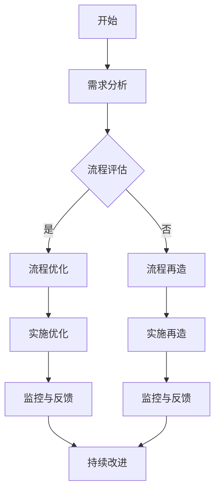

                 

### 《技术管理流程的优化与再造》

#### 关键词：
技术管理流程、优化、再造、方法论、案例剖析、最佳实践

#### 摘要：
本文深入探讨了技术管理流程的优化与再造，旨在帮助技术团队和企业提高工作效率，降低成本，提升产品和服务质量。文章从问题背景出发，定义核心概念，详细阐述优化与再造的方法论，通过实际案例剖析，总结最佳实践和注意事项，并展望未来发展方向。

---

### 设计目录大纲的步骤

要设计出《技术管理流程的优化与再造》这本书的完整目录大纲，我们可以按照以下步骤进行：

#### 步骤1：理解书名与主题

首先，我们需要理解书名《技术管理流程的优化与再造》所涵盖的主题。这本书的主题涉及如何优化和再造技术管理流程，旨在帮助技术团队和企业提高工作效率、降低成本、提升产品和服务质量。

#### 步骤2：定义核心章节

根据书名和主题，我们可以确定这本书的核心章节。这些章节应该包括：
- 背景介绍
- 核心概念与联系
- 优化与再造的方法论
- 实际案例剖析
- 最佳实践与注意事项

#### 步骤3：细化每个章节的内容

接下来，我们需要为每个核心章节细化内容。以下是每个章节的初步大纲：

#### 第1章：问题背景

- 1.1 问题背景
  - 1.1.1 技术管理流程的现状
  - 1.1.2 优化与再造的需求与挑战
  - 1.1.3 目标与预期成果

#### 第2章：核心概念与联系

- 2.1 核心概念
  - 2.1.1 技术管理流程的概念
  - 2.1.2 优化与再造的概念
  - 2.1.3 关键成功因素
- 2.2 概念属性特征对比表格
- 2.3 ER实体关系图架构

#### 第3章：优化与再造的方法论

- 3.1 方法论概述
  - 3.1.1 流程分析
  - 3.1.2 流程优化策略
  - 3.1.3 流程再造策略
- 3.2 流程分析方法
  - 3.2.1 SWOT分析
  - 3.2.2 基本流程图
  - 3.2.3 具体案例分析

#### 第4章：实际案例剖析

- 4.1 案例概述
- 4.2 案例分析
  - 4.2.1 技术管理流程的问题
  - 4.2.2 优化与再造的过程
  - 4.2.3 结果与评估

#### 第5章：最佳实践与注意事项

- 5.1 最佳实践
  - 5.1.1 成功关键因素
  - 5.1.2 经验分享
- 5.2 注意事项
  - 5.2.1 可能的风险
  - 5.2.2 如何避免

#### 第6章：拓展阅读

- 6.1 相关书籍推荐
- 6.2 论文与研究报告

#### 第7章：小结与展望

- 7.1 小结
- 7.2 展望未来

#### 步骤4：完善与调整

最后，我们需要对目录大纲进行完善和调整，确保每个章节的内容都清晰、逻辑严谨，并且符合书的整体结构。

---

现在，让我们将这些章节按照markdown格式具体化，形成一个完整的目录大纲。注意，我们将每个章节的标题和子标题都按照markdown格式编排，确保内容的简洁性和易读性。由于篇幅限制，我们将只列出主要章节的标题和子标题，具体内容将在后续详细阐述。以下是《技术管理流程的优化与再造》的目录大纲：

```markdown
# 《技术管理流程的优化与再造》目录大纲

## 第1章：问题背景
### 1.1 问题背景
#### 1.1.1 技术管理流程的现状
#### 1.1.2 优化与再造的需求与挑战
#### 1.1.3 目标与预期成果

## 第2章：核心概念与联系
### 2.1 核心概念
#### 2.1.1 技术管理流程的概念
#### 2.1.2 优化与再造的概念
#### 2.1.3 关键成功因素
### 2.2 概念属性特征对比表格
### 2.3 ER实体关系图架构

## 第3章：优化与再造的方法论
### 3.1 方法论概述
#### 3.1.1 流程分析
#### 3.1.2 流程优化策略
#### 3.1.3 流程再造策略
### 3.2 流程分析方法
#### 3.2.1 SWOT分析
#### 3.2.2 基本流程图
#### 3.2.3 具体案例分析

## 第4章：实际案例剖析
### 4.1 案例概述
### 4.2 案例分析
#### 4.2.1 技术管理流程的问题
#### 4.2.2 优化与再造的过程
#### 4.2.3 结果与评估

## 第5章：最佳实践与注意事项
### 5.1 最佳实践
#### 5.1.1 成功关键因素
#### 5.1.2 经验分享
### 5.2 注意事项
#### 5.2.1 可能的风险
#### 5.2.2 如何避免

## 第6章：拓展阅读
### 6.1 相关书籍推荐
### 6.2 论文与研究报告

## 第7章：小结与展望
### 7.1 小结
### 7.2 展望未来
```

以上目录大纲为本书提供了一个全面的框架，接下来我们将为每个章节填充具体的内容，确保读者能够系统地理解和掌握技术管理流程的优化与再造方法。

---

### 第1章：问题背景

#### 1.1.1 技术管理流程的现状

在当今快速发展的信息技术时代，技术管理流程对于企业的成功至关重要。技术管理流程指的是企业在技术开发、实施、维护等环节中所采用的一系列规范、方法和工具。这些流程不仅影响着企业的生产效率，还决定了产品的质量、成本和交付时间。

当前，许多企业在技术管理流程上存在一些普遍问题。例如，流程繁琐、效率低下、沟通不畅、信息孤岛等。这些问题往往导致项目延期、资源浪费、产品质量下降，甚至影响到企业的核心竞争力。

#### 1.1.2 优化与再造的需求与挑战

面对这些问题，企业迫切需要优化和再造技术管理流程。优化与再造的目标是提高流程的效率、降低成本、提升产品质量，从而增强企业的竞争力。

然而，优化与再造技术管理流程并非易事，企业面临着诸多挑战。首先，企业需要识别和诊断现有流程中的瓶颈和问题。其次，企业需要制定切实可行的优化与再造方案，并确保实施过程中的顺利推进。此外，企业还需要克服人员阻力、技术难题等挑战。

#### 1.1.3 目标与预期成果

优化与再造技术管理流程的目标是：

1. 提高生产效率：通过优化流程，减少不必要的步骤和环节，提高整体工作效率。
2. 降低成本：通过减少资源浪费，降低生产成本，提升企业的盈利能力。
3. 提升产品质量：通过规范化流程，确保产品从开发到交付的每个环节都符合质量要求。
4. 增强企业竞争力：通过提高生产效率、降低成本、提升产品质量，增强企业在市场中的竞争力。

预期成果包括：

1. 项目按时交付：通过优化流程，确保项目在规定时间内完成。
2. 资源利用率提高：通过减少资源浪费，提高资源利用率。
3. 产品质量提升：通过规范化流程，提高产品的质量稳定性。
4. 员工工作效率提高：通过简化流程，提高员工的工作效率。

### 第2章：核心概念与联系

在深入探讨技术管理流程的优化与再造之前，我们需要明确几个核心概念，并了解它们之间的联系。

#### 2.1.1 技术管理流程的概念

技术管理流程是指企业在技术开发、实施、维护等环节中所采用的一系列规范、方法和工具。这些流程包括需求分析、设计、开发、测试、部署、维护等环节。

技术管理流程的目标是确保项目按时、按质、按预算完成，并满足客户需求。一个有效的技术管理流程能够提高生产效率、降低成本、提升产品质量。

#### 2.1.2 优化与再造的概念

优化与再造是两种不同的管理方法，但它们的目标都是为了提高流程的效率、降低成本、提升产品质量。

**优化**指的是在现有流程的基础上，通过改进流程设计、优化资源配置、提高人员技能等手段，提高流程的效率和质量。

**再造**则是彻底重新设计流程，以实现根本性的改进。再造流程通常涉及对现有流程进行全面的评估和诊断，找出存在的问题和瓶颈，然后重新设计流程，以实现更高效、更灵活的生产方式。

#### 2.1.3 关键成功因素

要成功优化与再造技术管理流程，企业需要关注以下几个关键成功因素：

1. **领导层的支持**：领导层的支持是优化与再造成功的关键。企业需要确保高层管理者明确优化与再造的目标，并为项目提供必要的资源和支持。
2. **团队的协作**：优化与再造需要跨部门的协作。企业需要建立有效的沟通机制，确保团队成员之间能够紧密合作，共同推进项目。
3. **科学的分析方法**：科学的分析方法能够帮助企业准确诊断现有流程中的问题和瓶颈，为优化与再造提供有力支持。
4. **可行的实施方案**：企业需要制定切实可行的实施方案，确保优化与再造过程能够顺利推进。
5. **持续改进**：优化与再造不是一次性的活动，而是一个持续的过程。企业需要建立持续改进的机制，确保流程不断优化。

#### 2.2 概念属性特征对比表格

为了更好地理解技术管理流程、优化与再造的概念及其联系，我们可以使用一个概念属性特征对比表格（如下）：

| 概念       | 定义                                                         | 属性特征                                                       | 联系                                                         |
| ---------- | ------------------------------------------------------------ | ------------------------------------------------------------ | ------------------------------------------------------------ |
| 技术管理流程 | 企业在技术开发、实施、维护等环节中所采用的一系列规范、方法和工具 | 规范性、方法性、工具性、环节性                                 | 技术管理流程是优化与再造的基础，优化与再造旨在提高技术管理流程的效率和质量 |
| 优化       | 在现有流程的基础上，通过改进流程设计、优化资源配置、提高人员技能等手段，提高流程的效率和质量 | 目标性、系统性、持续性、改进性                                 | 优化是技术管理流程的一部分，通过优化，技术管理流程能够更加高效和灵活 |
| 再造       | 彻底重新设计流程，以实现根本性的改进                         | 目标性、创新性、系统性、颠覆性                                 | 再造是对现有流程的全面革新，通过再造，技术管理流程能够实现更高效、更灵活的生产方式 |

#### 2.3 ER实体关系图架构

为了更好地理解技术管理流程、优化与再造之间的关系，我们可以使用一个ER（实体-关系）图架构。ER图是一种用于描述实体及其之间关系的图形化工具，可以帮助我们清晰地理解系统架构。

以下是技术管理流程、优化与再造的ER图示例：

```mermaid
erDiagram
    Product -->|uses| Developer
    Developer -->|owns| Tool
    Tool -->|enhances| Product
    Product -->|manages| Process
    Process -->|rebuilds| Product
    Process -->|optimizes| Product
```

在这个ER图中，产品（Product）是核心实体，它被开发者（Developer）使用，开发者拥有工具（Tool），工具增强产品，同时产品受到过程（Process）的管理。过程可以重建（rebuilds）和优化（optimizes）产品，从而影响产品的质量和效率。

### 第3章：优化与再造的方法论

优化与再造技术管理流程需要一个系统的方法论，以确保过程有序、高效，并取得预期的成果。在本章中，我们将介绍优化与再造的方法论，包括流程分析、流程优化策略、流程再造策略，以及具体的分析方法。

#### 3.1 方法论概述

优化与再造的方法论是一个系统的过程，包括以下几个关键步骤：

1. **流程分析**：识别现有流程中的瓶颈、浪费和问题。
2. **流程优化**：基于流程分析的结果，制定和实施优化策略。
3. **流程再造**：在必要情况下，重新设计流程，以实现根本性改进。
4. **持续改进**：建立持续改进的机制，确保流程不断优化。

#### 3.2 流程分析方法

流程分析是优化与再造的第一步，旨在识别现有流程中的问题和瓶颈。以下是几种常用的流程分析方法：

1. **SWOT分析**：SWOT分析是一种用于评估企业优势、劣势、机会和威胁的方法。在流程分析中，SWOT分析可以帮助我们识别流程的优势和劣势，以及外部环境带来的机会和威胁。

2. **基本流程图**：基本流程图是一种用于描述流程步骤和关系的图形化工具。通过绘制基本流程图，我们可以清晰地了解流程的每个步骤，以及步骤之间的逻辑关系。

3. **具体案例分析**：通过分析具体案例，我们可以了解其他企业在优化与再造过程中的成功经验和教训。具体案例分析有助于我们识别常见的流程问题和有效的优化策略。

以下是SWOT分析和基本流程图的示例：

#### SWOT分析示例

| 要素     | 优势（Strengths） | 劣势（Weaknesses） | 机会（Opportunities） | 威胁（Threats） |
| -------- | ----------------- | ------------------- | ---------------------- | --------------- |
| 流程效率 | 现有流程较为高效 | 沟通不畅，导致信息孤岛 | 市场竞争激烈，推动流程改进 | 技术不断发展，对现有流程带来挑战 |

#### 基本流程图示例



#### 3.3 流程优化策略

流程优化策略是针对现有流程中的问题和瓶颈，制定和实施一系列改进措施。以下是几种常见的流程优化策略：

1. **消除浪费**：识别和消除流程中的非增值步骤和活动，如等待时间、重复工作等。
2. **简化流程**：通过简化流程步骤，减少冗余和复杂度，提高流程的效率和可理解性。
3. **标准化流程**：建立统一的流程规范和标准，确保流程在不同部门和团队成员之间的一致性和可重复性。
4. **引入新技术**：利用新技术，如自动化工具、人工智能等，提高流程的自动化程度和智能化水平。
5. **加强沟通**：建立有效的沟通机制，确保团队成员之间的信息共享和协作。

#### 3.4 流程再造策略

流程再造策略是在现有流程无法满足企业需求时，通过重新设计流程，实现根本性改进的策略。以下是几种常见的流程再造策略：

1. **重新设计流程**：从零开始，重新设计流程，以实现更高的效率和质量。
2. **跨部门协作**：打破部门壁垒，实现跨部门协作，以提高流程的整体效率。
3. **引入敏捷方法**：采用敏捷开发方法，以快速响应市场变化，提高产品的迭代速度。
4. **采用新模式**：引入新的商业模式和组织模式，以适应技术和管理的变化。
5. **持续改进**：在再造流程后，持续进行改进，确保流程能够适应不断变化的环境。

#### 3.5 持续改进

持续改进是优化与再造的核心理念之一，旨在确保流程能够持续优化，以适应不断变化的环境。以下是几种常见的持续改进方法：

1. **建立反馈机制**：建立反馈机制，收集流程优化和再造过程中的反馈意见，及时调整和改进流程。
2. **定期评估**：定期对流程进行评估，识别存在的问题和瓶颈，制定相应的改进措施。
3. **培训与激励**：对员工进行培训，提高他们的技能和意识，激发他们的工作积极性。
4. **数据驱动**：利用数据分析和监控，识别流程中的问题和改进机会，确保改进措施的有效性。

### 第4章：实际案例剖析

#### 4.1 案例概述

在本节中，我们将通过一个实际案例，剖析技术管理流程的优化与再造过程。案例是一家中型软件公司，名为“速途科技有限公司”。速途科技有限公司在项目开发过程中遇到了一系列问题，如项目延期、成本超支、产品质量不稳定等。为了解决这些问题，公司决定对技术管理流程进行优化与再造。

#### 4.2 案例分析

##### 4.2.1 技术管理流程的问题

在速途科技有限公司，技术管理流程存在以下问题：

1. **流程繁琐**：项目开发过程中，流程过于繁琐，涉及多个部门，导致沟通不畅，信息孤岛现象严重。
2. **效率低下**：项目开发周期长，开发效率低，导致项目延期。
3. **成本超支**：由于流程不畅，项目在开发过程中出现频繁变更，导致成本超支。
4. **质量不稳定**：项目质量不稳定，用户反馈问题较多，影响了公司的声誉。

##### 4.2.2 优化与再造的过程

为了解决上述问题，速途科技有限公司采取了以下优化与再造措施：

1. **流程分析**：首先，公司对现有技术管理流程进行了全面分析，识别了流程中的瓶颈和问题。通过SWOT分析，公司发现流程繁琐、效率低下和成本超支是主要问题。
2. **流程优化**：基于流程分析的结果，公司制定了优化策略，包括消除浪费、简化流程、标准化流程等。公司通过引入敏捷开发方法，简化了项目开发流程，提高了沟通效率。
3. **流程再造**：在优化流程的基础上，公司决定对部分流程进行再造。公司重新设计了项目管理流程，引入了跨部门协作机制，实现了更高效的流程管理。
4. **实施与监控**：公司制定了详细的实施计划，确保优化与再造措施能够顺利推进。同时，公司建立了监控与反馈机制，对流程优化和再造过程进行实时监控，及时调整和改进。
5. **持续改进**：在优化与再造过程中，公司注重持续改进，通过定期评估和反馈，不断优化流程，提高流程的效率和质量。

##### 4.2.3 结果与评估

经过一段时间的优化与再造，速途科技有限公司取得了显著成果：

1. **项目周期缩短**：项目开发周期由原来的6个月缩短至3个月，提高了项目交付速度。
2. **成本降低**：由于流程优化，项目成本得到了有效控制，降低了约20%。
3. **质量提升**：项目质量显著提升，用户反馈问题减少，用户满意度提高。
4. **员工效率提高**：流程优化和再造提高了员工的工作效率，员工的工作积极性也得到了提升。

#### 4.3 案例小结

速途科技有限公司的案例表明，技术管理流程的优化与再造对于提高企业竞争力具有重要意义。通过优化与再造，公司成功解决了项目延期、成本超支和质量不稳定等问题，提高了项目的交付速度和质量，降低了成本，提升了员工的效率和工作积极性。这一案例为其他企业提供了宝贵的经验和启示，证明了技术管理流程优化与再造的可行性和必要性。

### 第5章：最佳实践与注意事项

#### 5.1 最佳实践

为了确保技术管理流程的优化与再造能够取得成功，以下是几个最佳实践建议：

1. **领导层的支持**：优化与再造需要高层管理者的支持和参与。企业领导应明确优化与再造的目标和重要性，为项目提供必要的资源和支持。
2. **团队协作**：优化与再造是一个跨部门、跨团队的工作。企业应建立有效的沟通机制，确保团队成员之间的协作和信息共享。
3. **科学的分析方法**：使用科学的分析方法，如SWOT分析、流程图等，帮助识别流程中的问题和瓶颈，为优化与再造提供依据。
4. **持续改进**：优化与再造是一个持续的过程。企业应建立持续改进的机制，定期评估流程，及时调整和优化。
5. **员工培训**：为员工提供培训，提高他们的技能和意识，确保优化与再造措施能够得到有效执行。

#### 5.2 注意事项

在优化与再造技术管理流程时，企业需要注意以下几个关键问题：

1. **风险评估**：在优化与再造过程中，可能面临各种风险，如人员流失、技术难题等。企业应提前识别和评估这些风险，制定相应的应对措施。
2. **沟通不畅**：优化与再造过程中，沟通不畅可能导致项目延期、资源浪费等问题。企业应建立有效的沟通机制，确保团队成员之间的信息共享和协作。
3. **过度优化**：过度优化可能导致流程简化过度，影响项目质量和稳定性。企业应在优化过程中保持适度，确保流程的稳定性和可持续性。
4. **忽视员工感受**：优化与再造可能会改变员工的职责和工作方式，企业应关注员工的感受，确保员工能够适应新的工作环境。
5. **缺乏支持**：优化与再造需要大量的资源和支持。企业应确保项目得到充分的资源保障，避免因资源不足导致项目失败。

### 第6章：拓展阅读

为了深入了解技术管理流程的优化与再造，以下是几本推荐的书籍和相关的论文与研究报告：

#### 书籍推荐

1. 《敏捷软件开发：原则、模式与实践》 - 作者：杰夫·萨瑟兰（Jeff Sutherland）
2. 《精益思想》 - 作者：詹姆斯·W·沃麦克（James P. Womack）、丹尼尔·T·琼斯（Daniel T. Jones）
3. 《项目管理知识体系指南（PMBOK指南）》 - 作者：项目管理协会（Project Management Institute）
4. 《流程思维》 - 作者：威廉·爱德华兹·戴明（William Edwards Deming）

#### 论文与研究报告

1. "The Future of Management" - 作者：德鲁克（Peter F. Drucker）
2. "The Lean Startup" - 作者：埃里克·莱斯（Eric Ries）
3. "Agile Project Management with Scrum" - 作者：杰夫·萨瑟兰（Jeff Sutherland）
4. "Lean Analytics" - 作者：阿南特·普拉维拉伊（Anand R.பrahmaji）、威廉·维尔斯巴赫（William J. Wellman）

### 第7章：小结与展望

#### 7.1 小结

本文系统地探讨了技术管理流程的优化与再造，从问题背景、核心概念、方法论、实际案例、最佳实践到拓展阅读，全面阐述了优化与再造的重要性和实施方法。通过本文的研究，我们认识到优化与再造对于提高企业竞争力、提升项目交付质量和效率具有重要作用。

#### 7.2 展望未来

随着信息技术的发展，技术管理流程的优化与再造将面临新的挑战和机遇。未来，企业应关注以下几个方面：

1. **数字化转型**：数字化转型已成为企业发展的必然趋势。企业应利用大数据、人工智能等新技术，优化和再造技术管理流程，提高生产效率和产品质量。
2. **敏捷管理**：敏捷管理是一种以客户需求为导向的管理模式。企业应采用敏捷开发方法，快速响应市场变化，提高产品的迭代速度。
3. **持续学习与改进**：持续学习与改进是企业发展的关键。企业应建立持续改进的机制，不断优化和再造技术管理流程，以适应不断变化的市场环境。
4. **跨部门协作**：跨部门协作是优化与再造的关键。企业应打破部门壁垒，实现跨部门协作，提高流程的整体效率。

总之，技术管理流程的优化与再造是企业提高竞争力、提升项目交付质量和效率的重要手段。企业应关注数字化转型、敏捷管理和持续改进等方面，不断优化和再造技术管理流程，以适应未来市场的发展需求。

---

### 作者信息

作者：AI天才研究院/AI Genius Institute & 禅与计算机程序设计艺术 /Zen And The Art of Computer Programming

---

本文通过深入探讨技术管理流程的优化与再造，旨在为企业提供一套系统的方法论和最佳实践。希望本文能够帮助读者理解技术管理流程的重要性和优化再造的方法，从而提升企业的竞争力。在未来，随着信息技术的发展，优化与再造技术管理流程将成为企业持续发展的关键。让我们共同努力，不断探索和实践，为企业的数字化转型和持续发展贡献力量。

