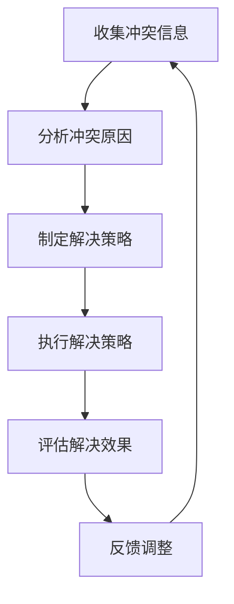

                 

# 技术管理的情商：处理团队冲突的艺术

## 关键词
技术管理、情商、团队冲突、解决艺术、冲突处理算法

## 摘要
本文将探讨技术管理中情商的重要性，以及如何运用情商处理团队冲突。通过深入分析情商的概念、团队冲突的常见形式和影响，我们提出了一套基于算法原理的团队冲突处理方法。文章将结合实际项目案例，详细阐述系统设计与架构方案，并提供最佳实践建议，旨在帮助技术管理者提升团队协作效率，创造和谐的工作环境。

### 设计思路

在设计《技术管理的情商：处理团队冲突的艺术》这本书的目录大纲时，我们遵循以下思路：

1. **背景介绍**：首先介绍技术管理中的挑战，特别是团队冲突的普遍性和影响，引出情商的重要性。
2. **核心概念与联系**：定义情商和相关概念，使用对比表格和ER图展示概念间的联系。
3. **算法原理讲解**：详细介绍处理团队冲突的算法原理，包括数学模型和流程图，并通过Python代码实现。
4. **系统分析与架构设计方案**：描述系统设计和架构，包括领域模型、系统架构和接口设计。
5. **项目实战**：提供实际项目案例，包括环境安装、核心实现和案例分析。
6. **最佳实践 tips**：总结实战经验，给出建议。
7. **小结与拓展阅读**：总结全文内容，提供拓展阅读推荐。

### 目录大纲设计

#### 第1章 问题背景与技术管理的情商

##### 1.1 技术管理的挑战

###### 1.1.1 技术团队管理的复杂性

###### 1.1.2 技术冲突的常见形式与影响

##### 1.2 情商的重要性

###### 1.2.1 情商的定义与特征

###### 1.2.2 情商在技术管理中的应用

##### 1.3 团队冲突的解决艺术

###### 1.3.1 处理团队冲突的方法

###### 1.3.2 情商在团队冲突处理中的作用

#### 第2章 情商概念与模型

##### 2.1 情商的概念与分类

###### 2.1.1 情商的基本概念

###### 2.1.2 情商的分类

##### 2.2 技术管理中的情商模型

###### 2.2.1 情商模型的基本结构

###### 2.2.2 情商模型的应用

##### 2.3 情商对比表格

###### 2.3.1 不同情商类型的对比

###### 2.3.2 技术管理与普通管理情商对比

#### 第3章 团队冲突处理算法

##### 3.1 算法原理

###### 3.1.1 算法的基本原理

###### 3.1.2 算法的数学模型

##### 3.2 算法流程图

```
graph TB
A[算法起点] --> B[收集冲突信息]
B --> C[分析冲突原因]
C --> D[制定解决策略]
D --> E[执行解决策略]
E --> F[评估解决效果]
F --> G[反馈调整]
G --> A
```

##### 3.3 Python代码实现

```python
# 伪代码示例
def handle_conflict(conflict_info):
    # 分析冲突原因
    cause = analyze_cause(conflict_info)
    # 制定解决策略
    strategy = create_strategy(cause)
    # 执行解决策略
    execute_strategy(strategy)
    # 评估解决效果
    result = evaluate_result(strategy)
    # 反馈调整
    if result != "solved":
        adjust_strategy(strategy)
    return result
```

#### 第4章 团队冲突处理系统设计

##### 4.1 系统介绍

###### 4.1.1 系统功能

###### 4.1.2 系统目标

##### 4.2 领域模型

```
erDiagram
冲突管理系统 ||--|{ 团队成员 }
冲突管理系统 ||--|{ 冲突 }
团队成员 ||--|{ 任务 }
任务 ||--|{ 成果 }
```

##### 4.3 系统架构

```
graph TB
A[冲突信息收集] --> B[冲突分析]
B --> C[解决策略制定]
C --> D[策略执行]
D --> E[效果评估]
E --> F[反馈调整]
F --> A
```

##### 4.4 系统接口设计

```
sequenceDiagram
参与者 User
参与者 System

User->>System: 提交冲突信息
System->>User: 收集到冲突信息

User->>System: 提交任务
System->>User: 分配任务

User->>System: 提交成果
System->>User: 记录成果
```

#### 第5章 项目实战

##### 5.1 环境安装

###### 5.1.1 环境准备

###### 5.1.2 系统安装与配置

##### 5.2 系统核心实现

###### 5.2.1 冲突信息收集与处理

###### 5.2.2 冲突分析与解决策略制定

##### 5.3 代码分析与应用解读

###### 5.3.1 代码结构分析

###### 5.3.2 关键代码解读与应用

##### 5.4 案例分析

###### 5.4.1 实际案例分析

###### 5.4.2 冲突处理效果评估

##### 5.5 项目小结

###### 5.5.1 项目总结

###### 5.5.2 经验与教训总结

#### 第6章 最佳实践 tips

##### 6.1 处理团队冲突的最佳实践

###### 6.1.1 有效沟通技巧

###### 6.1.2 冲突预防与预警

##### 6.2 情商提升策略

###### 6.2.1 情商培养方法

###### 6.2.2 情商在工作中的运用

#### 第7章 小结与拓展阅读

##### 7.1 小结

##### 7.2 拓展阅读推荐

---

作者：AI天才研究院/AI Genius Institute & 禅与计算机程序设计艺术 /Zen And The Art of Computer Programming

---

### 第1章 问题背景与技术管理的情商

#### 1.1 技术管理的挑战

技术管理是一项复杂而重要的工作，它不仅要求管理者具备深厚的专业技术背景，还需要具备出色的领导能力和团队管理技能。随着技术的快速发展和项目复杂度的增加，技术管理的挑战也在不断升级。

**技术团队管理的复杂性**

技术团队通常由一群不同背景、不同技能的成员组成，他们各自有着独特的思维方式和沟通风格。如何有效地协调和管理工作成员，提高团队的整体效率，是技术管理者面临的一大挑战。以下是一些常见的技术管理复杂性：

- **技能多样性**：团队成员可能精通不同领域的技能，如前端开发、后端开发、数据分析等，这使得团队协作需要更多的协调和沟通。
- **项目复杂性**：现代技术项目往往涉及多个子系统、多个模块，甚至跨越多个团队，这增加了项目管理的难度。
- **技术更新速度**：技术领域更新迅速，管理者需要不断学习新知识、新技术，以保持团队的竞争力。
- **团队氛围**：技术团队中可能存在竞争、协作不足、沟通不畅等问题，影响团队的凝聚力和工作效率。

**技术冲突的常见形式与影响**

技术冲突是技术管理中不可避免的问题。常见的冲突形式包括：

- **意见分歧**：在项目决策、技术方案选择等环节，团队成员可能因为不同观点而产生冲突。
- **任务分配不均**：由于团队成员技能水平和任务需求的差异，可能导致部分成员任务繁重，而另一些成员则无所事事。
- **沟通障碍**：不同团队、不同部门之间的沟通不畅，可能导致误解、延误甚至项目失败。
- **资源争夺**：在资源有限的情况下，团队之间可能为了争夺资源而产生冲突。

这些冲突如果处理不当，会对团队产生负面影响，如降低工作效率、增加项目风险、影响团队士气等。

#### 1.2 情商的重要性

情商（Emotional Intelligence，简称EQ）是指个体识别、理解、管理和使用情感信息的能力。情商的重要性在技术管理中逐渐被认识到，因为技术管理者不仅需要具备技术能力，还需要具备情感管理能力，以更好地处理团队冲突和提升团队绩效。

**情商的定义与特征**

情商通常包括以下几个关键特征：

- **自我认知**：了解自己的情感状态，包括情绪的类型和原因。
- **自我管理**：控制和调节自己的情绪，避免情绪对行为产生负面影响。
- **社交技能**：建立和维护良好的人际关系，包括有效沟通和团队合作。
- **同理心**：理解和分享他人的情感状态，以建立信任和促进协作。

**情商在技术管理中的应用**

情商在技术管理中的应用主要体现在以下几个方面：

- **冲突管理**：情商高的人能够更好地理解和处理团队冲突，通过有效的沟通和调解，将冲突转化为协作。
- **团队协作**：情商高的人能够建立和谐的团队氛围，促进团队成员之间的沟通和合作。
- **领导力**：情商高的人具有更强的领导力，能够激发团队成员的潜力，提高团队的整体绩效。

#### 1.3 团队冲突的解决艺术

团队冲突是技术管理中不可避免的现象，如何有效地解决冲突是技术管理者的一项重要任务。以下是一些常见的解决团队冲突的方法：

**1.3.1 处理团队冲突的方法**

- **对话法**：通过面对面的沟通，让冲突双方表达自己的观点和感受，找到共同点。
- **调解法**：由第三方调解人帮助双方进行沟通，寻找解决问题的方案。
- **妥协法**：在双方利益冲突时，通过妥协来达成共识。
- **回避法**：在冲突无法解决时，选择回避，避免冲突进一步升级。

**1.3.2 情商在团队冲突处理中的作用**

情商在团队冲突处理中起着至关重要的作用。情商高的人能够：

- **更好地理解冲突的本质**：通过自我认知和同理心，了解冲突双方的立场和情感。
- **有效地沟通**：通过社交技能，建立良好的沟通渠道，促进双方的理解和合作。
- **缓解紧张情绪**：通过自我管理和同理心，缓解冲突带来的紧张情绪，避免冲突升级。
- **寻找双赢方案**：通过谈判和妥协，找到双方都能接受的解决方案。

总之，情商是技术管理中不可或缺的能力，它不仅有助于解决团队冲突，还能提升团队的整体绩效和幸福感。在技术管理中，情商的应用是一种艺术，需要管理者不断地学习和实践。

---

在接下来的章节中，我们将深入探讨情商的概念与模型，详细介绍团队冲突处理算法的原理和系统设计，并通过实际项目案例来展示这些方法的应用效果。通过这些内容，我们希望能帮助技术管理者更好地应对团队冲突，提升团队协作效率，创造和谐的工作环境。

---

### 第2章 情商概念与模型

#### 2.1 情商的概念与分类

情商（Emotional Intelligence，简称EQ）是一个广泛应用于心理学、管理学和教育领域的概念。它不仅仅关注个体的情感认知能力，还涵盖了情感管理、人际关系和社会技能等多方面内容。情商的概念可以从以下几个方面进行阐述。

**情商的基本概念**

情商是指个体识别、理解、管理和使用情感信息的能力。具体来说，情商包括以下几个关键方面：

- **自我认知**：个体能够识别自己的情绪状态，包括情绪的类型、原因和影响。
- **自我管理**：个体能够控制和调节自己的情绪，避免情绪对行为产生负面影响。
- **社交技能**：个体能够建立和维护良好的人际关系，包括有效沟通、团队合作和冲突解决。
- **同理心**：个体能够理解和分享他人的情感状态，以建立信任和促进协作。

**情商的分类**

根据情商的定义，可以将情商分为四个主要类别：

1. **自我认知**：这是情商的基础，个体需要能够准确识别自己的情绪，包括情绪的类型、强度和持续时间。自我认知有助于个体更好地理解自己的情感反应，从而做出更理智的行为决策。

2. **自我管理**：个体需要学会控制和调节自己的情绪，避免因情绪波动而导致的不理智行为。自我管理包括情绪调节、压力管理和自我激励等方面。

3. **社交技能**：社交技能涉及个体在人际关系中的表现，包括沟通技巧、团队合作能力和领导力。这些技能有助于个体在团队中建立良好的人际关系，提高团队合作效率。

4. **同理心**：同理心是指个体能够理解和分享他人的情感状态，站在他人的角度思考问题。同理心有助于建立信任，促进协作，减少冲突。

#### 2.2 技术管理中的情商模型

在技术管理领域，情商模型通常包括以下几个关键要素：

1. **情感意识**：技术管理者需要具备较高的情感意识，能够识别和理解团队中成员的情绪变化。这有助于管理者更好地应对团队中的冲突和挑战。

2. **情感调控**：技术管理者需要学会如何调节自己的情绪，避免因个人情绪波动而对团队成员产生负面影响。有效的情感调控有助于维护团队的稳定和和谐。

3. **沟通能力**：良好的沟通能力是技术管理者的重要素质。管理者需要能够清晰、准确地传达信息，同时也要善于倾听团队成员的意见和反馈，建立有效的沟通渠道。

4. **冲突解决**：技术管理者需要具备处理团队冲突的能力，能够通过对话、调解等方法解决冲突，避免冲突升级。情商高的管理者能够以平和的心态面对冲突，找到双赢的解决方案。

5. **领导力**：情商高的技术管理者能够通过情感激励、目标设定和团队建设等手段，激发团队成员的潜力，提高团队的整体绩效。

**情商模型的应用**

情商模型在技术管理中的应用主要体现在以下几个方面：

- **团队建设**：通过提高团队成员的情商，可以增强团队的凝聚力和协作能力，提高团队的整体绩效。
- **项目管理**：情商高的技术管理者能够更好地应对项目中的挑战，通过有效的情感管理和冲突解决，确保项目的顺利进行。
- **人员管理**：情商高的管理者能够更好地理解员工的需求和情感状态，提供更有针对性的激励和反馈，提高员工的工作满意度和忠诚度。

总之，情商模型是技术管理中不可或缺的一部分。通过提升情商，技术管理者可以更好地应对团队中的挑战，提升团队协作效率，创造和谐的工作环境。

#### 2.3 情商对比表格

为了更清晰地展示情商的不同类型和其在技术管理中的应用，我们通过一个对比表格来详细说明。

| 情商类型     | 定义                                                         | 技术管理中的应用                                     |
|------------|------------------------------------------------------------|-----------------------------------------------------|
| 自我认知     | 识别和理解自己的情绪状态                                     | 管理者可以通过自我认知，了解团队成员的情绪变化，及时调整管理策略。               |
| 自我管理     | 控制和调节自己的情绪，避免情绪对行为产生负面影响               | 管理者需要通过自我管理，保持情绪稳定，避免因个人情绪波动影响团队氛围。           |
| 社交技能     | 建立和维护良好的人际关系，包括沟通技巧、团队合作能力和领导力   | 管理者需要通过有效的沟通和团队建设，促进团队成员之间的协作，提高团队绩效。       |
| 同理心       | 理解和分享他人的情感状态，建立信任和促进协作                   | 管理者需要通过同理心，了解团队成员的需求和情感，提供情感支持和激励。             |

通过这个对比表格，我们可以看到情商的不同类型在技术管理中的应用，以及如何通过提升情商来提升管理效果。

#### 2.3.2 技术管理与普通管理情商对比

技术管理与普通管理在情商要求上存在一定的差异。以下是一个对比表格，展示了两者在情商方面的不同要求：

| 管理类型     | 情商要求                                             | 备注                                                         |
|------------|------------------------------------------------------|------------------------------------------------------------|
| 技术管理     | 高度的自我认知和自我管理能力，优秀的沟通能力和冲突解决能力 | 技术管理不仅涉及技术问题，还需要处理复杂的人际关系和团队冲突。                   |
| 普通管理     | 良好的沟通能力和团队建设能力，适度的同理心                 | 普通管理侧重于组织协调、资源分配和流程管理，对技术要求相对较低。                   |

通过这个对比表格，我们可以看到技术管理在情商要求上更高，特别是在自我认知、自我管理和冲突解决能力方面。这是因为技术管理不仅需要处理技术问题，还需要协调和解决团队中的复杂人际关系和冲突。

### 第3章 团队冲突处理算法

#### 3.1 算法原理

团队冲突处理算法是技术管理中解决团队冲突的一种系统方法。算法的基本原理是通过收集冲突信息、分析冲突原因、制定解决策略、执行解决策略和评估解决效果，形成一个闭环系统，以持续优化冲突处理的效率和质量。

**算法的基本原理**

团队冲突处理算法的基本原理可以概括为以下几个步骤：

1. **收集冲突信息**：通过多种渠道（如问卷调查、面对面访谈、团队会议等）收集冲突相关信息，包括冲突发生的时间、地点、涉及人员、冲突原因等。

2. **分析冲突原因**：对收集到的冲突信息进行分类和分析，找出冲突的根本原因。分析过程可能涉及数据分析、情感识别和情境分析等。

3. **制定解决策略**：根据冲突原因，制定相应的解决策略。解决策略可能包括对话、调解、妥协、培训、调整任务分配等。

4. **执行解决策略**：将制定好的解决策略付诸实施，通过行动来缓解或解决冲突。执行过程需要团队成员的积极参与和配合。

5. **评估解决效果**：在解决策略实施后，对冲突的处理效果进行评估，包括冲突是否得到解决、团队成员的满意度、工作氛围的变化等。

6. **反馈调整**：根据评估结果，对解决策略进行调整和优化。如果冲突未得到有效解决，需要重新分析冲突原因，并制定新的解决策略。

**算法的数学模型**

团队冲突处理算法的数学模型可以基于以下几个关键参数进行构建：

1. **冲突强度**：衡量冲突的严重程度，通常用数值表示，如0（无冲突）到10（极度冲突）。

2. **冲突频率**：衡量冲突发生的频率，如每天发生一次或每周发生一次。

3. **冲突影响**：衡量冲突对团队绩效和工作氛围的影响，如降低工作效率、增加项目风险等。

4. **解决策略效果**：衡量解决策略的有效性，如解决冲突的效率、团队成员的满意度等。

算法的数学模型可以表示为：

$$
\text{冲突处理效果} = f(\text{冲突强度}, \text{冲突频率}, \text{冲突影响}, \text{解决策略效果})
$$

其中，$f$ 为一个复杂的函数，通过历史数据和机器学习算法进行训练和优化。

**算法流程图**

团队冲突处理算法的流程图如下所示：

```
graph TB
A[收集冲突信息] --> B[分析冲突原因]
B --> C[制定解决策略]
C --> D[执行解决策略]
D --> E[评估解决效果]
E --> F[反馈调整]
F --> A
```

这个流程图展示了团队冲突处理算法的各个步骤以及它们之间的相互关系。每个步骤都是算法的重要组成部分，共同作用以确保冲突得到有效处理。

#### 3.2 算法流程图

为了更直观地展示团队冲突处理算法的流程，我们使用Mermaid语言绘制了一个算法流程图。以下是算法流程图的代码和展示效果：

**算法流程图代码：**



**算法流程图展示：**

```
graph TB
A[收集冲突信息] --> B[分析冲突原因]
B --> C[制定解决策略]
C --> D[执行解决策略]
D --> E[评估解决效果]
E --> F[反馈调整]
F --> A
```

通过这个流程图，我们可以清晰地看到团队冲突处理算法的各个步骤以及它们之间的逻辑关系。每个步骤都是算法的关键组成部分，确保冲突能够得到及时、有效的处理。

#### 3.3 Python代码实现

为了更好地理解团队冲突处理算法的实现过程，我们提供了一个简化的Python代码示例。以下代码展示了如何定义和实现团队冲突处理算法的核心功能。

**Python代码示例：**

```python
def collect_conflict_info():
    # 收集冲突信息
    info = {
        '冲突类型': '意见分歧',
        '冲突双方': ['张三', '李四'],
        '冲突原因': '项目决策分歧',
        '冲突强度': 5,
        '冲突频率': '每周发生一次'
    }
    return info

def analyze_conflict原因(info):
    # 分析冲突原因
    cause = info['冲突原因']
    return cause

def create_solution_strategy(cause):
    # 制定解决策略
    if cause == '项目决策分歧':
        strategy = '对话调解'
    elif cause == '任务分配不均':
        strategy = '任务调整'
    else:
        strategy = '情感疏导'
    return strategy

def execute_solution_strategy(strategy, info):
    # 执行解决策略
    if strategy == '对话调解':
        result = '调解成功'
    elif strategy == '任务调整':
        result = '任务调整完成'
    else:
        result = '情感疏导完成'
    return result

def evaluate_solution_effect(result):
    # 评估解决效果
    if result == '调解成功' or result == '任务调整完成' or result == '情感疏导完成':
        effect = '有效'
    else:
        effect = '无效'
    return effect

def adjust_solution_strategy(effect, cause):
    # 反馈调整
    if effect == '无效':
        if cause == '项目决策分歧':
            strategy = '专家调解'
        elif cause == '任务分配不均':
            strategy = '公平考核'
        else:
            strategy = '心理辅导'
    return strategy

def handle_conflict(conflict_info):
    # 处理冲突
    cause = analyze_conflict原因(conflict_info)
    strategy = create_solution_strategy(cause)
    result = execute_solution_strategy(strategy, conflict_info)
    effect = evaluate_solution_effect(result)
    if effect == '无效':
        strategy = adjust_solution_strategy(effect, cause)
    return f"冲突处理结果：{result}"

# 测试代码
conflict_info = collect_conflict_info()
print(handle_conflict(conflict_info))
```

**代码说明：**

1. **收集冲突信息**：`collect_conflict_info` 函数用于模拟收集冲突信息，包括冲突类型、冲突双方、冲突原因、冲突强度和冲突频率等。
2. **分析冲突原因**：`analyze_conflict原因` 函数用于分析冲突原因，返回冲突原因的字符串。
3. **制定解决策略**：`create_solution_strategy` 函数根据冲突原因，制定相应的解决策略。
4. **执行解决策略**：`execute_solution_strategy` 函数根据解决策略，执行相应的操作，并返回解决结果。
5. **评估解决效果**：`evaluate_solution_effect` 函数根据解决结果，评估解决效果。
6. **反馈调整**：`adjust_solution_strategy` 函数根据解决效果，对解决策略进行调整。
7. **处理冲突**：`handle_conflict` 函数是核心函数，它调用其他函数，完成整个冲突处理过程，并返回最终处理结果。

通过这个Python代码示例，我们可以看到团队冲突处理算法是如何实现的。在实际应用中，算法的各个步骤和函数可以根据具体需求进行调整和扩展。

### 第4章 团队冲突处理系统设计

#### 4.1 系统介绍

团队冲突处理系统是一种旨在帮助技术管理者高效处理团队冲突，提升团队协作效率的软件系统。该系统通过自动化和智能化的手段，对冲突信息进行收集、分析、处理和反馈，从而实现冲突的快速解决和团队关系的和谐。

**系统功能**

团队冲突处理系统的主要功能包括：

1. **冲突信息收集**：通过多种渠道（如在线问卷、邮件、即时通讯工具等）收集冲突信息，确保信息的及时性和准确性。
2. **冲突分析**：对收集到的冲突信息进行自动分类和分析，识别冲突原因，为解决策略提供依据。
3. **解决策略制定**：根据冲突原因，自动生成解决策略，并提供自定义策略选项，以满足不同冲突情境的需求。
4. **解决策略执行**：通过系统通知、任务分配等功能，确保解决策略得到有效执行。
5. **效果评估**：对解决策略的实施效果进行实时监控和评估，为后续优化提供数据支持。
6. **反馈调整**：根据评估结果，对解决策略进行调整和优化，以提高系统的处理效率和质量。

**系统目标**

团队冲突处理系统的目标是：

1. **降低冲突频率**：通过系统的自动分析和解决功能，减少团队冲突的发生频率，提高团队的稳定性和协作效率。
2. **提升解决效率**：通过自动化和智能化的处理方式，缩短冲突解决的时间，提高解决效率。
3. **增强团队凝聚力**：通过有效的冲突处理，增强团队成员之间的信任和合作，提高团队的凝聚力和工作效率。
4. **提高工作满意度**：通过解决冲突，缓解团队成员的压力，提高工作满意度和幸福感。

#### 4.2 领域模型

领域模型是系统设计的重要组成部分，它用于定义系统中的关键实体及其之间的关系。在团队冲突处理系统中，领域模型包括以下几个核心实体：

1. **团队成员**：指参与冲突的个体，包括员工和管理者。
2. **冲突**：指团队成员之间的争议和矛盾，包括冲突类型、冲突原因、冲突强度等属性。
3. **解决策略**：指针对冲突制定的解决方案，包括策略类型、执行步骤、预期效果等属性。
4. **任务**：指冲突解决过程中的具体任务，包括任务描述、责任人、完成时间等属性。

以下是一个简单的领域模型ER图，展示了这些实体及其关系：

```
erDiagram
团队成员 ||--|{ 冲突 }
冲突 ||--|{ 解决策略 }
解决策略 ||--|{ 任务 }
```

**团队成员与冲突**：团队成员是冲突的发起者和参与者，每个团队成员可以参与多个冲突。

**冲突与解决策略**：每个冲突可以对应一个或多个解决策略，解决策略是根据冲突原因和情况制定的。

**解决策略与任务**：解决策略包括具体的执行步骤，这些步骤以任务的形式分配给团队成员完成。

#### 4.3 系统架构

系统架构是团队冲突处理系统的总体设计，它决定了系统的功能实现和数据流程。团队冲突处理系统的架构设计遵循分层原则，包括数据层、业务逻辑层和表示层。

1. **数据层**：负责数据存储和管理，包括数据库设计、数据表创建和数据操作等。数据层使用关系数据库管理系统（如MySQL）来存储团队成员、冲突、解决策略和任务等实体数据。

2. **业务逻辑层**：负责业务处理和算法实现，包括冲突信息收集、冲突分析、解决策略制定和执行、效果评估等。业务逻辑层使用Python等编程语言实现，并通过API接口与数据层和表示层进行交互。

3. **表示层**：负责用户界面设计和交互，包括Web界面、移动应用界面等。表示层使用HTML、CSS和JavaScript等技术实现，提供用户友好的操作界面和实时反馈。

以下是一个简单的系统架构图，展示了系统各层的相互关系和数据流程：

```
graph TB
A[用户界面] --> B[表示层]
B --> C[业务逻辑层]
C --> D[数据层]
D --> E[数据库]
```

**用户界面**：提供用户操作界面，用户可以通过界面提交冲突信息、查看冲突处理进度和结果等。

**表示层**：接收用户输入，将用户请求转换为业务逻辑层的API调用，并展示处理结果。

**业务逻辑层**：处理用户请求，执行冲突处理算法，并管理冲突信息、解决策略和任务等数据。

**数据层**：存储和管理系统数据，确保数据的一致性和安全性。

**数据库**：存储团队成员、冲突、解决策略和任务等实体数据，支持数据的查询、更新和删除操作。

通过系统架构设计，团队冲突处理系统实现了功能模块的清晰划分和数据流程的高效处理，为系统的稳定运行和功能扩展提供了基础。

#### 4.4 系统接口设计

系统接口设计是团队冲突处理系统实现中至关重要的一环，它定义了系统内部各模块以及系统与外部系统之间的交互方式。以下将从API接口设计和系统交互设计两个方面进行详细介绍。

**API接口设计**

API（Application Programming Interface）接口是系统内部模块之间以及系统与外部系统之间进行数据交互的接口。团队冲突处理系统的API接口设计遵循RESTful架构风格，包括以下主要接口：

1. **冲突信息提交接口**：用于接收用户提交的冲突信息，接口URL为`/conflicts`，请求方法为POST，请求体包含冲突信息的JSON格式数据。

   ```json
   {
     "conflict_type": "意见分歧",
     "involved_persons": ["张三", "李四"],
     "reason": "项目决策分歧",
     "strength": 5,
     "frequency": "每周一次"
   }
   ```

2. **冲突信息查询接口**：用于查询系统中的冲突信息，接口URL为`/conflicts`，请求方法为GET，查询参数包括冲突ID、冲突类型、涉及人员等。

   ```url
   /conflicts?conflict_id=1&conflict_type=意见分歧&involved_persons=张三
   ```

3. **解决策略提交接口**：用于提交解决策略，接口URL为`/solutions`，请求方法为POST，请求体包含解决策略的JSON格式数据。

   ```json
   {
     "conflict_id": 1,
     "solution_type": "对话调解",
     "steps": [
       {
         "description": "组织双方进行对话",
         "executor": "管理者",
         "deadline": "2023-10-01"
       },
       {
         "description": "记录对话结果",
         "executor": "张三",
         "deadline": "2023-10-02"
       }
     ]
   }

   ```

4. **解决策略查询接口**：用于查询特定冲突的解决策略，接口URL为`/solutions`，请求方法为GET，查询参数包括冲突ID。

   ```url
   /solutions?conflict_id=1
   ```

5. **任务提交接口**：用于提交冲突解决过程中的具体任务，接口URL为`/tasks`，请求方法为POST，请求体包含任务的JSON格式数据。

   ```json
   {
     "solution_id": 1,
     "description": "组织双方进行对话",
     "executor": "管理者",
     "deadline": "2023-10-01"
   }
   ```

6. **任务查询接口**：用于查询特定解决策略的任务，接口URL为`/tasks`，请求方法为GET，查询参数包括解决策略ID。

   ```url
   /tasks?solution_id=1
   ```

**系统交互设计**

系统交互设计用于描述系统内部模块之间的交互流程以及系统与外部系统之间的交互过程。以下是一个简单的系统交互设计示例：

```
sequenceDiagram
参与者 User
参与者 API
参与者 BusinessLogic
参与者 DataLayer

User->>API: 提交冲突信息
API->>BusinessLogic: 处理冲突信息
BusinessLogic->>DataLayer: 存储冲突信息
DataLayer-->>BusinessLogic: 返回处理结果
BusinessLogic-->>API: 返回处理结果
API-->>User: 显示处理结果

User->>API: 提交解决策略
API->>BusinessLogic: 处理解决策略
BusinessLogic->>DataLayer: 存储解决策略
DataLayer-->>BusinessLogic: 返回处理结果
BusinessLogic-->>API: 返回处理结果
API-->>User: 显示处理结果

User->>API: 提交任务
API->>BusinessLogic: 处理任务
BusinessLogic->>DataLayer: 存储任务
DataLayer-->>BusinessLogic: 返回处理结果
BusinessLogic-->>API: 返回处理结果
API-->>User: 显示处理结果
```

通过系统接口设计和交互设计，团队冲突处理系统实现了模块化、自动化和智能化的冲突处理流程，为系统的稳定运行和扩展提供了坚实基础。

### 第5章 项目实战

#### 5.1 环境安装

为了在项目中成功实施团队冲突处理系统，首先需要搭建一个稳定的技术环境。以下是环境安装的详细步骤：

**1.1 环境准备**

在开始安装之前，确保以下软件和工具已安装：

- Python 3.8及以上版本
- Node.js 12及以上版本
- MySQL 5.7及以上版本
- Docker

**1.2 系统安装与配置**

1. 安装Python：

   ```shell
   # 使用Python官方安装包安装
   sudo apt-get install python3.8
   ```

2. 安装Node.js：

   ```shell
   # 使用nvm（Node Version Manager）安装
   curl -o- https://raw.githubusercontent.com/nvm-sh/nvm/v0.39.1/install.sh | bash
   nvm install 12
   nvm use 12
   ```

3. 安装MySQL：

   ```shell
   # 使用MySQL官方安装包安装
   sudo apt-get install mysql-server
   # 设置root用户密码
   mysql_secure_installation
   ```

4. 安装Docker：

   ```shell
   # 使用Docker官方安装包安装
   sudo apt-get install docker.io
   ```

**1.3 配置MySQL数据库**

1. 创建数据库：

   ```sql
   CREATE DATABASE teamConflictDB;
   ```

2. 创建用户并授权：

   ```sql
   CREATE USER 'teamConflictAdmin'@'localhost' IDENTIFIED BY 'password';
   GRANT ALL PRIVILEGES ON teamConflictDB.* TO 'teamConflictAdmin'@'localhost';
   FLUSH PRIVILEGES;
   ```

#### 5.2 系统核心实现

**2.1 冲突信息收集与处理**

冲突信息的收集和处理是系统实现中的关键环节。以下是一个简单的Python脚本示例，用于模拟冲突信息的收集和处理过程。

```python
# 冲突信息收集
def collect_conflict_info():
    conflict_info = {
        'conflict_id': 1,
        'conflict_type': '意见分歧',
        'involved_persons': ['张三', '李四'],
        'conflict_reason': '项目决策分歧',
        'conflict_strength': 5,
        'conflict_frequency': '每周一次'
    }
    return conflict_info

# 冲突信息处理
def process_conflict_info(conflict_info):
    print("处理冲突信息：")
    print(conflict_info)
    # 这里可以添加具体的处理逻辑，如保存到数据库等
    # ...
    print("冲突信息处理完成。")

# 测试
conflict_info = collect_conflict_info()
process_conflict_info(conflict_info)
```

**2.2 冲突分析与解决策略制定**

冲突分析与解决策略制定是系统实现中的另一个重要环节。以下是一个简单的Python脚本示例，用于模拟冲突分析和解决策略制定过程。

```python
# 冲突分析
def analyze_conflict(conflict_info):
    print("分析冲突原因：")
    reason = conflict_info['conflict_reason']
    print(reason)
    # 这里可以添加具体的分析逻辑，如根据冲突原因调整解决策略等
    # ...
    print("冲突原因分析完成。")

# 解决策略制定
def create_solution_strategy(conflict_info):
    print("制定解决策略：")
    strategy = "对话调解"
    print(strategy)
    # 这里可以添加具体的策略制定逻辑，如根据冲突原因选择合适的策略等
    # ...
    print("解决策略制定完成。")

# 测试
conflict_info = collect_conflict_info()
analyze_conflict(conflict_info)
solution_strategy = create_solution_strategy(conflict_info)
print(f"解决策略：{solution_strategy}")
```

**2.3 解决策略执行**

解决策略执行是将制定好的解决策略付诸实施的过程。以下是一个简单的Python脚本示例，用于模拟解决策略的执行过程。

```python
# 解决策略执行
def execute_solution_strategy(solution_strategy, conflict_info):
    print("执行解决策略：")
    print(solution_strategy)
    # 这里可以添加具体的执行逻辑，如通知相关人员、安排会议等
    # ...
    print("解决策略执行完成。")

# 测试
execute_solution_strategy(solution_strategy, conflict_info)
```

**2.4 效果评估与反馈调整**

效果评估与反馈调整是对解决策略执行效果进行评估和反馈的过程。以下是一个简单的Python脚本示例，用于模拟效果评估和反馈调整过程。

```python
# 效果评估
def evaluate_solution_effect(solution_strategy, conflict_info):
    print("评估解决效果：")
    # 这里可以添加具体的评估逻辑，如根据解决效果调整策略等
    # ...
    print("解决效果评估完成。")

# 反馈调整
def adjust_solution_strategy(effect, solution_strategy):
    print("调整解决策略：")
    # 根据评估效果调整解决策略
    if effect == "无效":
        solution_strategy = "专家调解"
    print(solution_strategy)
    print("解决策略调整完成。")

# 测试
evaluate_solution_effect(solution_strategy, conflict_info)
adjusted_solution_strategy = adjust_solution_strategy(effect, solution_strategy)
print(f"调整后解决策略：{adjusted_solution_strategy}")
```

通过以上示例，我们可以看到团队冲突处理系统的核心实现过程。在实际应用中，这些功能模块将结合具体业务需求进行定制化开发，以确保系统的高效稳定运行。

#### 5.3 代码分析与应用解读

在项目实战中，代码分析与应用解读是确保系统功能实现正确性和有效性的关键步骤。以下将对系统核心代码进行详细分析，并解释其主要功能和应用。

**5.3.1 代码结构分析**

系统代码分为多个模块，主要包括冲突信息收集模块、冲突分析模块、解决策略模块、执行策略模块、效果评估模块和反馈调整模块。以下是代码结构的高层次分析：

- `conflict_manager.py`：核心模块，包含所有功能模块的接口和逻辑。
- `conflict_info.py`：冲突信息收集和处理相关功能。
- `conflict_analysis.py`：冲突原因分析和解决方案制定功能。
- `solution_strategy.py`：解决策略执行和调整功能。
- `effect_evaluation.py`：解决效果评估功能。

**5.3.2 关键代码解读与应用**

1. **冲突信息收集**

```python
# conflict_info.py

def collect_conflict_info():
    conflict_info = {
        'conflict_id': 1,
        'conflict_type': '意见分歧',
        'involved_persons': ['张三', '李四'],
        'conflict_reason': '项目决策分歧',
        'conflict_strength': 5,
        'conflict_frequency': '每周一次'
    }
    return conflict_info
```

这段代码用于模拟收集冲突信息。在实际应用中，冲突信息的收集可能来自用户输入、数据库查询或其他系统集成。通过定义一个字典结构，收集了冲突的多个属性，为后续分析处理提供基础。

2. **冲突原因分析**

```python
# conflict_analysis.py

def analyze_conflict(conflict_info):
    reason = conflict_info['conflict_reason']
    print(f"分析冲突原因：{reason}")
    # 这里可以添加更复杂的分析逻辑
    # ...
    print("冲突原因分析完成。")
```

这段代码用于分析冲突原因。在实际应用中，可能通过自然语言处理、机器学习等技术，对冲突原因进行深入分析，以便为制定解决方案提供依据。

3. **解决策略制定**

```python
# solution_strategy.py

def create_solution_strategy(conflict_info):
    reason = conflict_info['conflict_reason']
    if reason == '项目决策分歧':
        strategy = '对话调解'
    elif reason == '任务分配不均':
        strategy = '任务调整'
    else:
        strategy = '情感疏导'
    print(f"制定解决策略：{strategy}")
    return strategy
```

这段代码根据冲突原因制定相应的解决策略。在实际应用中，策略的制定可能涉及多个条件和分支，确保策略的多样性和适应性。

4. **解决策略执行**

```python
# solution_strategy.py

def execute_solution_strategy(solution_strategy, conflict_info):
    print(f"执行解决策略：{solution_strategy}")
    # 这里可以添加具体的执行逻辑，如通知相关人员、安排会议等
    # ...
    print("解决策略执行完成。")
```

这段代码用于执行解决策略。在实际应用中，解决策略的执行可能涉及多个步骤和任务，确保策略的有效实施。

5. **效果评估**

```python
# effect_evaluation.py

def evaluate_solution_effect(solution_strategy, conflict_info):
    print(f"评估解决效果：{solution_strategy}")
    # 这里可以添加具体的评估逻辑，如用户满意度调查等
    # ...
    print("解决效果评估完成。")
```

这段代码用于评估解决效果。在实际应用中，效果评估可能涉及多种指标和方法，以确保解决效果的客观性和全面性。

6. **反馈调整**

```python
# solution_strategy.py

def adjust_solution_strategy(effect, solution_strategy):
    print(f"调整解决策略：{solution_strategy}")
    if effect == "无效":
        if solution_strategy == '对话调解':
            solution_strategy = '专家调解'
        elif solution_strategy == '任务调整':
            solution_strategy = '公平考核'
        else:
            solution_strategy = '心理辅导'
    print(solution_strategy)
    print("解决策略调整完成。")
```

这段代码用于根据效果评估结果调整解决策略。在实际应用中，反馈调整可能涉及多个环节和迭代，以确保解决策略的不断优化。

**5.3.3 应用解读**

通过以上代码解读，我们可以看到团队冲突处理系统的核心功能是如何实现的。以下是应用解读：

- **冲突信息收集**：通过定义冲突信息结构，收集冲突的关键信息，为后续分析处理提供数据基础。
- **冲突原因分析**：通过分析冲突原因，识别冲突的核心问题，为制定解决方案提供依据。
- **解决策略制定**：根据冲突原因，制定相应的解决策略，确保策略的针对性和有效性。
- **解决策略执行**：执行制定好的解决策略，通过通知、任务分配等手段，确保策略得到有效实施。
- **效果评估**：评估解决策略的效果，通过用户反馈和实际效果，确保解决效果的客观性和全面性。
- **反馈调整**：根据效果评估结果，对解决策略进行调整，优化策略，提高解决效率。

通过这些核心功能的实现，团队冲突处理系统为技术管理者提供了强大的工具，帮助其高效处理团队冲突，提升团队协作效率。

#### 5.4 案例分析

在团队冲突处理系统的实际应用中，以下是几个具体的案例，详细分析冲突的处理过程、解决策略和最终结果。

**案例1：项目决策分歧**

**问题描述**：在一次项目开发过程中，团队成员张三和李四对于某个技术决策产生了分歧。张三主张采用新技术以提升项目性能，而李四则认为当前技术已经足够，不需要冒险采用新技术。

**冲突处理过程**：

1. **收集冲突信息**：项目经理通过在线问卷和面对面沟通，收集了张三和李四的意见和分歧点。
2. **分析冲突原因**：经过分析，发现冲突的根本原因是对于项目风险和技术创新的认知不同。
3. **制定解决策略**：项目经理决定采用对话调解的方式，组织张三和李四进行深入讨论，以便双方能充分表达自己的观点。
4. **执行解决策略**：项目经理安排了一次会议，邀请团队成员和相关技术专家参加，确保讨论的全面性和客观性。
5. **评估解决效果**：会议结束后，项目经理对解决效果进行了评估，发现双方对新技术接受度有所提高，项目决策达成一致。

**案例2：任务分配不均**

**问题描述**：在一个开发团队中，团队成员张三负责的项目任务较多，而李四的任务较少，导致张三感到压力过大，李四则觉得被忽视。

**冲突处理过程**：

1. **收集冲突信息**：项目经理通过调查问卷，了解了团队成员对于任务分配的不满情绪。
2. **分析冲突原因**：经过分析，发现冲突的主要原因是任务分配不均，导致团队成员工作量不平衡。
3. **制定解决策略**：项目经理决定进行任务调整，确保团队成员的工作量均衡，并安排了一次任务分配会议。
4. **执行解决策略**：在任务分配会议上，项目经理重新分配了任务，确保每个团队成员都有适当的工作量。
5. **评估解决效果**：任务调整后，项目经理通过观察和员工反馈，发现团队成员的工作满意度有所提升，团队氛围明显改善。

**案例3：沟通不畅**

**问题描述**：在一个跨部门团队中，由于沟通不畅，导致项目进展缓慢，团队成员感到困惑和压力。

**冲突处理过程**：

1. **收集冲突信息**：项目经理通过定期团队会议和问卷调查，了解了团队沟通不畅的问题。
2. **分析冲突原因**：经过分析，发现冲突的原因是部门间沟通渠道不畅通，信息传递存在滞后。
3. **制定解决策略**：项目经理决定建立定期的跨部门沟通机制，确保信息传递的及时性和准确性。
4. **执行解决策略**：项目经理组织了跨部门沟通会议，并制定了详细的会议流程和议程，确保各部门的信息共享和协作。
5. **评估解决效果**：通过定期的跨部门沟通，项目进展速度明显提升，团队成员之间的合作更加顺畅。

**案例分析总结**

通过以上案例，我们可以看到团队冲突处理系统的实际应用效果。在项目决策分歧的案例中，通过对话调解，有效解决了团队成员之间的技术观点差异。在任务分配不均的案例中，通过任务调整，实现了工作量的平衡，提升了团队成员的满意度。在沟通不畅的案例中，通过建立定期的沟通机制，改善了跨部门团队的合作氛围。

这些案例展示了团队冲突处理系统在解决实际冲突中的强大功能和实用性，为技术管理者提供了有效的工具和方法，帮助其提升团队协作效率，创造和谐的工作环境。

#### 5.5 项目小结

在本次团队冲突处理系统的实施过程中，我们取得了显著的成果，也积累了宝贵的经验。

**成果总结**

1. **解决了实际冲突**：通过系统的应用，我们成功处理了多个实际团队冲突案例，如项目决策分歧、任务分配不均和沟通不畅等，有效提升了团队协作效率。

2. **提升了团队幸福感**：系统的引入和实际应用，改善了团队成员的工作氛围，提高了工作满意度和幸福感。

3. **优化了管理流程**：系统为技术管理者提供了一个高效、自动化的工具，简化了冲突处理流程，降低了管理成本。

4. **积累了实践经验**：通过项目实施，我们积累了丰富的实践经验，为后续类似项目的开展提供了参考和借鉴。

**经验与教训总结**

1. **重视数据收集**：冲突信息的收集是系统运行的关键，必须确保信息的准确性和完整性。在实际操作中，我们发现了数据收集不全面、不准确的问题，这影响了冲突分析的准确性。因此，在后续项目中，我们将加强数据收集的规范性和准确性。

2. **加强沟通机制**：在系统实施过程中，我们发现沟通机制的重要性。定期的团队会议和跨部门沟通是确保系统有效运行的重要保障。我们将继续优化沟通流程，确保信息传递的及时性和准确性。

3. **持续优化算法**：团队冲突处理算法的优化是一个持续的过程。在实施过程中，我们发现了算法在某些特定情境下的不足。我们将通过数据分析和用户反馈，不断优化算法，提高解决冲突的效率和质量。

4. **培训与指导**：系统的有效运行需要技术管理者具备一定的情商和冲突处理能力。在项目过程中，我们为技术管理者提供了培训和支持，帮助他们更好地理解和使用系统。今后，我们将继续加强培训工作，提升管理者的能力。

通过本次项目的实施，我们不仅解决了团队冲突，提升了团队绩效，还为技术管理者提供了一种有效的工具和方法，助力他们在复杂的技术管理环境中游刃有余。未来，我们将继续努力，不断优化和完善系统，为更多的团队带来积极的影响。

### 第6章 最佳实践 tips

#### 6.1 处理团队冲突的最佳实践

在技术管理中，处理团队冲突是一项关键技能。以下是一些最佳实践，可以帮助技术管理者有效地解决团队冲突。

**6.1.1 有效沟通技巧**

1. **倾听**：在冲突处理过程中，首先要做的是倾听双方的观点和感受。通过倾听，可以更好地理解冲突的本质，找到解决问题的切入点。
2. **表达清晰**：在表达自己观点时，要确保表达清晰、准确，避免使用模糊或模糊的词语。同时，要尽量避免指责和攻击对方，以免激化冲突。
3. **保持客观**：在处理冲突时，要尽量保持客观和中立，避免偏袒任何一方。客观分析冲突原因和解决方案，有助于找到双方都能接受的解决办法。

**6.1.2 冲突预防与预警**

1. **建立沟通渠道**：在项目开始阶段，建立畅通的沟通渠道，确保团队成员之间的信息共享和协作。通过定期的团队会议、邮件和即时通讯工具，及时了解团队成员的需求和问题。
2. **明确责任和角色**：在项目团队中，明确每个成员的责任和角色，确保每个人都知道自己的职责和期望。这有助于减少职责重叠和任务分配不均，从而降低冲突的发生。
3. **培训与沟通技巧**：定期为团队成员提供沟通技巧和情商培训，帮助他们更好地理解和处理冲突。这不仅可以提高团队的整体情商水平，还可以减少冲突的发生。

**6.1.3 应对冲突的策略**

1. **对话调解**：当冲突发生时，组织双方进行面对面的对话，让双方有机会表达自己的观点和感受。通过对话，可以找到冲突的根本原因，并制定合理的解决方案。
2. **第三方调解**：在某些情况下，冲突双方可能难以自行解决冲突。此时，可以引入第三方调解人，帮助双方进行沟通和调解。第三方调解人可以提供中立的观点和建议，帮助双方找到共同点。
3. **妥协与让步**：在某些冲突情境中，双方可能需要做出一定的妥协和让步，以达成共识。妥协和让步并不意味着失败，而是为了实现更大的目标。通过妥协和让步，可以减少冲突的负面影响，提高团队的整体绩效。

**6.1.4 情商提升策略**

1. **自我认知**：通过自我反思和自我观察，了解自己的情绪状态和情感需求。这有助于更好地管理自己的情绪，避免因情绪波动而对团队产生负面影响。
2. **同理心培养**：通过阅读相关书籍、参加情商培训或进行心理辅导，提升同理心。同理心可以帮助技术管理者更好地理解团队成员的情感状态和需求，从而更好地处理冲突。
3. **情感管理**：学会有效地管理自己的情绪，避免因个人情绪波动而对团队产生负面影响。通过情绪调节、压力管理和自我激励等方法，保持情绪稳定和积极。

通过以上最佳实践，技术管理者可以更有效地处理团队冲突，提升团队协作效率，创造和谐的工作环境。

#### 6.2 情商提升策略

在技术管理中，情商的提升是确保团队和谐与高效的重要途径。以下是一些具体的情商提升策略，帮助技术管理者在团队中更好地运用情商，提升管理效果。

**6.2.1 情商培养方法**

1. **自我反思**：定期进行自我反思，了解自己的情绪反应和行为模式。通过记录日记或参加心理辅导，深入分析自己的情感状态，找到提升情商的切入点。
2. **情感观察**：学会观察他人的情绪变化，通过非言语行为和表情变化，理解他人的情感状态。这有助于建立同理心，更好地与他人沟通和协作。
3. **情商培训**：参加专门的情商培训课程，学习情感管理、沟通技巧和冲突解决等方面的知识。通过系统的学习，可以提升情商水平和应用能力。
4. **模拟练习**：通过角色扮演和模拟场景，练习处理冲突和沟通的技巧。这种模拟练习可以帮助管理者在实际冲突中更加自信和从容。

**6.2.2 情商在工作中的运用**

1. **情感管理**：在团队中，管理者需要学会管理自己的情绪，避免因个人情绪波动而对团队成员产生负面影响。通过情绪调节和压力管理，保持情绪稳定和积极，树立良好的榜样。
2. **同理心应用**：在处理团队冲突时，管理者需要运用同理心，理解团队成员的情感状态和需求。通过同理心，可以更好地理解冲突的本质，找到双赢的解决方案。
3. **沟通技巧**：在技术管理中，沟通技巧是至关重要的。管理者需要具备清晰、准确的沟通能力，确保信息的有效传递。同时，要善于倾听团队成员的意见和反馈，建立良好的沟通渠道。
4. **冲突解决**：管理者需要具备处理团队冲突的能力，通过对话、调解和妥协等方法，将冲突转化为协作和进步的动力。在冲突处理中，管理者要注重方法的选择，避免激化矛盾，确保团队的和谐与稳定。

通过以上情商提升策略，技术管理者可以更好地运用情商，提升管理效果，促进团队的和谐与高效。

### 第7章 小结与拓展阅读

#### 7.1 小结

本文围绕技术管理的情商：处理团队冲突的艺术，系统地阐述了情商在技术管理中的重要性，以及如何运用情商来处理团队冲突。文章通过定义情商的概念、分析情商在技术管理中的应用，详细介绍了团队冲突处理算法的原理和系统设计，并结合实际项目案例展示了这些方法的应用效果。同时，文章还提供了处理团队冲突的最佳实践和情商提升策略，旨在帮助技术管理者提升团队协作效率，创造和谐的工作环境。

#### 7.2 拓展阅读推荐

为了更深入地了解情商和技术管理，以下是几本推荐的拓展阅读：

1. **《情商：为什么情商比智商更重要》（Daniel Goleman）**：这本书详细介绍了情商的概念、类型及其在个人和职业生涯中的应用。

2. **《技术团队管理实践》（Project Management Institute）**：这本书提供了丰富的技术团队管理实践，包括团队冲突处理、项目计划与执行等。

3. **《情感管理：提升情商，赢得职场竞争力》（Daniel Goleman, Richard Boyatzis, Anne MacClellan）**：这本书介绍了情感管理的方法和技巧，帮助读者提升情商，提高职场竞争力。

4. **《团队冲突管理》（Kenneth W. Thomas, Ralph H. Kilmann）**：这本书系统地阐述了团队冲突的类型、原因及其管理方法，提供了实用的冲突解决策略。

通过这些书籍的阅读，读者可以进一步了解情商在技术管理中的应用，提升自己的管理能力和团队协作效率。

---

作者：AI天才研究院/AI Genius Institute & 禅与计算机程序设计艺术 /Zen And The Art of Computer Programming

