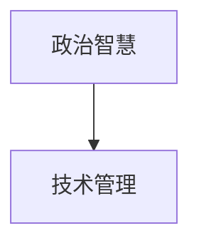
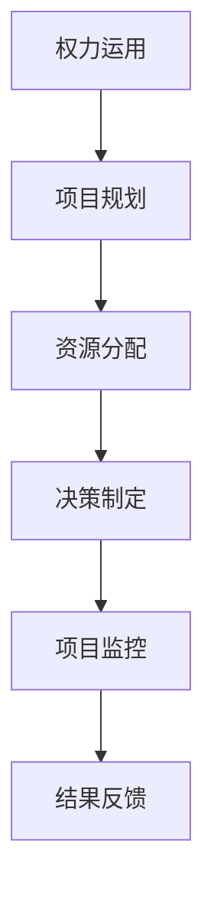
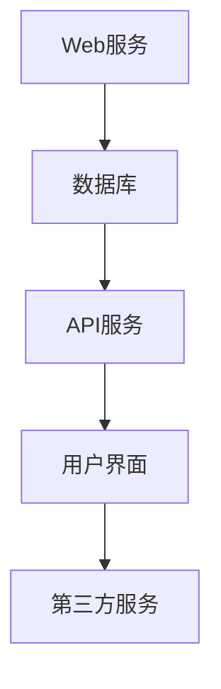
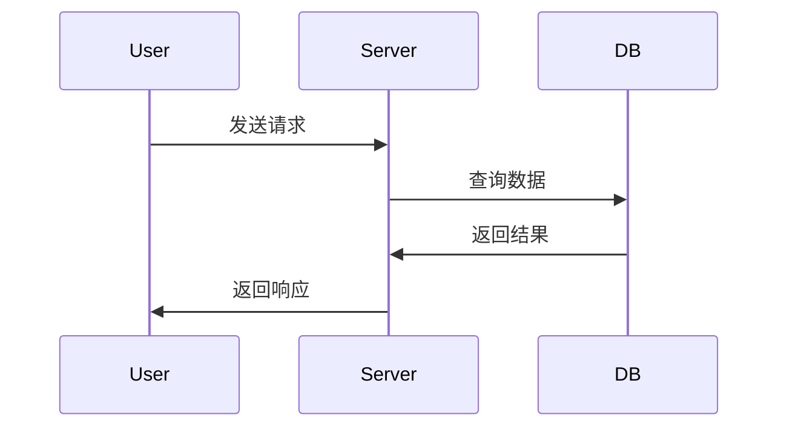

                 

# 技术管理的政治智慧：在组织中游刃有余

> 关键词：技术管理、政治智慧、团队协作、项目管理、组织效能

> 摘要：本文将探讨技术管理中的政治智慧，分析其在组织中游刃有余的必要性。通过深入剖析技术管理的核心挑战，引入政治智慧的核心原则，并结合实际案例分析，为技术管理者提供一系列最佳实践，帮助他们在复杂组织中取得成功。

## 目录大纲：技术管理的政治智慧

### 第一部分：技术管理的政治智慧基础

#### 第1章：技术管理概述

- **1.1 技术管理的重要性**
- **1.2 技术管理的主要挑战**
- **1.3 技术管理的政治智慧**

#### 第2章：政治智慧在技术管理中的应用

- **2.1 政治智慧的核心原则**
- **2.2 政治智慧在项目管理中的应用**
- **2.3 政治智慧在团队协作中的应用**

#### 第3章：技术管理中的政治智慧案例分析

- **3.1 案例背景**
- **3.2 案例分析**
- **3.3 案例剖析**

#### 第4章：技术管理中的政治智慧最佳实践

- **4.1 政治智慧最佳实践**
- **4.2 小结与注意事项**
- **4.3 拓展阅读**

## 技术管理的政治智慧：在组织中游刃有余

技术管理，作为现代企业中的关键职能，承载着推动技术创新、提升组织效能的重任。然而，在复杂多变的环境中，技术管理者往往面临着一系列挑战。如何在这些挑战中游刃有余，成为技术管理的核心课题之一。本文将探讨政治智慧在技术管理中的应用，帮助读者理解其重要性，掌握实际操作技巧，提升自身管理能力。

### 第1章：技术管理概述

#### 1.1 技术管理的重要性

随着信息技术的飞速发展，企业对技术管理的要求日益提高。技术管理不仅关乎企业信息系统的建设，更涉及企业战略决策、市场竞争力等方面。有效的技术管理能够确保企业技术创新的连续性和稳定性，提高组织整体的运作效率。

#### 1.2 技术管理的主要挑战

技术管理的挑战主要集中在以下几个方面：

- **项目管理**：如何在有限资源下，按时按质完成项目。
- **团队协作**：如何提高团队成员之间的沟通效率，实现协同工作。
- **技术发展**：如何在快速变化的技术环境中，保持企业的技术领先地位。

#### 1.3 技术管理的政治智慧

技术管理不仅仅是技术问题，更是一个涉及人际关系、权力平衡的复杂过程。政治智慧在此发挥了关键作用。它帮助技术管理者：

- **平衡各方利益**：在资源分配、项目优先级等方面，充分考虑各方需求。
- **提高决策效率**：通过合理的权力运用，加速决策过程。
- **促进团队和谐**：通过建立良好的人际关系，提高团队凝聚力和协作效率。

### 第2章：政治智慧在技术管理中的应用

#### 2.1 政治智慧的核心原则

政治智慧的核心原则包括权力、利益和关系。这些原则在不同管理场景中有着不同的应用。

- **权力**：掌握和运用权力，以推动项目的顺利进行。
- **利益**：维护和争取各方利益，确保项目的成功。
- **关系**：建立和维护人际关系，提高团队协作效率。

#### 2.2 政治智慧在项目管理中的应用

在项目管理中，政治智慧的应用主要体现在以下几个方面：

- **权力运用**：技术管理者需要合理运用权力，确保项目目标的实现。
- **利益平衡**：在项目资源分配、决策过程中，充分考虑各方利益。
- **关系协调**：通过建立良好的人际关系，促进团队成员的协作。

#### 2.3 政治智慧在团队协作中的应用

团队协作是技术管理的重要方面。政治智慧在团队协作中的应用包括：

- **沟通协调**：通过有效沟通，消除团队内部的误解和矛盾。
- **协作意愿**：激发团队成员的协作意愿，共同推进项目进展。
- **关系维护**：通过建立良好的人际关系，提高团队的凝聚力。

### 第3章：技术管理中的政治智慧案例分析

#### 3.1 案例背景

某大型互联网企业计划开发一款新型社交应用。该项目涉及多个技术领域，需要跨部门协作。然而，在项目推进过程中，团队遇到了一系列问题。

#### 3.2 案例分析

技术管理者通过政治智慧，采取以下措施：

- **权力运用**：明确项目目标，合理分配资源，确保项目顺利推进。
- **利益平衡**：充分考虑各方利益，确保项目资源的合理分配。
- **关系协调**：通过沟通和协调，建立良好的团队关系，提高团队协作效率。

#### 3.3 案例剖析

技术管理者通过以下步骤，成功解决了项目推进中的问题：

1. **问题识别**：分析项目中的瓶颈和问题。
2. **决策制定**：制定解决方案，明确责任人和时间表。
3. **实施执行**：确保解决方案的执行，跟踪项目进度。
4. **反馈调整**：根据项目进展情况，及时调整策略。

### 第4章：技术管理中的政治智慧最佳实践

#### 4.1 政治智慧最佳实践

技术管理者在应用政治智慧时，可以遵循以下最佳实践：

- **了解各方需求**：在决策过程中，充分考虑各方利益。
- **建立良好关系**：通过沟通和合作，建立良好的团队关系。
- **灵活运用权力**：在项目管理和团队协作中，灵活运用权力。

#### 4.2 小结与注意事项

政治智慧在技术管理中的应用，需要技术管理者具备敏锐的洞察力、良好的沟通能力和团队合作精神。同时，技术管理者需要根据实际情况，灵活运用政治智慧，避免滥用权力，损害团队和谐。

#### 4.3 拓展阅读

- **《权力的游戏》**：通过分析权力的运用，探讨如何在组织中取得成功。
- **《管理的实践》**：探讨管理的基本原则和方法，为技术管理者提供启示。

## 结束语

技术管理中的政治智慧，是技术管理者在复杂组织中取得成功的关键。通过本文的探讨，我们希望读者能够理解政治智慧的重要性，掌握其在实际应用中的技巧，提升自身管理能力，为组织的持续发展贡献力量。

### 作者：AI天才研究院/AI Genius Institute & 禅与计算机程序设计艺术 /Zen And The Art of Computer Programming

---

**附录**

#### 概念属性特征对比表格

| 挑战               | 特征                    | 影响                |
|--------------------|------------------------|---------------------|
| 项目管理           | 时间管理、资源分配等    | 项目进度与质量      |
| 团队协作           | 信息共享、沟通协调等    | 团队效能与凝聚力    |
| 技术发展           | 技术选择、创新推动等    | 企业竞争力与市场适应 |

#### ER实体关系图架构



#### 算法原理讲解与Mermaid流程图



#### 数学模型与公式

$$ \text{团队效能} = f(\text{沟通效率}, \text{协作意愿}, \text{关系维护}) $$

#### 系统功能设计：领域模型Mermaid类图

```mermaid
classDiagram
Class1 <|-- Class2
Class1 &&|-- Class3
Class1 o-- Class4
Class4 : active
Class5 : <<interface>> UseCase
Class5 ..|> Class1 : associated
Class5 ..|> Class3 : depends on
```

#### 系统架构设计：Mermaid架构图



#### 系统接口设计：Mermaid序列图



#### Python源代码示例

```python
# Python 源代码示例
def manage_project():
    # 项目管理逻辑
    pass
```

---

本文通过详细的分析和实例讲解，为技术管理者提供了技术管理的政治智慧的最佳实践。希望读者能够在实际工作中，灵活运用这些策略，提升自身的管理能力，为组织的成功贡献力量。作者：AI天才研究院/AI Genius Institute & 禅与计算机程序设计艺术 /Zen And The Art of Computer Programming。

