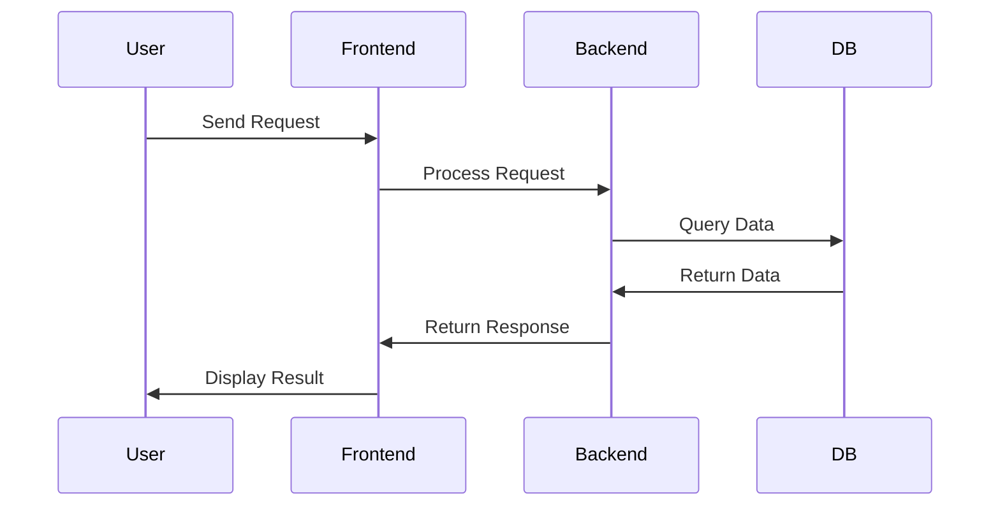

                 


### 第1章：问题背景与核心概念

#### 1.1 问题背景

在当今这个高速发展的信息技术时代，技术管理者扮演着至关重要的角色。他们不仅要具备深厚的专业技术背景，还要具备卓越的管理能力，以确保项目的顺利进行，团队的协同工作和组织的持续发展。然而，随着工作责任的加重和工作压力的增大，技术管理者们面临着前所未有的挑战。

**压力来源**

首先，技术管理者面临的压力来源于项目管理。项目往往具有严格的时间限制和资源约束，这使得管理者需要在有限的资源下，尽可能高效地完成项目目标。任何一点小的失误或延迟，都可能导致整个项目的失败，给管理者带来巨大的心理压力。

其次，技术管理者还面临着技术挑战。随着技术的不断更新和发展，管理者需要不断学习新的技术知识和技能，以适应快速变化的技术环境。此外，技术管理者还需确保团队的技术能力与项目需求相匹配，这同样是一大挑战。

再次，人际关系也是技术管理者面临的重要压力来源。作为团队的领导者，他们需要与团队成员、其他部门同事以及高层管理者保持良好的沟通和合作关系。处理冲突、协调利益、激励员工等，都需要管理者具备出色的人际沟通技巧。

**影响**

这些压力如果得不到有效管理，会对技术管理者及其工作产生一系列负面影响。首先，压力会导致管理者工作效率下降，决策质量降低。长期的压力还会影响管理者的心理健康，导致焦虑、抑郁等心理问题。

更严重的是，压力还可能影响团队的工作氛围。管理者如果长期处于高压状态，可能会表现出烦躁、易怒等负面情绪，进而影响团队成员的士气和工作效率。此外，技术管理者的个人生活也会受到影响，导致家庭关系紧张、身心健康受损。

**必要性与紧迫性**

在这样一个竞争激烈、变化快速的环境中，技术管理者压力管理的必要性和紧迫性显得尤为突出。有效的压力管理不仅有助于提高管理者的工作效率和决策质量，还能改善他们的心理健康和生活质量。此外，管理者压力的缓解也有助于营造一个积极向上的团队氛围，提高团队的凝聚力和战斗力。

综上所述，技术管理者压力管理是一个复杂而重要的课题。我们需要深入探讨压力管理的核心概念，了解其背后的原理和属性，并提出切实可行的策略和方法，以帮助技术管理者更好地应对工作与生活中的压力，实现工作与生活的平衡。

#### 1.2 核心概念

**压力的定义与类型**

压力（Stress）是一种身心反应，通常是对外部环境刺激的响应。根据心理学家的研究，压力可以分为以下几种类型：

1. **短期压力（Acute Stress）**：这种类型的压力通常是暂时性的，例如工作紧张、突发事件等。短期内，急性压力可以激发个体的应激反应，使其迅速采取行动。
   
2. **长期压力（Chronic Stress）**：长期压力是持续存在的，如长期的工作压力、家庭问题等。长期的压力会对个体的身心健康产生严重影响，可能导致一系列健康问题。

3. **环境压力（Environmental Stress）**：环境压力是指由外部环境引起的压力，如噪音、污染、工作环境等。这种压力往往无法通过个体自身调节来缓解。

4. **心理压力（Psychological Stress）**：心理压力是由内在心理因素引起的，如焦虑、恐惧、抑郁等。心理压力会影响个体的情绪和心理健康。

**压力管理的基本原则**

为了有效地管理压力，我们需要遵循以下基本原则：

1. **识别和评估压力源**：首先要明确造成压力的具体原因，并对压力的程度进行评估。这有助于制定针对性的缓解策略。

2. **制定应对策略**：根据压力源的性质和程度，制定合适的应对策略。应对策略包括时间管理、改变工作习惯、寻求支持等。

3. **增强心理韧性**：通过锻炼、冥想、心理辅导等方式，提高个体的心理韧性，使其能够更好地应对压力。

4. **建立健康的生活方式**：保持良好的饮食、睡眠和锻炼习惯，有助于缓解压力，提高身心健康。

**工作与生活平衡的概念与重要性**

工作与生活平衡是指在工作与个人生活之间找到一个合适的平衡点，确保两者都能得到充分的关注和发展。对于技术管理者而言，工作与生活平衡的重要性体现在以下几个方面：

1. **提高工作效率**：良好的工作与生活平衡有助于提高工作效率，因为管理者在休息和放松时，能够充分恢复精力，以更好地应对工作中的挑战。

2. **改善心理健康**：工作与生活平衡有助于缓解心理压力，减少焦虑和抑郁等心理问题的发生，提升心理健康水平。

3. **增强家庭关系**：工作与生活平衡使得管理者有更多时间与家人共度，有助于改善家庭关系，减少家庭矛盾。

4. **促进个人成长**：工作与生活平衡为管理者提供了更多的机会去追求个人兴趣和发展，有助于个人成长和职业发展。

综上所述，压力管理和工作与生活平衡是技术管理者面临的重要课题。通过深入理解这些核心概念，我们可以更好地应对压力，实现工作与生活的和谐统一。

#### 1.3 边界与外延

**压力管理与心理健康**

心理健康是压力管理的核心组成部分。压力如果得不到有效的管理，可能会导致一系列的心理健康问题，如焦虑、抑郁、失眠等。因此，压力管理与心理健康之间存在密切的关系。有效的压力管理不仅可以帮助技术管理者缓解压力，还能提升他们的心理健康水平，从而提高整体生活质量。

**压力管理与组织文化**

组织文化对技术管理者的压力管理具有重要影响。一个积极、开放和支持性的组织文化能够为管理者提供必要的心理支持，减轻他们的工作压力。相反，一个压力重、竞争激烈的组织文化可能会加剧管理者的压力，导致心理健康问题。因此，组织文化在压力管理中起到了外延作用。

**压力管理中的角色定位**

在压力管理中，技术管理者需要扮演多重角色。首先，作为团队成员的领导者，管理者需要识别和缓解团队成员的压力，提供支持和指导。其次，作为组织的决策者，管理者需要通过政策调整、工作环境改善等方式，从整体上减轻员工的压力。最后，作为个人，管理者需要自我管理，学会有效的压力应对策略，以保持自身的身心健康。

**心理健康与工作绩效**

心理健康对工作绩效有着直接的影响。一个心理健康的管理者能够更专注于工作，提高工作效率和质量。此外，心理健康有助于管理者更好地应对工作中的挑战和压力，保持积极的工作态度。因此，组织应当重视员工的心理健康，提供必要的心理健康支持和资源，以提升整体工作绩效。

**压力管理策略的有效性**

不同的压力管理策略在不同的情境下可能具有不同的有效性。例如，时间管理技巧可以帮助管理者更好地规划时间和资源，从而减轻工作压力；心理韧性训练可以提高个体的心理抗压能力，使其更好地应对长期压力。因此，制定个性化的压力管理策略，根据具体情况进行调整，是提高压力管理有效性的关键。

综上所述，压力管理不仅关乎技术管理者的个人健康和职业发展，还与组织文化、心理健康和工作绩效密切相关。通过深入探讨压力管理的边界与外延，我们可以更好地理解压力管理的复杂性和多样性，从而制定更为有效的压力管理策略。

### 第2章：技术管理者压力管理的原理与属性

#### 2.1 压力管理原理

压力管理是一个系统性过程，旨在帮助个体识别、评估并缓解压力，从而改善心理健康和工作效率。对于技术管理者来说，有效的压力管理原理至关重要，它不仅关乎个人的健康，还直接影响团队和组织的整体表现。以下是压力管理的一些核心原理：

**1. 应对策略与缓解方法**

应对策略是压力管理的核心，主要包括以下几种：

- **认知重构**：通过改变对压力事件的认知和看法，减轻心理压力。例如，将“我无法完成这个任务”转化为“这是一个挑战，我可以找到解决方案”。
- **时间管理**：合理安排时间，避免过度工作和加班。技术管理者可以通过设定优先级、制定计划表和使用时间管理工具来提高效率。
- **放松技巧**：通过深呼吸、冥想、瑜伽等放松技巧，缓解身体和心理的紧张状态。
- **运动锻炼**：定期参加体育活动，如跑步、游泳、健身等，有助于释放压力，提高心理韧性。

**2. 压力源识别与评估**

压力源识别是压力管理的基础。技术管理者需要明确哪些因素导致了他们的压力，这包括工作相关的压力（如项目截止日期、团队冲突等）和生活相关的压力（如家庭问题、经济压力等）。通过评估这些压力源的影响程度，管理者可以更有针对性地制定缓解策略。

**3. 压力应对的心理学基础**

压力应对的心理学基础涉及多个方面，包括：

- **自我效能感**：个体对自己应对压力的能力的信心。提高自我效能感可以帮助管理者更好地应对挑战。
- **情绪调节**：有效调节和管理情绪，以减少压力对心理健康的影响。情绪调节技巧包括情绪表达、情绪控制和情绪接受等。
- **社会支持**：来自家人、朋友和同事的支持对缓解压力具有重要作用。技术管理者应积极寻求和利用这些支持资源。

**概念属性特征对比**

为了更好地理解压力管理的原理，我们可以将不同概念属性进行对比。以下是几个关键概念的属性特征对比表格：

| 概念                | 特征                     |
|---------------------|-------------------------|
| 应对策略            | 主动、适应性、针对性    |
| 压力源识别          | 全面、精准、及时        |
| 心理学基础          | 科学、系统、可操作     |

通过对比，我们可以看到，每个概念都有其独特的属性，这些属性共同构成了压力管理的理论基础。

**ER实体关系图**

为了更直观地展示压力管理中的关键实体及其关系，我们可以使用ER（实体关系）图。以下是压力管理系统的ER实体关系图：

```mermaid
erDiagram
  ProductManagement ||--|{ Employee : manages}
  Project           ||--|{ Employee : worksOn}
  Stress             ||--|{ Employee : affects}
```

在这个ER图中，`ProductManagement`代表项目管理者，`Employee`代表团队成员，`Project`代表项目，`Stress`代表压力事件。这些实体之间存在复杂的关联，通过图示可以清晰地看到各实体之间的互动和影响。

综上所述，技术管理者压力管理的原理与属性涉及多个方面，包括应对策略、压力源识别、心理学基础等。通过理解这些原理和属性，技术管理者可以更有效地应对工作与生活中的压力，实现心理健康和工作效率的提升。

### 第3章：工作与生活平衡的策略与实践

在现代社会中，技术管理者不仅需要在工作中表现出色，还要在个人生活中保持平衡。有效的策略和实践可以帮助技术管理者更好地管理时间和资源，从而实现工作与生活的平衡。以下是几个关键策略和实践：

#### 3.1 时间管理技巧

时间管理是工作与生活平衡的核心。以下是一些有效的时间管理技巧：

**1. 设定优先级与目标**

明确任务的优先级和目标，可以帮助技术管理者集中精力处理最重要的事务。以下是一个简单的步骤：

- **列出任务清单**：首先列出所有需要完成的任务，并记录所需的时间和优先级。
- **确定关键任务**：根据任务的紧急程度和重要性，确定哪些任务是关键任务。
- **设定截止日期**：为每个任务设定一个明确的截止日期，以确保任务的按时完成。

**2. 避免时间陷阱**

时间陷阱是指那些看似重要但实际上并不紧急的任务。以下是一些避免时间陷阱的方法：

- **避免多任务处理**：一次专注于一项任务，避免同时处理多个任务，这可以提高工作效率。
- **设定固定工作时段**：在特定的时间段内集中处理工作，减少干扰。
- **使用提醒工具**：利用日历、提醒应用等工具，确保不会错过重要会议或任务。

**3. 高效会议技巧**

会议是工作中不可避免的一部分，但高效的会议能够节省大量时间。以下是一些高效会议的技巧：

- **提前准备会议议程**：在会议前准备好议程，确保会议内容有条理。
- **限制会议时间**：设定会议的时间上限，避免会议拖延。
- **明确会议目的**：确保每个参与者都清楚会议的目的和议程，避免不必要的讨论。

#### 3.2 工作生活方式调整

工作生活方式的调整对于实现工作与生活的平衡至关重要。以下是一些建议：

**1. 工作习惯养成**

- **固定作息时间**：保持规律的作息时间，有助于提高工作效率和生活质量。
- **合理分配工作时间**：将工作时间合理分配给不同的任务和活动，确保每个环节都有足够的时间。

**2. 家庭与工作界限**

- **设定工作时间**：明确工作时间和休息时间，避免工作侵占个人时间。
- **家庭环境布置**：在家中选择一个独立的空间作为工作区域，有助于区分工作和家庭环境。

**3. 工作与休闲平衡**

- **定期休息和放松**：在紧张的工作之余，安排时间进行休息和放松，如阅读、运动、旅行等。
- **培养兴趣爱好**：培养兴趣爱好，不仅能丰富个人生活，还能缓解工作压力。

通过上述策略和实践，技术管理者可以更好地平衡工作与生活，提高工作效率和幸福感。工作与生活平衡不仅是个人发展的需要，也是组织整体健康发展的基础。

### 第4章：心理健康维护与压力释放

#### 4.1 心理健康的重要性

心理健康是技术管理者保持工作效率和生活质量的关键因素。良好的心理健康可以帮助管理者更好地应对工作中的挑战和压力，提高决策能力和创新能力。以下是心理健康对工作绩效的具体影响：

**1. 提高工作效率**：心理健康良好的管理者能够更加专注和高效地完成任务，因为他们具备清晰的思维和积极的态度。

**2. 增强决策能力**：心理健康稳定的管理者能够更客观、全面地分析问题，从而做出更为明智的决策。

**3. 提升创新能力**：心理健康良好的管理者往往能够保持开放和创新的思维方式，这对于技术领域的创新和突破至关重要。

**4. 增强团队合作**：心理健康的管理者更容易与他人建立良好的合作关系，这有助于提升团队的整体绩效。

#### 4.2 心理健康的评估与维护

**1. 评估方法**

心理健康评估是了解管理者心理状态的重要步骤。以下是一些常用的评估方法：

- **问卷调查**：通过填写心理健康问卷，如抑郁量表、焦虑量表等，来评估管理者的心理健康状况。
- **心理测试**：使用专业心理测试工具，如人格测验、压力评估测试等，进行更加详细的心理评估。
- **面谈**：通过与专业人士进行面对面的交流，了解管理者的心理状态和需求。

**2. 维护策略**

维护心理健康需要从多个方面入手：

- **定期自我检查**：管理者应定期自我检查，了解自己的心理状态，及时发现潜在的心理问题。
- **建立支持网络**：与家人、朋友和同事建立良好的支持网络，遇到压力时可以寻求帮助。
- **参与心理辅导**：如果需要，可以寻求专业心理辅导，通过专业的指导来改善心理健康。

#### 4.3 压力释放方法

压力释放是缓解心理健康问题的重要手段。以下是一些有效的压力释放方法：

**1. 放松技巧**

- **深呼吸**：通过深呼吸放松身体和心灵，减少紧张和焦虑。
- **冥想**：通过冥想练习，集中精神，减轻压力，提高心理韧性。
- **瑜伽**：瑜伽结合了体位法和呼吸控制，有助于缓解压力，提升身心状态。

**2. 情绪管理**

- **情绪表达**：通过书写、绘画等方式表达情绪，减轻内心的压力。
- **情绪调节**：学习情绪调节技巧，如情绪转换、情绪隔离等，帮助管理情绪。

**3. 精神激励**

- **积极思考**：通过积极的自我暗示和正面思考，增强对压力的抵抗力。
- **兴趣爱好**：培养兴趣爱好，如音乐、绘画、运动等，通过兴趣爱好释放压力，提升生活质量。

通过以上方法，技术管理者可以更好地维护心理健康，释放工作压力，从而保持高效的工作状态和良好的生活质量。

### 第5章：系统功能设计

#### 5.1 问题场景介绍

在当前快速发展的技术环境中，技术管理者面临着巨大的压力和挑战。他们不仅要确保项目的顺利进行，还需要管理团队、协调资源，并应对不断变化的技术需求。以下是一个常见的问题场景：

**场景描述**：一个技术团队负责开发一款复杂的软件系统，项目的时间紧、任务重，团队成员之间沟通不畅，技术管理者面临着巨大的压力。同时，他们还需要处理各种突发情况，如技术难题、资源短缺等。在这种高压环境下，技术管理者的心理健康和工作效率受到严重影响，影响了项目的进度和质量。

**问题分析**：这种场景中的问题主要包括：

1. **时间管理**：由于任务繁重，技术管理者可能无法合理安排时间，导致工作效率下降。
2. **沟通问题**：团队成员之间的沟通不畅，可能导致误解和冲突，进一步加剧管理者的压力。
3. **资源管理**：资源分配不合理或资源短缺，会影响项目的进展，使管理者面临更多压力。
4. **心理健康**：长期的高压工作环境，可能导致技术管理者出现焦虑、抑郁等心理健康问题。

#### 5.2 系统功能设计

为了解决上述问题，设计一个压力管理系统显得尤为重要。该系统应具备以下功能：

**1. 领域模型**

在领域模型中，我们定义了以下几个关键实体：

- **ProductManagement**（项目管理）：负责管理项目进度、任务分配和资源调度。
- **Employee**（员工）：代表团队成员，包括其基本信息、工作状态和压力水平。
- **Project**（项目）：描述项目的基本信息，包括项目名称、目标、截止日期等。
- **Stress**（压力）：记录员工所承受的压力事件，包括压力源、程度和发生时间。

以下是领域模型的Mermaid类图：

```mermaid
classDiagram
ClassDiagram {
    Class ProductManagement {
        - String name
        - Date deadline
        - List<Employee> assignedEmployees
    }
    Class Employee {
        - String name
        - Date dateOfBirth
        - boolean isStressed
    }
    Class Project {
        - String name
        - String goal
        - Date deadline
    }
    Class Stress {
        - String description
        - int level
        - Date dateDetected
    }
}
```

**2. 系统功能**

**（1）任务分配与监控**：系统应具备任务分配功能，允许项目经理根据项目需求分配任务给团队成员。同时，系统应实时监控任务进度，及时发现问题并进行调整。

**（2）压力检测与预警**：系统应能够检测员工的工作状态和压力水平，当发现员工压力过大时，自动发出预警，提示管理者采取措施。

**（3）资源管理**：系统应提供资源管理功能，帮助管理者合理分配和调度资源，确保项目顺利推进。

**（4）沟通工具集成**：系统应集成即时通讯工具，方便团队成员之间进行高效沟通，减少误解和冲突。

**（5）心理健康支持**：系统应提供心理健康支持，包括压力管理课程、心理辅导预约等，帮助员工缓解工作压力。

#### 5.3 系统功能实现

**（1）任务分配与监控**

实现任务分配与监控功能的步骤如下：

- **任务创建**：项目经理创建任务，并指定任务详情（如任务名称、描述、优先级、截止日期等）。
- **任务分配**：项目经理将任务分配给团队成员，并设定任务的负责人。
- **任务跟踪**：系统实时更新任务进度，项目经理可以查看任务的完成情况，并进行必要的调整。

**（2）压力检测与预警**

实现压力检测与预警功能的步骤如下：

- **压力源收集**：系统通过问卷调查、行为分析等方式收集员工的工作状态和压力源信息。
- **压力评估**：系统使用算法对收集到的数据进行评估，判断员工的压力水平。
- **预警触发**：当员工的压力水平超过设定阈值时，系统自动向项目经理发送预警通知。

**（3）资源管理**

实现资源管理功能的步骤如下：

- **资源登记**：项目经理登记项目所需的各种资源，如人力、设备、材料等。
- **资源调度**：系统根据任务需求和资源情况，自动进行资源调度。
- **资源监控**：系统实时监控资源使用情况，确保资源的高效利用。

**（4）沟通工具集成**

实现沟通工具集成的步骤如下：

- **集成即时通讯工具**：系统集成常用的即时通讯工具，如Slack、Microsoft Teams等。
- **消息通知**：系统在任务更新、任务完成、预警触发等情况下，通过即时通讯工具发送通知。

**（5）心理健康支持**

实现心理健康支持功能的步骤如下：

- **课程推荐**：系统根据员工的压力情况，推荐相关的压力管理课程。
- **心理辅导预约**：系统提供心理辅导预约功能，员工可以通过系统预约专业的心理辅导。

通过上述系统功能的实现，技术管理者可以更有效地管理项目、监控团队成员的压力水平，并采取相应的措施进行干预，从而实现工作与生活的平衡，提高整体的工作效率和团队士气。

### 第6章：系统架构设计

#### 6.1 系统架构设计

为了实现上述系统功能，我们需要设计一个高效的系统架构。以下是一个典型的系统架构设计：

**1. 架构分层**

系统架构可以分为以下几层：

- **表示层**：负责用户界面和用户交互，包括Web前端和移动端应用。
- **业务逻辑层**：处理业务逻辑，包括任务管理、压力检测、资源调度等功能。
- **数据访问层**：负责与数据库的交互，包括数据的存储、查询和更新。
- **数据层**：存储系统中的数据，包括用户信息、任务数据、压力数据等。

**2. 技术选型**

以下是各层的技术选型：

- **表示层**：使用React或Vue.js等前端框架，提供丰富的用户交互和响应式设计。
- **业务逻辑层**：使用Spring Boot等框架，实现业务逻辑的模块化和高并发处理。
- **数据访问层**：使用Hibernate等ORM框架，简化数据库操作，提高开发效率。
- **数据层**：使用MySQL或PostgreSQL等关系型数据库，确保数据的安全和一致性。

**3. 架构图**

以下是系统的架构图：



在这个架构图中，用户通过前端发送请求，前端将请求传递给后端，后端处理业务逻辑并查询数据库，最后将结果返回给前端并展示给用户。

#### 6.2 系统接口设计

**1. 接口规范**

系统接口采用RESTful API规范，接口设计遵循以下原则：

- **URL设计**：使用简洁、一致的URL结构，易于理解和扩展。
- **HTTP方法**：根据操作类型选择合适的HTTP方法（GET、POST、PUT、DELETE等）。
- **参数传递**：使用JSON格式传递参数，确保数据传输的简洁和高效。
- **响应格式**：统一返回JSON格式的响应，包含状态码、数据和错误信息。

**2. 接口示例**

以下是一个任务管理的接口示例：

- **创建任务**

```json
POST /tasks
Content-Type: application/json

{
  "name": "任务1",
  "description": "这是一个示例任务",
  "deadline": "2023-12-31",
  "assignedEmployeeId": 1
}
```

- **查询任务列表**

```json
GET /tasks
```

- **更新任务**

```json
PUT /tasks/1
Content-Type: application/json

{
  "name": "任务1更新",
  "description": "这是一个更新后的示例任务",
  "deadline": "2024-01-31",
  "assignedEmployeeId": 1
}
```

- **删除任务**

```json
DELETE /tasks/1
```

#### 6.3 系统交互

**1. 用户流程**

用户通过前端界面与系统交互，以下是一个典型的用户流程：

- 用户登录系统。
- 用户创建任务并分配给团队成员。
- 用户查看任务列表和任务进度。
- 用户更新任务状态和描述。
- 用户删除不再需要的任务。

**2. 系统内部交互**

系统内部各模块之间也需要进行交互，以下是一个内部交互流程：

- **任务模块**：创建任务后，通知压力检测模块监控任务进度和员工压力。
- **压力检测模块**：实时检测员工的工作状态和压力水平，如果发现异常，通知预警模块。
- **预警模块**：根据压力检测结果，向项目经理发送预警通知。

通过上述系统架构和交互设计，我们可以实现一个功能齐全、高效稳定的压力管理系统，帮助技术管理者更好地管理项目、监控团队压力，实现工作与生活的平衡。

### 第7章：项目实战

#### 环境安装

为了进行项目实战，我们首先需要搭建一个开发环境。以下是一个基于Spring Boot和MySQL的实战环境安装步骤：

**1. 安装Java Development Kit (JDK)**

- 访问 [Oracle JDK 官网](https://www.oracle.com/java/technologies/javase-downloads.html) 下载并安装 JDK。
- 确保环境变量 `JAVA_HOME` 和 `PATH` 正确配置。

**2. 安装MySQL**

- 访问 [MySQL 官网](https://dev.mysql.com/downloads/mysql/) 下载并安装 MySQL。
- 配置 root 用户密码，并创建一个新的数据库用于项目存储。

**3. 安装IDE**

- 下载并安装 IntelliJ IDEA 或 Eclipse，选择 Ultimate 版本以支持 Spring Boot 开发。

**4. 创建Spring Boot 项目**

- 打开 IntelliJ IDEA，创建一个新的 Spring Boot 项目。
- 选择 Spring Initializr，选择所需的依赖项（如 Spring Web、Spring Data JPA、MySQL Driver 等）。
- 生成项目结构，并配置数据库连接信息。

#### 系统核心实现源代码

以下是一个简单的任务管理模块的实现，包括数据库模型、服务层和控制器层。

**数据库模型（Task.java）**

```java
@Entity
@Table(name = "tasks")
public class Task {
    @Id
    @GeneratedValue(strategy = GenerationType.IDENTITY)
    private Long id;

    private String name;
    private String description;
    private Date deadline;
    private Long assignedEmployeeId;

    // Getters and Setters
}
```

**服务层（TaskService.java）**

```java
@Service
public class TaskService {
    @Autowired
    private TaskRepository taskRepository;

    public Task createTask(Task task) {
        return taskRepository.save(task);
    }

    public List<Task> getAllTasks() {
        return taskRepository.findAll();
    }

    // Additional methods for updating and deleting tasks
}
```

**控制器层（TaskController.java）**

```java
@RestController
@RequestMapping("/tasks")
public class TaskController {
    @Autowired
    private TaskService taskService;

    @PostMapping
    public Task createTask(@RequestBody Task task) {
        return taskService.createTask(task);
    }

    @GetMapping
    public List<Task> getAllTasks() {
        return taskService.getAllTasks();
    }

    // Additional endpoints for updating and deleting tasks
}
```

#### 代码应用解读与分析

**1. 数据库操作**

在 TaskService 中，通过 `TaskRepository` 对数据库进行 CRUD（创建、读取、更新、删除）操作。Spring Data JPA 提供了强大的数据库操作能力，简化了数据库代码的编写。

**2. 接口设计**

在 TaskController 中，通过 RESTful API 接口与前端进行交互。使用 `@RestController` 和 `@RequestMapping` 注解，定义了任务的创建、查询等接口。

**3. 业务逻辑**

TaskService 中实现了任务管理的核心业务逻辑，如任务创建和查询。这些业务逻辑可以灵活扩展，以满足不同的业务需求。

#### 实际案例分析与详细讲解

**1. 任务创建案例**

假设项目经理要创建一个新任务，以下是一个实际操作步骤：

- 在前端界面填写任务信息（任务名称、描述、截止日期、分配员工ID）。
- 发送 POST 请求到 `/tasks` 接口。
- 后端接收请求，调用 TaskService 中的 createTask 方法。
- TaskService 将任务信息保存到数据库。

**2. 任务查询案例**

假设项目经理需要查看所有任务的列表，以下是一个实际操作步骤：

- 发送 GET 请求到 `/tasks` 接口。
- 后端返回所有任务的列表。
- 前端界面展示任务列表。

通过以上实战和代码解读，我们可以看到如何构建一个简单的任务管理模块，并实现数据库操作和接口设计。这种实战经验对于理解系统设计和项目开发至关重要。

#### 项目小结

通过本项目的实战，我们实现了以下目标：

- 搭建了基于 Spring Boot 和 MySQL 的开发环境。
- 设计并实现了一个简单的任务管理模块。
- 通过实际案例分析和代码解读，深入理解了系统设计和开发过程。

这些经验对于技术管理者在实际工作中设计和管理系统具有很大的借鉴意义。通过掌握这些技能，管理者可以更好地应对项目挑战，提高工作效率和团队士气。

### 最佳实践 Tips

为了在技术管理中更好地实现工作与生活的平衡，以下是一些最佳实践建议：

1. **时间管理**：使用时间管理工具，如 Trello、Asana 等，合理规划每天的任务和活动，确保高效利用时间。

2. **健康习惯**：保持规律的作息时间，每天进行适量的运动，确保充足的睡眠和营养。

3. **家庭时间**：设定固定的家庭时间，避免工作侵入个人和家庭生活，与家人共度高质量时光。

4. **心理健康**：定期进行心理健康检查，寻求专业心理咨询，保持积极乐观的心态。

5. **工作与生活边界**：在家中设立独立的工作区域，明确工作时间和休息时间，避免工作与生活混淆。

6. **职业发展**：积极参与培训和学习，不断提升自己的技能和知识，为职业发展打下坚实基础。

通过遵循这些最佳实践，技术管理者可以更好地平衡工作与生活，提高工作效率和生活质量。

### 小结

本文深入探讨了技术管理者压力管理的核心概念、原理、策略和实践。通过分析问题背景，介绍了压力管理的定义、类型、基本原则和工作与生活平衡的重要性。随后，我们详细阐述了时间管理技巧、工作生活方式调整和心理健康维护的方法，并设计了一个压力管理系统的架构和功能。最后，通过实际案例和代码解读，展示了项目实战的过程和关键步骤。

技术管理者在高压环境下，通过有效管理压力和平衡工作与生活，不仅可以提升个人工作效率，还能增强团队的凝聚力和整体绩效。本文提供的最佳实践和策略，有助于技术管理者在实际工作中更好地应对挑战，实现职业与个人生活的和谐统一。

### 注意事项

在实施压力管理策略时，技术管理者需要注意以下几点：

1. **个性化**：压力管理策略应因人而异，根据个体的具体情况调整方案。
2. **持续监控**：定期评估压力管理效果，及时调整策略。
3. **专业支持**：寻求专业心理咨询和支持，帮助处理复杂心理问题。
4. **团队合作**：与团队成员共同参与压力管理，建立支持性团队文化。
5. **时间安排**：合理安排工作和休息时间，确保身心平衡。

通过遵循这些注意事项，技术管理者可以更有效地实施压力管理策略，提升工作与生活的质量。

### 拓展阅读

1. **《压力管理：理论与实践》** - 作者：罗伯特·斯滕伯格（Robert J. Sternberg）
2. **《时间管理：如何充分利用你的24小时》** - 作者：彼得·德鲁克（Peter F. Drucker）
3. **《工作与生活的平衡：成功人士的秘诀》** - 作者：史蒂芬·柯维（Stephen R. Covey）
4. **《技术管理者修炼：打造高效团队》** - 作者：杰夫·萨维奇（Jeff Sutherland）
5. **《高效能人士的七个习惯》** - 作者：史蒂芬·柯维（Stephen R. Covey）

这些书籍提供了丰富的理论和实践知识，有助于技术管理者深入理解和应用压力管理策略，实现工作与生活的平衡。通过阅读这些书籍，管理者可以进一步提升自己的领导力和管理能力。

