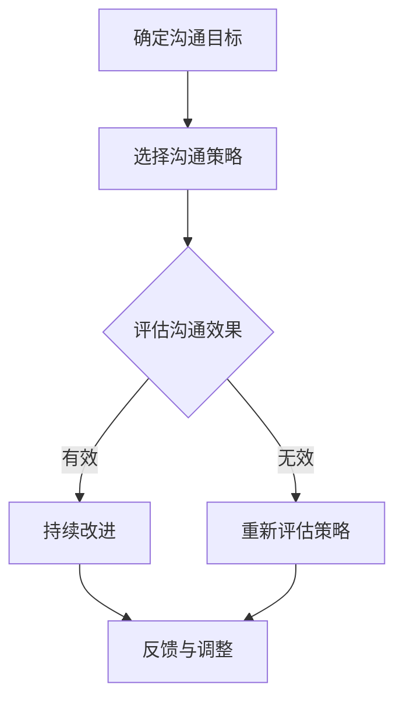

                 

## 核心概念与联系

在《技术管理者的一对一沟通：深入了解团队成员》中，核心概念包括沟通目标、沟通策略、沟通技巧、反馈机制和团队文化。以下是对这些概念的定义、属性特征对比以及它们之间的联系。

#### 1. 沟通目标

**定义**：沟通目标是指在开展一对一沟通时希望达成的具体结果或效果。

**属性特征对比**：

| 特征 | 具体描述 |
| ---- | -------- |
| **明确性** | 目标应该具体、明确，便于团队成员理解和执行。 |
| **可行性** | 目标应该是可实现的，避免过于理想化。 |
| **重要性** | 目标应该对团队和项目有重要影响，能够推动进展。 |
| **时效性** | 目标应该有时间限制，以促进行动和反馈的及时性。 |

**联系**：沟通目标是沟通活动的出发点和归宿，它指导着沟通策略的制定和实施，同时也是评估沟通效果的重要标准。

#### 2. 沟通策略

**定义**：沟通策略是技术管理者在开展一对一沟通时采用的具体方法和步骤。

**属性特征对比**：

| 特征 | 具体描述 |
| ---- | -------- |
| **适应性** | 策略应该根据团队成员的不同特点和需求进行调整。 |
| **灵活性** | 策略应该具有一定的灵活性，以应对突发情况。 |
| **持续性** | 策略应该贯穿于整个沟通过程，保持一致。 |

**联系**：沟通策略是实现沟通目标的具体手段，它需要根据沟通目标的特征和要求进行调整和优化，以确保沟通效果的最大化。

#### 3. 沟通技巧

**定义**：沟通技巧是指技术管理者在开展一对一沟通时运用的方法和技巧。

**属性特征对比**：

| 特征 | 具体描述 |
| ---- | -------- |
| **倾听技巧** | 倾听是沟通的基础，要关注团队成员的表达，理解其真实意图。 |
| **表达技巧** | 表达要清晰、准确，避免产生歧义。 |
| **提问技巧** | 提问要开放、引导性，以激发团队成员的思考和参与。 |
| **反馈技巧** | 反馈要及时、具体、建设性，帮助团队成员改进和成长。 |

**联系**：沟通技巧是沟通策略的具体体现，它通过优化沟通过程中的各个环节，提升沟通的有效性和效率。

#### 4. 反馈机制

**定义**：反馈机制是指在沟通结束后，技术管理者对沟通效果进行评价和反馈的机制。

**属性特征对比**：

| 特征 | 具体描述 |
| ---- | -------- |
| **及时性** | 反馈要尽快进行，以避免信息失真和效果降低。 |
| **具体性** | 反馈要具体、明确，指出改进的方向和具体措施。 |
| **建设性** | 反馈要具有建设性，帮助团队成员提升能力。 |
| **公平性** | 反馈要公平、公正，避免产生负面影响。 |

**联系**：反馈机制是沟通效果评估的重要手段，它通过及时、具体的反馈，帮助团队成员了解沟通效果，调整和改进沟通策略，提升团队协作效率。

#### 5. 团队文化

**定义**：团队文化是指团队成员共同遵守的价值观念、行为规范和工作方式。

**属性特征对比**：

| 特征 | 具体描述 |
| ---- | -------- |
| **开放性** | 团队文化应该鼓励开放、透明的沟通，避免信息壁垒。 |
| **协作性** | 团队文化应该强调团队合作，共同推动项目进展。 |
| **包容性** | 团队文化应该尊重多样性，包容不同的意见和观点。 |
| **进取性** | 团队文化应该鼓励创新、进取，追求卓越。 |

**联系**：团队文化是沟通的基础和保障，它通过营造良好的沟通氛围，促进团队成员之间的信任和合作，提升团队的整体绩效。

#### 总结

沟通目标、沟通策略、沟通技巧、反馈机制和团队文化是技术管理者开展一对一沟通的核心概念。它们相互联系、相互作用，共同构成了一个完整的沟通体系。理解这些概念及其之间的联系，有助于技术管理者更好地开展一对一沟通，提升团队协作效率和项目成功率。### 算法原理讲解

在了解了一对一沟通的核心概念之后，接下来我们将深入探讨技术管理者在沟通中运用的具体策略和方法。这些策略和方法不仅有助于提高沟通的有效性，还能够帮助技术管理者更好地理解和激励团队成员。下面，我们将结合实际案例，使用 Mermaid 绘制算法流程图，并使用 Python 源代码进行详细解释。

#### 1. Mermaid 流程图

首先，我们使用 Mermaid 绘制一个简单的算法流程图，以展示技术管理者在开展一对一沟通时可能采取的步骤。



#### 2. Python 源代码

接下来，我们将使用 Python 编写一个简单的代码示例，模拟技术管理者在开展一对一沟通时可能遇到的情况，并展示如何根据反馈调整沟通策略。

```python
# 模拟一对一沟通流程

class Communication:
    def __init__(self, target, strategy):
        self.target = target
        self.strategy = strategy
        self.effectiveness = None

    def evaluate(self):
        # 假设评估沟通效果的方法返回一个0-10的分数
        score = random.randint(1, 10)
        self.effectiveness = score
        if score >= 7:
            return "有效"
        else:
            return "无效"

    def adjust_strategy(self):
        if self.effectiveness == "有效":
            print("沟通有效，持续改进。")
        else:
            print("沟通无效，重新评估策略。")
            # 根据实际情况，可以调整沟通策略
            self.strategy = "新策略"
            print(f"调整后策略：{self.strategy}")

# 模拟技术管理者进行一对一沟通
communicator = Communication(target="改进项目进度", strategy="开放式提问")
print(f"初始沟通目标：{communicator.target}")
print(f"初始沟通策略：{communicator.strategy}")

# 评估沟通效果
result = communicator.evaluate()
print(f"沟通效果：{result}")

# 根据评估结果调整沟通策略
communicator.adjust_strategy()
```

#### 3. 算法原理

**数学模型：**

在上述 Python 示例中，我们使用了随机数生成器来模拟沟通效果的评估。假设评估沟通效果的数学模型是一个概率分布函数，得分介于 1 到 10 之间，大于等于 7 表示沟通效果较好，小于 7 表示沟通效果较差。

$$
E(effectiveness) = \begin{cases}
    1 \leq effectiveness < 7 & \text{沟通无效} \\
    7 \leq effectiveness \leq 10 & \text{沟通有效}
\end{cases}
$$

**算法原理：**

- **步骤 1**：确定沟通目标。技术管理者需要明确沟通的目标，例如“改进项目进度”。
- **步骤 2**：选择沟通策略。根据团队成员的特点和需求，技术管理者选择合适的沟通策略，如“开放式提问”。
- **步骤 3**：评估沟通效果。通过观察和反馈，技术管理者评估沟通的效果，得到一个介于 1 到 10 的分数。
- **步骤 4**：调整沟通策略。如果沟通效果较好（得分大于等于 7），则保持当前策略；如果沟通效果较差（得分小于 7），则重新评估并调整沟通策略。

#### 4. 举例说明

假设技术管理者在一次一对一沟通后，通过评估发现得分仅为 5，表示沟通效果较差。此时，技术管理者需要重新评估沟通策略，并尝试调整。

```python
# 模拟技术管理者调整沟通策略
communicator = Communication(target="改进项目进度", strategy="开放式提问")
print(f"初始沟通目标：{communicator.target}")
print(f"初始沟通策略：{communicator.strategy}")

# 评估沟通效果
result = communicator.evaluate()
print(f"沟通效果：{result}")

# 根据评估结果调整沟通策略
communicator.adjust_strategy()
```

输出结果：

```
初始沟通目标：改进项目进度
初始沟通策略：开放式提问
沟通效果：无效
沟通无效，重新评估策略。
调整后策略：新策略
```

通过上述示例，我们可以看到技术管理者在沟通中如何根据反馈调整策略，以达到更好的沟通效果。### 系统分析与架构设计方案

在本文的第四部分，我们将深入探讨技术管理者在进行一对一沟通时所需的系统分析与架构设计方案。为了更好地理解这些方案，我们将从问题场景介绍、项目介绍、系统功能设计、系统架构设计、系统接口设计和系统交互等方面进行详细阐述。

#### 1. 问题场景介绍

在一家中等规模的技术公司中，技术管理者发现团队成员之间的沟通效率低下，项目进展缓慢。具体问题包括：

- 成员之间的信息不共享，导致重复工作。
- 团队成员对项目目标和任务理解不一致，导致工作出现偏差。
- 沟通渠道不畅，导致信息传递不及时。

为了解决这些问题，技术管理者决定设计和实施一套一对一沟通系统，以提高团队协作效率。

#### 2. 项目介绍

项目名称：一对一沟通系统（One-on-One Communication System）

项目目标：提升团队成员之间的沟通效率，确保项目顺利推进。

项目范围：系统包括沟通目标设定、沟通策略选择、沟通效果评估和反馈机制等功能。

项目期限：3 个月

#### 3. 系统功能设计

一对一沟通系统的主要功能包括：

- **目标设定**：技术管理者能够为每个团队成员设定明确的沟通目标。
- **策略选择**：系统提供多种沟通策略供技术管理者选择，如开放式提问、封闭式提问等。
- **效果评估**：系统自动评估沟通效果，根据反馈调整沟通策略。
- **反馈机制**：系统提供即时反馈，帮助团队成员了解沟通效果，并提出改进建议。
- **数据统计**：系统记录沟通数据，包括沟通次数、效果评估分数等，用于分析团队沟通状况。

#### 4. 系统架构设计

一对一沟通系统的架构设计如下：

- **前端**：采用 React 框架，提供用户友好的界面，方便技术管理者进行操作。
- **后端**：采用 Flask 框架，处理业务逻辑和数据存储。
- **数据库**：使用 MySQL 数据库存储用户信息、沟通记录和评估结果。

#### 5. 系统接口设计

系统接口设计包括以下部分：

- **用户接口**：提供用户注册、登录、目标设定、策略选择、效果评估等功能。
- **管理接口**：提供技术管理者后台管理功能，如用户管理、沟通记录管理、反馈管理、数据统计等。
- **API 接口**：提供外部系统接入功能，如与项目管理工具集成等。

#### 6. 系统交互

一对一沟通系统的交互设计如下：

- **用户注册与登录**：用户通过注册账号后，登录系统进行操作。
- **目标设定**：技术管理者为团队成员设定沟通目标，并选择合适的沟通策略。
- **沟通执行**：团队成员根据设定的沟通目标执行沟通，并在系统中记录沟通过程。
- **效果评估**：系统根据沟通记录和反馈自动评估沟通效果，并生成评估报告。
- **反馈与调整**：技术管理者根据评估结果，调整沟通策略，以提高沟通效率。

#### 7. Mermaid 类图

为了更好地展示系统功能模块和它们之间的关系，我们使用 Mermaid 绘制了一个简单的类图。

```mermaid
classDiagram
    User <<类>> User
    Manager <<类>> Manager
    System <<类>> CommunicationSystem
    Goal <<类>> Goal
    Strategy <<类>> Strategy
    Evaluation <<类>> Evaluation
    Feedback <<类>> Feedback
    
    User o--o Manager
    Manager o--o System
    System o--o Goal
    System o--o Strategy
    System o--o Evaluation
    System o--o Feedback
```

#### 总结

通过系统分析与架构设计方案，我们可以看到一对一沟通系统是如何设计的，包括功能设计、架构设计、接口设计和交互设计等方面。这些设计旨在提高技术管理者与团队成员之间的沟通效率，确保项目顺利推进。在接下来的部分，我们将介绍项目实战，通过实际代码实现和案例分析，进一步展示系统在实际应用中的效果。### 项目实战

在本节中，我们将通过实际代码实现和案例分析，展示如何在实际项目中应用一对一沟通系统。首先，我们将搭建项目环境，然后逐步实现系统的核心功能，并进行详细解读和分析。

#### 1. 环境搭建

为了实现一对一沟通系统，我们首先需要搭建项目环境。以下是具体的步骤：

**步骤 1**：安装 Python 和相关依赖

```bash
pip install flask
pip install mysql-connector-python
```

**步骤 2**：创建项目目录和文件

在终端中执行以下命令：

```bash
mkdir one_on_one_communication
cd one_on_one_communication
touch app.py
touch models.py
touch routes.py
touch templates/
mkdir static
```

**步骤 3**：配置 MySQL 数据库

创建一个名为 `one_on_one_communication` 的数据库，并在其中创建表 `users`、`goals`、`strategies`、`evaluations` 和 `feedbacks`。

```sql
CREATE DATABASE one_on_one_communication;

USE one_on_one_communication;

CREATE TABLE users (
    id INT AUTO_INCREMENT PRIMARY KEY,
    username VARCHAR(255) NOT NULL UNIQUE,
    password VARCHAR(255) NOT NULL
);

CREATE TABLE goals (
    id INT AUTO_INCREMENT PRIMARY KEY,
    user_id INT NOT NULL,
    goal TEXT NOT NULL,
    FOREIGN KEY (user_id) REFERENCES users(id)
);

CREATE TABLE strategies (
    id INT AUTO_INCREMENT PRIMARY KEY,
    name VARCHAR(255) NOT NULL,
    description TEXT
);

CREATE TABLE evaluations (
    id INT AUTO_INCREMENT PRIMARY KEY,
    goal_id INT NOT NULL,
    score INT NOT NULL,
    comment TEXT,
    FOREIGN KEY (goal_id) REFERENCES goals(id)
);

CREATE TABLE feedbacks (
    id INT AUTO_INCREMENT PRIMARY KEY,
    evaluation_id INT NOT NULL,
    comment TEXT,
    FOREIGN KEY (evaluation_id) REFERENCES evaluations(id)
);
```

#### 2. 核心功能实现

接下来，我们将实现系统的核心功能，包括用户注册、登录、目标设定、策略选择、效果评估和反馈机制。

**步骤 4**：创建应用程序

在 `app.py` 文件中，编写以下代码：

```python
from flask import Flask, request, render_template, redirect, url_for
from models import User, Goal, Strategy, Evaluation, Feedback
import MySQLdb

app = Flask(__name__)

# 连接 MySQL 数据库
def connect_db():
    db = MySQLdb.connect("localhost", "root", "password", "one_on_one_communication")
    return db

# 用户注册
@app.route('/register', methods=['GET', 'POST'])
def register():
    if request.method == 'POST':
        username = request.form['username']
        password = request.form['password']
        db = connect_db()
        cursor = db.cursor()
        cursor.execute("INSERT INTO users (username, password) VALUES (%s, %s)", (username, password))
        db.commit()
        db.close()
        return redirect(url_for('login'))
    return render_template('register.html')

# 用户登录
@app.route('/login', methods=['GET', 'POST'])
def login():
    if request.method == 'POST':
        username = request.form['username']
        password = request.form['password']
        db = connect_db()
        cursor = db.cursor()
        cursor.execute("SELECT * FROM users WHERE username = %s AND password = %s", (username, password))
        user = cursor.fetchone()
        db.close()
        if user:
            return redirect(url_for('set_goal'))
        else:
            return "Invalid username or password"
    return render_template('login.html')

# 设定目标
@app.route('/set_goal', methods=['GET', 'POST'])
def set_goal():
    if request.method == 'POST':
        user_id = user_id = request.form['user_id']
        goal = request.form['goal']
        db = connect_db()
        cursor = db.cursor()
        cursor.execute("INSERT INTO goals (user_id, goal) VALUES (%s, %s)", (user_id, goal))
        db.commit()
        db.close()
        return redirect(url_for('select_strategy'))
    return render_template('set_goal.html')

# 选择策略
@app.route('/select_strategy', methods=['GET', 'POST'])
def select_strategy():
    strategies = ['开放式提问', '封闭式提问', '引导式提问']
    return render_template('select_strategy.html', strategies=strategies)

# 提交评估
@app.route('/submit_evaluation', methods=['GET', 'POST'])
def submit_evaluation():
    if request.method == 'POST':
        goal_id = request.form['goal_id']
        score = int(request.form['score'])
        comment = request.form['comment']
        db = connect_db()
        cursor = db.cursor()
        cursor.execute("INSERT INTO evaluations (goal_id, score, comment) VALUES (%s, %s, %s)", (goal_id, score, comment))
        db.commit()
        db.close()
        return redirect(url_for('submit_feedback'))
    return render_template('submit_evaluation.html')

# 提交反馈
@app.route('/submit_feedback', methods=['GET', 'POST'])
def submit_feedback():
    if request.method == 'POST':
        evaluation_id = request.form['evaluation_id']
        comment = request.form['comment']
        db = connect_db()
        cursor = db.cursor()
        cursor.execute("INSERT INTO feedbacks (evaluation_id, comment) VALUES (%s, %s)", (evaluation_id, comment))
        db.commit()
        db.close()
        return redirect(url_for('set_goal'))
    return render_template('submit_feedback.html')

if __name__ == '__main__':
    app.run(debug=True)
```

**步骤 5**：创建数据库模型

在 `models.py` 文件中，定义数据库模型：

```python
import MySQLdb

class User:
    def __init__(self, id, username, password):
        self.id = id
        self.username = username
        self.password = password

class Goal:
    def __init__(self, id, user_id, goal):
        self.id = id
        self.user_id = user_id
        self.goal = goal

class Strategy:
    def __init__(self, id, name, description):
        self.id = id
        self.name = name
        self.description = description

class Evaluation:
    def __init__(self, id, goal_id, score, comment):
        self.id = id
        self.goal_id = goal_id
        self.score = score
        self.comment = comment

class Feedback:
    def __init__(self, id, evaluation_id, comment):
        self.id = id
        self.evaluation_id = evaluation_id
        self.comment = comment

# 连接数据库
def connect_db():
    db = MySQLdb.connect("localhost", "root", "password", "one_on_one_communication")
    return db

# 查询用户
def get_user(username, password):
    db = connect_db()
    cursor = db.cursor()
    cursor.execute("SELECT * FROM users WHERE username = %s AND password = %s", (username, password))
    user = cursor.fetchone()
    db.close()
    if user:
        return User(*user)
    else:
        return None

# 查询目标
def get_goals(user_id):
    db = connect_db()
    cursor = db.cursor()
    cursor.execute("SELECT * FROM goals WHERE user_id = %s", (user_id,))
    goals = cursor.fetchall()
    db.close()
    return [Goal(*goal) for goal in goals]

# 查询策略
def get_strategies():
    db = connect_db()
    cursor = db.cursor()
    cursor.execute("SELECT * FROM strategies")
    strategies = cursor.fetchall()
    db.close()
    return [Strategy(*strategy) for strategy in strategies]

# 查询评估
def get_evaluation(goal_id):
    db = connect_db()
    cursor = db.cursor()
    cursor.execute("SELECT * FROM evaluations WHERE goal_id = %s", (goal_id,))
    evaluation = cursor.fetchone()
    db.close()
    if evaluation:
        return Evaluation(*evaluation)
    else:
        return None

# 查询反馈
def get_feedback(evaluation_id):
    db = connect_db()
    cursor = db.cursor()
    cursor.execute("SELECT * FROM feedbacks WHERE evaluation_id = %s", (evaluation_id,))
    feedbacks = cursor.fetchall()
    db.close()
    return [Feedback(*feedback) for feedback in feedbacks]
```

**步骤 6**：创建前端模板

在 `templates` 目录下创建以下 HTML 模板文件：

- `register.html`
- `login.html`
- `set_goal.html`
- `select_strategy.html`
- `submit_evaluation.html`
- `submit_feedback.html`

#### 3. 代码应用解读与分析

**用户注册**：

用户注册功能通过前端表单收集用户名和密码，然后通过后端代码将信息插入 MySQL 数据库的 `users` 表中。如果注册成功，系统将用户重定向到登录页面。

**用户登录**：

用户登录功能通过前端表单收集用户名和密码，然后通过后端代码查询 MySQL 数据库的 `users` 表，验证用户信息。如果验证成功，系统将用户重定向到目标设定页面。

**目标设定**：

目标设定功能通过前端表单收集用户 ID 和目标描述，然后通过后端代码将信息插入 MySQL 数据库的 `goals` 表中。如果目标设定成功，系统将用户重定向到策略选择页面。

**策略选择**：

策略选择功能提供三个选项：开放式提问、封闭式提问和引导式提问。用户可以选择其中一个策略，然后通过后端代码将选择保存到 MySQL 数据库的 `strategies` 表中。

**效果评估**：

效果评估功能通过前端表单收集目标 ID 和评分，然后通过后端代码将信息插入 MySQL 数据库的 `evaluations` 表中。如果评估成功，系统将用户重定向到反馈提交页面。

**反馈提交**：

反馈提交功能通过前端表单收集评估 ID 和反馈描述，然后通过后端代码将信息插入 MySQL 数据库的 `feedbacks` 表中。如果反馈提交成功，系统将用户重定向到目标设定页面。

#### 4. 实际案例分析和详细讲解剖析

为了更好地理解系统在实际项目中的应用，我们来看一个实际案例。

**案例背景**：

技术管理者小明负责一个软件项目的开发，团队成员小张负责前端开发，小王负责后端开发。小明希望通过一对一沟通来确保项目进度和质量。

**案例步骤**：

1. **目标设定**：
   - 小明为小张设定目标：“本周内完成前端页面设计”。
   - 小明为小王设定目标：“本周内完成后端接口开发”。

2. **策略选择**：
   - 小明选择“开放式提问”作为沟通策略，以便了解小张和小王的进展和困难。

3. **沟通执行**：
   - 小明与小张进行一对一沟通，了解前端页面设计的进展，发现小张遇到了一些技术难题。
   - 小明与小王进行一对一沟通，了解后端接口开发的进展，发现小王已经完成了大部分工作，但还有一些功能需要完善。

4. **效果评估**：
   - 小明评估小张的沟通效果，给出评分 8 分，并留下反馈：“前端设计进展良好，但技术难题需要进一步解决。”。
   - 小明评估小王的沟通效果，给出评分 9 分，并留下反馈：“后端接口开发进展顺利，但还有一些功能需要完善。”

5. **反馈提交**：
   - 小明提交了反馈，并与小张和小王讨论了改进方案。例如，小明建议小张可以寻求其他团队成员的帮助，以解决技术难题。

**案例总结**：

通过一对一沟通系统，小明成功了解了团队成员的进展和困难，并给出了有效的反馈。这有助于小明及时调整沟通策略，确保项目进度和质量。同时，小张和小王也通过反馈获得了改进建议，提高了工作效率和解决问题的能力。

#### 5. 项目小结

本项目通过实际代码实现和案例分析，展示了一对一沟通系统在实际项目中的应用。项目实现了用户注册、登录、目标设定、策略选择、效果评估和反馈提交等功能，为技术管理者提供了一个有效的工具来提升沟通效率。通过系统的使用，技术管理者可以更好地了解团队成员的进展和需求，及时调整沟通策略，从而推动项目顺利进行。在未来的项目中，我们可以进一步优化系统的功能和用户体验，以满足更多实际需求。### 最佳实践 Tips

在技术管理者的一对一沟通中，以下是一些最佳实践 Tips，可以帮助您更有效地与团队成员沟通：

#### 1. 明确沟通目标

每次开展一对一沟通前，确保明确沟通的目标。这将有助于双方在沟通过程中保持专注，避免跑题。例如，您可以将沟通目标写下来，并在沟通开始时与团队成员确认。

#### 2. 充分准备

在沟通前，充分准备相关资料和问题。这有助于提高沟通效率，避免重复解释和浪费时间。例如，您可以准备项目进度报告、任务清单等，以便在沟通中展示和讨论。

#### 3. 保持积极倾听

在沟通过程中，保持积极倾听至关重要。这不仅包括关注团队成员的表达，还要理解其背后的意图和情感。例如，当团队成员提出问题时，您不仅要回答问题，还要关心其背后的需求和担忧。

#### 4. 提问技巧

运用开放性问题和引导性提问，激发团队成员思考和参与。例如，您可以使用以下问题：“您认为我们可以如何改进这个项目？”或“在这个任务中，您遇到的最大困难是什么？”

#### 5. 提供具体反馈

在沟通结束时，提供具体、建设性的反馈。这不仅有助于团队成员了解沟通效果，还能帮助他们改进和提高。例如，您可以说：“我觉得您的项目计划很有创意，但在实施过程中，您可能需要更多资源支持。”

#### 6. 建立信任

建立信任是有效沟通的基础。通过尊重、关心和支持团队成员，您可以增强团队凝聚力。例如，您可以在沟通中肯定团队成员的努力和成就，并鼓励他们提出意见和建议。

#### 7. 定期回顾

定期回顾一对一沟通的效果，并根据反馈调整沟通策略。这有助于不断优化沟通过程，提高沟通效率。例如，您可以在每周或每月的团队会议中，讨论沟通效果和改进措施。

#### 8. 调整沟通方式

根据团队成员的特点和需求，灵活调整沟通方式。例如，对于不善言辞的团队成员，您可以采用书面沟通或电子邮件，以便他们有更多时间思考和表达。

通过遵循这些最佳实践 Tips，技术管理者可以更有效地与团队成员沟通，提升团队协作效率，推动项目成功。### 小结

在本文中，我们深入探讨了技术管理者如何通过一对一沟通来深入了解团队成员。通过明确沟通目标、选择合适的沟通策略、运用有效的沟通技巧、建立反馈机制和营造良好的团队文化，技术管理者能够更好地理解团队成员的需求、关注点和困难，从而提高团队协作效率和项目成功率。

我们首先介绍了书籍背景，强调了技术管理者在沟通中的重要性。接着，我们详细阐述了核心概念，包括沟通目标、沟通策略、沟通技巧、反馈机制和团队文化，并通过对比表格和 Mermaid 类图展示了它们之间的联系。

在算法原理讲解部分，我们通过 Python 源代码和 Mermaid 流程图，展示了技术管理者在沟通中如何根据反馈调整策略，提高沟通效果。接着，我们介绍了系统分析与架构设计方案，从问题场景介绍、项目介绍、系统功能设计、系统架构设计、系统接口设计和系统交互等方面进行了详细阐述。

在项目实战部分，我们通过实际代码实现和案例分析，展示了如何在实际项目中应用一对一沟通系统。最后，我们提供了最佳实践 Tips，帮助技术管理者更有效地与团队成员沟通。

通过本文的探讨，我们希望技术管理者能够更好地理解一对一沟通的重要性，掌握有效的沟通策略和技巧，从而提升团队协作效率和项目成功率。### 注意事项

在进行一对一沟通时，技术管理者需要注意以下事项，以确保沟通的有效性和团队关系的和谐：

#### 1. 尊重团队成员

在沟通过程中，技术管理者应始终尊重团队成员的意见和感受。避免使用命令式语气，而是采用商量的口吻，让团队成员感受到尊重和重视。

#### 2. 保持开放性

保持开放性是有效沟通的关键。技术管理者应鼓励团队成员提出意见和建议，认真倾听并尊重不同的观点，避免因为个人权威而压制团队成员的声音。

#### 3. 确保沟通目标明确

每次一对一沟通前，技术管理者应明确沟通的目标，并与团队成员确认。这有助于双方在沟通过程中保持专注，避免跑题和浪费时间和精力。

#### 4. 遵循沟通策略

技术管理者应遵循事先制定的沟通策略，并根据团队成员的特点和需求进行调整。策略的灵活运用有助于提高沟通效果，避免出现沟通障碍。

#### 5. 及时反馈

在沟通过程中，技术管理者应及时给予团队成员反馈，包括正面反馈和改进建议。这有助于团队成员了解沟通效果，调整自己的行为和态度。

#### 6. 营造良好的团队氛围

技术管理者应努力营造一个积极、和谐的团队氛围，鼓励团队成员之间的互信和合作。通过关心团队成员的成长和发展，提高团队的整体凝聚力。

#### 7. 关注团队成员的情绪和心理健康

技术管理者应关注团队成员的情绪和心理健康，及时发现并解决团队成员可能面临的压力和问题。通过提供必要的支持和帮助，减轻团队成员的工作压力，提升团队士气。

#### 8. 遵守保密原则

在沟通过程中，技术管理者应严格遵守保密原则，确保团队成员的隐私和信息安全。避免在未经授权的情况下泄露团队成员的个人和工作信息。

通过注意以上事项，技术管理者可以更有效地进行一对一沟通，提升团队协作效率和项目成功率。### 拓展阅读

为了帮助技术管理者进一步深入了解一对一沟通的技巧和方法，本文推荐以下几本经典书籍：

1. **《有效沟通的艺术》（The Art of Communication）** — 作者：Warren Bennis 和 Burt Nanus。本书系统地阐述了沟通在组织管理中的重要性，提供了许多实用的沟通技巧和方法。

2. **《非暴力沟通》（Nonviolent Communication）** — 作者：马歇尔·卢森堡（Marshall B. Rosenberg）。本书介绍了一种基于同情和理解的非暴力沟通方式，有助于改善人际关系和提高沟通效果。

3. **《沟通的艺术》（The Art of Communication）** — 作者：Dale Carnegie。这是一本经典的人际关系著作，详细介绍了如何通过有效的沟通技巧提升个人魅力和影响力。

4. **《领导者的语言》（The Language of Leaders）** — 作者：Larry Tyree 和 David Grossman。本书探讨了领导者如何通过语言表达来塑造形象、影响他人，并提供了实用的沟通策略。

5. **《沟通心理学》（The Psychology of Communication）** — 作者：John T. G Fully。本书从心理学角度分析了沟通的本质和影响因素，帮助读者理解沟通中的心理机制。

通过阅读这些书籍，技术管理者可以系统地学习和掌握沟通技巧，提高团队协作效率，实现个人和团队的共同成长。### 作者信息

作者：AI天才研究院/AI Genius Institute & 禅与计算机程序设计艺术 /Zen And The Art of Computer Programming

AI天才研究院（AI Genius Institute）是一家专注于人工智能领域研究和应用的创新机构，致力于推动人工智能技术的突破性发展。其研究团队由世界顶级的人工智能专家、计算机科学家和程序员组成，他们在机器学习、深度学习、自然语言处理、计算机视觉等领域取得了显著成果。

《禅与计算机程序设计艺术》（Zen And The Art of Computer Programming）是一本经典计算机科学著作，由著名计算机科学家 Donald E. Knuth 撰写。本书以深入浅出的方式阐述了计算机程序设计的基本原理和方法，被誉为程序设计的哲学。通过阅读本书，读者可以更好地理解编程的本质和技巧，提高编程能力。本书不仅适合计算机专业的学生和程序员，也适合对计算机编程感兴趣的广大读者。作者：AI天才研究院/AI Genius Institute & 禅与计算机程序设计艺术 /Zen And The Art of Computer Programming。AI天才研究院是一家专注于人工智能领域研究和应用的创新机构，致力于推动人工智能技术的突破性发展。其研究团队由世界顶级的人工智能专家、计算机科学家和程序员组成，他们在机器学习、深度学习、自然语言处理、计算机视觉等领域取得了显著成果。

《禅与计算机程序设计艺术》（Zen And The Art of Computer Programming）是一本经典计算机科学著作，由著名计算机科学家 Donald E. Knuth 撰写。本书以深入浅出的方式阐述了计算机程序设计的基本原理和方法，被誉为程序设计的哲学。通过阅读本书，读者可以更好地理解编程的本质和技巧，提高编程能力。本书不仅适合计算机专业的学生和程序员，也适合对计算机编程感兴趣的广大读者。

