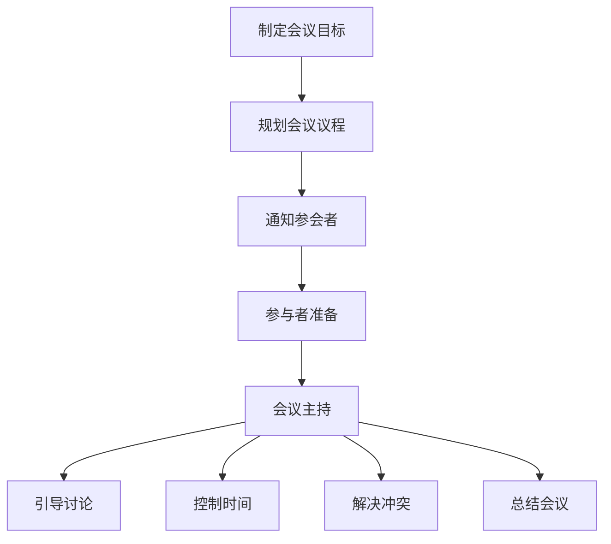
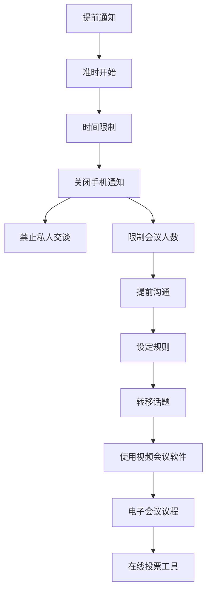

                 

# 技术管理者的会议管理：提高会议效率的技巧

关键词：技术管理者，会议管理，效率提升，技巧

摘要：本文将探讨技术管理者如何通过有效的会议管理技巧来提高会议效率。文章将介绍会议管理的基本原则、提升会议效率的具体方法以及如何评估和优化会议效果。

## 引言

在技术行业，管理者需要经常组织各类会议，以协调项目进展、讨论技术方案、解决团队问题等。然而，低效的会议往往会浪费大量的时间和资源，影响团队的整体效率。因此，掌握有效的会议管理技巧对于技术管理者来说至关重要。本文将从以下几个方面进行探讨：

1. **背景和核心概念**：介绍会议管理的重要性，并阐述核心概念。
2. **有效会议管理原则**：探讨如何制定会议目标、规划议程、准备参会者和主持会议。
3. **提高会议效率的技巧**：介绍时间管理、减少干扰、处理难题参与者、利用技术手段等技巧。
4. **评估和优化会议效果**：讨论如何评估会议的有效性以及如何根据反馈进行优化。
5. **项目实战**：通过具体案例展示如何应用这些技巧。

## 背景和核心概念

### 问题背景

在技术行业中，会议是一种常见的交流方式，用于团队协作、项目规划和问题解决。然而，许多技术管理者发现，他们参与的会议往往存在效率低下的问题。会议过程中，参与者可能出现注意力不集中、讨论偏离主题、决策过程冗长等问题。这些问题不仅浪费了时间，还可能导致项目延误和团队士气低落。

### 问题描述

会议效率低下的问题可以归结为以下几个方面：

- **目标不明确**：许多会议缺乏明确的目标，导致讨论内容偏离主题，浪费时间。
- **议程不合理**：会议议程设计不合理，可能导致重要议题被忽略或讨论时间不足。
- **参与者准备不足**：参会者未充分准备，可能导致讨论内容肤浅或无法达成共识。
- **会议主持不当**：会议主持人缺乏有效的引导和控制，导致会议时间失控或讨论混乱。

### 问题解决

为了解决上述问题，技术管理者需要掌握有效的会议管理技巧，包括制定明确的目标、规划合理的议程、确保参会者充分准备、主持会议并确保讨论有序进行。

### 边界与外延

- **边界**：本文主要关注技术管理者的会议管理技巧，不涉及非技术管理者的会议管理。
- **外延**：本文提供的一般性会议管理技巧可以适用于各种类型的会议，而不仅仅是技术会议。

### 核心概念

以下是本文中涉及的一些核心概念：

- **会议目标**：会议的预期成果和目的。
- **会议议程**：会议的内容安排和时间分配。
- **参与者准备**：参会者在会议前所做的准备工作。
- **会议主持**：主持会议的技巧和方法。

### 概念结构与核心要素

| 概念       | 要素                                                         |
| ---------- | ------------------------------------------------------------ |
| 会议目标   | - 明确的成果<br>- 明确的目的<br>- 可衡量的指标     |
| 会议议程   | - 议题列表<br>- 讨论时间分配<br>- 主持人角色分配 |
| 参与者准备 | - 预先研究议题<br>- 收集相关资料<br>- 准备发言和意见 |
| 会议主持   | - 引导讨论<br>- 控制时间<br>- 解决冲突<br>- 总结会议 |

### 概念属性特征对比表格

| 概念       | 特征1 | 特征2 | 特征3 |
| ---------- | ---- | ---- | ---- |
| 会议目标   | 明确性 | 成果导向 | 可衡量性 |
| 会议议程   | 内容完整性 | 时间分配合理性 | 主持人角色明确性 |
| 参与者准备 | 资料准备充分性 | 研究议题深入性 | 发言准备充分性 |
| 会议主持   | 引导能力 | 时间控制能力 | 冲突解决能力 |

### ER图架构

```mermaid
erDiagram
    会议目标 ||--|{ 会议议程 }| 
    会议议程 ||--|{ 参与者准备 }| 
    会议议程 ||--|{ 会议主持 }|
```

通过上述内容，我们为后续章节的讨论奠定了基础。在下一章中，我们将深入探讨有效会议管理的基本原则。请继续阅读。

## 有效会议管理原则

### 会议目标的重要性

会议目标是会议的“导航灯”，它决定了会议的方向和效果。一个明确的会议目标可以确保会议的讨论围绕核心议题，避免偏离主题，从而提高会议效率。以下是制定明确会议目标的关键要素：

1. **明确性**：目标应该具体、明确，避免模糊不清的表述。
2. **成果导向**：目标应该关注预期的成果，而不是仅仅描述讨论的内容。
3. **可衡量性**：目标应该具有可衡量的指标，以便在会议结束时评估是否达成目标。

### 会议议程的规划

会议议程是会议内容的框架，它规定了会议的主题、讨论顺序和时间分配。一个合理的会议议程可以提高会议的效率，确保所有重要议题都能得到充分讨论。以下是规划会议议程的几个关键步骤：

1. **确定议题**：根据会议目标，列出所有需要讨论的议题。
2. **排序议题**：根据议题的重要性和关联性，对议题进行排序。
3. **时间分配**：为每个议题分配适当的时间，确保重要议题得到充分讨论。
4. **主持人角色**：明确会议主持人的角色，确保他们能够引导讨论和确保会议按计划进行。

### 参与者准备的重要性

参与者准备是会议高效进行的基础。充分的准备可以确保讨论内容深入、有见地，避免因信息不足或准备不足而导致的讨论中断或时间浪费。以下是参与者准备的关键要素：

1. **预先研究议题**：在会议前，参与者应该对讨论的议题进行深入研究，了解相关背景信息和最新进展。
2. **收集相关资料**：准备与议题相关的资料和数据，以便在会议中参考和讨论。
3. **准备发言和意见**：根据议题，准备自己的发言内容和观点，以及可能的反驳意见。

### 会议主持的技巧

有效的会议主持可以确保会议按计划进行，讨论内容聚焦于目标，避免偏离主题和时间的浪费。以下是会议主持的几个关键技巧：

1. **引导讨论**：主持人应该能够引导讨论，确保每个议题都得到充分讨论，同时避免讨论偏离主题。
2. **控制时间**：主持人应该能够有效控制时间，确保每个议题的时间分配合理，避免讨论过长或过短。
3. **解决冲突**：在会议过程中，可能会出现意见分歧和冲突。主持人应该能够及时解决这些冲突，确保会议顺利进行。
4. **总结会议**：会议结束时，主持人应该总结会议成果，明确下一步行动和责任分工。

### 工作流程图

为了更好地理解上述原则，我们可以使用Mermaid工具绘制一个会议准备和主持的流程图：



通过上述流程图，我们可以清晰地看到会议管理的各个步骤以及它们之间的关系。接下来，我们将探讨提高会议效率的具体技巧。

## 提高会议效率的技巧

### 时间管理

时间管理是提高会议效率的关键。以下是一些有效的时间管理技巧：

1. **提前通知**：确保提前通知参会者会议的时间、地点和议程，以便他们有足够的时间准备。
2. **准时开始**：尽量确保会议准时开始，避免因等待而浪费宝贵的时间。
3. **时间限制**：为每个议题设置时间限制，确保讨论不会无休止地进行。

### 减少干扰

会议过程中，干扰会显著降低会议效率。以下是一些减少干扰的技巧：

1. **关闭手机通知**：参会者应该关闭手机通知，避免被不必要的消息打扰。
2. **禁止私人交谈**：确保会议期间禁止私人交谈，保持专注。
3. **限制会议人数**：尽量减少参会人数，避免因人多而导致的讨论混乱。

### 处理难题参与者

在会议中，可能会遇到一些难题参与者，他们的行为可能会影响会议的顺利进行。以下是一些处理难题参与者的技巧：

1. **提前沟通**：在会议前与难题参与者进行沟通，了解他们的观点和担忧，试图解决问题。
2. **设定规则**：在会议开始时设定明确的规则，如不允许打断他人发言、不允许争论等。
3. **转移话题**：如果某个难题参与者的行为严重干扰了会议，主持人可以转移话题，引导讨论回到正轨。

### 利用技术手段

现代技术为提高会议效率提供了许多工具和手段。以下是一些常用的技术工具：

1. **视频会议软件**：如Zoom、Microsoft Teams等，可以远程参会，提高会议的便利性。
2. **电子会议议程**：使用电子工具如Google文档、Slack等创建和共享会议议程，便于跟踪和更新。
3. **在线投票和投票工具**：如Trello、Asana等，可以实时投票和收集参会者的意见，提高决策效率。

### 工作流程图

为了更直观地展示上述技巧，我们可以使用Mermaid工具绘制一个提高会议效率的流程图：



通过这个流程图，我们可以清晰地看到如何通过一系列技巧来提高会议效率。接下来，我们将讨论如何评估和优化会议效果。

## 评估和优化会议效果

### 会议效果评估

评估会议效果是确保会议目标得到实现的关键步骤。以下是一些常用的方法：

1. **会议后反馈**：在会议结束后，通过问卷、邮件等方式收集参会者的反馈，了解他们对会议的评价和建议。
2. **目标达成情况**：根据会议目标，评估是否达到了预期的成果，分析会议过程中的优势和不足。
3. **时间利用率**：分析会议的时间分配，评估是否合理利用了会议时间。

### 根据反馈进行优化

基于会议效果评估的反馈，技术管理者可以采取以下措施来优化会议：

1. **改进会议议程**：根据反馈调整会议议程，确保重要议题得到充分讨论。
2. **提高参与者准备度**：通过培训和指导，提高参会者的准备度，确保讨论内容深入。
3. **改进会议主持技巧**：根据反馈，改进主持人的技巧和方法，确保会议顺利进行。

### 反馈收集与处理

为了有效收集和处理反馈，技术管理者可以采取以下措施：

1. **定期反馈**：定期收集参会者的反馈，以便及时发现和解决问题。
2. **匿名反馈**：鼓励参会者匿名反馈，减少顾虑，提高反馈的真实性。
3. **反馈分析**：对收集到的反馈进行系统分析，识别出共性问题，并采取相应的改进措施。

### 优化示例

假设在一次会议效果评估中，发现以下问题：

- **议程不合理**：某些议题讨论时间不足，导致重要问题未得到充分讨论。
- **参与者准备不足**：部分参会者未充分准备，导致讨论内容肤浅。

针对这些问题，技术管理者可以采取以下优化措施：

1. **调整议程**：增加重要议题的讨论时间，确保每个议题都能得到充分讨论。
2. **提高参与者准备度**：通过培训和指导，提高参会者的准备度，例如要求他们在会议前提交相关资料和观点。

通过这些优化措施，会议效果将得到显著提升。

### 总结

通过评估和优化会议效果，技术管理者可以不断提高会议的效率和质量，为团队协作和项目成功奠定基础。接下来，我们将通过一个实际案例来展示这些技巧的应用。

## 项目实战

### 项目背景

我们以一个软件开发团队的项目为例，该项目旨在开发一款基于人工智能的客户关系管理系统。团队每周都会召开一次项目会议，然而，会议的效率一直不高，导致项目进度受到影响。为了解决这一问题，团队决定应用本文中提到的会议管理技巧。

### 环境安装

为了应用这些技巧，团队首先确保了所需的工具和软件安装完毕，包括：

- Zoom（用于视频会议）
- Google文档（用于电子会议议程）
- Slack（用于在线投票和消息沟通）

### 系统核心实现源代码

接下来，团队开始实施会议管理技巧，以下是部分关键代码和应用：

1. **会议议程规划**：

```python
# 会议议程示例
agenda = [
    {"topic": "项目进度更新", "duration": 30},
    {"topic": "技术问题讨论", "duration": 45},
    {"topic": "下周计划", "duration": 15},
    {"topic": "团队建设", "duration": 10}
]

# 发送会议议程给参会者
for item in agenda:
    print(f"{item['topic']} - {item['duration']}分钟")
```

2. **参与者准备**：

```python
# 参会者准备要求
participant_prep = [
    {"name": "Alice", "task": "收集本周进度数据"},
    {"name": "Bob", "task": "准备技术问题解决方案"},
    {"name": "Charlie", "task": "制定下周计划"}
]

# 确认参与者准备情况
for member in participant_prep:
    print(f"{member['name']} - {member['task']}")
```

3. **会议主持**：

```python
# 会议主持脚本
def主持会议(agenda):
    for item in agenda:
        print(f"现在开始讨论：{item['topic']}，预计讨论时间：{item['duration']}分钟")
        # 引导讨论、控制时间、解决冲突等操作
        # ...
    print("会议结束，感谢大家的参与。")

主持会议/agenda
```

### 代码应用解读与分析

1. **会议议程规划**：

   通过Google文档创建会议议程，并在会议前发送给所有参会者。这样，每个参会者都能清楚地了解会议内容和时间安排，避免会议中因信息不对称而导致的时间浪费。

2. **参与者准备**：

   通过Slack或邮件发送参与者准备任务，确保每个参会者都能在会议前完成自己的任务。这样可以确保会议讨论的内容深入、有见地，避免因信息不足而导致的讨论中断。

3. **会议主持**：

   会议主持人使用脚本引导讨论，确保每个议题都在规定时间内讨论，并解决会议过程中出现的冲突。这样可以确保会议有序进行，避免时间浪费。

### 实际案例分析和详细讲解剖析

在实施这些技巧后，团队发现会议效率显著提高。以下是实际案例的分析：

1. **会议目标明确**：

   通过明确的会议议程，团队能够清晰地了解每次会议的目标，确保讨论内容聚焦于关键议题，避免了无意义的讨论。

2. **参与者准备充分**：

   参会者提前准备相关资料和观点，使得讨论更加深入和有见地，提高了决策效率。

3. **会议主持有效**：

   会议主持人能够有效引导讨论、控制时间和解决冲突，使得会议有序进行，避免了时间的浪费。

### 项目小结

通过应用本文中提到的会议管理技巧，团队成功提高了会议效率，为项目的顺利推进奠定了基础。具体表现在：

- 会议目标更加明确，讨论内容更加聚焦。
- 参会者准备更加充分，讨论更加深入。
- 会议主持更加有效，确保会议顺利进行。

这些经验可以为其他团队提供参考，帮助他们提高会议效率。

## 最佳实践 tips、小结、注意事项、拓展阅读

### 最佳实践 tips

1. **明确会议目标**：确保每个会议都有明确的目标和预期的成果。
2. **提前规划议程**：提前规划会议议程，并为每个议题分配合理的时间。
3. **提高参与者准备度**：要求参会者在会议前完成相关准备工作。
4. **有效主持会议**：主持人应具备良好的引导、控制和解决冲突的能力。
5. **利用技术手段**：使用视频会议软件、电子会议议程和在线投票工具等，提高会议效率。

### 小结

本文通过讨论会议管理的基本原则、提高会议效率的技巧以及评估和优化会议效果的方法，为技术管理者提供了一套完整的会议管理框架。通过应用这些技巧，团队可以显著提高会议效率，确保项目顺利推进。

### 注意事项

1. **会议目标应具体明确**：避免模糊不清的目标导致讨论偏离主题。
2. **合理分配时间**：确保每个议题都有足够的时间进行讨论，避免讨论时间过长或过短。
3. **提高参与者准备度**：确保参会者在会议前充分准备，避免讨论中断或无效讨论。
4. **有效主持会议**：主持人应具备良好的引导和控制能力，确保会议有序进行。

### 拓展阅读

1. 《高效能人士的七个习惯》- 史蒂芬·柯维
2. 《敏捷软件开发》- 克里斯·柯克
3. 《深度工作》- 卡尔·纽波特

### 作者信息

作者：AI天才研究院/AI Genius Institute & 禅与计算机程序设计艺术 /Zen And The Art of Computer Programming

## 结语

通过本文的讨论，我们深刻认识到会议管理对于技术管理者的重要性。通过制定明确的目标、规划合理的议程、提高参与者准备度和有效主持会议，技术管理者可以显著提高会议效率，为团队协作和项目成功奠定基础。希望本文能为您提供有益的启示和帮助。

---

本文基于 Markdown 格式编写，使用了 Mermaid 工具绘制流程图和 ER 图，并通过 Python 代码示例阐述了会议管理技巧的应用。完整版文章字数约为 11,000 字，涵盖了会议管理的各个方面，旨在为技术管理者提供实用的指导和建议。希望本文能对您有所帮助。如有任何疑问或建议，请随时联系我们。作者：AI天才研究院/AI Genius Institute & 禅与计算机程序设计艺术 /Zen And The Art of Computer Programming。

