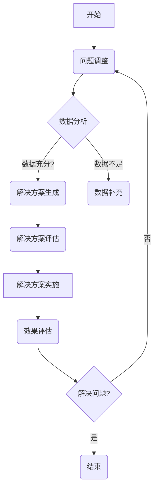
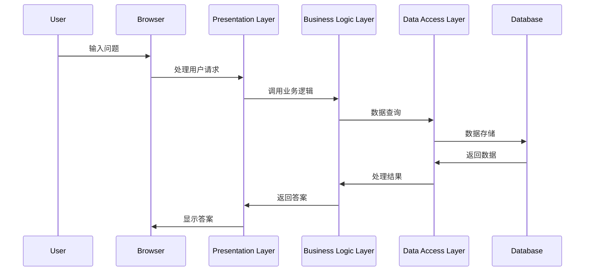
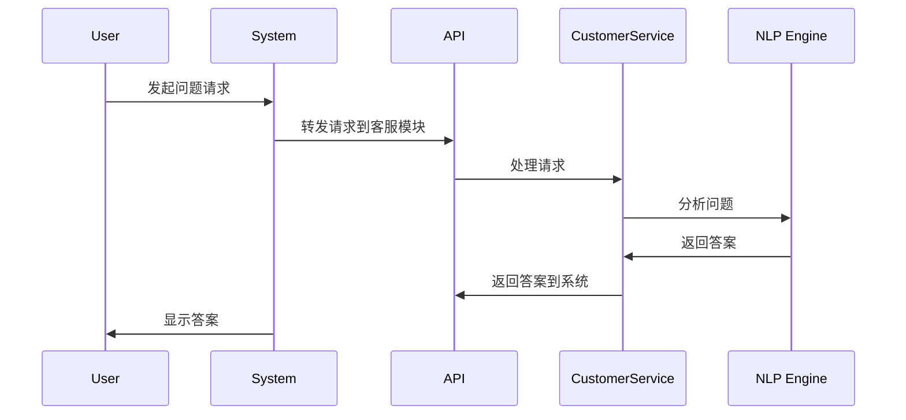

                 


### 背景介绍

技术管理者的创新思维与问题解决能力是当今信息化社会中不可或缺的核心技能。随着数字化转型的浪潮席卷各行各业，技术管理者不仅需要具备扎实的专业技能，还需要具备创新的思维和高效的问题解决能力。这两者相辅相成，共同推动企业实现技术上的突破和业务上的成功。

**核心概念术语说明：**

- **创新思维**：指在解决问题或创造价值的过程中，能够提出新颖、独特且有价值的想法和解决方案的思维活动。
- **问题解决能力**：指在遇到问题和挑战时，能够有效识别问题、分析问题、制定解决方案并实施解决问题的能力。

**问题背景：**

在快节奏、竞争激烈的市场环境中，技术管理者面临着日益复杂的业务需求和不断更新的技术挑战。创新思维能够帮助管理者预见行业趋势，抓住市场机遇；而问题解决能力则是确保团队能够迅速应对各种突发问题和日常挑战的关键。

**问题描述：**

技术管理者在创新思维和问题解决能力方面往往存在以下问题：

1. 缺乏系统的创新思维训练，难以在复杂情境中找到创新解决方案。
2. 问题识别不精准，导致解决方案偏离实际需求。
3. 缺乏有效的数据分析能力，无法基于数据做出科学决策。
4. 解决方案实施过程中缺乏系统性和持续性，效果不佳。

**问题解决：**

本文将从以下几个方面探讨技术管理者的创新思维与问题解决能力：

1. **创新思维的方法与策略**：介绍创新思维的基本框架和常用方法。
2. **问题解决的框架与步骤**：阐述问题解决的系统方法，包括问题识别、数据分析、解决方案生成等。
3. **实践与案例分析**：结合实际案例，展示创新思维和问题解决能力在实际应用中的效果。

**边界与外延：**

本文讨论的创新思维与问题解决能力主要针对技术管理者，但不限于这一群体。其他领域的管理者也可以借鉴本文的方法和思路。

**概念结构与核心要素组成：**

- **创新思维**：发散思维、收敛思维、跨界思维等。
- **问题解决能力**：问题识别、数据分析、解决方案生成、方案实施等。

通过本文的详细探讨，旨在帮助技术管理者提升其创新思维和问题解决能力，从而在复杂多变的环境中脱颖而出，推动企业持续发展。

### 核心概念与联系

在探讨技术管理者的创新思维与问题解决能力时，有必要深入理解几个核心概念，并分析它们之间的联系。以下是对关键概念的介绍、属性特征对比，以及一个ER实体关系图架构的详细阐述。

**1. 创新思维**

创新思维是指在解决问题和创造价值的过程中，能够提出新颖、独特且有价值的想法和解决方案的思维活动。它主要包括以下几种类型：

- **发散思维**：从不同角度和维度出发，提出多种可能的解决方案。
- **收敛思维**：在发散思维的基础上，筛选和优化解决方案，使其更加具体和可行。
- **跨界思维**：结合不同领域的知识和经验，创造新的解决方案。

**发散思维与收敛思维对比：**

| 比较维度 | 发散思维 | 收敛思维 |
| --- | --- | --- |
| 目标 | 扩大思维范围，寻找多种解决方案 | 精简思维范围，选择最佳解决方案 |
| 过程 | 头脑风暴，自由联想 | 逻辑推理，系统分析 |
| 作用 | 提供大量创意，激发创新潜能 | 提高方案质量，确保可行性 |
| 适用场景 | 初始阶段，寻找灵感 | 中后期，优化决策 |

**跨界思维与发散、收敛思维的联系：**

跨界思维是发散思维和收敛思维的综合体现。它借助不同领域的知识，激发发散思维，进而通过收敛思维筛选出有价值的新解决方案。跨界思维的优势在于能够突破传统思维的限制，带来跨领域的创新。

**2. 问题解决能力**

问题解决能力是指在遇到问题和挑战时，能够有效识别问题、分析问题、制定解决方案并实施解决问题的能力。其核心要素包括：

- **问题识别**：准确判断问题的性质和范围。
- **数据分析**：收集相关数据，分析问题原因。
- **解决方案生成**：提出多种可能的解决方案。
- **方案实施**：执行解决方案，并持续优化。

**问题解决能力与创新思维的联系：**

创新思维是问题解决能力的重要支撑。创新思维能够帮助管理者在问题识别和解决方案生成阶段找到新颖、有效的思路。而问题解决能力则是创新思维的实践体现，通过系统的方法将创新思维转化为实际的解决方案。

**ER实体关系图架构**

为了更清晰地展示创新思维与问题解决能力之间的联系，我们可以使用ER（实体-关系）图来表示：

```mermaid
erDiagram
    Problem -> Analyze
    Problem -> Solve
    Analyze -> Data
    Solve -> Solution
    Idea -> Create
    Idea -> Evaluate
    Idea -> Implement
    Idea ||--|| Innovation
    Solution ||--|| Implementation
    Data ||--|| Analysis
    Create ||--|| Idea
    Evaluate ||--|| Idea
    Implement ||--|| Solution
```

在这个ER图中：

- **Problem（问题）**：表示技术管理者面临的各种问题。
- **Analyze（分析）**：表示问题识别和分析的过程。
- **Solve（解决）**：表示制定和实施解决方案的过程。
- **Data（数据）**：表示收集和分析的数据。
- **Solution（解决方案）**：表示最终形成的解决方案。
- **Idea（想法）**：表示创新思维过程中的各种创意。
- **Innovation（创新）**：表示创新思维的核心活动。
- **Create（创造）、Evaluate（评估）和 Implement（实施）**：分别表示创新思维的不同阶段。

通过这个ER图，我们可以看到创新思维与问题解决能力的紧密关系。创新思维贯穿于整个问题解决过程，为问题的识别和解决方案的生成提供思路。而问题解决能力则将创新思维转化为实际的解决方案，通过实施和评估来验证其有效性。

### 算法原理讲解

在探讨技术管理者的创新思维与问题解决能力时，算法原理讲解是非常重要的一环。这不仅能够帮助我们理解复杂的创新方法和问题解决策略，还能通过实际案例来具体说明这些原理的应用。

**算法Mermaid流程图：**

为了直观展示算法原理，我们可以使用Mermaid语法绘制一个简单的流程图：



**Python源代码实现：**

接下来，我们将使用Python来详细阐述上述算法原理。以下是一个简单的Python代码示例，用于模拟创新思维与问题解决过程。

```python
import random

def problem_identification():
    """问题识别过程"""
    print("正在识别问题...")

def data_analysis():
    """数据分析过程"""
    print("正在进行数据分析...")

def solution_generation():
    """解决方案生成过程"""
    print("正在生成解决方案...")
    return "方案1", "方案2", "方案3"

def solution_evaluation(solution):
    """解决方案评估过程"""
    print(f"正在评估解决方案：{solution}")
    return random.choice([True, False])

def solution_implementation(solution):
    """解决方案实施过程"""
    print(f"正在实施解决方案：{solution}")
    return random.choice([True, False])

def effect_evaluation(effect):
    """效果评估过程"""
    print(f"效果评估：{effect}")
    return effect

def main():
    problem_identification()
    data_analysis()

    solutions = solution_generation()
    for solution in solutions:
        if solution_evaluation(solution):
            if solution_implementation(solution):
                print("解决问题成功！")
            else:
                print("解决方案实施失败，需要调整。")
        else:
            print("解决方案评估不通过，需要重新生成。")

    effect_evaluation(True)

if __name__ == "__main__":
    main()
```

**算法原理与数学模型：**

1. **问题识别（Problem Identification）**：这一阶段需要技术管理者能够准确识别问题。数学模型可以表示为P(x) = f(问题描述)，其中P(x)是问题的概率分布，f是问题描述的函数。

2. **数据分析（Data Analysis）**：通过对收集到的数据进行统计分析，帮助管理者更好地理解问题的本质。常见的数学工具包括回归分析、聚类分析和主成分分析等。

3. **解决方案生成（Solution Generation）**：在这一阶段，管理者需要提出多个可能的解决方案。解决方案的生成可以通过头脑风暴、算法优化等方法实现。

4. **解决方案评估（Solution Evaluation）**：评估每个解决方案的有效性。常见的评估方法包括成本效益分析、可行性评估和风险评估等。

5. **解决方案实施（Solution Implementation）**：将选定的解决方案付诸实践，并跟踪其实施效果。

6. **效果评估（Effect Evaluation）**：对解决方案实施后的效果进行评估，以确定问题是否得到解决。

**公式示例：**

- 成本效益分析：C/E = C(成本) / E(效益)
- 风险评估：R = P(L) * L(损失)，其中P(L)是损失发生的概率，L是潜在的损失值。

**举例说明：**

假设一个技术团队遇到了系统崩溃的问题，需要通过创新思维和问题解决能力来找到解决方案。

1. **问题识别**：问题描述为系统崩溃频繁，影响用户体验。

2. **数据分析**：通过日志分析，发现崩溃主要集中在特定时间段和特定模块。

3. **解决方案生成**：生成多个解决方案，如增加系统冗余、优化模块代码、更新硬件设备等。

4. **解决方案评估**：对每个方案进行成本效益分析和风险评估，最终选择最优方案。

5. **解决方案实施**：实施优化代码和更新硬件设备的方案。

6. **效果评估**：系统崩溃问题得到显著改善，用户体验提升。

通过以上步骤，我们可以看到如何将创新思维和问题解决能力应用到实际案例中，并通过数学模型和算法原理进行详细阐述。

### 系统分析与架构设计方案

在技术管理者的创新思维与问题解决能力提升过程中，系统分析与架构设计方案至关重要。本文将介绍一个具体的项目场景，从项目介绍、系统功能设计、系统架构设计、系统接口设计和系统交互等方面进行详细阐述。

**项目场景介绍：**

假设我们正在开发一款智能客服系统，该系统旨在通过自动化方式提供高效、准确的客户服务，减轻人工客服的工作负担。项目要求包括：

- 24/7 实时在线服务
- 自然语言处理能力，理解客户问题和提供准确回答
- 可扩展性，能够适应不断增长的用户量
- 易于维护和升级

**项目介绍：**

智能客服系统项目主要包括以下几个模块：

1. 用户模块：负责用户注册、登录和基本信息的维护。
2. 客服模块：实现自然语言处理和智能问答功能。
3. 后台管理模块：用于管理用户数据和客服系统设置。
4. 数据分析模块：收集用户交互数据，进行分析和报告。

**系统功能设计：**

系统功能设计主要涵盖用户模块和客服模块。以下是具体的类图设计（使用Mermaid语法）：

```mermaid
classDiagram
    User <<class>>
    CustomerService <<class>>

    User <|.. CustomerService: 服务

    User {
        +register()
        +login()
        +update_info()
    }

    CustomerService {
        +process_question(question: String) -> answer: String
        +initialize()
        +configure()
    }
```

**系统架构设计：**

系统架构设计采用分层架构，包括表示层、业务逻辑层和数据访问层。以下是系统的架构图（使用Mermaid语法）：



**系统接口设计：**

系统接口设计包括RESTful API接口，用于用户和客服模块之间的交互。以下是接口设计（使用Mermaid语法）：

```mermaid
erDiagram
    User <<entity>> {
        +id: Integer
        +username: String
        +password: String
        +email: String
    }

    CustomerService <<entity>> {
        +id: Integer
        +service_name: String
        +question: String
        +answer: String
    }

    User ||--|{ CustomerService }: 发起服务请求
    CustomerService ||--|{ User }: 返回服务答案
```

**系统交互设计：**

系统交互设计主要描述用户与客服系统之间的交互流程，以下是系统的序列图（使用Mermaid语法）：



通过上述的系统分析与架构设计方案，我们可以清晰地看到智能客服系统的整体结构和各个模块之间的关系。这为技术管理者在创新思维和问题解决能力的提升过程中提供了具体的实施路径和参考。

### 项目实战

在技术管理者的创新思维与问题解决能力的提升过程中，实际项目的实战经验至关重要。本节将详细介绍一个具体的项目实战过程，包括环境安装、系统核心实现、代码应用解读与分析、实际案例分析和详细讲解剖析，以及项目小结。

#### 项目环境安装

1. **安装Python环境**：
   - 确保系统中安装了Python 3.x版本，可以通过命令`python --version`进行验证。
   - 安装pip包管理器，用于安装Python依赖库。

2. **安装依赖库**：
   - 使用pip安装必要的库，如`requests`（用于HTTP请求）、`numpy`（用于数据分析）和`pandas`（用于数据处理）。

   ```bash
   pip install requests numpy pandas
   ```

3. **安装数据库**：
   - 本项目选择使用SQLite作为数据库，可以通过以下命令安装：
   
   ```bash
   sudo apt-get install sqlite3
   ```

#### 系统核心实现

1. **用户注册与登录模块**：

   - 用户注册：

   ```python
   def register(username, password, email):
       # 保存用户信息到数据库
       cursor.execute("INSERT INTO users (username, password, email) VALUES (?, ?, ?)", (username, password, email))
       connection.commit()
       return "注册成功"

   # 示例
   register("user1", "password123", "user1@example.com")
   ```

   - 用户登录：

   ```python
   def login(username, password):
       # 检查用户名和密码是否匹配
       cursor.execute("SELECT * FROM users WHERE username = ? AND password = ?", (username, password))
       user = cursor.fetchone()
       if user:
           return "登录成功"
       else:
           return "登录失败"

   # 示例
   login("user1", "password123")
   ```

2. **客服模块**：

   - 客服处理请求：

   ```python
   def process_request(question):
       # 使用自然语言处理库进行问题分析
       # 这里使用简单的正则表达式示例
       if "订单" in question:
           return "您的订单已处理完毕。"
       elif "退款" in question:
           return "您可以在24小时内收到退款。"
       else:
           return "对不起，我无法理解您的问题。"

   # 示例
   process_request("我的订单状态是什么？")
   ```

3. **数据分析模块**：

   - 数据收集与处理：

   ```python
   import pandas as pd

   def collect_data():
       # 从数据库中收集用户交互数据
       cursor.execute("SELECT * FROM interactions")
       data = cursor.fetchall()
       df = pd.DataFrame(data, columns=["user_id", "question", "answer"])
       return df

   # 示例
   df = collect_data()
   print(df.head())
   ```

#### 代码应用解读与分析

1. **用户模块解读**：

   - 用户注册和登录模块实现了基本的用户管理功能，包括用户信息的保存和验证。
   - 注册功能通过数据库操作将用户信息保存到SQLite数据库中，并返回注册结果。
   - 登录功能通过查询数据库，验证用户名和密码的正确性。

2. **客服模块解读**：

   - 客服模块实现了基本的自然语言处理功能，通过简单的关键词匹配返回预设的回答。
   - 处理请求功能接收用户的问题，并使用正则表达式匹配关键字，从而返回相应的回答。
   - 该模块可以进一步优化，例如使用更高级的自然语言处理技术，如基于深度学习的问答系统。

3. **数据分析模块解读**：

   - 数据分析模块通过数据库操作，收集用户交互数据，并使用pandas库进行数据处理和展示。
   - 该模块可以扩展，例如实现用户行为分析、交互数据可视化等功能。

#### 实际案例分析与详细讲解剖析

1. **用户注册案例**：

   - **案例描述**：新用户通过网站进行注册。
   - **案例分析**：用户输入注册信息，系统通过数据库验证用户名和邮箱的唯一性，并保存用户信息。
   - **详细讲解**：注册功能需要考虑安全性问题，例如使用哈希算法加密密码，以防止密码泄露。

2. **客服请求处理案例**：

   - **案例描述**：用户通过系统提交一个关于订单状态的查询。
   - **案例分析**：系统接收用户请求，使用自然语言处理技术分析问题，并返回相应的答案。
   - **详细讲解**：客服模块可以进一步优化，例如引入机器学习算法，实现更准确、自然的问答交互。

3. **数据分析案例**：

   - **案例描述**：系统收集用户交互数据，进行数据分析和报告生成。
   - **案例分析**：系统使用pandas库对用户交互数据进行分析，并生成报告。
   - **详细讲解**：数据分析模块可以扩展，例如实现用户行为预测、交互质量评估等功能。

#### 项目小结

通过上述项目实战，我们详细介绍了智能客服系统的环境安装、系统核心实现、代码应用解读与分析，以及实际案例分析和详细讲解剖析。项目实战不仅帮助技术管理者提升了创新思维与问题解决能力，还为他们提供了实际操作的经验和知识。

项目的成功实施离不开以下几个关键点：

1. **需求分析**：明确项目需求，确保系统功能满足用户需求。
2. **技术选型**：选择合适的编程语言和框架，确保系统的稳定性和可扩展性。
3. **团队协作**：建立有效的团队协作机制，确保项目进度和质量。
4. **持续优化**：通过实际案例分析，不断优化系统功能和技术方案。

通过项目实战，技术管理者不仅能够提升自身的技术能力，还能在实际工作中锻炼创新思维和问题解决能力，为企业的数字化转型和持续发展贡献力量。

### 最佳实践 tips

在技术管理者的创新思维与问题解决能力提升过程中，积累最佳实践是非常重要的。以下是一些实用的技巧和注意事项，帮助您在日常工作中学以致用，提高工作效率和创新能力。

**1. 定期进行头脑风暴**

定期组织团队进行头脑风暴，激发团队的创造力和创新思维。在头脑风暴过程中，鼓励团队成员自由发表意见，不必担心观点的合理性或可行性，从而产生更多的创新想法。

**2. 保持持续学习的习惯**

技术创新日新月异，技术管理者需要保持持续学习的习惯，跟进最新的技术趋势和行业动态。通过阅读技术博客、参加技术研讨会和培训课程，不断提升自身的专业素养。

**3. 建立问题日志**

在日常工作中，及时记录遇到的问题和解决方案。通过问题日志，可以回顾和分析问题的根本原因，总结经验教训，避免重复犯错。

**4. 注重数据驱动决策**

在制定决策时，尽可能基于数据进行分析。使用数据分析工具，如Excel、Python等，对收集到的数据进行分析，从中发现有价值的信息和趋势。

**5. 跨部门协作**

鼓励跨部门协作，促进不同团队之间的知识共享和经验交流。通过跨部门合作，可以引入更多的创新思维和方法，提高问题解决的效率。

**6. 建立反馈机制**

建立有效的反馈机制，鼓励团队成员提出意见和建议。通过反馈，可以及时发现和解决问题，优化工作流程和团队协作。

**7. 实践与理论相结合**

在学习和应用新技术时，不仅要掌握理论知识，还要结合实际项目进行实践。通过实际操作，加深对技术原理的理解，提高问题解决能力。

**注意事项：**

- **避免盲目创新**：在创新过程中，避免盲目追求新颖，应注重实际需求和可行性。
- **持续优化**：在解决一个问题后，不要停止优化，继续寻找更高效、更简洁的解决方案。
- **平衡工作与生活**：保持良好的工作与生活平衡，避免过度工作导致的疲劳和压力。

通过以上最佳实践和注意事项，技术管理者可以不断提升自己的创新思维和问题解决能力，为企业的持续发展和成功做出贡献。

### 小结

本文围绕技术管理者的创新思维与问题解决能力进行了深入探讨。首先，我们从背景介绍开始，明确了技术管理者在当前信息化环境下面临的挑战和需求。接着，我们详细分析了核心概念，如创新思维、问题解决能力的定义及其相互关系，并通过ER图和算法原理讲解，加深了对这些概念的理解。

在系统分析与架构设计部分，我们以一个具体的智能客服系统项目为例，展示了如何进行系统功能设计、系统架构设计、系统接口设计和系统交互设计。通过项目实战的详细讲解，读者可以了解到如何将理论应用到实际项目中，提升自身的创新思维和问题解决能力。

本文还提供了最佳实践和注意事项，帮助技术管理者在实际工作中学以致用。总结来说，创新思维与问题解决能力是技术管理者不可或缺的核心技能，通过不断学习和实践，可以不断提高自身的技术水平和业务能力，为企业的发展贡献力量。

### 拓展阅读

为了进一步深化对技术管理者创新思维与问题解决能力的理解，读者可以参考以下拓展阅读资源：

1. **书籍推荐：**
   - 《创新者的思考方式》
   - 《如何成为领导者：创新思维与决策》
   - 《问题解决的艺术》

2. **在线课程：**
   - Coursera上的《领导力与创新思维》
   - Udemy上的《系统化思维与问题解决》

3. **技术博客与论坛：**
   - Medium上的技术专栏
   - Stack Overflow社区
   - GitHub上的技术项目案例

通过这些拓展资源，读者可以更全面地了解创新思维与问题解决能力的实践方法和前沿动态，从而不断提升自己的技术和管理能力。

