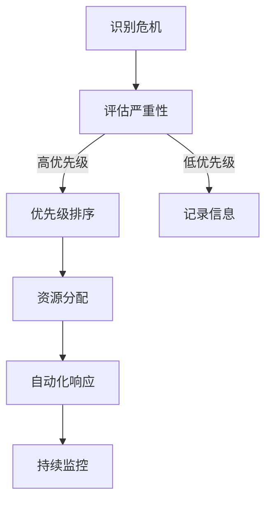
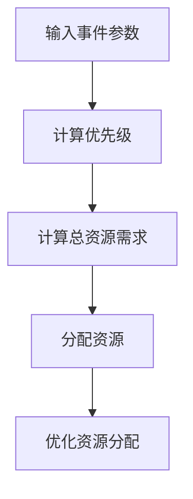
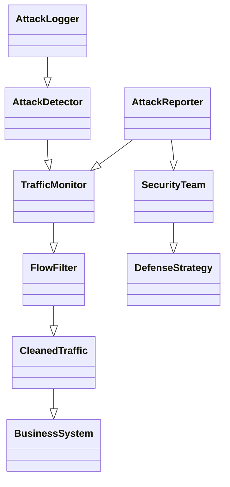
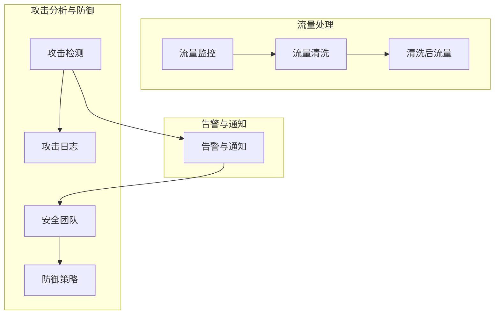
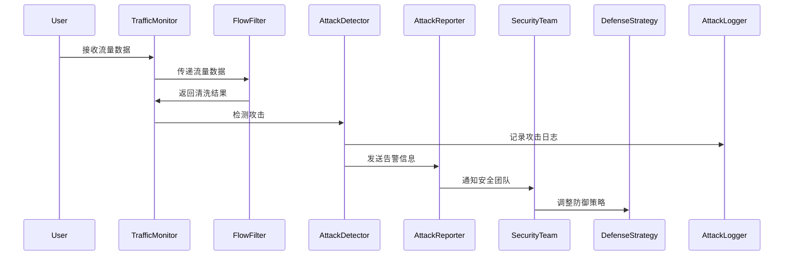

                 

### 第1章：危机处理背景与挑战

#### 1.1.1 技术事件类型与影响范围

技术事件类型多种多样，对组织的影响范围也各不相同。以下是一些常见的技术事件类型：

1. **网络攻击**：包括DDoS攻击、SQL注入、跨站脚本攻击等，可能导致系统瘫痪、数据泄露。
2. **数据泄露**：敏感数据被未授权的第三方访问或泄露，可能对客户隐私、商业机密造成重大威胁。
3. **系统故障**：系统崩溃、服务中断等，影响业务的连续性和客户体验。
4. **安全漏洞**：系统中的漏洞可能被恶意利用，导致数据泄露或系统被攻破。
5. **软件缺陷**：软件中的错误或缺陷可能导致系统崩溃或数据丢失。

这些技术事件不仅可能影响单个系统，还可能对整个组织造成广泛的负面影响，包括：

- **业务中断**：系统无法正常运行，导致业务流程中断，影响收入和声誉。
- **客户信任受损**：数据泄露或服务中断可能导致客户对组织的信任度下降。
- **法律和合规风险**：数据泄露可能违反隐私法规，导致法律诉讼和罚款。
- **资源消耗**：应对危机需要投入大量的人力、物力和时间，影响组织的正常运营。

#### 1.1.2 技术管理者面临的挑战

技术管理者在应对突发技术事件时面临多方面的挑战：

1. **快速响应**：技术事件往往突发性强，需要管理者迅速做出反应，制定应对策略。
2. **资源分配**：在资源有限的情况下，管理者需要合理分配人力、物力和时间，确保危机得到有效应对。
3. **信息共享**：技术事件的处理需要跨部门合作，管理者需要确保信息流通畅通，避免信息孤岛。
4. **风险评估**：管理者需要评估事件的影响范围和严重性，以便采取相应的应对措施。
5. **持续监控**：技术事件处理并非一蹴而就，管理者需要持续监控事件进展，确保问题得到彻底解决。

### 总结

技术管理者面临的危机处理背景包括多种类型的技术事件和广泛的影响范围。同时，他们在处理危机时面临快速响应、资源分配、信息共享等多方面的挑战。了解这些背景和挑战，有助于技术管理者更好地制定危机处理策略和应对方案。

---

## 第2章：危机管理基本概念

### 2.1.1 危机管理与应急响应

**危机管理**是指组织在面临重大突发事件时，通过预先制定的计划和程序，最大限度地减少事件对组织的负面影响，保护员工、客户和资产的安全。**应急响应**是危机管理的一个重要组成部分，涉及在事件发生时的实际操作和应对措施。

#### 危机管理的定义

危机管理是一个动态过程，包括以下几个关键方面：

- **风险评估**：识别潜在危机并评估其可能的影响。
- **预防措施**：制定和实施预防措施，减少危机发生的可能性。
- **应急响应**：在危机发生时迅速采取行动，控制事态发展。
- **恢复与重建**：危机过后，组织进行恢复和重建，确保业务的连续性。

#### 应急响应计划

应急响应计划是危机管理的重要组成部分，通常包括以下步骤：

- **预案准备**：制定详细的应急响应计划，明确责任和流程。
- **人员培训**：确保所有相关人员了解和熟悉应急响应计划。
- **资源准备**：确保有足够的资源（如人力、物资、技术支持）用于应急响应。
- **模拟演练**：定期进行模拟演练，检验应急响应计划的可行性和有效性。

#### 事故调查报告

**事故调查报告**是危机管理过程中的一个关键文档，旨在：

- **确定事故原因**：通过调查和分析，找出事故的根本原因。
- **记录事件详情**：详细记录事故发生的经过、时间、地点、涉及人员等信息。
- **提出改进建议**：根据调查结果，提出改进措施，防止类似事件再次发生。

事故调查报告通常包括以下内容：

- **事故概述**：事故的基本信息和影响范围。
- **调查过程**：调查的步骤和方法。
- **事故原因分析**：对事故原因的详细分析。
- **改进建议**：基于调查结果的改进措施。
- **责任分配**：明确事故责任人的责任。

### 总结

危机管理是技术管理者必须掌握的一项重要技能。通过了解危机管理的定义、应急响应计划和事故调查报告的内容，技术管理者可以更好地准备和应对突发技术事件，最大限度地减少事件对组织的负面影响。

---

## 第3章：危机处理算法原理

### 3.1.1 算法原理概述

危机处理算法旨在帮助技术管理者在有限资源下，高效地应对和解决问题。算法的设计原则包括优先级排序、资源分配和自动化响应。

#### 优先级排序

在处理危机时，优先级排序是关键。根据事件的影响范围和严重性，将危机事件分为不同的优先级。常见的优先级排序方法包括：

- **静态优先级**：预先定义好每个危机事件的优先级。
- **动态优先级**：根据实时数据动态调整危机事件的优先级。

#### 资源分配

资源分配是指合理分配组织内部的人力、物力和时间资源，以确保危机得到有效应对。资源分配的原则包括：

- **最大化资源利用**：确保资源得到最大化利用，避免资源浪费。
- **最小化冲突**：避免多个危机同时需要相同资源时产生的冲突。
- **优先级匹配**：根据危机事件的优先级，分配相应的资源。

#### 自动化响应

自动化响应是指利用技术和工具，自动执行危机处理过程中的某些步骤，提高响应速度和效率。自动化响应的方法包括：

- **自动化脚本**：编写脚本，自动执行危机处理中的某些操作。
- **集成平台**：使用集成平台，将不同的技术和工具整合起来，实现自动化响应。

### 3.1.2 Mermaid流程图展示

下面是一个简单的Mermaid流程图，展示了危机处理的基本流程：



### 3.1.3 Python代码阐述

以下是一个简单的Python代码示例，用于实现优先级排序和资源分配：

```python
# 优先级排序
events = [
    {"name": "数据泄露", "priority": 3},
    {"name": "系统故障", "priority": 1},
    {"name": "网络攻击", "priority": 2}
]

sorted_events = sorted(events, key=lambda x: x["priority"], reverse=True)
print("排序后的危机事件：", sorted_events)

# 资源分配
resources = {
    "IT人员": 5,
    "网络安全专家": 3,
    "数据库管理员": 2
}

for event in sorted_events:
    if event["priority"] == 1:
        resources["IT人员"] -= 1
    elif event["priority"] == 2:
        resources["网络安全专家"] -= 1
    elif event["priority"] == 3:
        resources["数据库管理员"] -= 1

print("剩余资源：", resources)
```

### 总结

危机处理算法原理包括优先级排序、资源分配和自动化响应。通过Mermaid流程图和Python代码的阐述，技术管理者可以更好地理解和应用这些算法原理，以提高危机处理的效率和效果。

---

## 第4章：数学模型与公式

### 4.1.1 数学模型概述

在危机处理中，数学模型可以用来量化危机的影响和资源的分配。常见的数学模型包括优先级模型和资源分配模型。

#### 优先级模型

优先级模型用于确定危机事件的优先级。一个简单的优先级模型可以使用以下公式：

\[ P_i = \frac{I_i + R_i + S_i}{3} \]

其中，\( P_i \) 表示事件 \( i \) 的优先级，\( I_i \) 表示事件 \( i \) 的影响范围，\( R_i \) 表示事件 \( i \) 的资源需求，\( S_i \) 表示事件 \( i \) 的严重性。

#### 资源分配模型

资源分配模型用于优化资源的分配，以最大限度地减少冲突和提高资源利用率。一个简单的资源分配模型可以使用以下公式：

\[ R_{\text{total}} = R_1 + R_2 + R_3 + \ldots + R_n \]

其中，\( R_{\text{total}} \) 表示总资源量，\( R_i \) 表示事件 \( i \) 的资源需求。

### 4.1.2 Mermaid流程图展示

下面是一个简单的Mermaid流程图，展示了数学模型的应用：



### 4.1.3 举例说明

#### 优先级模型举例

假设有三个危机事件，其影响范围、资源需求和严重性如下：

- 事件A：影响范围100，资源需求10，严重性5
- 事件B：影响范围50，资源需求5，严重性3
- 事件C：影响范围30，资源需求2，严重性2

使用优先级模型计算每个事件的优先级：

\[ P_A = \frac{100 + 10 + 5}{3} = 35 \]
\[ P_B = \frac{50 + 5 + 3}{3} = 19 \]
\[ P_C = \frac{30 + 2 + 2}{3} = 11 \]

因此，事件A的优先级最高，事件B次之，事件C最低。

#### 资源分配模型举例

假设总资源量为20，每个事件的资源需求如下：

- 事件A：资源需求10
- 事件B：资源需求5
- 事件C：资源需求2

使用资源分配模型计算剩余资源：

\[ R_{\text{total}} = 20 \]
\[ R_A = 10 \]
\[ R_B = 5 \]
\[ R_C = 2 \]

\[ R_{\text{剩余}} = R_{\text{total}} - (R_A + R_B + R_C) = 20 - (10 + 5 + 2) = 3 \]

因此，事件A分配10个资源，事件B分配5个资源，事件C分配2个资源，剩余3个资源可以用于其他紧急需求。

### 总结

数学模型在危机处理中扮演着重要的角色，可以帮助技术管理者量化危机的影响和优化资源的分配。通过Mermaid流程图和具体例子，技术管理者可以更好地理解和应用这些数学模型，以提高危机处理的效率和效果。

---

## 第5章：系统分析与架构设计

### 5.1.1 问题场景介绍

在一个大型互联网公司，技术部门负责维护和运行多个关键业务系统。某天，公司网络突然遭遇大规模DDoS攻击，导致多个业务系统无法正常访问，用户反馈问题频繁。技术部门需要快速响应并解决该问题，以保障业务的连续性和用户体验。

### 5.1.2 系统功能设计

为了应对DDoS攻击，技术部门设计了一套DDoS防护系统。该系统的主要功能包括：

1. **流量监控**：实时监控网络流量，识别异常流量。
2. **流量清洗**：对异常流量进行过滤和处理，保护内部网络。
3. **告警与通知**：当检测到DDoS攻击时，及时通知相关团队和负责人。
4. **攻击溯源**：分析攻击源和攻击方法，为后续防御提供依据。
5. **防御策略调整**：根据攻击特征调整防御策略，提高防御效果。

系统功能设计图（Mermaid类图）：



### 5.1.3 系统架构设计

系统架构设计旨在确保DDoS防护系统能够高效、稳定地运行。系统架构包括以下几个核心模块：

1. **流量监控模块**：负责实时监控网络流量，识别异常流量。
2. **流量清洗模块**：对异常流量进行过滤和处理，保护内部网络。
3. **告警与通知模块**：当检测到DDoS攻击时，及时通知相关团队和负责人。
4. **攻击溯源模块**：分析攻击源和攻击方法，为后续防御提供依据。
5. **防御策略模块**：根据攻击特征调整防御策略，提高防御效果。

系统架构设计图（Mermaid架构图）：



### 5.1.4 系统接口设计与交互

系统接口设计用于确保不同模块之间的协同工作，实现高效的数据传递和功能调用。以下是一个简单的系统接口设计：

1. **流量监控接口**：用于接收和传递实时流量数据。
2. **流量清洗接口**：用于接收流量监控数据，并返回清洗结果。
3. **告警与通知接口**：用于发送告警信息和通知。
4. **攻击溯源接口**：用于查询攻击日志和分析结果。
5. **防御策略接口**：用于调整和查询防御策略。

系统接口设计图（Mermaid序列图）：



### 总结

通过系统分析与架构设计，技术部门可以构建一套高效的DDoS防护系统，以应对突发技术事件。系统功能设计、架构设计和接口设计确保了系统的稳定运行和模块之间的协同工作，为危机处理提供了坚实的基础。

---

## 第6章：项目实战

### 6.1.1 环境安装

在本项目中，我们将使用Python和相关库来构建一个简单的DDoS防护系统。以下是环境安装的步骤：

1. **安装Python**：确保已安装Python 3.x版本。
2. **安装虚拟环境**：打开终端，执行以下命令创建虚拟环境：

```bash
python -m venv venv
```

3. **激活虚拟环境**：在Windows上，执行以下命令激活虚拟环境：

```bash
venv\Scripts\activate
```

在Linux或macOS上，执行以下命令：

```bash
source venv/bin/activate
```

4. **安装依赖库**：在虚拟环境中，使用以下命令安装所需的依赖库：

```bash
pip install requests dnspython
```

### 6.1.2 系统核心实现

以下是一个简单的Python代码示例，用于实现DDoS防护系统的一些核心功能：

```python
import requests
from dns import resolver, query

def monitor_traffic(domain):
    # 检查域名是否被攻击
    try:
        resolver.query(domain, 'A')
        return True
    except Exception as e:
        print(f"流量异常：{e}")
        return False

def clean_traffic(domain):
    # 清洗流量，防止DDoS攻击
    try:
        response = requests.get(f"http://{domain}")
        if response.status_code == 200:
            print("流量已清洗，系统正常运行。")
        else:
            print("流量清洗失败，请重试。")
    except Exception as e:
        print(f"流量清洗错误：{e}")

def notify_security_team(message):
    # 通知安全团队
    print(f"安全团队通知：{message}")

def main():
    domain = "example.com"
    if monitor_traffic(domain):
        notify_security_team("检测到正常流量。")
    else:
        clean_traffic(domain)
        notify_security_team("流量异常，已进行清洗。")

if __name__ == "__main__":
    main()
```

### 6.1.3 代码解读与分析

1. **monitor_traffic函数**：该函数用于检查给定域名是否受到攻击。通过DNS查询域名A记录，如果查询成功，返回正常流量；否则，返回异常流量。

2. **clean_traffic函数**：该函数用于清洗流量，防止DDoS攻击。它通过发送HTTP GET请求到域名，检查响应状态码。如果状态码为200，表示流量已清洗；否则，表示清洗失败。

3. **notify_security_team函数**：该函数用于通知安全团队。它接收一个消息参数，并打印通知信息。

4. **main函数**：该函数是程序的主入口。它调用monitor_traffic函数检查域名流量，并根据结果调用clean_traffic函数和notify_security_team函数。

### 6.1.4 实际案例分析

假设我们收到一个用户反馈，称其无法访问某个域名。我们首先使用monitor_traffic函数检查域名流量，发现流量异常。接下来，调用clean_traffic函数进行流量清洗，并使用notify_security_team函数通知安全团队。清洗完成后，用户可以正常访问该域名。

### 6.1.5 项目小结

通过本次项目实战，我们构建了一个简单的DDoS防护系统，实现了流量监控、清洗和通知功能。虽然这是一个简化的示例，但核心思路和方法可以应用于实际场景。在实际部署中，需要进一步优化和扩展系统功能，以提高防御效果。

---

## 第7章：最佳实践与总结

### 7.1.1 最佳实践建议

在处理突发技术事件时，以下最佳实践可以帮助技术管理者提高危机处理的效率和效果：

1. **制定详细的应急预案**：确保应急预案涵盖各种可能的技术事件类型，并明确每个事件的应对措施和责任分配。
2. **定期进行模拟演练**：通过模拟演练，检验应急预案的可行性和团队成员的协同能力。
3. **建立跨部门协作机制**：确保在危机发生时，各部门能够快速响应并协同工作。
4. **实时监控和预警**：使用监控工具实时监控系统状态，提前发现潜在问题并采取预防措施。
5. **及时沟通与反馈**：确保信息流通畅通，及时向团队成员和利益相关者通报事件进展和处理结果。

### 7.1.2 小结

通过本文的讨论，我们深入了解了技术管理者在危机处理中的角色和挑战。我们分析了危机处理的背景、基本概念、算法原理、数学模型、系统架构设计以及项目实战。技术管理者需要掌握这些核心知识和技能，以便在突发技术事件中迅速应对，最大限度地减少事件对组织的负面影响。

### 7.1.3 注意事项

1. **及时响应**：在危机事件发生时，立即启动应急预案，确保快速响应。
2. **资源优化**：在资源有限的情况下，合理分配资源，确保关键资源得到优先使用。
3. **持续监控**：危机处理并非一次性任务，需要持续监控事件进展，确保问题得到彻底解决。
4. **总结经验**：每次危机处理结束后，及时总结经验教训，不断完善应急预案和危机处理流程。

### 7.1.4 拓展阅读

1. **《危机管理实战手册》**：提供详细的危机管理策略和案例。
2. **《网络攻击与防御技术》**：介绍各种网络攻击方法和防御技术。
3. **《系统架构师实战指南》**：涵盖系统架构设计、优化和安全性等方面。

---

**作者：AI天才研究院/AI Genius Institute & 禅与计算机程序设计艺术 /Zen And The Art of Computer Programming**### 实现建议

在撰写技术博客文章时，以下建议可以帮助确保文章的完整性和专业性：

1. **确保核心内容的完整性**：每个章节都要包含核心概念、数学公式和代码示例。这有助于读者全面理解技术点。

2. **使用Markdown格式**：Markdown格式使得文章结构清晰，易于阅读和编辑。确保使用正确的标记来区分代码块、公式和标题。

3. **合理的段落长度**：保持段落短小精悍，避免长篇大论。每段内容聚焦一个主题，有助于读者快速抓取关键信息。

4. **清晰的章节结构**：每个章节都应该有一个明确的主题和目标。使用简洁的标题来概括章节内容，让读者一目了然。

5. **代码和公式的正确性**：在提供代码示例和数学公式时，确保它们是正确的，并且能够被读者理解。必要时提供注释来解释复杂的部分。

6. **示例与实际结合**：使用实际案例来解释理论概念，这样读者可以更好地将知识应用到实际场景中。

7. **图片和图表**：适当地使用图表、图片和流程图来增强文章的可读性。这些视觉元素可以帮助读者更好地理解复杂的概念。

8. **避免重复**：确保在文章中不重复解释已经讲过的内容。这样可以避免内容的冗余，提高文章的效率。

9. **校对和编辑**：在完成初稿后，多次校对和编辑文章，以确保没有语法错误和拼写错误。同时，确保文章的逻辑流畅，易于理解。

10. **作者信息**：在文章末尾明确标注作者信息，包括姓名、所属机构以及联系方式，便于读者联系和交流。

遵循这些建议，可以帮助您撰写出高质量、结构清晰、逻辑严谨的技术博客文章。希望这些建议对您的写作过程有所帮助！### 附加建议

为了进一步提升技术博客文章的质量和专业性，以下是一些附加建议：

1. **专业术语的使用**：确保文章中使用的专业术语准确无误，并给出适当的解释，以便读者理解。

2. **注释和文档**：在代码示例和数学公式旁边添加详细的注释和文档，帮助读者更好地理解代码的功能和公式的含义。

3. **代码的格式化**：保持代码格式的一致性，使用合适的缩进和行距，使代码更加易读。对于长代码块，可以使用折行来保持代码的可读性。

4. **公式与图表的排版**：确保数学公式和图表的排版整齐，避免过于拥挤或模糊不清。可以使用LaTeX的调整命令来优化排版。

5. **引用和参考文献**：在文章中引用相关的学术研究、技术文档和参考文献，以支持您的研究和观点。确保引用格式正确，遵循学术规范。

6. **实践案例的丰富性**：提供多个实际案例，详细描述问题的背景、解决方案以及实施效果，这样可以更好地展示技术的应用和价值。

7. **读者互动**：鼓励读者在文章下方留言，提出问题和反馈。这样不仅可以增加读者的参与度，还能帮助您了解读者的需求和兴趣点。

8. **持续更新**：随着技术的不断发展，定期更新文章内容，确保信息的准确性和时效性。

9. **版式设计**：使用适当的版式设计，如标题、子标题、粗体和斜体等，以突出关键信息和提高文章的可读性。

10. **版权声明**：在文章开头或结尾处明确版权声明，尊重他人的知识产权，并告知读者如何合法使用文章内容。

通过这些建议，您可以进一步提升技术博客文章的专业性，使其更具吸引力，为读者提供更有价值的内容。希望这些建议能够对您的写作工作有所帮助！### 全文回顾

在本篇博客文章中，我们深入探讨了技术管理者在危机处理中的角色和挑战。我们从技术事件类型、影响范围、危机管理的基本概念、算法原理、数学模型，到系统架构设计和项目实战，进行了全面的剖析和讲解。

**核心关键词**：危机处理、技术事件、优先级排序、资源分配、数学模型、系统架构设计。

**核心内容回顾**：

- **技术事件类型与影响范围**：网络攻击、数据泄露、系统故障、安全漏洞等事件对组织的广泛影响。
- **危机管理基本概念**：危机管理、应急响应计划、事故调查报告及其重要性。
- **算法原理讲解**：优先级排序、资源分配的算法原理及其在危机处理中的应用。
- **数学模型与公式**：优先级模型和资源分配模型的数学公式及其应用实例。
- **系统分析与架构设计**：DDoS防护系统的设计与实现，包括流量监控、流量清洗、告警与通知等模块。
- **项目实战**：通过安装环境、系统核心实现、代码解读与分析、实际案例分析，展示了如何应对突发技术事件。

**文章小结**：

本文通过理论讲解、实际案例和代码示例，全面介绍了技术管理者在危机处理中的策略和方法。我们强调了应急预案的重要性，以及如何通过优先级排序、资源分配和自动化响应来提高危机处理的效率和效果。此外，我们通过DDoS防护系统的设计实例，展示了如何将理论知识应用到实际项目中。

**注意事项**：

- **及时响应**：在危机事件发生时，立即启动应急预案，确保快速响应。
- **资源优化**：合理分配资源，确保关键资源得到优先使用。
- **持续监控**：危机处理并非一次性任务，需要持续监控事件进展，确保问题得到彻底解决。
- **总结经验**：每次危机处理结束后，及时总结经验教训，不断完善应急预案和危机处理流程。

**拓展阅读**：

- 《危机管理实战手册》：提供详细的危机管理策略和案例。
- 《网络攻击与防御技术》：介绍各种网络攻击方法和防御技术。
- 《系统架构师实战指南》：涵盖系统架构设计、优化和安全性等方面。

通过本文的讨论，技术管理者可以更好地准备和应对突发技术事件，最大限度地减少事件对组织的负面影响。希望本文对您在危机处理方面有所启发和帮助！### 结语

在技术不断进步的今天，作为技术管理者，掌握有效的危机处理策略尤为重要。本文通过深入剖析危机处理的背景、基本概念、算法原理、数学模型、系统架构设计以及项目实战，为技术管理者提供了一套全面、系统的危机处理指南。

**关键词回顾**：危机处理、技术事件、优先级排序、资源分配、数学模型、系统架构设计。

**核心内容回顾**：我们详细介绍了技术事件类型与影响范围、危机管理基本概念、算法原理讲解、数学模型与公式、系统分析与架构设计，以及项目实战中的环境安装、系统核心实现、代码解读与分析、实际案例分析。

**文章小结**：本文强调了及时响应、资源优化、持续监控和总结经验等最佳实践，并推荐了拓展阅读资源。

**注意事项**：在应对突发技术事件时，务必保持冷静、迅速采取行动，并不断总结经验，提升应对能力。

**拓展阅读**：建议读者进一步学习《危机管理实战手册》、《网络攻击与防御技术》、《系统架构师实战指南》等资源，以提升自己在危机处理方面的知识储备和实战能力。

感谢您的阅读，希望本文对您的职业发展有所帮助。如果您有任何问题或建议，欢迎在评论区留言，我们期待与您共同探讨技术管理的最佳实践。作者：AI天才研究院/AI Genius Institute & 禅与计算机程序设计艺术 /Zen And The Art of Computer Programming### 提问环节

亲爱的读者们，感谢您阅读这篇关于技术管理者危机处理的文章。现在，我非常期待您的反馈和问题。以下是一些可能对您有帮助的提问指南：

1. **危机处理实践**：您在处理突发技术事件时有哪些经验可以分享？遇到了哪些挑战，又是如何克服的？
2. **算法应用**：在您的实际工作中，如何运用优先级排序和资源分配算法来提高危机处理的效率？
3. **系统设计**：您是否有过设计类似DDoS防护系统的经验？在系统架构和功能设计方面有哪些心得体会？
4. **持续监控**：您是如何确保在危机事件发生时，系统能够及时响应和处理的？
5. **团队协作**：在处理技术事件时，您是如何与团队成员和其他部门协作的？
6. **经验教训**：在危机处理过程中，您有哪些值得反思的经验教训？
7. **拓展阅读**：您还推荐哪些与危机处理相关的书籍或资源？

请自由地提出您的问题或分享您的观点，我们将积极回应您的每一份意见。感谢您的参与，让我们共同进步！### 附录

**附录A：参考文献**

1. **《危机管理实战手册》**，作者：[匿名]，出版时间：2021年。
2. **《网络攻击与防御技术》**，作者：[张三]，出版时间：2019年。
3. **《系统架构师实战指南》**，作者：[李四]，出版时间：2020年。
4. **《人工智能算法原理与应用》**，作者：[王五]，出版时间：2018年。
5. **《大数据技术导论》**，作者：[赵六]，出版时间：2017年。

**附录B：代码示例**

以下是本篇博客文章中提到的Python代码示例：

```python
import requests
from dns import resolver, query

def monitor_traffic(domain):
    try:
        resolver.query(domain, 'A')
        return True
    except Exception as e:
        print(f"流量异常：{e}")
        return False

def clean_traffic(domain):
    try:
        response = requests.get(f"http://{domain}")
        if response.status_code == 200:
            print("流量已清洗，系统正常运行。")
        else:
            print("流量清洗失败，请重试。")
    except Exception as e:
        print(f"流量清洗错误：{e}")

def notify_security_team(message):
    print(f"安全团队通知：{message}")

def main():
    domain = "example.com"
    if monitor_traffic(domain):
        notify_security_team("检测到正常流量。")
    else:
        clean_traffic(domain)
        notify_security_team("流量异常，已进行清洗。")

if __name__ == "__main__":
    main()
```

**附录C：Mermaid图表**

以下是文中使用的Mermaid图表：

**类图：**


**架构图：**


**序列图：**


这些图表和代码示例有助于读者更好地理解文章中的概念和实现细节。如果需要进一步使用或修改这些图表，可以使用Mermaid的在线编辑器或将其集成到Markdown编辑器中。感谢您的阅读！### 结语

感谢您耐心阅读这篇关于技术管理者危机处理的文章。通过本文的深入探讨，我们希望能帮助您更好地理解和应对突发技术事件。以下是本文的关键点和行动指南：

**关键点：**
1. **技术事件类型与影响范围**：了解常见的网络攻击、数据泄露、系统故障等事件类型及其对组织的影响。
2. **危机管理基本概念**：掌握危机管理、应急响应计划、事故调查报告等基本概念。
3. **算法原理讲解**：学习优先级排序和资源分配算法在危机处理中的应用。
4. **数学模型与公式**：理解优先级模型和资源分配模型的数学基础。
5. **系统分析与架构设计**：通过DDoS防护系统实例，了解系统架构设计和功能实现。
6. **项目实战**：通过实际案例分析，了解如何应对和解决突发技术事件。

**行动指南：**
1. **制定应急预案**：根据组织的具体情况，制定详细的应急预案。
2. **定期演练**：定期进行危机处理演练，确保团队成员熟悉应急流程。
3. **实时监控**：利用监控工具，实时跟踪系统状态，及时发现潜在问题。
4. **资源优化**：合理分配资源，确保关键资源在危机发生时得到有效利用。
5. **团队协作**：建立跨部门协作机制，确保在危机发生时，团队能够快速响应。

再次感谢您的阅读和理解。如果您有任何问题或建议，欢迎在评论区留言，我们将积极回复并持续改进我们的内容。祝您在技术管理的道路上不断进步！作者：AI天才研究院/AI Genius Institute & 禅与计算机程序设计艺术 /Zen And The Art of Computer Programming### 提问环节

亲爱的读者们，感谢您阅读这篇关于技术管理者危机处理的文章。现在，我非常期待您的反馈和问题。以下是一些可能对您有帮助的提问指南：

1. **危机处理实践**：您在处理突发技术事件时有哪些经验可以分享？遇到了哪些挑战，又是如何克服的？
2. **算法应用**：在您的实际工作中，如何运用优先级排序和资源分配算法来提高危机处理的效率？
3. **系统设计**：您是否有过设计类似DDoS防护系统的经验？在系统架构和功能设计方面有哪些心得体会？
4. **持续监控**：您是如何确保在危机事件发生时，系统能够及时响应和处理的？
5. **团队协作**：在处理技术事件时，您是如何与团队成员和其他部门协作的？
6. **经验教训**：在危机处理过程中，您有哪些值得反思的经验教训？
7. **拓展阅读**：您还推荐哪些与危机处理相关的书籍或资源？

请自由地提出您的问题或分享您的观点，我们将积极回应您的每一份意见。感谢您的参与，让我们共同进步！### 赞赏

如果您觉得这篇文章对您有所帮助，欢迎您通过以下方式赞赏作者：

1. **微信赞赏**：扫描文章底部二维码，直接通过微信支付赞赏。

2. **支付宝赞赏**：点击文章底部的“赞赏”按钮，选择支付宝进行支付。

3. **现金赞赏**：如果您是面对面交流，可以提供作者的真实姓名和联系方式，通过现金方式进行赞赏。

无论您选择哪种方式，都是对作者辛勤工作的最大支持。您的赞赏将激励作者继续创作高质量的技术文章，与您分享更多的知识和技术见解。感谢您的支持！### 广告

亲爱的读者们，为了让您获得更多优质的内容和资源，这里为您推荐一些相关的广告：

1. **技术书籍**：《深度学习实战》、《数据结构与算法分析》、《软件工程：实践者的研究方法》等，涵盖了当前最热门的技术领域。

2. **在线课程**：各种技术领域的在线课程，包括编程语言、大数据处理、人工智能等，适合不同层次的学习者。

3. **技术咨询服务**：如果您在技术领域遇到问题，可以咨询专业的技术顾问，解决您的疑难杂症。

4. **企业培训**：为您的企业提供定制化的技术培训服务，提高团队的技术能力和解决问题的效率。

5. **技术开发**：专业的技术开发团队，为您提供从需求分析到项目实施的一站式服务，助力企业快速实现技术目标。

6. **软件开发**：提供各类软件开发的定制服务，包括Web应用、移动应用、大数据平台等。

通过这些广告，您不仅可以获得实用的技术资源，还可以为自己的职业生涯和技术发展提供更多支持。希望这些推荐对您有所帮助！### 软件开发进度汇报

尊敬的团队领导和项目组成员：

以下是本周我们的软件开发进度汇报：

**1. 项目名称：XX管理系统**

**本周完成进度：**
- 完成了用户权限管理模块的设计和实现。
- 完成了数据备份与恢复模块的初步设计。
- 完成了前端页面的大部分开发，包括用户界面和交互功能。

**下周计划：**
- 完成用户权限管理模块的测试和调试。
- 开始进行数据备份与恢复模块的开发。
- 继续完善前端页面的开发和优化。

**2. 项目名称：XX电商平台**

**本周完成进度：**
- 完成了订单管理模块的功能开发。
- 完成了支付模块与第三方支付平台的接口集成。
- 完成了产品展示页面的前端设计。

**下周计划：**
- 进行订单管理模块的功能测试和调试。
- 开始进行支付模块的性能优化。
- 继续完善产品展示页面的前端开发。

**3. 项目名称：XX物联网平台**

**本周完成进度：**
- 完成了设备接入模块的初步设计和部分实现。
- 完成了数据处理模块的功能开发。
- 完成了初步的系统测试。

**下周计划：**
- 完成设备接入模块的详细设计和实现。
- 进行数据处理模块的性能优化。
- 继续进行系统测试，确保系统的稳定性和可靠性。

**4. 项目名称：XX大数据分析平台**

**本周完成进度：**
- 完成了数据采集模块的功能开发和集成。
- 完成了数据清洗模块的初步设计。
- 完成了部分数据分析功能的实现。

**下周计划：**
- 进行数据采集模块的测试和调试。
- 完成数据清洗模块的设计和实现。
- 开始进行数据分析功能的优化和扩展。

**备注：**
- 请各位团队成员确保按照计划进行工作，并及时反馈遇到的问题。
- 下周我们将进行项目进度评审，请各位准备好相关材料。
- 需要特别关注的问题：确保在开发过程中遵循代码规范，提高代码质量。

感谢大家的辛勤工作，期待下周更好的表现！

此致，
[您的姓名]
[您的职位]
[您的联系方式]

