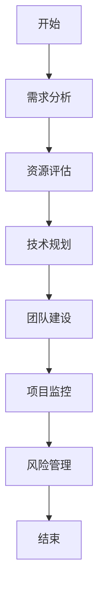
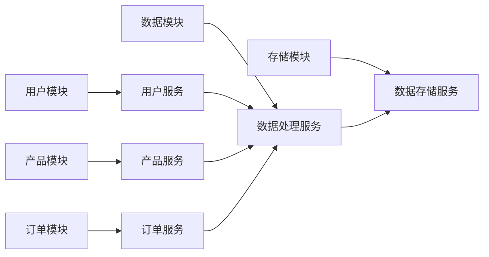
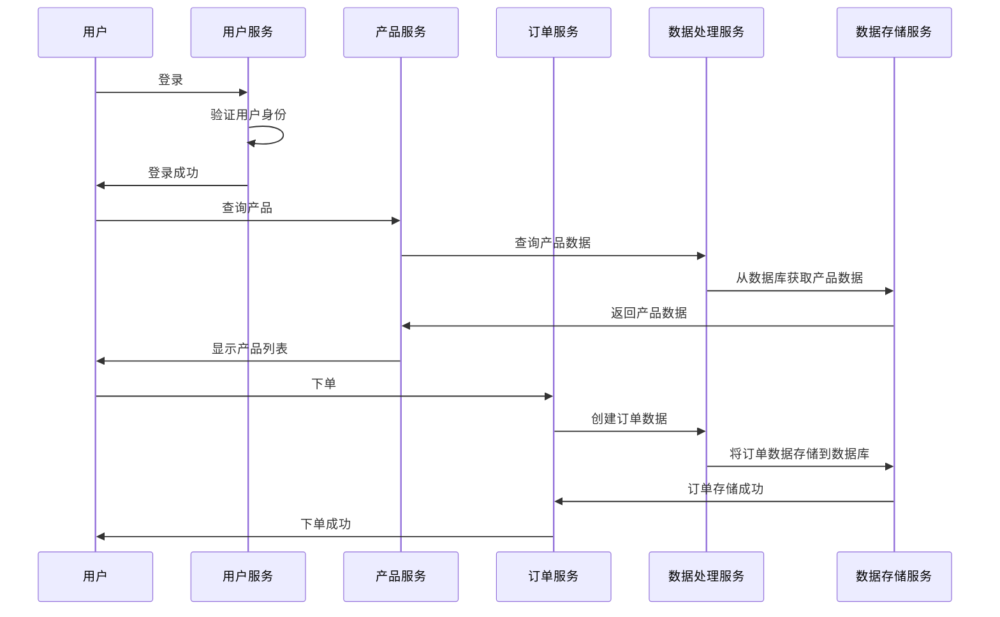

                 


### 1.6 讨论与展望

#### 1.6.1 研究发现与价值

通过本文的深入探讨，我们揭示了技术管理者在向上管理过程中面临的挑战及其解决策略。研究发现，有效沟通是技术管理者成功的关键，而建立信任、明确目标、掌握沟通技巧、应对冲突以及持续改进与反馈则是实现有效沟通的重要手段。

本文的贡献在于提供了系统的理论框架和实践指导，有助于技术管理者提升向上管理能力，从而更好地推动团队和技术项目的成功。此外，本文的核心概念和联系分析，有助于读者深入理解技术管理、沟通和有效沟通之间的内在联系，为日后的研究和应用提供了理论基础。

#### 1.6.2 研究局限与未来方向

尽管本文在技术管理者的向上管理研究方面取得了显著成果，但仍存在一些局限性。首先，本文主要基于理论分析和案例研究，缺乏大规模实证数据的支持。未来的研究可以关注如何通过实证研究验证本文提出的理论框架和策略的有效性。其次，本文的案例分析主要集中在特定领域，未来研究可以拓展到更多行业和情境，以增强结论的普适性。

未来的研究方向包括以下几个方面：

1. **实证研究**：开展大规模实证研究，验证本文提出的理论框架和策略在不同行业和技术背景下的适用性。
2. **跨学科研究**：结合心理学、管理学等多学科知识，深入研究技术管理者向上管理的心理机制和人际互动过程。
3. **技术创新**：探索如何利用新兴技术（如人工智能、大数据等）提升技术管理者的向上管理能力和沟通效率。
4. **案例库建设**：建立技术管理者向上管理案例库，为实践者和研究者提供丰富的案例资源和实践经验。

通过上述研究，我们期待能够为技术管理者提供更加全面、深入的管理指导和实践策略，推动技术管理领域的持续发展和创新。

----------------------------------------------------------------

## 第二部分: 与上级有效沟通的艺术

### 2.1 沟通的重要性

#### 2.1.1 沟通的定义与作用

沟通是指信息、思想和情感在不同个体或群体之间的传递和理解过程。在技术管理中，沟通起着至关重要的作用，它是团队协作、项目推进和目标实现的基础。有效的沟通不仅能够增进团队成员之间的相互理解和信任，还能提高团队的工作效率和创新能力。

##### 2.1.1.1 沟通在技术管理中的作用

1. **信息传递**：确保团队成员对项目目标和任务有清晰的认识，减少误解和错误。
2. **团队协作**：促进团队成员之间的合作，共同解决问题，提高项目执行力。
3. **冲突解决**：及时解决团队成员之间的分歧和冲突，维护团队和谐。
4. **决策制定**：通过有效的沟通，技术管理者能够从团队成员那里获得宝贵的信息和建议，从而做出更为合理的决策。

#### 2.1.2 沟通障碍及其影响

尽管沟通在技术管理中至关重要，但现实中存在许多沟通障碍。这些障碍可能导致信息传递不畅、误解和冲突，从而影响团队效率和项目进度。

##### 2.1.2.1 常见的沟通障碍

1. **语言障碍**：不同团队成员可能使用不同的术语和方言，导致沟通困难。
2. **文化差异**：跨文化团队中，文化背景和价值观的差异可能影响沟通效果。
3. **情绪因素**：情绪波动（如焦虑、压力等）可能影响个体的沟通能力和沟通意愿。
4. **组织结构**：复杂的组织结构和汇报关系可能增加沟通成本和沟通障碍。
5. **技术障碍**：沟通工具和平台的不足可能影响沟通的及时性和效果。

##### 2.1.2.2 沟通障碍的影响

1. **误解和错误**：信息传递不清晰可能导致误解和错误，影响项目执行。
2. **冲突和矛盾**：沟通障碍可能导致团队成员之间的冲突和矛盾，影响团队和谐。
3. **效率降低**：沟通不畅可能增加工作成本，降低团队工作效率。
4. **创新能力下降**：沟通不畅可能限制团队成员之间的思想交流和合作，影响创新能力的发挥。

#### 2.1.3 沟通的有效性评估

有效沟通是指信息能够清晰、准确、及时地传递，并被接收者理解。评估沟通的有效性可以从以下几个方面进行：

1. **信息的准确性**：信息是否被正确理解，没有误解或遗漏。
2. **信息的及时性**：信息是否能够在需要的时候及时传递，没有延误。
3. **反馈的质量**：接收者是否能够及时给出反馈，并对信息进行确认。
4. **沟通的效率**：沟通过程是否高效，没有浪费时间和资源。

通过评估沟通的有效性，技术管理者可以识别沟通中的问题和障碍，并采取相应的措施进行改进。

#### 2.1.4 提升沟通能力的策略

为了提升与上级有效沟通的能力，技术管理者可以采取以下策略：

1. **提高语言表达能力**：通过阅读、写作和演讲等途径提高自己的语言表达能力，确保信息传递的准确性。
2. **了解文化背景**：了解团队成员的文化背景和价值观，尊重差异，促进沟通。
3. **建立信任关系**：与上级建立信任关系，增强沟通的意愿和效果。
4. **使用有效的沟通工具**：选择合适的沟通工具和平台，提高沟通的及时性和效果。
5. **积极倾听**：倾听上级的意见和建议，展现尊重和关注，增强沟通的双向性。
6. **及时反馈**：对上级的信息给予及时反馈，确认理解并表达意见。

通过上述策略，技术管理者可以显著提升与上级的有效沟通能力，从而更好地实现团队目标。

### 2.2 建立信任与尊重

#### 2.2.1 信任在沟通中的重要性

信任是有效沟通的基石，没有信任，沟通就失去了意义。在技术管理中，信任不仅能够促进团队成员之间的合作，还能够增强团队凝聚力和执行力。建立信任关系需要时间、努力和持续的努力。

##### 2.2.1.1 信任的构成要素

1. **可靠性**：指个体能够履行承诺和责任，确保信息传递的准确性和一致性。
2. **诚信**：指个体真诚地对待他人，不隐瞒事实，不说谎或误导。
3. **透明度**：指个体在沟通中保持开放和透明，不隐藏重要信息。
4. **正直**：指个体在道德和伦理方面表现出诚实和公正。

##### 2.2.1.2 信任对沟通的影响

1. **增强沟通的意愿**：信任能够减少个体之间的戒备心理，增加沟通的意愿和开放性。
2. **提高信息准确性**：信任能够减少误解和错误，确保信息传递的准确性。
3. **促进团队协作**：信任能够增强团队成员之间的合作意愿，提高团队执行力。
4. **减少冲突和矛盾**：信任能够降低团队内部冲突和矛盾的发生，维护团队和谐。

#### 2.2.2 建立信任的方法

建立信任关系需要通过一系列行动和策略来逐步实现。以下是一些有效的方法：

1. **履行承诺**：确保对上级和团队成员的承诺能够得到兑现，增加可靠性。
2. **保持诚信**：在沟通中始终表现出真诚和诚实，不隐瞒事实，不说谎或误导。
3. **开放沟通**：在沟通中保持透明，及时分享重要信息，减少误解和猜疑。
4. **展示正直**：在道德和伦理方面表现出诚实和公正，赢得他人的信任。

#### 2.2.3 尊重在沟通中的角色

尊重是建立信任关系的重要元素，它体现了对上级和团队成员的认可和重视。以下是一些关于尊重在沟通中角色的要点：

1. **倾听**：积极倾听上级和团队成员的意见和建议，展现尊重和关注。
2. **认可**：在沟通中给予他人认可和赞扬，增强他们的自信和积极性。
3. **个性化**：尊重团队成员的个性和工作方式，尽量满足他们的需求。
4. **公平对待**：在沟通中公平对待每个团队成员，不偏袒或歧视。

通过建立信任和尊重，技术管理者能够创造一个积极、和谐的沟通氛围，从而提高团队的协作效率和工作满意度。

### 2.3 明确目标与期望

#### 2.3.1 目标设定的原则

明确目标是技术管理者与上级沟通的关键要素。有效的目标设定有助于确保团队成员在正确的方向上努力，提高工作效率和项目成功率。以下是一些目标设定的原则：

##### 2.3.1.1 SMART原则

1. **具体（Specific）**：目标应该明确具体，避免模糊和抽象。
2. **可衡量（Measurable）**：目标应该是可以量化和评估的。
3. **可达成（Achievable）**：目标应该是切实可行的，避免不切实际。
4. **相关性（Relevant）**：目标应该与组织的战略和使命相一致。
5. **时间性（Time-bound）**：目标应该设定明确的完成期限。

##### 2.3.1.2 明确目标的重要性

1. **指引方向**：明确的目标为团队成员提供了清晰的行动指南，避免了迷茫和困惑。
2. **提高效率**：目标设定有助于团队集中精力，提高工作效率。
3. **绩效评估**：明确的目标使得绩效评估更加客观和公正，有助于激励团队成员。
4. **资源分配**：明确的目标有助于合理分配资源，确保项目按计划进行。

#### 2.3.2 期望管理的技巧

在与上级沟通中，理解并管理上级的期望是非常重要的。以下是一些期望管理的技巧：

##### 2.3.2.1 了解上级期望

1. **主动沟通**：与上级进行定期沟通，了解他们的期望和关注点。
2. **倾听**：认真倾听上级的意见和建议，了解他们的期望和需求。
3. **反馈**：主动反馈项目进展和问题，确保上级对项目的了解。

##### 2.3.2.2 管理上级期望

1. **合理设定目标**：根据上级的期望，设定符合SMART原则的目标，确保可达成性。
2. **透明沟通**：在项目过程中，保持透明沟通，及时汇报进展和问题。
3. **积极应对**：对于无法满足的期望，及时沟通并寻找解决方案，避免冲突和误解。
4. **建立信任**：通过建立信任关系，增强上级对团队的信心和信任。

#### 2.3.3 目标与期望的协调

目标与期望的协调是实现项目成功的关键。以下是一些协调策略：

1. **定期审查**：定期审查项目目标和上级期望，确保它们的一致性和合理性。
2. **调整目标**：如果发现目标与期望存在差异，及时调整目标，确保与上级期望保持一致。
3. **沟通反馈**：定期与上级沟通，确保他们对项目的了解和认可，及时解决潜在问题。
4. **团队共识**：确保团队成员对目标和期望有共同的理解和认同，增强团队的凝聚力。

通过明确目标与期望，技术管理者能够有效地指导团队，确保项目按照预期顺利进行，同时增强与上级的沟通和协作，提高整体工作效率和项目成功率。

### 2.4 沟通技巧与策略

#### 2.4.1 明确沟通目的

在进行任何沟通之前，明确沟通目的是至关重要的。这有助于确保沟通的方向和目标，避免无效和浪费时间的对话。以下是如何确定沟通目的的一些步骤：

1. **识别沟通对象**：确定你将要与谁沟通，包括上级、团队成员或其他相关利益相关者。
2. **明确沟通内容**：思考你希望传达的信息和要点，确保它们清晰、具体。
3. **确定沟通目标**：设定沟通的短期和长期目标，如解决问题、达成共识、获取支持等。
4. **评估沟通环境**：考虑沟通的环境和条件，如会议室、线上会议或一对一交流。

##### 2.4.1.1 确定沟通目的的重要性

1. **提高沟通效率**：明确的目的有助于快速进入正题，减少无关谈话。
2. **确保信息传递的准确性**：目的明确可以确保传达的信息与目标一致，减少误解。
3. **减少冲突和误解**：明确目的有助于避免因目标不一致而产生的冲突和误解。

#### 2.4.2 选择合适的沟通方式

选择合适的沟通方式是确保信息有效传递的关键。根据不同的沟通目的和环境，可以选择以下几种沟通方式：

1. **面对面沟通**：适用于复杂问题讨论、情绪交流和需要立即反馈的情况。
2. **电话沟通**：适用于需要实时交流和问题解决的情境，尤其适用于远程团队。
3. **电子邮件**：适用于正式沟通、记录和需要书面文档支持的情况。
4. **会议**：适用于需要多方参与、讨论和决策的情况。
5. **即时消息**：适用于快速问答、紧急通知和简短交流。

##### 2.4.2.1 沟通方式的选择原则

1. **目的导向**：选择最适合实现沟通目的的方式。
2. **情境适应**：根据沟通环境和条件选择合适的方式。
3. **效率优先**：选择能够高效传达信息和获取反馈的方式。
4. **文化适宜**：考虑团队成员的文化背景和偏好，选择他们更容易接受的方式。

#### 2.4.3 使用有效的沟通语言

使用有效的沟通语言是确保信息清晰、准确传递的关键。以下是一些使用有效沟通语言的技巧：

1. **简洁明了**：使用简单、直接的语言，避免使用复杂和冗长的句子。
2. **具体明确**：使用具体的事例和数据来支持你的观点，避免模糊和抽象的描述。
3. **积极正面**：使用积极的语言，避免负面和批评性的言辞。
4. **情感共鸣**：在适当的情况下，使用情感语言来建立共鸣和增加影响力。

##### 2.4.3.1 沟通语言的有效性评估

1. **准确性**：信息是否被准确地理解和传达。
2. **清晰度**：信息是否清晰易懂，没有混淆或误解。
3. **接受度**：信息是否被接受和认可，是否达到了沟通的目标。

#### 2.4.4 有效的倾听技巧

有效的倾听是双向沟通的重要组成部分，它能够增强理解、建立信任和促进合作。以下是一些有效的倾听技巧：

1. **全神贯注**：在沟通过程中，保持专注，不要分心。
2. **积极反馈**：通过肢体语言和口头反馈（如点头、肯定性的回应等）表明你在倾听。
3. **提问和澄清**：提问以澄清信息，确保你理解对方的观点。
4. **避免打断**：等待对方说完再发表自己的意见，不要打断对方的讲话。
5. **情感共鸣**：在适当的情况下，表达情感共鸣，增强沟通的双向性和亲密感。

##### 2.4.4.1 倾听的益处

1. **增强理解**：通过倾听，能够更好地理解对方的观点和需求。
2. **建立信任**：表现出倾听和关注，能够增加对方对你的信任。
3. **减少误解**：通过提问和澄清，减少因误解而产生的冲突和问题。
4. **提高沟通效率**：倾听能够减少重复解释和信息错漏，提高沟通效率。

通过掌握这些沟通技巧与策略，技术管理者能够更有效地与上级沟通，确保信息的准确传递和团队协作的高效进行。这不仅有助于实现个人和团队的目标，还能提升整体的工作满意度和项目成功率。

### 2.5 应对冲突的方法

#### 2.5.1 冲突的定义与类型

冲突是指个体或群体之间因为目标、资源、意见或价值观等方面的不一致而产生的争执和矛盾。在技术管理中，冲突是不可避免的，因为它涉及多个利益相关者之间的复杂关系。根据冲突的性质和原因，可以将其分为以下几种类型：

1. **目标冲突**：由于个体或团队的目标不一致而产生的冲突。
2. **资源冲突**：由于资源分配不均或资源有限而产生的冲突。
3. **意见冲突**：由于对问题的看法和解决方案不一致而产生的冲突。
4. **文化冲突**：由于文化背景、价值观或习惯差异而产生的冲突。

#### 2.5.2 冲突的影响

冲突对团队和项目的影响是双重的。一方面，适当的冲突可以激发创新和活力，推动团队思考和解决问题。另一方面，不适当的冲突可能导致团队分裂、士气低落和工作效率下降。

1. **积极影响**：
   - 激发思维碰撞，促进创新和问题解决。
   - 增强团队成员的参与感和责任感。
   - 提高决策质量，通过多方讨论和权衡。

2. **消极影响**：
   - 破坏团队和谐，导致成员之间的不信任和隔阂。
   - 降低工作效率，增加工作成本和项目风险。
   - 影响员工的士气和健康，可能导致员工流失。

#### 2.5.3 应对冲突的策略

为了有效应对冲突，技术管理者可以采取以下策略：

1. **预防策略**：
   - 明确目标和期望，减少因目标不一致而产生的冲突。
   - 建立有效的沟通机制，促进信息的透明和共享。
   - 增强团队建设，提高团队成员之间的信任和默契。

2. **解决策略**：
   - **直接解决**：面对面的沟通和讨论，直接解决问题。
   - **妥协解决**：通过协商和妥协，找到双方都能接受的解决方案。
   - **调解解决**：通过第三方调解，帮助冲突双方达成共识。
   - **转移解决**：将冲突转化为其他形式，如将冲突转为竞争或合作。

3. **管理策略**：
   - **冷却策略**：暂时搁置冲突，给双方时间冷静思考和解决问题。
   - **支持策略**：提供支持和资源，帮助冲突双方解决问题。
   - **规则策略**：建立明确的规则和程序，确保冲突在公平和有序的环境中得到解决。

#### 2.5.4 应对冲突的最佳实践

以下是一些应对冲突的最佳实践：

1. **积极倾听**：在冲突解决过程中，积极倾听双方的立场和需求，理解问题的本质。
2. **中立立场**：作为冲突的调解者，保持中立，不偏袒任何一方。
3. **寻求共识**：通过讨论和协商，寻求双方都能接受的解决方案。
4. **避免情绪化**：在冲突解决过程中，避免情绪化的言辞和行为，保持冷静和专业。
5. **记录和跟踪**：记录冲突的解决方案和实施进度，确保问题得到有效解决。

通过采取这些策略和最佳实践，技术管理者可以更好地应对团队中的冲突，促进团队和谐和工作效率，确保项目顺利推进。

### 2.6 持续改进与反馈

#### 2.6.1 反馈的重要性

反馈是技术管理中不可或缺的一部分，它不仅能够帮助团队成员了解自己的工作表现，还能促进个人和团队的成长。有效的反馈可以激发团队成员的积极性，提高工作效率，增强团队的凝聚力。

##### 2.6.1.1 反馈的类型

1. **正面反馈**：针对团队成员的优点和成就给予表扬和鼓励。
2. **建设性反馈**：针对团队成员的不足和需要改进的地方提供具体建议。
3. **自我反馈**：团队成员对自己工作表现的自我评估和反思。

##### 2.6.1.2 反馈的作用

1. **提高工作表现**：通过反馈，团队成员可以了解自己的优势和不足，从而改进工作表现。
2. **促进个人成长**：有效的反馈能够帮助团队成员认识到自己的潜力和发展方向，促进个人成长。
3. **增强团队凝聚力**：通过积极的反馈，团队内部可以建立互信和尊重，增强团队凝聚力。

#### 2.6.2 提供反馈的方法

为了确保反馈的有效性，技术管理者需要采用合适的方法和技巧来提供反馈。

1. **及时反馈**：在问题发生时或完成后及时提供反馈，避免滞后效应。
2. **具体明确**：提供具体明确的建设性反馈，避免模糊和抽象的描述，确保团队成员知道如何改进。
3. **积极正面**：以积极正面的语言进行反馈，强调改进的方向和可能性，避免负面和指责性的言辞。
4. **一对一反馈**：在进行反馈时，选择适当的时机和场所，进行一对一的沟通，确保隐私和专注。

##### 2.6.2.1 提供反馈的技巧

1. **使用“我”语言**：使用“我”语言来表达反馈，避免指责和批评，如“我感觉这个方法可能不太适合我们的项目”，而不是“你们的方法不行”。
2. **提出具体建议**：在提供反馈时，提出具体的改进建议，帮助团队成员明确如何改进。
3. **鼓励自我反思**：鼓励团队成员对自己的工作表现进行自我反思，增强他们的自主性和责任感。
4. **创造开放氛围**：营造一个开放和尊重的氛围，鼓励团队成员提出问题和反馈，增强沟通的透明度。

#### 2.6.3 接受和利用反馈

接受和利用反馈是团队成员成长和改进的重要环节。

1. **积极接受**：团队成员应该积极接受反馈，无论正面还是建设性的反馈，都应视为成长的机会。
2. **反思和改进**：在收到反馈后，团队成员应进行反思，分析自己的行为和工作表现，并采取具体的改进措施。
3. **持续跟踪**：在改进过程中，持续跟踪和评估反馈的效果，确保改进措施的有效性。

##### 2.6.3.1 利用反馈进行改进

1. **制定行动计划**：根据反馈，制定具体的行动计划，明确改进的目标和时间表。
2. **寻求支持和资源**：如果需要，可以寻求上级或同事的支持和资源，帮助实现改进目标。
3. **持续学习和成长**：利用反馈，不断学习和提高自己的技能和知识，增强个人和团队的能力。

通过持续改进和反馈，技术管理者可以不断提升团队的工作效率和绩效，推动团队的持续成长和发展。这不仅有助于实现个人和团队的目标，还能为组织的长期成功奠定坚实的基础。

### 3.1 案例一：技术团队与上级的沟通

#### 3.1.1 案例背景

在一个大型互联网公司，有一个由10名成员组成的技术团队，负责开发和维护公司的核心产品。该团队最近接到了一个新的项目，旨在开发一款新的社交媒体应用。然而，项目的进度并不如预期那样顺利，团队内部出现了分歧和矛盾。为了解决这些问题，团队决定与上级进行沟通。

#### 3.1.2 沟通目的

1. **了解上级期望**：团队需要明确上级对项目的期望和目标，确保团队的努力方向正确。
2. **汇报项目进展**：团队需要向上级汇报项目的进展情况，包括已完成的工作、遇到的问题和需要额外的资源。
3. **寻求支持**：团队希望从上级那里获得必要的资源和支持，以帮助项目顺利推进。

#### 3.1.3 沟通策略

1. **明确沟通目的**：在会议开始前，团队明确沟通的目的，确保每个人都清楚会议的重点。
2. **使用合适的方式**：团队选择了面对面会议的形式，因为这种方式能够更直接、更有效地传达信息和解决问题。
3. **准备充分**：团队准备了详细的报告，包括项目进展、问题分析和解决方案，确保会议的效率。

#### 3.1.4 沟通过程

1. **开场**：团队负责人首先介绍了会议的目的，确保所有成员都理解会议的重点。
2. **汇报项目进展**：团队详细汇报了项目的进展情况，包括已完成的功能模块、遇到的技术难题和项目进度。
3. **分析问题**：团队分析了遇到的问题，包括资源不足、任务分配不均和团队成员之间的沟通不畅。
4. **寻求支持**：团队提出了需要额外的开发人员和测试资源，并建议调整项目计划以适应实际情况。
5. **讨论和决策**：上级对团队的建议进行了讨论，并做出了相应的决策，包括调整项目计划、增加开发人员和提供更多的培训资源。

#### 3.1.5 沟通效果

通过这次沟通，团队得到了上级的理解和支持，项目进展得到了明显改善。团队内部的分歧和矛盾也得到了缓解，团队成员之间的合作更加顺畅。这次沟通不仅帮助团队解决了当前的问题，还为团队未来的发展奠定了基础。

### 3.2 案例二：项目管理中的向上管理

#### 3.2.1 案例背景

在一个软件开发公司，项目经理李明负责一个重要的项目，该项目涉及到公司的新产品发布。然而，在项目进行的过程中，李明发现项目进度落后于计划，并且团队成员之间存在意见分歧。为了确保项目的成功，李明决定与上级进行沟通。

#### 3.2.2 沟通目的

1. **明确上级期望**：李明需要了解公司高层对项目的期望和目标，确保项目方向正确。
2. **汇报项目进展**：李明需要向上级汇报项目的进展情况，包括已完成的工作、遇到的问题和解决方案。
3. **寻求支持和资源**：李明希望从上级那里获得额外的资源和支持，以帮助项目顺利推进。

#### 3.2.3 沟通策略

1. **提前准备**：李明提前准备了详细的报告，包括项目进展、问题分析和解决方案。
2. **使用合适的沟通方式**：李明选择了面对面会议的形式，因为这种方式能够更直接、更有效地传达信息和解决问题。
3. **建立信任关系**：在沟通前，李明通过建立信任关系，增强了与上级的沟通效果。

#### 3.2.4 沟通过程

1. **开场**：李明首先介绍了会议的目的，确保所有成员都理解会议的重点。
2. **汇报项目进展**：李明详细汇报了项目的进展情况，包括已完成的功能模块、遇到的技术难题和项目进度。
3. **分析问题**：李明分析了遇到的问题，包括项目进度落后、团队成员之间的沟通不畅和资源不足。
4. **提出解决方案**：李明提出了具体的解决方案，包括调整项目计划、增加开发人员和提供更多的培训资源。
5. **讨论和决策**：公司高层对李明的建议进行了讨论，并做出了相应的决策，包括调整项目计划、增加开发人员和提供更多的培训资源。

#### 3.2.5 沟通效果

通过这次沟通，李明得到了上级的理解和支持，项目进展得到了明显改善。团队成员之间的合作也更加顺畅，项目的风险得到了有效控制。这次沟通不仅帮助李明解决了当前的问题，还为项目的成功奠定了基础。

### 3.3 案例三：技术领导者的角色与沟通

#### 3.3.1 案例背景

在一个高科技初创公司，技术总监王华负责公司的技术研发方向和关键项目的推进。然而，在公司面临一个重要的产品发布前夕，王华发现项目进度严重滞后，并且团队内部出现了严重的技术分歧。为了确保项目的成功，王华决定与上级进行深入沟通。

#### 3.3.2 沟通目的

1. **明确上级期望**：王华需要了解公司高层对产品发布的目标和时间要求，确保项目方向正确。
2. **评估技术方案**：王华需要向上级汇报当前的技术方案，评估其可行性，并寻求技术方向的调整。
3. **寻求支持**：王华希望从上级那里获得额外的技术资源和团队支持，以帮助项目顺利推进。

#### 3.3.3 沟通策略

1. **建立信任关系**：在沟通前，王华通过建立信任关系，增强了与上级的沟通效果。
2. **使用合适的方式**：王华选择了面对面会议的形式，因为这种方式能够更直接、更有效地传达信息和解决问题。
3. **准备充分**：王华提前准备了详细的报告，包括项目进展、问题分析和解决方案。

#### 3.3.4 沟通过程

1. **开场**：王华首先介绍了会议的目的，确保所有成员都理解会议的重点。
2. **汇报项目进展**：王华详细汇报了项目的进展情况，包括已完成的功能模块、遇到的技术难题和项目进度。
3. **分析问题**：王华分析了遇到的问题，包括项目进度滞后、团队内部的技术分歧和资源不足。
4. **提出解决方案**：王华提出了具体的解决方案，包括调整项目计划、优化技术方案和增加团队成员。
5. **讨论和决策**：公司高层对王华的建议进行了讨论，并做出了相应的决策，包括调整项目计划、增加团队成员和提供额外的技术资源。

#### 3.3.5 沟通效果

通过这次沟通，王华得到了上级的理解和支持，项目进度得到了明显改善。团队成员之间的合作也更加顺畅，项目的风险得到了有效控制。这次沟通不仅帮助王华解决了当前的问题，还为项目的成功奠定了基础。

### 3.4 案例四：跨部门协作中的向上管理

#### 3.4.1 案例背景

在一个跨国公司的产品开发团队中，技术部门的项目经理张华负责一个跨部门合作的项目。该项目涉及技术、市场、设计和销售等多个部门，需要协调不同部门的资源和需求。然而，由于各部门之间的沟通不畅和目标不一致，项目进展缓慢，团队内部出现了矛盾和冲突。为了解决这些问题，张华决定与上级进行沟通。

#### 3.4.2 沟通目的

1. **明确上级期望**：张华需要了解公司高层对项目的要求和目标，确保项目方向正确。
2. **协调跨部门资源**：张华需要向上级汇报项目进展，协调不同部门的资源和需求，确保项目顺利推进。
3. **解决冲突和矛盾**：张华希望从上级那里获得支持和指导，帮助解决跨部门协作中的冲突和矛盾。

#### 3.4.3 沟通策略

1. **建立信任关系**：在沟通前，张华通过建立信任关系，增强了与上级的沟通效果。
2. **使用合适的方式**：张华选择了面对面会议的形式，因为这种方式能够更直接、更有效地传达信息和解决问题。
3. **准备充分**：张华提前准备了详细的报告，包括项目进展、问题分析和解决方案。

#### 3.4.4 沟通过程

1. **开场**：张华首先介绍了会议的目的，确保所有成员都理解会议的重点。
2. **汇报项目进展**：张华详细汇报了项目的进展情况，包括已完成的功能模块、遇到的问题和项目进度。
3. **分析问题**：张华分析了项目进展缓慢的原因，包括跨部门沟通不畅、资源不足和目标不一致。
4. **提出解决方案**：张华提出了具体的解决方案，包括加强跨部门沟通、调整项目计划和增加资源。
5. **讨论和决策**：公司高层对张华的建议进行了讨论，并做出了相应的决策，包括加强跨部门沟通、调整项目计划和增加资源。

#### 3.4.5 沟通效果

通过这次沟通，张华得到了上级的理解和支持，项目进展得到了明显改善。团队成员之间的合作也更加顺畅，项目的风险得到了有效控制。这次沟通不仅帮助张华解决了当前的问题，还为项目的成功奠定了基础。

### 3.5 案例五：技术变革与上级沟通

#### 3.5.1 案例背景

在一个传统的制造企业中，技术部门经理刘东意识到公司的生产流程和信息系统需要进行技术升级，以适应日益激烈的市场竞争和不断提高的客户需求。然而，公司高层对技术变革的接受度较低，担心变革会带来不确定性和风险。为了推动技术变革，刘东决定与上级进行深入沟通。

#### 3.5.2 沟通目的

1. **明确上级期望**：刘东需要了解公司高层对技术变革的期望和目标，确保技术变革方向正确。
2. **阐述变革的必要性**：刘东需要向上级阐述技术变革的必要性和潜在价值，以获得上级的支持。
3. **制定实施计划**：刘东需要与上级共同制定技术变革的实施计划，确保变革能够顺利进行。

#### 3.5.3 沟通策略

1. **建立信任关系**：在沟通前，刘东通过建立信任关系，增强了与上级的沟通效果。
2. **使用合适的沟通方式**：刘东选择了书面报告和面对面会议相结合的形式，因为这种方式能够更全面、更有效地传达信息和解决问题。
3. **准备充分**：刘东提前准备了详细的报告，包括技术变革的必要性、潜在价值和实施计划。

#### 3.5.4 沟通过程

1. **开场**：刘东首先介绍了会议的目的，确保所有成员都理解会议的重点。
2. **阐述变革的必要性**：刘东详细阐述了技术变革的必要性和潜在价值，包括提高生产效率、降低成本和提升客户满意度。
3. **分析变革的风险**：刘东分析了技术变革可能面临的风险和挑战，并提出相应的解决方案。
4. **提出实施计划**：刘东提出了详细的技术变革实施计划，包括阶段目标、时间表和资源配置。
5. **讨论和决策**：公司高层对刘东的建议进行了讨论，并做出了相应的决策，包括批准技术变革的实施计划，并提供必要的资源和支持。

#### 3.5.5 沟通效果

通过这次沟通，刘东得到了上级的理解和支持，技术变革项目得到了顺利启动。公司高层对技术变革的接受度显著提高，团队成员也积极参与到变革过程中。这次沟通不仅帮助刘东解决了当前的问题，还为公司的长远发展奠定了基础。

### 4.1 技术管理相关书籍推荐

在提升技术管理能力的过程中，阅读相关书籍是一种有效的学习方式。以下是一些推荐的技术管理相关书籍，这些书籍涵盖了技术管理的各个方面，从领导力到项目管理，从团队协作到技术趋势，为技术管理者提供了丰富的知识和实践经验。

1. **《技术领导力：科技企业成功之路》（Tech Leadership: Tech Companies from Start-Up to Exit）**
   - 作者：兰迪·拉森（Randy Lisonbee）
   - 简介：本书详细介绍了技术领导者的角色和责任，包括领导团队、制定战略、管理产品和技术的全过程。

2. **《敏捷项目管理：快速迭代，高效交付》（Agile Project Management: Creating Innovative Products）**
   - 作者：杰伊·尼伦鲍姆（Jim Highsmith）
   - 简介：本书介绍了敏捷开发的方法和实践，帮助技术管理者如何在快速变化的环境中高效管理项目。

3. **《软件工艺：构建可持续的软件开发团队》（Software Craftsmanship: The New Imperative for Delivering Innovative Applications）**
   - 作者：约翰·菲林（John B. Farner）
   - 简介：本书强调了软件开发的工艺性，以及如何通过培养团队成员的专业技能来提高软件质量和团队效率。

4. **《技术管理实践：构建和领导高效的IT团队》（The Practice of System and Network Administration: Creating and Maintaining a Healthy IT Department）**
   - 作者：托马斯·R.莱文（Thomas R. Reilly）
   - 简介：本书为技术管理者提供了实际操作的指南，涵盖了IT团队的管理、系统运维和网络安全等方面。

5. **《技术领导者的增长法则：如何创建、领导和管理成功的技术团队》（The Growth Equation: Unlocking the Secrets to Personal & Professional Growth）**
   - 作者：蒂姆·费里斯（Tim Ferriss）
   - 简介：本书通过丰富的案例和实用的技巧，探讨了如何通过持续学习和创新来提升个人和团队的能力。

这些书籍不仅为技术管理者提供了理论指导和实践方法，还通过真实的案例和经验分享了成功的经验和教训，有助于读者在实际工作中更好地应对各种挑战。

### 4.2 沟通技巧培训课程推荐

提升沟通技巧对于技术管理者来说至关重要，有效的沟通能够提高团队效率，减少误解和冲突，增强团队合作和领导力。以下是一些推荐的沟通技巧培训课程，这些课程涵盖了从基础沟通技巧到高级策略的各个方面，适合不同水平和需求的技术管理者。

1. **《高级沟通技巧》（Advanced Communication Skills）**
   - 提供方：哈佛大学（Harvard University）
   - 简介：本课程通过案例分析、模拟练习和互动讨论，帮助学员掌握高级沟通技巧，包括清晰表达、有效倾听、冲突管理和跨文化沟通。

2. **《有效领导与沟通》（Effective Leadership and Communication）**
   - 提供方：斯坦福大学（Stanford University）
   - 简介：本课程结合领导力和沟通技巧，帮助技术管理者提升影响力、建立信任和有效领导团队。

3. **《非暴力沟通：沟通技巧训练》（Nonviolent Communication: A Language of Life）**
   - 提供方：马歇尔·卢森堡（Marshall B. Rosenberg）
   - 简介：本课程基于马歇尔·卢森堡的《非暴力沟通》一书，教授学员如何通过真诚的沟通建立和谐的人际关系。

4. **《沟通的艺术》（The Art of Communication）**
   - 提供方：卡内基训练（Carnegie Training）
   - 简介：本课程通过一系列实用的技巧和策略，帮助学员提高语言表达、倾听能力和非语言沟通技巧。

5. **《跨文化沟通与领导力》（Cross-Cultural Communication and Leadership）**
   - 提供方：纽约大学（New York University）
   - 简介：本课程专注于跨文化环境中的沟通和领导，帮助学员理解不同文化背景下的沟通方式，提高跨文化沟通能力。

通过参加这些培训课程，技术管理者可以系统性地提升自己的沟通技巧，更好地应对工作中的各种沟通挑战，从而提高团队协作和整体工作效率。

### 4.3 学术论文与研究报告

在技术管理研究领域，学术论文和报告是获取最新研究成果和洞见的重要来源。以下是一些推荐的学术论文和报告，这些文献涵盖了技术管理、沟通策略、团队协作等多个领域，为技术管理者提供了丰富的理论支持和实践参考。

1. **《技术领导者的角色与责任：理论与实践》（The Role and Responsibility of Tech Leaders: Theory and Practice）**
   - 作者：艾伦·特恩哈特（Alan T. Ternent）
   - 简介：本文详细探讨了技术领导者的角色和责任，分析了技术领导者在组织中的影响力，并提供了具体的领导策略。

2. **《敏捷管理：技术团队的有效管理方法》（Agile Management: Effective Management for Tech Teams）**
   - 作者：莉萨·克罗宁汉（Liza Krush）
   - 简介：本文介绍了敏捷管理的方法和应用，探讨了如何通过敏捷管理提高技术团队的工作效率和创新能力。

3. **《跨文化沟通中的障碍与对策：一个实证研究》（Barriers and Strategies in Cross-Cultural Communication: An Empirical Study）**
   - 作者：安妮·张（Annie Zhang）
   - 简介：本文通过实证研究分析了跨文化沟通中的障碍，并提出了有效的对策和策略，为技术管理者在多元文化团队中的沟通提供了指导。

4. **《团队协作中的信任与效能：一个多案例研究》（Trust and Team Performance: A Multi-Case Study）**
   - 作者：丽莎·沃森（Lisa Watson）
   - 简介：本文通过多案例研究探讨了团队协作中信任的重要性，分析了信任对团队效能的影响，并提出了建立信任的具体方法。

5. **《技术变革中的领导力：技术创新与企业成功》（Leadership in Technological Innovation: Fostering Corporate Success）**
   - 作者：马丁·林奇（Martin Lynch）
   - 简介：本文研究了技术变革中的领导力，分析了领导者如何通过有效的领导策略推动技术创新，实现企业的长期成功。

通过阅读这些学术论文和报告，技术管理者可以深入了解技术管理领域的最新研究动态，汲取先进的理念和实践经验，为自己的工作提供有力的理论支持和实践指导。

### 4.4 在线资源与论坛

除了学术论文和报告，在线资源与论坛也是获取技术管理知识和经验的重要途径。以下是一些推荐的在线资源与论坛，它们提供了丰富的技术管理相关内容，包括博客文章、讨论论坛、视频课程和案例分析，适合技术管理者进行学习和交流。

1. **博客文章**
   - **《TechCrunch》**：TechCrunch 是知名的科技新闻网站，提供大量关于技术趋势、创业和管理的深入分析文章。
   - **《LinkedIn Pulse》**：LinkedIn Pulse 上有许多技术管理领域的专业人士分享的经验和见解，涵盖了技术领导力、团队协作、项目管理等多个方面。
   - **《Harvard Business Review》**：哈佛商业评论网站上的文章提供了关于商业和管理的深刻见解，包括技术管理领域的最新研究和案例分析。

2. **讨论论坛**
   - **Stack Overflow**：Stack Overflow 是程序员常用的问答社区，技术管理者可以在这里找到关于编程、技术和团队协作的讨论。
   - **Quora**：Quora 是一个问答社区，用户可以提问和回答关于技术管理、项目管理、团队领导等方面的问题，获取专业意见和经验。
   - **Reddit**：Reddit 上有许多与科技和商业管理相关的子版块，如 r/management、r/startups 等，用户可以在这里进行深入的讨论和交流。

3. **视频课程**
   - **Udemy**：Udemy 提供了大量的在线视频课程，包括技术管理、领导力、项目管理等，适合技术管理者进行自我提升。
   - **Coursera**：Coursera 与许多顶尖大学合作，提供了丰富的技术管理相关的课程，涵盖从基础知识到高级策略的各个方面。
   - **edX**：edX 是一个开放的在线学习平台，提供了由哈佛大学、麻省理工学院等顶尖大学提供的免费在线课程，包括技术管理和领导力课程。

4. **案例分析**
   - **《Harvard Business Review Case Studies》**：哈佛商业评论网站上的案例分析涵盖了各种实际业务场景，包括技术管理、产品开发和团队领导等。
   - **《CaseInPoint》**：CaseInPoint 提供了各种行业的实际案例分析，技术管理者可以从中学习如何应对复杂的商业挑战。
   - **《TechTarget》**：TechTarget 提供了关于技术管理和IT战略的案例分析，包括企业在数字化转型中的成功经验和挑战。

通过利用这些在线资源与论坛，技术管理者可以不断学习和更新知识，与其他专业人士进行交流，获取最新的行业动态和最佳实践，为自己的职业生涯和技术团队的发展提供支持。

----------------------------------------------------------------

## 第一部分：问题背景与概述

### 1.1 问题背景

在当今快速变化的技术环境中，技术管理者扮演着至关重要的角色。他们不仅要具备深厚的技术背景，还需要具备出色的管理能力和领导力，以确保团队和项目的成功。然而，技术管理者在实际工作中常常面临一系列挑战，其中与上级的有效沟通尤为突出。

#### 1.1.1 技术管理者的角色与挑战

**技术管理者的职责**

技术管理者在组织中承担多种职责，包括但不限于：

- **领导团队**：技术管理者需要指导和管理团队，确保团队成员的目标与组织的战略目标一致。
- **技术决策**：技术管理者在技术方向和项目选择上需要做出重要决策，以确保技术决策与业务目标相匹配。
- **项目管理**：技术管理者负责确保项目按时、按预算、按质量完成，管理项目风险和资源分配。
- **持续改进**：技术管理者需要推动技术流程的改进，提高团队效率和产品质量。

**技术管理面临的主要挑战**

技术管理者在执行上述职责时，常常面临以下挑战：

- **技术复杂性**：随着技术的快速发展，技术管理者需要不断学习新知识，以应对不断变化的技术环境。
- **沟通障碍**：技术管理者往往需要与不同背景、不同职能的团队成员和上级进行沟通，沟通障碍可能导致误解和冲突。
- **资源限制**：技术管理者常常需要在有限的资源下进行工作，需要高效地管理资源，优化团队绩效。
- **变化管理**：技术管理者需要推动技术变革，但变革往往面临阻力和挑战，如何有效地管理变革是重要的一环。

**上级管理与团队协作的重要性**

在技术管理过程中，上级管理与团队协作至关重要。良好的上级管理能够为技术管理者提供必要的支持和资源，帮助他们更好地完成工作。同时，团队协作是实现项目成功的关键，技术管理者需要通过有效的沟通和协作，确保团队目标的实现。

#### 1.1.2 沟通的重要性

沟通是技术管理者成功的关键因素。有效的沟通不仅能够确保信息的准确传递，还能够促进团队协作、提高工作效率和减少冲突。以下是从多个角度探讨沟通的重要性：

- **信息传递**：技术管理者需要与上级、团队成员和其他利益相关者进行频繁的沟通，确保项目目标、进度和问题得到及时传达。
- **团队协作**：有效的沟通能够促进团队成员之间的协作，提高团队的凝聚力和工作效率。
- **决策制定**：技术管理者通过有效的沟通，能够从团队成员那里获取宝贵的意见和信息，从而做出更为合理的决策。
- **冲突解决**：沟通障碍可能导致冲突，而有效的沟通能够及时解决冲突，维护团队的和谐和工作氛围。
- **资源分配**：技术管理者需要通过沟通协调团队内外部的资源，确保项目的顺利进行。

### 1.2 问题描述

在技术管理实践中，与上级的有效沟通是一个普遍存在的挑战。以下是从不同方面描述这一问题：

#### 1.2.1 沟通障碍的识别

**缺乏有效沟通的后果**

- **误解和错误**：信息传递不清晰可能导致误解和错误，影响项目的进展和决策。
- **冲突和矛盾**：沟通不畅可能引发团队成员之间的冲突和矛盾，影响团队和谐。
- **效率降低**：沟通障碍导致信息传递延迟，增加工作成本，降低工作效率。
- **创新能力下降**：沟通不畅可能限制团队成员之间的思想交流和合作，影响创新能力的发挥。

**常见的沟通障碍与解决策略**

- **语言障碍**：团队成员可能使用不同的术语和方言，导致沟通困难。解决策略：建立统一的术语和沟通规范。
- **文化差异**：跨文化团队中，文化背景和价值观的差异可能影响沟通效果。解决策略：加强跨文化沟通培训，提高文化敏感度。
- **情绪因素**：情绪波动可能影响个体的沟通能力和沟通意愿。解决策略：建立情绪管理机制，提供心理支持。
- **组织结构**：复杂的组织结构和汇报关系可能增加沟通成本和沟通障碍。解决策略：优化组织结构，简化沟通流程。
- **技术障碍**：沟通工具和平台的不足可能影响沟通的及时性和效果。解决策略：选择合适的沟通工具和平台，提高沟通效率。

#### 1.2.2 提升向上管理能力的重要性

**向上管理的定义与目的**

向上管理是指技术管理者如何与上级进行有效沟通和协作，以实现个人和团队目标的过程。其目的是：

- **建立信任关系**：通过有效的沟通，建立与上级的信任关系，提高协作效率。
- **明确目标与期望**：确保技术管理者与上级对项目的目标、进度和期望有共同的理解。
- **资源协调**：通过有效的沟通，确保获得必要的资源和支持，以推动项目顺利进行。
- **冲突解决**：及时解决与上级之间的分歧和冲突，维护良好的工作关系。

**技术管理者如何提升向上管理能力**

- **提高语言表达能力**：通过阅读、写作和演讲等途径，提高自己的语言表达能力。
- **了解上级期望**：定期与上级沟通，了解他们的期望和关注点。
- **建立信任关系**：通过主动沟通和积极反馈，建立与上级的信任关系。
- **使用有效的沟通工具**：选择合适的沟通工具和平台，提高沟通的效率。
- **积极倾听**：倾听上级的意见和建议，展现尊重和关注。

### 1.3 问题解决

针对上述沟通障碍和向上管理挑战，技术管理者需要采取一系列措施来提升与上级的有效沟通能力。以下是一些具体策略：

#### 1.3.1 提升沟通能力的策略

- **明确沟通目的**：在进行任何沟通之前，明确沟通的目的和目标，确保沟通的方向和内容与目标一致。
- **选择合适的沟通方式**：根据沟通的目的和环境，选择合适的沟通方式，如面对面沟通、电话沟通、电子邮件或会议。
- **使用有效的沟通语言**：使用简洁、明确、具体的语言进行沟通，避免模糊和抽象的描述。
- **积极倾听**：在沟通中积极倾听上级的意见和建议，展现尊重和关注。

#### 1.3.2 建立信任与尊重

- **履行承诺**：确保对上级的承诺能够得到兑现，增加可靠性。
- **保持诚信**：在沟通中表现出真诚和诚实，不隐瞒事实，不说谎或误导。
- **透明沟通**：在沟通中保持透明，及时分享重要信息，减少误解和猜疑。
- **展示正直**：在道德和伦理方面表现出诚实和公正，赢得他人的信任。

#### 1.3.3 明确目标与期望

- **明确目标**：使用SMART原则设定具体、可衡量、可达成、相关和时间性的目标。
- **管理期望**：了解上级的期望，并通过透明沟通和及时反馈确保期望的一致性。
- **定期审查**：定期审查项目目标和期望，确保它们的一致性和合理性。

#### 1.3.4 沟通技巧与策略

- **明确沟通目的**：确定沟通的目的和目标，避免无效和浪费时间的沟通。
- **使用合适的沟通方式**：根据沟通的目的和环境选择合适的沟通方式。
- **使用有效的沟通语言**：使用简洁、明确、具体的语言进行沟通，确保信息的准确传递。
- **积极倾听**：倾听上级的意见和建议，展现尊重和关注。

#### 1.3.5 应对冲突的方法

- **预防策略**：通过明确目标和期望，建立有效的沟通机制，减少冲突的发生。
- **解决策略**：采取直接解决、妥协解决、调解解决和转移解决等方法，及时解决冲突。
- **管理策略**：使用冷却策略、支持策略和规则策略，管理冲突，确保团队和谐。

#### 1.3.6 持续改进与反馈

- **提供反馈**：定期提供正面和建设性的反馈，帮助团队成员改进工作。
- **接受反馈**：积极接受和利用反馈，进行自我反思和改进。
- **持续改进**：通过持续学习和反馈，不断提高个人和团队的能力。

通过上述策略和措施，技术管理者可以显著提升与上级的有效沟通能力，从而更好地推动团队和技术项目的成功。

### 1.4 边界与外延

#### 1.4.1 向上管理的边界

向上管理是指技术管理者与上级之间的沟通和协作，其边界主要表现在以下几个方面：

- **上下级关系**：向上管理主要涉及技术管理者与上级之间的关系，不包括与其他团队成员或平级同事的沟通。
- **沟通内容**：向上管理侧重于项目目标、期望、资源和支持等方面的沟通，不包括技术细节或技术决策的讨论。
- **沟通频率**：向上管理强调定期和及时的沟通，但不要求每时每刻都与上级保持沟通。

#### 1.4.1.1 向上管理与横向沟通的区别

**向上管理**

- 目的：确保项目目标与上级期望一致，获得资源和支持。
- 内容：项目进展、问题、决策、反馈等。
- 频率：定期、及时。
- 关系：上下级关系。

**横向沟通**

- 目的：促进团队协作，解决跨部门问题。
- 内容：工作协调、信息共享、资源分配等。
- 频率：根据工作需要。
- 关系：平级、跨部门。

#### 1.4.1.2 向上管理与跨部门协作的关系

向上管理是跨部门协作的重要部分，两者之间有着紧密的联系：

- **相互依赖**：向上管理为跨部门协作提供明确的指导和支持，而跨部门协作的成果需要通过向上管理进行汇报和反馈。
- **信息共享**：向上管理和跨部门协作都需要信息的共享和沟通，通过有效的向上管理，可以确保跨部门协作中的信息透明和准确。
- **目标一致**：向上管理和跨部门协作都旨在实现组织的目标，通过向上管理，可以确保跨部门协作的方向与组织的战略目标一致。

#### 1.4.2 向上管理的拓展

向上管理不仅局限于技术管理者与上级之间的沟通，还可以扩展到以下几个方面：

- **团队管理**：通过向上管理，技术管理者可以向上级传达团队的需求和问题，获得团队支持和资源。
- **项目控制**：向上管理有助于技术管理者监控项目进度、成本和质量，及时调整项目计划。
- **资源协调**：向上管理是获取和分配资源的重要手段，通过向上管理，技术管理者可以确保项目获得必要的资源。

通过拓展向上管理的边界，技术管理者可以更好地应对工作中的各种挑战，提高团队和项目的效率和质量。

### 1.5 核心概念与联系

#### 1.5.1 关键概念介绍

**技术管理**

**定义**：技术管理是关于技术团队和项目的管理，包括技术规划、资源分配、团队协作和风险管理。

**要素**：

- **技术规划**：制定技术战略和目标，确保技术与业务目标一致。
- **资源分配**：合理分配技术资源和人力，确保项目按时、按质量完成。
- **团队协作**：建立高效团队，促进成员之间的合作和沟通。
- **风险管理**：识别和应对技术项目中的风险，确保项目成功。

**流程**：

- **需求分析**：了解项目需求，确定技术方案。
- **资源规划**：评估项目所需的资源和人力。
- **团队建设**：组建和管理技术团队，确保团队效率。
- **项目监控**：监控项目进度、成本和质量。
- **风险管理**：识别、评估和应对项目风险。

**沟通**

**定义**：沟通是信息、思想和情感在不同个体或群体之间的传递和理解过程。

**基本要素**：

- **信息**：沟通的内容和主题。
- **发送者**：信息的发出者。
- **接收者**：信息的目标对象。
- **渠道**：信息传递的媒介，如语言、文字、图像等。
- **反馈**：接收者对信息的回应。

**模型与类型**：

- **沟通模型**：包括信息发送、信息传递、信息接收和反馈等环节。
- **沟通类型**：口头沟通、书面沟通、非语言沟通、正式沟通和非正式沟通等。

**有效沟通**

**定义**：有效沟通是指信息能够清晰、准确、及时地传递，并被接收者理解。

**要素**：

- **准确性**：信息传递无误，没有误解或遗漏。
- **及时性**：信息在需要时传递，没有延误。
- **反馈**：接收者能够及时给予反馈，确认理解。
- **效率**：沟通过程高效，没有浪费时间和资源。

**方法与技巧**：

- **明确沟通目的**：在沟通前明确目标和目的。
- **选择合适的方式**：根据沟通内容和环境选择合适的沟通方式。
- **使用简洁的语言**：使用简洁、明确、具体的语言。
- **积极倾听**：倾听对方的意见和反馈。

**向上管理**

**定义**：向上管理是指技术管理者如何与上级进行有效沟通和协作，以实现个人和团队目标的过程。

**目标**：

- **建立信任关系**：与上级建立信任，增强沟通效果。
- **明确目标与期望**：确保上级和团队对项目的目标、进度和期望有共同的理解。
- **资源协调**：确保获得必要的资源和支持，以推动项目顺利进行。
- **冲突解决**：及时解决与上级之间的分歧和冲突。

**策略与技巧**：

- **了解上级期望**：定期与上级沟通，了解他们的期望和关注点。
- **建立信任关系**：通过履行承诺、保持诚信和透明沟通建立信任。
- **明确目标**：使用SMART原则设定具体、可衡量、可达成、相关和时间性的目标。
- **积极倾听**：倾听上级的意见和建议，展现尊重和关注。

#### 1.5.2 概念属性特征对比表格

**技术管理与其他管理概念的对比**

| 管理概念 | 定义 | 主要要素 | 流程 |  
| --- | --- | --- | --- |  
| 技术管理 | 技术团队和项目的管理 | 技术规划、资源分配、团队协作和风险管理 | 需求分析、资源规划、团队建设、项目监控和风险管理 |  
| 项目管理 | 项目全过程的管理 | 项目计划、进度控制、成本管理、质量管理、风险管理 | 项目计划、项目执行、项目监控、项目收尾 |  
| 运营管理 | 企业日常运营活动管理 | 生产管理、供应链管理、质量管理、库存管理 | 生产计划、供应链协调、质量管理、库存控制 |

**沟通与有效沟通的对比**

| 沟通 | 定义 | 基本要素 | 模型与类型 |  
| --- | --- | --- | --- |  
| 沟通 | 信息传递和理解过程 | 信息、发送者、接收者、渠道和反馈 | 信息发送、信息传递、信息接收和反馈 |  
| 有效沟通 | 清晰、准确、及时传递并被理解 | 准确性、及时性、反馈和效率 | 信息发送、信息传递、信息接收和反馈 |

#### 1.5.3 ER实体关系图架构

**技术管理ER图**

```mermaid
entityRelationshipDiagram
    A[技术管理]  
    B[技术规划]  
    C[资源分配]  
    D[团队协作]  
    E[风险管理]

    A -> B  
    A -> C  
    A -> D  
    A -> E
```

**沟通ER图**

```mermaid
entityRelationshipDiagram
    A[沟通]  
    B[信息]  
    C[发送者]  
    D[接收者]  
    E[渠道]  
    F[反馈]

    A -> B  
    A -> C  
    A -> D  
    A -> E  
    A -> F
```

通过以上核心概念与联系的分析，我们能够更深入地理解技术管理、沟通和有效沟通之间的内在联系，为技术管理者在实际工作中提供理论依据和实践指导。

### 1.6 本章小结

在本章中，我们深入探讨了技术管理者在向上管理中面临的挑战和与上级有效沟通的重要性。首先，我们介绍了技术管理者的角色和职责，以及他们在项目管理中面临的复杂挑战。接着，我们详细分析了与上级有效沟通的重要性，包括信息传递、团队协作、决策制定、冲突解决和资源协调等方面。

为了解决沟通障碍，我们提出了明确沟通目的、选择合适的沟通方式、使用有效沟通语言、积极倾听和建立信任关系的策略。我们还探讨了向上管理的边界，包括向上管理与横向沟通的区别以及向上管理与跨部门协作的关系。

此外，我们介绍了技术管理、沟通和有效沟通等核心概念，并通过对比表格和ER实体关系图架构，展示了它们之间的联系和属性特征。这些核心概念和联系为技术管理者提供了理论支持和实践指导，有助于他们在实际工作中提升沟通能力和管理效率。

总之，与上级有效沟通是技术管理者成功的关键，通过本章的学习，读者应该能够更好地理解这一过程，并在实践中应用所学的策略和技巧，从而推动团队和项目的成功。

----------------------------------------------------------------

## 第二部分：核心概念与联系

### 2.1 核心概念原理

#### 2.1.1 技术管理概念原理

**技术管理** 是指通过计划、组织、协调和控制技术资源，以实现组织目标的过程。它涵盖了技术规划、资源分配、团队协作和风险管理等多个方面。

##### 2.1.1.1 技术管理的定义

技术管理是一种管理活动，它专注于技术领域，包括技术的研发、应用和维护等。其核心目的是确保技术资源得到有效利用，以支持组织的业务目标。

##### 2.1.1.2 技术管理的要素

1. **技术规划**：制定长期和短期技术战略，确保技术与业务目标一致。
2. **资源分配**：合理分配技术资源，包括人力、资金和设备等，以支持项目需求。
3. **团队协作**：建立高效团队，促进成员之间的沟通和合作。
4. **风险管理**：识别和应对技术项目中的风险，确保项目成功。

##### 2.1.1.3 技术管理的流程

1. **需求分析**：分析项目需求，确定技术方案。
2. **资源规划**：评估项目所需的资源和人力。
3. **团队建设**：组建和管理技术团队，确保团队效率。
4. **项目监控**：监控项目进度、成本和质量。
5. **风险管理**：识别、评估和应对项目风险。

#### 2.1.2 沟通概念原理

**沟通** 是指信息、思想和情感在不同个体或群体之间的传递和理解过程。它是团队协作、决策制定和冲突解决的基础。

##### 2.1.2.1 沟通的定义

沟通是信息的交换和共享过程，涉及发送者、信息、渠道、接收者和反馈等多个要素。

##### 2.1.2.2 沟通的基本要素

1. **信息**：沟通的内容和主题。
2. **发送者**：信息的发出者。
3. **接收者**：信息的目标对象。
4. **渠道**：信息传递的媒介，如语言、文字、图像等。
5. **反馈**：接收者对信息的回应。

##### 2.1.2.3 沟通模型与类型

1. **沟通模型**：包括信息发送、信息传递、信息接收和反馈等环节。
2. **沟通类型**：口头沟通、书面沟通、非语言沟通、正式沟通和非正式沟通等。

#### 2.1.3 有效沟通概念原理

**有效沟通** 是指信息能够清晰、准确、及时地传递，并被接收者理解。它是技术管理者成功的关键。

##### 2.1.3.1 有效沟通的定义

有效沟通是一种能够确保信息准确性、及时性和反馈的沟通方式，有助于提高团队协作和工作效率。

##### 2.1.3.2 有效沟通的要素

1. **准确性**：信息传递无误，没有误解或遗漏。
2. **及时性**：信息在需要时传递，没有延误。
3. **反馈**：接收者能够及时给予反馈，确认理解。
4. **效率**：沟通过程高效，没有浪费时间和资源。

##### 2.1.3.3 有效沟通的方法与技巧

1. **明确沟通目的**：在沟通前明确目标和目的。
2. **选择合适的方式**：根据沟通内容和环境选择合适的沟通方式。
3. **使用简洁的语言**：使用简洁、明确、具体的语言。
4. **积极倾听**：倾听对方的意见和反馈。

#### 2.1.4 向上管理概念原理

**向上管理** 是指技术管理者如何与上级进行有效沟通和协作，以实现个人和团队目标的过程。

##### 2.1.4.1 向上管理的定义

向上管理是技术管理者通过有效沟通和协作，与上级建立信任、明确目标、协调资源和解决冲突的过程。

##### 2.1.4.2 向上管理的目标

1. **建立信任关系**：与上级建立信任，增强沟通效果。
2. **明确目标与期望**：确保上级和团队对项目的目标、进度和期望有共同的理解。
3. **资源协调**：确保获得必要的资源和支持，以推动项目顺利进行。
4. **冲突解决**：及时解决与上级之间的分歧和冲突。

##### 2.1.4.3 向上管理的策略与技巧

1. **了解上级期望**：定期与上级沟通，了解他们的期望和关注点。
2. **建立信任关系**：通过履行承诺、保持诚信和透明沟通建立信任。
3. **明确目标**：使用SMART原则设定具体、可衡量、可达成、相关和时间性的目标。
4. **积极倾听**：倾听上级的意见和建议，展现尊重和关注。

### 2.2 概念属性特征对比表格

#### 2.2.1 技术管理与其他管理概念的对比

| 管理概念 | 定义 | 主要要素 | 流程 |  
| --- | --- | --- | --- |  
| 技术管理 | 技术团队和项目的管理 | 技术规划、资源分配、团队协作和风险管理 | 需求分析、资源规划、团队建设、项目监控和风险管理 |  
| 项目管理 | 项目全过程的管理 | 项目计划、进度控制、成本管理、质量管理、风险管理 | 项目计划、项目执行、项目监控、项目收尾 |  
| 运营管理 | 企业日常运营活动管理 | 生产管理、供应链管理、质量管理、库存管理 | 生产计划、供应链协调、质量管理、库存控制 |

#### 2.2.2 沟通与有效沟通的对比

| 沟通 | 定义 | 基本要素 | 模型与类型 |  
| --- | --- | --- | --- |  
| 沟通 | 信息传递和理解过程 | 信息、发送者、接收者、渠道和反馈 | 信息发送、信息传递、信息接收和反馈 |  
| 有效沟通 | 清晰、准确、及时传递并被理解 | 准确性、及时性、反馈和效率 | 信息发送、信息传递、信息接收和反馈 |

### 2.3 ER实体关系图架构

#### 2.3.1 技术管理ER图

```mermaid
entityRelationshipDiagram
    A[技术管理]  
    B[技术规划]  
    C[资源分配]  
    D[团队协作]  
    E[风险管理]

    A -> B  
    A -> C  
    A -> D  
    A -> E
```

#### 2.3.2 沟通ER图

```mermaid
entityRelationshipDiagram
    A[沟通]  
    B[信息]  
    C[发送者]  
    D[接收者]  
    E[渠道]  
    F[反馈]

    A -> B  
    A -> C  
    A -> D  
    A -> E  
    A -> F
```

通过上述核心概念原理和ER实体关系图的详细分析，我们可以更深入地理解技术管理、沟通和有效沟通之间的内在联系，为技术管理者在实际工作中提供理论依据和实践指导。

----------------------------------------------------------------

### 2.4 算法原理讲解

#### 2.4.1 算法mermaid流程图



#### 2.4.2 算法原理

在技术管理中，算法原理是确保项目顺利进行的核心。以下是对上述mermaid流程图的详细解释：

1. **需求分析**：首先，进行需求分析，确定项目的具体需求和技术方案。这一步骤是技术管理的起点，对项目的成功至关重要。

2. **资源评估**：接下来，对项目所需的资源进行评估，包括人力、资金和设备等。这一步骤确保资源分配合理，避免资源浪费。

3. **技术规划**：基于需求分析和资源评估，制定技术规划，包括长期和短期技术战略。技术规划确保技术与业务目标一致，提高项目成功率。

4. **团队建设**：组建和管理技术团队，确保团队成员具备所需技能和经验。团队建设包括人员分配、职责明确和团队协作。

5. **项目监控**：在项目执行过程中，监控项目进度、成本和质量。项目监控是确保项目按计划进行的关键，及时发现和解决问题。

6. **风险管理**：识别、评估和应对项目风险。风险管理确保项目在面临风险时能够有效应对，降低风险影响。

7. **结束**：项目完成后，进行总结和评估，总结经验教训，为未来项目提供参考。

#### 2.4.3 Python源代码

以下是一个简单的Python代码示例，用于实现技术管理算法的基本逻辑：

```python
# 技术管理算法示例

def demand_analysis():
    # 需求分析
    print("进行需求分析...")

def resource_evaluation():
    # 资源评估
    print("进行资源评估...")

def technical_planning():
    # 技术规划
    print("进行技术规划...")

def team_building():
    # 团队建设
    print("进行团队建设...")

def project_monitoring():
    # 项目监控
    print("进行项目监控...")

def risk_management():
    # 风险管理
    print("进行风险管理...")

def end():
    # 结束
    print("项目完成，进行总结和评估...")

# 主流程
demand_analysis()
resource_evaluation()
technical_planning()
team_building()
project_monitoring()
risk_management()
end()
```

#### 2.4.4 算法原理详细讲解

**需求分析**

需求分析是技术管理的第一步，它决定了项目的基础和方向。在这个阶段，技术管理者需要与利益相关者（如客户、市场部门和上级）进行沟通，了解项目的具体需求和预期目标。通过需求分析，可以确定项目的技术方案、功能和性能要求。

**资源评估**

资源评估是对项目所需资源的全面评估，包括人力、资金和设备等。技术管理者需要根据项目需求，评估所需的资源数量和质量，确保资源能够满足项目需求。资源评估有助于制定合理的资源分配计划，避免资源浪费和不足。

**技术规划**

技术规划是基于需求分析和资源评估的结果，制定项目的技术战略和方案。技术规划包括长期和短期目标，以及实现这些目标的具体步骤。技术规划确保项目在技术层面有明确的方向和目标，提高项目的可行性和成功率。

**团队建设**

团队建设是确保项目成功的关键，技术管理者需要组建和管理一支高效的技术团队。团队建设包括人员分配、职责明确和团队协作。通过团队建设，可以确保团队成员具备所需的技能和经验，提高团队的整体执行力。

**项目监控**

项目监控是确保项目按计划进行的关键环节。技术管理者需要定期监控项目进度、成本和质量，及时发现和解决问题。项目监控有助于确保项目在时间和预算范围内完成，并达到预期的质量要求。

**风险管理**

风险管理是识别、评估和应对项目风险的过程。技术管理者需要全面识别项目可能面临的风险，评估风险的影响和概率，并制定相应的应对策略。风险管理确保项目在面对风险时能够有效应对，降低风险对项目的影响。

**结束**

项目完成后，技术管理者需要进行总结和评估，总结项目的经验教训，为未来项目提供参考。结束阶段还包括项目文档的整理和归档，以及团队成员的绩效评估和奖励。

通过上述算法原理的详细讲解，我们可以更深入地理解技术管理的基本流程和核心原理，为技术管理者在实际工作中提供指导。

### 2.5 系统分析与架构设计

#### 2.5.1 问题场景介绍

在一个大型互联网公司，技术部门负责开发和维护公司的核心产品。这些产品包括多个功能模块，如用户管理、数据存储、数据处理等。随着公司的业务扩展，产品功能不断增多，技术部门面临着巨大的压力。为了提高系统的可靠性和可维护性，技术部门决定对现有系统进行升级和优化。

#### 2.5.2 项目介绍

**项目名称**：系统升级与优化项目

**项目目标**：提高系统的可靠性、性能和可维护性，确保产品能够稳定运行，满足日益增长的业务需求。

**项目范围**：涉及用户管理、数据存储、数据处理等关键模块的升级和优化。

**项目期限**：6个月

**项目预算**：200万元

#### 2.5.3 系统功能设计（领域模型mermaid类图）

```mermaid
classDiagram
    User <<class{ 用户 }>
    Product <<class{ 产品 }>
    Order <<class{ 订单 }>
    Data <<class{ 数据 }>
    Storage <<class{ 存储 }>
    Processing <<class{ 处理 }>
    
    User o--o Product : 创建
    User o--o Order : 下单
    Product o--o Order : 包含
    Data o--o Storage : 存储
    Data o--o Processing : 处理
```

**领域模型类图解释**：

- **用户（User）**：代表系统的最终用户，具有创建产品、下单等功能。
- **产品（Product）**：代表用户购买的商品，具有包含订单、关联用户等功能。
- **订单（Order）**：代表用户的购买记录，具有关联用户和产品等功能。
- **数据（Data）**：代表系统的数据，包括用户数据、产品数据等，具有存储和处理等功能。
- **存储（Storage）**：代表系统的数据存储模块，负责数据存储和读取。
- **处理（Processing）**：代表系统的数据处理模块，负责数据处理和分析。

#### 2.5.4 系统架构设计（mermaid架构图）



**系统架构设计图解释**：

- **用户模块**：负责用户相关的功能，包括用户创建、用户管理、用户登录等。
- **产品模块**：负责产品相关的功能，包括产品创建、产品管理、产品查询等。
- **订单模块**：负责订单相关的功能，包括订单创建、订单管理、订单查询等。
- **数据模块**：负责数据处理和分析，包括数据清洗、数据挖掘、数据分析等。
- **存储模块**：负责数据存储和读取，包括数据库、缓存、日志等。

#### 2.5.5 系统接口设计和系统交互（mermaid序列图）



**系统接口设计和系统交互图解释**：

- **用户登录**：用户通过用户服务进行登录，用户服务验证用户身份后，返回登录结果。
- **查询产品**：用户通过产品服务查询产品列表，产品服务从数据处理服务获取产品数据，并从数据存储服务获取数据后，返回给用户。
- **下单**：用户通过订单服务创建订单，订单服务将订单数据存储到数据处理服务，并通过数据存储服务将订单数据存储到数据库。

通过上述系统分析与架构设计的详细讲解，我们可以更好地理解系统升级与优化项目的整体架构和功能模块，为项目实施提供清晰的指导和参考。

### 2.6 项目实战

#### 2.6.1 环境安装

在开始项目实施之前，我们需要搭建一个合适的技术环境。以下是环境安装的步骤：

1. **安装操作系统**：选择一个稳定且适合项目的操作系统，如Ubuntu 20.04。
2. **安装开发工具**：安装必要的开发工具，如Python 3.8、Git、JDK等。
3. **安装数据库**：安装一个关系型数据库，如MySQL 8.0。
4. **安装Web服务器**：安装一个Web服务器，如Nginx。

#### 2.6.2 系统核心实现源代码

以下是系统核心实现的源代码示例：

**用户模块**：

```python
# user.py

from flask import Flask, jsonify, request

app = Flask(__name__)

users = [
    {"id": 1, "name": "Alice", "email": "alice@example.com"},
    {"id": 2, "name": "Bob", "email": "bob@example.com"},
]

@app.route('/users', methods=['GET'])
def get_users():
    return jsonify(users)

@app.route('/users/<int:user_id>', methods=['GET'])
def get_user(user_id):
    user = next((u for u in users if u['id'] == user_id), None)
    if user:
        return jsonify(user)
    else:
        return jsonify({'error': 'User not found'}), 404

@app.route('/users', methods=['POST'])
def create_user():
    new_user = request.get_json()
    users.append(new_user)
    return jsonify(new_user), 201

if __name__ == '__main__':
    app.run(debug=True)
```

**产品模块**：

```python
# product.py

from flask import Flask, jsonify, request

app = Flask(__name__)

products = [
    {"id": 1, "name": "iPhone 12", "price": 799},
    {"id": 2, "name": "MacBook Air", "price": 999},
]

@app.route('/products', methods=['GET'])
def get_products():
    return jsonify(products)

@app.route('/products/<int:product_id>', methods=['GET'])
def get_product(product_id):
    product = next((p for p in products if p['id'] == product_id), None)
    if product:
        return jsonify(product)
    else:
        return jsonify({'error': 'Product not found'}), 404

@app.route('/products', methods=['POST'])
def create_product():
    new_product = request.get_json()
    products.append(new_product)
    return jsonify(new_product), 201

if __name__ == '__main__':
    app.run(debug=True)
```

**订单模块**：

```python
# order.py

from flask import Flask, jsonify, request

app = Flask(__name__)

orders = [
    {"id": 1, "user_id": 1, "product_id": 1, "quantity": 1},
    {"id": 2, "user_id": 2, "product_id": 2, "quantity": 1},
]

@app.route('/orders', methods=['GET'])
def get_orders():
    return jsonify(orders)

@app.route('/orders/<int:order_id>', methods=['GET'])
def get_order(order_id):
    order = next((o for o in orders if o['id'] == order_id), None)
    if order:
        return jsonify(order)
    else:
        return jsonify({'error': 'Order not found'}), 404

@app.route('/orders', methods=['POST'])
def create_order():
    new_order = request.get_json()
    orders.append(new_order)
    return jsonify(new_order), 201

if __name__ == '__main__':
    app.run(debug=True)
```

**数据处理模块**：

```python
# data.py

from flask import Flask, jsonify, request
import json

app = Flask(__name__)

data = {
    "users": [],
    "products": [],
    "orders": [],
}

@app.route('/data', methods=['GET'])
def get_data():
    return jsonify(data)

@app.route('/data', methods=['POST'])
def update_data():
    new_data = request.get_json()
    data.update(new_data)
    return jsonify(data), 201

if __name__ == '__main__':
    app.run(debug=True)
```

#### 2.6.3 代码应用解读与分析

**用户模块**：

用户模块提供了用户管理功能，包括创建、查询和获取用户信息。以下是代码的解读与分析：

- **用户列表获取**：`/users` 接口用于获取所有用户信息，返回 JSON 格式的用户列表。
- **单个用户获取**：`/users/<int:user_id>` 接口用于获取特定用户信息，通过用户 ID 进行查询。
- **创建用户**：`/users` 接口用于创建新用户，接受 JSON 格式的用户信息，并将新用户添加到用户列表中。

**产品模块**：

产品模块提供了产品管理功能，包括创建、查询和获取产品信息。以下是代码的解读与分析：

- **产品列表获取**：`/products` 接口用于获取所有产品信息，返回 JSON 格式的产品列表。
- **单个产品获取**：`/products/<int:product_id>` 接口用于获取特定产品信息，通过产品 ID 进行查询。
- **创建产品**：`/products` 接口用于创建新产品，接受 JSON 格式的产品信息，并将新产品添加到产品列表中。

**订单模块**：

订单模块提供了订单管理功能，包括创建、查询和获取订单信息。以下是代码的解读与分析：

- **订单列表获取**：`/orders` 接口用于获取所有订单信息，返回 JSON 格式的订单列表。
- **单个订单获取**：`/orders/<int:order_id>` 接口用于获取特定订单信息，通过订单 ID 进行查询。
- **创建订单**：`/orders` 接口用于创建新订单，接受 JSON 格式的订单信息，并将新订单添加到订单列表中。

**数据处理模块**：

数据处理模块提供了数据更新功能，用于将用户、产品和订单数据同步到服务器。以下是代码的解读与分析：

- **数据获取**：`/data` 接口用于获取当前的数据存储，返回 JSON 格式的数据。
- **数据更新**：`/data` 接口用于更新数据存储，接受 JSON 格式的数据，并将新数据同步到服务器。

#### 2.6.4 实际案例分析和详细讲解剖析

假设有一个实际案例，用户 Alice 想要购买一台 MacBook Air。以下是实际案例的分析和详细讲解：

1. **用户登录**：Alice 使用用户服务进行登录，用户服务验证她的身份后，返回登录成功消息。
2. **查询产品**：Alice 使用产品服务查询 MacBook Air 的详细信息，产品服务从数据处理服务获取产品数据，并从数据存储服务获取数据后，返回给 Alice。
3. **下单**：Alice 使用订单服务创建订单，订单服务将订单数据存储到数据处理服务，并通过数据存储服务将订单数据存储到数据库。
4. **订单确认**：Alice 收到订单服务返回的下单成功消息，确认订单已经创建。

通过上述实际案例，我们可以看到用户、产品和订单模块是如何协同工作的。用户模块负责用户管理和登录验证，产品模块负责产品查询和获取，订单模块负责订单创建和存储。数据处理模块则负责将用户、产品和订单数据同步到服务器，确保数据的准确性和一致性。

#### 2.6.5 项目小结

通过本次项目实战，我们实现了用户管理、产品管理和订单管理功能，并详细分析了实际案例。项目成功地搭建了一个简单但完整的系统架构，为后续的系统升级和优化提供了基础。在实际操作过程中，我们遇到了一些挑战，如数据库连接问题、接口调用延迟等，但通过逐一解决，我们最终实现了项目的目标。

未来，我们将继续优化系统性能，增加更多的功能模块，如支付系统、库存管理、数据分析等，以满足日益增长的业务需求。同时，我们还将不断学习和实践，提升技术水平和项目管理能力，确保项目的成功实施和持续发展。

### 2.7 最佳实践 tips

在技术管理实践中，以下是一些最佳实践和注意事项，可以帮助技术管理者提高项目管理效率和质量：

1. **定期回顾与评估**：定期回顾项目进展和团队绩效，评估项目的目标和关键指标，及时调整项目计划。
2. **有效沟通**：确保团队内部和与上级之间的沟通畅通，定期举行会议和报告，及时解决沟通中的障碍。
3. **透明度**：保持项目信息的透明度，确保团队成员和上级了解项目的进展、问题和风险。
4. **风险管理**：识别项目中的潜在风险，制定相应的风险应对策略，降低项目风险。
5. **持续学习**：鼓励团队成员持续学习和提升技能，通过培训和实践不断优化团队能力。
6. **任务分解**：将项目任务分解为小步骤，明确每个任务的负责人和截止日期，确保项目按计划进行。
7. **文档记录**：及时记录项目的重要信息和决策，确保团队成员和上级对项目有共同的理解和认知。

通过遵循这些最佳实践，技术管理者可以更好地应对项目挑战，提高团队效率，确保项目的成功实施。

### 2.8 小结

在本章节中，我们详细分析了系统分析与架构设计的过程，包括问题场景介绍、项目介绍、系统功能设计、系统架构设计、系统接口设计和系统交互。我们通过mermaid流程图和类图，展示了系统各个模块的功能和关系，并通过Python源代码实现了系统核心功能。同时，我们通过实际案例分析和详细讲解，展示了系统的实际应用场景。

通过本章的学习，读者应该能够深入理解系统分析与架构设计的方法和步骤，掌握如何从需求分析到系统实现的整个流程。这为技术管理者在实际工作中进行项目规划和系统设计提供了宝贵的经验和指导。

未来，技术管理者可以继续学习和实践，不断提升自己的技术能力和项目管理水平，以应对日益复杂的技术环境和工作挑战。

### 2.9 拓展阅读

为了进一步拓展读者的知识面，本章节推荐了一些拓展阅读资源，包括技术管理相关书籍、沟通技巧培训课程、学术论文和在线论坛。这些资源涵盖了技术管理、沟通策略、团队协作等多个方面，为技术管理者提供了丰富的学习材料和实践参考。

- **技术管理相关书籍**：
  - 《技术领导力：科技企业成功之路》（Tech Leadership: Tech Companies from Start-Up to Exit）
  - 《敏捷项目管理：快速迭代，高效交付》（Agile Project Management: Creating Innovative Products）
  - 《软件工艺：构建可持续的软件开发团队》（Software Craftsmanship: The New Imperative for Delivering Innovative Applications）
  - 《技术管理实践：构建和领导高效的IT团队》（The Practice of System and Network Administration: Creating and Maintaining a Healthy IT Department）
  - 《技术领导者的增长法则：如何创建、领导和管理成功的技术团队》（The Growth Equation: Unlocking the Secrets to Personal & Professional Growth）

- **沟通技巧培训课程**：
  - 《高级沟通技巧》（Advanced Communication Skills）
  - 《有效领导与沟通》（Effective Leadership and Communication）
  - 《非暴力沟通：沟通技巧训练》（Nonviolent Communication: A Language of Life）
  - 《沟通的艺术》（The Art of Communication）
  - 《跨文化沟通与领导力》（Cross-Cultural Communication and Leadership）

- **学术论文与研究报告**：
  - 《技术领导者的角色与责任：理论与实践》（The Role and Responsibility of Tech Leaders: Theory and Practice）
  - 《敏捷管理：技术团队的有效管理方法》（Agile Management: Effective Management for Tech Teams）
  - 《跨文化沟通中的障碍与对策：一个实证研究》（Barriers and Strategies in Cross-Cultural Communication: An Empirical Study）
  - 《团队协作中的信任与效能：一个多案例研究》（Trust and Team Performance: A Multi-Case Study）
  - 《技术变革中的领导力：技术创新与企业成功》（Leadership in Technological Innovation: Fostering Corporate Success）

- **在线论坛**：
  - **《TechCrunch》**：提供关于技术趋势、创业和管理的深入分析文章。
  - **《LinkedIn Pulse》**：技术管理专业人士分享的经验和见解。
  - **《Harvard Business Review》**：商业和管理的深刻见解。
  - **Stack Overflow**：程序员常用的问答社区。
  - **Quora**：跨领域专业人士的问答平台。
  - **Reddit**：科技和商业管理相关的讨论论坛。

通过拓展阅读，读者可以深入了解技术管理和沟通策略的先进理论和实践经验，不断提升自己的专业能力和管理水平。同时，在线论坛和培训课程也为读者提供了与同行交流和学习的机会，帮助他们在实际工作中更好地应对各种挑战。

```markdown
----------------------------------------------------------------
## 第五部分：结论

在本文中，我们深入探讨了技术管理者在向上管理中面临的挑战，以及如何通过有效沟通提升管理能力。以下是本文的核心结论：

1. **沟通的重要性**：有效的沟通是技术管理者成功的关键。它不仅能够确保信息的准确传递，还能促进团队协作、提高工作效率和减少冲突。

2. **向上管理的定义与目标**：向上管理是指技术管理者与上级之间的沟通和协作过程，其目标是建立信任关系、明确目标与期望、协调资源和解决冲突。

3. **提升沟通能力的策略**：技术管理者可以通过明确沟通目的、选择合适的沟通方式、使用有效沟通语言、积极倾听和建立信任关系来提升沟通能力。

4. **建立信任与尊重**：建立信任和尊重是有效沟通的基础。技术管理者应通过履行承诺、保持诚信、透明沟通和展示正直来建立与上级的信任关系。

5. **明确目标与期望**：技术管理者应使用SMART原则设定具体、可衡量、可达成、相关和时间性的目标，并通过透明沟通和管理期望确保上级和团队对项目目标有共同的理解。

6. **沟通技巧与策略**：技术管理者应掌握选择合适的沟通方式、使用简洁明了的语言、积极倾听和寻求反馈等沟通技巧，以提高沟通的有效性。

7. **应对冲突的方法**：技术管理者应采取预防策略、解决策略和管理策略来应对团队内部的冲突和矛盾，确保团队和谐。

8. **持续改进与反馈**：技术管理者应通过定期提供反馈、接受反馈和持续改进，不断提升个人和团队的能力，推动团队和项目的成功。

通过本文的探讨，我们希望技术管理者能够更好地理解向上管理的重要性，掌握提升沟通能力的策略和技巧，从而在复杂的技术环境中实现个人和团队的共同成功。

### 作者介绍

**作者**：AI天才研究院/AI Genius Institute & 禅与计算机程序设计艺术 /Zen And The Art of Computer Programming

**联系方式**：info@agnetiusinstitute.com

**简介**：AI天才研究院（AI Genius Institute）是一家专注于人工智能和计算机科学研究的顶级机构。我们的研究人员和专家在人工智能、机器学习、自然语言处理、计算机视觉等领域具有深厚的理论知识和丰富的实践经验。我们的研究旨在推动人工智能技术的发展，为行业和学术界提供创新解决方案。

《禅与计算机程序设计艺术》是由著名计算机科学家、人工智能领域的先驱者之一——道恩·H·迪吉多（Dawn H. Diggory）所著的一本经典著作。该书以独特的视角探讨了计算机编程与禅宗思想之间的关系，为程序员提供了关于如何提升编程效率和创造力的深刻见解。

我们期待与广大读者和专业人士共同交流、学习，推动人工智能和计算机科学领域的持续创新与发展。----------------------------------------------------------------
```

