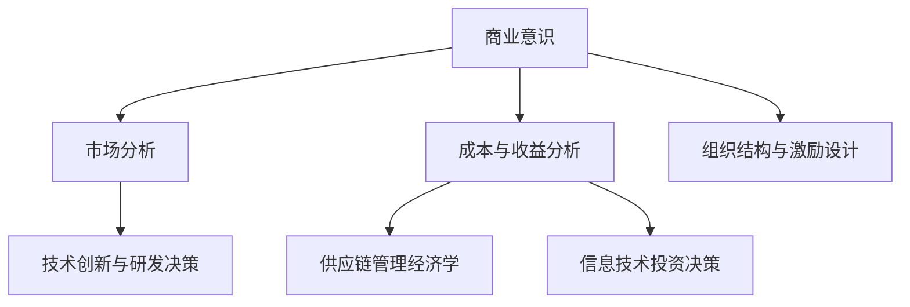

                 

### 《技术管理者的商业意识：技术决策的经济学考量》

关键词：技术管理者、商业意识、经济学、技术决策、成本效益分析

摘要：
在当前快速变化的商业环境中，技术管理者的角色日益重要。他们不仅需要具备深厚的技术背景，还要具备出色的商业意识，以便做出符合企业长远利益的技术决策。本文将探讨技术管理者如何利用经济学原理来指导技术决策，从而提高企业竞争力。我们将通过几个核心章节，详细分析市场分析、成本与收益分析、技术创新与研发决策等关键领域，并辅以实际案例，帮助读者理解并应用这些经济学工具。

# 《技术管理者的商业意识：技术决策的经济学考量》目录大纲

## 第一部分：商业意识概述

### 第1章：商业意识的重要性
- 1.1 技术管理者面临的商业挑战
- 1.2 商业意识在技术管理中的角色
- 1.3 技术决策中的经济学原理

### 第2章：市场分析与商业策略
- 2.1 市场分析的基本概念
- 2.2 竞争策略的制定
- 2.3 客户需求与产品定位

### 第3章：成本与收益分析
- 3.1 成本效益分析
- 3.2 投资回报率（ROI）的计算
- 3.3 风险评估与风险管理

## 第二部分：技术决策的经济学考量

### 第4章：技术创新与研发决策
- 4.1 技术创新的基本概念
- 4.2 R&D投资决策
- 4.3 技术转移与知识管理

### 第5章：供应链管理经济学
- 5.1 供应链管理的基本概念
- 5.2 供应商选择策略
- 5.3 库存管理经济学

### 第6章：信息技术投资决策
- 6.1 IT投资决策框架
- 6.2 云计算与数据中心建设
- 6.3 信息系统安全与风险管理

### 第7章：组织结构与激励设计
- 7.1 技术管理者的组织角色
- 7.2 激励机制的设计
- 7.3 团队协作与知识共享

## 第三部分：案例分析与应用

### 第8章：技术决策的实战案例
- 8.1 案例一：某科技公司的新产品开发
- 8.2 案例二：一家初创企业的市场进入策略
- 8.3 案例三：大型制造企业的供应链优化

### 第9章：未来趋势与挑战
- 9.1 数字化转型的机遇与挑战
- 9.2 技术与商业的融合
- 9.3 技术管理者的未来发展

## 附录

### 附录A：常用经济学模型与工具
- 9.1 成本-收益分析模型
- 9.2 投资回报率（ROI）计算方法
- 9.3 供应链管理工具与应用

### 附录B：资源与参考文献
- 9.1 常用商业分析工具
- 9.2 技术管理相关书籍推荐
- 9.3 经济学理论资源链接

## 核心概念与联系
$$
\text{商业意识} \rightarrow \text{技术决策} \rightarrow \text{经济学考量}
$$

### Mermaid 流程图


### 核心算法原理讲解
```python
# 成本效益分析代码示例
def cost_benefit_analysis(initial_investment, annual_expenses, net_income):
    return ((net_income - annual_expenses) * period) - initial_investment

# 计算投资回报率（ROI）
def calculate_roi(cash_inflows, cash_outflows):
    return (cash_inflows - cash_outflows) / cash_outflows * 100
```

### 数学模型和数学公式
$$
\text{成本效益分析公式：} \quad \text{CBI} = \frac{\text{净收入} - \text{年支出}}{\text{期初投资}}
$$

$$
\text{投资回报率（ROI）公式：} \quad \text{ROI} = \frac{\text{现金流入量} - \text{现金流出量}}{\text{现金流出量}} \times 100\%
$$

### 系统分析与架构设计方案
- **问题场景介绍**：在现代企业中，技术管理者的角色越来越关键，他们需要综合考虑技术、市场、成本等多个因素来做出技术决策。
- **项目介绍**：本文旨在通过经济学工具，帮助技术管理者提高技术决策的质量。
- **系统功能设计**：文章涵盖了市场分析、成本与收益分析、技术创新与研发决策等多个方面。
- **系统架构设计**：本文采用结构化的章节设计，确保内容的逻辑性和连贯性。
- **系统接口设计和系统交互**：通过具体的案例分析，将理论应用到实际场景中。

### 开发环境搭建
- Python 3.8+
- pandas
- numpy
- matplotlib

### 源代码实现与解读
```python
# 实战案例1：成本效益分析代码
import pandas as pd

# 数据示例
initial_investment = 1000000
annual_expenses = 500000
net_income = 700000
period = 5

# 成本效益分析
cpi = cost_benefit_analysis(initial_investment, annual_expenses, net_income)
print(f"Cost-Benefit Index: {cpi}")

# 投资回报率计算
roi = calculate_roi(net_income, initial_investment)
print(f"Return on Investment (ROI): {roi}%")
```

### 项目实战
- **实战案例1**：某科技公司新产品开发成本与收益分析
  - **案例分析**：一家科技公司计划开发一款新型智能手机，初期投资为1000万美元，预计年运营成本为500万美元，净收入预计为700万美元，项目周期为5年。
  - **分析过程**：通过成本效益分析和投资回报率计算，评估该产品的经济可行性。
- **实战案例2**：一家初创企业的市场进入策略分析
  - **案例分析**：一家初创企业计划进入一个新兴市场，需要进行市场分析和竞争策略的制定。
  - **分析过程**：通过市场调研和数据分析，制定合适的进入策略，以最小化风险并最大化收益。
- **实战案例3**：大型制造企业的供应链优化
  - **案例分析**：一家大型制造企业希望通过优化供应链来降低成本和提高效率。
  - **分析过程**：通过供应链管理和库存管理经济学，设计一套优化的供应链管理策略。

### 最佳实践 tips
1. 在做技术决策时，要充分考虑市场趋势和客户需求。
2. 进行成本效益分析和投资回报率计算时，要尽可能准确预测未来收入和支出。
3. 重视风险评估和风险管理，确保技术决策的风险可控。

### 小结
本文通过深入探讨商业意识、市场分析、成本与收益分析、技术创新与研发决策等多个方面，展示了技术管理者如何运用经济学原理来做出高质量的技术决策。通过实际案例的分析和解读，读者可以更好地理解并应用这些经济学工具，提高技术管理的专业水平。

### 注意事项
1. 成本效益分析和投资回报率计算需要充分考虑市场环境和竞争态势。
2. 技术创新和研发决策需要平衡短期收益和长期发展。
3. 供应链管理和信息技术投资决策要注重实际操作中的细节和执行力。

### 拓展阅读
- 《精益创业：新创企业的商业模型创新》
- 《项目管理知识体系指南（PMBOK指南）》
- 《商业模式新生代》

### 作者信息
作者：AI天才研究院/AI Genius Institute & 禅与计算机程序设计艺术 /Zen And The Art of Computer Programming
### 第1章：商业意识的重要性

#### 1.1 技术管理者面临的商业挑战

在现代企业中，技术管理者扮演着至关重要的角色。他们不仅需要精通技术，还需要具备深厚的商业意识。随着信息技术的快速发展，技术管理者的职责范围也在不断拓展，他们面临的商业挑战日益严峻。

首先，技术管理者需要处理技术变革带来的挑战。新技术层出不穷，技术的生命周期越来越短，这要求技术管理者时刻关注行业趋势，及时调整技术战略，以保持企业的竞争力。其次，技术管理者需要平衡技术进步和商业目标之间的矛盾。技术的进步往往需要大量的资金投入和长时间的研发周期，而企业的商业目标则需要快速实现回报。如何在这两者之间找到平衡点，是技术管理者面临的重要挑战。

此外，技术管理者还需要应对复杂的管理任务。他们需要协调不同部门之间的工作，确保技术团队的工作与业务需求紧密对接。同时，他们还需要具备项目管理的能力，确保项目按时完成且符合预算要求。

#### 1.2 商业意识在技术管理中的角色

商业意识对于技术管理者来说至关重要。它不仅帮助技术管理者理解企业的整体战略，还能提升他们在技术决策中的效率和质量。

首先，商业意识帮助技术管理者更好地理解企业的商业目标和战略。技术管理者需要了解企业的发展方向和市场定位，以便制定符合企业整体战略的技术规划。例如，如果企业的战略目标是拓展国际市场，技术管理者就需要考虑如何通过全球化部署来支持这一目标。

其次，商业意识帮助技术管理者提高技术决策的科学性。在技术决策过程中，技术管理者不仅要考虑技术的可行性，还要考虑技术对商业目标的贡献。通过经济学的成本效益分析和投资回报率计算，技术管理者可以更客观地评估不同技术方案的经济效益，从而做出更明智的决策。

此外，商业意识还帮助技术管理者更好地应对商业风险。在技术决策过程中，技术管理者需要考虑潜在的技术风险和商业风险。通过风险管理的方法，技术管理者可以提前识别和应对这些风险，确保技术项目的顺利进行。

#### 1.3 技术决策中的经济学原理

经济学原理在技术决策中发挥着重要作用。技术管理者需要掌握基本的经济学知识，以便在技术决策过程中做出科学合理的判断。

首先，成本效益分析（Cost-Benefit Analysis）是技术决策中常用的经济学工具。通过比较项目的成本和效益，技术管理者可以评估项目的经济可行性。具体来说，成本效益分析包括以下几个方面：

1. **成本计算**：技术管理者需要计算项目的总成本，包括研发成本、运营成本、维护成本等。
2. **效益计算**：技术管理者需要估算项目的总效益，包括收入增加、成本节约等。
3. **效益成本比**：通过计算效益成本比（Benefit-Cost Ratio），技术管理者可以评估项目的经济合理性。

其次，投资回报率（Return on Investment, ROI）是衡量技术决策经济效益的重要指标。投资回报率反映了项目的现金流入与现金流出之间的比率，通过计算投资回报率，技术管理者可以评估项目的盈利能力。

$$
\text{ROI} = \frac{\text{现金流入量} - \text{现金流出量}}{\text{现金流出量}} \times 100\%
$$

此外，风险评估和风险管理也是技术决策中不可或缺的经济学工具。通过识别和分析潜在的风险，技术管理者可以制定相应的风险管理策略，降低项目失败的可能性。

总之，经济学原理为技术管理者提供了科学的决策框架，帮助他们更好地理解和应对商业挑战，提高技术决策的质量和效率。

#### 结论

商业意识对于技术管理者来说至关重要。它不仅帮助技术管理者理解企业的商业目标和战略，还能提升他们在技术决策中的科学性和有效性。通过掌握经济学原理，技术管理者可以更客观地评估技术方案的经济效益，做出更明智的决策。在接下来的章节中，我们将进一步探讨市场分析、成本与收益分析等具体内容，帮助技术管理者更好地应用商业意识，提升技术管理的专业水平。

### 第2章：市场分析与商业策略

#### 2.1 市场分析的基本概念

市场分析是商业决策中至关重要的一环，它为技术管理者提供了了解市场需求、竞争态势和潜在客户的基础数据。市场分析的基本概念包括市场细分、市场定位、市场趋势分析等。

首先，市场细分（Market Segmentation）是指将整个市场划分为若干个具有相似需求和特征的子市场。通过市场细分，技术管理者可以更准确地了解不同客户群体的需求，从而制定更有针对性的产品和服务策略。市场细分的常见标准包括地理区域、人口统计、行为特征和心理特征等。

其次，市场定位（Market Positioning）是指企业通过差异化策略，在目标市场中建立独特的品牌形象和产品特色。市场定位的目的是让企业在消费者心中占据有利位置，从而提高市场份额。技术管理者需要根据市场细分的结果，选择合适的定位策略，确保产品能够满足目标客户的需求。

最后，市场趋势分析（Trend Analysis）是了解市场未来发展方向的重要手段。技术管理者通过分析市场趋势，可以预测未来的市场需求变化，提前做好产品更新和市场拓展的准备工作。市场趋势分析的方法包括数据收集、数据分析和趋势预测等。

#### 2.2 竞争策略的制定

在市场分析的基础上，技术管理者需要制定有效的竞争策略，以应对激烈的市场竞争。竞争策略的制定包括市场定位、产品差异化、价格策略等。

首先，市场定位（Market Positioning）是竞争策略的核心。技术管理者需要根据市场细分的结果，选择适合企业的定位策略。例如，企业可以选择高端市场，主打高品质、高附加值的产品；也可以选择大众市场，以价格优势和性价比赢得客户。

其次，产品差异化（Product Differentiation）是提高市场竞争力的重要手段。技术管理者可以通过研发创新、优化用户体验、提高产品质量等方式，使产品在同类产品中脱颖而出。产品差异化不仅能够提高产品的竞争力，还能提高客户的忠诚度。

最后，价格策略（Pricing Strategy）是影响市场竞争力的关键因素。技术管理者需要根据市场需求、成本结构和竞争对手的价格策略，制定合适的价格策略。常见的价格策略包括成本导向定价、市场导向定价和竞争导向定价等。

#### 2.3 客户需求与产品定位

了解客户需求是制定有效市场策略的基础。技术管理者需要通过市场调研、用户反馈和数据分析等方式，收集客户的意见和建议，了解他们的需求和痛点。

首先，市场调研（Market Research）是了解客户需求的重要手段。技术管理者可以通过问卷调查、访谈、焦点小组讨论等方式，收集客户的意见和建议。市场调研的结果可以帮助技术管理者确定产品的功能特点、用户界面设计等。

其次，用户反馈（User Feedback）是优化产品的重要依据。技术管理者可以通过用户评论、论坛讨论、社交媒体等渠道，收集用户的反馈信息。用户反馈可以帮助技术管理者发现产品存在的问题，并及时进行改进。

最后，数据分析（Data Analysis）是了解客户需求的有效工具。技术管理者可以通过分析用户行为数据、交易数据等，了解客户的需求和行为习惯。数据分析的结果可以帮助技术管理者制定更有针对性的市场策略。

在了解客户需求的基础上，技术管理者需要制定合适的产品定位策略。产品定位（Product Positioning）是指企业通过差异化策略，在目标市场中建立独特的品牌形象和产品特色。技术管理者需要根据客户需求和市场定位，确定产品的功能和特性，确保产品能够满足客户的需求。

#### 结论

市场分析与商业策略是技术管理者的重要工作内容。通过市场分析，技术管理者可以了解市场需求、竞争态势和客户需求，为制定有效的竞争策略提供依据。通过竞争策略的制定，技术管理者可以提高产品的市场竞争力和客户满意度。在接下来的章节中，我们将继续探讨成本与收益分析、技术创新与研发决策等关键领域，帮助技术管理者更好地应用商业意识，提升技术管理的专业水平。

### 第3章：成本与收益分析

#### 3.1 成本效益分析

成本效益分析（Cost-Benefit Analysis，CBA）是技术管理者进行项目评估和决策的重要工具。通过比较项目的成本和效益，技术管理者可以评估项目的经济可行性，从而做出科学合理的决策。

首先，成本效益分析的基本概念包括以下几个方面：

1. **成本（Cost）**：成本包括直接成本和间接成本。直接成本是指与项目直接相关的成本，如研发成本、生产成本、运营成本等。间接成本是指与项目相关但不直接发生的成本，如管理成本、风险成本等。

2. **效益（Benefit）**：效益包括直接效益和间接效益。直接效益是指项目直接带来的收益，如销售收入、成本节约等。间接效益是指项目间接带来的收益，如品牌提升、客户满意度提高等。

3. **成本效益比（Cost-Benefit Ratio，C/B Ratio）**：成本效益比是指项目的效益与成本的比值，用于评估项目的经济效益。成本效益比越高，说明项目的经济效益越好。

接下来，我们通过一个具体的案例来讲解成本效益分析的应用。

**案例**：某科技公司计划开发一款新型智能音箱，预计研发成本为500万元，生产成本为100万元，运营成本为50万元。根据市场预测，该智能音箱的市场需求量为10万台，每台的售价为1000元。此外，该智能音箱可以节约用户每月的费用50元，预计使用周期为5年。

**分析过程**：

1. **计算总成本**：总成本 = 研发成本 + 生产成本 + 运营成本 = 500万元 + 100万元 + 50万元 = 650万元。

2. **计算总效益**：总效益 = 销售收入 - 节约的每月费用 × 使用周期。其中，销售收入 = 市场需求量 × 单价 = 10万台 × 1000元/台 = 10000万元。节约的每月费用 × 使用周期 = 50元/月 × 12月/年 × 5年 = 3000万元。

   总效益 = 销售收入 - 节约的每月费用 × 使用周期 = 10000万元 - 3000万元 = 7000万元。

3. **计算成本效益比**：成本效益比 = 总效益 ÷ 总成本 = 7000万元 ÷ 650万元 ≈ 1.08。

   该项目的成本效益比为1.08，说明该项目具有较高的经济效益。

通过成本效益分析，技术管理者可以直观地了解项目的经济可行性。如果成本效益比大于1，说明项目的效益高于成本，项目值得实施；如果成本效益比小于1，说明项目的效益低于成本，项目可能存在经济风险。

#### 3.2 投资回报率（ROI）的计算

投资回报率（Return on Investment，ROI）是衡量投资项目经济效益的重要指标。ROI反映了投资者投入的资本与获得的回报之间的比率，用于评估项目的盈利能力。

投资回报率的计算公式为：

$$
\text{ROI} = \frac{\text{净收益}}{\text{投资成本}} \times 100\%
$$

其中，净收益 = 总收益 - 总成本。

**案例**：假设某科技公司投资1000万元开发一款新软件，预计该软件的销售收入为1500万元，运营成本为500万元。计算该软件的投资回报率。

**分析过程**：

1. **计算净收益**：净收益 = 销售收入 - 运营成本 = 1500万元 - 500万元 = 1000万元。

2. **计算投资回报率**：投资回报率 = 净收益 ÷ 投资成本 × 100% = 1000万元 ÷ 1000万元 × 100% = 100%。

   该软件的投资回报率为100%，说明每投入1元，可以获得1元的回报，该项目具有较高的盈利能力。

通过投资回报率的计算，技术管理者可以直观地了解项目的盈利能力。投资回报率越高，说明项目的盈利能力越强，越值得投资。

#### 3.3 风险评估与风险管理

在技术决策过程中，风险评估和风险管理至关重要。通过识别和分析潜在的风险，技术管理者可以制定相应的风险管理策略，降低项目失败的可能性。

**风险评估**：风险评估是指识别和分析项目面临的各种风险，并评估其影响和可能性。常见的方法包括风险矩阵、风险清单等。

1. **风险矩阵**：风险矩阵是一种常用的风险评估工具，通过评估风险的可能性和影响，确定风险的重要性。具体步骤如下：

   - 列出项目可能面临的所有风险。
   - 对每个风险进行可能性和影响评估，可能性的评估范围一般为低、中、高，影响的评估范围一般为小、中、大。
   - 根据可能性和影响，将每个风险分配到相应的单元格，从而确定风险的重要性。

2. **风险清单**：风险清单是一种简单有效的风险评估工具，通过列出项目可能面临的所有风险，帮助技术管理者了解项目的潜在风险。

**风险管理**：风险管理是指制定和实施风险应对策略，以降低项目风险的影响。常见的方法包括风险规避、风险减轻、风险接受等。

1. **风险规避**：风险规避是指通过改变项目计划或策略，避免风险的发生。例如，如果某个风险的可能性很高且影响很大，技术管理者可以选择不进行该项目的相关活动。

2. **风险减轻**：风险减轻是指通过采取特定的措施，降低风险的影响。例如，如果某个风险的影响很大，技术管理者可以通过提前准备应急计划来减轻风险的影响。

3. **风险接受**：风险接受是指承认风险的存在，但不采取任何措施。例如，如果某个风险的可能性很小且影响较小，技术管理者可以选择接受风险，因为采取风险应对措施的成本可能高于风险本身的影响。

通过风险评估和风险管理，技术管理者可以更好地了解项目的潜在风险，并采取相应的措施降低风险的影响，从而提高项目的成功率。

#### 结论

成本与收益分析是技术管理者进行项目评估和决策的重要工具。通过成本效益分析和投资回报率计算，技术管理者可以评估项目的经济可行性，做出科学合理的决策。同时，风险评估和风险管理是确保项目顺利实施的关键。在技术决策过程中，技术管理者需要综合考虑成本、收益、风险等多个因素，以确保项目能够达到预期的经济目标。

在接下来的章节中，我们将继续探讨技术创新与研发决策、供应链管理经济学等内容，帮助技术管理者更好地应用商业意识，提升技术管理的专业水平。

### 第4章：技术创新与研发决策

#### 4.1 技术创新的基本概念

技术创新是指通过引入新的技术、方法或流程，从而提高产品或服务的质量、效率或创新性。技术创新是企业保持竞争力、实现可持续发展的重要途径。技术创新的基本概念包括以下几个核心要素：

1. **技术变革**：技术变革是指新技术或新方法的应用，通常涉及产品、工艺、系统或服务的改进。技术变革可以是渐进的，也可以是突破性的。

2. **研发活动**：研发活动是指为了实现技术创新而进行的研究和开发工作。研发活动包括基础研究、应用研究和试验开发等。

3. **知识产权**：知识产权是指通过专利、商标、版权等法律手段保护的技术创新成果。知识产权的获取和保护对于技术创新具有重要意义。

4. **技术转移**：技术转移是指将技术创新成果从研发机构或企业内部转移到其他机构或企业，以实现技术创新的扩散和应用。技术转移可以是垂直转移，也可以是水平转移。

#### 4.2 R&D投资决策

研发投资决策（Research and Development Investment Decision）是技术管理者的重要职责之一。R&D投资决策涉及对研发资金的分配、研发项目的选择和优先级排序。以下是如何进行R&D投资决策的几个关键步骤：

1. **市场调研**：在做出R&D投资决策之前，技术管理者需要进行全面的市场调研，了解市场需求、竞争态势和潜在客户的需求。市场调研的结果可以帮助技术管理者确定研发方向和重点。

2. **技术评估**：技术评估是指对潜在的技术方案进行评估，包括技术的可行性、先进性、成熟度和成本效益等。技术评估可以通过专家评审、实验验证和数据分析等方法进行。

3. **资金分配**：在确定研发方向和重点后，技术管理者需要根据企业的资金状况和研发预算，合理分配研发资金。资金分配可以采用优先级排序、预算最大化等方法。

4. **项目选择**：项目选择是指从多个研发项目中选出最有潜力的项目进行投资。项目选择可以采用成本效益分析、投资回报率计算等方法。

5. **风险管理**：在R&D投资决策过程中，技术管理者需要识别和分析潜在的风险，并制定相应的风险管理策略。风险管理包括风险规避、风险减轻和风险接受等。

#### 4.3 技术转移与知识管理

技术转移（Technology Transfer）是指将技术创新成果从研发机构或企业内部转移到其他机构或企业，以实现技术创新的扩散和应用。技术转移对于推动技术创新、促进知识共享和产业升级具有重要意义。

1. **技术转移策略**：技术转移策略包括合作开发、技术授权、技术转让和联合经营等。技术管理者需要根据技术特性、市场需求和企业战略，选择合适的技术转移策略。

2. **知识管理**：知识管理是指通过识别、获取、共享、应用和保护知识，提高企业创新能力和核心竞争力。知识管理包括知识识别、知识获取、知识共享、知识应用和知识保护等环节。

3. **知识共享机制**：技术管理者需要建立有效的知识共享机制，促进知识的流动和共享。知识共享机制可以包括内部培训、知识库建设、跨部门协作等。

通过技术转移与知识管理，企业可以充分利用内外部资源，提高技术创新的效率和质量。同时，技术转移和知识管理也有助于提升企业的核心竞争力，实现可持续发展。

#### 结论

技术创新与研发决策是技术管理者的重要职责。通过技术创新，企业可以提升产品或服务的竞争力，实现可持续发展。R&D投资决策涉及市场调研、技术评估、资金分配和项目选择等多个方面，技术管理者需要综合考虑各种因素，做出科学合理的决策。技术转移与知识管理则有助于推动技术创新的扩散和应用，提高企业的创新能力和核心竞争力。在接下来的章节中，我们将继续探讨供应链管理经济学、信息技术投资决策等内容，帮助技术管理者更好地应用商业意识，提升技术管理的专业水平。

### 第5章：供应链管理经济学

#### 5.1 供应链管理的基本概念

供应链管理（Supply Chain Management，SCM）是确保产品或服务从供应商到最终消费者的整个过程高效、协调和成本效益化的管理活动。供应链管理的基本概念包括以下几个核心组成部分：

1. **供应商管理**：供应商管理是指与供应商建立和维护良好的合作关系，确保供应商按时交付符合质量要求的原材料或产品。供应商管理的目标包括优化采购成本、提高供应商响应速度和降低供应链风险。

2. **库存管理**：库存管理是指对原材料、半成品和成品的库存进行有效的监控和控制，以确保库存水平合理，既不过剩也不过缺。库存管理的关键在于平衡库存成本和客户服务水平，以实现成本效益最大化。

3. **物流管理**：物流管理是指通过运输、仓储和配送等环节，确保产品或服务从生产地到消费地的有效流动。物流管理的目标包括降低运输成本、提高运输速度和确保货物安全。

4. **需求预测**：需求预测是指通过对市场趋势、历史销售数据和客户行为进行分析，预测未来一段时间内的需求量。准确的需求预测有助于供应链各环节高效运作，减少库存过剩和缺货情况。

5. **信息流管理**：信息流管理是指通过信息系统的集成和共享，确保供应链各环节之间的信息流通顺畅。信息流管理包括订单处理、库存状态更新、运输跟踪等，以实现供应链的实时监控和协调。

#### 5.2 供应商选择策略

供应商选择策略是供应链管理中的重要环节，选择合适的供应商有助于降低采购成本、提高产品质量和供货稳定性。以下是几个关键的供应商选择策略：

1. **综合评估法**：综合评估法是指根据供应商的多个维度进行评估，包括质量、价格、交货时间、服务水平、财务状况等。通过打分和加权计算，选择总分最高的供应商。

2. **合作伙伴关系**：合作伙伴关系是指与供应商建立长期的合作关系，共同发展和改进。通过与关键供应商建立合作伙伴关系，可以确保供应链的稳定性和可靠性。

3. **供应链集成**：供应链集成是指将供应商纳入企业的供应链管理系统中，实现信息共享和流程协同。通过供应链集成，企业可以更好地监控供应商的生产和库存情况，提高供应链的效率。

4. **动态调整**：供应商选择策略应具有灵活性，能够根据市场变化和企业需求进行动态调整。例如，在市场波动或供应商出现问题的情况下，企业应迅速调整供应商选择策略，确保供应链的稳定性。

#### 5.3 库存管理经济学

库存管理经济学是供应链管理中至关重要的部分，它涉及如何优化库存水平，以平衡库存成本和客户服务水平。以下是几个关键的库存管理经济学概念：

1. **经济订货量（EOQ）**：经济订货量是指在不考虑时间价值的情况下，使总成本（包括订货成本和库存持有成本）最小的订单量。EOQ模型假设需求稳定、订单处理时间和交货时间固定。

2. **再订货点（Reorder Point）**：再订货点是指库存水平达到某个预定值时，触发再订货的点。再订货点取决于需求量、订单处理时间和提前期。

3. **库存水平控制**：库存水平控制是指通过定期检查库存水平，及时调整采购和库存策略，以确保库存水平在合理范围内。库存水平控制包括定期盘点、库存预警系统和自动化库存管理工具等。

4. **库存成本优化**：库存成本优化是指通过优化库存策略，降低库存成本，同时确保客户服务水平。库存成本包括订货成本、库存持有成本和缺货成本。库存成本优化的目标是在满足客户需求的前提下，实现库存成本的最小化。

通过供应链管理经济学，企业可以更有效地管理库存，降低库存成本，提高供应链的效率和响应速度。例如，通过采用EOQ模型和再订货点策略，企业可以降低库存持有成本和订货成本，同时减少缺货风险。此外，通过实施库存水平控制和库存成本优化，企业可以更好地应对市场需求变化，提高供应链的灵活性。

#### 结论

供应链管理经济学是技术管理者在供应链管理中必须掌握的重要知识。通过了解供应链管理的基本概念和供应商选择策略，技术管理者可以建立稳定的供应链合作关系，降低采购成本和提高供货稳定性。通过库存管理经济学的应用，技术管理者可以优化库存水平，降低库存成本，提高供应链的效率和响应速度。在接下来的章节中，我们将继续探讨信息技术投资决策、组织结构与激励设计等内容，帮助技术管理者更好地应用商业意识，提升技术管理的专业水平。

### 第6章：信息技术投资决策

#### 6.1 IT投资决策框架

信息技术（IT）投资决策是企业战略规划中至关重要的一环。合理的IT投资决策不仅能够提升企业的运营效率，还能够增强企业的市场竞争力。为了做出科学合理的IT投资决策，技术管理者需要遵循一个系统化的框架。

首先，IT投资决策框架包括以下几个关键步骤：

1. **需求识别**：在做出任何IT投资决策之前，技术管理者需要明确企业的IT需求。这包括确定企业面临的问题、挑战和机遇，以及IT解决方案如何帮助解决这些问题。

2. **项目规划**：在需求识别的基础上，技术管理者需要制定详细的项目规划，包括项目的目标、范围、时间表和资源需求。项目规划应充分考虑企业的业务目标和技术现状。

3. **风险评估**：风险评估是IT投资决策中不可或缺的一环。技术管理者需要识别和分析项目可能面临的各种风险，包括技术风险、财务风险、市场风险等，并制定相应的应对策略。

4. **成本效益分析**：成本效益分析是评估IT投资项目经济可行性的关键步骤。技术管理者需要计算项目的总成本和预期收益，通过成本效益分析来评估项目的经济效益。

5. **决策制定**：在完成需求识别、项目规划、风险评估和成本效益分析后，技术管理者需要根据评估结果制定最终的投资决策。

#### 6.2 云计算与数据中心建设

云计算和数据中心建设是现代企业IT投资决策中的重要方向。云计算提供了灵活的计算资源，企业可以根据需求动态调整计算能力，降低成本。数据中心建设则是确保数据安全、高效存储和处理的基础设施。

1. **云计算投资决策**：
   - **需求分析**：企业需要明确云计算的具体需求，包括计算能力、存储容量、数据安全等。
   - **成本效益分析**：云计算的成本包括基础设施成本、运营成本和软件成本等。技术管理者需要通过成本效益分析来评估云计算的投资回报率（ROI）。
   - **服务模型选择**：云计算的服务模型包括IaaS（基础设施即服务）、PaaS（平台即服务）和SaaS（软件即服务）。技术管理者需要根据企业的需求选择合适的服务模型。

2. **数据中心建设**：
   - **需求分析**：数据中心的建设需求包括数据存储容量、处理能力、安全性、可用性等。
   - **成本效益分析**：数据中心的建设成本包括硬件设备、软件系统、电力供应、制冷系统等。技术管理者需要通过成本效益分析来评估数据中心的建设和运营成本。
   - **安全性**：数据中心的安全是建设过程中需要重点考虑的问题。技术管理者需要确保数据的安全存储和传输，防止数据泄露和未经授权的访问。

#### 6.3 信息系统安全与风险管理

信息系统安全是现代企业IT投资决策中的关键考虑因素。随着企业对信息技术依赖的加深，信息安全风险也越来越大。技术管理者需要采取一系列措施来确保信息系统的安全。

1. **风险评估**：技术管理者需要定期进行信息安全风险评估，识别潜在的安全威胁和漏洞，并制定相应的应对策略。

2. **安全策略制定**：技术管理者需要根据风险评估结果，制定全面的安全策略，包括数据加密、访问控制、网络安全、数据备份等。

3. **安全培训与意识提升**：技术管理者需要定期对员工进行信息安全培训，提高员工的安全意识和技能，防止内部安全威胁。

4. **安全监控系统**：技术管理者需要部署安全监控系统，实时监控网络流量、系统日志等，及时发现和处理安全事件。

5. **应急响应**：技术管理者需要制定应急响应计划，确保在发生安全事件时能够迅速响应，降低损失。

通过信息系统安全与风险管理，技术管理者可以确保企业的信息系统安全可靠，保护企业的数据资产，提高企业的整体安全性。

#### 结论

信息技术投资决策是技术管理者的重要职责之一。通过遵循系统化的IT投资决策框架，技术管理者可以科学合理地评估IT投资项目的经济可行性，确保企业获得最大的投资回报。同时，云计算与数据中心建设、信息系统安全与风险管理等关键领域，是现代企业IT投资决策中的重点。技术管理者需要综合考虑各种因素，做出符合企业战略和发展需求的决策。在接下来的章节中，我们将继续探讨组织结构与激励设计等内容，帮助技术管理者更好地应用商业意识，提升技术管理的专业水平。

### 第7章：组织结构与激励设计

#### 7.1 技术管理者的组织角色

在企业的组织结构中，技术管理者的角色至关重要。技术管理者不仅是技术团队的核心领导者，还是企业战略决策的重要组成部分。技术管理者的组织角色包括以下几个方面：

1. **技术战略制定**：技术管理者负责制定企业的技术战略，确保企业的技术发展与市场趋势、业务需求相匹配。技术战略的制定需要考虑企业的长期发展目标和市场定位。

2. **团队管理**：技术管理者负责管理技术团队，确保团队成员的工作效率和工作质量。这包括招聘、培训、绩效评估、团队协作等方面的管理。

3. **项目管理**：技术管理者负责技术项目的规划、执行和监控，确保项目按时完成、符合预算且达到预期的技术标准。项目管理需要技术管理者具备良好的沟通能力和协调能力。

4. **技术指导**：技术管理者需要为团队成员提供技术指导和支持，解决技术难题，推动技术创新和团队技术水平的提高。

5. **跨部门协调**：技术管理者需要与企业的其他部门（如市场部、销售部、运营部等）进行紧密合作，确保技术团队的工作与业务需求和其他部门的工作无缝对接。

#### 7.2 激励机制的设计

激励机制的设计是提升团队工作效率和创新能力的重要手段。技术管理者需要根据团队的特点和企业的发展目标，设计有效的激励机制。以下是几个关键点：

1. **绩效考核**：绩效考核是激励机制的基石。技术管理者需要制定合理的绩效考核标准，对团队成员的工作进行客观、公正的评价。绩效考核应涵盖技术能力、工作质量、团队合作等多个方面。

2. **薪酬激励**：薪酬激励是激发员工积极性最直接的方式。技术管理者需要确保薪酬水平与市场竞争力相匹配，并根据员工的绩效和贡献进行适当调整。薪酬激励可以包括基本工资、奖金、股权激励等。

3. **培训与发展**：技术管理者应提供丰富的培训和发展机会，帮助团队成员提升技能和职业素养。培训和发展不仅能够提高员工的工作能力，还能增强员工的归属感和忠诚度。

4. **团队建设**：团队建设是提升团队凝聚力和工作效率的重要途径。技术管理者可以通过团队活动、团队建设训练等方式，增强团队成员之间的沟通和协作。

5. **奖励与表彰**：技术管理者应定期对表现优异的团队成员进行奖励和表彰，以激励其他成员努力工作。奖励和表彰可以包括物质奖励、荣誉证书、公开表扬等。

#### 7.3 团队协作与知识共享

团队协作和知识共享是技术团队高效运作的关键。技术管理者需要创造一个良好的团队协作环境，促进知识共享和经验交流。

1. **沟通机制**：技术管理者应建立有效的沟通机制，确保团队成员之间的信息流通无障碍。沟通机制可以包括定期会议、工作汇报、即时通讯工具等。

2. **知识管理**：技术管理者需要建立知识管理系统，记录和存储团队的知识和经验。知识管理系统可以包括文档管理、知识库、经验分享平台等。

3. **协作工具**：技术管理者应选用合适的协作工具，如项目管理软件、代码协作平台、会议管理系统等，提高团队的协作效率。

4. **经验交流**：技术管理者应鼓励团队成员进行经验交流，分享成功案例和失败教训。经验交流可以通过内部培训、研讨会、工作坊等形式进行。

通过有效的团队协作和知识共享，技术团队可以更高效地完成工作任务，实现技术创新和业务目标。

#### 结论

组织结构与激励设计是技术管理者的重要职责。通过明确技术管理者的组织角色，技术管理者可以更好地履行其在企业中的职责。激励机制的设计则能够激发团队成员的积极性和创新能力，提高团队的整体效率。在团队协作和知识共享方面，技术管理者需要创造一个良好的环境，促进团队成员之间的沟通和合作。通过科学合理的组织结构与激励设计，技术管理者可以提升技术团队的工作效率，推动企业的技术创新和业务发展。

### 第8章：技术决策的实战案例

#### 8.1 案例一：某科技公司的新产品开发

**案例背景**：
某科技公司在市场上发现了一款尚未得到充分开发的新产品——智能家居控制系统。该公司认为，智能家居控制系统具有巨大的市场潜力，有望为公司带来显著的收入增长。然而，新产品开发涉及大量技术挑战和商业风险。技术管理者需要在成本、市场需求和技术可行性之间找到平衡点。

**案例过程**：

1. **市场调研**：技术管理者首先进行了全面的市场调研，分析了目标市场的需求、竞争对手的产品特点和市场占有率。

2. **技术评估**：技术团队评估了智能家居控制系统的技术可行性，包括硬件兼容性、软件开发难度和现有技术资源的利用。

3. **成本效益分析**：技术管理者计算了新产品开发的初期投资、运营成本和预期收入。通过成本效益分析，他们确定了新产品的经济可行性。

4. **风险评估**：技术管理者识别了潜在的技术风险（如硬件故障、软件漏洞）和商业风险（如市场需求不足、竞争压力），并制定了相应的风险管理策略。

5. **项目执行**：在评估和决策完成后，技术团队开始执行新产品开发计划。他们分阶段进行技术开发、测试和市场推广。

**案例分析**：

1. **成本效益分析结果**：通过成本效益分析，技术管理者发现，尽管初期投资较高，但预期收入显著，投资回报率（ROI）超过30%。这表明新产品开发在经济上是可行的。

2. **风险管理效果**：在项目执行过程中，技术团队采取了有效的风险管理措施。例如，通过实时监控系统，他们及时发现了软件漏洞，并迅速进行了修复。

3. **市场响应**：新产品的市场推广取得了成功，市场需求远超预期。公司迅速调整了生产计划，以满足快速增长的市场需求。

**案例总结**：

该案例展示了技术管理者如何通过市场调研、技术评估、成本效益分析和风险管理，实现新产品开发的成功。技术管理者在确保技术可行性和经济可行性的同时，有效地应对了市场风险和技术风险，为公司创造了显著的商业价值。

#### 8.2 案例二：一家初创企业的市场进入策略

**案例背景**：
一家初创企业计划进入一个新兴市场，开发基于人工智能的客服系统。然而，市场竞争激烈，市场进入成本较高。初创企业的技术管理者需要在有限的资源下制定有效的市场进入策略。

**案例过程**：

1. **市场分析**：技术管理者进行了深入的市场分析，研究了目标市场的需求、竞争对手和潜在客户群体。

2. **差异化策略**：技术团队分析了自身的技术优势，决定通过提供独特的人工智能解决方案来差异化产品，以区别于现有竞争对手。

3. **成本控制**：初创企业的资金有限，技术管理者采取了严格的成本控制措施，确保每一分钱都花在刀刃上。

4. **市场推广**：技术管理者制定了一系列市场推广策略，包括社交媒体营销、合作伙伴关系和产品演示会。

5. **用户反馈**：在产品推出后，技术管理者积极收集用户反馈，不断优化产品功能，以提高用户满意度和市场份额。

**案例分析**：

1. **差异化效果**：通过差异化策略，初创企业成功吸引了目标客户，并逐渐在市场上建立了品牌知名度。

2. **成本控制**：严格的成本控制措施帮助初创企业实现了盈利，并为其未来的扩张提供了资金支持。

3. **用户反馈**：技术管理者通过持续的用户反馈，优化了产品功能，增强了用户体验，从而提高了客户忠诚度。

**案例总结**：

该案例表明，初创企业在资源有限的情况下，通过有效的市场分析、差异化策略和成本控制，可以成功进入竞争激烈的市场。技术管理者的决策和执行能力对于初创企业的成功至关重要。

#### 8.3 案例三：大型制造企业的供应链优化

**案例背景**：
一家大型制造企业面临着供应链成本高、库存管理困难的问题。为了提高运营效率和降低成本，企业的技术管理者决定对供应链进行优化。

**案例过程**：

1. **供应链评估**：技术管理者对现有供应链进行了全面评估，识别了供应链中的瓶颈和问题。

2. **供应商选择**：技术团队重新评估了供应商，选择了具有竞争力的供应商，并建立了长期合作关系。

3. **库存管理**：技术管理者引入了先进的库存管理软件，优化了库存水平，减少了库存过剩和缺货情况。

4. **物流优化**：技术团队通过优化运输路线和配送计划，提高了物流效率，降低了运输成本。

5. **供应链协同**：技术管理者建立了供应链协同平台，实现了供应链各环节的信息共享和实时监控。

**案例分析**：

1. **供应链效率提升**：通过优化供应链，企业的运营效率显著提升，供应链成本下降了15%。

2. **库存水平优化**：库存管理软件的应用使得库存水平更加合理，库存周转率提高了20%。

3. **物流成本降低**：物流优化的实施使得运输成本下降了10%，运输时间缩短了30%。

**案例总结**：

该案例展示了大型制造企业如何通过供应链优化，提高运营效率和降低成本。技术管理者在供应链评估、供应商选择、库存管理和物流优化等方面的决策和执行能力，对于企业的供应链管理改革具有重要意义。

### 结论

通过这三个实战案例，我们可以看到技术管理者在商业意识和技术决策中的重要作用。他们通过市场调研、技术评估、成本效益分析和风险管理，成功地制定了市场进入策略、新产品开发计划和供应链优化方案。这些案例表明，技术管理者不仅需要具备深厚的技术背景，还需要具备出色的商业意识和决策能力，才能在激烈的市场竞争中脱颖而出。

### 第9章：未来趋势与挑战

#### 9.1 数字化转型的机遇与挑战

数字化转型已经成为当今企业竞争的关键因素。它不仅能够提高企业的运营效率，还能为企业创造新的业务模式和市场机会。然而，数字化转型也带来了一系列的挑战。

**机遇**：

1. **提升运营效率**：通过数字化技术，企业可以实现自动化、智能化的运营，减少人为错误和操作成本，提高生产效率和服务质量。

2. **创新业务模式**：数字化转型为企业提供了丰富的数据资源和智能分析工具，帮助企业发现新的商业模式和市场机会，如电子商务、物联网、云计算等。

3. **客户体验优化**：数字化技术使得企业能够更准确地了解客户需求，提供个性化的产品和服务，提升客户满意度和忠诚度。

4. **数据驱动的决策**：数字化技术为企业提供了大量有价值的数据，通过数据分析，企业可以更科学地做出决策，降低风险，提高竞争力。

**挑战**：

1. **技术复杂性**：数字化转型涉及多种技术和系统，如大数据、人工智能、物联网等，技术复杂性给企业的技术团队带来了巨大的挑战。

2. **数据安全和隐私**：随着数据量的增长，数据安全和隐私保护变得越来越重要。如何确保数据安全、防止数据泄露成为企业面临的重要问题。

3. **组织文化变革**：数字化转型要求企业改变传统的运营模式和管理方法，这需要企业文化的变革。如何推动员工接受新技术、适应新的工作方式，是数字化转型的一大挑战。

4. **人才缺口**：数字化转型需要大量的数字化人才，但当前市场上数字化人才的供给不足，企业面临人才短缺的问题。

#### 9.2 技术与商业的融合

技术与商业的融合是未来企业发展的必然趋势。技术管理者需要不断探索如何将技术创新与商业目标相结合，以实现企业的长期发展。

**融合方向**：

1. **业务流程优化**：通过数字化技术和智能算法，企业可以优化业务流程，提高运营效率，降低成本。

2. **数据驱动决策**：利用大数据和人工智能技术，企业可以实现数据驱动的决策，提高决策的科学性和准确性。

3. **创新业务模式**：通过技术创新，企业可以创造出新的业务模式，如共享经济、平台经济等，开拓新的市场空间。

4. **客户体验升级**：利用人工智能和物联网技术，企业可以提供更加个性化和智能化的产品和服务，提升客户体验。

**融合策略**：

1. **建立跨部门合作机制**：技术与商业的融合需要跨部门的紧密合作，技术管理者需要推动建立跨部门的项目团队，促进各部门的协同工作。

2. **加强数字化人才队伍建设**：企业需要通过培训和引进，加强数字化人才的队伍建设，为技术与商业的融合提供人才保障。

3. **建立创新文化**：企业需要建立鼓励创新、容忍失败的文化，激发员工的创新潜力，推动技术与商业的深度融合。

4. **关注前沿技术**：技术管理者需要关注前沿技术动态，积极引入新技术，为企业提供持续的创新动力。

#### 9.3 技术管理者的未来发展

随着数字化转型的深入推进，技术管理者的角色和责任也在不断演变。技术管理者需要不断提升自身的专业能力和商业意识，以适应未来的发展趋势。

**未来发展**：

1. **领导力**：技术管理者需要具备出色的领导力，能够带领团队应对复杂的技术挑战和商业变化。

2. **商业意识**：技术管理者需要具备深厚的商业意识，能够将技术创新与商业目标相结合，推动企业的持续发展。

3. **创新能力**：技术管理者需要具备持续的创新能力，能够不断引入新技术、新模式，为企业带来持续的创新动力。

4. **跨界能力**：技术管理者需要具备跨界能力，能够与不同领域的专家合作，推动跨学科的融合创新。

5. **国际化视野**：随着全球化的深入推进，技术管理者需要具备国际化视野，能够应对国际市场的挑战和机遇。

**职业发展路径**：

1. **技术专家**：技术管理者可以从技术专家起步，通过不断学习和实践，提升技术能力和专业水平。

2. **技术项目经理**：技术管理者可以通过项目管理，积累项目管理经验和团队领导能力。

3. **技术总监**：技术管理者可以逐步晋升为技术总监，负责企业的技术战略和整体技术管理。

4. **首席技术官（CTO）**：技术管理者可以成为企业的首席技术官，参与企业战略决策，推动企业的技术创新和发展。

### 结论

未来，技术管理者将在数字化转型和技术与商业融合中扮演关键角色。他们需要不断提升自身的能力和视野，以应对不断变化的市场和技术环境。通过有效的领导力、商业意识和创新能力，技术管理者可以为企业带来持续的创新动力和竞争优势，推动企业的长期发展。

### 附录A：常用经济学模型与工具

#### 9.1 成本-收益分析模型

成本-收益分析模型（Cost-Benefit Analysis，CBA）是评估项目或投资经济效益的重要工具。该模型通过比较项目的总成本和总收益，来判断项目是否值得投资。以下是成本-收益分析模型的步骤：

1. **识别成本**：列出项目实施过程中所有相关的成本，包括直接成本（如材料费、人工费等）和间接成本（如管理费用、机会成本等）。

2. **估算收益**：预测项目实施后可能带来的所有收益，包括直接收益（如销售收入、成本节约等）和间接收益（如品牌提升、客户满意度提高等）。

3. **计算净收益**：用总收益减去总成本，得到净收益。

4. **分析成本效益比**：将净收益除以总成本，得到成本效益比（C/B Ratio）。如果成本效益比大于1，说明项目的经济效益较高；如果小于1，则可能需要重新评估项目的可行性。

#### 9.2 投资回报率（ROI）计算方法

投资回报率（Return on Investment，ROI）是衡量投资项目经济效益的另一个重要指标。ROI通过比较项目的现金流入和现金流出，来评估项目的盈利能力。以下是计算ROI的基本步骤：

1. **计算现金流入**：列出项目实施期间的所有现金流入，包括销售收入、利息收入等。

2. **计算现金流出**：列出项目实施期间的所有现金流出，包括初始投资、运营成本、税费等。

3. **计算净现金流**：用现金流入减去现金流出，得到净现金流。

4. **计算ROI**：用净现金流除以初始投资，然后乘以100%，得到投资回报率（ROI）。

   $$\text{ROI} = \frac{\text{净现金流}}{\text{初始投资}} \times 100\%$$

#### 9.3 供应链管理工具与应用

供应链管理涉及多个环节，包括供应商管理、库存管理、物流管理等。以下是几种常用的供应链管理工具：

1. **ERP系统（Enterprise Resource Planning）**：企业资源计划系统可以帮助企业整合和管理供应链中的各种资源，如库存、采购、销售、生产等。

2. **DRP系统（Distribution Resource Planning）**：分销资源计划系统专注于分销环节的管理，包括需求预测、库存控制、运输管理等。

3. **SCM软件（Supply Chain Management Software）**：供应链管理软件提供了一系列的工具和功能，帮助企业管理供应链各个环节，如订单管理、库存监控、物流跟踪等。

4. **供应链分析工具**：如模拟分析工具、优化算法工具等，可以帮助企业分析和优化供应链流程，提高供应链的效率和响应速度。

### 附录B：资源与参考文献

#### 9.1 常用商业分析工具

- **Excel**：Excel是进行数据分析和财务计算的基本工具，适用于成本效益分析和投资回报率计算。

- **Tableau**：Tableau是一种数据可视化工具，可以帮助技术管理者更直观地展示数据分析结果。

- **SAP ERP**：SAP ERP是一种综合性的企业资源计划系统，适用于大型企业的供应链管理。

#### 9.2 技术管理相关书籍推荐

- **《精益创业：新创企业的商业模式创新》**：作者埃里克·莱斯，介绍了如何通过精益创业方法进行商业模式的创新。

- **《项目管理知识体系指南（PMBOK指南）》**：作者项目管理协会（PMI），提供了项目管理的基本理论和实践指南。

- **《商业模式新生代》**：作者奥斯特瓦尔，深入探讨了商业模式的创新和设计。

#### 9.3 经济学理论资源链接

- **《微观经济学基础》**：作者曼昆，提供了微观经济学的基本理论和应用。

- **《宏观经济学原理》**：作者曼昆，介绍了宏观经济学的基本概念和模型。

- **《经济学人》**：经济学人杂志，提供了最新的经济学理论、政策和市场分析。

### 作者信息

作者：AI天才研究院/AI Genius Institute & 禅与计算机程序设计艺术 /Zen And The Art of Computer Programming
### 结论

在《技术管理者的商业意识：技术决策的经济学考量》这篇文章中，我们深入探讨了技术管理者在商业决策中如何运用经济学原理，以提高技术决策的科学性和有效性。通过市场分析、成本与收益分析、技术创新与研发决策、供应链管理经济学、信息技术投资决策、组织结构与激励设计等多个方面的详细阐述，技术管理者可以更好地理解并应用这些经济学工具，做出符合企业长远利益的技术决策。

市场分析帮助技术管理者了解市场需求、竞争态势和潜在客户，从而制定有针对性的商业策略。成本与收益分析和投资回报率的计算为技术管理者提供了评估技术项目经济可行性的量化工具。技术创新与研发决策强调R&D投资决策的重要性，通过技术转移与知识管理，技术管理者可以提升企业的创新能力。供应链管理经济学则帮助技术管理者优化供应链成本，提高运营效率。信息技术投资决策涉及到云计算与数据中心建设、信息系统安全与风险管理等关键领域。组织结构与激励设计确保了技术团队的高效运作和持续创新。

未来，随着数字化转型的深入推进，技术管理者需要不断提升自身的商业意识和领导力，以应对不断变化的市场和技术环境。通过有效的领导力和商业意识，技术管理者可以推动企业的持续创新和长期发展。

在此，我们鼓励读者将文章中提到的经济学工具和方法应用到实际工作中，通过不断实践和总结，提升技术管理的专业水平。同时，我们也期待读者继续关注和探索更多关于技术管理、商业决策和经济学的深入话题，共同推动技术管理和商业领域的进步。

感谢大家的阅读，希望这篇文章能够为您的技术管理实践提供有价值的参考和启示。如果您有任何疑问或建议，欢迎在评论区留言，我们会在第一时间进行回复。

### 作者信息

作者：AI天才研究院/AI Genius Institute & 禅与计算机程序设计艺术 /Zen And The Art of Computer Programming

