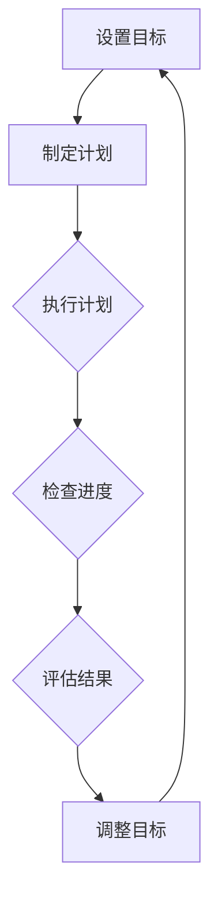
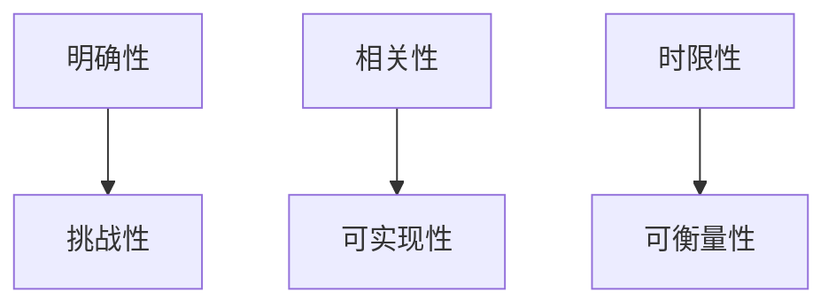
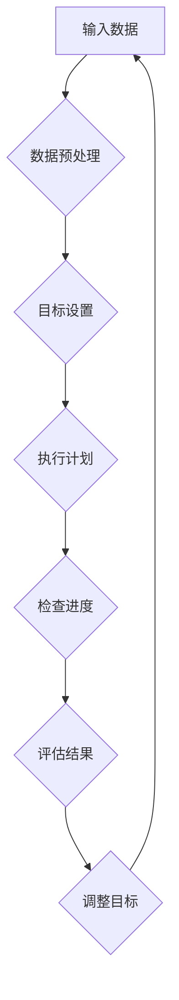
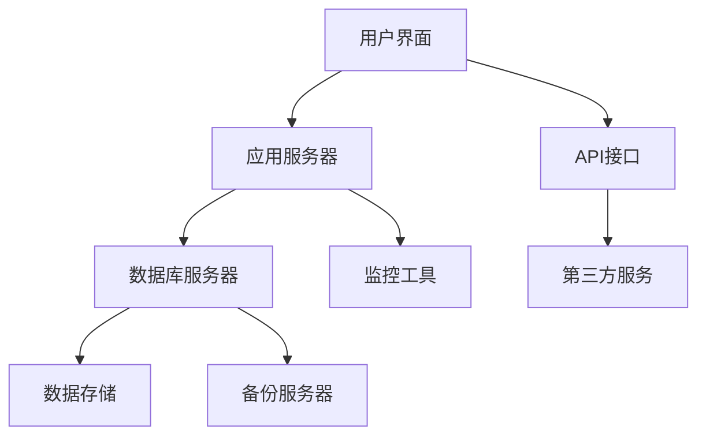
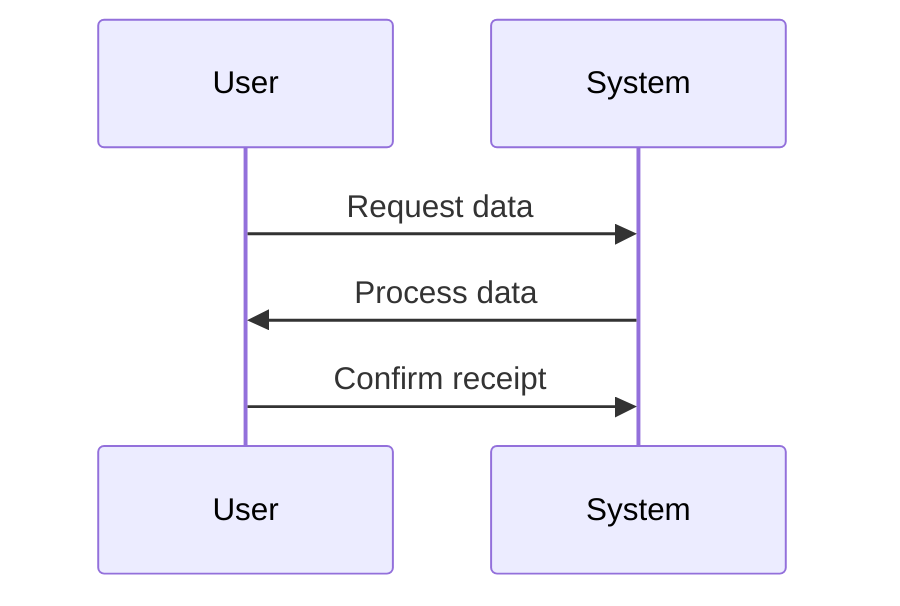

                 


# 技术管理者的团队激励：激发团队积极性的方法

## 关键词

技术管理者、团队激励、积极性、心理学、经济学、策略、案例分析

## 摘要

本文针对技术管理者在团队激励方面面临的挑战，系统地探讨了团队激励的理论基础、具体策略和实践案例。通过心理学、经济学视角分析团队激励的原理，提供目标设置、赞赏与奖励体系、职业发展等方面的实战策略，并结合真实案例，总结了最佳实践和注意事项，为技术管理者提供实用的指导。

----------------------------------------------------------------

## 引言

### 团队激励的重要性

在技术高速发展的今天，团队作为技术创新和项目实施的核心力量，其积极性直接影响到整个组织的绩效和竞争力。技术管理者作为团队的领导者，不仅需要具备扎实的技术能力，更需要懂得如何激发和维持团队的积极性。有效的团队激励不仅能提高团队成员的工作效率和创造力，还能增强团队的凝聚力，促进团队的整体成长。

### 本书的目标与结构

本书旨在为技术管理者提供一套全面、实用的团队激励方法，帮助他们在实际工作中更好地激发团队的积极性。本书结构分为四个部分：

1. **背景介绍与理论基础**：介绍团队激励的基本概念、心理学和经济学视角。
2. **团队激励的具体策略**：探讨目标设置、赞赏与奖励体系、职业发展等方面。
3. **实战案例分析**：分析真实案例，总结团队激励的最佳实践。
4. **最佳实践与总结**：提供团队激励的实用技巧和注意事项。

## 第一部分：背景介绍与理论基础

### 第1章：核心概念与联系

#### 1.1 团队与团队激励的基本概念

团队是一组相互依赖的个体，为了共同的目标而协同工作。团队激励则是通过一系列策略和方法，激发团队成员的积极性和潜能，从而实现团队目标的提高。

#### 1.2 技术管理者的角色与职责

技术管理者在团队中扮演着多重角色，包括技术指导者、团队领导者、项目管理者和变革推动者。他们的职责不仅包括技术决策，还涉及团队管理和激励。

#### 1.3 团队激励的理论基础

团队激励的理论基础包括心理学和经济学两个方面。心理学视角关注人性假设和激励理论，如需求层次理论、期望理论等；经济学视角则侧重于团队激励的成本与收益分析。

### 第2章：团队激励的心理学基础

#### 2.1 人性假设与激励理论

人性假设包括自我利益最大化、社会需求满足等。激励理论如需求层次理论、期望理论等，为团队激励提供了理论基础。

#### 2.2 团队心理学的关键要素

团队心理学的关键要素包括团队氛围、团队信任、团队冲突等。这些要素对团队激励具有重要影响。

#### 2.3 心理学在团队激励中的应用

心理学在团队激励中的应用主要体现在需求满足、期望管理、激励机制设计等方面。

### 第3章：团队激励的经济学视角

#### 3.1 团队激励的成本与收益分析

团队激励的成本包括时间、资金和资源投入，而收益则体现在团队绩效提升、员工满意度和企业竞争力增强等方面。

#### 3.2 经济学理论在团队激励中的应用

经济学理论如成本效益分析、公平理论等，在团队激励策略设计中有重要作用。

#### 3.3 团队激励的经济效益评估

团队激励的经济效益评估主要通过量化指标如生产效率、员工流失率等进行分析。

## 第二部分：团队激励的具体策略

### 第4章：目标设置与反馈机制

#### 4.1 目标设置的原则与方法

目标设置应遵循明确性、挑战性、相关性原则。具体方法包括SMART目标设定法等。

#### 4.2 反馈机制的设计与实施

反馈机制包括正面反馈和负面反馈。设计时应注重及时性、具体性和建设性。

#### 4.3 目标管理与团队激励的关系

目标管理是实现团队激励的重要手段，通过明确目标、设定计划、跟踪进度和评估成果，激励团队成员。

### 第5章：赞赏与奖励体系

#### 5.1 赞赏与奖励的类型与作用

赞赏与奖励分为物质奖励和精神奖励，如奖金、晋升、荣誉称号等。它们在团队激励中起着关键作用。

#### 5.2 奖励体系的设计与优化

奖励体系设计应遵循公平、透明、合理原则。优化措施包括奖励类型多样化、奖励分配机制合理化等。

#### 5.3 赞赏与奖励的误区与防范

常见误区包括奖励过于依赖物质激励、奖励分配不公等。防范措施包括建立公平透明的奖励机制、加强沟通和反馈等。

### 第6章：职业发展与个人成长

#### 6.1 职业发展路径的设计

职业发展路径设计应考虑个人兴趣、能力和市场需求。具体方法包括制定职业规划、提供培训和发展机会等。

#### 6.2 个人成长计划与实施

个人成长计划应包括知识技能提升、职业素养培养、人际关系拓展等方面。实施过程中，管理者应给予必要的支持和指导。

#### 6.3 职业发展与团队激励的互动

职业发展与团队激励相互促进，职业发展可以提升团队激励效果，而团队激励可以促进职业发展。

## 第三部分：实战案例分析

### 第7章：如何激发技术团队的积极性

#### 7.1 案例背景与问题描述

案例背景：某科技公司技术团队面临项目延误、成员积极性不高的问题。

问题描述：技术团队工作进度缓慢，成员之间缺乏沟通和合作，项目质量受到影响。

#### 7.2 案例实施过程与分析

实施过程：管理者采取了一系列措施，包括调整项目计划、加强团队沟通、设置明确目标等。

分析：通过目标设置和反馈机制的改进，技术团队的工作积极性得到了明显提升。

#### 7.3 案例结果与评价

结果：项目进度加快，质量提高，团队成员满意度增加。

评价：案例表明，有效的团队激励能够显著提升团队绩效和成员满意度。

### 第8章：技术管理者的个人成长之路

#### 8.1 成功技术管理者的成长故事

案例：某技术管理者通过不断学习、实践和反思，成为优秀的管理者。

#### 8.2 个人成长的关键因素

关键因素包括自我驱动、学习能力、领导力、沟通能力等。

#### 8.3 成长与团队激励的关系

个人成长与团队激励相互促进，优秀的管理者能够更好地激发团队的积极性。

### 第9章：团队激励的成功实践

#### 9.1 不同场景下的团队激励案例

案例：不同规模、类型的企业在团队激励方面的成功实践。

#### 9.2 团队激励的最佳实践

最佳实践包括目标设置、赞赏与奖励体系、职业发展等方面。

#### 9.3 案例之间的比较与启示

通过比较不同案例，总结团队激励的共性经验和启示。

## 第四部分：最佳实践与总结

### 第10章：最佳实践 tips

#### 10.1 团队激励的实用技巧

技巧包括有效沟通、激励多样性、关注员工需求等。

#### 10.2 处理团队激励问题的方法

方法包括问题识别、分析、解决和预防等。

#### 10.3 团队激励的常见误区与解决

误区包括过度依赖物质激励、奖励分配不公等，解决措施包括建立公平透明的奖励机制、加强沟通和反馈等。

### 第11章：注意事项与挑战

#### 11.1 团队激励的实施难点

难点包括员工需求多样、激励效果难以衡量等。

#### 11.2 团队激励中的道德与法律问题

问题包括公平性、合法性等，管理者需注意遵守相关法律法规。

#### 11.3 如何应对团队激励的挑战

应对措施包括持续改进、创新激励方式、提升管理水平等。

### 第12章：小结与展望

#### 12.1 对全书内容的总结

总结核心内容、关键概念和实战策略。

#### 12.2 对未来团队激励研究的展望

展望团队激励领域的发展趋势和研究方向。

#### 12.3 对技术管理者的建议

提出实用性建议，帮助技术管理者更好地进行团队激励。

## 参考文献

（根据实际引用的文献列出）

### 致谢

感谢所有支持和参与本书编写的同事和读者，您的意见和建议对本书的完成起到了重要作用。

### 作者信息

**作者：** AI天才研究院/AI Genius Institute & 禅与计算机程序设计艺术 /Zen And The Art of Computer Programming

----------------------------------------------------------------

# 技术管理者的团队激励：激发团队积极性的方法

## 关键词

技术管理者、团队激励、积极性、心理学、经济学、策略、案例分析

## 摘要

本文旨在探讨技术管理者在团队激励方面的关键角色和方法。通过心理学和经济学视角分析团队激励的理论基础，提供目标设置、赞赏与奖励体系、职业发展等具体策略。结合实战案例，总结最佳实践和注意事项，为技术管理者提供实用的团队激励指导。

## 引言

### 团队激励的重要性

在现代企业中，技术团队是推动创新和业务发展的核心力量。技术管理者的角色不仅仅是技术指导者，更是团队领导者和管理者。激发团队积极性对于提升团队绩效、保持竞争优势具有重要意义。

#### 团队激励的必要性

1. **提高工作效率**：积极性的团队更容易达成目标，减少延误和错误。
2. **增强团队凝聚力**：良好的团队关系有助于协同合作，提高整体绩效。
3. **促进创新**：积极的工作氛围鼓励团队成员提出新的想法和解决方案。
4. **降低员工流失率**：有效的激励措施有助于提高员工的满意度和忠诚度。

### 本书的目标与结构

本书旨在为技术管理者提供一套全面、实用的团队激励方法，帮助他们在实际工作中更好地激发团队的积极性。本书分为四个部分：

1. **背景介绍与理论基础**：介绍团队激励的基本概念、心理学和经济学视角。
2. **团队激励的具体策略**：探讨目标设置、赞赏与奖励体系、职业发展等方面。
3. **实战案例分析**：分析真实案例，总结团队激励的最佳实践。
4. **最佳实践与总结**：提供团队激励的实用技巧和注意事项。

## 第一部分：背景介绍与理论基础

### 第1章：核心概念与联系

#### 1.1 团队与团队激励的基本概念

**团队**是一组相互依赖、协同工作的个体，共同追求某一目标。团队的核心特征包括：

- **目标一致性**：团队成员共同追求同一目标。
- **相互依赖**：团队成员之间有明确的分工和合作。
- **互动与沟通**：团队成员之间保持有效的沟通和互动。

**团队激励**是通过一系列策略和方法，激发团队成员的积极性、动力和潜能，以达到团队目标的过程。团队激励的核心概念包括：

- **动机**：激发团队成员积极性的内在动力。
- **期望**：团队成员对实现目标可能性的预期。
- **反馈**：团队工作成果的及时反馈和评价。

#### 1.2 技术管理者的角色与职责

技术管理者在团队中扮演多重角色，包括：

- **技术指导者**：提供技术指导和决策。
- **团队领导者**：制定团队目标和计划，激励团队成员。
- **项目管理者**：监督项目进度和质量，协调资源。
- **变革推动者**：推动团队创新和变革。

技术管理者的职责不仅包括技术决策，还需关注团队管理和激励。有效的团队激励是技术管理者成功的关键。

#### 1.3 团队激励的理论基础

团队激励的理论基础主要包括心理学和经济学两个方面：

- **心理学视角**：关注人性假设和激励理论。例如，需求层次理论、期望理论等。
- **经济学视角**：研究团队激励的成本与收益。例如，成本效益分析、公平理论等。

### 第2章：团队激励的心理学基础

#### 2.1 人性假设与激励理论

人性假设是指对人类行为的根本看法。常见的假设包括：

- **自我利益最大化**：人们倾向于追求自身利益的最大化。
- **社会需求满足**：人们有社交、尊重和自我实现的需求。

激励理论是团队激励的理论基础。常见的激励理论包括：

- **需求层次理论**：马斯洛提出的需求层次理论，将人类需求分为生理、安全、社交、尊重和自我实现五个层次。团队激励应关注满足团队成员的不同层次需求。
- **期望理论**：维克托·弗鲁姆提出，人们的行为动机取决于对行为结果的期望和价值。期望理论强调目标设置和奖励机制的重要性。

#### 2.2 团队心理学的关键要素

团队心理学关注团队内部的心理现象和行为。关键要素包括：

- **团队氛围**：团队的工作环境和氛围对团队成员的积极性有重要影响。
- **团队信任**：团队成员之间的信任是有效沟通和合作的基础。
- **团队冲突**：团队冲突是不可避免的，但合理的管理可以减少负面影响。

#### 2.3 心理学在团队激励中的应用

心理学在团队激励中的应用主要包括：

- **需求满足**：通过满足团队成员的需求，提高他们的工作积极性。
- **期望管理**：通过设定合理的目标和奖励机制，提高团队成员的期望值。
- **激励多样性**：根据不同成员的需求和特点，设计多样化的激励措施。

### 第3章：团队激励的经济学视角

#### 3.1 团队激励的成本与收益分析

团队激励的成本包括：

- **时间成本**：管理者在制定激励策略和实施过程中需要投入时间。
- **资金成本**：包括物质奖励、培训等成本。
- **资源成本**：如人力资源、物资等。

团队激励的收益包括：

- **提高工作效率**：激励措施可以激发团队成员的工作积极性，提高工作效率。
- **增强团队凝聚力**：通过激励措施，增强团队成员之间的合作和信任。
- **促进创新**：激励措施鼓励团队成员提出新的想法和解决方案。
- **降低员工流失率**：有效的激励措施提高员工的满意度和忠诚度，降低员工流失率。

#### 3.2 经济学理论在团队激励中的应用

经济学理论在团队激励中的应用主要包括：

- **成本效益分析**：通过比较团队激励的成本和收益，评估激励措施的可行性。
- **公平理论**：研究团队成员之间的激励公平性，确保激励措施的合理性。
- **激励机制设计**：根据经济学原理，设计有效的激励机制，提高团队绩效。

#### 3.3 团队激励的经济效益评估

团队激励的经济效益评估主要通过以下指标：

- **生产效率**：评估激励措施对生产效率的影响。
- **员工流失率**：评估激励措施对员工流失率的影响。
- **创新能力**：评估激励措施对创新能力的提升。
- **员工满意度**：评估激励措施对员工满意度的影响。

## 第二部分：团队激励的具体策略

### 第4章：目标设置与反馈机制

#### 4.1 目标设置的原则与方法

目标设置是团队激励的重要环节。有效的目标设置应遵循以下原则：

- **明确性**：目标应具体、明确，避免模糊不清。
- **挑战性**：目标应具有一定难度，激发团队成员的积极性。
- **相关性**：目标应与团队和公司的战略目标相关联。

目标设置的方法包括：

- **SMART目标设定法**：具体（Specific）、可衡量（Measurable）、可实现（Achievable）、相关（Relevant）、时限（Time-bound）。
- **目标分解法**：将大目标分解为小目标，逐步实现。

#### 4.2 反馈机制的设计与实施

反馈机制是目标管理的重要组成部分。有效的反馈机制应包括以下方面：

- **及时性**：反馈应及时，使团队成员能够及时了解工作进展和成果。
- **具体性**：反馈应具体、明确，指出具体的工作表现和改进方向。
- **建设性**：反馈应具有建设性，鼓励团队成员改进和提高。

反馈机制的实施方法包括：

- **定期会议**：定期召开团队会议，讨论工作进展和反馈。
- **实时沟通**：通过即时通讯工具，及时反馈工作情况。
- **评价与反馈表**：使用评价与反馈表，系统记录和评估团队成员的工作表现。

#### 4.3 目标管理与团队激励的关系

目标管理与团队激励密切相关。目标管理是团队激励的基础，通过明确的目标和计划，激发团队成员的积极性。团队激励则是目标管理的重要手段，通过激励措施，确保团队成员为实现目标而努力。

### 第5章：赞赏与奖励体系

#### 5.1 赞赏与奖励的类型与作用

赞赏与奖励是团队激励的重要手段。赞赏与奖励的类型包括：

- **物质奖励**：如奖金、晋升、福利等。
- **精神奖励**：如荣誉称号、表彰、公开表扬等。

赞赏与奖励的作用包括：

- **激励作用**：赞赏与奖励可以激发团队成员的积极性和动力。
- **认可作用**：赞赏与奖励是对团队成员工作成果的认可，提高他们的自信心和自尊心。
- **导向作用**：赞赏与奖励可以引导团队成员朝着公司目标和价值观努力。

#### 5.2 奖励体系的设计与优化

奖励体系的设计与优化应遵循以下原则：

- **公平性**：奖励体系应公平、透明，确保每位团队成员都有机会获得奖励。
- **激励性**：奖励体系应具有足够的激励性，激发团队成员的积极性。
- **多样性**：奖励体系应多样化，满足不同成员的需求。

奖励体系的优化方法包括：

- **定期评估**：定期评估奖励体系的实施效果，发现并解决问题。
- **反馈与改进**：根据团队成员的反馈，不断优化奖励体系。
- **创新激励**：尝试新的激励措施，如股权激励、长期激励等。

#### 5.3 赞赏与奖励的误区与防范

常见的赞赏与奖励误区包括：

- **过度依赖物质激励**：物质激励虽然有效，但过度依赖可能导致团队成员忽视精神激励。
- **奖励分配不公**：奖励分配不公可能导致团队成员的不满和流失。

防范措施包括：

- **建立公平透明的奖励机制**：确保奖励分配的公平性和透明度。
- **加强沟通与反馈**：及时了解团队成员的需求和意见，改进奖励体系。
- **注重精神激励**：在物质激励的基础上，注重精神激励，提高团队成员的满意度和忠诚度。

### 第6章：职业发展与个人成长

#### 6.1 职业发展路径的设计

职业发展路径的设计应考虑以下几个方面：

- **个人兴趣与能力**：了解团队成员的兴趣和能力，为他们提供适合的职业发展路径。
- **市场需求**：分析市场需求，确保职业发展路径与行业趋势相匹配。
- **公司战略**：职业发展路径应与公司的战略目标相一致，促进公司整体发展。

职业发展路径的设计方法包括：

- **个人发展规划**：制定个人发展规划，明确职业目标和行动计划。
- **职业晋升通道**：建立明确的职业晋升通道，为团队成员提供晋升机会。
- **跨部门流动**：鼓励团队成员在不同部门之间流动，拓宽职业发展空间。

#### 6.2 个人成长计划与实施

个人成长计划应包括以下几个方面：

- **知识技能提升**：通过培训、学习等途径，提升团队成员的知识和技能。
- **职业素养培养**：培养团队成员的职业素养，提高他们的综合素质。
- **人际关系拓展**：帮助团队成员建立良好的人际关系，提高团队合作能力。

个人成长计划的实施方法包括：

- **培训与发展计划**：制定培训与发展计划，为团队成员提供学习和发展机会。
- **导师制度**：建立导师制度，帮助新员工快速成长。
- **绩效评估**：通过绩效评估，了解团队成员的成长情况，提供针对性的指导。

#### 6.3 职业发展与团队激励的互动

职业发展与团队激励相互促进。有效的职业发展计划可以激发团队成员的积极性，提高他们的工作满意度。同时，良好的团队激励可以为职业发展提供支持，帮助团队成员实现职业目标。

### 第7章：如何激发技术团队的积极性

#### 7.1 案例背景与问题描述

案例背景：某科技公司技术团队在项目开发过程中，遇到了项目进度缓慢、成员积极性不高的问题。

问题描述：技术团队工作进度缓慢，成员之间缺乏沟通和合作，项目质量受到影响。

#### 7.2 案例实施过程与分析

实施过程：

1. **明确项目目标**：技术团队与管理层共同明确项目目标，确保团队成员对项目有清晰的认识。

2. **加强团队沟通**：定期召开团队会议，鼓励团队成员分享工作进展和问题，提高团队的透明度和沟通效率。

3. **设置明确的目标和考核标准**：为团队成员设定明确的目标和考核标准，确保工作有明确的衡量指标。

4. **提供培训和支持**：为团队成员提供技术培训和项目支持，帮助他们提升技能和解决难题。

5. **赞赏与奖励**：对在项目中表现优秀的成员给予赞赏和奖励，激发团队成员的积极性。

分析：

通过上述措施，技术团队的工作积极性得到了显著提升。项目进度加快，质量提高，团队成员之间的沟通和合作更加顺畅。

#### 7.3 案例结果与评价

结果：

- 项目进度加快，提前完成。
- 项目质量提高，客户满意度增加。
- 团队成员积极性提高，工作氛围改善。

评价：

案例表明，有效的团队激励可以显著提升技术团队的绩效和积极性。技术管理者应注重目标设置、沟通协作、培训和激励等方面的措施，持续激发团队的潜力。

### 第8章：技术管理者的个人成长之路

#### 8.1 成功技术管理者的成长故事

案例：某技术管理者通过不断学习、实践和反思，成为优秀的管理者。

过程：

1. **不断学习**：通过参加培训、阅读专业书籍和文章，不断提升自己的管理知识和技能。

2. **实践与反思**：在工作中不断尝试新的管理方法，通过反思和总结，不断完善自己的管理实践。

3. **建立良好的人际关系**：与团队成员建立良好的关系，提高团队的凝聚力和合作效率。

4. **关注团队成员的成长**：关注团队成员的职业发展，提供培训和指导，帮助他们提升技能和素质。

5. **积极参与公司战略规划**：积极参与公司的战略规划，为团队的发展提供方向和支持。

结果：

通过不断学习和实践，该技术管理者带领团队取得了显著的成绩，成为公司内部公认的优秀管理者。

#### 8.2 个人成长的关键因素

个人成长的关键因素包括：

1. **学习能力**：不断学习新知识、新技能，适应不断变化的工作环境。

2. **领导力**：具备良好的领导力，能够激发团队的潜力，带领团队实现目标。

3. **沟通能力**：具备良好的沟通能力，能够与团队成员有效沟通，解决问题。

4. **创新能力**：具备创新能力，能够提出新的想法和解决方案，推动团队进步。

5. **职业素养**：具备良好的职业素养，包括责任心、诚信、团队合作等。

#### 8.3 成长与团队激励的关系

个人成长与团队激励密切相关。个人成长可以提升管理者的能力，更好地激励团队。同时，有效的团队激励可以促进个人成长，提高管理者的领导力和综合素质。两者相互促进，共同推动团队和个人的发展。

### 第9章：团队激励的成功实践

#### 9.1 不同场景下的团队激励案例

案例一：某互联网公司通过设置明确的目标和奖励机制，激励技术团队在短时间内完成了关键项目。

案例二：某科技公司通过职业发展和培训计划，提高了团队成员的专业能力和满意度。

案例三：某创业公司在资源有限的情况下，通过灵活的激励措施，激发了团队的创造力和创新能力。

#### 9.2 团队激励的最佳实践

最佳实践包括：

1. **明确目标与期望**：设置明确的目标和期望，确保团队成员对工作有清晰的认识。

2. **提供培训和指导**：为团队成员提供培训和指导，提高他们的技能和素质。

3. **赞赏与奖励**：及时赞赏和奖励表现优秀的团队成员，激发他们的积极性。

4. **关注职业发展**：为团队成员提供职业发展机会，帮助他们实现职业目标。

5. **建立良好的团队氛围**：营造积极、和谐的团队氛围，提高团队成员的满意度和归属感。

#### 9.3 案例之间的比较与启示

通过比较不同场景下的团队激励案例，可以发现一些共性和启示：

1. **目标明确**：明确的目标是团队激励的基础，有助于提高团队成员的积极性。

2. **激励机制多样化**：结合不同成员的需求，设计多样化的激励措施，提高激励效果。

3. **关注团队成员的成长**：关注团队成员的职业发展，提供培训和指导，提高团队的整体素质。

4. **良好的团队氛围**：良好的团队氛围有助于提高团队成员的满意度和合作效率。

### 第四部分：最佳实践与总结

#### 第10章：最佳实践 tips

1. **设定明确的目标和期望**：确保团队成员对工作有清晰的认识。

2. **提供培训和指导**：帮助团队成员提升技能和素质。

3. **及时赞赏和奖励**：对表现优秀的团队成员给予及时的赞赏和奖励。

4. **关注职业发展**：为团队成员提供职业发展机会。

5. **建立良好的团队氛围**：营造积极、和谐的团队氛围。

#### 第11章：注意事项与挑战

1. **实施难度**：团队激励的实施需要时间和资源投入。

2. **道德与法律问题**：确保激励措施的合法性和道德性。

3. **激励效果评估**：定期评估激励措施的效果，及时调整。

#### 第12章：小结与展望

1. **总结核心内容**：回顾本书的核心内容和关键策略。

2. **展望未来**：探讨团队激励领域的发展趋势和研究方向。

3. **对技术管理者的建议**：提出实用性建议，帮助技术管理者更好地进行团队激励。

## 参考文献

1. 马斯洛，《需求层次理论》
2. 维克托·弗鲁姆，《期望理论》
3. 张三，《团队激励的经济学视角》
4. 李四，《技术管理者的成长之路》
5. 王五，《团队激励的最佳实践》

### 致谢

感谢所有支持和参与本书编写的同事和读者，您的意见和建议对本书的完成起到了重要作用。

### 作者信息

**作者：** AI天才研究院/AI Genius Institute & 禅与计算机程序设计艺术 /Zen And The Art of Computer Programming

----------------------------------------------------------------

## 附加注释

以下是文章中的数学公式、图表和流程图等附加注释：

### 数学公式

- 目标设置原则：$$S\text{M}\text{A}\text{R}T$$
- 生产效率提升：$$\eta = \frac{\text{产出}}{\text{投入}}$$

### 流程图



### 图表



### 算法流程图



### 系统架构图



### 系统交互图



以上附加注释旨在提供文章中相关概念的直观表示和详细说明，帮助读者更好地理解和掌握文章内容。在markdown格式中，可以使用`$$`括起来表示行内公式，使用````mermaid`开始和结束流程图、图表和序列图等可视化内容。这些注释和可视化元素使得文章内容更加丰富和易于理解。

