                 

### 技术管理者的情绪管理：在压力下保持冷静与理性

关键词：技术管理者，情绪管理，压力，冷静，理性

摘要：本文旨在探讨技术管理者如何在高压环境下通过有效的情绪管理策略保持冷静与理性。通过对核心概念的解释、现实问题的分析以及实际案例的研究，文章提出了一个系统性的框架，帮助技术管理者应对工作中的情绪波动，提高决策质量和团队协作效率。

#### 核心概念与联系

##### 核心概念

**技术管理者**：在IT行业，技术管理者是负责团队技术方向、项目规划和团队协调的专业人员。他们的角色涵盖了技术决策、资源管理、团队指导以及项目管理等多个方面。

**情绪管理**：情绪管理是指个体在面对压力、挑战或负面情绪时，通过一系列策略和方法来控制自己的情绪，以保持心理平衡和理智的能力。

##### 概念实体之间的关系架构

```mermaid
graph TD
A[技术管理者] --> B[情绪管理]
B --> C[压力管理]
B --> D[理性决策]
C --> E[自我认知]
C --> F[应对策略]
D --> G[决策框架]
D --> H[情景模拟]
E --> I[情绪认知]
E --> J[情感调节]
F --> K[放松技巧]
F --> L[沟通策略]
G --> M[数据驱动的决策]
G --> N[实时反馈机制]
H --> O[风险评估]
H --> P[应急预案]
I --> Q[情绪识别]
I --> R[情绪表达]
J --> S[情绪缓解]
J --> T[情绪积累]
K --> U[呼吸练习]
K --> V[冥想练习]
L --> W[主动倾听]
L --> X[有效表达]
M --> Y[数据分析]
M --> Z[可视化工具]
N --> AA[问题预测]
N --> BB[改进方案]
O --> CC[风险识别]
O --> DD[应对措施]
P --> EE[演练评估]
P --> FF[调整策略]
Q --> GG[情绪监控]
Q --> HH[情绪反馈]
R --> II[情绪表达]
R --> JJ[情感沟通]
S --> KK[情绪释放]
S --> LL[情绪沉淀]
T --> MM[情绪调节]
T --> NN[情感维护]
U --> OO[心理支持]
U --> PP[压力缓解]
V --> QQ[情感联结]
V --> RR[自我反思]
W --> SS[有效沟通]
W --> TT[冲突解决]
X --> UU[表达清晰]
X --> VV[情感理解]
Y --> WW[决策优化]
Y --> XX[资源分配]
AA --> YY[风险预警]
AA --> ZZ[防范措施]
BB --> AAA[问题解决]
BB --> BBB[持续改进]
CC --> CCC[风险分析]
CC --> DDD[风险控制]
DD --> EEE[安全措施]
DD --> FFF[合规要求]
EE --> GGG[决策质量]
EE --> HHH[执行效率]
FF --> III[策略调整]
FF --> JJJ[执行优化]
GG --> KKK[情绪监测]
GG --> LL[情绪分析]
HH --> MMM[情绪反馈]
HH --> NNN[情感交流]
II --> OOO[情绪表达]
II --> PPP[情感互动]
JJ --> QQQ[情感共鸣]
JJ --> RRR[信任建立]
KK --> SSS[情绪缓解]
KK --> TTT[情感修复]
LL --> UUU[情绪稳定]
LL --> VVV[情感平衡]
MM --> WWW[情绪调节]
MM --> XXX[情感管理]
NN --> YYY[情绪预防]
NN --> ZZZ[情感维护]
OO --> AAA[心理支持]
OO --> BBB[压力缓解]
PP --> CCC[情感放松]
PP --> DDD[焦虑缓解]
QQ --> EEE[情感联结]
QQ --> FFF[人际和谐]
RR --> GGG[自我认知]
RR --> HHH[心理成长]
SS --> IIII[沟通效果]
SS --> JJJJ[团队协作]
TT --> KKKK[冲突管理]
TT --> LLLL[团队和谐]
UU --> MMMM[表达清晰]
UU --> NNNN[情感理解]
VV --> OOOO[决策优化]
VV --> PPPP[资源合理分配]
WW --> QQQQ[决策效率]
WW --> RRRR[团队目标]
XX --> SSSS[决策优化]
XX --> TTTT[问题解决]
YY --> UUUU[风险控制]
YY --> VVVV[合规要求]
ZZ --> XXXX[安全措施]
ZZ --> YYYY[风险预警]
AAA --> ZZZZ[问题分析]
AAA --> BBBB[持续改进]
BBBB --> CCC[风险应对]
BBBB --> DDD[预防策略]
CCCC --> EEE[风险识别]
CCCC --> FFF[风险评估]
DDDD --> GGG[安全控制]
DDDD --> HHHH[合规执行]
EEEEE --> II[决策质量]
EEEEE --> JJJ[执行效率]
FFFF --> KKK[策略优化]
FF
```

### 第一部分：核心概念与联系

#### 核心概念

在探讨技术管理者的情绪管理之前，我们首先需要明确几个核心概念。

**技术管理者**：技术管理者是负责团队技术方向和项目管理的专业人员。他们需要具备深厚的技术背景，同时还需要具备项目管理、团队协调和决策能力。技术管理者不仅要确保项目的顺利进行，还需要关注团队成员的成长和满意度。

**情绪管理**：情绪管理是指个体在面对压力、挑战或负面情绪时，通过一系列策略和方法来控制自己的情绪，以保持心理平衡和理智的能力。对于技术管理者来说，情绪管理尤为重要，因为它直接关系到他们的决策质量和团队协作效率。

**压力管理**：压力管理是情绪管理的一部分，它涉及到识别压力源、评估压力的影响以及采取相应的措施来减轻压力。技术管理者需要学会如何有效地应对工作压力，以保持良好的工作状态。

**理性决策**：理性决策是指在面对问题时，通过逻辑思考和数据分析来做出最佳决策。技术管理者在做出决策时，需要保持冷静和理性，避免受到情绪的影响。

#### 概念实体之间的关系架构

为了更好地理解这些概念之间的关系，我们可以使用Mermaid图来展示它们之间的联系。

### 第二部分：情绪管理的重要性

#### 压力对技术管理者的影响

技术管理者在工作中面临着巨大的压力。这种压力可能来自于项目的紧迫性、技术挑战、团队冲突或者个人责任。如果不对这些压力进行有效的管理，技术管理者可能会出现以下问题：

- **决策失误**：情绪激动时，技术管理者可能会做出不理智的决策，导致项目偏离方向或产生额外的风险。
- **工作效率下降**：长期的压力可能导致技术管理者精神疲劳，影响工作效率和创造力。
- **健康问题**：长期的压力和情绪不稳定还可能对技术管理者的身心健康产生负面影响，如焦虑、抑郁等。

#### 情绪管理对技术管理者的重要性

有效的情绪管理对于技术管理者来说至关重要，它能够帮助他们在面对压力时保持冷静和理性，从而：

- **提高决策质量**：通过情绪管理，技术管理者可以在压力下做出更理智的决策，降低决策失误的风险。
- **提升工作效率**：情绪稳定的团队管理者能够更好地分配资源，协调团队成员，提高工作效率。
- **促进团队和谐**：情绪管理良好的技术管理者能够更好地处理团队冲突，建立和谐的工作氛围，提高团队协作效率。

### 第三部分：情绪管理的策略与方法

#### 自我认知

自我认知是情绪管理的基础。技术管理者需要了解自己的情绪特点，明确哪些因素会触发负面情绪，以及如何应对这些情绪。

1. **情绪识别**：技术管理者要学会识别自己的情绪，如愤怒、焦虑、沮丧等。通过情绪识别，他们可以及时了解自己的情绪状态。
2. **情绪表达**：技术管理者需要学会如何恰当地表达自己的情绪，避免情绪积累和爆发。有效的情绪表达能够减少误解和冲突。
3. **情绪调节**：技术管理者要学会调节自己的情绪，如通过深呼吸、冥想等放松技巧来缓解压力。

#### 压力管理

压力管理是情绪管理的重要组成部分。技术管理者可以通过以下策略来管理压力：

1. **识别压力源**：技术管理者需要明确哪些因素是压力源，如项目截止日期、技术难题等。只有明确了压力源，才能有针对性地进行管理。
2. **评估压力影响**：技术管理者需要对压力的影响进行评估，确定压力对个人和团队的具体影响。
3. **采取应对策略**：技术管理者可以根据压力源和压力影响，采取相应的应对策略，如调整工作计划、寻求支持等。

#### 理性决策

在压力下做出理性决策是技术管理者的重要能力。以下是一些策略：

1. **数据驱动的决策**：技术管理者应该基于数据和分析做出决策，避免情绪化的判断。
2. **决策框架**：技术管理者可以建立一套决策框架，如SWOT分析、决策树等，帮助自己在压力下做出更全面的决策。
3. **情景模拟**：技术管理者可以通过情景模拟来预测决策的结果，从而更好地评估不同决策的优劣。

### 第四部分：实际案例与经验分享

#### 案例一：项目危机处理

在某次重要项目的截止日期前，技术管理者发现项目进度严重滞后。面对这种情况，他采取了以下步骤：

1. **情绪识别**：他首先识别了自己的情绪，意识到自己感到焦虑和压力。
2. **情绪调节**：通过深呼吸和冥想，他缓解了自己的情绪，保持了冷静。
3. **压力管理**：他识别了压力源，即项目进度问题和团队成员的士气。他决定与团队成员一起讨论，寻找解决问题的办法。
4. **理性决策**：他与团队成员一起分析了项目进度滞后的原因，并制定了详细的应对计划。他基于数据分析做出了决策，避免了情绪化的判断。

最终，技术管理者成功带领团队完成了项目，并得到了上级和同事的认可。

#### 案例二：团队冲突解决

在一次项目会议上，技术管理者发现团队成员之间出现了严重的冲突。他采取了以下步骤：

1. **情绪管理**：他首先保持了冷静，没有让情绪影响到自己的判断。
2. **主动倾听**：他主动倾听双方的诉求，试图理解他们的立场和情绪。
3. **有效表达**：他清晰地表达了项目的目标和期望，并提出了冲突解决的方案。
4. **沟通策略**：他采取了开放的沟通策略，鼓励团队成员表达自己的观点，并寻找共同点。

最终，他成功地解决了团队冲突，恢复了团队的和谐和协作。

### 第五部分：总结与展望

情绪管理对于技术管理者来说至关重要。通过自我认知、压力管理和理性决策，技术管理者可以在高压环境下保持冷静和理性，提高决策质量和团队协作效率。本文通过核心概念的解释、实际案例的分析，提供了一系列情绪管理策略和方法，帮助技术管理者应对工作中的情绪波动。

展望未来，随着技术的发展和工作压力的增加，情绪管理将变得越来越重要。技术管理者需要不断提升自己的情绪管理能力，以适应不断变化的工作环境。同时，组织也应该关注技术管理者的情绪健康，提供必要的支持和资源，帮助他们更好地应对压力，提高工作质量。

### 参考文献

1. 丹尼尔·戈尔曼，《情商：为什么情商比智商更重要》
2. 约翰·墨菲，《压力管理：如何应对工作与生活的压力》
3. 迈克尔·波特，《竞争战略：Industry and Competitor Analysis Techniques for Business Strategy》
4. 斯蒂芬·罗宾斯，《组织行为学》
5. 彼得·德鲁克，《管理：任务、责任和实践》

### 作者信息

作者：AI天才研究院/AI Genius Institute & 禅与计算机程序设计艺术 /Zen And The Art of Computer Programming

---

[本文根据实际案例和学术研究编写，仅供参考。如需进一步了解相关主题，请参阅参考文献。]

