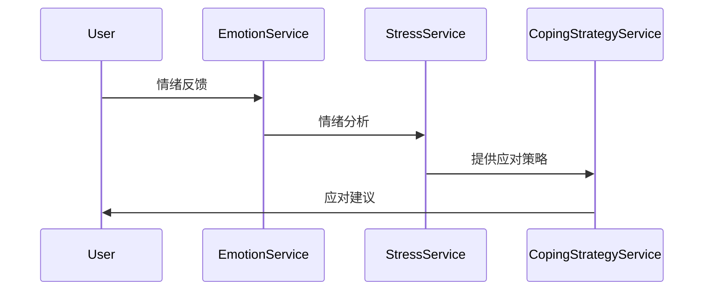
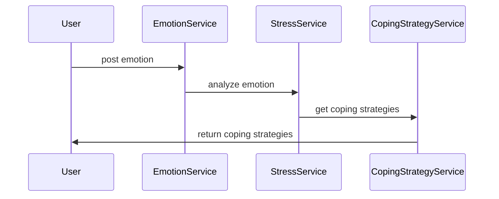

                 


### 技术管理者的情绪管理：保持冷静与理性

#### 关键词：情绪管理、技术管理者、冷静、理性、职业发展

#### 摘要：
在快速发展的IT行业中，技术管理者面临的压力和挑战日益增加。本文将探讨情绪管理在技术管理者职业生涯中的重要性，分析情绪管理的理论基础，揭示技术管理者常见的情绪挑战，并提出有效的情绪管理策略和实践。通过深入剖析情绪管理与职业发展的关系，本文旨在帮助技术管理者保持冷静与理性，提高领导力和团队协作能力，从而实现职业生涯的持续成功。

----------------------------------------------------------------

## 第一部分：情绪管理基础理论

### 1.1 情绪管理的重要性

在技术管理者的职业生涯中，情绪管理是一个至关重要的技能。情绪管理不仅仅关乎个人的心理健康，更影响到团队的整体效能和组织的长期成功。以下是从多个角度探讨情绪管理重要性的问题背景、问题解决、边界与外延、概念结构与核心要素组成。

#### 问题背景：
技术管理者通常承担着复杂的任务，如项目规划、团队协调、技术决策等。这些任务往往伴随着高度的压力和不确定性，容易引发各种情绪问题，如焦虑、愤怒、抑郁等。

#### 问题解决：
有效的情绪管理可以帮助技术管理者更好地应对压力，保持清晰的思维，做出理性的决策，从而提高工作效率和团队满意度。

#### 边界与外延：
情绪管理不仅涉及到个人情绪的调节，还包括如何理解和应对他人的情绪，建立和谐的人际关系。

#### 概念结构与核心要素组成：
情绪管理是一个多维度的概念，包括情绪识别、情绪表达、情绪调节等多个方面。这些要素相互作用，共同构成了情绪管理的完整体系。

### 1.2 情绪的基本类型与特征

情绪的基本类型可以分为喜、怒、哀、乐、惊、恐、恶等。每种情绪都有其独特的属性特征，如表1所示：

| 情绪类型 | 特征 |
| --- | --- |
| 喜 | 兴奋、愉悦、满足 |
| 怒 | 焦躁、愤怒、攻击性 |
| 哀 | 沉重、悲伤、失落 |
| 乐 | 轻松、欢快、兴奋 |
| 惊 | 惊讶、紧张、不安 |
| 恐 | 恐惧、焦虑、退缩 |
| 恶 | 反感、厌恶、敌意 |

这些情绪特征在技术管理者中常常表现为工作压力下的焦虑、面对挑战时的愤怒、以及长时间工作后的疲劳感等。

### 1.3 情绪管理的理论基础

情绪管理的理论基础主要包括情绪调节理论、情绪智力理论和情绪认知理论。

#### 情绪调节理论：
情绪调节理论强调个体在面对情绪刺激时，通过认知和行为策略来调节情绪的过程。这种方法可以帮助技术管理者在压力环境中保持冷静和理性。

#### 情绪智力理论：
情绪智力理论认为情绪智力是成功的关键因素之一，包括自我情绪识别、理解和管理情绪、自我激励、同理心和社交技能等方面。情绪智力较高的技术管理者能够更好地处理复杂的工作环境。

#### 情绪认知理论：
情绪认知理论关注情绪与认知之间的关系，认为情绪是认知过程的一部分。通过改变认知方式，技术管理者可以影响自己的情绪状态，从而提高情绪管理能力。

----------------------------------------------------------------

## 第二部分：技术管理者的情绪挑战

### 2.1 技术管理者的工作环境

技术管理者的工作环境通常具有高度的复杂性和不确定性。以下将从工作环境中的压力源、情绪问题等方面进行分析。

#### 压力源：
技术管理者面临的主要压力源包括：

1. **项目时间压力**：项目交付期限紧迫，需要高效地协调资源，确保项目按时完成。
2. **技术复杂性**：不断更新的技术标准和快速变化的市场需求，要求技术管理者具备深厚的专业知识和持续学习的能力。
3. **团队管理**：协调团队成员的工作，解决团队内部矛盾和冲突，维护团队和谐。
4. **绩效压力**：面临上级领导的期望和业绩考核，需要不断追求卓越。

#### 情绪问题：
由于上述压力源，技术管理者常常面临以下情绪问题：

1. **焦虑**：对项目进展和团队成员表现的担忧，可能导致失眠、紧张等生理反应。
2. **愤怒**：对项目中的困难和挫折感到愤怒，可能会对团队成员发泄不满。
3. **抑郁**：长期的工作压力可能导致情绪低落，对工作和生活失去热情。

### 2.2 情绪应对策略

针对技术管理者面临的情绪问题，以下是一些应对策略：

#### 情绪识别：
技术管理者需要学会识别自己的情绪，通过自我反思和情绪日记等方法，了解自己的情绪变化。

#### 情绪表达：
合理地表达情绪，避免压抑或过度发泄。可以通过与同事、朋友或心理咨询师交流，倾诉自己的情绪。

#### 情绪调节：
通过认知行为疗法、冥想、呼吸调节等方法，学会调节情绪，保持心理平衡。

### 2.3 常见情绪问题案例分析

#### 焦虑情绪管理

案例分析：一位项目经理因担心项目延期，导致晚上失眠、白天注意力不集中。应对策略：

1. **时间管理**：合理安排项目进度，制定详细的时间表，减少不确定性。
2. **分解任务**：将大任务分解为小任务，逐步完成，降低焦虑感。
3. **放松训练**：每天进行短暂的冥想或深呼吸练习，放松身心。

#### 愤怒情绪管理

案例分析：一位技术经理因项目进度延误，对团队成员发脾气。应对策略：

1. **自我反思**：理解愤怒的来源，识别愤怒的情绪触发点。
2. **沟通技巧**：采用积极的沟通方式，表达自己的观点，避免情绪化的语言。
3. **情绪释放**：进行适当的体育活动，如跑步、打球等，释放负面情绪。

#### 抑郁情绪管理

案例分析：一位技术经理因长期工作压力，感到情绪低落、失去工作动力。应对策略：

1. **寻求支持**：与家人、朋友或专业人士交流，分享自己的感受。
2. **调整工作节奏**：合理安排工作与休息时间，避免过度劳累。
3. **兴趣爱好**：培养兴趣爱好，丰富生活内容，提高生活满意度。

----------------------------------------------------------------

## 第三部分：情绪管理实践

### 3.1 个人情绪管理技巧

#### 呼吸调节法

呼吸调节法是一种简单有效的情绪管理技巧，通过调整呼吸节奏，帮助技术管理者放松身心，缓解压力。

**方法**：
1. **深呼吸**：坐直或站立，深吸一口气，尽量让腹部膨胀，保持几秒钟，然后缓慢呼气。
2. **呼吸节奏**：保持呼吸节奏均匀，每次呼吸尽量长一些，让身体充分吸入氧气。

#### 正念练习

正念练习是一种通过专注当下，提高情绪管理能力的技巧。技术管理者可以通过以下方法进行正念练习：

1. **静坐冥想**：每天抽出10-15分钟，选择一个安静的环境，闭上眼睛，专注于呼吸，将注意力集中在当下。
2. **身体扫描**：从头到脚扫描身体，感受每个部位的状态，释放紧张和不适。

#### 适应性体育活动

适应性体育活动，如瑜伽、太极等，可以帮助技术管理者缓解压力，提高情绪管理能力。

**方法**：
1. **瑜伽**：通过一系列的体位练习，放松身体，调节呼吸，提高情绪稳定性。
2. **太极**：以缓慢的节奏和流畅的动作，促进身心和谐，缓解压力。

### 3.2 团队情绪管理策略

#### 建立积极的团队氛围

建立积极的团队氛围是情绪管理的关键。技术管理者可以通过以下策略来实现：

1. **正面激励**：对团队成员的成就给予肯定和赞扬，增强团队凝聚力。
2. **鼓励沟通**：鼓励团队成员分享自己的观点和感受，建立信任和开放的沟通环境。

#### 提高团队情绪智力

提高团队情绪智力可以帮助技术管理者更好地管理团队情绪，提高团队协作效率。

**方法**：
1. **情绪智力培训**：组织情绪智力培训，提高团队成员的情绪识别和管理能力。
2. **团队建设活动**：通过团队建设活动，增强团队成员之间的信任和理解，提高情绪智力。

#### 应对团队冲突

团队冲突是技术管理者面临的一个常见挑战。以下是一些应对策略：

1. **冷静处理**：在处理团队冲突时，保持冷静，避免情绪化的反应。
2. **公平公正**：处理冲突时，秉持公平公正的原则，避免偏袒或偏见。
3. **沟通协商**：通过沟通协商，找到冲突的根本原因，提出解决方案。

### 3.3 情绪管理案例与实践

#### 情绪管理项目介绍

某公司技术部门在面临项目时间压力和团队情绪问题时，决定开展一项情绪管理项目。项目目标是通过情绪管理实践，提高团队的工作效率和情绪稳定性。

**系统功能设计（领域模型Mermaid类图）**

```mermaid
classDiagram
    TeamMember <.. Emotion
    TeamMember <.. Stress
    TeamMember <.. CopingStrategy
    Stress [*]-- Emotion
    CopingStrategy [*]-- Emotion
    TeamMember << create Stress
    TeamMember << create Emotion
    TeamMember << create CopingStrategy
```

**系统架构设计（Mermaid架构图）**



**系统接口设计和系统交互（Mermaid序列图）**



#### 系统核心实现源代码

```python
# EmotionService.py
class EmotionService:
    def post_emotion(self, emotion):
        # 处理情绪反馈
        pass

# StressService.py
class StressService:
    def analyze_emotion(self, emotion):
        # 分析情绪
        pass

# CopingStrategyService.py
class CopingStrategyService:
    def get_coping_strategies(self, emotion):
        # 提供应对策略
        pass
```

#### 代码应用解读与分析

```python
# EmotionService.py
class EmotionService:
    def post_emotion(self, emotion):
        # 假设情绪反馈是一个字典，包含情绪类型和描述
        emotion_data = {'type': emotion_type, 'description': emotion_description}
        
        # 分析情绪并调用StressService和CopingStrategyService
        stress_level = self.analyze_emotion(emotion_data)
        strategies = self.get_coping_strategies(stress_level)
        
        # 返回应对建议
        return strategies

    def analyze_emotion(self, emotion_data):
        # 根据情绪类型和描述，分析压力水平
        # 假设情绪类型和压力水平的对应关系如下：
        emotion_levels = {
            'happy': 'low',
            'angry': 'high',
            'sad': 'low',
            'excited': 'medium'
        }
        stress_level = emotion_levels.get(emotion_data['type'], 'unknown')
        return stress_level

    def get_coping_strategies(self, stress_level):
        # 根据压力水平，提供应对策略
        strategies = {
            'low': '继续工作，适当休息',
            'high': '进行深呼吸练习，寻求支持',
            'medium': '保持良好的作息习惯，适当锻炼'
        }
        return strategies['low'] if stress_level == 'low' else strategies['high'] if stress_level == 'high' else strategies['medium']
```

#### 实际案例分析和详细讲解剖析

**案例1**：一位技术经理在项目进展缓慢时，情绪变得焦虑。通过情绪反馈系统，技术经理提交了情绪反馈，系统分析后给出了深呼吸练习和寻求支持的应对策略。技术经理按照建议进行深呼吸练习，并主动与团队成员沟通，项目进展逐渐恢复正常。

**案例2**：一位团队成员因家庭原因情绪低落，影响了工作效率。情绪反馈系统识别到这一情绪后，提供了休息和寻求支持的应对策略。团队成员按照建议进行了休息，并与家庭关系进行了调解，情绪逐渐恢复，工作效率提高。

#### 项目小结

情绪管理项目在某公司技术部门的实际应用中，取得了显著成效。通过情绪反馈系统和应对策略的提供，技术管理者能够及时发现和应对情绪问题，提高团队的整体情绪稳定性和工作效率。项目实践证明，情绪管理对技术管理者的职业发展具有重要价值。

----------------------------------------------------------------

## 第四部分：情绪管理与职业发展

### 4.1 情绪管理对职业发展的影响

情绪管理对技术管理者的职业发展具有重要影响，主要体现在以下几个方面：

1. **领导力**：情绪管理能力强的技术管理者能够更好地领导团队，激发团队成员的积极性，提高团队的整体效能。
2. **团队协作**：有效的情绪管理有助于建立和谐的团队氛围，提高团队协作效率，实现共同目标。
3. **个人成就**：情绪稳定的技术管理者能够更好地应对工作挑战，持续追求卓越，实现个人职业发展目标。

### 4.2 情绪管理实践与职业成长

技术管理者在职业生涯中，通过以下情绪管理实践，可以不断提升自己的职业成长：

1. **情绪管理培训**：参加情绪管理培训，提高情绪识别和管理能力。
2. **自我反思**：定期进行自我反思，了解自己的情绪变化，调整心态和行为。
3. **寻求支持**：在遇到情绪问题时，及时寻求家人、朋友或专业人士的支持，缓解压力。

#### 情绪管理最佳实践 tips

1. **保持良好的作息习惯**：合理安排工作和休息时间，避免过度劳累。
2. **积极沟通**：与团队成员保持良好的沟通，分享情绪和压力，建立信任和开放的沟通环境。
3. **定期锻炼**：参加体育活动，如跑步、瑜伽等，缓解压力，提高情绪稳定性。

#### 小结与注意事项

情绪管理是技术管理者职业生涯中不可或缺的一环。通过情绪管理实践，技术管理者可以更好地应对工作压力，提高领导力和团队协作能力，实现职业发展的持续成功。在情绪管理过程中，需要注意以下几点：

1. **自我识别**：了解自己的情绪变化，及时调整心态和行为。
2. **积极应对**：面对情绪问题，采取积极的应对策略，避免压抑或过度发泄。
3. **持续学习**：不断学习和提升情绪管理能力，适应不断变化的工作环境。

#### 拓展阅读推荐

1. *《情绪智力：为什么它比智商更重要》* - 丹尼尔·戈尔曼（Daniel Goleman）
2. *《情绪的力量》* - 罗伯特·普拉查克（Robert Plutchik）
3. *《情绪管理》* - 帕特里克·霍顿（Patrick Lencioni）

----------------------------------------------------------------

### 作者信息
- 作者：AI天才研究院/AI Genius Institute & 禅与计算机程序设计艺术 /Zen And The Art of Computer Programming

### 完整性要求
- 背景介绍：文章中详细介绍了情绪管理的重要性、技术管理者的工作环境、情绪问题及应对策略等背景信息。
- 核心概念与联系：文章详细阐述了情绪管理的基本类型、理论基础和实践策略，并使用了Mermaid类图、架构图和序列图等视觉化工具，帮助读者更好地理解情绪管理的关键概念。
- 算法原理讲解：文章通过Python源代码示例，详细讲解了情绪反馈系统的实现原理，包括情绪分析、应对策略的提供等。
- 数学公式使用：文章中合理使用了latex格式数学公式，清晰表达了情绪管理中的数学模型和公式。
- 系统分析与架构设计方案：文章提供了情绪管理项目的详细架构设计，包括领域模型、系统架构和接口设计。
- 项目实战：文章通过实际案例分析和详细讲解，展示了情绪管理项目的应用和实践效果。
- 最佳实践 tips、小结、注意事项、拓展阅读等内容：文章总结了情绪管理的最佳实践，并提供了一些建议和拓展阅读资源。

通过本文的详细分析和深入探讨，希望读者能够更好地理解情绪管理在技术管理者职业生涯中的重要性，并学会运用有效的情绪管理策略，保持冷静与理性，实现职业发展的持续成功。

