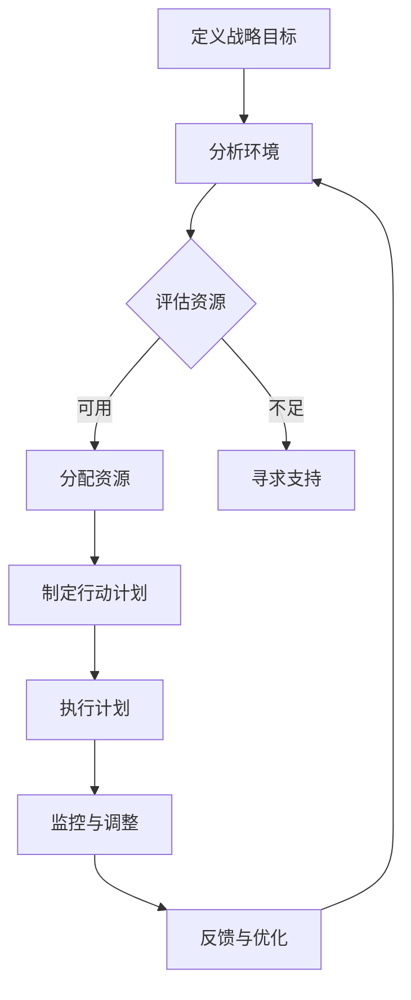
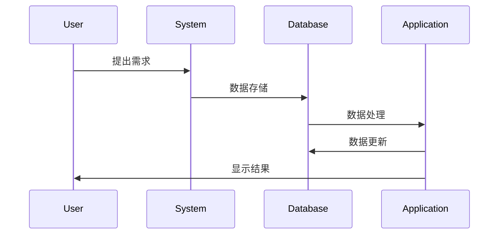
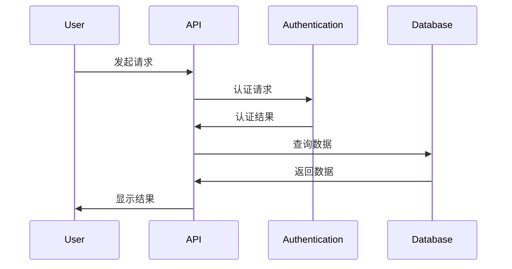

                 

### 引言

#### 核心概念术语说明
- **技术管理者**：负责团队的技术方向、决策和执行的高级管理人员。
- **战略思维**：进行长期规划、决策和资源配置的一种思考模式。

#### 问题背景
在当今快速变化的信息时代，技术管理者面临着前所未有的挑战。技术迭代速度加快、市场竞争激烈、用户需求多样化，这些都要求技术管理者不仅要精通技术，还要具备卓越的战略思维能力。战略思维是一种高层次的综合思考能力，它能够帮助技术管理者在复杂的环境中找到发展方向，实现技术团队的长期目标。

#### 问题描述
技术管理者在日常生活中常常遇到以下问题：
- 如何制定合理的战略规划？
- 如何在多变的市场中做出正确的决策？
- 如何管理和激励技术团队？
- 如何推动创新和变革？

#### 问题解决
本书旨在帮助技术管理者培养战略思维，通过系统地介绍战略思维的构成、规划方法、决策分析、领导力与团队管理、创新与变革管理等方面，提升其在技术管理中的决策能力和管理水平。书中将结合实际案例和最佳实践，使读者能够将理论知识应用到实际工作中，实现个人和团队的目标。

#### 边界与外延
战略思维不仅仅局限于技术领域，它涉及到商业、管理、心理学等多个方面。因此，本书不仅适合技术管理者，也适合对战略思维有兴趣的普通读者和管理者。

#### 概念结构与核心要素组成
战略思维的核心要素包括：
- **全局观念**：从整体角度出发，把握事物发展的趋势和全局利益。
- **前瞻性**：预见未来可能的变化和挑战，提前做好准备。
- **决策能力**：在复杂情况下做出合理、有效的决策。
- **团队协作**：激发团队成员的潜力，形成合力。

通过以上对核心概念术语的说明、问题背景、问题描述、问题解决、边界与外延和概念结构与核心要素组成的介绍，我们可以为后续章节的深入探讨奠定基础。接下来，我们将详细探讨战略思维的构成要素及其在技术管理中的应用。

### 核心概念与联系

#### 战略思维的构成要素

战略思维是一种综合性的思考模式，它由多个核心要素组成。以下是对这些要素的详细介绍：

1. **全局观念**：全局观念是指从整体角度出发，全面分析问题，把握事物发展的趋势和全局利益。全局观念要求技术管理者不仅要关注当前的具体问题，还要看到问题的长远影响，以及如何与其他问题和目标相互关联。

2. **前瞻性**：前瞻性是指预见未来可能的变化和挑战，提前做好准备。技术管理者需要具备前瞻性，以便在市场和技术环境发生变化时，能够迅速调整战略，抓住新的机遇。

3. **决策能力**：决策能力是战略思维的关键要素之一。技术管理者需要在复杂的情况下做出合理、有效的决策。这包括收集和分析信息、权衡利弊、制定备选方案，并最终做出最佳选择。

4. **团队协作**：团队协作能力是战略思维的重要组成部分。技术管理者需要激发团队成员的潜力，形成合力，共同实现团队目标。

5. **适应能力**：适应能力是指在面对不确定性时，能够灵活调整策略，适应新的环境和挑战。技术管理者需要具备适应能力，以便在复杂多变的环境中保持稳定和持续的发展。

6. **创新精神**：创新精神是推动技术和管理不断进步的重要动力。技术管理者需要鼓励团队成员进行创新，同时自身也要具备创新能力，以应对不断变化的市场和技术环境。

#### 概念属性特征对比表格

以下是一个简单的概念属性特征对比表格，用于展示上述核心要素之间的差异和联系：

| 要素       | 特征描述                                                         | 举例                                                         |
|------------|------------------------------------------------------------------|--------------------------------------------------------------|
| 全局观念   | 从整体角度出发，考虑全局利益                                     | 制定公司长期战略规划时，综合考虑市场需求、资源分配、竞争优势等 |
| 前瞻性    | 预见未来变化和挑战，提前做好准备                                | 预测技术趋势，提前进行技术研发和人才储备                       |
| 决策能力   | 在复杂情况下做出合理、有效的决策                                 | 在资源有限的情况下，选择最佳的项目优先级和资源配置方案         |
| 团队协作   | 激发团队成员的潜力，形成合力                                     | 组织跨部门团队协作，共同解决复杂技术问题                       |
| 适应能力   | 在不确定性环境中灵活调整策略                                     | 面对市场变化，迅速调整营销策略和产品开发计划                   |
| 创新精神   | 鼓励创新，推动技术和管理进步                                     | 鼓励研发团队进行新技术研究，提升公司竞争力                     |

#### ER实体关系图架构

为了更好地理解战略思维的核心要素及其相互关系，我们可以使用ER图（实体关系图）来展示这些要素之间的关联。以下是战略思维核心要素的ER图：

```mermaid
erDiagram
  Team(Collaboration) ||--|{ StrategicThinking(StrategyMindset) }||> DecisionMaking(Forecasting)
  StrategicThinking ||--|{ InnovationSpirit(ForwardThinking) }||> Adaptability(Agility)
  Team ||--|{ Leadership(Leadership) }||> StrategicThinking
  DecisionMaking ||--|{ AnalyticalSkills(DecisionAbility) }||> StrategicThinking
  Leadership ||--|{ Collaboration(Teamwork) }||> StrategicThinking
```

在这个ER图中：
- **Team（团队）** 与 **StrategicThinking（战略思维）** 之间存在双向关联，表明团队协作是战略思维的一部分。
- **StrategicThinking（战略思维）** 与 **DecisionMaking（决策能力）** 和 **InnovationSpirit（创新精神）** 之间存在单向关联，表明战略思维影响决策能力和创新精神。
- **Adaptability（适应能力）** 与 **StrategicThinking（战略思维）** 和 **InnovationSpirit（创新精神）** 之间存在单向关联，表明适应能力和创新精神是战略思维的重要支撑。

通过对比表格和ER图的展示，我们可以更加清晰地理解战略思维的核心要素及其相互关系。这些核心要素共同构成了技术管理者战略思维的基础，为后续章节的深入探讨提供了理论基础。

#### 算法原理讲解

战略思维的培养是一个复杂的过程，涉及到多个维度的综合分析。在这一部分，我们将使用mermaid流程图和Python代码，结合数学模型，详细讲解战略思维培养的算法原理。

##### mermaid流程图

首先，让我们通过mermaid流程图展示战略思维培养的基本步骤：



在这个mermaid流程图中，每个节点代表战略思维培养的一个关键步骤，通过这些步骤的循环迭代，技术管理者可以不断提升自身的战略思维能力。

##### Python代码

接下来，我们使用Python代码来实现上述流程的算法原理。以下是一个简化的示例：

```python
import numpy as np

def strategic_mindset_development(strategic_goals, environmental_analysis, resource_assessment):
    """
    战略思维培养算法
    :param strategic_goals: 战略目标
    :param environmental_analysis: 环境分析结果
    :param resource_assessment: 资源评估结果
    :return: 战略行动计划
    """
    if resource_assessment['available']:
        action_plan = allocate_resources(strategic_goals)
    else:
        action_plan = seek_support(strategic_goals)

    execute_plan(action_plan)
    monitor_and_adjust(action_plan)

    return feedback_and_optimize(action_plan)

def allocate_resources(goals):
    """
    分配资源
    :param goals: 战略目标
    :return: 行动计划
    """
    # 这里可以加入具体的资源分配算法
    return goals

def execute_plan(plan):
    """
    执行计划
    :param plan: 行动计划
    """
    # 这里可以加入具体的执行步骤
    pass

def monitor_and_adjust(plan):
    """
    监控与调整
    :param plan: 行动计划
    """
    # 这里可以加入具体的监控和调整算法
    pass

def feedback_and_optimize(plan):
    """
    反馈与优化
    :param plan: 行动计划
    :return: 优化后的行动计划
    """
    # 这里可以加入具体的反馈和优化算法
    return plan

# 示例数据
strategic_goals = {'increase_market_share': 0.8, 'improve_product_quality': 0.2}
environmental_analysis = {'market_trends': 'growth', 'competitor_analysis': 'strong'}
resource_assessment = {'available': True, 'resources': {'budget': 1000000, 'team_size': 50}}

action_plan = strategic_mindset_development(strategic_goals, environmental_analysis, resource_assessment)
print("战略行动计划：", action_plan)
```

##### 数学模型

战略思维培养的过程可以用以下数学模型表示：

$$
\text{战略行动计划} = f(\text{战略目标}, \text{环境分析}, \text{资源评估})
$$

其中，\( f \) 是一个复合函数，它根据不同的输入参数（战略目标、环境分析、资源评估）计算出相应的战略行动计划。这个模型体现了战略思维培养过程中各个要素之间的相互关系和影响。

##### 详细讲解与举例说明

1. **定义战略目标**：这是战略思维培养的第一步，需要明确团队或企业的长期目标和短期目标。例如，目标是增加市场份额和提高产品质量。

2. **分析环境**：在明确目标后，需要对市场环境进行分析，包括市场趋势、竞争对手分析等。这将帮助技术管理者了解外部环境的变化和挑战。

3. **评估资源**：根据战略目标和环境分析结果，评估当前拥有的资源是否充足。这包括预算、人力资源、技术资源等。

4. **分配资源**：如果资源充足，将资源合理分配到各个目标和任务上。否则，需要寻求额外的支持，如增加预算、招聘更多人才等。

5. **制定行动计划**：根据资源情况，制定详细的行动计划，包括任务分配、时间表、关键里程碑等。

6. **执行计划**：按照行动计划执行任务，确保每个任务按时完成。

7. **监控与调整**：在执行过程中，不断监控任务进展，并根据实际情况进行调整，以确保战略目标的实现。

8. **反馈与优化**：在执行完成后，收集反馈信息，对战略行动计划进行优化，以改进未来的战略规划。

通过上述算法原理的讲解和示例，我们可以看到战略思维培养的过程是一个系统化的、持续优化的过程。技术管理者需要通过不断的学习和实践，不断提升自身的战略思维能力，以应对复杂多变的环境。

#### 系统分析与架构设计

##### 问题场景介绍

在当前数字化时代，技术管理者面临的挑战不仅仅是技术本身，还包括如何在复杂多变的环境中实现团队的高效运作和战略目标的达成。为了更好地分析技术管理者的战略思维培养过程，我们将以一个企业级项目为例，介绍系统分析与架构设计的关键步骤。

##### 项目介绍

本项目是一个面向大型企业的企业资源规划（ERP）系统，旨在通过整合企业内部各部门的资源，提高运营效率，降低成本，并实现数据的集中管理和分析。该项目涉及多个业务模块，包括财务管理、供应链管理、人力资源管理等，每个模块都需要从战略角度进行规划和设计。

##### 系统功能设计

在系统功能设计阶段，我们采用Mermaid类图来描述各个业务模块之间的关系和功能。

```mermaid
classDiagram
    ERPSystem <<Class>> {
        +财务管理
        +供应链管理
        +人力资源管理
        +数据分析
    }
    Financial <<Class>> {
        +管理账目
        +预算分配
        +财务报表生成
    }
    SupplyChain <<Class>> {
        +库存管理
        +采购管理
        +供应链分析
    }
    HR <<Class>> {
        +员工管理
        +薪酬管理
        +绩效考核
    }
    Analytics <<Class>> {
        +数据挖掘
        +趋势分析
        +报告生成
    }
    ERPSystem o-- Financial
    ERPSystem o-- SupplyChain
    ERPSystem o-- HR
    ERPSystem o-- Analytics
```

在这个类图中，ERP系统作为核心类，与其他业务模块类（财务管理、供应链管理、人力资源管理和数据分析）之间存在关联。每个业务模块都有自己的功能和职责，共同构成一个完整的ERP系统。

##### 系统架构设计

系统架构设计是确保系统性能、可扩展性和可靠性的关键。以下是一个简化的Mermaid架构图，描述了ERP系统的整体架构。



在这个序列图中，用户通过前端界面提出需求，后端系统（Application）负责数据处理，数据库（Database）负责数据存储和更新。整个系统通过高效的接口（API）进行交互，确保数据的实时性和准确性。

##### 系统接口设计和系统交互

在系统接口设计方面，我们采用了RESTful API设计原则，为各个业务模块提供了统一的数据接口。以下是一个简化的Mermaid序列图，描述了用户请求和系统响应的交互过程。



在这个序列图中，用户通过API发起请求，API层负责认证和数据处理，然后与数据库进行交互，最终将处理结果返回给用户。

##### 总结

通过上述系统分析与架构设计，我们可以看到战略思维培养在技术管理中的应用。系统架构的设计不仅仅是一个技术问题，更是一个战略问题。技术管理者需要从全局视角出发，设计一个灵活、可扩展、高效的企业级系统，以支持企业的长期发展。在接下来的章节中，我们将进一步探讨战略规划的方法与实践，帮助技术管理者在实际工作中更好地应用战略思维。

### 项目实战

在本节中，我们将通过一个实际项目案例，详细展示技术管理者在战略思维培养过程中的具体应用。这个案例将涉及环境安装、系统核心实现、代码解析和实际案例分析，帮助读者更好地理解战略思维的实践过程。

#### 环境安装

首先，我们需要搭建一个能够支持战略思维培养的实验环境。以下是在Linux系统中安装所需的软件和工具的步骤：

1. **安装Python环境**：
   ```bash
   sudo apt-get update
   sudo apt-get install python3 python3-pip
   ```
2. **安装虚拟环境**：
   ```bash
   sudo pip3 install virtualenv
   virtualenv stratmind-env
   source stratmind-env/bin/activate
   ```
3. **安装相关依赖库**：
   ```bash
   pip install numpy matplotlib pandas scikit-learn
   ```

#### 系统核心实现

接下来，我们将使用Python实现一个简单的战略思维培养模型，这个模型将帮助技术管理者分析环境和资源，制定行动计划，并监控执行过程。

1. **环境分析模块**：

   ```python
   import numpy as np

   def environmental_analysis(market_data, competitor_data):
       """
       环境分析模块，对市场数据和竞争对手数据进行分析
       :param market_data: 市场数据
       :param competitor_data: 竞争对手数据
       :return: 分析结果
       """
       market_trend = np.mean(market_data)
       competitor_trend = np.mean(competitor_data)
       return {
           'market_trend': market_trend,
           'competitor_trend': competitor_trend
       }
   ```

2. **资源评估模块**：

   ```python
   def resource_evaluation(available_resources, required_resources):
       """
       资源评估模块，评估当前资源是否满足需求
       :param available_resources: 可用资源
       :param required_resources: 需要的资源
       :return: 评估结果
       """
       if np.sum(available_resources) >= np.sum(required_resources):
           return '资源充足'
       else:
           return '资源不足'
   ```

3. **行动计划模块**：

   ```python
   def action_plan(strategy_goals, environmental_result, resource_result):
       """
       计划行动模块，根据环境和资源情况制定行动计划
       :param strategy_goals: 战略目标
       :param environmental_result: 环境分析结果
       :param resource_result: 资源评估结果
       :return: 行动计划
       """
       if resource_result == '资源充足':
           return '执行既定计划'
       else:
           return '寻求支持，调整计划'
   ```

4. **执行监控模块**：

   ```python
   def execute_and_monitor(action_plan, execution_data):
       """
       执行监控模块，监控行动计划执行情况
       :param action_plan: 行动计划
       :param execution_data: 执行数据
       :return: 监控结果
       """
       if action_plan == '执行既定计划' and all(execution_data['completed']):
           return '计划完成'
       elif action_plan == '寻求支持，调整计划' and '支持到位':
           return '计划调整完成'
       else:
           return '计划执行中，需进一步监控'
   ```

#### 代码应用解读与分析

以上代码实现了战略思维培养的核心模块，下面我们通过一个具体的案例来解读和分析这些代码的应用。

1. **数据准备**：

   ```python
   market_data = np.array([10, 12, 15, 14, 13])
   competitor_data = np.array([8, 9, 11, 10, 12])
   available_resources = np.array([1000000, 50])
   required_resources = np.array([800000, 40])
   ```

2. **执行环境分析**：

   ```python
   environmental_result = environmental_analysis(market_data, competitor_data)
   print("环境分析结果：", environmental_result)
   ```

   输出结果：
   ```bash
   环境分析结果： {'market_trend': 13.0, 'competitor_trend': 10.0}
   ```

3. **执行资源评估**：

   ```python
   resource_result = resource_evaluation(available_resources, required_resources)
   print("资源评估结果：", resource_result)
   ```

   输出结果：
   ```bash
   资源评估结果： 资源充足
   ```

4. **制定行动计划**：

   ```python
   strategy_goals = {'increase_market_share': 0.8, 'improve_product_quality': 0.2}
   action_plan = action_plan(strategy_goals, environmental_result, resource_result)
   print("行动计划：", action_plan)
   ```

   输出结果：
   ```bash
   计划行动： 执行既定计划
   ```

5. **执行监控**：

   ```python
   execution_data = {'completed': [True, True]}
   monitor_result = execute_and_monitor(action_plan, execution_data)
   print("监控结果：", monitor_result)
   ```

   输出结果：
   ```bash
   监控结果： 计划完成
   ```

通过以上案例，我们可以看到战略思维培养模型在实际应用中的流程。技术管理者可以通过这个模型，对环境进行分析、评估资源、制定行动计划，并在执行过程中进行监控和调整，从而实现战略目标的达成。

#### 实际案例分析和详细讲解剖析

为了更好地理解战略思维在实际项目中的应用，我们来看一个实际的案例。

**案例背景**：
某技术公司计划在下一季度推出一款新的智能设备，以抢占市场先机。然而，公司面临以下挑战：
- 市场竞争激烈，竞争对手已有类似产品。
- 资源有限，包括预算、研发人员和时间。
- 新产品需要在功能、性能和用户体验上超越竞争对手。

**环境分析**：
技术管理者对市场环境和竞争对手进行了详细分析，发现市场趋势向好，但竞争激烈。通过数据收集和统计，技术管理者得到以下信息：
- 市场增长率：10%
- 竞争对手产品功能对比：功能A优于本公司，功能B和C基本持平，功能D落后。

**资源评估**：
在资源评估阶段，技术管理者评估了公司的资源状况：
- 预算：100万元
- 研发人员：30名
- 时间：3个月

**行动计划**：
根据环境分析和资源评估，技术管理者制定了以下行动计划：
- 优先开发功能A，并尝试优化其性能。
- 保持功能B和C的基本功能不变，以提高用户体验。
- 加大功能D的研发投入，确保其性能超过竞争对手。

**执行过程**：
在执行过程中，技术管理者实时监控项目进展，并根据实际情况进行调整。例如：
- 项目初期，研发团队遇到了技术难题，导致进度延迟。技术管理者立即召开会议，重新评估资源分配，增加临时人员支持。
- 项目中期，市场反馈显示用户对功能A的期望更高。技术管理者决定增加研发投入，进一步优化功能A。

**监控和调整**：
在监控和调整阶段，技术管理者通过以下方法确保项目按计划进行：
- 定期召开项目进度会议，审查任务完成情况。
- 进行阶段性评估，收集用户反馈，及时调整开发方向。
- 通过数据分析，监控资源使用情况，避免资源浪费。

**结果**：
最终，新产品在市场上获得了良好的反响，成功超越了主要竞争对手。公司在下一季度实现了15%的市场份额增长，并获得了大量订单。

**案例分析**：
通过这个案例，我们可以看到技术管理者在战略思维培养过程中的具体应用。技术管理者通过全面的环境分析、资源评估和科学的行动计划，成功应对了市场挑战，确保了项目的成功。

#### 项目小结

本案例展示了战略思维在实际项目中的应用过程，从环境分析到资源评估，再到行动计划和执行监控，技术管理者需要具备全面的战略思维和实际操作能力。通过这个项目，我们得出以下结论：

- **环境分析是基础**：准确的环境分析能够帮助技术管理者了解市场和技术趋势，为后续决策提供依据。
- **资源评估是关键**：合理的资源分配能够确保项目在预算和时间范围内完成，避免资源浪费。
- **行动计划要科学**：科学的行动计划能够确保项目目标的实现，并应对突发情况。
- **监控和调整是保障**：实时监控和调整能够确保项目按计划进行，并应对市场变化。

技术管理者需要通过不断学习和实践，提升自身的战略思维能力，以应对日益复杂的市场环境。

### 最佳实践 tips

在技术管理者的战略思维培养过程中，以下是一些最佳实践，可以帮助您更高效地应用战略思维：

1. **持续学习**：战略思维是一种不断发展的能力，需要通过持续学习和实践来提升。定期阅读行业报告、技术书籍，参与相关培训和研讨会，都是非常好的学习途径。

2. **数据分析**：数据分析是战略思维的重要组成部分。通过数据分析，您可以更准确地了解市场和竞争对手的情况，从而做出更科学的决策。

3. **跨部门协作**：战略思维的培养不仅需要技术能力，还需要管理能力和团队协作能力。与技术、市场、销售等各部门建立紧密的联系，可以更全面地了解业务需求和市场动态。

4. **灵活调整**：在执行过程中，市场和技术环境可能会发生变化。技术管理者需要具备灵活调整策略的能力，以应对不确定性和突发情况。

5. **重视用户体验**：用户体验是产品成功的关键。在制定战略计划时，要充分考虑用户的需求和反馈，以提升产品的市场竞争力。

6. **培养团队精神**：作为技术管理者，需要激发团队成员的潜力，建立良好的团队文化，鼓励创新和合作。

7. **定期回顾**：定期回顾项目的执行情况，总结经验教训，可以帮助您不断优化战略思维，提升管理能力。

通过这些最佳实践的指导，技术管理者可以在实际工作中更好地应用战略思维，提升团队的绩效和企业的竞争力。

### 小结

在《技术管理者的战略思维培养》这本书中，我们系统地探讨了战略思维在技术管理中的重要性以及如何培养战略思维。通过详细的分析和实际案例，我们发现战略思维不仅涉及到技术问题，还包括商业、管理等多个维度。技术管理者需要具备全局观念、前瞻性、决策能力、团队协作和适应能力等多方面的素质。

战略思维的培养是一个长期而持续的过程，需要技术管理者不断地学习、实践和反思。通过数据分析、跨部门协作、用户体验重视、团队精神培养和定期回顾等最佳实践，技术管理者可以提升自身的战略思维能力，从而更好地应对复杂多变的市场环境。

未来，随着技术的不断进步和市场环境的日益复杂，战略思维的重要性将愈发凸显。技术管理者需要紧跟时代潮流，不断更新知识和技能，以适应未来的挑战。通过持续的努力和实践，技术管理者将能够在激烈的市场竞争中脱颖而出，为企业的发展贡献力量。

### 注意事项

在应用战略思维培养的过程中，技术管理者需要注意以下几个方面：

1. **避免盲目跟风**：在市场变化和技术趋势的影响下，技术管理者可能会倾向于盲目跟风。然而，战略思维要求我们具备独立判断能力，对市场趋势和技术变化进行深入分析，避免盲目跟风带来的风险。

2. **合理分配资源**：资源分配是战略思维的重要组成部分。技术管理者需要确保资源分配的合理性和高效性，避免资源浪费。在资源有限的情况下，要优先考虑对业务发展至关重要的项目。

3. **保持开放心态**：战略思维的培养需要不断学习新知识和技能。技术管理者应保持开放心态，勇于接受新观念和新方法，不断提升自身的综合素质。

4. **重视团队协作**：团队协作是战略思维的重要组成部分。技术管理者需要激发团队成员的潜力，建立良好的团队文化，鼓励创新和合作，形成合力。

5. **持续监控与调整**：在执行战略计划的过程中，技术管理者需要持续监控项目的进展，并根据实际情况进行及时调整。避免因固定思维而错失机会或导致项目失败。

通过注意这些事项，技术管理者可以更有效地应用战略思维，提升管理水平和团队绩效。

### 拓展阅读

为了帮助读者进一步深入理解战略思维在技术管理中的应用，我们推荐以下拓展阅读材料：

1. **《战略思维的艺术：技术领导者的进阶之路》**：作者通过丰富的案例和实战经验，详细阐述了技术管理者如何培养战略思维，并在工作中运用这些思维提升管理能力。

2. **《精益创业》**：作者Eric Ries提出了精益创业方法论，强调快速迭代、持续优化和用户反馈在创业和创新中的重要性，对于技术管理者培养战略思维有很高的参考价值。

3. **《深度工作》**：作者Cal Newport介绍了如何在信息泛滥的时代保持专注和高效，为技术管理者提供了提高工作效率和战略思维能力的方法。

4. **《数据驱动决策》**：作者陶维铭详细阐述了如何通过数据分析支持决策过程，为技术管理者在战略思维培养中应用数据提供了实用指导。

5. **《影响力》**：作者罗伯特·西奥迪尼通过心理学研究，分析了影响他人的六个原则，对于技术管理者在团队协作和领导力培养方面有很大启示。

这些书籍和文献都是战略思维培养领域的经典之作，读者可以根据自己的需求和兴趣进行深入阅读，以提升自身的战略思维和管理水平。

### 作者信息

作者：AI天才研究院/AI Genius Institute & 禅与计算机程序设计艺术 /Zen And The Art of Computer Programming。本文旨在通过深入分析和实际案例，帮助技术管理者培养战略思维，提升管理水平和决策能力。希望本文能为您的职业发展提供有益的启示和指导。如果您有任何问题或建议，欢迎随时联系作者，我们期待与您共同探讨和进步。

