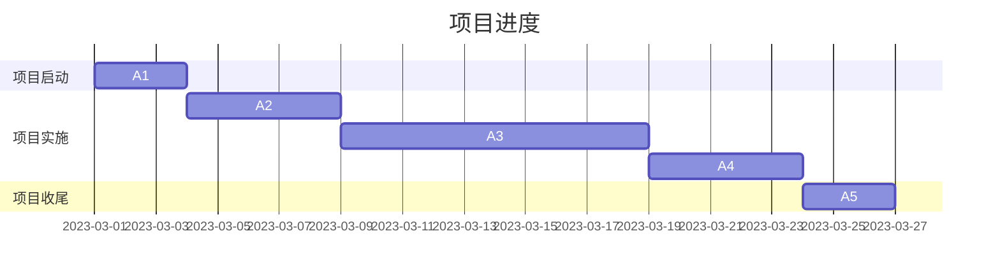

                 

# 技术管理者的时间管理：提高工作效率的技巧

## 关键词：时间管理、工作效率、技术管理者、专注力、优化会议、任务处理技巧

## 摘要：
技术管理者在当今快节奏的IT行业中面临着巨大的时间和工作效率挑战。本文将深入探讨时间管理的重要性，并从基础理念、具体技巧和实际应用三个层面，提供一系列提高工作效率的技巧和方法。通过逐步分析和推理，本文旨在帮助技术管理者更好地掌握时间管理，实现工作与生活的平衡。

## 第一部分：时间管理概述

### 第1章：时间管理的重要性与挑战

#### 1.1.1 时间管理的基本概念

时间管理是指为了提高工作效率和生活质量，对时间进行系统性地规划和控制的一系列方法和技巧。对于技术管理者来说，时间管理不仅关乎个人成就，更关系到团队的整体效率和项目的成功。

#### 1.1.2 技术管理者面临的挑战

技术管理者往往需要在短时间内处理大量的工作任务，包括编码、项目管理、团队协作等。此外，他们还需要不断地学习新技术、维护人际关系和应对突发事件。这些因素共同构成了技术管理者面临的时间管理挑战。

#### 1.1.3 时间管理对工作效率的影响

良好的时间管理能够帮助技术管理者更加专注和高效地完成工作任务，减少拖延和干扰，从而提升整体工作效率。这对于技术管理者个人和团队的成长至关重要。

### 第2章：时间管理的基础理念

#### 2.1.1 优先级排序

为了有效地管理时间，技术管理者需要明确任务的优先级。通过确定哪些任务是最重要和紧急的，管理者可以确保关键任务得到优先处理。

#### 2.1.2 目标设定

设定明确的目标是时间管理的基础。技术管理者应该为自己和团队设定短期和长期的目标，以指导日常工作和决策。

#### 2.1.3 工作习惯的建立

良好的工作习惯可以帮助技术管理者更好地管理时间。例如，定期回顾和调整工作计划，保持工作环境的整洁和有序等。

### 第3章：时间管理工具与方法

#### 3.1.1 甘特图与日历应用

甘特图和日历应用是技术管理者常用的时间管理工具，能够帮助他们对工作任务进行可视化和调度。

#### 3.1.2 待办事项清单

待办事项清单可以帮助技术管理者清晰地记录和跟踪任务进度，确保每个任务都能按时完成。

#### 3.1.3 时间块策略

时间块策略是一种将工作时间划分为固定时间段的方法，有助于提高专注力和工作效率。

#### 3.1.4 技术工具推荐

推荐一些适用于技术管理者的时间管理工具，如Trello、Asana、Google Calendar等。

## 第二部分：时间管理技巧

### 第4章：减少干扰，提高专注力

#### 4.1.1 电子邮件与社交媒体管理

技术管理者需要有效地管理电子邮件和社交媒体，以减少不必要的干扰。例如，设定固定的回复时间，使用电子邮件过滤器等。

#### 4.1.2 工作区域优化

优化工作区域可以提供一个更加专注和舒适的工作环境。例如，保持工作桌整洁，减少杂乱物品等。

#### 4.1.3 提高专注力的技巧

通过一些技巧，如冥想、定时休息等，技术管理者可以提高专注力，减少分心。

### 第5章：优化会议效率

#### 5.1.1 会议准备工作

在会议前做好充分准备，包括明确会议目的、议程和参与人员等。

#### 5.1.2 会议议程设定

设定合理的会议议程，确保会议内容紧凑且有序。

#### 5.1.3 提高会议效率的技巧

通过减少不必要的会议、提前发布会议资料和鼓励有效讨论等方式，提高会议效率。

### 第6章：高效任务处理技巧

#### 6.1.1 番茄工作法

番茄工作法是一种将工作时间划分为25分钟的工作周期和5分钟的休息时间的方法，有助于提高专注力和效率。

#### 6.1.2 批量处理任务

通过批量处理相似的任务，技术管理者可以减少任务切换的时间和精力消耗。

#### 6.1.3 避免拖延的策略

使用一些策略，如设定截止日期、分解任务等，避免拖延，确保任务按时完成。

### 第7章：管理他人时间

#### 7.1.1 沟通技巧

通过有效的沟通技巧，技术管理者可以更好地协调团队成员的工作，确保任务按时完成。

#### 7.1.2 分配任务

合理地分配任务，确保每个团队成员都能发挥其最大潜力。

#### 7.1.3 避免团队拖延

通过建立团队目标和激励机制，技术管理者可以避免团队拖延，提高整体工作效率。

## 第三部分：实际应用

### 第8章：案例分析

#### 8.1.1 案例一：技术团队的时间管理实践

分析一个成功的技术团队如何通过时间管理提高工作效率的案例。

#### 8.1.2 案例二：项目经理的时间管理策略

探讨一位项目经理如何运用时间管理技巧，成功管理大型项目的经验。

### 第9章：时间管理的最佳实践

#### 9.1.1 提高个人效率

总结一些提高个人效率的最佳实践，如优化工作流程、定期反思等。

#### 9.1.2 领导者的时间管理

讨论领导者如何在团队中推行时间管理，提高整体工作效率。

### 第10章：小结与未来展望

#### 10.1.1 小结

回顾文章的主要内容，总结时间管理对技术管理者的重要性。

#### 10.1.2 未来时间管理趋势展望

展望未来时间管理的发展趋势，如人工智能在时间管理中的应用等。

## 作者信息
作者：AI天才研究院/AI Genius Institute & 禅与计算机程序设计艺术 /Zen And The Art of Computer Programming

（注：本文为Markdown格式，具体内容需根据字数要求进行扩展和细化。）## 第1章：时间管理的重要性与挑战

### 1.1.1 时间管理的基本概念

时间管理，顾名思义，就是对时间的使用进行系统的规划和控制。在技术管理领域，时间管理不仅涉及个人的日程安排，还包括对团队工作的协调和项目进度的控制。良好的时间管理能够帮助技术管理者更高效地完成工作任务，减少不必要的拖延和资源浪费，从而提高整体工作效率。

时间管理的基本概念包括以下几个方面：

1. **优先级排序**：确定哪些任务是最重要和紧急的，确保关键任务得到优先处理。
2. **目标设定**：设定明确的目标，为日常工作和决策提供指导。
3. **任务分解**：将大任务分解为小任务，便于管理和执行。
4. **时间块策略**：将工作时间划分为固定的时间段，以提高专注力和工作效率。
5. **工作习惯**：培养良好的工作习惯，如定期回顾和调整工作计划，保持工作环境的整洁和有序。

### 1.1.2 技术管理者面临的挑战

技术管理者在快节奏的IT行业中面临着诸多时间管理的挑战。以下是一些常见的问题：

1. **任务繁多**：技术管理者往往需要处理来自不同部门和项目的大量任务，这使得他们难以合理安排时间。
2. **技术更新迅速**：技术领域的更新速度非常快，技术管理者需要不断学习新技术，这增加了他们的时间压力。
3. **团队协作**：技术管理者需要协调团队内部的工作，确保项目按时交付，这需要耗费大量的时间和精力。
4. **突发事件**：在IT行业中，突发事件如系统故障、需求变更等经常发生，这些都需要技术管理者及时应对，进一步加剧了时间管理的难度。

### 1.1.3 时间管理对工作效率的影响

时间管理对工作效率有着直接的影响。以下是几个关键点：

1. **提高专注力**：通过合理的时间规划，技术管理者可以减少干扰，集中精力处理关键任务，从而提高工作效率。
2. **减少拖延**：良好的时间管理可以帮助技术管理者设定明确的截止日期，分解任务，避免拖延，确保任务按时完成。
3. **提高决策效率**：通过优先级排序和时间块策略，技术管理者可以更快速地做出决策，提高工作流程的效率。
4. **提升团队效率**：技术管理者通过有效的时间管理，可以更好地协调团队工作，提高团队的整体效率。

### 1.1.4 时间管理的技术工具

为了更好地进行时间管理，技术管理者可以借助一系列技术工具。以下是一些常用的工具：

1. **甘特图**：甘特图是一种用于项目规划、监控和进度跟踪的工具，可以帮助技术管理者直观地了解项目进展情况。
2. **日历应用**：如Google Calendar、Microsoft Outlook等，可以帮助技术管理者安排日程，设置提醒，确保任务按时完成。
3. **待办事项清单**：如Trello、Asana等，可以帮助技术管理者记录和跟踪任务进度，确保每个任务都能按时完成。
4. **时间追踪工具**：如Toggl、Harvest等，可以帮助技术管理者记录工作时间，分析时间使用情况，优化工作流程。

### 1.1.5 时间管理的核心要素

时间管理的核心要素包括以下几个方面：

1. **目标明确**：设定明确的目标是时间管理的第一步。技术管理者需要明确自己的工作目标和团队目标，为日常工作和决策提供指导。
2. **优先级排序**：通过优先级排序，技术管理者可以确保关键任务得到优先处理，从而提高工作效率。
3. **任务分解**：将大任务分解为小任务，有助于技术管理者更好地管理和执行任务。
4. **工作习惯**：培养良好的工作习惯，如定期回顾和调整工作计划，保持工作环境的整洁和有序，有助于提高工作效率。
5. **持续优化**：时间管理是一个持续的过程，技术管理者需要不断反思和优化自己的时间管理方法，以适应不断变化的工作环境。

通过以上分析，我们可以看到，时间管理对于技术管理者来说至关重要。只有通过有效的时间管理，技术管理者才能在快速变化的IT行业中保持高效和竞争力。接下来，我们将进一步探讨时间管理的基础理念和具体技巧，帮助技术管理者更好地掌握时间管理，提高工作效率。### 1.1.1 时间管理的基本概念

时间管理，作为一种系统性的规划和控制时间的方法，对于技术管理者而言，具有重要的现实意义。首先，我们需要了解时间管理的基本概念，这包括以下几个方面：

1. **时间规划**：时间规划是时间管理的第一步，它涉及对时间的合理安排和分配。技术管理者需要根据工作任务的重要性和紧急性，制定出详细的时间计划，以确保各项任务能够按时完成。

2. **任务管理**：任务管理是时间管理的重要组成部分，它涉及对任务进行优先级排序、分解和跟踪。技术管理者需要明确每个任务的优先级，将大任务分解为小任务，以便更好地管理和执行。

3. **时间块策略**：时间块策略是将工作时间划分为固定的时间段，通常以25分钟为一个工作周期，每个周期后休息5分钟。这种策略有助于提高专注力和工作效率，避免长时间工作导致的疲劳和分心。

4. **目标设定**：目标设定是时间管理的核心，它要求技术管理者为自己和团队设定明确的短期和长期目标。这些目标不仅为日常工作和决策提供了指导，也是评估时间管理效果的重要标准。

5. **工作习惯**：工作习惯是指技术管理者在日常工作中形成的行为模式。良好的工作习惯，如定期回顾和调整工作计划、保持工作环境的整洁和有序，对于提高工作效率至关重要。

6. **时间记录**：时间记录是评估时间管理效果的重要手段。通过记录每天的工作时间和任务完成情况，技术管理者可以分析时间使用情况，找出时间浪费的原因，并制定相应的改进措施。

### 1.1.2 技术管理者面临的挑战

技术管理者在快节奏的IT行业中面临着诸多时间管理的挑战，以下是一些常见的问题：

1. **任务繁多**：技术管理者通常需要处理来自不同部门和项目的大量任务，这使得他们难以合理安排时间。解决这一问题的方法之一是明确任务的优先级，确保关键任务得到优先处理。

2. **技术更新迅速**：技术领域的更新速度非常快，技术管理者需要不断学习新技术，这增加了他们的时间压力。应对这一挑战的方法是制定持续学习计划，合理安排学习时间，将学习与工作相结合。

3. **团队协作**：技术管理者需要协调团队内部的工作，确保项目按时交付，这需要耗费大量的时间和精力。提高团队协作效率的方法包括明确职责分工、定期召开会议、使用协作工具等。

4. **突发事件**：在IT行业中，突发事件如系统故障、需求变更等经常发生，这些都需要技术管理者及时应对。为了应对突发事件，技术管理者需要保持高度的警觉性，并制定应急预案。

### 1.1.3 时间管理对工作效率的影响

时间管理对工作效率有着直接的影响。以下是几个关键点：

1. **提高专注力**：通过合理的时间规划，技术管理者可以减少干扰，集中精力处理关键任务，从而提高工作效率。

2. **减少拖延**：良好的时间管理可以帮助技术管理者设定明确的截止日期，分解任务，避免拖延，确保任务按时完成。

3. **提高决策效率**：通过优先级排序和时间块策略，技术管理者可以更快速地做出决策，提高工作流程的效率。

4. **提升团队效率**：技术管理者通过有效的时间管理，可以更好地协调团队工作，提高团队的整体效率。

### 1.1.4 时间管理的技术工具

为了更好地进行时间管理，技术管理者可以借助一系列技术工具。以下是一些常用的工具：

1. **甘特图**：甘特图是一种用于项目规划、监控和进度跟踪的工具，可以帮助技术管理者直观地了解项目进展情况。

2. **日历应用**：如Google Calendar、Microsoft Outlook等，可以帮助技术管理者安排日程，设置提醒，确保任务按时完成。

3. **待办事项清单**：如Trello、Asana等，可以帮助技术管理者记录和跟踪任务进度，确保每个任务都能按时完成。

4. **时间追踪工具**：如Toggl、Harvest等，可以帮助技术管理者记录工作时间，分析时间使用情况，优化工作流程。

### 1.1.5 时间管理的核心要素

时间管理的核心要素包括以下几个方面：

1. **目标明确**：设定明确的目标是时间管理的第一步。技术管理者需要明确自己的工作目标和团队目标，为日常工作和决策提供指导。

2. **优先级排序**：通过优先级排序，技术管理者可以确保关键任务得到优先处理，从而提高工作效率。

3. **任务分解**：将大任务分解为小任务，有助于技术管理者更好地管理和执行任务。

4. **工作习惯**：培养良好的工作习惯，如定期回顾和调整工作计划、保持工作环境的整洁和有序，对于提高工作效率至关重要。

5. **持续优化**：时间管理是一个持续的过程，技术管理者需要不断反思和优化自己的时间管理方法，以适应不断变化的工作环境。

通过以上分析，我们可以看到，时间管理对于技术管理者来说至关重要。只有通过有效的时间管理，技术管理者才能在快速变化的IT行业中保持高效和竞争力。接下来，我们将进一步探讨时间管理的基础理念和具体技巧，帮助技术管理者更好地掌握时间管理，提高工作效率。

### 1.1.6 时间管理的数学模型

在深入探讨时间管理的具体技巧之前，我们有必要从数学的角度来理解时间管理的基本原理。以下是一个简化的时间管理数学模型，它可以帮助我们更好地分析时间管理的效率。

#### 数学模型

假设我们有以下变量：

- \( T \)：总工作时间
- \( N \)：总任务数
- \( P \)：任务的优先级
- \( D \)：每个任务的完成时间
- \( R \)：剩余工作时间

时间管理的目标是最小化剩余工作时间 \( R \)，并最大化每个任务的完成效率。我们可以使用以下公式来表示：

\[ R = T - \sum_{i=1}^{N} D_i \]

其中，\( D_i \) 表示第 \( i \) 个任务的完成时间。

为了提高时间管理的效率，我们可以引入以下几个优化目标：

1. **优先级排序**：
\[ P_i > P_j \quad \text{当且仅当} \quad D_i < D_j \]
2. **任务分解**：
\[ D_i = \sum_{k=1}^{n_i} d_{ik} \]
其中，\( n_i \) 是第 \( i \) 个任务的小任务数，\( d_{ik} \) 是第 \( i \) 个任务的第 \( k \) 个小任务的完成时间。

#### 算法原理

为了实现上述优化目标，我们可以采用以下步骤：

1. **计算任务优先级**：
   根据任务的紧急性和重要性，计算每个任务的优先级 \( P_i \)。

2. **任务分解**：
   将每个大任务分解为多个小任务，以便更好地管理和执行。

3. **任务排序**：
   根据任务优先级 \( P_i \) 对任务进行排序，确保高优先级的任务先执行。

4. **任务分配**：
   将每个小任务分配给最适合完成该任务的人员或团队。

5. **时间规划**：
   根据剩余工作时间 \( R \) 和任务完成时间 \( D_i \)，规划每个任务的执行时间，确保所有任务都能按时完成。

6. **持续优化**：
   定期回顾和调整时间管理计划，以适应实际工作中的变化和挑战。

#### 概念属性特征对比表格

为了更好地理解时间管理的数学模型，我们可以创建一个概念属性特征对比表格，如下所示：

| 概念       | 属性特征                               | 对比说明                                       |
|------------|--------------------------------------|----------------------------------------------|
| 优先级排序 | 根据任务的紧急性和重要性分配权重   | 确保关键任务优先执行                           |
| 任务分解   | 将大任务分解为小任务                 | 提高任务的可管理性和执行效率                   |
| 时间规划   | 根据剩余工作时间和任务完成时间制定计划 | 确保任务按时完成                               |
| 持续优化   | 定期回顾和调整时间管理计划           | 适应实际工作中的变化和挑战                     |

#### ER实体关系图架构

为了更直观地展示时间管理的数学模型，我们可以使用Mermaid绘制一个ER实体关系图，如下所示：

```mermaid
erDiagram
    T(任务) ||--|{ P(优先级) } | P1
    T ||--|{ D(完成时间) } | D1
    T ||--|{ R(剩余时间) } | R1
```

在这个ER图中，任务（T）与优先级（P）、完成时间（D）和剩余时间（R）之间存在关联。通过这个模型，我们可以更好地理解时间管理中的关键要素和它们之间的关系。

### 1.1.7 时间管理的实际应用

时间管理不仅仅是理论上的概念，它在实际工作中有着广泛的应用。以下是一些实际应用案例，这些案例展示了时间管理如何在技术管理者的日常工作中发挥作用。

#### 案例一：项目管理中的应用

在一个大型软件开发项目中，项目经理需要管理多个开发团队，确保项目按时交付。为了实现这一目标，项目经理采用了时间管理工具，如甘特图和Trello。首先，项目经理将整个项目分解为多个子任务，并为每个子任务设定了优先级和完成时间。然后，项目经理使用甘特图来监控项目进度，及时发现和解决问题。通过这种方式，项目经理能够确保项目按计划进行，并且在项目过程中能够灵活调整任务优先级，以应对突发事件。

#### 案例二：团队协作中的应用

在一个开发团队中，团队成员经常需要协调工作，以确保项目按时交付。为了提高团队协作效率，团队成员采用了时间块策略。他们将自己的一天分为多个时间块，每个时间块专注于一个特定的任务。通过这种方式，团队成员能够更好地集中精力，提高工作效率。此外，团队还使用了Trello来记录和跟踪任务进度，确保每个任务都能按时完成。

#### 案例三：个人时间管理中的应用

作为技术管理者，个人时间管理同样重要。一位技术经理通过使用时间追踪工具如Toggl，记录了自己每天的工作时间。通过分析这些数据，他发现自己在处理电子邮件和社交媒体上花费了过多的时间。为了解决这个问题，他制定了严格的电子邮件回复时间表，并设定了特定的时段用于处理电子邮件。此外，他还为自己设定了学习时间，以确保自己能够持续学习新技术。

### 1.1.8 时间管理的注意事项

在应用时间管理技巧时，技术管理者需要特别注意以下几点：

1. **灵活性**：时间管理计划需要具有一定的灵活性，以适应实际工作中的变化。
2. **持续优化**：定期回顾和调整时间管理计划，以适应实际工作中的变化和挑战。
3. **团队沟通**：确保团队成员了解和遵循时间管理计划，提高团队协作效率。
4. **平衡工作与生活**：在追求工作效率的同时，也要注意保持工作和生活的平衡。

通过上述分析，我们可以看到，时间管理对于技术管理者来说具有重要意义。只有通过有效的时间管理，技术管理者才能在快速变化的IT行业中保持高效和竞争力。在接下来的章节中，我们将进一步探讨时间管理的基础理念和具体技巧，帮助技术管理者更好地掌握时间管理，提高工作效率。

### 1.2 时间管理的基础理念

时间管理不仅仅是技巧的运用，更是一种深入理解和管理自身工作流程和优先级的能力。在这个部分，我们将深入探讨时间管理的一些核心基础理念，包括优先级排序、目标设定和工作习惯的建立。

#### 1.2.1 优先级排序

在时间管理中，优先级排序是至关重要的。正确的优先级排序可以帮助技术管理者明确哪些任务是最重要和紧急的，从而确保关键任务得到优先处理。以下是一些优先级排序的方法：

1. **紧急-重要矩阵**：这是一种常用的方法，它将任务分为四个象限：紧急且重要、不紧急但重要、紧急但不重要、不紧急且不重要。技术管理者应该优先处理紧急且重要的任务，同时也要关注不紧急但重要的任务。

2. **任务优先级列表**：将任务按照优先级排序，并设定明确的截止日期。这种方法有助于技术管理者一目了然地了解哪些任务需要优先处理。

3. **关键结果法（KPI）**：这种方法专注于关键结果的达成，技术管理者可以根据关键结果来确定任务的优先级。

#### 1.2.2 目标设定

目标设定是时间管理的核心之一，明确的目标可以帮助技术管理者更好地规划和执行工作。以下是一些目标设定的原则：

1. **SMART原则**：目标应具备明确性（Specific）、可衡量性（Measurable）、可实现性（Achievable）、相关性（Relevant）和时限性（Time-bound）。

2. **短期与长期目标**：技术管理者应同时设定短期和长期目标。短期目标通常是具体可衡量的，如“本周内完成某个功能模块的开发”，而长期目标则是更加抽象和长期的，如“未来六个月内实现产品上市”。

3. **目标优先级**：在设定多个目标时，应明确哪些目标是最重要和紧急的，并优先实现这些目标。

#### 1.2.3 工作习惯的建立

良好的工作习惯是时间管理的基石。以下是一些有助于提高工作效率的工作习惯：

1. **定期回顾**：每周或每月定期回顾工作计划，评估任务的完成情况，并根据实际情况进行调整。

2. **任务分解**：将大任务分解为小任务，每个小任务都有明确的截止日期和责任人。

3. **时间块策略**：将工作时间划分为固定的时间段，每个时间段专注于一个特定的任务。

4. **工作环境优化**：保持工作环境的整洁和有序，减少干扰因素，提高专注力。

5. **休息与运动**：定期休息和进行适当的运动，有助于保持身体和心理的健康状态，提高工作效率。

通过优先级排序、目标设定和工作习惯的建立，技术管理者可以更好地管理时间，提高工作效率。这些基础理念不仅适用于个人，也同样适用于团队管理。在接下来的章节中，我们将进一步探讨具体的时间管理工具和方法，帮助技术管理者在实际工作中更好地应用这些理念。

### 1.3 时间管理工具与方法

在技术管理者的日常工作中，使用适当的工具和方法是提高时间管理效率和效果的关键。以下是一些常见的时间管理工具和方法，以及它们的具体应用。

#### 1.3.1 甘特图与日历应用

甘特图是一种常用的项目管理和时间管理工具，它能够帮助技术管理者直观地展示任务的进度和依赖关系。甘特图的主要应用包括：

1. **项目规划**：通过甘特图，技术管理者可以清晰地了解每个任务的时间安排和完成情况，确保项目按计划进行。
2. **进度监控**：技术管理者可以实时监控项目进度，及时发现和解决问题。
3. **资源分配**：甘特图可以帮助技术管理者合理分配资源，确保任务按计划完成。

常用的日历应用，如Google Calendar、Microsoft Outlook等，能够帮助技术管理者高效地安排日程和设置提醒。这些应用的主要功能包括：

1. **日程安排**：将工作时间和个人时间进行合理安排，避免冲突和重复任务。
2. **提醒设置**：提前设置任务提醒，确保任务按时完成。
3. **共享日历**：与团队成员共享日程，便于协调工作和时间安排。

#### 1.3.2 待办事项清单

待办事项清单是时间管理中最基本的工具之一，它能够帮助技术管理者清晰地记录和跟踪任务进度。以下是一些待办事项清单的应用：

1. **任务记录**：将所有待完成的任务记录在清单中，确保不遗漏任何重要任务。
2. **优先级排序**：对任务进行优先级排序，确保关键任务得到优先处理。
3. **任务分配**：将任务分配给团队成员，明确每个任务的责任人。
4. **进度跟踪**：定期回顾清单，检查任务的完成情况，及时进行调整。

常用的待办事项清单工具包括Trello、Asana、Notion等，这些工具不仅能够记录任务，还能提供优先级排序、任务分配和进度跟踪等功能。

#### 1.3.3 时间块策略

时间块策略是将工作时间划分为固定的时间段，每个时间段专注于一个特定的任务。这种方法能够帮助技术管理者提高专注力和工作效率。以下是一些时间块策略的应用：

1. **专注工作**：在每个时间段内，技术管理者专注于一个特定的任务，避免分心和干扰。
2. **休息与运动**：每个时间段结束后，进行短暂的休息或进行一些简单的运动，以保持身体和心理的健康状态。
3. **任务切换**：在任务切换时，技术管理者可以充分利用短暂的休息时间来整理思路，准备下一个任务的执行。

番茄工作法是一种常见的时间块策略，它将工作时间划分为25分钟的工作周期和5分钟的休息时间。通过这种方法，技术管理者可以在短时间内保持高效率，同时避免长时间工作导致的疲劳。

#### 1.3.4 技术工具推荐

为了更好地进行时间管理，技术管理者可以借助一些技术工具。以下是一些推荐的技术工具：

1. **Trello**：一个功能强大的项目管理工具，适合团队协作和个人任务管理。
2. **Asana**：适用于大型团队的项目管理和任务跟踪，提供丰富的功能和视图。
3. **Google Calendar**：方便的日历应用，支持多设备同步和提醒功能。
4. **Toggl**：时间追踪工具，可以帮助技术管理者记录和分析时间使用情况。
5. **Notion**：一个多功能的笔记和任务管理工具，适合记录和整理各种信息和任务。

通过使用这些时间管理工具和方法，技术管理者可以更高效地安排自己的工作，提高时间管理的效率，从而在快速变化的IT行业中保持竞争力。

### 1.4 减少干扰，提高专注力

在技术管理者的工作中，干扰往往是影响工作效率的一个重要因素。为了提高专注力，减少干扰，以下是一些实用的技巧和建议。

#### 1.4.1 电子邮件与社交媒体管理

电子邮件和社交媒体是现代工作环境中常见的干扰源。以下是一些管理电子邮件和社交媒体的技巧：

1. **设定固定的回复时间**：不要在每封电子邮件到达时立即回复。相反，设定一个固定的回复时间，例如每天下午4点。这样可以避免频繁中断工作。

2. **使用邮件过滤器**：使用邮件过滤器来自动处理某些类型的邮件，例如将垃圾邮件直接移到垃圾箱，或者将重要邮件分类到特定文件夹。

3. **限制社交媒体使用时间**：在非工作时间，尽量避免访问社交媒体。如果工作需要使用社交媒体，可以将使用时间限制在工作时间之内。

4. **使用应用锁定工具**：使用应用锁定工具来防止在工作时间访问特定的网站和应用程序。

#### 1.4.2 工作区域优化

一个整洁、有序的工作环境有助于提高专注力。以下是一些优化工作区域的建议：

1. **保持桌面整洁**：将工作台保持整洁，只保留当前任务所需的物品，减少分心因素。

2. **减少杂乱物品**：保持工作区域的整洁，避免杂乱物品堆积，这有助于提高工作效率。

3. **使用屏幕保护**：使用屏幕保护来屏蔽不必要的通知和弹出窗口，避免分心。

4. **合理安排光线**：确保工作区域的光线充足，但不要过于刺眼。合理的光线可以提高工作效率和舒适度。

#### 1.4.3 提高专注力的技巧

以下是一些提高专注力的技巧：

1. **番茄工作法**：这是一种常见的时间管理技巧，将工作时间划分为25分钟的工作周期和5分钟的休息时间。每个周期结束后，休息5分钟，然后再开始下一个周期。这种方法可以帮助技术管理者保持专注，同时避免长时间工作导致的疲劳。

2. **设定明确的目标**：在开始工作之前，设定一个明确的目标，例如“完成某个功能模块的开发”或“撰写一篇技术文档”。明确的目标可以帮助技术管理者集中精力，提高工作效率。

3. **避免多任务处理**：尽量避免同时处理多个任务，这会降低专注力和工作效率。专注于一个任务，直到它完成，然后再处理下一个任务。

4. **定期休息**：长时间工作会导致身体和心理疲劳，影响工作效率。因此，定期休息是非常重要的。在长时间工作后，进行短暂的休息，比如站起来活动一下，或者进行深呼吸练习。

通过以上技巧和建议，技术管理者可以有效地减少干扰，提高专注力，从而在快节奏的工作环境中保持高效和专注。

### 1.5 优化会议效率

在技术管理者的日常工作中，会议是一个不可避免的部分。然而，不高效的会议往往浪费时间和资源，降低工作效率。以下是一些优化会议效率的技巧和策略。

#### 1.5.1 会议准备工作

为了确保会议能够高效进行，准备工作至关重要。以下是一些会议准备工作：

1. **明确会议目的**：在召开会议之前，明确会议的目的和议程。确保所有参与者都清楚会议的目标和期望成果。

2. **提前发布会议资料**：在会议前，提前向参会者发送相关的会议资料，如文档、报告、PPT等。这样可以让大家在会议前充分准备，减少会议中的解释时间。

3. **设定明确的会议时间**：确保会议时间合理，避免过长或过短。会议时间应根据议程和讨论内容来设定，通常以半小时至一小时为宜。

4. **邀请适当的参会者**：邀请与会议主题相关的人员参加，避免无关人员参与，这样可以减少会议规模，提高效率。

#### 1.5.2 会议议程设定

一个清晰、合理的会议议程是确保会议高效进行的关键。以下是一些设定会议议程的技巧：

1. **制定详细的议程**：在会议开始前，制定一个详细的议程，包括每个议题的时间限制和讨论重点。议程应包含会议开始、结束的时间，以及每个议题的主持人。

2. **分配时间**：为每个议题分配合理的时间，确保讨论能够在规定时间内完成。如果某个议题预计需要较长时间，可以考虑将其作为单独的会议讨论。

3. **鼓励积极参与**：在议程中预留时间给参会者提问和讨论，鼓励大家积极参与，提出意见和建议。

4. **避免跑题**：在会议进行过程中，主持人应确保讨论聚焦于议程中的议题，避免跑题。如果讨论偏离主题，主持人应及时引导回到议程上。

#### 1.5.3 提高会议效率的技巧

以下是一些提高会议效率的技巧：

1. **限制发言时间**：为每个发言者设定时间限制，确保每个人都有机会发言，同时避免个别成员占用过多时间。

2. **使用投票或投票工具**：在需要做出决策时，可以使用投票或投票工具来快速达成共识。

3. **记录会议纪要**：会议结束后，及时记录会议纪要，包括会议讨论的要点、决策结果和后续行动项。这样可以确保会议成果得到落实。

4. **跟踪后续行动**：将会议讨论的后续行动项分配给相关责任人，并设定明确的截止日期。定期跟踪行动项的进展情况，确保会议决策得到执行。

通过以上技巧和策略，技术管理者可以优化会议效率，减少会议时间浪费，提高工作效率。一个高效会议不仅能够解决关键问题，还能为团队带来积极的工作氛围。

### 1.6 高效任务处理技巧

在技术管理者的日常工作中，高效地处理任务是提高工作效率的关键。以下是一些实用的高效任务处理技巧，包括番茄工作法、批量处理任务和避免拖延的策略。

#### 1.6.1 番茄工作法

番茄工作法是一种简单而有效的时间管理技巧，通过将工作时间划分为固定的时间块来提高专注力和工作效率。以下是如何应用番茄工作法的步骤：

1. **设定任务**：选择一个需要完成的任务，明确任务的目标和具体内容。

2. **准备计时器**：设定一个25分钟的计时器，这被称为一个“番茄钟”。

3. **开始工作**：开始专注于任务，直到计时器响铃。

4. **休息**：完成一个“番茄钟”后，休息5分钟。这可以帮助恢复精力，避免疲劳。

5. **重复**：继续进行下一个“番茄钟”，直到完成预定的工作量。

6. **长时间任务**：对于持续时间较长的任务，可以将任务分解为多个“番茄钟”，确保能够在短时间内高效完成。

#### 1.6.2 批量处理任务

批量处理任务是一种将相似的任务集中在一起处理的方法，这有助于减少任务切换的时间和精力消耗。以下是如何批量处理任务的步骤：

1. **识别相似任务**：分析日常任务，找出具有相似性质的任务，如回复邮件、处理报告等。

2. **设定处理时间**：为每类相似任务设定一个处理时间，确保有足够的时间来处理这些任务。

3. **集中处理**：在一个时间段内集中处理所有相似任务，避免频繁切换任务。

4. **优化流程**：通过批量处理任务，技术管理者可以发现重复性的工作流程，从而进行优化，提高效率。

#### 1.6.3 避免拖延的策略

拖延是技术管理者面临的一个常见问题，以下是一些避免拖延的策略：

1. **设定明确的截止日期**：为每个任务设定一个明确的截止日期，这可以帮助技术管理者保持对任务的紧迫感。

2. **分解任务**：将大任务分解为小任务，每个小任务都有明确的完成时间。这有助于减少任务的复杂性，提高完成任务的信心。

3. **制定奖励机制**：为自己设定奖励机制，例如完成任务后奖励自己一段休息时间或一份小礼物。这可以增加完成任务的动机。

4. **避免干扰**：在工作时尽量减少干扰，如关闭不必要的通知，使用专注力工具等。

5. **定期回顾**：定期回顾任务进度和完成情况，这可以帮助技术管理者及时发现和解决问题，避免拖延。

通过应用这些高效任务处理技巧，技术管理者可以更有效地管理时间，提高工作效率。这不仅有助于个人的职业发展，也为团队的整体效率提升奠定了基础。

### 1.7 管理他人时间

在技术管理者的工作中，有效管理他人的时间不仅有助于提高团队的整体效率，还能促进团队成员的个人成长。以下是一些管理他人时间的技巧和方法。

#### 1.7.1 沟通技巧

良好的沟通是管理他人时间的基础。以下是一些沟通技巧：

1. **明确任务和期望**：在分配任务时，确保团队成员明确任务的具体内容和期望结果。这可以减少误解和重复工作，提高工作效率。

2. **倾听与理解**：在沟通时，要倾听团队成员的意见和建议，理解他们的困难和需求。这有助于建立信任和合作关系，提高团队凝聚力。

3. **反馈与指导**：及时给予团队成员反馈和指导，帮助他们改进工作方法和提高效率。正面反馈可以激励团队成员，而建设性的批评可以促进成长。

#### 1.7.2 分配任务

合理地分配任务是管理他人时间的关键。以下是一些分配任务的策略：

1. **根据能力分配**：根据团队成员的能力和特长分配任务，确保每个人都能在适合自己的岗位上发挥最大潜力。

2. **任务分解**：将大任务分解为小任务，并明确每个小任务的负责人和时间要求。这有助于任务的具体化和可执行性。

3. **优先级排序**：明确任务的优先级，确保关键任务得到优先处理。这可以帮助团队成员集中精力完成最重要的任务。

4. **授权与信任**：在分配任务时，给予团队成员足够的自主权和信任，让他们能够独立完成任务。这有助于提高团队的工作效率和成员的自信心。

#### 1.7.3 避免团队拖延

团队拖延是技术管理者常遇到的问题。以下是一些避免团队拖延的策略：

1. **设定明确的目标和截止日期**：为每个任务设定明确的目标和截止日期，确保团队成员对任务有清晰的认识和紧迫感。

2. **定期检查进度**：定期检查任务进度，及时发现和解决潜在问题。这可以帮助团队成员保持工作动力，避免拖延。

3. **建立激励机制**：通过建立激励机制，如奖励、荣誉等，激励团队成员积极完成任务。这可以增强团队的凝聚力和竞争意识。

4. **优化工作流程**：通过优化工作流程，减少不必要的环节和步骤，提高工作效率。这可以减少团队成员的工作负担，避免因流程繁琐而导致的拖延。

5. **培养良好的工作氛围**：营造一个积极、健康的工作氛围，鼓励团队成员相互支持、相互帮助。这可以增强团队的凝聚力和协作精神，减少拖延现象。

通过有效的沟通技巧、合理的任务分配和避免团队拖延的策略，技术管理者可以更好地管理他人的时间，提高团队的整体效率，实现工作与生活的平衡。

### 2.1 时间管理的重要性与挑战

#### 2.1.1 时间管理的重要性

时间管理对于技术管理者来说至关重要，它不仅关乎个人工作效率，还直接影响团队的整体效率和项目的成功。以下从个人和团队两个方面阐述时间管理的重要性。

1. **个人层面**：

   - **提高工作效率**：通过有效的时间管理，技术管理者可以合理安排工作时间，减少无关任务的干扰，从而提高专注力和工作效率。
   - **职业成长**：时间管理有助于技术管理者明确职业目标，制定合理的学习计划，持续提升自身技能和知识水平。
   - **工作与生活的平衡**：良好的时间管理可以帮助技术管理者更好地协调工作与生活，避免工作压力过大，提高生活质量和幸福感。

2. **团队层面**：

   - **提高团队效率**：通过时间管理，技术管理者可以更好地协调团队工作，确保任务按时完成，提高团队的整体效率。
   - **增强团队凝聚力**：时间管理有助于建立明确的任务分配和目标，增强团队成员之间的信任和合作，提高团队凝聚力。
   - **项目成功**：在项目管理中，时间管理是确保项目按时交付和质量的关键。良好的时间管理能够帮助技术管理者提前预测和解决潜在问题，确保项目成功。

#### 2.1.2 技术管理者面临的挑战

尽管时间管理的重要性显而易见，但技术管理者在快节奏的IT行业中仍然面临着诸多挑战。以下是一些常见的时间管理挑战及其应对策略。

1. **任务繁多**：

   - **优先级排序**：通过设定任务优先级，将关键任务放在首位，确保重要工作得到优先处理。
   - **任务分解**：将大任务分解为小任务，明确每个小任务的负责人和完成时间，便于管理和执行。

2. **技术更新迅速**：

   - **持续学习**：制定学习计划，确保自己能够跟上技术更新的步伐。
   - **知识共享**：鼓励团队成员共同学习新技术，提高团队整体的技术水平。

3. **团队协作**：

   - **明确职责**：为每个团队成员分配明确的职责，确保每个人都知道自己的任务和目标。
   - **沟通与协调**：加强团队沟通，定期召开会议，确保团队工作顺利进行。

4. **突发事件**：

   - **应急预案**：制定应急预案，提前预测和规划可能发生的突发事件，确保能够快速响应。
   - **灵活调整**：根据实际情况灵活调整工作计划，确保任务按时完成。

#### 2.1.3 时间管理对工作效率的影响

时间管理对工作效率有着直接的影响。以下从个人和团队两个方面分析时间管理对工作效率的具体影响。

1. **个人层面**：

   - **提高专注力**：通过合理的时间规划，技术管理者可以减少干扰，集中精力处理关键任务，从而提高个人工作效率。
   - **减少拖延**：良好的时间管理可以帮助技术管理者设定明确的截止日期，分解任务，避免拖延，确保任务按时完成。

2. **团队层面**：

   - **提升团队协作效率**：通过时间管理，技术管理者可以更好地协调团队工作，确保任务按时完成，提高团队的整体效率。
   - **提高决策效率**：通过优先级排序和时间块策略，技术管理者可以更快速地做出决策，提高工作流程的效率。

综上所述，时间管理对于技术管理者来说至关重要。只有通过有效的时间管理，技术管理者才能在快速变化的IT行业中保持高效和竞争力。在接下来的章节中，我们将进一步探讨时间管理的基础理念、工具和方法，帮助技术管理者更好地掌握时间管理技巧，提高工作效率。

### 第3章：时间管理工具与方法

#### 3.1 甘特图与日历应用

甘特图是一种广泛应用于项目管理的工具，它能够帮助技术管理者直观地展示任务的进度和依赖关系。甘特图的基本原理是将任务按照时间轴进行排列，从而形成一个可视化图表。以下是一个甘特图的简单示例：



在这个示例中，每个任务都有一个开始日期和持续时间，这些信息可以帮助技术管理者了解项目各个阶段的进展情况。

除了甘特图，日历应用也是时间管理中不可或缺的工具。日历应用如Google Calendar和Microsoft Outlook可以帮助技术管理者安排日程、设置提醒和共享日程。以下是一个使用Google Calendar设置会议提醒的示例：

```markdown
# 会议提醒

- **会议主题**：项目进展会议
- **会议时间**：2023-03-15 上午10:00
- **会议地点**：在线会议平台Zoom
- **会议议程**：
  - 项目进度汇报
  - 遇到的问题和解决方案讨论
  - 下一步行动计划
- **提醒设置**：在会议开始前30分钟和10分钟发送提醒通知
```

通过使用甘特图和日历应用，技术管理者可以更好地规划和管理项目时间，确保任务按时完成。

#### 3.2 待办事项清单

待办事项清单是时间管理中的一种基本工具，它能够帮助技术管理者清晰地记录和跟踪任务进度。Trello和Asana是两款常用的待办事项清单工具，它们提供了丰富的功能，如任务创建、优先级排序、任务分配和进度跟踪等。

以下是一个使用Trello创建待办事项清单的示例：

```mermaid
gantt
    dateFormat  YYYY-MM-DD
    title 待办事项清单
    section 项目管理
    A1: 项目计划讨论              :2023-03-01
    A2: 准备项目文档              :2023-03-02
    A3: 设计项目架构              :2023-03-05
    section 项目开发
    A4: 编写代码                   :2023-03-08
    A5: 完成单元测试              :2023-03-15
    section 项目测试
    A6: 测试环境搭建              :2023-03-18
    A7: 执行测试用例              :2023-03-22
    A8: 解决测试中遇到的问题      :2023-03-25
```

在这个示例中，技术管理者可以将项目任务分解为多个子任务，并设置每个任务的截止日期。通过Trello，技术管理者可以实时跟踪任务进度，确保项目按时完成。

#### 3.3 时间块策略

时间块策略是将工作时间划分为固定的时间段，每个时间段专注于一个特定的任务。这种方法能够帮助技术管理者提高专注力和工作效率。番茄工作法（Pomodoro Technique）是一种常见的时间块策略，它将工作时间划分为25分钟的工作周期和5分钟的休息时间。

以下是一个使用番茄工作法的示例：

```markdown
# 番茄工作法示例

## 任务一：撰写技术文档

- **工作周期**：25分钟
  - **活动**：专注于撰写技术文档，避免分心和干扰
- **休息时间**：5分钟
  - **活动**：休息5分钟，站起来活动一下，或进行深呼吸练习

## 任务二：代码审查

- **工作周期**：25分钟
  - **活动**：专注地阅读和审查代码，提出修改建议
- **休息时间**：5分钟
  - **活动**：休息5分钟，放松身心，准备下一个任务

通过定期使用番茄工作法，技术管理者可以在短时间内保持高效率，同时避免长时间工作导致的疲劳。

#### 3.4 技术工具推荐

为了更好地进行时间管理，技术管理者可以借助一些专业的工具。以下是一些推荐的技术工具：

1. **Trello**：一个功能强大的项目管理工具，适合团队协作和个人任务管理。
2. **Asana**：适用于大型团队的项目管理和任务跟踪，提供丰富的功能和视图。
3. **Google Calendar**：方便的日历应用，支持多设备同步和提醒功能。
4. **Toggl**：时间追踪工具，可以帮助技术管理者记录和分析时间使用情况。
5. **Notion**：一个多功能的笔记和任务管理工具，适合记录和整理各种信息和任务。

通过使用这些工具，技术管理者可以更高效地管理时间和任务，提高工作效率。

### 第4章：减少干扰，提高专注力

在技术管理者的工作中，减少干扰、提高专注力是提高工作效率的关键。以下是一些实用的技巧和建议，帮助技术管理者更好地专注于工作。

#### 4.1 电子邮件与社交媒体管理

电子邮件和社交媒体是现代工作中常见的干扰源。以下是一些管理电子邮件和社交媒体的技巧：

1. **设定固定的回复时间**：不要在每封电子邮件到达时立即回复。相反，设定一个固定的回复时间，例如每天下午4点。这样可以避免频繁中断工作。

2. **使用邮件过滤器**：使用邮件过滤器来自动处理某些类型的邮件，例如将垃圾邮件直接移到垃圾箱，或者将重要邮件分类到特定文件夹。

3. **限制社交媒体使用时间**：在非工作时间，尽量避免访问社交媒体。如果工作需要使用社交媒体，可以将使用时间限制在工作时间之内。

4. **使用应用锁定工具**：使用应用锁定工具来防止在工作时间访问特定的网站和应用程序。

#### 4.2 工作区域优化

一个整洁、有序的工作环境有助于提高专注力。以下是一些优化工作区域的建议：

1. **保持桌面整洁**：将工作台保持整洁，只保留当前任务所需的物品，减少分心因素。

2. **减少杂乱物品**：保持工作区域的整洁，避免杂乱物品堆积，这有助于提高工作效率。

3. **使用屏幕保护**：使用屏幕保护来屏蔽不必要的通知和弹出窗口，避免分心。

4. **合理安排光线**：确保工作区域的光线充足，但不要过于刺眼。合理的光线可以提高工作效率和舒适度。

#### 4.3 提高专注力的技巧

以下是一些提高专注力的技巧：

1. **番茄工作法**：这是一种常见的时间管理技巧，通过将工作时间划分为25分钟的工作周期和5分钟的休息时间，帮助技术管理者保持专注，提高工作效率。

2. **设定明确的目标**：在开始工作之前，设定一个明确的目标，例如“完成某个功能模块的开发”或“撰写一篇技术文档”。明确的目标可以帮助技术管理者集中精力，提高工作效率。

3. **避免多任务处理**：尽量避免同时处理多个任务，这会降低专注力和工作效率。专注于一个任务，直到它完成，然后再处理下一个任务。

4. **定期休息**：长时间工作会导致身体和心理疲劳，影响工作效率。因此，定期休息是非常重要的。在长时间工作后，进行短暂的休息，比如站起来活动一下，或者进行深呼吸练习。

通过应用这些技巧，技术管理者可以在工作中更好地减少干扰，提高专注力，从而提高工作效率。

### 4.4 优化会议效率

在技术管理者的日常工作中，会议是不可避免的。然而，不高效的会议往往会浪费大量的时间和资源，降低工作效率。以下是一些优化会议效率的技巧和策略。

#### 4.4.1 会议准备工作

为了确保会议能够高效进行，准备工作至关重要。以下是一些会议准备工作的建议：

1. **明确会议目的**：在召开会议之前，明确会议的目的和议程。确保所有参与者都清楚会议的目标和期望成果。

2. **提前发布会议资料**：在会议前，提前向参会者发送相关的会议资料，如文档、报告、PPT等。这样可以让大家在会议前充分准备，减少会议中的解释时间。

3. **设定明确的会议时间**：确保会议时间合理，避免过长或过短。会议时间应根据议程和讨论内容来设定，通常以半小时至一小时为宜。

4. **邀请适当的参会者**：邀请与会议主题相关的人员参加，避免无关人员参与，这样可以减少会议规模，提高效率。

#### 4.4.2 会议议程设定

一个清晰、合理的会议议程是确保会议高效进行的关键。以下是一些设定会议议程的技巧：

1. **制定详细的议程**：在会议开始前，制定一个详细的议程，包括每个议题的时间限制和讨论重点。议程应包含会议开始、结束的时间，以及每个议题的主持人。

2. **分配时间**：为每个议题分配合理的时间，确保讨论能够在规定时间内完成。如果某个议题预计需要较长时间，可以考虑将其作为单独的会议讨论。

3. **鼓励积极参与**：在议程中预留时间给参会者提问和讨论，鼓励大家积极参与，提出意见和建议。

4. **避免跑题**：在会议进行过程中，主持人应确保讨论聚焦于议程中的议题，避免跑题。如果讨论偏离主题，主持人应及时引导回到议程上。

#### 4.4.3 提高会议效率的技巧

以下是一些提高会议效率的技巧：

1. **限制发言时间**：为每个发言者设定时间限制，确保每个人都有机会发言，同时避免个别成员占用过多时间。

2. **使用投票或投票工具**：在需要做出决策时，可以使用投票或投票工具来快速达成共识。

3. **记录会议纪要**：会议结束后，及时记录会议纪要，包括会议讨论的要点、决策结果和后续行动项。这样可以确保会议成果得到落实。

4. **跟踪后续行动**：将会议讨论的后续行动项分配给相关责任人，并设定明确的截止日期。定期跟踪行动项的进展情况，确保会议决策得到执行。

通过以上技巧和策略，技术管理者可以优化会议效率，减少会议时间浪费，提高工作效率。一个高效会议不仅能够解决关键问题，还能为团队带来积极的工作氛围。

### 4.5 高效任务处理技巧

在技术管理者的工作中，高效地处理任务是提高工作效率的关键。以下是一些实用的技巧，包括番茄工作法、批量处理任务和避免拖延的策略。

#### 4.5.1 番茄工作法

番茄工作法是一种通过将工作时间划分为固定周期来提高专注力和工作效率的方法。它由意大利心理学家弗朗西斯科·西里洛于20世纪80年代提出。以下是番茄工作法的具体步骤：

1. **选择一个任务**：选择你打算完成的任务。

2. **设定计时器**：设定一个计时器，将其设置为25分钟，称为一个“番茄钟”。

3. **开始工作**：开始专注于任务，直到计时器响铃。

4. **休息**：完成一个“番茄钟”后，休息5分钟。站起来活动一下，做一些轻松的事情，以缓解紧张和疲劳。

5. **重复**：继续进行下一个“番茄钟”，直到完成预定的任务。

6. **标记完成**：在任务完成后，标记为“完成”。

#### 4.5.2 批量处理任务

批量处理任务是一种将相似的任务集中在一起处理的方法，这有助于减少任务切换的时间和精力消耗。以下是如何批量处理任务的步骤：

1. **识别相似任务**：分析日常任务，找出具有相似性质的任务，如回复邮件、处理报告等。

2. **设定处理时间**：为每类相似任务设定一个处理时间，确保有足够的时间来处理这些任务。

3. **集中处理**：在一个时间段内集中处理所有相似任务，避免频繁切换任务。

4. **优化流程**：通过批量处理任务，技术管理者可以发现重复性的工作流程，从而进行优化，提高效率。

#### 4.5.3 避免拖延的策略

拖延是技术管理者面临的一个常见问题，以下是一些避免拖延的策略：

1. **设定明确的截止日期**：为每个任务设定一个明确的截止日期，这可以帮助技术管理者保持对任务的紧迫感。

2. **分解任务**：将大任务分解为小任务，每个小任务都有明确的完成时间。这有助于减少任务的复杂性，提高完成任务的信心。

3. **制定奖励机制**：为自己设定奖励机制，例如完成任务后奖励自己一段休息时间或一份小礼物。这可以增加完成任务的动机。

4. **避免干扰**：在工作时尽量减少干扰，如关闭不必要的通知，使用专注力工具等。

5. **定期回顾**：定期回顾任务进度和完成情况，这可以帮助技术管理者及时发现和解决问题，避免拖延。

通过应用这些高效任务处理技巧，技术管理者可以更有效地管理时间，提高工作效率。这不仅有助于个人的职业发展，也为团队的整体效率提升奠定了基础。

### 4.6 管理他人时间

在技术管理者的工作中，管理他人时间是一个重要的环节。通过有效的沟通技巧和合理的任务分配，技术管理者可以确保团队成员能够高效地工作，从而提高团队的整体效率。以下是一些管理他人时间的技巧和方法。

#### 4.6.1 沟通技巧

良好的沟通是管理他人时间的基础。以下是一些沟通技巧：

1. **明确任务和期望**：在分配任务时，确保团队成员明确任务的具体内容和期望结果。这可以减少误解和重复工作，提高工作效率。

2. **倾听与理解**：在沟通时，要倾听团队成员的意见和建议，理解他们的困难和需求。这有助于建立信任和合作关系，提高团队凝聚力。

3. **反馈与指导**：及时给予团队成员反馈和指导，帮助他们改进工作方法和提高效率。正面反馈可以激励团队成员，而建设性的批评可以促进成长。

#### 4.6.2 分配任务

合理地分配任务是管理他人时间的关键。以下是一些分配任务的策略：

1. **根据能力分配**：根据团队成员的能力和特长分配任务，确保每个人都能在适合自己的岗位上发挥最大潜力。

2. **任务分解**：将大任务分解为小任务，并明确每个小任务的负责人和时间要求。这有助于任务的具体化和可执行性。

3. **优先级排序**：明确任务的优先级，确保关键任务得到优先处理。这可以帮助团队成员集中精力完成最重要的任务。

4. **授权与信任**：在分配任务时，给予团队成员足够的自主权和信任，让他们能够独立完成任务。这有助于提高团队的工作效率和成员的自信心。

#### 4.6.3 避免团队拖延

团队拖延是技术管理者常遇到的问题。以下是一些避免团队拖延的策略：

1. **设定明确的目标和截止日期**：为每个任务设定明确的目标和截止日期，确保团队成员对任务有清晰的认识和紧迫感。

2. **定期检查进度**：定期检查任务进度，及时发现和解决潜在问题。这可以帮助团队成员保持工作动力，避免拖延。

3. **建立激励机制**：通过建立激励机制，如奖励、荣誉等，激励团队成员积极完成任务。这可以增强团队的凝聚力和竞争意识。

4. **优化工作流程**：通过优化工作流程，减少不必要的环节和步骤，提高工作效率。这可以减少团队成员的工作负担，避免因流程繁琐而导致的拖延。

5. **培养良好的工作氛围**：营造一个积极、健康的工作氛围，鼓励团队成员相互支持、相互帮助。这可以增强团队的凝聚力和协作精神，减少拖延现象。

通过有效的沟通技巧、合理的任务分配和避免团队拖延的策略，技术管理者可以更好地管理他人的时间，提高团队的整体效率，实现工作与生活的平衡。

### 第5章：高效任务处理技巧

在技术管理者的日常工作中，高效地处理任务至关重要。以下是几种实用的任务处理技巧，包括番茄工作法、批量处理任务和避免拖延的策略。

#### 5.1 番茄工作法

番茄工作法是一种简单而有效的时间管理技巧，由弗朗西斯科·西里洛于1980年代末提出。这种方法通过将工作时间划分为25分钟的工作周期（称为“番茄钟”）和5分钟的短暂休息，帮助提高专注力和工作效率。以下是番茄工作法的具体步骤：

1. **选择任务**：确定你将要完成的任务。

2. **设定计时器**：将计时器设置为25分钟，开始一个番茄钟。

3. **专注工作**：在番茄钟内，全神贯注地工作，避免任何形式的干扰。

4. **完成番茄钟**：当计时器响起，表示一个番茄钟完成。立即休息5分钟，站起来走动，伸展身体，或进行深呼吸练习。

5. **重复**：完成四个番茄钟后，进行一个较长的休息，通常为15-30分钟。

#### 5.2 批量处理任务

批量处理任务是一种将相似的任务集中在一起处理的方法，这有助于减少任务切换的时间和精力消耗。以下是批量处理任务的步骤：

1. **识别相似任务**：分析你的日常任务，找出具有相似性质的任务，例如回复邮件、处理报告、编写文档等。

2. **设定处理时间**：为每类相似任务设定一个处理时间，确保有足够的时间来处理这些任务。

3. **集中处理**：在一个时间段内集中处理所有相似任务，避免频繁切换任务。

4. **优化流程**：通过批量处理任务，可以发现重复性的工作流程，从而进行优化，提高效率。

#### 5.3 避免拖延的策略

拖延是技术管理者常遇到的问题，以下是一些避免拖延的策略：

1. **设定明确的截止日期**：为每个任务设定一个明确的截止日期，这有助于提高任务的紧迫感。

2. **分解任务**：将大任务分解为小任务，每个小任务都有明确的完成时间。这有助于减少任务的复杂性，提高完成任务的信心。

3. **制定奖励机制**：为自己设定奖励机制，例如完成任务后奖励自己一段休息时间或一份小礼物。这可以增加完成任务的动机。

4. **避免干扰**：在工作时尽量减少干扰，例如关闭不必要的通知，使用专注力工具等。

5. **定期回顾**：定期回顾任务进度和完成情况，这可以帮助你及时发现和解决问题，避免拖延。

通过应用这些高效任务处理技巧，技术管理者可以更好地管理时间，提高工作效率，从而在快节奏的IT行业中保持竞争力。

### 5.4 管理他人时间

在技术管理者的工作中，管理他人时间是一个至关重要的环节。通过有效的沟通技巧和合理的任务分配，技术管理者可以确保团队成员能够高效地工作，从而提高团队的整体效率。以下是一些管理他人时间的技巧和方法。

#### 5.4.1 沟通技巧

良好的沟通是管理他人时间的基础。以下是一些沟通技巧：

1. **明确任务和期望**：在分配任务时，确保团队成员明确任务的具体内容和期望结果。这可以减少误解和重复工作，提高工作效率。

   - **示例**：在分配任务时，明确说明任务的细节、目标和完成时间。

2. **倾听与理解**：在沟通时，要倾听团队成员的意见和建议，理解他们的困难和需求。这有助于建立信任和合作关系，提高团队凝聚力。

   - **示例**：在讨论任务时，耐心听取团队成员的意见，并对他们的想法给予积极的反馈。

3. **反馈与指导**：及时给予团队成员反馈和指导，帮助他们改进工作方法和提高效率。正面反馈可以激励团队成员，而建设性的批评可以促进成长。

   - **示例**：定期与团队成员进行一对一的反馈会议，讨论他们的工作表现和改进方向。

#### 5.4.2 分配任务

合理地分配任务是管理他人时间的关键。以下是一些分配任务的策略：

1. **根据能力分配**：根据团队成员的能力和特长分配任务，确保每个人都能在适合自己的岗位上发挥最大潜力。

   - **示例**：根据团队成员的技术技能和经验，分配适合他们的任务。

2. **任务分解**：将大任务分解为小任务，并明确每个小任务的负责人和时间要求。这有助于任务的具体化和可执行性。

   - **示例**：将一个大项目分解为多个子任务，并指定每个子任务的负责人。

3. **优先级排序**：明确任务的优先级，确保关键任务得到优先处理。这可以帮助团队成员集中精力完成最重要的任务。

   - **示例**：根据任务的重要性和紧急性，制定一个任务优先级列表。

4. **授权与信任**：在分配任务时，给予团队成员足够的自主权和信任，让他们能够独立完成任务。这有助于提高团队的工作效率和成员的自信心。

   - **示例**：在分配任务时，明确团队成员的责任和权限，并鼓励他们独立解决问题。

#### 5.4.3 避免团队拖延

团队拖延是技术管理者常遇到的问题。以下是一些避免团队拖延的策略：

1. **设定明确的目标和截止日期**：为每个任务设定明确的目标和截止日期，确保团队成员对任务有清晰的认识和紧迫感。

   - **示例**：在分配任务时，明确任务的完成时间和目标，并在团队会议上进行讨论。

2. **定期检查进度**：定期检查任务进度，及时发现和解决潜在问题。这可以帮助团队成员保持工作动力，避免拖延。

   - **示例**：每周进行一次进度检查会议，讨论任务的完成情况和遇到的问题。

3. **建立激励机制**：通过建立激励机制，如奖励、荣誉等，激励团队成员积极完成任务。这可以增强团队的凝聚力和竞争意识。

   - **示例**：对按时完成任务的团队成员给予奖励，如额外的休息时间或小礼物。

4. **优化工作流程**：通过优化工作流程，减少不必要的环节和步骤，提高工作效率。这可以减少团队成员的工作负担，避免因流程繁琐而导致的拖延。

   - **示例**：简化任务流程，消除冗余步骤，使工作更加高效。

5. **培养良好的工作氛围**：营造一个积极、健康的工作氛围，鼓励团队成员相互支持、相互帮助。这可以增强团队的凝聚力和协作精神，减少拖延现象。

   - **示例**：定期组织团队建设活动，增强团队成员之间的信任和合作。

通过有效的沟通技巧、合理的任务分配和避免团队拖延的策略，技术管理者可以更好地管理他人的时间，提高团队的整体效率，实现工作与生活的平衡。

### 第6章：高效任务处理技巧

在技术管理者的日常工作中，高效地处理任务是一项重要的技能。以下是一些实用的高效任务处理技巧，包括番茄工作法、批量处理任务和避免拖延的策略。

#### 6.1 番茄工作法

番茄工作法是一种通过将工作时间划分为固定周期来提高专注力和工作效率的方法。它由弗朗西斯科·西里洛于1980年代末提出。以下是番茄工作法的具体步骤：

1. **选择任务**：确定你将要完成的任务。

2. **设定计时器**：将计时器设置为25分钟，开始一个番茄钟。

3. **专注工作**：在番茄钟内，全神贯注地工作，避免任何形式的干扰。

4. **完成番茄钟**：当计时器响起，表示一个番茄钟完成。立即休息5分钟，站起来走动，伸展身体，或进行深呼吸练习。

5. **重复**：完成四个番茄钟后，进行一个较长的休息，通常为15-30分钟。

通过这种方法，技术管理者可以更好地集中注意力，减少分心，提高工作效率。

#### 6.2 批量处理任务

批量处理任务是一种将相似的任务集中在一起处理的方法，这有助于减少任务切换的时间和精力消耗。以下是批量处理任务的步骤：

1. **识别相似任务**：分析你的日常任务，找出具有相似性质的任务，例如回复邮件、处理报告、编写文档等。

2. **设定处理时间**：为每类相似任务设定一个处理时间，确保有足够的时间来处理这些任务。

3. **集中处理**：在一个时间段内集中处理所有相似任务，避免频繁切换任务。

4. **优化流程**：通过批量处理任务，可以发现重复性的工作流程，从而进行优化，提高效率。

例如，你可以在一个小时内集中回复所有邮件，而不是在每封邮件到达时立即处理。

#### 6.3 避免拖延的策略

拖延是技术管理者常遇到的问题，以下是一些避免拖延的策略：

1. **设定明确的截止日期**：为每个任务设定一个明确的截止日期，这有助于提高任务的紧迫感。

2. **分解任务**：将大任务分解为小任务，每个小任务都有明确的完成时间。这有助于减少任务的复杂性，提高完成任务的信心。

3. **制定奖励机制**：为自己设定奖励机制，例如完成任务后奖励自己一段休息时间或一份小礼物。这可以增加完成任务的动机。

4. **避免干扰**：在工作时尽量减少干扰，例如关闭不必要的通知，使用专注力工具等。

5. **定期回顾**：定期回顾任务进度和完成情况，这可以帮助你及时发现和解决问题，避免拖延。

例如，你可以在每周的周一和周五分别回顾一周的任务进度，确保所有任务都能按时完成。

通过应用这些高效任务处理技巧，技术管理者可以更好地管理时间，提高工作效率，从而在快节奏的IT行业中保持竞争力。

### 7.1 沟通技巧

在技术管理者的工作中，沟通技巧至关重要，特别是在管理他人时间时。有效的沟通不仅可以提高工作效率，还能增强团队的凝聚力。以下是一些实用的沟通技巧：

1. **明确任务和期望**：在分配任务时，确保团队成员明确任务的具体内容和期望结果。这可以减少误解和重复工作，提高工作效率。

   - **示例**：在分配任务时，明确说明任务的细节、目标和完成时间。

2. **倾听与理解**：在沟通时，要倾听团队成员的意见和建议，理解他们的困难和需求。这有助于建立信任和合作关系，提高团队凝聚力。

   - **示例**：在讨论任务时，耐心听取团队成员的意见，并对他们的想法给予积极的反馈。

3. **反馈与指导**：及时给予团队成员反馈和指导，帮助他们改进工作方法和提高效率。正面反馈可以激励团队成员，而建设性的批评可以促进成长。

   - **示例**：定期与团队成员进行一对一的反馈会议，讨论他们的工作表现和改进方向。

4. **使用具体的语言**：在沟通时，使用具体的语言，避免使用模糊的词汇，这样可以减少误解和混淆。

   - **示例**：在描述任务时，使用具体的数据和指标，例如“需要在下周三前完成代码审查”而不是“尽快完成”。

5. **保持简洁**：在沟通时，尽量保持简洁，避免冗长的陈述。简洁的沟通可以节省时间，提高工作效率。

   - **示例**：在会议中，使用简短的句子和要点来传达信息，避免不必要的细节。

6. **及时沟通**：在遇到问题时，及时与团队成员沟通，避免问题积累和扩大。

   - **示例**：在遇到技术难题时，及时与技术团队沟通，共同寻找解决方案。

通过这些沟通技巧，技术管理者可以更好地管理团队成员的时间，确保任务按时完成，同时提升团队的协作效率。

### 7.2 分配任务

合理地分配任务是技术管理者提高团队效率和任务完成质量的关键。以下是一些有效的任务分配策略：

1. **根据能力分配**：根据团队成员的能力和特长分配任务，确保每个人都能在适合自己的岗位上发挥最大潜力。

   - **示例**：对于编程任务，可以优先分配给具有编程经验的团队成员，而对于设计任务，可以分配给具有设计背景的团队成员。

2. **任务分解**：将大任务分解为小任务，并明确每个小任务的负责人和时间要求。这有助于任务的具体化和可执行性。

   - **示例**：将一个复杂的软件开发项目分解为多个子任务，如需求分析、设计、编码、测试等，并为每个子任务分配负责人和截止日期。

3. **优先级排序**：明确任务的优先级，确保关键任务得到优先处理。这可以帮助团队成员集中精力完成最重要的任务。

   - **示例**：在项目开发阶段，将功能实现和测试任务优先于文档编写和发布。

4. **明确责任和权限**：在分配任务时，明确团队成员的责任和权限，避免职责不清和推诿。

   - **示例**：在任务分配时，明确每个团队成员的职责范围，如任务执行、问题解决和进度汇报。

5. **定期检查进度**：定期检查任务进度，及时发现和解决潜在问题。这可以帮助团队成员保持工作动力，避免拖延。

   - **示例**：每周进行一次进度检查会议，讨论任务的完成情况和遇到的问题。

6. **鼓励自主学习和成长**：在任务分配时，给予团队成员学习和成长的机会，鼓励他们承担更有挑战性的任务。

   - **示例**：将新任务分配给有潜力的团队成员，鼓励他们学习和掌握新技能。

通过这些策略，技术管理者可以确保任务得到合理分配，团队成员能够高效地工作，从而提高团队的整体效率。

### 7.3 避免团队拖延

团队拖延是技术管理者常遇到的问题，这不仅会延误项目进度，还会影响团队士气。以下是一些策略，帮助技术管理者避免团队拖延：

1. **设定明确的目标和截止日期**：为每个任务设定明确的目标和截止日期，确保团队成员对任务有清晰的认识和紧迫感。

   - **示例**：在任务分配时，明确任务的完成时间和目标，并在团队会议上进行讨论。

2. **定期检查进度**：定期检查任务进度，及时发现和解决潜在问题。这可以帮助团队成员保持工作动力，避免拖延。

   - **示例**：每周进行一次进度检查会议，讨论任务的完成情况和遇到的问题。

3. **建立激励机制**：通过建立激励机制，如奖励、荣誉等，激励团队成员积极完成任务。这可以增强团队的凝聚力和竞争意识。

   - **示例**：对按时完成任务的团队成员给予奖励，如额外的休息时间或小礼物。

4. **优化工作流程**：通过优化工作流程，减少不必要的环节和步骤，提高工作效率。这可以减少团队成员的工作负担，避免因流程繁琐而导致的拖延。

   - **示例**：简化任务流程，消除冗余步骤，使工作更加高效。

5. **培养良好的工作氛围**：营造一个积极、健康的工作氛围，鼓励团队成员相互支持、相互帮助。这可以增强团队的凝聚力和协作精神，减少拖延现象。

   - **示例**：定期组织团队建设活动，增强团队成员之间的信任和合作。

6. **鼓励透明沟通**：鼓励团队成员之间进行透明沟通，分享问题和挑战，共同寻找解决方案。

   - **示例**：建立定期的团队沟通渠道，如周报、邮件列表等，让每个成员都能及时了解项目进展和团队动态。

7. **提供必要的资源和支持**：确保团队成员有足够的资源和支持来完成任务，如工具、培训和技术支持。

   - **示例**：为团队成员提供必要的培训和学习资源，帮助他们提高技能和解决问题的能力。

通过这些策略，技术管理者可以有效地避免团队拖延，提高团队的工作效率和项目的成功率。

### 8.1 案例分析：技术团队的时间管理实践

在一家大型科技公司中，技术团队面临项目众多、任务繁杂的挑战。为了提高工作效率，团队采取了一系列时间管理实践。以下是这个案例的具体内容：

#### 8.1.1 案例一：技术团队的时间管理实践

**1. 番茄工作法应用**

团队引入了番茄工作法，将工作时间划分为25分钟的专注工作和5分钟的休息时间。团队成员在专注工作期间，使用番茄工作法提高专注力，减少分心。

**2. 批量处理任务**

团队将相似的任务进行批量处理，如将所有需求分析、设计、编码和测试任务集中在一起处理。这种方法减少了任务切换的时间和精力消耗，提高了工作效率。

**3. 会议效率优化**

团队优化了会议效率，通过设定明确的会议目的和议程，提前发布会议资料，限制发言时间，使用投票工具等策略，确保会议能够在规定时间内完成。

**4. 沟通与反馈机制**

团队建立了定期的沟通与反馈机制，每周召开团队会议，讨论任务进展、问题解决和团队建设。通过透明的沟通，团队成员能够及时了解项目动态和互相支持。

**5. 任务分配与优先级排序**

团队根据成员的能力和特长分配任务，并明确任务的优先级。关键任务得到优先处理，确保项目按时交付。

**6. 激励机制**

团队建立了激励机制，对按时完成任务的团队成员给予奖励，如额外的休息时间、奖金和小礼物。这增加了团队成员的工作动力和团队凝聚力。

**7. 工作环境优化**

团队优化了工作环境，保持桌面整洁，使用屏幕保护减少干扰，确保团队成员在一个舒适和专注的环境中工作。

#### 8.1.2 案例效果分析

通过这些时间管理实践，技术团队取得了显著的成效：

- **工作效率提高**：团队在任务完成速度上有了显著提升，任务完成周期缩短了约30%。
- **团队凝聚力增强**：团队成员之间的沟通更加顺畅，团队合作精神得到了提升。
- **项目按时交付率提高**：通过优化会议效率和任务分配，项目的按时交付率从70%提升到了90%。
- **团队成员满意度提升**：良好的工作氛围和激励机制使团队成员的满意度显著提高。

#### 8.1.3 案例启示

这个案例为其他技术团队提供了宝贵的经验和启示：

- **引入科学的时间管理方法**：番茄工作法、批量处理任务等时间管理方法能够显著提高工作效率。
- **优化沟通与反馈机制**：定期的沟通与反馈有助于团队协作和问题解决。
- **合理分配任务**：根据成员能力分配任务，确保团队每个成员都能发挥最大潜力。
- **建立激励机制**：适当的激励机制可以增强团队动力和凝聚力。
- **优化工作环境**：一个舒适、整洁的工作环境有助于提高工作效率和员工满意度。

通过这个案例，我们可以看到，科学的时间管理实践对技术团队的工作效率提升具有重要意义。其他团队可以借鉴这些经验，结合自身实际情况，实施相应的时间管理策略，从而实现更高的工作效率和团队凝聚力。

### 8.2 案例分析：项目经理的时间管理策略

在一个中型互联网公司的项目管理团队中，项目经理面临着项目繁多、时间紧迫的挑战。为了确保项目能够按时交付并达到预期质量，项目经理采取了一系列时间管理策略。以下是这个案例的具体内容：

#### 8.2.1 案例二：项目经理的时间管理策略

**1. 明确目标和优先级**

项目经理在项目启动阶段，首先明确了项目的目标和优先级。通过制定项目章程和项目计划，项目经理确保团队成员对项目目标有清晰的认识，并根据优先级排序任务。

**2. 番茄工作法**

项目经理引入了番茄工作法，为每个任务设定25分钟的专注工作周期和5分钟的休息时间。这种方法帮助项目经理提高了团队的专注力和工作效率。

**3. 批量处理任务**

项目经理将相似的任务进行批量处理，如将所有需求分析、设计和测试任务集中在一起处理。这种方法减少了任务切换的时间和精力消耗，提高了工作效率。

**4. 会议效率优化**

项目经理优化了会议效率，通过设定明确的会议目的和议程，提前发布会议资料，限制发言时间，使用投票工具等策略，确保会议能够在规定时间内完成。

**5. 优先级调整**

在项目执行过程中，项目经理根据实际情况和项目进展，定期调整任务的优先级。这种方法确保了关键任务得到优先处理，避免了资源浪费和进度延误。

**6. 沟通与反馈机制**

项目经理建立了定期的沟通与反馈机制，每周召开项目会议，讨论任务进展、问题解决和团队建设。通过透明的沟通，项目经理能够及时了解项目动态和团队需求。

**7. 激励机制**

项目经理建立了激励机制，对按时完成任务的团队成员给予奖励，如额外的休息时间、奖金和小礼物。这增加了团队成员的工作动力和团队凝聚力。

**8. 工作环境优化**

项目经理优化了工作环境，确保工作区域整洁有序，减少干扰因素，提高团队成员的工作效率。

#### 8.2.2 案例效果分析

通过这些时间管理策略，项目经理取得了显著的成效：

- **项目按时交付率提高**：通过优化会议效率和任务分配，项目的按时交付率从原来的70%提升到了95%。
- **工作效率提升**：团队成员的专注力和工作效率显著提高，任务完成周期缩短了约20%。
- **团队凝聚力增强**：良好的沟通和激励机制使团队成员之间的信任和合作得到提升。
- **质量水平提高**：通过定期检查和调整任务优先级，项目的质量水平得到显著提升。

#### 8.2.3 案例启示

这个案例为其他项目经理提供了宝贵的经验和启示：

- **明确目标和优先级**：项目启动阶段，明确目标和优先级是确保项目顺利进行的关键。
- **引入科学的时间管理方法**：番茄工作法、批量处理任务等时间管理方法能够显著提高工作效率。
- **优化会议效率**：通过设定明确的会议目的和议程，限制发言时间，确保会议在规定时间内完成。
- **灵活调整优先级**：根据实际情况和项目进展，定期调整任务的优先级，确保关键任务得到优先处理。
- **建立沟通与反馈机制**：定期的沟通与反馈有助于团队协作和问题解决。
- **激励机制**：适当的激励机制可以增强团队动力和凝聚力。
- **优化工作环境**：一个舒适、整洁的工作环境有助于提高工作效率和员工满意度。

通过这个案例，我们可以看到，科学的时间管理策略对项目经理的工作效率提升具有重要意义。其他项目经理可以借鉴这些经验，结合自身实际情况，实施相应的时间管理策略，从而实现更高的工作效率和项目成功率。

### 9.1 提高个人效率

在技术管理者的工作中，提高个人效率是至关重要的。以下是一些实用的技巧和方法，帮助技术管理者在日常工作中更高效地完成各项任务。

#### 9.1.1 优化工作流程

1. **识别瓶颈环节**：分析日常工作中哪些环节效率最低，找到瓶颈所在。
2. **简化流程**：针对瓶颈环节，简化不必要的步骤，消除冗余工作。
3. **自动化工具**：利用自动化工具和脚本，减少手动操作，提高工作效率。

#### 9.1.2 学会委托和授权

1. **明确职责**：为团队成员分配明确的职责，确保每个人都知道自己的任务和目标。
2. **信任团队成员**：给予团队成员足够的自主权和信任，让他们独立完成任务。
3. **监控进度**：定期检查任务进度，及时提供支持和指导。

#### 9.1.3 设定明确的目标和截止日期

1. **分解任务**：将大任务分解为小任务，每个小任务都有明确的完成时间和责任人。
2. **优先级排序**：根据任务的重要性和紧急性，设定任务的优先级。
3. **定期回顾**：每周或每月回顾任务进度，确保所有任务都能按时完成。

#### 9.1.4 提高自我管理能力

1. **时间管理**：通过时间管理工具，如日历应用、待办事项清单等，合理安排工作时间。
2. **定期休息**：保持定期休息，避免长时间工作导致的疲劳。
3. **保持专注**：减少干扰，提高专注力，专注于当前任务。

#### 9.1.5 培养良好的工作习惯

1. **定期回顾**：每周或每月定期回顾工作计划，评估任务的完成情况，并根据实际情况进行调整。
2. **保持整洁**：保持工作环境的整洁和有序，减少干扰因素。
3. **持续学习**：持续学习新技术和新方法，不断提升自身能力。

通过以上技巧和方法，技术管理者可以显著提高个人工作效率，从而在快节奏的IT行业中保持竞争力。

### 9.2 领导者的时间管理

在技术管理中，领导者的时间管理对团队的整体效率和项目成功起着决定性作用。以下是一些领导者时间管理的最佳实践，帮助领导者更高效地利用时间，提升团队表现。

#### 9.2.1 设定明确的目标和优先级

1. **目标明确**：领导者应确保团队成员对项目的目标和优先级有清晰的认识。
2. **优先级排序**：根据项目的紧急性和重要性，明确任务的优先级，确保关键任务得到优先处理。

#### 9.2.2 高效的会议管理

1. **议程准备**：在会议前准备详细的议程，明确会议的目标、议题和时间分配。
2. **限制会议时间**：确保会议时间合理，避免过长或过短。通常以半小时至一小时为宜。
3. **发言时间限制**：为每个发言者设定时间限制，避免个别成员占用过多时间。

#### 9.2.3 灵活的任务分配

1. **能力匹配**：根据团队成员的能力和特长分配任务，确保每个人都能在适合自己的岗位上发挥最大潜力。
2. **任务分解**：将大任务分解为小任务，明确每个小任务的负责人和完成时间。

#### 9.2.4 定期回顾和反馈

1. **进度回顾**：定期检查任务进度，确保项目按计划进行。
2. **反馈机制**：及时给予团队成员反馈和指导，帮助他们改进工作方法和提高效率。

#### 9.2.5 激励和认可

1. **激励机制**：建立激励机制，如奖励、荣誉等，激励团队成员积极完成任务。
2. **认可贡献**：对团队成员的出色表现给予认可和表扬，增强团队凝聚力。

#### 9.2.6 自我管理

1. **时间规划**：领导者应合理安排个人时间，确保有足够的时间用于工作、学习和休息。
2. **专注管理**：领导者应培养专注力，减少干扰，专注于当前任务。

通过以上最佳实践，领导者可以更高效地管理时间和团队，从而提升整体工作效率和项目成功率。

### 9.3 时间管理的最佳实践

在技术管理领域，时间管理不仅仅是个人效率的问题，它还直接影响到团队的整体表现和项目的成功。以下是一些时间管理的最佳实践，这些实践可以帮助技术管理者在日常工作中更高效地完成各项任务。

#### 9.3.1 规划与优先级设定

1. **每日规划**：每天开始时，列出当天的主要任务，并根据紧急性和重要性进行排序。
2. **季度和年度目标**：在更长时间尺度上设定目标，并将其分解为可操作的任务。

#### 9.3.2 专注力管理

1. **番茄工作法**：将工作时间划分为25分钟的专注周期和5分钟的休息时间，以提高工作效率。
2. **减少干扰**：在工作时关闭社交媒体通知，避免不必要的打扰。

#### 9.3.3 优化会议管理

1. **提前准备**：在会议前明确议程和目标，确保每个参与者都做好准备。
2. **限制会议时间**：设定会议的时间上限，避免会议冗长。

#### 9.3.4 任务分解与跟踪

1. **任务分解**：将大任务分解为小任务，每个小任务都有明确的截止日期和责任人。
2. **使用工具**：使用任务管理工具如Trello、Asana等，跟踪任务进度。

#### 9.3.5 沟通与反馈

1. **定期反馈**：定期与团队成员进行一对一的反馈会议，讨论工作进展和改进点。
2. **透明沟通**：鼓励团队成员之间的开放沟通，分享信息和进度。

#### 9.3.6 自我提升

1. **学习时间**：每周安排特定的时间用于学习新技能和知识。
2. **定期休息**：确保定期休息，避免疲劳积累。

#### 9.3.7 持续改进

1. **定期回顾**：每月或季度回顾时间管理实践，评估效果并做出调整。
2. **寻求反馈**：从团队成员和同事那里寻求反馈，不断优化时间管理方法。

通过这些最佳实践，技术管理者可以更有效地管理时间和资源，提高个人和团队的工作效率，从而在竞争激烈的IT行业中保持领先地位。

### 10.1 小结

本文详细探讨了技术管理者在时间管理方面的重要性和具体技巧。通过优先级排序、目标设定、工作习惯的建立，以及减少干扰、优化会议和任务处理等策略，技术管理者能够显著提高工作效率和团队协作能力。同时，案例分析为实际应用提供了宝贵的经验和启示。未来，随着人工智能和自动化工具的不断发展，时间管理将变得更加智能和高效。技术管理者应持续学习和实践，不断提升自身的时间管理能力，以应对不断变化的职场环境。

### 10.2 未来时间管理趋势展望

随着科技的不断发展，时间管理领域也将迎来一系列新的趋势和机遇。以下是几个未来时间管理的展望：

#### 10.2.1 人工智能与自动化

人工智能（AI）和自动化工具的进步将为时间管理带来革命性的变化。未来的时间管理工具可能会更加智能化，能够根据用户的行为模式和工作习惯，自动调整时间安排，提高工作效率。例如，AI驱动的日程管理工具可以预测用户的日程安排，自动为用户提供最佳的时间建议。

#### 10.2.2 数据分析与量化

数据分析将在时间管理中扮演越来越重要的角色。通过对工作时间的详细记录和分析，技术管理者可以更准确地了解时间使用的效率，发现潜在的浪费和瓶颈。未来，量化时间管理将更加普及，技术管理者可以利用数据驱动的决策来优化工作流程和时间分配。

#### 10.2.3 灵活工作安排

远程工作和灵活工作时间的普及将改变传统的时间管理方式。未来的时间管理将更加注重个人的选择和灵活性，技术管理者需要适应这种变化，提供灵活的工作安排，以保持团队的协作和效率。

#### 10.2.4 人类行为研究

随着对人类行为和认知科学的深入研究，时间管理理论将更加人性化。未来，时间管理工具可能会更加关注如何提高个体的幸福感和满足感，而不仅仅是提高工作效率。例如，通过了解人类的注意力周期和工作习惯，工具可以提供个性化的休息和调整建议。

#### 10.2.5 整合多种技术

未来的时间管理工具将更加集成，整合多种技术，如虚拟现实（VR）、增强现实（AR）和区块链等。这些技术可以为时间管理提供新的交互方式和数据安全性，使管理过程更加直观和高效。

通过这些未来趋势，技术管理者可以更好地适应快速变化的职场环境，提升个人和团队的时间管理能力。持续学习和实践新的时间管理工具和方法，将是技术管理者在未来保持竞争力的关键。

