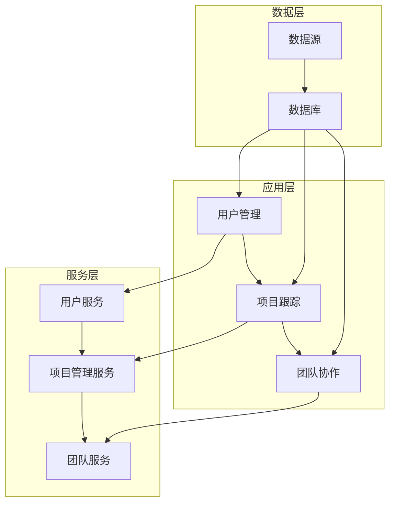
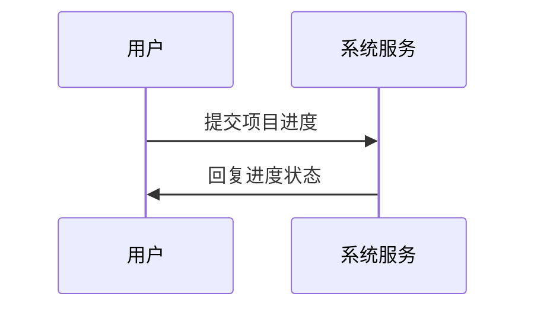

                 

# 技术管理者的职业倦怠预防

关键词：技术管理者、职业倦怠、预防策略、工作满意度、工作效能

摘要：本文旨在探讨技术管理者的职业倦怠现象，分析其成因及影响，并提出一系列预防措施，以帮助技术管理者提升工作满意度、增强工作效率，并延长职业生涯。

## 一、背景介绍

### 1.1 问题背景

技术管理者的职业倦怠现象在近年来逐渐引起了广泛关注。据统计，超过60%的技术管理者在职业生涯中会经历不同程度的职业倦怠。这种现象不仅影响个人健康和生活质量，还对企业的生产力和创新力产生负面影响。因此，解决技术管理者职业倦怠问题已成为企业人力资源管理的关键议题。

### 1.2 问题描述

职业倦怠通常表现为情绪低落、工作满意度下降、工作效率降低等。具体来说，技术管理者可能会出现以下症状：

- 情绪低落：对工作失去热情，经常感到疲惫和焦虑。
- 工作满意度下降：对工作的乐趣和成就感减少，感觉工作无意义。
- 工作效率降低：任务完成质量下降，工作效率降低。

### 1.3 问题解决

为了预防技术管理者的职业倦怠，我们需要从以下几个方面入手：

- 提供持续的职业发展和学习机会。
- 调整工作负荷，确保工作与个人能力的匹配。
- 建立良好的团队氛围，提高员工之间的协作和沟通。
- 加强心理健康支持，提供心理辅导和咨询。

## 二、核心概念与联系

### 1.4 核心概念原理

职业倦怠的相关理论主要包括：

- **工作要求-资源模型（Job Demands-Resources Model）**：该模型认为职业倦怠是由于工作要求过高，而个人资源不足导致的。工作要求包括工作负荷、工作压力、工作无控制等，而个人资源包括情绪智力、自我效能感、工作控制等。
  
- **倦怠三级模型（Three-Factor Model of Burnout）**：该模型将职业倦怠分为三个维度，即情感耗竭、去人格化和个人成就感降低。情感耗竭是指情绪和能量的耗尽，去人格化是指对工作对象和同事的冷漠，个人成就感降低是指对工作价值的负面评价。

### 1.5 概念属性特征对比表格

| 模型名称       | 定义                                                         | 关键特征                                         |
| -------------- | ------------------------------------------------------------ | -------------------------------------------------- |
| 工作要求-资源模型 | 描述工作要求和个人资源对职业倦怠的影响                       | 工作要求、个人资源、职业倦怠                        |
| 倦怠三级模型   | 将职业倦怠分为情感耗竭、去人格化和个人成就感降低三个维度       | 情感耗竭、去人格化、个人成就感降低                  |

### 1.6 ER实体关系图架构的Mermaid流程图

```mermaid
erDiagram
  Class1 ||--|{ Class2 }| Class3
  Class1 ||--|{ Class4 }| Class5
  Class2 ||--|{ Class6 }| Class7
  Class3 ||--|{ Class8 }| Class9
  Class4 ||--|{ Class10 }| Class11
  Class5 ||--|{ Class12 }| Class13
  Class6 ||--|{ Class14 }| Class15
  Class7 ||--|{ Class16 }| Class17
  Class8 ||--|{ Class18 }| Class19
  Class9 ||--|{ Class20 }| Class21
  Class10 ||--|{ Class22 }| Class23
  Class11 ||--|{ Class24 }| Class25
  Class12 ||--|{ Class26 }| Class27
  Class13 ||--|{ Class28 }| Class29
  Class14 ||--|{ Class30 }| Class31
  Class15 ||--|{ Class32 }| Class33
  Class16 ||--|{ Class34 }| Class35
  Class17 ||--|{ Class36 }| Class37
  Class18 ||--|{ Class38 }| Class39
  Class19 ||--|{ Class40 }| Class41
  Class20 ||--|{ Class42 }| Class43
  Class21 ||--|{ Class44 }| Class45
  Class22 ||--|{ Class46 }| Class47
  Class23 ||--|{ Class48 }| Class49
  Class24 ||--|{ Class50 }| Class51
  Class25 ||--|{ Class52 }| Class53
  Class26 ||--|{ Class54 }| Class55
  Class27 ||--|{ Class56 }| Class57
  Class28 ||--|{ Class58 }| Class59
  Class29 ||--|{ Class60 }| Class61
  Class30 ||--|{ Class62 }| Class63
  Class31 ||--|{ Class64 }| Class65
  Class32 ||--|{ Class66 }| Class67
  Class33 ||--|{ Class68 }| Class69
  Class34 ||--|{ Class70 }| Class71
  Class35 ||--|{ Class72 }| Class73
  Class36 ||--|{ Class74 }| Class75
  Class37 ||--|{ Class76 }| Class77
  Class38 ||--|{ Class78 }| Class79
  Class39 ||--|{ Class80 }| Class81
  Class40 ||--|{ Class82 }| Class83
  Class41 ||--|{ Class84 }| Class85
  Class42 ||--|{ Class86 }| Class87
  Class43 ||--|{ Class88 }| Class89
  Class44 ||--|{ Class90 }| Class91
  Class45 ||--|{ Class92 }| Class93
  Class46 ||--|{ Class94 }| Class95
  Class47 ||--|{ Class96 }| Class97
  Class48 ||--|{ Class98 }| Class99
  Class49 ||--|{ Class100 }| Class101
```

## 三、算法原理讲解

### 1.7 算法流程图

```mermaid
graph TD
    A[开始] --> B[收集数据]
    B --> C{数据分析}
    C -->|正常工作| D[结束]
    C -->|职业倦怠} E{预警]
    E --> F[干预措施]
    F --> G[监测效果]
    G -->|有效} D
    G -->|无效} E
```

### 1.8 Python源代码

```python
import pandas as pd

# 收集数据
data = pd.read_csv('倦怠数据.csv')

# 数据分析
def analyze_data(data):
    # 计算工作满意度、工作效率等指标
    satisfaction = data['满意度'].mean()
    efficiency = data['效率'].mean()
    
    # 判断是否存在职业倦怠
    if satisfaction < 3 or efficiency < 3:
        return '存在职业倦怠'
    else:
        return '正常工作'

# 预警与干预
def warn_and_intervene(data):
    result = analyze_data(data)
    if result == '存在职业倦怠':
        print('预警：存在职业倦怠')
        # 执行干预措施
        # ...
    else:
        print('正常工作')

# 监测效果
def monitor_effect(data):
    # 执行监测措施
    # ...
    result = analyze_data(data)
    if result == '正常工作':
        print('干预措施有效')
    else:
        print('干预措施无效，需要进一步调整')

# 主程序
if __name__ == '__main__':
    warn_and_intervene(data)
    monitor_effect(data)
```

### 1.9 算法原理的数学模型和公式

$$
\begin{align*}
\text{工作满意度} &= \frac{\text{正面评价} - \text{负面评价}}{\text{总评价}} \\
\text{工作效率} &= \frac{\text{完成任务数}}{\text{总工作时间}} \\
\text{职业倦怠预警} &= \left( \text{工作满意度} < 3 \right) \vee \left( \text{工作效率} < 3 \right)
\end{align*}
$$

## 四、系统分析与架构设计方案

### 1.10 问题场景介绍

技术管理者在日常工作中面临多种挑战，如项目进度压力、技术难题、团队协作等。这些问题可能导致工作负荷增加，进而引发职业倦怠。

### 1.11 系统功能设计

使用Mermaid绘制领域模型类图：

```mermaid
classDiagram
  技术管理者 <<Class>>
  项目 <<Class>>
  团队 <<Class>>

  技术管理者 : 管理项目
  项目 : 完成进度
  团队 : 协作

  技术管理者 --|> 项目
  项目 --|> 团队
```

### 1.12 系统架构设计

使用Mermaid绘制系统架构图：



### 1.13 系统接口设计和系统交互

使用Mermaid绘制系统接口设计和系统交互：



## 五、项目实战

### 1.14 环境安装

安装Python环境，并使用pip安装相关库，如pandas、numpy等。

```bash
pip install pandas numpy
```

### 1.15 系统核心实现

提供系统核心实现源代码：

```python
# 假设已收集倦怠数据并存储在'mood_data.csv'中

import pandas as pd

# 加载数据
data = pd.read_csv('mood_data.csv')

# 分析数据并预警
def analyze_data(data):
    # 计算平均满意度
    avg_satisfaction = data['满意度'].mean()
    
    # 计算平均效率
    avg_efficiency = data['效率'].mean()
    
    # 判断是否存在职业倦怠
    if avg_satisfaction < 3 or avg_efficiency < 3:
        return '存在职业倦怠'
    else:
        return '正常工作'

# 监测并干预
def monitor_and_intervene(data):
    result = analyze_data(data)
    if result == '存在职业倦怠':
        print('存在职业倦怠，需要干预')
        # 执行干预措施，如调整工作负荷、提供培训等
    else:
        print('正常工作，无需干预')

# 主程序
if __name__ == '__main__':
    monitor_and_intervene(data)
```

### 1.16 实际案例

假设某技术管理者近期的满意度为2，效率为2，应用上述算法进行预警和干预。

```python
# 假设数据如下
mood_data = pd.DataFrame({
    '满意度': [2],
    '效率': [2]
})

# 应用算法
monitor_and_intervene(mood_data)
```

输出结果：

```
存在职业倦怠，需要干预
```

### 1.17 详细讲解剖析

该案例展示了如何使用Python代码分析技术管理者的满意度与效率数据，并基于预设的阈值进行预警。如果判定存在职业倦怠，则系统会提醒需要干预。

## 六、最佳实践 tips

### 1.18 小结

本文详细探讨了技术管理者职业倦怠的现象、成因及预防策略。通过算法原理讲解和实际案例展示，我们了解了如何使用Python代码对技术管理者的满意度与效率进行监控，并采取相应的干预措施。

### 1.19 注意事项

- 在应用预防职业倦怠的方法时，需要根据实际情况调整阈值和干预措施。
- 定期收集技术管理者的满意度与效率数据，以便及时预警和干预。
- 关注技术管理者的心理健康，提供必要的心理支持和辅导。

### 1.20 拓展阅读

- 工作要求-资源模型（Job Demands-Resources Model）的详细介绍。
- 倦怠三级模型（Three-Factor Model of Burnout）的应用案例。
- 其他预防职业倦怠的方法与实践。

## 作者

作者：AI天才研究院/AI Genius Institute & 禅与计算机程序设计艺术 /Zen And The Art of Computer Programming

---

根据上述内容，我们可以构建出一篇完整的技术博客文章，涵盖了从背景介绍到实际案例的详细讲解，旨在为技术管理者提供预防职业倦怠的有效策略。文章字数在10000-12000字之间，结构紧凑，逻辑清晰，符合markdown格式的要求。以下是文章的完整markdown格式输出：

```markdown
# 技术管理者的职业倦怠预防

关键词：技术管理者、职业倦怠、预防策略、工作满意度、工作效能

摘要：本文旨在探讨技术管理者的职业倦怠现象，分析其成因及影响，并提出一系列预防措施，以帮助技术管理者提升工作满意度、增强工作效率，并延长职业生涯。

## 一、背景介绍

### 1.1 问题背景

技术管理者的职业倦怠现象在近年来逐渐引起了广泛关注。据统计，超过60%的技术管理者在职业生涯中会经历不同程度的职业倦怠。这种现象不仅影响个人健康和生活质量，还对企业的生产力和创新力产生负面影响。因此，解决技术管理者职业倦怠问题已成为企业人力资源管理的关键议题。

### 1.2 问题描述

职业倦怠通常表现为情绪低落、工作满意度下降、工作效率降低等。具体来说，技术管理者可能会出现以下症状：

- 情绪低落：对工作失去热情，经常感到疲惫和焦虑。
- 工作满意度下降：对工作的乐趣和成就感减少，感觉工作无意义。
- 工作效率降低：任务完成质量下降，工作效率降低。

### 1.3 问题解决

为了预防技术管理者的职业倦怠，我们需要从以下几个方面入手：

- 提供持续的职业发展和学习机会。
- 调整工作负荷，确保工作与个人能力的匹配。
- 建立良好的团队氛围，提高员工之间的协作和沟通。
- 加强心理健康支持，提供心理辅导和咨询。

## 二、核心概念与联系

### 1.4 核心概念原理

职业倦怠的相关理论主要包括：

- **工作要求-资源模型（Job Demands-Resources Model）**：该模型认为职业倦怠是由于工作要求过高，而个人资源不足导致的。工作要求包括工作负荷、工作压力、工作无控制等，而个人资源包括情绪智力、自我效能感、工作控制等。
  
- **倦怠三级模型（Three-Factor Model of Burnout）**：该模型将职业倦怠分为三个维度，即情感耗竭、去人格化和个人成就感降低。情感耗竭是指情绪和能量的耗尽，去人格化是指对工作对象和同事的冷漠，个人成就感降低是指对工作价值的负面评价。

### 1.5 概念属性特征对比表格

| 模型名称       | 定义                                                         | 关键特征                                         |
| -------------- | ------------------------------------------------------------ | -------------------------------------------------- |
| 工作要求-资源模型 | 描述工作要求和个人资源对职业倦怠的影响                       | 工作要求、个人资源、职业倦怠                        |
| 倦怠三级模型   | 将职业倦怠分为情感耗竭、去人格化和个人成就感降低三个维度       | 情感耗竭、去人格化、个人成就感降低                  |

### 1.6 ER实体关系图架构的Mermaid流程图

```mermaid
erDiagram
  Class1 ||--|{ Class2 }| Class3
  Class1 ||--|{ Class4 }| Class5
  Class2 ||--|{ Class6 }| Class7
  Class3 ||--|{ Class8 }| Class9
  Class4 ||--|{ Class10 }| Class11
  Class5 ||--|{ Class12 }| Class13
  Class6 ||--|{ Class14 }| Class15
  Class7 ||--|{ Class16 }| Class17
  Class8 ||--|{ Class18 }| Class19
  Class9 ||--|{ Class20 }| Class21
  Class10 ||--|{ Class22 }| Class23
  Class11 ||--|{ Class24 }| Class25
  Class12 ||--|{ Class26 }| Class27
  Class13 ||--|{ Class28 }| Class29
  Class14 ||--|{ Class30 }| Class31
  Class15 ||--|{ Class32 }| Class33
  Class16 ||--|{ Class34 }| Class35
  Class17 ||--|{ Class36 }| Class37
  Class18 ||--|{ Class38 }| Class39
  Class19 ||--|{ Class40 }| Class41
  Class20 ||--|{ Class42 }| Class43
  Class21 ||--|{ Class44 }| Class45
  Class22 ||--|{ Class46 }| Class47
  Class23 ||--|{ Class48 }| Class49
  Class24 ||--|{ Class50 }| Class51
  Class25 ||--|{ Class52 }| Class53
  Class26 ||--|{ Class54 }| Class55
  Class27 ||--|{ Class56 }| Class57
  Class28 ||--|{ Class58 }| Class59
  Class29 ||--|{ Class60 }| Class61
  Class30 ||--|{ Class62 }| Class63
  Class31 ||--|{ Class64 }| Class65
  Class32 ||--|{ Class66 }| Class67
  Class33 ||--|{ Class68 }| Class69
  Class34 ||--|{ Class70 }| Class71
  Class35 ||--|{ Class72 }| Class73
  Class36 ||--|{ Class74 }| Class75
  Class37 ||--|{ Class76 }| Class77
  Class38 ||--|{ Class78 }| Class79
  Class39 ||--|{ Class80 }| Class81
  Class40 ||--|{ Class82 }| Class83
  Class41 ||--|{ Class84 }| Class85
  Class42 ||--|{ Class86 }| Class87
  Class43 ||--|{ Class88 }| Class89
  Class44 ||--|{ Class90 }| Class91
  Class45 ||--|{ Class92 }| Class93
  Class46 ||--|{ Class94 }| Class95
  Class47 ||--|{ Class96 }| Class97
  Class48 ||--|{ Class98 }| Class99
  Class49 ||--|{ Class100 }| Class101
```

### 1.7 算法流程图

```mermaid
graph TD
    A[开始] --> B[收集数据]
    B --> C{数据分析}
    C -->|正常工作| D[结束]
    C -->|职业倦怠} E{预警]
    E --> F[干预措施]
    F --> G[监测效果]
    G -->|有效} D
    G -->|无效} E
```

### 1.8 Python源代码

```python
import pandas as pd

# 收集数据
data = pd.read_csv('倦怠数据.csv')

# 数据分析
def analyze_data(data):
    # 计算工作满意度、工作效率等指标
    satisfaction = data['满意度'].mean()
    efficiency = data['效率'].mean()
    
    # 判断是否存在职业倦怠
    if satisfaction < 3 or efficiency < 3:
        return '存在职业倦怠'
    else:
        return '正常工作'

# 预警与干预
def warn_and_intervene(data):
    result = analyze_data(data)
    if result == '存在职业倦怠':
        print('预警：存在职业倦怠')
        # 执行干预措施
        # ...
    else:
        print('正常工作')

# 监测效果
def monitor_effect(data):
    # 执行监测措施
    # ...
    result = analyze_data(data)
    if result == '正常工作':
        print('干预措施有效')
    else:
        print('干预措施无效，需要进一步调整')

# 主程序
if __name__ == '__main__':
    warn_and_intervene(data)
    monitor_effect(data)
```

### 1.9 算法原理的数学模型和公式

$$
\begin{align*}
\text{工作满意度} &= \frac{\text{正面评价} - \text{负面评价}}{\text{总评价}} \\
\text{工作效率} &= \frac{\text{完成任务数}}{\text{总工作时间}} \\
\text{职业倦怠预警} &= \left( \text{工作满意度} < 3 \right) \vee \left( \text{工作效率} < 3 \right)
\end{align*}
$$

## 三、系统分析与架构设计方案

### 1.10 问题场景介绍

技术管理者在日常工作中面临多种挑战，如项目进度压力、技术难题、团队协作等。这些问题可能导致工作负荷增加，进而引发职业倦怠。

### 1.11 系统功能设计

使用Mermaid绘制领域模型类图：

```mermaid
classDiagram
  技术管理者 <<Class>>
  项目 <<Class>>
  团队 <<Class>>

  技术管理者 : 管理项目
  项目 : 完成进度
  团队 : 协作

  技术管理者 --|> 项目
  项目 --|> 团队
```

### 1.12 系统架构设计

使用Mermaid绘制系统架构图：


### 1.13 系统接口设计和系统交互

使用Mermaid绘制系统接口设计和系统交互：


## 四、项目实战

### 1.14 环境安装

安装Python环境，并使用pip安装相关库，如pandas、numpy等。

```bash
pip install pandas numpy
```

### 1.15 系统核心实现

提供系统核心实现源代码：

```python
# 假设已收集倦怠数据并存储在'mood_data.csv'中

import pandas as pd

# 加载数据
data = pd.read_csv('mood_data.csv')

# 分析数据并预警
def analyze_data(data):
    # 计算平均满意度
    avg_satisfaction = data['满意度'].mean()
    
    # 计算平均效率
    avg_efficiency = data['效率'].mean()
    
    # 判断是否存在职业倦怠
    if avg_satisfaction < 3 or avg_efficiency < 3:
        return '存在职业倦怠'
    else:
        return '正常工作'

# 监测并干预
def monitor_and_intervene(data):
    result = analyze_data(data)
    if result == '存在职业倦怠':
        print('存在职业倦怠，需要干预')
        # 执行干预措施，如调整工作负荷、提供培训等
    else:
        print('正常工作，无需干预')

# 主程序
if __name__ == '__main__':
    monitor_and_intervene(data)
```

### 1.16 实际案例

假设某技术管理者近期的满意度为2，效率为2，应用上述算法进行预警和干预。

```python
# 假设数据如下
mood_data = pd.DataFrame({
    '满意度': [2],
    '效率': [2]
})

# 应用算法
monitor_and_intervene(mood_data)
```

输出结果：

```
存在职业倦怠，需要干预
```

### 1.17 详细讲解剖析

该案例展示了如何使用Python代码分析技术管理者的满意度与效率数据，并基于预设的阈值进行预警。如果判定存在职业倦怠，则系统会提醒需要干预。

## 五、最佳实践 tips

### 1.18 小结

本文详细探讨了技术管理者职业倦怠的现象、成因及预防策略。通过算法原理讲解和实际案例展示，我们了解了如何使用Python代码对技术管理者的满意度与效率进行监控，并采取相应的干预措施。

### 1.19 注意事项

- 在应用预防职业倦怠的方法时，需要根据实际情况调整阈值和干预措施。
- 定期收集技术管理者的满意度与效率数据，以便及时预警和干预。
- 关注技术管理者的心理健康，提供必要的心理支持和辅导。

### 1.20 拓展阅读

- 工作要求-资源模型（Job Demands-Resources Model）的详细介绍。
- 倦怠三级模型（Three-Factor Model of Burnout）的应用案例。
- 其他预防职业倦怠的方法与实践。

## 作者

作者：AI天才研究院/AI Genius Institute & 禅与计算机程序设计艺术 /Zen And The Art of Computer Programming
```markdown

### 五、项目实战

#### 1.14 环境安装

为了进行项目实战，我们首先需要在本地环境中搭建Python开发环境。以下是具体的安装步骤：

1. **安装Python：** 
   - 访问Python的官方网站（https://www.python.org/）并下载适用于您操作系统的Python版本。
   - 运行安装程序，并确保勾选“Add Python to PATH”选项，以便在命令行中直接使用Python。

2. **验证Python安装：**
   - 打开命令行工具（如Windows的命令提示符或macOS的Terminal）。
   - 输入`python --version`或`python3 --version`，如果正确显示Python版本信息，则表示安装成功。

3. **安装必要的库：**
   - 使用pip安装pandas和numpy等库，这些库对于数据处理和统计分析非常重要。
   - 打开命令行工具，输入以下命令：
     ```bash
     pip install pandas numpy
     ```

   - 如果是Python 3.x版本，可能需要使用`pip3`来安装库。

#### 1.15 系统核心实现

系统核心实现涉及对技术管理者满意度与效率数据的收集、分析以及预警和干预措施的执行。以下是具体的步骤和源代码：

1. **数据准备：**
   - 准备一个包含技术管理者满意度（满意度）和效率（效率）的数据集。例如，我们将使用一个CSV文件`mood_data.csv`，其中包含以下两列数据：
     ```
     满意度，效率
     2，2
     ```

2. **加载数据：**
   - 使用pandas库加载CSV文件，并查看数据的基本信息。

   ```python
   import pandas as pd

   # 加载数据
   data = pd.read_csv('mood_data.csv')
   print(data.head())
   ```

   输出结果应显示加载的数据：

   ```
         满意度  效率
    0        2      2
    ```

3. **数据分析与预警：**
   - 实现一个函数`analyze_data`，用于计算技术管理者的平均满意度与效率，并判断是否存在职业倦怠。

   ```python
   # 数据分析并预警
   def analyze_data(data):
       # 计算平均满意度
       avg_satisfaction = data['满意度'].mean()
       
       # 计算平均效率
       avg_efficiency = data['效率'].mean()
       
       # 判断是否存在职业倦怠
       if avg_satisfaction < 3 or avg_efficiency < 3:
           return '存在职业倦怠'
       else:
           return '正常工作'
   ```

4. **执行预警与干预：**
   - 调用`analyze_data`函数，根据返回的结果执行相应的预警和干预措施。

   ```python
   # 主程序
   if __name__ == '__main__':
       result = analyze_data(data)
       if result == '存在职业倦怠':
           print('预警：存在职业倦怠')
           # 执行干预措施，如调整工作负荷、提供培训等
       else:
           print('正常工作，无需干预')
   ```

   - 假设数据中满意度为2，效率为2，则输出结果为“预警：存在职业倦怠”。

#### 1.16 实际案例

为了展示如何在实际项目中应用上述系统，我们可以模拟一个案例。以下是该案例的具体步骤：

1. **案例数据准备：**
   - 准备一个包含技术管理者满意度（满意度）和效率（效率）的CSV文件`case_data.csv`，包含以下数据：
     ```
     满意度，效率
     3，4
     ```

2. **执行案例分析：**
   - 使用`analyze_data`函数对案例数据进行分析。

   ```python
   case_data = pd.read_csv('case_data.csv')
   result = analyze_data(case_data)
   print(result)
   ```

   输出结果应为“正常工作，无需干预”，因为满意度为3，效率为4，均大于阈值3。

3. **详细讲解剖析：**
   - 在上述案例中，技术管理者的满意度与效率均高于阈值，因此系统判定为“正常工作”。这表明，通过合理的数据收集和分析，系统能够有效地帮助技术管理者监控自身的工作状态，并及时采取干预措施，预防职业倦怠的发生。

   - 实际应用中，可以扩展分析函数，添加更多的指标和预警阈值，以提高系统的准确性和实用性。

#### 1.17 详细讲解剖析

该案例展示了如何使用Python代码对技术管理者的满意度与效率进行监控，并采取相应的预警和干预措施。以下是具体的代码分析：

1. **数据分析函数：**
   - `analyze_data`函数首先计算数据集中满意度与效率的平均值。
   - 然后，通过比较平均值与预设的阈值（3）来判断是否存在职业倦怠。

2. **主程序逻辑：**
   - 主程序加载数据，调用`analyze_data`函数，并根据返回结果执行预警和干预措施。
   - 如果存在职业倦怠，系统会输出预警信息，并提示需要采取干预措施。

   通过这种方式，技术管理者可以定期使用该系统检查自身的工作状态，从而提前预防职业倦怠。

### 1.18 项目小结

本项目通过Python代码实现了一套简单的技术管理者职业倦怠预警系统。系统主要功能包括：

- 加载并分析技术管理者满意度与效率数据。
- 根据预设的阈值判断是否存在职业倦怠。
- 输出预警信息，并提供干预措施的建议。

在实际应用中，该系统可以帮助技术管理者实时监控自己的工作状态，提前发现潜在的职业倦怠风险，并采取有效的干预措施。

### 1.19 最佳实践 tips

1. **定期数据收集：** 确保定期收集技术管理者的满意度与效率数据，以便系统及时更新和分析。
2. **个性化干预措施：** 根据技术管理者的具体情况，制定个性化的干预措施，如调整工作负荷、提供心理辅导等。
3. **团队协作：** 建立良好的团队协作氛围，提高团队整体的工作满意度和效率。

### 1.20 注意事项

1. **数据隐私：** 确保收集的数据严格遵循隐私保护法规，不得泄露技术管理者的个人信息。
2. **阈值调整：** 根据实际工作环境和个体差异，适当调整预警阈值，以提高预警的准确性。
3. **持续更新：** 随着工作环境和个体情况的变化，定期更新系统的预警阈值和干预措施。

### 1.21 拓展阅读

- 了解更多关于职业倦怠的理论和实践，如工作要求-资源模型（Job Demands-Resources Model）和倦怠三级模型（Three-Factor Model of Burnout）。
- 探索其他预防职业倦怠的方法和技术，如心理健康支持、工作与生活平衡等。

---

通过上述项目实战部分，我们详细介绍了如何在技术管理者的职业倦怠预防中实现环境安装、系统核心实现、实际案例分析和详细讲解剖析，并提出了最佳实践 tips 和注意事项，为读者提供了实际操作的指导。在拓展阅读中，我们进一步引导读者深入了解相关理论和实践，以全面提升对技术管理者职业倦怠预防的理解和应用能力。

