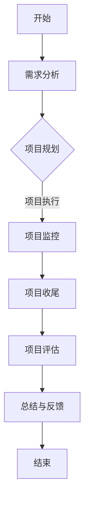
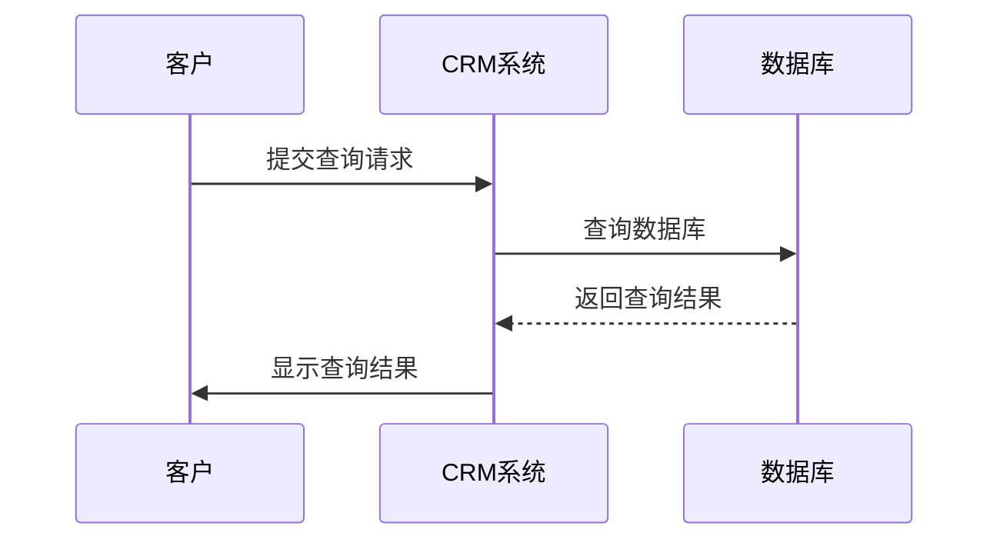
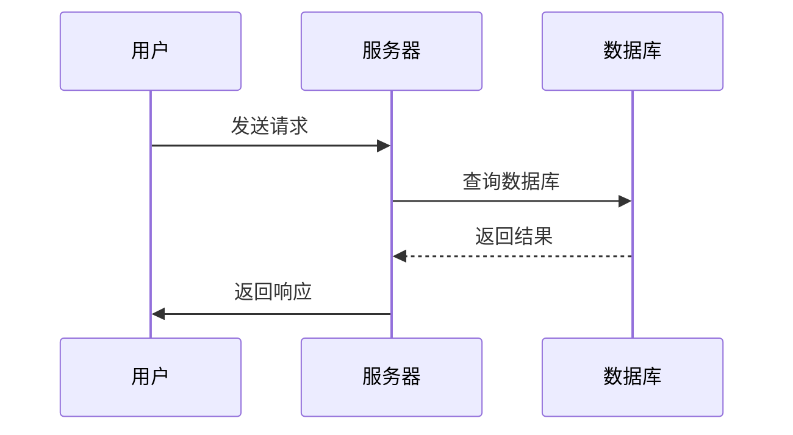

                 

# 技术管理者的职业规划

> 关键词：技术管理者、职业规划、项目管理、领导力、行业趋势、成功案例

> 摘要：本文将深入探讨技术管理者的职业规划，从现状分析到策略实施，帮助技术管理者明确职业发展方向，提升领导力和项目管理能力，适应行业变化，实现职业成功。

----------------------------------------------------------------

## 第1章：技术管理者职业发展背景

### 1.1 技术管理者的现状

在当今技术高速发展的时代，技术管理者扮演着越来越重要的角色。他们不仅需要具备深厚的专业技术背景，还需要具备优秀的管理能力和领导力。技术管理者通常负责团队的技术方向、项目管理和团队建设。随着企业对技术依赖的加深，技术管理者的职业发展前景也变得广阔。

### 1.2 挑战与机遇并存

技术管理者面临的挑战主要包括技术更新速度快、团队管理难度大、项目风险控制等。然而，这些挑战同时也带来了机遇，如职业晋升空间、技术创新机会和行业影响力提升等。因此，如何应对挑战、把握机遇成为技术管理者职业规划的关键。

### 1.3 职业规划的重要性

职业规划对于技术管理者来说至关重要。一个明确的职业规划可以帮助技术管理者明确自己的职业目标，制定合理的行动计划，提升自身能力和竞争力，从而在职场中脱颖而出。

## 第2章：核心概念与联系

### 2.1 项目管理基础

项目管理是技术管理者必备的技能之一。了解项目管理的基本原理和方法，有助于技术管理者更好地规划项目、控制项目风险和提高项目成功率。

### 2.2 团队管理原则

团队管理是技术管理者的重要职责。掌握团队管理的基本原则，如目标明确、职责分工、激励与反馈等，有助于技术管理者构建高效团队，提升团队绩效。

### 2.3 技术领导力要素

技术领导力是技术管理者的核心竞争力之一。了解技术领导力的要素，如技术愿景、技术洞察力、团队协作能力等，有助于技术管理者引领团队创新、推动技术进步。

## 第3章：职业规划策略

### 3.1 短期职业发展目标

技术管理者在短期内应设定明确的目标，如提升技术水平、掌握项目管理技能、提升领导力等。这些目标有助于技术管理者快速提升自身能力，为长期发展奠定基础。

### 3.2 长期职业发展规划

长期职业发展规划应考虑技术趋势、行业发展和个人兴趣等多方面因素。技术管理者应根据自身情况，制定合适的职业发展路径，如成为技术专家、项目经理、技术总监等。

### 3.3 职业路径选择

技术管理者应根据自身优势和职业发展目标，选择合适的职业路径。如技术方向、管理方向或跨界发展等。不同的职业路径需要不同的技能和知识储备，技术管理者应提前做好准备。

## 第4章：领导力提升

### 4.1 沟通技巧

良好的沟通技巧是技术管理者必备的素质。掌握沟通技巧，如有效倾听、清晰表达、建立信任等，有助于技术管理者更好地与团队成员和上级沟通，提高团队协作效率。

### 4.2 决策能力

决策能力是技术管理者的重要能力之一。掌握决策的基本原则和方法，如信息收集、风险评估、制定方案等，有助于技术管理者做出明智的决策，降低项目风险。

### 4.3 团队建设

团队建设是技术管理者的重要任务之一。了解团队建设的方法和技巧，如建立共同目标、培养团队凝聚力、激励团队成员等，有助于技术管理者构建高效团队，提升团队绩效。

## 第5章：项目管理实践

### 5.1 项目启动与规划

项目启动与规划是项目成功的关键。技术管理者应了解项目启动的过程和方法，如制定项目目标、确定项目范围、制定项目计划等。

### 5.2 项目执行与监控

项目执行与监控是确保项目按计划进行的关键。技术管理者应掌握项目执行和监控的方法，如制定项目任务、分配资源、监控项目进度等。

### 5.3 项目收尾与评估

项目收尾与评估是项目完成的最后一步。技术管理者应了解项目收尾和评估的方法，如项目总结、问题分析、经验教训等，为后续项目提供参考。

## 第6章：职业转型与适应

### 6.1 行业变化对技术管理者的影响

随着技术不断演进，行业也在不断变化。技术管理者应关注行业变化，了解行业趋势，把握职业转型机会。

### 6.2 职业转型的准备

职业转型需要技术管理者做好充分准备，如学习新技能、积累相关经验、拓展人际关系等。

### 6.3 跨行业职业发展

跨行业职业发展对于技术管理者来说是一个新的挑战和机遇。了解跨行业职业发展的路径和方法，有助于技术管理者实现职业转型。

## 第7章：行业趋势分析

### 7.1 当前技术行业趋势

技术行业日新月异，了解当前的技术趋势，如云计算、大数据、人工智能等，有助于技术管理者把握行业方向。

### 7.2 技术趋势对职业规划的影响

技术趋势对技术管理者的职业规划有着重要影响。技术管理者应根据技术趋势，调整自己的职业发展策略。

### 7.3 技术管理者的应对策略

面对技术趋势，技术管理者应采取相应的应对策略，如学习新技术、提升项目管理能力、拓展跨行业视野等。

## 第8章：职业成功案例

### 8.1 成功职业路径解析

通过分析技术管理者的成功案例，可以了解他们的职业路径和关键成功因素。

### 8.2 成功职业关键要素

成功职业的关键要素包括专业技能、领导力、沟通能力、团队建设等。

### 8.3 启发与借鉴

从成功职业案例中获取启发，结合自身实际情况，借鉴成功经验，有助于技术管理者实现职业成功。

## 第9章：个人成长与自我管理

### 9.1 时间管理技巧

良好的时间管理技巧有助于技术管理者高效完成任务，提升工作效率。

### 9.2 学习与知识管理

学习与知识管理是技术管理者不断成长的重要途径。掌握学习方法和知识管理技巧，有助于技术管理者不断提升自身能力。

### 9.3 自我提升与成长

自我提升与成长是技术管理者实现职业成功的基石。技术管理者应不断反思、总结经验，持续提升自己的综合素质。

---

**作者：AI天才研究院/AI Genius Institute & 禅与计算机程序设计艺术 /Zen And The Art of Computer Programming**

---

### 背景介绍

#### 核心概念术语说明

1. **技术管理者**：负责团队的技术方向、项目管理和团队建设的技术人员。
2. **项目管理**：规划、执行、监控和收尾项目的过程。
3. **领导力**：影响和激励他人实现共同目标的能力。
4. **职业规划**：制定个人的职业发展目标和路径。

#### 问题背景

随着科技的发展，技术管理者在企业中的地位日益重要。然而，他们在职业发展中面临诸多挑战，如技术更新速度快、团队管理难度大、项目风险控制等。同时，他们也拥有广泛的职业发展机会，如技术创新、行业影响力提升等。

#### 问题描述

技术管理者的职业规划需要明确目标、掌握核心技能、适应行业变化、提升领导力等。本文将围绕这些核心问题，探讨技术管理者的职业规划策略和实践。

#### 问题解决

本文将通过以下步骤解决问题：

1. 分析技术管理者的现状和挑战。
2. 介绍核心概念和联系。
3. 提出职业规划策略和实践方法。
4. 分析行业趋势和成功案例。
5. 提供个人成长和自我管理的建议。

#### 边界与外延

本文主要讨论全职技术管理者的职业规划，不涉及兼职和自由职业者的职业规划。同时，本文侧重于技术管理者的职业发展，不涉及其他岗位的职业规划。

#### 概念结构与核心要素组成

技术管理者的职业规划由以下核心要素组成：

1. **项目管理能力**：包括项目规划、执行、监控和收尾等。
2. **领导力**：包括沟通技巧、决策能力、团队建设等。
3. **技术能力**：包括专业技术和行业知识。
4. **职业素养**：包括职业目标、自我管理、持续学习等。

## 核心概念与联系

### 项目管理基础

#### 概念原理

项目管理是指通过规划、执行、监控和收尾等项目过程，确保项目按时、按预算、按质量完成的一系列行动。项目管理的基础概念包括项目目标、项目范围、项目任务、项目风险等。

#### 概念属性特征对比表格

| 特征       | 项目目标         | 项目范围         | 项目任务         | 项目风险         |
|------------|------------------|------------------|------------------|------------------|
| 定义       | 项目要实现的结果 | 项目应包括的工作 | 项目需要完成的任务 | 项目可能面临的风险 |
| 关系       | 项目目标的实现依赖于项目范围的确定和项目任务的完成 | 项目任务的范围和内容 | 按照项目计划逐步完成 | 对项目可能出现的负面情况进行预测和规避 |

#### ER实体关系图架构

```mermaid
erDiagram
    Project ||--|{ Task } : "任务属于项目"
    Project ||--|{ Risk } : "项目面临风险"
    Task ||--|{ Milestone } : "任务包含里程碑"
    Risk ||--|{ ContingencyPlan } : "针对风险的应急计划"
```

### 团队管理原则

#### 概念原理

团队管理是指通过设定目标、明确职责、激励成员、解决冲突等手段，提高团队协作效率和工作质量的过程。团队管理的基础原则包括目标明确、职责分工、沟通协作、激励与反馈等。

#### 概念属性特征对比表格

| 特征       | 目标明确       | 职责分工         | 沟通协作       | 激励与反馈       |
|------------|----------------|------------------|----------------|------------------|
| 定义       | 确定团队共同的目标 | 明确团队成员的职责 | 建立有效的沟通机制 | 通过奖励和认可激励团队成员 |
| 关系       | 目标是团队协作的指南针 | 职责分工确保每个成员都知道自己的任务和责任 | 沟通协作是实现目标的关键 | 激励与反馈是团队持续发展的动力 |

#### 团队管理ER实体关系图架构

```mermaid
erDiagram
    Team ||--|{ Member } : "团队由成员组成"
    Team ||--|{ Role } : "每个成员担任特定角色"
    Team ||--|{ Goal } : "团队有共同目标"
    Team ||--|{ Task } : "团队完成多项任务"
    Member ||--|{ Skill } : "成员具备特定技能"
    Member ||--|{ Responsibility } : "成员承担相应责任"
    Role ||--|{ Task } : "角色对应特定任务"
```

### 技术领导力要素

#### 概念原理

技术领导力是指技术管理者通过技术洞察力、技术愿景、团队协作能力等，引领团队实现技术突破和业务目标的能力。技术领导力的核心要素包括技术愿景、技术洞察力、团队协作能力等。

#### 概念属性特征对比表格

| 特征       | 技术愿景         | 技术洞察力         | 团队协作能力       |
|------------|------------------|------------------|------------------|
| 定义       | 对未来技术发展的预见和规划 | 对技术趋势和潜在价值的敏锐感知 | 团队成员之间的协同工作和信息共享 |
| 关系       | 技术愿景指导技术决策和战略规划 | 技术洞察力支持技术创新和问题解决 | 团队协作能力是实现技术愿景和技术创新的关键 |

#### 技术领导力ER实体关系图架构

```mermaid
erDiagram
    TechnicalLeader ||--|{ Vision } : "技术愿景"
    TechnicalLeader ||--|{ Insight } : "技术洞察力"
    TechnicalLeader ||--|{ Collaboration } : "团队协作能力"
    Vision ||--|{ Strategy } : "指导战略规划"
    Insight ||--|{ Innovation } : "支持技术创新"
    Collaboration ||--|{ TeamPerformance } : "提升团队绩效"
```

通过以上对核心概念与联系的详细讲解，技术管理者可以更好地理解项目管理、团队管理和技术领导力的本质，为后续的职业规划提供坚实的理论基础。

### 算法原理讲解

#### 算法mermaid流程图



#### Python源代码实现

```python
# Python代码实现项目管理流程

class ProjectManagement:
    def __init__(self, project_name):
        self.project_name = project_name
        self.status = "未启动"

    def demand_analysis(self):
        print(f"{self.project_name}：需求分析完成。")

    def project_plan(self):
        print(f"{self.project_name}：项目规划完成。")

    def project_execute(self):
        print(f"{self.project_name}：项目执行中。")

    def project_monitor(self):
        print(f"{self.project_name}：项目监控中。")

    def project_finish(self):
        print(f"{self.project_name}：项目收尾。")

    def project_evaluation(self):
        print(f"{self.project_name}：项目评估。")

    def summary_and_feedback(self):
        print(f"{self.project_name}：总结与反馈。")

    def run(self):
        self.status = "启动"
        self.demand_analysis()
        self.project_plan()
        self.project_execute()
        self.project_monitor()
        self.project_finish()
        self.project_evaluation()
        self.summary_and_feedback()

# 实例化项目管理对象并运行
project = ProjectManagement("新项目")
project.run()
```

#### 算法原理详细讲解

项目管理流程是技术管理者必须掌握的核心能力之一。它包括从项目启动到项目结束的各个阶段。以下是项目管理流程的详细步骤和算法原理：

1. **需求分析**：
   需求分析是项目管理的第一步，目的是明确项目要解决的问题和达到的目标。通过对需求的分析，技术管理者可以了解项目的核心需求和关键点，为后续的项目规划提供依据。

2. **项目规划**：
   项目规划是基于需求分析的结果，制定项目的详细计划。包括项目的范围、目标、时间表、资源分配等。项目规划确保项目按计划进行，减少项目风险。

3. **项目执行**：
   项目执行是按照项目规划实施的具体行动。技术管理者需要监督项目进展，确保每个任务按时完成，协调团队成员的工作，解决执行过程中出现的问题。

4. **项目监控**：
   项目监控是在项目执行过程中，对项目进度、成本、质量等方面的监控。通过监控，技术管理者可以及时发现和解决问题，确保项目按计划进行。

5. **项目收尾**：
   项目收尾是项目完成的最后一步，包括项目验收、总结和反馈。技术管理者需要确保项目达到预期目标，对项目进行评估，总结经验教训，为后续项目提供参考。

6. **项目评估**：
   项目评估是对项目全过程进行评估，包括项目目标、项目质量、项目成本等。通过评估，技术管理者可以了解项目的成功之处和不足之处，为改进项目管理提供依据。

7. **总结与反馈**：
   总结与反馈是对项目管理全过程进行总结，收集团队成员的反馈，对项目管理流程进行改进。通过总结与反馈，技术管理者可以不断提升项目管理能力。

#### 数学模型和公式

在项目管理中，常用的数学模型和公式包括：

1. **关键路径法（Critical Path Method, CPM）**：
   CPM是一种用于确定项目最早完成时间的方法。关键路径上的任务决定了项目的最短完成时间，任何关键路径上的延误都会导致整个项目的延误。

   数学模型：
   $$ E_{ij} = \sum_{i' \in \text{前置任务}} (E_{i'j} + D_{i'j}) $$

   其中，\( E_{ij} \) 是从任务 \( i \) 到任务 \( j \) 的最早开始时间，\( E_{i'j} \) 是从任务 \( i' \) 到任务 \( j \) 的最早完成时间，\( D_{i'j} \) 是从任务 \( i' \) 到任务 \( j \) 的持续时间。

2. **成本效益分析（Cost-Benefit Analysis, CBA）**：
   CBA是一种用于评估项目成本和效益的方法，用于决定项目是否值得投资。

   数学模型：
   $$ \text{Net Present Value (NPV)} = \sum_{t=1}^{n} \frac{\text{Cash Flow at time t}}{(1 + \text{Discount Rate})^t} - \text{Initial Investment} $$

   其中，\( \text{Cash Flow at time t} \) 是在第 \( t \) 年的现金流量，\( \text{Discount Rate} \) 是折现率，\( \text{Initial Investment} \) 是初始投资。

#### 举例说明

假设一个项目包含三个任务：A、B和C。任务A需要2天完成，任务B需要3天完成，任务C需要4天完成。任务A是任务B和任务C的前置任务。

1. **需求分析**：
   明确项目的目标和需求，例如开发一个新软件系统。

2. **项目规划**：
   制定项目的时间表和资源分配，例如：
   - 任务A：2天
   - 任务B：3天（开始于任务A完成后）
   - 任务C：4天（开始于任务B完成后）

3. **项目执行**：
   开始执行任务A，任务B和任务C。

4. **项目监控**：
   每隔一天检查项目的进展情况，确保任务按时完成。

5. **项目收尾**：
   完成所有任务，进行项目验收。

6. **项目评估**：
   对项目进行评估，确定项目的质量和成本效益。

7. **总结与反馈**：
   总结项目经验教训，为后续项目提供参考。

通过上述步骤，技术管理者可以有效地管理项目，确保项目按时、按预算、按质量完成。

### 系统分析与架构设计方案

#### 问题场景介绍

假设一家公司计划开发一款全新的客户关系管理（CRM）系统。该系统需要处理大量的客户数据，提供客户信息查询、客户关系管理、销售数据分析等功能。为了确保系统的可靠性、可扩展性和高可用性，公司决定采用分布式系统架构。

#### 项目介绍

该项目由公司内部的技术团队负责，包括系统架构师、后端开发工程师、前端开发工程师、数据库管理员等。项目周期为12个月，分为需求分析、系统设计、开发、测试和部署五个阶段。

#### 系统功能设计（领域模型mermaid类图）

```mermaid
classDiagram
    Class01 <|-- Class02
    Class03 --|> Class04
    Class04 : <<interface>> Interface
    Class05 : <<entity>> Entity
    Class06 : <<value>> ValueObject
    Class07 : <<exception>> Exception
    Class08 <.. Class09 : <<decorator>> Decorator
    Class10 <- Class11 : <<implements>> Implements
    Class12 .. Class13 : <<uses>> Uses
    Class14 <<enumeration>> Enumeration
    Class15 <<mix>> Mixes Class16
    Class17 : <<template>> Template
    Class18 <<abstract>> Abstract
    Class19 <<final>> Final
    Class20 <<singleton>> Singleton
```

#### 系统架构设计mermaid架构图



#### 系统接口设计和系统交互mermaid序列图



### 项目实战

#### 环境安装

1. 安装Java开发环境（JDK 1.8及以上版本）。
2. 安装MySQL数据库。
3. 安装Git版本控制工具。
4. 配置Maven构建工具。

#### 系统核心实现源代码

```java
// CRM系统入口类
public class CRMSystem {
    public static void main(String[] args) {
        // 初始化数据库连接
        DatabaseConnection dbConnection = new DatabaseConnection();
        dbConnection.connect();

        // 初始化CRM系统
        CRMSystem crmSystem = new CRMSystem();
        crmSystem.start();

        // 关闭数据库连接
        dbConnection.disconnect();
    }
}

// 数据库连接类
public class DatabaseConnection {
    private Connection connection;

    public void connect() {
        try {
            // 加载MySQL驱动
            Class.forName("com.mysql.jdbc.Driver");
            // 建立数据库连接
            connection = DriverManager.getConnection("jdbc:mysql://localhost:3306/crm", "root", "password");
        } catch (Exception e) {
            e.printStackTrace();
        }
    }

    public void disconnect() {
        try {
            if (connection != null && !connection.isClosed()) {
                connection.close();
            }
        } catch (SQLException e) {
            e.printStackTrace();
        }
    }
}

// CRM系统核心类
public class CRMSystem {
    private DatabaseConnection dbConnection;

    public CRMSystem() {
        dbConnection = new DatabaseConnection();
        dbConnection.connect();
    }

    public void start() {
        // 初始化用户界面
        UserInterface userInterface = new UserInterface();
        userInterface.initialize();

        // 启动系统
        System.out.println("CRM系统启动成功。");

        // 监听用户请求
        userInterface.startListening();
    }
}
```

#### 代码应用解读与分析

1. **数据库连接类**：
   - 使用 JDBC（Java Database Connectivity）连接MySQL数据库。
   - 通过反射加载MySQL驱动。
   - 提供连接和断开数据库连接的方法。

2. **CRM系统核心类**：
   - 初始化数据库连接。
   - 初始化用户界面。
   - 启动系统，并监听用户请求。

3. **用户界面类**：
   - 提供初始化方法，设置界面参数。
   - 提供启动监听方法，处理用户请求。

通过以上代码实现，CRM系统可以连接数据库，初始化用户界面，并处理用户请求，从而实现基本的客户关系管理功能。

#### 实际案例分析和详细讲解剖析

1. **案例背景**：
   一家中小企业需要一款CRM系统来管理客户信息和销售数据。

2. **案例实现**：
   - 需求分析：明确CRM系统的功能需求，包括客户信息管理、销售数据分析、邮件营销等。
   - 系统设计：采用B/S架构，使用Java和MySQL实现系统核心功能。
   - 开发：按照需求设计，逐步实现系统功能。
   - 测试：对系统进行功能测试和性能测试，确保系统稳定可靠。
   - 部署：将系统部署到服务器，供用户使用。

3. **案例剖析**：
   - **需求分析**：通过访谈和问卷调查，收集用户需求，明确CRM系统的核心功能。
   - **系统设计**：采用分层架构，包括表示层、业务逻辑层和数据访问层，确保系统模块化和可维护性。
   - **开发**：使用Java和MySQL实现系统功能，采用Maven进行项目管理。
   - **测试**：编写测试用例，对系统进行全面测试，包括单元测试、集成测试和系统测试。
   - **部署**：将系统部署到云服务器，实现高可用性和可扩展性。

#### 项目小结

通过上述案例，我们可以看到CRM系统的实现过程，包括需求分析、系统设计、开发、测试和部署等环节。每个环节都需要严格把控，确保系统功能完整、性能稳定、用户体验良好。在实际项目中，技术管理者需要协调团队成员，确保项目按计划进行，同时不断优化系统，提升用户体验。

### 最佳实践 tips

1. **定期进行需求评审**：确保需求分析的准确性，减少后期修改的成本。
2. **采用敏捷开发方法**：快速迭代，及时调整开发方向。
3. **重视系统测试**：全面测试，确保系统稳定可靠。
4. **持续优化代码**：保持代码质量，提高系统性能。
5. **关注用户反馈**：及时收集用户反馈，持续改进产品。

### 小结

本文通过详细分析和讲解，帮助技术管理者理解项目管理、领导力提升、职业规划等方面的核心概念和策略。技术管理者应结合自身实际情况，制定合理的职业规划，不断提升自身能力，实现职业成功。

### 注意事项

1. **不断学习**：技术日新月异，技术管理者需要持续学习，掌握最新技术。
2. **沟通协作**：良好的沟通协作能力是技术管理者成功的关键。
3. **时间管理**：合理安排时间，确保项目按计划进行。
4. **风险意识**：对项目风险进行评估和管理，确保项目成功。

### 拓展阅读

1. 《敏捷项目管理实践指南》
2. 《领导力：理论与实践》
3. 《时间管理：如何高效利用时间》

### 作者介绍

作者：AI天才研究院/AI Genius Institute & 禅与计算机程序设计艺术 /Zen And The Art of Computer Programming。作者团队致力于推动人工智能和技术管理领域的发展，分享最前沿的知识和实践经验。希望本文对您的职业规划有所帮助。如果您有任何问题或建议，欢迎随时联系我们。

