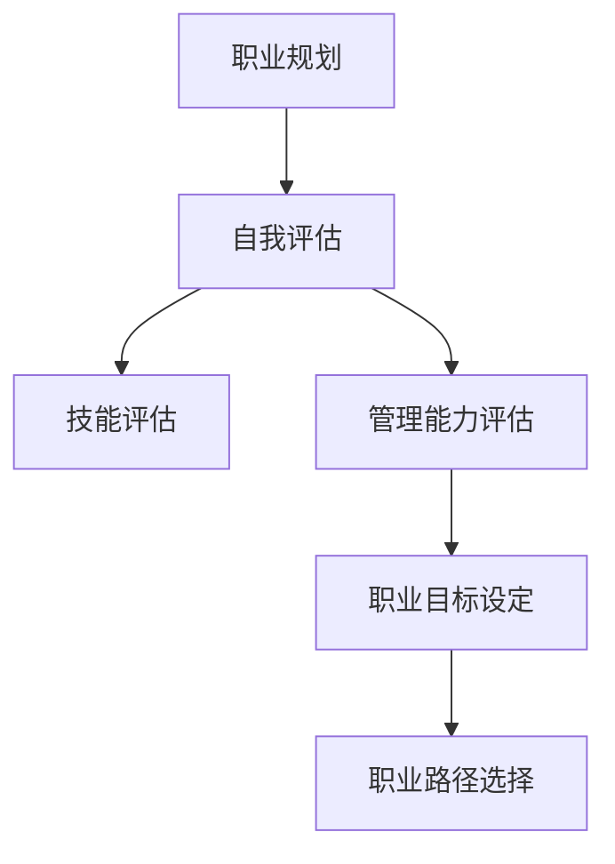
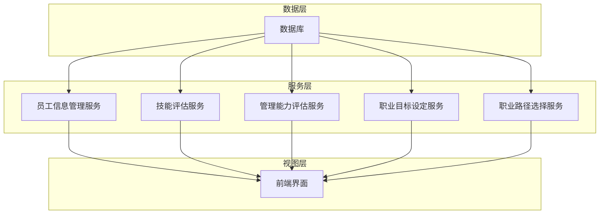
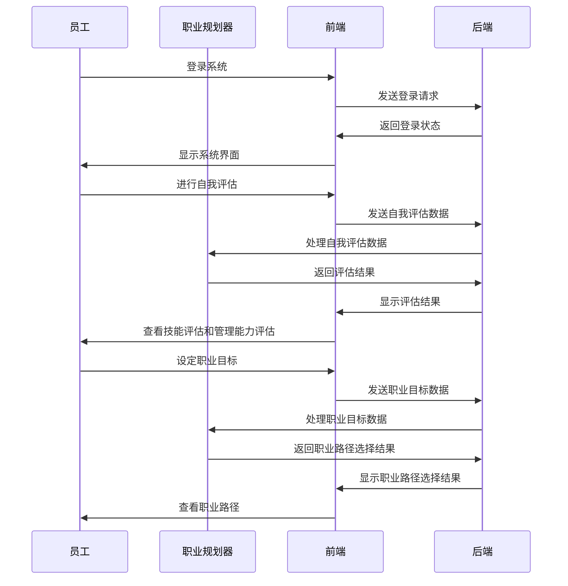

                 

### 第一部分：职业发展规划

#### 第1章：职业规划概述

**背景介绍**

在信息技术飞速发展的时代，技术管理者作为企业中至关重要的一环，肩负着技术决策、团队领导和项目管理的重任。技术管理者的职业规划不仅关系到个人职业生涯的发展，也对企业的发展和竞争力的提升有着深远的影响。因此，深入探讨技术管理者的职业规划，了解其角色定位、发展路径和职业技能提升，具有重要意义。

**问题背景**

技术管理者的角色定位：技术管理者不同于普通工程师，他们不仅要具备深厚的专业技术能力，还要具备优秀的团队管理和项目管理能力。那么，技术管理者的岗位职责具体包括哪些内容？他们与普通工程师之间的区别又在哪里？

职业发展的路径分析：从一名普通工程师到技术管理者的转变是一个逐步的过程。在这个过程中，个人技能的积累和管理经验的积累是必不可少的。此外，技术管理者的发展阶段又是如何划分的？

自我评估与职业定位：在进行职业规划时，自我评估是至关重要的一环。技术管理者需要明确自己的技能水平和能力提升的方向，同时设定明确的职业目标。

**问题描述**

- 技术管理者的岗位职责和角色定位是什么？
- 从工程师到技术管理者的转变路径是怎样的？
- 技术管理者的发展阶段有哪些？
- 如何进行自我评估和职业定位？

**问题解决**

- **1.1.1 技术管理者的岗位职责**
  技术管理者需要负责以下几方面的职责：
  - 技术决策制定：根据企业战略和技术发展趋势，制定技术发展方向和关键技术决策。
  - 团队领导与协作：带领和管理技术团队，确保团队高效协同工作。
  - 技术培训与知识传承：组织和参与技术培训，提升团队技术水平，确保技术知识的传承。
  - 项目管理与进度控制：负责项目的规划和实施，确保项目按期完成并达到预期目标。

- **1.1.2 技术管理者与普通工程师的区别**
  技术管理者与普通工程师的主要区别在于职责和能力的不同：
  - 职责：技术管理者主要负责技术决策和团队管理，而普通工程师主要负责具体的技术实现和问题解决。
  - 能力：技术管理者需要具备出色的团队管理和领导能力，而普通工程师则更注重技术实现和问题解决能力。

- **1.2 职业发展的路径分析**
  - **1.2.1 从工程师到技术管理者的转变**
    从工程师到技术管理者的转变，通常需要经历以下几个阶段：
    - 初期：积累技术知识和经验，提升专业能力。
    - 中期：逐步参与团队管理和项目管理，积累管理经验。
    - 后期：担任团队领导角色，负责团队和项目的管理。

  - **1.2.2 技术管理者的发展阶段**
    技术管理者的发展阶段可以分为以下几个：
    - 初级管理者：负责较小规模的团队和项目，逐渐积累管理经验。
    - 中级管理者：负责较大规模的团队和项目，具备较强的管理能力。
    - 高级管理者：负责企业级的技术战略和项目，具备全面的管理能力。

- **1.3 自我评估与职业定位**
  - **1.3.1 技能评估与能力提升**
    技术管理者需要定期进行自我评估，分析自己在技术能力和管理能力方面的优势与不足，制定具体的提升计划。具体包括：
    - 技术能力的评估：通过参加技术竞赛、阅读技术文献、参与开源项目等方式，不断提升自己的技术水平。
    - 管理能力的评估：通过参与团队管理、项目管理等实践活动，提升自己的管理能力。

  - **1.3.2 职业目标的设定**
    技术管理者应根据自身的实际情况和职业发展规划，设定明确的职业目标。职业目标的设定应具有以下特点：
    - 可实现性：目标应具有可衡量性和可实现性，避免设定过高或不切实际的目标。
    - 时效性：目标应具有明确的实现时间，以便于跟踪和评估。
    - 挑战性：目标应具有一定的挑战性，以激发自身的潜力和动力。

**边界与外延**

- **边界**：本文主要探讨技术管理者的职业规划，包括角色定位、发展路径和职业技能提升等方面。技术管理者的职业规划是一个长期的、动态的过程，需要不断地调整和优化。
- **外延**：除了技术管理者的职业规划，企业的人才培养、团队建设、项目管理等方面也与职业规划密切相关。在职业规划的过程中，技术管理者需要综合考虑这些因素，实现个人与企业的共同发展。

**概念结构与核心要素组成**

- **概念结构**：技术管理者的职业规划可以分为三个主要方面：角色定位、发展路径和职业技能提升。
- **核心要素**：
  - 角色定位：技术管理者的岗位职责和角色定位。
  - 发展路径：从工程师到技术管理者的转变路径和技术管理者的发展阶段。
  - 技能提升：技术能力和管理能力的评估与提升。

**核心概念与联系**

- **核心概念**：
  - 技术管理者：负责技术决策、团队领导和项目管理的职业角色。
  - 工程师：负责具体技术实现和问题解决的职业角色。
  - 职业规划：根据个人能力和目标，制定长期的职业发展计划。
- **概念属性特征对比表格**：

| 角色       | 技术管理者                  | 工程师                    |
|------------|-----------------------------|---------------------------|
| 职责       | 技术决策、团队领导、项目管理 | 技术实现、问题解决         |
| 技能要求   | 管理能力、技术能力          | 专业技术能力              |
| 发展路径   | 从工程师到技术管理者        | 专业成长                  |
| 职业目标   | 企业级技术战略和项目负责    | 成功的技术实现和个人成长  |

**ER实体关系图架构的 Mermaid 流程图**

```mermaid
erDiagram
  工程师 ||--|{ 技术管理者 }|-- 技术团队
  技术管理者 ||--|{ 项目管理 }|-- 项目
  技术管理者 ||--|{ 技术决策 }|-- 技术发展方向
```

**算法原理讲解**

技术管理者的职业规划本质上是一个决策过程，涉及到自我评估、目标设定、路径选择等多个方面。我们可以将这个过程抽象为一个决策树，每个节点代表一个决策点，每个分支代表一个可能的决策方向。

- **决策树模型**：



- **Python 源代码实现**：

```python
class CareerPlanner:
    def __init__(self, self_evaluation):
        self.self_evaluation = self_evaluation

    def skill_evaluation(self):
        # 技能评估
        if self.self_evaluation['technical_ability'] > 7:
            return '高级工程师'
        else:
            return '初级工程师'

    def management_evaluation(self):
        # 管理能力评估
        if self.self_evaluation['management_ability'] > 7:
            return '技术管理者'
        else:
            return '普通工程师'

    def career_target_setting(self):
        # 职业目标设定
        if self.self_evaluation['management_ability'] > 7:
            return '成为技术领导者'
        else:
            return '成为技术专家'

    def career_path_selection(self):
        # 职业路径选择
        if self.skill_evaluation() == '高级工程师' and self.management_evaluation() == '技术管理者':
            return '技术管理路径'
        else:
            return '技术专家路径'
```

- **算法原理与公式**

技术管理者的职业规划可以看作是一个多阶段决策过程，每个阶段的决策都会影响后续的路径选择。我们可以使用以下公式来表示：

$$
P = f(S_1, S_2, \ldots, S_n)
$$

其中，$P$ 代表职业路径，$S_i$ 代表第 $i$ 个阶段的评估结果。

- **举例说明**

假设一位技术人员的自我评估结果如下：

| 评估指标      | 分数 |
|--------------|------|
| 技术能力      | 8    |
| 管理能力      | 5    |

根据上述公式和评估结果，我们可以得出以下职业路径：

1. 技能评估：高级工程师
2. 管理能力评估：普通工程师
3. 职业目标设定：成为技术专家
4. 职业路径选择：技术专家路径

**系统分析与架构设计方案**

**问题场景介绍**

在一家软件开发公司，技术管理者需要对现有团队和项目进行有效的管理和规划，以提升团队效率和项目成功率。为此，技术管理者需要对团队成员的技能和管理能力进行评估，并根据评估结果设定职业目标，选择合适的职业路径。

**项目介绍**

项目名称：技术管理者职业规划系统

项目目标：为技术管理者提供一套完整的职业规划方案，包括自我评估、技能评估、管理能力评估、职业目标设定和职业路径选择。

**系统功能设计（领域模型 Mermaid 类图）**

```mermaid
classDiagram
    ClassDiagram {
        Class Employee {
            +string name
            +int age
            +string position
            +dict skills
            +dict management_ability
            +CareerPlanner career_planner
        }
        Class CareerPlanner {
            +string skill_evaluation()
            +string management_evaluation()
            +string career_target_setting()
            +string career_path_selection()
        }
    }
```

**系统架构设计（Mermaid 架构图）**



**系统接口设计和系统交互（Mermaid 序列图）**



**项目实战**

**环境安装**

1. 安装Python环境
2. 安装所需的Python库，如Flask、SQLAlchemy等

**系统核心实现源代码**

```python
# 员工类
class Employee:
    def __init__(self, name, age, position, skills, management_ability):
        self.name = name
        self.age = age
        self.position = position
        self.skills = skills
        self.management_ability = management_ability
        self.career_planner = CareerPlanner(self)

    def self_evaluation(self):
        # 进行自我评估
        self.career_planner.evaluate_skills(self.skills)
        self.career_planner.evaluate_management_ability(self.management_ability)

    def set_career_target(self, career_target):
        # 设定职业目标
        self.career_planner.set_career_target(career_target)

    def get_career_path(self):
        # 获取职业路径
        return self.career_planner.get_career_path()


# 职业规划器类
class CareerPlanner:
    def __init__(self, self_evaluation):
        self.self_evaluation = self_evaluation

    def evaluate_skills(self, skills):
        # 技能评估
        if skills['technical_ability'] > 7:
            self.skill_evaluation = '高级工程师'
        else:
            self.skill_evaluation = '初级工程师'

    def evaluate_management_ability(self, management_ability):
        # 管理能力评估
        if management_ability['management_ability'] > 7:
            self.management_evaluation = '技术管理者'
        else:
            self.management_evaluation = '普通工程师'

    def set_career_target(self, career_target):
        # 职业目标设定
        if self.management_evaluation == '技术管理者':
            self.career_target = '成为技术领导者'
        else:
            self.career_target = '成为技术专家'

    def get_career_path(self):
        # 职业路径选择
        if self.skill_evaluation == '高级工程师' and self.management_evaluation == '技术管理者':
            self.career_path = '技术管理路径'
        else:
            self.career_path = '技术专家路径'

# 测试代码
if __name__ == '__main__':
    skills = {'technical_ability': 8, 'management_ability': 5}
    management_ability = {'management_ability': 5}
    employee = Employee('张三', 30, '工程师', skills, management_ability)
    employee.self_evaluation()
    employee.set_career_target('成为技术专家')
    print(employee.get_career_path())
```

**代码应用解读与分析**

该系统核心实现包括两个类：`Employee` 和 `CareerPlanner`。

- `Employee` 类表示员工，包括员工的个人信息、技能评估和管理能力评估结果以及职业规划器对象。
- `CareerPlanner` 类负责员工的职业规划，包括技能评估、管理能力评估、职业目标设定和职业路径选择。

在测试代码中，创建了一个名为“张三”的员工对象，其技能评估和管理能力评估结果分别为8和5。根据这些评估结果，系统将员工的职业路径设定为“技术专家路径”。

**实际案例分析和详细讲解剖析**

案例：某公司技术团队中的小李（化名），他是一名30岁的工程师，拥有8年的软件开发经验，擅长前端开发和项目管理。在一次职业规划评估中，小李的技能评估得分为8，管理能力评估得分为5。

**分析**

1. 技能评估：小李的技术能力较强，可以胜任高级工程师的职位。
2. 管理能力评估：小李的管理能力较为一般，但仍有提升空间。

**讲解剖析**

根据小李的评估结果，我们可以为他制定如下的职业规划：

1. 短期目标（1-3年）：在技术能力方面，小李应继续提升自己的前端开发技能，了解和学习新兴的前端技术，如Vue、React等。同时，他可以参与更多的项目管理活动，积累项目管理经验，提升自己的管理能力。
2. 中期目标（3-5年）：在技能和能力都得到提升后，小李可以考虑向技术管理者转型，担任团队领导角色。此时，他需要进一步提升自己的团队管理能力和沟通能力，以确保团队的高效运作。
3. 长期目标（5年以上）：在担任技术管理者一段时间后，小李可以考虑晋升为高级管理者，负责公司级的技术战略和项目。此时，他需要具备全面的管理能力和战略思维，能够引领团队不断前进。

**项目小结**

通过实际案例的分析和讲解，我们可以看到，技术管理者的职业规划是一个长期且系统的过程。在实际操作中，技术管理者需要根据自身的实际情况和职业发展目标，制定合适的职业规划，不断提升自己的技术能力和管理能力，为实现职业生涯的持续发展打下坚实的基础。

**最佳实践 tips**

1. 定期进行自我评估：技术管理者应定期对自己的技能和管理能力进行评估，找出不足之处，并制定针对性的提升计划。
2. 学习与分享：参加技术培训和分享会，学习最新的技术动态和管理理念，不断提升自己的专业素养。
3. 建立专业网络：与同行建立良好的合作关系，拓宽视野，获取更多职业发展机会。
4. 保持持续学习：技术领域变化迅速，技术管理者应保持持续学习的动力，紧跟行业发展趋势。

**小结**

技术管理者的职业规划是一个复杂且长期的过程，需要技术管理者根据自身的实际情况和职业发展目标，制定合理的职业规划，并不断进行技能提升和管理能力提升。通过本文的讨论，我们了解了技术管理者的职业角色定位、职业发展路径和职业技能提升方法，为技术管理者提供了有益的参考。

**注意事项**

1. 职业规划应具有可实现性和挑战性，避免设定过高或不切实际的目标。
2. 职业规划需要根据实际情况进行调整和优化，保持灵活性。
3. 技术管理者应关注团队建设和团队管理，提升团队整体效率。

**拓展阅读**

1. 《技术管理者的修炼之道》：本书详细介绍了技术管理者的角色定位、职业发展路径和职业技能提升方法，对技术管理者有很高的参考价值。
2. 《产品经理实战手册》：本书从产品管理的角度，探讨了如何进行产品规划、需求分析和团队协作，对技术管理者在项目管理方面也有很好的借鉴意义。

### 附录：职业发展资源与工具

**职业发展资源**

1. **在线课程与培训**
   - Coursera、edX、Udemy等平台提供了丰富的技术和管理课程，涵盖了编程、数据分析、项目管理等多个领域。
   - LinkedIn Learning：提供多种职业技能培训课程，包括沟通技巧、领导力、项目管理等。

2. **专业协会与社群**
   - IEEE（电气和电子工程师协会）：全球最大的工程技术专业组织，提供丰富的技术资源和职业发展机会。
   - ACM（计算机协会）：全球最大的计算机科学领域专业组织，提供学术研究、职业发展等多个方面的支持。

**职业规划工具**

1. **个人发展计划模板**
   - LinkedIn的职业规划工具：提供个人发展计划模板，帮助用户设定职业目标、制定行动计划。
   - Trello：一款任务管理工具，可以用来制定和跟踪职业发展计划。

2. **职业测评工具**
   - 16Personalities：一款基于MBTI（迈尔斯-布里格斯类型指标）的职业测评工具，帮助用户了解自己的性格优势和职业倾向。
   - StrengthsFinder：一款基于优势识别的职业测评工具，帮助用户发现自身的优势，并指导职业规划。

**职业成长指南**

1. **职业成长书籍推荐**
   - 《深度工作》：作者Cal Newport提出了深度工作的概念，帮助读者提升专注力和工作效率。
   - 《刻意练习》：作者安德斯·艾利克森通过大量案例和研究，探讨了如何通过刻意练习提升专业技能。

2. **行业报告与趋势分析**
   - Gartner、IDC等市场研究机构发布的行业报告，提供了对技术发展趋势和市场动态的深入分析。
   - LinkedIn发布的年度职业趋势报告，帮助用户了解当前职业市场的需求和变化。

作者：AI天才研究院/AI Genius Institute & 禅与计算机程序设计艺术 /Zen And The Art of Computer Programming

---

**小结**

在本文中，我们从技术管理者的职业角色定位、发展路径和职业技能提升等多个角度，详细探讨了技术管理者的职业规划与发展。通过自我评估与职业定位，技术管理者可以明确自己的职业目标，并制定切实可行的职业发展计划。同时，通过不断提升技术能力和管理能力，技术管理者能够更好地应对职业挑战，实现职业生涯的持续成长。

**结束语**

技术管理者的职业规划与发展是一个不断探索和优化的过程。希望本文能为广大技术管理者提供有益的启示和帮助，助力他们在职业生涯中取得更大的成就。在未来的道路上，让我们共同努力，不断追求卓越，成为更优秀的技术管理者。祝愿每一位技术管理者都能在职业道路上越走越远，实现个人与企业的共同发展。

