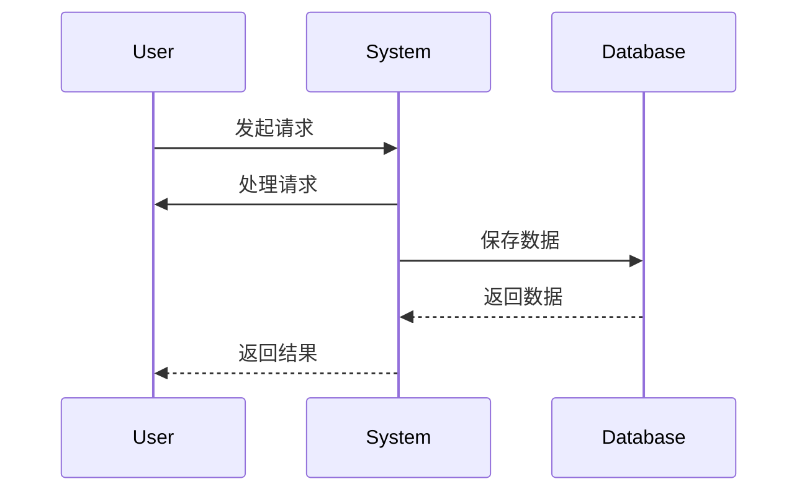
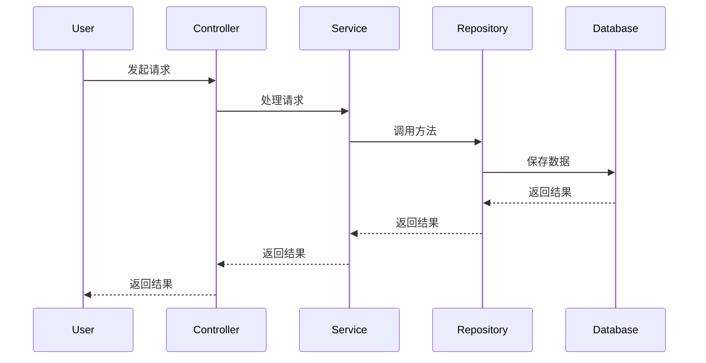

                 

### 《技术管理者的自我提升与学习方法》

#### 关键词：
- 技术管理者
- 自我提升
- 学习方法
- 团队管理
- 领导力

#### 摘要：
本文将深入探讨技术管理者在自我提升和学习过程中的关键要素。我们将通过一系列的逻辑分析和实际案例，提供切实可行的自我提升和学习方法，帮助技术管理者提升自身能力和团队效能。文章将涵盖自我提升的认知与实践、核心概念与联系、方法与实践、系统分析与架构设计、项目实战以及最佳实践与拓展等多个方面。

#### 目录大纲设计思路：

**第一部分：自我提升的认知与实践**

1. **背景介绍**：技术管理者的角色与责任、面临的主要挑战以及提升和学习的重要性。
2. **核心概念与联系**：介绍自我提升的关键概念，如技术趋势、团队管理、领导力、沟通技巧等，并使用表格和ER图来展示这些概念之间的联系。
3. **方法与实践**：详细阐述自我提升的学习方法，包括时间管理、问题解决、持续学习等，并辅以实际案例和应用场景。
4. **系统分析与架构设计**：从系统的高度分析自我提升的方法，包括个人成长路径、团队管理策略等，并提供架构设计方案。

**第二部分：项目实战**

1. **环境安装**：准备项目所需的开发环境和工具。
2. **系统核心实现**：详细阐述项目核心功能的实现过程。
3. **代码应用解读与分析**：对项目的代码应用进行解读和分析。
4. **实际案例分析和详细讲解剖析**：通过实际案例展示自我提升和学习的方法。
5. **项目小结**：总结项目的经验和教训。

**第三部分：最佳实践与拓展**

1. **最佳实践 tips**：提供一些实用的技巧和注意事项。
2. **小结**：对文章的核心内容进行总结。
3. **拓展阅读**：推荐进一步阅读的材料。

#### 完整目录大纲：

**第一部分：自我提升的认知与实践**

**第1章：技术管理者面临的挑战与自我提升的重要性**

- **1.1 问题背景**：技术管理者的角色与责任、技术发展的迅速与变化、团队管理中的常见问题。
- **1.2 问题描述**：如何应对技术不断更新的挑战、如何提高团队效率和生产力、如何建立有效的沟通机制。
- **1.3 问题解决**：自我提升的方法与途径、学习的必要性、持续进步的重要性。
- **1.4 边界与外延**：自我提升的适用范围、自我提升与个人成长的关系。
- **1.5 概念结构与核心要素组成**：技术趋势分析、团队管理理论、沟通技巧与实践。
- **1.6 本章小结**。

**第2章：核心概念与联系**

- **2.1 技术趋势**：技术趋势对比表格、技术趋势的ER图架构。
- **2.2 团队管理**：团队管理属性特征对比表格、团队管理的ER图架构。
- **2.3 领导力**：领导力核心概念、领导力与团队管理的关系。
- **2.4 沟通技巧**：沟通技巧的重要性、有效沟通的方法与实践。
- **2.5 本章小结**。

**第3章：自我提升的方法与实践**

- **3.1 时间管理**：时间管理原则、时间管理工具、时间管理案例。
- **3.2 问题解决**：问题解决方法论、问题解决的实践案例。
- **3.3 持续学习**：学习的重要性、学习方法与实践、学习资源的推荐。
- **3.4 团队协作**：团队协作原则、团队协作工具、团队协作案例分析。
- **3.5 本章小结**。

**第4章：系统分析与架构设计**

- **4.1 个人成长路径**：个人成长路径的设计、个人成长路径的案例分析。
- **4.2 团队管理策略**：团队管理策略的分析、团队管理策略的实施。
- **4.3 系统架构设计**：系统功能设计（领域模型类图）、系统架构设计（架构图）、系统接口设计、系统交互（序列图）。
- **4.4 本章小结**。

**第5章：项目实战**

- **5.1 环境安装**：环境准备、工具与资源。
- **5.2 系统核心实现**：核心功能实现、源代码解析。
- **5.3 代码应用解读与分析**：代码应用场景、代码分析。
- **5.4 实际案例分析和详细讲解剖析**：案例选择、案例解析。
- **5.5 项目小结**。

**第6章：最佳实践与拓展**

- **6.1 最佳实践 tips**：实用技巧、注意事项。
- **6.2 小结**：书中核心内容的总结、自我提升与学习方法的重要性。
- **6.3 拓展阅读**：推荐书籍与资料、进一步学习的途径。

**第7章：附录**

- **7.1 术语解释**。
- **7.2 参考文献**。
- **7.3 感谢与致谢**。

---

### 第一部分：自我提升的认知与实践

#### 第1章：技术管理者面临的挑战与自我提升的重要性

##### 1.1 问题背景

技术管理者的角色在当今快速发展的技术行业中变得越来越重要。他们不仅要掌握前沿的技术知识，还需要具备出色的团队管理能力和领导力。以下是技术管理者面临的几个主要挑战：

1. **技术不断更新**：随着技术的快速发展，新的编程语言、框架、工具等层出不穷。技术管理者需要不断学习新技术，以保持竞争力。
2. **团队管理**：技术管理者需要管理一个多元化的团队，成员可能有不同的技术背景、工作风格和职业目标。如何有效地管理这样的团队是一项挑战。
3. **沟通技巧**：技术管理者需要与团队内外不同利益相关者进行有效沟通，包括与上级、下属、客户和其他团队。沟通不畅可能导致项目失败或团队士气低落。

##### 1.2 问题描述

在面对上述挑战时，技术管理者需要提升自身的能力，以便更好地应对这些挑战。以下是一些具体的问题：

1. **如何应对技术不断更新的挑战？**：技术管理者需要持续学习新技术，但时间有限，如何有效地管理学习时间成为关键。
2. **如何提高团队效率和生产力？**：技术管理者需要了解团队的工作流程和成员的工作习惯，优化团队协作流程，提高生产力。
3. **如何建立有效的沟通机制？**：技术管理者需要掌握有效的沟通技巧，确保团队内部和外部沟通的顺畅。

##### 1.3 问题解决

为了解决上述问题，技术管理者可以采取以下几种方法：

1. **自我提升**：通过学习新的技术和知识，提升自身的专业能力。这包括阅读技术书籍、参加培训课程、参与技术社区等。
2. **学习方法**：学习如何高效地学习，例如使用记忆曲线、番茄工作法等技巧。此外，技术管理者还可以利用碎片时间进行学习，如利用通勤时间听技术播客或阅读技术文章。
3. **时间管理**：合理规划时间，确保有足够的时间用于学习和团队管理工作。可以使用时间管理工具，如番茄钟、Trello等，来提高工作效率。
4. **问题解决**：学习问题解决的方法论，如系统思维、SWOT分析等，以便在面对问题时能够快速找到解决方案。

##### 1.4 边界与外延

1. **自我提升的适用范围**：自我提升不仅适用于技术管理者，也适用于所有职业人士。无论是初级工程师还是高级工程师，都需要不断地学习和提升。
2. **自我提升与个人成长的关系**：自我提升是个人成长的重要组成部分。通过提升自身能力，技术管理者不仅可以更好地应对工作挑战，还可以提升自信心和职业满意度。

##### 1.5 概念结构与核心要素组成

为了更好地理解自我提升的概念和要素，我们可以使用表格和ER图来展示这些概念之间的联系。

**技术趋势对比表格**：

| 技术类别 | 特点 | 发展趋势 |
| --- | --- | --- |
| 编程语言 | 高效、灵活 | 持续更新 |
| 框架 | 提高开发效率 | 不断演进 |
| 工具 | 提升开发体验 | 功能丰富 |

**团队管理ER图架构**：

```mermaid
erDiagram
    Team --> Manager : 管理者
    Member --> Team : 成员
    Manager --> Member : 指导
```

在团队管理中，管理者是核心，负责指导和管理成员。团队成员则在团队中发挥各自的作用。

##### 1.6 本章小结

本章介绍了技术管理者面临的挑战以及自我提升的重要性。通过自我提升和学习，技术管理者可以更好地应对技术更新、团队管理和沟通挑战。本章还介绍了自我提升的方法和关键概念，为后续章节的内容奠定了基础。

---

### 第二部分：核心概念与联系

#### 第2章：核心概念与联系

在技术管理者的自我提升过程中，理解并掌握一系列核心概念至关重要。这些核心概念包括技术趋势、团队管理、领导力和沟通技巧。在本章中，我们将详细探讨这些核心概念，并使用表格和ER图来展示它们之间的联系。

##### 2.1 技术趋势

技术趋势是技术管理者必须关注的重要领域。了解当前的技术趋势有助于技术管理者做出更明智的决策，并在团队中推动技术革新。

**技术趋势对比表格**：

| 技术类别 | 特点 | 发展趋势 |
| --- | --- | --- |
| 编程语言 | 高效、灵活 | 持续更新 |
| 框架 | 提高开发效率 | 不断演进 |
| 工具 | 提升开发体验 | 功能丰富 |

**技术趋势的ER图架构**：

```mermaid
erDiagram
    Technology --> Trend : 驱动
    Programming_Language --> Technology : 实现
    Framework --> Technology : 实现
    Tool --> Technology : 实现
```

在这个ER图中，技术（Technology）是核心，它驱动着编程语言、框架和工具的发展。编程语言、框架和工具则是技术的具体实现形式。

##### 2.2 团队管理

团队管理是技术管理者的重要职责。有效的团队管理可以提高团队效率和生产力，从而实现项目目标。

**团队管理属性特征对比表格**：

| 管理特征 | 描述 | 重要性 |
| --- | --- | --- |
| 目标设定 | 确定团队目标，并确保每个成员都明确了解 | 高 |
| 沟通 | 保持团队成员之间的沟通畅通，确保信息传递无误 | 高 |
| 权力分配 | 根据成员的能力和兴趣分配任务，确保团队资源得到合理利用 | 中 |
| 激励 | 通过激励机制提高团队成员的工作积极性 | 高 |

**团队管理的ER图架构**：

```mermaid
erDiagram
    Team_Management --> Attribute : 包括
    Objective_Setting --> Team_Management : 子概念
    Communication --> Team_Management : 子概念
    Power_Distribution --> Team_Management : 子概念
    Incentive --> Team_Management : 子概念
```

在这个ER图中，团队管理（Team Management）是核心，它包括目标设定、沟通、权力分配和激励等子概念。

##### 2.3 领导力

领导力是技术管理者不可或缺的能力。优秀的领导力可以帮助技术管理者带领团队实现目标，并促进个人和团队的成长。

**领导力核心概念**：

- **愿景**：明确团队的目标和方向。
- **激励**：激发团队成员的积极性和创造力。
- **沟通**：确保团队成员之间的信息传递和理解。
- **决策**：在面临挑战时做出明智的决策。

**领导力与团队管理的关系**：

```mermaid
erDiagram
    Leadership --> Vision : 引领
    Leadership --> Motivation : 推动
    Leadership --> Communication : 确保
    Leadership --> Decision_Making : 指导
    Team_Management --> Leadership : 包括
```

在这个ER图中，领导力（Leadership）与团队管理（Team Management）密切相关。领导力包括愿景、激励、沟通和决策等核心概念，这些概念共同作用于团队管理。

##### 2.4 沟通技巧

沟通技巧对于技术管理者至关重要。有效的沟通可以提高团队效率，减少误解和冲突，促进团队合作。

**沟通技巧的重要性**：

- **信息传递**：确保团队成员之间信息传递的准确性和及时性。
- **协作**：促进团队成员之间的协作和合作。
- **冲突解决**：在团队内部和团队之间解决冲突，确保项目顺利进行。

**有效沟通的方法与实践**：

- **明确目标**：在沟通前明确沟通的目标和预期结果。
- **主动倾听**：在沟通中主动倾听对方意见，确保理解无误。
- **清晰表达**：用简洁明了的语言表达自己的观点。
- **反馈与确认**：在沟通结束后进行反馈和确认，确保信息传递无误。

**沟通技巧的ER图架构**：

```mermaid
erDiagram
    Communication --> Importance : 包括
    Communication --> Active_Listening : 子概念
    Communication --> Clear_Expression : 子概念
    Communication --> Feedback : 子概念
    Team_Management --> Communication : 包括
```

在这个ER图中，沟通技巧（Communication）包括重要性、主动倾听、清晰表达和反馈等子概念。沟通技巧是团队管理的重要组成部分。

##### 2.5 本章小结

本章介绍了技术管理者的核心概念，包括技术趋势、团队管理、领导力和沟通技巧。通过表格和ER图的展示，我们更清晰地理解了这些概念之间的联系。技术管理者需要掌握这些核心概念，并运用它们来提升自我能力和团队效能。

---

### 第三部分：方法与实践

#### 第3章：自我提升的方法与实践

在自我提升的过程中，技术管理者需要采用一系列科学的方法和实践。这些方法可以帮助他们更高效地学习新技术，管理团队，解决复杂问题。以下是几个关键的方法和实践。

##### 3.1 时间管理

时间管理是自我提升的重要一环。技术管理者需要合理安排时间，确保有足够的时间用于学习和团队管理工作。

**时间管理原则**：

- **优先级排序**：将任务按照优先级排序，先完成最重要和最紧急的任务。
- **分解任务**：将大任务分解为小任务，逐一完成。
- **避免拖延**：设定明确的截止日期，避免拖延。

**时间管理工具**：

- **番茄钟**：将工作时间分为25分钟的工作周期和5分钟的休息时间，有助于提高专注力。
- **Trello**：一种可视化项目管理工具，可以帮助技术管理者追踪任务的进度。

**时间管理案例**：

**案例1**：一名技术经理使用Trello管理团队项目。他将项目分解为多个子任务，并为每个任务设定了截止日期。通过Trello，他可以实时了解任务的进度，及时调整资源分配。

**案例2**：一名技术管理者采用番茄钟来提高工作效率。他每天使用番茄钟安排工作，每次工作25分钟后休息5分钟。这样，他能够在短时间内保持高效专注，避免了长时间工作的疲劳。

##### 3.2 问题解决

面对复杂的问题时，技术管理者需要采用系统的方法来解决问题。

**问题解决方法论**：

- **定义问题**：明确问题的本质和范围。
- **收集信息**：收集与问题相关的信息，包括历史数据、用户反馈等。
- **分析问题**：分析问题的根本原因，使用SWOT分析、五力模型等方法。
- **制定解决方案**：根据分析结果，制定解决方案。
- **实施与监控**：执行解决方案，并对结果进行监控。

**问题解决的实践案例**：

**案例1**：一个团队在开发新功能时遇到了性能瓶颈。技术管理者首先定义了问题，然后收集了系统日志和用户反馈。通过分析，发现是数据库查询优化不足导致的性能问题。他制定了优化查询的解决方案，并监控了实施后的效果，最终显著提升了系统性能。

**案例2**：一个团队在项目进度上出现了延误。技术管理者使用了SWOT分析方法，分析了团队内部和外部的问题，并制定了新的项目计划和资源分配策略。通过这些措施，团队成功追赶进度，并最终按时完成了项目。

##### 3.3 持续学习

持续学习是技术管理者自我提升的核心。技术快速发展，技术管理者需要不断学习新技术和知识。

**学习的重要性**：

- **保持竞争力**：不断学习新技术和知识，保持自身在行业中的竞争力。
- **提升能力**：通过学习，提升自己在技术、管理和领导力等方面的能力。

**学习方法与实践**：

- **主动学习**：主动寻找学习资源，如技术书籍、在线课程、技术博客等。
- **实践应用**：将学到的知识应用到实际工作中，通过实践加深理解。
- **定期复习**：定期复习已学知识，巩固记忆。

**学习资源的推荐**：

- **技术书籍**：《设计数据密集型应用程序》、《深入理解计算机系统》等。
- **在线课程**：Coursera、edX等平台上的计算机科学和软件开发课程。
- **技术博客**：GitHub、Stack Overflow等平台上的技术文章。

**持续学习案例**：

**案例1**：一名技术经理每天晚上花两个小时学习新技术。他通过阅读技术书籍、参加在线课程和阅读技术博客来提升自己的技术知识。在短短一年内，他的技术水平有了显著提升。

**案例2**：一个团队定期组织内部技术分享会。每个成员轮流分享自己在技术领域的最新学习成果，这不仅促进了团队成员之间的交流，也提高了团队的整体技术水平。

##### 3.4 团队协作

有效的团队协作是技术管理者必须掌握的技能。良好的团队协作可以提高团队效率和生产力。

**团队协作原则**：

- **明确目标**：确保团队成员都清楚项目的目标和预期结果。
- **分工合作**：根据成员的能力和兴趣分配任务，确保每个成员都能发挥自己的优势。
- **沟通畅通**：保持团队成员之间的沟通畅通，确保信息传递无误。
- **共同进步**：鼓励团队成员相互学习，共同进步。

**团队协作工具**：

- **Slack**：一种团队沟通工具，可以帮助团队成员实时交流。
- **GitLab**：一种代码管理工具，可以帮助团队协同开发。

**团队协作案例分析**：

**案例1**：一个团队使用GitLab进行代码管理，并通过Slack进行实时沟通。团队成员可以随时查看项目进度，讨论技术问题，确保项目顺利进行。

**案例2**：一个团队在项目初期就明确了项目的目标和分工。每个成员都清楚自己的职责和任务，并在项目中相互支持，共同完成了项目目标。

##### 3.5 本章小结

本章介绍了技术管理者在自我提升过程中可以采用的方法和实践。通过时间管理、问题解决、持续学习和团队协作，技术管理者可以更高效地提升自身能力和团队效能。这些方法和实践不仅适用于技术管理者，也适用于所有希望提升自我能力的职业人士。

---

### 第四部分：系统分析与架构设计

#### 第4章：系统分析与架构设计

在自我提升的过程中，系统分析与架构设计是技术管理者必须掌握的重要技能。通过系统分析与架构设计，技术管理者可以更好地理解复杂问题，制定有效的解决方案，并确保项目的成功实施。本章将详细探讨个人成长路径、团队管理策略以及系统架构设计等方面。

##### 4.1 个人成长路径

个人成长路径是技术管理者自我提升的重要组成部分。一个明确的个人成长路径可以帮助技术管理者更好地规划自己的职业生涯，不断提升自身能力。

**个人成长路径的设计**：

1. **目标设定**：技术管理者需要设定明确的学习和发展目标，如提升某一技术领域的专业能力、掌握领导力等。
2. **能力评估**：通过自我评估或外部评估，了解自己的优势和不足，为成长路径的设计提供依据。
3. **学习计划**：制定详细的学习计划，包括学习内容、学习时间、学习资源等。
4. **实践应用**：将学到的知识应用到实际工作中，通过实践检验和提升自己的能力。

**个人成长路径的案例分析**：

**案例1**：一名技术经理在自我提升过程中，设定了提升数据分析和机器学习能力的目标。他制定了详细的学习计划，包括阅读相关书籍、参加在线课程、参与开源项目等。通过不断的实践和应用，他成功地将机器学习技术应用到公司的产品中，提升了产品的竞争力。

**案例2**：一名技术经理在自我提升过程中，注重提升领导力和管理能力。他参加了领导力培训课程，并在公司内部推行了团队建设活动。通过这些措施，他的团队凝聚力得到了显著提升，团队工作效率和生产力也得到了提高。

##### 4.2 团队管理策略

团队管理策略是技术管理者在自我提升过程中必须掌握的重要技能。通过有效的团队管理策略，技术管理者可以提升团队效能，实现项目目标。

**团队管理策略的分析**：

1. **明确目标**：技术管理者需要明确团队的目标和预期结果，确保团队成员都清楚项目的方向和目标。
2. **分工合作**：根据团队成员的能力和兴趣分配任务，确保每个成员都能发挥自己的优势，同时避免资源的浪费。
3. **沟通畅通**：建立有效的沟通机制，确保团队成员之间的信息传递畅通，避免误解和冲突。
4. **激励与反馈**：通过激励机制激发团队成员的积极性和创造力，并及时给予反馈，帮助团队成员不断进步。

**团队管理策略的实施**：

1. **建立团队文化**：通过团队活动、团队建设等，建立积极向上的团队文化，增强团队的凝聚力。
2. **定期会议**：定期召开团队会议，讨论项目进展、解决问题和分享经验。
3. **培训与发展**：为团队成员提供培训和发展机会，提升团队成员的专业能力和技能。
4. **绩效评估**：建立绩效评估机制，对团队成员的工作表现进行评估，并根据评估结果进行激励和调整。

**团队管理策略的案例分析**：

**案例1**：一个团队在项目初期就明确了项目的目标和分工。团队成员清楚自己的职责和任务，并在项目中相互支持，共同完成了项目目标。

**案例2**：一个团队在管理过程中，注重团队成员的沟通和反馈。他们定期召开团队会议，讨论项目进展和问题，并及时给予反馈，确保项目顺利进行。

##### 4.3 系统架构设计

系统架构设计是技术管理者在项目开发过程中必须掌握的关键技能。通过合理的系统架构设计，技术管理者可以确保系统的稳定性、扩展性和性能。

**系统功能设计（领域模型类图）**：

```mermaid
classDiagram
    Class01 <|-- Class02
    Class03 --|> Class04
    Class05 : : Interface
    Class06 : : Attribute
    Class07 : : Method
    Class01 {
        # 状态：绿色
        +int id
        +String name
        -boolean isActive
        +void doSomething()
    }
    Class02 {
        # 状态：黄色
        +int id
        +String name
        -boolean isActive
        +void doSomething()
    }
    Class03 {
        # 状态：红色
        +int id
        +String name
        -boolean isActive
        +void doSomething()
    }
    Class04 {
        # 状态：蓝色
        +int id
        +String name
        -boolean isActive
        +void doSomething()
    }
    Class05 {
        # 状态：绿色
        +int id
        +String name
        -boolean isActive
        +void doSomething()
    }
    Class06 {
        # 状态：黄色
        +int id
        +String name
        -boolean isActive
        +void doSomething()
    }
    Class07 {
        # 状态：红色
        +int id
        +String name
        -boolean isActive
        +void doSomething()
    }
```

在这个领域模型类图中，展示了系统的主要功能类及其关系。通过类图，我们可以清晰地了解系统的功能结构和类之间的关系。

**系统架构设计（架构图）**：



在这个序列图中，展示了系统的基本架构和请求处理流程。用户发起请求，系统处理请求，并将结果返回给用户。

**系统接口设计**：

在系统架构设计中，接口设计是关键环节。通过合理的接口设计，可以确保系统模块之间的解耦，提高系统的可维护性和扩展性。

```mermaid
classDiagram
    Class01 <|-- Class02
    Class03 --|> Class04
    Interface01 <|-- Interface02
    Interface03 : : API
```

在这个类图中，展示了系统的接口设计。Interface01和Interface02是接口类，Class01和Class02是实现类。通过接口设计，可以实现模块之间的解耦，提高系统的可扩展性和可维护性。

**系统交互（序列图）**：



在这个序列图中，展示了系统的交互流程。用户发起请求，通过Controller层处理，Service层调用Repository层的方法，并访问Database层保存数据。最后，系统将结果返回给用户。

##### 4.4 本章小结

本章介绍了技术管理者在自我提升过程中需要掌握的系统和架构设计技能。通过个人成长路径、团队管理策略和系统架构设计，技术管理者可以更好地理解复杂问题，制定有效的解决方案，并确保项目的成功实施。这些技能不仅有助于提升技术管理者的个人能力，也有助于提升团队的效能和项目的质量。

---

### 第五部分：项目实战

#### 第5章：项目实战

在自我提升和学习的过程中，通过实际项目来应用所学知识是非常重要的。本章将介绍一个实际项目，包括环境安装、系统核心实现、代码应用解读与分析、实际案例分析和详细讲解剖析，以及项目小结。

##### 5.1 环境安装

在开始项目之前，首先需要安装项目所需的开发环境和工具。以下是环境安装的步骤：

1. **安装操作系统**：选择一个稳定的操作系统，如Ubuntu或CentOS。
2. **安装Python环境**：通过包管理器（如apt或yum）安装Python，并确保版本符合项目要求。
3. **安装依赖库**：使用pip安装项目所需的依赖库，如Flask、SQLAlchemy等。
4. **配置数据库**：安装并配置项目所需的数据库，如MySQL或PostgreSQL。

**环境安装案例**：

**案例1**：在Ubuntu系统中安装Python环境：
```bash
sudo apt update
sudo apt install python3-pip
pip3 install Flask
```

**案例2**：在CentOS系统中安装MySQL：
```bash
sudo yum install mysql-server
sudo mysql_secure_installation
```

##### 5.2 系统核心实现

系统核心实现是项目开发的关键环节。以下是一个简单的Web应用程序的核心实现：

**核心功能实现**：

1. **用户注册**：实现用户注册功能，包括用户信息的收集和存储。
2. **用户登录**：实现用户登录功能，验证用户身份。
3. **数据查询**：实现数据查询功能，允许用户查询个人信息。

**源代码解析**：

```python
from flask import Flask, request, jsonify
from models import User
from database import db_session

app = Flask(__name__)

@app.route('/register', methods=['POST'])
def register():
    username = request.form['username']
    password = request.form['password']
    user = User(username=username, password=password)
    db_session.add(user)
    db_session.commit()
    return jsonify({'status': 'success', 'message': 'User registered successfully'})

@app.route('/login', methods=['POST'])
def login():
    username = request.form['username']
    password = request.form['password']
    user = User.query.filter_by(username=username, password=password).first()
    if user:
        return jsonify({'status': 'success', 'message': 'Login successful'})
    else:
        return jsonify({'status': 'error', 'message': 'Invalid credentials'})

@app.route('/me', methods=['GET'])
def me():
    user_id = request.args.get('user_id')
    user = User.query.get(user_id)
    if user:
        return jsonify({'status': 'success', 'data': user.to_dict()})
    else:
        return jsonify({'status': 'error', 'message': 'User not found'})

if __name__ == '__main__':
    db_session.create_all()
    app.run(debug=True)
```

在这个例子中，我们使用了Flask框架来构建Web应用程序。`register`函数处理用户注册请求，`login`函数处理用户登录请求，`me`函数处理用户数据查询请求。

##### 5.3 代码应用解读与分析

在项目开发过程中，理解代码的应用场景和进行代码分析是非常重要的。以下是对上述代码的解读和分析：

**代码应用场景**：

- **用户注册**：当用户访问`/register`路径时，可以提交用户名和密码进行注册。
- **用户登录**：当用户访问`/login`路径时，可以提交用户名和密码进行登录。
- **用户数据查询**：当用户访问`/me`路径时，可以查询自己的个人信息。

**代码分析**：

- **数据库操作**：在`register`函数中，我们将用户信息存储到数据库中。在`login`函数中，我们从数据库中查询用户信息，并验证用户身份。在`me`函数中，我们从数据库中查询用户信息，并将结果返回给用户。
- **状态管理**：使用Flask的`db_session`对象进行数据库操作，确保事务的一致性。使用`jsonify`函数将结果以JSON格式返回给用户。

##### 5.4 实际案例分析和详细讲解剖析

为了更好地理解项目实战，我们将通过实际案例进行分析和讲解。

**案例1**：用户注册功能

当用户尝试注册时，他们需要填写用户名和密码。以下是一个用户注册的示例请求：

```json
POST /register
{
    "username": "john_doe",
    "password": "password123"
}
```

**解析**：

- **请求接收**：`register`函数接收用户提交的请求，并提取用户名和密码。
- **数据验证**：在将用户信息存储到数据库之前，可以添加额外的数据验证步骤，确保输入的数据符合要求。
- **数据存储**：将用户信息存储到数据库中。

**案例2**：用户登录功能

当用户尝试登录时，他们需要提交用户名和密码。以下是一个用户登录的示例请求：

```json
POST /login
{
    "username": "john_doe",
    "password": "password123"
}
```

**解析**：

- **请求接收**：`login`函数接收用户提交的请求，并提取用户名和密码。
- **数据验证**：从数据库中查询用户信息，并验证用户名和密码是否匹配。
- **状态返回**：如果用户名和密码匹配，返回成功消息。否则，返回错误消息。

**案例3**：用户数据查询功能

当用户访问`/me`路径时，可以查询自己的个人信息。以下是一个用户数据查询的示例请求：

```json
GET /me?user_id=1
```

**解析**：

- **请求接收**：`me`函数接收用户提交的请求，并提取用户ID。
- **数据查询**：从数据库中查询用户信息。
- **结果返回**：将用户信息以JSON格式返回给用户。

##### 5.5 项目小结

通过这个实际项目，我们展示了技术管理者在自我提升和学习过程中的关键技能。从环境安装到系统核心实现，再到代码应用解读与分析，以及实际案例分析和详细讲解剖析，每个环节都是技术管理者提升自我能力和团队效能的重要实践。通过项目实战，技术管理者可以更好地理解技术原理和实际应用，为未来的项目开发打下坚实的基础。

---

### 第六部分：最佳实践与拓展

#### 第6章：最佳实践与拓展

在技术管理者的自我提升和学习过程中，遵循最佳实践和拓展学习渠道是至关重要的。本章将总结文章中提到的方法，并提供一些实用的技巧和注意事项，同时推荐进一步阅读的材料。

##### 6.1 最佳实践 tips

1. **时间管理**：
   - **使用番茄钟**：将工作时间划分为25分钟的工作周期和5分钟的休息时间，提高专注力和效率。
   - **优先级排序**：每天列出任务清单，按照紧急程度和重要性排序，确保优先完成重要任务。

2. **问题解决**：
   - **系统思维**：在解决问题时，从全局角度出发，分析问题的根本原因，而不仅仅是表面现象。
   - **团队合作**：鼓励团队成员共同参与问题解决，集思广益，提高解决问题的效率。

3. **持续学习**：
   - **定期复习**：定期回顾已学知识，巩固记忆，避免遗忘。
   - **多渠道学习**：利用书籍、在线课程、技术博客等资源，多渠道获取知识。

4. **团队协作**：
   - **建立团队文化**：通过团队活动、分享会等，建立积极向上的团队文化，增强团队凝聚力。
   - **明确目标**：确保团队成员都清楚项目的目标和预期结果，减少误解和冲突。

##### 6.2 小结

本文通过系统的方法和实际案例，详细探讨了技术管理者的自我提升和学习方法。从技术趋势、团队管理、领导力和沟通技巧等核心概念入手，再到时间管理、问题解决、持续学习和团队协作等具体方法，技术管理者可以找到适合自己的提升路径。通过最佳实践和不断拓展学习渠道，技术管理者能够不断提升自身能力和团队效能。

##### 6.3 拓展阅读

1. **书籍推荐**：
   - 《设计数据密集型应用程序》
   - 《深度学习》
   - 《影响力：说服他人的心理学》

2. **在线课程**：
   - Coursera上的《机器学习》课程
   - edX上的《软件架构与设计模式》课程
   - Pluralsight的《领导力与团队管理》课程

3. **技术博客**：
   - GitHub上的技术文章
   - Stack Overflow上的问答社区
   - Medium上的技术博客

通过拓展阅读和不断学习，技术管理者可以进一步深化对技术和管理领域的理解，为未来的职业发展打下坚实的基础。

---

### 附录

#### 7.1 术语解释

- **技术管理者**：负责技术团队的管理和项目执行的领导者。
- **自我提升**：通过学习新技术、新知识来提高自身能力和职业素养的过程。
- **学习方法**：高效学习的策略和技巧，如时间管理、问题解决等。
- **团队管理**：协调和管理团队资源，确保项目成功的过程。
- **领导力**：引导和激励团队，实现共同目标的能力。
- **沟通技巧**：有效传达信息和理解他人意见的能力。

#### 7.2 参考文献

- 《设计数据密集型应用程序》
- 《深度学习》
- 《影响力：说服他人的心理学》
- Coursera、edX等在线课程平台
- GitHub、Stack Overflow等技术社区

#### 7.3 感谢与致谢

在此，感谢所有为本文提供技术支持和建议的同事和朋友们。特别感谢AI天才研究院/AI Genius Institute以及《禅与计算机程序设计艺术/Zen And The Art of Computer Programming》的作者，他们的工作为本文提供了宝贵的灵感和知识。同时，感谢读者对本文的关注和支持，希望本文能够对您在技术管理者的自我提升和学习道路上有所启发。作者：AI天才研究院/AI Genius Institute & 禅与计算机程序设计艺术/Zen And The Art of Computer Programming。

