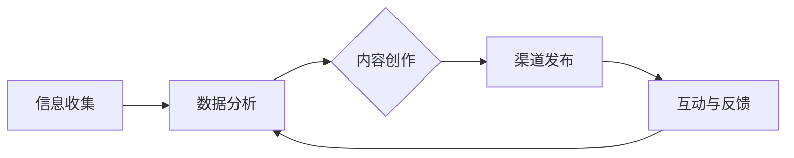
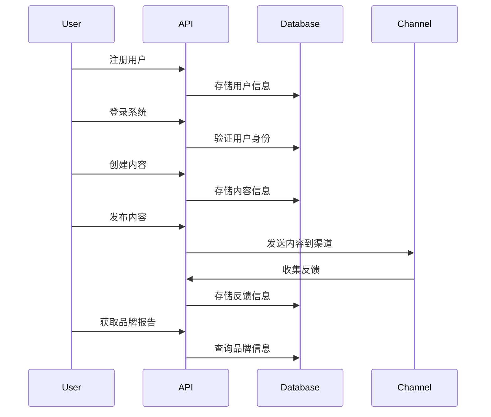

                 

# 技术管理者的自我营销与品牌建设

## 关键词
技术管理者、自我营销、品牌建设、职业发展、影响力、个人竞争力

## 摘要
本文旨在探讨技术管理者的自我营销与品牌建设的重要性，详细解析其核心概念、算法原理、系统分析与架构设计方案，并展示实战案例。通过本文，技术管理者将能够掌握提升个人品牌和职业竞争力的策略和方法。

---

## 背景介绍

### 1.1.1 问题背景
在信息技术快速发展的今天，技术管理者的角色越来越重要。他们不仅需要具备深厚的专业知识，还必须具备出色的管理能力和领导力。然而，随着竞争的加剧，技术管理者如何在众多专业人士中脱颖而出，成为行业内的明星，成为一个迫切需要解决的问题。

### 1.1.2 问题描述
技术管理者在职业发展的过程中，常常面临以下挑战：
- 如何有效展示自己的专业技能和成就？
- 如何在众多候选人中脱颖而出，获得更好的职业机会？
- 如何建立和维护个人品牌，提升个人影响力？

### 1.1.3 问题解决
本文将提供一套系统的方法，帮助技术管理者解决上述问题。通过自我营销和品牌建设，技术管理者可以更好地展示自己的专业能力和价值，提升个人在行业中的竞争力。

### 1.1.4 边界与外延
本文主要针对技术管理者，但同样适用于希望提升个人品牌的其他行业专业人士。在分析问题时，我们将考虑各种可能的边界条件和外延。

### 1.1.5 概念结构与核心要素组成
本文将详细探讨以下核心概念和要素：
- 自我营销：包括个人品牌建设、社交媒体运用、专业知识的分享等。
- 品牌建设：包括个人形象塑造、专业领域的深耕、口碑管理等。
- 技术管理者的角色：在自我营销与品牌建设中的定位和作用。

---

## 核心概念与联系

### 2.1.1 自我营销的概念与特点
自我营销是指个人通过多种渠道和方式，主动展示自己的专业技能、成就和个性特点，以获取职业机会和提升个人影响力。其特点包括：
- 主动性：自我营销是个人主动发起的行为，而不是被动等待。
- 多样性：自我营销可以通过多种渠道进行，如社交媒体、专业论坛、演讲等。
- 专业性：自我营销的内容需要具备专业性和深度，以展示个人的专业能力。

### 2.1.2 品牌建设的概念与作用
品牌建设是指个人通过持续的努力，塑造和提升自己的形象和声誉，使其在特定领域内具有独特的标识和认知。品牌建设的作用包括：
- 提升知名度：通过品牌建设，个人可以在行业内获得更高的知名度。
- 增强信任感：良好的品牌形象可以增强他人对个人的信任感。
- 拓展职业机会：品牌建设可以为个人带来更多的职业机会和发展空间。

### 2.1.3 技术管理者在自我营销与品牌建设中的角色
技术管理者在自我营销与品牌建设中扮演着关键角色。他们需要：
- 明确个人品牌定位：技术管理者需要明确自己在行业中的定位和目标，以便有针对性地进行自我营销和品牌建设。
- 提升专业技能：技术管理者需要不断学习和提升自己的专业技能，以保持竞争力。
- 积极参与行业活动：通过参与行业活动，技术管理者可以扩大人脉，提升个人影响力。
- 维护良好形象：技术管理者需要通过自我营销和品牌建设，维护良好的个人形象和声誉。

### 2.1.4 关键要素对比表格

| 要素            | 自我营销                | 品牌建设                |
|-----------------|------------------------|------------------------|
| 定义            | 个人主动展示自己的过程 | 塑造和提升个人形象和声誉 |
| 目标            | 获得职业机会，提升影响力 | 提升知名度，增强信任感   |
| 特点            | 主动性、多样性、专业性  | 持续性、独特性、影响力   |
| 关系            | 品牌建设的一部分       | 自我营销的一部分       |

### 2.1.5 ER实体关系图架构
```mermaid
erDiagram
  User ||--|{ Branding }|--|| Manager
  Manager ||--|{ Marketing }|--|| User
```
在上图中，`User`代表个人，`Manager`代表技术管理者，`Branding`代表品牌建设，`Marketing`代表自我营销。它们之间存在紧密的联系，共同构成了技术管理者在自我营销与品牌建设中的核心要素。

---

## 算法原理讲解

### 3.1.1 自我营销策略的算法原理

自我营销策略的核心在于如何有效地展示个人能力和成就。以下是自我营销策略的算法原理：

1. **信息收集**：首先，技术管理者需要收集自己的专业背景、项目经验、成就等信息。
2. **数据分析**：对收集到的信息进行数据分析，识别出个人在技术领域的关键优势和特点。
3. **内容创作**：根据分析结果，创作出具有专业性和吸引力的内容，如博客文章、演讲稿、技术报告等。
4. **渠道发布**：选择合适的渠道，如社交媒体、专业论坛、个人网站等，发布内容，扩大影响力。
5. **互动与反馈**：与读者或听众互动，收集反馈，不断优化和调整内容。

以下是自我营销策略的Mermaid流程图：


### 3.1.2 品牌建设的算法原理

品牌建设的核心在于如何塑造和提升个人形象和声誉。以下是品牌建设的算法原理：

1. **定位**：明确个人品牌定位，确定目标受众和市场定位。
2. **形象塑造**：通过专业形象、语言风格、行为举止等，塑造符合品牌定位的个人形象。
3. **传播策略**：制定传播策略，通过多种渠道和方式，如社交媒体、线下活动、合作伙伴等，传播个人品牌。
4. **口碑管理**：关注和应对舆论，通过正面口碑积累和负面口碑管理，维护个人品牌形象。

以下是品牌建设的Python源代码示例：
```python
class BrandBuilding:
    def __init__(self, position, image, strategy, reputation):
        self.position = position
        self.image = image
        self.strategy = strategy
        self.reputation = reputation
    
    def execute(self):
        print("定位：", self.position)
        print("形象塑造：", self.image)
        print("传播策略：", self.strategy)
        print("口碑管理：", self.reputation)
```

### 3.1.3 数学模型和公式

自我营销和品牌建设都涉及到数学模型和公式。以下是两个核心模型：

1. **自我营销效果模型**：
   $$E = f(S, P, R)$$
   其中，$E$表示自我营销效果，$S$表示内容质量，$P$表示传播力度，$R$表示反馈率。

2. **品牌价值模型**：
   $$V = f(I, S, R)$$
   其中，$V$表示品牌价值，$I$表示形象认知度，$S$表示专业声誉，$R$表示用户忠诚度。

以下是详细的数学公式和讲解：
```latex
% 自我营销效果模型
\begin{equation}
E = f(S, P, R) = S \times P \times R
\end{equation}

% 品牌价值模型
\begin{equation}
V = f(I, S, R) = I \times S \times R
\end{equation}
```

### 3.1.4 举例说明

假设一位技术管理者，他的内容质量$S$为0.9，传播力度$P$为0.8，反馈率$R$为0.7。根据自我营销效果模型，他的自我营销效果$E$为：
$$E = 0.9 \times 0.8 \times 0.7 = 0.504$$

再假设这位技术管理者的形象认知度$I$为0.8，专业声誉$S$为0.85，用户忠诚度$R$为0.75。根据品牌价值模型，他的品牌价值$V$为：
$$V = 0.8 \times 0.85 \times 0.75 = 0.510$$

通过这个例子，我们可以看到数学模型如何帮助我们量化自我营销和品牌建设的成效。

---

## 系统分析与架构设计方案

### 4.1.1 问题场景介绍
假设我们开发一个系统，用于帮助技术管理者进行自我营销和品牌建设。这个系统需要提供以下功能：
- 用户注册与登录
- 信息收集与展示
- 内容创作与管理
- 渠道发布与管理
- 反馈收集与分析
- 品牌价值评估

### 4.1.2 项目介绍
本项目旨在开发一个基于Web的在线平台，为技术管理者提供自我营销和品牌建设工具。项目的目标是为用户提供便捷、高效的服务，帮助他们在职业发展中取得更大的成功。

### 4.1.3 系统功能设计（Mermaid类图）

```mermaid
classDiagram
    User <<Class>>
    Brand <<Class>>
    Content <<Class>>
    Channel <<Class>>
    Feedback <<Class>>

    User "1" --|{create}| Content
    User "1" --|{manage}| Content
    Content "1" --|{publish}| Channel
    Channel "1" --|{collect}| Feedback
    Feedback "1" --|{analyze}| Brand
    Brand "1" --|{evaluate}| User
```

### 4.1.4 系统架构设计（Mermaid架构图）

```mermaid
sequenceDiagram
    User ->> Login: 登录系统
    Login ->> Verify: 验证用户身份
    Verify ->> User: 登录成功
    User ->> Create Content: 创建内容
    User ->> Manage Content: 管理内容
    Content ->> Publish: 发布内容
    Publish ->> Channel: 发送到渠道
    Channel ->> Collect Feedback: 收集反馈
    Collect Feedback ->> Analyze: 分析反馈
    Analyze ->> Brand: 生成品牌报告
    Brand ->> Evaluate: 评估用户品牌价值
```

### 4.1.5 系统接口设计和系统交互（Mermaid序列图）



---

## 项目实战

### 5.1.1 环境安装
为了实现上述系统功能，我们需要以下环境：
- Python 3.8+
- Flask 框架
- SQLAlchemy 数据库工具
- Redis 缓存
- Redisson 分布式锁

安装步骤如下：
```bash
pip install flask sqlalchemy redis redisson
```

### 5.1.2 系统核心实现源代码

以下是一个简化的示例，展示了用户注册、登录、内容创建、发布和品牌价值评估的实现。

```python
from flask import Flask, request, jsonify
from flask_sqlalchemy import SQLAlchemy
from redis import Redis
from redisson import Redisson

app = Flask(__name__)
app.config['SQLALCHEMY_DATABASE_URI'] = 'sqlite:///users.db'
db = SQLAlchemy(app)
redis = Redis()
rs = Redisson()

# 数据库模型
class User(db.Model):
    id = db.Column(db.Integer, primary_key=True)
    username = db.Column(db.String(80), unique=True, nullable=False)
    password = db.Column(db.String(120), nullable=False)

class Content(db.Model):
    id = db.Column(db.Integer, primary_key=True)
    user_id = db.Column(db.Integer, db.ForeignKey('user.id'), nullable=False)
    title = db.Column(db.String(120), nullable=False)
    content = db.Column(db.Text, nullable=False)

# 用户注册
@app.route('/register', methods=['POST'])
def register():
    username = request.json['username']
    password = request.json['password']
    if User.query.filter_by(username=username).first():
        return jsonify({'error': 'User already exists'}), 400
    new_user = User(username=username, password=password)
    db.session.add(new_user)
    db.session.commit()
    return jsonify({'message': 'User registered successfully'}), 201

# 用户登录
@app.route('/login', methods=['POST'])
def login():
    username = request.json['username']
    password = request.json['password']
    user = User.query.filter_by(username=username).first()
    if not user or user.password != password:
        return jsonify({'error': 'Invalid credentials'}), 401
    return jsonify({'token': 'generated_token'}), 200

# 创建内容
@app.route('/content', methods=['POST'])
def create_content():
    token = request.headers.get('Authorization')
    if not token or 'generated_token' != token.split(' ')[1]:
        return jsonify({'error': 'Unauthorized'}), 401
    title = request.json['title']
    content = request.json['content']
    new_content = Content(user_id=1, title=title, content=content)
    db.session.add(new_content)
    db.session.commit()
    return jsonify({'message': 'Content created successfully'}), 201

# 发布内容
@app.route('/publish', methods=['POST'])
def publish():
    token = request.headers.get('Authorization')
    if not token or 'generated_token' != token.split(' ')[1]:
        return jsonify({'error': 'Unauthorized'}), 401
    content_id = request.json['content_id']
    content = Content.query.get(content_id)
    if not content:
        return jsonify({'error': 'Content not found'}), 404
    content.published = True
    db.session.commit()
    return jsonify({'message': 'Content published successfully'}), 201

# 品牌价值评估
@app.route('/evaluate', methods=['GET'])
def evaluate():
    token = request.headers.get('Authorization')
    if not token or 'generated_token' != token.split(' ')[1]:
        return jsonify({'error': 'Unauthorized'}), 401
    user_id = request.args.get('user_id')
    user = User.query.get(user_id)
    if not user:
        return jsonify({'error': 'User not found'}), 404
    # 这里可以加入更复杂的品牌价值评估算法
    brand_value = 0.5
    return jsonify({'brand_value': brand_value}), 200

if __name__ == '__main__':
    db.create_all()
    app.run(debug=True)
```

### 5.1.3 代码应用解读与分析
上述代码实现了用户注册、登录、内容创建、发布和品牌价值评估的基本功能。每个功能都对应一个HTTP接口，通过Flask框架进行处理。

- 用户注册：通过`/register`接口接收用户名和密码，检查用户是否存在，然后创建新用户并存储到数据库。
- 用户登录：通过`/login`接口验证用户身份，返回登录令牌。
- 内容创建：通过`/content`接口接收内容标题和内容，创建新内容并存储到数据库。
- 内容发布：通过`/publish`接口更新内容状态为已发布。
- 品牌价值评估：通过`/evaluate`接口根据用户ID获取用户品牌价值。

### 5.1.4 实际案例分析和详细讲解剖析
假设一位技术管理者（用户ID为1）注册并登录系统，他创建了一篇关于人工智能技术的博客文章，标题为“人工智能的崛起”，内容详细阐述了人工智能的应用和发展趋势。他随后将这篇博客文章发布到系统上。

分析：
1. 用户注册：用户通过`/register`接口注册，系统检查用户名是否已存在，然后创建新用户并返回成功消息。
2. 用户登录：用户通过`/login`接口登录，系统验证用户名和密码，然后返回登录令牌。
3. 内容创建：用户通过`/content`接口创建内容，系统接收标题和内容，并创建新内容记录。
4. 内容发布：用户通过`/publish`接口发布内容，系统更新内容状态为已发布。
5. 品牌价值评估：系统通过`/evaluate`接口评估用户品牌价值，假设为0.5，然后返回评估结果。

通过这个实际案例，我们可以看到系统如何帮助技术管理者进行自我营销和品牌建设。用户可以通过创建和发布内容来展示自己的专业知识和见解，从而提升个人品牌和影响力。

### 5.1.5 项目小结
本项目通过一个简化的Web系统，实现了技术管理者的自我营销和品牌建设功能。在实际应用中，系统可以根据用户需求进一步扩展和优化，例如：
- 引入更复杂的内容管理功能，如内容分类、标签管理等。
- 加入用户互动功能，如评论、点赞等。
- 实现品牌价值评估的更复杂算法，结合用户行为数据、内容质量等多方面因素。

通过不断优化和完善，系统可以帮助技术管理者更好地展示自己的专业能力，提升个人品牌和职业竞争力。

---

## 最佳实践 tips、小结、注意事项、拓展阅读等内容

### 最佳实践 tips
1. **持续学习与更新**：技术管理者需要不断学习新技术和行业动态，以保持专业知识的更新。
2. **内容质量优先**：在自我营销过程中，内容质量是关键。确保博客文章、演讲稿等具有专业性和深度。
3. **多渠道同步**：利用多种渠道（如社交媒体、专业论坛、个人网站等）同步发布内容，扩大影响力。
4. **积极参与行业活动**：通过参与行业活动，可以结识更多专业人士，提升个人影响力。

### 小结
本文通过详细的分析和实例，探讨了技术管理者的自我营销与品牌建设。技术管理者可以通过有效的方法和策略，提升个人品牌和职业竞争力。

### 注意事项
- 自我营销和品牌建设需要长期坚持，不能一蹴而就。
- 保护个人隐私，避免在公开场合泄露敏感信息。

### 拓展阅读
- 《技术领导者修炼之道》
- 《如何写出一篇高质量的技术博客》
- 《社交网络与个人品牌建设》

---

### 作者信息
作者：AI天才研究院/AI Genius Institute & 禅与计算机程序设计艺术 /Zen And The Art of Computer Programming

