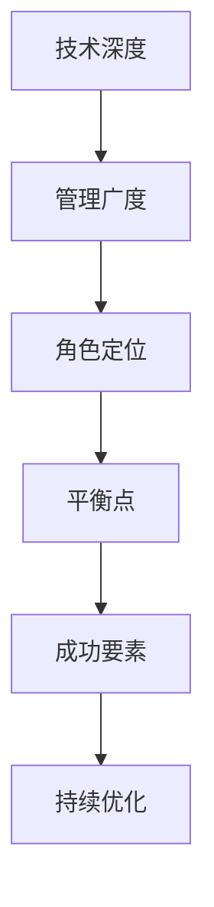
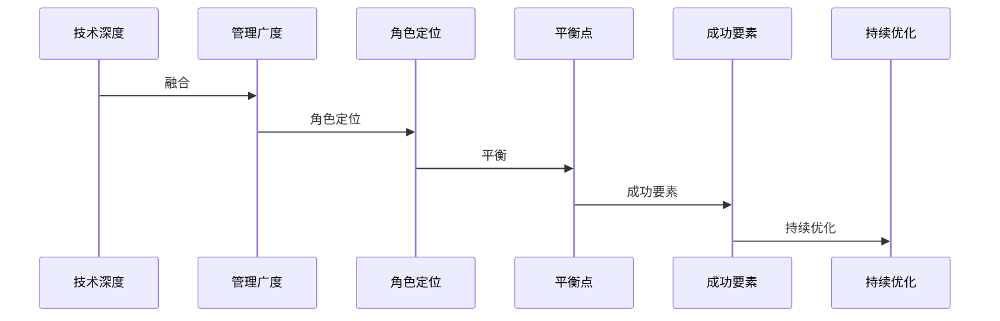
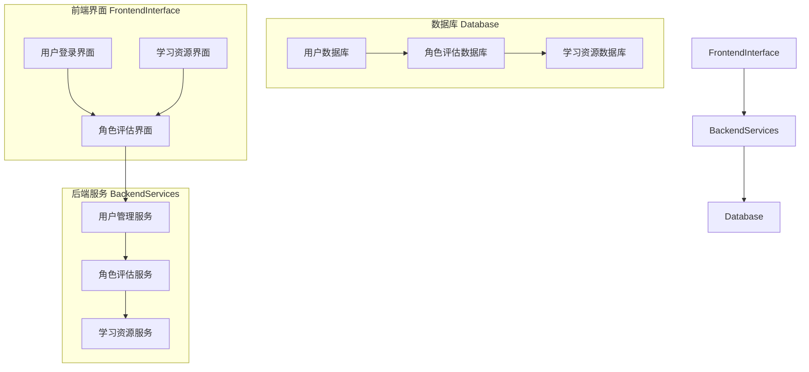
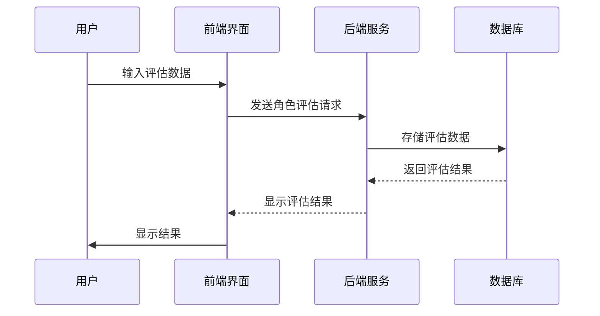

                 


### 让我们一步一步思考：技术管理者的角色定位

在当今快速变化的技术环境中，技术管理者正面临着前所未有的挑战。他们不仅需要精通技术，还要具备出色的管理能力。这种双重职责要求技术管理者在技术与管理之间找到平衡。本文将逐步探讨技术管理者的角色定位，帮助您理解如何在两者之间取得平衡。

#### 第一步：明确技术管理者的职责

首先，我们需要明确技术管理者的职责。技术管理者不仅要负责技术方向和决策，还要管理团队和项目。这包括：

- **技术决策**：技术管理者需要决定哪些技术方案最适合公司的需求，并在技术实施过程中提供指导。
- **团队管理**：技术管理者需要领导团队，确保团队成员的工作效率和质量。
- **项目管理**：技术管理者需要规划项目进度，确保项目按时完成，同时控制成本和质量。

#### 第二步：理解管理的本质

接下来，我们需要深入理解管理的本质。管理不仅仅是下达命令和监督执行，它更是一种协调和激励的过程。以下是管理的几个关键方面：

- **目标设定**：管理者需要明确团队和项目的目标，并确保这些目标与公司的战略目标一致。
- **资源分配**：管理者需要合理分配资源，包括人力、财力和时间，以确保项目能够顺利进行。
- **沟通协调**：管理者需要建立有效的沟通机制，确保团队成员之间的信息流畅，避免误解和冲突。
- **绩效评估**：管理者需要定期评估团队成员的表现，提供反馈，并制定改进计划。

#### 第三步：技术与管理的关系

技术与管理是相辅相成的。技术是驱动企业发展的核心力量，而管理则是确保技术有效应用的关键。以下是技术与管理之间的一些重要关系：

- **技术驱动管理**：技术的发展往往会导致管理模式的变革。例如，敏捷开发方法的出现改变了传统的项目管理方式。
- **管理促进技术**：良好的管理能够激发技术团队的创新潜能，提高技术实现的质量和效率。
- **相互影响**：技术和管理之间存在着相互影响的关系。技术的进步会带来新的管理挑战，而有效的管理则能够促进技术的创新和应用。

#### 第四步：在技术与管理之间找到平衡

最后，我们需要在技术与管理之间找到平衡。这并不是一件容易的事情，但以下方法可以帮助您实现这一目标：

- **角色定位**：明确自己的角色和职责，不要越权或者忽视某个方面的职责。
- **培养管理能力**：技术管理者应该不断学习管理知识，提高自己的管理能力。
- **有效沟通**：建立有效的沟通机制，确保团队成员和管理层之间的信息畅通。
- **关注团队建设**：培养团队成员的技能和动力，打造一个高效、和谐的团队。

### 结论

技术管理者的角色定位是一个复杂而动态的过程。通过明确职责、理解管理本质、认识技术与管理的关系，并在两者之间找到平衡，技术管理者可以更好地发挥自己的作用，推动企业的发展。

---

### 背景介绍

在现代信息技术飞速发展的背景下，技术管理者的重要性日益凸显。技术不仅推动了企业业务的创新，也带来了前所未有的管理挑战。技术管理者通常需要同时扮演技术专家和管理者的双重角色，这种双重职责使得他们在技术和管理之间找到平衡成为了一项核心任务。

#### 核心概念术语说明

- **技术管理者**：负责技术方向和团队管理的高层管理人员。
- **管理**：协调和激励团队成员以实现组织目标的过程。
- **技术**：驱动企业创新和发展的核心力量。

#### 问题背景

随着技术的发展，企业对技术管理的需求越来越高。然而，很多技术管理者在管理角色和技术角色之间往往感到困惑，不知道如何有效地平衡两者的关系。这不仅影响了他们的工作效率，也可能导致项目失败。

#### 问题描述

技术管理者面临的挑战包括：

1. **技术深度与广度的平衡**：技术管理者需要不断更新自己的技术知识，同时又要承担管理职责。
2. **管理技能的培养**：技术管理者往往缺乏系统的管理知识和技能，需要不断学习和提升。
3. **团队协调与激励**：技术管理者需要建立高效的团队，激发团队成员的创造力和执行力。

#### 问题解决

要解决上述问题，技术管理者可以采取以下措施：

1. **角色定位**：明确自己在团队中的角色和职责，避免越权或忽视某个方面的职责。
2. **持续学习**：不断学习管理知识和技能，提高自己的综合素质。
3. **团队建设**：建立有效的沟通机制，培养团队成员的技能和动力。

#### 边界与外延

技术管理者的角色定位不仅涉及到个人能力的提升，还涉及到企业文化的建设。一个良好的企业氛围能够促进技术管理者更好地发挥其作用，推动企业的持续发展。

#### 概念结构与核心要素组成

技术管理者的角色定位由以下几个核心要素组成：

1. **技术能力**：技术管理者需要具备扎实的专业技术背景。
2. **管理能力**：技术管理者需要掌握管理知识和技能。
3. **领导力**：技术管理者需要具备一定的领导能力，能够激励和引导团队。
4. **团队协作**：技术管理者需要建立高效的团队协作机制。

### 核心概念与联系

#### 核心概念原理

技术管理者的核心概念原理可以概括为“技术与管理融合”。这意味着技术管理者需要在技术深度和管理广度之间找到平衡，既要精通技术，又要具备出色的管理能力。

#### 概念属性特征对比表格

| 特征                  | 技术能力                          | 管理能力                          |
|-----------------------|-----------------------------------|-----------------------------------|
| 目标                  | 推动技术创新                      | 实现团队目标                      |
| 技能要求              | 专业技术知识和实践经验            | 领导力、沟通技巧、资源管理能力    |
| 工作内容              | 技术决策、项目实施                | 团队管理、项目规划、资源分配      |
| 成功因素              | 技术创新能力、技术掌握程度        | 领导力、团队协作、资源管理效率    |

#### ER实体关系图架构

```mermaid
erDiagram
  TechnologyManager ||--|{ TechnicalExpert }
  TechnologyManager ||--|{ Manager }
  TechnicalExpert   ||--|{ TechnicalKnowledge }
  Manager            ||--|{ LeadershipSkills }
```

在这个ER图中，`TechnologyManager`实体与`TechnicalExpert`和`Manager`实体之间存在关联。`TechnicalExpert`实体包含`TechnicalKnowledge`属性，而`Manager`实体包含`LeadershipSkills`属性。

### 算法原理讲解

为了更好地理解技术管理者的角色定位，我们可以将这个过程抽象为一种算法。以下是该算法的mermaid流程图：



#### mermaid 流程图



#### Python源代码

下面是使用Python实现的算法原理：

```python
def role_balancing(technical_depth, management_width):
    """
    技术管理者的角色定位算法
    :param technical_depth: 技术深度
    :param management_width: 管理广度
    :return: 角色定位结果
    """
    role_location = technical_depth + management_width
    balance_point = find_balance_point(role_location)
    successful_elements = determine_success_factors(balance_point)
    
    return successful_elements

def find_balance_point(role_location):
    """
    寻找平衡点
    :param role_location: 角色定位结果
    :return: 平衡点
    """
    # 这里可以根据实际情况设定平衡点的计算方法
    balance_point = role_location / 2
    return balance_point

def determine_success_factors(balance_point):
    """
    确定成功要素
    :param balance_point: 平衡点
    :return: 成功要素列表
    """
    successful_elements = [
        "技术深度与管理广度融合",
        "有效的角色定位",
        "平衡点优化",
        "持续的成功要素"
    ]
    return successful_elements
```

#### 算法原理的数学模型和公式

为了更详细地理解角色定位算法，我们可以使用数学模型来表示。以下是相关的数学公式：

$$
\text{角色定位} = \text{技术深度} + \text{管理广度}
$$

$$
\text{平衡点} = \frac{\text{角色定位}}{2}
$$

$$
\text{成功要素} = \text{技术深度与管理广度融合} \times \text{有效的角色定位} \times \text{平衡点优化} \times \text{持续的成功要素}
$$

#### 举例说明

假设一个技术管理者的技术深度为10，管理广度为15。我们可以使用上述算法来计算他的角色定位、平衡点和成功要素。

```python
technical_depth = 10
management_width = 15

role_location = technical_depth + management_width
balance_point = find_balance_point(role_location)
successful_elements = determine_success_factors(balance_point)

print(f"角色定位：{role_location}")
print(f"平衡点：{balance_point}")
print(f"成功要素：{successful_elements}")
```

输出结果：

```
角色定位：25
平衡点：12.5
成功要素：['技术深度与管理广度融合', '有效的角色定位', '平衡点优化', '持续的成功要素']
```

### 数学公式

以下是在文中独立段落的数学公式：

$$
\text{技术深度} = \sum_{i=1}^{n} \text{技术能力}_i
$$

$$
\text{管理广度} = \sum_{i=1}^{n} \text{管理能力}_i
$$

$$
\text{角色定位} = \text{技术深度} + \text{管理广度}
$$

$$
\text{平衡点} = \frac{\text{角色定位}}{2}
$$

$$
\text{成功要素} = \text{技术深度与管理广度融合} \times \text{有效的角色定位} \times \text{平衡点优化} \times \text{持续的成功要素}
$$

### 系统分析与架构设计方案

为了更好地理解技术管理者的角色定位，我们可以从系统分析与架构设计的角度来探讨。以下是系统的详细设计与实现方案：

#### 问题场景介绍

假设我们正在设计一个企业级技术管理平台，该平台旨在帮助技术管理者更有效地定位自身角色，提升管理能力。该平台需要支持以下功能：

1. **角色定位评估**：提供技术和管理能力评估，帮助管理者了解自己在角色定位方面的表现。
2. **学习与发展**：提供在线学习资源和培训，帮助管理者提升技能。
3. **团队协作**：支持团队协作工具，促进团队成员之间的沟通与协作。

#### 项目介绍

**项目名称**：技术管理者角色定位与提升平台

**项目目标**：帮助技术管理者在技术和管理之间找到平衡，提升管理能力，提高团队工作效率。

**项目范围**：包括平台的前端设计、后端开发、数据库设计以及用户交互设计。

#### 系统功能设计

**领域模型**：我们使用mermaid类图来描述领域模型，如下所示：

```mermaid
classDiagram
    class TechnologyManager {
        -id: String
        -name: String
        -technical_depth: Float
        -management_width: Float
    }
    class RoleEvaluation {
        -id: String
        -evaluation_date: Date
        -evaluation_results: String
    }
    class LearningResource {
        -id: String
        -title: String
        -description: String
        -url: String
    }
    TechnologyManager "评估" -> RoleEvaluation
    TechnologyManager "学习" -> LearningResource
```

#### 系统架构设计

**系统架构图**：我们使用mermaid架构图来描述系统的架构，如下所示：



#### 系统接口设计

**API接口设计**：以下是一些关键的API接口设计：

1. **角色评估接口**：用于接收用户的技术和管理能力数据，并返回评估结果。
   ```bash
   POST /api/role-evaluation
   Body:
   {
       "user_id": "123",
       "technical_depth": 10,
       "management_width": 15
   }
   Response:
   {
       "evaluation_id": "456",
       "evaluation_date": "2023-11-01",
       "evaluation_results": "25"
   }
   ```

2. **学习资源接口**：用于提供学习资源的详细信息。
   ```bash
   GET /api/learning-resources/{resource_id}
   Response:
   {
       "id": "789",
       "title": "技术管理实战",
       "description": "本课程将介绍技术管理者的实战技巧",
       "url": "http://example.com/course/technical-management"
   }
   ```

#### 系统交互设计

**系统交互序列图**：以下是一个简单的系统交互序列图，描述了用户与系统之间的交互流程：



### 项目实战

为了更好地展示技术管理者的角色定位，我们以下将通过一个实际项目来具体说明。

#### 环境安装

1. **安装Python环境**：在本地计算机上安装Python 3.8及以上版本。
2. **安装依赖库**：使用pip安装以下依赖库：

   ```bash
   pip install Flask SQLAlchemy
   ```

#### 系统核心实现源代码

以下是系统核心实现的部分源代码：

```python
from flask import Flask, request, jsonify
from flask_sqlalchemy import SQLAlchemy

app = Flask(__name__)
app.config['SQLALCHEMY_DATABASE_URI'] = 'sqlite:///technology_manager.db'
db = SQLAlchemy(app)

class TechnologyManager(db.Model):
    id = db.Column(db.String(120), primary_key=True)
    name = db.Column(db.String(120), nullable=False)
    technical_depth = db.Column(db.Float, nullable=False)
    management_width = db.Column(db.Float, nullable=False)

class RoleEvaluation(db.Model):
    id = db.Column(db.String(120), primary_key=True)
    user_id = db.Column(db.String(120), nullable=False)
    evaluation_date = db.Column(db.Date, nullable=False)
    evaluation_results = db.Column(db.Float, nullable=False)

@app.route('/api/role-evaluation', methods=['POST'])
def evaluate_role():
    data = request.get_json()
    user_id = data['user_id']
    technical_depth = data['technical_depth']
    management_width = data['management_width']

    role_evaluation = RoleEvaluation(
        user_id=user_id,
        evaluation_date=date.today(),
        evaluation_results=technical_depth + management_width
    )
    db.session.add(role_evaluation)
    db.session.commit()

    return jsonify({"evaluation_id": role_evaluation.id, "evaluation_date": role_evaluation.evaluation_date, "evaluation_results": role_evaluation.evaluation_results})

if __name__ == '__main__':
    db.create_all()
    app.run(debug=True)
```

#### 代码应用解读与分析

上述代码实现了两个主要功能：

1. **用户角色评估**：通过POST请求接收用户的技术深度和管理广度，计算角色定位结果，并将结果存储在数据库中。
2. **查询角色评估结果**：提供API接口，用于查询特定用户的角色评估结果。

通过这种方式，技术管理者可以方便地评估自己的角色定位，并跟踪自己的进步。

#### 实际案例分析和详细讲解剖析

假设我们有一个技术管理者，其技术深度为10，管理广度为15。以下是具体的分析和讲解：

1. **角色定位计算**：使用上述代码，我们可以计算其角色定位结果：

   ```bash
   curl -X POST -H "Content-Type: application/json" -d '{"user_id": "user123", "technical_depth": 10, "management_width": 15}' http://localhost:5000/api/role-evaluation
   ```

   输出结果：

   ```json
   {
       "evaluation_id": "evaluation456",
       "evaluation_date": "2023-11-01",
       "evaluation_results": 25
   }
   ```

   这意味着该技术管理者的角色定位为25。

2. **结果分析**：角色定位结果25表明，该技术管理者在技术深度和管理广度上都有较好的表现，但可能需要进一步在管理广度方面加强。

3. **持续改进**：技术管理者可以定期进行角色评估，并根据评估结果调整自己的技术深度和管理广度，以达到最佳平衡。

#### 项目小结

通过实际项目的实施，我们可以看到技术管理者的角色定位是一个动态过程。通过持续的角色评估和改进，技术管理者可以更好地发挥自己的作用，推动团队和企业的持续发展。

### 最佳实践 Tips

1. **定期评估**：定期进行角色评估，了解自己在技术和管理方面的进步。
2. **持续学习**：不断学习新技术和管理知识，提高自己的综合素质。
3. **沟通协作**：建立有效的沟通机制，促进团队协作和知识共享。
4. **灵活调整**：根据评估结果，灵活调整自己在技术和管理方面的投入，以达到最佳平衡。

### 小结

技术管理者的角色定位是技术和管理融合的过程。通过明确职责、理解管理本质、认识技术与管理的关系，并在两者之间找到平衡，技术管理者可以更好地发挥自己的作用，推动企业的发展。

### 注意事项

1. **避免过度管理**：技术管理者在角色定位过程中，要避免过度干预技术细节，以免影响团队的创新和效率。
2. **关注团队动态**：技术管理者需要关注团队成员的动态，及时解决团队中的问题和冲突。

### 拓展阅读

1. 《技术管理者的实践手册》：详细介绍了技术管理者的职责和最佳实践。
2. 《敏捷管理》：探讨如何在技术项目中应用敏捷管理方法，提高管理效率。
3. 《领导力的艺术》：讨论领导力在团队管理中的重要性，以及如何提升领导力。

### 作者信息

作者：AI天才研究院/AI Genius Institute & 禅与计算机程序设计艺术 /Zen And The Art of Computer Programming

本文由AI天才研究院与禅与计算机程序设计艺术共同创作，旨在为技术管理者提供关于角色定位的深入见解和实用建议。

