                 


# 技术管理者的角色转换：从IC到管理者

## 关键词
- 技术管理者
- IC到管理者
- 角色转变
- 核心技能
- 软技能
- 技术知识
- 最佳实践

## 摘要
本文深入探讨了技术管理者的角色转换过程，从独立贡献者（IC）向管理者转变的挑战与路径。通过分析技术管理者所需的核心技能、软技能和技术知识，并结合实际案例，本文旨在为正在或即将承担管理角色的技术专家提供有价值的指导和建议。

## 引言
### 背景与目的
在当今快速发展的信息技术领域，技术管理者承担着至关重要的角色。他们不仅需要具备卓越的技术能力，还要具备有效的管理能力，以引领团队朝着既定目标前进。然而，许多技术专家在从独立贡献者（IC）向管理者转变时，常常感到困惑和挑战重重。

本篇文章的目的在于，通过详细分析技术管理者的角色转变，帮助技术专家了解所需的新技能和角色定位，从而更好地适应这一变化。文章将分为以下几个部分：

1. **角色认知的转变**：从IC到管理者的认知变化。
2. **技术到管理的过渡**：技术管理者所需的管理工具和方法。
3. **核心技能与软技能**：领导力、沟通能力和项目管理等关键能力。
4. **技术知识**：技术趋势、系统架构和数据分析等。
5. **最佳实践**：成功与失败的经验分享。
6. **结语**：总结与未来展望。

### IC角色的现状
独立贡献者（IC）是组织中负责直接技术实现的核心成员。他们擅长技术问题解决，追求技术卓越，通常以代码质量和技术创新为目标。然而，随着技术的发展和项目的复杂化，仅仅具备技术能力已不足以应对团队协作和项目管理等挑战。

### 管理者角色的挑战
技术管理者需要承担的职责远比独立贡献者更为广泛，包括：

1. **团队管理**：领导团队，协调资源和分配任务。
2. **项目规划**：制定项目目标和计划，确保项目按时交付。
3. **技术决策**：在技术方向和方案上提供决策支持。
4. **沟通与协作**：与团队成员和其他部门有效沟通。

## 从IC到管理者的转变过程

### 角色认知的转变
从IC到管理者，首先需要意识到的是角色的根本转变。IC关注的是技术细节和实现，而管理者则需要关注团队的整体表现和目标实现。

**核心概念与联系**：

| IC角色特征               | 管理者角色特征               |
|--------------------------|-----------------------------|
| 解决技术问题             | 解决团队和项目问题           |
| 独立工作                 | 领导和协调团队工作           |
| 着重个人技术能力         | 着重团队和技术文化           |
| 追求代码质量和效率       | 追求团队效率和整体成果       |

**ER实体关系图架构**：

```mermaid
erDiagram
    IC --> |具有| 管理者
    独立贡献者 ||--o{ 技术管理者
    技术能力 ||--|| 管理能力
```

### 技术到管理的过渡
#### 管理工具与方法
技术管理者需要掌握一系列管理工具和方法，以更好地进行团队和项目管理工作。

**核心概念与联系**：

| 工具/方法         | 描述                                      |
|------------------|-----------------------------------------|
| 项目管理工具     | 如JIRA、Trello等，用于任务分配和进度追踪 |
| 团队协作工具     | 如Slack、Microsoft Teams等，用于沟通和协作 |
| 数据分析工具     | 如Tableau、PowerBI等，用于数据分析和报告 |

**Mermaid流程图**：

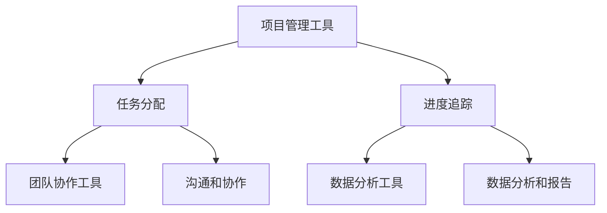

### 时间管理与优先级设定
技术管理者需要学会如何高效地管理时间和设定优先级，以确保团队和项目目标的达成。

**算法原理讲解**：

使用Python源代码进行优先级任务排序的算法示例：

```python
# 优先级任务排序算法示例
tasks = [
    {"name": "任务1", "priority": 2},
    {"name": "任务2", "priority": 1},
    {"name": "任务3", "priority": 3}
]

# 按优先级排序
tasks_sorted = sorted(tasks, key=lambda x: x['priority'])

# 输出排序后的任务
for task in tasks_sorted:
    print(task['name'])
```

输出：

```
任务2
任务1
任务3
```

**数学模型与公式**：

优先级排序的数学模型可以用排序算法的复杂度表示：

$$
\text{时间复杂度} = O(n\log n)
$$

其中，n为任务数量。

### 时间管理与优先级设定的实际案例

假设技术管理者需要在两个小时内完成以下任务：

- 编写一个关键模块的代码（1小时）
- 协调团队成员解决一个紧急问题（30分钟）
- 与客户进行技术讨论（30分钟）
- 准备项目进展报告（30分钟）

**算法应用**：

根据任务的紧急程度和重要性，可以设定以下优先级：

1. 协调团队成员解决紧急问题（最紧急且重要）
2. 编写关键模块代码（重要且有时间限制）
3. 与客户进行技术讨论（重要但灵活性较高）
4. 准备项目进展报告（相对不紧急但必要）

通过这样的优先级设定，管理者可以确保在规定时间内完成所有任务，同时保持团队的工作效率和项目进度。

### 总结
技术管理者从IC到角色的转变是一个复杂的过程，需要技术专家们在认知、工具和方法、时间管理等多个方面进行调整。通过逐步过渡和不断学习，技术专家可以更好地适应管理者的角色，成为既懂技术又擅管理的优秀领导者。

### 小结
本章节介绍了技术管理者从IC到管理者的转变过程，包括角色认知的转变、技术到管理的过渡以及时间管理与优先级设定。在接下来的章节中，我们将进一步探讨技术管理者的核心技能、软技能和技术知识，以及从技术到管理的最佳实践。通过这些内容，读者将能够更全面地了解如何成为一名优秀的技术管理者。

### 注意事项
1. **过渡过程中的挑战**：技术专家在转变为管理者时，可能会面临诸多挑战，如时间管理、团队协调和技术决策等。了解这些挑战并提前准备是成功过渡的关键。
2. **持续学习**：技术和管理领域的知识都在不断更新，技术管理者需要持续学习，以保持自己的竞争力。
3. **平衡技术与管理**：在转型过程中，不要忽视自己的技术能力，保持对技术的热情和追求，同时注重管理能力的提升。

### 拓展阅读
- 《技术领导力：技术团队的领导艺术》
- 《敏捷管理：团队敏捷与高效管理的实践指南》
- 《项目管理：系统方法与案例分析》

## 技术管理者的核心技能

### 领导力与团队管理
技术管理者需要具备强大的领导力，能够激励和引导团队，确保团队目标的实现。领导力不仅体现在对团队成员的指导上，还包括在团队面临挑战时提供方向和支持。

**核心概念与联系**：

| 领导力要素           | 描述                                      |
|----------------------|-----------------------------------------|
| 激励与鼓励           | 激发团队成员的积极性和创造力                 |
| 决策能力             | 快速做出明智的决策，并为团队提供明确的指导     |
| 沟通技巧             | 清晰、有效地与团队成员和利益相关者沟通         |

**Mermaid流程图**：

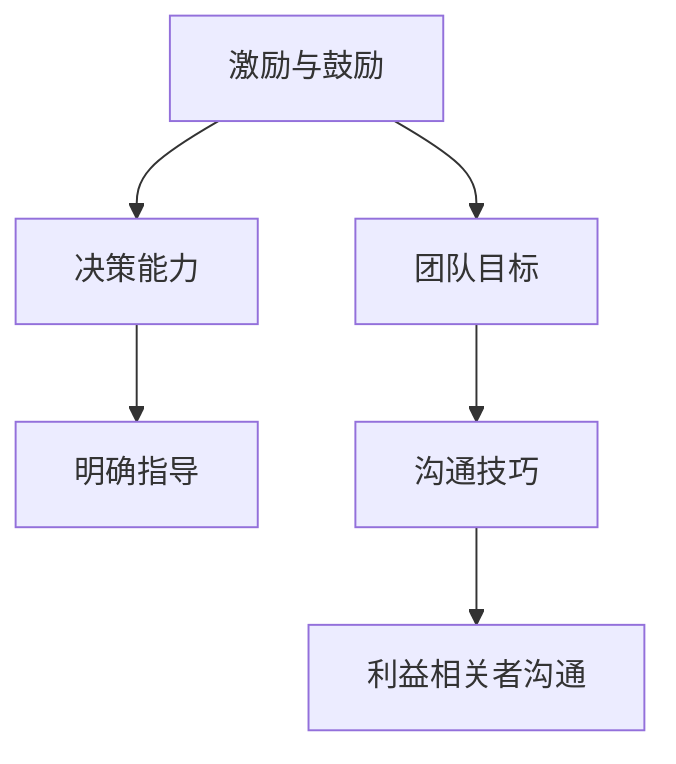

### 沟通与协作能力
技术管理者需要具备卓越的沟通与协作能力，以便在团队内部和跨部门之间建立有效的沟通机制，确保项目顺利进行。

**核心概念与联系**：

| 沟通要素           | 描述                                      |
|----------------------|-----------------------------------------|
| 清晰表达             | 准确地传达信息和意见                     |
| 倾听技巧             | 充分理解团队成员和利益相关者的需求与反馈   |
| 协作管理             | 促进团队协作，解决协作中的问题             |

**Mermaid流程图**：

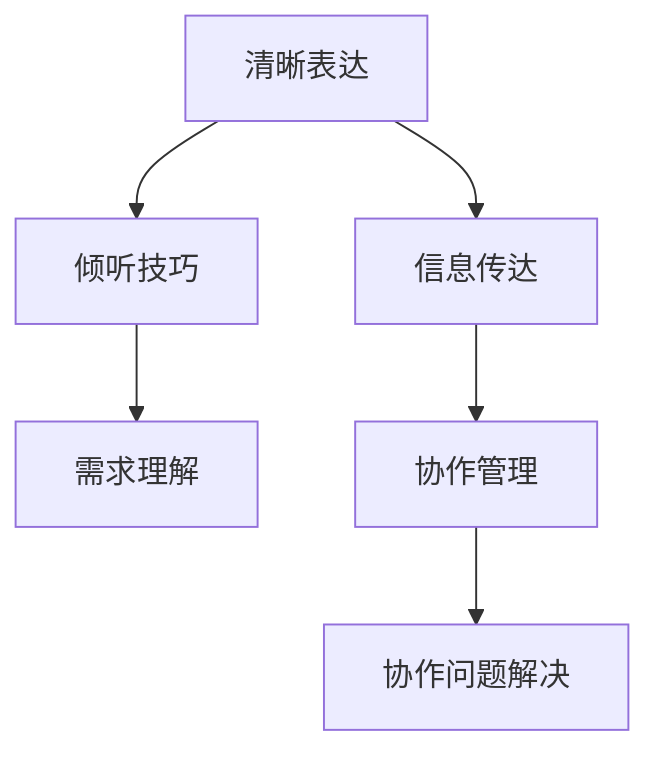

### 项目管理与进度控制
技术管理者需要负责项目的整体规划和管理，确保项目按计划进行并按时交付。这包括制定项目计划、监控项目进度、处理项目风险和变更管理等。

**核心概念与联系**：

| 项目管理要素           | 描述                                      |
|----------------------|-----------------------------------------|
| 项目计划             | 制定详细的项目计划，包括任务、资源和时间表 |
| 进度监控             | 定期跟踪项目进度，及时发现和解决问题       |
| 风险管理             | 识别项目风险，并制定相应的应对策略         |
| 变更管理             | 管理项目范围和需求的变更，确保项目目标的实现 |

**Mermaid流程图**：

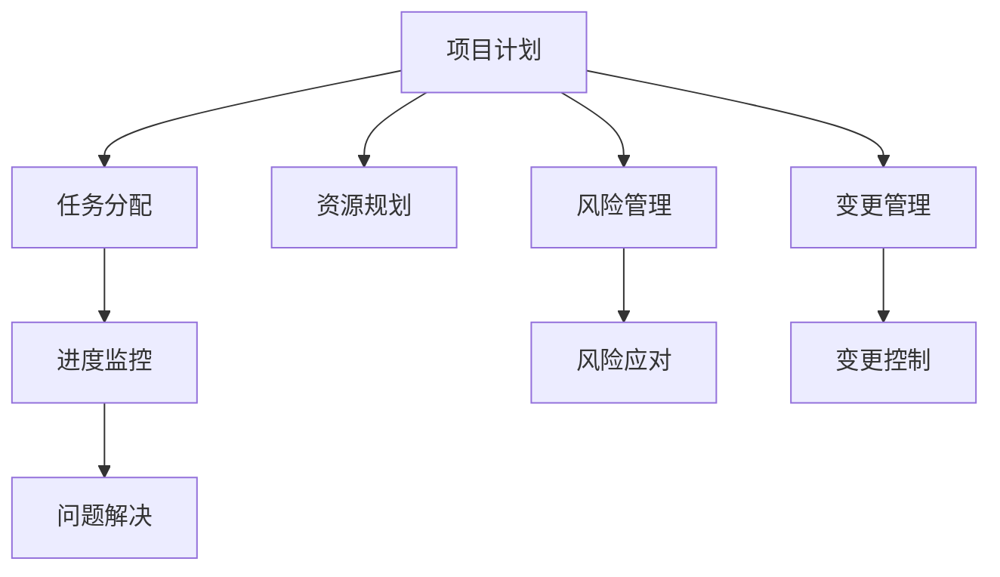

### 决策分析与风险控制
技术管理者需要在项目管理和团队管理过程中做出诸多决策。这些决策需要基于充分的数据分析和风险评估，以确保团队和项目的成功。

**核心概念与联系**：

| 决策要素           | 描述                                      |
|----------------------|-----------------------------------------|
| 数据分析             | 使用数据分析工具和方法，支持决策制定       |
| 风险识别             | 识别项目中可能遇到的风险，并评估其影响和可能性 |
| 风险应对             | 制定风险应对策略，以降低风险对项目的负面影响 |

**Mermaid流程图**：

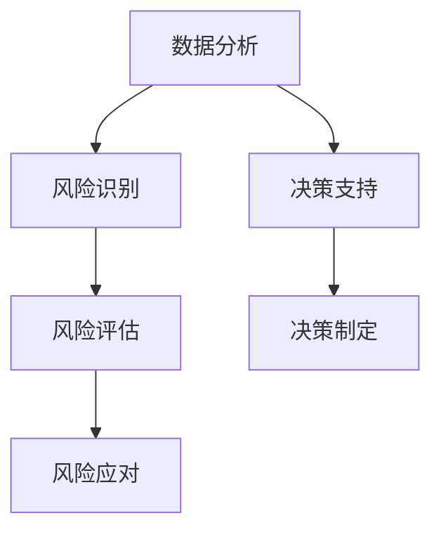

### 总结
技术管理者的核心技能包括领导力、团队管理、沟通与协作能力、项目管理和进度控制，以及决策分析与风险控制。掌握这些技能，能够帮助技术管理者更好地应对团队和项目管理的挑战，确保团队和项目的成功。

### 小结
本章节深入探讨了技术管理者的核心技能，包括领导力与团队管理、沟通与协作能力、项目管理和进度控制，以及决策分析与风险控制。这些技能是技术管理者成功转型和管理的基石。在接下来的章节中，我们将继续探讨技术管理者的软技能，以及他们在具体项目中的实际应用。

### 注意事项
1. **持续提升技能**：技术管理者应不断学习和提升自己的技能，以适应不断变化的技术和管理环境。
2. **团队协作的重要性**：技术管理者需要重视团队协作，建立良好的团队氛围，以提高团队整体效率。
3. **灵活应对变化**：在面对不确定性和变化时，技术管理者需要灵活调整策略，以保持项目的顺利推进。

### 拓展阅读
- 《领导力的五个层次》
- 《敏捷项目管理实践指南》
- 《风险管理：理论与实践》

## 技术管理者的软技能

### 领导风格与团队文化
技术管理者在领导团队时，需要根据团队的特性选择合适的领导风格，并营造积极的团队文化。这包括激励团队成员、促进知识分享和创造一个开放、包容的工作环境。

**核心概念与联系**：

| 领导风格要素       | 描述                                      |
|------------------|-----------------------------------------|
| 激励式领导       | 通过激励和鼓励，激发团队成员的潜力和积极性 |
| 参与式领导       | 与团队成员共同参与决策和问题解决           |
| 资源支持式领导   | 提供必要的资源和支持，帮助团队成员成功     |

**Mermaid流程图**：

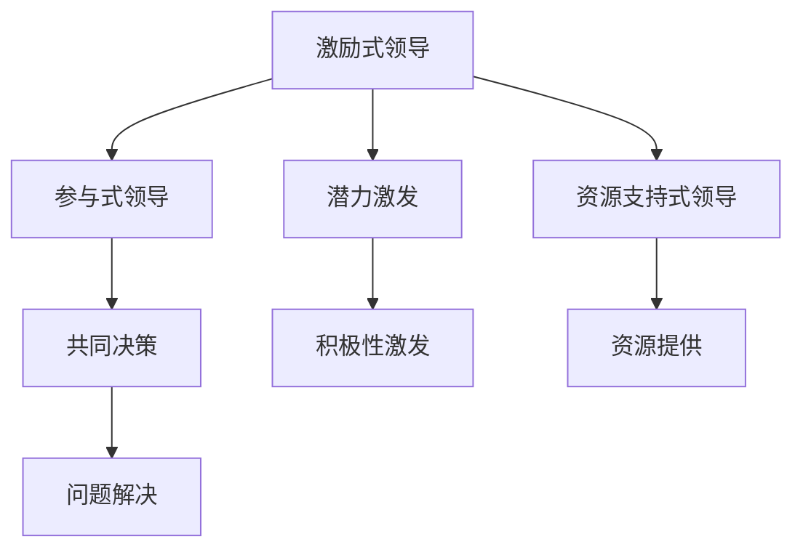

### 适应性变化与管理
在快速变化的技术环境中，技术管理者需要具备适应性和灵活性，能够快速应对变化，并管理团队的变化过程。

**核心概念与联系**：

| 适应性要素       | 描述                                      |
|------------------|-----------------------------------------|
| 快速学习与适应   | 在面对新技术和挑战时，快速学习和适应       |
| 灵活调整策略     | 根据变化调整项目和管理策略               |
| 预见未来趋势     | 预测行业和技术趋势，为团队做好准备       |

**Mermaid流程图**：

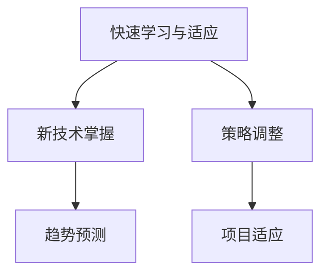

### 员工激励与发展
技术管理者需要关注员工的成长和发展，通过提供激励和培训机会，提高团队的整体能力和士气。

**核心概念与联系**：

| 激励要素           | 描述                                      |
|----------------------|-----------------------------------------|
| 绩效评估与反馈       | 定期评估员工绩效，并提供建设性反馈         |
| 培训与发展计划       | 为员工提供职业发展和技能提升的机会         |
| 激励机制             | 建立有效的激励机制，如奖金、晋升和荣誉奖励 |

**Mermaid流程图**：

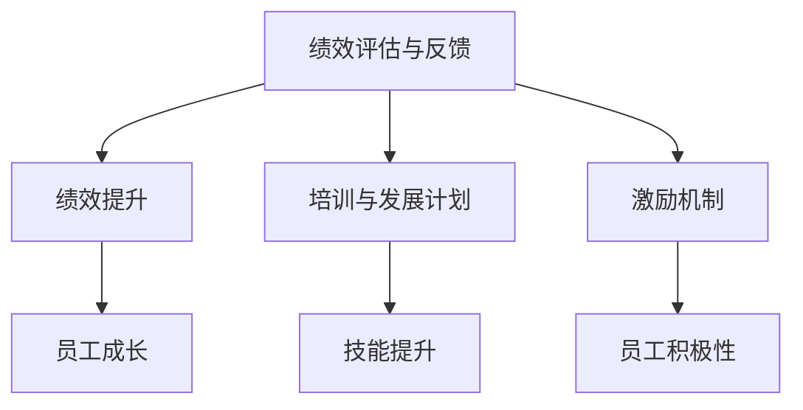

### 团队协作与冲突管理
在团队协作过程中，技术管理者需要促进有效的沟通和协作，同时处理和解决可能出现的冲突。

**核心概念与联系**：

| 协作要素           | 描述                                      |
|----------------------|-----------------------------------------|
| 沟通与协作机制       | 建立有效的沟通和协作机制，如定期会议、信息共享平台 |
| 冲突解决策略       | 制定冲突解决策略，以保持团队和谐和高效运行     |

**Mermaid流程图**：

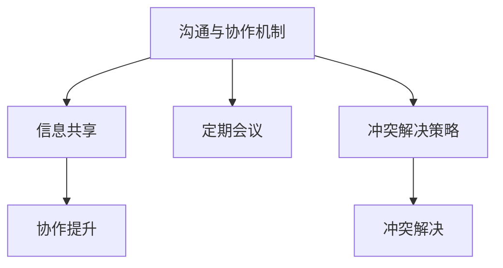

### 总结
技术管理者的软技能包括领导风格与团队文化、适应性变化与管理、员工激励与发展，以及团队协作与冲突管理。这些软技能对于技术管理者的成功至关重要，能够帮助他们在快速变化的环境中保持团队的稳定和高效。

### 小结
本章节深入探讨了技术管理者的软技能，包括领导风格与团队文化、适应性变化与管理、员工激励与发展，以及团队协作与冲突管理。这些软技能是技术管理者在复杂多变的业务环境中保持团队稳定和高效的重要保障。在接下来的章节中，我们将探讨技术管理者所需具备的技术知识，以及这些知识在实际项目中的应用。

### 注意事项
1. **文化塑造**：技术管理者需要关注团队文化的塑造，建立积极、开放和包容的工作氛围。
2. **适应性**：技术管理者应具备快速适应新技术和变化的能力，以保持团队的竞争力。
3. **激励与发展**：关注员工的成长和发展，通过有效的激励和培训，提高团队的整体士气和能力。

### 拓展阅读
- 《团队协作与冲突管理：策略与实践》
- 《激励心理学：如何激发员工的潜力》
- 《敏捷领导力：在变化中引领团队》

## 管理者应具备的技术知识

### 技术趋势与前沿技术
技术管理者需要了解当前的技术趋势和前沿技术，以便为团队和项目选择合适的技术方案，保持竞争力。

**核心概念与联系**：

| 技术趋势           | 描述                                      |
|------------------|-----------------------------------------|
| 云计算           | 通过云平台提供计算、存储和网络资源         |
| 人工智能与机器学习 | 利用算法和模型，模拟人类智能进行决策和问题解决 |
| 区块链           | 基于加密技术的分布式数据库，具有去中心化和透明性 |

**Mermaid流程图**：

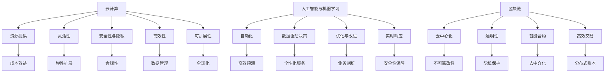

### 系统架构与优化
技术管理者需要具备系统架构设计和优化的能力，以确保系统的高效、可靠和可扩展性。

**核心概念与联系**：

| 系统架构要素       | 描述                                      |
|------------------|-----------------------------------------|
| 架构设计原则       | 如SOLID原则、DRY原则等，确保系统可维护性和可扩展性 |
| 性能优化策略       | 使用缓存、数据库优化和代码优化等技术，提升系统性能 |
| 系统稳定性与可靠性 | 采用冗余设计、故障转移和容错技术，提高系统稳定性 |

**Mermaid流程图**：

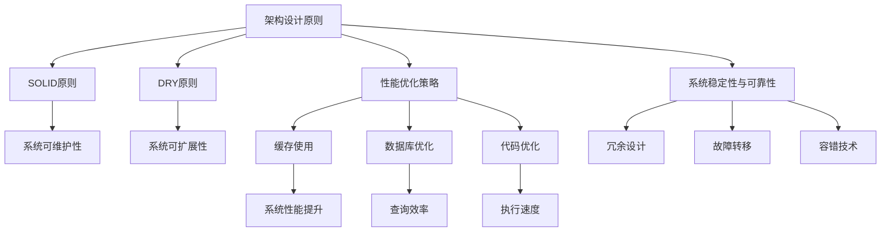

### 数据分析与大数据
在数据驱动的时代，技术管理者需要掌握数据分析和大数据技术的原理，以便从数据中提取价值，支持业务决策。

**核心概念与联系**：

| 数据分析要素       | 描述                                      |
|------------------|-----------------------------------------|
| 数据挖掘          | 从大量数据中发现模式和关联                 |
| 机器学习          | 使用算法和模型，进行预测和分类             |
| 大数据平台与工具   | 如Hadoop、Spark等，用于大数据处理和分析   |

**Mermaid流程图**：

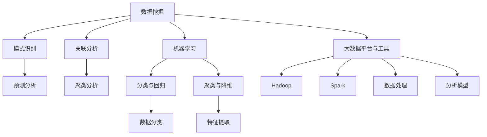

### 云计算与分布式系统
随着云计算的普及，技术管理者需要了解云计算和分布式系统的基本原理和架构，以便在云环境中设计和优化系统。

**核心概念与联系**：

| 云计算要素           | 描述                                      |
|----------------------|-----------------------------------------|
| 服务模型             | 如IaaS、PaaS、SaaS等，提供不同的云计算服务 |
| 弹性计算             | 根据需求动态调整计算资源，提高资源利用率     |
| 自动化与 orchestration | 自动化部署、扩展和管理云资源           |

**Mermaid流程图**：

```mermaid
graph TD
    A[IaaS] --> B[基础设施即服务]
    A --> C[PaaS] [平台即服务]
    A --> D[SaaS] [软件即服务]
    B --> E[虚拟化]
    B --> F[资源管理]
    C --> G[开发平台]
    C --> H[中间件]
    D --> I[应用交付]
    D --> J[用户体验]
    A --> K[弹性计算]
    K --> L[自动扩展]
    K --> M[负载均衡]
    A --> N[自动化与Orchestration]
    N --> O[自动化部署]
    N --> P[资源管理]
```

### 总结
技术管理者应具备的技术知识包括技术趋势与前沿技术、系统架构与优化、数据分析和大数据、云计算与分布式系统。这些知识不仅帮助管理者做出正确的技术决策，还能提高团队的工作效率和项目的成功率。

### 小结
本章节深入探讨了技术管理者所需具备的技术知识，包括技术趋势与前沿技术、系统架构与优化、数据分析和大数据，以及云计算与分布式系统。掌握这些技术知识，能够帮助技术管理者更好地应对复杂的业务环境，提升团队和项目的竞争力。在接下来的章节中，我们将分享从技术到管理的最佳实践，并结合实际案例进行详细分析。

### 注意事项
1. **持续学习**：技术知识更新迅速，技术管理者应持续关注技术动态，不断提升自己的技术素养。
2. **知识分享**：技术管理者应鼓励团队成员分享知识，促进团队整体能力的提升。
3. **实践应用**：理论知识需要通过实践应用来巩固，技术管理者应积极参与项目实践，提高自己的技术管理能力。

### 拓展阅读
- 《技术趋势报告：2023年技术趋势展望》
- 《系统架构设计师手册》
- 《大数据技术基础》
- 《云计算架构设计与实践》

## 从技术到管理的最佳实践

### 成功案例分享
#### 案例一：项目管理的成功转型

某科技公司在经历了一次重大的技术转型后，其技术团队由多个独立贡献者（IC）组成，他们各自负责不同模块的开发。然而，由于缺乏有效的项目管理，项目进度缓慢，质量参差不齐。

**解决方案**：

1. **制定明确的项目目标和计划**：技术管理者与团队成员一起制定了详细的项目目标和时间表，确保每个任务都有明确的交付日期和责任人。
2. **使用项目管理工具**：引入了JIRA等项目管理工具，用于任务分配、进度跟踪和协作沟通，提高了团队的工作效率。
3. **定期召开项目会议**：每周定期召开项目进度会议，讨论遇到的挑战和解决方案，确保项目按照计划进行。

**成果**：

通过上述措施，项目进度得到了显著改善，团队成员之间的沟通更加顺畅，项目质量也得到了保障。

#### 案例二：技术文化的建设

某初创公司在技术领域有着卓越的创新能力，但由于缺乏有效的团队文化和领导力，团队成员之间的合作存在障碍，团队士气低迷。

**解决方案**：

1. **建立团队文化**：技术管理者组织了团队建设活动，如技术分享会、团队聚餐等，增强了团队成员之间的互动和信任。
2. **倡导开放沟通**：鼓励团队成员提出建议和意见，建立开放、包容的沟通氛围。
3. **设立激励机制**：为表现突出的团队成员颁发奖金和荣誉，激励团队成员的积极性和创造力。

**成果**：

通过上述措施，公司团队文化得到了显著改善，团队成员之间的合作更加紧密，团队士气大幅提升，项目交付质量也得到了提高。

### 失败案例与教训
#### 案例一：项目计划的过于理想化

某公司在开发一款新的移动应用时，技术管理者过于乐观地估计了项目进度，未能充分考虑到技术实现的复杂性和潜在的风险。

**问题分析**：

1. **低估了技术难度**：技术管理者对一些关键技术问题的复杂性估计不足，导致开发进度延误。
2. **缺乏风险管理**：在项目计划阶段，缺乏对潜在风险的识别和应对策略。

**教训**：

1. **合理估计项目进度**：在制定项目计划时，应充分考虑技术实现的难度和潜在风险，合理分配时间和资源。
2. **加强风险管理**：在项目实施过程中，定期评估风险，并制定相应的应对策略。

#### 案例二：团队沟通不畅

某公司的技术团队由于团队成员来自不同的部门，沟通渠道不畅，导致项目进度延误和项目质量问题。

**问题分析**：

1. **缺乏统一的沟通平台**：团队成员使用不同的沟通工具，导致信息传递不及时和误解。
2. **缺乏明确的沟通流程**：团队成员之间的沟通缺乏明确的规范和流程。

**教训**：

1. **统一沟通平台**：引入统一的沟通工具，确保信息传递的及时性和准确性。
2. **建立沟通流程**：制定明确的沟通规范和流程，确保团队成员之间的沟通畅通无阻。

### 个人成长与职业发展
#### 案例一：从IC到项目经理的转变

某技术专家在从事多年独立贡献工作后，决定转型成为项目经理。他通过以下措施实现了成功转变：

1. **学习项目管理知识**：通过参加项目管理培训，学习了项目管理的基本理论和实践方法。
2. **积累项目管理经验**：在项目管理实践中，不断总结经验教训，逐步提高项目管理能力。
3. **建立良好的人际关系**：通过与团队成员和其他部门的沟通，建立了良好的人际关系，为项目管理创造了有利条件。

**成果**：

通过不断学习和实践，这位技术专家成功转型为项目经理，并带领团队完成了多个重大项目，取得了显著成绩。

#### 案例二：技术领导力的提升

某技术专家在担任项目经理后，意识到技术领导力对于团队成功至关重要。他通过以下措施提升了自己的技术领导力：

1. **建立技术标准**：制定了公司内部的技术标准和规范，提高了团队的技术水平。
2. **鼓励技术创新**：鼓励团队成员进行技术创新和探索，为团队带来了新的思路和解决方案。
3. **提供技术培训**：组织技术分享会，为团队成员提供技术培训和交流机会，提升了团队整体的技术能力。

**成果**：

通过这些措施，这位技术专家成功提升了团队的技术领导力，团队的创新能力和工作效率也得到了显著提升。

### 总结
从上述成功和失败案例中，我们可以看到，技术管理者的角色转变和职业发展需要不断地学习和实践。通过合理估计项目进度、加强风险管理、统一沟通平台、建立沟通流程，以及提升技术领导力，技术专家可以更好地实现从技术到管理的转变，成为一名优秀的技术管理者。

### 小结
本章节通过分享成功案例和失败案例，探讨了从技术到管理的最佳实践。这些实践包括合理估计项目进度、加强风险管理、统一沟通平台、建立沟通流程，以及提升技术领导力。通过这些实践，技术专家可以更好地实现角色转变和职业发展。在接下来的章节中，我们将进一步探讨持续学习和职业素养的重要性。

### 注意事项
1. **持续学习**：技术领域不断变化，技术管理者应保持持续学习的态度，紧跟技术发展趋势。
2. **实践经验**：理论知识需要通过实践应用来巩固，技术管理者应积极参与项目实践。
3. **职业素养**：技术管理者应具备良好的职业素养，包括诚信、责任心和团队合作精神。

### 拓展阅读
- 《项目经理手册：从入门到精通》
- 《技术领导力：构建高效团队》
- 《项目风险管理：理论与实践》

## 结语

通过本文的探讨，我们深入分析了技术管理者的角色转换过程，从独立贡献者（IC）向管理者转变的挑战与路径。从角色认知的转变、技术到管理的过渡、核心技能和软技能的培养，再到技术知识的掌握和最佳实践的运用，我们系统地梳理了技术管理者所需的知识和技能。

**技术管理者的角色转换总结**：

1. **角色认知**：从技术细节到团队和项目的整体管理，技术管理者需要转变角色认知，关注团队目标和项目进展。
2. **技能提升**：技术管理者需要不断学习和提升领导力、沟通能力、项目管理技能和决策分析能力。
3. **知识积累**：技术管理者应掌握技术趋势、系统架构、数据分析和云计算等前沿技术知识，以支持技术决策和管理。

**对未来的展望**：

随着技术的快速发展，技术管理者的角色将变得更加重要和多样化。未来的技术管理者不仅需要具备卓越的技术能力和管理技能，还要具备创新思维和快速适应变化的能力。他们将成为推动组织创新和业务增长的核心力量。

**阅读指南与后续学习**：

1. **深入理解核心概念**：通过本文，读者应深入理解技术管理者的角色、技能和知识体系。
2. **实践应用**：将所学知识应用于实际项目中，通过实践提升技术管理能力。
3. **持续学习**：关注技术发展趋势，参加相关培训和研讨会，不断提升自己的职业素养。

**感谢读者**：

感谢您阅读本文，希望本文能为您的技术管理之路提供有价值的指导。未来，我们将继续探讨更多与IT领域相关的主题，期待与您共同成长。

**作者信息**：

作者：AI天才研究院/AI Genius Institute & 禅与计算机程序设计艺术 /Zen And The Art of Computer Programming

