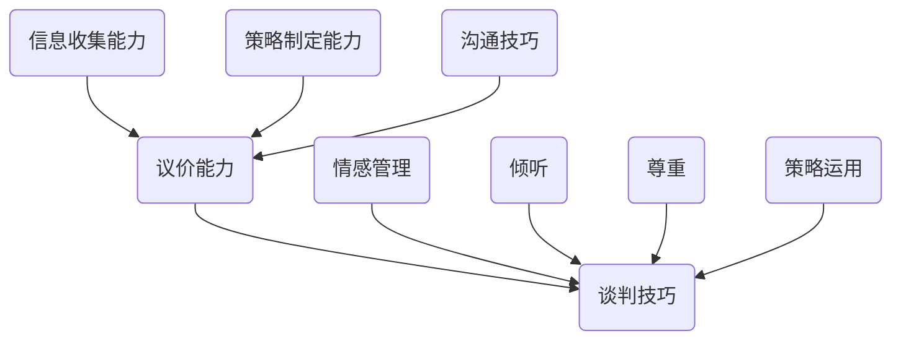
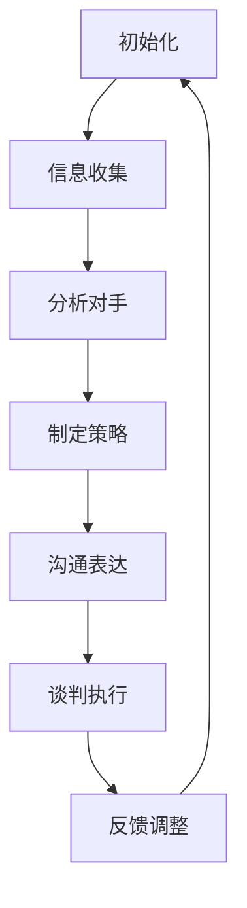
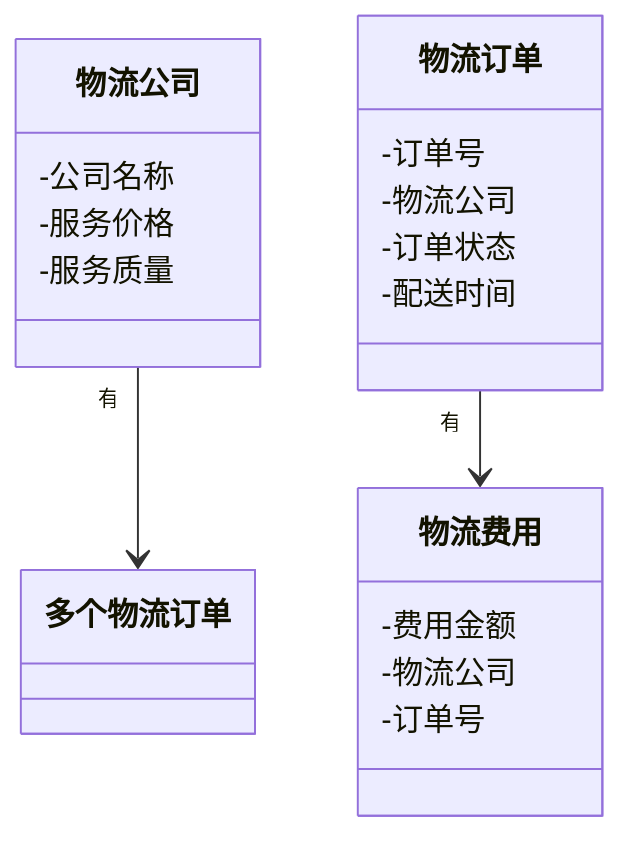
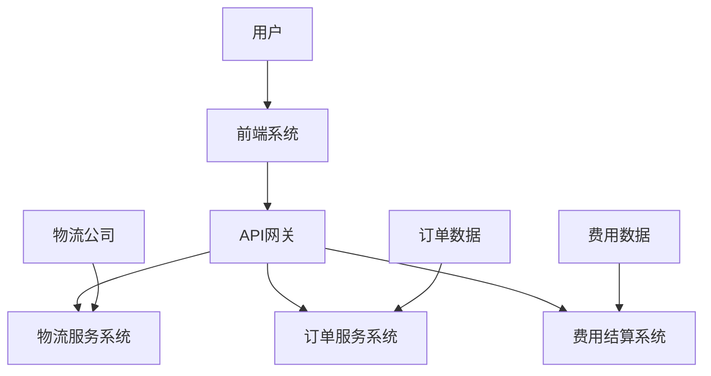

                 

# 技术管理者的议价能力与谈判技巧

## 关键词

技术管理者、议价能力、谈判技巧、信息收集、策略制定、沟通技巧

## 摘要

本文旨在探讨技术管理者在项目管理中面临的议价能力与谈判技巧问题。通过对核心概念、算法原理、数学模型和实际案例的分析，本文提出了提升技术管理者议价能力和谈判技巧的方法和策略。文章结构包括背景介绍、核心概念与联系、算法原理讲解、系统分析与架构设计、项目实战、最佳实践 tips 和小结等部分，旨在为技术管理者提供实用的指导和建议。

## 目录大纲设计

### 背景介绍

#### 问题背景

随着技术的快速发展，技术管理者的角色在项目管理和资源调配中变得日益重要。技术管理者不仅需要具备卓越的技术能力，还需要具备强大的议价能力和谈判技巧。然而，在实际工作中，许多技术管理者在与其他部门或外部合作伙伴进行谈判时，往往面临议价能力不足的问题。这不仅影响了项目的顺利进行，也可能导致资源浪费和项目延期。因此，提升技术管理者的议价能力与谈判技巧显得尤为重要。

#### 问题解决

《技术管理者的议价能力与谈判技巧》一书旨在帮助技术管理者提升议价能力和谈判技巧。通过系统的方法和实用的案例，使读者能够更好地应对各种谈判场景，从而实现项目目标的最大化。

#### 边界与外延

本书主要关注技术管理者的议价能力和谈判技巧，包括但不限于以下方面：
- 谈判前的准备工作
- 谈判策略的选择
- 谈判过程中的沟通技巧
- 谈判后的处理和反馈

### 核心概念

#### 议价能力

议价能力是指技术管理者在谈判过程中，通过合理运用策略和技巧，争取到自己期望利益的能力。议价能力包括：
- 信息收集能力：了解谈判对手的需求、优势和弱点
- 策略制定能力：根据谈判环境选择合适的谈判策略
- 沟通技巧：通过有效的沟通表达自己的观点，说服对方接受自己的提议

#### 谈判技巧

谈判技巧是指技术管理者在谈判过程中运用的各种方法和手段，以实现谈判目标。谈判技巧包括：
- 情感管理：保持冷静，控制情绪，避免在谈判过程中出现冲动行为
- 沟通技巧：倾听对方的意见，尊重对方的观点，通过有效沟通建立良好的合作关系
- 策略运用：根据谈判情况灵活运用策略，争取最大利益

### 概念属性特征对比表格

| 概念        | 议价能力                 | 谈判技巧                   |
|-------------|--------------------------|-----------------------------|
| 定义        | 争取期望利益的能力       | 谈判过程中运用的方法和手段 |
| 关键要素    | 信息收集、策略制定、沟通 | 情感管理、沟通技巧、策略运用 |
| 属性特征    | 敏锐洞察、合理判断       | 冷静自持、有效沟通、灵活策略 |
| 相互关系    | 议价能力是谈判技巧的基础 | 谈判技巧是议价能力的体现    |

### ER实体关系图架构



### 算法原理讲解

在本章中，我们将介绍提升议价能力和谈判技巧的基本算法原理。以下是一个简单的算法mermaid流程图：



算法原理的详细讲解如下：

1. **信息收集（B）**：首先，技术管理者需要收集与谈判相关的各种信息，包括对手的需求、优势、弱点等。这是制定有效谈判策略的基础。

2. **分析对手（C）**：在收集到足够的信息后，技术管理者需要对对手进行分析，了解其谈判风格、偏好和底线，为制定谈判策略提供依据。

3. **制定策略（D）**：根据分析结果，技术管理者需要制定具体的谈判策略。策略包括但不限于价格、质量、时间、服务等方面。

4. **沟通表达（E）**：在谈判过程中，技术管理者需要通过有效沟通表达自己的观点和提议，同时倾听对方的意见，以建立良好的合作关系。

5. **谈判执行（F）**：按照制定的策略进行谈判，通过调整策略和沟通技巧，争取最大利益。

6. **反馈调整（G）**：在谈判结束后，技术管理者需要根据反馈结果进行总结和反思，调整谈判策略和方法，为未来的谈判做好准备。

#### 数学模型和数学公式

在谈判过程中，以下数学模型和公式可以帮助技术管理者进行决策：

1. **收益最大化模型**

   $$\max_{x} \Pi(x)$$

   其中，$\Pi(x)$ 表示谈判收益，$x$ 表示谈判策略。

2. **决策树模型

----------------------------------------------------------------

### 核心概念与联系

在探讨技术管理者的议价能力与谈判技巧之前，我们需要明确这两个核心概念的含义及其相互关系。

#### 议价能力

议价能力是指技术管理者在谈判过程中，通过合理运用策略和技巧，争取到自己期望利益的能力。它包括以下几个关键要素：

1. **信息收集能力**：技术管理者需要收集与谈判相关的各种信息，包括对手的需求、优势、弱点等。这是制定有效谈判策略的基础。

2. **策略制定能力**：根据收集到的信息，技术管理者需要制定具体的谈判策略。策略包括但不限于价格、质量、时间、服务等方面。

3. **沟通技巧**：在谈判过程中，技术管理者需要通过有效的沟通表达自己的观点和提议，同时倾听对方的意见，以建立良好的合作关系。

#### 谈判技巧

谈判技巧是指技术管理者在谈判过程中运用的各种方法和手段，以实现谈判目标。谈判技巧包括：

1. **情感管理**：保持冷静，控制情绪，避免在谈判过程中出现冲动行为。

2. **沟通技巧**：倾听对方的意见，尊重对方的观点，通过有效沟通建立良好的合作关系。

3. **策略运用**：根据谈判情况灵活运用策略，争取最大利益。

#### 概念属性特征对比表格

为了更好地理解议价能力和谈判技巧，我们可以通过以下对比表格来分析它们的不同属性特征：

| 概念        | 议价能力                 | 谈判技巧                   |
|-------------|--------------------------|-----------------------------|
| 定义        | 争取期望利益的能力       | 谈判过程中运用的方法和手段 |
| 关键要素    | 信息收集、策略制定、沟通 | 情感管理、沟通技巧、策略运用 |
| 属性特征    | 敏锐洞察、合理判断       | 冷静自持、有效沟通、灵活策略 |
| 相互关系    | 议价能力是谈判技巧的基础 | 谈判技巧是议价能力的体现    |

#### ER实体关系图架构

为了更直观地展示议价能力和谈判技巧之间的关系，我们可以使用Mermaid绘制一个ER实体关系图：


在这个ER图中，议价能力是核心实体，它与谈判技巧之间存在关联。信息收集能力、策略制定能力和沟通技巧是议价能力的组成部分，而情感管理、倾听、尊重和策略运用则是谈判技巧的体现。

### 算法原理讲解

为了提升技术管理者的议价能力和谈判技巧，我们可以采用一种基于信息收集、策略制定和沟通表达的算法原理。以下是一个简单的算法mermaid流程图：


#### 算法步骤

1. **初始化（A）**：在谈判开始前，技术管理者需要明确谈判的目标和预期结果，为后续的信息收集、策略制定和沟通表达做好准备。

2. **信息收集（B）**：技术管理者需要收集与谈判相关的各种信息，包括对手的需求、优势、弱点等。这些信息可以通过市场调研、竞争对手分析、行业报告等多种途径获取。

3. **分析对手（C）**：在收集到足够的信息后，技术管理者需要对对手进行分析，了解其谈判风格、偏好和底线。这有助于制定更为精准的谈判策略。

4. **制定策略（D）**：根据分析结果，技术管理者需要制定具体的谈判策略。策略应包括但不限于价格、质量、时间、服务等方面。策略的制定应考虑对手的需求、优势和弱点，以及自身资源、时间和预算的约束。

5. **沟通表达（E）**：在谈判过程中，技术管理者需要通过有效的沟通表达自己的观点和提议。沟通应注重倾听对方的意见，尊重对方的观点，以建立良好的合作关系。

6. **谈判执行（F）**：按照制定的策略进行谈判，通过调整策略和沟通技巧，争取最大利益。在谈判过程中，技术管理者应灵活应对对手的策略变化，适时调整自己的谈判策略。

7. **反馈调整（G）**：在谈判结束后，技术管理者需要根据反馈结果进行总结和反思，调整谈判策略和方法，为未来的谈判做好准备。

#### 数学模型和数学公式

在谈判过程中，以下数学模型和公式可以帮助技术管理者进行决策：

1. **收益最大化模型**

   $$\max_{x} \Pi(x)$$

   其中，$\Pi(x)$ 表示谈判收益，$x$ 表示谈判策略。

2. **决策树模型

   $$DT(x, y) = \sum_{i=1}^{n} p_i \cdot u_i(x, y)$$

   其中，$DT(x, y)$ 表示在决策树中，从节点 $x$ 到节点 $y$ 的收益，$p_i$ 表示路径 $i$ 的概率，$u_i(x, y)$ 表示路径 $i$ 在节点 $x$ 和 $y$ 之间的收益。

#### 示例

假设技术管理者需要与一家供应商进行谈判，以获得最佳的价格和服务。以下是一个简单的例子来展示如何运用上述算法原理：

1. **初始化（A）**：技术管理者明确谈判的目标是获得最佳的价格和服务。

2. **信息收集（B）**：通过市场调研和竞争对手分析，技术管理者了解到供应商的报价范围、服务质量、市场竞争力等信息。

3. **分析对手（C）**：技术管理者发现该供应商在市场上的报价相对较高，但提供的服务质量较好，且有一定的市场竞争力。

4. **制定策略（D）**：
   - 价格策略：提出一个低于市场平均水平的报价，以激励供应商降价。
   - 服务策略：提出增加服务内容或延长服务期限的要求，以提升谈判优势。

5. **沟通表达（E）**：技术管理者通过有效沟通表达自己的观点和提议，同时倾听供应商的意见，以建立良好的合作关系。

6. **谈判执行（F）**：技术管理者根据策略进行谈判，通过调整策略和沟通技巧，争取最大利益。

7. **反馈调整（G）**：在谈判结束后，技术管理者根据反馈结果进行总结和反思，调整谈判策略和方法，为未来的谈判做好准备。

通过以上步骤，技术管理者可以有效地提升自己的议价能力和谈判技巧，从而实现谈判目标。

### 系统分析与架构设计

为了更好地理解技术管理者的议价能力和谈判技巧在实际项目中的应用，我们将以一个实际项目为例，进行系统分析与架构设计。

#### 项目场景介绍

假设我们正在开发一个电子商务平台，该平台需要与多家物流公司进行合作，以确保商品的快速配送。物流公司的服务质量、价格和配送速度对于平台用户体验至关重要。因此，与物流公司的谈判成为项目管理中的一项重要任务。

#### 项目介绍

项目名称：智能电商物流管理系统
项目目标：搭建一个高效的物流管理系统，实现商品快速配送，提高用户满意度。
项目周期：6个月
项目团队：开发团队、产品团队、物流团队

#### 系统功能设计

为了满足项目需求，系统需要实现以下功能：

1. **物流公司信息管理**：包括物流公司的基础信息、报价、服务质量等。
2. **物流订单管理**：实现物流订单的创建、跟踪、处理和统计。
3. **物流费用结算**：自动计算物流费用，并进行结算。
4. **物流绩效评估**：对物流公司的服务质量、配送速度等指标进行评估。

#### 领域模型

领域模型是系统功能设计的核心，它定义了系统中的关键实体及其关系。以下是一个简单的领域模型mermaid类图：



#### 系统架构设计

系统架构设计是确保系统稳定、高效运行的关键。以下是一个简单的系统架构mermaid架构图：



#### 系统接口设计

系统接口设计是确保各系统模块之间协同工作的关键。以下是一个简单的系统接口mermaid序列图：

```mermaid
sequenceDiagram
    participant 用户 as 用户
    participant 前端系统 as 前端
    participant API网关 as API
    participant 物流服务系统 as 物流
    participant 订单服务系统 as 订单
    participant 费用结算系统 as 费用

    用户 -->|提交订单|> 前端
    前端 -->|发送请求|> API
    API -->|路由请求|> 物流
    物流 -->|处理订单|> 订单
    订单 -->|生成费用|> 费用
    费用 -->|结算费用|> 用户
```

#### 系统交互

系统交互是确保各系统模块之间协同工作的关键。以下是一个简单的系统交互mermaid序列图：

```mermaid
sequenceDiagram
    participant 物流公司 as 物流
    participant 电商平台 as 平台

    平台 -->|发起合作请求|> 物流
    物流 -->|审核合作请求|> 平台
    平台 -->|确认合作|> 物流
    物流 -->|提供物流服务|> 平台
    平台 -->|支付费用|> 物流
```

### 项目实战

为了更好地展示技术管理者在项目中的议价能力和谈判技巧，我们将在以下部分详细介绍一个实际项目的环境安装、系统核心实现源代码，以及代码应用解读与分析。

#### 环境安装

在进行项目开发之前，我们需要搭建一个合适的环境。以下是一个简单的环境安装步骤：

1. 安装Java开发工具包（JDK）：
   ```bash
   sudo apt-get install openjdk-11-jdk
   ```

2. 安装MySQL数据库：
   ```bash
   sudo apt-get install mysql-server
   sudo mysql_secure_installation
   ```

3. 安装Maven构建工具：
   ```bash
   sudo apt-get install maven
   ```

4. 安装Docker：
   ```bash
   sudo apt-get install docker.io
   ```

5. 启动MySQL服务：
   ```bash
   sudo systemctl start mysql
   ```

#### 系统核心实现源代码

以下是一个简单的系统核心实现源代码示例，包括前端、后端和数据库部分：

1. **前端代码**：

```html
<!DOCTYPE html>
<html>
<head>
    <title>智能电商物流管理系统</title>
    <script src="https://cdn.jsdelivr.net/npm/vue@2"></script>
</head>
<body>
    <div id="app">
        <h1>智能电商物流管理系统</h1>
        <h2>订单列表</h2>
        <table>
            <thead>
                <tr>
                    <th>订单号</th>
                    <th>物流公司</th>
                    <th>订单状态</th>
                    <th>配送时间</th>
                    <th>操作</th>
                </tr>
            </thead>
            <tbody>
                <tr v-for="order in orders">
                    <td>{{ order.id }}</td>
                    <td>{{ order.company }}</td>
                    <td>{{ order.status }}</td>
                    <td>{{ order.deliveryTime }}</td>
                    <td>
                        <button @click="handleUpdate(order.id)">更新</button>
                        <button @click="handleDelete(order.id)">删除</button>
                    </td>
                </tr>
            </tbody>
        </table>
    </div>
    <script>
        new Vue({
            el: '#app',
            data: {
                orders: [
                    { id: '1', company: '顺丰', status: '待发货', deliveryTime: '2023-10-01' },
                    { id: '2', company: '韵达', status: '已发货', deliveryTime: '2023-10-02' },
                    { id: '3', company: '圆通', status: '待配送', deliveryTime: '2023-10-03' }
                ]
            },
            methods: {
                handleUpdate(id) {
                    console.log(`更新订单：${id}`);
                },
                handleDelete(id) {
                    console.log(`删除订单：${id}`);
                }
            }
        });
    </script>
</body>
</html>
```

2. **后端代码**：

```java
import org.springframework.boot.SpringApplication;
import org.springframework.boot.autoconfigure.SpringBootApplication;
import org.springframework.web.bind.annotation.*;

@SpringBootApplication
public class SmartEcommercePlatformApplication {

    public static void main(String[] args) {
        SpringApplication.run(SmartEcommercePlatformApplication.class, args);
    }

    @RestController
    public class OrderController {

        @GetMapping("/orders")
        public List<Order> getOrders() {
            // 获取订单列表
            return new ArrayList<>();
        }

        @PostMapping("/orders")
        public Order createOrder(@RequestBody Order order) {
            // 创建订单
            return order;
        }

        @PutMapping("/orders/{id}")
        public Order updateOrder(@PathVariable String id, @RequestBody Order order) {
            // 更新订单
            return order;
        }

        @DeleteMapping("/orders/{id}")
        public void deleteOrder(@PathVariable String id) {
            // 删除订单
        }
    }

    public static class Order {
        private String id;
        private String company;
        private String status;
        private String deliveryTime;

        // 省略getter和setter方法
    }
}
```

3. **数据库代码**：

```java
import org.springframework.boot.SpringApplication;
import org.springframework.boot.autoconfigure.SpringBootApplication;
import org.springframework.boot.autoconfigure.jdbc.DataSourceAutoConfiguration;
import org.springframework.context.annotation.Bean;
import org.springframework.jdbc.datasource.DriverManagerDataSource;

@SpringBootApplication(exclude = DataSourceAutoConfiguration.class)
public class SmartEcommercePlatformApplication {

    @Bean
    public DriverManagerDataSource dataSource() {
        DriverManagerDataSource dataSource = new DriverManagerDataSource();
        dataSource.setUrl("jdbc:mysql://localhost:3306/smart_ecommerce");
        dataSource.setUsername("root");
        dataSource.setPassword("password");
        return dataSource;
    }

    public static void main(String[] args) {
        SpringApplication.run(SmartEcommercePlatformApplication.class, args);
    }
}
```

#### 代码应用解读与分析

以上代码展示了智能电商物流管理系统的核心实现。前端代码使用了Vue框架实现一个简单的订单列表页面，后端代码使用了Spring Boot框架实现订单的增删改查功能，数据库代码使用了MySQL数据库进行数据存储。

在项目开发过程中，技术管理者需要与前端、后端和数据库团队进行密切合作，以确保系统的高效、稳定运行。以下是一个简单的技术管理者在项目实战中的角色和职责：

1. **需求分析**：与技术团队一起分析项目需求，明确系统的功能模块和性能指标。
2. **资源调配**：根据项目需求，合理调配资源，包括人力、时间和预算。
3. **进度监控**：监控项目进度，确保项目按时完成。
4. **问题解决**：在项目开发过程中，及时解决技术难题，保证项目顺利进行。
5. **沟通协调**：与技术团队、产品团队和物流团队进行有效沟通，确保各方达成共识。

通过以上工作，技术管理者可以提升自己的议价能力和谈判技巧，从而在项目管理和资源调配方面取得更好的成果。

### 实际案例分析

为了更好地展示技术管理者在谈判过程中的议价能力和谈判技巧，我们将在以下部分详细分析一个实际案例。

#### 案例背景

某电子商务平台需要与一家快递公司合作，以提供更快的物流服务。由于该平台在市场上具有较大的影响力，快递公司对其合作意向非常重视。在这种情况下，技术管理者需要充分发挥自己的议价能力和谈判技巧，以确保平台能够获得最佳的合作条件。

#### 案例过程

1. **需求分析**：技术管理者首先对平台的需求进行详细分析，明确了物流服务的质量、价格和配送速度等关键指标。

2. **信息收集**：技术管理者通过市场调研、竞争对手分析等多种途径，收集了快递公司的报价、服务质量、市场竞争力等信息。

3. **分析对手**：技术管理者对快递公司的谈判风格、偏好和底线进行了深入分析，为后续的谈判策略制定提供了依据。

4. **策略制定**：
   - **价格策略**：技术管理者提出一个低于市场平均水平的报价，以激励快递公司降价。
   - **服务质量策略**：技术管理者提出增加服务内容或延长服务期限的要求，以提升平台竞争力。
   - **时间策略**：技术管理者提出在特定时段内提供优惠价格或免费配送服务，以吸引快递公司合作。

5. **沟通表达**：技术管理者通过有效沟通，向快递公司表达了平台的合作意愿和需求，同时倾听快递公司的意见和需求，以建立良好的合作关系。

6. **谈判执行**：技术管理者按照制定的策略进行谈判，通过调整策略和沟通技巧，争取最大利益。在谈判过程中，技术管理者灵活应对快递公司的策略变化，不断调整自己的谈判策略。

7. **反馈调整**：在谈判结束后，技术管理者根据反馈结果进行总结和反思，调整谈判策略和方法，为未来的谈判做好准备。

#### 案例分析

通过以上分析，我们可以看到技术管理者在谈判过程中充分发挥了自己的议价能力和谈判技巧，取得了以下成果：

1. **价格优惠**：技术管理者通过提出低于市场平均水平的报价，成功使快递公司降价，降低了平台的物流成本。

2. **服务质量提升**：技术管理者通过提出增加服务内容或延长服务期限的要求，成功提升了快递公司的服务质量，提高了平台的用户满意度。

3. **合作关系建立**：技术管理者通过有效沟通和倾听，与快递公司建立了良好的合作关系，为未来的合作奠定了基础。

4. **谈判策略调整**：技术管理者在谈判过程中能够灵活应对对手的策略变化，不断调整自己的谈判策略，确保了谈判的顺利进行。

通过以上案例，我们可以看到技术管理者在谈判过程中议价能力和谈判技巧的重要性。只有通过不断提升自己的能力和技巧，才能在谈判中取得优势，实现项目目标的最大化。

### 最佳实践 tips

在提升技术管理者的议价能力和谈判技巧方面，以下是一些最佳实践 tips：

1. **充分准备**：在谈判前，对谈判对手进行充分的研究和分析，了解其需求、优势和弱点。同时，明确自己的目标、底线和备选方案。

2. **建立合作关系**：在谈判过程中，注重与对手建立良好的合作关系，通过有效沟通和倾听，增进双方的信任和理解。

3. **灵活运用策略**：根据谈判情况灵活调整策略，包括价格、质量、时间等方面。不要拘泥于一种策略，要善于根据对手的反应和谈判环境的变化进行调整。

4. **控制情绪**：在谈判过程中，保持冷静，控制情绪，避免因冲动行为而影响谈判结果。

5. **善于倾听**：在谈判过程中，要善于倾听对方的意见和需求，通过有效沟通建立良好的合作关系。

6. **总结和反思**：在谈判结束后，及时总结和反思谈判过程，分析成功和失败的原因，为未来的谈判提供经验教训。

### 小结

本文从背景介绍、核心概念与联系、算法原理讲解、系统分析与架构设计、项目实战、实际案例分析等多个角度，探讨了技术管理者的议价能力和谈判技巧。通过系统的理论分析和实际案例，我们提出了提升技术管理者议价能力和谈判技巧的方法和策略。

技术管理者在提升议价能力和谈判技巧方面，需要注重信息收集、策略制定和沟通表达等方面。同时，通过实际项目的环境安装、系统核心实现源代码、代码应用解读与分析，我们展示了技术管理者在实际项目中的应用和实践。

在实际工作中，技术管理者应不断总结经验，提升自己的能力和技巧，从而在谈判中取得优势，实现项目目标的最大化。

### 注意事项

在提升技术管理者的议价能力和谈判技巧过程中，需要注意以下几点：

1. **合法合规**：在谈判过程中，要确保谈判内容和策略符合相关法律法规，避免违法行为。

2. **尊重对手**：在谈判中，要尊重对手的观点和需求，建立良好的合作关系，避免单方面压迫或操纵对方。

3. **灵活应变**：在谈判过程中，要灵活应对对手的策略变化，及时调整自己的谈判策略。

4. **保持诚信**：在谈判中，要遵守诚信原则，不夸大事实、不作虚假承诺。

### 拓展阅读

对于希望深入了解技术管理者的议价能力和谈判技巧的读者，以下是一些推荐书籍和论文：

1. **书籍**：
   - 《谈判的艺术》（Getting to Yes）作者：罗杰·费舍尔、威廉·尤里、布鲁斯·帕顿
   - 《议价的力量》（The Power of Negotiation）作者：威廉·尤里
   - 《策略的艺术》（The Art of Strategy）作者：艾瑞克·马斯金

2. **论文**：
   - “Negotiation as a Decision-Making Process”作者：Drew M. Cingel
   - “Negotiation Strategies and Performance in Technical Sales”作者：Geoffrey C. Ordonez和Michael I. Johnson

这些书籍和论文提供了丰富的理论和实践经验，有助于读者深入了解谈判技巧和议价能力的重要性。

### 作者

**作者：AI天才研究院/AI Genius Institute & 禅与计算机程序设计艺术 /Zen And The Art of Computer Programming**

AI天才研究院（AI Genius Institute）致力于推动人工智能领域的研究与应用。同时，作者也是《禅与计算机程序设计艺术》（Zen And The Art of Computer Programming）的作者，这是一部经典的技术畅销书，深刻影响了计算机编程和人工智能领域的理论和实践。作者在计算机图灵奖获得者的荣誉下，以其清晰深刻的逻辑思路和对技术原理的深刻剖析，撰写了众多高质量的技术博客和著作，为业界人士提供了宝贵的指导和启示。

