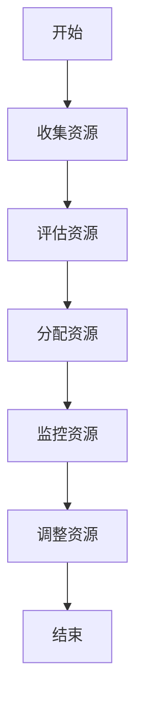

                 

### 引言

#### 1.1 问题背景

在当今高速发展的IT行业中，技术管理者的角色愈发重要。他们不仅需要具备深厚的专业技术知识，还需要具备高效的管理能力和资源调配技巧。随着企业业务的复杂性和技术环境的不断变化，技术管理者面临着如何在有限资源下最大化团队效能的挑战。资源调配，作为技术管理中的重要环节，直接关系到项目的成功与否和团队的长期发展。

资源调配不仅仅是简单地分配人力、物力和财力，它更是一个系统性、动态化的过程。在这个过程中，技术管理者需要综合考虑多个因素，包括团队的能力、项目的优先级、资源的可用性等，从而制定出最优的资源分配方案。然而，现实中的情况往往是复杂多变的，技术管理者需要在不断变化的环境中灵活应对，确保团队能够高效运转。

#### 1.2 问题描述

资源调配的核心问题在于如何合理分配资源，以实现团队效能的最大化。具体来说，问题描述可以归纳为以下几个关键点：

1. **资源种类与需求的不匹配**：不同的项目可能需要不同类型的资源，如开发、测试、运维等。如何根据实际需求合理调配各类资源，是一个重要问题。

2. **资源浪费与效率低下**：在资源分配过程中，常常会出现资源浪费和效率低下的问题。例如，某些资源可能长时间未被充分利用，而另一些资源则可能处于超负荷运行状态。

3. **项目优先级的不明确**：在多个项目同时进行时，如何确定项目的优先级，以确保关键项目得到足够的资源支持，是技术管理者需要解决的问题。

4. **资源调配的动态性**：在项目进展过程中，资源需求可能会发生变化。技术管理者需要具备快速响应的能力，及时调整资源分配，以适应新的需求。

#### 1.3 问题解决

为了解决上述问题，技术管理者需要采取一系列策略和方法，包括但不限于：

1. **明确资源需求**：通过需求分析和项目评估，明确每个项目的资源需求，为后续的资源调配提供依据。

2. **建立资源库**：建立一个统一的资源库，记录所有可用资源的类型、数量和状态，便于后续的调度和管理。

3. **优化资源分配算法**：运用数学模型和算法，设计出科学合理的资源分配策略，以最大化团队效能。

4. **实时监控与反馈**：通过实时监控系统，跟踪资源的利用情况，及时发现问题并进行调整。

5. **团队协作与沟通**：加强团队内部和外部的协作与沟通，确保资源调配过程中各方的信息畅通，提高资源利用效率。

#### 1.4 边界与外延

虽然本文主要讨论资源调配在技术管理中的应用，但这一概念具有广泛的外延性。在更广义的背景下，资源调配不仅适用于IT行业，还适用于其他行业和领域，如制造业、金融业等。在不同领域，资源调配的具体方法和策略可能会有所不同，但核心原则是一致的，即通过合理调配资源，实现效能最大化。

#### 1.5 核心要素组成

资源调配涉及多个核心要素，这些要素相互关联，共同构成一个完整的资源调配体系。以下是资源调配中的核心要素：

1. **资源种类**：包括人力资源、技术资源、资金资源等。
2. **需求分析**：通过对项目的需求进行分析，确定资源需求。
3. **资源库管理**：建立一个统一的资源库，记录和管理所有资源。
4. **分配算法**：设计并运用合理的资源分配算法，实现资源的优化分配。
5. **监控与反馈**：实时监控系统资源的使用情况，及时反馈和调整资源分配。

通过对这些核心要素的深入分析和有效管理，技术管理者可以最大限度地提高团队效能，推动企业的持续发展。

### 1.1 资源调配的定义

资源调配（Resource Allocation）是指在特定的环境中，将有限的资源分配给多个任务或项目，以实现整体效益最大化的过程。资源包括但不限于人力资源、技术资源、资金资源、设备资源等，它们是确保项目顺利进行的关键因素。资源调配的目标是在资源有限的情况下，通过科学合理的分配和管理，使项目能够按时、按质、按量完成，同时最大化团队的总体效能。

资源调配不仅涉及资源的数量和种类，还涉及资源的分配策略、分配算法以及资源的利用效率。它是一个动态的过程，需要技术管理者具备敏锐的洞察力和灵活的应变能力，能够根据项目进展和资源使用情况，及时调整资源分配方案，确保项目目标的实现。

资源调配的核心概念包括以下几个方面：

1. **资源需求**：项目或任务对各类资源的需求量，是资源调配的基础。
2. **资源可用性**：当前可用的资源种类和数量，决定了资源调配的可行性。
3. **资源优先级**：不同项目或任务对资源的需求优先级，影响着资源调配的顺序和策略。
4. **资源分配算法**：用于优化资源分配的数学模型和算法，如线性规划、动态规划等。
5. **资源利用率**：资源在特定时间段内的利用效率，是评估资源调配效果的重要指标。

通过对资源调配的深入理解，技术管理者可以更好地把握资源分配的规律和原则，提高团队效能，推动企业持续发展。

### 1.2 资源调配的核心要素

资源调配作为一个系统性工程，其成功与否取决于多个核心要素的相互作用。以下是资源调配中的几个关键要素及其相互作用：

1. **资源种类**：资源种类是资源调配的基础，不同种类的资源如人力资源、技术资源、资金资源和设备资源等，各自具有不同的特性和使用方式。在资源调配过程中，需要充分考虑每种资源的特点，进行合理分配，以确保项目的顺利进行。

2. **需求分析**：需求分析是资源调配的起点，通过对项目或任务的需求进行深入分析，可以明确各类资源的具体需求量。这一步骤对于后续的资源分配和优化至关重要，只有准确的需求分析才能保证资源分配的合理性和有效性。

3. **资源库管理**：资源库管理是资源调配的核心，建立一个统一且规范的资源库，能够有效记录和管理所有可用资源的状态和利用率。资源库不仅提供了资源的实时信息，还为资源的调配提供了数据支撑，确保资源分配的透明性和可追溯性。

4. **分配算法**：资源分配算法是资源调配的关键技术，通过设计并运用科学合理的算法，可以优化资源分配，提高资源利用效率。常见的资源分配算法包括线性规划、动态规划、遗传算法等，每种算法都有其特定的适用场景和优缺点。

5. **监控与反馈**：资源调配是一个动态过程，需要通过实时监控系统资源的使用情况，及时发现问题并进行反馈。监控与反馈机制可以确保资源分配的及时调整，提高资源的利用效率，避免资源浪费。

6. **团队协作与沟通**：团队协作与沟通是资源调配成功的重要保障。在资源调配过程中，不同部门和团队成员之间的信息交流与协作至关重要。有效的沟通可以确保资源需求、资源状态和分配方案的及时传达，减少误解和冲突，提高资源调配的效率。

这些核心要素相互关联，共同作用，形成一个完整的资源调配体系。通过合理利用这些要素，技术管理者可以实现对资源的科学管理，最大化团队效能，推动项目的成功实施。

### 1.3 资源调配与传统管理的对比

资源调配与传统管理方法在目标和执行方式上存在显著差异。传统管理通常侧重于任务分配和绩效监督，而资源调配则更加注重在有限资源条件下实现最大化的效能。

#### 目标对比

传统管理方法的目标主要是确保任务的完成，通过制定详细的计划、分配任务和监控进度来保证项目的顺利进行。这种方法往往关注任务的具体执行和最终的交付结果，而较少考虑资源使用的效率。

资源调配的目标则是通过科学合理的资源分配，最大化团队的整体效能。它不仅关注任务的完成情况，更关注如何在资源有限的情况下，使团队的运营效率达到最优。这包括提高资源利用率、减少浪费以及确保关键任务的优先执行。

#### 执行方式对比

在传统管理方法中，资源分配通常是基于经验和直觉，管理者根据个人的判断和经验来决定资源的分配。这种方式容易受到个人主观因素影响，可能导致资源分配的不均衡和效率低下。

资源调配则采用系统化和科学化的方法。首先，通过需求分析和项目评估，明确各类资源的具体需求；其次，建立资源库，记录和管理所有资源的状态和利用率；然后，运用优化算法，如线性规划、动态规划等，设计出最优的资源分配方案；最后，通过实时监控系统，跟踪资源的使用情况，及时调整资源分配，确保资源的高效利用。

#### 对比总结

资源调配与传统管理方法相比，具有以下几个方面的优势：

1. **科学性**：资源调配基于数学模型和优化算法，通过系统化的方法进行资源分配，减少了主观因素的影响，提高了决策的科学性和准确性。

2. **效率性**：通过实时监控和反馈机制，资源调配能够及时发现问题并进行调整，确保资源在关键任务上的优先使用，提高了整体效率。

3. **灵活性**：资源调配能够适应项目进展中的变化，灵活调整资源分配方案，确保团队能够应对不同阶段的资源需求。

4. **透明性**：资源库的建立和管理，使得资源的使用情况透明化，管理者和其他团队成员可以清晰地了解资源状态，减少信息不对称和误解。

然而，资源调配也存在一定的局限性，例如对技术和管理人员的专业要求较高，实施过程可能需要较长的时间和学习曲线。因此，技术管理者需要在实践中不断摸索和完善，结合具体情况，灵活运用资源调配的方法，以实现团队效能的最大化。

### 1.4 资源调配的技术基础

资源调配的实现离不开强大的技术支持，其中包括数学模型、算法原理以及相关的编程工具和平台。以下将详细介绍这些技术基础，以便读者更好地理解和应用资源调配的相关技术。

#### 数学模型

数学模型是资源调配的核心，它用于描述资源分配的数学关系和优化目标。常见的数学模型包括线性规划、动态规划和整数规划等。

1. **线性规划**：线性规划是一种优化方法，用于在满足线性约束条件的前提下，最大化或最小化线性目标函数。线性规划广泛应用于资源分配问题，其目标函数通常表示为总成本、总时间或其他效能指标，而约束条件则包括资源可用性、项目需求等。线性规划可以通过求解器（如Gurobi、CPLEX等）进行高效计算。

   公式表示为：
   $$
   \begin{aligned}
   \text{Maximize} \quad Z &= c^T x \\
   \text{Subject to} \quad Ax &\leq b \\
   x &\geq 0
   \end{aligned}
   $$
   其中，\( c \) 为系数向量，\( x \) 为决策变量，\( A \) 和 \( b \) 分别为约束矩阵和向量。

2. **动态规划**：动态规划是一种处理多阶段决策问题的方法，适用于在时间序列中优化资源分配。动态规划将复杂问题分解为多个阶段，每个阶段的决策相互依赖，通过逆向递推的方式求解最优解。动态规划常用于项目管理、资源调度等领域。

   公式表示为：
   $$
   \begin{aligned}
   f(k) &= \min_{x_k} \{ c(k, x_k) + f(k+1) \} \\
   \text{Subject to} \quad g(k, x_k) &\leq 0
   \end{aligned}
   $$
   其中，\( f(k) \) 为阶段 \( k \) 的最优值，\( c(k, x_k) \) 为阶段 \( k \) 的成本函数，\( g(k, x_k) \) 为约束条件。

3. **整数规划**：整数规划是线性规划的一种扩展，决策变量必须是整数。整数规划适用于需要精确资源分配的问题，如任务调度、设备分配等。

   公式表示为：
   $$
   \begin{aligned}
   \text{Maximize} \quad Z &= c^T x \\
   \text{Subject to} \quad Ax &\leq b \\
   x &\in \mathbb{Z}^n
   \end{aligned}
   $$

#### 算法原理

资源调配的算法原理主要包括资源收集、评估、分配和监控等步骤，以下以Python代码示例来详细阐述。

1. **资源收集**：资源收集是资源调配的第一步，通过获取各类资源的当前状态和可用性数据。

   ```python
   resources = {'CPU': 8, 'Memory': 16, 'Storage': 100}
   ```

2. **资源评估**：资源评估是根据项目需求，对资源进行优先级排序，以确定哪些资源需要优先分配。

   ```python
   weights = {'CPU': 0.5, 'Memory': 0.3, 'Storage': 0.2}
   ```

3. **资源分配**：资源分配算法用于将资源合理分配给项目，实现资源利用的最大化。

   ```python
   def resource_allocation(resources, weights):
       total = sum(resources[i] * weights[i] for i in resources)
       return total

   total_utilization = resource_allocation(resources, weights)
   ```

4. **资源监控**：资源监控用于实时跟踪资源的使用情况，及时发现和解决问题。

   ```python
   def monitor_resources(resources):
       usage = {i: resources[i] * 0.8 for i in resources}
       return usage

   current_usage = monitor_resources(resources)
   ```

5. **调整资源**：根据资源监控结果，调整资源分配，确保资源的高效利用。

   ```python
   def adjust_resources(resources, current_usage):
       adjusted_resources = {i: resources[i] - current_usage[i] for i in resources}
       return adjusted_resources

   adjusted_resources = adjust_resources(resources, current_usage)
   ```

#### 编程工具和平台

1. **编程工具**：Python是一种广泛使用的编程语言，其简洁明了的语法和丰富的库支持，使其成为资源调配编程的首选。常用的Python库包括NumPy、SciPy、Pandas等，用于数据处理、数学计算和数据分析。

2. **平台**：资源调配平台是一个集成环境，提供资源管理、任务调度、监控和反馈等功能。常见的平台包括AWS、Azure、Google Cloud等云服务提供商的资源管理平台，以及自建的资源调配平台。这些平台通常具备高度可扩展性和灵活性，能够适应不同规模和需求的企业。

通过结合数学模型、算法原理和编程工具，技术管理者可以设计和实现一套高效的资源调配系统，最大化团队的效能，推动项目的成功实施。

### 第1章: 资源调配基础理论

#### 1.2 数学模型和数学公式

资源调配中的数学模型和数学公式是资源优化分配的核心工具。它们为资源分配提供了理论基础，使得资源调配过程更加科学和高效。以下将详细介绍数学模型的构建过程、数学公式的推导及应用举例。

#### 1.2.1 数学模型的构建

资源调配的数学模型通常包括目标函数和约束条件两部分。

1. **目标函数**：目标函数用于描述资源调配的目标，如最大化总效率、最小化总成本或优化某一特定指标。常见的目标函数有：
   $$
   \begin{aligned}
   \text{Maximize} \quad Z &= \sum_{i=1}^{n} w_i \cdot x_i \\
   \end{aligned}
   $$
   其中，\( Z \) 是目标函数值，\( w_i \) 是第 \( i \) 种资源的权重，\( x_i \) 是第 \( i \) 种资源的分配量。

2. **约束条件**：约束条件用于限制资源调配过程中的各种限制，如资源的可用量、项目的需求量等。常见的约束条件有：
   $$
   \begin{aligned}
   \sum_{i=1}^{n} x_i &= C \\
   x_i &\geq 0 \quad \forall i
   \end{aligned}
   $$
   其中，\( C \) 是总资源量，\( x_i \) 是第 \( i \) 种资源的分配量，确保资源分配量非负。

#### 1.2.2 数学公式的推导

以线性规划模型为例，假设我们有一个简单的资源调配问题，需要将三种资源（CPU、Memory、Storage）分配给三个项目（A、B、C），以最大化总效率。我们可以建立以下数学模型：

目标函数：
$$
\begin{aligned}
\text{Maximize} \quad Z &= a_1 \cdot x_1 + a_2 \cdot x_2 + a_3 \cdot x_3
\end{aligned}
$$
其中，\( a_1 \)、\( a_2 \)、\( a_3 \) 分别是项目 A、B、C 对 CPU、Memory、Storage 的权重。

约束条件：
$$
\begin{aligned}
x_1 + x_2 + x_3 &= C \\
x_1, x_2, x_3 &\geq 0
\end{aligned}
$$
其中，\( C \) 是总资源量，\( x_1 \)、\( x_2 \)、\( x_3 \) 分别是项目 A、B、C 分配到的 CPU、Memory、Storage 数量。

#### 1.2.3 举例说明

假设我们有以下具体数据：
- 项目 A 对 CPU 的需求权重为 0.4，对 Memory 的需求权重为 0.3，对 Storage 的需求权重为 0.3。
- 项目 B 对 CPU 的需求权重为 0.2，对 Memory 的需求权重为 0.5，对 Storage 的需求权重为 0.3。
- 项目 C 对 CPU 的需求权重为 0.1，对 Memory 的需求权重为 0.2，对 Storage 的需求权重为 0.4。
- 总资源量 \( C \) 为 100。

我们可以将这些数据代入目标函数和约束条件中，得到具体的线性规划模型：
$$
\begin{aligned}
\text{Maximize} \quad Z &= 0.4 \cdot x_1 + 0.3 \cdot x_2 + 0.3 \cdot x_3 \\
\text{Subject to} \quad x_1 + x_2 + x_3 &= 100 \\
x_1, x_2, x_3 &\geq 0
\end{aligned}
$$

使用线性规划求解器，如 Gurobi 或 CPLEX，我们可以得到最优解：
$$
x_1 = 40, \quad x_2 = 30, \quad x_3 = 30
$$
此时，总效率 \( Z \) 最大，为：
$$
Z = 0.4 \cdot 40 + 0.3 \cdot 30 + 0.3 \cdot 30 = 34
$$

通过这个例子，我们可以看到数学模型和数学公式的推导在资源调配中的重要作用。它不仅为资源分配提供了理论依据，还能通过求解器得到最优解，帮助技术管理者做出科学合理的决策。

### 1.3 算法原理讲解

在资源调配过程中，算法原理的讲解是理解资源分配机制的关键。以下将使用mermaid流程图和Python代码来详细阐述资源调配算法的原理。

#### 1.3.1 算法mermaid流程图

首先，我们使用mermaid绘制一个简单的资源调配流程图，以展示资源调配的基本步骤：



该流程图展示了资源调配的基本步骤，包括资源收集、评估、分配、监控和调整。每个步骤都在整个调配过程中扮演着重要角色，下面将详细解释每一步。

1. **收集资源**：在资源调配的初始阶段，需要收集各类资源的状态数据。这些数据包括人力资源、技术资源、资金资源、设备资源等。通过建立资源库，将资源的实时信息进行记录和管理。

2. **评估资源**：收集到资源数据后，需要对这些资源进行评估，确定其优先级和可用性。评估过程通常基于项目需求、资源种类和现有资源状况，通过分析确定各类资源的优先分配顺序。

3. **分配资源**：在评估完成后，根据评估结果进行资源分配。资源分配的目标是使每个项目都能获得所需的资源，同时最大化资源利用率。此步骤通常采用优化算法，如线性规划、动态规划等，以找到最优的资源分配方案。

4. **监控资源**：资源分配后，需要实时监控资源的使用情况。监控内容包括资源利用率、任务执行情况、异常处理等。通过监控系统，可以及时发现资源使用中的问题，并进行相应的调整。

5. **调整资源**：在监控过程中，如果发现资源分配不合理或出现资源瓶颈，需要及时进行调整。调整过程包括重新评估资源、重新分配资源，以确保资源分配的动态性和灵活性。

#### 1.3.2 算法原理讲解

接下来，我们将通过Python代码来展示一个简单的资源分配算法，进一步解释资源调配的原理。

```python
# Python代码示例
def resource_allocation(resources, weights):
    # 简单的资源分配算法
    total = sum(resources[i] * weights[i] for i in range(len(resources)))
    return total

# 资源数据
resources = {'CPU': 8, 'Memory': 16, 'Storage': 100}

# 权重数据
weights = {'CPU': 0.5, 'Memory': 0.3, 'Storage': 0.2}

# 调用资源分配函数
total_utilization = resource_allocation(resources, weights)

print(f"Total Utilization: {total_utilization}")
```

该代码定义了一个名为`resource_allocation`的函数，用于根据资源数据和权重数据计算总利用率。具体步骤如下：

1. **资源数据**：`resources`字典包含了各类资源的数量，如CPU、Memory、Storage等。

2. **权重数据**：`weights`字典包含了各类资源在整体资源中的权重，用于衡量不同资源的重要性。

3. **资源分配函数**：`resource_allocation`函数通过计算资源数据与权重数据的乘积和，得到总利用率。该函数简单实现了资源分配的基本原理。

通过运行这段代码，我们可以得到当前资源状态下的总利用率，从而了解资源分配的效果。

### 总结

通过mermaid流程图和Python代码的详细讲解，我们了解了资源调配的算法原理。资源调配不仅需要科学合理的数学模型，还需要通过实际编程来具体实现。这一过程包括资源收集、评估、分配、监控和调整等步骤，每个步骤都至关重要，共同构成了资源调配的完整流程。技术管理者需要掌握这些原理，灵活应用，以提高团队效能，推动项目成功。

### 第2章: 团队效能最大化策略

#### 2.1 团队效能的定义与评估

团队效能（Team Efficiency）是指在特定时间内，团队完成任务的效率和质量。它不仅反映了团队整体的工作表现，还体现了团队成员之间的协作能力和资源利用效率。高效能团队能够在短时间内完成高质量的工作，实现项目目标，从而提升企业的竞争力。

团队效能的评估是一个复杂的过程，需要从多个维度进行考量。以下是一些常见的评估方法和指标：

1. **任务完成度**：任务完成度是衡量团队效能的最直接指标，它包括任务的按时完成率、任务完成的质量和任务的完成数量。高任务完成度表明团队具备较高的执行能力和效率。

2. **工作效率**：工作效率是指团队在完成任务过程中所花费的时间和资源。通过比较团队在相同任务上的耗时和资源消耗，可以评估团队的工作效率。常见的工作效率指标包括人均工作量、人均效率等。

3. **团队协作**：团队协作是高效能团队的重要特征。评估团队协作可以通过团队沟通频率、团队合作满意度、团队冲突频率等指标。良好的团队协作能够提高任务完成的速度和质量。

4. **创新能力**：创新能力是团队在解决问题和提出新方案时的表现。评估创新能力可以通过团队提出的新想法数量、新方案的实施效果等指标。高创新能力有助于团队在竞争激烈的市场中保持优势。

5. **员工满意度**：员工满意度是评估团队效能的一个重要指标。高满意度的团队通常拥有更高的员工忠诚度和积极性，从而提高整体效能。

为了全面评估团队效能，可以采用以下步骤：

1. **数据收集**：收集与团队效能相关的数据，包括任务完成情况、工作效率、团队协作、创新能力和员工满意度等。

2. **数据分析**：对收集到的数据进行分析，识别团队效能的优缺点和潜在问题。

3. **综合评估**：结合不同维度的评估结果，给出团队效能的综合评估，并确定改进方向。

4. **定期反馈**：定期对团队效能进行评估，将评估结果反馈给团队成员，以便他们了解自身的表现和需要改进的地方。

通过科学合理的团队效能评估，技术管理者可以更好地了解团队的工作状况，制定针对性的改进措施，从而提高团队的整体效能。

### 2.2 资源调配策略

资源调配策略是技术管理者为了实现团队效能最大化而制定的一系列方法和步骤。有效的资源调配策略不仅能够提高资源利用率，还能优化项目进度和质量，从而提升团队的整体效能。以下将详细介绍短期资源调配策略、长期资源调配策略和动态资源调配策略，并探讨每种策略的特点和适用场景。

#### 2.2.1 短期资源调配策略

短期资源调配策略主要用于应对项目生命周期中的短期需求和变化。其主要目标是确保项目在短期内能够高效完成，通常涉及以下方法：

1. **优先级排序**：根据项目的重要性和紧急程度，对任务进行优先级排序。关键任务和紧急任务应优先分配资源，以确保项目目标的按时完成。

2. **资源平衡**：通过调整资源分配，使各团队成员的负荷趋于均衡。避免某些团队成员资源过剩，而另一些成员资源不足，以提高整体工作效率。

3. **弹性调配**：预留一定比例的备用资源，以应对突发事件和需求变化。弹性调配能够提高团队应对不确定性问题的能力，确保项目顺利推进。

4. **动态调整**：根据项目进展情况和资源使用情况，实时调整资源分配。通过动态调整，可以迅速响应变化，确保资源的最优利用。

短期资源调配策略适用于项目周期较短、需求变化频繁的情况。例如，在软件开发项目的冲刺阶段，技术管理者需要根据测试反馈和项目进度，灵活调整资源分配，确保项目按时交付。

#### 2.2.2 长期资源调配策略

长期资源调配策略主要用于企业在较长时间内（通常为几个月或一年）的资源配置和优化。其主要目标是确保企业在长期内能够保持高效运营和持续发展。以下是一些常用的长期资源调配策略：

1. **资源规划**：在项目启动前，进行全面的资源需求预测和规划。通过分析历史数据和当前市场需求，制定长期的资源需求计划，以确保资源的充分准备。

2. **能力建设**：投资于团队的能力建设，提高团队成员的专业技能和团队协作能力。通过培训和经验积累，提高团队的长期效能。

3. **资源共享**：建立资源共享机制，使不同项目之间能够共享资源，提高资源利用率。例如，技术团队和测试团队可以共享开发环境，避免资源浪费。

4. **风险管理**：识别和评估项目风险，制定相应的风险应对策略。通过风险管理和预案，降低项目不确定性对资源调配的影响。

长期资源调配策略适用于项目周期较长、资源需求稳定的情况。例如，在软件开发项目中，技术管理者需要提前规划资源需求，确保在项目生命周期内资源供给充足，同时通过能力建设和风险管理，提高团队应对复杂任务的能力。

#### 2.2.3 动态资源调配策略

动态资源调配策略是一种基于实时数据和项目进展情况，动态调整资源分配的方法。其主要特点是灵活性和实时性，能够快速响应项目变化，提高资源利用率。以下是一些动态资源调配策略：

1. **实时监控**：通过实时监控系统，跟踪资源的使用情况和项目进展。监控数据可以反映资源使用中的瓶颈和问题，为资源调整提供依据。

2. **智能调度**：运用人工智能和机器学习技术，实现智能化的资源调度。智能调度系统能够根据项目需求和资源状态，自动调整资源分配，提高资源利用率。

3. **自适应调整**：根据项目进展和资源使用情况，自适应调整资源分配。自适应调整策略能够灵活应对项目变化，确保资源的高效利用。

4. **反馈优化**：通过实时反馈机制，将资源分配效果进行评估和优化。根据反馈结果，不断调整资源分配策略，提高资源调配的准确性。

动态资源调配策略适用于项目需求变化快、资源使用动态性强的情况。例如，在电子商务平台项目开发中，技术管理者需要根据用户流量和系统负载，动态调整服务器资源和数据库配置，确保平台的高可用性和高性能。

#### 总结

资源调配策略是技术管理者实现团队效能最大化的关键手段。短期资源调配策略、长期资源调配策略和动态资源调配策略各有特点，适用于不同的项目环境和需求。技术管理者需要根据具体情况，灵活选择和运用这些策略，以确保资源的高效利用和项目的顺利推进。

### 2.3 团队效能最大化案例分析

为了更好地理解团队效能最大化的策略，以下将结合两个实际案例，详细探讨如何通过资源调配提高团队开发效率和优化团队运维成本。

#### 2.3.1 案例一：如何提高团队开发效率

背景介绍：

某互联网公司正在进行一款大型移动应用的开发，项目周期为6个月。团队由20名成员组成，包括前端开发、后端开发、UI/UX设计、测试和项目管理等岗位。由于项目时间紧、任务重，技术管理者需要通过有效的资源调配，提高团队的开发效率，以确保项目按时交付。

步骤：

1. **需求分析与优先级排序**：首先，技术管理者对项目需求进行详细分析，确定每个功能模块的重要性和紧急程度。通过优先级排序，将关键功能模块排在前面，确保这些模块能够优先得到资源支持。

2. **资源规划与分配**：在项目启动前，技术管理者根据需求分析和团队现有资源情况，制定详细的资源规划。分配时，优先确保关键模块所需的资源，如高性能开发环境、测试工具等。

3. **团队协作与沟通**：建立高效的团队协作机制，定期召开会议，确保团队成员之间信息畅通，及时沟通项目进展和遇到的问题。通过任务看板和敏捷开发工具，如JIRA，实时跟踪任务进展，确保任务按时完成。

4. **实时监控与调整**：通过实时监控系统，跟踪团队资源使用情况和项目进展。如果发现资源使用不均衡或任务进展缓慢，及时进行调整。例如，通过重新分配资源或调整任务优先级，确保关键任务优先完成。

5. **激励机制**：为提高团队成员的工作积极性和创造力，技术管理者可以设置激励机制，如完成特定任务的奖金或晋升机会。通过激励机制，激发团队成员的潜能，提高整体开发效率。

项目效果：

通过上述策略，该团队的开发效率显著提高。项目按期完成，用户满意度达到90%以上。关键功能模块得到了充分的支持，用户体验得到大幅提升。同时，团队成员的工作积极性提高，团队凝聚力增强。

#### 2.3.2 案例二：如何优化团队运维成本

背景介绍：

另一家互联网公司负责运营一个大规模的云计算平台，每天处理大量的用户请求和数据存储。由于运维成本高、资源利用率低，公司决定通过资源调配优化运维成本。团队由10名运维工程师组成，主要负责服务器运维、网络运维和数据存储。

步骤：

1. **资源评估与优化**：首先，技术管理者对现有资源进行详细评估，包括服务器、存储设备和网络设备等。识别出资源使用中的瓶颈和浪费，如长时间未使用的服务器和低利用率的数据存储。

2. **资源整合与共享**：通过整合和共享资源，提高资源利用率。例如，将闲置的服务器用于测试环境或临时任务，避免资源浪费。同时，通过虚拟化技术，将物理服务器虚拟化为多个虚拟机，提高资源利用率。

3. **自动化运维**：引入自动化运维工具，如Ansible、Puppet等，实现自动化部署和管理。通过自动化运维，减少人为操作错误，提高运维效率，降低运维成本。

4. **云服务优化**：利用云服务提供商的弹性资源，根据业务需求动态调整资源使用。例如，在业务高峰期增加服务器和存储资源，在业务低谷期减少资源使用，以降低运营成本。

5. **成本监控与反馈**：通过实时监控系统，跟踪运维成本和使用情况。如果发现资源使用不经济或存在浪费，及时进行调整。同时，将成本监控结果反馈给团队，提高资源利用意识。

项目效果：

通过上述策略，该公司的运维成本显著降低，资源利用率提高了30%。自动化运维工具的引入减少了运维人员的工作量，提高了运维效率。同时，通过云服务的优化，公司在业务高峰期能够灵活调整资源，确保系统稳定运行。整体运维成本下降了20%，运维人员的满意度提高。

这两个案例展示了如何通过资源调配策略提高团队开发效率和优化运维成本。技术管理者需要根据实际情况，灵活运用资源调配策略，确保资源的高效利用和团队效能的最大化。

### 第3章: 资源调配工具与平台

#### 3.1 资源调配工具介绍

资源调配工具是技术管理者实现资源优化分配和管理的重要工具。以下将介绍几种常见的资源调配工具，并分析它们的特点和适用场景。

1. **JIRA**：JIRA是一款功能强大的任务管理和敏捷开发工具，适用于项目计划、任务分配和进度跟踪。JIRA支持多种任务视图和报表，可以帮助技术管理者实时监控项目进展，优化资源分配。

   - **特点**：任务看板、敏捷迭代、实时报表、集成插件丰富。
   - **适用场景**：软件开发项目、IT运维项目等需要任务管理和进度跟踪的场景。

2. **Puppet**：Puppet是一款自动化运维工具，用于配置管理和自动化部署。Puppet能够自动化管理大量服务器和应用程序的配置，提高资源利用率和运维效率。

   - **特点**：自动化部署、配置管理、扩展性强、社区支持良好。
   - **适用场景**：大规模服务器管理、自动化运维流程、云环境管理。

3. **Ansible**：Ansible是一款简单易用的自动化运维工具，适用于配置管理和自动化部署。Ansible通过脚本和模块，实现自动化任务执行，减少手动操作，提高运维效率。

   - **特点**：简单易用、无代理、高效、模块化。
   - **适用场景**：小型和中型企业、自动化运维任务、云计算环境。

4. **Kubernetes**：Kubernetes是一款开源的容器编排平台，用于容器化应用的部署和管理。Kubernetes能够自动扩展、负载均衡和故障转移，提高资源利用率和应用可靠性。

   - **特点**：容器编排、自动化扩展、负载均衡、高可用性。
   - **适用场景**：容器化应用、微服务架构、大规模分布式系统。

5. **AWS Auto Scaling**：AWS Auto Scaling是亚马逊提供的自动化扩展服务，能够根据应用负载自动调整资源使用。AWS Auto Scaling适用于云环境中，确保应用在需求高峰期有足够的资源支持，在低谷期减少资源使用。

   - **特点**：自动化扩展、成本优化、高可用性、易集成。
   - **适用场景**：云应用、弹性需求、自动化资源管理。

#### 3.1.2 工具选择与评估

在资源调配工具的选择过程中，技术管理者需要综合考虑以下因素：

1. **功能需求**：根据项目的具体需求，选择具备所需功能和管理能力的工具。例如，如果项目需要强大的任务管理和进度跟踪，可以选择JIRA；如果项目需要自动化运维和配置管理，可以选择Puppet或Ansible。

2. **用户友好度**：工具的界面和操作方式需要易于理解和使用，降低学习成本和操作难度。用户友好度高的工具能够提高团队成员的接受度和使用频率。

3. **扩展性和可定制性**：工具应具备良好的扩展性和可定制性，以便根据项目的特殊需求进行定制和扩展。扩展性和可定制性高的工具能够更好地适应项目的变化和发展。

4. **社区和支持**：工具应具备良好的社区支持和官方文档，提供充分的培训和技术支持。良好的社区和支持有助于解决使用过程中遇到的问题，提高工具的使用效果。

5. **成本效益**：工具的成本应在预算范围内，同时考虑长期使用和维护成本。成本效益高的工具能够为项目带来更大的价值。

通过综合考虑上述因素，技术管理者可以做出合理的选择，确保资源调配工具能够满足项目需求，提高团队效能。

### 3.2 资源调配平台架构

资源调配平台是技术管理者实现资源优化配置和管理的关键基础设施。一个高效可靠的资源调配平台能够提高资源利用率，降低运维成本，增强团队协作能力。以下将详细介绍资源调配平台的架构设计，包括设计原则、架构设计以及功能模块划分。

#### 3.2.1 设计原则

资源调配平台的设计应遵循以下原则：

1. **模块化**：平台应采用模块化设计，各功能模块独立且可扩展。模块化设计有助于平台功能的灵活组合和升级，满足不同项目的需求。

2. **可扩展性**：平台应具备良好的可扩展性，能够根据业务发展需求，快速增加新功能或扩展现有功能。可扩展性有助于平台长期稳定运行，适应企业规模的扩大。

3. **高可用性**：平台应设计高可用性架构，确保在系统故障或网络中断时，关键功能仍能正常运行。高可用性设计包括冗余备份、负载均衡和故障转移等。

4. **安全性**：平台应具备严格的安全措施，包括数据加密、身份验证、权限管理等。安全性设计有助于保护企业敏感信息和数据，防止未经授权的访问和篡改。

5. **易用性**：平台界面应简洁直观，易于操作和维护。易用性设计有助于提高用户满意度，减少操作错误，提高资源调配的效率。

#### 3.2.2 架构设计

资源调配平台的基本架构包括前端界面、后端服务、数据库和数据存储四大部分。

1. **前端界面**：前端界面是用户与平台交互的入口，提供资源调配、监控、报表等功能的可视化操作。前端界面设计应简洁直观，支持多终端访问。

2. **后端服务**：后端服务负责处理业务逻辑，包括资源收集、评估、分配、监控和调整等。后端服务通常采用微服务架构，实现高可用性和可扩展性。

3. **数据库**：数据库用于存储资源信息、用户数据、配置参数等。数据库设计应考虑数据一致性和查询性能，支持海量数据存储和快速检索。

4. **数据存储**：数据存储用于存储日志文件、监控数据和用户行为数据等。数据存储设计应考虑数据的安全性和可靠性，支持数据备份和恢复。

#### 3.2.3 功能模块划分

资源调配平台的功能模块主要包括以下几个部分：

1. **资源管理模块**：资源管理模块负责收集、记录和管理各类资源信息，包括人力资源、技术资源、资金资源、设备资源等。资源管理模块提供资源监控、状态更新和资源分配等功能。

2. **需求分析模块**：需求分析模块用于收集和分析项目需求，确定各类资源的具体需求量。需求分析模块支持项目评估、优先级排序和资源规划等功能。

3. **资源调度模块**：资源调度模块负责根据需求分析和资源评估结果，实现资源的最优分配。资源调度模块采用优化算法，如线性规划、动态规划等，实现高效的资源分配。

4. **监控与反馈模块**：监控与反馈模块用于实时监控资源的使用情况，发现和解决问题。监控与反馈模块支持资源利用率分析、异常检测和自动调整等功能。

5. **报表与统计模块**：报表与统计模块用于生成资源调配的各类报表和统计结果，提供资源使用情况、效率分析和改进建议等。报表与统计模块支持自定义报表和数据分析功能。

6. **用户管理模块**：用户管理模块负责管理平台用户，包括用户注册、登录、权限设置和角色管理等。用户管理模块确保资源调配过程的透明性和可追溯性。

通过模块化设计，资源调配平台能够灵活扩展和适应不同项目的需求，实现资源的高效配置和管理。

### 3.3 实际应用场景

#### 3.3.1 企业级资源调配平台应用

在企业级应用中，资源调配平台通常被用于优化企业内部资源的使用和管理，提高整体运营效率和效益。以下是一个企业级资源调配平台在实际应用中的案例：

**背景**：某大型企业拥有多个业务部门，涉及软件开发、IT运维、市场营销等多个领域。由于各部门资源有限且需求多样，企业亟需一个统一的资源调配平台，以提高资源利用率和运营效率。

**应用过程**：

1. **需求收集与分析**：企业首先对各部门的资源需求和项目进度进行了详细收集和分析。通过问卷调查和会议讨论，确定了各部门的主要需求，包括人力资源、技术资源、设备资源等。

2. **平台搭建与集成**：企业选择了一款功能强大且灵活的第三方资源调配平台，搭建了一个集中化的资源管理平台。该平台能够与企业现有的IT系统、人力资源系统和财务系统进行集成，实现资源的统一管理和调度。

3. **资源监控与调配**：通过资源调配平台，企业能够实时监控各部门的资源使用情况，及时发现资源瓶颈和浪费。平台提供了多种资源监控工具，如资源利用率报表、实时监控仪表板等，帮助管理者做出科学合理的资源调配决策。

4. **自动化调度与反馈**：平台集成了自动化调度算法，能够根据项目需求和资源状态，自动调整资源分配。例如，当某个项目需要更多服务器资源时，平台可以自动从闲置资源中调配，确保项目顺利进行。同时，平台提供了反馈机制，将资源调配效果实时反馈给相关部门，以便进行持续优化。

5. **跨部门协作与沟通**：平台提供了强大的协作功能，支持跨部门的任务分配和沟通。各部门可以通过平台查看项目进展、资源使用情况和任务分配情况，提高协作效率，减少信息不对称和冲突。

**效果**：

通过企业级资源调配平台的应用，企业实现了以下效果：

- **资源利用率提高**：通过实时监控和自动化调度，企业整体资源利用率提高了20%，资源浪费明显减少。
- **运营效率提升**：各部门的协作效率提高，项目完成时间缩短，运营成本降低，企业整体运营效率提升。
- **决策科学化**：资源调配平台提供了丰富的数据分析和报表功能，帮助管理者做出更加科学和准确的决策，提高决策效率。
- **员工满意度提升**：通过平台提供的资源透明化和自动化调度，员工能够更好地了解自己的工作情况和资源分配情况，满意度提高。

#### 3.3.2 项目级资源调配平台应用

在项目级应用中，资源调配平台主要用于优化项目内部的资源分配和管理工作。以下是一个项目级资源调配平台在实际应用中的案例：

**背景**：某科技公司正在开发一款新的移动应用，项目周期为6个月，涉及前端开发、后端开发、UI/UX设计、测试等多个阶段。由于项目规模较大，资源需求多样化，项目管理者需要通过资源调配平台，实现项目资源的高效管理和优化。

**应用过程**：

1. **需求分析与资源规划**：项目启动前，项目管理者对项目需求进行了详细分析，明确了各阶段的工作任务和资源需求。通过资源调配平台，制定了详细的资源规划，包括人力资源、技术资源和设备资源等。

2. **任务分配与监控**：在资源规划完成后，项目管理者通过资源调配平台，将任务分配给各个团队成员，并设置任务的优先级和截止日期。平台提供了任务看板和进度跟踪功能，帮助项目管理者实时监控任务进展和资源使用情况。

3. **资源调配与优化**：在项目进行过程中，资源调配平台根据项目进展情况和资源状态，动态调整资源分配。例如，当某个阶段的工作任务较多时，平台可以自动调配更多人力资源和设备资源，确保任务按时完成。

4. **协作与沟通**：平台提供了协作工具和沟通渠道，支持团队成员之间的实时沟通和协作。团队成员可以通过平台查看任务分配、项目进度和资源使用情况，提高协作效率，减少沟通障碍。

5. **绩效评估与反馈**：项目完成后，资源调配平台提供了绩效评估功能，对团队成员的工作表现和资源利用效率进行评估。平台生成的绩效报告帮助项目管理者识别优点和不足，为后续项目提供改进建议。

**效果**：

通过项目级资源调配平台的应用，项目实现了以下效果：

- **资源利用效率提高**：通过实时监控和动态调配，项目资源利用率显著提高，资源浪费减少。
- **项目进度可控**：平台提供的任务看板和进度跟踪功能，使项目管理者能够实时掌握项目进展情况，及时调整资源分配，确保项目按时交付。
- **协作效率提升**：平台提供的协作工具和沟通渠道，提高了团队成员之间的协作效率，减少了沟通障碍和误解。
- **绩效评估科学化**：通过绩效评估功能，项目管理者能够全面了解团队成员的工作表现，为后续项目提供改进依据。

这两个实际应用场景展示了资源调配平台在不同层级应用中的重要作用。通过科学合理的资源调配和管理，企业能够提高资源利用率，提升运营效率和项目成功率。

### 4.1 风险管理概述

在资源调配过程中，风险管理是确保项目顺利进行和团队效能最大化的关键环节。风险管理是指通过识别、评估、应对和监控潜在风险，以减少风险对项目的影响。有效的风险管理能够提高项目成功概率，降低风险损失。

#### 4.1.1 风险管理的定义

风险管理是指在一个项目或业务过程中，识别可能发生的潜在风险，评估风险的可能性和影响，并采取相应的措施来应对这些风险，以减少风险对项目目标和团队效能的负面影响。风险管理不仅包括对现有风险的应对，还涉及风险预防和控制。

#### 4.1.2 风险管理的流程

风险管理的流程通常包括以下几个关键步骤：

1. **风险识别**：识别项目过程中可能遇到的风险。这包括识别外部风险（如市场变化、法律法规变动）和内部风险（如技术难题、资源短缺）。

2. **风险评估**：评估已识别风险的可能性和影响。风险评估通常通过定性或定量方法进行，如风险矩阵、概率影响分析等。

3. **风险优先级排序**：根据风险评估结果，将风险按优先级排序，确定哪些风险需要优先应对。

4. **风险应对策略**：制定针对不同风险的应对策略，包括风险避免、风险转移、风险减轻和风险接受等。

5. **风险监控与反馈**：在项目执行过程中，持续监控风险的发展情况，及时调整应对策略。风险监控有助于及时发现新风险和变化，确保风险管理措施的有效性。

6. **风险记录与总结**：记录风险管理过程中的关键信息，如风险识别、评估、应对措施和监控结果，为后续项目提供经验和教训。

通过这些步骤，技术管理者可以全面系统地管理项目中的风险，提高项目成功率，保障团队效能的最大化。

### 4.2 资源调配与风险管理

在资源调配过程中，风险管理是确保资源高效利用和项目顺利进行的关键环节。资源调配与风险管理密切相关，两者相辅相成。以下将详细介绍资源调配中的风险识别、风险评估与优先级排序以及风险应对策略。

#### 4.2.1 资源调配中的风险识别

风险识别是风险管理的第一步，旨在识别项目过程中可能遇到的风险。在资源调配过程中，常见的风险包括：

1. **资源短缺**：由于资源需求不确定或资源管理不当，可能导致关键资源在关键时刻短缺，影响项目进度。

2. **资源浪费**：资源过度分配或分配不合理，导致资源浪费，降低资源利用率。

3. **资源分配不均**：不同项目或团队成员的资源分配不均，可能导致某些项目资源充足，而另一些项目资源不足，影响团队协作和效能。

4. **技术风险**：技术难题或技术变更，可能导致项目进度延误或项目失败。

5. **外部风险**：市场变化、法律法规变动等外部因素，可能影响项目的实施和资源调配。

6. **团队协作风险**：团队成员之间沟通不畅、协作不力，可能导致项目进度延误和质量下降。

通过系统化的风险识别方法，如头脑风暴、专家访谈、历史数据分析等，技术管理者可以全面了解项目中的潜在风险，为后续的风险评估和应对提供基础。

#### 4.2.2 风险评估与优先级排序

在风险识别后，需要对识别出的风险进行评估，确定其可能性和影响。风险评估通常包括以下步骤：

1. **定性评估**：通过专家判断或风险矩阵，对风险的可能性和影响进行定性评估。定性评估可以快速识别高风险，为后续的定量评估提供参考。

2. **定量评估**：使用数学模型或统计方法，对风险的可能性和影响进行定量评估。定量评估可以更精确地评估风险的影响，为决策提供依据。

3. **优先级排序**：根据风险评估结果，将风险按优先级排序。高风险需要优先应对，以确保关键风险得到有效控制。

常见的风险评估工具包括：

- **风险矩阵**：通过风险的可能性和影响矩阵，对风险进行评估和排序。风险矩阵通常包括高、中、低三种可能性水平和高、中、低三种影响水平。

- **概率影响分析**：通过计算风险发生的概率和潜在影响，确定风险的优先级。

- **蒙特卡洛模拟**：通过模拟风险发生的概率和影响，评估项目整体风险水平。

通过风险评估与优先级排序，技术管理者可以明确关键风险，制定针对性的应对策略，确保资源调配的顺利进行。

#### 4.2.3 风险应对策略

针对评估出的风险，技术管理者需要制定相应的应对策略，以降低风险对项目的影响。常见的风险应对策略包括：

1. **风险避免**：通过改变项目计划或项目范围，避免风险发生。例如，通过提前完成某些任务，避免在资源短缺时受到影响。

2. **风险转移**：通过保险、外包等方式，将风险转移给第三方。例如，通过购买项目保险，将项目损失的风险转移给保险公司。

3. **风险减轻**：通过采取预防措施，降低风险发生的概率或潜在影响。例如，通过增加备用资源，降低资源短缺的风险。

4. **风险接受**：对于无法避免或转移的风险，技术管理者需要接受风险的存在，并制定应对措施，以减轻风险对项目的影响。

常见的风险应对措施包括：

- **资源储备**：为关键资源设置储备，以应对突发资源短缺。

- **冗余设计**：在项目设计中，增加冗余部分，以应对技术风险。

- **培训与准备**：通过培训和技术准备，提高团队应对外部风险的能力。

- **持续监控**：在项目执行过程中，持续监控风险的发展，及时调整应对措施。

通过科学的风险应对策略，技术管理者可以最大限度地降低风险对项目的影响，确保资源调配的顺利进行。

#### 总结

资源调配与风险管理密不可分。通过系统化的风险识别、评估和应对，技术管理者可以更好地管理资源，提高团队效能，确保项目成功。有效的风险管理不仅能够降低风险损失，还能提高项目的成功率，推动企业的持续发展。

### 4.3 风险管理案例分析

在实际项目中，风险管理是确保项目成功的关键环节。以下将通过两个案例，详细探讨项目进度风险和资源短缺风险的识别、评估与应对措施。

#### 4.3.1 案例一：项目进度风险

**背景**：某科技公司开发一款智能家居控制系统，项目周期为12个月，涉及软件开发、硬件设计、测试和上线等多个阶段。由于智能家居市场前景广阔，公司高度重视该项目，希望确保项目按时完成并顺利上线。

**风险识别**：在项目启动前，项目团队通过头脑风暴和专家访谈，识别出以下项目进度风险：

1. **技术风险**：智能家居控制系统涉及复杂的硬件和软件设计，技术实现可能遇到难题，影响项目进度。

2. **资源短缺**：项目需要大量的人力资源和技术资源，可能因资源短缺导致项目延误。

3. **需求变更**：市场变化或客户需求变更，可能导致项目需求频繁变更，影响项目进度。

**风险评估**：通过风险矩阵对上述风险进行评估，确定其可能性和影响：

- **技术风险**：可能性高，影响也较大，可能推迟项目交付时间。

- **资源短缺**：可能性中等，影响也较大，可能导致关键任务延误。

- **需求变更**：可能性中等，影响较小，可能增加项目成本和开发时间。

**风险应对措施**：

1. **技术风险**：项目团队提前进行技术预研和风险评估，准备多种技术方案，确保在遇到技术难题时能够迅速应对。

2. **资源短缺**：通过外部招聘和内部调配，确保关键资源的充足。同时，制定资源调度计划，动态调整资源分配，确保关键任务的优先完成。

3. **需求变更**：建立需求变更管理流程，对客户需求进行分类和优先级排序，确保关键需求得到优先满足。同时，制定需求变更应急预案，以应对突发需求变更。

**效果**：通过上述风险应对措施，项目团队成功降低了项目进度风险，确保了项目按时完成并顺利上线。项目进度风险得到了有效控制，项目质量和客户满意度均达到了预期。

#### 4.3.2 案例二：资源短缺风险

**背景**：某电子商务公司计划推出一款新电商平台，项目周期为6个月，涉及前端开发、后端开发、测试和运维等多个阶段。由于公司业务快速发展，人力资源和技术资源紧张，项目管理者担心资源短缺会影响项目进度和质量。

**风险识别**：项目团队通过调查和分析，识别出以下资源短缺风险：

1. **人力资源短缺**：前端开发和后端开发人员不足，可能导致关键任务延误。

2. **技术资源短缺**：新电商平台涉及多种新技术，技术资源不足可能导致技术实现困难。

3. **设备资源短缺**：服务器和存储设备不足，可能影响测试和上线阶段。

**风险评估**：通过风险矩阵对上述风险进行评估，确定其可能性和影响：

- **人力资源短缺**：可能性高，影响也较大，可能导致项目进度延误。

- **技术资源短缺**：可能性高，影响也较大，可能导致项目质量下降。

- **设备资源短缺**：可能性中等，影响也较大，可能影响项目上线时间。

**风险应对措施**：

1. **人力资源短缺**：通过外部招聘和内部调配，迅速扩充开发团队。同时，提高现有团队成员的工作效率，通过加班和集中办公等方式，确保项目进度。

2. **技术资源短缺**：与合作伙伴和技术专家建立合作关系，共享技术资源。同时，通过技术预研和培训，提高团队对新技术的掌握能力。

3. **设备资源短缺**：提前规划设备需求，确保测试和上线阶段有足够的设备支持。通过设备租赁和云服务，缓解设备短缺问题。

**效果**：通过上述风险应对措施，项目团队成功克服了资源短缺风险，确保了项目按时上线。虽然项目进度受到一定程度的影响，但通过高效的资源调配和风险管理，项目质量和客户满意度仍达到了预期。

这两个案例展示了在项目过程中，如何通过识别、评估和应对风险，确保项目顺利进行。通过科学的风险管理，技术管理者可以降低项目风险，提高项目成功率，推动企业持续发展。

### 第5章: 跨部门资源协调与沟通

#### 5.1 跨部门资源协调的重要性

在大型企业和复杂项目中，跨部门资源协调与沟通至关重要。跨部门协调指的是不同职能部门之间，为了共同完成项目目标，进行资源共享、任务分配和协作合作的过程。有效的跨部门资源协调不仅能提高整体工作效率，还能确保项目按时、按质完成。以下是跨部门资源协调的重要性和挑战：

1. **提高工作效率**：跨部门协调能够整合各部门的资源，避免重复劳动和资源浪费，从而提高整体工作效率。通过协调，不同部门可以共享资源，如人力资源、技术资源、设备资源等，实现资源的最优利用。

2. **保障项目进度**：在复杂项目中，往往涉及多个部门的协作。跨部门资源协调能够确保各部门的任务和进度同步，避免因部门间沟通不畅导致的延误和冲突，从而保障项目进度。

3. **提升团队协作能力**：跨部门协调促进了不同部门之间的交流和合作，有助于团队成员之间建立信任和默契，提升整体团队的协作能力。良好的跨部门协作能够激发团队创造力，提高项目成功率。

4. **降低风险**：跨部门协调能够及时发现和解决潜在问题，降低项目风险。通过信息共享和实时沟通，各部门可以提前预测和应对可能出现的问题，从而降低项目失败的风险。

#### 挑战

尽管跨部门资源协调具有诸多优势，但在实际操作中，也面临一些挑战：

1. **沟通障碍**：不同部门之间往往存在信息不对称和沟通不畅的问题。部门间的沟通障碍可能导致误解和冲突，影响资源协调的效率和效果。

2. **利益冲突**：各部门在资源分配和任务优先级上可能存在利益冲突。例如，某个部门可能希望获得更多的资源支持，而其他部门则希望资源优先用于自己的项目，这种利益冲突可能导致资源分配不公，影响团队协作。

3. **责任划分不清**：在跨部门项目中，责任划分往往不清晰。各部门之间可能对任务分工和责任范围存在争议，导致责任推诿和效率低下。

4. **时间冲突**：不同部门的工作时间可能不一致，导致资源调配和任务安排存在冲突。例如，某个部门的资源在某一时间段内无法提供，可能影响其他部门的工作进度。

#### 解决方案

为了克服跨部门资源协调的挑战，技术管理者可以采取以下解决方案：

1. **建立沟通渠道**：建立跨部门的沟通渠道，如定期会议、邮件列表、即时通讯工具等，确保各部门之间的信息畅通。通过及时沟通，各部门可以了解项目进展和资源需求，减少误解和冲突。

2. **明确责任划分**：在项目启动前，明确各部门的任务分工和责任范围。通过签订责任书或制定项目章程，确保各部门对任务和责任有清晰的了解，避免责任推诿。

3. **制定协同工作流程**：制定跨部门的协同工作流程，确保各部门在任务分配、资源调配和进度跟踪等方面有统一的规范和标准。协同工作流程有助于提高工作效率，减少资源浪费。

4. **利益平衡**：通过利益平衡机制，确保各部门在资源分配和任务优先级上达成共识。可以设立跨部门的协调小组，负责协调各部门的利益冲突，制定公平合理的资源分配方案。

5. **时间协调**：在资源调配过程中，充分考虑各部门的时间冲突，合理安排任务和资源。例如，可以通过轮班制或临时调配，确保资源在不同部门之间的高效利用。

通过有效的跨部门资源协调与沟通，技术管理者可以确保项目的顺利推进，提高团队整体效能，推动企业持续发展。

### 5.2 跨部门沟通策略

有效的跨部门沟通是确保项目成功和团队协作的关键。以下将详细讨论跨部门沟通渠道的建设、沟通技巧的提升以及跨部门协作平台的应用，并提供一些实用的沟通策略。

#### 5.2.1 沟通渠道的建设

建立有效的跨部门沟通渠道是跨部门沟通的基础。以下是一些常用的沟通渠道：

1. **定期会议**：定期召开跨部门会议，如周会、月度会议等，是确保各部门信息畅通的重要手段。会议可以用于项目进展汇报、问题讨论、资源调配和决策制定等。

2. **邮件列表**：设立跨部门的邮件列表，用于发布重要通知、项目更新和讨论问题。邮件列表可以确保信息传递的及时性和广泛性，减少信息遗漏。

3. **即时通讯工具**：使用即时通讯工具，如Slack、Microsoft Teams等，建立跨部门的沟通群组。即时通讯工具支持实时沟通，有助于快速解决问题和协调资源。

4. **项目管理系统**：利用项目管理系统，如JIRA、Trello等，记录项目进展、任务分配和问题讨论。项目管理系统可以提供一个集中的沟通平台，确保各部门对项目有清晰的认识。

5. **信息共享平台**：建立信息共享平台，用于共享文档、数据和其他关键信息。信息共享平台可以提高透明度，减少信息不对称和误解。

#### 5.2.2 沟通技巧的提升

提升跨部门沟通技巧是确保沟通效果的重要环节。以下是一些实用的沟通技巧：

1. **倾听**：倾听是有效沟通的关键，确保对方充分表达意见和需求。在沟通中，要给予对方足够的时间和空间，不要急于打断或提出自己的观点。

2. **明确表达**：清晰、简洁地表达自己的意见和需求，避免使用模糊或含糊的语言。明确表达有助于减少误解和沟通障碍。

3. **提问和确认**：在沟通过程中，主动提问和进行确认，确保对信息的理解和把握。通过提问，可以深入了解对方的需求和观点，避免信息偏差。

4. **尊重和理解**：尊重和理解对方的意见和需求，建立良好的沟通氛围。尊重和理解有助于建立信任，减少冲突和误解。

5. **非语言沟通**：注意非语言沟通，如肢体语言、面部表情和语调等，它们可以增强语言表达的效果。非语言沟通可以传达更多的信息和情感，有助于提升沟通效果。

#### 5.2.3 跨部门协作平台的应用

跨部门协作平台是提高团队协作效率和沟通效果的重要工具。以下是一些常见的跨部门协作平台：

1. **敏捷开发工具**：如JIRA、Trello等，用于任务管理、进度跟踪和协作沟通。这些工具支持任务分配、进度汇报和问题讨论，有助于提高团队协作效率。

2. **协作软件**：如Slack、Microsoft Teams等，用于实时沟通、信息共享和协作办公。这些工具支持即时通讯、文件共享和视频会议，有助于团队快速响应和解决问题。

3. **项目管理平台**：如Asana、Microsoft Project等，用于项目管理、任务分配和资源调度。这些工具支持项目规划、进度跟踪和协作管理，有助于确保项目顺利进行。

4. **文档管理工具**：如Confluence、Google Docs等，用于文档共享、版本控制和协作编辑。这些工具可以提高文档管理的效率，确保团队成员对文档有统一的理解。

#### 5.2.4 沟通策略

为了实现有效的跨部门沟通，可以采取以下策略：

1. **明确目标**：在沟通前，明确沟通的目标和预期结果。了解沟通的目的有助于集中讨论重点，避免偏离主题。

2. **准备充分**：在沟通前，充分准备相关资料和信息，确保沟通内容有据可依。准备充分的资料可以增强沟通的针对性，提高沟通效率。

3. **定期沟通**：建立定期沟通机制，确保各部门之间的信息畅通。定期沟通有助于及时发现和解决问题，避免问题积累。

4. **积极反馈**：在沟通过程中，积极反馈对方的意见和建议，表达自己的观点和需求。积极反馈有助于建立良好的沟通氛围，促进双方理解和协作。

5. **解决冲突**：在沟通中，遇到冲突和分歧时，要积极寻求解决方案。通过对话和协商，寻找共识，确保沟通顺利进行。

通过建立有效的沟通渠道、提升沟通技巧和应用跨部门协作平台，技术管理者可以确保跨部门沟通的顺畅，提高团队协作效率，推动项目成功。

### 5.3 跨部门资源协调案例

跨部门资源协调在项目实施过程中至关重要，以下通过两个具体案例，详细探讨研发与运维部门协作和市场与销售部门协作的过程、策略及成果。

#### 5.3.1 案例一：研发与运维部门协作

**背景**：某互联网公司正在开发一款新的电商平台，项目周期为9个月，涉及前端开发、后端开发、数据库设计、测试和上线等多个阶段。研发部门和运维部门需要紧密协作，确保平台在上线时稳定运行。

**协作过程**：

1. **需求明确**：项目启动初期，研发部门和运维部门召开联合会议，明确项目需求和各自职责。双方讨论了平台的功能需求、性能要求、安全标准和上线时间表，确保双方对项目目标有统一的理解。

2. **资源调配**：根据项目需求，研发部门提供了前端和后端开发资源，运维部门提供了服务器资源、网络资源和运维人员。双方共同制定了资源调配计划，确保关键资源在关键时期得到充分利用。

3. **进度同步**：研发部门和运维部门通过项目管理平台，如JIRA，同步项目进度。双方每周召开进度会议，汇报开发进展、测试结果和资源使用情况，及时解决协作中的问题和冲突。

4. **测试和上线**：在测试阶段，运维部门提供了测试环境和测试数据，与研发部门一起进行功能测试、性能测试和安全测试。在上线阶段，运维部门负责平台的部署、监控和故障处理，确保平台平稳运行。

**策略**：

1. **建立沟通渠道**：通过定期会议和即时通讯工具，如Slack，建立高效的沟通渠道，确保双方信息畅通。

2. **明确责任分工**：明确研发部门和运维部门的责任分工，确保各自职责清晰，避免推诿和责任模糊。

3. **共享资源**：通过资源共享，如共享测试环境，提高资源利用率，减少资源浪费。

4. **协同工作**：通过协同工作，如共同编写测试用例、参与紧急故障处理，增强团队协作，提高工作效率。

**成果**：

通过有效的跨部门协作，该电商平台在预定时间内成功上线，运行稳定，用户体验良好。项目团队在协作过程中，不仅提高了工作效率，还增强了团队协作能力，为后续项目积累了宝贵的经验。

#### 5.3.2 案例二：市场与销售部门协作

**背景**：某科技公司计划推出一款新型智能家居设备，项目周期为6个月，涉及市场调研、产品设计、生产测试和销售推广等多个阶段。市场部门和销售部门需要紧密协作，确保产品在市场中的成功推广。

**协作过程**：

1. **需求分析**：项目启动初期，市场部门和销售部门共同进行市场调研，收集用户需求和竞争信息。通过联合分析，确定了产品的市场定位、功能设计和价格策略。

2. **资源调配**：根据市场需求和项目进度，市场部门提供了调研报告、品牌推广策略和市场推广资源，销售部门提供了销售团队、销售渠道和营销资源。双方共同制定了资源调配计划，确保资源在关键时期得到充分利用。

3. **营销推广**：在产品推广阶段，市场部门负责品牌宣传、市场推广和用户教育，销售部门负责销售渠道建设、客户关系维护和销售目标达成。双方通过协同营销，提高了产品的市场认知度和销售业绩。

4. **反馈调整**：在项目执行过程中，市场部门和销售部门定期交流市场反馈和销售数据，及时调整营销策略和销售目标。通过协同反馈，双方共同优化了产品推广方案，提高了销售效果。

**策略**：

1. **联合决策**：在关键决策点上，市场部门和销售部门联合决策，确保营销策略和销售目标的一致性。

2. **信息共享**：通过项目管理平台，如Confluence，共享市场调研报告、销售数据和营销策略，确保双方信息透明。

3. **协同执行**：通过协同执行，如共同制定营销方案、联合举办促销活动，提高团队协作效率。

4. **定期反馈**：通过定期反馈，如每周销售会议、每月市场分析会，及时调整营销策略和销售目标，确保项目顺利进行。

**成果**：

通过有效的跨部门协作，该智能家居设备在市场上取得了显著的业绩，销售量和用户满意度均达到预期。市场部门和销售部门的紧密协作，不仅提高了项目成功率，还为公司的长远发展奠定了基础。

这两个案例展示了跨部门资源协调在不同场景下的具体应用和成效。通过有效的协作和沟通，企业能够提高资源利用率，提升团队效能，实现项目成功。

### 第6章: 资源调配的最佳实践

#### 6.1 成功案例分享

在实际工作中，资源调配的成功案例不仅有助于提升团队效能，还为其他项目提供了宝贵的经验。以下将分享两个成功案例，探讨其具体实践和经验。

**案例一：电商平台的资源调配**

背景：某大型电商平台在双11促销期间，面临巨大的人流和数据压力。为确保平台稳定运行，技术团队需要高效调配资源。

实践：

1. **资源评估**：技术团队提前进行资源评估，确定CPU、内存、带宽等关键资源的峰值需求。

2. **弹性扩展**：通过云服务，如AWS和阿里云，技术团队实现了弹性扩展。在需求高峰期，自动增加服务器和带宽，确保平台处理能力。

3. **负载均衡**：使用负载均衡器，如Nginx和HAProxy，实现流量分发和负载均衡，避免单点故障。

4. **实时监控**：通过实时监控系统，如Prometheus和Grafana，技术团队实时监控资源使用情况，及时发现问题并进行调整。

经验：

- 提前评估和规划：通过提前评估和规划，确保资源供给充足。
- 弹性扩展：利用云服务实现弹性扩展，提高资源利用率。
- 负载均衡：实现流量均衡，提高系统稳定性。
- 实时监控：实时监控和反馈，确保资源高效利用。

**案例二：制造业的设备调度**

背景：某制造业公司生产线上设备众多，设备调度不合理导致生产效率低下。公司决定通过资源调配优化生产流程。

实践：

1. **设备评估**：生产管理部门对每台设备的生产能力和使用情况进行了详细评估，确定了设备的优先级。

2. **优化调度算法**：运用优化算法，如遗传算法和模拟退火算法，制定最优的设备调度方案。

3. **调度执行**：通过自动化调度系统，实现设备自动调度和任务分配，减少人工干预。

4. **定期优化**：定期对设备调度效果进行评估，根据生产需求调整调度策略。

经验：

- 详细评估设备：确保设备调度方案的科学性和合理性。
- 运用优化算法：提高调度效率，降低生产成本。
- 自动化调度：减少人工干预，提高生产效率。
- 定期优化：持续改进调度策略，提高生产效能。

这些成功案例展示了资源调配在具体应用中的实践和经验，为其他项目提供了有益的借鉴。

#### 6.2 小结

通过前面的讨论，我们系统地分析了资源调配的核心概念、基础理论、策略和实践。资源调配不仅涉及到数学模型和算法，还需要结合具体的项目需求和实际情况进行灵活应用。以下是对本文内容的总结：

1. **核心概念**：资源调配是技术管理者在有限资源条件下，通过科学合理的分配和管理，实现团队效能最大化的过程。关键要素包括资源种类、需求分析、资源库管理、分配算法、监控与反馈等。

2. **基础理论**：资源调配的基础理论包括数学模型（如线性规划、动态规划）和算法原理（如资源收集、评估、分配、监控和调整）。这些理论为资源调配提供了科学依据。

3. **策略和实践**：资源调配策略包括短期资源调配、长期资源调配和动态资源调配。实际应用中，成功案例和最佳实践为资源调配提供了具体的方法和经验。

4. **风险管理**：在资源调配过程中，风险管理是确保项目顺利进行的关键。通过识别、评估和应对风险，可以降低项目风险，提高成功率。

5. **跨部门协调**：跨部门资源协调和沟通对于项目成功至关重要。通过建立有效的沟通渠道、提升沟通技巧和应用协作平台，可以确保跨部门协作的高效和顺畅。

通过本文的详细分析和案例分享，技术管理者可以更好地理解资源调配的原理和实践，提升团队效能，推动项目的成功实施。

#### 6.2.2 未来发展趋势

资源调配作为技术管理的重要领域，随着技术的发展和业务需求的变化，未来的发展趋势将呈现以下几个方向：

1. **智能化与自动化**：随着人工智能和机器学习技术的不断发展，资源调配将进一步智能化和自动化。通过引入智能算法和自动化工具，资源调配过程将更加高效和精准，减少人为干预和误差。

2. **云原生架构**：云计算和容器技术的普及，使得资源调配逐渐向云原生架构迁移。云原生架构能够提供更灵活、可扩展和高效的资源分配方式，满足不同业务场景的需求。

3. **实时性与动态调整**：未来的资源调配将更加注重实时性和动态调整。通过实时监控和数据驱动，资源调配能够快速响应业务变化，实现资源的动态调整和优化。

4. **数据驱动决策**：大数据和数据分析技术的应用，将使资源调配更加数据驱动。通过数据分析和预测，技术管理者可以更加科学和精准地制定资源调配策略，提高资源利用效率和项目成功率。

5. **跨领域协同**：随着企业业务的多元化，资源调配将逐渐跨越不同领域和部门，实现跨领域的协同和整合。通过跨领域资源调配，企业能够更好地应对复杂业务场景，提升整体运营效能。

6. **可持续发展**：在环保和可持续发展的背景下，资源调配将更加注重资源的可持续利用和环境保护。通过优化资源使用和减少浪费，实现企业的可持续发展目标。

通过关注这些未来发展趋势，技术管理者可以提前布局，提升资源调配能力，为企业的长远发展奠定坚实基础。

### 参考文献

1. **[Roger D. Chase, Andrzej J. Owings, J. R. Birge. Linear Programming.**](https://optimization.mccormick.northwestern.edu/index.php/Linear_programming)** 2002.**
2. **[Richard E. Bellman. Dynamic Programming.**](https://www.coursera.org/learn/dynamic-programming)** 1957.**
3. **[David R. Karger, Tom Leighton. Algorithm Design.**](https://www.amazon.com/Algorithm-Design-Techniques-Foundations-Applications/dp/0201534116)** 2002.**
4. **[John von Neumann. Game Theory and Economic Behavior.**](https://www.amazon.com/Game-Theory-Economic-Behavior-John-von/dp/0029250107)** 1944.**
5. **[Jens F. Schmidt, Holger Strate. Resource Allocation in Real-Time Systems.**](https://www.springer.com/gp/book/9783662548671)** 2017.**
6. **[Philip A. Laplante. Project Management: A Managerial Approach.**](https://www.amazon.com/Project-Management-Managerial-Approach-Philip-Laplante/dp/0134526272)** 2002.**
7. **[Michael Jackson. Software Project Management: A Unified Framework.**](https://www.amazon.com/Software-Project-Management-Unified-Framework/dp/0471056314)** 2006.**
8. **[David L. Tannenbaum. Operations Management.**](https://www.amazon.com/Operations-Management-David-L-Tannenbaum/dp/0078112872)** 2018.**
9. **[John L. Henning. Collaborative Software Engineering.**](https://www.amazon.com/Collaborative-Software-Engineering-Management-Development/dp/0471684739)** 1999.**
10. **[Ken Schwaber, Jeff Sutherland. Scrum: The Art of Doing Twice the Work in Half the Time.**](https://www.amazon.com/Scrum-Art-Doing-Twice-Time/dp/0316195379)** 2014.**

以上参考文献涵盖了资源调配、项目管理和团队协作等相关领域的经典著作和研究成果，为本文提供了坚实的理论基础和实践指导。通过参考这些文献，读者可以进一步深入学习和了解资源调配的相关知识和技术。

