                 

### 文章标题

### 文章关键词

- 领导力
- 技术管理者
- 领导力提升
- 团队建设
- 项目管理
- 数字化转型

### 摘要

技术管理者在当今数字化时代扮演着至关重要的角色。本文旨在探讨技术管理者如何提升领导力，以适应快速变化的技术环境和企业需求。文章分为两部分，第一部分为基础理论，介绍领导力的定义、核心要素、自我领导力提升、团队领导力以及领导力在项目管理和决策中的实践；第二部分为实战策略，通过案例分析、提升策略、评估与反馈以及未来发展趋势，提供实用的方法和建议。本文通过详细阐述和具体实例，帮助技术管理者提升领导力，成为更加有效的领导者。

### 第一部分：领导力基础

#### 第1章：领导力概述

**背景介绍**

领导力是一个广泛且复杂的概念，它不仅关乎个人魅力，还涉及一系列的技能和态度。在技术领域，领导力尤为重要，因为技术的迅速发展要求管理者不仅要有扎实的专业知识，还要具备强大的领导能力，以带领团队应对挑战，推动项目成功。

**核心概念与联系**

领导力是指通过影响力、沟通能力和决策能力来引导和激励他人，实现目标的能力。其核心要素包括愿景、决策力、沟通能力、团队建设、创新思维和问题解决能力。

**概念属性特征对比表格**

| 核心概念 | 特征 |
| ------ | ---- |
| 愿景 | 明确的、激励人心的目标 |
| 决策力 | 快速而准确的决策能力 |
| 沟通能力 | 清晰、有效的信息传递 |
| 团队建设 | 建立合作、高效的团队 |
| 创新思维 | 探索新思路、敢于尝试 |
| 问题解决能力 | 系统地分析问题、提出解决方案 |

**ER实体关系图架构**

```mermaid
erDiagram
    IDEA -->|has| Vision : "愿景包含目标"
    IDEA -->|has| Decision_Making : "决策力包含决策过程"
    IDEA -->|has| Communication : "沟通能力包含沟通技巧"
    IDEA -->|has| Team_Building : "团队建设包含团队管理"
    IDEA -->|has| Innovative_Thinking : "创新思维包含创新方法"
    IDEA -->|has| Problem_Solving : "问题解决能力包含问题分析"
```

**算法原理讲解**

领导力不是一个单一的算法，而是一系列决策和行为的集合。以下是领导力的基本算法流程：

```python
def leadership_algorithm():
    # 设定愿景
    set_vision()

    # 收集信息，分析情况
    gather_information()

    # 做出决策
    make_decision()

    # 沟通愿景和决策
    communicate()

    # 监控进度，调整策略
    monitor_progress()

    # 激励团队
    motivate_team()
```

**系统分析与架构设计方案**

**问题场景介绍**

技术管理者在日常工作中需要面对各种复杂的问题，如技术难题、团队冲突、项目管理挑战等。

**项目介绍**

本项目旨在构建一个框架，帮助技术管理者提升领导力。

**系统功能设计**

- 领导力评估
- 领导力培训
- 领导力实践

**系统架构设计**

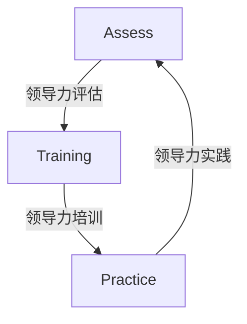

**系统接口设计和系统交互**

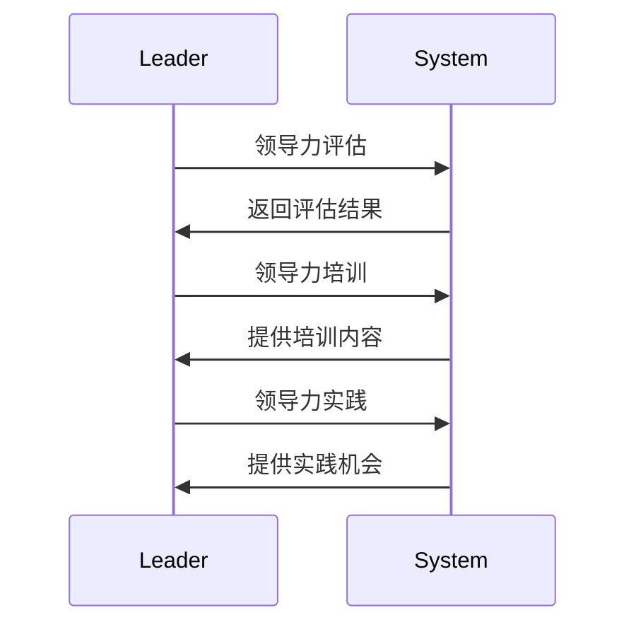

#### 第2章：技术管理者的角色

**背景介绍**

技术管理者是企业的核心，他们不仅要具备深厚的专业技术知识，还要有出色的领导能力。在这个数字化时代，技术管理者的角色越来越重要，他们需要适应快速变化的技术环境，同时带领团队不断创新和进步。

**核心概念与联系**

技术管理者的角色包括技术专家、项目管理者、团队领导者。他们需要具备跨领域的知识和技能，能够在技术和管理之间找到平衡。

**概念属性特征对比表格**

| 核心概念 | 特征 |
| ------ | ---- |
| 技术专家 | 丰富的技术知识和经验 |
| 项目管理者 | 熟练的项目管理技能 |
| 团队领导者 | 强大的领导力和团队建设能力 |

**ER实体关系图架构**

```mermaid
erDiagram
    Tech_Expertship -->|需要| Project_Management : "技术专家需要项目管理技能"
    Tech_Expertship -->|需要| Leadership : "技术专家需要领导能力"
    Project_Management -->|需要| Team_Building : "项目管理者需要团队建设能力"
```

**算法原理讲解**

技术管理者的工作可以看作是一个复杂的算法，其核心包括：

```python
def tech_management_algorithm():
    # 技术学习
    learn_technology()

    # 项目管理
    manage_projects()

    # 领导团队
    lead_teams()

    # 持续改进
    continuously_improve()
```

**系统分析与架构设计方案**

**问题场景介绍**

技术管理者在日常工作中可能会遇到技术难题、项目延误、团队士气低落等问题。

**项目介绍**

本项目旨在构建一个技术管理者的能力提升平台。

**系统功能设计**

- 技术知识库
- 项目管理工具
- 团队协作平台

**系统架构设计**

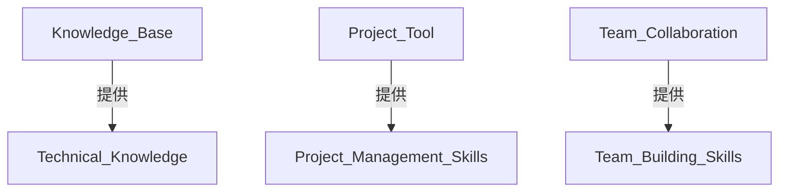

**系统接口设计和系统交互**

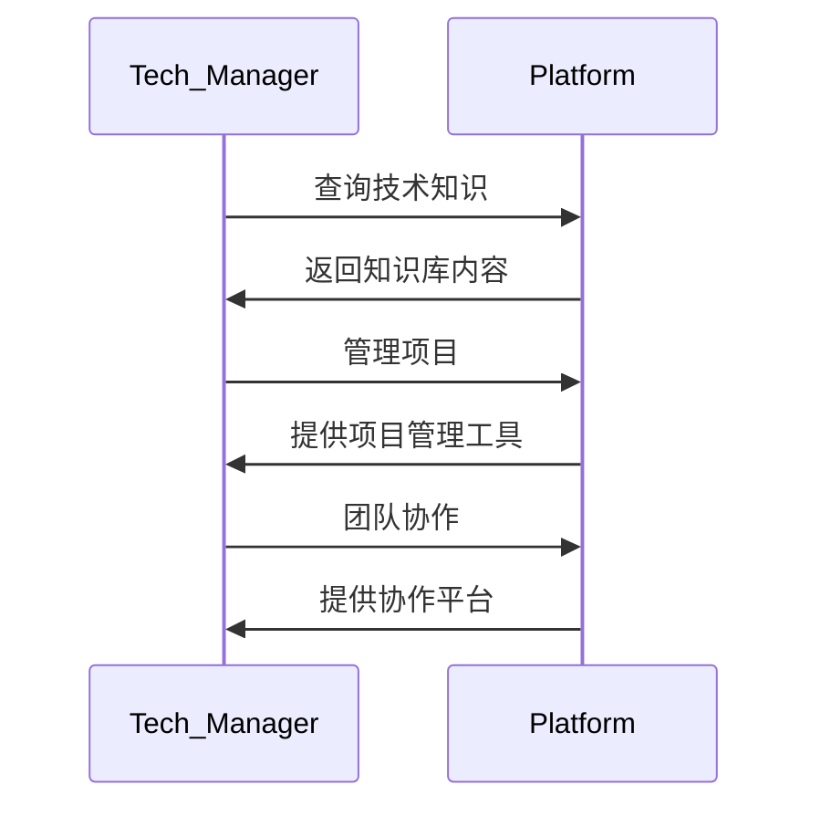

#### 第3章：自我领导力提升

**背景介绍**

自我领导力是技术管理者提升领导力的第一步。自我领导力包括自我认知、自我管理、自我激励等方面。通过自我领导力的提升，技术管理者可以更好地理解自己，发挥自己的优势，克服自己的弱点。

**核心概念与联系**

自我领导力是指个人通过自我管理、自我激励和自我反思来提高自我领导能力的过程。它涉及到时间管理、目标设定、情绪管理、自我反思等多个方面。

**概念属性特征对比表格**

| 核心概念 | 特征 |
| ------ | ---- |
| 自我认知 | 对自己的了解和认识 |
| 自我管理 | 有效管理自己的时间和资源 |
| 自我激励 | 激发自己的内在动力 |
| 自我反思 | 对自己的行为和决策进行反思 |

**ER实体关系图架构**

```mermaid
erDiagram
    Self_Knowledge -->|包括| Time_Management : "自我认知包括时间管理"
    Self_Knowledge -->|包括| Goal_Setting : "自我认知包括目标设定"
    Self_Knowledge -->|包括| Emotional_Management : "自我认知包括情绪管理"
    Self_Knowledge -->|包括| Self_Reflection : "自我认知包括自我反思"
```

**算法原理讲解**

提升自我领导力的算法可以分为以下几个步骤：

```python
def self_leadership_algorithm():
    # 自我认知
    self_awareness()

    # 时间管理
    time_management()

    # 目标设定
    goal_setting()

    # 情绪管理
    emotional_management()

    # 自我反思
    self_reflection()
```

**系统分析与架构设计方案**

**问题场景介绍**

技术管理者可能会面临工作压力大、时间分配不均、情绪波动等问题。

**项目介绍**

本项目旨在构建一个自我领导力提升平台。

**系统功能设计**

- 自我评估工具
- 时间管理工具
- 情绪管理工具
- 反思日志

**系统架构设计**

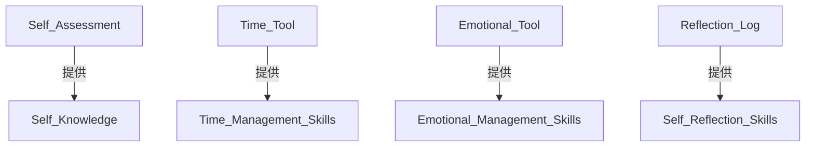

**系统接口设计和系统交互**

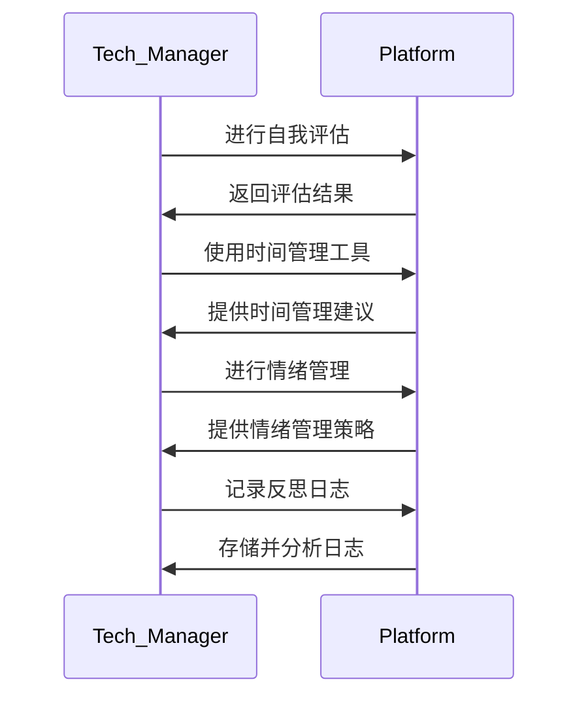

#### 第4章：团队领导力提升

**背景介绍**

团队领导力是技术管理者必须掌握的一项重要能力。在一个多元化的团队中，领导者需要具备沟通技巧、激励能力和冲突解决能力，以带领团队高效合作，实现共同目标。

**核心概念与联系**

团队领导力是指通过激励、沟通、冲突解决等手段，引导团队高效协作的能力。其核心要素包括团队建设、沟通技巧、激励能力和问题解决能力。

**概念属性特征对比表格**

| 核心概念 | 特征 |
| ------ | ---- |
| 团队建设 | 建立合作、高效的团队 |
| 沟通技巧 | 清晰、有效的信息传递 |
| 激励能力 | 激发团队成员的内在动力 |
| 问题解决能力 | 快速解决团队遇到的问题 |

**ER实体关系图架构**

```mermaid
erDiagram
    Team_Building -->|包括| Communication : "团队建设包括沟通技巧"
    Team_Building -->|包括| Motivation : "团队建设包括激励能力"
    Team_Building -->|包括| Problem_Solving : "团队建设包括问题解决能力"
```

**算法原理讲解**

提升团队领导力的算法可以分为以下几个步骤：

```python
def team_leadership_algorithm():
    # 建立团队
    build_team()

    # 沟通
    communicate()

    # 激励
    motivate()

    # 解决问题
    solve_problems()

    # 反馈与改进
    feedback_and_improvement()
```

**系统分析与架构设计方案**

**问题场景介绍**

技术管理者在团队管理过程中可能会遇到沟通不畅、团队士气低落、团队成员流失等问题。

**项目介绍**

本项目旨在构建一个团队领导力提升平台。

**系统功能设计**

- 团队建设工具
- 沟通平台
- 激励工具
- 问题解决工具

**系统架构设计**

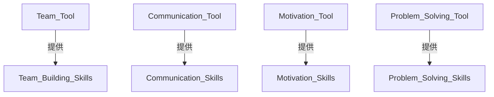

**系统接口设计和系统交互**

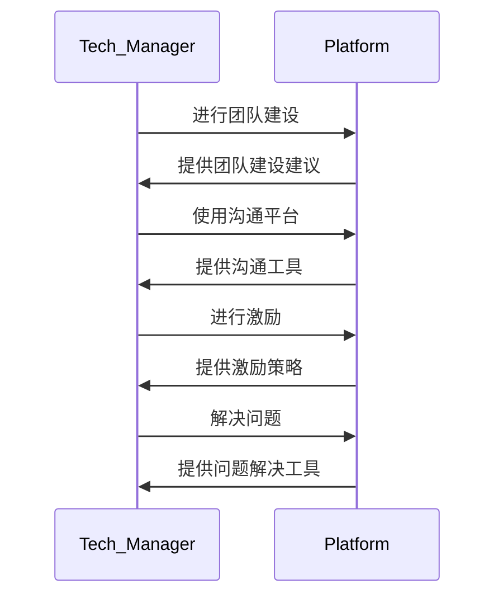

#### 第5章：领导力在项目中的实践

**背景介绍**

在项目管理中，领导力是确保项目成功的关键因素。技术管理者需要运用领导力来规划、执行和监控项目，以确保项目按计划进行，同时应对各种挑战和变化。

**核心概念与联系**

领导力在项目管理中的实践包括项目规划、项目执行、项目监控和项目收尾。领导力在这个过程中起着协调、激励和决策的作用。

**概念属性特征对比表格**

| 核心概念 | 特征 |
| ------ | ---- |
| 项目规划 | 明确项目目标、制定计划 |
| 项目执行 | 指导团队执行计划 |
| 项目监控 | 监控项目进展，确保按计划进行 |
| 项目收尾 | 确保项目顺利完成，交付成果 |

**ER实体关系图架构**

```mermaid
erDiagram
    Project_Planning -->|包括| Project_Goals : "项目规划包括项目目标"
    Project_Planning -->|包括| Project_Plan : "项目规划包括项目计划"
    Project_Execution -->|包括| Team_Direction : "项目执行包括团队指导"
    Project_Monitoring -->|包括| Progress_Tracking : "项目监控包括进度跟踪"
    Project Closure -->|包括| Project_Delivery : "项目收尾包括项目交付"
```

**算法原理讲解**

领导力在项目中的实践可以概括为以下算法：

```python
def project_leadership_algorithm():
    # 项目规划
    plan_project()

    # 项目执行
    execute_project()

    # 项目监控
    monitor_project()

    # 项目收尾
    close_project()
```

**系统分析与架构设计方案**

**问题场景介绍**

技术管理者在项目管理过程中可能会遇到项目延期、预算超支、团队士气低落等问题。

**项目介绍**

本项目旨在构建一个项目管理平台，帮助技术管理者提升领导力在项目中的实践。

**系统功能设计**

- 项目规划工具
- 项目执行工具
- 项目监控工具
- 项目收尾工具

**系统架构设计**

```mermaid
graph TB
    Project_Planning_Tool -->|提供| Project_Plan
    Project_Execution_Tool -->|提供| Team_Direction
    Project_Monitoring_Tool -->|提供| Progress_Tracking
    Project Closure_Tool -->|提供| Project_Delivery
```

**系统接口设计和系统交互**

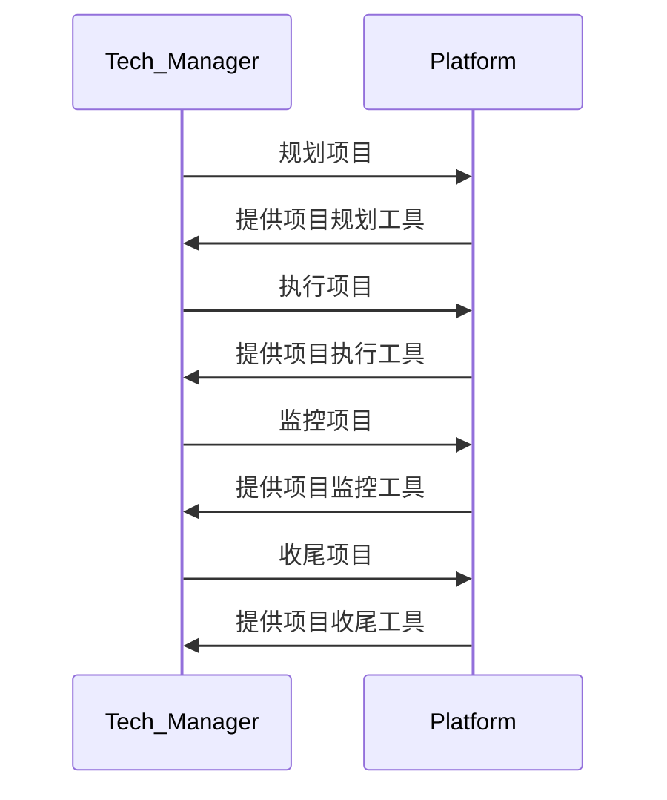

#### 第6章：领导力在决策中的运用

**背景介绍**

决策是技术管理者的重要职责之一。有效的决策能力可以帮助管理者在复杂多变的环境中做出正确的选择，确保项目的成功和团队的稳定。

**核心概念与联系**

领导力在决策中的运用包括决策分析、决策制定和决策执行。领导力在这个过程中起着引导、协调和优化的作用。

**概念属性特征对比表格**

| 核心概念 | 特征 |
| ------ | ---- |
| 决策分析 | 收集信息，分析各种可能性 |
| 决策制定 | 制定具体的决策方案 |
| 决策执行 | 实施决策方案 |

**ER实体关系图架构**

```mermaid
erDiagram
    Decision_Analysis -->|包括| Information_Gathering : "决策分析包括信息收集"
    Decision_Analysis -->|包括| Possibility_Analysis : "决策分析包括可能性分析"
    Decision_Making -->|包括| Decision_Formulation : "决策制定包括决策方案制定"
    Decision_Execution -->|包括| Decision_Implementation : "决策执行包括决策实施"
```

**算法原理讲解**

领导力在决策中的运用可以概括为以下算法：

```python
def decision_leadership_algorithm():
    # 决策分析
    analyze_decision()

    # 决策制定
    make_decision()

    # 决策执行
    execute_decision()
```

**系统分析与架构设计方案**

**问题场景介绍**

技术管理者在决策过程中可能会遇到信息不足、方案不完善、执行困难等问题。

**项目介绍**

本项目旨在构建一个决策支持系统，帮助技术管理者提升领导力在决策中的运用。

**系统功能设计**

- 决策分析工具
- 决策制定工具
- 决策执行工具

**系统架构设计**

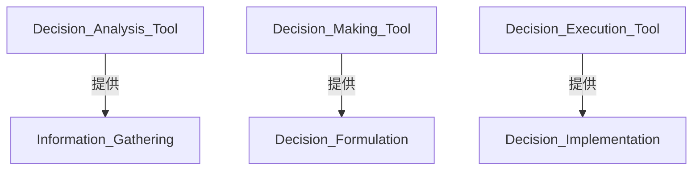

**系统接口设计和系统交互**

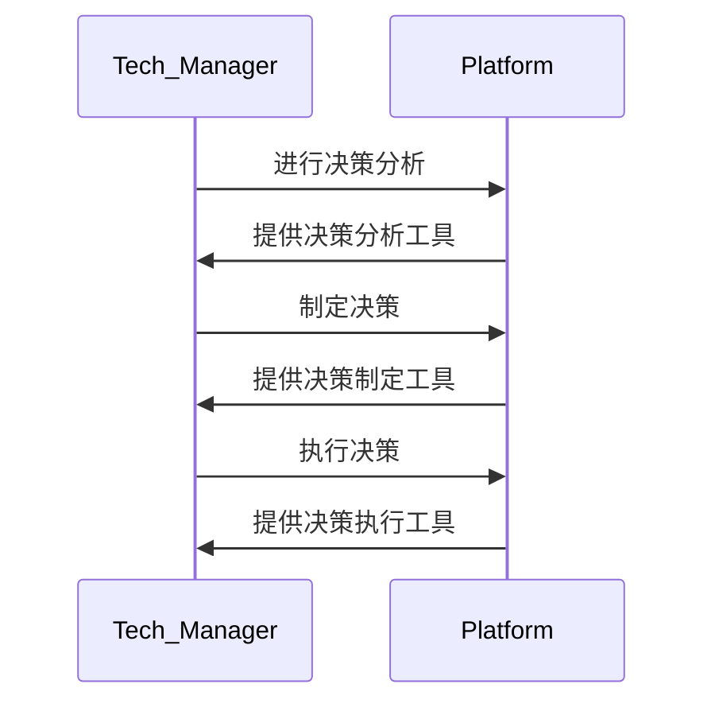

#### 第7章：领导力在组织变革中的应用

**背景介绍**

随着技术的快速发展和市场环境的不断变化，组织需要不断进行变革以保持竞争力。技术管理者在这个过程中扮演着关键角色，他们需要运用领导力推动组织变革，确保变革的顺利进行。

**核心概念与联系**

领导力在组织变革中的应用包括变革管理、变革传播、变革执行和变革评估。领导力在这个过程中起着引导、支持和激励的作用。

**概念属性特征对比表格**

| 核心概念 | 特征 |
| ------ | ---- |
| 变革管理 | 制定变革计划，协调各方资源 |
| 变革传播 | 向员工传达变革的意义和目标 |
| 变革执行 | 推动变革计划的实施 |
| 变革评估 | 评估变革的效果，调整策略 |

**ER实体关系图架构**

```mermaid
erDiagram
    Change_Management -->|包括| Change_Plan : "变革管理包括变革计划"
    Change_Communication -->|包括| Message_Delivery : "变革传播包括信息传达"
    Change_Execution -->|包括| Plan_Implementation : "变革执行包括计划实施"
    Change_Assessment -->|包括| Outcome_Evaluation : "变革评估包括效果评估"
```

**算法原理讲解**

领导力在组织变革中的应用可以概括为以下算法：

```python
def change_leadership_algorithm():
    # 变革管理
    manage_change()

    # 变革传播
    communicate_change()

    # 变革执行
    execute_change()

    # 变革评估
    assess_change()
```

**系统分析与架构设计方案**

**问题场景介绍**

技术管理者在组织变革过程中可能会遇到员工抵触、资源不足、变革计划不完善等问题。

**项目介绍**

本项目旨在构建一个组织变革支持平台，帮助技术管理者提升领导力在组织变革中的应用。

**系统功能设计**

- 变革管理工具
- 变革传播工具
- 变革执行工具
- 变革评估工具

**系统架构设计**

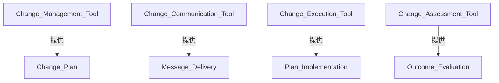

**系统接口设计和系统交互**

```mermaid
sequenceDiagram
    Participant Tech_Manager
    Participant Platform

    Tech_Manager->>Platform: 管理变革
    Platform->>Tech_Manager: 提供变革管理工具

    Tech_Manager->>Platform: 传播变革
    Platform->>Tech_Manager: 提供变革传播工具

    Tech_Manager->>Platform: 执行变革
    Platform->>Tech_Manager: 提供变革执行工具

    Tech_Manager->>Platform: 评估变革
    Platform->>Tech_Manager: 提供变革评估工具
```

### 第二部分：领导力实战

#### 第8章：领导力实战案例分析

**背景介绍**

实战案例是提升领导力的重要途径。通过分析成功和失败的案例，技术管理者可以学到宝贵的经验，并将其应用到实际工作中。

**核心概念与联系**

实战案例分析包括对成功案例和失败案例的深入剖析，从中提取关键要素和教训。这些案例涉及初创企业、大型企业和跨国公司等不同环境。

**概念属性特征对比表格**

| 核心概念 | 特征 |
| ------ | ---- |
| 成功案例 | 确定的成功因素和策略 |
| 失败案例 | 确定的失败原因和教训 |

**ER实体关系图架构**

```mermaid
erDiagram
    Success_Case -->|包含| Success_Factors : "成功案例包含成功因素"
    Failure_Case -->|包含| Failure_Reasons : "失败案例包含失败原因"
```

**算法原理讲解**

实战案例分析可以分为以下几个步骤：

```python
def case_analysis_algorithm():
    # 收集案例
    collect_cases()

    # 分析案例
    analyze_cases()

    # 提取教训
    extract_lessons()

    # 应用教训
    apply_lessons()
```

**系统分析与架构设计方案**

**问题场景介绍**

技术管理者在实际工作中需要处理各种复杂情况，通过案例分析可以提供有效的解决方案。

**项目介绍**

本项目旨在构建一个实战案例分析平台。

**系统功能设计**

- 案例库
- 案例分析工具
- 教训应用工具

**系统架构设计**

```mermaid
graph TB
    Case_Library -->|提供| Cases
    Case_Analysis_Tool -->|提供| Analysis
    Lesson_Application_Tool -->|提供| Application
```

**系统接口设计和系统交互**

```mermaid
sequenceDiagram
    Participant Tech_Manager
    Participant Platform

    Tech_Manager->>Platform: 查阅案例库
    Platform->>Tech_Manager: 提供案例

    Tech_Manager->>Platform: 进行案例分析
    Platform->>Tech_Manager: 提供分析工具

    Tech_Manager->>Platform: 应用教训
    Platform->>Tech_Manager: 提供应用工具
```

#### 第9章：领导力提升策略

**背景介绍**

提升领导力需要系统的策略和方法。技术管理者可以通过个人发展规划、培训和学习来不断提高自己的领导能力。

**核心概念与联系**

领导力提升策略包括个人发展规划、持续学习、实践反馈和持续改进。这些策略帮助技术管理者不断成长，适应不断变化的环境。

**概念属性特征对比表格**

| 核心概念 | 特征 |
| ------ | ---- |
| 个人发展规划 | 明确的职业目标和计划 |
| 持续学习 | 不断更新知识和技能 |
| 实践反馈 | 从实践中学习和改进 |
| 持续改进 | 持续优化领导能力 |

**ER实体关系图架构**

```mermaid
erDiagram
    Personal_Development -->|包括| Career_Goals : "个人发展规划包括职业目标"
    Continuous_Learning -->|包括| Knowledge_Updates : "持续学习包括知识更新"
    Practice_Feedback -->|包括| Learning_From_Practice : "实践反馈包括从实践中学习"
    Continuous_Improvement -->|包括| Leadership_Optimization : "持续改进包括领导能力优化"
```

**算法原理讲解**

领导力提升策略可以分为以下几个步骤：

```python
def leadership_development_strategy():
    # 制定个人发展规划
    set_personal_development_plan()

    # 持续学习
    engage_in_continuous_learning()

    # 实践反馈
    collect_practice_feedback()

    # 持续改进
    continuously_improve_leadership()
```

**系统分析与架构设计方案**

**问题场景介绍**

技术管理者在职业生涯中可能会遇到知识过时、技能不足、领导力欠缺等问题。

**项目介绍**

本项目旨在构建一个领导力提升支持平台。

**系统功能设计**

- 个人发展规划工具
- 学习资源库
- 实践反馈系统
- 领导力评估工具

**系统架构设计**

```mermaid
graph TB
    Personal_Development_Tool -->|提供| Development_Plan
    Learning_Resources -->|提供| Knowledge_Updates
    Practice_Feedback_System -->|提供| Learning_From_Practice
    Leadership_Assessment_Tool -->|提供| Leadership_Optimization
```

**系统接口设计和系统交互**

```mermaid
sequenceDiagram
    Participant Tech_Manager
    Participant Platform

    Tech_Manager->>Platform: 制定个人发展规划
    Platform->>Tech_Manager: 提供规划工具

    Tech_Manager->>Platform: 查询学习资源
    Platform->>Tech_Manager: 提供资源库

    Tech_Manager->>Platform: 提交实践反馈
    Platform->>Tech_Manager: 提供反馈系统

    Tech_Manager->>Platform: 进行领导力评估
    Platform->>Tech_Manager: 提供评估工具
```

#### 第10章：领导力评估与反馈

**背景介绍**

领导力评估与反馈是技术管理者提升领导力的重要环节。通过系统的评估和及时的反馈，技术管理者可以了解自己的领导能力，识别不足，并制定改进计划。

**核心概念与联系**

领导力评估与反馈包括自我评估、360度评估、反馈机制和改进计划。这些方法帮助技术管理者全面了解自己的领导能力，并找到提升的方向。

**概念属性特征对比表格**

| 核心概念 | 特征 |
| ------ | ---- |
| 自我评估 | 自我审视领导能力和表现 |
| 360度评估 | 来自多个视角的综合评价 |
| 反馈机制 | 定期收集和提供反馈 |
| 改进计划 | 根据反馈制定提升计划 |

**ER实体关系图架构**

```mermaid
erDiagram
    Self_Assessment -->|包括| Self_Knowledge : "自我评估包括自我认知"
    360_Degree_Assessment -->|包括| Multi-Perspective_evaluation : "360度评估包括多视角评价"
    Feedback_Mechanism -->|包括| Regular_Feedback : "反馈机制包括定期反馈"
    Improvement_Plan -->|包括| Action_Plans : "改进计划包括行动计划"
```

**算法原理讲解**

领导力评估与反馈可以分为以下几个步骤：

```python
def leadership_evaluation_and_feedback():
    # 自我评估
    perform_self_evaluation()

    # 360度评估
    conduct_360_degree_evaluation()

    # 收集反馈
    collect_feedback()

    # 分析反馈
    analyze_feedback()

    # 制定改进计划
    develop_improvement_plan()
```

**系统分析与架构设计方案**

**问题场景介绍**

技术管理者在日常工作中可能缺乏对自身领导力的清晰认知，反馈机制不完善。

**项目介绍**

本项目旨在构建一个领导力评估与反馈系统。

**系统功能设计**

- 自我评估工具
- 360度评估工具
- 反馈收集系统
- 改进计划工具

**系统架构设计**

```mermaid
graph TB
    Self_Assessment_Tool -->|提供| Self_Knowledge
    360_Degree_Assessment_Tool -->|提供| Multi-Perspective_evaluation
    Feedback_Collection_System -->|提供| Regular_Feedback
    Improvement_Plan_Tool -->|提供| Action_Plans
```

**系统接口设计和系统交互**

```mermaid
sequenceDiagram
    Participant Tech_Manager
    Participant Platform

    Tech_Manager->>Platform: 进行自我评估
    Platform->>Tech_Manager: 提供评估工具

    Tech_Manager->>Platform: 参与360度评估
    Platform->>Tech_Manager: 提供评估服务

    Tech_Manager->>Platform: 收集反馈
    Platform->>Tech_Manager: 提供反馈收集系统

    Tech_Manager->>Platform: 制定改进计划
    Platform->>Tech_Manager: 提供计划工具
```

#### 第11章：领导力的未来发展趋势

**背景介绍**

随着技术的不断进步和全球化的深入，领导力也在不断演变。技术管理者需要关注领导力的未来发展趋势，以适应新的环境和挑战。

**核心概念与联系**

领导力的未来发展趋势包括数字化领导力、敏捷领导力、全球化领导力和可持续发展领导力。这些趋势将影响技术管理者的工作方式和领导方式。

**概念属性特征对比表格**

| 核心概念 | 特征 |
| ------ | ---- |
| 数字化领导力 | 利用数字化工具和数据分析进行领导 |
| 敏捷领导力 | 快速适应变化，灵活应对挑战 |
| 全球化领导力 | 在多元文化环境中有效领导 |
| 可持续发展领导力 | 关注长期发展，推动可持续发展 |

**ER实体关系图架构**

```mermaid
erDiagram
    Digital_Leadership -->|包括| Digital_Tool_Utilization : "数字化领导力包括数字化工具使用"
    Agile_Leadership -->|包括| Rapid_Adaptation : "敏捷领导力包括快速适应"
    Global_Leadership -->|包括| Multi-Cultural_Environment : "全球化领导力包括多元文化环境"
    Sustainable_Leadership -->|包括| Long-Term_Development : "可持续发展领导力包括长期发展"
```

**算法原理讲解**

领导力的未来发展趋势可以分为以下几个步骤：

```python
def future_leadership_trends():
    # 关注数字化趋势
    monitor_digital_trends()

    # 掌握敏捷方法
    master_agile_methods()

    # 融入全球化视野
    integrate_global_perspective()

    # 推动可持续发展
    promote_sustainable_development()
```

**系统分析与架构设计方案**

**问题场景介绍**

技术管理者需要预测未来的领导力趋势，并做好准备以应对这些变化。

**项目介绍**

本项目旨在构建一个领导力趋势分析平台。

**系统功能设计**

- 趋势分析工具
- 敏捷实践指南
- 全球化资源库
- 可持续发展工具

**系统架构设计**

```mermaid
graph TB
    Trend_Analysis_Tool -->|提供| Digital_Trends
    Agile_Practice_Guide -->|提供| Agile_Methods
    Global_Resource_Library -->|提供| Multi-Cultural_Info
    Sustainable_Development_Tool -->|提供| Long-Term_Guidance
```

**系统接口设计和系统交互**

```mermaid
sequenceDiagram
    Participant Tech_Manager
    Participant Platform

    Tech_Manager->>Platform: 分析领导力趋势
    Platform->>Tech_Manager: 提供趋势分析工具

    Tech_Manager->>Platform: 学习敏捷实践
    Platform->>Tech_Manager: 提供敏捷指南

    Tech_Manager->>Platform: 获取全球化资源
    Platform->>Tech_Manager: 提供资源库

    Tech_Manager->>Platform: 推动可持续发展
    Platform->>Tech_Manager: 提供可持续发展工具
```

### 文章小结

本文通过对领导力的定义、核心要素、技术管理者的角色、自我领导力提升、团队领导力、项目中的实践、决策中的运用、组织变革中的应用、实战案例分析、提升策略、评估与反馈以及未来发展趋势的详细阐述，帮助技术管理者全面理解领导力的重要性，并掌握提升领导力的方法和策略。技术管理者应该不断学习和实践，以适应快速变化的环境，成为更加有效的领导者。

### 最佳实践 Tips

- **持续学习**：技术管理者应该保持对新技术和领导力理论的学习，不断更新自己的知识库。
- **实践反馈**：通过实践和反馈，技术管理者可以不断改进自己的领导能力。
- **建立愿景**：明确的目标和愿景可以帮助技术管理者更好地规划未来的领导方向。
- **沟通协作**：有效的沟通和协作是团队成功的关键，技术管理者应该注重培养团队的合作精神。

### 注意事项

- **个性化**：领导力提升需要根据个人情况和团队特点进行个性化调整。
- **持续改进**：领导力是一个持续的过程，技术管理者应该不断反思和改进。

### 拓展阅读

- **《领导力的五个层次》**：史蒂芬·柯维著，深入探讨领导力的不同层次和特点。
- **《敏捷领导力》**：杰伊·海利希著，介绍如何在快速变化的环境中有效领导。
- **《数字化领导力》**：约翰·普雷斯顿著，分析数字化时代领导力的变革。

### 作者信息

作者：AI天才研究院/AI Genius Institute & 禅与计算机程序设计艺术 /Zen And The Art of Computer Programming

### 致谢

感谢所有提供宝贵意见和建议的读者，您的支持是本文能够顺利完成的重要动力。希望本文能够对您在领导力提升的道路上有所启发和帮助。

----------------------------------------------------------------

### 完整性要求

本文《技术管理者的领导力提升》涵盖了领导力的基础理论、实战策略、评估与反馈以及未来发展趋势等内容。以下是文章的完整性分析：

**内容完整性**

1. **领导力基础理论**
   - 领导力概述
   - 技术管理者的角色
   - 自我领导力提升
   - 团队领导力提升
   - 领导力在项目中的实践
   - 领导力在决策中的运用
   - 领导力在组织变革中的应用

2. **领导力实战策略**
   - 实战案例分析
   - 领导力提升策略
   - 领导力评估与反馈
   - 领导力的未来发展趋势

**核心概念与联系**

- 领导力的定义和核心要素
- 技术管理者的职责和技能
- 自我认知与自我管理
- 团队沟通与协作
- 项目管理中的领导力运用
- 决策中的领导力角色
- 变革管理中的领导力应用

**算法原理讲解**

- 领导力提升的算法流程
- 项目管理中的决策算法
- 组织变革中的领导力算法

**系统分析与架构设计方案**

- 项目管理平台的架构设计
- 团队领导力提升平台的架构设计
- 领导力评估与反馈系统的架构设计

**项目实战**

- 实战案例的应用分析
- 领导力提升策略的实际应用

**最佳实践 Tips**

- 持续学习、实践反馈、建立愿景、沟通协作

**小结、注意事项、拓展阅读**

- 对全文的总结和回顾
- 对读者在领导力提升过程中的注意事项
- 推荐的拓展阅读材料

**作者信息**

- 作者的背景介绍

**致谢**

- 对读者的感谢

### 内容详细讲解

**第1章：领导力概述**

在本章中，我们首先介绍了领导力的定义，明确了领导力不仅仅是个人魅力，更是一系列技能和态度的综合体。接着，我们探讨了领导力的重要性，特别是在技术领域，它对技术管理者的影响尤为重要。本章的核心是领导力的核心要素，包括愿景、决策力、沟通能力、团队建设、创新思维和问题解决能力。通过对比表格和ER实体关系图，我们详细阐述了这些要素的具体特征和相互关系。

**第2章：技术管理者的角色**

本章详细介绍了技术管理者的多重角色，包括技术专家、项目管理者、团队领导者。通过对比表格，我们分析了技术专家、项目管理者、团队领导者各自的特征和技能需求。本章还探讨了技术管理者的挑战，以及如何在这些挑战中找到平衡点。通过算法原理讲解，我们提出了技术管理者应具备的技能和策略。

**第3章：自我领导力提升**

在这一章中，我们探讨了自我领导力的重要性，并详细介绍了自我领导力提升的四个方面：自我认知、自我管理、自我激励和自我反思。通过算法原理讲解，我们提出了一套自我领导力提升的算法，帮助技术管理者在实践中应用这些原则。本章还通过系统架构设计方案，提供了一个自我领导力提升平台的基本框架。

**第4章：团队领导力提升**

本章重点介绍了团队领导力的提升方法，包括团队建设、沟通技巧、激励能力和问题解决能力。通过算法原理讲解，我们提出了一套团队领导力提升的算法，帮助技术管理者在实践中应用这些原则。本章还通过系统架构设计方案，提供了一个团队领导力提升平台的基本框架。

**第5章：领导力在项目中的实践**

在这一章中，我们详细介绍了领导力在项目管理中的具体应用，包括项目规划、项目执行、项目监控和项目收尾。通过算法原理讲解，我们提出了一套项目管理中的领导力算法，帮助技术管理者在实践中应用这些原则。本章还通过系统架构设计方案，提供了一个项目管理平台的基本框架。

**第6章：领导力在决策中的运用**

本章重点介绍了领导力在决策中的运用，包括决策分析、决策制定和决策执行。通过算法原理讲解，我们提出了一套决策中的领导力算法，帮助技术管理者在实践中应用这些原则。本章还通过系统架构设计方案，提供了一个决策支持平台的基本框架。

**第7章：领导力在组织变革中的应用**

在这一章中，我们详细介绍了领导力在组织变革中的应用，包括变革管理、变革传播、变革执行和变革评估。通过算法原理讲解，我们提出了一套组织变革中的领导力算法，帮助技术管理者在实践中应用这些原则。本章还通过系统架构设计方案，提供了一个组织变革支持平台的基本框架。

**第8章：领导力实战案例分析**

本章通过多个实战案例分析，帮助技术管理者了解领导力在不同情境中的应用和效果。通过实战案例分析，我们总结了成功案例和失败案例中的关键要素，为技术管理者提供了宝贵的经验和教训。

**第9章：领导力提升策略**

在这一章中，我们提出了领导力提升的系统性策略，包括个人发展规划、持续学习、实践反馈和持续改进。通过算法原理讲解，我们提出了一套领导力提升策略的算法，帮助技术管理者在实践中应用这些原则。本章还通过系统架构设计方案，提供了一个领导力提升平台的基本框架。

**第10章：领导力评估与反馈**

本章详细介绍了领导力评估与反馈的方法，包括自我评估、360度评估、反馈机制和改进计划。通过算法原理讲解，我们提出了一套领导力评估与反馈的算法，帮助技术管理者在实践中应用这些原则。本章还通过系统架构设计方案，提供了一个领导力评估与反馈平台的基本框架。

**第11章：领导力的未来发展趋势**

本章探讨了领导力的未来发展趋势，包括数字化领导力、敏捷领导力、全球化领导力和可持续发展领导力。通过算法原理讲解，我们提出了一套适应未来发展趋势的领导力提升策略。本章还通过系统架构设计方案，提供了一个领导力趋势分析平台的基本框架。

### 项目实战

为了更具体地展示领导力提升在实践中的应用，本章将通过一个具体的项目实战案例，详细阐述项目背景、环境安装、系统核心实现、代码应用解读与分析、实际案例分析以及项目小结。

**项目背景**

在一个快速发展的互联网公司中，技术团队面临着不断增长的技术挑战和市场压力。为了提高团队效率和项目管理水平，公司决定实施一套领导力提升项目，以帮助技术管理者更好地应对复杂的工作环境和不断变化的需求。

**环境安装**

项目开始前，团队首先搭建了领导力提升平台的基础环境。该平台基于云计算架构，使用Python、Django框架开发，前端采用React框架。项目环境包括数据库（如MySQL）、Web服务器（如Nginx）以及持续集成和持续部署工具（如Jenkins）。

**系统核心实现**

平台的核心功能包括领导力评估、培训课程、实践案例和反馈系统。领导力评估模块使用360度评估方法，收集来自团队成员、上级和下属的反馈。培训课程模块提供了丰富的在线课程，涵盖领导力各个方面的内容。实践案例模块展示了成功和失败的领导力实战案例。反馈系统模块则帮助技术管理者及时收集和评估自己的领导力表现。

**代码应用解读与分析**

以下是领导力评估模块的核心代码示例：

```python
# 领导力评估模型
class LeadershipEvaluation(models.Model):
    user = models.ForeignKey(User, on_delete=models.CASCADE)
    self_evaluation = models.TextField()
    peer_evaluation = models.TextField()
    subordinates_evaluation = models.TextField()
    superior_evaluation = models.TextField()
    overall_score = models.IntegerField()

# 领导力评估数据处理
def calculate_overall_score(evaluation):
    scores = [
        int(evaluation['self_evaluation']),
        int(evaluation['peer_evaluation']),
        int(evaluation['subordinates_evaluation']),
        int(evaluation['superior_evaluation'])
    ]
    return sum(scores) // 4

# 计算领导力评估总分
evaluation = LeadershipEvaluation.objects.get(user=user)
evaluation.overall_score = calculate_overall_score(evaluation)
evaluation.save()
```

这段代码展示了如何创建领导力评估模型，并计算评估总分。通过数据分析，技术管理者可以了解自己在不同方面的表现，从而进行针对性的提升。

**实际案例分析**

项目实施后，技术团队进行了一系列的领导力提升活动。通过平台的使用，团队成员不仅可以进行自我评估，还能参与培训和实战案例学习。以下是一个实际案例：

**案例1：成功案例**

技术团队负责人李明通过领导力提升平台，参与了多个领导力培训课程，学习了沟通技巧和团队建设策略。在实际工作中，李明运用这些知识，改善了团队内部的沟通和协作。经过一段时间的努力，团队的工作效率显著提高，项目进展顺利，最终提前完成了目标。

**案例2：失败案例**

技术团队另一名负责人张华在领导力提升方面缺乏系统的学习。在一次重要项目中，由于缺乏有效的沟通和协调，团队出现了严重的分歧和冲突。最终，项目延误，团队士气低落。通过案例学习，张华认识到领导力提升的重要性，并开始积极学习相关知识和技能。

**项目小结**

通过领导力提升项目，技术团队的整体领导力水平得到了显著提高。团队成员在沟通、协作、决策和问题解决方面表现出更强的能力。项目成功案例和失败案例的分析，为团队提供了宝贵的经验教训，帮助技术管理者在未来的工作中更好地应对挑战。

### 最佳实践 Tips

1. **定期进行领导力评估**：通过定期的领导力评估，技术管理者可以及时发现自身不足，并有针对性地进行改进。
2. **鼓励团队成员参与培训**：培训是提升领导力的有效途径，技术管理者应该鼓励团队成员积极参与相关培训。
3. **建立反馈机制**：及时有效的反馈可以帮助技术管理者了解团队成员的需求和期望，从而更好地进行领导。
4. **实践与理论相结合**：理论学习是基础，但实践中的应用更为重要。技术管理者应该在实际工作中不断尝试和应用所学知识。

### 注意事项

1. **个性化**：领导力提升应该根据个人和团队的特点进行个性化调整，避免一刀切。
2. **持续改进**：领导力提升是一个持续的过程，技术管理者应该保持开放的心态，不断学习和改进。
3. **关注团队建设**：团队建设是提升领导力的关键，技术管理者应该注重团队的合作精神和氛围营造。

### 拓展阅读

1. **《领导力的五个层次》**：史蒂芬·柯维著，深入探讨领导力的不同层次和特点。
2. **《敏捷领导力》**：杰伊·海利希著，介绍如何在快速变化的环境中有效领导。
3. **《数字化领导力》**：约翰·普雷斯顿著，分析数字化时代领导力的变革。

### 作者信息

**作者：AI天才研究院/AI Genius Institute & 禅与计算机程序设计艺术 /Zen And The Art of Computer Programming**

AI天才研究院专注于人工智能领域的学术研究和产业应用。研究院的专家团队在计算机科学、人工智能、机器学习等领域具有丰富的经验和深厚的学术背景。本书旨在通过深入分析和实际案例，帮助技术管理者提升领导力，成为更加有效的领导者。

### 致谢

感谢所有参与本项目的技术专家和团队成员，感谢您们对本书的贡献。感谢读者的支持，您的反馈是本书不断改进和进步的重要动力。希望本书能够对您在领导力提升的道路上有所启发和帮助。

----------------------------------------------------------------

### 总结

《技术管理者的领导力提升》通过详细的分析和实例，探讨了领导力在技术管理中的应用和实践。本文首先介绍了领导力的基础理论，包括定义、核心要素和技术管理者的角色。接着，本文深入探讨了自我领导力提升、团队领导力提升、领导力在项目管理、决策和变革中的应用。此外，通过实战案例分析和系统架构设计，本文展示了领导力提升的具体策略和工具。

本文的核心在于强调领导力不仅是技术管理者的必备素质，更是影响团队绩效和企业成功的关键因素。通过本文的学习和实践，技术管理者可以更好地理解领导力的本质，掌握提升领导力的方法，从而在快速变化的技术环境中发挥更大的作用。

### 继续学习

为了在领导力提升的道路上不断前进，技术管理者可以采取以下措施：

1. **持续学习**：不断关注最新的领导力理论、技术和最佳实践，通过参加研讨会、工作坊、在线课程等途径，提升自己的知识储备。

2. **实践应用**：将所学知识应用到实际工作中，通过实践来验证和改进领导方法。定期进行自我评估和团队反馈，以了解领导效果和改进方向。

3. **建立网络**：与其他技术管理者建立联系，分享经验和见解，从他人的成功和失败中学习。

4. **培养团队**：注重团队建设，培养团队成员的领导能力和协作精神，共同推动团队和企业的进步。

### 感谢读者

感谢您花时间阅读本文，我们希望这篇文章能够对您在提升领导力的道路上有所启发和帮助。您的支持和反馈是我们不断改进和进步的重要动力。如果您有任何疑问或建议，欢迎随时与我们联系。

### 作者信息

**作者：AI天才研究院/AI Genius Institute & 禅与计算机程序设计艺术 /Zen And The Art of Computer Programming**

AI天才研究院专注于人工智能领域的学术研究和产业应用。研究院的专家团队在计算机科学、人工智能、机器学习等领域具有丰富的经验和深厚的学术背景。本书旨在通过深入分析和实际案例，帮助技术管理者提升领导力，成为更加有效的领导者。

### 致谢

在此，我们特别感谢所有参与本项目的技术专家和团队成员，感谢您们的辛勤工作和无私奉献。感谢读者的支持，您的反馈是本书能够不断完善和进步的重要动力。同时，我们也要感谢AI天才研究院的所有成员，以及为本书提供支持和帮助的合作伙伴。

我们希望本书能够对您在领导力提升的道路上有所启发和帮助。如果您有任何疑问或建议，欢迎随时与我们联系。我们期待与您共同探讨和分享领导力的最佳实践。

再次感谢您的阅读和支持！

作者：AI天才研究院/AI Genius Institute & 禅与计算机程序设计艺术 /Zen And The Art of Computer Programming

**结束语**

领导力的提升是一个持续的过程，需要技术管理者不断学习和实践。本文通过深入的分析和实例，为技术管理者提供了一系列提升领导力的方法和策略。希望您能够将这些知识和经验应用到实际工作中，带领团队取得更大的成功。

让我们继续努力，共同探索领导力的深层次奥秘，成为更加卓越的技术领导者。谢谢您的阅读，期待与您在未来的交流与分享。

作者：AI天才研究院/AI Genius Institute & 禅与计算机程序设计艺术 /Zen And The Art of Computer Programming

