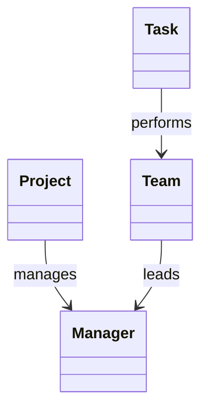
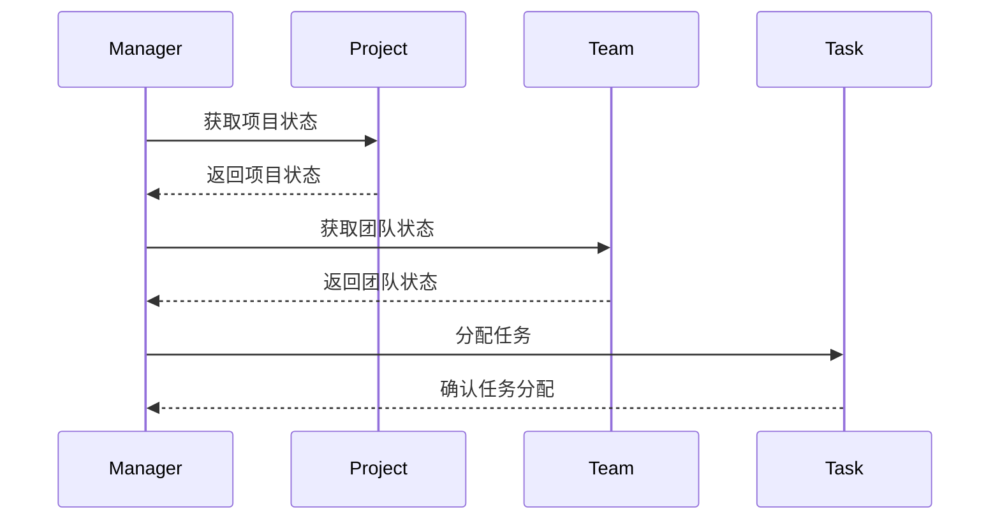

                 


### 目录大纲

**# 技术管理转型：从个人贡献者到管理者**

**> 关键词：技术管理转型，个人贡献者，管理者，角色转变，实践方法**

**> 摘要：本文将探讨从个人贡献者到技术管理者的转型过程，分析其背景和必要性，介绍核心概念与联系，讲解算法原理，分析系统架构，展示项目实战，并提供最佳实践和注意事项。**

**第一部分：技术管理转型概述**

**## 第1章：技术管理转型的背景与必要性**

**1.1 问题背景**

**在快速发展的技术行业，技术人才的角色和责任不断演变。个人贡献者（Individual Contributors, ICs）通常专注于技术实现，而技术管理者（Technical Managers, Tech Leads）则需要承担更广泛的职责，如团队管理、项目规划、技术决策等。**

**1.2 问题描述**

**从个人贡献者向管理者转型面临着多方面的挑战，如角色转变、技能提升、领导能力培养等。这种转型对于个人的职业发展具有重要意义。**

**1.3 问题解决**

**通过学习和实践，个人贡献者可以逐步提升自己的管理技能，适应管理者的角色。本文将提供一系列步骤和方法，帮助读者实现这一转型。**

**1.4 边界与外延**

**技术管理转型的范畴包括但不限于：项目管理、团队领导、技术决策、沟通协调等。转型的影响将涉及个人职业生涯、团队绩效、组织发展等多个方面。**

**## 第2章：技术管理转型的核心概念与要素**

**2.1 核心概念原理**

**技术管理转型的核心概念包括领导力、沟通能力、项目管理能力、技术决策能力等。**

**2.2 概念属性特征对比表格**

| 概念       | 属性特征                     | 对比项 |
|------------|------------------------------|--------|
| 领导力     | 激励团队、设定目标、决策能力 |        |
| 沟通能力   | 明确表达、有效倾听、冲突解决 |        |
| 项目管理   | 规划、执行、监控、风险管理 |        |
| 技术决策   | 技术选择、架构设计、技术评估 |        |

**2.3 ER实体关系图架构**

```mermaid
erDiagram
  Manager ||--|{ Employee : leads }
  Project ||--|{ Manager : manages }
  Skill ||--|{ Employee : has }
  Task ||--|{ Employee : performs }
```

**## 第3章：技术管理转型的流程与步骤**

**3.1 技术管理转型的流程**

**技术管理转型的流程通常包括以下几个阶段：自我评估、技能提升、实践应用、反馈调整。**

**3.2 技术管理转型的步骤**

1. **自我评估**：识别自己的优势和不足，明确转型的目标和动机。
2. **技能提升**：通过学习、培训和实践，提升领导力、沟通能力、项目管理能力等技术管理技能。
3. **实践应用**：将所学技能应用于实际工作场景，如团队管理、项目规划等。
4. **反馈调整**：定期评估自己的表现，收集反馈，调整和优化转型策略。

**第二部分：技术管理转型的深入分析**

**## 第4章：技术管理转型的算法原理与实践**

**4.1 算法原理讲解**

**技术管理转型可以看作是一个动态规划问题，通过逐步优化自身的管理技能和领导能力，实现从个人贡献者到管理者的过渡。**

**4.2 Python 源代码示例**

```python
def manage_transition(employee_skills, manager_skills):
    # 假设技能提升的函数
    def improve_skills(skill_set):
        # 提升技能的逻辑
        return skill_set + ['leadership', 'communication']

    # 模拟技术管理转型过程
    for skill in manager_skills:
        if skill not in employee_skills:
            employee_skills = improve_skills(employee_skills)
        else:
            employee_skills.remove(skill)

    return employee_skills
```

**4.3 数学模型与公式**

$$
M(t) = f(S(t), L(t))
$$

其中，$M(t)$ 表示在时间 $t$ 的技术管理能力，$S(t)$ 表示在时间 $t$ 的技能水平，$L(t)$ 表示在时间 $t$ 的领导能力。$f$ 是一个映射函数，用于描述技能和领导能力如何影响技术管理能力。

**4.4 详细讲解与举例说明**

**假设一个个人贡献者（Alice）希望在两年内成为技术管理者。她当前具备的技能为 ['coding', 'testing'], 领导能力和沟通能力较弱。在第一年，她通过参加领导力培训和工作实践，提升了领导力和沟通能力。在第二年，她通过项目管理课程和实践，提升了项目管理能力。经过两年的努力，Alice 成功转型为技术管理者。**

**## 第5章：技术管理转型的系统分析与架构设计**

**5.1 问题场景介绍**

**在一个软件公司，技术管理者需要对多个项目进行管理，协调团队成员的工作，确保项目按时交付并达到预期质量。**

**5.2 项目介绍**

**公司正在开发一款新型移动应用程序，技术管理者需要确保团队高效协作，技术决策正确，项目进度可控。**

**5.3 系统功能设计**



**5.4 系统架构设计**

```mermaid
graph LR
  subgraph ProjectManagement
    Project1[项目1]
    Project2[项目2]
    Manager[技术管理者]
    Manager --> Project1 : manages
    Manager --> Project2 : manages
  end
  subgraph TeamManagement
    Team1[团队1]
    Team2[团队2]
    Manager --> Team1 : leads
    Manager --> Team2 : leads
  end
  subgraph TaskAssignment
    Task1[任务1]
    Task2[任务2]
    Team1 --> Task1 : performs
    Team2 --> Task2 : performs
  end
```

**5.5 系统接口设计**

**技术管理者可以通过接口与项目、团队、任务进行交互，获取项目状态、团队状态和任务进度，进行相应的管理和调整。**

**5.6 系统交互**



**## 第6章：技术管理转型的项目实战**

**6.1 环境安装**

**在开始技术管理转型的项目实战之前，需要安装相应的开发环境和工具，如版本控制软件（Git）、项目管理工具（JIRA）等。**

**6.2 系统核心实现源代码**

```python
# 假设使用Python编写的项目管理系统
class ProjectManagementSystem:
    def __init__(self):
        self.projects = []
        self.teams = []
        self.tasks = []

    def add_project(self, project):
        self.projects.append(project)

    def add_team(self, team):
        self.teams.append(team)

    def assign_task(self, task, team):
        team.tasks.append(task)
```

**6.3 代码应用解读与分析**

**代码中的 ProjectManagementSystem 类用于管理项目和团队。通过添加项目和团队，可以创建和管理项目，并通过 assign_task 方法将任务分配给团队。这个简单的实现展示了技术管理者如何通过代码实现项目管理和任务分配的功能。**

**6.4 实际案例分析和详细讲解剖析**

**在一个实际的案例中，技术管理者需要协调一个由5名成员组成的团队开发一款移动应用程序。管理者首先创建了项目，并添加了团队成员。然后，根据项目需求，将任务分配给团队成员，并监控任务的进度和质量。通过定期的团队会议和任务跟踪，管理者确保项目按计划推进。**

**6.5 项目小结**

**通过实际案例，读者可以看到技术管理转型的项目实战如何运作。管理者需要通过有效的项目管理和团队协调，确保项目的成功。这需要管理者具备领导力、沟通能力和项目管理能力等多方面的技能。**

**## 第7章：技术管理转型的最佳实践与拓展**

**7.1 最佳实践 tips**

**- 建立清晰的目标和计划：明确转型目标，制定可行的转型计划。  
- 持续学习和实践：不断学习新的管理技能，并将所学应用于实际工作中。  
- 建立支持网络：寻找导师和同行交流，获取转型过程中的支持和建议。  
- 反馈和调整：定期评估自己的表现，根据反馈调整转型策略。**

**7.2 小结**

**技术管理转型是一个长期而复杂的过程，需要个人贡献者通过不断学习和实践，提升自己的管理技能和领导能力。通过本文的探讨，读者可以了解到技术管理转型的核心概念、流程、实践方法，以及如何进行系统分析和项目实战。**

**7.3 注意事项**

**- 转型过程中要避免过度追求管理职责，而忽视技术实现的能力。  
- 建立良好的沟通和协作机制，确保团队高效运作。  
- 持续关注行业动态和技术趋势，不断提升自己的技术视野。**

**7.4 拓展阅读**

**- 《技术领导力：如何成为优秀的科技领导者》  
- 《敏捷项目管理：实践指南》  
- 《软件项目管理：现代方法与实践》**


### 总结与展望

**技术管理转型是技术人才职业生涯发展中的重要一环。从个人贡献者到技术管理者，不仅需要技能的提升，还需要领导力和沟通能力的培养。通过本文的探讨，读者可以了解到技术管理转型的核心概念、流程、实践方法，以及如何进行系统分析和项目实战。希望本文能为读者的技术管理转型提供有益的参考和指导。未来，我们将继续探讨技术管理的深层次问题，为技术人才的发展提供更多有价值的见解。**

