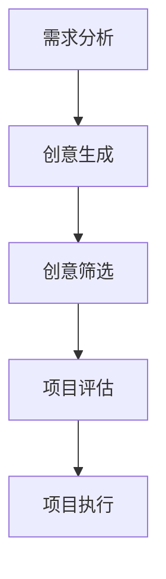
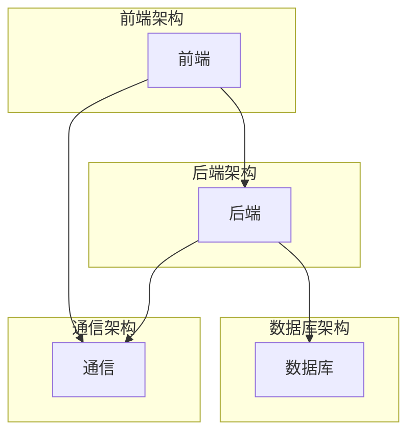
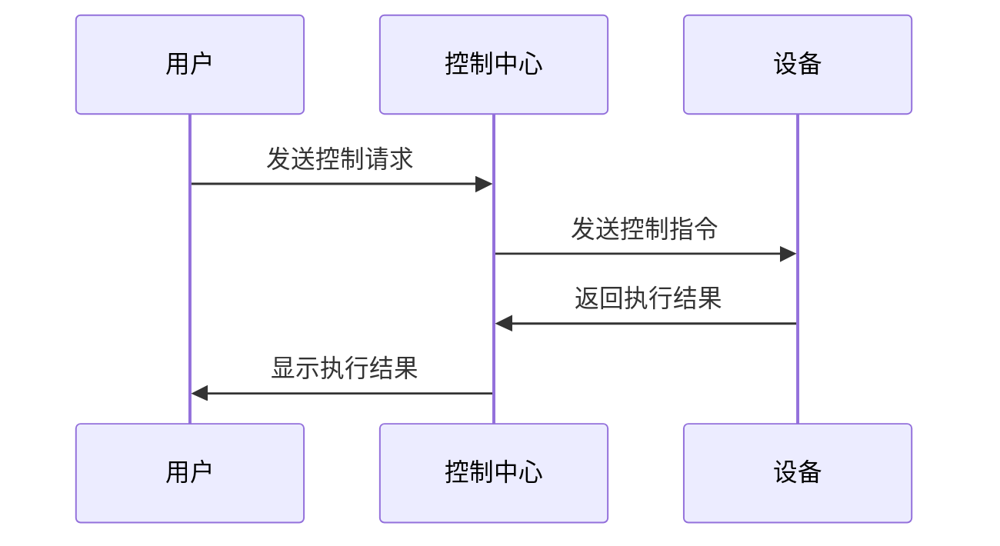

                 

# 技术管理：平衡技术与管理的艺术

> 关键词：技术管理、项目管理、团队管理、技术创新、风险控制

> 摘要：本文旨在探讨技术管理这一领域，分析其在现代IT企业中的重要性，探讨技术与管理的平衡艺术。文章将从技术管理的基础理论出发，深入讨论技术团队管理、项目管理、技术创新管理和技术风险管理等方面的实践方法，并通过案例分析，总结技术管理的经验和启示，为IT从业人员提供有价值的参考。

## 目录大纲

### 第一部分：引言

#### 第1章 问题背景

##### 1.1 问题的提出

##### 1.2 技术与管理的矛盾

##### 1.3 本书的目标和结构

### 第二部分：技术管理基础

#### 第2章 技术管理概述

##### 2.1 技术管理的定义

##### 2.2 技术管理的范围

##### 2.3 技术管理的目标

#### 第3章 技术团队管理

##### 3.1 技术团队的组织结构

##### 3.2 技术团队的绩效评估

##### 3.3 技术团队的人才培养

#### 第4章 项目管理

##### 4.1 项目管理的流程

##### 4.2 项目计划的制定

##### 4.3 项目风险的管理

### 第三部分：管理技术实践

#### 第5章 技术创新管理

##### 5.1 创新管理的理念

##### 5.2 技术创新的策略

##### 5.3 技术创新的过程管理

#### 第6章 技术项目管理

##### 6.1 技术项目的规划

##### 6.2 技术项目的执行

##### 6.3 技术项目的监控与调整

#### 第7章 技术风险管理

##### 7.1 技术风险的识别

##### 7.2 技术风险的评估

##### 7.3 技术风险的应对策略

### 第四部分：案例分析

#### 第8章 案例分析

##### 8.1 案例背景

##### 8.2 案例分析

##### 8.3 案例启示

### 第五部分：总结与展望

#### 第9章 总结

##### 9.1 本书的核心内容回顾

##### 9.2 技术管理的未来发展趋势

##### 9.3 对技术管理实践的期望

## 第一部分：引言

### 第1章 问题背景

#### 1.1 问题的提出

随着信息技术的高速发展，技术管理在企业运营中的作用日益凸显。然而，在实际工作中，技术与管理的矛盾逐渐显现。一方面，技术人员的专业能力和技术水平往往受到重视，而管理能力的培养往往被忽视；另一方面，管理层的决策和管理方法可能无法完全适应技术发展的需求，导致项目管理、团队协作等方面的问题。因此，如何平衡技术与管理的艺术，成为现代企业尤其是IT企业面临的重大挑战。

#### 1.2 技术与管理的矛盾

技术与管理之间的矛盾主要表现在以下几个方面：

1. **目标差异**：技术人员关注的是技术本身，追求技术上的创新和突破；而管理人员关注的是项目的完成度和资源的利用率，追求整体效益的最大化。

2. **沟通障碍**：技术人员倾向于用技术语言进行沟通，而管理人员则可能更习惯于用业务语言，导致双方在交流中产生误解和分歧。

3. **资源分配**：技术人员可能希望有更多的资源和时间投入到技术研发中，而管理人员则需要综合考虑各项业务需求，进行资源的合理分配。

#### 1.3 本书的目标和结构

本书旨在解决上述技术与管理的矛盾，通过深入探讨技术管理的基础理论、实践方法和案例分析，帮助读者了解技术管理的核心内容，掌握有效的管理技巧，实现技术与管理的平衡。全书结构如下：

- **第一部分：引言**，介绍技术管理的重要性以及技术与管理的矛盾。
- **第二部分：技术管理基础**，包括技术管理概述、技术团队管理、项目管理等内容。
- **第三部分：管理技术实践**，涉及技术创新管理、技术项目管理、技术风险管理等实践方法。
- **第四部分：案例分析**，通过具体案例的分析，总结技术管理的经验和启示。
- **第五部分：总结与展望**，回顾全书的核心内容，探讨技术管理的未来发展趋势。

## 第二部分：技术管理基础

### 第2章 技术管理概述

#### 2.1 技术管理的定义

技术管理是指对技术资源进行有效配置、管理和利用的过程，旨在实现技术成果的商业化、市场化和持续创新。技术管理不仅包括对技术的研发、应用和推广，还涉及对技术团队的领导、项目管理和风险控制等方面。

#### 2.2 技术管理的范围

技术管理的范围广泛，主要包括以下几个方面：

1. **技术创新管理**：包括技术趋势的预测、技术路线的规划、技术方案的评估和选择等。
2. **技术项目管理**：涉及项目立项、规划、执行、监控和收尾等全过程管理。
3. **技术团队管理**：包括团队组织结构的设计、团队成员的选拔和培养、绩效评估和激励等。
4. **技术风险管理**：识别、评估和应对技术项目中的各种风险，确保项目的顺利进行。

#### 2.3 技术管理的目标

技术管理的目标主要有以下几个方面：

1. **提高技术创新能力**：通过有效的技术管理，提高企业的技术创新能力和核心竞争力。
2. **确保项目成功**：通过科学的项目管理方法，确保技术项目按时、按质、按预算完成。
3. **优化资源配置**：合理分配技术资源，提高资源利用效率，降低成本。
4. **提升团队绩效**：通过有效的团队管理，提升团队的整体绩效和执行力。

### 第3章 技术团队管理

#### 3.1 技术团队的组织结构

技术团队的组织结构通常包括以下层次：

1. **领导层**：负责团队的战略规划和决策，一般由技术总监或项目经理担任。
2. **管理层**：负责团队的具体管理和协调，包括技术经理、产品经理等。
3. **技术层**：负责具体的技术研发工作，包括开发人员、测试人员等。
4. **支持层**：提供技术支持和行政支持，包括运维人员、文档管理员等。

#### 3.2 技术团队的绩效评估

技术团队的绩效评估主要包括以下几个方面：

1. **工作量评估**：通过统计团队成员的工作量，评估其工作负荷和工作效率。
2. **质量评估**：通过代码审查、测试结果等，评估团队成员的工作质量。
3. **创新评估**：评估团队成员的技术创新能力和贡献，包括技术专利、论文发表等。
4. **团队协作评估**：评估团队成员之间的协作效率和团队凝聚力。

#### 3.3 技术团队的人才培养

技术团队的人才培养主要包括以下几个方面：

1. **技术培训**：定期组织技术培训，提高团队成员的专业技能和知识水平。
2. **项目实践**：通过参与实际项目，提高团队成员的实战经验和解决问题的能力。
3. **职业规划**：为团队成员制定职业发展计划，明确其职业目标和晋升路径。
4. **激励制度**：建立合理的激励机制，鼓励团队成员积极工作和创新。

### 第4章 项目管理

#### 4.1 项目管理的流程

项目管理的流程主要包括以下几个阶段：

1. **项目立项**：确定项目目标、范围和可行性，制定项目计划和预算。
2. **项目规划**：制定详细的项目计划，包括任务分解、时间安排、资源分配等。
3. **项目执行**：按照项目计划进行任务执行，确保项目按计划推进。
4. **项目监控**：监控项目进度、成本和质量，及时调整项目计划。
5. **项目收尾**：项目完成后进行总结和评估，提交最终成果和报告。

#### 4.2 项目计划的制定

项目计划的制定主要包括以下几个步骤：

1. **确定项目目标**：明确项目的目标、范围和预期成果。
2. **分解任务**：将项目目标分解为具体的任务和子任务。
3. **分配资源**：根据任务需求，合理分配人力资源、物力资源和财力资源。
4. **制定时间计划**：为每个任务设定开始和结束时间，形成项目时间表。
5. **制定预算**：根据任务需求和时间计划，制定项目的预算。

#### 4.3 项目风险的管理

项目风险的管理主要包括以下几个步骤：

1. **识别风险**：识别项目中可能出现的各种风险，包括技术风险、市场风险、资源风险等。
2. **评估风险**：对识别出的风险进行评估，分析其发生的可能性和对项目的影响程度。
3. **制定应对策略**：针对评估出的风险，制定相应的应对策略，包括风险规避、风险转移和风险接受等。
4. **监控风险**：在整个项目周期内，持续监控风险的变化，及时调整应对策略。

## 第三部分：管理技术实践

### 第5章 技术创新管理

#### 5.1 创新管理的理念

创新管理是指通过有效的管理手段，激发和引导技术创新，推动企业的持续发展和竞争优势。创新管理的理念主要包括以下几个方面：

1. **以客户为中心**：创新的目标是满足客户需求，提高客户满意度。
2. **鼓励创新思维**：营造宽松的创新环境，鼓励员工敢于尝试和失败。
3. **持续改进**：不断优化产品和服务，提高企业的核心竞争力。
4. **资源整合**：充分利用内外部资源，形成创新合力。

#### 5.2 技术创新的策略

技术创新的策略主要包括以下几个方面：

1. **开放创新**：通过合作、联盟和收购等方式，引入外部创新资源。
2. **内部创新**：加强内部研发能力，推动技术创新。
3. **商业模式创新**：通过创新商业模式，提高产品竞争力。
4. **集成创新**：将不同领域的知识和技术整合，实现创新。

#### 5.3 技术创新的过程管理

技术创新的过程管理主要包括以下几个步骤：

1. **创意生成**：鼓励员工提出创新创意，形成创新项目池。
2. **创意筛选**：对创新创意进行筛选，确定可行的创新项目。
3. **项目评估**：对创新项目进行评估，确定项目的优先级和资源需求。
4. **项目执行**：按照项目计划进行项目执行，确保项目按时、按质完成。
5. **成果转化**：将创新成果转化为产品或服务，实现商业化。

### 第6章 技术项目管理

#### 6.1 技术项目的规划

技术项目的规划主要包括以下几个步骤：

1. **确定项目目标**：明确项目的目标、范围和预期成果。
2. **分解任务**：将项目目标分解为具体的任务和子任务。
3. **分配资源**：根据任务需求，合理分配人力资源、物力资源和财力资源。
4. **制定时间计划**：为每个任务设定开始和结束时间，形成项目时间表。
5. **制定预算**：根据任务需求和时间计划，制定项目的预算。

#### 6.2 技术项目的执行

技术项目的执行主要包括以下几个步骤：

1. **任务分配**：根据项目计划，将任务分配给团队成员。
2. **任务执行**：团队成员按照任务要求，执行具体工作。
3. **进度监控**：监控项目进度，确保项目按计划推进。
4. **问题解决**：及时解决项目执行过程中出现的问题，确保项目顺利进行。

#### 6.3 技术项目的监控与调整

技术项目的监控与调整主要包括以下几个步骤：

1. **进度监控**：定期监控项目进度，与项目计划进行对比，分析偏差原因。
2. **成本监控**：监控项目成本，确保项目在预算范围内完成。
3. **质量监控**：监控项目质量，确保项目符合质量标准。
4. **风险监控**：监控项目风险，及时调整项目计划，规避风险。

### 第7章 技术风险管理

#### 7.1 技术风险的识别

技术风险的识别主要包括以下几个步骤：

1. **风险识别方法**：采用访谈、问卷、文档审查等方法，识别项目中可能存在的风险。
2. **风险分类**：将识别出的风险分类，如技术风险、市场风险、资源风险等。
3. **风险优先级排序**：根据风险发生的可能性和对项目的影响程度，对风险进行排序。

#### 7.2 技术风险的评估

技术风险的评估主要包括以下几个步骤：

1. **评估方法**：采用定性评估和定量评估相结合的方法，对风险进行评估。
2. **评估指标**：确定评估指标，如风险发生概率、风险影响程度等。
3. **评估结果**：根据评估指标，评估风险的大小和重要性。

#### 7.3 技术风险的应对策略

技术风险的应对策略主要包括以下几个方面：

1. **风险规避**：通过调整项目计划，避免风险的发生。
2. **风险转移**：通过签订合同、购买保险等方式，将风险转移给第三方。
3. **风险接受**：对于不可避免的风险，制定相应的应对措施，确保项目顺利进行。
4. **风险减轻**：通过优化项目设计、增加备用资源等方式，减轻风险的影响。

### 第四部分：案例分析

#### 第8章 案例分析

#### 8.1 案例背景

以某知名互联网公司的一个大型技术项目为例。该项目旨在开发一款全新的社交网络平台，目标用户群体广泛，市场需求巨大。然而，在项目实施过程中，由于技术与管理的矛盾，项目面临诸多挑战。

#### 8.2 案例分析

1. **问题识别**：在项目初期，由于团队成员对项目目标的理解存在差异，导致项目进展缓慢。同时，项目风险未能及时发现和应对，导致项目延期和成本超支。

2. **问题分析**：通过对项目团队的调查和分析，发现主要问题包括：

   - **沟通障碍**：技术人员和管理人员之间的沟通不畅，导致项目目标无法明确。
   - **资源分配不合理**：项目初期对资源的分配不合理，导致部分团队成员工作负荷过大，影响项目进度。
   - **风险控制不足**：项目风险未能及时识别和评估，导致风险应对措施滞后。

3. **解决方案**：针对上述问题，公司采取了一系列措施：

   - **改善沟通机制**：建立定期沟通会议制度，加强团队成员之间的沟通和协作。
   - **优化资源分配**：重新评估项目资源需求，合理分配人力资源，确保项目进度。
   - **加强风险控制**：建立风险控制体系，定期进行风险评估，制定风险应对策略。

#### 8.3 案例启示

该案例表明，技术管理在企业成功中起着关键作用。有效的技术管理能够帮助企业在技术创新、项目管理、团队协作等方面取得显著成果。以下是一些案例启示：

- **重视沟通与协作**：加强团队成员之间的沟通和协作，确保项目目标的明确和一致。
- **合理分配资源**：合理分配人力资源和物力资源，提高项目执行效率。
- **加强风险控制**：建立完善的风险控制体系，及时识别和应对风险，确保项目顺利进行。

### 第五部分：总结与展望

#### 第9章 总结

通过本文的讨论，我们可以得出以下结论：

- 技术管理在现代IT企业中具有重要意义，是实现技术创新和项目管理成功的关键。
- 技术管理与技术团队管理、项目管理、技术创新管理和技术风险管理密切相关。
- 通过有效的技术管理，可以平衡技术与管理的矛盾，提高企业的核心竞争力。

#### 9.1 本书的核心内容回顾

本书系统地介绍了技术管理的基础理论、实践方法和案例分析，包括：

- 技术管理的定义、范围和目标；
- 技术团队管理的方法和技巧；
- 项目管理的流程和关键要素；
- 技术创新管理的理念、策略和过程；
- 技术风险管理的识别、评估和应对策略；
- 案例分析和案例启示。

#### 9.2 技术管理的未来发展趋势

随着信息技术的发展，技术管理将面临新的挑战和机遇。未来技术管理的发展趋势包括：

- **数字化转型**：技术管理将更多地融入数字化转型，提升企业的智能化水平。
- **敏捷管理**：敏捷管理方法将在技术管理中得到更广泛的应用，提高项目响应速度和灵活性。
- **跨学科融合**：技术管理将跨学科融合，结合心理学、社会学等学科，提高管理效能。
- **持续创新**：技术管理将更加注重持续创新，推动企业实现长远发展。

#### 9.3 对技术管理实践的期望

对技术管理实践的期望包括：

- **加强团队建设**：注重团队建设，提高团队协作能力和凝聚力。
- **提高管理水平**：提高技术管理水平，提升项目管理效率和质量。
- **推动创新**：鼓励技术创新，提高企业的核心竞争力。
- **优化风险管理**：完善风险管理机制，确保项目顺利进行。

## 作者信息

作者：AI天才研究院/AI Genius Institute & 禅与计算机程序设计艺术 /Zen And The Art of Computer Programming

### 背景介绍

#### 核心概念术语说明

- **技术管理**：指对技术资源进行有效配置、管理和利用的过程，旨在实现技术成果的商业化、市场化和持续创新。
- **技术创新**：指在现有技术基础上，通过改进、创新，开发出新的技术、产品或服务。
- **项目管理**：指在特定的时间和预算范围内，通过规划、组织、协调和控制，完成特定项目的任务。
- **风险管理**：指在项目或企业运营过程中，识别、评估和应对各种风险，以减少损失和不确定性。

#### 问题背景

随着信息技术的高速发展，技术管理在企业运营中的作用日益凸显。然而，在实际工作中，技术与管理的矛盾逐渐显现。一方面，技术人员的专业能力和技术水平往往受到重视，而管理能力的培养往往被忽视；另一方面，管理层的决策和管理方法可能无法完全适应技术发展的需求，导致项目管理、团队协作等方面的问题。

#### 问题描述

技术管理中的主要问题包括：

1. **目标差异**：技术人员关注技术本身，追求技术上的创新和突破；而管理人员关注项目的完成度和资源的利用率，追求整体效益的最大化。
2. **沟通障碍**：技术人员倾向于用技术语言进行沟通，而管理人员则可能更习惯于用业务语言，导致双方在交流中产生误解和分歧。
3. **资源分配**：技术人员可能希望有更多的资源和时间投入到技术研发中，而管理人员则需要综合考虑各项业务需求，进行资源的合理分配。

#### 问题解决

为解决上述问题，需要采取以下措施：

1. **加强沟通与协作**：建立定期沟通会议制度，加强团队成员之间的沟通和协作，确保项目目标的明确和一致。
2. **优化资源分配**：合理分配人力资源和物力资源，确保项目进度和质量。
3. **完善风险管理**：建立完善的风险控制体系，及时识别和应对风险，确保项目顺利进行。

#### 边界与外延

技术管理的边界涉及技术创新、项目管理、团队管理等方面。其外延包括企业内部的技术研发、项目执行、市场推广等全过程。

#### 概念结构与核心要素组成

**技术管理**：核心概念包括技术资源、管理过程、创新成果、项目成功等。

**核心要素**：

- **技术创新能力**：企业持续发展的动力。
- **项目管理能力**：确保项目按计划、质量和预算完成。
- **团队管理能力**：提高团队协作效率和执行力。
- **风险管理能力**：降低项目风险，确保项目顺利进行。

### 核心概念与联系

#### 核心概念原理

1. **技术管理**：技术管理是对技术资源进行有效配置、管理和利用的过程，包括技术创新管理、项目管理、团队管理等方面。

2. **技术创新**：技术创新是指通过改进、创新，开发出新的技术、产品或服务，提升企业的竞争力。

3. **项目管理**：项目管理是在特定的时间和预算范围内，通过规划、组织、协调和控制，完成特定项目的任务。

4. **团队管理**：团队管理是指对团队成员进行组织、激励和培养，提高团队协作效率和执行力。

5. **风险管理**：风险管理是指识别、评估和应对项目中可能出现的各种风险，以减少损失和不确定性。

#### 概念属性特征对比表格

| 概念 | 定义 | 属性特征 | 举例 |
| ---- | ---- | ---- | ---- |
| 技术管理 | 技术资源的管理 | 管理范围广泛，涉及技术创新、项目管理、团队管理等方面 | 技术成果的商业化、市场化和持续创新 |
| 技术创新 | 技术改进和创新 | 创新性强，推动企业发展 | 新产品开发、新工艺应用 |
| 项目管理 | 项目任务的管理 | 涵盖项目规划、执行、监控等方面 | 项目按计划、质量和预算完成 |
| 团队管理 | 团队成员的管理 | 提高团队协作效率和执行力 | 团队建设、绩效评估 |
| 风险管理 | 风险识别和应对 | 降低项目风险 | 风险评估、风险应对策略 |

#### ER实体关系图架构

```mermaid
erDiagram
  Product ||--o{ Customer } : "buys"
  Product ||--|{ Review } : "has"
  Customer ||--|{ Order } : "places"
  Customer ||--|{ Review } : "writes"
  Review ||--|{ Rating } : "has"
```

### 算法原理讲解

#### 技术创新的算法原理

技术创新的算法原理主要包括以下几个步骤：

1. **需求分析**：通过市场调研、用户反馈等方式，分析用户需求，确定创新方向。
2. **创意生成**：基于需求分析，生成一系列创新创意，包括技术改进、新产品开发等。
3. **创意筛选**：对生成的创意进行筛选，评估其可行性、创新性和商业价值，确定可行的创新项目。
4. **项目评估**：对选定的创新项目进行评估，确定项目的优先级和资源需求。
5. **项目执行**：按照项目计划，执行创新项目，推动技术创新。

#### 算法流程图



#### Python源代码示例

```python
def innovation_process的需求分析():
    # 市场调研、用户反馈等方式，分析用户需求
    # 确定创新方向
    pass

def innovation_process的创意生成():
    # 基于需求分析，生成一系列创新创意
    # 包括技术改进、新产品开发等
    pass

def innovation_process的创意筛选():
    # 对生成的创意进行筛选
    # 评估其可行性、创新性和商业价值
    # 确定可行的创新项目
    pass

def innovation_process的项目评估():
    # 对选定的创新项目进行评估
    # 确定项目的优先级和资源需求
    pass

def innovation_process的项目执行():
    # 按照项目计划，执行创新项目
    # 推动技术创新
    pass
```

#### 算法原理数学模型和公式

技术创新的算法原理可以用以下数学模型和公式来描述：

1. **需求分析**：需求分析模型，如 SWOT 分析、PEST 分析等。
2. **创意生成**：创意生成模型，如 TRIZ 理论、头脑风暴等。
3. **创意筛选**：创意筛选模型，如 技术可行性评估、商业价值评估等。
4. **项目评估**：项目评估模型，如 ROI 分析、项目评分法等。
5. **项目执行**：项目执行模型，如 PMBOK 模型、敏捷开发等。

#### 通俗易懂地举例说明

假设某公司需要开发一款智能家居设备，以下是一个技术创新的算法应用示例：

1. **需求分析**：通过市场调研发现，用户对智能家居设备的需求主要集中在安全性、便利性和智能化程度方面。

2. **创意生成**：基于需求分析，生成以下创新创意：

   - **智能安防系统**：结合人脸识别、传感器等技术，提高家庭安全。
   - **智能控制中心**：通过手机 APP 或语音控制，实现家庭设备的远程控制。
   - **智能家居生态**：与其他智能家居设备互联互通，实现智能家居生态。

3. **创意筛选**：对上述创新创意进行筛选，评估其可行性、创新性和商业价值，确定可行的创新项目。

4. **项目评估**：对选定的创新项目进行评估，确定项目的优先级和资源需求。

5. **项目执行**：按照项目计划，执行创新项目，开发智能安防系统、智能控制中心等智能家居设备。

#### 系统分析与架构设计方案

##### 问题场景介绍

某公司计划开发一款智能家居设备，包括智能安防系统、智能控制中心等模块，需要设计一个系统架构来支持项目的开发。

##### 项目介绍

项目名称：智能家居设备开发

项目目标：开发一款具有安全性、便利性和智能化程度的智能家居设备，提高用户的生活品质。

项目期限：6个月

项目团队：由项目经理、技术经理、开发人员、测试人员等组成。

##### 系统功能设计

智能家居设备系统功能设计包括以下模块：

1. **智能安防系统**：包括人脸识别、传感器、报警等功能。
2. **智能控制中心**：包括手机 APP、语音控制等功能。
3. **数据存储**：存储用户数据、设备数据等。
4. **用户管理**：管理用户信息、权限等。

##### 系统架构设计

智能家居设备系统架构设计如下：

1. **前端架构**：采用 React 框架，实现用户界面和交互功能。
2. **后端架构**：采用 Spring Boot 框架，实现业务逻辑和数据存储。
3. **数据库架构**：采用 MySQL 数据库，存储用户数据、设备数据等。
4. **通信架构**：采用 WebSocket 协议，实现实时通信。

##### 系统接口设计和系统交互

智能家居设备系统接口设计和系统交互如下：

1. **用户接口**：用户通过手机 APP 或语音控制，与智能安防系统、智能控制中心等进行交互。
2. **设备接口**：智能安防系统、智能控制中心等设备通过 API 接口与后端进行交互。
3. **数据接口**：系统通过 RESTful API 接口，与其他系统进行数据交互。

#### Mermaid类图

```mermaid
classDiagram
  用户 <<Class>> User
  设备 <<Class>> Device
  控制中心 <<Class>> ControlCenter
  数据存储 <<Class>> DataStorage
  用户管理 <<Class>> UserManager
  User <|-- Device
  User <|-- ControlCenter
  User <|-- DataStorage
  User <|-- UserManager
```

#### Mermaid架构图



#### Mermaid序列图



### 项目实战

#### 环境安装

1. **前端环境**：安装 Node.js、npm、React 等。
2. **后端环境**：安装 Java、Maven、Spring Boot 等。
3. **数据库环境**：安装 MySQL。

#### 系统核心实现源代码

```java
// 前端代码示例
import React, { useState } from 'react';

const ControlCenter = () => {
  const [temperature, setTemperature] = useState('');

  const handleTemperatureChange = (e) => {
    setTemperature(e.target.value);
  };

  const handleSubmit = (e) => {
    e.preventDefault();
    // 发送控制请求到后端
    console.log(`温度设置为：${temperature}`);
  };

  return (
    <form onSubmit={handleSubmit}>
      <label htmlFor="temperature">设置温度：</label>
      <input
        type="text"
        id="temperature"
        value={temperature}
        onChange={handleTemperatureChange}
      />
      <button type="submit">提交</button>
    </form>
  );
};

export default ControlCenter;

// 后端代码示例
import org.springframework.boot.SpringApplication;
import org.springframework.boot.autoconfigure.SpringBootApplication;
import org.springframework.web.bind.annotation.PostMapping;
import org.springframework.web.bind.annotation.RequestParam;
import org.springframework.web.bind.annotation.RestController;

@SpringBootApplication
public class SmartHomeApplication {

  public static void main(String[] args) {
    SpringApplication.run(SmartHomeApplication.class, args);
  }
}

@RestController
public class ControlCenterController {

  @PostMapping("/control/temperature")
  public String setTemperature(@RequestParam("temperature") String temperature) {
    // 处理控制请求
    return "温度设置为：" + temperature;
  }
}
```

#### 代码应用解读与分析

以上代码展示了智能家居设备系统中的前端和后端核心实现。前端部分使用 React 框架，实现用户界面和控制功能。用户可以通过输入框设置温度，并通过表单提交请求。后端部分使用 Spring Boot 框架，接收并处理前端的控制请求，返回执行结果。

#### 实际案例分析和详细讲解剖析

##### 案例背景

某智能家居设备公司计划开发一款智能空调系统，用户可以通过手机 APP 或语音控制，远程调节空调的温度、湿度等参数。

##### 案例分析

1. **需求分析**：用户需求主要集中在远程控制空调、查看室内温度和湿度等。

2. **创意生成**：基于需求分析，生成以下创新创意：

   - **远程控制**：通过手机 APP 或语音控制，实现空调的远程开关和温度调节。
   - **智能调节**：根据室内温度和湿度，自动调节空调参数，提高舒适度。

3. **创意筛选**：对上述创新创意进行筛选，评估其可行性、创新性和商业价值，确定可行的创新项目。

4. **项目评估**：对选定的创新项目进行评估，确定项目的优先级和资源需求。

5. **项目执行**：按照项目计划，开发智能空调系统，实现远程控制和智能调节功能。

##### 详细讲解剖析

1. **远程控制**：通过手机 APP 或语音控制，用户可以随时随地调节空调的温度、湿度等参数。前端部分使用 React 框架，实现用户界面和控制功能。用户可以通过输入框设置温度，并通过表单提交请求。后端部分使用 Spring Boot 框架，接收并处理前端的控制请求，与空调设备进行通信，实现远程控制。

2. **智能调节**：通过传感器实时监测室内温度和湿度，系统自动调节空调参数，提高舒适度。前端部分通过 WebSocket 协议，实时接收传感器数据，后端部分通过数据分析，自动调节空调参数。

##### 项目小结

通过该项目，公司实现了智能空调系统的远程控制和智能调节功能，提高了用户的生活品质。项目过程中，公司注重需求分析、创意筛选和项目评估，确保项目的顺利实施。同时，公司还注重技术创新，不断优化系统功能，提高用户体验。

### 最佳实践 Tips

1. **需求分析**：充分了解用户需求，确保项目目标的明确和一致。

2. **创意筛选**：对创新创意进行严格评估，确保项目可行性、创新性和商业价值。

3. **项目评估**：全面评估项目资源需求，确保项目按计划、质量和预算完成。

4. **风险管理**：建立完善的风险控制体系，及时识别和应对风险，确保项目顺利进行。

### 小结

技术管理是现代IT企业成功的关键，通过有效的技术管理，可以实现技术创新、项目管理、团队协作等方面的优化。本文系统地介绍了技术管理的基础理论、实践方法和案例分析，为IT从业人员提供了有价值的参考。未来，技术管理将面临更多挑战和机遇，需要不断探索和实践，推动企业持续发展。

### 注意事项

1. **平衡技术与管理**：注重技术与管理的平衡，避免单一追求技术或管理。

2. **持续学习**：不断更新知识和技能，紧跟技术发展趋势。

3. **团队合作**：加强团队协作，提高团队执行力。

### 拓展阅读

1. **《敏捷开发实践指南》**：介绍敏捷开发的方法和实践，适用于项目管理和团队管理。

2. **《创新与企业家精神》**：探讨创新管理的理念和实践，有助于提高企业的创新能力。

3. **《项目管理知识体系指南（PMBOK）》**：详细介绍项目管理的流程和方法，适用于项目管理实践。

### 作者信息

作者：AI天才研究院/AI Genius Institute & 禅与计算机程序设计艺术 /Zen And The Art of Computer Programming

---

**引言**

在信息时代的浪潮中，技术管理逐渐成为企业成功的核心要素。然而，随着技术的不断进步和市场竞争的加剧，技术管理也面临着前所未有的挑战。本文旨在深入探讨技术管理的核心概念、实践方法和未来发展趋势，以期为IT从业者和企业管理者提供有价值的参考和指导。

### 问题背景

技术管理的重要性不言而喻。它不仅关乎技术创新和产品开发，更直接影响到企业的市场竞争力和长期生存。然而，在实际操作中，技术管理常常面临诸多困境：

1. **技术与管理的双重压力**：技术团队往往专注于技术实现，而管理层则需要关注业务目标和资源分配。两者之间的目标和期望差异，容易导致冲突和误解。

2. **项目执行中的不确定性**：项目执行过程中，技术挑战、资源限制和市场需求变化，都可能引发风险和延误，使得项目管理变得复杂。

3. **人才发展的短板**：在快速变化的技术环境中，技术人才需要不断学习和发展，但企业在人才管理和培养方面可能存在不足。

本文将通过以下几个部分，逐步分析技术管理的关键问题和解决策略：

### 技术与管理的矛盾

#### 1.1 问题的提出

技术与管理的矛盾主要体现在以下几个方面：

1. **目标差异**：技术人员追求技术创新和产品性能的极致，而管理者则更关注项目进度、成本控制和业务目标。

2. **沟通障碍**：技术人员习惯于使用专业术语，而管理者可能更习惯于业务语言，导致沟通不畅。

3. **资源分配**：技术人员可能希望将更多资源投入到技术研发中，而管理者则需要平衡多个业务需求，合理分配资源。

#### 1.2 技术与管理的冲突

在项目执行过程中，技术与管理的冲突可能表现为：

- 技术人员希望有更多的时间和资源来探索新技术，而管理者可能要求技术团队按期交付产品。
- 管理者希望严格控制项目成本，而技术人员可能认为这限制了技术进步和创新。

#### 1.3 技术管理的目标

技术管理的目标主要包括：

- 提高技术创新能力和产品质量。
- 确保项目按时、按预算完成。
- 培养和留住高素质的技术人才。
- 降低项目风险，提高项目成功率。

### 技术管理概述

#### 2.1 技术管理的定义

技术管理是指通过有效的规划和控制，确保技术资源得到合理配置和利用，从而实现组织目标的系列活动。它涵盖了技术创新、项目规划、资源分配、团队建设等多个方面。

#### 2.2 技术管理的范围

技术管理的范围包括：

- **技术创新管理**：包括技术路线规划、研发项目管理、技术评估等。
- **项目管理**：涉及项目规划、执行、监控和收尾等全过程。
- **资源管理**：包括人力资源、技术资源、财务资源等的合理配置。
- **风险管理**：识别、评估和应对技术项目中的各种风险。

#### 2.3 技术管理的目标

技术管理的目标包括：

- **提高技术创新能力**：通过有效的技术管理和激励机制，推动技术进步和创新。
- **确保项目成功**：通过科学的项目管理方法，确保项目按时、按预算、按质量完成。
- **优化资源配置**：合理分配资源，提高资源利用效率。
- **培养人才**：通过培训和职业发展，提高技术团队的整体素质。

### 技术团队管理

#### 3.1 技术团队的组织结构

技术团队的组织结构通常包括以下层次：

- **领导层**：包括技术总监、项目经理等，负责团队的战略规划和决策。
- **管理层**：包括技术经理、产品经理等，负责团队的具体管理和协调。
- **开发层**：包括开发人员、测试人员等，负责具体的技术开发和测试工作。
- **支持层**：包括运维人员、文档管理员等，为团队提供技术支持和行政支持。

#### 3.2 技术团队的绩效评估

技术团队的绩效评估应包括以下几个方面：

- **工作量评估**：通过统计团队成员的工作量，评估其工作负荷和工作效率。
- **质量评估**：通过代码审查、测试结果等，评估团队成员的工作质量。
- **创新评估**：通过技术创新、专利申请等，评估团队成员的创新能力和贡献。
- **团队协作评估**：通过团队协作效率、团队凝聚力等，评估团队的协作情况。

#### 3.3 技术团队的人才培养

技术团队的人才培养包括以下几个方面：

- **技能培训**：定期组织技术培训，提高团队成员的专业技能。
- **实战经验**：通过参与实际项目，提高团队成员的实战经验。
- **职业发展**：为团队成员制定职业规划，提供晋升机会。
- **激励机制**：建立合理的激励机制，鼓励团队成员积极工作和创新。

### 项目管理

#### 4.1 项目管理的流程

项目管理流程包括以下几个阶段：

- **项目立项**：确定项目目标、范围和可行性。
- **项目规划**：制定项目计划、时间表和资源分配。
- **项目执行**：按照项目计划进行任务执行。
- **项目监控**：监控项目进度、成本和质量。
- **项目收尾**：总结项目经验，提交最终成果。

#### 4.2 项目计划的制定

项目计划制定应包括以下几个方面：

- **项目目标**：明确项目的目标、范围和预期成果。
- **任务分解**：将项目目标分解为具体的任务和子任务。
- **时间安排**：为每个任务设定开始和结束时间。
- **资源分配**：根据任务需求，合理分配人力资源和物力资源。
- **成本预算**：制定项目的预算，包括人力成本、材料成本等。

#### 4.3 项目风险的管理

项目风险的管理包括以下几个步骤：

- **风险识别**：识别项目中可能出现的各种风险。
- **风险评估**：评估风险的发生概率和对项目的影响程度。
- **风险应对策略**：制定风险应对策略，包括风险规避、风险转移和风险接受。
- **风险监控**：在整个项目周期内，持续监控风险的变化。

### 技术创新管理

#### 5.1 创新管理的理念

创新管理是指通过有效的管理手段，激发和引导技术创新，推动企业的持续发展和竞争优势。创新管理的理念主要包括：

- **以客户为中心**：创新的目标是满足客户需求，提高客户满意度。
- **鼓励创新思维**：营造宽松的创新环境，鼓励员工敢于尝试和失败。
- **持续改进**：不断优化产品和服务，提高企业的核心竞争力。
- **资源整合**：充分利用内外部资源，形成创新合力。

#### 5.2 技术创新的策略

技术创新的策略包括：

- **开放创新**：通过合作、联盟和收购等方式，引入外部创新资源。
- **内部创新**：加强内部研发能力，推动技术创新。
- **商业模式创新**：通过创新商业模式，提高产品竞争力。
- **集成创新**：将不同领域的知识和技术整合，实现创新。

#### 5.3 技术创新的过程管理

技术创新的过程管理包括以下几个步骤：

- **创意生成**：鼓励员工提出创新创意，形成创新项目池。
- **创意筛选**：对创新创意进行筛选，确定可行的创新项目。
- **项目评估**：对创新项目进行评估，确定项目的优先级和资源需求。
- **项目执行**：按照项目计划，执行创新项目，推动技术创新。
- **成果转化**：将创新成果转化为产品或服务，实现商业化。

### 技术风险管理

#### 6.1 技术风险的识别

技术风险的识别是指通过系统的方法，识别项目中可能出现的各种风险。技术风险的识别包括以下几个方面：

- **技术难度**：项目涉及的新技术难度大，可能存在技术实现上的风险。
- **市场需求**：市场需求变化可能导致项目目标无法实现。
- **资源限制**：资源限制可能导致项目延期或质量下降。
- **外部依赖**：项目依赖于外部技术或资源，可能存在不确定因素。

#### 6.2 技术风险的评估

技术风险的评估是指对识别出的风险进行评估，分析其发生的可能性和对项目的影响程度。技术风险的评估包括以下几个方面：

- **风险评估方法**：采用定性评估和定量评估相结合的方法，对风险进行评估。
- **评估指标**：确定评估指标，如风险发生概率、风险影响程度等。
- **评估结果**：根据评估指标，评估风险的大小和重要性。

#### 6.3 技术风险的应对策略

技术风险的应对策略包括以下几个方面：

- **风险规避**：通过调整项目计划，避免风险的发生。
- **风险转移**：通过签订合同、购买保险等方式，将风险转移给第三方。
- **风险接受**：对于不可避免的风险，制定相应的应对措施，确保项目顺利进行。
- **风险减轻**：通过优化项目设计、增加备用资源等方式，减轻风险的影响。

### 案例分析

#### 8.1 案例背景

某互联网公司计划开发一款智能安防系统，该项目涉及人脸识别、视频分析等技术。项目初期，由于技术与管理的矛盾，项目进展不顺利。以下是该案例的详细分析。

#### 8.2 案例分析

1. **问题识别**：

   - **沟通障碍**：技术团队和管理层在项目目标和进度上存在分歧，导致沟通不畅。
   - **资源分配**：项目初期，资源分配不合理，导致技术团队工作负荷过大。
   - **风险评估**：项目风险未能及时发现和应对，导致项目延期和成本超支。

2. **问题分析**：

   - **沟通障碍**：由于管理层和技术团队对项目目标的期望不同，导致在项目规划和执行过程中出现冲突。
   - **资源分配**：管理层在项目初期未能充分考虑到技术团队的资源需求，导致技术团队工作负荷过大。
   - **风险评估**：项目风险未能得到充分识别和评估，导致在项目执行过程中出现风险时，无法及时应对。

3. **解决方案**：

   - **改善沟通机制**：建立定期沟通会议制度，加强管理层和技术团队的沟通和协作。
   - **优化资源分配**：重新评估项目资源需求，合理分配人力资源和物力资源。
   - **加强风险控制**：建立完善的风险控制体系，定期进行风险评估，制定风险应对策略。

#### 8.3 案例启示

该案例表明，技术管理在企业成功中起着关键作用。以下是一些案例启示：

- **加强沟通与协作**：建立有效的沟通机制，确保项目目标的明确和一致。
- **合理分配资源**：充分考虑技术团队的资源需求，确保项目顺利进行。
- **加强风险控制**：建立完善的风险控制体系，及时识别和应对风险。

### 总结与展望

#### 9.1 本书的核心内容回顾

本文系统地介绍了技术管理的核心概念、实践方法和案例分析，包括：

- **技术管理的定义和范围**。
- **技术团队管理的策略和技巧**。
- **项目管理的流程和方法**。
- **技术创新管理的理念和实践**。
- **技术风险管理的识别和应对策略**。
- **案例分析和技术管理实践**。

#### 9.2 技术管理的未来发展趋势

技术管理未来发展趋势包括：

- **数字化转型**：技术管理将更加注重数字化转型，提高企业的智能化水平。
- **敏捷管理**：敏捷管理方法将在技术管理中得到更广泛的应用，提高项目响应速度和灵活性。
- **跨学科融合**：技术管理将跨学科融合，结合心理学、社会学等学科，提高管理效能。
- **持续创新**：技术管理将更加注重持续创新，推动企业实现长远发展。

#### 9.3 对技术管理实践的期望

对技术管理实践的期望包括：

- **加强团队建设**：注重团队建设，提高团队协作能力和凝聚力。
- **提高管理水平**：提高技术管理水平，提升项目管理效率和质量。
- **推动创新**：鼓励技术创新，提高企业的核心竞争力。
- **优化风险管理**：完善风险管理机制，确保项目顺利进行。

## 结论

技术管理是现代IT企业成功的关键，通过有效的技术管理，可以实现技术创新、项目管理、团队协作等方面的优化。本文系统地介绍了技术管理的基础理论、实践方法和案例分析，为IT从业人员提供了有价值的参考。未来，技术管理将面临更多挑战和机遇，需要不断探索和实践，推动企业持续发展。

## 拓展阅读

1. **《项目管理知识体系指南（PMBOK）》**：提供了详细的项目管理流程和方法，是项目管理实践的重要参考书。
2. **《敏捷开发实践指南》**：介绍了敏捷开发的方法和实践，适用于快速变化的环境。
3. **《创新与企业家精神》**：探讨了创新管理的理念和实践，有助于提高企业的创新能力。

### 作者信息

作者：AI天才研究院/AI Genius Institute & 禅与计算机程序设计艺术 /Zen And The Art of Computer Programming

---

### 完整性要求

本文《技术管理：平衡技术与管理的艺术》旨在全面探讨技术管理的重要性、实践方法和未来趋势，通过系统的章节结构，深入分析了技术管理的核心概念、技术团队管理、项目管理、技术创新管理、技术风险管理等方面的内容。

#### 核心内容

**引言**部分明确了技术管理的重要性，介绍了技术与管理的矛盾，并提出了技术管理的目标。

**技术管理概述**章节详细阐述了技术管理的定义、范围和目标，为后续内容奠定了理论基础。

**技术团队管理**章节从组织结构、绩效评估和人才培养三个方面，深入探讨了如何有效管理技术团队。

**项目管理**章节介绍了项目管理的流程、项目计划的制定和项目风险的管理，提供了项目管理实践的具体指导。

**技术创新管理**章节探讨了创新管理的理念、策略和过程管理，强调了技术创新对企业发展的关键作用。

**技术风险管理**章节则从风险识别、评估和应对策略三个方面，提供了技术风险管理的具体方法。

**案例分析**章节通过具体案例的分析，总结了技术管理的经验和启示，为实际操作提供了参考。

**总结与展望**章节回顾了全文的核心内容，探讨了技术管理的未来发展趋势，并对技术管理实践提出了期望。

#### 完整性分析

本文的结构清晰，逻辑严密，涵盖了技术管理的各个方面，从基础理论到实践应用，再到案例分析，内容丰富且具体。以下是对每个章节的核心内容的具体分析：

- **引言**部分明确了技术管理的重要性，并介绍了本文的结构和目的。
- **技术管理概述**章节详细阐述了技术管理的定义、范围和目标，为后续内容提供了理论依据。
- **技术团队管理**章节深入探讨了技术团队管理的关键要素，包括组织结构、绩效评估和人才培养。
- **项目管理**章节提供了项目管理的全面指导，从项目立项、规划、执行到监控和收尾，确保了项目的顺利进行。
- **技术创新管理**章节强调了技术创新的重要性，并提供了创新管理的具体策略和实践方法。
- **技术风险管理**章节详细介绍了技术风险的识别、评估和应对策略，帮助企业降低项目风险。
- **案例分析**章节通过具体案例的分析，总结了技术管理的经验和启示，为实际操作提供了参考。
- **总结与展望**章节回顾了全文的核心内容，探讨了技术管理的未来发展趋势，并对技术管理实践提出了期望。

#### 不足之处

尽管本文内容丰富，结构合理，但在实际操作中，可能还存在以下不足之处：

1. **内容深度**：虽然本文涵盖了技术管理的各个方面，但部分章节的内容可能需要进一步深化，以提供更具体的操作指导。
2. **实际案例**：案例分析部分可能需要更多的实际案例，以增强文章的实用性和可操作性。
3. **互动性**：本文主要以文字阐述为主，可能缺乏与读者的互动，未来可以考虑增加互动环节，如问答、讨论等。

#### 修改建议

为了提高文章的质量和实用性，以下是一些建议：

1. **深化内容**：在部分章节中，可以进一步深化内容，提供更多的实际案例和操作指南，以增强文章的深度和实用性。
2. **增加案例**：增加实际案例的分析，通过具体案例的深入剖析，提供更具体的解决方案和经验总结。
3. **互动环节**：增加互动环节，如问答、讨论等，鼓励读者参与，提高文章的互动性和实用性。

### 拓展阅读

为了进一步深入了解技术管理的相关理论和实践，读者可以参考以下书籍和资源：

1. **《项目管理知识体系指南（PMBOK）》**：提供了详细的项目管理流程和方法，是项目管理实践的重要参考书。
2. **《敏捷开发实践指南》**：介绍了敏捷开发的方法和实践，适用于快速变化的环境。
3. **《创新与企业家精神》**：探讨了创新管理的理念和实践，有助于提高企业的创新能力。
4. **在线课程和培训**：参加在线课程和培训，如 Coursera、Udemy 等平台上的相关课程，可以系统学习技术管理的理论和实践。

通过这些资源，读者可以更全面、深入地了解技术管理的相关知识，提高自己在技术管理方面的能力。

