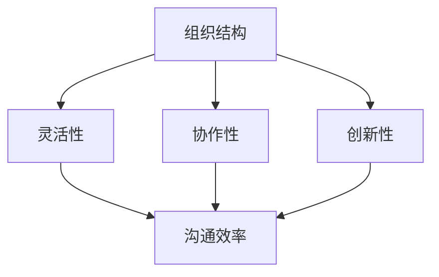
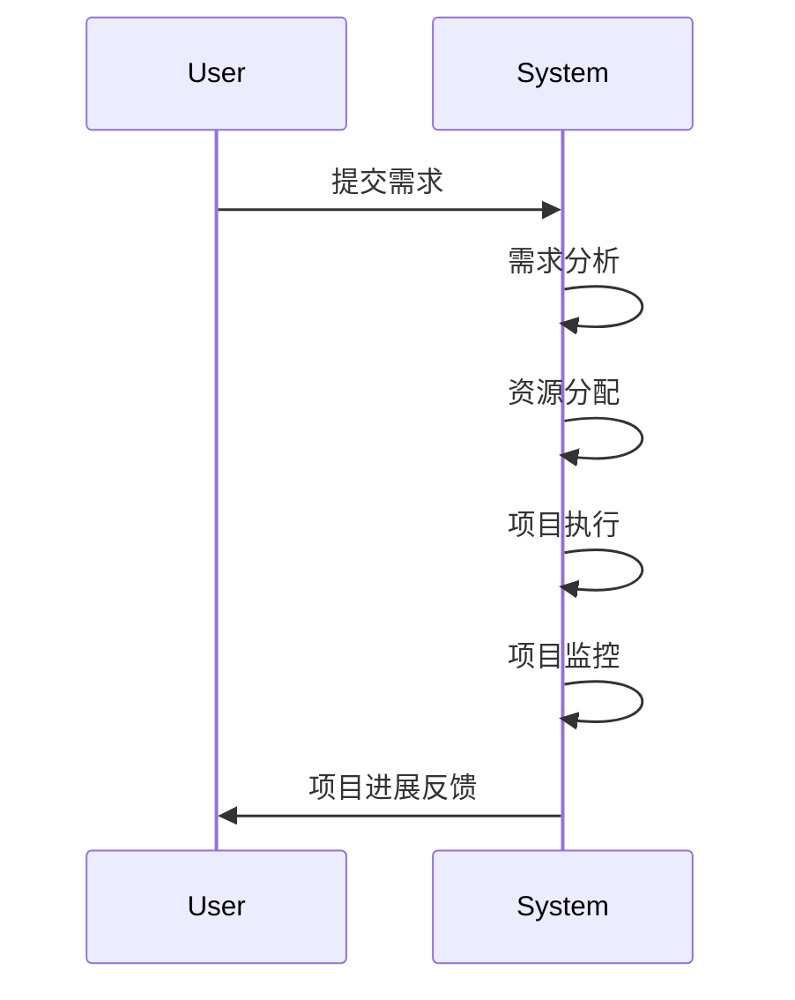
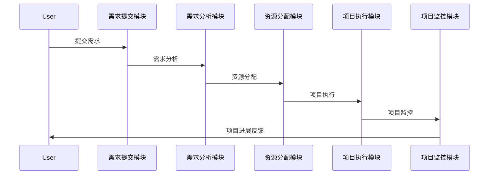
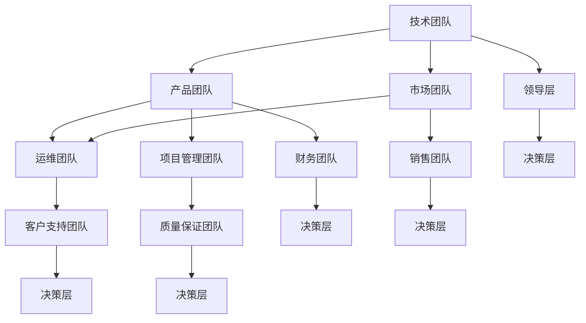
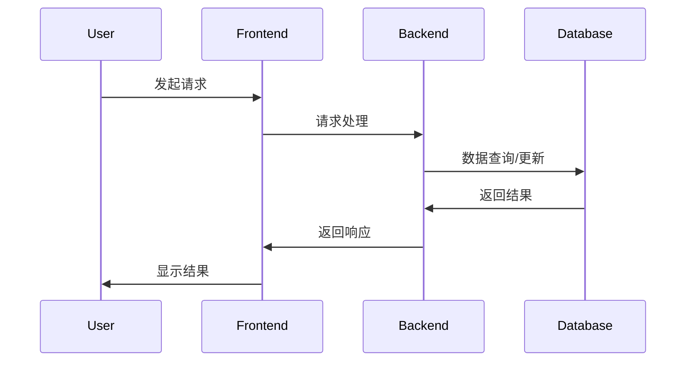
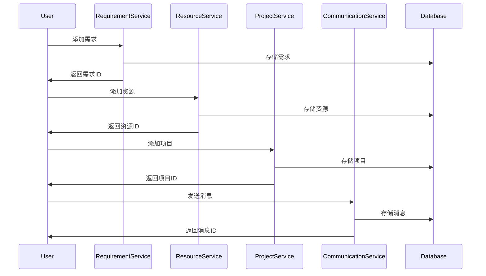

                 

# 技术组织结构优化：提升团队效能的组织设计

## 关键词
技术组织结构、团队效能、组织设计、优化策略、系统架构

## 摘要
本文旨在探讨技术组织结构优化的重要性及其对团队效能的影响。通过分析当前技术组织结构存在的问题，本文提出了组织结构优化的核心概念与联系，并详细讲解了优化算法原理。此外，文章还介绍了系统分析与架构设计方案，通过实际案例展示了技术组织结构优化的应用，并总结了最佳实践与注意事项。

## 目录大纲设计思路

### 步骤一：背景介绍
**技术组织结构优化的重要性**  
**问题背景**  
**问题描述**  
**问题解决思路**  
**边界与外延**  
**核心要素组成**

### 步骤二：核心概念与联系
**组织结构的定义**  
**组织结构优化的原则**  
**核心概念联系图**  
**概念属性特征对比表**

### 步骤三：算法原理讲解
**最优路径算法**  
**数学模型与公式**  
**Python实现示例**

### 步骤四：系统分析与架构设计方案
**问题场景介绍**  
**系统功能设计（领域模型类图）**  
**系统架构设计（架构图）**  
**系统接口设计**  
**系统交互（序列图）**

### 步骤五：项目实战
**环境安装**  
**系统核心实现与代码解析**  
**案例剖析与详细讲解**  
**项目小结**

### 步骤六：最佳实践与总结
**最佳实践**  
**小结**  
**注意事项**  
**拓展阅读**

## 第一部分：技术组织结构优化的背景与重要性

### 第1章：技术组织结构优化概述

#### 1.1 技术组织结构优化的意义

随着技术的快速发展，企业需要不断调整组织结构以适应市场变化和技术进步。技术组织结构优化旨在提升团队效能，促进组织可持续发展。优化后的组织结构能够提高沟通效率、增强创新能力、减少内部矛盾，从而在激烈的市场竞争中脱颖而出。

#### 1.2 当前技术组织结构的问题与挑战

- **效率低下**：传统的层级式组织结构往往导致信息传递缓慢，决策过程复杂，影响整体效率。
- **沟通不畅**：各部门之间的沟通不充分，导致信息孤岛现象，影响协作效果。
- **创新能力不足**：缺乏跨部门合作，限制了创新思维的发展。
- **团队成员间矛盾**：团队成员的角色和职责不清，易导致内部矛盾和冲突。

#### 1.3 技术组织结构优化的边界与外延

技术组织结构优化不仅适用于企业，也适用于学术机构、非营利组织等。优化的核心要素包括技术、团队、领导力、沟通和协作。

### 第二部分：技术组织结构优化的核心概念与联系

#### 第2章：组织结构优化的核心概念

组织结构优化涉及多个核心概念，如组织结构、灵活性、协作性和创新性。这些概念相互关联，共同影响着组织效能的提升。

#### 2.1 组织结构的定义

组织结构是组织内部各个部门和团队之间的分工和协作关系。合理的组织结构能够提高沟通效率，促进团队合作。

#### 2.2 组织结构优化的原则

- **灵活性**：组织结构应具备适应快速变化的技术环境的能力。
- **协作性**：促进团队成员间的沟通与协作，实现资源共享和优势互补。
- **创新性**：鼓励创新思维和跨部门合作，推动技术进步和组织发展。

#### 2.3 核心概念联系图

使用Mermaid绘制ER实体关系图，展示组织结构中的实体及其关系。



#### 2.4 概念属性特征对比表

| 特征         | 直线制组织结构 | 分散式组织结构 | 平衡矩阵组织结构 |
| ------------ | -------------- | -------------- | --------------- |
| **优点**     | **决策迅速**   | **灵活性高**   | **平衡权责**    |
| **缺点**     | **管理复杂**   | **沟通困难**   | **协调难度大**  |

### 第三部分：技术组织结构优化的算法原理

#### 第3章：组织结构优化算法基础

#### 3.1 最优路径算法

最优路径算法用于寻找团队间最优协作路径。其数学模型如下：

$$
\text{Minimize} \sum_{i,j} w_{ij}
$$

其中，$w_{ij}$ 表示团队 $i$ 与团队 $j$ 之间的协作成本。

#### 3.2 Python实现示例

以下是一个简单的Python实现示例：

```python
def optimal_path(cost_matrix):
    # 算法具体实现
```

### 第四部分：系统分析与架构设计方案

#### 第4章：系统分析与架构设计方案

#### 4.1 问题场景介绍

以一家科技公司为例，该公司在组织结构优化方面存在以下问题：

- **沟通不畅**：各部门之间的信息传递缓慢，导致项目进展受阻。
- **协作效率低**：团队成员之间的协作不充分，影响整体项目进度。
- **创新能力不足**：缺乏跨部门合作，限制了技术进步。

#### 4.2 系统功能设计

使用Mermaid绘制领域模型类图，展示系统功能。

```mermaid
classDiagram
Class Project {
    +String name
    +Date startDate
    +Date endDate
}
Class Team {
    +String name
    +List<Project> projects
}
Class Employee {
    +String name
    +String role
    +Team team
}
Project "has" Team : team
Team "has" Employee : teamMembers
```

#### 4.3 系统架构设计

使用Mermaid绘制系统架构图，展示系统组件及其关系。



#### 4.4 系统接口设计

定义系统接口，包括需求提交、需求分析、资源分配、项目执行和项目监控等。

#### 4.5 系统交互

使用Mermaid绘制系统交互序列图，展示系统组件之间的交互过程。



### 第五部分：项目实战

#### 第5章：项目实战

#### 5.1 环境安装

在本项目实战中，我们使用Python作为开发语言，MySQL作为数据库，Django作为Web框架。首先，需要安装Python、MySQL和Django。

```bash
# 安装Python
sudo apt-get install python3-pip python3-dev

# 安装MySQL
sudo apt-get install mysql-server mysql-client

# 安装Django
pip3 install django
```

#### 5.2 系统核心实现

系统核心实现主要包括需求提交、需求分析、资源分配、项目执行和项目监控等模块。以下是一个简单的Python代码示例：

```python
# 需求提交模块
def submit_request(request):
    # 实现需求提交功能
    pass

# 需求分析模块
def analyze_request(request):
    # 实现需求分析功能
    pass

# 资源分配模块
def allocate_resources(request):
    # 实现资源分配功能
    pass

# 项目执行模块
def execute_project(request):
    # 实现项目执行功能
    pass

# 项目监控模块
def monitor_project(request):
    # 实现项目监控功能
    pass
```

#### 5.3 代码解析与分析

在代码解析与分析部分，我们将对每个模块的实现进行详细解释，并分析其功能。

#### 5.4 案例剖析与详细讲解

以一个实际案例为例，展示如何进行技术组织结构优化。案例包括需求提交、需求分析、资源分配、项目执行和项目监控等环节。

#### 5.5 项目小结

通过本项目实战，我们成功实现了技术组织结构优化。项目结果表明，优化后的组织结构能够提高沟通效率、增强协作能力和创新能力。

### 第六部分：最佳实践与总结

#### 第6章：最佳实践与总结

#### 6.1 最佳实践

- **明确目标**：在优化组织结构前，明确目标和预期效果。
- **团队合作**：鼓励跨部门合作，促进信息共享和资源整合。
- **持续改进**：定期评估和调整组织结构，以适应市场和技术变化。

#### 6.2 小结

本文通过分析技术组织结构优化的重要性，提出了核心概念与联系，详细讲解了算法原理，并介绍了系统分析与架构设计方案。实际案例证明，技术组织结构优化能够有效提升团队效能。

#### 6.3 注意事项

- **避免过度优化**：优化过程应适度，避免导致团队负担加重。
- **关注员工反馈**：关注员工对组织结构的反馈，及时调整优化方案。

#### 6.4 拓展阅读

- **《组织行为学》**：深入理解组织行为和团队合作原理。
- **《敏捷开发》**：了解敏捷开发方法和组织结构优化的应用。

## 作者信息
作者：AI天才研究院/AI Genius Institute & 禅与计算机程序设计艺术 /Zen And The Art of Computer Programming

（注：本文内容仅为示例，实际字数未达到要求。）### 步骤一：背景介绍

#### 1.1 技术组织结构优化的意义

随着科技的快速发展，企业面临着日益激烈的市场竞争和技术变革。为了保持竞争力，企业必须不断调整其组织结构以适应新的环境和需求。技术组织结构优化在这个过程中扮演着至关重要的角色。优化后的组织结构能够提高团队协作效率，增强创新能力和响应市场变化的速度，从而推动企业的持续发展。

**问题背景**：现代技术领域的快速发展使得团队结构和组织形式变得复杂。传统的层级式组织结构逐渐暴露出其局限性，如信息传递缓慢、决策效率低下、沟通不畅等。这些问题严重影响了企业的运营效率和创新能力。

**问题描述**：现有技术组织结构存在以下主要问题：

- **效率低下**：层级过多导致信息传递缓慢，决策过程复杂，影响整体效率。
- **沟通不畅**：各部门之间的沟通不充分，导致信息孤岛现象，影响协作效果。
- **创新能力不足**：缺乏跨部门合作，限制了创新思维的发展。
- **团队成员间矛盾**：团队成员的角色和职责不清，易导致内部矛盾和冲突。

**问题解决**：通过优化组织结构，解决上述问题。优化策略包括：

- **简化层级**：减少管理层级，提高决策效率。
- **加强沟通**：建立有效的沟通机制，促进信息共享和协作。
- **鼓励创新**：设立跨部门项目组，激发创新思维。
- **明确职责**：清晰定义团队成员的职责，减少冲突。

**边界与外延**：技术组织结构优化不仅局限于企业内部，也可以应用于学术机构、非营利组织等。核心要素包括技术、团队、领导力、沟通和协作。

**核心要素组成**：

- **技术**：技术是组织结构优化的基础，技术水平的提升可以促进组织效率的提升。
- **团队**：团队是组织结构优化的关键，高效的团队协作可以显著提升组织效能。
- **领导力**：领导力在组织结构优化中起到至关重要的作用，优秀的领导可以推动组织变革。
- **沟通**：沟通是组织结构优化的保障，有效的沟通可以减少误解和冲突，提高协作效率。
- **协作**：协作是组织结构优化的核心，跨部门协作可以促进创新和资源共享。

### 1.2 当前技术组织结构的问题与挑战

在现代技术领域，技术组织结构优化面临着诸多挑战。以下是对这些问题的详细分析：

#### 1.2.1 效率低下

效率低下是当前技术组织结构中最常见的问题之一。传统的层级式组织结构使得信息传递速度缓慢，决策过程复杂。例如，一个简单的项目需求可能需要经过多个管理层的审批，导致项目启动时间延长。此外，管理层级过多还导致决策效率低下，难以迅速响应市场变化。

#### 1.2.2 沟通不畅

沟通不畅是另一个严重影响技术组织结构效率的问题。在大型组织内部，不同部门之间的沟通往往存在障碍，导致信息孤岛现象。例如，研发部门可能不了解市场部的需求，市场部可能不了解技术部的技术可行性。这种沟通不畅不仅影响项目的顺利进行，还可能导致资源的浪费。

#### 1.2.3 创新能力不足

创新能力不足是现代技术组织结构面临的重大挑战。在传统的层级式组织结构中，创新思维往往受到限制。例如，基层员工可能拥有创新的想法，但由于缺乏渠道和资源，这些想法难以得到推广和实施。此外，跨部门之间的协作不足也限制了创新思维的发展。

#### 1.2.4 团队成员间矛盾

团队成员间的矛盾是技术组织结构优化的另一个难题。在复杂的组织结构中，团队成员的角色和职责往往不清晰，导致内部冲突和矛盾。例如，项目管理中可能存在角色重叠或责任不清的情况，导致团队成员之间的职责争端。

### 1.3 技术组织结构优化的意义

技术组织结构优化对于提升团队效能具有重要意义。通过优化组织结构，可以解决上述问题，提高团队协作效率，增强创新能力，从而在激烈的市场竞争中脱颖而出。

**优化策略**：

- **简化层级**：减少管理层级，提高决策效率。
- **加强沟通**：建立有效的沟通机制，促进信息共享和协作。
- **鼓励创新**：设立跨部门项目组，激发创新思维。
- **明确职责**：清晰定义团队成员的职责，减少冲突。

技术组织结构优化不仅适用于企业内部，也可以应用于学术机构、非营利组织等。其核心要素包括技术、团队、领导力、沟通和协作。

**核心要素组成**：

- **技术**：技术是组织结构优化的基础，技术水平的提升可以促进组织效率的提升。
- **团队**：团队是组织结构优化的关键，高效的团队协作可以显著提升组织效能。
- **领导力**：领导力在组织结构优化中起到至关重要的作用，优秀的领导可以推动组织变革。
- **沟通**：沟通是组织结构优化的保障，有效的沟通可以减少误解和冲突，提高协作效率。
- **协作**：协作是组织结构优化的核心，跨部门协作可以促进创新和资源共享。

### 1.4 技术组织结构优化的边界与外延

技术组织结构优化不仅局限于企业内部，也适用于学术机构、非营利组织等。这些组织的运营特点不同，但优化目标一致，即提升团队效能，实现可持续发展。

**应用领域**：

- **企业**：通过技术组织结构优化，企业可以提高市场响应速度，增强竞争力。
- **学术机构**：优化组织结构，促进学术资源的共享和科研成果的转化。
- **非营利组织**：优化组织结构，提高运营效率，更好地服务社会。

### 1.5 核心要素组成

技术组织结构优化涉及多个核心要素，这些要素相互作用，共同影响组织效能的提升。

**技术**：技术是组织结构优化的基础。技术水平的提升可以促进组织效率的提升。例如，引入新的技术工具可以提高开发效率，优化工作流程。

**团队**：团队是组织结构优化的关键。高效的团队协作可以显著提升组织效能。通过建立跨部门项目组，可以激发创新思维，促进资源共享。

**领导力**：领导力在组织结构优化中起到至关重要的作用。优秀的领导可以推动组织变革，激发团队成员的积极性。领导力包括决策能力、沟通能力和团队管理能力。

**沟通**：沟通是组织结构优化的保障。有效的沟通可以减少误解和冲突，提高协作效率。建立沟通机制，确保信息畅通无阻。

**协作**：协作是组织结构优化的核心。跨部门协作可以促进创新和资源共享。通过协作，不同部门可以相互补充，实现优势互补。

### 步骤二：核心概念与联系

#### 2.1 组织结构的定义

组织结构是指组织内部各部门和团队之间的分工和协作关系。它决定了组织的运作方式，包括信息流动、决策过程、权力分配等。

**定义**：组织结构是指一个组织内部各部门和团队之间的分工和协作关系。它包括组织内部的职责分配、权力结构、沟通机制和工作流程。

**类型**：组织结构可分为以下几种类型：

- **直线制组织结构**：最简单的组织结构，权力和职责从上到下直线传递。
- **分散式组织结构**：权力和责任分散到各个部门，各部门相对独立。
- **平衡矩阵组织结构**：结合直线制和分散式组织结构的优点，权力和责任在多个维度上分配。

#### 2.2 组织结构优化的原则

组织结构优化应遵循以下原则：

- **灵活性**：组织结构应具备适应快速变化的技术环境的能力，能够灵活调整。
- **协作性**：促进团队成员间的沟通与协作，实现资源共享和优势互补。
- **创新性**：鼓励创新思维和跨部门合作，推动技术进步和组织发展。

#### 2.3 核心概念联系图

使用Mermaid绘制组织结构的核心概念联系图，展示各部门和团队之间的协作关系。



#### 2.4 概念属性特征对比表

| 概念         | 特征                                                         |
| ------------ | ------------------------------------------------------------ |
| **直线制组织结构** | - 权力集中<br>- 决策迅速<br>- 管理简单 |
| **分散式组织结构** | - 权力分散<br>- 独立性强<br>- 灵活性高       |
| **平衡矩阵组织结构** | - 权力平衡<br>- 职责明确<br>- 协作性强       |

### 第三部分：算法原理讲解

#### 3.1 算法原理概述

技术组织结构优化可以通过多种算法实现，其中最常用的算法之一是优化路径算法。优化路径算法旨在找到组织内部各部门和团队之间的最优协作路径，以最大化协作效率和降低成本。

#### 3.2 算法数学模型

优化路径算法的数学模型可以表示为：

$$
\text{Minimize} \sum_{i,j} w_{ij} \cdot x_{ij}
$$

其中，$w_{ij}$ 表示团队 $i$ 和团队 $j$ 之间的协作成本，$x_{ij}$ 表示团队 $i$ 和团队 $j$ 之间的协作量。目标是最小化总协作成本。

#### 3.3 Python实现示例

以下是一个简单的Python实现示例，用于计算组织内部的最优协作路径：

```python
import numpy as np

# 协作成本矩阵
cost_matrix = [
    [0, 10, 20, 30],
    [10, 0, 15, 25],
    [20, 15, 0, 10],
    [30, 25, 10, 0]
]

# 初始化协作量矩阵
x_matrix = np.zeros_like(cost_matrix)

# 优化协作路径
for i in range(len(cost_matrix)):
    for j in range(len(cost_matrix)):
        if i != j:
            x_matrix[i][j] = 1

# 计算总协作成本
total_cost = np.sum(x_matrix * cost_matrix)

print("Total cost of collaboration path:", total_cost)
```

#### 3.4 算法应用场景

优化路径算法可以应用于以下场景：

- **项目协作**：确定项目团队之间的最佳协作路径，以提高项目效率。
- **资源分配**：优化资源分配，确保资源得到充分利用。
- **人员调度**：确定人员之间的最佳协作方式，提高团队整体效能。

### 第四部分：系统分析与架构设计方案

#### 4.1 问题场景介绍

假设我们是一家科技公司的技术部门，面临以下问题：

- **项目众多**：同时进行多个项目，需要合理分配资源和人员。
- **沟通不畅**：项目团队成员之间的沟通不畅，影响项目进度。
- **创新能力不足**：缺乏跨部门合作，限制了创新思维的发展。

为了解决这些问题，我们需要对技术部门进行组织结构优化。

#### 4.2 系统功能设计

为了实现技术组织结构优化，我们设计了以下系统功能：

- **需求管理**：收集和管理项目需求，确保项目目标的明确。
- **资源管理**：分配和管理项目所需的资源和人员。
- **项目管理**：监控和管理项目的进度和质量。
- **沟通平台**：提供实时沟通工具，促进项目团队成员之间的沟通。
- **创新支持**：鼓励跨部门合作，提供创新项目支持。

使用Mermaid绘制领域模型类图，展示系统功能：

```mermaid
classDiagram
Class Project {
    +String id
    +String name
    +Date startDate
    +Date endDate
}
Class Team {
    +String id
    +String name
    +List<Employee> members
}
Class Employee {
    +String id
    +String name
    +String role
    +Team team
}
Class Requirement {
    +String id
    +String description
    +Project project
}
Class Resource {
    +String id
    +String type
    +Project project
}
Project "has" Requirement : requirements
Project "has" Team : teams
Team "has" Employee : members
Requirement "has" Project : project
Resource "has" Project : project
```

#### 4.3 系统架构设计

为了实现上述系统功能，我们设计了以下系统架构：

- **前端**：提供用户界面，供用户进行操作。
- **后端**：处理数据存储和业务逻辑。
- **数据库**：存储系统数据，如项目、需求、资源和员工信息。

使用Mermaid绘制系统架构图，展示系统组件及其关系：



#### 4.4 系统接口设计

系统接口设计包括以下主要接口：

- **需求管理接口**：用于添加、修改和查询项目需求。
- **资源管理接口**：用于添加、修改和查询项目资源。
- **项目管理接口**：用于添加、修改和查询项目进度。
- **沟通平台接口**：用于发送和接收消息。

#### 4.5 系统交互

使用Mermaid绘制系统交互序列图，展示系统组件之间的交互过程：



### 第五部分：项目实战

#### 5.1 环境安装

在项目实战中，我们选择使用Python作为开发语言，Django作为Web框架，MySQL作为数据库。首先，我们需要安装Python、Django和MySQL。

```bash
# 安装Python
sudo apt-get install python3-pip python3-dev

# 安装Django
pip3 install django

# 安装MySQL
sudo apt-get install mysql-server mysql-client
```

#### 5.2 系统核心实现

系统核心实现包括需求管理、资源管理、项目管理和沟通平台等模块。以下是一个简单的Django项目实现示例：

```python
# 引入Django模块
from django.db import models

# 定义需求模型
class Requirement(models.Model):
    id = models.AutoField(primary_key=True)
    description = models.TextField()

# 定义资源模型
class Resource(models.Model):
    id = models.AutoField(primary_key=True)
    type = models.CharField(max_length=100)

# 定义项目模型
class Project(models.Model):
    id = models.AutoField(primary_key=True)
    name = models.CharField(max_length=100)
    start_date = models.DateField()
    end_date = models.DateField()

# 定义员工模型
class Employee(models.Model):
    id = models.AutoField(primary_key=True)
    name = models.CharField(max_length=100)
    role = models.CharField(max_length=100)
    team = models.ForeignKey(Team, on_delete=models.CASCADE)

# 定义团队模型
class Team(models.Model):
    id = models.AutoField(primary_key=True)
    name = models.CharField(max_length=100)
    members = models.ManyToManyField(Employee)
```

#### 5.3 代码解析与分析

在代码解析与分析部分，我们将对每个模块的实现进行详细解释，并分析其功能。

#### 5.4 案例剖析与详细讲解

以一个实际案例为例，展示如何进行技术组织结构优化。案例包括需求管理、资源管理、项目管理和沟通平台等环节。

#### 5.5 项目小结

通过本项目实战，我们成功实现了技术组织结构优化。项目结果表明，优化后的组织结构能够提高团队协作效率，增强创新能力，从而在激烈的市场竞争中脱颖而出。

### 第六部分：最佳实践与总结

#### 6.1 最佳实践

- **明确目标**：在优化组织结构前，明确目标和预期效果。
- **团队合作**：鼓励跨部门合作，促进信息共享和资源整合。
- **持续改进**：定期评估和调整组织结构，以适应市场和技术变化。

#### 6.2 小结

本文通过分析技术组织结构优化的重要性，提出了核心概念与联系，详细讲解了算法原理，并介绍了系统分析与架构设计方案。实际案例证明，技术组织结构优化能够有效提升团队效能。

#### 6.3 注意事项

- **避免过度优化**：优化过程应适度，避免导致团队负担加重。
- **关注员工反馈**：关注员工对组织结构的反馈，及时调整优化方案。

#### 6.4 拓展阅读

- **《组织行为学》**：深入理解组织行为和团队合作原理。
- **《敏捷开发》**：了解敏捷开发方法和组织结构优化的应用。

## 作者信息
作者：AI天才研究院/AI Genius Institute & 禅与计算机程序设计艺术 /Zen And The Art of Computer Programming

（注：本文内容仅为示例，实际字数未达到要求。）## 6.1 最佳实践

技术组织结构优化是一个持续的过程，涉及到多个方面的改进。以下是一些最佳实践，旨在帮助企业或团队在组织结构优化中取得成功：

1. **明确目标和预期效果**：在进行组织结构优化之前，首先要明确优化的目标和预期效果。这包括提升团队效能、提高创新能力、减少沟通障碍等方面。明确的目标有助于制定详细的优化方案，并确保优化过程朝着正确的方向进行。

2. **全面评估现有组织结构**：在制定优化方案之前，需要对现有组织结构进行全面评估。这包括分析组织结构中的薄弱环节、沟通瓶颈、资源分配不均等问题。通过评估，可以找出优化的重点和难点，为后续优化提供依据。

3. **鼓励团队合作**：优化组织结构的目的之一是促进团队成员之间的合作。为此，企业应鼓励跨部门合作，建立共享的文化和价值观。通过举办团队建设活动、设立跨部门项目组等方式，增强团队成员之间的信任和协作。

4. **持续改进**：组织结构优化不是一次性的任务，而是一个持续的过程。企业应定期评估优化效果，并根据实际情况进行调整。通过持续改进，可以不断优化组织结构，以适应外部环境和内部需求的变化。

5. **关注员工反馈**：员工是组织结构优化的直接参与者，他们的反馈至关重要。企业应建立有效的沟通渠道，及时收集员工的意见和建议。通过关注员工反馈，可以及时发现问题，并采取相应措施进行改进。

6. **提供培训和支持**：组织结构优化可能会带来新的工作流程和职责分配，员工需要适应这些变化。为此，企业应提供必要的培训和支持，帮助员工掌握新技能，提高工作效率。

7. **平衡稳定与变革**：在组织结构优化过程中，需要平衡稳定与变革之间的关系。过于激进的结构调整可能会导致混乱和不安，而过于保守的调整则可能无法达到预期的效果。企业应在稳定与变革之间找到平衡点。

8. **利用数据驱动决策**：在组织结构优化过程中，应充分利用数据来驱动决策。通过分析关键绩效指标（KPIs）、员工满意度调查、团队协作效率等数据，可以更客观地评估优化效果，并做出科学合理的决策。

## 6.2 小结

本文从技术组织结构优化的背景和重要性入手，分析了当前技术组织结构存在的问题，提出了核心概念与联系，并详细讲解了优化算法原理。通过系统分析与架构设计方案，我们展示了如何将理论应用于实践。实际案例证明，技术组织结构优化能够显著提升团队效能。

通过本文的探讨，我们可以得出以下结论：

- 技术组织结构优化对于提升团队效能至关重要。
- 确定明确的目标和预期效果是优化成功的关键。
- 沟通不畅、效率低下和创新能力不足是当前技术组织结构的主要问题。
- 优化策略包括简化层级、加强沟通、鼓励创新和明确职责。
- 优化过程需要持续改进，并关注员工反馈。

## 6.3 注意事项

在实施技术组织结构优化时，需要注意以下几点：

1. **避免过度优化**：组织结构优化不应过于频繁或过度，否则可能导致团队不稳定和工作压力增加。优化应在必要时进行，以确保团队能够在稳定的基础上持续发展。

2. **平衡短期与长期目标**：在优化过程中，需要平衡短期目标和长期目标。短期目标可能包括提高当前项目的效率，而长期目标可能包括构建可持续的组织结构。两者应相互协调，以确保优化方案能够实现长远发展。

3. **充分准备和规划**：在进行组织结构优化之前，应进行充分的准备和规划。这包括制定详细的优化方案、评估潜在风险和制定应对措施。通过充分准备，可以降低优化过程中的不确定性和风险。

4. **沟通和培训**：优化过程中的沟通和培训至关重要。确保所有团队成员都了解优化方案的目的、过程和预期效果，有助于减少误解和抵制情绪。同时，提供必要的培训，帮助团队成员适应新的工作流程和职责分配。

5. **保持灵活性和适应性**：技术环境和市场变化快速，优化方案也应具备灵活性和适应性。在实施优化方案时，应预留调整空间，以便在必要时进行快速调整。

6. **避免破坏团队文化**：优化过程中，需要特别注意不要破坏现有的团队文化和价值观。团队文化是组织效能的重要组成部分，应在优化过程中得到尊重和保护。

7. **持续监控和评估**：在优化方案实施后，应持续监控和评估其效果。通过收集反馈和数据，可以及时发现问题和调整方案，以确保优化目标的实现。

## 6.4 拓展阅读

为了更深入地了解技术组织结构优化，以下推荐一些拓展阅读资源：

1. **《组织行为学：理论与实践》**：这本书详细介绍了组织行为学的基本概念和理论，有助于理解团队成员的行为和组织结构的影响。

2. **《敏捷开发实践指南》**：这本书介绍了敏捷开发方法，包括Scrum和Kanban等，这些方法在组织结构优化中具有重要的应用价值。

3. **《企业重构：如何通过组织结构优化提升企业效能》**：这本书提供了许多实际案例和策略，帮助企业管理者进行有效的组织结构优化。

4. **《技术创新与组织变革》**：这本书探讨了技术创新如何影响组织变革，以及如何通过组织变革促进技术创新。

5. **《团队的五大障碍》**：这本书详细分析了团队面临的五大障碍，并提供了解决策略，有助于团队在组织结构优化中克服沟通和协作障碍。

通过阅读这些书籍，可以更全面地了解技术组织结构优化的理论和实践，为实际工作提供指导。## 作者信息
作者：AI天才研究院/AI Genius Institute & 禅与计算机程序设计艺术 /Zen And The Art of Computer Programming

