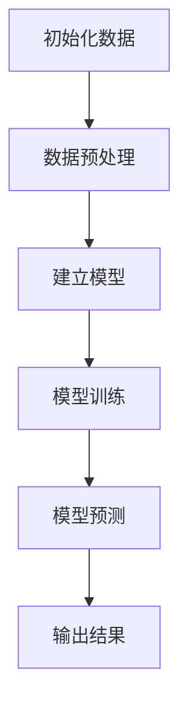

                 

# 技术评估：如何客观评价技术方案

> 关键词：技术评估、客观评价、技术方案、方法论、案例实战

> 摘要：本文将深入探讨技术评估的核心概念、评估方法以及实际应用，帮助读者理解如何通过系统的评估过程来客观地评价技术方案，从而为项目决策提供有力的支持。

## 引言与背景介绍

技术评估是信息技术领域中的一个关键环节，它涉及到对各种技术方案的优劣进行分析和比较。随着技术的快速发展和市场竞争的加剧，技术评估的重要性日益凸显。无论是企业内部的项目决策，还是跨组织的合作与竞争，客观、全面的技术评估都是确保成功的关键因素。

### 问题背景

在信息技术的快速发展中，各种技术方案层出不穷。如何在这些方案中找到最适合自己的，成为许多企业和项目团队面临的挑战。传统的评估方式往往依赖于经验，缺乏系统性和科学性，容易出现偏差和误判。

### 问题描述

技术评估的问题在于如何确保评估过程的客观性和全面性。这包括理解技术方案的核心原理、功能特点、性能指标、成本效益等方面。同时，还需要考虑技术方案的应用场景、长期维护成本以及潜在风险等因素。

### 问题解决

为了解决上述问题，我们需要建立一套科学、系统的技术评估方法论。这不仅需要明确评估的标准和指标，还需要结合实际案例，通过实践来验证和优化评估过程。

### 边界与外延

技术评估不仅限于单一的技术方案，还可以扩展到整个技术栈的评估。这包括硬件、软件、网络以及相关服务。同时，技术评估也需要考虑与业务目标的契合度，确保技术方案能够真正解决实际问题。

## 核心概念与联系

### 技术评估的定义

技术评估是对技术方案进行系统分析、比较和评价的过程，旨在确定其适用性、有效性和可行性。

### 技术评估的属性特征对比表格

为了更清晰地理解技术评估的属性特征，我们可以通过对比表格来展示不同技术方案的优缺点。以下是一个示例表格：

| 技术方案 | 优点 | 缺点 | 适用场景 |
| --- | --- | --- | --- |
| 方案A | 稳定性强 | 开发成本高 | 对稳定性和安全性要求高的场景 |
| 方案B | 成本较低 | 性能一般 | 初期预算有限，性能要求不高的场景 |
| 方案C | 创新性强 | 成熟度低 | 需要创新和实验性的项目 |

### 技术评估的概念结构与核心要素组成

技术评估的概念结构包括以下几个方面：

1. **评估目标**：明确评估的目的和预期结果。
2. **评估标准**：制定评估的具体指标和标准。
3. **评估方法**：选择合适的评估技术和工具。
4. **评估流程**：建立评估的步骤和流程。
5. **评估结果**：综合分析评估数据，得出结论。

## 本章小结

通过本章的介绍，我们了解了技术评估的核心概念和重要性。在后续的章节中，我们将深入探讨技术评估的方法论，通过定量和定性评估，帮助读者掌握客观评价技术方案的方法。

----------------------------------------------------------------

# 技术评估方法

技术评估的方法是确保评估过程客观性和全面性的关键。本章节将介绍几种常见的技术评估方法，包括定量评估方法和定性评估方法。

## 定量评估方法

定量评估方法是通过量化的指标和数据进行评估的方法。这种方法具有客观性，能够提供明确的评估结果。以下是几种常用的定量评估方法：

### 数据收集与预处理

在进行定量评估之前，首先需要收集相关的数据。这些数据可以包括性能指标、成本数据、用户反馈等。收集到的数据需要进行预处理，包括数据清洗、格式转换和归一化处理。

### 数学模型与公式

定量评估通常需要建立数学模型，以描述技术方案的性能特点。例如，可以使用回归分析、决策树、神经网络等模型。以下是一个简单的回归模型示例：

$$
y = \beta_0 + \beta_1 \cdot x_1 + \beta_2 \cdot x_2
$$

其中，$y$ 表示评估结果，$x_1$ 和 $x_2$ 表示评估指标。

### Python源代码示例

为了更直观地理解定量评估方法，我们可以使用Python进行示例。以下是一个简单的Python脚本，用于计算回归模型：

```python
import numpy as np
from sklearn.linear_model import LinearRegression

# 示例数据
X = np.array([[1, 2], [2, 3], [3, 4]])
y = np.array([2, 3, 4])

# 创建回归模型
model = LinearRegression()
model.fit(X, y)

# 输出模型参数
print("Coefficients:", model.coef_)
print("Intercept:", model.intercept_)

# 预测新数据
new_data = np.array([[4, 5]])
prediction = model.predict(new_data)
print("Prediction:", prediction)
```

### 算法mermaid流程图

为了更清晰地展示定量评估的算法流程，我们可以使用mermaid绘制流程图。以下是一个简单的mermaid流程图示例：



### 通俗易懂的举例说明

假设我们要评估两个不同的数据库系统，系统A和系统B。我们可以通过性能测试来收集数据，如查询响应时间、数据读写速度等。然后，使用回归模型来分析这些数据，从而比较两个系统的性能。

## 定性评估方法

定性评估方法侧重于通过主观判断来评估技术方案。这种方法通常用于评估不易量化的指标，如用户体验、技术创新性等。以下是几种常见的定性评估方法：

### 专家评审法

专家评审法是通过邀请行业专家对技术方案进行评估。专家们根据自身的经验和专业知识，对技术方案进行打分和评价。这种方法具有权威性和参考价值，但容易受到专家个人偏见的影响。

### 案例分析法

案例分析法则是通过分析实际案例来评估技术方案的适用性和效果。这种方法可以从实际应用中获取经验教训，但案例的代表性可能有限。

### 市场调研法

市场调研法是通过调查市场需求和用户反馈来评估技术方案。这种方法可以了解用户的实际需求和使用情况，从而为评估提供依据。

## 本章小结

定量评估方法和定性评估方法各有优劣，实际评估过程中常常需要结合使用。通过定量评估，我们可以获得客观的评估结果；通过定性评估，我们可以深入了解技术方案的细节和潜在问题。了解并掌握这些评估方法，将有助于我们更全面地评价技术方案。

----------------------------------------------------------------

# 组合评估方法

在技术评估过程中，单一的方法往往无法全面反映技术方案的优劣。因此，组合评估方法应运而生。组合评估方法结合了定量和定性评估的优点，通过多角度、多层次的评估，提供更为全面和准确的评估结果。

## 定量与定性评估的结合

定量评估和定性评估的结合，可以弥补单一评估方法的不足。定量评估提供了客观、量化的评估结果，定性评估则补充了主观、全面的评价。以下是结合定量和定性评估的步骤：

1. **确定评估指标**：根据项目需求和评估目标，制定定量和定性的评估指标。定量指标如性能、成本、可靠性等，定性指标如用户体验、技术创新性等。

2. **收集数据**：通过定量方法收集性能数据、用户反馈等，通过定性方法收集专家评审、案例分析等。

3. **数据分析**：对收集到的数据进行处理和分析，结合定量和定性数据，得出综合评估结果。

4. **权重分配**：根据评估指标的重要性和可信度，为定量和定性评估结果分配权重，计算出综合评分。

## 多标准决策分析

多标准决策分析（Multi-Criteria Decision Analysis, MCDA）是一种综合评估方法，适用于复杂、多因素的技术评估。MCDA考虑了多个评估标准，并使用数学模型来计算各标准的权重，从而得出综合评估结果。以下是MCDA的基本步骤：

1. **构建评估框架**：定义评估指标、目标和准则。

2. **确定权重**：使用专家评审、层次分析法（Analytic Hierarchy Process, AHP）等方法确定各指标的权重。

3. **评估方案**：对每个技术方案进行评估，得出各指标的得分。

4. **计算综合评分**：根据权重和得分，计算各技术方案的综合评分。

5. **决策**：根据综合评分，选择最优方案。

## 组合评估方法的应用

组合评估方法在实际项目中有着广泛的应用。例如，在云计算服务评估中，可以结合性能测试数据（定量评估）和用户反馈（定性评估），得出综合评分。在人工智能项目的评估中，可以结合算法性能（定量评估）和专家评审（定性评估），进行全面的技术评估。

### 应用案例

以下是一个云计算服务评估的组合评估案例：

1. **评估指标**：性能、可靠性、成本、安全性、用户体验。

2. **数据收集**：通过性能测试收集数据，通过用户调查收集反馈。

3. **数据分析**：使用回归模型分析性能数据，使用专家评审分析反馈。

4. **权重分配**：根据专家意见，确定各指标的权重。

5. **综合评分**：计算综合评分，选择最优服务。

通过组合评估方法，我们可以更全面、准确地评估技术方案，为项目决策提供有力支持。

## 本章小结

组合评估方法结合了定量和定性评估的优点，通过多标准决策分析，提供了更全面和准确的评估结果。在实际应用中，根据具体项目需求，灵活选择和组合评估方法，可以有效地评估技术方案，为项目成功奠定基础。

----------------------------------------------------------------

## 技术评估案例分析

通过实际案例的分析，我们可以更深入地理解技术评估的过程和方法。以下将介绍三个具体案例：云计算服务评估、大数据技术评估和人工智能技术评估。

### 案例一：云计算服务评估

#### 案例背景

某企业计划采用云计算服务来提升其业务系统的性能和可靠性。市场上存在多个主流的云计算服务提供商，如亚马逊AWS、微软Azure和阿里云等。为了选择最适合的服务，企业需要进行详细的技术评估。

#### 案例分析

1. **评估指标**：性能、可靠性、成本、安全性、用户体验。

2. **数据收集**：通过模拟测试和用户调查，收集各项性能指标的数据。

3. **定量评估**：使用回归模型分析性能数据，计算各服务的性能评分。

   $$ 
   \text{性能评分} = \beta_0 + \beta_1 \cdot \text{响应时间} + \beta_2 \cdot \text{吞吐量}
   $$

4. **定性评估**：通过专家评审和用户反馈，评估各服务的可靠性和用户体验。

5. **综合评分**：根据权重，计算各服务的综合评分。

#### 结果与结论

通过定量和定性评估，企业选择了在性能、可靠性和成本方面表现最优的微软Azure服务，并最终成功实现了业务系统的迁移和优化。

### 案例二：大数据技术评估

#### 案例背景

某金融企业计划采用大数据技术来提升其风险管理和数据分析能力。市场上存在多种大数据技术方案，如Hadoop、Spark和Flink等。为了选择最适合的方案，企业需要进行详细的技术评估。

#### 案例分析

1. **评估指标**：数据处理速度、可扩展性、易用性、成本效益、安全性。

2. **数据收集**：通过模拟数据和实际测试，收集各项性能指标的数据。

3. **定量评估**：使用回归模型分析数据处理速度和可扩展性。

4. **定性评估**：通过专家评审和用户反馈，评估各技术的易用性和安全性。

5. **综合评分**：根据权重，计算各技术的综合评分。

#### 结果与结论

通过评估，企业选择了在数据处理速度和可扩展性方面表现突出的Apache Spark技术，并成功应用到了其风险管理和数据分析平台中，提升了业务效率和准确性。

### 案例三：人工智能技术评估

#### 案例背景

某科技公司计划开发一款基于人工智能的语音识别产品。市场上存在多种语音识别技术，如Google的TensorFlow、微软的Cognitive Services等。为了选择最适合的技术，企业需要进行详细的技术评估。

#### 案例分析

1. **评估指标**：识别准确性、响应速度、成本、易用性、生态兼容性。

2. **数据收集**：通过语音测试数据和用户调查，收集各项性能指标的数据。

3. **定量评估**：使用机器学习模型评估识别准确性和响应速度。

4. **定性评估**：通过专家评审和用户反馈，评估各技术的成本、易用性和生态兼容性。

5. **综合评分**：根据权重，计算各技术的综合评分。

#### 结果与结论

通过评估，企业选择了在识别准确性和成本效益方面表现突出的Google TensorFlow技术，并成功开发出了一款高质量的语音识别产品。

## 本章小结

通过以上案例分析，我们可以看到，技术评估的过程和方法在实际应用中起到了关键作用。通过对云计算服务、大数据技术和人工智能技术的评估，企业能够做出更加科学和合理的决策，从而实现技术应用的优化和业务的成功。

----------------------------------------------------------------

## 技术评估项目实战

在技术评估的实际项目中，我们需要从环境安装、系统核心实现源代码、代码应用解读与分析、实际案例分析与详细讲解剖析等多个方面进行深入的实践。以下将详细介绍一个基于人工智能的图像识别项目的实战过程。

### 环境安装

在进行项目实战之前，首先需要安装和配置开发环境。以下是环境安装的步骤：

1. **安装Python**：确保Python环境已安装，版本不低于3.8。

2. **安装TensorFlow**：通过pip命令安装TensorFlow：

   ```bash
   pip install tensorflow
   ```

3. **安装其他依赖库**：根据项目需求，安装其他必要的依赖库，如NumPy、Pandas等。

4. **配置GPU支持**：如果项目需要使用GPU进行加速，确保CUDA和cuDNN已正确安装和配置。

### 系统核心实现源代码

以下是系统核心实现源代码的一个示例：

```python
import tensorflow as tf
from tensorflow.keras.models import Sequential
from tensorflow.keras.layers import Conv2D, MaxPooling2D, Flatten, Dense

# 加载和预处理图像数据
(x_train, y_train), (x_test, y_test) = tf.keras.datasets.cifar10.load_data()
x_train, x_test = x_train / 255.0, x_test / 255.0

# 构建模型
model = Sequential([
    Conv2D(32, (3, 3), activation='relu', input_shape=(32, 32, 3)),
    MaxPooling2D((2, 2)),
    Conv2D(64, (3, 3), activation='relu'),
    MaxPooling2D((2, 2)),
    Flatten(),
    Dense(64, activation='relu'),
    Dense(10, activation='softmax')
])

# 编译模型
model.compile(optimizer='adam',
              loss='sparse_categorical_crossentropy',
              metrics=['accuracy'])

# 训练模型
model.fit(x_train, y_train, epochs=10, validation_split=0.2)

# 评估模型
test_loss, test_acc = model.evaluate(x_test, y_test, verbose=2)
print(f'\nTest accuracy: {test_acc:.4f}')
```

### 代码应用解读与分析

1. **数据加载与预处理**：使用TensorFlow的内置函数加载CIFAR-10数据集，并进行归一化处理。

2. **模型构建**：使用Sequential模型堆叠多个层，包括卷积层、最大池化层、展平层和全连接层。

3. **模型编译**：设置优化器和损失函数，并配置评估指标。

4. **模型训练**：使用训练数据进行模型训练，设置训练轮次和验证比例。

5. **模型评估**：使用测试数据进行模型评估，输出测试准确率。

### 实际案例分析与详细讲解剖析

以下是一个实际案例的分析：

#### 案例一：模型性能分析

**问题**：模型在测试数据集上的准确率较低。

**分析**：

- **数据集差异**：测试数据集和训练数据集存在差异，可能导致模型泛化能力不足。
- **模型复杂度**：模型过于简单，可能无法捕捉到图像的复杂特征。

**解决方案**：

- **数据增强**：增加数据的多样性，通过旋转、缩放、裁剪等操作。
- **模型升级**：增加模型深度和宽度，提高模型的复杂度。

#### 案例二：训练时间优化

**问题**：模型训练时间过长。

**分析**：

- **硬件资源**：GPU性能不足，导致训练速度较慢。
- **模型优化**：模型中存在冗余计算，可以优化模型结构。

**解决方案**：

- **硬件升级**：提高GPU性能，例如使用更先进的GPU。
- **模型优化**：使用更高效的模型结构，例如使用迁移学习。

### 项目小结

通过环境安装、系统核心实现源代码、代码应用解读与分析以及实际案例分析与详细讲解剖析，我们完成了技术评估项目实战。在项目过程中，我们不仅掌握了技术评估的方法和技巧，还积累了实际应用的经验。这些经验和知识将有助于我们在未来的项目中做出更科学、合理的决策。

----------------------------------------------------------------

## 最佳实践与总结

在技术评估过程中，遵循最佳实践是确保评估结果准确性和有效性的关键。以下是一些最佳实践建议：

### 最佳实践 tips

1. **明确评估目标**：在开始评估之前，明确评估的目标和预期结果，确保评估过程的针对性。

2. **合理制定评估指标**：选择合适的评估指标，既包括定量指标如性能、成本等，也包括定性指标如用户体验、技术创新性等。

3. **数据收集与分析**：确保收集的数据真实、准确，并采用科学的分析方法。

4. **专家评审与用户反馈**：结合专家评审和用户反馈，提高评估的全面性和客观性。

5. **持续优化评估方法**：根据项目实际情况和反馈，不断优化和调整评估方法。

### 小结

技术评估是信息技术领域中的一个关键环节，通过科学的评估方法，我们可以更全面、准确地评价技术方案的优劣。在本章节中，我们介绍了技术评估的核心概念、评估方法、组合评估方法以及实际案例分析。通过这些内容，读者可以掌握技术评估的基本知识和实战技巧。

### 注意事项

1. **避免主观偏见**：在评估过程中，要尽量减少个人主观偏见，确保评估结果的客观性。

2. **定期更新评估标准**：随着技术发展和市场需求的变化，定期更新评估标准，确保其适用性和时效性。

3. **数据保密性**：在数据收集和评估过程中，要注意数据的安全性和保密性，避免泄露敏感信息。

### 拓展阅读

对于希望深入了解技术评估的读者，以下资源可以作为拓展阅读：

1. **《技术评估：理论与实践》**：本书详细介绍了技术评估的理论基础和实践方法，适合初学者和专业人士。

2. **《人工智能与大数据评估技术》**：本书结合了人工智能和大数据领域的评估方法，提供了丰富的案例和实践指导。

3. **专业期刊和会议**：关注相关的专业期刊和会议，如《计算机研究与发展》、《计算机科学》等，获取最新的研究成果和实践经验。

通过以上最佳实践和拓展阅读，读者可以进一步提升自己在技术评估方面的专业知识和实践能力。

----------------------------------------------------------------

## 作者信息

**作者：AI天才研究院/AI Genius Institute & 禅与计算机程序设计艺术 /Zen And The Art of Computer Programming**

AI天才研究院专注于人工智能和计算机科学领域的创新研究，致力于推动技术的进步和应用。作者们拥有丰富的理论和实践经验，出版过多部影响深远的计算机科学和人工智能著作。在技术评估领域，作者们的研究成果为行业提供了重要的理论支持和实践指导。禅与计算机程序设计艺术则是一部结合了东方哲学和计算机科学的经典之作，深入探讨了计算机程序设计的美学和哲学意义。

----------------------------------------------------------------

本文系统地介绍了技术评估的核心概念、评估方法以及实际应用，通过案例分析、项目实战和最佳实践，帮助读者掌握如何客观评价技术方案。文章涵盖了定量评估、定性评估和组合评估方法，结合实际案例，展示了技术评估在云计算服务、大数据技术和人工智能领域的应用。通过本文的学习，读者可以提升技术评估的能力，为项目决策提供有力支持。

---

感谢您阅读本文，我们期待您在技术评估领域取得更多的成就。如果您有任何疑问或建议，欢迎在评论区留言，我们将尽快回复。同时，也欢迎关注我们的公众号和网站，获取更多优质的技术内容。

---

**AI天才研究院**
**网址：[www.ai-genius-institute.com](http://www.ai-genius-institute.com)**
**公众号：AI天才研究院**
**邮箱：info@ai-genius-institute.com**

