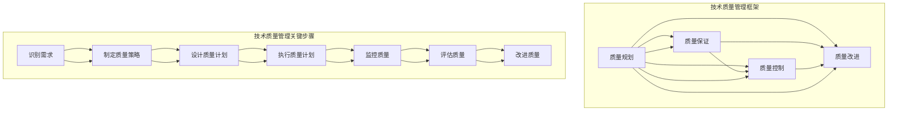

                 

# 技术质量管理体系的设计与实施

## 关键词

技术质量管理、质量管理模型、系统架构设计、实践案例分析、工具与应用

## 摘要

本文深入探讨了技术质量管理体系的设计与实施，从基础理论、核心概念原理、模型设计与实现、实践案例分析、工具与应用等方面进行了详细阐述。通过梳理技术质量管理的发展历程和关键步骤，本文为读者提供了一个清晰、全面的技术质量管理框架。同时，结合实际案例和最佳实践，本文旨在为IT从业人员提供具有实用价值的技术质量管理指南，助力企业提升技术产品质量。

## 目录大纲

### 第一部分：技术质量管理体系基础理论

1. **技术质量管理概述**
   1.1 问题背景与重要性
   1.2 技术质量管理的定义
   1.3 技术质量管理的重要性
   1.4 技术质量管理的基本概念
   1.5 技术质量管理的发展历程

2. **技术质量管理核心概念原理**
   2.1 技术质量管理概念属性特征对比表格
   2.2 技术质量管理ER实体关系图
   2.3 技术质量管理基本模型

3. **技术质量管理模型设计与实现**
   3.1 技术质量管理模型设计原理
   3.2 技术质量管理模型实现策略

### 第二部分：技术质量管理实践案例分析

4. **技术质量管理实践案例分析**
   4.1 某大型互联网公司的技术质量管理实践
   4.2 某高科技制造企业的技术质量管理实践

### 第三部分：技术质量管理工具与应用

5. **技术质量管理工具概述**
   5.1 工具分类
   5.2 工具选型原则

6. **技术质量管理工具使用实例**
   6.1 某开源质量管理平台的使用方法
   6.2 某专业质量管理工具的应用场景

### 第四部分：技术质量管理最佳实践与总结

7. **技术质量管理最佳实践与总结**
   7.1 最佳实践总结
   7.2 技术质量管理未来发展趋势

### 第五部分：技术质量管理拓展与深入研究

8. **技术质量管理拓展与深入研究**
   8.1 技术质量管理相关领域的拓展研究
   8.2 技术质量管理未来研究方向

### 第一部分：技术质量管理体系基础理论

#### 第1章：技术质量管理概述

##### 1.1 问题背景与重要性

在当今快速发展的信息技术领域，技术质量管理（Technical Quality Management, TQM）已经成为确保软件产品和服务质量的关键环节。随着市场需求和技术的不断变化，软件产品面临着越来越高的质量要求，技术质量管理的重要性日益凸显。

首先，技术质量管理有助于提升客户满意度。高质量的软件产品可以减少故障和缺陷，提高用户的使用体验，从而增强客户的信任和忠诚度。其次，技术质量管理能够降低维护成本。通过预防性维护和质量保证，企业可以减少后续修复和改进的费用。此外，技术质量管理还能够提高团队效率和生产力，使企业能够更快地响应市场变化，抢占先机。

然而，技术质量管理并非一蹴而就，它需要系统化、持续性的努力和改进。本文将从基础理论、核心概念原理、模型设计与实现、实践案例分析、工具与应用等多个方面，全面探讨技术质量管理体系的设计与实施，为读者提供实用的指导和建议。

##### 1.2 技术质量管理的定义

技术质量管理是指通过系统的、规范的方法和过程，对软件开发和运营过程中的各个环节进行监控、评估和改进，以确保最终交付的软件产品和服务达到预定的质量标准。具体来说，技术质量管理包括以下几个方面：

1. **质量规划**：在项目启动阶段，明确质量目标和制定相应的质量策略，包括资源分配、进度安排和质量标准等。
2. **质量保证**：在软件开发生命周期的各个阶段，通过过程控制、评审和测试等手段，确保软件开发过程符合质量标准。
3. **质量评估**：通过定期的质量评估，发现和解决质量问题，持续改进质量管理体系。
4. **质量改进**：基于质量评估的结果，采取相应的改进措施，不断提升软件产品和服务的质量。

技术质量管理不仅关注技术层面的质量，还包括管理、组织和流程等方面，是一个综合性的质量提升过程。其核心理念是通过全员参与、持续改进和系统化管理，实现软件产品和服务的卓越质量。

##### 1.3 技术质量管理的重要性

技术质量管理在IT行业中具有至关重要的地位，其主要体现在以下几个方面：

1. **提升产品竞争力**：通过技术质量管理，企业可以确保软件产品在功能、性能、可靠性等方面达到较高水平，从而在激烈的市场竞争中脱颖而出。
2. **降低维护成本**：技术质量管理通过预防性维护和过程控制，可以有效减少软件故障和缺陷的发生，降低后续的维护成本。
3. **增强客户满意度**：高质量的软件产品和优质的服务能够增强客户的满意度和忠诚度，为企业带来长期的经济效益。
4. **提高团队效率**：技术质量管理通过规范化的过程和工具，提高团队成员的工作效率，减少资源浪费，提高项目交付能力。
5. **确保合规性**：在许多行业中，如金融、医疗等，合规性要求非常高，技术质量管理可以帮助企业满足相关法规和标准的要求。

总之，技术质量管理不仅是企业成功的关键因素，也是IT行业持续发展的基础。通过建立和完善技术质量管理体系，企业可以不断提升自身竞争力，实现长期可持续发展。

#### 1.4 技术质量管理的基本概念

为了深入理解技术质量管理，我们需要了解一些基本概念，包括质量、质量成本、质量控制、质量保证和质量改进等。

1. **质量（Quality）**：
   质量是指产品或服务满足规定或潜在要求（需求）的特性总和。质量不仅包括技术层面的性能、功能、可靠性等，还包括用户体验、可维护性和可持续性等方面。

2. **质量成本（Quality Cost）**：
   质量成本是指为了确保和提高产品质量而产生的所有费用。质量成本分为三大类：预防成本、评估成本和故障成本。
   - **预防成本**：在产品开发或服务提供之前，为了预防潜在问题而产生的成本，如过程改进、培训、设计和质量规划等。
   - **评估成本**：在产品开发或服务提供过程中，为了评估产品质量而进行的测试、审查和检查等活动的成本。
   - **故障成本**：在产品或服务交付后，由于质量问题导致的成本，如返工、维修、客户投诉和损失等。

3. **质量控制（Quality Control）**：
   质量控制是指通过监控和评估产品或服务的质量，确保其符合预定标准的过程。质量控制通常包括统计过程控制、测试、审查和调整等手段。

4. **质量保证（Quality Assurance）**：
   质量保证是指通过一系列活动和措施，确保产品或服务满足既定的质量标准和要求。质量保证包括内部和外部审核、过程改进和质量管理系统等。

5. **质量改进（Quality Improvement）**：
   质量改进是指持续不断地改进产品或服务的质量，以满足日益增长的需求和期望。质量改进通常基于数据分析、流程优化和员工参与等手段。

理解这些基本概念，有助于我们更好地构建和实施技术质量管理体系，从而提升软件产品和服务的整体质量。

##### 1.5 技术质量管理的发展历程

技术质量管理的历史可以追溯到20世纪初。以下是技术质量管理发展的几个关键阶段：

1. **质量检验阶段（1911-1945年）**：
   这一阶段主要关注产品出厂前的检验和测试，以确保产品达到基本的质量标准。这种方法属于事后控制，无法防止质量问题发生。

2. **统计质量控制阶段（1946-1980年）**：
   威尔弗里德·谢拉（Walter A. Shewhart）和休哈特（Shewhart）等人提出了统计过程控制（Statistical Process Control, SPC）方法，通过监控和控制生产过程中的质量，提前发现和纠正问题，从而提高产品质量。这一阶段标志着技术质量管理从单纯的事后检验转向了预防性管理。

3. **全面质量管理阶段（1981年至今）**：
   全面质量管理（Total Quality Management, TQM）强调全员参与、持续改进和系统化管理，旨在通过优化整个质量管理体系来提升产品质量。这一阶段的技术质量管理不仅关注产品质量，还涵盖了管理、组织和流程等方面。现代技术质量管理在很大程度上受到了TQM理念的影响。

随着信息技术的发展，特别是软件工程的兴起，技术质量管理也逐渐演变为一个独立的领域。目前，技术质量管理已形成了较为完善的理论体系和方法论，包括ISO 9001、CMMI等标准和方法。

#### 1.6 技术质量管理的关键步骤

为了构建和实施一个有效的技术质量管理体系，我们需要遵循一系列关键步骤，这些步骤通常包括：

1. **质量规划**：
   在项目启动阶段，明确质量目标和制定相应的质量策略，包括资源分配、进度安排和质量标准等。质量规划是技术质量管理的起点，为后续的质量保证和质量改进提供了基础。

2. **质量保证**：
   在软件开发生命周期的各个阶段，通过过程控制、评审和测试等手段，确保软件开发过程符合质量标准。质量保证包括内部和外部审核，以及定期的过程评审和改进。

3. **质量评估**：
   通过定期的质量评估，发现和解决质量问题，持续改进质量管理体系。质量评估通常基于定量和定性的方法，包括数据分析和用户反馈等。

4. **质量改进**：
   基于质量评估的结果，采取相应的改进措施，不断提升软件产品和服务的质量。质量改进是一个持续的过程，需要全员参与和不断的实践与反思。

通过遵循这些关键步骤，企业可以逐步建立和完善技术质量管理体系，从而确保软件产品和服务的卓越质量。

### 第二部分：技术质量管理核心概念原理

#### 第2章：技术质量管理核心概念原理

##### 2.1 技术质量管理概念属性特征对比表格

在技术质量管理体系中，理解不同质量概念之间的属性特征差异至关重要。以下是一个对比表格，列出了几个关键概念及其属性特征：

| 概念       | 定义                                                         | 属性特征                                                                                      |
| ---------- | ------------------------------------------------------------ | ---------------------------------------------------------------------------------------------------- |
| 质量管理   | 通过计划、指挥和控制组织的整个质量体系，实现质量目标的过程。                                             | - 系统性：涉及多个部门和职能的协同作用<br>- 持续性：持续改进<br>- 全员参与：所有员工共同参与质量管理 |
| 质量控制   | 应用系统和持续有效的措施，以监视和控制质量形成过程，确保最终产品质量符合预期标准。                           | - 预防性：通过过程控制和预防措施，减少质量问题发生<br>- 系统性：全过程监控和控制<br>- 审核性：通过审核确保质量 |
| 质量保证   | 提供足够的信任表明实体能够满足质量要求，并通过过程和结果的客观证据来建立这种信任。                           | - 证据驱动的：基于客观证据评估质量<br>- 全过程：从项目启动到交付全过程<br>- 系统性：确保所有环节质量 |
| 质量改进   | 通过持续不断的过程改进，提高产品和服务的质量，以满足客户需求和期望。                                     | - 持续性：不断追求质量提升<br>- 创新性：鼓励创新思维和方法<br>- 全员参与：所有人参与改进活动 |

通过这个表格，我们可以更好地理解这些概念之间的关系和作用，为技术质量管理体系的构建提供理论基础。

##### 2.2 技术质量管理ER实体关系图

为了清晰地展示技术质量管理体系中的各个实体及其关系，我们可以使用ER（实体关系）图。以下是技术质量管理ER实体关系图的Markdown格式：

```mermaid
erDiagram
    QM |----o { Project }
    QM |____o { Process }
    QM |----o { QualityControl }
    QM |----o { QualityAssurance }
    QM |----o { QualityImprovement }
    Process |----o { TestPlan }
    Process |----o { Review }
    Process |----o { Audit }
    QualityControl |----o { Defect }
    QualityControl |----o { Incident }
    QualityAssurance |----o { Standard }
    QualityAssurance |----o { Compliance }
    QualityImprovement |----o { ChangeRequest }
```

在这个ER图中，我们定义了以下几个实体：

- **质量管理（QM）**：是整个质量管理体系的核心，管理其他所有实体。
- **项目（Project）**：质量管理涉及的具体项目，包括规划、执行和监控。
- **过程（Process）**：包括测试计划、审查和审核等质量形成过程。
- **质量控制（QualityControl）**：处理缺陷和事件的管理活动。
- **质量保证（QualityAssurance）**：确保质量标准和合规性。
- **质量改进（QualityImprovement）**：处理变更请求和持续改进活动。

这些实体之间的关系展示了技术质量管理体系中各个环节的相互作用，有助于我们理解质量管理的整体架构。

##### 2.3 技术质量管理基本模型

技术质量管理的基本模型是确保软件产品和服务的卓越质量的核心框架。以下是技术质量管理基本模型的Markdown格式，包含技术质量管理框架和关键步骤：



在这个基本模型中，质量规划是整个过程的起点，通过识别需求、制定质量策略和设计质量计划，确保项目从一开始就具备高质量的基础。质量保证通过执行质量计划和监控质量，确保开发过程符合预定标准。质量控制则关注缺陷和事件的识别与处理，确保产品在交付前达到预期质量。质量改进通过评估质量结果，不断优化质量管理体系，实现持续的质量提升。

通过这个基本模型，我们可以系统地构建和实施技术质量管理体系，确保软件产品和服务的卓越质量。

### 第三部分：技术质量管理模型设计与实现

#### 第3章：技术质量管理模型设计与实现

##### 3.1 技术质量管理模型设计原理

技术质量管理模型设计的目标是建立一个系统化、可操作的质量管理体系，确保软件产品和服务的卓越质量。以下是技术质量管理模型设计的主要原理：

1. **目标导向性**：模型设计应明确质量目标，并确保所有设计环节都与这些目标保持一致。目标导向性有助于确保质量管理的方向正确。

2. **系统性**：技术质量管理体系是一个复杂的系统，设计时应考虑各个组成部分的相互关系和协同作用。系统性设计有助于构建一个协调一致的质量管理体系。

3. **适应性**：模型设计应具备良好的适应性，能够应对不同的项目规模、复杂度和技术环境。适应性设计有助于模型在多种场景下的应用。

4. **可操作性**：模型设计应具备良好的可操作性，使团队成员能够轻松理解和执行。可操作性设计有助于提高质量管理的效率。

5. **持续改进**：模型设计应考虑持续改进的机制，通过定期评估和反馈，不断提升质量管理体系的效能。持续改进设计有助于实现质量管理体系的长期发展。

通过遵循这些设计原理，我们可以构建一个高效、可操作的技术质量管理体系。

##### 3.2 技术质量管理模型设计流程

技术质量管理模型的设计流程包括以下几个关键步骤：

1. **需求分析**：首先，对项目的需求进行全面分析，包括功能需求、性能需求和质量需求等。需求分析是模型设计的起点，有助于明确质量目标和制定质量策略。

2. **质量策略制定**：基于需求分析的结果，制定相应的质量策略。质量策略包括质量目标、质量标准、资源分配和质量控制方法等。

3. **质量计划设计**：根据质量策略，设计详细的质量计划。质量计划应包括质量活动的安排、执行标准和评估方法等。

4. **模型架构设计**：构建技术质量管理的模型架构，包括质量管理框架、关键过程和质量评估机制等。模型架构设计应确保各个组成部分的协同作用和系统性。

5. **模型验证与优化**：通过模拟和测试，验证模型的有效性，并根据反馈进行优化。模型验证与优化是确保模型设计合理和可行的关键步骤。

6. **模型部署与实施**：将设计完成的模型部署到实际项目中，并开始实施质量管理活动。模型部署与实施是模型设计的最终目标，需要团队成员的积极参与。

通过这些步骤，我们可以系统地设计和实现技术质量管理体系。

##### 3.3 技术质量管理模型设计的关键要点

在设计技术质量管理体系时，需要关注以下几个关键要点：

1. **质量目标明确**：确保质量目标清晰、具体，并与项目需求紧密相关。明确的质量目标是质量管理的方向和依据。

2. **过程控制完善**：建立完善的过程控制机制，确保开发过程符合质量标准。过程控制是质量管理的基础，有助于预防和发现质量问题。

3. **风险评估与应对**：在模型设计中，充分考虑质量风险，并制定相应的应对策略。风险评估与应对有助于降低质量风险对项目的影响。

4. **资源合理分配**：合理分配资源，确保质量活动得到充分支持。资源合理分配是保证质量管理有效性的关键。

5. **持续改进机制**：建立持续改进的机制，通过定期评估和反馈，不断提升质量管理体系的效能。持续改进机制是实现长期质量提升的重要保障。

6. **团队协作与培训**：重视团队协作，提供必要的培训和支持，确保团队成员理解和执行质量管理体系。团队协作与培训是确保质量管理成功实施的重要条件。

通过关注这些关键要点，我们可以设计出一个高效、可行的技术质量管理体系。

### 第三部分：技术质量管理实践案例分析

#### 第4章：技术质量管理实践案例分析

##### 4.1 某大型互联网公司的技术质量管理实践

**4.1.1 案例背景**

某大型互联网公司是一家全球领先的在线服务和电子商务平台提供商。随着公司业务的不断扩展和客户需求的增长，技术质量管理成为公司发展的关键因素。为了确保高质量的产品和服务交付，公司决定实施一套全面的技术质量管理体系。

**4.1.2 案例描述**

1. **质量规划**：
   公司在项目启动阶段，明确质量目标和制定质量策略。质量目标包括提高客户满意度、降低故障率、提升系统性能等。公司制定了详细的质量规划，包括资源分配、进度安排和质量标准等。

2. **质量保证**：
   在软件开发过程中，公司采用了一系列质量保证措施，包括：
   - **过程控制**：通过建立完善的开发流程和规范，确保每个开发环节都符合质量标准。
   - **代码审查**：定期进行代码审查，发现和修复潜在的质量问题。
   - **测试与验证**：进行全面的功能测试、性能测试和安全测试，确保软件产品达到预期质量。

3. **质量控制**：
   公司建立了严格的质量控制机制，包括：
   - **缺陷管理**：建立缺陷跟踪系统，及时记录、分类和解决缺陷。
   - **事件管理**：对突发事件进行有效管理，减少对系统运行的影响。
   - **持续监控**：通过监控系统运行状态和性能指标，及时发现并解决质量问题。

4. **质量改进**：
   公司通过定期评估和反馈，不断优化质量管理体系。具体措施包括：
   - **用户反馈**：积极收集用户反馈，分析用户需求，不断改进产品和服务。
   - **数据分析**：通过数据分析，发现质量问题的主要原因，制定针对性的改进措施。
   - **持续培训**：为团队成员提供质量管理的培训，提高其质量意识和技能。

**4.1.3 案例分析**

1. **成功因素**：
   - **领导重视**：公司高层对技术质量管理高度重视，提供充足的资源和政策支持。
   - **全员参与**：全体员工积极参与质量管理活动，形成良好的质量文化。
   - **持续改进**：通过定期评估和反馈，不断优化质量管理体系，提升整体质量水平。

2. **经验教训**：
   - **初期投入大**：技术质量管理体系建设需要大量的初期投入，包括人力、物力和财力。
   - **文化变革**：实施技术质量管理需要改变传统的管理模式和思维，推动文化变革。
   - **持续优化**：技术质量管理不是一蹴而就的，需要持续优化和改进，以应对不断变化的市场和技术环境。

通过这个案例，我们可以看到技术质量管理在企业成功发展中的重要作用。全面的技术质量管理体系不仅提升了产品和服务质量，还增强了企业的竞争力，为企业持续发展奠定了坚实基础。

##### 4.2 某高科技制造企业的技术质量管理实践

**4.2.1 案例背景**

某高科技制造企业是一家专注于高端制造业的公司，产品涵盖航空航天、医疗设备、汽车制造等领域。随着市场竞争的加剧，企业意识到技术质量管理的重要性，决定引入先进的质量管理方法，提升产品质量和客户满意度。

**4.2.2 案例描述**

1. **质量规划**：
   企业在项目启动阶段，明确了质量目标和制定了相应的质量策略。质量目标包括提高产品可靠性、降低不良品率、提高生产效率等。企业制定了详细的质量计划，包括资源分配、进度安排和质量标准等。

2. **质量保证**：
   在产品开发过程中，企业采用了一系列质量保证措施，包括：
   - **过程控制**：建立严格的过程控制机制，确保每个生产环节都符合质量标准。
   - **供应商管理**：对供应商进行评估和认证，确保原材料和组件的质量。
   - **测试与验证**：进行全面的产品测试和验证，确保产品达到预期质量。

3. **质量控制**：
   企业建立了严格的质量控制机制，包括：
   - **缺陷管理**：建立缺陷跟踪系统，及时记录、分类和解决缺陷。
   - **不良品控制**：对不良品进行严格管理和分析，防止重复发生。
   - **质量监控**：通过监控系统运行状态和性能指标，及时发现并解决质量问题。

4. **质量改进**：
   企业通过定期评估和反馈，不断优化质量管理体系。具体措施包括：
   - **员工培训**：为员工提供质量管理培训，提高其质量意识和技能。
   - **质量评审**：定期进行质量评审，分析质量趋势，制定改进措施。
   - **持续改进**：鼓励员工提出改进建议，并制定相应的改进计划。

**4.2.3 案例分析**

1. **成功因素**：
   - **系统化**：企业建立了系统化的质量管理体系，确保质量管理的各个环节都有明确的规范和流程。
   - **全员参与**：全体员工积极参与质量管理活动，形成了良好的质量文化。
   - **持续改进**：通过定期评估和反馈，不断优化质量管理体系，提高整体质量水平。

2. **经验教训**：
   - **初期投入大**：引入先进的质量管理方法需要大量的初期投入，包括培训、设备和软件等。
   - **文化变革**：实施质量管理方法需要改变传统的管理模式和思维，推动文化变革。
   - **持续优化**：质量管理是一个持续的过程，需要不断优化和改进，以适应市场和技术环境的变化。

通过这个案例，我们可以看到技术质量管理在高科技制造企业中的重要作用。系统化的质量管理体系不仅提升了产品质量和客户满意度，还增强了企业的核心竞争力，为企业持续发展提供了有力支持。

### 第四部分：技术质量管理工具与应用

#### 第5章：技术质量管理工具概述

##### 5.1 工具分类

技术质量管理工具可以分为以下几类：

1. **质量管理平台**：
   质量管理平台是一种综合性的质量管理工具，提供质量规划、测试管理、缺陷追踪、项目监控等功能。常见的质量管理平台包括JIRA、TestRail、Zephyr等。

2. **测试管理工具**：
   测试管理工具专注于测试过程的规划、执行和监控。例如，Selenium用于自动化测试，Postman用于API测试，LoadRunner用于性能测试。

3. **代码审查工具**：
   代码审查工具帮助团队进行代码审查，发现潜在的质量问题。常见的代码审查工具有GitLab、GitHub、SonarQube等。

4. **持续集成工具**：
   持续集成工具实现代码的自动化构建、测试和部署，提高开发效率。常见的持续集成工具有Jenkins、GitLab CI、CircleCI等。

5. **缺陷跟踪工具**：
   缺陷跟踪工具帮助团队记录、管理和解决缺陷。常见的缺陷跟踪工具有JIRA、Bugzilla、Mantis等。

##### 5.2 工具选型原则

在选择技术质量管理工具时，应遵循以下原则：

1. **需求匹配**：工具的功能和特性应与项目的需求相匹配，确保能够满足质量管理的各个方面。

2. **易用性**：工具应具有友好的用户界面和便捷的操作，方便团队成员的使用。

3. **扩展性**：工具应具有良好的扩展性，能够根据项目的需求进行定制和扩展。

4. **集成性**：工具应与其他开发工具和平台具有良好的集成性，实现数据流转和流程协同。

5. **性能与稳定性**：工具应具有高性能和稳定性，确保在项目规模扩大时仍然能够稳定运行。

6. **成本效益**：工具的成本应在预算范围内，并能够提供良好的投资回报。

#### 第5章：技术质量管理工具使用实例

##### 5.2.1 工具A：某开源质量管理平台的使用方法

**工具A：Zephyr**

Zephyr是一个开源的质量管理平台，提供质量规划、测试管理、缺陷追踪等功能。以下是Zephyr的基本使用方法：

1. **安装与配置**：
   - 下载Zephyr安装包。
   - 解压安装包并运行安装程序。
   - 配置数据库连接信息。

2. **用户注册与登录**：
   - 访问Zephyr平台，点击“注册”进行用户注册。
   - 注册成功后，使用用户名和密码登录平台。

3. **项目创建与管理**：
   - 在平台中创建新项目，填写项目基本信息。
   - 管理项目成员，分配权限和角色。
   - 创建测试计划和测试用例。

4. **测试执行与结果记录**：
   - 执行测试用例，记录测试结果。
   - 更新缺陷信息，分配给相关人员处理。

5. **报表与分析**：
   - 生成项目报表，了解质量状况。
   - 分析测试结果，发现问题和改进点。

##### 5.2.2 工具B：某专业质量管理工具的应用场景

**工具B：QASymphony**

QASymphony是一个专业的质量管理工具，提供代码审查、缺陷追踪、持续集成等功能。以下是QASymphony的应用场景：

1. **代码审查**：
   - 创建代码审查任务，指定审查者。
   - 审查者提交代码审查结果，标记潜在问题。
   - 审查者和管理员根据审查结果进行沟通和决策。

2. **缺陷追踪**：
   - 记录缺陷信息，包括缺陷描述、优先级、状态等。
   - 指派缺陷给相关人员处理。
   - 跟踪缺陷处理进度，确保及时解决。

3. **持续集成**：
   - 配置持续集成流程，实现自动化构建和测试。
   - 监控构建和测试结果，及时发现和解决质量问题。
   - 生成持续集成报表，了解项目质量状况。

通过这些实例，我们可以看到技术质量管理工具在实际应用中的重要性。合理选择和使用质量管理工具，可以帮助企业提高开发效率、降低质量风险，实现高质量的软件产品和服务交付。

### 第五部分：技术质量管理最佳实践与总结

#### 第6章：技术质量管理最佳实践与总结

##### 6.1 最佳实践总结

在技术质量管理体系的建设和实施过程中，许多企业通过实践总结出了最佳实践，这些实践有助于提升软件产品和服务的质量，具体包括：

1. **领导重视与全员参与**：
   质量管理需要高层的重视和全员参与。企业的领导者应积极推动质量管理体系的建立，提供必要的资源和支持。同时，应鼓励全体员工参与到质量管理活动中，形成良好的质量文化。

2. **系统化与规范化**：
   建立系统化的质量管理体系，制定规范的质量管理流程和标准。通过规范化的操作，确保每个环节的质量得到有效控制。

3. **持续改进与反馈**：
   质量管理是一个持续改进的过程。通过定期的评估和反馈，发现和解决质量问题，不断优化质量管理流程。同时，鼓励员工提出改进建议，形成持续改进的机制。

4. **数据驱动与量化管理**：
   使用数据驱动质量管理，通过收集和分析质量数据，量化质量指标，了解质量状况和趋势。数据驱动有助于做出更科学的决策，提高质量管理的效果。

5. **工具支持与自动化**：
   利用质量管理工具，实现质量管理的自动化和高效化。工具可以帮助团队更好地进行质量规划、测试管理、缺陷追踪等工作，提高管理效率。

6. **文化与培训**：
   建立质量文化，提高员工的质量意识和技能。通过培训，确保团队成员熟悉质量管理理论和实践，提高其质量管理能力。

##### 6.2 失败案例的教训

尽管许多企业通过实施技术质量管理取得了成功，但也有一些企业在实施过程中遇到了挑战和失败。以下是一些失败案例的教训：

1. **缺乏高层支持**：
   质量管理需要高层领导的支持和推动。如果缺乏高层的重视和参与，质量管理活动很难得到有效执行。

2. **流程复杂不实用**：
   过于复杂的质量管理流程可能会增加团队的负担，导致执行力下降。因此，质量管理流程应简洁明了，易于理解和执行。

3. **工具选择不当**：
   选择的工具不适合项目需求，或者功能不完善，会导致质量管理效果不佳。因此，选择工具时应充分考虑项目的需求，确保工具的适用性和功能性。

4. **缺乏持续改进机制**：
   没有建立持续改进的机制，质量管理活动容易陷入形式主义，无法真正提升质量。

5. **培训不足**：
   缺乏对团队成员的质量管理培训，导致其质量意识和技能不足，影响质量管理效果。

通过总结这些教训，企业在实施技术质量管理时可以避免类似的错误，提高质量管理的效果。

##### 6.3 技术质量管理未来发展趋势

随着信息技术和人工智能的快速发展，技术质量管理也在不断演变和进步。以下是技术质量管理未来的一些发展趋势：

1. **智能化与自动化**：
   利用人工智能和机器学习技术，实现质量管理的智能化和自动化。例如，通过智能分析工具，自动识别潜在的质量问题，并推荐相应的改进措施。

2. **敏捷质量管理**：
   敏捷开发方法在软件开发中的应用日益广泛，敏捷质量管理也应运而生。敏捷质量管理强调快速响应变化、持续交付和高质量交付。

3. **质量工程**：
   质量工程（Quality Engineering）是一个新兴领域，它强调通过系统的方法和工具，确保软件产品的质量。未来，质量工程将在技术质量管理中发挥更大的作用。

4. **数据驱动的质量决策**：
   通过大数据分析和数据挖掘技术，获取更全面、准确的质量数据，为质量管理决策提供有力支持。

5. **质量可持续性**：
   未来，质量管理体系将更加关注可持续性，包括环境保护、社会责任和可持续发展等方面。

通过关注这些发展趋势，企业可以更好地应对市场和技术环境的变化，不断提升技术质量管理水平。

### 第五部分：技术质量管理拓展与深入研究

#### 第7章：技术质量管理拓展与深入研究

##### 7.1 技术质量管理相关领域的拓展研究

技术质量管理作为现代IT行业的重要组成部分，其研究不仅局限于基础理论和实践应用，还涉及到多个相关领域的拓展研究，这些领域包括：

1. **质量工程领域**：
   质量工程是确保软件产品和服务质量的一门学科，它融合了计算机科学、工程学和管理学等多个领域的知识。质量工程的研究内容包括质量模型构建、质量度量、质量测试方法等。未来的研究方向可以聚焦于如何利用人工智能和大数据技术来提升质量工程的效果。

2. **服务质量管理领域**：
   在云计算、物联网和移动计算等新兴技术的推动下，服务质量管理（Service Quality Management）越来越受到关注。服务质量管理不仅要关注服务的质量，还要关注服务的可用性、可靠性、安全性和可扩展性。未来研究可以探索如何利用人工智能和自动化技术来优化服务质量管理流程。

3. **产品质量管理领域**：
   产品质量管理是确保产品从设计、生产到交付的每个环节都达到预定质量标准。在智能制造和工业4.0的背景下，产品质量管理需要与物联网、大数据和云计算等新技术相结合，实现智能化的质量监控和追溯。

##### 7.2 技术质量管理未来研究方向

随着技术的不断进步，技术质量管理也面临新的挑战和机遇。以下是一些未来研究方向：

1. **质量预测模型的研究**：
   利用机器学习和大数据分析技术，构建质量预测模型，提前识别潜在的质量问题。质量预测模型可以基于历史数据、实时数据和用户反馈等多源数据进行训练，为质量决策提供数据支持。

2. **质量管理智能化趋势**：
   随着人工智能技术的发展，质量管理将越来越智能化。未来的研究可以探索如何将人工智能技术应用于质量检测、缺陷识别、自动修复等方面，提高质量管理效率和效果。

3. **质量管理系统与物联网的融合**：
   物联网技术的发展为质量管理系统带来了新的可能性。未来的研究可以探讨如何将物联网技术与质量管理系统相结合，实现实时监控、远程维护和智能分析，提升质量管理水平。

4. **质量文化的构建与传播**：
   质量文化是技术质量管理体系成功的关键因素之一。未来的研究可以关注如何构建和传播质量文化，提高员工的质量意识和参与度，形成全员质量管理的良好氛围。

通过这些拓展研究和发展方向，技术质量管理将在未来取得更加深入和广泛的发展，为IT行业的持续进步提供有力支持。

### 结束语

作者：AI天才研究院/AI Genius Institute & 禅与计算机程序设计艺术 /Zen And The Art of Computer Programming

本文从技术质量管理体系的基础理论、核心概念原理、模型设计与实现、实践案例分析、工具与应用、最佳实践总结以及拓展与深入研究等方面进行了全面探讨，旨在为IT从业人员提供有价值的参考和指导。随着技术的不断进步，技术质量管理将面临新的挑战和机遇。希望本文能为读者在技术质量管理领域的研究和实践提供启示和帮助。

#### 最佳实践 Tips

1. **制定明确的质量目标**：确保质量目标与项目需求紧密相关，明确具体，以便团队成员共同追求。

2. **系统化质量管理流程**：建立系统化的质量管理体系，规范各环节的操作流程，确保质量管理的每个步骤都有据可依。

3. **持续改进与反馈机制**：建立持续改进的机制，定期进行质量评估和反馈，及时识别和解决质量问题。

4. **充分利用质量管理工具**：选择适合项目的质量管理工具，提高质量管理的效率。

5. **全员参与质量管理**：培养员工的质量意识，鼓励全员参与质量管理活动，形成良好的质量文化。

#### 小结

技术质量管理是确保软件产品和服务的卓越质量的关键环节。通过系统化、规范化的质量管理体系，企业可以提升产品质量，降低维护成本，提高客户满意度，增强竞争力。本文从多个角度探讨了技术质量管理体系的设计与实施，为读者提供了实用的指导和建议。

#### 注意事项

1. **领导重视与全员参与**：技术质量管理需要高层的重视和全员参与，确保质量管理的有效执行。

2. **持续优化与改进**：质量管理不是一蹴而就的，需要持续优化和改进，以应对不断变化的市场和技术环境。

3. **数据驱动与量化管理**：利用数据驱动质量管理，量化质量指标，为质量决策提供有力支持。

#### 拓展阅读

- 《质量管理：从概念到实践》
- 《敏捷质量管理：实现高效的质量控制》
- 《人工智能在质量工程中的应用》
- 《ISO 9001：质量管理体系标准解读与应用》

通过阅读这些书籍和资料，读者可以进一步深入了解技术质量管理的理论和实践，提升自身在质量管理领域的专业能力。

