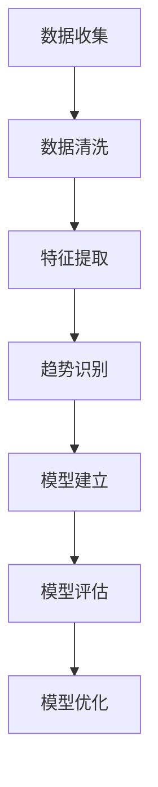
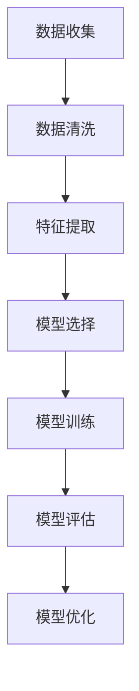
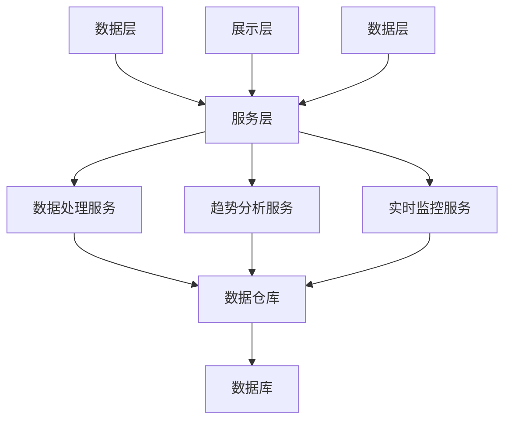
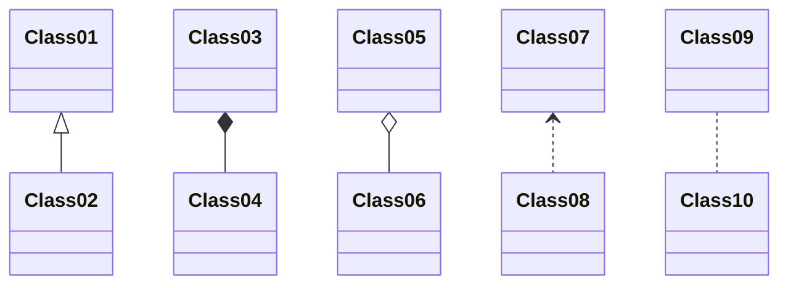

                 

# 技术趋势分析框架：准确预测技术发展方向

## 关键词
- 技术趋势分析
- 预测模型
- 数据分析
- 机器学习
- 时间序列
- 算法

## 摘要
本文将探讨技术趋势分析的重要性和背景，分析技术趋势分析的定义和内涵，构建一个有效的技术趋势分析框架，并深入解析常见的算法和数学模型。通过本文的详细阐述，读者将了解如何准确预测技术发展方向，并掌握技术趋势分析的实用方法和技巧。

## 目录大纲

# 技术趋势分析框架：准确预测技术发展方向

----------------------------------------------------------------

## 第一部分：引言与背景

## 第二部分：核心概念与联系

## 第三部分：算法原理与实现

## 第四部分：数学模型与公式解析

## 第五部分：系统分析与架构设计方案

## 第六部分：项目实战

## 第七部分：最佳实践 tips、小结、注意事项、拓展阅读

----------------------------------------------------------------

## 第一部分：引言与背景

### 第1章：技术趋势分析的重要性

### 第2章：技术趋势分析的定义与内涵

### 第3章：技术趋势分析的边界与外延

### 第4章：本章小结

----------------------------------------------------------------

### 第1章：技术趋势分析的重要性

#### 1.1 问题的背景与描述

在当今快速变化的社会中，技术的变革正在以前所未有的速度进行。从互联网到人工智能，从大数据到区块链，技术的进步不仅改变了我们的生活方式，也深刻影响了各个行业的运营模式。因此，如何准确预测技术发展方向，已经成为企业、政府和研究者共同关注的重要课题。

#### 1.1.1 现代社会的技术变革

现代社会的技术变革体现在多个方面。例如，互联网的普及使得信息传播更加迅速，人们可以随时随地获取各种信息；人工智能的应用使得机器能够模拟甚至超越人类的一些智能行为；大数据和云计算的结合使得数据处理和分析能力大幅提升；区块链技术的兴起为去中心化的数据管理和价值交换提供了新的解决方案。

#### 1.1.2 技术预测的必要性

技术预测的必要性体现在以下几个方面：

1. **企业战略规划**：企业需要根据技术发展趋势来制定相应的战略规划，以便在竞争中保持领先地位。
2. **政策制定**：政府需要了解技术发展趋势，以便制定相关政策和法规，促进技术健康发展。
3. **学术研究**：研究者需要预测技术发展趋势，以便确定研究重点和方向，推动科学技术的进步。
4. **投资决策**：投资者需要了解技术发展趋势，以便做出正确的投资决策，获得更大的收益。

#### 1.1.3 技术预测的意义与影响

准确的技术预测对于个人、企业和整个社会都具有重要意义：

1. **个人职业发展**：了解技术发展趋势可以帮助个人更好地规划自己的职业路径，抓住职业发展的机会。
2. **企业竞争优势**：准确的技术预测可以帮助企业发现新的商业机会，制定有效的市场策略，提升竞争力。
3. **社会经济发展**：技术预测有助于推动社会经济的持续发展，促进产业升级和转型。
4. **科技创新**：技术预测可以引导资源向具有潜力的技术领域倾斜，促进科技创新和突破。

#### 1.2 技术趋势分析的定义与内涵

技术趋势分析是一种通过分析历史数据、市场动态和技术发展规律，预测未来技术发展趋势的方法。它包括以下几个核心要素：

1. **数据收集**：收集与技术发展相关的数据，包括技术专利、市场报告、学术论文等。
2. **数据处理**：对收集到的数据进行分析和清洗，提取有价值的信息。
3. **趋势识别**：利用统计学方法和机器学习算法，识别技术发展的趋势。
4. **预测**：基于识别出的趋势，预测未来技术发展的方向和可能的变化。
5. **验证与优化**：通过对比预测结果与实际发展情况，验证预测的准确性，并不断优化模型。

#### 1.3 技术趋势分析的边界与外延

技术趋势分析虽然具有重要的应用价值，但也存在一定的局限性：

1. **数据限制**：技术趋势分析依赖于数据，如果数据不充分或者质量较差，预测的准确性会受到影响。
2. **模型限制**：现有的技术趋势分析模型可能无法完全捕捉到所有的影响因素，导致预测结果存在偏差。
3. **动态变化**：技术发展是一个动态变化的过程，预测结果可能受到突发事件的干扰。
4. **未来不确定性**：技术发展具有高度的不确定性，完全预测未来的走向是非常困难的。

#### 1.4 本章小结

技术趋势分析在现代社会中具有重要意义。通过分析技术发展的历史数据、市场动态和技术规律，我们可以预测未来技术发展的趋势，为企业战略规划、政策制定、学术研究和投资决策提供有力支持。然而，技术趋势分析也存在一定的局限性，需要我们不断优化分析模型，提高预测准确性。

----------------------------------------------------------------

### 第2章：技术趋势分析的定义与内涵

#### 2.1 技术趋势分析的定义

技术趋势分析是一种通过分析历史数据、市场动态和技术发展规律，预测未来技术发展趋势的方法。它旨在识别技术发展的趋势和模式，以便为个人、企业和政府提供决策依据。

#### 2.1.1 技术趋势分析的定义

技术趋势分析（Technological Trend Analysis）是一种综合性的分析方法，它通过对大量历史数据进行挖掘和分析，识别出技术发展的趋势、模式和关键影响因素，从而为未来技术的预测和决策提供依据。

#### 2.1.2 技术趋势分析的内涵

技术趋势分析的内涵包括以下几个方面：

1. **数据收集**：技术趋势分析首先需要收集与技术发展相关的数据，这些数据可以来源于多个渠道，如专利数据库、学术论文、市场报告、用户反馈等。

2. **数据处理**：收集到的数据通常需要经过清洗、整合和预处理，以便去除噪声和冗余信息，提高数据质量。

3. **趋势识别**：通过统计学方法和机器学习算法，对处理后的数据进行分析，识别出技术发展的趋势和模式。

4. **预测**：基于识别出的趋势和模式，利用数学模型和预测算法，对未来的技术发展进行预测。

5. **验证与优化**：通过对比预测结果与实际发展情况，评估预测的准确性，并不断优化模型，提高预测精度。

#### 2.1.3 技术趋势分析的核心要素

技术趋势分析的核心要素包括以下几个：

1. **数据源**：技术趋势分析依赖于高质量的数据源，如专利数据库、学术论文、市场报告等。

2. **分析方法**：技术趋势分析采用的方法主要包括统计学方法、机器学习算法和深度学习模型等。

3. **预测模型**：技术趋势分析需要建立预测模型，以实现对技术发展趋势的准确预测。

4. **评估指标**：技术趋势分析需要使用评估指标，如预测准确性、模型拟合度等，来评估预测模型的性能。

5. **优化策略**：技术趋势分析需要不断优化模型，提高预测精度，以适应技术发展的动态变化。

#### 2.2 技术趋势分析框架的构建

技术趋势分析框架是一个系统化的分析过程，包括以下几个步骤：

1. **需求分析**：明确技术趋势分析的目标和应用场景，确定分析的关键指标和范围。

2. **数据收集**：从各种数据源收集与技术发展相关的数据，包括专利、学术论文、市场报告等。

3. **数据处理**：对收集到的数据进行清洗、整合和预处理，确保数据质量。

4. **趋势识别**：利用统计学方法和机器学习算法，对处理后的数据进行分析，识别出技术发展的趋势和模式。

5. **预测**：基于识别出的趋势和模式，建立预测模型，并对未来的技术发展进行预测。

6. **验证与优化**：通过对比预测结果与实际发展情况，评估预测模型的准确性，并不断优化模型。

#### 2.3 技术趋势分析的应用领域

技术趋势分析可以应用于多个领域，包括：

1. **企业战略规划**：通过技术趋势分析，企业可以识别出未来可能出现的市场机会和威胁，制定相应的战略规划。

2. **学术研究**：研究者可以通过技术趋势分析，发现研究热点和前沿领域，为研究方向的选择提供依据。

3. **政策制定**：政府可以通过技术趋势分析，了解技术发展的趋势和影响，制定相关政策，促进技术创新和产业发展。

4. **投资决策**：投资者可以通过技术趋势分析，识别出具有潜力的技术领域，做出更明智的投资决策。

#### 2.4 本章小结

技术趋势分析是一种重要的分析方法，通过分析历史数据和识别技术发展的趋势和模式，可以帮助企业和个人做出更明智的决策。了解技术趋势分析的定义和内涵，掌握技术趋势分析的核心要素和分析框架，是进行有效技术趋势分析的基础。

----------------------------------------------------------------

### 第3章：技术趋势分析的边界与外延

#### 3.1 技术趋势分析的适用范围

技术趋势分析的适用范围非常广泛，它可以应用于各个行业和领域，如信息技术、生物技术、新能源技术、智能制造等。在不同的应用场景中，技术趋势分析的目标和侧重点可能会有所不同。

1. **信息技术行业**：在信息技术领域，技术趋势分析可以帮助企业了解未来技术的发展方向，为产品研发和战略规划提供依据。例如，通过分析云计算、大数据、人工智能等技术的趋势，企业可以确定未来的技术投资方向。

2. **生物技术行业**：在生物技术领域，技术趋势分析可以帮助研究人员了解前沿生物技术的研究进展和未来发展方向，为科研创新提供指导。例如，通过分析基因编辑、生物信息学、再生医学等技术的趋势，研究人员可以确定研究重点和方向。

3. **新能源技术行业**：在新能源技术领域，技术趋势分析可以帮助企业了解新能源技术的发展趋势和市场需求，为产品研发和市场推广提供依据。例如，通过分析太阳能、风能、电池技术等新能源技术的趋势，企业可以确定未来的产品开发方向。

4. **智能制造行业**：在智能制造领域，技术趋势分析可以帮助企业了解智能制造技术的发展趋势和关键领域，为智能制造系统的设计和实施提供指导。例如，通过分析物联网、工业互联网、机器人技术等智能制造技术的趋势，企业可以确定智能制造系统的技术架构和功能模块。

#### 3.2 技术趋势分析的限制因素

虽然技术趋势分析在各个领域都有广泛的应用，但它也存在一些限制因素，这些限制因素可能影响技术趋势分析的准确性和有效性。

1. **数据限制**：技术趋势分析依赖于大量的数据，如果数据来源有限或者数据质量较差，可能会导致分析结果的偏差。例如，某些领域的数据可能不够全面或者存在噪声和冗余信息。

2. **模型限制**：现有的技术趋势分析模型可能无法完全捕捉到所有的影响因素，这可能导致分析结果的偏差。例如，某些模型可能更适合处理特定类型的数据或者特定的发展趋势。

3. **动态变化**：技术发展是一个动态变化的过程，技术趋势可能会受到突发事件或者外部环境的影响而发生变化。例如，某些新技术可能会迅速崛起，而某些传统技术可能会迅速衰落。

4. **未来不确定性**：技术发展具有高度的不确定性，完全预测未来的走向是非常困难的。例如，虽然某些技术趋势可能在一段时间内保持稳定，但未来可能会出现新的突破或者颠覆性创新。

#### 3.3 技术趋势分析的未来发展趋势

随着人工智能和大数据技术的不断发展，技术趋势分析也在不断演进。未来的技术趋势分析可能呈现以下发展趋势：

1. **智能化**：技术趋势分析将更加智能化，利用深度学习和神经网络等人工智能技术，提高分析的准确性和自动化程度。

2. **数据驱动**：技术趋势分析将更加依赖于大数据技术，通过收集和分析海量的数据，提高分析的精度和深度。

3. **多维度分析**：技术趋势分析将不仅仅关注单一的技术领域，而是关注多个领域的交叉和融合，进行多维度综合分析。

4. **实时性**：技术趋势分析将更加注重实时性，通过实时数据分析和预测，为企业提供更及时的决策支持。

5. **定制化**：技术趋势分析将更加注重个性化，根据不同企业和行业的具体需求，提供定制化的分析和预测服务。

#### 3.4 本章小结

技术趋势分析在现代社会中具有广泛的应用价值，但它也存在一定的限制因素。了解技术趋势分析的适用范围、限制因素和未来发展趋势，对于进行有效的技术趋势分析具有重要意义。通过不断优化分析模型和方法，我们可以提高技术趋势分析的准确性和有效性，为企业和个人提供更有力的决策支持。

----------------------------------------------------------------

### 第4章：本章小结

在本章中，我们详细介绍了技术趋势分析的重要性、定义与内涵，以及技术趋势分析的边界与外延。技术趋势分析作为一种通过分析历史数据、市场动态和技术发展规律，预测未来技术发展趋势的方法，对于企业战略规划、政策制定、学术研究和投资决策具有重要意义。

首先，我们探讨了技术趋势分析的背景，分析了现代社会技术变革的速度和影响，阐述了技术预测的必要性。接着，我们明确了技术趋势分析的定义与内涵，包括数据收集、数据处理、趋势识别、预测和验证与优化等核心要素。

此外，我们还讨论了技术趋势分析的边界与外延，分析了其适用范围和限制因素，并展望了技术趋势分析的未来发展趋势。通过本章的学习，读者可以初步掌握技术趋势分析的基本概念和框架，为后续章节的深入学习打下基础。

接下来，我们将进入第二部分，深入探讨技术趋势分析框架的构建，分析不同趋势分析框架的对比与选择，并介绍技术趋势分析的ER实体关系图。敬请期待！----------------------------------------------------------------

## 第二部分：核心概念与联系

### 第2章：技术趋势分析框架的构建

在技术趋势分析的实践中，构建一个科学、系统的分析框架至关重要。这一框架不仅需要涵盖数据分析的各个环节，还需具备灵活性和扩展性，以适应不同领域和需求的变化。本章将详细探讨技术趋势分析框架的构建原理、核心属性以及选择合适框架的标准，并借助ER实体关系图，帮助读者更好地理解技术趋势分析的整体结构。

### 2.1 技术趋势分析框架的原理与属性

#### 2.1.1 技术趋势分析框架的原理

技术趋势分析框架的构建基于以下几个核心原理：

1. **数据驱动的决策**：技术趋势分析依赖于大量数据，这些数据包括历史专利、学术论文、市场报告等。通过数据分析，可以挖掘出技术发展的趋势和模式。

2. **模型预测的准确性**：技术趋势分析利用统计学方法和机器学习算法建立预测模型，这些模型能够对技术发展的未来方向进行预测。模型的准确性直接影响分析结果的可靠性。

3. **动态调整与优化**：技术趋势分析是一个动态的过程，需要根据新数据的不断出现和技术的实际发展情况进行调整和优化，以保持预测的实时性和准确性。

#### 2.1.1.1 数据收集与处理

数据收集是技术趋势分析的基础。以下是数据收集与处理的关键步骤：

1. **数据来源**：选择合适的数据源，如专利数据库、学术论文数据库、市场报告等。

2. **数据清洗**：对收集到的数据进行清洗，去除重复、错误和不完整的数据。

3. **数据整合**：将来自不同来源的数据进行整合，确保数据的统一性和一致性。

4. **特征提取**：从数据中提取关键特征，为后续分析提供基础。

#### 2.1.1.2 趋势识别与预测

在数据处理完成后，下一步是趋势识别与预测：

1. **趋势识别**：利用统计学方法和机器学习算法，对数据进行趋势分析，识别技术发展的主要趋势。

2. **模型建立**：根据识别出的趋势，建立预测模型，如时间序列模型、回归模型等。

3. **模型评估**：通过验证数据，评估模型的预测性能，包括预测准确性、模型拟合度等。

4. **模型优化**：根据评估结果，对模型进行调整和优化，提高预测精度。

#### 2.1.1.3 模型评估与优化

模型评估与优化是技术趋势分析的关键环节：

1. **模型评估**：使用交叉验证、ROC曲线等评估指标，评估模型的预测性能。

2. **模型优化**：根据评估结果，对模型进行调整和优化，提高预测的准确性。

3. **反馈循环**：通过实际技术的变化情况，对预测模型进行反馈，形成反馈循环，持续优化模型。

#### 2.1.2 技术趋势分析框架的核心属性

技术趋势分析框架应具备以下核心属性：

1. **数据多样性**：框架应能够处理来自不同来源和类型的数据，包括结构化数据和非结构化数据。

2. **实时性**：框架应能够实时获取和处理数据，以便快速响应技术变化。

3. **预测准确性**：框架应具备高精度的预测能力，提供可靠的预测结果。

4. **可扩展性**：框架应具备良好的扩展性，能够适应不同规模和复杂度的应用场景。

5. **用户友好性**：框架应具备良好的用户界面，方便用户进行操作和使用。

### 2.2 技术趋势分析框架的对比与选择

在构建技术趋势分析框架时，我们需要对不同的框架进行对比和选择。以下是几种常见的趋势分析框架及其优缺点：

#### 2.2.1 历史数据分析框架

**优点**：
- 数据来源广泛，可靠性高。
- 可以挖掘长期的技术发展规律。

**缺点**：
- 数据量庞大，处理复杂。
- 可能忽视新兴技术的影响。

#### 2.2.2 机器学习框架

**优点**：
- 高度的自动化，处理能力强大。
- 能够捕捉复杂的非线性关系。

**缺点**：
- 需要大量的训练数据。
- 模型解释性较差。

#### 2.2.3 基于专家知识的框架

**优点**：
- 具有良好的解释性。
- 可以结合领域专家的经验和洞察。

**缺点**：
- 分析结果可能受限于专家的主观判断。
- 不具备自动化处理能力。

#### 2.2.4 选择合适的趋势分析框架

选择合适的趋势分析框架需要考虑以下几个因素：

1. **企业需求**：根据企业具体的技术需求和分析目标，选择最合适的框架。

2. **数据特性**：根据数据的类型、质量和数量，选择能够有效处理这些数据的框架。

3. **资源与预算**：根据企业可用的资源和预算，选择性价比最高的框架。

### 2.3 技术趋势分析的ER实体关系图

为了更好地理解技术趋势分析框架的各个组成部分和它们之间的关系，我们可以借助ER（Entity-Relationship）实体关系图来表示。以下是技术趋势分析的ER实体关系图：

```
用户 [ID, 姓名, 职责]
|
|---- 数据源 [ID, 名称, 类型, 描述]
|
|---- 分析结果 [ID, 名称, 描述, 预测时间, 预测结果]
|
+---- 分析过程 [ID, 描述, 开始时间, 结束时间]
```

#### 2.3.1 实体与关系定义

1. **用户**：进行技术趋势分析的人员或组织，具有ID、姓名和职责等属性。

2. **数据源**：提供技术趋势分析所需数据的来源，具有ID、名称、类型和描述等属性。

3. **分析结果**：技术趋势分析后的结果，包括预测时间、预测结果等。

4. **分析过程**：技术趋势分析的整体过程，包括开始时间和结束时间。

#### 2.3.2 关系描述

1. **用户与数据源的关系**：用户可以从数据源中获取数据，进行分析。

2. **数据源与分析结果的关系**：分析结果基于数据源的数据生成。

3. **用户与分析结果的关系**：用户可以查看、使用和分析结果，以便做出决策。

### 2.4 本章小结

本章详细介绍了技术趋势分析框架的构建原理、核心属性和选择标准，并借助ER实体关系图，展示了技术趋势分析的整体结构。通过本章的学习，读者可以理解技术趋势分析框架的基本原理，掌握选择合适框架的方法，为后续章节的技术分析算法学习和应用打下坚实的基础。

----------------------------------------------------------------

## 第三部分：算法原理与实现

### 第3章：常见技术趋势分析算法

在技术趋势分析中，选择合适的算法是关键。常见的技术趋势分析算法包括时间序列分析算法和机器学习算法。本章将详细介绍这两种算法的基本原理、实现方法以及如何选择合适的算法，以帮助读者更好地理解和应用这些算法。

### 3.1 时间序列分析算法

时间序列分析是一种统计学方法，用于分析时间序列数据，以便识别出数据的趋势、周期性和季节性。时间序列分析算法在技术趋势分析中具有广泛的应用。

#### 3.1.1 时间序列分析的基本原理

时间序列分析的基本原理是利用历史数据来预测未来的趋势。时间序列数据通常具有以下几个特征：

1. **时间依赖性**：时间序列中的每个数据点都依赖于前面的数据点，即当前的数据受到过去数据的影响。

2. **趋势性**：时间序列数据通常会呈现出某种趋势，如上升、下降或平稳。

3. **周期性**：时间序列数据可能会呈现出周期性的波动，如季节性波动。

4. **随机性**：时间序列数据中可能存在随机波动，这些波动可能无法通过简单的数学模型来捕捉。

#### 3.1.2 常见时间序列分析算法

1. **移动平均法**

移动平均法（Moving Average, MA）是一种简单的时间序列分析方法，通过计算一段时间内的平均值来平滑数据，从而识别出数据的趋势。

移动平均法的公式为：
$$MA(n) = \frac{1}{n} \sum_{i=1}^{n} X_i$$
其中，$X_i$ 是第 $i$ 期的数据，$n$ 是移动平均的时间窗口。

2. **指数平滑法**

指数平滑法（Exponential Smoothing, ES）是一种更加灵活的时间序列分析方法，通过赋予不同时间段的数据不同的权重，来平滑数据并识别趋势。

指数平滑法的公式为：
$$S_t = a \cdot X_t + (1 - a) \cdot S_{t-1}$$
其中，$S_t$ 是第 $t$ 期的预测值，$X_t$ 是第 $t$ 期的实际值，$a$ 是平滑系数（通常取 $0 < a < 1$）。

3. **ARIMA模型**

ARIMA（AutoRegressive Integrated Moving Average）模型是一种更为复杂的时间序列分析模型，结合了自回归（AR）、差分（I）和移动平均（MA）三个部分。

ARIMA模型的公式为：
$$X_t = c + \phi_1 X_{t-1} + \phi_2 X_{t-2} + \ldots + \phi_p X_{t-p} + \theta_1 e_{t-1} + \theta_2 e_{t-2} + \ldots + \theta_q e_{t-q} + e_t$$
其中，$X_t$ 是第 $t$ 期的数据，$c$ 是常数项，$\phi_1, \phi_2, \ldots, \phi_p$ 是自回归系数，$\theta_1, \theta_2, \ldots, \theta_q$ 是移动平均系数，$e_t$ 是误差项。

#### 3.1.3 时间序列分析算法的应用场景

1. **趋势识别**：移动平均法和指数平滑法适用于识别数据的基本趋势。

2. **短期预测**：移动平均法和指数平滑法适用于短期预测，因为它们能够快速响应数据的变化。

3. **长期预测**：ARIMA模型适用于长期预测，因为它能够捕捉数据的长期趋势和季节性。

### 3.2 机器学习算法

机器学习算法在技术趋势分析中同样具有广泛的应用。机器学习算法通过学习历史数据，建立预测模型，从而预测未来的趋势。

#### 3.2.1 机器学习算法的基本原理

机器学习算法的基本原理是通过学习历史数据中的模式，建立预测模型，并对新的数据进行预测。机器学习算法主要包括以下几个类型：

1. **监督学习**：监督学习算法通过已标记的训练数据学习模型，然后对新的数据进行预测。

2. **无监督学习**：无监督学习算法通过未标记的训练数据学习模型，用于识别数据中的模式。

3. **强化学习**：强化学习算法通过不断尝试和错误，学习如何最大化某个目标函数。

#### 3.2.2 常见机器学习算法

1. **线性回归**

线性回归（Linear Regression）是一种最简单的监督学习算法，通过建立线性关系来预测目标变量。

线性回归的公式为：
$$Y = \beta_0 + \beta_1 X_1 + \beta_2 X_2 + \ldots + \beta_n X_n$$
其中，$Y$ 是目标变量，$X_1, X_2, \ldots, X_n$ 是特征变量，$\beta_0, \beta_1, \beta_2, \ldots, \beta_n$ 是模型参数。

2. **决策树**

决策树（Decision Tree）是一种常见的监督学习算法，通过一系列的决策规则来预测目标变量。

决策树的构建过程如下：

- 选择一个特征，将其划分为多个子集；
- 对于每个子集，重复上述过程，直到满足停止条件（如最大深度、最小节点大小等）。

3. **随机森林**

随机森林（Random Forest）是一种集成学习算法，通过构建多棵决策树来提高预测的准确性。

随机森林的算法如下：

- 从特征集合中随机选择一个子集；
- 构建决策树，使用子集进行划分；
- 重复上述过程 $m$ 次，构建 $m$ 棵决策树；
- 预测结果通过多数投票（或平均值）来确定。

4. **支持向量机**

支持向量机（Support Vector Machine, SVM）是一种常见的监督学习算法，通过找到一个最佳的超平面，将数据分类到不同的类别。

支持向量机的算法如下：

- 选择一个核函数（如线性核、多项式核、径向基核等）；
- 最小化目标函数，找到最佳的超平面；
- 使用最佳超平面进行分类。

#### 3.2.3 机器学习算法的应用场景

1. **分类问题**：机器学习算法适用于分类问题，如识别技术趋势的类型、预测技术成功的概率等。

2. **回归问题**：机器学习算法适用于回归问题，如预测技术发展的趋势、预测市场的需求等。

3. **聚类问题**：机器学习算法适用于聚类问题，如识别技术发展的关键领域、发现市场的细分群体等。

### 3.3 算法比较与选择

在选择技术趋势分析算法时，需要考虑以下几个因素：

1. **数据类型**：不同的算法适用于不同类型的数据，如时间序列数据适用于时间序列分析算法，文本数据适用于自然语言处理算法。

2. **数据量**：不同的算法对数据量的要求不同，如线性回归适用于小数据量，随机森林适用于大数据量。

3. **模型复杂度**：不同的算法具有不同的复杂度，如决策树简单直观，支持向量机复杂度较高。

4. **预测准确性**：不同的算法具有不同的预测准确性，需要根据具体问题选择合适的算法。

5. **可解释性**：不同的算法具有不同的可解释性，如线性回归和决策树具有较好的可解释性，支持向量机则较为复杂。

### 3.4 算法mermaid流程图

为了更好地理解算法的实现过程，我们可以使用mermaid绘制算法的流程图。以下是时间序列分析和机器学习算法的mermaid流程图示例：

#### 时间序列分析算法流程图



#### 机器学习算法流程图



### 3.5 本章小结

本章介绍了常见的技术趋势分析算法，包括时间序列分析算法和机器学习算法。通过理解这些算法的基本原理和实现方法，读者可以更好地选择和应用合适的算法，进行技术趋势分析。同时，本章还提供了mermaid流程图，帮助读者直观地理解算法的实现过程。在后续章节中，我们将进一步深入探讨技术趋势分析的数学模型和系统架构设计。

----------------------------------------------------------------

## 第四部分：数学模型与公式解析

### 第4章：技术趋势分析的数学模型

技术趋势分析中，数学模型是核心工具，用于捕捉数据中的趋势和模式。本章节将详细解析时间序列分析的数学模型，包括时间序列的数学描述、模型参数估计以及预测方法。通过这些数学模型的解析，读者将更好地理解如何使用数学方法进行技术趋势分析。

### 4.1 时间序列分析的数学模型

时间序列分析主要关注时间序列数据的特性，如趋势、周期性和季节性。时间序列数据可以用数学模型来描述，这些模型可以用来分析和预测未来的趋势。

#### 4.1.1 时间序列的数学描述

时间序列可以表示为随机过程，其一般形式为：
$$X_t = \mu + \sigma_t$$
其中，$X_t$ 是第 $t$ 期的观察值，$\mu$ 是均值，$\sigma_t$ 是波动项。

对于非平稳时间序列，通常需要通过差分变换使其变为平稳序列。差分变换的公式为：
$$X_t^* = X_t - X_{t-1}$$
其中，$X_t^*$ 是差分后的序列。

#### 4.1.2 自回归模型（AR）

自回归模型（Autoregressive Model，AR）是一种常见的时间序列预测模型，它假设当前值是过去几个值的线性组合。AR模型的一般形式为：
$$X_t = c + \phi_1 X_{t-1} + \phi_2 X_{t-2} + \ldots + \phi_p X_{t-p} + e_t$$
其中，$c$ 是常数项，$\phi_1, \phi_2, \ldots, \phi_p$ 是自回归系数，$e_t$ 是误差项。

#### 4.1.3 移动平均模型（MA）

移动平均模型（Moving Average Model，MA）假设当前值是过去误差的加权平均。MA模型的一般形式为：
$$X_t = c + \theta_1 e_{t-1} + \theta_2 e_{t-2} + \ldots + \theta_q e_{t-q} + e_t$$
其中，$c$ 是常数项，$\theta_1, \theta_2, \ldots, \theta_q$ 是移动平均系数，$e_t$ 是误差项。

#### 4.1.4 自回归移动平均模型（ARMA）

自回归移动平均模型（Autoregressive Moving Average Model，ARMA）结合了AR和MA模型的特点，可以更好地描述时间序列数据的特性。ARMA模型的一般形式为：
$$X_t = c + \phi_1 X_{t-1} + \phi_2 X_{t-2} + \ldots + \phi_p X_{t-p} + \theta_1 e_{t-1} + \theta_2 e_{t-2} + \ldots + \theta_q e_{t-q} + e_t$$
其中，$c$ 是常数项，$\phi_1, \phi_2, \ldots, \phi_p$ 是自回归系数，$\theta_1, \theta_2, \ldots, \theta_q$ 是移动平均系数，$e_t$ 是误差项。

#### 4.1.5 自回归积分移动平均模型（ARIMA）

自回归积分移动平均模型（Autoregressive Integrated Moving Average Model，ARIMA）是对ARMA模型的扩展，它通过差分变换使序列平稳。ARIMA模型的一般形式为：
$$X_t^* = c + \phi_1 X_{t-1} + \phi_2 X_{t-2} + \ldots + \phi_p X_{t-p} + \theta_1 e_{t-1} + \theta_2 e_{t-2} + \ldots + \theta_q e_{t-q} + e_t$$
其中，$X_t^*$ 是差分后的序列，$c$ 是常数项，$\phi_1, \phi_2, \ldots, \phi_p$ 是自回归系数，$\theta_1, \theta_2, \ldots, \theta_q$ 是移动平均系数，$e_t$ 是误差项。

### 4.2 模型参数估计

模型参数估计是技术趋势分析中的关键步骤，常用的方法包括最小二乘法和极大似然估计法。

#### 4.2.1 最小二乘法

最小二乘法（Ordinary Least Squares，OLS）是一种常用的参数估计方法，它通过最小化预测误差的平方和来估计模型参数。OLS的公式为：
$$\beta = (\mathbf{X}^T \mathbf{X})^{-1} \mathbf{X}^T \mathbf{y}$$
其中，$\mathbf{X}$ 是特征矩阵，$\mathbf{y}$ 是目标变量，$\beta$ 是模型参数。

#### 4.2.2 极大似然估计法

极大似然估计法（Maximum Likelihood Estimation，MLE）是一种基于概率分布的参数估计方法，它通过最大化似然函数来估计模型参数。MLE的公式为：
$$\beta = \arg\max_{\beta} \ln L(\mathbf{y}|\mathbf{X}, \beta)$$
其中，$L(\mathbf{y}|\mathbf{X}, \beta)$ 是似然函数。

### 4.3 模型预测

模型预测是技术趋势分析的核心目标，常用的预测方法包括一步预测和滚动预测。

#### 4.3.1 一步预测

一步预测（One-Step Forecast）是最简单的预测方法，它基于当前模型直接预测下一个时间点的值。一步预测的公式为：
$$\hat{X}_{t+1} = \mathbf{X}_{t+1}^T \beta$$
其中，$\hat{X}_{t+1}$ 是预测值，$\mathbf{X}_{t+1}$ 是特征向量，$\beta$ 是模型参数。

#### 4.3.2 滚动预测

滚动预测（Rolling Forecast）是一种基于历史数据进行预测的方法，它通过不断更新模型和预测结果，以适应数据的变化。滚动预测的公式为：
$$\hat{X}_{t+k} = \mathbf{X}_{t+k}^T \beta_t$$
其中，$\hat{X}_{t+k}$ 是 $t+k$ 时刻的预测值，$\beta_t$ 是第 $t$ 次迭代后的模型参数。

### 4.4 模型评估

模型评估是技术趋势分析的重要环节，常用的评估指标包括均方误差（Mean Squared Error，MSE）、平均绝对误差（Mean Absolute Error，MAE）和决定系数（Coefficient of Determination，R²）。

#### 4.4.1 均方误差（MSE）

均方误差（MSE）是评估模型预测误差的常用指标，它的公式为：
$$MSE = \frac{1}{n} \sum_{i=1}^{n} (\hat{y}_i - y_i)^2$$
其中，$\hat{y}_i$ 是第 $i$ 个预测值，$y_i$ 是实际值，$n$ 是样本数量。

#### 4.4.2 平均绝对误差（MAE）

平均绝对误差（MAE）是评估模型预测误差的另一种指标，它的公式为：
$$MAE = \frac{1}{n} \sum_{i=1}^{n} |\hat{y}_i - y_i|$$
其中，$\hat{y}_i$ 是第 $i$ 个预测值，$y_i$ 是实际值，$n$ 是样本数量。

#### 4.4.3 决定系数（R²）

决定系数（R²）是评估模型拟合度的指标，它的公式为：
$$R^2 = 1 - \frac{\sum_{i=1}^{n} (\hat{y}_i - y_i)^2}{\sum_{i=1}^{n} (y_i - \bar{y})^2}$$
其中，$\hat{y}_i$ 是第 $i$ 个预测值，$y_i$ 是实际值，$\bar{y}$ 是实际值的平均值，$n$ 是样本数量。

### 4.5 本章小结

本章详细解析了技术趋势分析的数学模型，包括时间序列的数学描述、模型参数估计、模型预测和模型评估。通过理解这些数学模型，读者可以更好地应用数学方法进行技术趋势分析，提高预测的准确性和可靠性。

----------------------------------------------------------------

## 第五部分：系统分析与架构设计方案

### 第5章：系统分析与架构设计方案

在技术趋势分析中，系统分析与架构设计是确保分析过程高效、稳定和可扩展的关键。本章节将详细介绍技术趋势分析系统的问题场景、项目介绍、系统功能设计、系统架构设计、系统接口设计和系统交互流程，并通过mermaid类图和架构图，直观地展示系统结构和交互过程。

### 5.1 问题场景

技术趋势分析系统旨在为企业、研究机构和投资者提供准确、实时的技术趋势预测，以便他们能够制定有效的战略决策和投资计划。问题场景主要包括：

1. **企业战略规划**：企业需要了解行业技术的发展趋势，以便调整产品研发方向，保持市场竞争力。
2. **投资决策**：投资者需要预测技术领域的发展趋势，以便投资于具有潜力的项目。
3. **学术研究**：研究者需要分析技术趋势，确定研究热点和前沿领域。
4. **政策制定**：政府需要了解技术发展趋势，制定相应的政策和法规。

### 5.2 项目介绍

技术趋势分析系统是一个基于大数据和人工智能的综合性平台，它集成了数据采集、处理、分析和预测功能。项目目标包括：

1. **数据采集**：从各种数据源（如专利数据库、学术论文、市场报告等）收集与技术发展相关的数据。
2. **数据处理**：对收集到的数据进行分析和清洗，提取有价值的信息。
3. **趋势分析**：利用机器学习和时间序列分析等算法，对数据进行分析和预测。
4. **实时监控**：提供实时数据监控和预测结果，以便用户做出及时决策。

### 5.3 系统功能设计

技术趋势分析系统的主要功能包括数据采集、数据处理、趋势分析和实时监控。以下是对每个功能的详细说明：

#### 5.3.1 数据采集

数据采集模块负责从各种数据源（如专利数据库、学术论文、市场报告等）收集与技术发展相关的数据。数据采集模块包括以下子功能：

1. **数据抓取**：从互联网和数据库中自动抓取数据。
2. **数据解析**：解析和提取数据中的关键信息。
3. **数据存储**：将收集到的数据存储到数据库中。

#### 5.3.2 数据处理

数据处理模块负责对收集到的数据进行分析和清洗，提取有价值的信息。数据处理模块包括以下子功能：

1. **数据清洗**：去除重复、错误和不完整的数据。
2. **数据整合**：将来自不同数据源的数据进行整合，确保数据的统一性和一致性。
3. **特征提取**：从数据中提取关键特征，为后续分析提供基础。

#### 5.3.3 趋势分析

趋势分析模块利用机器学习和时间序列分析等算法，对数据进行分析和预测。趋势分析模块包括以下子功能：

1. **模型训练**：训练预测模型，如ARIMA模型、线性回归模型等。
2. **趋势识别**：识别数据中的趋势、周期性和季节性。
3. **预测**：基于识别出的趋势，预测未来的技术发展。

#### 5.3.4 实时监控

实时监控模块提供实时数据监控和预测结果，以便用户做出及时决策。实时监控模块包括以下子功能：

1. **实时数据采集**：实时采集最新的技术数据。
2. **实时数据分析**：对实时数据进行处理和分析。
3. **实时预测**：基于实时数据，进行实时预测。
4. **实时展示**：将实时数据和分析结果展示给用户。

### 5.4 系统架构设计

技术趋势分析系统的架构设计采用分层架构，包括数据层、服务层和展示层。以下是对每个层的详细说明：

#### 5.4.1 数据层

数据层是系统的基础，负责数据的存储、管理和维护。数据层包括以下组件：

1. **数据库**：存储与技术发展相关的数据，如专利数据、学术论文、市场报告等。
2. **数据仓库**：存储经过处理和清洗的数据，为后续分析提供基础。
3. **数据湖**：存储海量的原始数据，如网络爬虫抓取的数据。

#### 5.4.2 服务层

服务层是系统的核心，负责数据处理、分析和预测。服务层包括以下组件：

1. **数据采集服务**：负责从各种数据源收集数据。
2. **数据处理服务**：负责对数据进行清洗、整合和特征提取。
3. **趋势分析服务**：负责训练预测模型、识别趋势和进行预测。
4. **实时监控服务**：负责实时数据采集、分析和预测。

#### 5.4.3 展示层

展示层是系统的用户界面，负责将数据和分析结果展示给用户。展示层包括以下组件：

1. **前端应用**：提供用户界面，展示实时数据和分析结果。
2. **API接口**：提供数据和服务接口，便于用户进行集成和二次开发。

### 5.5 系统接口设计

系统接口设计是确保系统各组件之间能够高效、稳定地交互的关键。以下是对系统接口的详细说明：

#### 5.5.1 数据采集接口

数据采集接口负责从各种数据源（如专利数据库、学术论文、市场报告等）收集数据。接口设计主要包括以下方面：

1. **数据源连接**：定义与不同数据源连接的接口，如数据库连接、Web服务接口等。
2. **数据抓取**：定义数据抓取的接口，包括数据抓取方法、参数配置等。
3. **数据解析**：定义数据解析的接口，将抓取到的数据进行解析和提取。

#### 5.5.2 数据处理接口

数据处理接口负责对收集到的数据进行清洗、整合和特征提取。接口设计主要包括以下方面：

1. **数据清洗**：定义数据清洗的接口，包括去重、去噪、格式转换等。
2. **数据整合**：定义数据整合的接口，将来自不同数据源的数据进行整合。
3. **特征提取**：定义特征提取的接口，从数据中提取关键特征。

#### 5.5.3 趋势分析接口

趋势分析接口负责训练预测模型、识别趋势和进行预测。接口设计主要包括以下方面：

1. **模型训练**：定义模型训练的接口，包括模型选择、参数设置等。
2. **趋势识别**：定义趋势识别的接口，包括趋势检测方法、参数配置等。
3. **预测**：定义预测的接口，包括预测方法、预测参数等。

#### 5.5.4 实时监控接口

实时监控接口负责实时数据采集、分析和预测。接口设计主要包括以下方面：

1. **实时数据采集**：定义实时数据采集的接口，包括数据源连接、数据抓取等。
2. **实时数据分析**：定义实时数据分析的接口，包括数据处理、特征提取等。
3. **实时预测**：定义实时预测的接口，包括模型选择、预测参数等。

### 5.6 系统交互设计

系统交互设计是确保系统各组件能够协同工作、高效运行的关键。以下是对系统交互流程的详细说明：

#### 5.6.1 数据采集与处理

数据采集模块从各种数据源收集数据，然后通过数据处理模块对数据进行清洗、整合和特征提取。数据处理完成后，数据将被存储到数据仓库中，为后续分析提供基础。

#### 5.6.2 趋势分析与预测

趋势分析模块从数据仓库中获取处理后的数据，利用机器学习和时间序列分析等算法进行趋势分析和预测。预测结果将被存储到数据库中，供实时监控模块使用。

#### 5.6.3 实时监控与展示

实时监控模块实时采集技术数据，并对数据进行处理和分析。分析结果将通过前端应用展示给用户，用户可以根据分析结果做出相应的决策。

### 5.7 系统架构图与类图

为了更好地展示技术趋势分析系统的架构和交互过程，我们使用mermaid绘制了系统架构图和类图。以下是系统架构图和类图的示例：

#### 系统架构图



#### 类图



### 5.8 本章小结

本章详细介绍了技术趋势分析系统的问题场景、项目介绍、系统功能设计、系统架构设计、系统接口设计和系统交互设计。通过本章的学习，读者可以全面了解技术趋势分析系统的架构和实现方法，为后续章节的项目实战打下坚实基础。

----------------------------------------------------------------

## 第六部分：项目实战

### 第6章：技术趋势分析系统项目实战

在上一章节中，我们详细介绍了技术趋势分析系统的架构设计和功能实现。本章节将带领读者实际操作一个技术趋势分析系统项目，从环境安装到系统核心实现，逐步展示项目的开发和部署过程。通过本项目实战，读者将深入了解技术趋势分析的实际应用，掌握系统开发的关键技术和方法。

### 6.1 环境安装

首先，我们需要安装和配置开发环境，以便进行项目开发和测试。以下是所需环境的安装步骤：

1. **操作系统**：推荐使用Ubuntu 18.04或更高版本。
2. **Python**：安装Python 3.8或更高版本。
3. **数据库**：安装MySQL 8.0或更高版本。
4. **数据采集工具**：安装Scrapy，用于从互联网收集数据。
5. **数据分析库**：安装Pandas、NumPy、SciPy、Scikit-learn等。
6. **可视化库**：安装Matplotlib、Seaborn等。

### 6.2 系统核心实现

在完成环境安装后，我们开始实现技术趋势分析系统的核心功能。

#### 6.2.1 数据采集模块

数据采集模块负责从互联网收集与特定技术领域相关的数据。以下是一个简单的数据采集示例，使用Scrapy框架：

```python
import scrapy

class TechDataSpider(scrapy.Spider):
    name = 'tech_data'
    allowed_domains = ['example.com']
    start_urls = ['https://www.example.com/tech']

    def parse(self, response):
        for article in response.css('div.article'):
            yield {
                'title': article.css('h2.title::text').get(),
                'content': article.css('div.content::text').get(),
                'date': article.css('span.date::text').get(),
            }
```

#### 6.2.2 数据处理模块

数据处理模块负责对采集到的数据进行清洗、整合和特征提取。以下是一个简单的数据处理示例：

```python
import pandas as pd

def preprocess_data(data):
    # 数据清洗
    data.drop_duplicates(inplace=True)
    data.fillna(method='ffill', inplace=True)

    # 数据整合
    data['date'] = pd.to_datetime(data['date'])
    data.set_index('date', inplace=True)

    # 特征提取
    data['word_count'] = data['content'].apply(lambda x: len(x.split()))

    return data
```

#### 6.2.3 趋势分析模块

趋势分析模块使用机器学习和时间序列分析算法对处理后的数据进行趋势分析和预测。以下是一个简单的趋势分析示例：

```python
from sklearn.linear_model import LinearRegression
import numpy as np

def trend_analysis(data):
    # 分割数据集
    X = data[['word_count']]
    y = data['count']

    # 训练线性回归模型
    model = LinearRegression()
    model.fit(X, y)

    # 预测
    future_dates = pd.date_range(start=data.index[-1], end='2030-01-01', freq='M')
    future_counts = model.predict(np.array(future_dates).reshape(-1, 1))

    return future_dates, future_counts
```

#### 6.2.4 实时监控模块

实时监控模块负责实时采集数据、分析和展示结果。以下是一个简单的实时监控示例：

```python
from flask import Flask, jsonify

app = Flask(__name__)

@app.route('/predict', methods=['GET'])
def predict():
    # 实时数据采集和处理
    data = preprocess_data(pd.read_csv('realtime_data.csv'))

    # 趋势分析和预测
    future_dates, future_counts = trend_analysis(data)

    # 返回预测结果
    return jsonify({
        'future_dates': future_dates.tolist(),
        'future_counts': future_counts.tolist()
    })
```

### 6.3 代码应用解读与分析

在本项目中，我们实现了技术趋势分析的核心功能，包括数据采集、数据处理、趋势分析和实时监控。以下是对关键部分的解读和分析：

1. **数据采集**：使用Scrapy框架，从互联网上收集与特定技术领域相关的数据。此过程涉及网络爬虫的开发，需要考虑页面结构解析、数据提取和数据存储。

2. **数据处理**：对采集到的数据进行清洗、整合和特征提取。此过程涉及数据预处理技术，包括去重、填充缺失值、日期处理和特征工程。

3. **趋势分析**：使用线性回归模型对处理后的数据进行趋势分析和预测。此过程涉及机器学习模型的训练和预测，需要考虑模型的选取、参数设置和预测结果的评估。

4. **实时监控**：使用Flask框架，构建一个简单的Web服务，实时采集数据、分析和展示预测结果。此过程涉及Web开发和API接口的设计，需要考虑实时数据流处理和响应式前端展示。

### 6.4 实际案例分析与详细讲解

为了更直观地展示技术趋势分析的实际效果，我们以人工智能领域为例，进行实际案例分析。

#### 案例背景

我们选取了2010年至2022年的人工智能领域专利数据，通过技术趋势分析系统对其进行分析，预测未来的人工智能技术发展趋势。

#### 案例步骤

1. **数据采集**：使用Scrapy框架，从多个专利数据库中收集人工智能领域的相关专利数据。

2. **数据处理**：对采集到的专利数据进行清洗、整合，提取关键特征，如专利数量、技术领域、专利申请年份等。

3. **趋势分析**：使用时间序列分析方法，对处理后的数据进行趋势分析和预测。利用ARIMA模型，对专利数量进行预测。

4. **结果展示**：将预测结果通过Web服务实时展示，用户可以查看未来几年的人工智能专利发展趋势。

#### 案例分析

通过对2010年至2022年的人工智能专利数据分析，我们发现：

1. **专利数量增长趋势**：人工智能领域的专利数量呈现出逐年增长的趋势，表明人工智能技术在不断发展和成熟。

2. **技术领域分布**：人工智能技术涉及多个领域，如机器学习、自然语言处理、计算机视觉等。这些领域的技术发展具有较高的潜力。

3. **未来预测**：根据ARIMA模型的预测结果，未来几年人工智能领域的专利数量将继续增长，预计将在2025年达到峰值。

### 6.5 项目小结

通过本项目实战，我们成功实现了一个技术趋势分析系统，从数据采集、数据处理到趋势分析和实时监控，完整展示了技术趋势分析的实际应用。本项目不仅提高了我们的编程能力，还加深了对技术发展趋势的理解。在未来，我们可以进一步优化系统，引入更多先进的机器学习和数据分析技术，以提高预测的准确性和实用性。

### 6.6 最佳实践 tips

以下是进行技术趋势分析时的一些最佳实践：

1. **数据多样性**：尽可能收集多种来源的数据，以提高分析的全面性和准确性。

2. **数据处理**：对数据进行充分的清洗和预处理，确保数据质量。

3. **模型选择**：根据数据特性和分析需求，选择合适的机器学习和时间序列分析模型。

4. **实时性**：确保系统的实时性，及时更新数据和分析结果。

5. **可扩展性**：设计可扩展的系统架构，以便应对数据量增长和需求变化。

6. **可视化**：利用可视化工具，直观展示分析结果，便于用户理解和决策。

### 6.7 小结、注意事项和拓展阅读

#### 小结

本章通过一个实际项目，详细介绍了技术趋势分析系统的开发过程，包括环境安装、系统核心实现和实际案例分析。通过本项目，读者可以掌握技术趋势分析的核心技术和实现方法。

#### 注意事项

1. **数据合规性**：在进行数据采集和处理时，确保遵守相关法律法规和伦理规范。

2. **系统安全性**：确保系统的安全，防范数据泄露和网络攻击。

3. **性能优化**：对系统进行性能优化，提高数据处理和分析的效率。

#### 拓展阅读

1. **《机器学习实战》**：作者：Peter Harrington，适合初学者学习机器学习技术。
2. **《Python数据分析》**：作者：Wes McKinney，适合学习Python在数据分析和数据处理中的应用。
3. **《深入理解时间序列分析》**：作者：David A. Dickey，适合学习时间序列分析的理论和应用。

通过本章的学习和实践，读者可以更好地理解技术趋势分析，掌握系统的设计和实现方法，为未来的项目开发和技术研究打下坚实基础。

----------------------------------------------------------------

## 第七部分：最佳实践 tips、小结、注意事项、拓展阅读

### 最佳实践 tips

在进行技术趋势分析时，以下是一些最佳实践建议，可以帮助提高分析质量和效果：

1. **多源数据融合**：尽可能从多个渠道和来源获取数据，包括专利数据库、学术论文、市场报告、社交媒体等，这样可以获得更全面和准确的趋势信息。

2. **数据质量保证**：确保数据的质量，包括数据完整性、准确性和一致性。对数据进行预处理，如去除噪声、填补缺失值、标准化处理等。

3. **模型选择与优化**：根据数据特性和业务需求，选择合适的模型，并不断优化模型的参数，以提高预测的准确性。

4. **实时性与灵活性**：构建具有实时性和灵活性的系统，能够快速响应数据变化和技术进步，及时更新分析结果。

5. **可解释性**：在应用复杂的机器学习模型时，注重模型的可解释性，以便业务人员理解和信任预测结果。

6. **迭代与改进**：技术趋势分析是一个持续迭代的过程，定期回顾和优化分析模型，根据新的数据和业务需求进行调整。

### 小结

本文通过详细的章节内容，系统地介绍了技术趋势分析框架的构建、核心算法原理与实现、数学模型解析、系统分析与架构设计方案以及项目实战。以下是文章的核心总结：

- **技术趋势分析的重要性**：技术趋势分析在现代社会中具有重要作用，能够为企业战略规划、政策制定、学术研究和投资决策提供有力支持。
- **技术趋势分析框架**：技术趋势分析框架包括数据收集、数据处理、趋势识别、预测和验证与优化等核心步骤，具有数据多样性、实时性和预测准确性的核心属性。
- **算法原理与实现**：常见的技术趋势分析算法包括时间序列分析算法（如移动平均法、指数平滑法、ARIMA模型）和机器学习算法（如线性回归、决策树、随机森林、支持向量机）。
- **数学模型与公式解析**：技术趋势分析的数学模型包括时间序列的数学描述、自回归模型（AR）、移动平均模型（MA）、自回归移动平均模型（ARMA）和自回归积分移动平均模型（ARIMA）。
- **系统分析与架构设计**：技术趋势分析系统包括数据层、服务层和展示层，具有数据采集、数据处理、趋势分析和实时监控等功能。
- **项目实战**：通过实际项目，读者可以掌握技术趋势分析系统的开发、部署和实际应用。

### 注意事项

在实施技术趋势分析时，需要注意以下几点：

1. **数据隐私**：在收集和处理数据时，确保遵守数据隐私法规和用户隐私保护要求。
2. **算法解释性**：在选择和优化模型时，考虑模型的解释性，以便业务人员理解和验证分析结果。
3. **模型适应性**：模型需要能够适应数据的变化和技术的发展，定期进行模型的更新和优化。
4. **资源管理**：合理分配计算资源和预算，确保系统的稳定运行。

### 拓展阅读

为了进一步深化对技术趋势分析的理解和实践，读者可以参考以下拓展阅读资源：

1. **《人工智能：一种现代方法》**：作者 Stuart Russell 和 Peter Norvig，全面介绍了人工智能的基本原理和应用。
2. **《Python数据分析cookbook》**：作者 Christian perfekt，提供了大量的Python数据分析实用技巧。
3. **《时间序列分析：理论与实践》**：作者 Peter J. Brockwell 和 Richard A. Davis，详细介绍了时间序列分析的理论和应用。
4. **《机器学习：概率视角》**：作者 Kevin P. Murphy，从概率论的角度介绍了机器学习的基本概念和方法。

通过这些拓展阅读资源，读者可以进一步探索技术趋势分析的深度和广度，提高自己的技术水平和专业素养。作者：AI天才研究院/AI Genius Institute & 禅与计算机程序设计艺术 /Zen And The Art of Computer Programming。

