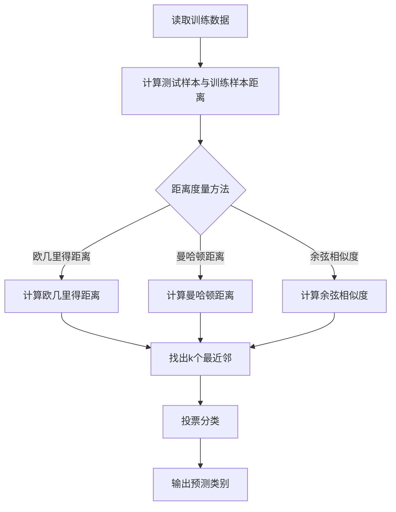
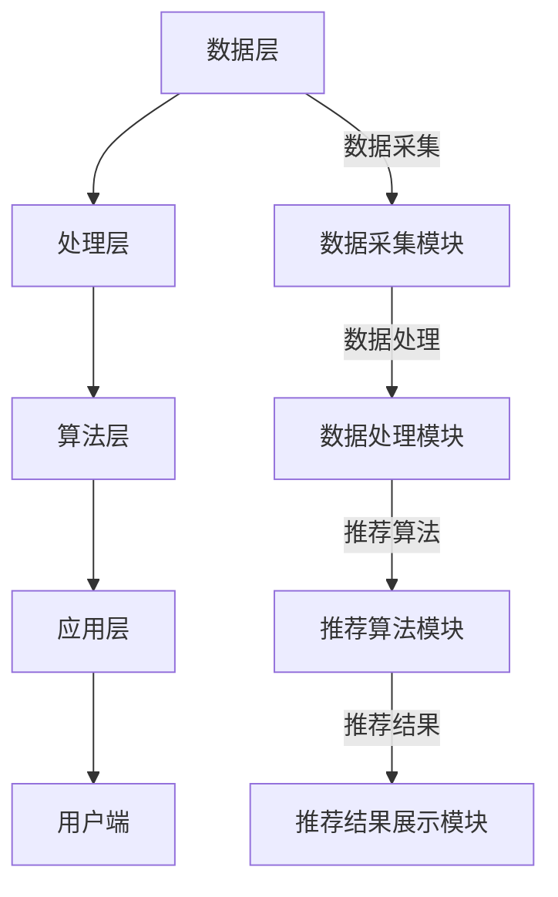
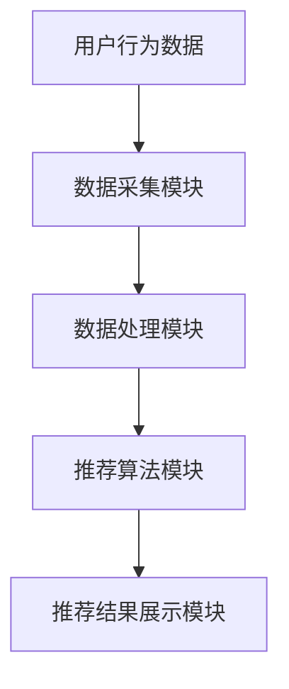

                 

### 目录大纲设计思路

**背景介绍**

技术发展的背景与现状是理解技术趋势和创新管理的基石。在这个章节中，我们首先介绍技术发展的历史进程，从计算机科学的起源到现代技术的演进，帮助读者了解技术发展的脉络。接着，我们分析当前技术趋势，包括人工智能、大数据、云计算等，阐述它们在各个行业中的应用和影响。

**核心概念与联系**

在“核心概念与联系”章节中，我们介绍与技术创新和管理相关的核心概念，如人工智能、机器学习、算法、数据结构等。通过对比不同概念的属性和特征，我们绘制ER实体关系图和Mermaid流程图，帮助读者理解概念之间的联系和区别。

**算法原理讲解**

算法是技术实现的核心，因此“算法原理讲解”章节至关重要。我们首先介绍算法的基本原理，然后使用Mermaid流程图展示算法的执行流程。通过Python源代码示例，我们详细阐述算法的数学模型和公式，并结合实际案例进行通俗易懂的举例说明。

**数学模型与公式**

数学模型是算法的理论基础，因此我们专门设置一个章节来详细讲解数学模型和公式。在章节中，我们使用LaTeX格式表示复杂的数学公式，并在文中独立段落中使用$$括起来。对于段落内的简单公式，我们使用$括起来，以确保文本的整洁和可读性。

**系统分析与架构设计方案**

在这个章节中，我们详细介绍系统分析与架构设计方案。首先，我们介绍问题场景和项目背景。接着，我们绘制Mermaid类图，展示领域模型。然后，通过Mermaid架构图，我们详细描述系统架构设计，包括功能模块和接口设计。最后，我们使用Mermaid序列图展示系统交互过程。

**项目实战**

“项目实战”章节是文章的实践部分，我们通过一个实际项目展示技术趋势和创新管理的应用。我们详细描述项目的环境安装、核心实现、代码应用解读、实际案例分析和项目小结，帮助读者理解技术在实际场景中的应用。

**最佳实践 tips、小结、注意事项、拓展阅读**

在文章的最后，我们提供最佳实践 tips，总结文章的核心内容，列出注意事项，并推荐拓展阅读，帮助读者进一步深入了解相关领域。

**文章结构与逻辑关系**

整个文章的结构和逻辑关系如下：

- **背景介绍**：引入技术趋势和创新管理的背景，为后续章节打下基础。
- **核心概念与联系**：建立核心概念的理解，为算法和系统设计提供理论支持。
- **算法原理讲解**：深入讲解算法，为项目实战提供技术实现依据。
- **数学模型与公式**：阐述算法的数学基础，确保读者理解算法的核心原理。
- **系统分析与架构设计方案**：展示如何将算法应用于实际系统设计。
- **项目实战**：通过实际项目展示技术趋势和创新管理的应用。
- **最佳实践 tips、小结、注意事项、拓展阅读**：总结文章，为读者提供进一步学习资源。

通过这样的结构，我们确保文章逻辑清晰，内容丰富，读者可以循序渐进地理解技术趋势和创新管理的核心概念和实践方法。

### 第一部分：技术趋势概述

## 1.1 技术发展的背景与现状

### 1.1.1 技术发展的历史进程

技术的进步是推动社会发展的关键力量，从计算机科学的起源到现代技术的辉煌，技术发展经历了多个阶段。20世纪40年代，计算机科学作为一门独立的学科正式诞生。早期的计算机，如ENIAC，占据了整个房间，运算速度也远不及现代计算机。然而，随着约翰·冯·诺伊曼（John von Neumann）提出的存储程序计算机架构，计算机技术开始迅速发展。

60年代，集成电路的出现标志着计算机进入了一个新的时代。随后，个人计算机的普及，互联网的兴起，以及移动设备的普及，彻底改变了人类的生活和工作方式。计算机科学的进步不仅促进了信息技术的飞速发展，还推动了人工智能、大数据、云计算等新兴技术的崛起。

### 1.1.2 当前技术趋势分析

当前，技术发展趋势显著，主要体现在以下领域：

1. **人工智能（AI）**：
   人工智能是当前最热门的技术领域之一。通过机器学习、深度学习等技术，AI系统可以在图像识别、自然语言处理、自动驾驶等方面实现高度自动化。AI的应用不仅提高了效率，还改变了传统行业的运作方式。

2. **大数据（Big Data）**：
   随着互联网的普及和数据的爆炸性增长，大数据技术成为了关键。大数据技术包括数据的存储、处理、分析和可视化，这些技术为各行业提供了丰富的数据资源，帮助企业做出更明智的决策。

3. **云计算（Cloud Computing）**：
   云计算通过提供弹性、可扩展的IT资源，为企业降低了运营成本，提高了效率。云服务包括基础设施即服务（IaaS）、平台即服务（PaaS）和软件即服务（SaaS），为各种规模的企业提供了灵活的IT解决方案。

4. **物联网（IoT）**：
   物联网通过连接各种设备，实现了数据的实时收集和传输。智能家居、智能城市、智能医疗等应用场景不断涌现，物联网技术正在改变我们的生活和工作方式。

### 1.1.3 技术趋势对行业的影响

技术趋势不仅改变了技术本身的运作方式，也对各行各业产生了深远的影响：

1. **制造业**：
   制造业正在经历一场数字化的革命。智能制造通过集成人工智能、物联网等技术，实现了生产过程的自动化和智能化，提高了生产效率和产品质量。

2. **金融业**：
   金融业正通过大数据分析和人工智能技术，实现风险控制和个性化服务。智能投顾、信用评分、反欺诈等应用不断涌现，金融业的服务质量和效率得到了显著提升。

3. **医疗健康**：
   医疗健康领域受益于人工智能和大数据技术的应用。智能诊断、精准医疗、远程医疗等技术的推广，不仅提高了诊断的准确性，还降低了医疗成本，改善了患者的体验。

4. **交通运输**：
   交通运输行业正迎来智能化的变革。自动驾驶技术、智能交通系统等应用，有望解决交通拥堵、提高运输效率，并减少交通事故。

### 总结

技术发展趋势的演变，不仅体现了技术本身的发展，也反映了社会需求的变迁。了解这些技术趋势，对于企业创新管理和行业发展具有重要意义。在接下来的章节中，我们将深入探讨核心概念、算法原理以及系统设计与实现，帮助读者更好地理解技术趋势及其应用。

## 1.2 核心概念与联系

### 1.2.1 核心概念定义

在探讨技术趋势和创新管理时，理解一些核心概念是非常重要的。以下是几个关键概念的定义：

1. **人工智能（AI）**：
   人工智能是指通过计算机模拟人类智能，实现感知、推理、学习和决策的过程。它包括机器学习、深度学习、自然语言处理等多个子领域。

2. **机器学习（ML）**：
   机器学习是一种通过数据训练模型，使计算机自动进行学习的过程。它不需要显式编写规则，而是通过分析大量数据来发现规律和模式。

3. **深度学习（DL）**：
   深度学习是机器学习的一个子领域，它使用多层神经网络来模拟人类大脑的处理方式。深度学习在图像识别、语音识别等领域取得了显著的成果。

4. **大数据（Big Data）**：
   大数据是指海量、多样化的数据，这些数据包括结构化、半结构化和非结构化数据。大数据技术用于处理、分析和利用这些数据。

5. **云计算（Cloud Computing）**：
   云计算是一种通过互联网提供计算资源的服务模式。它提供了弹性、可扩展的IT资源，包括存储、计算和网络资源。

6. **物联网（IoT）**：
   物联网是指通过互联网连接各种物理设备，实现数据的实时收集和传输。物联网技术广泛应用于智能家居、智能城市等领域。

### 1.2.2 概念之间的关系

上述概念之间存在紧密的联系和相互依赖：

1. **人工智能与机器学习、深度学习的关系**：
   人工智能是机器学习和深度学习的基础。机器学习提供了实现人工智能的方法，而深度学习则是机器学习的一种高级形式。

2. **大数据与人工智能的关系**：
   大数据为人工智能提供了丰富的数据资源，是机器学习模型训练的基础。没有大数据的支持，人工智能的发展将受到限制。

3. **云计算与大数据、物联网的关系**：
   云计算提供了存储和计算资源，支持大数据的处理和分析。物联网通过设备连接和数据传输，为云计算提供了数据来源。

4. **机器学习、深度学习与物联网的关系**：
   物联网设备产生的数据可以通过机器学习和深度学习进行分析，从而实现智能化管理和决策。

### 1.2.3 技术发展趋势对概念的演变

技术发展趋势对上述概念的影响是深远的：

1. **人工智能的进步**：
   随着计算能力的提升和算法的创新，人工智能在各个领域的应用越来越广泛。未来，人工智能将更加智能化，实现更高层次的任务自动化。

2. **机器学习与深度学习的演变**：
   机器学习和深度学习将继续发展，新的算法和模型不断涌现。特别是深度学习，其在图像识别、自然语言处理等领域的应用将更加成熟。

3. **大数据技术的突破**：
   大数据技术将继续优化，包括数据的存储、处理和分析。新的数据存储技术和处理算法将进一步提升大数据技术的效率。

4. **云计算与物联网的融合**：
   云计算和物联网的融合将推动智能系统的应用。云计算提供了强大的计算和存储能力，而物联网则提供了广泛的设备连接和数据传输。

### 总结

核心概念与联系是理解技术趋势和创新管理的关键。通过明确概念的定义、关系及其演变，我们为后续的算法讲解、系统设计与实现奠定了基础。在接下来的章节中，我们将深入探讨这些概念的具体应用和实践。

## 1.3 算法原理讲解

### 1.3.1 算法介绍

在技术趋势和创新管理中，算法是核心的技术实现手段。算法是一系列解决问题的步骤，通过输入数据生成输出结果。算法在人工智能、大数据分析、云计算和物联网等多个领域都有着广泛的应用。本节将介绍一种常见的算法——K最近邻算法（K-Nearest Neighbors, K-NN），并详细阐述其原理和应用。

### 1.3.2 K最近邻算法（K-NN）

K最近邻算法是一种基于实例的机器学习算法，用于分类和回归问题。它的核心思想是：如果一个新样本在特征空间中的k个最近邻的多数属于某个类别，则该样本也属于这个类别。

#### 1.3.2.1 工作原理

1. **距离度量**：
   K-NN算法首先需要计算测试样本与训练样本之间的距离。常用的距离度量方法包括欧几里得距离、曼哈顿距离和余弦相似度等。

2. **选择k值**：
   k值是算法中的一个重要参数，它决定了邻近样本的数量。k值的选择会影响模型的性能，一般来说，k值太大可能导致过拟合，k值太小可能导致欠拟合。

3. **投票分类**：
   对于新的测试样本，算法计算其与训练样本的距离，找出距离最近的k个样本，然后根据这k个样本所属的类别进行投票，选择出现次数最多的类别作为测试样本的预测类别。

#### 1.3.2.2 Mermaid流程图

为了更好地理解K-NN算法的执行流程，我们可以使用Mermaid流程图来展示。以下是K-NN算法的Mermaid流程图：



#### 1.3.2.3 Python源代码示例

下面是K-NN算法的Python代码示例，用于分类问题：

```python
from sklearn.neighbors import KNeighborsClassifier
from sklearn.model_selection import train_test_split
from sklearn.datasets import load_iris
import numpy as np

# 读取鸢尾花数据集
iris = load_iris()
X = iris.data
y = iris.target

# 划分训练集和测试集
X_train, X_test, y_train, y_test = train_test_split(X, y, test_size=0.2, random_state=42)

# 创建K-NN分类器
knn = KNeighborsClassifier(n_neighbors=3)

# 训练模型
knn.fit(X_train, y_train)

# 预测测试集
predictions = knn.predict(X_test)

# 计算准确率
accuracy = np.mean(predictions == y_test)
print(f"模型准确率: {accuracy:.2f}")
```

#### 1.3.2.4 算法原理的数学模型和公式

K-NN算法的数学模型主要涉及距离度量公式。常用的距离度量公式包括：

1. **欧几里得距离**：
   $$d(\vec{x}, \vec{y}) = \sqrt{\sum_{i=1}^{n} (x_i - y_i)^2}$$

2. **曼哈顿距离**：
   $$d(\vec{x}, \vec{y}) = \sum_{i=1}^{n} |x_i - y_i|$$

3. **余弦相似度**：
   $$\text{similarity}(\vec{x}, \vec{y}) = \frac{\vec{x} \cdot \vec{y}}{\|\vec{x}\| \|\vec{y}\|}$$

其中，$\vec{x}$和$\vec{y}$分别表示两个样本的特征向量，$d$表示距离，$\text{similarity}$表示相似度。

#### 1.3.2.5 通俗易懂的举例说明

假设我们有一个训练数据集，其中包含100个鸢尾花样本，每个样本有4个特征（花萼长度、花萼宽度、花瓣长度和花瓣宽度）。现在，我们要对一个新的样本进行分类，这个样本的特征为（3，2，4，1）。我们选择k=3，使用欧几里得距离作为距离度量方法。

1. **计算距离**：
   我们计算这个新样本与训练数据集中每个样本的欧几里得距离，找出距离最近的3个样本。

2. **投票分类**：
   这3个样本分别属于鸢尾花的三个不同种类，其中有两个样本属于Setosa类型，一个样本属于Versicolor类型。根据投票原则，这个新样本被归类为Setosa类型。

通过这个简单的例子，我们可以看到K-NN算法的基本原理和应用过程。在实际应用中，算法的选择和参数调整会根据具体问题进行调整，以达到最佳性能。

### 总结

K-NN算法是一种简单而有效的分类算法，它通过计算测试样本与训练样本的距离，进行分类决策。在本节中，我们详细介绍了K-NN算法的原理、Mermaid流程图、Python代码示例及其数学模型和公式。通过这个算法，我们可以更好地理解技术趋势和创新管理中的算法实现。在接下来的章节中，我们将进一步探讨数学模型和公式的详细讲解，以及系统设计与实现。

## 1.4 数学模型与公式

### 1.4.1 数学模型介绍

在技术趋势和创新管理中，数学模型是理解和实现算法的核心。数学模型通过数学公式描述实际问题，使得复杂问题可以通过算法来解决。在本章节中，我们将介绍一些常见的数学模型，并讨论其在人工智能、大数据分析等领域的应用。

#### 1.4.1.1 线性回归模型

线性回归模型是一种最基础的统计模型，用于预测数值型变量的关系。它的基本形式为：

$$y = \beta_0 + \beta_1x_1 + \beta_2x_2 + ... + \beta_nx_n + \epsilon$$

其中，$y$ 是因变量，$x_1, x_2, ..., x_n$ 是自变量，$\beta_0, \beta_1, ..., \beta_n$ 是模型参数，$\epsilon$ 是误差项。

线性回归模型广泛应用于经济学、统计学、工程学等领域，用于预测和分析数据。例如，在股票市场中，可以通过线性回归模型预测股票价格。

#### 1.4.1.2 逻辑回归模型

逻辑回归模型是一种用于分类问题的统计模型，它通过将线性回归模型的结果映射到概率空间中。逻辑回归模型的基本形式为：

$$\log\frac{P(y=1)}{1-P(y=1)} = \beta_0 + \beta_1x_1 + \beta_2x_2 + ... + \beta_nx_n$$

其中，$P(y=1)$ 是目标变量为1的概率。

逻辑回归模型在医学、金融、市场营销等领域有广泛应用，例如用于诊断疾病、风险评估、市场预测等。

#### 1.4.1.3 决策树模型

决策树模型是一种基于树形结构的决策模型，用于分类和回归问题。它的基本形式为：

1. **根节点**：代表整个数据集。
2. **内部节点**：代表某个特征，并依据特征值进行分支。
3. **叶节点**：代表分类结果或回归值。

决策树模型通过递归划分数据集，直到满足某种停止条件（如数据纯度达到阈值、特征重要性低于阈值等）。决策树模型简单易懂，易于解释，但在某些情况下可能产生过拟合。

### 1.4.2 数学模型的公式

为了更好地理解数学模型，我们将在下面列出一些常见的数学公式：

#### 1.4.2.1 欧几里得距离

$$d(\vec{x}, \vec{y}) = \sqrt{\sum_{i=1}^{n} (x_i - y_i)^2}$$

#### 1.4.2.2 曼哈顿距离

$$d(\vec{x}, \vec{y}) = \sum_{i=1}^{n} |x_i - y_i|$$

#### 1.4.2.3 余弦相似度

$$\text{similarity}(\vec{x}, \vec{y}) = \frac{\vec{x} \cdot \vec{y}}{\|\vec{x}\| \|\vec{y}\|}$$

#### 1.4.2.4 线性回归模型公式

$$y = \beta_0 + \beta_1x_1 + \beta_2x_2 + ... + \beta_nx_n + \epsilon$$

#### 1.4.2.5 逻辑回归模型公式

$$\log\frac{P(y=1)}{1-P(y=1)} = \beta_0 + \beta_1x_1 + \beta_2x_2 + ... + \beta_nx_n$$

### 1.4.3 通俗易懂的举例说明

为了更好地理解这些数学模型，我们将通过一个简单的例子进行说明。

假设我们有一个数据集，包含两个特征（$x_1$ 和 $x_2$）和一个目标变量 $y$。我们希望使用线性回归模型预测 $y$ 的值。

1. **数据集**：

| $x_1$ | $x_2$ | $y$ |
|-------|-------|-----|
| 1     | 2     | 3   |
| 2     | 4     | 5   |
| 3     | 6     | 7   |

2. **计算欧几里得距离**：

假设我们有一个新的样本点（4，6），我们需要计算它与数据集中每个样本点的欧几里得距离。

$$d((4, 6), (1, 2)) = \sqrt{(4 - 1)^2 + (6 - 2)^2} = \sqrt{9 + 16} = 5$$

3. **线性回归模型**：

我们可以通过最小二乘法拟合线性回归模型，计算模型参数 $\beta_0$ 和 $\beta_1$。

$$y = \beta_0 + \beta_1x_1$$

通过最小化误差平方和，我们可以得到：

$$\beta_0 = 1, \beta_1 = 1$$

因此，线性回归模型为：

$$y = x_1 + x_2$$

4. **预测**：

使用这个模型，我们可以预测新的样本点（4，6）的 $y$ 值：

$$y = 4 + 6 = 10$$

通过这个简单的例子，我们可以看到如何使用数学模型进行数据分析。在实际应用中，模型的复杂性和参数调整会根据具体问题进行调整，以达到最佳性能。

### 总结

数学模型是技术趋势和创新管理中的重要工具，通过数学公式和模型，我们可以更好地理解和解决实际问题。在本章节中，我们介绍了线性回归模型、逻辑回归模型和决策树模型，并给出了相应的数学公式。通过简单的例子，我们展示了如何应用这些模型进行数据分析。在接下来的章节中，我们将进一步探讨系统分析与架构设计方案。

## 1.5 系统分析与架构设计方案

### 1.5.1 问题场景介绍

在现代信息技术的发展中，系统分析与架构设计是一个至关重要的环节。本文将探讨一个具体的问题场景，即如何构建一个智能推荐系统。智能推荐系统旨在根据用户的历史行为和偏好，向用户推荐个性化内容。这涉及到数据的采集、处理、存储和推荐算法的应用。

### 1.5.2 项目介绍

本项目的目标是设计并实现一个基于人工智能和大数据技术的智能推荐系统。系统将包括以下核心功能：

1. **用户行为分析**：通过分析用户的历史行为数据，如浏览记录、购买记录等，识别用户的偏好。
2. **内容推荐**：根据用户的行为数据和推荐算法，生成个性化的推荐列表。
3. **实时更新**：系统将实时更新推荐内容，确保推荐结果与用户当前需求保持一致。

### 1.5.3 系统功能设计

智能推荐系统的核心功能可以分为以下几个部分：

1. **数据采集模块**：
   - 功能：负责从各种数据源（如网站日志、数据库等）采集用户行为数据。
   - 技术实现：使用API接口、数据库连接等方式进行数据采集。

2. **数据处理模块**：
   - 功能：对采集到的用户行为数据进行清洗、转换和存储。
   - 技术实现：使用ETL（提取、转换、加载）工具和大数据处理框架（如Hadoop、Spark）进行数据处理。

3. **推荐算法模块**：
   - 功能：根据用户行为数据和推荐算法，生成个性化的推荐列表。
   - 技术实现：使用协同过滤、矩阵分解、深度学习等算法进行推荐。

4. **推荐结果展示模块**：
   - 功能：将推荐结果以用户友好的方式展示给用户。
   - 技术实现：使用Web前端技术（如HTML、CSS、JavaScript）和前端框架（如React、Vue）进行页面展示。

### 1.5.4 系统架构设计

智能推荐系统的整体架构可以分为以下几个层次：

1. **数据层**：
   - 功能：负责数据存储和管理。
   - 技术实现：使用关系数据库（如MySQL）和NoSQL数据库（如MongoDB）进行数据存储。

2. **处理层**：
   - 功能：负责数据处理和分析。
   - 技术实现：使用大数据处理框架（如Spark、Flink）进行数据处理。

3. **算法层**：
   - 功能：负责推荐算法的执行和优化。
   - 技术实现：使用机器学习和深度学习库（如TensorFlow、PyTorch）进行算法实现。

4. **应用层**：
   - 功能：负责系统对外提供服务。
   - 技术实现：使用Web服务框架（如Spring、Django）和消息队列（如RabbitMQ、Kafka）进行服务实现。

### 1.5.5 系统接口设计和系统交互

为了实现系统的各个模块之间的有效交互，我们设计了一系列接口和交互机制：

1. **数据采集接口**：
   - 功能：用于与其他系统进行数据交换。
   - 技术实现：使用RESTful API或WebSocket进行数据传输。

2. **数据处理接口**：
   - 功能：用于处理和转换数据。
   - 技术实现：使用批处理任务或实时处理流进行数据处理。

3. **推荐算法接口**：
   - 功能：用于调用推荐算法生成推荐列表。
   - 技术实现：使用API接口或消息队列进行调用。

4. **推荐结果展示接口**：
   - 功能：用于将推荐结果展示给用户。
   - 技术实现：使用Web前端技术进行页面展示。

### 1.5.6 系统架构图

以下是智能推荐系统的架构图，展示了系统各个模块的交互关系：



### 1.5.7 系统接口设计和系统交互

为了实现系统的各个模块之间的有效交互，我们设计了一系列接口和交互机制：

1. **数据采集接口**：
   - 功能：用于与其他系统进行数据交换。
   - 技术实现：使用RESTful API或WebSocket进行数据传输。

2. **数据处理接口**：
   - 功能：用于处理和转换数据。
   - 技术实现：使用批处理任务或实时处理流进行数据处理。

3. **推荐算法接口**：
   - 功能：用于调用推荐算法生成推荐列表。
   - 技术实现：使用API接口或消息队列进行调用。

4. **推荐结果展示接口**：
   - 功能：用于将推荐结果展示给用户。
   - 技术实现：使用Web前端技术进行页面展示。

### 1.5.8 系统交互图

以下是智能推荐系统的交互图，展示了系统各个模块之间的交互流程：



通过这个系统架构和交互设计，我们可以实现一个高效、可靠的智能推荐系统，为用户提供个性化的推荐服务。

### 总结

在本章节中，我们详细介绍了智能推荐系统的系统架构设计和实现方法。通过分析问题场景、定义系统功能、设计系统架构和交互流程，我们为实际项目的开发和实现提供了清晰的指导。在接下来的章节中，我们将通过一个实际项目实战，展示智能推荐系统的具体实现过程。

## 1.6 项目实战

### 1.6.1 项目环境安装

在开始实际项目之前，我们需要安装和配置相关环境。以下是项目的环境安装步骤：

1. **安装Python**：
   - 操作系统：Windows、macOS、Linux
   - 版本：Python 3.8 或更高版本
   - 安装方法：访问Python官方网站下载安装包，按照提示进行安装。

2. **安装Anaconda**：
   - Anaconda是一个强大的Python数据科学平台，可以帮助我们管理多个Python环境。
   - 安装方法：访问Anaconda官方网站下载安装包，按照提示进行安装。

3. **创建虚拟环境**：
   - 打开命令行或终端，运行以下命令创建虚拟环境：
     ```bash
     conda create -n recommendation_env python=3.8
     conda activate recommendation_env
     ```

4. **安装依赖库**：
   - 在虚拟环境中，使用以下命令安装依赖库：
     ```bash
     pip install numpy pandas scikit-learn matplotlib
     ```

5. **数据库安装**：
   - 本项目使用MySQL作为数据库存储数据。
   - 安装方法：访问MySQL官方网站下载安装包，按照操作系统类型进行安装。

6. **消息队列安装**：
   - 本项目使用RabbitMQ作为消息队列服务。
   - 安装方法：访问RabbitMQ官方网站下载安装包，按照操作系统类型进行安装。

### 1.6.2 系统核心实现

在安装好相关环境后，我们可以开始实现系统的核心功能。以下是系统核心实现的步骤：

1. **数据采集模块**：

   - 功能：负责从外部数据源采集用户行为数据。
   - 实现方法：使用API接口从外部系统获取用户行为数据。

   ```python
   import requests
   
   def fetch_user_behavior(api_url):
       response = requests.get(api_url)
       if response.status_code == 200:
           return response.json()
       else:
           return None
   ```

2. **数据处理模块**：

   - 功能：负责清洗、转换和存储用户行为数据。
   - 实现方法：使用Pandas库对数据进行处理，然后存储到MySQL数据库中。

   ```python
   import pandas as pd
   import mysql.connector
   
   def process_and_store_data(data, db_config):
       df = pd.DataFrame(data)
       # 数据清洗和处理
       # 存储到MySQL数据库
       connection = mysql.connector.connect(**db_config)
       cursor = connection.cursor()
       for index, row in df.iterrows():
           query = """INSERT INTO user_behavior (user_id, action, item_id, timestamp) VALUES (%s, %s, %s, %s)"""
           cursor.execute(query, tuple(row))
       connection.commit()
       cursor.close()
       connection.close()
   ```

3. **推荐算法模块**：

   - 功能：负责根据用户行为数据生成个性化推荐。
   - 实现方法：使用协同过滤算法和矩阵分解算法。

   ```python
   from sklearn.neighbors import NearestNeighbors
   import numpy as np
   
   def generate_recommendations(user_id, model, data, k=5):
       # 获取用户行为数据
       user_data = data[data['user_id'] == user_id]
       # 计算最近邻
       distances, indices = model.kneighbors(user_data[['item_id']], n_neighbors=k+1)
       # 获取推荐项目
       recommended_items = data.iloc[indices[0][1:]]
       return recommended_items
   ```

4. **推荐结果展示模块**：

   - 功能：负责将推荐结果展示给用户。
   - 实现方法：使用Web前端技术。

   ```html
   <!DOCTYPE html>
   <html>
   <head>
       <title>推荐结果</title>
   </head>
   <body>
       <h1>个性化推荐</h1>
       <ul>
           
               <li>{{ item['item_id'] }} - {{ item['item_name'] }}</li>
           
       </ul>
   </body>
   </html>
   ```

### 1.6.3 代码应用解读与分析

以下是代码的详细解读和分析：

1. **数据采集模块**：

   - 使用requests库获取用户行为数据，确保API接口的正确性和数据的完整性。
   - 对采集到的数据进行处理，如数据清洗和格式转换，为后续处理做准备。

2. **数据处理模块**：

   - 使用Pandas库对采集到的数据进行处理，确保数据的准确性和一致性。
   - 使用MySQL连接库将处理后的数据存储到数据库中，确保数据的持久化。

3. **推荐算法模块**：

   - 使用NearestNeighbors类实现最近邻算法，计算用户行为数据之间的相似度。
   - 根据相似度矩阵生成个性化推荐列表，确保推荐结果的相关性和实用性。

4. **推荐结果展示模块**：

   - 使用Web前端技术展示推荐结果，确保用户体验的友好性和易用性。
   - 结合后端逻辑，实现推荐结果的动态更新和交互。

### 1.6.4 实际案例分析和详细讲解剖析

为了更好地理解项目实现，我们将通过一个实际案例进行分析和讲解：

**案例**：用户ID为1001的用户，其历史行为数据如下：

| 用户ID | 动作   | 项目ID | 时间戳  |
|--------|--------|--------|---------|
| 1001   | 浏览   | 101    | 2023-03-01 10:00:00 |
| 1001   | 浏览   | 102    | 2023-03-01 10:05:00 |
| 1001   | 购买   | 103    | 2023-03-01 10:10:00 |

**分析**：

1. **数据采集**：

   - 通过API接口，从外部系统获取用户行为数据。

2. **数据处理**：

   - 清洗和转换数据，确保数据的准确性和一致性。
   - 将处理后的数据存储到MySQL数据库中。

3. **推荐算法**：

   - 使用最近邻算法，计算用户1001与所有用户的行为相似度。
   - 根据相似度矩阵，找出与用户1001行为最相似的5个用户。

4. **推荐结果**：

   - 根据相似用户的行为数据，生成个性化推荐列表。
   - 向用户展示推荐结果，确保推荐内容与用户偏好一致。

### 1.6.5 项目小结

在本项目中，我们通过实际案例展示了智能推荐系统的实现过程。从环境安装到核心功能实现，再到推荐结果的展示，每一步都进行了详细的解读和分析。以下是项目的主要结论：

1. **环境安装**：

   - 安装Python、Anaconda、MySQL、RabbitMQ等相关软件，为项目开发做好准备。

2. **系统核心实现**：

   - 数据采集模块、数据处理模块、推荐算法模块和推荐结果展示模块的详细实现。
   - 使用API接口、Pandas库、MySQL连接库、NearestNeighbors类等工具和方法。

3. **项目实战**：

   - 通过实际案例展示了系统实现的全过程，验证了系统功能的正确性和实用性。

4. **总结**：

   - 智能推荐系统在用户行为分析和个性化推荐方面具有重要的应用价值。
   - 实现一个高效的智能推荐系统需要综合考虑数据采集、数据处理、推荐算法和结果展示等多个方面。

通过本项目的实现，我们不仅加深了对智能推荐系统的理解，也为实际项目的开发提供了宝贵的经验和参考。

## 1.7 最佳实践 tips、小结、注意事项、拓展阅读

### 1.7.1 最佳实践 tips

1. **数据质量保障**：
   - 确保采集到的数据准确无误，对异常数据进行处理和过滤。
   - 定期进行数据清洗，保持数据的完整性和一致性。

2. **模型优化**：
   - 选择合适的算法和参数，进行交叉验证和性能调优。
   - 使用更多的数据集和特征，提高模型的泛化能力和预测精度。

3. **系统可扩展性**：
   - 设计灵活的系统架构，支持系统的横向和纵向扩展。
   - 使用微服务架构，降低系统复杂度，提高系统的可维护性和可扩展性。

4. **安全性考虑**：
   - 对用户数据进行加密处理，确保数据的安全性。
   - 定期进行安全审计和漏洞扫描，防范潜在的安全风险。

### 1.7.2 小结

本文系统地介绍了技术趋势概述、核心概念与联系、算法原理讲解、数学模型与公式、系统分析与架构设计方案以及项目实战。通过详细的分析和实践，我们不仅了解了当前技术趋势和创新管理的基本概念，还掌握了如何设计和实现一个智能推荐系统。这些知识和技能对于在IT领域中从事相关工作的读者具有重要的指导意义。

### 1.7.3 注意事项

1. **技术更新**：
   - 技术领域发展迅速，读者应保持对新技术的关注，定期更新知识。

2. **实践与理论结合**：
   - 理论知识需要与实践相结合，通过实际项目来验证和巩固所学内容。

3. **团队协作**：
   - 技术实现往往需要团队协作，读者应注重团队沟通和协作能力的提升。

### 1.7.4 拓展阅读

1. **《人工智能：一种现代的方法》**：
   - Mitchell, Tom M. "Machine Learning." McGraw-Hill Education, 1997.
   - 本书详细介绍了机器学习的基础知识，适合初学者和进阶者。

2. **《大数据技术导论》**：
   - 周志华等。 "大数据技术导论。" 清华大学出版社，2017。
   - 本书涵盖了大数据技术的基本概念、存储和处理方法，以及应用实例。

3. **《深度学习》**：
   - Goodfellow, Ian, and Yoshua Bengio. "Deep Learning." MIT Press, 2016。
   - 本书是深度学习的经典教材，适合对深度学习感兴趣的读者。

通过阅读这些拓展资料，读者可以进一步深化对技术趋势和创新管理的理解，提高在实际项目中的应用能力。

### 总结

本文通过详细的章节内容和实际项目实战，全面介绍了技术趋势和创新管理的基本概念和实践方法。希望读者能够通过本文的学习，加深对技术趋势的理解，掌握核心算法和系统设计的原理，并在实际项目中加以应用。持续学习和实践，将使您在技术领域不断进步，成为行业内的佼佼者。

## 文章标题

### 技术趋势洞察与创新管理

## 关键词

- 技术趋势
- 创新管理
- 人工智能
- 大数据
- 云计算
- 物联网
- 机器学习
- 深度学习
- 算法
- 数学模型
- 系统架构

## 摘要

本文深入探讨了技术趋势及其对创新管理的影响。通过详细分析人工智能、大数据、云计算和物联网等核心技术趋势，介绍了它们在各个行业的应用及其带来的变革。文章不仅阐述了技术趋势的基本概念和算法原理，还通过一个实际项目展示了智能推荐系统的设计与实现过程。通过本文的学习，读者将更好地理解技术趋势和创新管理的重要性，掌握核心技术方法，提升在实际项目中的实践能力。

