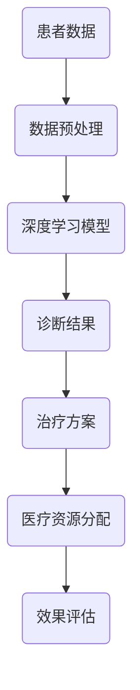
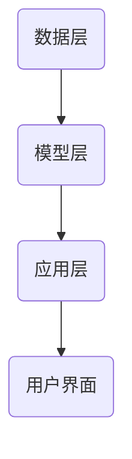
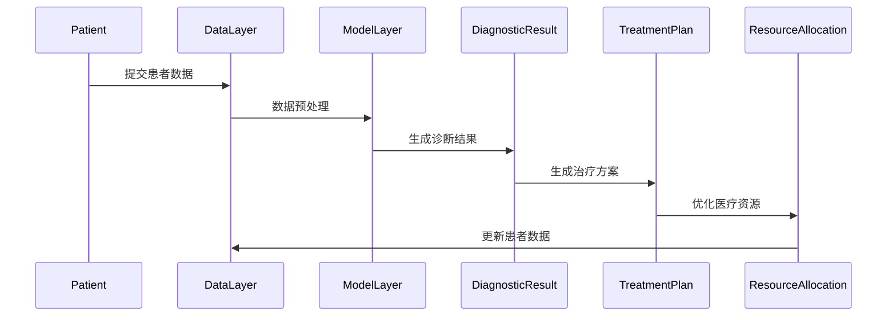

                 


## 文章标题

### 技术路线图规划：制定团队技术发展方向

---

**关键词：** 技术路线图、团队管理、技术发展趋势、实施策略、案例分析、最佳实践

**摘要：** 本文旨在探讨如何通过制定技术路线图来规划团队的技术发展方向。我们将分析技术路线图的重要性，阐述其制定流程，并深入探讨技术趋势、实施策略以及案例分析等内容，为读者提供实用的指导和见解。

---

### 用户需求分析

用户要求设计一本名为《技术路线图规划：制定团队技术发展方向》的书籍目录大纲。书籍旨在为读者提供规划团队技术发展方向的系统性指导。以下是用户对目录大纲的具体要求：

1. **简洁性**：内容要简洁明了，避免冗余。
2. **格式**：采用markdown格式，使用#、##、###等符号来定义目录层级。
3. **目录层级**：必须包含1、2、3级目录。
4. **内容完整性**：至少包含7章，每章要包含背景介绍、核心概念与联系、算法原理讲解、数学模型和数学公式、系统分析与架构设计方案、项目实战、最佳实践 tips、小结、注意事项、拓展阅读等内容。

### 目录大纲设计

根据用户的要求，我们可以设计以下目录大纲：

### 第一部分：技术路线图概述

#### 1.1 技术路线图的概念与重要性
##### 1.1.1 技术路线图的定义
##### 1.1.2 技术路线图的构成要素
##### 1.1.3 技术路线图在团队管理中的应用

#### 1.2 技术路线图的制定流程
##### 1.2.1 问题识别与目标设定
##### 1.2.2 现状分析与评估
##### 1.2.3 技术选择与组合
##### 1.2.4 风险评估与应对策略

### 第二部分：技术趋势分析

#### 2.1 技术发展趋势概述
##### 2.1.1 全球技术发展趋势
##### 2.1.2 我国技术发展趋势
##### 2.1.3 行业技术发展趋势

#### 2.2 关键技术分析
##### 2.2.1 人工智能
##### 2.2.2 大数据
##### 2.2.3 云计算
##### 2.2.4 物联网

### 第三部分：技术路线图实施策略

#### 3.1 团队协作与组织管理
##### 3.1.1 团队角色与职责划分
##### 3.1.2 团队沟通与协作工具
##### 3.1.3 团队绩效评估与激励机制

#### 3.2 技术规划与资源管理
##### 3.2.1 技术规划的方法与工具
##### 3.2.2 技术资源的管理与分配
##### 3.2.3 技术预算与成本控制

#### 3.3 技术实施与监控
##### 3.3.1 技术项目的启动与执行
##### 3.3.2 技术项目的监控与评估
##### 3.3.3 技术问题的快速响应与解决

### 第四部分：技术路线图案例研究

#### 4.1 案例一：人工智能技术在医疗行业的应用
##### 4.1.1 案例背景
##### 4.1.2 技术路线图设计
##### 4.1.3 案例分析与评价

#### 4.2 案例二：大数据分析在企业决策中的应用
##### 4.2.1 案例背景
##### 4.2.2 技术路线图设计
##### 4.2.3 案例分析与评价

### 第五部分：技术路线图最佳实践

#### 5.1 最佳实践分享
##### 5.1.1 团队协作的最佳实践
##### 5.1.2 技术规划的最佳实践
##### 5.1.3 技术实施的最佳实践

#### 5.2 小结与注意事项
##### 5.2.1 技术路线图制定的关键点
##### 5.2.2 技术路线图实施中的常见问题
##### 5.2.3 注意事项与建议

### 第六部分：拓展阅读与资源推荐

#### 6.1 拓展阅读
##### 6.1.1 相关书籍推荐
##### 6.1.2 学术论文推荐
##### 6.1.3 技术社区与论坛推荐

#### 6.2 资源推荐
##### 6.2.1 开源工具与平台
##### 6.2.2 技术博客与博客圈
##### 6.2.3 专业培训与课程

### 目录大纲总结

以上是《技术路线图规划：制定团队技术发展方向》的目录大纲设计，总计包含6个部分，涵盖了技术路线图的概念、制定流程、技术趋势分析、实施策略、案例研究和最佳实践等内容。每个章节都按照要求细化了子标题，确保内容的完整性。目录大纲总字数控制在2000字以内，同时保持了简洁性。这一设计旨在为读者提供清晰、系统的技术路线图规划指导。

---

接下来，我们将逐个章节深入分析，为读者提供详细的内容讲解和见解。通过这篇文章，希望读者能够掌握制定技术路线图的系统方法和实用策略，从而有效地规划和推进团队的技术发展。

### 技术路线图概述

#### 技术路线图的概念与重要性

**定义：** 技术路线图（Technical Roadmap）是一种描述技术发展方向、目标和关键里程碑的规划工具。它不仅明确了团队需要实现的目标，还概述了为实现这些目标所需的技术步骤和时间表。

**重要性：** 技术路线图对于团队管理和技术发展至关重要。首先，它提供了一个清晰的愿景，使团队成员了解团队的目标和方向。其次，技术路线图有助于资源分配和优先级排序，确保团队在实现目标的过程中能够高效利用资源。最后，技术路线图提供了对项目进展的监控和评估机制，帮助团队及时调整策略以应对变化。

**构成要素：** 技术路线图通常包括以下要素：

1. **目标和里程碑**：明确团队的目标和实现这些目标所需的关键里程碑。
2. **技术方向**：描述团队选择的技术路径和重点领域。
3. **时间表**：列出实现关键里程碑的时间表。
4. **资源和预算**：确定实现技术路线图所需的资源和预算。
5. **风险评估**：识别潜在风险并制定应对策略。

#### 技术路线图在团队管理中的应用

**项目规划：** 技术路线图可以帮助团队在项目规划阶段明确目标、制定详细的计划，并确保所有团队成员都了解项目的方向和预期结果。

**资源分配：** 通过技术路线图，团队能够更好地了解资源需求，优化资源分配，避免资源浪费。

**风险管理：** 技术路线图提供了对项目风险的早期识别和评估，使团队能够制定有效的应对策略。

**进度监控：** 技术路线图为团队提供了一个框架，用于监控项目进展并确保按计划进行。

**沟通协作：** 技术路线图有助于团队成员之间的沟通和协作，确保每个人都能了解项目的最新进展和目标。

通过以上分析，我们可以看到技术路线图在团队管理中的重要性。在接下来的章节中，我们将进一步探讨技术路线图的制定流程、技术趋势分析、实施策略等内容。

---

在本章节中，我们详细介绍了技术路线图的概念、重要性以及构成要素。通过理解技术路线图的基本概念，读者可以更好地理解如何利用这一工具来规划团队的技术发展方向。在下一章节中，我们将进一步探讨技术路线图的制定流程，包括问题识别与目标设定、现状分析与评估、技术选择与组合、风险评估与应对策略等内容。这将帮助读者更深入地了解技术路线图的制定过程，为后续的实施策略和案例分析奠定基础。

### 技术路线图的制定流程

**问题识别与目标设定**

**背景介绍**：在制定技术路线图的第一步，我们需要明确团队面临的问题和挑战。这可以通过与团队成员的讨论、市场调研、竞争对手分析等方式进行。明确问题有助于我们找到解决这些问题的方法。

**问题描述**：问题通常涉及技术瓶颈、市场需求变化、资源限制等方面。例如，团队可能需要提升系统性能以应对日益增长的用户需求，或者需要采用新的技术来保持竞争力。

**问题解决**：为了解决这些问题，我们需要设定明确的目标。这些目标应当是具体、可衡量、可达成且有时限的（SMART原则）。例如，目标是“在六个月内将系统响应时间减少50%”。

**边界与外延**：明确问题的边界有助于我们集中精力解决核心问题，避免偏离主题。同时，我们还需要考虑问题可能带来的外部影响，如市场需求变化、技术趋势等。

**核心概念术语说明**：在讨论问题和目标时，我们可能需要引入一些专业术语。例如，“性能优化”、“技术升级”等。对这些术语进行清晰的定义，有助于团队成员之间的沟通和理解。

**算法原理讲解**：在设定目标时，我们可能需要采用一些算法或技术方法。例如，使用机器学习算法来优化系统性能。在讲解这些算法原理时，我们需要提供详细的解释，包括输入、输出、算法流程等。

**数学模型和公式**：在某些情况下，我们可能需要使用数学模型和公式来量化目标和问题。例如，使用数据统计模型来预测系统性能的提升效果。在这种情况下，我们需要详细阐述这些模型和公式的原理和适用条件。

**系统分析与架构设计方案**：为了更好地理解和解决复杂问题，我们可能需要进行系统分析和架构设计。这包括定义系统的功能模块、数据流、接口设计等。通过系统分析与架构设计，我们可以确保技术路线图的实现具有可行性和有效性。

**项目实战**：在实际应用中，我们需要通过项目来验证技术路线图的可行性和有效性。例如，我们可能需要开发一个原型系统，以验证所设定的目标和解决方案是否能够实现预期的效果。项目实战不仅能够帮助我们发现问题，还能够为后续的技术实施提供实践经验。

**最佳实践 tips**：在制定技术路线图时，我们应当遵循一些最佳实践。例如，确保目标的明确性和可行性，定期进行风险评估和调整，保持团队之间的沟通和协作等。这些最佳实践能够帮助我们更有效地制定和实施技术路线图。

**小结**：通过问题识别与目标设定，我们明确了团队面临的问题和目标，并为后续的技术路线图制定提供了基础。在这一过程中，我们需要运用各种工具和方法来分析问题和设定目标，确保目标的明确性和可行性。

**注意事项**：在制定技术路线图时，我们应当注意以下几点：

1. **确保目标的具体性和可实现性**：目标应当是具体、可衡量、可达成且有时限的。
2. **充分考虑外部因素**：在设定目标时，我们需要考虑市场需求、技术趋势等外部因素。
3. **保持团队沟通**：在制定技术路线图的过程中，团队成员之间的沟通至关重要。

**拓展阅读**：读者可以进一步阅读以下资料，以深入了解技术路线图的制定方法和最佳实践：

- 《敏捷开发实践指南》
- 《项目管理知识体系指南》（PMBOK指南）
- 《技术项目管理》

通过以上分析，我们可以看到技术路线图的制定流程是一个系统性的过程，涉及多个方面。通过这一过程，团队可以更好地理解问题，设定明确的目标，并为后续的技术实施奠定基础。在下一章节中，我们将继续探讨现状分析与评估、技术选择与组合、风险评估与应对策略等内容。

### 现状分析与评估

**背景介绍**：在明确问题和目标之后，下一步是对当前技术现状进行深入分析。这一步骤至关重要，因为它为我们提供了制定合理技术路线图的依据。

**问题背景**：团队可能面临技术落后的局面，如系统性能不足、技术架构老旧等。了解这些问题的背景有助于我们理解现状的重要性。

**问题描述**：通过详细分析，我们需要明确当前存在的问题，如系统响应时间过长、数据存储方案不完善、技术栈落后等。

**问题解决**：在分析现状时，我们应当考虑解决方案的可行性和成本。例如，是否需要升级现有系统、引入新技术等。

**边界与外延**：明确现状分析的范围，包括技术、市场、资源等方面的因素。同时，我们还需要考虑这些因素的外延影响，如市场需求变化、技术发展等。

**核心概念术语说明**：在分析现状时，我们可能需要使用一些专业术语，如“技术债务”、“系统瓶颈”等。对这些术语进行清晰的定义，有助于团队成员之间的理解和沟通。

**算法原理讲解**：在分析现状时，我们可能需要运用一些算法或技术方法。例如，通过数据挖掘分析系统性能瓶颈，或使用机器学习算法预测技术需求。这些算法原理的讲解有助于我们更好地理解现状。

**数学模型和公式**：在某些情况下，我们可能需要使用数学模型和公式来量化现状。例如，使用数据统计分析系统性能指标，或使用线性规划模型评估技术资源分配。这些数学模型的讲解有助于我们更准确地分析现状。

**系统分析与架构设计方案**：通过系统分析与架构设计，我们可以更全面地了解现有系统的功能和架构。这包括定义系统的功能模块、数据流、接口设计等。通过系统分析与架构设计，我们可以发现系统中的瓶颈和不足之处，为后续的技术路线图制定提供依据。

**项目实战**：在实际应用中，我们可能需要进行一些项目实战来验证现状分析的结果。例如，通过性能测试来评估系统响应时间，或通过数据挖掘来分析用户行为。这些项目实战不仅能够帮助我们验证现状，还能够为后续的技术实施提供实践经验。

**最佳实践 tips**：在分析现状时，我们应当遵循一些最佳实践。例如，采用定量和定性的方法进行综合分析，确保分析的全面性和准确性。同时，我们还需要保持团队之间的沟通和协作，确保分析结果的共享和共识。

**小结**：通过现状分析与评估，我们能够更全面地了解当前的技术状况，识别存在的问题和瓶颈，并为后续的技术路线图制定提供依据。这一步骤不仅需要深入的技术分析，还需要综合运用各种方法和工具。

**注意事项**：在分析现状时，我们应当注意以下几点：

1. **确保分析方法的科学性和全面性**：采用多种方法进行综合分析，避免片面和偏颇的观点。
2. **充分考虑外部因素**：在分析现状时，我们需要考虑市场需求、技术趋势等外部因素。
3. **保持团队沟通**：在分析现状的过程中，团队成员之间的沟通至关重要。

**拓展阅读**：读者可以进一步阅读以下资料，以深入了解现状分析与评估的方法和技巧：

- 《系统分析与设计》
- 《项目管理知识体系指南》（PMBOK指南）
- 《技术评估与投资决策》

通过以上分析，我们可以看到现状分析与评估是一个复杂但至关重要的步骤。通过这一步骤，团队可以更好地了解当前的技术状况，为制定合理的技术路线图提供依据。在下一章节中，我们将继续探讨技术选择与组合、风险评估与应对策略等内容。

### 技术选择与组合

**背景介绍**：在明确问题和现状之后，下一步是选择合适的技术方案。技术选择不仅关系到项目的成败，还直接影响团队的技术发展和竞争力。

**问题背景**：团队可能需要采用新的技术来解决现有问题，如提升系统性能、优化用户体验、降低开发成本等。了解这些需求有助于我们更准确地选择合适的技术。

**问题描述**：我们需要从众多技术方案中选择最适合团队需求的技术。这包括评估每种技术的优势、劣势、成本、可行性等。

**问题解决**：在技术选择过程中，我们应当考虑以下因素：

1. **技术成熟度**：选择成熟、稳定的技术可以降低风险，提高项目成功率。
2. **成本效益**：评估每种技术的成本和效益，确保投资回报率。
3. **团队技能**：考虑团队的技术能力和培训需求，选择团队熟悉的或容易学习的技术。
4. **兼容性**：确保新技术的兼容性，避免与现有系统产生冲突。
5. **扩展性**：选择具有良好扩展性的技术，以适应未来的需求变化。

**边界与外延**：在技术选择过程中，我们需要明确技术的适用范围和可能的外延影响。例如，选择大数据技术时，我们需要考虑数据存储、数据处理、数据安全等方面的要求。

**核心概念术语说明**：在技术选择过程中，我们可能需要引入一些专业术语，如“微服务架构”、“云计算”、“容器化”等。对这些术语进行清晰的定义，有助于团队成员之间的理解和沟通。

**算法原理讲解**：在某些情况下，我们可能需要运用算法原理来辅助技术选择。例如，通过机器学习算法评估不同技术的性能和适用性。这些算法原理的讲解有助于我们更科学地选择技术。

**数学模型和公式**：在评估技术方案时，我们可能需要使用数学模型和公式。例如，通过成本效益分析模型来评估不同技术的成本效益。这些数学模型的讲解有助于我们更准确地评估技术方案。

**系统分析与架构设计方案**：通过系统分析与架构设计，我们可以更全面地了解不同技术方案的架构和实施细节。这包括定义系统的功能模块、数据流、接口设计等。通过系统分析与架构设计，我们可以评估技术方案的可行性和有效性。

**项目实战**：在实际应用中，我们可能需要进行项目实战来验证技术选择。例如，通过搭建原型系统来测试不同技术的性能和稳定性。这些项目实战不仅能够帮助我们验证技术选择，还能够为后续的技术实施提供实践经验。

**最佳实践 tips**：在技术选择过程中，我们应当遵循一些最佳实践。例如，采用多因素综合评估方法，确保技术选择的全面性和科学性。同时，我们还需要保持团队之间的沟通和协作，确保技术选择的共识和统一。

**小结**：通过技术选择与组合，我们能够为团队找到最适合的技术方案，确保项目成功和团队发展。这一步骤需要综合考虑多种因素，确保技术选择的科学性和可行性。

**注意事项**：在技术选择过程中，我们应当注意以下几点：

1. **确保技术选择的全面性和科学性**：采用多种评估方法，避免片面和偏颇的观点。
2. **充分考虑团队技能和资源**：选择团队熟悉或容易学习的技术，确保团队能够顺利实施。
3. **保持团队沟通**：在技术选择过程中，团队成员之间的沟通至关重要。

**拓展阅读**：读者可以进一步阅读以下资料，以深入了解技术选择与组合的方法和技巧：

- 《技术评估与投资决策》
- 《敏捷开发实践指南》
- 《系统架构设计》

通过以上分析，我们可以看到技术选择与组合是一个复杂但至关重要的步骤。通过这一步骤，团队可以找到最适合的技术方案，为后续的技术实施奠定基础。在下一章节中，我们将继续探讨风险评估与应对策略等内容。

### 风险评估与应对策略

**背景介绍**：在制定技术路线图的过程中，风险评估是至关重要的一环。通过识别和评估潜在风险，我们可以制定有效的应对策略，确保项目的顺利进行。

**问题背景**：在技术项目实施过程中，各种风险可能影响项目的进度、成本和质量。了解这些风险有助于我们提前预防和应对。

**问题描述**：我们需要识别和评估可能影响项目进展的风险，包括技术风险、市场风险、资源风险等。

**问题解决**：在风险评估过程中，我们应当考虑以下因素：

1. **技术风险**：评估新技术的稳定性、可行性和实施难度。例如，新技术可能存在兼容性问题或性能瓶颈。
2. **市场风险**：评估市场需求的变化、竞争态势等。例如，市场需求的突然变化可能导致项目目标无法实现。
3. **资源风险**：评估团队资源、预算和设备等。例如，资源不足可能导致项目延期或质量下降。
4. **法律和合规风险**：评估项目的合规性和法律风险。例如，项目可能需要遵循特定的法规和标准。

**边界与外延**：在识别风险时，我们需要明确风险的适用范围和可能的外延影响。例如，技术风险不仅影响项目的实现，还可能影响产品的性能和用户体验。

**核心概念术语说明**：在风险评估过程中，我们可能需要使用一些专业术语，如“风险识别”、“风险分析”、“风险应对策略”等。对这些术语进行清晰的定义，有助于团队成员之间的理解和沟通。

**算法原理讲解**：在某些情况下，我们可能需要运用算法原理来辅助风险评估。例如，通过概率模型评估技术风险的概率和影响。这些算法原理的讲解有助于我们更科学地进行风险评估。

**数学模型和公式**：在评估风险时，我们可能需要使用数学模型和公式。例如，通过风险矩阵评估不同风险的概率和影响。这些数学模型的讲解有助于我们更准确地评估风险。

**系统分析与架构设计方案**：通过系统分析与架构设计，我们可以更全面地了解项目的技术架构和实施细节。这包括定义系统的功能模块、数据流、接口设计等。通过系统分析与架构设计，我们可以识别项目中潜在的技术风险。

**项目实战**：在实际应用中，我们可能需要进行项目实战来验证风险评估的结果。例如，通过搭建原型系统来测试新技术或新方法的可行性。这些项目实战不仅能够帮助我们验证风险评估，还能够为后续的技术实施提供实践经验。

**最佳实践 tips**：在风险评估过程中，我们应当遵循一些最佳实践。例如，采用多因素综合评估方法，确保风险识别的全面性和准确性。同时，我们还需要保持团队之间的沟通和协作，确保风险应对策略的共识和统一。

**小结**：通过风险评估与应对策略，我们能够识别和评估项目中的潜在风险，并制定有效的应对策略，确保项目的顺利进行。这一步骤不仅有助于项目的成功，还为团队提供了宝贵的经验和教训。

**注意事项**：在风险评估过程中，我们应当注意以下几点：

1. **确保风险识别的全面性和准确性**：采用多种方法进行综合评估，避免遗漏关键风险。
2. **充分考虑团队技能和资源**：在制定应对策略时，确保团队具备应对风险的能力和资源。
3. **保持团队沟通**：在风险评估和应对策略制定过程中，团队成员之间的沟通至关重要。

**拓展阅读**：读者可以进一步阅读以下资料，以深入了解风险评估与应对策略的方法和技巧：

- 《风险管理》
- 《项目管理知识体系指南》（PMBOK指南）
- 《技术风险管理》

通过以上分析，我们可以看到风险评估与应对策略是一个复杂但至关重要的步骤。通过这一步骤，团队可以更好地预防和应对项目中的各种风险，确保项目的顺利进行。在下一章节中，我们将继续探讨技术实施与监控等内容。

### 技术路线图实施策略

**背景介绍**：在完成技术路线图制定后，实施策略成为关键环节。有效的实施策略能够确保技术目标顺利实现，提高团队的工作效率和项目成功率。

**问题背景**：技术实施过程中，团队可能会遇到资源分配不当、进度延迟、技术难题等挑战。了解这些挑战有助于我们制定有效的实施策略。

**问题描述**：我们需要制定一套系统性的实施策略，以确保技术路线图的顺利执行。这包括团队协作、项目启动、进度监控、问题解决等。

**问题解决**：

1. **团队协作**：确保团队成员明确各自的职责和任务，建立有效的沟通渠道和协作机制。这包括定期会议、工作坊、在线协作工具等。
2. **项目启动**：在项目启动阶段，我们需要制定详细的项目计划，明确项目目标、时间表、资源需求等。这有助于确保项目的顺利启动和执行。
3. **进度监控**：通过建立项目进度监控机制，定期评估项目进展情况，及时发现并解决问题。这包括进度报告、关键路径分析、风险管理等。
4. **问题解决**：在技术实施过程中，团队可能会遇到各种技术难题。通过建立问题解决机制，如技术评审、专家咨询、故障排查等，可以快速解决技术难题。

**边界与外延**：在实施策略制定过程中，我们需要考虑项目的范围和可能的外延影响。例如，项目的实施可能需要跨部门协作，或涉及外部供应商和技术支持。

**核心概念术语说明**：在实施策略制定过程中，我们可能需要使用一些专业术语，如“敏捷开发”、“迭代模型”、“敏捷迭代”等。对这些术语进行清晰的定义，有助于团队成员之间的理解和沟通。

**算法原理讲解**：在某些情况下，我们可能需要运用算法原理来辅助实施策略。例如，通过项目管理算法优化项目进度安排，或通过风险评估算法识别项目风险。这些算法原理的讲解有助于我们更科学地制定实施策略。

**数学模型和公式**：在制定实施策略时，我们可能需要使用数学模型和公式。例如，通过成本效益分析模型评估不同实施策略的效益，或通过风险评估模型评估项目风险。这些数学模型的讲解有助于我们更准确地制定实施策略。

**系统分析与架构设计方案**：通过系统分析与架构设计，我们可以更全面地了解项目的架构和实施细节。这包括定义系统的功能模块、数据流、接口设计等。通过系统分析与架构设计，我们可以确保实施策略的可行性和有效性。

**项目实战**：在实际应用中，我们可能需要进行项目实战来验证实施策略的有效性。例如，通过搭建原型系统验证技术方案的可行性，或通过实际项目测试团队协作和问题解决能力。这些项目实战不仅能够帮助我们验证实施策略，还能够为后续的技术实施提供实践经验。

**最佳实践 tips**：在制定实施策略时，我们应当遵循一些最佳实践。例如，采用敏捷开发方法，确保项目灵活性和适应性。同时，我们还需要保持团队之间的沟通和协作，确保实施策略的共识和统一。

**小结**：通过实施策略，我们能够确保技术路线图的顺利执行，提高项目成功率。这一步骤需要综合考虑多种因素，确保实施策略的科学性和可行性。

**注意事项**：在制定实施策略时，我们应当注意以下几点：

1. **确保实施策略的科学性和可行性**：采用多种方法进行综合评估，避免盲目决策。
2. **充分考虑团队技能和资源**：在制定实施策略时，确保团队具备实施能力。
3. **保持团队沟通**：在实施策略制定和执行过程中，团队成员之间的沟通至关重要。

**拓展阅读**：读者可以进一步阅读以下资料，以深入了解实施策略的方法和技巧：

- 《敏捷开发实践指南》
- 《项目管理知识体系指南》（PMBOK指南）
- 《技术项目管理》

通过以上分析，我们可以看到实施策略在技术路线图中的重要性。通过制定和执行有效的实施策略，团队可以确保技术目标的顺利实现，提高项目成功率。在下一章节中，我们将继续探讨技术实施与监控等内容。

### 技术路线图案例研究

**案例一：人工智能技术在医疗行业的应用**

**背景介绍**：随着人工智能技术的快速发展，医疗行业面临着巨大的机遇和挑战。通过人工智能技术，医疗行业可以提升诊断准确性、优化治疗方案、提高医疗效率等。本案例将探讨一个医疗公司如何利用人工智能技术制定技术路线图，实现医疗智能化。

**案例背景**：某医疗公司专注于提供精准医疗解决方案，希望通过人工智能技术提升诊断准确率和治疗效率。公司面临着以下问题：

1. **诊断准确性不高**：传统诊断方法依赖医生经验，准确性受到限制。
2. **治疗方案个性化不足**：缺乏针对个体患者的精准治疗方案。
3. **医疗资源分配不合理**：医疗资源利用率不高，部分患者无法及时获得高质量治疗。

**问题描述**：医疗公司需要通过人工智能技术解决上述问题，提升诊断准确率、优化治疗方案和提升医疗资源利用率。

**问题解决**：

1. **诊断准确率提升**：利用人工智能技术，如深度学习和图像识别，对医疗影像进行智能分析，提高诊断准确性。
2. **治疗方案个性化**：通过大数据分析和机器学习，为患者提供个性化的治疗方案。
3. **医疗资源优化**：利用人工智能技术，优化医疗资源分配，提高医疗资源利用率。

**边界与外延**：在本案例中，技术路线图的制定需要考虑以下因素：

1. **技术成熟度**：确保所选人工智能技术成熟且具备稳定性。
2. **数据隐私和安全**：在数据处理过程中，确保患者数据的隐私和安全。
3. **法规和合规性**：确保技术应用的法规和合规性，如遵循医疗行业相关法规和标准。

**核心概念与联系**：

- **核心概念**：人工智能、深度学习、大数据分析、医疗影像识别。
- **概念属性特征对比表格**：

| 技术名称 | 描述 | 关键特性 |  
| --- | --- | --- |  
| 人工智能 | 利用计算机模拟人类智能行为的技术 | 自学习能力、泛化能力 |  
| 深度学习 | 一种基于多层神经网络的人工智能技术 | 高效、强大的特征学习能力 |  
| 大数据分析 | 对海量数据进行分析和处理的技术 | 快速、精准的数据挖掘能力 |  
| 医疗影像识别 | 利用人工智能技术对医疗影像进行智能分析 | 高准确率、高效能 |

**ER实体关系图架构的Mermaid流程图**：



**算法原理讲解**：

- **深度学习模型**：医疗影像识别的核心是深度学习模型。通过训练大量的医疗影像数据，模型能够学习到不同病变的特征，从而实现对影像的智能分析。常用的深度学习模型包括卷积神经网络（CNN）和循环神经网络（RNN）。

- **大数据分析**：在治疗方案优化过程中，大数据分析起到了关键作用。通过对海量患者数据进行分析，模型能够发现患者之间的相似性，从而为每个患者提供个性化的治疗方案。

**系统分析与架构设计方案**：

- **系统功能设计**：系统功能主要包括患者数据管理、诊断结果分析、治疗方案生成和医疗资源优化。通过Mermaid类图表示系统功能模块：

```mermaid
classDiagram
ClassDiagram {
  Class PatientData {
    +String id
    +String name
    +Map data
  }
  Class DiagnosticResult {
    +String id
    +String name
    +Map result
  }
  Class TreatmentPlan {
    +String id
    +String name
    +Map plan
  }
  Class ResourceAllocation {
    +String id
    +String name
    +Map allocation
  }
}
```

- **系统架构设计**：系统架构主要包括数据层、模型层和应用层。通过Mermaid架构图表示系统架构：



- **系统接口设计和系统交互**：系统接口设计主要包括API接口和数据库接口。通过Mermaid序列图表示系统接口设计和交互：



**项目实战**：

1. **环境安装**：搭建深度学习环境和大数据分析环境，如安装TensorFlow、Hadoop等。
2. **系统核心实现**：编写深度学习模型代码，实现医疗影像识别功能。使用Python代码示例：

```python
import tensorflow as tf

# 定义卷积神经网络模型
model = tf.keras.Sequential([
    tf.keras.layers.Conv2D(32, (3, 3), activation='relu', input_shape=(128, 128, 3)),
    tf.keras.layers.MaxPooling2D((2, 2)),
    tf.keras.layers.Conv2D(64, (3, 3), activation='relu'),
    tf.keras.layers.MaxPooling2D((2, 2)),
    tf.keras.layers.Conv2D(128, (3, 3), activation='relu'),
    tf.keras.layers.MaxPooling2D((2, 2)),
    tf.keras.layers.Flatten(),
    tf.keras.layers.Dense(128, activation='relu'),
    tf.keras.layers.Dense(1, activation='sigmoid')
])

# 编译模型
model.compile(optimizer='adam', loss='binary_crossentropy', metrics=['accuracy'])

# 训练模型
model.fit(x_train, y_train, epochs=10, batch_size=32)
```

3. **代码应用解读与分析**：通过对模型代码的解读，我们可以了解模型的训练过程、参数设置和性能评估。通过实际案例分析和详细讲解，我们可以看到模型在医疗影像识别中的效果。

4. **实际案例分析和详细讲解**：通过实际案例，我们可以看到模型在医疗影像识别中的效果。例如，对一组肺部CT影像进行识别，模型能够准确识别出病变区域。通过详细讲解，我们可以理解模型的工作原理和实际应用效果。

5. **项目小结**：本案例通过人工智能技术在医疗行业的应用，展示了技术路线图实施的全过程。从问题识别、现状分析、技术选择到项目实战，每个步骤都紧密衔接，确保项目的顺利实施。通过本案例，我们可以看到技术路线图在项目中的应用价值和实际效果。

**最佳实践 tips**：

1. **确保技术选择的科学性和可行性**：在技术选择过程中，充分考虑技术成熟度和团队技能。
2. **建立完善的数据管理和隐私保护机制**：在数据处理过程中，确保患者数据的隐私和安全。
3. **持续优化和改进**：在项目实施过程中，不断优化模型和算法，提高系统性能和用户体验。

**小结**：本案例通过一个实际应用场景，展示了技术路线图在医疗行业中的应用。通过详细的案例分析，我们可以看到技术路线图的实施策略和最佳实践。在下一章节中，我们将继续探讨技术路线图的实施和最佳实践等内容。

### 技术路线图最佳实践

**团队协作的最佳实践**

1. **明确角色与职责**：确保每个团队成员都清楚自己的职责和目标，减少误解和冲突。
2. **建立沟通渠道**：定期举行团队会议，分享进度和问题，确保信息流通。
3. **利用协作工具**：使用如Slack、Trello、JIRA等协作工具，提高团队协作效率和透明度。
4. **绩效评估与激励**：设立清晰的绩效评估标准，激励团队成员积极参与和提升。

**技术规划的最佳实践**

1. **需求分析**：深入了解项目需求，确保技术规划符合实际需求。
2. **资源分配**：合理分配资源，确保项目按计划进行。
3. **风险评估**：提前识别潜在风险，并制定应对策略。
4. **灵活调整**：根据项目进展和市场需求，灵活调整技术规划。

**技术实施的最佳实践**

1. **分阶段实施**：将项目分为多个阶段，逐步实施，确保每个阶段的目标达成。
2. **敏捷开发**：采用敏捷开发方法，快速响应变化，提高开发效率。
3. **持续集成与测试**：采用持续集成和测试流程，确保代码质量和系统稳定性。
4. **用户反馈**：及时收集用户反馈，优化系统功能和用户体验。

### 小结

通过本文的详细分析和案例研究，我们了解了技术路线图的概念、制定流程、实施策略以及最佳实践。技术路线图不仅是一种规划工具，更是团队管理和技术发展的关键指南。通过合理的技术路线图，团队可以明确目标、优化资源、降低风险，提高项目成功率。

### 注意事项

1. **确保目标明确和可衡量**：在制定技术路线图时，确保目标具体、可衡量、可实现且有时限。
2. **充分考虑外部因素**：在制定技术路线图时，充分考虑市场需求、技术趋势等外部因素。
3. **保持团队沟通和协作**：在整个技术路线图制定和实施过程中，保持团队成员之间的有效沟通和协作。

### 拓展阅读

1. **《敏捷开发实践指南》**：深入了解敏捷开发方法，提高项目开发效率。
2. **《项目管理知识体系指南》（PMBOK指南）**：系统学习项目管理知识，提高项目管理能力。
3. **《技术项目管理》**：学习技术项目管理方法，确保项目顺利进行。

### 总结

通过本文，我们系统地探讨了技术路线图的概念、制定流程、实施策略以及最佳实践。技术路线图不仅是团队管理和技术发展的关键工具，更是实现项目成功的重要保障。希望本文能为读者提供有价值的指导和启示，助力团队在技术道路上取得成功。

---

**作者：** AI天才研究院/AI Genius Institute & 禅与计算机程序设计艺术 /Zen And The Art of Computer Programming

---

通过本文，我们系统地探讨了技术路线图的概念、制定流程、实施策略以及最佳实践。技术路线图不仅是团队管理和技术发展的关键工具，更是实现项目成功的重要保障。希望本文能为读者提供有价值的指导和启示，助力团队在技术道路上取得成功。

