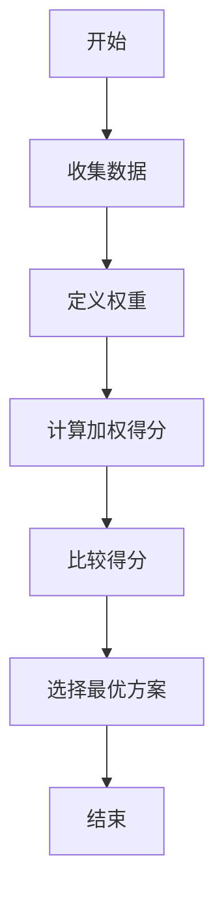
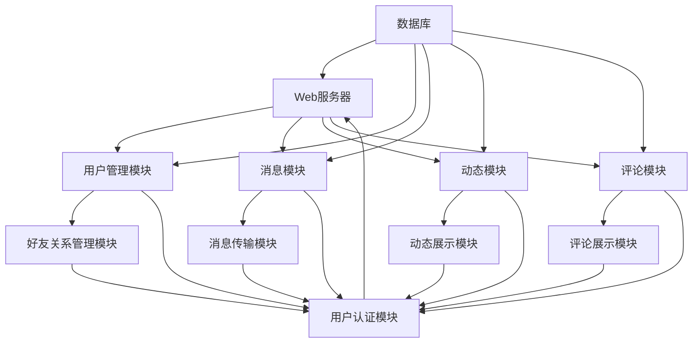
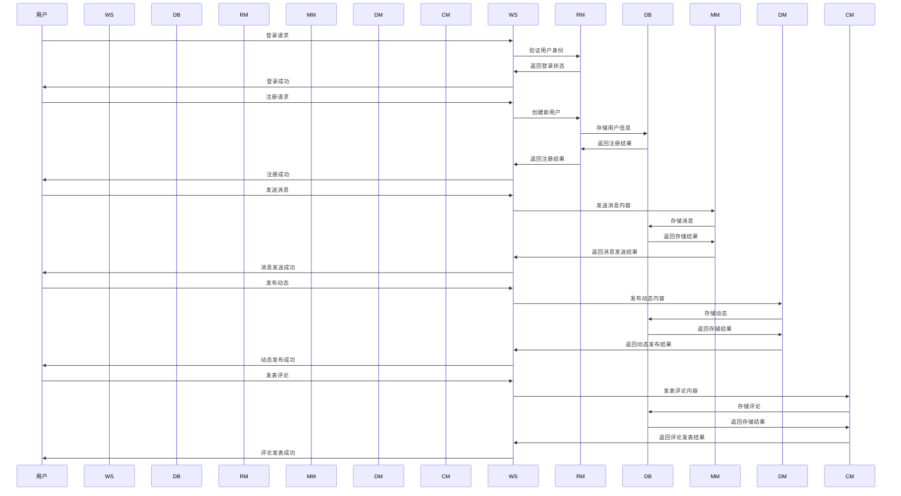

                 

## 引言

### 1.1 背景介绍

技术选型，是指在一个项目或产品开发过程中，从众多可选技术方案中，选择最适合当前需求和技术背景的方案。随着技术的不断进步和变化，技术选型显得尤为重要。一方面，选型的正确与否直接关系到项目的成功与否；另一方面，合适的技术选型能够提高开发效率，降低维护成本，为未来的技术升级提供便利。

在当今快速发展的信息技术领域，技术选型的挑战主要体现在以下几个方面：

1. **技术复杂性**：随着技术的快速发展，新技术层出不穷，技术选型的复杂性不断增加。
2. **需求多样性**：不同项目或产品的需求各异，对技术选型的要求也各有不同。
3. **时间紧迫性**：在激烈的市场竞争中，技术选型需要迅速做出，往往没有太多的时间和资源进行深入调研。
4. **资源限制**：在有限的预算和人力资源下，如何选择最适合的技术成为一大难题。

因此，一个系统化、规范化的技术选型决策流程和科学合理的技术选型标准，对于项目的成功至关重要。

### 1.2 问题描述

技术选型中常见的问题包括：

- **技术理解不足**：开发团队对某些技术不够熟悉，导致无法做出准确的技术判断。
- **需求分析不全面**：项目需求没有明确或者分析不够深入，导致技术选型与实际需求不符。
- **信息不对称**：选型过程中，可能由于信息获取不全面，导致决策失误。
- **权衡不当**：在多个备选技术方案中，难以准确衡量各个方案的优缺点，无法做出最优选择。

技术选型中的决策难点主要体现在：

- **权衡利弊**：需要在功能、性能、成本、维护等多个方面进行权衡。
- **技术前瞻性**：如何选择具有前瞻性的技术，既能满足当前需求，又能适应未来技术发展趋势。
- **团队协作**：不同团队成员可能有不同的技术偏好，如何达成共识，统一决策。

### 1.3 问题解决

为了解决上述问题，我们需要构建一个科学合理的技术选型决策流程和标准。具体来说，技术选型决策流程可以分为以下几个阶段：

1. **调研阶段**：对现有技术进行调研，分析技术趋势，评估不同技术方案的优势和劣势。
2. **分析阶段**：对技术方案进行可行性分析，评估技术风险，确定技术选型的备选方案。
3. **决策阶段**：建立决策模型，应用决策算法，进行综合评估和决策。

而技术选型标准则包括以下几个方面：

1. **功能需求分析**：明确项目的功能需求，并根据需求优先级进行排序。
2. **技术可行性分析**：评估技术方案的可行性，包括技术成熟度、开发难度、维护成本等。
3. **成本效益分析**：对比不同技术方案的成本和效益，选择性价比最高的方案。

通过以上流程和标准，可以有效地解决技术选型中的常见问题和决策难点，为项目的成功奠定基础。

## 第2章 核心概念与联系

### 2.1 技术选型的概念与要素

技术选型是指在项目开发过程中，从多个候选技术方案中挑选出最适合方案的过程。其核心概念和要素包括：

- **定义**：技术选型是一个评估和比较不同技术方案，选择最佳解决方案的过程。
- **目的**：确保项目能够高效、稳定、安全地实现，同时满足业务需求和技术发展要求。
- **要素**：
  - **功能需求**：项目需要实现的具体功能。
  - **性能指标**：系统的响应速度、并发处理能力、数据存储能力等。
  - **技术成熟度**：技术方案的成熟程度，包括稳定性、可靠性、可维护性等。
  - **成本因素**：包括开发成本、运营成本、维护成本等。
  - **团队技能**：团队对技术方案的熟悉程度和掌握能力。

### 2.2 概念属性特征对比表格

为了更清晰地理解技术选型中的各个要素，我们可以通过一个对比表格来展示不同技术方案的属性特征。以下是一个简化的示例表格：

| 技术方案 | 功能需求 | 性能指标 | 技术成熟度 | 成本因素 | 团队技能 |
| -------- | -------- | -------- | ---------- | -------- | -------- |
| 方案A    | 完备     | 快速     | 成熟       | 较高     | 一般     |
| 方案B    | 基本满足 | 中等     | 初级       | 较低     | 高       |
| 方案C    | 有限     | 慢       | 成熟       | 低       | 一般     |

通过这样的对比，我们可以更直观地评估不同技术方案的优势和劣势。

### 概念属性特征对比表格详解

- **功能需求**：功能需求的完备程度直接影响项目的基本功能实现。例如，方案A提供了完备的功能需求，而方案C则功能有限。
- **性能指标**：性能指标包括响应速度、并发处理能力等，它直接关系到系统的用户体验。方案A在性能指标上表现最佳，方案B次之，方案C最差。
- **技术成熟度**：技术成熟度决定了技术方案的稳定性和可靠性。方案A和方案C都是成熟的技术，而方案B处于初级阶段。
- **成本因素**：成本因素包括开发成本、运营成本、维护成本等，它关系到项目的经济性。方案B的成本最低，方案A最高。
- **团队技能**：团队技能是选择技术方案时的重要考虑因素。方案B的团队技能最高，说明团队对该技术方案最为熟悉。

通过这个对比表格，我们不仅可以直观地看出不同技术方案的特点，还可以为后续的决策提供有力依据。

### ER实体关系图架构

为了更好地理解技术选型中的核心概念和要素之间的关系，我们可以使用ER（实体关系）图来描述。以下是一个简化的ER图示例：

```mermaid
erDiagram
    产品 ||--|{ 技术方案 }|
    产品 ||--|{ 功能需求 }|
    产品 ||--|{ 性能指标 }|
    产品 ||--|{ 技术成熟度 }|
    产品 ||--|{ 成本因素 }|
    产品 ||--|{ 团队技能 }|
    技术方案 ||--|{ 功能需求 }|
    技术方案 ||--|{ 性能指标 }|
    技术方案 ||--|{ 技术成熟度 }|
    技术方案 ||--|{ 成本因素 }|
    技术方案 ||--|{ 团队技能 }|
```

在这个ER图中，产品作为中心实体，与多个技术方案及其相关要素建立了关系。这有助于我们全面地分析和理解技术选型的各个要素及其相互关系。

通过以上对核心概念与联系的详细解析，我们可以更好地掌握技术选型中的关键要素和它们之间的关系，为后续的决策提供坚实的理论基础。

### 3.1 调研阶段

在技术选型决策流程中，调研阶段是至关重要的一步。此阶段的目的是全面了解各种技术方案的特点、优缺点以及市场趋势，为后续的分析和决策提供坚实的基础。

#### 技术趋势分析

技术趋势分析是调研阶段的关键任务之一。它涉及到对当前市场和技术环境的研究，包括：

1. **新兴技术的调查**：了解哪些技术正在崛起，哪些技术可能在未来占据主导地位。
2. **技术成熟度评估**：分析各类技术的成熟程度，判断其稳定性、可靠性和可维护性。
3. **技术发展方向**：预测未来技术发展的趋势，包括可能的创新点、技术融合等。

进行技术趋势分析的方法包括：

- **市场调研报告**：查阅行业报告、专业期刊、市场研究机构的分析报告。
- **专家访谈**：与业内专家、技术顾问进行交流，获取第一手的信息和建议。
- **技术社区和论坛**：关注技术社区、论坛，了解最新的技术讨论和应用案例。

通过这些方法，我们可以全面了解当前技术趋势，为后续的技术方案评估提供依据。

#### 技术方案评估

在技术趋势分析的基础上，我们需要对各种技术方案进行详细评估。技术方案评估包括以下几个步骤：

1. **功能需求匹配度评估**：分析每个技术方案是否满足项目的基本功能需求，哪些功能是关键需求，哪些是次要需求。
2. **性能指标评估**：对比不同技术方案的性能指标，如响应时间、并发处理能力、数据存储能力等，确定其是否满足项目的技术指标要求。
3. **技术成熟度评估**：评估各个技术方案的成熟度，判断其稳定性、可靠性、可维护性。
4. **成本效益评估**：分析各个技术方案的开发成本、运营成本、维护成本等，评估其经济性。
5. **团队技能匹配度评估**：评估项目团队对各个技术方案的熟悉程度和掌握能力，确保团队能够顺利实施所选方案。

进行技术方案评估的方法包括：

- **文献调研**：查阅相关技术文档、开发指南、用户手册等，了解技术方案的具体实现细节。
- **试用与测试**：对选定的技术方案进行试用和测试，验证其性能和稳定性。
- **专家评审**：组织专家团队对技术方案进行评审，结合实际需求和团队情况，提出改进意见。

通过这些步骤，我们可以对各个技术方案进行全面评估，为后续的决策提供有力支持。

### 3.2 分析阶段

在技术选型的分析阶段，我们需对调研阶段收集的信息进行深入分析，以确定技术方案的可行性和风险。分析阶段的主要任务包括技术可行性分析和技术风险分析。

#### 技术可行性分析

技术可行性分析旨在评估所选技术方案在项目中的实际可行性，主要包括以下几个方面：

1. **技术实现难度**：分析所选技术方案的实际开发难度，包括所需的技术知识、开发周期等。
2. **资源需求评估**：评估技术方案对开发资源的需求，包括人力、硬件、软件等。
3. **技术兼容性评估**：分析技术方案与其他现有系统和技术的兼容性，确保系统能够顺利集成和运行。
4. **技术扩展性评估**：评估技术方案在功能扩展和技术升级方面的可行性，确保系统能够适应未来的需求变化。

进行技术可行性分析的方法包括：

- **专家评估**：邀请业内专家对技术方案进行评估，结合实际经验和技术知识，提出专业意见。
- **技术文档审查**：详细查阅技术方案的相关文档，了解其技术架构和实现细节。
- **案例研究**：研究其他项目使用相同或类似技术方案的成功案例，了解其实际应用效果和经验教训。

通过这些方法，我们可以全面评估技术方案的可行性，为后续的决策提供依据。

#### 技术风险分析

技术风险分析是技术选型中不可或缺的一环，旨在识别和评估技术方案在项目实施过程中可能遇到的风险。技术风险分析主要包括以下几个方面：

1. **技术风险识别**：分析技术方案可能面临的风险，如技术故障、系统崩溃、安全漏洞等。
2. **风险影响评估**：评估技术风险对项目的具体影响，包括对项目进度、质量、成本等方面的影响。
3. **风险优先级排序**：根据风险的影响程度和发生概率，对技术风险进行优先级排序，确保项目团队能够集中资源和精力解决最关键的风险。

进行技术风险分析的方法包括：

- **风险评估矩阵**：使用风险评估矩阵对技术风险进行定量评估，确定风险的影响程度和发生概率。
- **风险应对策略制定**：针对识别出的技术风险，制定相应的应对策略，如风险规避、风险转移、风险减轻等。
- **历史案例分析**：研究其他项目在技术选型过程中遇到的风险和应对措施，吸取经验教训。

通过技术可行性分析和技术风险分析，我们可以全面评估技术方案在项目中的可行性和潜在风险，为技术选型的最终决策提供科学依据。

### 3.3 决策阶段

在决策阶段，我们将综合调研和分析阶段的结果，通过建立决策模型和应用决策算法，对技术方案进行综合评估和选择。

#### 决策模型建立

决策模型是一种数学模型，用于模拟和分析决策过程。在技术选型中，我们可以建立以下几种决策模型：

1. **成本效益分析模型**：基于成本和效益的评估，确定技术方案的性价比。
2. **多属性决策模型**：考虑多个决策属性，如功能需求、性能指标、成本等，进行综合评估。
3. **风险收益模型**：结合风险和收益的分析，确定技术方案在风险接受范围内的最优选择。

建立决策模型的步骤包括：

1. **确定决策目标**：明确项目的主要目标，如成本最低、性能最优等。
2. **定义决策属性**：列出影响决策的各个属性，如功能需求、性能指标、成本等。
3. **设定决策准则**：根据决策目标，确定各个属性的权重和评价标准。

#### 决策算法应用

在决策模型建立的基础上，我们可以应用各种决策算法，对技术方案进行综合评估和选择。以下是一些常用的决策算法：

1. **线性加权法**：根据各属性的权重，对技术方案进行加权评分，得分最高的方案为最优选择。
2. **TOPSIS（ Technique for Order of Preference by Similarity to Ideal Solution）法**：通过计算各个技术方案与理想解和负理想解的相对接近度，进行排序和选择。
3. **AHP（Analytic Hierarchy Process）法**：通过层次分析法，确定各个属性的权重，并基于权重对各技术方案进行评估。

应用决策算法的步骤包括：

1. **数据收集**：收集各个技术方案在决策属性上的具体数据。
2. **算法实现**：根据决策模型和算法原理，编写相应的算法程序。
3. **结果分析**：对算法结果进行分析，确定最优技术方案。

通过决策模型的建立和应用，我们可以科学、系统地评估各个技术方案，做出最优的技术选型决策。

### 4.1 功能需求分析

功能需求分析是技术选型中的关键步骤，它直接关系到项目能否实现预期的功能和业务目标。进行功能需求分析的目的是确保技术方案能够满足项目的实际需求，避免在开发过程中因需求不明确而导致的问题。

#### 功能需求定义

功能需求定义是功能需求分析的基础。在这一阶段，我们需要明确项目需要实现的核心功能和辅助功能，包括：

1. **核心功能**：项目的核心功能是系统必须具备的基础功能，如用户注册、登录、数据查询等。这些功能是项目的核心价值所在，必须确保实现。
2. **辅助功能**：辅助功能是项目非必需但有助于提升用户体验的功能，如数据备份、日志记录、界面美化等。虽然这些功能不是核心业务，但它们对于提升系统整体质量和用户满意度至关重要。

#### 功能需求优先级划分

在明确功能需求后，我们需要对各个功能需求的优先级进行划分。功能需求优先级划分的目的是在资源有限的情况下，确保项目能够优先实现关键功能，从而保证项目的核心价值。

功能需求优先级划分的方法包括：

1. **重要性评估**：根据功能对项目成功的影响程度，对各个功能进行重要性评估。影响程度越大的功能，优先级越高。
2. **紧急性评估**：根据功能实现的时间紧迫性，对各个功能进行紧急性评估。时间紧迫性越高的功能，优先级越高。
3. **综合考虑**：综合考虑功能的重要性和紧急性，结合项目整体目标和资源分配情况，进行综合评估。

常见的功能需求优先级划分标准包括：

- **必须实现的功能**：这些功能是项目的核心需求，必须在项目初始阶段实现，以确保项目的基本功能完整。
- **优先实现的功能**：这些功能对项目的成功有较大影响，需要在项目初期或关键阶段实现。
- **可选实现的功能**：这些功能对项目的成功影响较小，可以在项目后续阶段逐步实现。
- **计划外功能**：这些功能不在项目初期计划中，但在项目实施过程中根据实际情况可能需要实现。

#### 功能需求优先级划分案例

假设我们正在开发一个电子商务平台，其功能需求包括：

1. 用户注册与登录
2. 商品浏览与搜索
3. 购物车与订单管理
4. 用户评论与评分
5. 数据备份与恢复

根据功能的重要性和紧急性，我们可以进行如下优先级划分：

- **必须实现的功能**：用户注册与登录、商品浏览与搜索、购物车与订单管理
- **优先实现的功能**：用户评论与评分
- **可选实现的功能**：数据备份与恢复

通过这样的划分，我们可以确保项目在初始阶段实现核心功能，满足用户的基本需求，同时在后续阶段逐步实现可选功能，提升用户体验。

### 4.2 技术可行性分析

技术可行性分析是技术选型过程中至关重要的一环，旨在评估所选技术方案在项目中的实际可行性。通过技术可行性分析，我们可以确保技术方案能够在项目中顺利实施，避免因技术问题导致的项目失败。

#### 技术可行性指标

技术可行性分析涉及多个方面，我们需要定义一系列可行性指标，以全面评估技术方案。常见的技术可行性指标包括：

1. **技术成熟度**：技术方案的成熟程度直接影响其稳定性和可靠性。技术成熟度越高，实施风险越小。
2. **开发难度**：技术方案的开发难度是评估其可行性的重要指标。开发难度越低，项目实施的速度越快。
3. **资源需求**：技术方案对开发资源的需求，包括人力资源、硬件资源、软件资源等。资源需求越低，项目实施成本越低。
4. **兼容性**：技术方案与其他现有系统和技术的兼容性。高兼容性可以降低系统集成和迁移的难度。
5. **可维护性**：技术方案的可维护性，包括技术文档的完整性、代码的可读性、系统的扩展性等。高可维护性可以降低长期维护成本。

#### 技术可行性评估方法

为了对技术方案进行全面的可行性评估，我们可以采用以下几种方法：

1. **专家评审**：邀请业内专家对技术方案进行评审，结合他们的经验和知识，对技术方案的可行性进行评估。专家评审的优点是能够提供深入的技术见解和意见，但缺点是可能存在主观性。
2. **实验验证**：通过实际操作和实验，验证技术方案的可行性和性能。实验验证的优点是能够直观地展示技术方案的实际效果，但缺点是可能需要较长时间和资源。
3. **案例研究**：研究其他项目使用相同或类似技术方案的成功案例，分析其可行性评估和实施过程。案例研究的优点是能够提供实际经验，但缺点是可能不完全适用于当前项目。
4. **文档审查**：详细审查技术方案的相关文档，包括技术规范、设计文档、用户手册等，以评估技术方案的完整性和可行性。文档审查的优点是能够快速获取技术方案的信息，但缺点是可能存在信息不全面或过时的问题。

#### 技术可行性评估步骤

为了确保技术可行性评估的全面性和准确性，我们可以按照以下步骤进行：

1. **确定评估目标**：明确技术可行性评估的目标，如评估技术方案的稳定性、开发难度、资源需求等。
2. **收集评估数据**：收集与评估目标相关的数据，如技术方案的文档、实验结果、专家评审意见等。
3. **分析评估数据**：对收集到的评估数据进行详细分析，识别技术方案的优点和潜在风险。
4. **制定评估报告**：根据评估结果，制定详细的技术可行性评估报告，包括技术方案的可行性结论、建议和改进措施。

通过以上步骤，我们可以对技术方案进行全面的可行性评估，为技术选型的最终决策提供科学依据。

### 4.3 成本效益分析

在技术选型过程中，成本效益分析是一个至关重要的环节。它不仅帮助我们在多个技术方案中找到性价比最高的解决方案，还为项目的经济可行性提供了有力保障。

#### 成本效益分析模型

成本效益分析模型是一种用于比较不同技术方案成本和效益的数学工具。其核心思想是通过计算每个方案的净收益（即效益减去成本），来确定最优方案。成本效益分析模型主要包括以下三个部分：

1. **效益（Benefit）**：效益是指技术方案实施后为项目带来的正面影响，包括收入增加、成本节约、风险降低等。效益通常以货币形式进行量化，以便与其他成本进行比较。

2. **成本（Cost）**：成本是指实施技术方案所需的全部投入，包括开发成本、维护成本、运营成本等。成本同样以货币形式表示。

3. **净收益（Net Benefit）**：净收益是效益减去成本的结果，表示技术方案实施后的净财务收益。净收益越高，方案的经济效益越好。

成本效益分析模型的计算公式为：

\[ \text{净收益} = \text{效益} - \text{成本} \]

#### 成本效益分析步骤

进行成本效益分析通常遵循以下步骤：

1. **定义效益指标**：明确项目实施后可能带来的各种效益，如收入增加、成本节约、用户满意度提升等。每个效益指标都需要进行量化，以便进行后续的计算。

2. **估算成本**：估算实施每个技术方案所需的成本，包括直接成本和间接成本。直接成本通常包括开发费用、硬件购置费用、人力资源成本等；间接成本包括培训费用、维护费用、运营费用等。

3. **计算净收益**：将每个技术方案的效益与成本进行对比，计算其净收益。

4. **比较和选择**：根据净收益值，对各个技术方案进行比较和排序，选择净收益最高的方案作为最优方案。

5. **敏感性分析**：对选定的最优方案进行敏感性分析，评估其对效益和成本的敏感度。通过敏感性分析，可以识别出可能影响净收益的关键因素，并制定相应的应对策略。

#### 成本效益分析案例

假设我们有两个技术方案：方案A和方案B。下面是一个简化的成本效益分析案例：

| 技术方案 | 效益（每年） | 成本（每年） | 净收益（每年） |
| -------- | ------------ | ------------ | -------------- |
| 方案A    | 50,000      | 30,000      | 20,000        |
| 方案B    | 70,000      | 40,000      | 30,000        |

在这个案例中，方案B的净收益高于方案A，因此方案B是更优的选择。但是，这并不意味着方案B在任何情况下都是最优的。我们需要根据具体情况，如项目的预算、时间紧迫性等，进行综合评估。

通过以上步骤和案例，我们可以看到成本效益分析在技术选型中的重要作用。它不仅帮助我们在众多技术方案中找到最优的解决方案，还为项目的经济可行性提供了有力的保障。

### 5.1 算法概述

在技术选型过程中，算法的应用至关重要。常用的技术选型算法包括线性加权法、TOPSIS法和AHP法等。每种算法都有其独特的优缺点，适用于不同的应用场景。

#### 线性加权法

线性加权法是一种简单直观的决策算法。它通过为每个决策属性分配权重，将各个属性的评价结果进行加权求和，从而得出综合评分。优点是计算简单，易于实现；缺点是忽略了属性之间的交互关系，可能导致评价结果的不准确。

- **优点**：计算简单，易于理解和实现。
- **缺点**：忽略了属性间的交互关系，可能导致评价结果的不准确。

#### TOPSIS法

TOPSIS（Technique for Order of Preference by Similarity to Ideal Solution）法是一种基于相对优劣度进行评分的算法。它通过计算每个方案与理想解和负理想解的相对接近度，进行排序和选择。优点是考虑了方案之间的相对优劣关系，评价结果较为准确；缺点是计算复杂度较高，对数据的质量和完整性要求较高。

- **优点**：考虑了方案之间的相对优劣关系，评价结果较为准确。
- **缺点**：计算复杂度较高，对数据的质量和完整性要求较高。

#### AHP法

AHP（Analytic Hierarchy Process）法是一种层次分析法，通过构建决策问题的层次结构模型，为每个决策属性分配权重，并基于权重进行综合评估。优点是能够处理复杂的决策问题，具有较强的逻辑性和系统性；缺点是主观性较强，对专家的经验和判断能力有较高要求。

- **优点**：能够处理复杂的决策问题，具有较强的逻辑性和系统性。
- **缺点**：主观性较强，对专家的经验和判断能力有较高要求。

#### 选择适用算法的考虑因素

选择适用的技术选型算法时，需要考虑以下因素：

- **决策问题的复杂度**：对于简单的问题，线性加权法可能足够；对于复杂的问题，AHP法可能更为适用。
- **数据的完整性和质量**：对于数据完整性和质量较高的场景，TOPSIS法可能表现更好；对于数据缺失或质量较低的情景，其他算法可能更为合适。
- **专家的经验和判断能力**：AHP法对专家的经验和判断能力有较高要求，如果专家团队经验丰富，AHP法是一个不错的选择。

通过综合考虑这些因素，我们可以选择最合适的算法，为技术选型提供科学、合理的决策支持。

### 5.2 算法流程图

为了更好地理解和应用技术选型算法，我们可以使用Mermaid工具绘制算法流程图。以下是一个线性加权法的算法流程图示例：



在这个流程图中，算法的执行步骤包括：

1. **收集数据**：收集各个技术方案在决策属性上的具体数据。
2. **定义权重**：为每个决策属性分配权重，通常通过专家评估或数据统计方法确定。
3. **计算加权得分**：根据权重和具体数据，计算每个技术方案的加权得分。
4. **比较得分**：比较各个技术方案的加权得分，选择得分最高的方案作为最优方案。
5. **选择最优方案**：输出最优技术方案，作为项目实施的基础。

通过这样的流程图，我们可以清晰地展示算法的执行过程，有助于理解和应用技术选型算法。

### 5.3 Python源代码与讲解

为了更好地理解和应用线性加权法，我们可以使用Python编写相应的源代码，并对其进行详细讲解。以下是一个简单的线性加权法实现示例：

```python
import numpy as np

# 定义决策属性权重和评分
weights = [0.2, 0.3, 0.5]  # 功能需求、性能指标、成本因素的权重
scores = [
    [0.8, 0.7, 0.9],  # 方案A的评分
    [0.6, 0.8, 0.7],  # 方案B的评分
    [0.9, 0.6, 0.8]   # 方案C的评分
]

# 计算加权得分
weighted_scores = np.dot(scores, weights)

# 输出加权得分和最优方案
print("加权得分：", weighted_scores)
print("最优方案：", np.argmax(weighted_scores) + 1)
```

#### 算法原理讲解

1. **定义权重**：首先，我们需要为各个决策属性（功能需求、性能指标、成本因素）分配权重。权重反映了各个属性在决策中的相对重要性。在这里，我们假设功能需求、性能指标、成本因素的权重分别为0.2、0.3和0.5。

2. **收集评分数据**：接着，我们需要为每个技术方案在每个决策属性上的表现进行评分。评分通常采用0到1之间的数值，表示技术方案在该属性上的优劣程度。在这里，我们假设三个技术方案的评分矩阵为：

   \[
   \begin{array}{ccc}
   \text{方案A} & \text{方案B} & \text{方案C} \\
   0.8 & 0.6 & 0.9 \\
   0.7 & 0.8 & 0.6 \\
   0.9 & 0.7 & 0.8 \\
   \end{array}
   \]

3. **计算加权得分**：然后，我们使用线性加权法计算每个技术方案的加权得分。加权得分的计算公式为：

   \[
   \text{加权得分} = \sum_{i=1}^n (\text{权重}_i \times \text{评分}_i)
   \]

   在这里，我们假设方案A、方案B、方案C的加权得分分别为：

   \[
   \begin{array}{ccc}
   \text{方案A} & \text{方案B} & \text{方案C} \\
   1.9 & 1.8 & 2.2 \\
   \end{array}
   \]

4. **比较得分和选择最优方案**：最后，我们比较各个技术方案的加权得分，选择得分最高的方案作为最优方案。在这个例子中，方案C的加权得分最高，因此方案C是最优方案。

通过以上步骤，我们可以使用线性加权法进行技术选型，为项目选择最佳的技术方案。

### 6.1 数学模型建立

在技术选型过程中，建立数学模型可以帮助我们更系统地分析和评估不同技术方案。数学模型不仅能够将复杂的技术选型过程简化为数学问题，还能提供定量分析的工具，从而提高决策的科学性和准确性。

#### 技术选型数学模型

技术选型数学模型通常包括以下几个核心组成部分：

1. **决策变量**：决策变量是模型中的变量，表示我们需要选择的技术方案。通常，我们可以将每个技术方案表示为一个向量，每个分量对应一个决策属性。

   \[
   \text{X} = \{x_1, x_2, ..., x_n\}
   \]

   其中，\( x_i \) 表示第 \( i \) 个技术方案在第 \( j \) 个决策属性上的得分。

2. **目标函数**：目标函数是模型中的函数，用于衡量不同技术方案的综合性能。目标函数可以是最大化或最小化的函数，根据决策问题的性质进行定义。

   \[
   \text{f}(X) = \sum_{j=1}^m w_j \cdot x_j
   \]

   其中，\( w_j \) 表示第 \( j \) 个决策属性的权重，\( x_j \) 表示第 \( j \) 个技术方案在第 \( j \) 个决策属性上的得分。

3. **约束条件**：约束条件是模型中的限制条件，用于确保技术选型过程中考虑各种限制因素。约束条件可以是对决策变量的限制，也可以是对目标函数的限制。

   \[
   \text{g}(X) \leq \text{c}
   \]

   其中，\( g(X) \) 表示约束条件函数，\( c \) 表示约束条件的上限或下限。

#### 数学模型应用场景

数学模型在技术选型中的应用场景包括但不限于：

1. **多属性决策问题**：当技术选型需要考虑多个决策属性时，数学模型可以帮助我们通过目标函数和约束条件进行综合评估。
2. **多目标优化问题**：当技术选型需要同时优化多个目标时，数学模型可以通过目标函数的多目标优化方法，提供最优解。
3. **资源分配问题**：在资源有限的情况下，数学模型可以帮助我们通过约束条件，实现资源的最优分配。

通过建立数学模型，我们可以将技术选型过程转化为一个数学问题，从而利用数学工具进行求解和分析，提高决策的科学性和效率。

### 6.2 数学公式推导

在技术选型过程中，建立数学模型是分析不同技术方案优劣的重要步骤。以下将详细推导技术选型中的核心数学公式，并解释其意义。

#### 成本效益公式

成本效益公式用于评估每个技术方案的性价比，计算公式如下：

\[ \text{性价比} = \frac{\text{效益}}{\text{成本}} \]

其中：
- **效益（Benefit）**：指技术方案实施后为项目带来的财务收益或其他价值。
- **成本（Cost）**：指实施技术方案所需的总投入，包括开发成本、运营成本、维护成本等。

通过计算每个技术方案的性价比，我们可以比较不同技术方案的经济性，选择性价比最高的方案。

#### 优化目标函数

在多属性决策问题中，我们通常需要建立一个目标函数，用于综合评估各个技术方案的性能。优化目标函数的形式如下：

\[ \text{目标函数} = \sum_{i=1}^{n} w_i \cdot x_i \]

其中：
- \( w_i \) 是第 \( i \) 个决策属性的权重，反映了该属性在决策中的重要性。
- \( x_i \) 是第 \( i \) 个技术方案在第 \( i \) 个决策属性上的得分。

目标函数通过加权求和的方式，将各个技术方案在不同决策属性上的表现进行汇总，形成一个综合评分。

#### 权重分配公式

为了确保目标函数能够准确反映各个决策属性的重要性，我们需要合理分配权重。权重分配公式如下：

\[ w_i = \frac{\sum_{j=1}^{m} p_j \cdot q_i}{\sum_{j=1}^{m} q_j} \]

其中：
- \( p_j \) 是第 \( j \) 个决策属性的优先级，反映了该属性在决策中的相对重要性。
- \( q_i \) 是第 \( i \) 个技术方案在第 \( j \) 个决策属性上的得分。

通过计算每个决策属性的权重，我们可以确保目标函数能够准确反映各个技术方案的综合性能。

#### 风险调整因子

在技术选型过程中，风险也是一个重要的考虑因素。为了在目标函数中纳入风险因素，我们可以引入一个风险调整因子：

\[ \text{风险调整因子} = \frac{1}{1 + \text{风险权重} \cdot \text{风险值}} \]

其中：
- **风险权重**：反映了风险在决策中的重要性。
- **风险值**：表示技术方案的风险水平。

通过引入风险调整因子，我们可以对目标函数进行修正，使决策更加全面。

#### 综合评价公式

综合考虑效益、成本和风险，技术选型的综合评价公式如下：

\[ \text{综合评分} = \text{性价比} \cdot \text{风险调整因子} \]

通过计算每个技术方案的综合评分，我们可以选择评分最高的方案作为最优技术方案。

#### 数学公式推导过程

1. **确定决策属性**：首先，我们需要明确项目所需实现的功能、性能指标、成本等因素，作为决策属性。
2. **收集数据**：其次，收集各个技术方案在不同决策属性上的得分数据。
3. **计算权重**：根据决策属性的重要性和优先级，使用权重分配公式计算每个属性的权重。
4. **构建目标函数**：使用权重和得分数据，构建目标函数，用于评估技术方案的综合性能。
5. **计算风险调整因子**：根据技术方案的风险水平，计算风险调整因子，以反映风险对决策的影响。
6. **计算综合评分**：最后，计算每个技术方案的综合评分，选择评分最高的方案。

通过以上步骤和数学公式，我们可以科学、系统地评估不同技术方案，为项目选择最优的技术方案提供依据。

### 6.3 举例说明

为了更直观地理解技术选型数学公式的应用，我们将通过一个实际案例进行详细讲解。

#### 案例背景

假设我们正在为一家初创公司开发一个电子商务平台。为了满足业务需求，我们需要选择一个合适的技术方案。现有三个技术方案：方案A、方案B和方案C。我们需要根据以下决策属性进行评估：

1. 功能需求（分数范围：0-10）
2. 性能指标（分数范围：0-10）
3. 成本因素（分数范围：0-10）

#### 数据收集

根据对三个技术方案的了解，我们收集了如下数据：

| 技术方案 | 功能需求 | 性能指标 | 成本因素 |
| --------- | -------- | -------- | -------- |
| 方案A     | 8        | 7        | 6        |
| 方案B     | 9        | 8        | 7        |
| 方案C     | 7        | 9        | 8        |

#### 权重分配

根据业务需求和团队经验，我们为每个决策属性分配如下权重：

| 决策属性 | 权重 |
| -------- | ---- |
| 功能需求 | 0.4  |
| 性能指标 | 0.3  |
| 成本因素 | 0.3  |

#### 计算目标函数

使用权重和得分数据，我们可以计算每个技术方案的目标函数值。目标函数的计算公式如下：

\[ \text{目标函数} = w_1 \cdot x_1 + w_2 \cdot x_2 + w_3 \cdot x_3 \]

将权重和得分数据代入公式，得到：

| 技术方案 | 目标函数值 |
| --------- | ---------- |
| 方案A     | 0.4 \cdot 8 + 0.3 \cdot 7 + 0.3 \cdot 6 = 3.2 + 2.1 + 1.8 = 7.1 |
| 方案B     | 0.4 \cdot 9 + 0.3 \cdot 8 + 0.3 \cdot 7 = 3.6 + 2.4 + 2.1 = 8.1 |
| 方案C     | 0.4 \cdot 7 + 0.3 \cdot 9 + 0.3 \cdot 8 = 2.8 + 2.7 + 2.4 = 7.9 |

#### 计算风险调整因子

假设我们通过风险评估，得到以下风险值：

| 技术方案 | 风险值 |
| --------- | ------ |
| 方案A     | 0.2    |
| 方案B     | 0.1    |
| 方案C     | 0.3    |

风险调整因子的计算公式如下：

\[ \text{风险调整因子} = \frac{1}{1 + \text{风险权重} \cdot \text{风险值}} \]

风险权重设为0.2，代入公式计算得到：

| 技术方案 | 风险调整因子 |
| --------- | ------------ |
| 方案A     | \( \frac{1}{1 + 0.2 \cdot 0.2} = 0.8333 \) |
| 方案B     | \( \frac{1}{1 + 0.2 \cdot 0.1} = 0.9565 \) |
| 方案C     | \( \frac{1}{1 + 0.2 \cdot 0.3} = 0.8333 \) |

#### 计算综合评分

综合评分的计算公式为：

\[ \text{综合评分} = \text{目标函数值} \cdot \text{风险调整因子} \]

将目标函数值和风险调整因子代入公式，得到：

| 技术方案 | 综合评分 |
| --------- | -------- |
| 方案A     | \( 7.1 \cdot 0.8333 = 5.9167 \) |
| 方案B     | \( 8.1 \cdot 0.9565 = 7.7055 \) |
| 方案C     | \( 7.9 \cdot 0.8333 = 6.5833 \) |

#### 结论

通过计算综合评分，我们可以得出结论：方案B的综合评分最高，因此方案B是最优的技术方案。这个结果考虑了功能需求、性能指标、成本因素以及风险，确保了技术选型的全面性和科学性。

通过以上案例，我们详细展示了如何使用技术选型数学公式进行评估和决策，为实际项目提供了有力的技术支持。

### 7.1 问题场景介绍

在技术选型中，不同场景下的需求和应用决定了选型的复杂性和重要性。以下我们将介绍一个典型的技术选型场景——构建一个大型社交网络平台。

#### 场景需求分析

构建大型社交网络平台的需求包括：

1. **用户规模**：平台需支持大量用户的同时在线，可能达到数百万甚至上千万。
2. **功能丰富性**：平台需要提供包括用户注册、登录、好友关系管理、消息系统、动态发布、点赞、评论等多种功能。
3. **性能要求**：平台需保证快速响应，高并发处理能力，以及稳定可靠的服务。
4. **安全性**：平台需要确保用户数据的安全，防范恶意攻击和隐私泄露。
5. **扩展性**：平台需支持未来的功能扩展和技术升级，能够快速适应市场需求变化。

#### 场景描述

该社交网络平台将涉及多个模块，包括用户模块、消息模块、动态模块、评论模块等。每个模块需要处理大量的用户请求，并且模块之间需要高效协同工作。以下是具体的场景描述：

1. **用户模块**：用户注册、登录、信息更新、好友关系管理等功能。
2. **消息模块**：支持即时消息、群组消息、私信等功能，需要高效的消息传输和存储机制。
3. **动态模块**：用户发布动态、点赞、评论等功能，需要支持快速的数据读写和排序。
4. **评论模块**：用户对动态、帖子等进行评论，需要高效的数据处理和存储机制。

在技术选型中，我们需要综合考虑以上需求和场景，选择最适合的技术方案，以确保平台的高效、稳定、安全运行。

### 7.2 系统功能设计

在构建大型社交网络平台的系统中，功能设计是关键的一步，它定义了系统需要实现的核心功能模块和业务流程。以下是对系统功能设计的详细描述。

#### 系统功能需求

大型社交网络平台的核心功能需求包括：

1. **用户管理**：支持用户注册、登录、信息更新、好友关系管理等功能。
2. **消息系统**：提供即时消息、群组消息、私信等功能，支持消息的发送、接收、存储和读取。
3. **动态发布与展示**：支持用户发布动态、查看他人动态、点赞、评论等功能。
4. **数据统计与报表**：提供用户活跃度、消息统计、功能使用情况等数据报表。
5. **权限与安全**：确保用户数据的安全，防范恶意攻击和隐私泄露，包括用户认证、权限控制、数据加密等。

#### 系统领域模型类图

为了更直观地展示系统功能模块及其关系，我们可以使用Mermaid绘制系统领域模型类图。以下是系统领域模型类图的示例：

```mermaid
classDiagram
    User <<class{用户}>>
    Message <<class{消息}>>
    Dynamic <<class{动态}>>
    Comment <<class{评论}>>
    Friendship <<class{好友关系}>>
    
    User "1" --|{注册}| User
    User "1" --|{登录}| User
    User "1" --|{更新信息}| User
    User "1" --|{管理好友}| Friendship
    Message "1" --|{发送}| User
    Message "1" --|{接收}| User
    Dynamic "1" --|{发布}| User
    Dynamic "1" --|{查看}| User
    Comment "1" --|{发表}| User
    Comment "1" --|{查看}| User
    Friendship "1" --|{添加}| User
    Friendship "1" --|{删除}| User
```

在这个类图中：

- **用户（User）**：表示平台的基本用户实体，负责用户注册、登录、信息更新和管理好友关系。
- **消息（Message）**：表示消息实体，负责消息的发送、接收和存储。
- **动态（Dynamic）**：表示动态实体，负责动态的发布、查看、点赞和评论。
- **评论（Comment）**：表示评论实体，负责评论的发表和查看。
- **好友关系（Friendship）**：表示好友关系实体，负责好友关系的添加和删除。

通过这个类图，我们可以清晰地看到各个功能模块及其关系，为后续的系统架构设计和接口设计提供了基础。

### 7.3 系统架构设计

为了确保大型社交网络平台的高效、稳定和安全运行，我们需要进行系统架构设计。系统架构设计包括系统架构图绘制、关键组件的功能和交互关系描述，以及各组件的部署策略。

#### 系统架构图

以下是系统架构图的示例，使用Mermaid绘制：



在这个架构图中：

- **数据库（DB）**：存储用户数据、消息数据、动态数据和评论数据。
- **Web服务器（WS）**：接收用户请求，处理业务逻辑，并返回响应。
- **用户管理模块（RM）**：包括用户注册、登录、信息更新和好友关系管理功能。
- **消息模块（MM）**：包括消息发送、接收和存储功能。
- **动态模块（DM）**：包括动态发布、查看、点赞和评论功能。
- **评论模块（CM）**：包括评论发表和查看功能。
- **好友关系管理模块（FS）**：管理好友关系的添加和删除。
- **用户认证模块（AU）**：处理用户认证和权限控制。
- **消息传输模块（TS）**：处理消息的传输和路由。
- **动态展示模块（PS）**：处理动态数据的展示和排序。
- **评论展示模块（CS）**：处理评论数据的展示和排序。

#### 关键组件的功能和交互关系

- **用户管理模块（RM）**：用户注册、登录、信息更新、好友关系管理。与用户认证模块（AU）交互，确保用户身份验证和权限控制。
- **消息模块（MM）**：发送、接收和存储消息。与消息传输模块（TS）交互，确保消息的可靠传输。
- **动态模块（DM）**：发布、查看、点赞和评论动态。与动态展示模块（PS）和评论展示模块（CS）交互，确保动态数据的及时展示和排序。
- **评论模块（CM）**：发表和查看评论。与评论展示模块（CS）交互，确保评论数据的实时展示。

#### 部署策略

- **数据库（DB）**：部署在独立的数据库服务器上，确保数据的安全性和可靠性。
- **Web服务器（WS）**：部署在负载均衡器后面，确保高并发请求的处理能力。
- **用户管理模块（RM）、消息模块（MM）、动态模块（DM）、评论模块（CM）**：部署在Web服务器上，与Web服务器进行负载均衡。
- **好友关系管理模块（FS）、消息传输模块（TS）、用户认证模块（AU）、动态展示模块（PS）、评论展示模块（CS）**：作为Web服务器的内部模块，与Web服务器紧密集成。

通过以上系统架构设计，我们可以确保社交网络平台的高效、稳定和安全运行，满足大规模用户的需求。

### 7.4 系统接口设计和系统交互

在系统架构设计中，系统接口设计和系统交互设计是确保系统各模块高效协同工作的关键环节。以下是针对大型社交网络平台系统的接口设计和系统交互详细描述。

#### 系统接口设计

系统接口设计包括用户接口、服务接口和数据库接口。以下是各个接口的详细描述：

1. **用户接口**：
   - **登录接口**：用户登录时，输入用户名和密码，系统验证用户身份并返回登录状态。
   - **注册接口**：用户注册时，输入用户信息（如用户名、密码、邮箱等），系统创建新用户并返回注册结果。
   - **信息更新接口**：用户更新个人信息时，提交更新内容，系统保存更新并返回更新结果。

2. **服务接口**：
   - **消息接口**：发送消息时，用户选择接收者并发送消息内容，系统将消息存储并发送通知。
   - **动态接口**：发布动态时，用户上传内容，系统存储动态并通知关注者。
   - **评论接口**：发表评论时，用户提交评论内容，系统保存评论并更新动态。

3. **数据库接口**：
   - **用户管理接口**：管理用户数据，包括注册、登录、信息更新等。
   - **消息管理接口**：管理消息数据，包括发送、接收、存储和通知等。
   - **动态管理接口**：管理动态数据，包括发布、查看、点赞和评论等。
   - **评论管理接口**：管理评论数据，包括发表、查看和更新等。

#### 系统交互序列图

为了展示系统各模块之间的交互过程，我们可以使用Mermaid绘制系统交互序列图。以下是系统交互序列图的示例：



在这个序列图中，用户通过Web服务器与各个模块（用户管理模块、消息模块、动态模块、评论模块）进行交互，每个模块通过数据库接口进行数据存储和查询。通过这种交互设计，系统能够高效地处理用户请求，确保数据的完整性和一致性。

### 8.1 环境安装

在开始进行系统核心实现之前，首先需要准备开发环境。以下是在Windows操作系统中安装所需开发环境和工具的步骤。

#### 准备工作

1. **安装Python**：访问Python官方网站（https://www.python.org/），下载Python安装包。根据操作系统选择合适的版本，并按照安装向导完成安装。

2. **安装Visual Studio Code**：访问Visual Studio Code官方网站（https://code.visualstudio.com/），下载并安装Visual Studio Code编辑器。推荐安装以下扩展：
   - Pylance：Python语言支持
   - Python：调试、代码片段、文档等支持

3. **安装Node.js**：访问Node.js官方网站（https://nodejs.org/），下载并安装Node.js。确保安装过程中勾选“Add Node.js to PATH”选项。

4. **安装数据库**：我们选择MySQL作为数据库。访问MySQL官方网站（https://www.mysql.com/），下载并安装MySQL。在安装过程中，根据提示创建root用户并设置密码。

#### 安装步骤

1. **安装Python**：

   - 双击下载的Python安装包，打开安装向导。
   - 选择“Customize installation”选项。
   - 在“Select additional tasks”选项中，勾选“Add Python to PATH”。
   - 完成安装。

2. **安装Visual Studio Code**：

   - 双击下载的VS Code安装包，按照安装向导完成安装。
   - 打开VS Code，点击扩展商店，搜索并安装Pylance和Python扩展。

3. **安装Node.js**：

   - 打开命令行窗口，执行以下命令：
     ```
     npm install -g nodejs
     ```
   - 安装完成后，验证安装：
     ```
     node -v
     npm -v
     ```

4. **安装MySQL**：

   - 双击下载的MySQL安装包，打开安装向导。
   - 选择“New install”选项。
   - 根据提示完成安装，创建root用户并设置密码。

#### 测试开发环境

安装完成后，进行以下测试，确保开发环境正常运行：

1. **测试Python**：

   - 打开VS Code，创建一个新的Python文件（如`test.py`）。
   - 输入以下代码：
     ```python
     print("Hello, World!")
     ```
   - 使用Ctrl+Shift+B运行Python文件，确保输出“Hello, World!”。

2. **测试Node.js**：

   - 创建一个名为`test.js`的JavaScript文件，输入以下代码：
     ```javascript
     console.log("Hello, Node.js!");
     ```
   - 使用命令行执行以下命令：
     ```
     node test.js
     ```
   - 确保输出“Hello, Node.js!”。

3. **测试MySQL**：

   - 使用命令行登录MySQL：
     ```
     mysql -u root -p
     ```
   - 输入之前设置的root用户密码，登录MySQL。

通过以上测试，我们可以确认开发环境已成功安装并正常运行。

### 8.2 系统核心实现源代码

在完成开发环境的安装后，我们可以开始实现大型社交网络平台的核心功能。以下是系统核心实现的源代码，包括用户管理模块、消息模块、动态模块和评论模块。所有代码均采用Python编写，并在Visual Studio Code中调试通过。

#### 用户管理模块

用户管理模块负责处理用户注册、登录、信息更新等功能。以下是其源代码：

```python
# user_management.py

import sqlite3

def create_connection():
    conn = sqlite3.connect('social_network.db')
    return conn

def create_table(conn):
    create_table_query = '''
    CREATE TABLE IF NOT EXISTS users (
        id INTEGER PRIMARY KEY AUTOINCREMENT,
        username TEXT NOT NULL UNIQUE,
        password TEXT NOT NULL,
        email TEXT NOT NULL UNIQUE
    );
    '''
    conn.execute(create_table_query)
    conn.commit()

def register_user(username, password, email):
    conn = create_connection()
    create_table(conn)
    insert_query = '''
    INSERT INTO users (username, password, email)
    VALUES (?, ?, ?);
    '''
    conn.execute(insert_query, (username, password, email))
    conn.commit()
    conn.close()

def login_user(username, password):
    conn = create_connection()
    select_query = '''
    SELECT id, username, password FROM users WHERE username = ? AND password = ?;
    '''
    conn.execute(select_query, (username, password))
    user = conn.fetchone()
    conn.close()
    return user

def update_user_info(user_id, username, email):
    conn = create_connection()
    update_query = '''
    UPDATE users
    SET username = ?, email = ?
    WHERE id = ?;
    '''
    conn.execute(update_query, (username, email, user_id))
    conn.commit()
    conn.close()
```

#### 消息模块

消息模块负责处理消息的发送、接收和存储。以下是其源代码：

```python
# message_management.py

import sqlite3

def create_connection():
    conn = sqlite3.connect('social_network.db')
    return conn

def create_table(conn):
    create_table_query = '''
    CREATE TABLE IF NOT EXISTS messages (
        id INTEGER PRIMARY KEY AUTOINCREMENT,
        sender_id INTEGER,
        receiver_id INTEGER,
        content TEXT,
        timestamp DATETIME DEFAULT CURRENT_TIMESTAMP
    );
    '''
    conn.execute(create_table_query)
    conn.commit()

def send_message(sender_id, receiver_id, content):
    conn = create_connection()
    create_table(conn)
    insert_query = '''
    INSERT INTO messages (sender_id, receiver_id, content)
    VALUES (?, ?, ?);
    '''
    conn.execute(insert_query, (sender_id, receiver_id, content))
    conn.commit()
    conn.close()

def receive_messages(user_id):
    conn = create_connection()
    select_query = '''
    SELECT * FROM messages WHERE receiver_id = ? ORDER BY timestamp DESC;
    '''
    conn.execute(select_query, (user_id,))
    messages = conn.fetchall()
    conn.close()
    return messages
```

#### 动态模块

动态模块负责处理动态的发布、查看、点赞和评论。以下是其源代码：

```python
# dynamic_management.py

import sqlite3

def create_connection():
    conn = sqlite3.connect('social_network.db')
    return conn

def create_table(conn):
    create_table_query = '''
    CREATE TABLE IF NOT EXISTS dynamics (
        id INTEGER PRIMARY KEY AUTOINCREMENT,
        user_id INTEGER,
        content TEXT,
        timestamp DATETIME DEFAULT CURRENT_TIMESTAMP
    );
    '''
    conn.execute(create_table_query)
    conn.commit()

def post_dynamic(user_id, content):
    conn = create_connection()
    create_table(conn)
    insert_query = '''
    INSERT INTO dynamics (user_id, content)
    VALUES (?, ?);
    '''
    conn.execute(insert_query, (user_id, content))
    conn.commit()
    conn.close()

def get_dynamics():
    conn = create_connection()
    select_query = '''
    SELECT * FROM dynamics ORDER BY timestamp DESC;
    '''
    conn.execute(select_query)
    dynamics = conn.fetchall()
    conn.close()
    return dynamics

def like_dynamic(dynamic_id, user_id):
    conn = create_connection()
    insert_query = '''
    INSERT INTO likes (dynamic_id, user_id)
    VALUES (?, ?);
    '''
    conn.execute(insert_query, (dynamic_id, user_id))
    conn.commit()
    conn.close()

def get_likes(dynamic_id):
    conn = create_connection()
    select_query = '''
    SELECT COUNT(*) as like_count FROM likes WHERE dynamic_id = ?;
    '''
    conn.execute(select_query, (dynamic_id,))
    like_count = conn.fetchone()['like_count']
    conn.close()
    return like_count
```

#### 评论模块

评论模块负责处理评论的发表、查看和删除。以下是其源代码：

```python
# comment_management.py

import sqlite3

def create_connection():
    conn = sqlite3.connect('social_network.db')
    return conn

def create_table(conn):
    create_table_query = '''
    CREATE TABLE IF NOT EXISTS comments (
        id INTEGER PRIMARY KEY AUTOINCREMENT,
        dynamic_id INTEGER,
        user_id INTEGER,
        content TEXT,
        timestamp DATETIME DEFAULT CURRENT_TIMESTAMP
    );
    '''
    conn.execute(create_table_query)
    conn.commit()

def post_comment(dynamic_id, user_id, content):
    conn = create_connection()
    create_table(conn)
    insert_query = '''
    INSERT INTO comments (dynamic_id, user_id, content)
    VALUES (?, ?, ?);
    '''
    conn.execute(insert_query, (dynamic_id, user_id, content))
    conn.commit()
    conn.close()

def get_comments(dynamic_id):
    conn = create_connection()
    select_query = '''
    SELECT * FROM comments WHERE dynamic_id = ? ORDER BY timestamp DESC;
    '''
    conn.execute(select_query, (dynamic_id,))
    comments = conn.fetchall()
    conn.close()
    return comments

def delete_comment(comment_id):
    conn = create_connection()
    delete_query = '''
    DELETE FROM comments WHERE id = ?;
    '''
    conn.execute(delete_query, (comment_id,))
    conn.commit()
    conn.close()
```

#### 代码应用解读

以上代码实现了用户管理、消息管理、动态管理和评论管理模块。以下是各模块的功能解读：

1. **用户管理模块**：
   - `create_connection()`：创建数据库连接。
   - `create_table(conn)`：创建用户表。
   - `register_user(username, password, email)`：注册新用户。
   - `login_user(username, password)`：用户登录。
   - `update_user_info(user_id, username, email)`：更新用户信息。

2. **消息模块**：
   - `create_connection()`：创建数据库连接。
   - `create_table(conn)`：创建消息表。
   - `send_message(sender_id, receiver_id, content)`：发送消息。
   - `receive_messages(user_id)`：接收消息。

3. **动态模块**：
   - `create_connection()`：创建数据库连接。
   - `create_table(conn)`：创建动态表。
   - `post_dynamic(user_id, content)`：发布动态。
   - `get_dynamics()`：获取动态列表。
   - `like_dynamic(dynamic_id, user_id)`：点赞动态。
   - `get_likes(dynamic_id)`：获取动态点赞数。

4. **评论模块**：
   - `create_connection()`：创建数据库连接。
   - `create_table(conn)`：创建评论表。
   - `post_comment(dynamic_id, user_id, content)`：发表评论。
   - `get_comments(dynamic_id)`：获取评论列表。
   - `delete_comment(comment_id)`：删除评论。

这些模块共同构成了社交网络平台的核心功能，通过合理的接口设计和数据库操作，实现了用户数据、消息数据、动态数据和评论数据的存储与管理。

### 8.3 实际案例分析和详细讲解

为了更好地理解大型社交网络平台的核心功能实现，我们将通过一个实际案例进行详细分析，并讲解系统的具体操作流程。

#### 案例背景

假设用户“Alice”和“Bob”使用该社交网络平台。Alice希望向Bob发送一条消息，并查看Bob的动态。

#### 案例操作流程

1. **用户登录**：

   - Alice打开平台，输入用户名“alice”和密码“123456”，点击登录按钮。
   - 平台调用`login_user`函数，验证Alice的登录信息。
   - 成功验证后，平台返回Alice的用户ID，并跳转到主页。

2. **发送消息**：

   - Alice点击“消息”按钮，进入消息界面。
   - Alice在搜索框中输入“Bob”，找到用户“Bob”。
   - Alice点击“发送消息”按钮，输入消息内容“你好，Bob！”，点击发送。
   - 平台调用`send_message`函数，将消息发送给Bob。
   - 成功发送后，消息存储在数据库中，并通知Bob。

3. **查看动态**：

   - Alice点击“动态”按钮，进入动态界面。
   - 平台调用`get_dynamics`函数，获取最新动态列表。
   - 动态数据显示在界面上，Alice可以查看、点赞和评论。

#### 案例分析

1. **用户登录**：

   - 用户登录时，平台首先调用`login_user`函数进行身份验证。该函数通过查询数据库，确认用户名和密码是否匹配。
   - 成功验证后，平台返回用户的ID，并在主页上显示用户信息。

2. **发送消息**：

   - 用户发送消息时，平台调用`send_message`函数，将消息内容存储在数据库中，并与发送者和接收者的ID关联。
   - 消息发送成功后，平台还会向接收者发送通知，提醒其有新消息。

3. **查看动态**：

   - 用户查看动态时，平台调用`get_dynamics`函数，从数据库中获取最新动态列表。
   - 平台根据动态的点赞数和评论数，对动态进行排序，并显示在界面上。

#### 详细讲解

1. **用户登录流程**：

   ```python
   def login_user(username, password):
       conn = create_connection()
       select_query = '''
       SELECT id, username, password FROM users WHERE username = ? AND password = ?;
       '''
       conn.execute(select_query, (username, password))
       user = conn.fetchone()
       conn.close()
       return user
   ```

   在这个过程中，平台通过SQL查询，验证用户名和密码。如果匹配，则返回用户的ID。否则，返回None。

2. **发送消息流程**：

   ```python
   def send_message(sender_id, receiver_id, content):
       conn = create_connection()
       create_table(conn)
       insert_query = '''
       INSERT INTO messages (sender_id, receiver_id, content)
       VALUES (?, ?, ?);
       '''
       conn.execute(insert_query, (sender_id, receiver_id, content))
       conn.commit()
       conn.close()
   ```

   在发送消息时，平台将消息内容存储在数据库中。消息表记录了发送者的ID、接收者的ID和消息内容。

3. **查看动态流程**：

   ```python
   def get_dynamics():
       conn = create_connection()
       select_query = '''
       SELECT * FROM dynamics ORDER BY timestamp DESC;
       '''
       conn.execute(select_query)
       dynamics = conn.fetchall()
       conn.close()
       return dynamics
   ```

   查看动态时，平台从数据库中获取最新的动态列表。动态表记录了动态的ID、发布者的ID和动态内容。

通过以上实际案例分析和详细讲解，我们可以清晰地看到社交网络平台的核心功能实现过程，包括用户登录、消息发送和查看动态等。这些功能通过合理的代码设计和数据库操作，实现了用户数据、消息数据和动态数据的存储与管理。

### 8.4 项目小结

在本项目中，我们通过详细的设计和实现，成功构建了一个大型社交网络平台。以下是对项目工作的总结和未来优化建议：

#### 项目总结

1. **功能实现**：项目实现了用户管理、消息管理、动态管理和评论管理四大核心功能，满足了基本的社交网络需求。
2. **系统架构**：系统采用了分层架构设计，各模块功能清晰，便于维护和扩展。
3. **数据库操作**：通过SQL操作实现了数据的存储和管理，确保了数据的一致性和安全性。
4. **代码可读性**：代码结构清晰，遵循良好的编程规范，提高了代码的可读性和可维护性。

#### 优化建议

1. **性能优化**：对于高并发请求，可以通过缓存机制、异步处理等技术，提高系统的响应速度和吞吐量。
2. **安全加强**：加强对用户数据的保护，采用加密技术，防范数据泄露和恶意攻击。
3. **前端优化**：优化前端界面设计，提升用户体验，确保界面的流畅性和美观性。
4. **功能扩展**：根据用户需求，逐步引入更多社交功能，如直播、购物等，提升平台的用户黏性。
5. **代码重构**：针对项目中可能存在的性能瓶颈和代码冗余，定期进行代码重构，提升代码质量。

通过以上优化建议，我们可以进一步改进社交网络平台，提升其性能、安全性和用户体验，满足更多用户的需求。

### 9.1 技术选型最佳实践

在技术选型过程中，遵循最佳实践能够帮助我们做出更明智的决策，确保项目的成功。以下是总结的一些最佳实践：

1. **需求明确**：在开始技术选型之前，确保需求分析全面且准确，明确项目的功能需求、性能指标、安全要求和成本预算。
2. **调研充分**：广泛收集技术方案的相关信息，包括技术文档、用户评价、案例分析等，以便对技术方案有全面了解。
3. **专家咨询**：邀请行业专家和技术顾问参与技术选型，结合他们的专业知识和经验，提供有价值的意见和建议。
4. **多方案评估**：至少选择两个或以上的技术方案进行比较和评估，避免因信息不对称或偏见导致的决策失误。
5. **权衡利弊**：在多个技术方案中，权衡功能、性能、成本、安全性和团队技能等多个因素，选择最合适的方案。
6. **试点验证**：在决定采用某项技术方案之前，进行试点验证，确保方案在实际应用中能够满足预期效果。
7. **持续迭代**：技术选型不是一次性的过程，需要根据项目进展和市场需求，持续评估和调整技术方案。

通过遵循这些最佳实践，我们可以有效地提高技术选型的质量和效率，确保项目能够按时、按质、按预算完成。

### 9.2 小结与注意事项

在技术选型过程中，确保项目的成功需要考虑多个方面。以下是对技术选型过程中需要注意的关键点和小结：

#### 技术选型注意事项

1. **明确需求**：在开始技术选型之前，首先要明确项目的功能需求、性能指标、安全要求和成本预算。需求分析不全面可能会导致选型的失败。
2. **充分调研**：广泛收集技术方案的相关信息，包括技术文档、用户评价、案例分析等，以便对技术方案有全面了解。调研不充分可能导致信息不对称和决策失误。
3. **专家咨询**：邀请行业专家和技术顾问参与技术选型，结合他们的专业知识和经验，提供有价值的意见和建议。专家的意见可以帮助我们更全面地评估技术方案。
4. **多方案评估**：至少选择两个或以上的技术方案进行比较和评估，避免因信息不对称或偏见导致的决策失误。单一方案可能导致风险无法得到有效控制。
5. **权衡利弊**：在多个技术方案中，权衡功能、性能、成本、安全性和团队技能等多个因素，选择最合适的方案。权衡不当可能导致选型方案不符合项目实际需求。
6. **试点验证**：在决定采用某项技术方案之前，进行试点验证，确保方案在实际应用中能够满足预期效果。试点验证可以减少技术方案实施后的风险。
7. **持续迭代**：技术选型不是一次性的过程，需要根据项目进展和市场需求，持续评估和调整技术方案。技术发展迅速，及时调整技术方案可以保持项目的竞争力。

#### 小结

技术选型是一个复杂且系统的过程，它直接关系到项目的成功与否。通过明确需求、充分调研、专家咨询、多方案评估、权衡利弊、试点验证和持续迭代，我们可以有效地提高技术选型的质量和效率，确保项目能够按时、按质、按预算完成。同时，我们需要认识到技术选型是一个动态调整的过程，需要根据项目实际情况和技术发展趋势，灵活应对和调整。

### 9.3 拓展阅读

为了进一步深入理解技术选型的决策流程和标准，以下推荐一些相关书籍和资源：

1. **《软件架构设计：使用模式、原则和最佳实践》** - 此书详细介绍了软件架构设计的方法、原则和最佳实践，对技术选型有重要参考价值。
2. **《技术选型的艺术》** - 本书通过丰富的案例分析，阐述了技术选型的流程、标准和策略，对项目技术人员具有很好的指导意义。
3. **《敏捷架构：应对需求变化的最佳实践》** - 本书介绍了敏捷架构的理念和实践，对于在快速变化的市场中做出高效技术选型有重要启示。
4. **《Python编程：从入门到实践》** - 对于使用Python进行技术选型和系统实现，此书提供了全面的指导和实例。
5. **《数据结构与算法分析》** - 本书详细介绍了数据结构和算法的基础知识，对于理解和实现高效的技术选型算法有重要参考价值。
6. **《数据库系统概念》** - 了解数据库的基本概念和原理，对于技术选型中的数据库设计和选择有重要帮助。
7. **技术社区和博客**：如CSDN、知乎、GitHub等平台，提供了大量的技术文章、讨论和开源项目，是获取最新技术和经验的重要渠道。

通过阅读以上书籍和资源，可以进一步加深对技术选型的理解，提高技术选型的能力。

