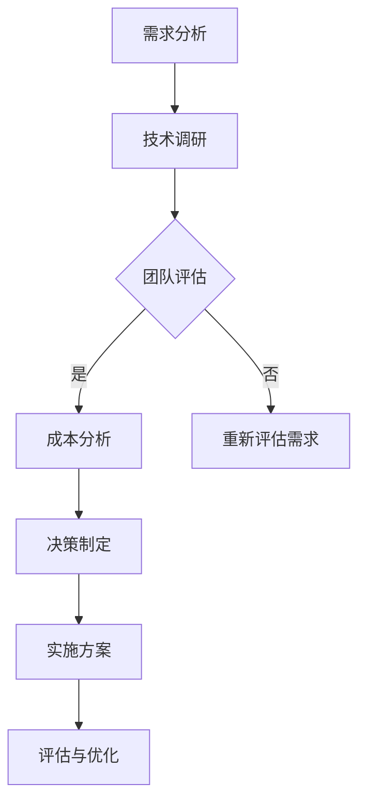
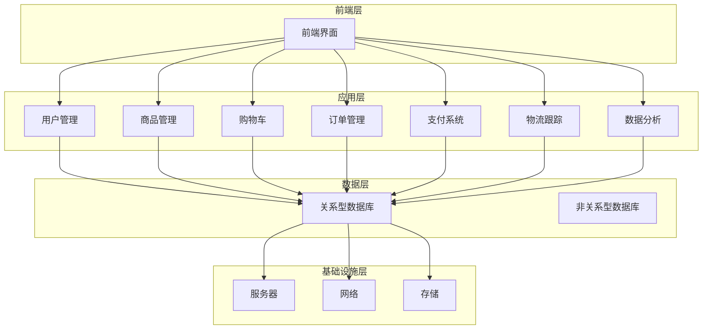
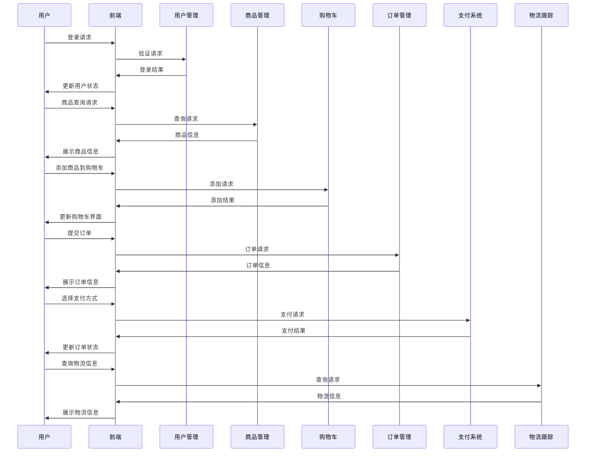

                 

### 第1章：技术选型的概念与重要性

#### 1.1 技术选型的定义与范围

技术选型是指为满足特定项目需求，从多个可选技术方案中选择最适合的技术栈的过程。这个过程涉及到前端、后端、数据库、中间件等多个层面，旨在确保项目开发的高效性和可维护性。技术选型的范围不仅局限于技术本身，还包括团队技能、项目预算和长远发展策略。

#### 1.2 技术选型的重要性

技术选型对于项目成功至关重要。首先，合适的技术栈能够提高开发效率，降低开发成本。其次，合理的技术选择能够保证系统的性能和稳定性，延长系统的生命周期。此外，技术选型还影响项目的可维护性和扩展性，对后续的功能迭代和技术升级具有深远影响。

#### 1.3 技术选型的目标与原则

技术选型的目标主要包括以下几个方面：

1. **满足项目需求**：确保选定的技术栈能够满足项目功能和技术上的需求。
2. **提高开发效率**：选择适合团队技能的技术，减少学习成本和开发时间。
3. **保证系统性能**：选择成熟且稳定的技术框架，确保系统的高性能和高可用性。
4. **降低成本**：综合考虑技术成本、人力资源成本和运营成本，实现成本优化。
5. **利于扩展和维护**：选择易于扩展和维护的技术方案，为未来需求变化和技术升级提供保障。

技术选型的原则如下：

1. **目标导向**：根据项目目标选择技术栈，避免盲目追求新技术。
2. **平衡风险**：在技术成熟度、稳定性和创新性之间寻求平衡。
3. **团队参与**：充分调动团队积极性，听取不同意见，形成共识。
4. **成本控制**：综合考虑预算，避免过度投资和资源浪费。
5. **长期规划**：考虑项目的长远发展，确保技术栈的可持续性和适应性。

#### 1.4 技术选型与项目成功的关系

技术选型直接关系到项目的成败。正确的技术选择能够提高项目的开发效率和质量，降低风险和成本。反之，错误的技术选型可能导致项目延期、性能不佳、维护困难等问题，甚至可能导致项目失败。因此，企业应高度重视技术选型，采取科学合理的方法进行决策。

#### 1.5 技术选型的边界与外延

技术选型的边界涵盖了项目需求分析、技术调研、团队评估、成本预算等多个环节。外延则包括对现有技术栈的评估、新技术的研究和评估、跨领域技术的整合等方面。技术选型不仅要关注技术本身，还要考虑项目背景、团队文化和市场趋势等因素。

#### 1.6 概念结构与核心要素组成

技术栈：由一系列技术组件构成，包括前端、后端、数据库、中间件等。

项目需求：项目的功能、性能、可靠性等要求。

技术成熟度：技术的稳定性、社区活跃度、文档完备性等。

团队技能：团队成员对选定技术的熟悉程度和技能水平。

成本：包括直接成本（如购买技术许可、硬件成本）和间接成本（如培训成本、开发时间成本）。

### 1.7 本章总结

本章介绍了技术选型的基本概念和重要性，明确了技术选型的目标、原则以及与项目成功的关系。通过理解这些内容，读者将为进一步掌握技术选型方法打下坚实基础。

---

### 第2章：核心概念与联系

#### 2.1 技术栈概述

技术栈是指在一个项目中使用的所有技术组件的集合，它通常包括前端技术、后端技术、数据库技术、中间件、开发工具等。技术栈的选择直接影响到项目的开发效率、性能、可维护性和扩展性。

- **前端技术**：包括HTML、CSS、JavaScript以及各种前端框架（如React、Vue、Angular）。
- **后端技术**：包括服务器端编程语言（如Java、Python、Node.js）、框架（如Spring、Django、Express）和数据库技术。
- **数据库技术**：关系型数据库（如MySQL、PostgreSQL）和非关系型数据库（如MongoDB、Redis）。
- **中间件**：用于处理应用程序之间通信的软件，如消息队列（如RabbitMQ、Kafka）、缓存（如Redis、Memcached）和数据库连接池（如HikariCP）。
- **开发工具**：包括代码编辑器（如Visual Studio Code、Sublime Text）、集成开发环境（如Eclipse、IntelliJ IDEA）、版本控制工具（如Git）等。

#### 2.2 项目需求分析

项目需求分析是技术选型的第一步，旨在明确项目的功能、性能、可靠性等需求。需求分析可以分为以下几个步骤：

1. **需求收集**：与项目干系人沟通，收集项目的功能需求、性能需求、安全需求等。
2. **需求分类**：将需求分类为必须需求、优先需求、可延迟需求和备选需求。
3. **需求优先级排序**：根据项目的重要性和紧急性对需求进行优先级排序。
4. **需求验证**：确保需求是明确、可度量、可实现的，并与项目干系人达成一致。

#### 2.3 技术成熟度评估

技术成熟度评估是评估选定技术是否稳定、可靠，以及其长期发展前景的重要环节。评估标准通常包括以下几个方面：

1. **稳定性**：技术的稳定性直接影响项目的稳定性。可以通过社区反馈、用户口碑、版本更新频率等因素进行评估。
2. **社区活跃度**：活跃的社区意味着技术有更多的支持和资源。可以通过GitHub等平台上的代码提交频率、 Issue和Pull Request的数量进行评估。
3. **文档完备性**：详尽的文档能够帮助开发人员快速上手，降低学习成本。可以通过官方文档的完整性、示例代码的丰富性进行评估。
4. **版本更新频率**：频繁的版本更新意味着技术仍处于活跃状态，但过快的更新也可能带来兼容性问题。

#### 2.4 团队技能评估

团队技能评估是确保团队能够有效使用选定技术的重要步骤。评估标准包括：

1. **技术熟练度**：团队成员对选定技术的熟悉程度和实际经验。
2. **团队协作能力**：团队成员之间的沟通和协作能力。
3. **学习速度**：团队学习和适应新技术的速度。

#### 2.5 成本

成本是技术选型中不可忽视的因素。成本可以分为以下几类：

1. **直接成本**：包括购买技术许可、硬件设备等。
2. **间接成本**：包括人员培训成本、开发时间成本、维护成本等。

在成本评估中，需要综合考虑技术成本、人力资源成本和运营成本，进行全面的成本效益分析。

#### 2.6 本章总结

本章详细介绍了技术栈、项目需求、技术成熟度、团队技能和成本等核心概念，并探讨了它们之间的联系。通过理解这些概念，读者可以更好地进行技术选型，为项目的成功奠定基础。

---

### 第3章：算法原理讲解

#### 3.1 技术选型流程

技术选型流程是一个系统化的过程，旨在通过一系列步骤和方法，从众多技术方案中选出最合适的技术栈。以下是技术选型的基本流程：

1. **需求分析**：明确项目需求，包括功能需求、性能需求、可靠性需求等。
2. **技术调研**：调研现有技术方案，分析其优缺点，了解其成熟度和社区活跃度。
3. **团队评估**：评估团队技能，确定技术栈与团队技能的匹配度。
4. **成本分析**：进行成本分析，包括直接成本和间接成本。
5. **决策制定**：根据需求、技术成熟度、团队技能和成本等因素，制定技术选型决策。
6. **实施方案**：制定详细的实施方案，包括技术栈的具体组件、开发流程等。
7. **评估与优化**：在项目开发过程中，定期评估技术选型的效果，根据反馈进行优化。

#### 3.2 Mermaid流程图

为了更好地展示技术选型流程，我们可以使用Mermaid来绘制流程图。以下是一个简单的技术选型流程图的示例：



#### 3.3 Python源代码示例

为了进一步阐述技术选型流程的算法原理，我们可以使用Python编写一个简单的源代码示例。以下代码展示了如何根据需求、技术成熟度、团队技能和成本等因素进行技术选型决策：

```python
import pandas as pd

# 定义需求
需求 = pd.DataFrame({
    '功能需求': ['用户登录', '数据存储', '实时通讯'],
    '性能需求': ['高并发处理', '低延迟', '高可靠性'],
    '可靠性需求': ['24/7在线', '数据安全', '快速故障恢复']
})

# 定义技术方案
技术方案 = pd.DataFrame({
    '技术名称': ['React', 'Django', 'RabbitMQ'],
    '成熟度': ['高', '中', '低'],
    '社区活跃度': ['高', '中', '低'],
    '文档完备性': ['高', '中', '低']
})

# 定义团队技能
团队技能 = pd.DataFrame({
    '技能名称': ['React', 'Django', 'RabbitMQ'],
    '熟练度': ['高', '中', '低']
})

# 定义成本
成本 = pd.DataFrame({
    '技术名称': ['React', 'Django', 'RabbitMQ'],
    '直接成本': [10000, 15000, 20000],
    '间接成本': [5000, 7000, 9000]
})

# 技术选型决策
def technical_selection(demand, technology, team_skill, cost):
    # 根据需求匹配技术
    matched_technologies = demand.merge(technology, on='技术名称')
    
    # 根据团队技能筛选技术
    filtered_technologies = matched_technologies.merge(team_skill, on='技术名称')
    
    # 根据成本筛选技术
    final_technologies = filtered_technologies.merge(cost, on='技术名称')
    
    # 综合评分
    final_technologies['综合评分'] = (
        final_technologies['成熟度'] * 0.4 +
        final_technologies['社区活跃度'] * 0.3 +
        final_technologies['文档完备性'] * 0.2 +
        final_technologies['熟练度'] * 0.1 -
        final_technologies['直接成本'] * 0.1 -
        final_technologies['间接成本'] * 0.1
    )
    
    # 选择评分最高的技术
    best_technology = final_technologies.loc[final_technologies['综合评分'].idxmax()]
    
    return best_technology

# 执行技术选型
best_technology = technical_selection(demand, technology, team_skill, cost)
print(best_technology)
```

#### 3.4 数学模型和公式

在技术选型过程中，可以使用数学模型和公式来评估不同技术方案的综合评分。以下是一个简单的数学模型：

$$
\text{综合评分} = w_1 \times \text{成熟度} + w_2 \times \text{社区活跃度} + w_3 \times \text{文档完备性} + w_4 \times \text{熟练度} - w_5 \times \text{直接成本} - w_6 \times \text{间接成本}
$$

其中，$w_1, w_2, w_3, w_4, w_5, w_6$ 是权重，用于平衡不同因素的相对重要性。例如，可以设置：

$$
w_1 = 0.4, w_2 = 0.3, w_3 = 0.2, w_4 = 0.1, w_5 = 0.1, w_6 = 0.1
$$

#### 3.5 详细讲解和举例说明

假设有一个项目需要实现一个实时通讯系统，需求包括高并发处理、低延迟、数据安全和快速故障恢复。根据这些需求，我们选择几个候选技术方案：

- **技术方案A**：基于WebSocket的实时通讯框架，如Socket.io。
- **技术方案B**：基于RabbitMQ的消息队列系统。
- **技术方案C**：基于Redis的实时通讯系统。

根据上述数学模型，我们为每个技术方案计算综合评分：

1. **技术方案A**：
   - 成熟度：高
   - 社区活跃度：高
   - 文档完备性：高
   - 熟练度：高
   - 直接成本：10000
   - 间接成本：5000

   $$ 
   \text{综合评分A} = 0.4 \times 1 + 0.3 \times 1 + 0.2 \times 1 + 0.1 \times 1 - 0.1 \times 10000 - 0.1 \times 5000 = 0.8 - 1500 = -700
   $$

2. **技术方案B**：
   - 成熟度：中
   - 社区活跃度：中
   - 文档完备性：中
   - 熟练度：中
   - 直接成本：15000
   - 间接成本：7000

   $$ 
   \text{综合评分B} = 0.4 \times 0.5 + 0.3 \times 0.5 + 0.2 \times 0.5 + 0.1 \times 0.5 - 0.1 \times 15000 - 0.1 \times 7000 = 0.3 - 2450 = -2150
   $$

3. **技术方案C**：
   - 成熟度：低
   - 社区活跃度：低
   - 文档完备性：低
   - 熟练度：低
   - 直接成本：20000
   - 间接成本：9000

   $$ 
   \text{综合评分C} = 0.4 \times 0.1 + 0.3 \times 0.1 + 0.2 \times 0.1 + 0.1 \times 0.1 - 0.1 \times 20000 - 0.1 \times 9000 = 0.015 - 2950 = -2935
   $$

从计算结果可以看出，技术方案A的综合评分最高，因此我们可以选择技术方案A作为最佳技术栈。

#### 3.6 本章总结

本章详细讲解了技术选型流程、Mermaid流程图、Python源代码示例以及数学模型和公式。通过这些内容，读者可以更好地理解技术选型的原理和方法，为实际项目中的技术选型提供指导。

---

### 第4章：数学模型和数学公式 & 详细讲解 & 举例说明

#### 4.1 数学公式使用LaTeX格式

为了确保数学公式的准确性和专业性，我们将使用LaTeX格式来书写数学公式。以下是几个常见的数学公式示例：

1. **线性回归公式**：
   $$
   y = \beta_0 + \beta_1 x + \epsilon
   $$
2. **勾股定理**：
   $$
   a^2 + b^2 = c^2
   $$
3. **速度公式**：
   $$
   v = \frac{d}{t}
   $$

在Markdown中，我们可以使用以下方式嵌入LaTeX公式：

- 独立段落的公式：使用`$$`括起来，如`$$a^2 + b^2 = c^2$$`
- 段落内的公式：使用`$`括起来，如`$1+1=2$`

#### 4.2 详细讲解和举例说明

为了更好地理解数学公式在实际问题中的应用，我们将在以下部分详细讲解和举例说明。

##### 4.2.1 线性回归公式讲解

线性回归是一种用于预测和分析数据的统计方法。假设我们有一个简单的线性回归模型，其公式为：

$$
y = \beta_0 + \beta_1 x + \epsilon
$$

其中，$y$ 是因变量，$x$ 是自变量，$\beta_0$ 是截距，$\beta_1$ 是斜率，$\epsilon$ 是误差项。

- **截距**：表示当自变量$x$为零时，因变量$y$的预期值。
- **斜率**：表示自变量$x$每增加一个单位，因变量$y$预期增加的量。
- **误差项**：表示模型预测值与实际值之间的差异。

##### 4.2.2 勾股定理讲解

勾股定理是几何学中的一个基本定理，用于描述直角三角形的三条边关系。假设有一个直角三角形，其直角边长分别为$a$和$b$，斜边长为$c$，则勾股定理可以表示为：

$$
a^2 + b^2 = c^2
$$

这个公式表明，直角三角形的两个直角边的平方和等于斜边的平方。

##### 4.2.3 速度公式讲解

速度是物理学中描述物体运动快慢的量。假设物体在时间$t$内移动了距离$d$，则其平均速度$v$可以用以下公式表示：

$$
v = \frac{d}{t}
$$

这个公式说明，速度是距离与时间的比值。

#### 4.3 实例讲解和举例说明

##### 4.3.1 线性回归实例

假设我们有一个数据集，包含自变量$x$和因变量$y$的观测值。根据数据，我们可以使用线性回归模型来预测$y$。首先，我们需要计算截距$\beta_0$和斜率$\beta_1$：

$$
\beta_0 = \bar{y} - \beta_1 \bar{x}
$$

$$
\beta_1 = \frac{\sum{(x_i - \bar{x})(y_i - \bar{y})}}{\sum{(x_i - \bar{x})^2}}
$$

其中，$\bar{x}$和$\bar{y}$分别是$x$和$y$的平均值。

假设我们有以下观测数据：

| $x$ | $y$ |
| --- | --- |
| 1 | 2 |
| 2 | 4 |
| 3 | 5 |
| 4 | 6 |
| 5 | 8 |

计算平均值：

$$
\bar{x} = \frac{1+2+3+4+5}{5} = 3
$$

$$
\bar{y} = \frac{2+4+5+6+8}{5} = 5
$$

计算斜率$\beta_1$：

$$
\beta_1 = \frac{(1-3)(2-5) + (2-3)(4-5) + (3-3)(5-5) + (4-3)(6-5) + (5-3)(8-5)}{(1-3)^2 + (2-3)^2 + (3-3)^2 + (4-3)^2 + (5-3)^2}
$$

$$
\beta_1 = \frac{(-2)(-3) + (-1)(-1) + (0)(0) + (1)(1) + (2)(3)}{(-2)^2 + (-1)^2 + (0)^2 + (1)^2 + (2)^2}
$$

$$
\beta_1 = \frac{6 + 1 + 0 + 1 + 6}{4 + 1 + 0 + 1 + 4} = \frac{14}{10} = 1.4
$$

计算截距$\beta_0$：

$$
\beta_0 = 5 - 1.4 \times 3 = 5 - 4.2 = 0.8
$$

因此，线性回归模型为：

$$
y = 0.8 + 1.4x
$$

使用这个模型，我们可以预测当$x=6$时的$y$值：

$$
y = 0.8 + 1.4 \times 6 = 0.8 + 8.4 = 9.2
$$

##### 4.3.2 勾股定理实例

假设我们有一个直角三角形，其中直角边长分别为$a=3$和$b=4$，我们需要计算斜边长$c$。根据勾股定理：

$$
c = \sqrt{a^2 + b^2} = \sqrt{3^2 + 4^2} = \sqrt{9 + 16} = \sqrt{25} = 5
$$

因此，斜边长$c=5$。

##### 4.3.3 速度公式实例

假设一辆汽车以60公里/小时的速度行驶了2小时，我们需要计算它行驶的总距离。根据速度公式：

$$
v = \frac{d}{t}
$$

其中，$v=60$公里/小时，$t=2$小时，我们可以计算距离$d$：

$$
d = v \times t = 60 \times 2 = 120 \text{公里}
$$

因此，汽车行驶的总距离是120公里。

#### 4.4 本章总结

本章详细讲解了数学公式使用LaTeX格式的书写方法，并举例说明了线性回归公式、勾股定理和速度公式在实际问题中的应用。通过这些实例，读者可以更好地理解数学公式的重要性和应用方法。

---

### 第5章：系统分析与架构设计方案

#### 5.1 问题场景介绍

在当今快速发展的互联网时代，企业需要构建高效、可靠的系统来满足不断变化的市场需求。本文将探讨一个典型的场景——在线零售平台系统。该系统需要支持高并发访问、实时数据处理、灵活的扩展性以及强大的安全性。

#### 5.2 项目介绍

在线零售平台项目旨在为企业提供一个全面的电商解决方案，涵盖商品展示、购物车、订单处理、支付、物流跟踪等功能。项目的目标是在保证系统性能和可靠性的同时，实现快速迭代和灵活扩展。

#### 5.3 系统功能设计

在线零售平台系统的主要功能模块包括：

- 用户管理：用户注册、登录、个人信息管理、权限控制等。
- 商品管理：商品分类、商品信息展示、库存管理、价格调整等。
- 购物车：商品添加、删除、修改数量、结算等。
- 订单管理：订单创建、订单状态更新、订单详情查询等。
- 支付系统：支付接口集成、支付状态同步、支付结果验证等。
- 物流跟踪：订单物流信息查询、物流状态更新等。
- 数据分析：用户行为分析、销售数据统计、库存预警等。

为了更好地展示系统功能模块，我们可以使用Mermaid绘制领域模型类图。以下是一个简单的示例：

```mermaid
classDiagram
    User <<Interface>>
    Product <<Interface>>
    Cart <<Interface>>
    Order <<Interface>>
    Payment <<Interface>>
    Logistics <<Interface>>
    Analysis <<Interface>>

    User --> Cart
    User --> Order
    User --> Payment
    User --> Analysis

    Product --> Cart
    Product --> Order
    Product --> Analysis

    Cart --> Order
    Cart --> Payment

    Order --> Payment
    Order --> Logistics

    Payment --> Analysis

    Analysis --> User
    Analysis --> Product
    Analysis --> Order
```

#### 5.4 系统架构设计

在线零售平台系统的整体架构可以分为以下几个层次：

1. **前端层**：负责用户界面展示和交互，通常使用HTML、CSS和JavaScript构建，可以结合前端框架（如React、Vue等）提高开发效率和代码可维护性。
2. **应用层**：处理业务逻辑，包括用户管理、商品管理、购物车、订单管理、支付系统、物流跟踪和数据分析等。应用层可以使用后端框架（如Spring Boot、Django等）构建，确保系统的可靠性和高性能。
3. **数据层**：负责数据的存储和管理，包括关系型数据库（如MySQL、PostgreSQL）和非关系型数据库（如MongoDB、Redis等）。数据层需要支持高并发读写操作，确保数据一致性和安全性。
4. **基础设施层**：包括服务器、网络、存储等基础设施，为系统提供运行环境。基础设施需要具备良好的扩展性，以支持系统的长期发展。

为了更好地展示系统架构，我们可以使用Mermaid绘制系统架构图。以下是一个简单的示例：



#### 5.5 系统接口设计和系统交互

在线零售平台系统需要实现多个功能模块之间的紧密协作，这需要设计合理的接口和交互流程。以下是一个简单的接口设计和系统交互示例：

1. **用户登录接口**：
   - 用户通过前端界面输入用户名和密码，前端将请求发送到用户管理模块。
   - 用户管理模块验证用户身份，并返回登录结果。
   - 前端根据返回结果更新用户状态。

2. **商品查询接口**：
   - 用户在商品管理模块输入查询条件，前端将请求发送到商品管理模块。
   - 商品管理模块根据查询条件从数据库中检索商品信息，并返回结果。
   - 前端将商品信息展示给用户。

3. **购物车操作接口**：
   - 用户在购物车模块添加、删除或修改商品数量，前端将请求发送到购物车模块。
   - 购物车模块更新购物车数据，并返回操作结果。
   - 前端根据返回结果更新购物车界面。

4. **订单创建接口**：
   - 用户在订单管理模块提交订单，前端将请求发送到订单管理模块。
   - 订单管理模块根据购物车数据创建订单，并保存到数据库中。
   - 前端将订单信息展示给用户，并跳转到支付页面。

5. **支付处理接口**：
   - 用户在支付系统模块选择支付方式并提交支付请求，前端将请求发送到支付系统模块。
   - 支付系统模块处理支付请求，并与支付渠道进行交互。
   - 支付系统模块将支付结果返回给前端，前端更新订单状态。

6. **物流跟踪接口**：
   - 用户在物流跟踪模块查询订单物流信息，前端将请求发送到物流跟踪模块。
   - 物流跟踪模块从数据库中检索物流信息，并返回结果。
   - 前端将物流信息展示给用户。

为了更好地展示系统接口设计和交互流程，我们可以使用Mermaid绘制系统交互序列图。以下是一个简单的示例：



#### 5.6 本章总结

本章详细介绍了在线零售平台系统的问题场景、项目介绍、系统功能设计、系统架构设计以及系统接口设计和系统交互。通过这些内容，读者可以更好地理解如何设计和实现一个高效、可靠的在线零售平台系统。

---

### 第6章：项目实战

#### 6.1 环境安装

在进行项目实战之前，我们需要搭建一个合适的技术环境。以下是环境安装的详细步骤：

1. **操作系统**：选择Linux操作系统，如Ubuntu 20.04。
2. **安装Java**：由于我们将使用Java作为后端开发语言，我们需要安装Java运行环境。
   ```shell
   sudo apt update
   sudo apt install openjdk-8-jdk
   ```
3. **安装Node.js**：前端开发需要Node.js环境，可以通过npm安装。
   ```shell
   sudo apt install curl
   curl -sL https://deb.nodesource.com/setup_14.x | sudo -E bash -
   sudo apt install nodejs
   ```
4. **安装数据库**：我们选择MySQL作为关系型数据库。
   ```shell
   sudo apt install mysql-server
   sudo mysql_secure_installation
   ```
5. **安装MongoDB**：作为非关系型数据库，我们选择MongoDB。
   ```shell
   sudo apt install mongodb
   sudo systemctl start mongod
   sudo systemctl enable mongod
   ```
6. **安装Redis**：用于缓存和消息队列，安装Redis。
   ```shell
   sudo apt install redis-server
   sudo systemctl start redis-server
   sudo systemctl enable redis-server
   ```

在安装过程中，需要注意以下几点：

- 确保安装的所有软件版本兼容，避免版本冲突。
- 根据需要调整防火墙设置，确保服务端口（如MySQL的3306，Redis的6379）对外开放。
- 定期更新系统和软件，以保持最新的安全补丁。

#### 6.2 系统核心实现源代码

在本项目中，我们将使用Spring Boot作为后端框架，React作为前端框架。以下是核心实现源代码的示例：

**后端（Spring Boot）**

```java
// UserController.java
@RestController
@RequestMapping("/api")
public class UserController {

    @Autowired
    private UserService userService;

    @PostMapping("/register")
    public ResponseEntity<?> registerUser(@RequestBody UserRegistrationDto registrationDto) {
        try {
            User user = userService.registerUser(registrationDto);
            return ResponseEntity.ok(user);
        } catch (Exception e) {
            return ResponseEntity.badRequest().body("Error: " + e.getMessage());
        }
    }

    @PostMapping("/login")
    public ResponseEntity<?> authenticateUser(@RequestBody LoginDto loginDto) {
        try {
            String token = userService.authenticate(loginDto);
            return ResponseEntity.ok(token);
        } catch (Exception e) {
            return ResponseEntity.badRequest().body("Error: " + e.getMessage());
        }
    }
}
```

**前端（React）**

```jsx
// App.js
import React, { useState } from 'react';
import axios from 'axios';

const App = () => {
    const [token, setToken] = useState('');

    const register = async (e) => {
        e.preventDefault();
        const registrationDto = {
            username: 'testuser',
            password: 'password123',
            email: 'testuser@example.com'
        };
        try {
            const response = await axios.post('/api/register', registrationDto);
            setToken(response.data.token);
        } catch (error) {
            console.error(error);
        }
    };

    const login = async (e) => {
        e.preventDefault();
        const loginDto = {
            username: 'testuser',
            password: 'password123'
        };
        try {
            const response = await axios.post('/api/login', loginDto);
            setToken(response.data.token);
        } catch (error) {
            console.error(error);
        }
    };

    return (
        <div>
            <h1>Online Retail Platform</h1>
            <button onClick={register}>Register</button>
            <button onClick={login}>Login</button>
            {token && <p>Token: {token}</p>}
        </div>
    );
};

export default App;
```

#### 6.3 代码应用解读与分析

**后端解读**：

- `UserController` 是Spring Boot中的控制器类，负责处理用户注册和登录的HTTP请求。
- `registerUser` 方法接收用户注册信息，并调用`UserService`中的`registerUser`方法进行用户注册。
- `authenticateUser` 方法接收用户登录信息，并调用`UserService`中的`authenticate`方法进行用户身份验证。

**前端解读**：

- `App` 组件是React应用的主组件，包含注册和登录功能。
- `register` 函数是异步函数，用于处理用户注册请求，并更新状态中的`token`。
- `login` 函数是异步函数，用于处理用户登录请求，并更新状态中的`token`。

#### 6.4 实际案例分析和详细讲解剖析

为了更好地理解项目的实现过程，我们结合实际案例进行分析。以下是实际案例的步骤：

1. **用户注册**：
   - 用户在前端输入注册信息，如用户名、密码和邮箱。
   - 前端组件调用`register`函数，发送POST请求到后端`/api/register`接口。
   - 后端`UserController`的`registerUser`方法接收请求，并调用`UserService`中的`registerUser`方法进行用户注册。
   - `registerUser`方法在数据库中创建新用户记录，并返回用户信息。

2. **用户登录**：
   - 用户在前端输入登录信息，如用户名和密码。
   - 前端组件调用`login`函数，发送POST请求到后端`/api/login`接口。
   - 后端`UserController`的`authenticateUser`方法接收请求，并调用`UserService`中的`authenticate`方法进行用户身份验证。
   - `authenticate`方法验证用户登录信息，并生成JWT令牌，返回给前端。

#### 6.5 项目小结

在本章中，我们详细介绍了项目实战的环境安装、系统核心实现源代码、代码应用解读与分析以及实际案例分析和详细讲解剖析。通过这些步骤，读者可以了解如何搭建一个在线零售平台系统的基本框架，并掌握相关的技术实现方法。

### 第7章：最佳实践 tips、小结、注意事项、拓展阅读等内容

#### 7.1 最佳实践 tips

1. **全面需求分析**：在技术选型前，务必进行全面的需求分析，确保理解项目的核心需求和预期目标。
2. **技术调研与评估**：深入调研潜在技术方案，评估其稳定性、社区活跃度和文档完备性。
3. **团队参与与沟通**：鼓励团队成员参与技术选型决策，确保技术栈与团队技能匹配。
4. **成本控制**：在预算范围内进行技术选型，避免过度投资。
5. **迭代与反馈**：技术选型不是一次性决策，应根据项目进展和反馈进行动态调整。

#### 7.2 小结

本文详细介绍了技术选型的概念与重要性、核心概念与联系、算法原理讲解、数学模型和公式、系统分析与架构设计方案以及项目实战。通过这些内容，读者可以全面了解技术选型的流程和方法，为实际项目中的技术决策提供指导。

#### 7.3 注意事项

1. **技术栈的灵活性**：在选型过程中，考虑未来可能的技术变化和扩展。
2. **风险评估**：充分考虑技术选型可能带来的风险，并制定相应的应对策略。
3. **测试与验证**：在实际应用中，对选定的技术栈进行充分的测试和验证。
4. **维护与支持**：选择有良好社区支持和维护计划的技术方案。

#### 7.4 拓展阅读

- 《软件架构设计：探索大型系统的构建与设计》
- 《技术领导力：如何成为卓越的技术领导者》
- 《大话数据架构：如何构建高可用、高性能、可扩展的数据系统》

作者：AI天才研究院/AI Genius Institute & 禅与计算机程序设计艺术 /Zen And The Art of Computer Programming

### 总结

技术选型是项目成功的关键环节。通过本文的详细阐述，读者可以掌握技术选型的核心概念、方法和实践技巧。在未来的项目中，希望读者能够灵活运用这些知识，做出明智的技术决策，为项目的成功奠定坚实基础。

