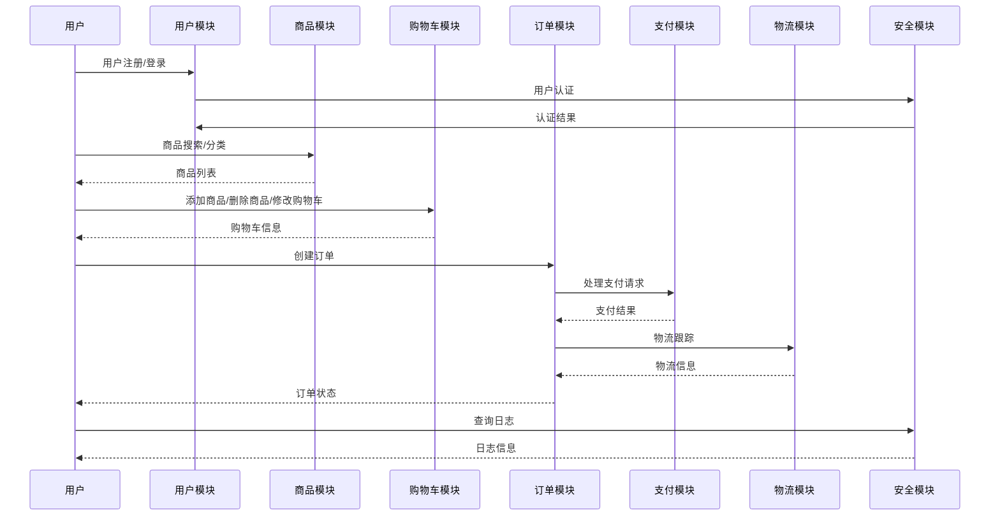
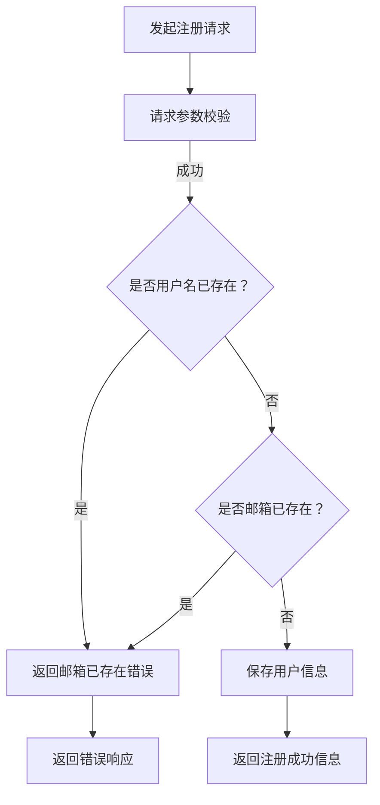

                 

# 技术重构：大规模系统改造实践

## 关键词

- 大规模系统
- 技术重构
- 微服务架构
- 性能优化
- 安全加固
- 代码重构
- 业务连续性
- 团队协作
- 风险评估

## 摘要

本文将深入探讨大规模系统改造的核心实践和方法。通过系统化的方法论、工具和最佳实践，我们旨在帮助读者理解和掌握大规模系统改造的关键技术和策略。文章将分为几个部分，首先介绍大规模系统重构的背景和问题，然后探讨核心概念和联系，随后详细阐述重构过程中的技术负债、业务连续性、团队协作和风险评估，并最终提供系统分析与架构设计案例以及实战项目解析。通过本文的阅读，读者将能够全面了解大规模系统重构的挑战和解决方案，为实际项目提供指导。

### 第1章： 引言与问题背景

#### 1.1 引言

在信息技术飞速发展的时代，软件系统变得日益复杂和庞大。随着云计算、大数据、物联网等新兴技术的普及，企业对于大规模系统的需求不断增加。然而，这些大规模系统在面临性能瓶颈、资源限制、安全性和可维护性等方面的问题时，往往需要通过技术重构来提升其整体性能和可靠性。

#### 1.1.1 研究背景

大规模系统的技术重构涉及多个层面，包括代码优化、架构调整、性能提升、安全加固等。然而，实践中往往面临着以下问题：

1. **技术负债**：系统在长时间运行过程中，代码质量参差不齐，技术债务积累导致重构难度大。
2. **业务连续性**：重构过程中需要确保业务连续性，避免对生产环境造成不良影响。
3. **团队协作**：涉及多个团队和模块的重构工作，需要高效的沟通和协作。
4. **风险评估**：重构过程中需要对潜在的风险进行评估，确保重构的可行性和安全性。

#### 1.1.2 问题描述

大规模系统的技术重构涉及多个层面，包括代码优化、架构调整、性能提升、安全加固等。然而，实践中往往面临着以下问题：

1. **技术负债**：系统在长时间运行过程中，代码质量参差不齐，技术债务积累导致重构难度大。
   - **原因**：随着时间的推移，系统不断迭代和扩展，遗留的代码问题逐渐积累，导致重构工作变得复杂。
   - **影响**：技术负债增加维护成本，降低开发效率，影响系统的性能和稳定性。

2. **业务连续性**：重构过程中需要确保业务连续性，避免对生产环境造成不良影响。
   - **挑战**：重构过程中可能涉及系统停机或部分功能不可用，这对企业的业务运营带来巨大风险。
   - **解决方案**：通过逐步重构、灰度发布等策略，尽量减少对业务的影响。

3. **团队协作**：涉及多个团队和模块的重构工作，需要高效的沟通和协作。
   - **问题**：不同团队之间的沟通不畅、职责不明确，导致重构工作进展缓慢。
   - **策略**：制定清晰的项目计划和沟通机制，加强团队间的协作。

4. **风险评估**：重构过程中需要对潜在的风险进行评估，确保重构的可行性和安全性。
   - **方法**：通过风险识别、风险评估和风险应对策略，确保重构过程的平稳进行。

#### 1.1.3 问题解决

为了解决上述问题，本书提出了大规模系统改造实践的方法和策略。通过系统化的方法论、工具和最佳实践，帮助读者理解和掌握大规模系统改造的核心技术和实践技巧。

1. **技术负债管理**：通过代码审查、自动化测试和持续集成等手段，逐步减少技术负债。
2. **业务连续性保障**：采用逐步重构、灰度发布等技术，确保重构过程中的业务连续性。
3. **团队协作优化**：建立清晰的沟通机制和项目计划，加强团队协作。
4. **风险评估与控制**：通过风险识别、评估和应对策略，确保重构过程的安全性。

#### 1.1.4 边界与外延

本章节主要讨论以下内容：

- **技术负债**：理解技术负债的概念、原因及其对系统重构的影响。
- **业务连续性**：探讨如何在重构过程中确保业务连续性。
- **团队协作**：分析重构过程中团队协作的关键因素和方法。
- **风险评估**：介绍重构过程中的风险评估方法和策略。

#### 1.1.5 概念结构与核心要素组成

本章节的核心概念和结构如下：

- **技术负债**：技术负债的来源、表现、影响及缓解措施。
- **业务连续性**：业务连续性的概念、重要性、策略和实践。
- **团队协作**：团队协作的障碍、策略、工具和实践。
- **风险评估**：风险评估的目的、方法、工具和实践。

#### 1.1.6 本章小结

本章通过引入大规模系统改造实践的相关背景和问题，为后续章节的内容奠定了基础。通过理解技术负债、业务连续性、团队协作和风险评估等方面的概念，读者可以更好地应对大规模系统改造的挑战。

### 第2章：核心概念与联系

#### 2.1 大规模系统重构的定义与类型

##### 2.1.1 大规模系统重构的定义

大规模系统重构是指对已经运行一段时间的软件系统进行深度调整和优化，以提高其性能、可维护性和扩展性。重构不仅包括对现有代码的优化，还包括对系统架构的调整和技术的升级。

##### 2.1.2 大规模系统重构的类型

1. **微服务架构重构**：将传统的单体架构拆分为微服务，提高系统的可扩展性和可维护性。
   - **优点**：独立部署、易于扩展、模块化。
   - **缺点**：分布式系统复杂性增加、通信开销大。

2. **性能优化重构**：针对系统性能瓶颈进行优化，提高系统的响应速度和处理能力。
   - **优点**：系统性能显著提升。
   - **缺点**：需要深入了解系统性能指标，可能涉及大量代码修改。

3. **安全加固重构**：增强系统的安全性，降低安全风险。
   - **优点**：提高系统的安全防护能力。
   - **缺点**：可能需要引入新的安全框架和工具。

4. **代码重构**：优化代码结构，提高代码质量。
   - **优点**：代码可读性、可维护性提高。
   - **缺点**：可能影响现有功能的稳定性。

##### 2.1.3 大规模系统重构的必要性

- **技术债务积累**：随着时间的推移，系统复杂性增加，技术债务积累。
- **业务需求变化**：随着市场变化和业务发展，系统需要不断适应新的业务需求。
- **技术升级换代**：新技术的出现，要求系统进行技术升级。

#### 2.2 技术负债

##### 2.2.1 技术负债的定义

技术负债是指由于系统在长期运行过程中，积累的未解决的问题、遗留问题和欠下的技术债务。技术负债的存在会降低系统的可维护性、可扩展性和性能。

##### 2.2.2 技术负债的表现

1. **代码冗余**：大量重复的代码，导致维护困难。
2. **架构不清晰**：系统架构混乱，难以扩展。
3. **性能瓶颈**：系统性能不佳，响应速度慢。
4. **安全问题**：系统存在安全隐患，易受攻击。

##### 2.2.3 技术负债的影响

1. **维护成本增加**：修复技术负债需要大量时间和资源。
2. **业务连续性受损**：技术负债可能导致系统故障，影响业务运营。
3. **开发效率降低**：技术负债阻碍新功能的开发和部署。

##### 2.2.4 技术负债的缓解措施

1. **定期代码审查**：及时发现和修复代码问题。
2. **持续集成与持续部署**：提高代码质量和部署效率。
3. **技术债务管理工具**：使用技术债务管理工具，监控和评估技术负债。

#### 2.3 业务连续性

##### 2.3.1 业务连续性的定义

业务连续性是指企业在面对各种风险和挑战时，能够保持正常运营和提供产品或服务的能力。业务连续性对于企业的生存和发展至关重要。

##### 2.3.2 业务连续性的重要性

1. **降低风险**：确保企业在突发事件中能够快速恢复。
2. **提升竞争力**：提高企业的应变能力和市场响应速度。
3. **增强客户信任**：确保客户能够在任何情况下获得持续的服务。

##### 2.3.3 业务连续性的策略和实践

1. **风险评估**：识别和评估业务面临的各种风险。
2. **业务影响分析（BIA）**：确定关键业务过程和依赖关系。
3. **业务连续性计划（BCP）**：制定详细的业务连续性计划和应急响应流程。
4. **备份和恢复策略**：确保数据的备份和系统的快速恢复。

##### 2.3.4 业务连续性与系统重构的关系

- **业务连续性**：是系统重构的重要目标之一。
- **系统重构**：可以为业务连续性提供技术保障。

#### 2.4 团队协作

##### 2.4.1 团队协作的定义

团队协作是指团队成员之间相互配合、共享信息和共同努力完成项目的过程。在系统重构过程中，团队协作尤为重要。

##### 2.4.2 团队协作的重要性

1. **提高效率**：通过有效的协作，可以快速解决问题和推进项目进度。
2. **确保质量**：多人协作可以减少错误和提高代码质量。
3. **共同成长**：团队协作有助于团队成员共同学习和提升技能。

##### 2.4.3 团队协作的策略

1. **明确职责**：明确每个团队成员的职责和任务。
2. **定期沟通**：保持频繁和高效的沟通。
3. **共享知识**：鼓励团队成员共享知识和经验。
4. **使用协作工具**：利用协作工具如敏捷看板、即时通讯等提高协作效率。

#### 2.5 风险评估

##### 2.5.1 风险评估的定义

风险评估是指对可能影响项目目标的潜在风险进行识别、分析和评估的过程。在系统重构过程中，风险评估有助于提前识别和应对潜在风险。

##### 2.5.2 风险评估的目的

1. **识别风险**：识别可能对项目造成负面影响的风险。
2. **评估影响**：评估风险发生的可能性和影响程度。
3. **制定应对策略**：为风险制定相应的应对策略。

##### 2.5.3 风险评估的方法

1. **定性评估**：通过专家意见、历史数据等方式对风险进行评估。
2. **定量评估**：通过数学模型、统计方法等方式对风险进行量化评估。
3. **风险矩阵**：使用风险矩阵对风险的可能性和影响进行综合评估。

##### 2.5.4 风险评估的实践

1. **风险识别**：识别项目中可能出现的各种风险。
2. **风险评估**：对识别出的风险进行评估，确定其可能性和影响程度。
3. **风险应对**：为每个风险制定相应的应对策略，并制定风险应对计划。

#### 2.6 本章小结

本章介绍了大规模系统重构的核心概念和联系，包括重构的定义、类型、技术负债、业务连续性、团队协作和风险评估。通过理解这些核心概念，读者可以更好地理解大规模系统重构的过程和挑战，为后续章节的学习和实践打下基础。

### 第3章：技术负债管理

#### 3.1 技术负债的概念

技术负债是指在软件系统开发、维护和迭代过程中，由于决策不当、技术选择不合理或需求变更等因素导致的负债。这种负债不仅增加了后续维护的成本，还可能影响系统的性能、稳定性和可扩展性。技术负债的表现形式多样，包括但不限于以下几种：

1. **代码冗余**：系统中存在大量重复代码，增加了维护难度。
2. **技术债务**：采用了过时的技术或工具，需要后续升级或替换。
3. **架构混乱**：系统架构不合理，难以进行功能扩展或性能优化。
4. **性能瓶颈**：系统性能不佳，无法满足日益增长的业务需求。
5. **安全问题**：系统存在漏洞或安全隐患，易受攻击。

#### 3.2 技术负债的影响

技术负债对系统重构的影响是深远的。一方面，技术负债会增加重构的复杂度和成本，延长项目周期。另一方面，技术负债可能对现有业务造成负面影响，包括系统故障、业务中断和用户体验下降等。

1. **维护成本增加**：技术负债意味着需要投入更多的时间和资源来修复和优化系统。
2. **开发效率降低**：技术负债会导致开发工作变得复杂和繁琐，降低开发效率。
3. **业务连续性受损**：严重的技术负债可能导致系统不稳定或性能不佳，影响业务运营。
4. **扩展性受限**：技术负债限制系统的扩展性和灵活性，影响未来的业务需求。

#### 3.3 技术负债的来源

技术负债的来源多种多样，以下是一些常见的原因：

1. **需求变更**：在项目开发过程中，需求频繁变更可能导致原有设计无法满足新需求，进而产生技术债务。
2. **技术选择**：采用过时的技术或工具，无法满足现代软件系统的高效、安全需求。
3. **时间压力**：在项目时间紧迫的情况下，可能牺牲代码质量和设计原则，导致技术负债积累。
4. **缺乏规划**：系统规划和设计不足，导致架构不合理或代码混乱。

#### 3.4 技术负债的缓解措施

为了缓解技术负债，可以采取以下措施：

1. **定期代码审查**：通过定期代码审查，发现和修复潜在的技术债务。
2. **持续集成与持续部署**：通过持续集成和持续部署，提高代码质量和部署效率，减少技术债务的积累。
3. **技术债务管理工具**：使用技术债务管理工具，如SonarQube、CodeClimate等，监控和评估代码质量，及时发现和修复问题。
4. **技术升级和重构**：对过时的技术进行升级或重构，确保系统能够满足现代需求。
5. **优化系统架构**：对系统架构进行优化，提高系统的可维护性和可扩展性。

#### 3.5 案例分析

以下是一个关于技术负债缓解的实际案例：

某电商企业由于长时间没有进行系统重构，系统架构混乱、代码冗余，导致系统性能下降，业务扩展困难。在面临业务增长压力的情况下，企业决定进行技术负债的缓解。

1. **代码审查**：企业组织内部开发团队进行代码审查，识别出大量冗余代码、不规范的命名和代码质量低下的部分。
2. **重构策略**：制定了详细的重构策略，包括代码重构、架构调整和性能优化。
3. **逐步实施**：按照优先级对系统进行逐步重构，确保业务连续性。
4. **持续集成**：引入持续集成和持续部署，确保重构过程中的代码质量和部署效率。
5. **效果评估**：经过几个月的重构，系统性能显著提升，代码质量和架构清晰，业务扩展能力增强。

#### 3.6 本章小结

本章介绍了技术负债的概念、影响、来源和缓解措施。通过理解技术负债，读者可以更好地识别和缓解系统中存在的问题，为后续的系统重构打下坚实基础。技术负债管理不仅是系统重构的关键环节，也是保障系统长期稳定运行的重要手段。

### 第4章：业务连续性保障

#### 4.1 业务连续性的定义

业务连续性（Business Continuity，简称BC）是指企业在面对各种潜在威胁（如自然灾害、技术故障、人为错误等）时，能够迅速恢复运营，确保业务的连续性和稳定性。业务连续性不仅关注业务的恢复，还涉及风险评估、应急响应和恢复策略等多个方面。

#### 4.2 业务连续性的重要性

1. **降低风险**：业务连续性计划可以帮助企业识别和管理潜在的风险，降低业务中断的概率。
2. **保持竞争力**：在市场波动和竞争加剧的环境中，具备业务连续性能力的企业能够更好地应对突发事件，保持竞争优势。
3. **提升客户信任**：稳定的业务运营和高质量的服务能够增强客户对企业的信任，提高客户满意度。
4. **法律合规性**：某些行业和地区要求企业制定和实施业务连续性计划，以满足法律和合规要求。

#### 4.3 业务连续性的策略和实践

##### 4.3.1 风险评估

风险评估是业务连续性计划的关键步骤，旨在识别、评估和优先处理潜在风险。以下是一些常见的风险评估方法：

1. **风险识别**：通过访谈、调查和文献研究等方式，识别可能影响业务连续性的风险。
2. **风险评估**：使用定性或定量方法评估风险的发生概率和影响程度。常见的评估方法包括风险矩阵和风险评分。
3. **风险优先级排序**：根据评估结果，将风险按优先级排序，确定哪些风险需要优先处理。

##### 4.3.2 业务影响分析（BIA）

业务影响分析（Business Impact Analysis，简称BIA）旨在确定关键业务过程和其依赖关系，评估业务中断对企业的财务和运营影响。以下是BIA的关键步骤：

1. **确定关键业务过程**：识别企业中最重要的业务流程和活动。
2. **分析业务依赖关系**：确定关键业务过程之间的依赖关系，以及业务中断对这些依赖关系的影响。
3. **评估业务中断影响**：评估业务中断可能对企业的财务、运营和市场地位造成的影响。
4. **制定恢复时间目标（RTO）和恢复点目标（RPO）**：RTO是业务恢复的最长时间限制，RPO是业务数据可以接受的丢失量。

##### 4.3.3 业务连续性计划（BCP）

业务连续性计划（Business Continuity Plan，简称BCP）是确保企业在业务中断时能够快速恢复运营的详细策略。以下是BCP的关键组成部分：

1. **应急响应流程**：定义应急响应的步骤和责任人，确保在突发事件发生时能够迅速采取行动。
2. **备份和恢复策略**：确保关键数据和系统的备份，并制定详细的恢复计划。
3. **备用设施和资源**：准备备用设施、硬件和软件资源，以支持业务的恢复。
4. **定期演练**：定期进行业务连续性演练，验证BCP的有效性，确保团队成员熟悉应急响应流程。

##### 4.3.4 业务连续性与系统重构的关系

业务连续性是系统重构的一个重要目标。系统重构的过程中，需要充分考虑业务连续性的要求，确保重构不会对业务运营造成过大的影响。以下是业务连续性与系统重构之间的几个关键关系：

1. **风险缓解**：系统重构可以通过优化架构、升级技术和加强安全性，降低业务中断的风险。
2. **恢复能力**：系统重构可以提高系统的恢复能力，缩短业务中断的时间，减少损失。
3. **资源调配**：在系统重构过程中，可以整合和优化资源，提高业务的应对能力。
4. **协同发展**：业务连续性和系统重构相互促进，共同推动企业的稳定和可持续发展。

#### 4.4 案例分析

以下是一个关于业务连续性保障的实际案例：

某金融机构在面临网络攻击的风险时，意识到需要加强业务连续性保障。为了确保业务的稳定运营，该金融机构采取了以下措施：

1. **风险评估**：通过风险评估，识别出网络攻击、系统故障和人为错误等潜在风险。
2. **业务影响分析（BIA）**：分析业务中断对金融机构的财务和运营影响，确定关键业务过程和其依赖关系。
3. **业务连续性计划（BCP）**：制定详细的业务连续性计划，包括应急响应流程、备份和恢复策略，以及备用设施和资源的准备。
4. **定期演练**：定期组织业务连续性演练，确保应急响应流程的可行性和团队成员的熟悉程度。
5. **技术重构**：在系统重构过程中，优先考虑业务连续性的要求，确保重构后的系统能够更好地应对潜在风险。

通过这些措施，该金融机构在面临网络攻击时，能够迅速采取行动，最大限度地减少业务中断的影响，确保业务的稳定运营。

#### 4.5 本章小结

本章介绍了业务连续性的定义、重要性、策略和实践，并探讨了业务连续性与系统重构的关系。通过理解业务连续性的概念和实施方法，读者可以更好地保障系统的稳定性和业务的连续性，为企业的可持续发展提供支持。

### 第5章：团队协作优化

#### 5.1 团队协作的定义

团队协作是指团队成员之间相互配合、共享信息和共同努力完成项目的过程。在系统重构项目中，团队协作尤为重要。高效的团队协作能够提高工作效率、确保项目质量，并促进团队成员的共同成长。

#### 5.2 团队协作的重要性

1. **提高工作效率**：通过团队成员的协同工作，可以更快地解决问题，推进项目进度。
2. **确保项目质量**：多人协作可以互相审查和纠正错误，提高代码质量和系统稳定性。
3. **共同成长**：团队协作有助于团队成员之间的知识共享和技能提升，促进个人的职业发展。
4. **增强团队凝聚力**：良好的团队协作能够增强团队成员之间的信任和默契，提高团队的整体战斗力。

#### 5.3 团队协作的关键因素

1. **明确职责**：每个团队成员应该明确自己的职责和任务，避免职责重叠和责任不明。
2. **定期沟通**：保持频繁和高效的沟通是团队协作的关键。团队成员需要定期交流项目进展、问题和解决方案。
3. **共享知识**：鼓励团队成员共享知识和经验，通过内部培训和会议等方式，提高团队的整体技能水平。
4. **使用协作工具**：利用协作工具如敏捷看板、即时通讯、共享文档等，可以提高团队协作的效率。

#### 5.4 团队协作的策略

1. **明确项目目标和计划**：在项目开始前，明确项目的目标和计划，确保所有团队成员都了解项目的方向和目标。
2. **建立有效的沟通机制**：制定沟通计划，确保团队成员能够及时了解项目的进展和变化。
3. **定期团队会议**：定期召开团队会议，讨论项目进展、问题和解决方案，确保团队成员之间的信息畅通。
4. **使用敏捷开发方法**：采用敏捷开发方法，如Scrum或Kanban，可以更好地适应项目变化，提高团队协作效率。
5. **建立反馈机制**：鼓励团队成员提供反馈，包括对项目进展的反馈和对团队成员表现的反馈，以持续改进团队协作。

#### 5.5 案例分析

以下是一个关于团队协作优化的实际案例：

某互联网公司正在开发一款大型社交应用程序。在项目开发过程中，团队面临以下挑战：

1. **沟通不畅**：团队成员之间缺乏有效的沟通，导致项目进度延误和问题积累。
2. **职责不明**：部分团队成员的职责不明确，导致工作重复和效率低下。
3. **知识共享不足**：团队成员之间的知识共享不足，导致新成员难以快速融入团队。

为了解决这些问题，公司采取了以下措施：

1. **建立敏捷开发流程**：采用Scrum方法，明确迭代周期和任务分配，确保团队成员之间的信息畅通。
2. **定期团队会议**：每周召开团队会议，讨论项目进展和问题，确保团队成员了解项目动态。
3. **知识共享平台**：建立知识共享平台，鼓励团队成员共享经验和最佳实践。
4. **职责明确**：重新分配任务，确保每个团队成员的职责明确。

通过这些措施，团队协作效率显著提高，项目进展顺利，最终按时完成了开发任务。

#### 5.6 本章小结

本章介绍了团队协作的定义、重要性、关键因素和策略，并通过实际案例展示了团队协作优化的实践方法。通过理解团队协作的重要性，并采取有效的策略，可以显著提高团队的工作效率和质量，为系统重构的成功奠定基础。

### 第6章：风险评估与控制

#### 6.1 风险评估的定义

风险评估是指通过系统化的方法，对项目或系统可能面临的风险进行识别、分析和评估的过程。风险评估的目的是识别潜在风险，评估其可能性和影响，并制定相应的应对策略，以确保项目的成功和系统的稳定性。

#### 6.2 风险评估的目的

1. **识别风险**：通过风险评估，可以识别项目或系统中可能面临的各种风险，为风险管理和控制提供基础。
2. **评估风险**：通过评估风险的可能性和影响程度，可以确定哪些风险需要优先处理，以便采取有效的应对措施。
3. **制定应对策略**：基于风险评估的结果，可以制定相应的风险应对策略，包括风险规避、风险转移、风险减轻和风险接受等。

#### 6.3 风险评估的方法

1. **定性评估**：定性评估主要通过专家意见、历史数据和经验判断等方式，对风险的可能性和影响进行评估。定性评估的优点是简单、快速，但精度较低。
2. **定量评估**：定量评估通过数学模型、统计方法等方式，对风险的可能性和影响进行量化评估。定量评估的优点是精度高，但需要更多的数据支持和计算资源。
3. **风险矩阵**：风险矩阵是一种常用的风险评估方法，通过将风险的可能性和影响进行矩阵化，可以直观地显示每个风险的优先级。

#### 6.4 风险评估的实践

1. **风险识别**：通过访谈、文档审查、历史数据分析等方式，识别项目中可能面临的各种风险。
2. **风险评估**：对识别出的风险进行评估，确定其可能性和影响程度。可以使用风险矩阵、定量评估模型等方法进行评估。
3. **风险应对**：根据风险评估的结果，制定相应的风险应对策略。常见的风险应对策略包括风险规避、风险转移、风险减轻和风险接受等。
4. **风险监控**：在项目执行过程中，持续监控风险的变化和新的风险出现，确保风险管理的有效性。

#### 6.5 风险管理策略

1. **风险规避**：通过调整项目计划或设计，避免风险的发生。例如，选择可靠的技术和供应商，避免高风险的项目。
2. **风险转移**：通过购买保险、签订合同等方式，将风险转移给第三方。例如，为项目购买保险，以减轻项目损失。
3. **风险减轻**：通过改进项目计划、增加资源投入等方式，减轻风险的影响。例如，增加测试和验证环节，降低系统故障的风险。
4. **风险接受**：对于不可避免且影响较小的高风险，可以接受风险并制定应急计划。例如，为项目制定应急预案，以应对突发事件。

#### 6.6 风险评估在系统重构中的应用

在系统重构过程中，风险评估尤为重要。以下是一些具体应用场景：

1. **技术负债**：识别系统中的技术负债，评估其对重构的影响，并制定相应的修复策略。
2. **业务连续性**：评估重构过程中可能对业务连续性造成的影响，制定应急响应和恢复策略。
3. **团队协作**：评估重构过程中团队协作的挑战，制定优化团队协作的策略。
4. **资源限制**：评估重构过程中所需的资源，包括人力、时间和资金，确保资源充足。

#### 6.7 案例分析

以下是一个关于风险评估在系统重构中的实际案例：

某电商平台在面临性能瓶颈和安全风险的情况下，决定进行系统重构。在重构前，项目团队进行了以下风险评估：

1. **风险识别**：通过访谈和文档审查，识别出系统性能、安全性和可扩展性等方面的风险。
2. **风险评估**：使用风险矩阵对识别出的风险进行评估，确定其可能性和影响程度。
3. **风险应对**：根据风险评估结果，制定了以下风险应对策略：
   - **性能瓶颈**：通过性能测试和优化，减轻系统性能瓶颈的风险。
   - **安全性**：加强系统安全措施，如引入新的安全框架和加密算法，降低安全风险。
   - **可扩展性**：重构系统架构，使其更易于扩展和升级。

通过风险评估和风险应对策略的实施，项目团队成功地完成了系统重构，提高了系统的性能、安全性和可扩展性。

#### 6.8 本章小结

本章介绍了风险评估的定义、目的、方法、实践和风险管理策略，并探讨了风险评估在系统重构中的应用。通过理解风险评估的重要性，并采取有效的风险评估和管理策略，可以更好地应对系统重构过程中的各种挑战，确保项目的成功。

### 第7章：系统分析与架构设计

#### 7.1 问题场景介绍

假设某电商平台在业务快速增长的过程中，面临着系统性能瓶颈、扩展性不足和安全性问题。为了解决这些问题，公司决定对现有系统进行重构。重构的目标包括提升系统性能、增强扩展性和安全性，同时确保业务连续性和用户体验。

#### 7.2 项目介绍

项目名称：电商平台系统重构
项目背景：随着用户数量的增加和业务需求的多样化，现有系统的性能瓶颈、扩展性不足和安全性问题日益突出，需要通过技术重构来提升系统的整体性能和可靠性。
项目目标：通过系统重构，实现以下目标：
1. 提高系统性能，缩短响应时间。
2. 增强系统扩展性，支持业务增长。
3. 提升系统安全性，降低安全风险。
4. 确保业务连续性，减少业务中断时间。

#### 7.3 系统功能设计

在系统重构过程中，需要明确系统的功能模块和业务流程。以下是系统的主要功能模块和业务流程：

1. **用户模块**：包括用户注册、登录、个人信息管理等功能。
2. **商品模块**：包括商品展示、商品分类、商品搜索等功能。
3. **购物车模块**：包括购物车添加、删除、修改等功能。
4. **订单模块**：包括订单创建、订单支付、订单查询等功能。
5. **支付模块**：包括支付方式选择、支付处理、支付结果查询等功能。
6. **物流模块**：包括订单物流跟踪、物流信息更新等功能。
7. **安全管理模块**：包括用户认证、权限控制、日志审计等功能。

#### 7.4 系统架构设计

系统架构设计是系统重构的核心环节，决定了系统的性能、可扩展性和安全性。以下是系统架构设计的关键部分：

1. **微服务架构**：将系统拆分为多个微服务，每个微服务负责一个特定的业务功能，以提高系统的可扩展性和可维护性。
2. **分布式存储**：采用分布式数据库和缓存系统，以提高系统的读写性能和扩展性。
3. **负载均衡**：通过负载均衡器实现流量分配，确保系统在高并发情况下稳定运行。
4. **安全性设计**：引入安全框架和加密算法，加强系统安全性。
5. **监控与日志**：集成监控工具和日志收集系统，实时监控系统性能和安全状况。

以下是系统架构的Mermaid架构图：

```mermaid
graph TD
    subgraph 用户模块 UserModule
        UserRegister
        UserLogin
        UserInfo
    end

    subgraph 商品模块 ProductModule
        ProductShow
        ProductCategory
        ProductSearch
    end

    subgraph 购物车模块 ShoppingCartModule
        ShoppingCartAdd
        ShoppingCartDel
        ShoppingCartModify
    end

    subgraph 订单模块 OrderModule
        OrderCreate
        OrderPay
        OrderQuery
    end

    subgraph 支付模块 PaymentModule
        PaymentSelect
        PaymentProcess
        PaymentResult
    end

    subgraph 物流模块 LogisticsModule
        LogisticsTrack
        LogisticsUpdate
    end

    subgraph 安全管理模块 SecurityModule
        UserAuthentication
        AccessControl
        LogAudit
    end

    UserModule --> PaymentSelect
    UserModule --> OrderCreate
    ProductModule --> ShoppingCartAdd
    ShoppingCartModule --> OrderCreate
    OrderModule --> PaymentProcess
    PaymentModule --> OrderQuery
    LogisticsModule --> OrderQuery
    SecurityModule --> UserAuthentication
    SecurityModule --> AccessControl
    SecurityModule --> LogAudit

    subgraph 外部系统 ExternalSystems
        PaymentGateway
        LogisticsProvider
        ThirdPartyService
    end

    PaymentGateway --> PaymentProcess
    LogisticsProvider --> LogisticsUpdate
    ThirdPartyService --> ProductSearch
```



#### 7.5 系统接口设计

系统接口设计是系统架构的重要组成部分，决定了系统模块之间的交互方式。以下是系统的主要接口设计：

1. **用户接口**：包括用户注册、登录、查询用户信息等接口。
2. **商品接口**：包括商品展示、商品分类、商品搜索等接口。
3. **购物车接口**：包括添加商品到购物车、从购物车删除商品、修改购物车信息等接口。
4. **订单接口**：包括创建订单、支付订单、查询订单状态等接口。
5. **支付接口**：包括选择支付方式、处理支付请求、查询支付结果等接口。
6. **物流接口**：包括物流跟踪、物流信息更新等接口。
7. **安全接口**：包括用户认证、权限控制、日志审计等接口。

#### 7.6 系统交互

系统交互设计描述了系统模块之间的交互逻辑和流程。以下是系统交互的Mermaid序列图：



#### 7.7 本章小结

本章详细介绍了系统分析与架构设计的过程，包括问题场景介绍、项目介绍、系统功能设计、系统架构设计、系统接口设计和系统交互设计。通过系统化的分析和设计，为系统重构提供了清晰的蓝图，为后续的实战项目和实际实施提供了指导。

### 第8章：项目实战

#### 8.1 环境安装

在进行系统重构之前，我们需要准备好相应的开发环境和工具。以下是在Linux环境下安装所需环境的基本步骤：

1. **安装Java开发工具包（JDK）**：
   - 通过包管理器安装：
     ```bash
     sudo apt-get update
     sudo apt-get install openjdk-8-jdk
     ```
   - 验证安装：
     ```bash
     java -version
     ```

2. **安装数据库（例如MySQL）**：
   - 通过包管理器安装：
     ```bash
     sudo apt-get install mysql-server
     ```
   - 初始化数据库并设置密码：
     ```bash
     sudo mysql_secure_installation
     ```

3. **安装版本控制工具（例如Git）**：
   - 通过包管理器安装：
     ```bash
     sudo apt-get install git
     ```
   - 验证安装：
     ```bash
     git --version
     ```

4. **安装构建工具（例如Maven）**：
   - 通过包管理器安装：
     ```bash
     sudo apt-get install maven
     ```
   - 验证安装：
     ```bash
     mvn -v
     ```

5. **安装代码质量管理工具（例如SonarQube）**：
   - 下载并解压SonarQube安装包：
     ```bash
     wget https://sonarqube.com/downloads/binaries/sonarqube-7.9.zip
     unzip sonarqube-7.9.zip
     ```
   - 启动SonarQube服务：
     ```bash
     cd sonarqube-7.9/bin
     ./sonar-server start
     ```
   - 访问SonarQube Web界面：
     ```bash
     http://localhost:9000
     ```

#### 8.2 系统核心实现源代码

以下是系统核心实现部分的关键代码示例。我们以用户模块的注册功能为例，展示Java代码实现。

```java
// UserRegistrationService.java
package com.example.ecommerce.user;

import com.example.ecommerce.common.ErrorCode;
import com.example.ecommerce.common.Response;
import com.example.ecommerce.user.model.User;

public interface UserRegistrationService {
    Response registerUser(User user);
}

// UserController.java
package com.example.ecommerce.user.controller;

import com.example.ecommerce.user.service.UserRegistrationService;
import com.example.ecommerce.common.ErrorCode;
import com.example.ecommerce.common.Response;
import com.example.ecommerce.user.model.User;
import org.springframework.beans.factory.annotation.Autowired;
import org.springframework.http.HttpStatus;
import org.springframework.http.ResponseEntity;
import org.springframework.web.bind.annotation.PostMapping;
import org.springframework.web.bind.annotation.RequestBody;
import org.springframework.web.bind.annotation.RestController;

@RestController
public class UserController {
    @Autowired
    private UserRegistrationService userRegistrationService;

    @PostMapping("/register")
    public ResponseEntity<Response> registerUser(@RequestBody User user) {
        Response response = userRegistrationService.registerUser(user);
        if (response.isSuccess()) {
            return new ResponseEntity<>(response, HttpStatus.OK);
        } else {
            return new ResponseEntity<>(response, HttpStatus.BAD_REQUEST);
        }
    }
}
```

#### 8.3 代码应用解读与分析

以上代码展示了用户注册功能的核心实现。以下是代码的主要组成部分和解读：

1. **接口定义**：`UserRegistrationService`是一个服务接口，定义了`registerUser`方法，用于用户注册。
2. **服务实现**：`UserRegistrationService`的具体实现类负责处理用户注册的逻辑。实现类中，我们通过调用数据访问层（未展示）来验证用户名和邮箱的唯一性，并保存用户信息。
3. **控制器实现**：`UserController`是一个Spring MVC控制器，负责接收用户注册请求，调用服务层处理注册逻辑，并返回响应。

以下是用户注册功能的Mermaid流程图：



#### 8.4 实际案例分析

以下是关于用户注册功能的一个实际案例：

在一个大型电商平台中，用户注册是一个重要的功能。以下是在实际项目中遇到的问题和解决方法：

1. **问题**：用户注册过程中，频繁出现用户名和邮箱重复的问题。
   - **原因**：数据库查询性能不足，导致用户名和邮箱校验速度慢。
   - **解决方法**：优化数据库查询语句，使用索引，并引入缓存机制，提高校验速度。

2. **问题**：用户注册后，无法立即登录系统。
   - **原因**：注册成功后，需要等待用户信息同步到认证服务，导致登录失败。
   - **解决方法**：优化用户信息同步机制，确保注册成功后用户可以立即登录。

3. **问题**：用户注册时，部分字段校验不严格，导致数据质量下降。
   - **原因**：前端验证不足，未充分校验输入数据的合法性。
   - **解决方法**：加强前端验证，确保用户输入的数据符合预期格式。

通过上述实际案例分析，我们可以看到在实际项目中，系统重构不仅涉及到代码层面的优化，还需要综合考虑数据库性能、服务同步和数据验证等多个方面。

#### 8.5 项目小结

本章详细介绍了系统重构项目中的环境安装、系统核心实现源代码、代码应用解读与分析以及实际案例。通过这些实战内容，读者可以更好地理解系统重构的实践过程，为实际项目提供参考。系统重构是一个复杂而重要的过程，需要全面考虑性能、扩展性、安全性和用户体验等多个方面，确保系统在重构后能够更好地满足业务需求。

### 第9章：最佳实践与小结

#### 9.1 最佳实践

在进行大规模系统重构时，遵循以下最佳实践可以有效提升项目的成功率：

1. **全面评估**：在开始重构之前，进行全面的风险评估和业务影响分析，确保对项目的挑战有充分的认识。
2. **逐步重构**：采用逐步重构的策略，避免一次性全面重构，确保业务连续性和用户体验。
3. **持续集成与持续部署**：引入持续集成和持续部署，提高代码质量和部署效率，减少技术债务的积累。
4. **代码审查与测试**：定期进行代码审查和测试，确保代码质量和系统稳定性。
5. **团队协作**：建立清晰的沟通机制和项目计划，加强团队间的协作，提高工作效率。
6. **风险评估与控制**：持续监控风险，及时调整应对策略，确保重构过程的安全性和可行性。

#### 9.2 小结

本章回顾了大规模系统重构的核心概念、实践方法和最佳策略。通过系统化的方法论和工具，读者可以更好地应对重构过程中的挑战。系统重构不仅涉及到技术层面的优化，还需要充分考虑业务需求、团队协作和风险管理等方面。只有在全面规划和有效执行的基础上，才能真正实现系统性能、可靠性和可维护性的提升。

### 第10章：注意事项与拓展阅读

#### 10.1 注意事项

在进行大规模系统重构时，以下注意事项有助于确保项目的顺利进行：

1. **需求清晰**：确保重构需求明确，避免因需求模糊而导致项目目标偏离。
2. **风险管理**：持续监控和评估风险，及时制定和调整风险应对策略。
3. **团队协作**：加强团队沟通，确保信息畅通，避免因沟通不畅导致的问题。
4. **性能优化**：在重构过程中，持续关注系统性能，及时进行性能优化。
5. **代码质量**：注重代码质量和可维护性，避免重构后的系统再次陷入技术负债。

#### 10.2 拓展阅读

为了深入了解大规模系统重构的实践和方法，读者可以参考以下书籍和资料：

1. **《微服务设计》**：提供关于微服务架构的深入分析和实践指南。
2. **《敏捷开发：实践指南》**：介绍敏捷开发方法，帮助团队提高协作效率和项目质量。
3. **《软件架构：实践者的研究方法》**：探讨软件架构的设计原则和实践方法。
4. **《持续集成：从代码到云》**：详细介绍持续集成和持续部署的最佳实践。
5. **《大规模分布式系统设计》**：介绍分布式系统的设计原则和关键技术。

通过这些书籍和资料，读者可以进一步拓展对大规模系统重构的理解和实践能力。作者：AI天才研究院/AI Genius Institute & 禅与计算机程序设计艺术 /Zen And The Art of Computer Programming

