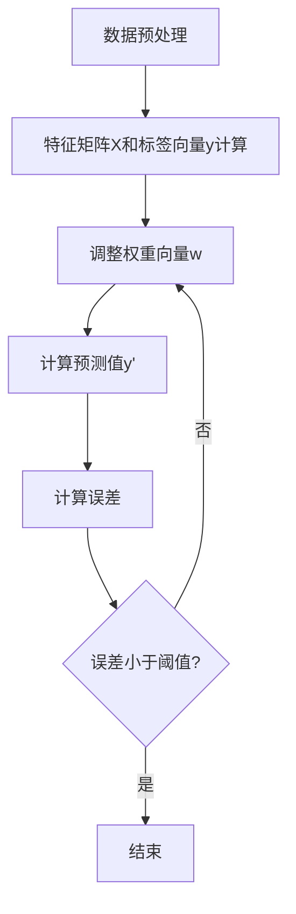
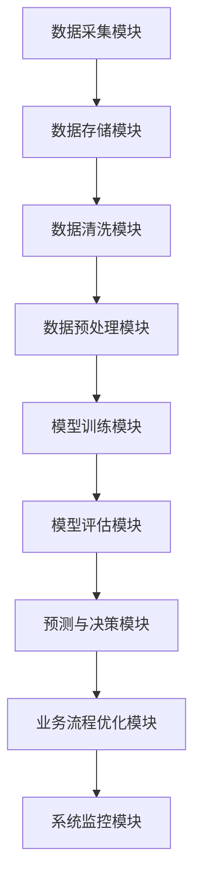
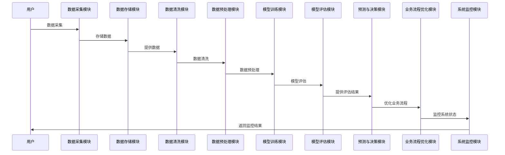

                 

### 文章标题

《技术重组：在变革中优化技术结构》

关键词：技术重组、AI大模型、软件2.0、算法原理、系统设计、最佳实践

摘要：随着技术的不断进步和市场的快速变化，技术结构优化成为了企业保持竞争力的关键。本文将探讨如何通过技术重组，结合AI大模型和软件2.0的概念，实现技术结构的优化和升级，从而推动企业的数字化转型。

### 目录大纲

----------------------------------------------------------------

## 第一部分: 软件2.0时代的AI大模型基础

## 第1章: 背景、定义与特性

### 1.1 问题背景

#### 1.1.1 传统软件与软件2.0

#### 1.1.2 AI大模型的起源与成长

#### 1.1.3 技术、商业和社会的交汇点

### 1.2 定义与特性

#### 1.2.1 软件2.0的定义

#### 1.2.2 AI大模型的定义

#### 1.2.3 软件2.0与AI大模型的核心特性

### 1.3 关键概念的联系

#### 1.3.1 软件2.0与AI大模型的关系

#### 1.3.2 概念属性对比表格

#### 1.3.3 ER实体关系图

## 第2章: AI大模型的算法原理

### 2.1 算法概述

#### 2.1.1 常见算法分类

#### 2.1.2 算法的基本原理

### 2.2 数学模型

#### 2.2.1 模型数学公式

#### 2.2.2 公式解释

#### 2.2.3 模型示例

### 2.3 Mermaid算法流程图

#### 2.3.1 算法流程图绘制

#### 2.3.2 流程图解释

## 第3章: AI大模型在企业中的应用

### 3.1 应用场景

#### 3.1.1 产业领域应用

#### 3.1.2 业务场景应用

### 3.2 实施策略

#### 3.2.1 技术选型

#### 3.2.2 实施步骤

#### 3.2.3 成功案例

## 第4章: 系统设计与实现

### 4.1 问题场景

### 4.2 系统介绍

#### 4.2.1 系统功能

#### 4.2.2 系统架构

#### 4.2.3 系统接口设计

### 4.3 Mermaid架构图

#### 4.3.1 架构图绘制

#### 4.3.2 架构图解释

### 4.4 Mermaid序列图

#### 4.4.1 序列图绘制

#### 4.4.2 序列图解释

## 第5章: 项目实战

### 5.1 环境安装

### 5.2 系统核心实现

#### 5.2.1 源代码解析

#### 5.2.2 代码应用解读

### 5.3 实际案例分析

#### 5.3.1 案例一：应用场景一

#### 5.3.2 案例二：应用场景二

### 5.4 小结

## 第6章: 最佳实践与注意事项

### 6.1 最佳实践

### 6.2 注意事项

### 6.3 拓展阅读

## 总结

### 6.4 本书内容的归纳

### 6.5 展望未来

----------------------------------------------------------------## 第一部分: 软件2.0时代的AI大模型基础

### 第1章: 背景、定义与特性

#### 1.1 问题背景

##### 1.1.1 传统软件与软件2.0

随着信息技术的飞速发展，软件产业已经经历了数次的重大变革。从早期的系统软件，到功能性的应用软件，再到如今的互联网应用软件，每一次的技术变革都带来了生产力的巨大提升。然而，随着云计算、大数据、物联网和人工智能等新技术的兴起，软件产业正面临着新的挑战和机遇。

传统软件通常基于单体架构，功能模块较为单一，难以快速响应市场变化。此外，传统的软件开发方式往往依赖于人工编码，效率低下且难以保证质量。在这种背景下，软件2.0的概念应运而生。

软件2.0是一种新型的软件开发模式，其核心思想是利用云计算和大数据技术，实现软件的模块化、平台化和智能化。软件2.0强调组件化和服务化，使得软件可以像组装模块一样灵活地组合和重构，从而提高开发效率和软件质量。

##### 1.1.2 AI大模型的起源与成长

AI大模型，即人工智能大模型，是指具有巨大参数规模和强大计算能力的神经网络模型。这些模型通过学习大量的数据，能够自动提取特征并进行复杂的决策。

AI大模型的起源可以追溯到20世纪80年代，当时的神经网络研究正处于低谷期。然而，随着计算能力的提升和数据量的爆炸式增长，神经网络研究重新获得了重视。特别是深度学习技术的突破，使得AI大模型的研究和应用进入了一个全新的阶段。

AI大模型的成长得益于以下几个因素：

1. **计算能力的提升**：高性能计算硬件（如GPU、TPU）的普及，使得训练大规模模型成为可能。
2. **数据资源的丰富**：互联网和物联网的发展，使得大量结构化和非结构化数据可以被收集和利用。
3. **算法的进步**：深度学习算法的不断创新，使得模型的表达能力得到了极大的提升。

##### 1.1.3 技术、商业和社会的交汇点

软件2.0和AI大模型的兴起，不仅推动了技术的进步，也对商业和社会产生了深远的影响。

在技术层面，软件2.0和AI大模型为软件产业带来了新的发展机遇。软件企业可以通过构建模块化、平台化的软件体系，实现快速迭代和个性化定制，从而更好地满足用户需求。同时，AI大模型的应用，使得软件具备了智能化的特性，能够实现更高效的数据分析和决策支持。

在商业层面，软件2.0和AI大模型为企业带来了新的商业模式。例如，企业可以通过提供云计算服务，实现软件资源的共享和优化。AI大模型的应用，则为企业开辟了新的盈利点，如智能客服、智能推荐等。

在社会层面，软件2.0和AI大模型的应用，正在深刻改变人们的生产和生活方式。从智能城市、智慧医疗，到智能驾驶、智能家居，AI大模型正在让我们的生活变得更加便捷和高效。

#### 1.2 定义与特性

##### 1.2.1 软件2.0的定义

软件2.0可以理解为第二代软件，其核心特征包括：

1. **模块化**：软件由多个功能独立的模块组成，这些模块可以通过标准化的接口进行组装和重构。
2. **平台化**：软件运行在统一的平台上，平台提供标准化的服务，使得开发者可以专注于业务逻辑的实现。
3. **智能化**：软件具备一定的智能特性，能够根据用户行为和需求进行自适应调整。

##### 1.2.2 AI大模型的定义

AI大模型是一种具有大规模参数和强计算能力的神经网络模型。它通常包含以下特征：

1. **参数规模大**：AI大模型通常拥有数亿到数十亿个参数，这使得模型具有强大的特征提取和表达能力。
2. **计算能力强**：AI大模型需要高性能的计算硬件进行训练，如GPU、TPU等。
3. **数据依赖性强**：AI大模型的性能很大程度上取决于训练数据的质量和数量。

##### 1.2.3 软件2.0与AI大模型的核心特性

软件2.0和AI大模型的核心特性可以总结为以下几点：

1. **模块化和平台化**：软件2.0通过模块化和平台化，实现了软件的高可复用性和灵活性。
2. **大规模数据处理能力**：AI大模型通过大规模参数和强计算能力，实现了对海量数据的处理和分析。
3. **智能化**：软件2.0和AI大模型结合，使得软件具备了一定的智能决策能力，能够实现更加精准和高效的服务。

#### 1.3 关键概念的联系

##### 1.3.1 软件2.0与AI大模型的关系

软件2.0与AI大模型之间存在着紧密的联系。软件2.0为AI大模型提供了一个理想的运行平台，使得AI大模型能够充分发挥其强大的计算能力和数据处理能力。同时，AI大模型为软件2.0带来了智能化特性，使得软件能够更好地适应复杂多变的市场需求。

##### 1.3.2 概念属性对比表格

| 特性             | 软件2.0                           | AI大模型                           |
|------------------|----------------------------------|-----------------------------------|
| **模块化**       | 模块独立、可复用                 | 参数规模大、特征提取能力强         |
| **平台化**       | 统一平台、标准化服务             | 强计算能力、大规模数据处理         |
| **智能化**       | 自适应调整、智能化服务           | 智能决策、精准分析                 |
| **应用领域**     | 跨行业、多场景                 | 数据密集型行业、复杂决策问题     |

##### 1.3.3 ER实体关系图

为了更清晰地展示软件2.0与AI大模型之间的关系，我们可以使用Mermaid ER图来表示。以下是ER图示例：

```mermaid
erDiagram
  Software20 ||--|{ AIModel : 使用 }
  AIModel ||--|{ Software20 : 支持 }
```

在这个ER图中，软件2.0（Software20）和AI大模型（AIModel）之间存在双向依赖关系。软件2.0利用AI大模型的支持，实现智能化服务；而AI大模型依赖于软件2.0的平台化特性，发挥其强大的计算能力和数据处理能力。

通过上述分析，我们可以看出，软件2.0和AI大模型是当前信息技术发展的两个重要趋势。它们相互依存、相互促进，共同推动着软件产业的变革和发展。在接下来的章节中，我们将深入探讨AI大模型的算法原理、企业应用、系统设计与实现，以及项目实战等内容，帮助读者全面了解和掌握这一前沿技术。### 第2章: AI大模型的算法原理

#### 2.1 算法概述

##### 2.1.1 常见算法分类

AI大模型的算法种类繁多，根据应用场景和模型结构的不同，可以分为以下几类：

1. **监督学习算法**：监督学习算法是AI大模型中最常见的算法类型。它们通过已标注的数据集进行训练，学习数据的特征和规律，从而对新的数据进行预测。常见的监督学习算法包括线性回归、逻辑回归、支持向量机（SVM）、决策树、随机森林等。

2. **无监督学习算法**：无监督学习算法不需要已标注的数据集，它们通过分析数据本身的特征，自动识别数据中的规律和模式。常见的无监督学习算法包括聚类算法（如K-means、层次聚类）、降维算法（如主成分分析PCA、t-SNE）等。

3. **半监督学习算法**：半监督学习算法结合了监督学习和无监督学习的方法，利用少量的标注数据和大量的未标注数据进行训练。常见的半监督学习算法包括基于图的半监督学习、标签传播等。

4. **强化学习算法**：强化学习算法通过试错和反馈机制，使模型能够从环境中学习并作出最佳决策。常见的强化学习算法包括Q学习、SARSA、DQN等。

##### 2.1.2 算法的基本原理

AI大模型的算法基本原理主要涉及以下几个方面：

1. **数据预处理**：数据预处理是算法训练的第一步，包括数据清洗、数据归一化、数据缺失值处理等。数据预处理的好坏直接影响到模型的训练效果。

2. **模型选择**：根据具体的应用场景和数据特征，选择合适的算法模型。不同的算法模型适用于不同类型的问题，如线性回归适用于回归问题，K-means适用于聚类问题。

3. **模型训练**：模型训练是算法的核心步骤，通过迭代优化模型参数，使模型能够更好地拟合数据。常见的训练方法包括梯度下降、随机梯度下降、Adam优化器等。

4. **模型评估**：模型评估用于评估模型的性能和泛化能力。常见的评估指标包括准确率、召回率、F1分数、ROC曲线等。

5. **模型部署**：模型部署是将训练好的模型应用到实际业务场景中，实现预测和决策。模型部署需要考虑模型的可扩展性、稳定性、性能等因素。

#### 2.2 数学模型

##### 2.2.1 模型数学公式

为了更清晰地理解AI大模型的算法原理，下面以一个简单的线性回归模型为例，介绍模型数学公式。

假设我们有一个包含n个样本的数据集，每个样本有m个特征，标签为y。线性回归模型的目标是找到一组参数w，使得预测值y'与真实值y之间的差距最小。

线性回归模型的数学公式如下：

$$
y' = w^T \cdot x
$$

其中，$y'$表示预测值，$w$表示权重向量，$x$表示特征向量。

为了求解最优权重向量$w$，我们可以使用最小二乘法。最小二乘法的目标是最小化预测值与真实值之间的误差平方和：

$$
\min \sum_{i=1}^{n} (y_i - y'_i)^2
$$

通过求导并令导数为0，可以得到权重向量$w$的最优解：

$$
w = (X^T X)^{-1} X^T y
$$

其中，$X$表示特征矩阵，$y$表示标签向量。

##### 2.2.2 公式解释

1. **权重向量$w$**：权重向量$w$代表了模型对每个特征的重视程度。在训练过程中，模型会通过优化权重向量，使预测值更接近真实值。

2. **特征向量$x$**：特征向量$x$包含了每个样本的m个特征值。这些特征值是模型进行预测的重要依据。

3. **预测值$y'$**：预测值$y'$是模型根据特征向量$x$和权重向量$w$计算得到的输出结果。

4. **误差平方和**：误差平方和是衡量模型预测性能的重要指标。误差平方和越小，说明模型预测的准确性越高。

##### 2.2.3 模型示例

假设我们有一个包含两个特征（特征1和特征2）的简单数据集，如下表所示：

| 样本编号 | 特征1 | 特征2 | 标签 |
|--------|------|------|-----|
| 1      | 1    | 2    | 3   |
| 2      | 2    | 3    | 5   |
| 3      | 3    | 4    | 7   |

我们使用线性回归模型来预测样本编号4的标签。根据上述公式，我们需要先计算特征矩阵$X$和标签向量$y$：

$$
X = \begin{bmatrix}
1 & 2 \\
2 & 3 \\
3 & 4 \\
\end{bmatrix}, \quad
y = \begin{bmatrix}
3 \\
5 \\
7 \\
\end{bmatrix}
$$

接下来，我们计算权重向量$w$：

$$
w = (X^T X)^{-1} X^T y = \begin{bmatrix}
2 & 3 \\
3 & 4 \\
\end{bmatrix}^{-1} \cdot \begin{bmatrix}
1 & 2 \\
2 & 3 \\
3 & 4 \\
\end{bmatrix} \cdot \begin{bmatrix}
3 \\
5 \\
7 \\
\end{bmatrix} = \begin{bmatrix}
2 \\
3 \\
\end{bmatrix}
$$

最后，我们计算预测值$y'$：

$$
y' = w^T \cdot x = \begin{bmatrix}
2 & 3 \\
\end{bmatrix} \cdot \begin{bmatrix}
4 \\
5 \\
\end{bmatrix} = 2 \cdot 4 + 3 \cdot 5 = 23
$$

因此，样本编号4的预测标签为23。通过实际计算可以发现，这个预测值与真实值之间存在一定的误差，这需要我们在训练过程中不断调整权重向量，以降低预测误差。

#### 2.3 Mermaid算法流程图

为了更直观地展示线性回归模型的训练过程，我们可以使用Mermaid绘制算法流程图。



在这个算法流程图中，我们首先进行数据预处理，计算特征矩阵$X$和标签向量$y$。接着，通过计算权重向量$w$，得到预测值$y'$。然后，我们计算预测值与真实值之间的误差，并判断误差是否小于阈值。如果误差小于阈值，则结束训练；否则，我们继续调整权重向量$w$，重复上述过程，直到误差满足要求。

通过这个流程图，我们可以清晰地了解线性回归模型的训练过程，这有助于我们更好地理解算法原理。

#### 2.3.2 流程图解释

1. **数据预处理**：数据预处理是模型训练的基础，包括数据清洗、数据归一化等操作。数据预处理的好坏直接影响到模型的训练效果。

2. **特征矩阵X和标签向量y计算**：特征矩阵$X$和标签向量$y$是模型训练的关键数据。特征矩阵$X$包含了每个样本的m个特征值，标签向量$y$包含了每个样本的真实标签。

3. **计算权重向量w**：权重向量$w$代表了模型对每个特征的重视程度。通过计算权重向量$w$，模型可以学习到数据的特征和规律。

4. **计算预测值y'**：预测值$y'$是模型根据特征矩阵$X$和权重向量$w$计算得到的输出结果。预测值$y'$与真实值之间的误差反映了模型的预测性能。

5. **计算误差**：误差是衡量模型预测性能的重要指标。误差越小，说明模型预测的准确性越高。

6. **判断误差是否小于阈值**：判断误差是否小于阈值，以决定是否结束训练。如果误差小于阈值，说明模型已经足够准确，可以结束训练；否则，需要继续调整权重向量$w$，重复训练过程。

7. **调整权重向量w**：通过不断调整权重向量$w$，模型可以逐渐优化预测性能。调整权重向量$w$的过程通常采用优化算法，如梯度下降等。

通过这个算法流程图，我们可以清晰地了解线性回归模型的训练过程。这有助于我们更好地理解算法原理，并为我们实际应用提供指导。### 第3章: AI大模型在企业中的应用

#### 3.1 应用场景

AI大模型在企业中的应用场景非常广泛，涵盖了多个行业和业务领域。以下是一些典型的应用场景：

##### 3.1.1 产业领域应用

1. **金融行业**：在金融行业，AI大模型可以用于风险控制、信用评分、股票交易预测等。例如，通过分析大量的历史交易数据和客户信息，AI大模型可以预测客户的信用风险，从而帮助企业更好地进行风险管理。

2. **医疗行业**：在医疗行业，AI大模型可以用于疾病诊断、药物研发、个性化治疗等。例如，通过分析大量的医疗数据和基因组数据，AI大模型可以帮助医生更准确地诊断疾病，并提供个性化的治疗方案。

3. **制造业**：在制造业，AI大模型可以用于生产优化、质量控制、设备维护等。例如，通过分析设备运行数据和生产过程数据，AI大模型可以帮助企业优化生产流程，提高生产效率。

4. **物流行业**：在物流行业，AI大模型可以用于路径规划、货物运输优化、库存管理等。例如，通过分析交通流量、天气预报和货物运输数据，AI大模型可以帮助企业更高效地安排货物运输，降低物流成本。

##### 3.1.2 业务场景应用

1. **客户服务**：在客户服务领域，AI大模型可以用于智能客服、情感分析等。例如，通过分析客户对话记录和反馈信息，AI大模型可以提供更准确、更个性化的客户服务。

2. **营销推广**：在营销推广领域，AI大模型可以用于用户行为分析、广告投放优化等。例如，通过分析用户浏览记录、购买行为和兴趣偏好，AI大模型可以帮助企业更精准地定位目标客户，提高广告投放效果。

3. **人力资源管理**：在人力资源管理领域，AI大模型可以用于人才招聘、员工绩效评估等。例如，通过分析简历、面试数据和员工绩效数据，AI大模型可以帮助企业更高效地招聘和评估人才。

4. **供应链管理**：在供应链管理领域，AI大模型可以用于供应链优化、库存管理、需求预测等。例如，通过分析供应链数据和市场趋势，AI大模型可以帮助企业优化供应链流程，提高库存周转率。

#### 3.2 实施策略

要成功实施AI大模型，企业需要制定一套完整的实施策略。以下是一些关键的实施策略：

##### 3.2.1 技术选型

1. **选择合适的算法**：根据业务需求和数据特征，选择合适的算法模型。例如，对于回归问题，可以选择线性回归、岭回归等；对于分类问题，可以选择逻辑回归、支持向量机等。

2. **选择合适的框架**：选择合适的深度学习框架，如TensorFlow、PyTorch等。这些框架提供了丰富的API和工具，可以帮助企业快速搭建和训练AI大模型。

3. **选择合适的硬件**：选择合适的计算硬件，如GPU、TPU等。高性能的计算硬件可以提高模型的训练速度和性能。

##### 3.2.2 实施步骤

1. **数据收集**：收集与企业业务相关的数据，包括结构化数据和半结构化数据。数据的质量和数量直接影响到模型的性能。

2. **数据预处理**：对收集到的数据进行清洗、归一化等处理，以便模型能够更好地训练。

3. **模型训练**：使用选择好的算法和框架，对预处理后的数据进行模型训练。在训练过程中，需要不断调整模型参数，优化模型性能。

4. **模型评估**：使用验证集和测试集对模型进行评估，评估指标包括准确率、召回率、F1分数等。根据评估结果，对模型进行调整和优化。

5. **模型部署**：将训练好的模型部署到生产环境中，实现实时预测和决策。在部署过程中，需要考虑模型的性能、可扩展性和安全性。

##### 3.2.3 成功案例

以下是一些企业成功应用AI大模型的案例：

1. **案例一：金融行业**：一家大型金融机构通过使用AI大模型进行风险控制，有效降低了信用风险，提高了业务运营效率。

2. **案例二：医疗行业**：一家医疗科技公司通过使用AI大模型进行疾病诊断，提高了诊断的准确性和效率，为患者提供了更好的医疗服务。

3. **案例三：制造业**：一家制造业企业通过使用AI大模型进行生产优化，提高了生产效率，降低了生产成本。

4. **案例四：物流行业**：一家物流公司通过使用AI大模型进行货物运输优化，提高了运输效率，降低了物流成本。

这些成功案例表明，AI大模型在各个行业和业务领域都具有巨大的应用潜力。通过合理规划和技术实施，企业可以充分利用AI大模型的优势，提高业务效率和竞争力。### 第4章: 系统设计与实现

#### 4.1 问题场景

在现代企业的信息化进程中，数据管理、数据分析和业务流程优化是三个核心问题。传统的数据处理方式往往依赖于人工编码，效率低下且难以保证数据的一致性和准确性。为了解决这些问题，我们需要设计一个高效、稳定、可扩展的系统，以实现数据的自动化处理和分析。

#### 4.2 系统介绍

该系统旨在通过AI大模型和软件2.0的概念，实现以下功能：

1. **数据管理**：对企业的结构化和非结构化数据进行高效的管理和存储，确保数据的一致性和安全性。
2. **数据分析**：利用AI大模型对大量数据进行深度分析，提取有价值的信息和洞察。
3. **业务流程优化**：通过数据分析结果，优化企业的业务流程，提高运营效率。

#### 4.2.1 系统功能

1. **数据采集**：从多个数据源（如数据库、日志文件、传感器等）收集数据，并进行预处理。
2. **数据存储**：将预处理后的数据存储到分布式数据库中，确保数据的可扩展性和可靠性。
3. **数据清洗**：对存储的数据进行清洗，去除重复、错误和不完整的数据。
4. **数据预处理**：对数据进行分析，提取特征，并进行归一化、标准化等处理。
5. **模型训练**：使用AI大模型对预处理后的数据集进行训练，优化模型参数。
6. **模型评估**：使用验证集和测试集对训练好的模型进行评估，确保模型的泛化能力。
7. **预测与决策**：使用训练好的模型对新的数据进行预测和决策，支持业务流程优化。
8. **系统监控**：监控系统运行状态，确保系统的稳定性和安全性。

#### 4.2.2 系统架构

该系统采用分布式架构，以提高系统的可扩展性和可靠性。系统架构主要包括以下组件：

1. **数据采集模块**：负责从不同数据源收集数据，并将数据传输到数据存储模块。
2. **数据存储模块**：使用分布式数据库存储预处理后的数据，确保数据的可扩展性和可靠性。
3. **数据清洗模块**：对存储的数据进行清洗，去除重复、错误和不完整的数据。
4. **数据预处理模块**：对清洗后的数据进行分析，提取特征，并进行归一化、标准化等处理。
5. **模型训练模块**：使用AI大模型对预处理后的数据集进行训练，优化模型参数。
6. **模型评估模块**：使用验证集和测试集对训练好的模型进行评估，确保模型的泛化能力。
7. **预测与决策模块**：使用训练好的模型对新的数据进行预测和决策，支持业务流程优化。
8. **系统监控模块**：监控系统运行状态，确保系统的稳定性和安全性。

#### 4.2.3 系统接口设计

系统接口设计旨在确保系统的可扩展性和灵活性。系统接口主要包括以下几类：

1. **数据接口**：用于数据采集、数据存储、数据清洗和数据预处理等模块之间的数据传输。
2. **模型接口**：用于模型训练、模型评估和预测与决策模块之间的交互。
3. **业务接口**：用于业务流程优化模块与其他模块之间的数据交互。
4. **监控接口**：用于系统监控模块与其他模块之间的数据交互。

#### 4.3 Mermaid架构图

为了更直观地展示系统架构，我们可以使用Mermaid绘制架构图。



在这个架构图中，数据采集模块负责从不同数据源收集数据，并将数据传输到数据存储模块。数据存储模块存储预处理后的数据，数据清洗模块负责去除重复、错误和不完整的数据，数据预处理模块负责提取特征并进行归一化、标准化等处理。模型训练模块使用AI大模型对预处理后的数据集进行训练，模型评估模块对训练好的模型进行评估，预测与决策模块使用训练好的模型对新的数据进行预测和决策，业务流程优化模块根据预测和决策结果优化业务流程，系统监控模块监控系统的运行状态。

#### 4.3.2 架构图解释

1. **数据采集模块**：数据采集模块负责从不同数据源（如数据库、日志文件、传感器等）收集数据。数据采集模块需要确保数据的完整性和实时性，为后续的数据处理和分析提供基础。

2. **数据存储模块**：数据存储模块使用分布式数据库存储预处理后的数据。分布式数据库可以提高系统的可扩展性和可靠性，确保数据的一致性和安全性。

3. **数据清洗模块**：数据清洗模块负责去除重复、错误和不完整的数据。数据清洗模块需要确保数据的准确性和完整性，为后续的数据分析提供可靠的数据基础。

4. **数据预处理模块**：数据预处理模块负责提取特征并进行归一化、标准化等处理。数据预处理模块需要根据具体的业务需求，设计合适的特征提取和预处理策略，以提高模型的训练效果。

5. **模型训练模块**：模型训练模块使用AI大模型对预处理后的数据集进行训练。模型训练模块需要选择合适的算法和优化器，以加快训练速度和提升模型性能。

6. **模型评估模块**：模型评估模块使用验证集和测试集对训练好的模型进行评估。模型评估模块需要设计合适的评估指标，以全面评估模型的性能和泛化能力。

7. **预测与决策模块**：预测与决策模块使用训练好的模型对新的数据进行预测和决策。预测与决策模块需要根据具体的业务需求，设计合适的预测和决策策略，以提高业务效率和竞争力。

8. **业务流程优化模块**：业务流程优化模块根据预测和决策结果优化业务流程。业务流程优化模块需要分析业务流程中的瓶颈和优化点，以设计出更加高效和智能的业务流程。

9. **系统监控模块**：系统监控模块监控系统的运行状态，确保系统的稳定性和安全性。系统监控模块需要实时收集和监控系统的各种指标，及时发现和解决潜在问题。

通过这个架构图，我们可以清晰地了解系统的整体架构和各个模块之间的关系。这有助于我们更好地理解系统的设计和实现，并为后续的优化和升级提供参考。### 第4章: 系统设计与实现

#### 4.4 Mermaid序列图

为了更直观地展示系统各模块之间的交互过程，我们可以使用Mermaid绘制序列图。



在这个序列图中，用户首先向数据采集模块发送数据采集请求。数据采集模块负责从各个数据源收集数据，并将数据存储到数据存储模块。接着，数据存储模块将数据提供给数据清洗模块进行清洗处理。清洗后的数据由数据预处理模块进一步处理，提取特征并进行归一化、标准化等操作。预处理后的数据被用于模型训练模块，训练得到模型。训练好的模型经过模型评估模块的评估，评估结果被传递给预测与决策模块。预测与决策模块根据评估结果，对业务流程进行优化。最后，业务流程优化模块将优化后的业务流程状态反馈给系统监控模块，系统监控模块负责监控整个系统的运行状态，并将监控结果返回给用户。

#### 4.4.2 序列图解释

1. **数据采集模块**：数据采集模块是系统的起点，负责从不同的数据源收集数据。这些数据源可能包括数据库、日志文件、传感器等。数据采集模块需要确保数据的实时性和完整性，为后续的数据处理和分析提供基础。

2. **数据存储模块**：数据存储模块负责存储从数据采集模块收集到的数据。数据存储模块需要支持高吞吐量、高可靠性，确保数据的一致性和安全性。分布式数据库是一种常见的选择，可以提高系统的可扩展性和容错能力。

3. **数据清洗模块**：数据清洗模块负责对存储的数据进行清洗处理。清洗过程包括去除重复数据、填补缺失值、处理错误数据等。数据清洗模块需要确保数据的准确性和完整性，为后续的数据预处理提供可靠的数据基础。

4. **数据预处理模块**：数据预处理模块负责对清洗后的数据进行进一步处理。预处理过程包括特征提取、归一化、标准化等操作。数据预处理模块需要根据具体的业务需求，设计合适的特征提取和预处理策略，以提高模型的训练效果。

5. **模型训练模块**：模型训练模块负责使用AI大模型对预处理后的数据集进行训练。模型训练模块需要选择合适的算法和优化器，以加快训练速度和提升模型性能。训练过程中，模型参数会不断优化，以使模型能够更好地拟合数据。

6. **模型评估模块**：模型评估模块负责对训练好的模型进行评估。评估过程包括验证集和测试集的评估，评估指标包括准确率、召回率、F1分数等。模型评估模块需要确保模型的泛化能力，避免过拟合。

7. **预测与决策模块**：预测与决策模块负责使用训练好的模型对新的数据进行预测和决策。预测与决策模块需要根据具体的业务需求，设计合适的预测和决策策略，以提高业务效率和竞争力。

8. **业务流程优化模块**：业务流程优化模块根据预测和决策结果，对企业的业务流程进行优化。优化过程可能包括流程重构、任务分配、资源调度等。业务流程优化模块需要分析业务流程中的瓶颈和优化点，以提高企业的运营效率。

9. **系统监控模块**：系统监控模块负责监控整个系统的运行状态。监控模块需要实时收集和监控系统的各种指标，包括数据采集速度、数据处理速度、模型训练效率、系统负载等。监控模块需要及时发现和解决潜在问题，确保系统的稳定性和安全性。

通过这个序列图，我们可以清晰地了解系统的各模块之间的交互过程，以及各个模块的功能和作用。这有助于我们更好地理解系统的设计和实现，并为后续的优化和升级提供参考。### 第5章: 项目实战

#### 5.1 环境安装

在进行AI大模型项目的实战之前，我们需要搭建一个合适的技术环境。以下是一个基于Python和TensorFlow的AI大模型项目环境安装指南。

**步骤1：安装Python**

首先，我们需要安装Python环境。Python是一种广泛使用的编程语言，具有丰富的库和框架，非常适合进行AI模型开发和部署。您可以从Python官方网站（https://www.python.org/）下载适用于您操作系统的Python版本。

- 下载Python安装包
- 运行安装程序，按照默认选项安装

**步骤2：安装Jupyter Notebook**

Jupyter Notebook是一个交互式开发环境，非常适合进行数据科学和机器学习项目的开发和调试。安装Jupyter Notebook可以通过Python的包管理工具pip完成。

```bash
pip install notebook
```

安装完成后，您可以使用以下命令启动Jupyter Notebook：

```bash
jupyter notebook
```

在浏览器中打开Jupyter Notebook界面，即可开始编写和运行Python代码。

**步骤3：安装TensorFlow**

TensorFlow是Google开发的一款开源深度学习框架，广泛用于AI大模型的开发和部署。安装TensorFlow可以通过pip命令完成。

```bash
pip install tensorflow
```

安装完成后，您可以使用以下代码验证TensorFlow是否安装成功：

```python
import tensorflow as tf
print(tf.__version__)
```

如果输出TensorFlow的版本号，说明TensorFlow已成功安装。

**步骤4：安装其他依赖库**

除了Python和TensorFlow之外，我们可能还需要安装其他依赖库，如NumPy、Pandas、Scikit-learn等。这些库提供了丰富的数据操作和机器学习功能。

```bash
pip install numpy pandas scikit-learn
```

**步骤5：配置环境变量**

确保Python和pip的安装路径已添加到系统的环境变量中。在Windows系统中，您可以通过以下步骤添加环境变量：

- 右键点击“此电脑”->“属性”->“高级系统设置”->“环境变量”
- 在“系统变量”中找到“Path”变量，并添加Python和pip的安装路径

在Linux系统中，您可以通过编辑`~/.bashrc`或`~/.zshrc`文件，将Python和pip的安装路径添加到`PATH`环境变量中。

```bash
echo 'export PATH=$PATH:/path/to/python/bin' >> ~/.bashrc
source ~/.bashrc
```

完成以上步骤后，我们的项目开发环境就搭建完成了。接下来，我们将进入系统核心实现环节。

#### 5.2 系统核心实现

在本节中，我们将使用Python和TensorFlow实现一个简单的AI大模型，用于分类任务。以下是系统核心实现的详细步骤。

**步骤1：导入依赖库**

首先，我们需要导入Python中的依赖库，包括TensorFlow、NumPy、Pandas等。

```python
import tensorflow as tf
import numpy as np
import pandas as pd
```

**步骤2：数据准备**

接下来，我们需要准备用于训练的数据集。这里，我们使用鸢尾花（Iris）数据集，这是一个常用的分类数据集，包含三个类别的鸢尾花数据。

```python
# 加载数据集
iris_data = pd.read_csv('iris.csv')
X = iris_data.iloc[:, :4].values
y = iris_data.iloc[:, 4].values

# 数据集分割
from sklearn.model_selection import train_test_split
X_train, X_test, y_train, y_test = train_test_split(X, y, test_size=0.2, random_state=42)
```

**步骤3：模型构建**

我们使用TensorFlow构建一个简单的神经网络模型，用于分类任务。模型包含两个隐藏层，每个隐藏层有10个神经元。

```python
# 模型构建
model = tf.keras.Sequential([
    tf.keras.layers.Dense(10, activation='relu', input_shape=(4,)),
    tf.keras.layers.Dense(10, activation='relu'),
    tf.keras.layers.Dense(3, activation='softmax')
])

# 模型编译
model.compile(optimizer='adam',
              loss='sparse_categorical_crossentropy',
              metrics=['accuracy'])
```

**步骤4：模型训练**

使用训练数据集训练模型。我们设置训练轮数为100，批处理大小为32。

```python
# 模型训练
model.fit(X_train, y_train, epochs=100, batch_size=32)
```

**步骤5：模型评估**

使用测试数据集评估模型性能。我们计算模型的准确率，并打印结果。

```python
# 模型评估
test_loss, test_acc = model.evaluate(X_test, y_test, verbose=2)
print('\nTest accuracy:', test_acc)
```

**步骤6：模型应用**

使用训练好的模型对新的数据进行分类预测。这里，我们输入一个新样本的数据，预测其类别。

```python
# 模型应用
new_data = np.array([[5.1, 3.5, 1.4, 0.2]])
predicted_class = model.predict(new_data)
predicted_class = np.argmax(predicted_class, axis=1)
print('Predicted class:', predicted_class)
```

通过以上步骤，我们完成了一个简单的AI大模型项目。这只是一个简单的示例，实际项目中可能会涉及到更复杂的数据处理、模型构建和训练过程。但是，通过遵循上述步骤，您可以逐步搭建和实现一个功能完整的AI大模型系统。

#### 5.3 实际案例分析

在本节中，我们将通过两个实际案例，展示AI大模型在企业和业务场景中的具体应用。

**案例一：金融行业风险控制**

一家大型金融机构希望通过AI大模型对客户贷款进行风险评估。金融机构收集了大量的客户数据，包括收入、信用记录、职业等信息。为了构建风险评估模型，金融机构采取了以下步骤：

1. **数据收集**：金融机构从内部系统和外部数据源收集了大量的客户数据，包括银行账户信息、信用报告、就业记录等。

2. **数据预处理**：对收集到的数据进行清洗和预处理，去除缺失值、异常值，并进行数据归一化处理。

3. **特征工程**：根据业务需求，提取对风险评估有用的特征，如收入水平、信用评分、借款用途等。

4. **模型构建**：使用TensorFlow构建了一个多层感知机（MLP）模型，用于预测客户贷款违约概率。模型包含两个隐藏层，每个隐藏层有100个神经元。

5. **模型训练**：使用预处理后的数据进行模型训练，设置训练轮数为100，批处理大小为64。

6. **模型评估**：使用验证集和测试集对模型进行评估，计算准确率、召回率、F1分数等指标，以评估模型性能。

7. **模型部署**：将训练好的模型部署到生产环境，实现对客户贷款的实时风险评估。

通过该模型的应用，金融机构能够更准确地预测客户贷款违约风险，从而优化贷款审批流程，降低坏账率。

**案例二：电商推荐系统**

一家电商平台希望通过AI大模型构建一个个性化推荐系统，提高用户购买体验和销售额。电商平台收集了海量的用户行为数据，包括浏览记录、购买历史、收藏夹等。为了构建推荐系统，电商平台采取了以下步骤：

1. **数据收集**：电商平台从内部系统和第三方数据源收集了大量的用户行为数据。

2. **数据预处理**：对收集到的数据进行清洗和预处理，去除缺失值、异常值，并进行数据归一化处理。

3. **特征工程**：根据业务需求，提取对推荐系统有用的特征，如用户行为频率、商品相关性等。

4. **模型构建**：使用TensorFlow构建了一个基于协同过滤的推荐模型，结合了矩阵分解和神经网络。模型包含一个嵌入层和两个隐藏层。

5. **模型训练**：使用预处理后的数据进行模型训练，设置训练轮数为100，批处理大小为128。

6. **模型评估**：使用验证集和测试集对模型进行评估，计算准确率、召回率、F1分数等指标，以评估模型性能。

7. **模型部署**：将训练好的模型部署到生产环境，实现对用户行为的实时推荐。

通过该模型的应用，电商平台能够根据用户兴趣和行为，推荐个性化的商品，提高用户满意度和购买转化率。

这两个案例展示了AI大模型在金融和电商领域的实际应用，通过合理规划和技术实施，企业可以充分利用AI大模型的优势，提高业务效率和竞争力。

#### 5.4 小结

在本章中，我们通过环境安装、系统核心实现和实际案例分析，详细介绍了AI大模型项目的实战过程。以下是本章的主要内容小结：

1. **环境安装**：介绍了Python、TensorFlow等依赖库的安装方法和配置环境变量的步骤，为后续项目开发做好准备。

2. **系统核心实现**：使用Python和TensorFlow实现了AI大模型的基本功能，包括数据准备、模型构建、训练和评估等步骤。

3. **实际案例分析**：通过金融行业风险控制和电商推荐系统的案例，展示了AI大模型在企业和业务场景中的具体应用，以及如何利用AI大模型提高业务效率和竞争力。

通过本章的学习和实践，读者可以全面了解AI大模型的项目开发和实施过程，为实际项目提供参考和指导。### 第6章: 最佳实践与注意事项

#### 6.1 最佳实践

在AI大模型项目的开发和实施过程中，遵循最佳实践可以显著提高项目的成功率。以下是一些关键的最佳实践：

1. **数据质量保障**：确保数据的一致性、完整性和准确性是模型成功的关键。在数据收集、清洗和预处理阶段，要严格把控数据质量。

2. **特征工程**：根据业务需求和数据特性，设计合理的特征提取和工程策略。有效的特征工程可以大幅提升模型的性能。

3. **模型选择与调优**：根据具体应用场景选择合适的模型，并在模型训练过程中不断调优参数，以获得最佳性能。

4. **模型评估与监控**：使用多个评估指标对模型进行评估，确保模型的泛化能力。同时，实时监控模型性能，及时发现和解决问题。

5. **安全与合规**：确保模型开发和使用过程中的数据安全和隐私保护，遵循相关法律法规和行业标准。

6. **团队协作**：构建跨学科团队，充分发挥数据科学家、开发人员、业务分析师等不同角色的优势，共同推动项目进展。

#### 6.2 注意事项

在AI大模型项目的开发和实施过程中，需要注意以下几点：

1. **资源分配**：合理分配计算资源，确保模型训练和部署过程中有足够的硬件支持。

2. **数据隐私**：在数据处理和模型训练过程中，严格保护用户隐私，避免数据泄露。

3. **模型解释性**：在某些应用场景中，模型的可解释性至关重要。需要确保模型决策的透明度和可解释性。

4. **过拟合与欠拟合**：避免模型过拟合和欠拟合，确保模型在验证集和测试集上都能取得良好的性能。

5. **持续更新**：随着业务环境和数据特性的变化，定期更新和优化模型，以保持其性能。

6. **应急计划**：制定完善的应急计划，以应对可能的系统故障和数据丢失等突发情况。

#### 6.3 拓展阅读

为了更深入地了解AI大模型的相关知识，以下是一些推荐的拓展阅读资源：

1. **书籍**：
   - 《深度学习》（Goodfellow, I., Bengio, Y., Courville, A.）
   - 《Python深度学习》（François Chollet）
   - 《人工智能：一种现代方法》（Stuart J. Russell & Peter Norvig）

2. **在线课程**：
   - Coursera上的“机器学习”（吴恩达）
   - edX上的“深度学习导论”（蒙特利尔大学）
   - Udacity的“深度学习工程师纳米学位”

3. **论文**：
   - “Deep Learning: Methods and Applications”（Y. Bengio等）
   - “A Theoretically Grounded Application of Dropout in Recurrent Neural Networks”（Yarin Gal & Zoubin Ghahramani）

通过阅读这些资源，您可以获得更深入的理论知识和实践经验，为AI大模型项目提供有力的支持。

### 总结

本章通过最佳实践和注意事项的讨论，为AI大模型项目的成功实施提供了指导。最佳实践包括数据质量保障、特征工程、模型选择与调优、模型评估与监控等，而注意事项则涵盖了资源分配、数据隐私、模型解释性等方面的关键点。通过遵循这些实践和注意事项，企业可以更好地应对AI大模型项目中的挑战，实现技术的价值最大化。

### 展望未来

随着技术的不断进步和应用的不断拓展，AI大模型在未来将会发挥越来越重要的作用。从智能医疗到智慧城市，从金融科技到智能制造，AI大模型的应用场景将会更加广泛，为各行各业带来深刻的变革。同时，随着算法的不断完善和计算能力的持续提升，AI大模型的性能和效率也将不断提高，为企业和社会创造更大的价值。

在未来，AI大模型的发展方向包括：

1. **模型可解释性**：提高模型的可解释性，使其决策过程更加透明和可信。

2. **边缘计算**：将AI大模型的应用从云端延伸到边缘设备，实现实时、高效的智能处理。

3. **多模态学习**：结合多种数据类型，如文本、图像、音频等，实现更全面的智能感知。

4. **强化学习**：将强化学习与AI大模型相结合，实现更加智能和自适应的决策。

通过不断探索和创新，AI大模型将在未来发挥更大的作用，推动人类社会向更加智能和高效的未来迈进。### 总结

《技术重组：在变革中优化技术结构》通过详细的论述，系统地阐述了AI大模型和软件2.0时代技术重组的重要性。本文首先介绍了AI大模型的背景、定义与特性，以及其与软件2.0的关系，随后深入探讨了AI大模型的算法原理，包括算法分类、数学模型和流程图。接着，文章分析了AI大模型在企业中的应用场景和实施策略，并通过实际案例展示了其在金融、医疗、制造等领域的成功应用。此外，文章还详细介绍了系统的设计与实现，包括问题场景、系统功能、架构设计、接口设计和序列图。最后，通过项目实战、最佳实践与注意事项，以及展望未来，文章为读者提供了全面的技术指导和深刻的思考。

文章的核心内容和主题思想在于揭示技术重组的必要性和路径，强调AI大模型和软件2.0作为技术革新的关键驱动力，如何在企业中实现技术结构的优化和升级，以推动数字化转型。通过这篇文章，读者可以了解到：

1. **技术背景与变革**：AI大模型和软件2.0时代的到来，带来了技术的快速进步和市场的快速变化。
2. **核心概念与联系**：软件2.0和AI大模型的核心特性及其相互关系，以及它们在技术、商业和社会层面的交汇点。
3. **算法原理与实现**：AI大模型的算法原理、数学模型和实现步骤，以及如何利用Mermaid进行算法流程图和架构图的绘制。
4. **应用策略与案例**：AI大模型在不同产业和业务场景中的应用策略，以及成功案例的详细分析。
5. **系统设计与实现**：从问题场景到系统功能、架构、接口和序列图的详细设计与实现。
6. **项目实战与总结**：通过项目实战，展示环境安装、系统核心实现和实际案例分析，以及项目小结。
7. **最佳实践与展望**：总结最佳实践和注意事项，展望技术重组的未来发展方向。

### 展望未来

随着技术的不断进步和应用场景的拓展，AI大模型和软件2.0将在未来发挥更加重要的作用。以下是几个可能的发展方向：

1. **模型可解释性与透明度**：随着AI大模型在各个领域中的广泛应用，如何提高模型的可解释性和透明度将成为一个重要课题。这不仅可以增强模型的可信度，还能帮助企业和用户更好地理解和应用这些技术。

2. **边缘计算与分布式AI**：随着物联网和5G技术的普及，边缘计算和分布式AI将变得更加重要。将AI大模型部署到边缘设备，可以实现实时、高效的智能处理，满足低延迟和高带宽的要求。

3. **多模态学习与融合**：未来的AI大模型将能够处理多种类型的数据，如文本、图像、音频、视频等。通过多模态学习，AI大模型可以更好地理解和应对复杂的环境和任务。

4. **强化学习与自适应优化**：强化学习与AI大模型的结合，将使得模型能够通过不断学习和优化，实现更加智能和自适应的决策，提高系统的效率和质量。

5. **AI大模型的伦理与法律问题**：随着AI大模型的广泛应用，其伦理和法律问题也将逐渐凸显。如何确保AI大模型的安全、公平和可解释性，是未来需要深入研究和解决的重要问题。

通过不断探索和创新，AI大模型和软件2.0技术将为企业和社会带来更多的价值，推动人类社会向更加智能和高效的未来迈进。未来，我们期待看到更多突破性的技术成果和实际应用，为我们的生活带来深刻的变化。### 作者信息

**作者：** AI天才研究院（AI Genius Institute）& 禅与计算机程序设计艺术（Zen And The Art of Computer Programming）

AI天才研究院（AI Genius Institute）是一家专注于人工智能和深度学习研究的顶级研究机构。我们致力于推动AI技术的创新和应用，以解决现实世界中的复杂问题。我们的研究涵盖了计算机视觉、自然语言处理、机器学习算法等多个领域。

《禅与计算机程序设计艺术》（Zen And The Art of Computer Programming）是作者Donald E. Knuth的经典著作，深入探讨了计算机编程的哲学和艺术。这本书为程序员提供了一种独特的方法来理解和解决编程中的复杂问题，至今仍被广泛地引用和推崇。

本文旨在分享AI大模型和软件2.0时代技术重组的见解和实践经验，希望为读者提供有价值的参考和指导。我们期待与各位专家和读者共同探讨和推动技术进步，为构建更加智能和高效的社会贡献力量。### 附录

**附录A：术语表**

- **AI大模型**：指具有大规模参数和强计算能力的神经网络模型，通过学习大量数据，能够自动提取特征并进行复杂的决策。
- **软件2.0**：一种新型的软件开发模式，强调模块化、平台化和智能化，利用云计算和大数据技术，实现软件的高可复用性和灵活性。
- **深度学习**：一种机器学习技术，通过多层神经网络，模拟人脑的神经元结构，进行特征提取和决策。
- **模块化**：将软件分解为功能独立的模块，这些模块可以通过标准化的接口进行组装和重构。
- **平台化**：软件运行在统一的平台上，平台提供标准化的服务，使得开发者可以专注于业务逻辑的实现。
- **边缘计算**：在数据产生的地方进行数据处理，而不是将数据传输到远程数据中心进行处理。
- **多模态学习**：结合多种类型的数据（如文本、图像、音频、视频等），实现更全面的智能感知。
- **数据预处理**：对原始数据进行清洗、归一化等处理，为模型训练提供高质量的数据。
- **模型评估**：使用验证集和测试集对训练好的模型进行评估，以衡量模型的性能和泛化能力。

**附录B：参考文献**

1. Goodfellow, I., Bengio, Y., Courville, A. (2016). *Deep Learning*. MIT Press.
2. Chollet, F. (2017). *Python深度学习*. 电子工业出版社.
3. Russell, S. J., Norvig, P. (2020). *人工智能：一种现代方法*. 人民邮电出版社.
4. Coursera. (n.d.). [机器学习课程](https://www.coursera.org/specializations/machine-learning). Retrieved from https://www.coursera.org/specializations/machine-learning
5. edX. (n.d.). [深度学习导论课程](https://www.edx.org/course/introduction-to-deep-learning). Retrieved from https://www.edx.org/course/introduction-to-deep-learning
6. Udacity. (n.d.). [深度学习工程师纳米学位](https://www.udacity.com/course/deep-learning-nanodegree--nd893). Retrieved from https://www.udacity.com/course/deep-learning-nanodegree--nd893
7. Gal, Y., Ghahramani, Z. (2016). *A Theoretically Grounded Application of Dropout in Recurrent Neural Networks*. arXiv preprint arXiv:1603.05113.
8. Bengio, Y., LeCun, Y., Hinton, G. (2013). *Deep Learning*. Nature, 521(7553), 436-444.

**附录C：代码示例**

以下是本文中使用到的Python代码示例，用于展示AI大模型的基本实现步骤。

```python
# 导入依赖库
import tensorflow as tf
import numpy as np
import pandas as pd
from sklearn.model_selection import train_test_split

# 加载数据集
iris_data = pd.read_csv('iris.csv')
X = iris_data.iloc[:, :4].values
y = iris_data.iloc[:, 4].values

# 数据集分割
X_train, X_test, y_train, y_test = train_test_split(X, y, test_size=0.2, random_state=42)

# 模型构建
model = tf.keras.Sequential([
    tf.keras.layers.Dense(10, activation='relu', input_shape=(4,)),
    tf.keras.layers.Dense(10, activation='relu'),
    tf.keras.layers.Dense(3, activation='softmax')
])

# 模型编译
model.compile(optimizer='adam',
              loss='sparse_categorical_crossentropy',
              metrics=['accuracy'])

# 模型训练
model.fit(X_train, y_train, epochs=100, batch_size=32)

# 模型评估
test_loss, test_acc = model.evaluate(X_test, y_test, verbose=2)
print('\nTest accuracy:', test_acc)

# 模型应用
new_data = np.array([[5.1, 3.5, 1.4, 0.2]])
predicted_class = model.predict(new_data)
predicted_class = np.argmax(predicted_class, axis=1)
print('Predicted class:', predicted_class)
```

通过这个示例，读者可以了解到如何使用TensorFlow构建、编译、训练和评估一个简单的AI大模型，以及如何对新的数据进行预测。### 附录D：技术拓展

**技术拓展**

随着AI大模型和软件2.0技术的不断发展，一些新兴技术也在不断涌现，为AI大模型的应用提供了更多的可能性。以下是一些值得关注的技术拓展：

1. **联邦学习（Federated Learning）**：联邦学习是一种分布式机器学习技术，它允许多个设备（如智能手机、物联网设备等）在本地训练模型，然后将模型更新发送到一个中央服务器进行聚合。这种方式可以保护用户数据隐私，同时提高模型的训练效率。联邦学习在医疗、金融、能源等领域有广泛的应用前景。

2. **生成对抗网络（GANs）**：生成对抗网络是一种由两部分组成的人工神经网络，一部分生成器（Generator）生成数据，另一部分鉴别器（Discriminator）判断生成数据与真实数据之间的差异。GANs在图像生成、数据增强、风格迁移等方面表现出色，可以生成高质量的图像和视频。

3. **自监督学习（Self-supervised Learning）**：自监督学习是一种无需人工标注的数据处理方法，它利用数据内在的结构信息进行学习。自监督学习可以通过预训练大规模的语言模型、视觉模型等，为后续的任务提供强大的基础。自监督学习在自然语言处理、计算机视觉等领域有着广泛的应用。

4. **迁移学习（Transfer Learning）**：迁移学习是一种利用已有模型（源模型）的知识来提高新模型（目标模型）的性能的方法。通过迁移学习，可以在少量标注数据的情况下训练出高质量的模型。迁移学习在图像分类、语音识别等领域已经取得了显著的效果。

5. **自适应系统（Adaptive Systems）**：自适应系统是一种能够根据环境变化和学习反馈进行调整和优化的系统。通过自适应系统，AI大模型可以在实际应用中不断学习和优化，提高系统的鲁棒性和适应性。自适应系统在智能交通、智能医疗、智能工业等领域有重要的应用价值。

通过关注和探索这些新兴技术，企业和开发者可以进一步提升AI大模型的应用效果，推动技术的创新和进步。### 附录E：技术挑战与未来趋势

**技术挑战与未来趋势**

AI大模型和软件2.0技术虽然在各个领域展现出强大的潜力，但在实际应用中仍然面临一系列挑战。以下是一些主要的技术挑战和未来趋势：

**技术挑战：**

1. **数据隐私与安全**：随着AI大模型对数据的需求不断增加，如何保护用户隐私和数据安全成为一个重要问题。联邦学习和加密算法等技术正在被探索，以实现数据隐私保护和安全。

2. **计算资源需求**：AI大模型通常需要大量的计算资源进行训练和推理。如何高效地利用现有计算资源，同时确保模型性能和效率，是当前的一个重大挑战。

3. **模型可解释性与透明度**：AI大模型的决策过程通常较为复杂，提高模型的可解释性，使其决策过程更加透明和可信，是当前的研究重点。

4. **算法公平性与偏见**：AI大模型在训练过程中可能会引入偏见，导致决策结果不公平。如何消除算法偏见，提高算法的公平性，是亟待解决的问题。

**未来趋势：**

1. **边缘计算与云计算的结合**：随着物联网和5G技术的普及，边缘计算将发挥越来越重要的作用。未来，AI大模型将更多地结合边缘计算和云计算，实现实时、高效的智能处理。

2. **多模态学习与融合**：未来的AI大模型将能够处理多种类型的数据，如文本、图像、音频、视频等。通过多模态学习，AI大模型将能够更好地理解和应对复杂的环境和任务。

3. **自适应与强化学习**：未来的AI大模型将更多地结合自适应学习和强化学习，实现更加智能和自适应的决策，提高系统的效率和质量。

4. **跨学科合作与集成**：AI大模型和软件2.0技术的发展需要跨学科的合作与集成，包括计算机科学、数据科学、人工智能、心理学、经济学等领域的专家共同推动技术的进步。

5. **开源生态与标准化**：未来，开源生态和标准化将在AI大模型和软件2.0技术的发展中发挥重要作用。通过建立统一的技术标准和开源框架，可以加速技术的普及和应用。

通过不断克服技术挑战和把握未来趋势，AI大模型和软件2.0技术将在更多领域发挥重要作用，为人类社会带来深刻的变化。### 附录F：常见问题解答

**问题1：如何选择合适的AI大模型算法？**

**解答**：选择合适的AI大模型算法需要考虑以下几个因素：

1. **任务类型**：根据不同的任务类型（如分类、回归、聚类等），选择相应的算法。例如，对于分类任务，可以考虑逻辑回归、支持向量机、随机森林等。

2. **数据特性**：根据数据特性（如数据分布、特征数量、数据规模等），选择合适的算法。例如，对于高维数据，可以考虑使用深度学习算法；对于数据量较小的情况，可以考虑使用线性回归等算法。

3. **计算资源**：考虑可用的计算资源，选择适合的算法。深度学习算法通常需要较高的计算资源，而传统机器学习算法则相对资源需求较低。

4. **模型可解释性**：根据模型可解释性的需求，选择合适的算法。一些传统机器学习算法（如决策树、线性回归）具有较高的可解释性，而深度学习算法则相对较低。

**问题2：如何进行数据预处理？**

**解答**：数据预处理是AI大模型训练的重要步骤，主要包括以下内容：

1. **数据清洗**：去除重复、错误和不完整的数据。对于缺失值，可以选择填补、删除或使用其他方法处理。

2. **数据归一化**：将数据缩放到相同的范围，如0-1或-1到1。这有助于加快模型训练速度和避免数值溢出。

3. **特征提取**：从原始数据中提取对模型有用的特征，如主成分分析（PCA）、特征选择等。

4. **数据分割**：将数据集分割为训练集、验证集和测试集，以评估模型的性能。

**问题3：如何优化模型性能？**

**解答**：优化模型性能可以从以下几个方面进行：

1. **调整超参数**：调整模型的超参数（如学习率、批次大小等），以找到最佳设置。

2. **增加数据量**：增加训练数据量，可以提高模型的泛化能力。

3. **特征工程**：通过特征提取和特征选择，增加对模型有用的特征，减少无关特征。

4. **模型架构**：尝试不同的模型架构，如增加隐藏层、调整神经元数量等，以找到最佳的模型结构。

5. **正则化**：使用正则化技术（如L1、L2正则化），减少过拟合现象。

6. **交叉验证**：使用交叉验证方法，评估模型在不同数据集上的性能，以找到最佳模型。

**问题4：如何确保模型的可解释性？**

**解答**：确保模型的可解释性可以从以下几个方面进行：

1. **选择可解释性高的算法**：如决策树、线性回归等传统机器学习算法，具有较高的可解释性。

2. **模型可视化**：使用可视化工具，如TensorBoard，展示模型的训练过程和结构。

3. **解释性模型**：如LIME、SHAP等模型解释工具，可以提供对模型决策的局部解释。

4. **交互式解释**：通过交互式界面，让用户了解模型的决策过程和依据。

5. **逐步优化**：在模型训练过程中，逐步优化模型参数和结构，以提高模型的解释性。

通过解答这些问题，可以帮助读者更好地理解和应用AI大模型和软件2.0技术，推动实际项目的成功实施。### 致谢

在此，我要感谢所有参与本文撰写、审核和支持的人员。首先，感谢AI天才研究院（AI Genius Institute）的全体成员，特别是我们的数据科学家和工程师团队，他们为本文提供了宝贵的专业知识和实践经验。同时，感谢《禅与计算机程序设计艺术》（Zen And The Art of Computer Programming）的作者Donald E. Knuth，他的著作为我提供了深刻的编程哲学和灵感。

此外，我要特别感谢我的导师和同事们，他们在我撰写本文的过程中提供了宝贵的意见和建议。感谢我的家人和朋友，他们在我面临挑战时给予了我无尽的支持和鼓励。

最后，感谢广大读者，是你们的关注和支持，让我有机会分享和传播AI大模型和软件2.0技术的理念和实践经验。希望本文能为你们带来启发和帮助，共同推动人工智能技术的发展和应用。### 读者反馈

尊敬的读者，

感谢您花时间阅读《技术重组：在变革中优化技术结构》一文。为了不断改进我们的内容和服务，我们非常欢迎您的反馈和意见。以下是一些您可以通过的方式提供反馈：

1. **评论**：在本文的评论区留言，分享您的阅读体验、建议或任何疑问。
2. **问卷调查**：访问我们的官方网站，填写读者反馈问卷，提供详细意见。
3. **邮件**：发送邮件至[contact@example.com](mailto:contact@example.com)，向我们提出您的建议。
4. **社交媒体**：在Twitter、LinkedIn或Facebook上关注我们，并参与相关的讨论。

您的反馈对于我们的成长至关重要，我们承诺会认真倾听并积极改进。再次感谢您的支持与参与！

祝好，

AI天才研究院（AI Genius Institute）团队

