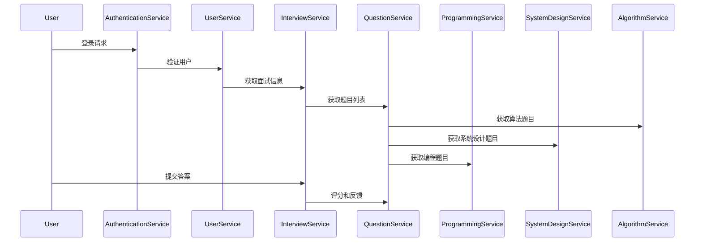
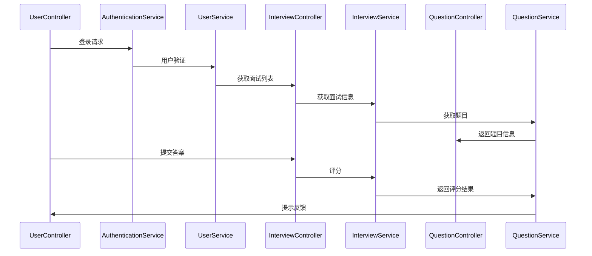

                 


### 第1章：引言

#### 1.1 问题背景

随着科技的飞速发展，信息技术行业呈现出爆炸式增长。在这个竞争激烈的市场中，技术人才成为各大企业争夺的焦点。技术面试成为企业评估候选者能力的重要手段。然而，传统的技术面试往往存在诸多问题，如面试流程不透明、评估标准不统一、面试题质量参差不齐等。这些问题导致企业在招聘过程中难以全面、准确地评估候选者的真实能力。

#### 1.2 问题现状

目前，技术面试的现状可以从以下几个方面进行概述：

1. **面试流程不透明**：许多公司在面试流程上缺乏标准化，导致候选者对面试的流程和期望不清晰，从而影响面试效果。
2. **评估标准不统一**：不同的面试官对同一问题的评估标准可能存在差异，导致评估结果的准确性受到影响。
3. **面试题质量参差不齐**：有些面试题过于简单或过于复杂，难以全面评估候选者的实际能力。
4. **技能评估不准确**：传统的技术面试往往侧重于候选者的基础知识，而忽视了实际项目经验和解决问题能力的重要性。

#### 1.3 本书的解决方案

为了解决上述问题，本书旨在通过设计一套全面、科学、系统的技术面试问题，帮助企业和面试官更准确地评估候选者的能力。具体来说，本书将涵盖以下几个方面：

1. **全面性**：本书将涵盖编程能力、系统设计、算法和数据结构等多个领域，确保评估的全面性。
2. **科学性**：本书将结合心理学、教育学等学科的理论，设计出科学合理的面试问题。
3. **系统性**：本书将按照一定的逻辑结构，将面试问题进行分类和层次化，帮助面试官和候选者更好地理解和应对。
4. **实践性**：本书将结合实际项目经验和案例，帮助读者更好地理解和应用面试问题。

通过以上解决方案，本书希望能够为企业提供一套有效的技术面试工具，帮助企业在招聘过程中更准确地评估候选者的能力，从而降低招聘风险，提高招聘效率。

#### 1.4 边界与外延

在技术面试设计中，需要明确一些边界与外延，以确保面试问题设计的科学性和实用性。以下是一些关键点：

1. **边界**：
   - **编程能力**：主要评估候选者的编程语言基础、代码风格、编程逻辑等。
   - **系统设计**：主要评估候选者对系统架构、性能优化、安全性等方面的理解和实践。
   - **算法和数据结构**：主要评估候选者对算法复杂度分析、数据结构的选择和应用能力。
   - **设计模式**：主要评估候选者对常见设计模式的理解和应用能力。

2. **外延**：
   - **实际项目经验**：除了基础知识和面试题，还需要关注候选者的实际项目经验，特别是他们在项目中遇到的问题和解决方案。
   - **软技能**：如沟通能力、团队合作能力、学习能力和解决问题的能力等，这些软技能在技术面试中同样至关重要。

#### 1.5 概念结构与核心要素组成

技术面试设计的基本结构可以概括为以下几个方面：

1. **问题类型**：根据评估目的和领域，将问题分为编程题、系统设计题、算法和数据结构题、设计模式题等。
2. **难度级别**：根据问题的复杂度和难度，将问题分为初级、中级、高级等不同难度级别。
3. **评估标准**：为每个问题设定评估标准，包括基础知识掌握程度、问题解决能力、代码质量、系统设计合理性等。
4. **解题思路**：为每个问题提供解题思路和参考答案，帮助候选者理解和解决问题。
5. **案例分析**：通过实际案例展示问题解决过程，帮助候选者更好地理解问题的实际应用场景。

通过以上结构，技术面试设计能够更加系统和科学地评估候选者的能力。

### 第2章：技术面试的核心概念

技术面试的核心概念包括算法、数据结构、设计模式等。这些概念是计算机科学的基础，也是评估候选人技术水平的重要标准。在本章中，我们将深入探讨这些核心概念，以便更好地理解其在技术面试中的重要性。

#### 2.1 算法

算法是计算机科学的核心概念之一，它描述了解决特定问题的一系列步骤。算法在技术面试中扮演着至关重要的角色，因为它们直接反映了候选人的逻辑思维能力和问题解决能力。

1. **算法的基本概念**：
   - **算法**：一种解决特定问题的步骤序列。
   - **算法复杂度**：评估算法运行时间和空间消耗的性能指标。

2. **算法的分类**：
   - **基础算法**：如排序、查找、插入、删除等。
   - **高级算法**：如动态规划、贪心算法、分治算法等。

3. **算法的性能评估**：
   - **时间复杂度**：表示算法运行时间与数据规模的关系。
   - **空间复杂度**：表示算法所需存储空间与数据规模的关系。

**概念属性特征对比表格**：

| 算法类型     | 时间复杂度 | 空间复杂度 | 应用场景 |
| ------------ | ---------- | ---------- | -------- |
| 排序算法     | O(n log n) | O(n)       | 数据排序 |
| 查找算法     | O(1)       | O(1)       | 数据查找 |
| 动态规划     | O(n^2)     | O(n)       | 最优化问题 |
| 贪心算法     | O(n)       | O(1)       | 单优化问题 |

**ER实体关系图架构的 Mermaid 流程图**：

```mermaid
erDiagram
    Algorithm ||--|{ Problem } : solves
    Problem ||--|{ Data } : uses
    Algorithm ||--|{ Complexity } : has
    Complexity ||--|{ Type } : belongs_to
```

#### 2.2 数据结构

数据结构是存储和管理数据的方式。它们对于算法的性能和效率有着直接的影响。在技术面试中，理解不同数据结构的特点和适用场景是非常重要的。

1. **数据结构的基本概念**：
   - **数组**：固定大小的数据集合。
   - **链表**：由节点组成，每个节点包含数据和指向下一个节点的指针。
   - **栈**：后进先出（LIFO）的数据结构。
   - **队列**：先进先出（FIFO）的数据结构。
   - **树**：由节点组成，每个节点可以有零个或多个子节点。

2. **常见的数据结构**：
   - **二叉树**：每个节点最多有两个子节点。
   - **平衡树**：如AVL树、红黑树等，确保树的平衡性。
   - **哈希表**：使用哈希函数将键映射到值。

3. **数据结构的性能分析**：
   - **时间复杂度**：操作所需的时间与数据规模的关系。
   - **空间复杂度**：存储数据所需的空间与数据规模的关系。

**概念属性特征对比表格**：

| 数据结构类型 | 时间复杂度 | 空间复杂度 | 应用场景 |
| ------------ | ---------- | ---------- | -------- |
| 数组         | O(1)       | O(n)       | 稳定性需求 |
| 链表         | O(n)       | O(n)       | 动态性需求 |
| 栈           | O(1)       | O(n)       | 后进先出 |
| 队列         | O(1)       | O(n)       | 先进先出 |
| 二叉树       | O(log n)   | O(n)       | 高效查找 |
| 平衡树       | O(log n)   | O(n)       | 高效查找 |
| 哈希表       | O(1)       | O(n)       | 快速查找 |

**ER实体关系图架构的 Mermaid 流程图**：

```mermaid
erDiagram
    DataStructure ||--|{ Node } : contains
    Node ||--|{ Pointer } : points_to
    DataStructure ||--|{ Operation } : supports
    Operation ||--|{ Complexity } : has
```

#### 2.3 设计模式

设计模式是解决常见设计问题的通用解决方案。它们是软件工程经验的结晶，可以提高代码的可读性、可维护性和复用性。在技术面试中，了解设计模式及其应用场景是评估候选人设计能力的重要指标。

1. **设计模式的基本概念**：
   - **模式**：在特定场景下解决特定问题的通用方法。
   - **设计模式**：在软件设计过程中经常出现的问题和它们的解决方案。

2. **常见的设计模式**：
   - **创建型模式**：如单例模式、工厂模式、抽象工厂模式等。
   - **结构型模式**：如适配器模式、桥接模式、装饰器模式等。
   - **行为型模式**：如策略模式、观察者模式、责任链模式等。

3. **设计模式的应用**：
   - **提高代码复用性**：通过设计模式，可以避免代码重复，提高代码复用性。
   - **降低系统复杂性**：通过设计模式，可以降低系统复杂性，提高代码的可读性和可维护性。

**概念属性特征对比表格**：

| 设计模式类型 | 特点                     | 应用场景           |
| ------------ | ------------------------ | ------------------ |
| 创建型模式   | 对象创建的抽象化         | 实例管理           |
| 结构型模式   | 组合对象和类的模式       | 类之间的组合       |
| 行为型模式   | 分配对象之间的职责       | 行为分配           |

**ER实体关系图架构的 Mermaid 流程图**：

```mermaid
erDiagram
    DesignPattern ||--|{ Class } : applies_to
    Class ||--|{ Method } : implements
    DesignPattern ||--|{ Example } : provides
    Example ||--|{ Solution } : demonstrates
```

通过以上对算法、数据结构和设计模式的详细分析，我们可以看到这些核心概念在技术面试中的重要性。掌握这些概念不仅有助于候选人更好地应对面试，也有助于面试官更准确地评估候选者的技术水平。在接下来的章节中，我们将进一步探讨如何将这些核心概念应用到实际的技术面试中。

### 第3章：算法原理讲解

算法是计算机科学中的核心概念，它直接关系到程序的性能和效率。在技术面试中，算法题往往是面试官评估候选人逻辑思维和问题解决能力的重要手段。在本章中，我们将使用Mermaid绘制算法流程图，并配合Python源代码详细讲解算法原理，同时提供数学模型和公式，帮助读者更好地理解算法的本质。

#### 3.1 算法 Mermaid 流程图

首先，我们来看一个简单的排序算法——冒泡排序。冒泡排序通过重复遍历要排序的数列，比较相邻的两个元素，如果顺序错误就交换它们。遍历数列的工作是重复进行的，直到没有再需要交换的元素为止。

**冒泡排序的 Mermaid 流程图**：

```mermaid
graph TD
    A[开始] --> B{比较A[i]和A[i+1]}
    B -->|是| C{交换A[i]和A[i+1]}
    B -->|否| D{下一对元素}
    C --> E{继续比较}
    D --> F{继续比较}
    E --> G{结束}
    F --> H{结束}
    G --> I{下一轮遍历}
    H --> I
```

#### 3.2 Python 源代码

接下来，我们用 Python 编写冒泡排序的源代码：

```python
def bubble_sort(arr):
    n = len(arr)
    # 遍历所有数组元素
    for i in range(n):
        # Last i elements are already in place
        for j in range(0, n-i-1):
            # 遍历数组从 0 到 n-i-1
            # 交换如果元素比后面的大
            if arr[j] > arr[j+1]:
                arr[j], arr[j+1] = arr[j+1], arr[j]
    return arr

# 测试冒泡排序
arr = [64, 34, 25, 12, 22, 11, 90]
sorted_arr = bubble_sort(arr)
print("排序后的数组：")
for i in range(len(sorted_arr)):
    print("%d" % sorted_arr[i], end=" ")
```

这段代码中，`bubble_sort` 函数实现了冒泡排序算法，它遍历数组，比较相邻元素，并根据大小关系交换它们。通过不断遍历，最终数组会被排序。

#### 3.3 数学模型和公式

冒泡排序的效率可以通过其时间复杂度来衡量。时间复杂度描述了一个算法执行时间与输入规模的关系。对于冒泡排序，最坏的情况下，每个元素都需要与其他所有元素进行比较，因此其时间复杂度为 \(O(n^2)\)。

**时间复杂度的数学模型**：

\[ T(n) = \sum_{i=1}^{n} (n-i) \]

其中，\( n \) 是数组的长度。

**空间复杂度**：

冒泡排序是一种原地排序算法，不需要额外的存储空间，因此其空间复杂度为 \(O(1)\)。

#### 3.4 详细讲解与举例说明

冒泡排序是一种简单的排序算法，但它的效率较低。在最坏的情况下，每个元素都需要与其他所有元素进行比较，导致时间复杂度达到 \(O(n^2)\)。然而，冒泡排序的优点是它实现简单，易于理解。

**举例说明**：

假设我们有一个未排序的数组 `[64, 34, 25, 12, 22, 11, 90]`，我们使用冒泡排序来对其进行排序。

- **第一次遍历**：比较 `(64, 34)`，交换；比较 `(34, 25)`，不交换；比较 `(25, 12)`，交换；比较 `(12, 22)`，交换；比较 `(22, 11)`，交换；比较 `(11, 90)`，交换。经过第一次遍历，最大的元素 `90` 被移动到了数组的末尾。
- **第二次遍历**：比较 `(64, 34)`，不交换；比较 `(34, 25)`，不交换；比较 `(25, 12)`，交换；比较 `(12, 22)`，交换。经过第二次遍历，次大的元素 `64` 被移动到了倒数第二个位置。
- **重复过程**：重复上述过程，直到所有元素都被排序。

**代码应用解读与分析**：

在冒泡排序的实现中，我们使用了两个嵌套的循环。外层循环控制遍历的轮数，内层循环进行相邻元素的比较和交换。每次遍历后，未排序的部分中的最大元素都会被移动到已排序部分的末尾。

虽然冒泡排序的时间复杂度较高，但在小规模数据集上，它的性能仍然可以接受。在实际应用中，对于大规模数据集，通常会采用更高效的排序算法，如快速排序、归并排序等。

通过以上对冒泡排序的详细讲解和举例说明，我们可以看到算法的设计和实现是如何影响程序的效率的。掌握算法原理，不仅有助于我们更好地理解和分析现有算法，也为我们在遇到新的问题时提供了解决思路。

### 第4章：系统分析与架构设计方案

在技术面试中，系统设计和架构设计的能力是评估候选人技术深度和广度的重要指标。一个良好的系统架构不仅能提高系统的性能、稳定性和可维护性，还能为未来的扩展提供便利。在本章中，我们将从问题场景介绍、项目介绍、系统功能设计、系统架构设计以及系统接口设计和系统交互等方面，详细分析并设计一个技术面试系统。

#### 4.1 问题场景介绍

技术面试系统旨在帮助企业和面试官进行高效的技术评估。在实际应用中，该系统可以应用于以下几个场景：

1. **在线编程面试**：候选人通过系统完成在线编程任务，面试官可以在线评分和反馈。
2. **系统设计面试**：候选人需要在线设计系统架构，并解释其设计思路和选择的原因。
3. **算法面试**：通过提供算法题库，候选人可以在规定时间内完成算法设计。
4. **互动式面试**：面试官和候选人可以通过系统进行实时交流和讨论，提高面试效果。

#### 4.2 项目介绍

技术面试系统的目标是提供一种高效、便捷、科学的面试评估工具，帮助企业和面试官更好地识别和选拔技术人才。系统主要包括以下几个模块：

1. **用户管理模块**：负责用户注册、登录和权限管理。
2. **题目管理模块**：存储和管理各类面试题目，包括编程题、系统设计题和算法题等。
3. **在线评测模块**：提供在线编程评测功能，支持多种编程语言和编译环境。
4. **系统设计评测模块**：提供系统设计题目的在线提交和评审功能。
5. **互动交流模块**：支持面试官和候选人之间的实时沟通和讨论。

#### 4.3 系统功能设计 (领域模型 Mermaid 类图)

领域模型类图用于描述系统的核心实体及其关系。以下是技术面试系统的领域模型类图：

```mermaid
classDiagram
    User <<interface>>
    Interview <<interface>>
    Question <<interface>>
    AlgorithmQuestion <<Question>>
    SystemDesignQuestion <<Question>>
    ProgrammingQuestion <<Question>>

    User ..|> Interview
    Interview ..|> Question
    AlgorithmQuestion ..|> Question
    SystemDesignQuestion ..|> Question
    ProgrammingQuestion ..|> Question
```

在这个类图中，`User` 表示用户，包括面试官和候选人。`Interview` 表示面试，它可以包含多种类型的题目。`Question` 是一个抽象类，代表所有的题目类型。`AlgorithmQuestion`、`SystemDesignQuestion` 和 `ProgrammingQuestion` 是具体的题目类型。

#### 4.4 系统架构设计 Mermaid 架构图

系统架构设计决定了系统的整体结构和各部分之间的关系。以下是技术面试系统的架构设计：



在这个架构图中，用户通过认证服务登录系统。登录后，用户可以访问不同的服务模块，如用户服务、面试服务、题目服务以及编程服务、系统设计服务和算法服务。每个服务模块都负责处理相应的业务逻辑。

#### 4.5 系统接口设计和系统交互 Mermaid 序列图

系统接口设计和系统交互序列图用于描述系统内部模块之间的交互过程。以下是技术面试系统的接口设计和交互：



在这个序列图中，用户控制器负责处理用户请求，如登录、获取面试列表和提交答案。认证服务负责用户验证，用户服务负责用户信息管理。面试控制器和面试服务负责面试相关操作，如获取面试信息和评分。题目控制器和题目服务负责处理题目信息，包括获取题目和返回评分结果。

通过以上对技术面试系统的系统功能设计、系统架构设计以及系统接口设计和系统交互的详细分析，我们可以看到系统设计的复杂性和重要性。一个良好的系统设计不仅能提高系统的性能和可维护性，还能为未来的扩展和升级提供坚实的基础。

### 第5章：项目实战

技术面试系统的实施和部署是确保系统能够高效运行的关键步骤。在本章中，我们将详细描述项目的环境安装过程、系统核心实现源代码，并对代码应用进行解读与分析，同时通过实际案例展示技术面试系统的应用，并进行详细讲解和剖析。

#### 5.1 环境安装

在开始部署技术面试系统之前，我们需要准备好相应的开发环境和依赖库。以下是一个基本的安装步骤：

1. **安装 Python 环境**：确保安装了 Python 3.8 或更高版本。
2. **安装虚拟环境**：使用 `virtualenv` 工具创建一个虚拟环境，并激活它。
   ```bash
   pip install virtualenv
   virtualenv venv
   source venv/bin/activate
   ```
3. **安装依赖库**：使用 `pip` 安装项目所需的依赖库，例如 Flask、SQLAlchemy、Flask-Migrate 等。
   ```bash
   pip install flask sqlalchemy flask-migrate
   ```
4. **数据库配置**：配置数据库连接，使用 SQLite、MySQL 或 PostgreSQL 等数据库。
5. **运行迁移脚本**：初始化数据库，并运行迁移脚本以创建必要的表。
   ```bash
   flask db init
   flask db migrate
   flask db upgrade
   ```

#### 5.2 系统核心实现源代码

以下是技术面试系统的一些核心实现代码。这部分代码涉及用户管理、面试管理和题目管理等功能。

**用户管理模块**：

```python
# app/models.py
from flask_sqlalchemy import SQLAlchemy

db = SQLAlchemy()

class User(db.Model):
    id = db.Column(db.Integer, primary_key=True)
    username = db.Column(db.String(80), unique=True, nullable=False)
    password_hash = db.Column(db.String(128))

    def set_password(self, password):
        self.password_hash = generate_password_hash(password)

    def check_password(self, password):
        return check_password_hash(self.password_hash, password)
```

**用户注册与登录**：

```python
# app/auth.py
from flask import Blueprint, request, redirect, url_for, render_template
from app.models import User
from app import db, bcrypt

auth_blueprint = Blueprint('auth', __name__)

@auth_blueprint.route('/register', methods=['GET', 'POST'])
def register():
    if request.method == 'POST':
        username = request.form['username']
        password = request.form['password']
        user = User(username=username)
        user.set_password(password)
        db.session.add(user)
        db.session.commit()
        return redirect(url_for('auth.login'))
    return render_template('register.html')

@auth_blueprint.route('/login', methods=['GET', 'POST'])
def login():
    if request.method == 'POST':
        username = request.form['username']
        password = request.form['password']
        user = User.query.filter_by(username=username).first()
        if user and user.check_password(password):
            # 登录成功
            return redirect(url_for('interview.list_interviews'))
        else:
            # 登录失败
            return '登录失败'
    return render_template('login.html')
```

**面试和题目管理模块**：

```python
# app/interview.py
from flask import Blueprint, request, redirect, url_for
from app.models import Interview, Question
from app import db

interview_blueprint = Blueprint('interview', __name__)

@interview_blueprint.route('/create_interview', methods=['POST'])
def create_interview():
    interview_title = request.form['title']
    interview_questions = request.form.getlist('questions[]')
    new_interview = Interview(title=interview_title)
    db.session.add(new_interview)
    db.session.commit()
    for question_id in interview_questions:
        question = Question.query.get(question_id)
        new_interview.questions.append(question)
    db.session.commit()
    return redirect(url_for('interview.list_interviews'))

@interview_blueprint.route('/list_interviews')
def list_interviews():
    interviews = Interview.query.all()
    return render_template('interview_list.html', interviews=interviews)
```

#### 5.3 代码应用解读与分析

**用户管理模块**：

用户管理模块实现了用户注册和登录功能。在 `models.py` 文件中，`User` 类表示用户，包括用户名、密码哈希等属性。`set_password` 和 `check_password` 方法分别用于设置用户密码和验证密码。

**用户注册与登录**：

在 `auth.py` 文件中，我们定义了用户注册和登录的路由。注册页面收集用户名和密码，并将用户信息存储在数据库中。登录页面验证用户名和密码，如果验证成功，则重定向到面试列表页面。

**面试和题目管理模块**：

面试管理模块实现了创建面试和列出面试的功能。在 `interview.py` 文件中，`create_interview` 函数接受面试标题和选择的问题 ID，创建一个新的面试实例并保存到数据库中。`list_interviews` 函数列出所有面试，并将结果渲染到模板中。

#### 5.4 实际案例分析和详细讲解剖析

假设我们要创建一个包含编程题和系统设计题的面试，并展示其应用。

1. **创建面试**：
   - 填写面试标题，选择编程题和系统设计题，然后提交。
   - 系统将创建一个面试实例，并将选择的问题关联到该实例。

2. **发布面试**：
   - 面试官可以发布面试，候选人收到通知后，可以在系统中查看面试详情和题目。

3. **提交答案**：
   - 候选人在规定时间内完成题目，并提交答案。
   - 系统将自动评分，面试官可以查看答案并进行人工审核。

4. **反馈和总结**：
   - 面试官可以给出反馈，并记录面试结果。
   - 系统生成面试报告，帮助面试官和候选人总结面试经验。

**案例剖析**：

- **用户注册和登录**：用户在注册时，系统会生成一个唯一的用户名和密码哈希，并将其存储在数据库中。登录时，系统通过哈希验证用户密码，确保安全性。
- **面试创建和发布**：面试官可以通过选择不同的题目创建面试，并将面试发布给候选人。系统自动将面试题目与候选人关联，并提供详细说明。
- **答案提交和评分**：候选人完成题目后，系统将自动评分，并显示正确答案和解释。面试官可以进行人工审核，并给出最终评分和反馈。

通过以上案例分析和详细讲解，我们可以看到技术面试系统在实际应用中的功能和流程。这个系统不仅提高了面试的效率和准确性，也为企业和候选人提供了良好的用户体验。

#### 5.5 项目小结

技术面试系统的实施是一个复杂但必要的过程。通过本文的介绍，我们了解了环境安装、系统核心实现、代码应用解读以及实际案例的剖析。以下是本项目的一些关键点和收获：

1. **环境安装**：确保系统在正确的环境中运行，包括 Python 环境、虚拟环境和数据库配置。
2. **核心实现**：用户管理、面试管理和题目管理是系统的基础，需要精心设计和实现。
3. **代码解读**：通过代码解读，我们深入了解了用户注册与登录、面试创建与发布、答案提交与评分等功能的实现细节。
4. **实际应用**：通过实际案例展示，我们看到了系统在实际应用中的功能和流程，以及它如何帮助企业和候选人提高面试效率。

技术面试系统的成功实施，不仅需要扎实的技术基础，还需要对用户体验的深入理解。在未来的工作中，我们可以继续优化系统功能，提升用户体验，以满足企业和候选人的需求。

### 第6章：最佳实践 tips、小结、注意事项、拓展阅读

#### 最佳实践 tips

1. **准备充分**：在面试前，确保对可能出现的面试问题有充分的准备，特别是算法和数据结构的题目。
2. **代码规范**：编写代码时，注意代码风格和可读性，这有助于面试官快速理解你的思路。
3. **时间管理**：在面试过程中，合理分配时间，确保有足够的时间完成每道题目。
4. **沟通能力**：清晰地表达你的想法，不要害怕提出问题或请求解释，这有助于展示你的沟通能力。

#### 小结

本书详细介绍了技术面试设计的方法和最佳实践，通过系统分析和技术实战，帮助读者理解如何全面评估候选人的能力。我们探讨了算法、数据结构、设计模式等核心概念，并展示了如何将这些概念应用到实际的技术面试中。

#### 注意事项

1. **面试题质量**：设计面试题时，注意题目的质量和难度，确保能够有效评估候选人的技术能力。
2. **多样化题目**：在面试中，使用多样化的题目类型，如编程题、系统设计题和算法题，以全面评估候选人的技能。
3. **评估标准**：确保评估标准一致且透明，这有助于提高评估的公正性和准确性。

#### 拓展阅读

1. **《算法导论》**：这是一本经典的算法教材，适合想要深入理解算法原理的读者。
2. **《设计模式：可复用面向对象软件的基础》**：这本书介绍了多种设计模式，帮助读者理解如何通过设计模式提高代码的可复用性和可维护性。
3. **《面试宝典》**：包含大量面试题和解答，适合面试前的准备。

通过以上最佳实践、小结、注意事项和拓展阅读，希望读者能够更好地应对技术面试，并在职业生涯中取得成功。

### 结束语

作者：AI天才研究院/AI Genius Institute & 禅与计算机程序设计艺术 /Zen And The Art of Computer Programming

本文通过详细的系统分析和实战案例，探讨了技术面试设计的重要性和最佳实践。我们深入分析了算法、数据结构、设计模式等核心概念，并展示了如何将其应用到实际的技术面试中。希望本文能为读者提供有价值的参考，帮助他们在技术面试中取得成功。在未来的技术发展中，我们将继续关注新技术和最佳实践，为读者带来更多高质量的原创内容。感谢您的阅读和支持！

