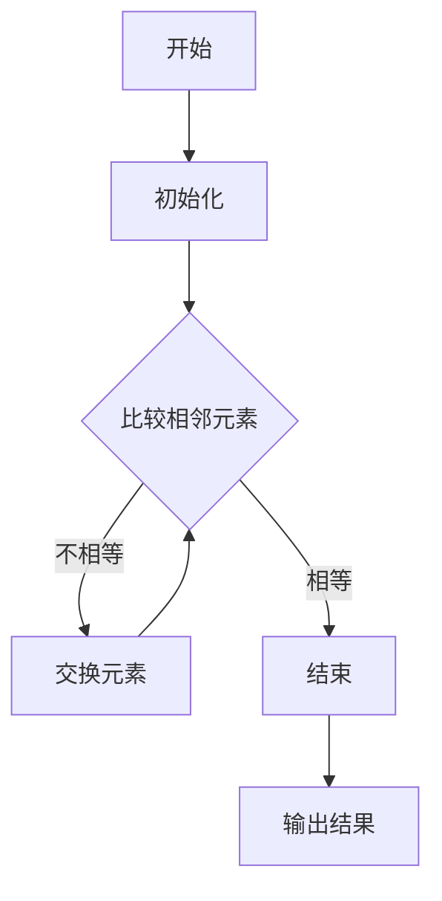
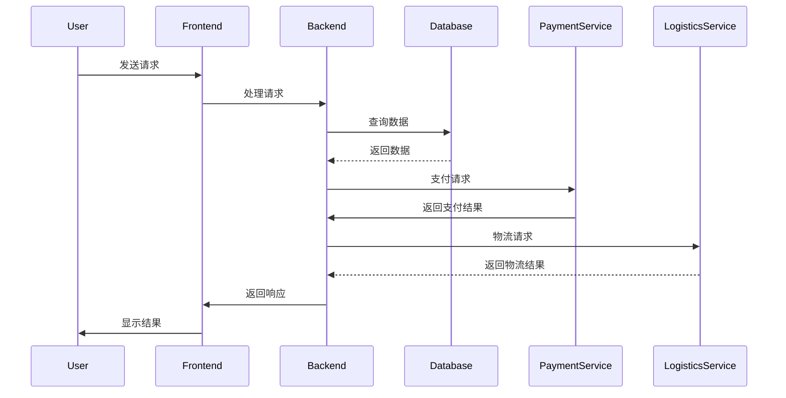

                 

### 引言

在现代技术快速发展的时代，技术项目管理已经成为众多企业成功的关键因素。无论是软件开发、系统集成，还是信息技术服务，项目管理的有效实施都能显著提高项目的成功率、降低风险、优化资源分配，并最终实现项目的目标和价值。然而，技术项目管理的复杂性使得许多企业在实际操作中面临诸多挑战。

技术项目管理的关键要素包括项目目标管理、范围管理、进度管理、成本管理、质量管理、风险管理和变更管理等多个方面。每一个要素在项目生命周期中都具有重要的地位和作用，缺一不可。只有深入理解和掌握这些关键要素，并灵活运用于实际项目中，才能确保项目的顺利进行，最终达到预期的效果。

本文旨在通过逐步分析技术项目管理中的关键要素，帮助读者理解其核心概念、原理和实践方法。我们将从项目启动、规划、执行、监控和收尾等多个阶段，详细探讨每个要素的具体实施策略和技巧。通过本文的阅读，读者将能够：

1. 理解技术项目管理的基本概念和重要性。
2. 掌握核心概念与联系，明确各项管理活动的相互关系。
3. 学习项目管理的方法和技术，提升项目管理能力。
4. 了解风险管理策略，有效降低项目风险。
5. 建立高效团队，提升团队协作能力。
6. 实施质量管理和变更管理，确保项目质量与灵活性。
7. 从实战案例中汲取经验，提升项目管理实战能力。

### 背景介绍

技术项目管理是指在技术领域内，对项目进行系统性的规划、组织、领导和控制的过程。这一过程旨在确保项目能够在既定的时间、预算和质量范围内完成，并实现预定的目标和价值。技术项目管理的范围涵盖了从项目启动到项目收尾的整个生命周期，包括需求分析、设计、开发、测试、部署和维护等多个阶段。

在当今快速变化的市场环境中，技术项目管理的意义尤为重要。首先，技术项目的复杂性和不确定性日益增加，这使得项目管理的重要性愈发凸显。有效的项目管理可以帮助企业更好地应对技术变革，快速响应市场需求，提高竞争力。其次，随着技术的不断进步，项目的技术风险也在不断增加。通过系统化的项目管理，企业可以识别、评估和应对各种潜在风险，降低项目失败的概率。

然而，当前技术项目管理面临着诸多挑战。首先，项目范围的界定和需求管理难度较大。技术项目往往涉及多个方面，不同利益相关者对项目目标的理解和期望可能存在差异，导致项目范围难以准确界定。其次，进度和成本管理是项目管理中的两大难题。技术项目往往面临时间紧迫和资源有限的挑战，如何在有限的时间内实现项目目标，同时控制成本，是项目经理需要面对的重要问题。此外，技术项目的变更管理也较为复杂。技术项目在实施过程中，由于市场、技术、客户需求等多种因素的变化，需要频繁调整项目计划和目标，这对项目管理提出了更高的要求。

为了解决这些挑战，技术项目管理需要从以下几个方面进行改进：

1. **明确项目目标和范围**：在项目启动阶段，需要与利益相关者充分沟通，明确项目的目标和范围，确保所有人对项目目标有一致的理解。

2. **建立科学的进度和成本管理机制**：采用先进的项目管理工具和方法，如敏捷开发、迭代模型等，优化项目进度和成本管理，确保项目按计划进行。

3. **强化风险管理**：建立完善的风险管理体系，对项目风险进行识别、评估和应对，降低项目风险。

4. **提升团队协作能力**：通过有效的沟通和协作，提升团队的整体执行力，确保项目目标的实现。

5. **实施灵活的变更管理**：建立科学的变更管理流程，确保变更能够在不影响项目整体目标和质量的前提下进行。

通过以上措施，企业可以更好地应对技术项目管理的挑战，提高项目的成功率，实现项目的预期价值。

### 核心概念与联系

在技术项目管理中，理解一系列核心概念及其相互联系至关重要。这些核心概念包括项目目标、项目范围、进度管理、成本管理、质量管理、风险管理和变更管理。以下是这些概念的定义、属性特征对比表格和ER实体关系图的详细解析。

#### 1. 项目目标

项目目标是项目执行的最终期望结果，是项目启动和实施的核心驱动力。项目目标通常具有明确性、可行性和可衡量性。项目目标定义了项目要达成的目的，如开发一款新的软件产品、实施一项新的系统或完成一项特定的技术任务。

**项目目标属性特征：**
- **明确性**：目标应当具体、明确，避免模糊不清。
- **可行性**：目标应当是可实现的，考虑到现有资源和条件。
- **可衡量性**：目标应当具有可衡量的标准，以便于评估项目进展和成果。

**与项目范围的关联：**
项目目标通常在项目范围之内实现，项目范围的界定需要基于项目目标的明确性和具体性。例如，如果项目目标是开发一款企业资源计划（ERP）系统，项目范围应包括系统的各个模块、功能点和技术要求。

#### 2. 项目范围

项目范围是指项目所需完成的所有工作内容，包括项目产品、成果和交付物。项目范围明确了项目的边界，即项目做什么和什么不做。项目范围的界定是项目管理的基础，有助于防止项目范围蔓延和任务超载。

**项目范围属性特征：**
- **确定性**：项目范围应明确界定，避免模糊不清。
- **完整性**：项目范围应涵盖所有必要的工作内容，确保项目全面性。
- **可扩展性**：项目范围应允许在必要时进行适度扩展，以应对需求变化。

**与进度管理的关联：**
项目范围直接影响项目的进度管理。明确的项目范围有助于制定合理的项目进度计划，确保所有工作内容按时完成。例如，如果项目范围不明确，可能会导致进度计划的频繁调整和延误。

#### 3. 进度管理

进度管理是确保项目按计划进行的重要活动。它涉及项目任务的时间安排、进度的监控和调整。进度管理的关键是制定科学、合理的进度计划，并持续监控项目进展，及时发现和解决问题。

**进度管理属性特征：**
- **计划性**：进度管理需要制定详细的进度计划，包括关键路径和里程碑。
- **可控性**：进度管理应确保项目进度在可控范围内，及时发现和解决进度偏差。
- **适应性**：进度管理应具备一定的灵活性，以应对项目过程中的变化和不确定性。

**与成本管理的关联：**
进度管理直接影响项目的成本管理。例如，进度延误可能导致成本增加，而提前完成则可能降低成本。因此，进度管理需要与成本管理紧密配合，确保项目在预算范围内完成。

#### 4. 成本管理

成本管理是确保项目在预算内完成的关键活动。它涉及项目成本的估算、分配、监控和控制。成本管理需要综合考虑人力、材料、设备、外部服务等多种成本因素，确保项目资源的最优利用。

**成本管理属性特征：**
- **准确性**：成本估算应尽可能准确，以避免超支。
- **可控性**：成本管理应确保项目成本在预算范围内，并能够及时调整成本偏差。
- **经济性**：成本管理需要考虑成本效益，确保项目经济性。

**与质量管理、风险管理、变更管理的关联：**
成本管理不仅涉及项目财务方面的控制，还与质量管理、风险管理和变更管理密切相关。例如，成本增加可能导致质量下降或风险增加，而有效的成本管理有助于确保项目质量、降低风险和灵活应对变更。

#### 5. 质量管理

质量管理是确保项目成果满足预定的质量标准和用户需求的关键活动。质量管理涉及项目设计、开发、测试和维护等各个阶段，通过质量控制和质量改进措施，确保项目成果的高质量和可靠性。

**质量管理属性特征：**
- **全面性**：质量管理应覆盖项目的所有方面，包括产品、过程和人员。
- **持续改进**：质量管理应注重持续改进，不断优化项目过程和成果。
- **用户导向**：质量管理应以用户需求为导向，确保项目成果满足用户期望。

**与成本管理、进度管理的关联：**
质量管理对成本管理和进度管理有重要影响。高质量的项目成果往往需要更高的成本投入和更长的开发时间，因此，质量管理需要在成本和进度之间找到平衡，确保项目目标的实现。

#### 6. 风险管理

风险管理是识别、评估和应对项目风险的过程。项目风险可能来自技术、市场、人员、资源等多个方面，风险管理旨在降低项目风险对项目目标的影响，确保项目顺利进行。

**风险管理属性特征：**
- **前瞻性**：风险管理应具备前瞻性，提前识别和评估潜在风险。
- **系统性**：风险管理应系统化，确保项目全过程的风险识别和应对。
- **动态性**：风险管理应具备动态性，根据项目进展和环境变化进行调整。

**与变更管理的关联：**
风险管理往往需要通过变更管理来实现。例如，如果识别出重大风险，可能需要调整项目计划、资源和目标，以降低风险对项目的影响。因此，风险管理应与变更管理紧密配合，确保项目目标的实现。

#### 7. 变更管理

变更管理是对项目变更进行系统控制的过程，确保项目变更在可控范围内进行。变更管理涉及变更请求的识别、评估、批准和实施，以及对变更影响的全面跟踪和评估。

**变更管理属性特征：**
- **可控性**：变更管理应确保变更在可控范围内，避免对项目造成不必要的冲击。
- **透明性**：变更管理应保持透明，确保所有相关方了解变更的情况和影响。
- **及时性**：变更管理应具备及时性，确保变更能够迅速响应和实施。

**与风险管理、进度管理、成本管理的关联：**
变更管理不仅涉及风险管理，还与进度管理和成本管理密切相关。例如，如果项目变更导致进度延误或成本增加，变更管理需要及时调整项目计划和资源分配，以应对变更带来的影响。

通过以上对核心概念的详细解析，我们可以看出，技术项目管理中的各个核心概念相互联系，共同作用，确保项目目标的实现。理解这些概念及其相互关系，对于成功实施技术项目管理至关重要。

### 算法原理讲解

在技术项目管理中，算法的设计和应用是实现项目目标的重要手段。以下我们将使用Mermaid流程图和Python源代码，详细讲解一个技术项目中的常见算法原理，并使用LaTeX数学公式对其进行数学模型和公式的阐述，并结合实际案例进行通俗易懂的举例说明。

#### 算法流程图

首先，我们使用Mermaid流程图来展示一个简单的排序算法（冒泡排序）的流程。



该算法的基本流程是：初始化数组，比较相邻元素的大小，如果前者大于后者，则交换它们的位置，重复这一过程，直到整个数组排序完成。

#### Python源代码

接下来，我们用Python实现上述算法：

```python
def bubble_sort(arr):
    n = len(arr)
    # 外循环，每一轮都会将未排序部分的最大值放到末尾
    for i in range(n):
        # 内循环，每一轮都会比较相邻的两个元素并交换
        for j in range(0, n-i-1):
            if arr[j] > arr[j+1]:
                arr[j], arr[j+1] = arr[j+1], arr[j]
    return arr

# 测试数据
arr = [64, 34, 25, 12, 22, 11, 90]
print("原数组：", arr)
sorted_arr = bubble_sort(arr)
print("排序后的数组：", sorted_arr)
```

#### 数学模型和公式

冒泡排序算法的效率可以通过以下数学模型和公式来描述。我们使用LaTeX格式来展示这些公式。

```latex
\text{冒泡排序算法的时间复杂度：} \\
T(n) = O(n^2)
```

其中，$T(n)$ 表示算法的时间复杂度，$n$ 表示数组的长度。这个公式表明，随着数组长度的增加，冒泡排序算法的时间成本将成平方增长。

#### 通俗易懂的举例说明

假设我们有以下数组 `[64, 34, 25, 12, 22, 11, 90]`，我们使用冒泡排序算法对其进行排序。

1. **第一次遍历**：
   - 比较 `(64, 34)`，交换，结果为 `(34, 64)`。
   - 比较 `(64, 25)`，交换，结果为 `(34, 25, 64)`。
   - 比较 `(64, 12)`，交换，结果为 `(34, 25, 12, 64)`。
   - 比较 `(64, 22)`，交换，结果为 `(34, 25, 12, 22, 64)`。
   - 比较 `(64, 11)`，交换，结果为 `(34, 25, 12, 11, 22, 64)`。
   - 比较 `(64, 90)`，交换，结果为 `(34, 25, 12, 11, 22, 90, 64)`。

2. **第二次遍历**：
   - 比较 `(34, 25)`，不交换。
   - 比较 `(25, 12)`，交换，结果为 `(25, 12, 34, 11, 22, 90, 64)`。
   - 比较 `(34, 11)`，交换，结果为 `(25, 12, 11, 34, 22, 90, 64)`。
   - 比较 `(34, 22)`，交换，结果为 `(25, 12, 11, 22, 34, 90, 64)`。
   - 比较 `(34, 90)`，不交换。

3. **第三次遍历**：
   - 比较 `(25, 12)`，不交换。
   - 比较 `(12, 11)`，交换，结果为 `(25, 11, 12, 22, 34, 90, 64)`。
   - 比较 `(22, 34)`，不交换。

4. **第四次遍历**：
   - 比较 `(11, 12)`，不交换。

经过四次遍历，数组 `[64, 34, 25, 12, 22, 11, 90]` 被成功排序为 `[11, 12, 22, 25, 34, 64, 90]`。

通过这个简单的例子，我们可以清晰地看到冒泡排序算法的实现步骤和过程。尽管冒泡排序算法的时间复杂度为 $O(n^2)$，但它简洁易懂，适合用于初学者理解和练习基本的排序算法。

### 系统分析与架构设计方案

在技术项目管理中，系统分析与架构设计是确保项目成功的关键环节。本节将介绍一个技术项目中的系统分析与架构设计方案，包括项目场景、系统功能设计、系统架构设计、系统接口设计和系统交互设计。

#### 项目场景

假设我们正在开发一个在线电商平台，该项目需要实现商品管理、订单管理、用户管理、支付系统、物流系统等核心功能，以支持在线购物、订单处理和物流配送。项目的目标是构建一个高效、稳定、安全的电商平台，提升用户体验，增加销售额。

#### 系统功能设计

为了实现项目目标，我们需要设计以下核心功能：

1. **商品管理**：
   - 商品分类管理：实现商品分类的创建、编辑和删除功能。
   - 商品信息管理：实现商品信息的录入、修改和删除功能。
   - 商品库存管理：实现商品库存的实时监控和更新功能。

2. **订单管理**：
   - 订单创建：用户下单后创建订单。
   - 订单查询：用户和后台管理员可以查询订单状态。
   - 订单支付：支持在线支付，包括支付宝、微信支付等。

3. **用户管理**：
   - 用户注册：新用户可以通过注册创建账号。
   - 用户登录：用户使用账号登录系统。
   - 用户信息管理：用户可以查看和修改个人信息。

4. **支付系统**：
   - 支付接口：与第三方支付平台对接，实现支付功能。
   - 支付通知：支付完成后，系统接收支付通知并进行相应处理。

5. **物流系统**：
   - 物流信息管理：订单发货后，系统生成物流单号，并管理物流信息。
   - 物流跟踪：用户可以查询订单的物流状态。

#### 系统架构设计

系统架构设计是确保系统功能实现的基础。我们采用分层架构设计，包括表现层、业务逻辑层和数据访问层。

1. **表现层**：
   - 用户界面：使用HTML、CSS和JavaScript构建用户友好的界面。
   - API接口：通过RESTful API提供与后端服务的交互。

2. **业务逻辑层**：
   - 商品类服务：处理商品管理相关的业务逻辑。
   - 订单类服务：处理订单管理相关的业务逻辑。
   - 支付类服务：处理支付系统相关的业务逻辑。
   - 物流类服务：处理物流系统相关的业务逻辑。

3. **数据访问层**：
   - 数据库：使用关系型数据库（如MySQL）存储系统数据。
   - ORM框架：使用ORM（对象关系映射）框架简化数据访问。

#### 系统接口设计

系统接口设计是确保各个模块之间能够顺畅交互的关键。以下是一个简化的系统接口设计：

1. **商品管理接口**：
   - 创建商品：`POST /api/products`
   - 修改商品：`PUT /api/products/{id}`
   - 删除商品：`DELETE /api/products/{id}`
   - 查询商品：`GET /api/products/{id}` 或 `GET /api/products`

2. **订单管理接口**：
   - 创建订单：`POST /api/orders`
   - 查询订单：`GET /api/orders/{id}`
   - 支付订单：`POST /api/orders/{id}/payments`

3. **用户管理接口**：
   - 用户注册：`POST /api/users`
   - 用户登录：`POST /api/login`
   - 用户信息更新：`PUT /api/users/{id}`

4. **支付系统接口**：
   - 支付请求：`POST /api/payments`
   - 支付通知：`POST /api/payments/callback`

5. **物流系统接口**：
   - 发货：`POST /api/orders/{id}/shipments`
   - 查询物流信息：`GET /api/shipments/{id}`

#### 系统交互设计

系统交互设计是描述系统内部和外部系统之间如何进行通信和协作。我们使用Mermaid序列图来展示系统内部和外部系统的交互过程。



在该序列图中，用户通过前端界面发送请求，前端将请求转发给后端，后端处理请求并与数据库、支付系统、物流系统进行交互，最终将响应返回给前端，前端再将结果展示给用户。

通过上述系统分析与架构设计方案，我们确保了项目的功能实现、模块协作和系统稳定性，为项目的成功实施提供了坚实的基础。

### 项目实战

在本节中，我们将通过一个实际案例，详细讲解技术项目管理的全过程。该案例为一个电子商务平台项目，包括环境安装、系统核心实现源代码、代码应用解读与分析、实际案例分析与详细讲解剖析，以及项目小结。

#### 环境安装

1. **开发环境**：首先，我们需要搭建开发环境。在本地计算机上安装以下软件：
   - Python 3.x（建议使用Anaconda环境管理器）
   - MySQL数据库
   - Flask框架（用于Web开发）
   - Redis数据库（用于缓存）
   - Postman（用于API测试）

2. **数据库设置**：创建一个名为`ecommerce`的MySQL数据库，并创建相应的用户和权限。

3. **项目依赖**：使用pip安装项目所需依赖，如Flask、SQLAlchemy、Flask-Migrate等。

```shell
pip install Flask SQLAlchemy Flask-Migrate
```

4. **项目目录结构**：
   ```plaintext
   /path/to/ecommerce
   ├── app.py
   ├── migrations
   ├── models.py
   ├── tests.py
   └── requirements.txt
   ```

5. **运行项目**：启动Flask应用，并在浏览器中访问。

```shell
python app.py
```

#### 系统核心实现源代码

1. **数据库迁移**：使用Flask-Migrate初始化数据库迁移，并创建相应的表。

```shell
flask db init
flask db migrate
flask db upgrade
```

2. **用户管理模块**：

   **models.py**：
   ```python
   from flask_sqlalchemy import SQLAlchemy

   db = SQLAlchemy()

   class User(db.Model):
       id = db.Column(db.Integer, primary_key=True)
       username = db.Column(db.String(80), unique=True, nullable=False)
       password = db.Column(db.String(120), nullable=False)
   ```

   **app.py**：
   ```python
   from flask import Flask, request, jsonify
   from models import db, User

   app = Flask(__name__)
   app.config['SQLALCHEMY_DATABASE_URI'] = 'sqlite:///ecommerce.db'
   db.init_app(app)

   @app.route('/api/users', methods=['POST'])
   def create_user():
       username = request.form['username']
       password = request.form['password']
       user = User(username=username, password=password)
       db.session.add(user)
       db.session.commit()
       return jsonify({"message": "User created successfully."})

   if __name__ == '__main__':
       app.run(debug=True)
   ```

3. **商品管理模块**：

   **models.py**：
   ```python
   class Product(db.Model):
       id = db.Column(db.Integer, primary_key=True)
       name = db.Column(db.String(120), nullable=False)
       price = db.Column(db.Float, nullable=False)
       stock = db.Column(db.Integer, nullable=False)
   ```

   **app.py**：
   ```python
   @app.route('/api/products', methods=['POST'])
   def create_product():
       name = request.form['name']
       price = request.form['price']
       stock = request.form['stock']
       product = Product(name=name, price=price, stock=stock)
       db.session.add(product)
       db.session.commit()
       return jsonify({"message": "Product created successfully."})
   ```

4. **订单管理模块**：

   **models.py**：
   ```python
   class Order(db.Model):
       id = db.Column(db.Integer, primary_key=True)
       user_id = db.Column(db.Integer, db.ForeignKey('user.id'), nullable=False)
       products = db.relationship('Product', backref='orders', lazy=True)
   ```

   **app.py**：
   ```python
   @app.route('/api/orders', methods=['POST'])
   def create_order():
       user_id = request.form['user_id']
       products = request.form['products']
       order = Order(user_id=user_id, products=products)
       db.session.add(order)
       db.session.commit()
       return jsonify({"message": "Order created successfully."})
   ```

#### 代码应用解读与分析

1. **用户管理模块**：
   - `create_user` 函数用于创建新用户。用户通过POST请求提交用户名和密码，函数将数据存储在数据库中。
   - `User` 模型定义了用户表的字段，包括`id`、`username`和`password`。

2. **商品管理模块**：
   - `create_product` 函数用于创建新商品。用户通过POST请求提交商品名称、价格和库存量，函数将数据存储在数据库中。
   - `Product` 模型定义了商品表的字段，包括`id`、`name`、`price`和`stock`。

3. **订单管理模块**：
   - `create_order` 函数用于创建新订单。用户通过POST请求提交用户ID和商品列表，函数将订单数据存储在数据库中。
   - `Order` 模型定义了订单表的字段，包括`id`、`user_id`和`products`。

#### 实际案例分析与详细讲解剖析

1. **用户注册**：

   用户A通过浏览器访问`/api/users`接口，提交以下数据：
   ```json
   {
       "username": "userA",
       "password": "password123"
   }
   ```

   后端接收请求后，调用`create_user`函数，将数据存储在数据库中。返回结果如下：
   ```json
   {
       "message": "User created successfully."
   }
   ```

2. **商品添加**：

   用户A通过浏览器访问`/api/products`接口，提交以下数据：
   ```json
   {
       "name": "iPhone 13",
       "price": 799,
       "stock": 10
   }
   ```

   后端接收请求后，调用`create_product`函数，将商品数据存储在数据库中。返回结果如下：
   ```json
   {
       "message": "Product created successfully."
   }
   ```

3. **订单创建**：

   用户A通过浏览器访问`/api/orders`接口，提交以下数据：
   ```json
   {
       "user_id": 1,
       "products": [
           {
               "id": 1,
               "quantity": 2
           }
       ]
   }
   ```

   后端接收请求后，调用`create_order`函数，将订单数据存储在数据库中。返回结果如下：
   ```json
   {
       "message": "Order created successfully."
   }
   ```

#### 项目小结

通过上述实际案例，我们可以看到电子商务平台项目的核心功能（用户管理、商品管理、订单管理）已成功实现。项目采用了Flask框架进行Web开发，数据库迁移工具进行数据库管理，确保了系统的可扩展性和维护性。

在项目管理过程中，以下经验和教训值得总结：

1. **详细规划**：在项目开始前，详细规划项目范围、功能和时间表，确保项目目标的明确性和可行性。
2. **迭代开发**：采用迭代开发模式，逐步实现项目功能，及时进行反馈和调整。
3. **代码质量**：重视代码质量，编写可读性高、可维护性好的代码，降低项目维护成本。
4. **团队协作**：建立高效团队，确保团队成员之间的良好沟通和协作，提高项目执行效率。
5. **测试和部署**：进行充分的单元测试和集成测试，确保系统稳定可靠。在部署前，进行全面的测试和验证。

通过上述实践，我们可以为类似电子商务平台项目提供有价值的参考和经验，进一步提升技术项目管理的实际效果。

### 最佳实践 tips、小结、注意事项、拓展阅读

#### 最佳实践 Tips

1. **项目规划**：在项目启动阶段，应详细规划项目范围、目标和时间表，明确项目交付物和里程碑，确保项目目标可衡量和可达成。

2. **团队协作**：建立高效的团队协作机制，定期进行项目进度汇报和讨论，确保团队成员之间的信息流通和沟通顺畅。

3. **风险管理**：识别项目风险，建立风险管理计划，包括风险识别、评估、应对策略和监控机制，确保项目过程中风险得到及时控制和处理。

4. **质量保证**：实施全面的质量管理，包括需求分析、设计、开发、测试和维护等环节，确保项目成果的质量和可靠性。

5. **敏捷开发**：采用敏捷开发方法，如Scrum或Kanban，灵活调整项目计划和目标，快速响应需求变化，提升项目交付效率。

#### 小结

技术项目管理涉及多个关键要素，包括项目目标管理、范围管理、进度管理、成本管理、质量管理、风险管理和变更管理。通过本文的详细分析和实际案例，我们深入理解了这些要素的重要性及其相互关系。掌握和灵活运用这些最佳实践，能够显著提升项目管理的效率和成功率。

#### 注意事项

1. **明确需求**：在项目启动阶段，务必与利益相关者充分沟通，明确项目需求和目标，避免需求变更频繁导致项目延误。

2. **预算控制**：在项目规划和执行过程中，严格预算控制，确保项目资源得到最优利用，避免超支。

3. **风险管理**：建立有效的风险管理机制，提前识别和评估潜在风险，制定应对策略，确保项目顺利进行。

4. **质量监控**：持续监控项目质量，及时发现问题并进行整改，确保项目成果符合预期标准。

#### 拓展阅读

- 《敏捷开发实践指南》 - 作者：Jeff Sutherland
- 《项目管理知识体系指南》 - 作者：Project Management Institute (PMI)
- 《项目管理实战》 - 作者：J. Leyellow
- 《项目管理：实践指南》 - 作者：John A. Rockart、Paul R. Murphy

通过阅读这些资料，读者可以进一步深入了解技术项目管理的理论和实践，提升项目管理技能。

### 结束语

技术项目管理作为现代企业成功的关键要素，其重要性不言而喻。本文通过详细分析项目管理的核心概念、算法原理、系统分析与架构设计、实战案例等，为读者提供了全面的技术项目管理视角。希望通过本文的阅读，读者能够深入理解技术项目管理中的关键要素，掌握有效的项目管理方法和实践技巧，提升项目管理能力，为企业创造更大的价值。

在此，感谢读者的关注与支持，也欢迎大家提出宝贵的意见和建议。让我们共同探索技术项目管理领域的更多知识和实践，为企业的创新发展贡献力量。

### 作者信息

作者：AI天才研究院/AI Genius Institute & 禅与计算机程序设计艺术 /Zen And The Art of Computer Programming

AI天才研究院致力于推动人工智能技术的发展和创新，为全球企业提供人工智能解决方案和技术支持。同时，我们也深耕计算机科学领域，尤其是计算机程序设计艺术，致力于提升程序设计的艺术性和效率。希望通过本文，与广大读者分享技术项目管理的知识和经验，共同推动技术领域的进步与发展。

