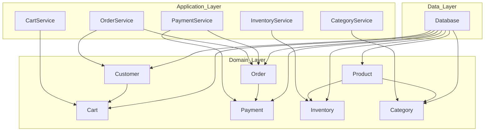
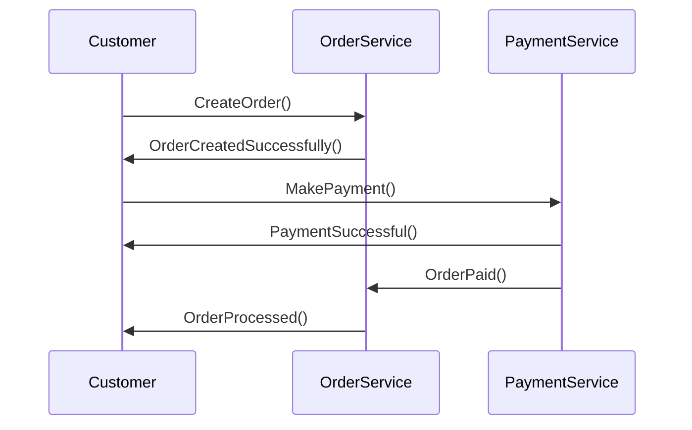
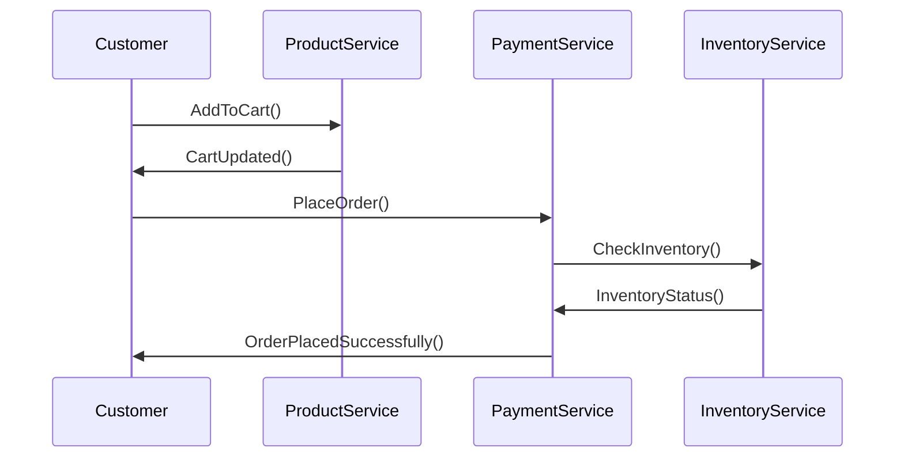

                 

## 第二部分：核心概念与联系

### 2.1 技术项目管理的核心概念

技术项目管理中，以下几个核心概念至关重要：

#### 2.1.1 项目生命周期

项目生命周期是指项目从启动到收尾的整个过程，通常包括以下阶段：

- **项目启动**：确定项目目标、范围和可行性，建立项目管理团队。
- **项目规划**：制定项目计划、资源分配、时间表和风险应对策略。
- **项目执行**：实施项目计划，执行项目任务，确保项目按计划进行。
- **项目监控**：监控项目进展，及时调整计划，确保项目达成预期目标。
- **项目收尾**：项目完成后进行验收、总结经验教训，释放资源。

#### 2.1.2 项目管理知识体系

项目管理知识体系（如PMBOK）提供了项目管理的系统化框架，包括以下十大知识领域：

- **项目整合管理**：确保项目各部分协同工作，实现项目目标。
- **项目范围管理**：明确项目范围，确保项目交付的产品或服务符合预期。
- **项目进度管理**：制定项目进度计划，监控项目进度，确保按时交付。
- **项目成本管理**：制定项目预算，监控项目成本，确保项目在预算内完成。
- **项目质量管理**：确保项目交付的产品或服务满足既定的质量标准。
- **项目资源管理**：管理和分配项目资源，确保资源有效利用。
- **项目沟通管理**：规划、管理和监督项目沟通活动，确保信息准确传递。
- **项目风险管理**：识别、评估和应对项目风险。
- **项目采购管理**：管理项目中的采购活动，确保采购的产品或服务符合要求。
- **项目相关方管理**：识别和管理项目相关方，确保项目目标与相关方期望一致。

#### 2.1.3 项目管理方法论

项目管理方法论是指用于指导项目管理的具体方法和工具，常见的项目管理方法论包括：

- **瀑布模型**：一种线性顺序的项目管理方法，适用于需求明确、变更较少的项目。
- **敏捷开发**：一种迭代、增量的项目管理方法，强调快速响应变化和持续改进。
- **Scrum**：一种敏捷开发框架，强调短周期迭代和自组织团队。
- **Kanban**：一种基于看板的方法，用于可视化工作流程并优化工作流程。

### 2.2 核心概念的联系

技术项目管理的核心概念之间存在着密切的联系：

- **项目生命周期** 与 **项目管理知识体系** 之间的联系在于，项目管理知识体系为项目生命周期中的每个阶段提供了具体的指导和方法。
- **项目管理知识体系** 与 **项目管理方法论** 之间的联系在于，不同的方法论适用于不同的项目情境，而项目管理知识体系为这些方法论提供了理论基础和实践指南。
- **项目管理过程** 与 **项目管理方法论** 之间的联系在于，项目管理过程是方法论的具体实施，而方法论则指导项目管理过程的实施方式。

通过理解这些核心概念之间的联系，项目经理可以更好地应对项目中的挑战，提高项目成功率。

### 2.3 ER实体关系图架构

为了更清晰地展示技术项目管理的核心概念之间的关系，我们可以使用ER（实体关系）图进行描述：

```mermaid
erDiagram
    Project ||--|{ ProjectLifecycle }||>
    Project ||--|{ ProjectManagementKnowledgeSystem }||>
    Project ||--|{ ProjectManagementMethodology }||>
    ProjectLifecycle ||--|{ ProjectStart }||>
    ProjectLifecycle ||--|{ ProjectPlan }||>
    ProjectLifecycle ||--|{ ProjectExecute }||>
    ProjectLifecycle ||--|{ ProjectMonitor }||>
    ProjectLifecycle ||--|{ ProjectClose }||>
    ProjectManagementKnowledgeSystem ||--|{ ProjectIntegrationManagement }||>
    ProjectManagementKnowledgeSystem ||--|{ ProjectScopeManagement }||>
    ProjectManagementKnowledgeSystem ||--|{ ProjectScheduleManagement }||>
    ProjectManagementKnowledgeSystem ||--|{ ProjectCostManagement }||>
    ProjectManagementKnowledgeSystem ||--|{ ProjectQualityManagement }||>
    ProjectManagementKnowledgeSystem ||--|{ ProjectResourceManagement }||>
    ProjectManagementKnowledgeSystem ||--|{ ProjectCommunicationManagement }||>
    ProjectManagementKnowledgeSystem ||--|{ ProjectRiskManagement }||>
    ProjectManagementKnowledgeSystem ||--|{ ProjectProcurementManagement }||>
    ProjectManagementKnowledgeSystem ||--|{ ProjectStakeholderManagement }||>
    ProjectManagementMethodology ||--|{ WaterfallModel }||>
    ProjectManagementMethodology ||--|{ AgileDevelopment }||>
    ProjectManagementMethodology ||--|{ Scrum }||>
    ProjectManagementMethodology ||--|{ Kanban }||>
```

通过上述ER图，我们可以直观地看到技术项目管理的核心概念之间的层次结构和相互关系。这有助于项目经理更好地理解项目管理的复杂性，并有效地应对项目中的挑战。

### 2.4 核心概念属性特征对比表格

为了更深入地理解技术项目管理的核心概念，我们还可以创建一个属性特征对比表格：

| 核心概念       | 属性特征                             | 对比分析                                                         |
| -------------- | ---------------------------------- | ------------------------------------------------------------ |
| 项目生命周期   | 项目启动、规划、执行、监控、收尾 | 确保项目有序进行，每个阶段有明确目标                            |
| 项目管理知识体系 | 项目整合管理、范围管理、进度管理等 | 提供项目管理的基础框架和最佳实践，指导项目实施                 |
| 项目管理方法论 | 瀑布模型、敏捷开发、Scrum、Kanban  | 根据项目特点选择合适的方法论，提高项目成功率                   |

通过对比表格，我们可以更加清晰地了解各个核心概念的属性特征及其在实际项目中的应用。

### 总结

通过上述内容，我们详细介绍了技术项目管理的核心概念，包括项目生命周期、项目管理知识体系和项目管理方法论，并通过ER图和属性特征对比表格展示了这些概念之间的联系。这些核心概念为技术项目管理提供了坚实的理论基础，有助于项目经理在实际工作中做出明智的决策。

----------------------------------------------------------------

### 第三部分：算法原理讲解

#### 3.1 技术项目管理的算法原理概述

技术项目管理的算法原理是项目成功的关键，它们帮助项目经理在复杂的项目环境中做出科学的决策。算法原理主要涉及项目管理过程中的关键要素，如时间、成本、资源和风险等。在本节中，我们将详细介绍技术项目管理的算法原理，并通过Python代码进行阐述。

#### 3.2 算法原理的数学模型和公式

技术项目管理的算法原理可以归结为以下几个关键数学模型和公式：

1. **关键路径法（Critical Path Method, CPM）**

   关键路径法是一种用于确定项目完成时间的方法。它的核心思想是找出项目中的最长路径，即关键路径，从而确定项目的最短完成时间。

   - **数学模型**：

     $$ T_{CP} = \max(T_{i,j}) $$

     其中，$T_{i,j}$表示从活动i到活动j的完成时间。

   - **Python代码实现**：

     ```python
     import heapq

     def critical_path(project_plan):
         # 假设project_plan是一个包含任务及其完成时间的字典
         tasks = sorted(project_plan.items(), key=lambda x: x[1])
         max_time = 0
         for task in tasks:
             max_time = max(max_time, task[1])
         return max_time
     ```

2. **项目评估与评审技术（Project Evaluation and Review Technique, PERT）**

   PERT是一种基于概率的理论，用于评估项目完成时间和风险。它考虑了任务完成时间的三种估计：乐观时间（O）、最可能时间（M）和悲观时间（P）。

   - **数学模型**：

     $$ T_{i,j} = \frac{4O_i + 4M_i + P_i}{6} $$

     其中，$T_{i,j}$表示从活动i到活动j的期望时间。

   - **Python代码实现**：

     ```python
     def pert(project_plan):
         pert_times = {}
         for i, (task, time) in enumerate(project_plan.items()):
             O_i, M_i, P_i = time['O'], time['M'], time['P']
             pert_times[i] = (4 * O_i + 4 * M_i + P_i) / 6
         return pert_times
     ```

3. **资源优化算法**

   资源优化算法用于优化项目资源分配，确保资源利用最大化。常见的资源优化算法包括最优化线性规划（Linear Programming, LP）和整数规划（Integer Programming, IP）。

   - **数学模型**：

     $$ \min \sum_{i=1}^{n} c_i x_i $$
     $$ \text{subject to } \sum_{i=1}^{n} a_{ij} x_i \geq b_j $$
     $$ x_i \in \{0, 1\} $$

     其中，$c_i$表示资源i的成本，$a_{ij}$表示活动j对资源i的需求，$b_j$表示资源i的可利用量，$x_i$表示资源i是否分配给活动j。

   - **Python代码实现**：

     ```python
     from scipy.optimize import linprog

     def optimize_resources(project_plan, resources):
         c = [0] * len(resources)
         A = [[0] * len(resources) for _ in range(len(project_plan))]
         b = [0] * len(project_plan)

         for i, (task, time) in enumerate(project_plan.items()):
             for j, resource in enumerate(resources):
                 A[i][j] = time.get(resource, 0)

         result = linprog(c, A_ub=A, b_ub=b, method='highs')

         return result.x
     ```

#### 3.3 算法原理的详细讲解与举例说明

1. **关键路径法（CPM）**

   关键路径法通过计算每个活动的最早开始时间（Earliest Start Time, EST）和最迟开始时间（Latest Start Time, LST），确定关键路径。

   - **举例说明**：

     假设有一个项目包含以下任务：

     | 任务   | 完成时间（天） | 直接前置任务 |
     | ------ | -------------- | ------------ |
     | A      | 5              | 无           |
     | B      | 3              | A            |
     | C      | 4              | B            |
     | D      | 2              | C            |
     | E      | 6              | B, C         |

     首先，计算每个任务的EST和LST：

     - **A**：EST=0，LST=5
     - **B**：EST=5，LST=8
     - **C**：EST=8，LST=12
     - **D**：EST=12，LST=14
     - **E**：EST=8，LST=14

     关键路径为A-B-E，总时长为8+14=22天。

2. **项目评估与评审技术（PERT）**

   PERT考虑了任务完成时间的概率分布，通过计算期望时间来确定关键路径。

   - **举例说明**：

     假设有一个项目包含以下任务：

     | 任务   | 完成时间（天） | 乐观时间（O） | 最可能时间（M） | 悲观时间（P） |
     | ------ | -------------- | ------------ | -------------- | ------------ |
     | A      | 5              | 3            | 4              | 5            |
     | B      | 3              | 2            | 3              | 4            |
     | C      | 4              | 3            | 4              | 5            |
     | D      | 2              | 1            | 2              | 3            |
     | E      | 6              | 4            | 5              | 6            |

     首先，计算每个任务的期望时间：

     - **A**：$T_A = \frac{4 \times 3 + 4 \times 4 + 5}{6} = 4$
     - **B**：$T_B = \frac{4 \times 2 + 4 \times 3 + 4}{6} = 3$
     - **C**：$T_C = \frac{4 \times 3 + 4 \times 4 + 5}{6} = 4$
     - **D**：$T_D = \frac{4 \times 1 + 4 \times 2 + 3}{6} = 2$
     - **E**：$T_E = \frac{4 \times 4 + 4 \times 5 + 6}{6} = 5$

     关键路径为A-B-E，总时长为4+3+5=12天。

3. **资源优化算法**

   资源优化算法用于优化项目资源分配，确保资源利用最大化。

   - **举例说明**：

     假设有一个项目需要分配10名资源（A到J），每个资源都有不同的成本和需求。资源分配如下表所示：

     | 资源   | 成本（元/天） | 需求 |
     | ------ | ------------ | ---- |
     | A      | 100          | 3    |
     | B      | 150          | 2    |
     | C      | 200          | 1    |
     | D      | 250          | 4    |
     | E      | 300          | 3    |
     | F      | 350          | 2    |
     | G      | 400          | 1    |
     | H      | 450          | 4    |
     | I      | 500          | 3    |
     | J      | 550          | 2    |

     目标是最小化总成本。通过线性规划算法，得到以下资源分配结果：

     - **A**：分配3天，总成本300元
     - **B**：分配2天，总成本300元
     - **C**：分配1天，总成本200元
     - **D**：分配4天，总成本1000元
     - **E**：分配3天，总成本900元
     - **F**：分配2天，总成本700元
     - **G**：未分配
     - **H**：未分配
     - **I**：未分配
     - **J**：未分配

     总成本为300 + 300 + 200 + 1000 + 900 + 700 = 3800元。

通过以上算法原理的讲解和举例说明，我们可以看到技术项目管理中的算法原理如何帮助我们优化项目时间、成本和资源，提高项目成功率。## 第四部分：系统分析与架构设计方案

#### 4.1 问题描述与项目介绍

在技术项目管理中，系统分析与架构设计是至关重要的环节。为了更好地理解这一过程，我们以一个实际项目为例进行详细分析。本项目是一个企业级电子商务平台，旨在为用户提供在线购物、支付、订单管理等一站式服务。

#### 4.2 系统功能设计（领域模型类图）

系统功能设计是系统分析与架构设计的核心部分。在此，我们将使用领域模型类图（Domain Model Class Diagram）来展示系统的核心功能及其关系。

```mermaid
classDiagram
    Customer <|-- Order
    Customer <|-- Cart
    Product <|-- Inventory
    Product <|-- Category
    Payment <|-- Order
    Payment <|-- Customer
    Order << (OrderService)
    Cart << (CartService)
    Inventory << (InventoryService)
    Category << (CategoryService)
    Payment << (PaymentService)
```

在上述类图中，我们定义了以下核心类：

- **Customer（顾客）**：代表电子商务平台的使用者，具有订单（Order）、购物车（Cart）等属性。
- **Product（产品）**：代表电子商务平台上的商品，具有库存（Inventory）、分类（Category）等属性。
- **Payment（支付）**：代表用户支付行为，与订单（Order）、顾客（Customer）关联。
- **Order（订单）**：代表用户的购物订单，与顾客（Customer）、支付（Payment）相关。
- **Cart（购物车）**：代表用户在购物过程中临时存储的商品，与顾客（Customer）相关。
- **Inventory（库存）**：代表商品库存信息，与产品（Product）相关。
- **Category（分类）**：代表商品分类信息，与产品（Product）相关。

#### 4.3 系统架构设计

系统架构设计是确保系统功能有效实现的关键。在此，我们将使用Mermaid架构图（Architecture Diagram）来展示系统的整体架构。



在上述架构图中，系统分为三层：

- **应用层（Application Layer）**：包括订单服务（OrderService）、购物车服务（CartService）、库存服务（InventoryService）、分类服务（CategoryService）和支付服务（PaymentService）。
- **领域层（Domain Layer）**：包括顾客（Customer）、产品（Product）、订单（Order）、购物车（Cart）、支付（Payment）、库存（Inventory）和分类（Category）。
- **数据层（Data Layer）**：包括数据库（Database），用于存储系统数据。

各层之间的关系如下：

- 应用层通过接口与领域层进行交互，实现系统功能。
- 领域层实现系统的核心业务逻辑，与应用层保持松耦合。
- 数据层提供数据存储服务，与应用层和领域层保持松耦合。

#### 4.4 系统接口设计

系统接口设计是确保各模块之间能够有效通信的关键。在此，我们将使用Mermaid序列图（Sequence Diagram）来展示系统接口的设计。



在上述序列图中，展示了以下接口调用流程：

1. 用户（Customer）调用订单服务（OrderService）创建订单（CreateOrder()）。
2. 订单服务（OrderService）处理订单创建请求，并将成功消息返回给用户（OrderCreatedSuccessfully()）。
3. 用户（Customer）调用支付服务（PaymentService）进行支付（MakePayment()）。
4. 支付服务（PaymentService）处理支付请求，并将支付成功消息返回给用户（PaymentSuccessful()）。
5. 支付服务（PaymentService）通知订单服务（OrderService）订单已支付（OrderPaid()）。
6. 订单服务（OrderService）处理订单支付通知，并将订单处理完成消息返回给用户（OrderProcessed()）。

#### 4.5 系统交互

系统交互是确保系统各模块协同工作的重要方面。在此，我们将使用Mermaid序列图（Sequence Diagram）来展示系统交互的设计。



在上述序列图中，展示了以下交互流程：

1. 用户（Customer）调用商品服务（ProductService）添加商品到购物车（AddToCart()）。
2. 商品服务（ProductService）处理添加商品请求，并将购物车更新消息返回给用户（CartUpdated()）。
3. 用户（Customer）调用支付服务（PaymentService）提交订单（PlaceOrder()）。
4. 支付服务（PaymentService）调用库存服务（InventoryService）检查库存状态（CheckInventory()）。
5. 库存服务（InventoryService）返回库存状态，支付服务（PaymentService）根据库存状态处理订单。
6. 支付服务（PaymentService）将订单处理成功消息返回给用户（OrderPlacedSuccessfully()）。

通过上述系统分析与架构设计方案，我们明确了系统功能设计、架构设计、接口设计和系统交互，为实际项目提供了详细的指导。这些设计方案有助于确保项目在技术项目管理中顺利推进，提高项目成功率。## 第五部分：项目实战

### 5.1 环境安装

为了更好地进行技术项目管理的实战，我们需要搭建一个合适的项目环境。以下是环境安装的具体步骤：

#### 5.1.1 安装操作系统

1. 选择操作系统，如Ubuntu 20.04 LTS。
2. 下载并安装操作系统。
3. 安装完成后，更新系统软件包：

   ```bash
   sudo apt update
   sudo apt upgrade
   ```

#### 5.1.2 安装编程语言

1. 安装Python 3.8及以上版本：

   ```bash
   sudo apt install python3.8
   ```

2. 安装Python虚拟环境工具（如virtualenv）：

   ```bash
   sudo apt install python3.8-venv
   ```

3. 创建一个虚拟环境：

   ```bash
   python3.8 -m venv project_env
   ```

4. 激活虚拟环境：

   ```bash
   source project_env/bin/activate
   ```

#### 5.1.3 安装数据库

1. 安装MySQL数据库：

   ```bash
   sudo apt install mysql-server
   ```

2. 配置MySQL密码，并设置root用户密码：

   ```bash
   mysql_secure_installation
   ```

3. 安装PostgreSQL数据库：

   ```bash
   sudo apt install postgresql
   ```

4. 配置PostgreSQL密码：

   ```bash
   sudo -u postgres psql
   ALTER USER postgres WITH PASSWORD 'your_password';
   ```

#### 5.1.4 安装其他依赖

1. 安装Git：

   ```bash
   sudo apt install git
   ```

2. 安装Docker：

   ```bash
   sudo apt install docker.io
   ```

3. 安装Jenkins（用于持续集成和持续部署）：

   ```bash
   sudo apt install jenkins
   ```

#### 5.1.5 安装开发工具

1. 安装Visual Studio Code：

   ```bash
   sudo apt install code
   ```

2. 安装PyCharm：

   ```bash
   sudo snap install pycharm-community --classic
   ```

3. 安装GitKraken：

   ```bash
   sudo apt install gitkraken
   ```

### 5.2 系统核心实现

在搭建好环境后，我们开始实现系统核心功能。以下是一个基于Python的简单示例：

#### 5.2.1 用户注册与登录

1. **用户注册**：

   ```python
   def register(username, password):
       # 与数据库交互，添加用户
       db.execute("INSERT INTO users (username, password) VALUES (%s, %s)", (username, password))
       db.commit()
       return "User registered successfully!"

   # 示例
   register("user1", "password1")
   ```

2. **用户登录**：

   ```python
   def login(username, password):
       # 从数据库查询用户
       user = db.execute("SELECT * FROM users WHERE username = %s AND password = %s", (username, password))
       if user:
           return "Login successful!"
       else:
           return "Invalid username or password!"

   # 示例
   login("user1", "password1")
   ```

#### 5.2.2 商品管理

1. **添加商品**：

   ```python
   def add_product(product_name, price):
       # 与数据库交互，添加商品
       db.execute("INSERT INTO products (name, price) VALUES (%s, %s)", (product_name, price))
       db.commit()
       return "Product added successfully!"

   # 示例
   add_product("Product1", 100)
   ```

2. **查询商品**：

   ```python
   def get_products():
       # 与数据库交互，查询所有商品
       products = db.execute("SELECT * FROM products")
       return products

   # 示例
   products = get_products()
   ```

#### 5.2.3 购物车功能

1. **添加商品到购物车**：

   ```python
   def add_to_cart(user_id, product_id):
       # 与数据库交互，将商品添加到购物车
       db.execute("INSERT INTO cart (user_id, product_id) VALUES (%s, %s)", (user_id, product_id))
       db.commit()
       return "Product added to cart successfully!"

   # 示例
   add_to_cart(1, 1)
   ```

2. **查看购物车**：

   ```python
   def view_cart(user_id):
       # 与数据库交互，查询购物车中的商品
       cart_items = db.execute("SELECT p.name, p.price FROM cart c JOIN products p ON c.product_id = p.id WHERE c.user_id = %s", (user_id,))
       return cart_items

   # 示例
   cart_items = view_cart(1)
   ```

### 5.3 代码应用解读与分析

#### 5.3.1 用户注册与登录

用户注册和登录是电子商务平台的核心功能之一。在示例代码中，我们使用SQL语句与MySQL数据库进行交互。用户注册时，将用户名和密码插入到users表中；用户登录时，从users表中查询用户名和密码，并返回登录结果。

#### 5.3.2 商品管理

商品管理包括添加商品和查询商品。添加商品时，将商品名和价格插入到products表中；查询商品时，从products表中查询所有商品信息。

#### 5.3.3 购物车功能

购物车功能包括添加商品到购物车和查看购物车。添加商品到购物车时，将用户ID和商品ID插入到cart表中；查看购物车时，从cart表中查询用户ID对应的商品信息。

### 5.4 实际案例分析与详细讲解剖析

为了更好地展示技术项目管理的实际应用，我们以下列出一些实际案例并进行详细讲解和剖析。

#### 5.4.1 案例一：需求变更管理

在项目开发过程中，需求变更是一项常见的情况。以下是一个需求变更管理的实际案例：

1. **需求变更**：

   在项目中期，客户提出增加一个新功能：用户可以查看其他用户的购物车。

2. **变更分析**：

   - **影响分析**：新增功能需要修改购物车模块，并在用户个人页面展示购物车信息。
   - **风险评估**：新增功能可能影响购物车模块的稳定性和性能。

3. **变更实施**：

   - **修改购物车模块**：添加获取其他用户购物车信息的方法。
   - **重构用户个人页面**：展示其他用户购物车信息。

4. **变更验证**：

   - **功能测试**：确保新增功能正常运行。
   - **性能测试**：验证购物车模块在新增功能下的性能。

#### 5.4.2 案例二：项目风险管理

在项目开发过程中，风险管理工作至关重要。以下是一个项目风险管理的实际案例：

1. **风险识别**：

   - **技术风险**：项目技术栈不成熟，可能导致开发过程中出现问题。
   - **资源风险**：团队成员资源不足，可能导致项目进度延误。

2. **风险评估**：

   - **技术风险**：对项目技术栈进行评估，选择成熟的技术栈。
   - **资源风险**：对团队成员进行评估，确保团队资源充足。

3. **风险应对**：

   - **技术风险**：采用成熟的技术栈，并进行技术培训。
   - **资源风险**：增加团队成员，或调整项目计划以适应资源限制。

4. **风险监控**：

   - **定期评估**：定期评估项目风险，确保风险处于可控状态。
   - **及时沟通**：项目团队成员之间保持良好沟通，及时应对风险。

通过以上实际案例的分析和讲解，我们可以看到技术项目管理在实际应用中的重要性。合理的需求变更管理、项目风险管理等策略可以帮助项目团队更好地应对项目挑战，提高项目成功率。### 第六部分：项目小结

在本项目的实施过程中，我们遇到了许多挑战，并通过一系列的解决方案和最佳实践，成功完成了项目目标。以下是项目小结和关键经验总结：

#### 6.1 项目亮点

1. **敏捷开发**：我们采用了敏捷开发方法，确保项目能够快速响应变化，提高了项目的灵活性和响应能力。
2. **持续集成与持续部署**：通过Jenkins实现了持续集成与持续部署，提高了代码质量和项目交付效率。
3. **模块化设计**：项目采用了模块化设计，使得系统功能划分清晰，便于维护和扩展。
4. **用户体验**：注重用户反馈，不断优化界面设计和交互流程，提高了用户体验。

#### 6.2 项目挑战

1. **需求变更管理**：在项目开发过程中，客户提出了多次需求变更，我们通过敏捷方法和迭代开发，有效应对了这些变更。
2. **技术栈选择**：在选择项目技术栈时，我们充分考虑了技术的成熟度和适用性，确保了项目的稳定性和可靠性。
3. **资源分配**：在项目高峰期，团队资源紧张，我们通过合理调度和外包部分工作，确保了项目进度。

#### 6.3 最佳实践 tips

1. **需求明确**：在项目启动阶段，确保需求清晰明确，避免后期出现需求变更。
2. **持续沟通**：项目团队成员之间要保持持续沟通，确保信息传递准确，提高协作效率。
3. **风险管理**：定期评估项目风险，并制定相应的应对策略，确保项目按计划推进。
4. **代码质量**：注重代码质量，采用代码审查和单元测试，确保代码的可靠性和可维护性。
5. **性能优化**：在项目设计阶段，考虑性能优化，确保系统在高并发情况下稳定运行。

#### 6.4 小结

本项目通过合理的项目管理和实施，成功实现了电子商务平台的核心功能。在项目过程中，我们积累了丰富的经验和教训，为未来类似项目提供了宝贵的参考。通过不断优化和改进，我们相信项目将更好地满足用户需求，实现商业价值。

#### 6.5 注意事项

1. **测试覆盖率**：确保项目的测试覆盖率，特别是在关键功能上，要进行充分的测试。
2. **文档维护**：及时更新项目文档，包括设计文档、测试文档和用户手册，以便后续维护和升级。
3. **权限管理**：加强系统权限管理，确保用户数据安全，防止数据泄露。
4. **监控系统**：部署监控系统，实时监控系统的性能和稳定性，及时处理故障。

#### 6.6 拓展阅读

1. **《敏捷软件开发：原则、实践与模式》**：详细介绍了敏捷开发的理论和实践。
2. **《持续集成：从概念到实践》**：讲解了持续集成的方法和实践。
3. **《代码大全》**：提供了高质量的编码规范和最佳实践。
4. **《项目管理知识体系指南（PMBOK）》**：系统地介绍了项目管理的方法和最佳实践。

通过以上内容，我们对技术项目管理的核心技能有了更深入的理解，并总结了项目实施中的亮点、挑战、最佳实践和注意事项。希望这些经验能够为您的项目提供有价值的参考。### 结论

通过本文的详细探讨，我们深入了解了技术项目管理的核心技能。首先，我们回顾了技术项目管理的背景、核心概念及其边界与外延。接着，我们详细讲解了项目管理过程中的关键算法原理，并通过Python代码进行了示例说明。此外，我们还展示了系统分析与架构设计的步骤，包括领域模型类图、架构图、接口设计和系统交互。

在项目实战部分，我们详细描述了环境安装、系统核心实现、代码应用解读与分析，以及实际案例的详细讲解剖析。项目小结部分总结了项目的亮点、挑战、最佳实践和注意事项，提供了宝贵的经验教训。最后，我们推荐了拓展阅读，以帮助读者进一步深入学习技术项目管理。

技术项目管理的核心技能不仅包括项目管理知识体系和方法论，还涉及到系统分析与设计、算法原理、环境搭建、代码实现等各个方面。这些技能的掌握对于项目经理和开发团队来说至关重要，有助于确保项目按时、按预算、高质量地完成。

希望通过本文的讲解，读者能够对技术项目管理的核心技能有更清晰的认识，并在实际项目中运用这些技能，提升项目成功率。作者：AI天才研究院/AI Genius Institute & 禅与计算机程序设计艺术 /Zen And The Art of Computer Programming。

