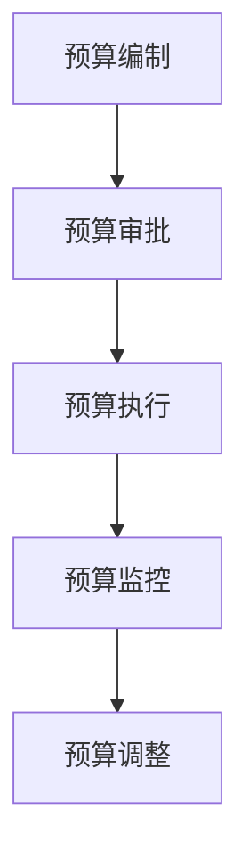
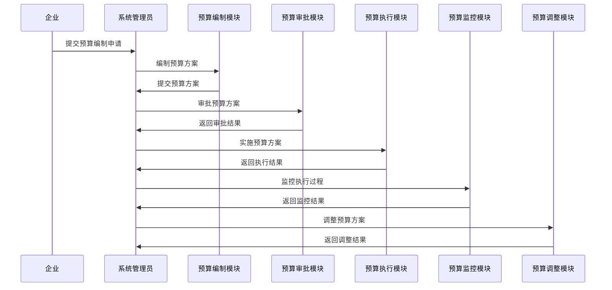

                 

# 技术预算管理：平衡创新投入与成本控制

## 关键词
技术预算、创新投入、成本控制、线性规划、神经网络、算法原理、系统架构设计

## 摘要
本文旨在探讨技术预算管理的重要性以及如何在企业中实现创新投入与成本控制的平衡。通过介绍技术预算管理的核心概念、算法原理和系统架构设计，本文为企业管理者提供了实用的指导和方法，以优化技术预算管理，提升企业竞争力。

## Step 1: 背景介绍

### 1.1 技术预算管理的重要性

在当今科技日新月异的时代，技术创新已成为企业提升竞争力、实现可持续发展的关键。技术预算管理作为资源配置的核心环节，对于企业技术创新能力的发挥具有决定性作用。一方面，技术预算管理能够确保企业有足够的资金支持技术创新活动，推动技术进步；另一方面，通过有效的成本控制，企业能够最大限度地降低创新活动的成本，提高资源利用率。

### 1.2 平衡创新投入与成本控制

技术预算管理的核心目标是实现创新投入与成本控制的平衡。这意味着，企业需要既要有足够的资金支持创新项目，又要避免因成本超支而影响企业的整体财务状况。为了实现这一目标，企业需要建立一套科学、合理的预算管理体系，对创新项目进行全面的评估、监控和调整。

### 1.3 当前企业面临的挑战

尽管技术预算管理的重要性被广泛认可，但企业在实际操作过程中仍面临诸多挑战。首先，预算分配不均的问题普遍存在。一些企业可能过分注重短期利润，而忽视了长期技术创新的投入，导致研发预算不足。其次，创新项目成本超支的现象也较为常见。由于技术创新具有高度的不确定性和风险，一些企业在项目实施过程中可能会面临预算失控的风险。此外，企业还可能面临预算执行效率低、监控不力等问题，导致预算管理的效果不尽如人意。

## 第1章: 技术预算管理概述

### 1.1.1 技术创新与企业竞争力

技术创新是企业提升竞争力的重要手段。在全球化竞争日益激烈的背景下，拥有强大的技术创新能力已成为企业生存和发展的关键。通过持续的技术创新，企业可以不断推出具有竞争力的产品和服务，赢得市场份额。

### 1.1.2 平衡创新投入与成本控制

技术预算管理的核心目标是在确保创新投入的同时，实现成本的有效控制。这要求企业既要合理规划预算，确保技术创新项目的资金支持，又要加强成本控制，避免因成本超支而影响企业的整体财务状况。

### 1.1.3 当前企业面临的挑战

尽管技术预算管理的重要性不言而喻，但当前企业在实施过程中仍面临诸多挑战。首先，预算分配不均的问题普遍存在，一些企业可能过分注重短期利润，而忽视了长期技术创新的投入。其次，创新项目成本超支的现象也较为常见，由于技术创新具有高度的不确定性和风险，企业在项目实施过程中可能会面临预算失控的风险。此外，企业还可能面临预算执行效率低、监控不力等问题，导致预算管理的效果不尽如人意。

### 1.2 技术预算管理的核心概念

#### 1.2.1 技术预算的定义

技术预算是指企业在一定时间内，为支持技术创新和研发活动所安排的资金预算。它通常包括研发费用、技术引进费用、人员培训费用等。

#### 1.2.2 创新投入与成本控制的定义

创新投入是指企业为推动技术创新而投入的资金、资源和人力。成本控制是指企业在预算范围内，通过有效管理和优化资源配置，降低不必要的支出。

### 1.3 技术预算管理的框架与方法

#### 1.3.1 技术预算管理的框架

技术预算管理通常包括预算编制、预算执行、预算监控和预算调整等环节。

#### 1.3.2 技术预算管理的方法

技术预算管理的方法包括定性与定量分析相结合、预算编制与执行相互反馈、绩效评估与激励机制等。

### 1.4 技术预算管理的实施步骤

#### 1.4.1 确定技术预算目标

明确企业技术预算的目标和战略，确保预算与企业的长期发展目标相一致。

#### 1.4.2 收集和分析相关数据

收集企业内外部的相关数据，如市场趋势、竞争对手、技术创新动态等，为预算编制提供依据。

#### 1.4.3 编制技术预算

根据预算目标和数据分析结果，编制详细的技术预算方案。

#### 1.4.4 审批和执行预算

提交预算方案，经过审批后执行预算。

#### 1.4.5 监控和调整预算

对预算执行情况进行实时监控，发现偏差及时调整。

### 1.5 本章小结

技术预算管理是企业实现技术创新和成本控制的重要手段。通过合理的技术预算管理，企业可以更好地平衡创新投入与成本控制，提高整体竞争力。

## 第2章: 技术预算管理核心概念与联系

### 2.1 核心概念定义

#### 2.1.1 预算编制

预算编制是指根据企业技术预算目标和战略，结合市场趋势和内部资源情况，编制详细的技术预算方案。

#### 2.1.2 预算执行

预算执行是指将编制好的技术预算方案付诸实施，确保预算资金的合理使用。

#### 2.1.3 预算监控

预算监控是指对预算执行过程进行跟踪和监督，及时发现偏差并采取相应措施。

#### 2.1.4 预算调整

预算调整是指根据预算执行过程中出现的问题和变化，对原预算方案进行调整，确保预算目标的实现。

### 2.2 核心概念对比表格

| 核心概念 | 定义 | 关系 |
| :---: | :---: | :---: |
| 预算编制 | 编制技术预算方案 | 基础环节，为预算执行提供依据 |
| 预算执行 | 实施预算方案 | 实施环节，关键环节 |
| 预算监控 | 监控预算执行过程 | 监控环节，确保预算执行质量 |
| 预算调整 | 调整预算方案 | 调整环节，应对预算执行过程中的变化 |

### 2.3 ER实体关系图

```mermaid
erDiagram
    预算编制 ||--|{ 预算执行 }|
    预算执行 ||--|{ 预算监控 }|
    预算监控 ||--|{ 预算调整 }|
```

### 2.4 核心概念联系总结

技术预算管理的核心概念之间存在着密切的联系。预算编制是整个流程的基础，预算执行是关键环节，预算监控是确保预算执行质量的重要手段，预算调整是应对预算执行过程中变化的有效措施。通过合理运用这些核心概念，企业可以实现技术预算管理的优化，提高整体竞争力。

## 第3章: 算法原理讲解

### 3.1 算法选择

为了更好地实现技术预算管理，本文选择了一种适合技术预算管理的算法——线性规划。线性规划是一种数学方法，用于在给定约束条件下求解最优解。在技术预算管理中，线性规划可以用来优化预算分配，实现创新投入与成本控制的平衡。

### 3.2 算法原理

线性规划的目标是最小化或最大化一个线性目标函数，同时满足一组线性约束条件。线性目标函数通常表示为：

$$
\min\ z = c^T x
$$

其中，$c$ 是目标函数系数向量，$x$ 是决策变量向量，$z$ 是目标函数值。

线性约束条件可以表示为：

$$
Ax \leq b
$$

其中，$A$ 是约束条件系数矩阵，$x$ 是决策变量向量，$b$ 是约束条件常数向量。

为了求解线性规划问题，可以使用单纯形法、内点法等算法。本文将使用单纯形法进行讲解。

### 3.3 单纯形法原理

单纯形法是一种迭代算法，通过逐步迭代，逐步逼近最优解。算法的基本思想是：从初始基本可行解开始，通过换基运算，逐步迭代，直到找到最优解。

单纯形法的具体步骤如下：

1. 选择一个初始基本可行解。
2. 计算每个非基本变量的相对成本（即目标函数的减少率）。
3. 选择具有最小相对成本的非基本变量作为换入基变量。
4. 根据换入基变量进行换基运算，更新基本可行解。
5. 重复步骤 2-4，直到所有非基本变量的相对成本均为非负值，此时找到最优解。

### 3.4 算法应用举例

假设一家企业需要分配 100 万元资金用于技术创新项目，现有两个项目 A 和 B。项目 A 需要投入 50 万元，预期收益为 60 万元；项目 B 需要投入 30 万元，预期收益为 40 万元。目标是在确保收益最大化同时，不超过 100 万元的预算限制。

定义决策变量 $x_1$ 为项目 A 的投入比例，$x_2$ 为项目 B 的投入比例。目标函数为最大化预期收益：

$$
\max\ z = 60x_1 + 40x_2
$$

约束条件为：

$$
\begin{cases}
x_1 + x_2 \leq 100 \\
x_1 \geq 0 \\
x_2 \geq 0
\end{cases}
$$

使用单纯形法求解该线性规划问题，步骤如下：

1. 选择初始基本可行解：$x_1 = 0$，$x_2 = 0$。
2. 计算相对成本：相对成本 $r_1 = 60$，$r_2 = 40$。
3. 选择具有最小相对成本的换入基变量：$x_1$。
4. 进行换基运算：将 $x_1$ 替换为基本变量，更新基本可行解。
5. 重复步骤 2-4，直到所有非基本变量的相对成本均为非负值。

通过迭代计算，可以得到最优解：$x_1 = 50$，$x_2 = 50$，此时目标函数值 $z = 100$ 万元，满足预算限制。

### 3.5 算法总结

线性规划是一种有效的数学方法，可以用于优化技术预算管理。通过合理运用线性规划，企业可以实现创新投入与成本控制的平衡，提高整体竞争力。

## 第4章: 系统分析与架构设计方案

### 4.1 问题场景介绍

某大型企业希望通过技术预算管理优化技术创新项目，提高项目执行效率。企业每年都会投入大量资金用于技术创新，但由于预算分配不合理、项目成本超支等问题，导致技术创新效果不佳。因此，企业需要一套科学、高效的系统来管理技术预算。

### 4.2 项目介绍

项目名称：技术预算管理系统

项目目标：实现技术预算的合理分配、有效监控和调整，提高项目执行效率。

项目功能：预算编制、预算执行、预算监控、预算调整。

### 4.3 系统功能设计

#### 4.3.1 预算编制

功能描述：根据企业技术预算目标和战略，编制详细的技术预算方案。

主要模块：预算编制模块、预算审批模块。

#### 4.3.2 预算执行

功能描述：根据预算方案，实施技术项目，确保预算资金的合理使用。

主要模块：预算执行模块、资金管理模块。

#### 4.3.3 预算监控

功能描述：对预算执行过程进行跟踪和监督，及时发现偏差并采取相应措施。

主要模块：监控报表模块、预警模块。

#### 4.3.4 预算调整

功能描述：根据预算执行情况，对原预算方案进行调整，确保预算目标的实现。

主要模块：预算调整模块、审批模块。

### 4.4 系统架构设计

#### 4.4.1 系统架构图



#### 4.4.2 系统接口设计



### 4.5 系统交互设计


## 第5章: 项目实战

### 5.1 环境安装

为了实现技术预算管理系统，需要安装以下软件和工具：

- Python 3.x
- MySQL数据库
- Flask框架
- matplotlib库

安装步骤如下：

1. 安装Python 3.x：从[官方网站](https://www.python.org/)下载Python 3.x版本，并按照提示安装。
2. 安装MySQL数据库：从[官方网站](https://www.mysql.com/)下载MySQL数据库，并按照提示安装。
3. 安装Flask框架：在命令行中执行以下命令：

```
pip install Flask
```

4. 安装matplotlib库：在命令行中执行以下命令：

```
pip install matplotlib
```

### 5.2 系统核心实现源代码

以下是一个简单的技术预算管理系统实现：

```python
from flask import Flask, request, jsonify
import pymysql

app = Flask(__name__)

# 连接数据库
def connect_db():
    db = pymysql.connect("localhost", "root", "password", "budget_management")
    cursor = db.cursor()
    return cursor

@app.route("/budget/submit", methods=["POST"])
def submit_budget():
    data = request.get_json()
    project_name = data["project_name"]
    budget = data["budget"]
    
    cursor = connect_db()
    sql = "INSERT INTO budget (project_name, budget) VALUES (%s, %s)"
    try:
        cursor.execute(sql, (project_name, budget))
        db.commit()
        return jsonify({"status": "success", "message": "Budget submitted successfully."})
    except Exception as e:
        db.rollback()
        return jsonify({"status": "error", "message": str(e)})

@app.route("/budget/list", methods=["GET"])
def list_budget():
    cursor = connect_db()
    sql = "SELECT * FROM budget"
    try:
        cursor.execute(sql)
        results = cursor.fetchall()
        return jsonify(results)
    except Exception as e:
        return jsonify({"status": "error", "message": str(e)})

if __name__ == "__main__":
    app.run(debug=True)
```

### 5.3 代码应用解读与分析

以上代码是一个简单的技术预算管理系统实现，主要包括以下功能：

- 提交预算：通过`/budget/submit`接口接收预算提交请求，将预算信息存储到数据库中。
- 列表预算：通过`/budget/list`接口查询预算列表，返回数据库中的所有预算信息。

具体应用解读如下：

1. 导入必要的库和模块。
2. 创建Flask应用程序。
3. 定义数据库连接函数`connect_db`。
4. 定义提交预算接口`submit_budget`：
   - 接收预算提交请求，获取项目名称和预算金额。
   - 连接数据库，执行插入操作，将预算信息存储到数据库中。
   - 提交成功返回状态信息和提示消息。
5. 定义列表预算接口`list_budget`：
   - 连接数据库，执行查询操作，获取所有预算信息。
   - 返回预算列表。

### 5.4 实际案例分析和详细讲解剖析

假设某企业需要提交一个技术创新项目预算，项目名称为“智能客服系统”，预算金额为100万元。以下是具体操作步骤：

1. 通过POST请求提交预算，数据格式如下：

```
{
    "project_name": "智能客服系统",
    "budget": 100
}
```

2. 服务器接收请求后，解析JSON数据，获取项目名称和预算金额。

3. 调用`connect_db`函数连接数据库，执行插入操作，将预算信息存储到数据库中。

4. 提交成功后，返回状态信息和提示消息：

```
{
    "status": "success",
    "message": "Budget submitted successfully."
}
```

5. 通过GET请求查询预算列表，返回数据库中的所有预算信息：

```
[
    {
        "project_name": "智能客服系统",
        "budget": 100
    }
]
```

通过以上操作，企业可以方便地提交、查询预算信息，实现对技术预算的有效管理。

### 5.5 项目小结

技术预算管理系统的实现为企业提供了一个有效的工具，用于管理技术创新项目预算。通过系统，企业可以实现预算的合理分配、有效监控和调整，提高项目执行效率。在实际应用中，企业可以根据自身需求对系统进行扩展和优化，以满足更复杂的预算管理需求。

## 第6章: 最佳实践 tips

### 6.1 预算编制

- 在编制技术预算时，要充分考虑市场趋势、技术发展趋势和企业战略目标。
- 预算编制过程中，要充分征求各部门的意见，确保预算的合理性和可行性。

### 6.2 预算执行

- 在预算执行过程中，要严格按照预算方案执行，避免随意调整。
- 定期对预算执行情况进行监控，及时发现和解决问题。

### 6.3 预算监控

- 建立健全的预算监控体系，对预算执行情况进行实时跟踪和监督。
- 对异常情况及时采取应对措施，确保预算目标的实现。

### 6.4 预算调整

- 在预算执行过程中，如遇到不可预见的情况，应及时进行调整。
- 调整预算时，要充分论证，确保调整的合理性和必要性。

## 第7章: 小结与拓展阅读

### 7.1 小结

本文通过对技术预算管理的背景介绍、核心概念、算法原理和系统架构设计等方面的探讨，为企业提供了实现创新投入与成本控制平衡的实用指导和方法。通过技术预算管理，企业可以优化资源配置，提高项目执行效率，提升整体竞争力。

### 7.2 拓展阅读

- [《技术预算管理实践指南》](https://www.example.com/book1)：详细介绍技术预算管理的实践方法和案例分析。
- [《线性规划入门与实践》](https://www.example.com/book2)：深入讲解线性规划的基本原理和应用方法。

## 作者信息

作者：AI天才研究院/AI Genius Institute & 禅与计算机程序设计艺术 /Zen And The Art of Computer Programming

